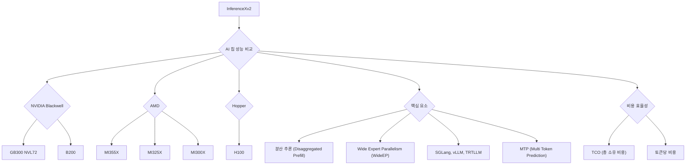

nvidia blackwell<mark>, AMD, Hopper 등 최신 AI 칩들의 실제 성능과 비용 효율성을 심층 비교 분석한 자료입니다.</mark> LLM 추론 시 고려해야 할 핵심 요소들을 명확히 제시하고, 어떤 칩과 기술 조합이 특정 워크로드에 가장 적합한지 구체적인 데이터를 통해 알려줍니다. AI 인프라 구축 및 최적화에 대한 실질적인 인사이트를 얻고 싶은 분이라면 반드시 확인해야 할 정보입니다.
## 1. InferenceX v2: NVIDIA Blackwell vs AMD vs Hopper - 이전 InferenceMAX 
<mark>InferenceXv2는 최신 AI 칩(</mark>nvidia blackwell<mark>, AMD, Hopper)의 LLM 추론 성능과 비용 효율성을 비교 분석하며, 특히 분산 추론 및 </mark>wide expert parallelism<mark>의 중요성을 강조한다.</mark>

### 1.1. 서론 
1. **InferenceXv2의 목표** 
  1. InferenceMAXv1의 AI 추론 성능 및 경제성 벤치마크를 기반으로 한다. 
  2. 수백 개의 칩과 인기 있는 오픈소스 프레임워크를 통해 지속적인 테스트를 실행하여 정적 벤치마크를 넘어선다. 
  3. 대규모 DeepSeek MoE 분산 추론(disagg Prefill)과 Wide Expert Parallelism(wideEP) 최적화를 포함하도록 범위를 확장한다. 
  4. NVIDIA의 지난 4년간 6개 GPU SKU와 AMD의 지난 3년간 모든 GPU SKU를 포함하여 총 1000개에 가까운 GPU를 활용한다. 
  5. Blackwell Ultra GB300 NVL72 및 B300의 전체 파레토 프론티어 곡선을 벤치마킹하고, MI355X의 disagg+wideEP 멀티 노드 FP4 및 FP8 성능을 테스트하는 최초의 서드파티 벤치마크이다. 
  6. 향후 InferenceX는 OpenAI, Anthropic, xAI, Google Deepmind 등 선도적인 AI 연구소에서 배포하는 분산 서빙 및 Wide Expert Parallelism에 중점을 둘 예정이다. 
2. **벤치마크의 신뢰성 및 접근성** 
  1. Google Cloud, Microsoft Azure, Oracle, OpenAI 등 주요 구매자들이 벤치마크를 널리 재현, 검증 및/또는 지원했다. 
  2. 벤치마크는 Apache 2.0 라이선스 하에 완전히 오픈소스이며, AI 소프트웨어 생태계의 빠른 발전에 맞춰 신속하게 움직일 수 있다. 
  3. ML 커뮤니티가 전체 데이터셋을 직접 탐색할 수 있는 무료 데이터 시각화 도구(https://inferencex.com)를 제공한다. 
3. **향후 계획** 
  1. DeepSeekv4 및 기타 인기 있는 중국 선도 모델을 Day 0 지원으로 추가할 예정이다. 
  2. 올해 말 TPUv7 Ironwood 및 Trainium3를 InferenceX에 추가할 예정이다. 

## 2. 주요 관찰 및 결과 
nvidia blackwell<mark>은 분산 추론 및 에너지 효율성에서 압도적인 성능을 보이며, AMD는 </mark>fp8<mark> 단일 노드에서 경쟁력이 있지만, 복합 최적화(</mark>fp4<mark>, 분산 추론, WideEP)에서는 NVIDIA에 뒤처진다.</mark>
1. **AMD와 NVIDIA의 성능 비교** 
  1. FP8 MI355X disagg+wideEP SGLang은 AMD에서 NVIDIA의 B200 disagg+wideEP SGLang과 경쟁력 있는 성능/TCO를 보인다. 
  2. 그러나 널리 사용되는 Dynamo TRTLLM B200 FP8과 비교하면 TRT가 여전히 우세하다. 
  3. AMD SGLang Disagg Prefill+wideEP for FP8이 NVIDIA의 SGLang 성능과 일치할 수 있다는 것은 고무적인 소식이다. 
  4. 단일 노드 집계 서빙의 경우, AMD의 SGLang이 FP8에서 NVIDIA의 SGLang보다 더 나은 성능/TCO를 제공한다. 
  5. 최신 추론 기술(disagg Prefill+wideEP+FP4)에서는 NVIDIA B200, B300 및 랙 스케일 GB200/GB300 NVL72가 SGLang 및 TRTLLM 모두에서 압도적인 성능을 보인다. 
  6. NVIDIA GPU는 모든 워크로드에서 토큰당 에너지 소비가 훨씬 낮아 에너지 효율성 면에서도 우위를 점한다. 
2. **AMD의 소프트웨어 문제점: 복합성(****Composability****)** 
  1. AMD 시스템 및 소프트웨어 추론의 가장 큰 문제는 복합성이다. 
  2. AMD의 많은 추론 최적화 구현은 개별적으로는 잘 작동하지만, 다른 최적화와 결합하면 예상만큼 경쟁력이 없다. 
  3. 특히 disagg Prefill, wideEP, FP4 추론 최적화의 복합성 개선이 시급하다. 
  4. AMD는 FP4+분산 추론의 소프트웨어 복합성에 집중해야 한다. 
3. **NVIDIA Blackwell****의 압도적인 성능** 
  1. NVIDIA GB300 NVL72는 H100 disagg+wideEP+MTP 기준 FP8 대비 FP4에서 최대 100배, FP8 대비 FP8에서 65배의 성능을 달성한다. 
  2. H100 대비 GB200 NVL72는 75 tok/s/user에서 최대 55배의 성능 차이를 보인다. 
  3. 랙 스케일 Blackwell NVL72는 Hopper를 압도한다. 
  4. GTC 2024에서 Jensen은 Blackwell이 H100 대비 최대 30배의 추론 성능을 제공할 것이라고 주장했지만, 실제로는 그 이상을 달성하여 약속보다 더 나은 성능을 제공했다. 

## 3. 기술 개념 입문 
<mark>LLM 추론의 핵심은 처리량과 상호작용성 간의 균형이며, 이를 최적화하기 위해 </mark>prefill<mark>/</mark>decode<mark> 분리 및 다양한 병렬화 전략이 사용된다.</mark>

### 3.1. 상호작용성 vs 처리량 트레이드오프 
1. **기본 트레이드오프** 
  1. LLM 추론의 근본적인 트레이드오프는 처리량(Throughput)과 지연 시간(Latency)이다. 
  2. 상호작용성(tok/s/user)은 시스템의 각 사용자가 토큰을 받는 속도를 나타내며, 출력 토큰당 시간(TPOT)의 역수이다. 
  3. 처리량(tok/s)은 시스템이 모든 사용자에 걸쳐 생성할 수 있는 총 토큰 수를 나타낸다. 
  4. 요청을 일괄 처리(batching)하면 총 처리량을 높일 수 있지만, 각 요청에 할당되는 FLOPs가 줄어들어 완료 속도가 느려진다. 
2. **비유 및 적용** 
  1. 지하철 버스(많은 승객, 잦은 정차, 비용 분산)와 경주용 자동차(소수 승객, 빠른 이동, 높은 비용)의 비유와 같다. 
  2. LLM 추론에는 만능 해결책이 없으며, 사용 사례에 따라 필요한 상호작용성과 처리량 수준이 달라진다. 
  3. 실시간 음성 모델은 매우 낮은 지연 시간을 요구하는 반면, 기본 QA 챗봇은 더 높은 지연 시간을 허용할 수 있다. 
  4. 벤치마크 결과는 다양한 상호작용성/지연 시간 수준에서의 처리량을 분석하는 것이 중요하다. 
3. **비용/성능 vs 상호작용성 곡선** 
  1. 비용/성능(TCO) vs 상호작용성/종단 간 지연 시간 곡선은 처리량 vs 상호작용성/종단 간 지연 시간 곡선을 따른다. 
  2. 시간당 더 많은 토큰을 생성하면 고정 비용이 더 많은 토큰에 분산되어 토큰당 비용이 낮아진다. 

### 3.2. Prefill 및 Decode 단계 
1. **Prefill**** 단계** 
  1. 추론의 첫 번째 단계로, 요청의 첫 번째 포워드 패스에서 발생한다. 
  2. 요청의 모든 토큰이 병렬로 처리되므로 계산 집약적이다. 
  3. 시퀀스의 KV 캐시를 "채우는" 역할을 한다. 
2. **Decode**** 단계** 
  1. Prefill 후, 응답이 한 번에 하나의 토큰씩 생성(디코딩)된다. 
  2. 각 포워드 패스는 시퀀스의 전체 KV 캐시를 HBM에서 로드하고, 단일 토큰에 대한 계산만 수행하므로 메모리(대역폭) 집약적이다. 
3. **성능 저하 문제** 
  1. Prefill과 Decode가 동일한 엔진에서 수행될 때, Prefill은 Decode 배치를 지속적으로 방해하여 전반적인 성능을 저하시킨다. 

### 3.3. 분산 Prefill (Disaggregated Prefill) 
1. **개념** 
  1. Prefill과 Decode 단계를 별도의 GPU 풀 또는 클러스터에 분리하여 수행하는 방식이다. 
2. **장점** 
  1. Prefill 및 Decode 풀을 독립적으로 튜닝하고 워크로드 요구 사항에 맞춰 확장할 수 있다. 

### 3.4. Tensor Parallel, Expert Parallel, Data Parallel (TP, EP, DP) 
1. **Tensor Parallel (TP)** 
  1. 작은 배치 크기에서 최대 상호작용성을 허용하지만, 모든 레이어에서 all-reduce를 수행해야 한다. 
2. **Expert Parallel (EP)** 
  1. MoE(Mixture of Experts) 희소성을 활용하여 전문가를 분할한다. 
  2. 단점은 MoE 레이어에서 all-to-all 통신(all-reduce보다 비용이 많이 든다)이 수행되며, 작은 배치에서 불균형이 발생할 수 있다는 것이다. 
3. **Data Parallel (DP)** 
  1. 전체 모델(또는 모델의 일부)을 여러 GPU 그룹(랭크)에 복제한 다음, 랭크 간에 요청의 부하를 분산한다. 
  2. 확장이 가장 간단하지만, 가중치 로딩을 반복하여 대규모에서 낭비가 발생할 수 있다. 

## 4. 시간 경과에 따른 개선 사항 추적 
<mark>InferenceX는 소프트웨어 업데이트에 따른 성능 개선을 지속적으로 추적하며, AMD는 DeepSeek R1 </mark>fp4<mark>에서 상당한 개선을 보였지만, NVIDIA는 이미 최적화된 Hopper와 Blackwell에서 꾸준한 성능 향상을 유지하고 있다.</mark>
1. **InferenceX의 목표** 
  1. InferenceX의 주요 목표 중 하나는 시간 경과에 따른 성능 개선을 시각화하는 것이다. 
  2. 새로운 칩은 연간 단위로 출시되지만, 소프트웨어는 주간 단위로 출시되므로, 최신 소프트웨어 개선 사항으로 레시피를 지속적으로 업데이트하고 구성을 벤치마킹하는 것이 목표이다. 
2. **AMD DeepSeek R1 성능 개선** 
  1. AMD 팀은 SGLang DeepSeek R1 FP4의 모든 구성에서 성능을 크게 향상시켰다. 
  2. 2개월도 안 되는 기간 동안 동일한 상호작용성에서 처리량을 거의 두 배로 늘렸다. 
  3. AMD는 포크된 SGLang 이미지의 성능 향상 변경 사항을 공식 SGLang 이미지로 업스트림하도록 추진되었다. 
  4. 2025년 12월부터 2026년 1월까지 AMD의 소프트웨어는 최대 2배의 성능 향상을 보였다. 
  5. AMD는 vLLM 및 SGLang 유지 관리자에게 컴퓨팅 및 코드 기여를 늘리고, AMD PR 검토 프로세스를 가속화하기 위해 더 많은 검토자를 확보해야 한다. 
3. **NVIDIA DeepSeek R1 성능 개선** 
  1. NVIDIA의 결과는 더 일관적이었으며, 비슷한 기간 동안 B200 SGLang에서 약간의 개선이 있었다. 
  2. H200 TRT 단일 노드와 같은 성숙한 SKU는 최소한의 개선을 보였다. 
  3. Hopper 지원은 Day 1부터 우수했으며, 이 워크로드에 대한 성능은 이론적 최고치에 근접하여 점진적인 성능 향상을 달성하기 어려웠다. 
  4. GB200 Dynamo TRT-LLM disagg도 상당한 개선을 보였으며, 한 달여 만에 최대 처리량이 20% 증가했다. 
  5. B200 SGLang은 초기 출시 이후 FP4 및 FP8 시나리오 모두에서 꾸준히 개선되었으며, 일부 상호작용성 수준에서는 GPU당 처리량이 두 배로 증가했다. 
4. **AMD MI300X, MI325X, ****MI355X**** 개선** 
  1. MI300X 및 MI325X는 주로 최신 SGLang 릴리스에서 일부 개선을 보였다. 
  2. InferenceX 역사 대부분 동안 AMD는 업스트림되지 않은 "프라이빗" ROCm 이미지를 사용했으므로, 2026년 1월 이전 실행 결과는 최근 결과와 직접 비교할 수 없다. 
  3. MI355X 분산 추론 서빙의 경우, AMD는 MoRI와 함께 SGLang 사용을 권장한다. 
  4. MoRI는 AMD의 MoE 디스패치/결합 집합 및 KV 캐시 전송 라이브러리로, RCCL/NCCL의 교훈을 바탕으로 처음부터 구축되었다. 
  5. MoRI 사용은 한 달여 만에 GPU당 처리량이 20-45 tok/s/user 상호작용성 범위에서 20% 이상 증가하는 등 좋은 속도 향상을 가져왔다. 

## 5. GPT-OSS 120B 성능 
<mark>AMD MI300X 및 MI325X는 </mark>vllm<mark> 업스트림 이미지 전환으로 소폭 개선되었지만, </mark>mi355x<mark>는 여전히 최적화 부족으로 어려움을 겪고 있다. 반면 NVIDIA Hopper와 Blackwell은 </mark>vllm<mark> 및 TRT-LLM 업데이트로 꾸준한 성능 향상을 보였다.</mark>
1. **AMD MI300X 및 MI325X 성능** 
  1. MI300X 및 MI325X는 전반적으로 미미한 개선을 보였다. 
  2. 일부 AITER 최적화는 MI300X 성능을 향상시켰고, 업스트림 vLLM ROCm 이미지로 전환하면서 개선이 이루어졌다. 
2. **AMD ****MI355X****의 문제점** 
  1. MI325X의 경우, 이전 ROCm 포크 이미지에 있던 모든 성능 향상 기능이 공식 vLLM ROCm 이미지에 반영되지 않은 것으로 보인다. 
  2. MI355X는 여전히 vLLM 0.10.1 빌드의 포크를 사용하며, 현재 공식 이미지(0.15.1)는 MI355X에 최적화되지 않아 하드 오류가 발생한다. 
  3. vLLM 0.16.0 버전에서 MI355X 성능 개선에 필요한 모든 변경 사항이 제공될 것으로 예상된다. 
3. **NVIDIA Hopper 및 Blackwell 성능** 
  1. Hopper와 Blackwell 모두 vLLM 0.11.2와 0.13.0 사이에서 꾸준한 성능 향상을 보였다. 
  2. 최신 vLLM 버전으로 업데이트하면 더 큰 성능 향상이 기대된다. 
  3. TRT-LLM 1.2.0 버전에서도 성능 향상이 관찰되었다. 

## 6. 분산 추론 프레임워크 
<mark>NVIDIA는 </mark>dynamo<mark>를 통해 TRT LLM 및 </mark>sglang<mark> 백엔드를 지원하며 분산 추론을 구현하고, AMD는 </mark>sglang<mark>과 함께 </mark>mori<mark> 및 Mooncake를 사용하여 KV 캐시 전송을 관리한다.</mark>
1. **NVIDIA의 분산 추론 프레임워크: ****Dynamo** 
  1. NVIDIA는 분산 추론 설정에 Dynamo를 사용한다. 
  2. Dynamo는 멀티 노드 분산 추론을 위해 설계된 추론 프레임워크로, Prefill-Decode 분리, 요청 라우팅, KV 캐시 오프로딩 등의 기술을 특징으로 한다. 
  3. Dynamo는 추론 엔진에 구애받지 않아 SGLang 및 TRT LLM을 백엔드로 사용할 수 있다. 
2. **AMD의 분산 추론 프레임워크: ****SGLang**** (****MoRI****, Mooncake)** 
  1. AMD의 경우, SGLang과 두 가지 KV 캐시 전송 프레임워크인 MoRI 및 Mooncake를 사용한다. 
  2. MoRI는 RDMA 및 GPU 통합에 중점을 둔 고성능 통신 인터페이스로, 네트워크 집합 연산 및 전문가 병렬 커널과 같은 애플리케이션을 제공한다. 
  3. 최근 PyTorch 생태계에 합류한 Mooncake는 Prefill-Decode 분리 및 여러 내결함성 멀티 노드 기능을 지원한다. 

## 7. DeepSeek Disagg + WideEP 결과 심층 분석 
<mark>분산 추론(Disagg)은 대부분의 상호작용성 수준에서 집계 추론보다 우수하며, NVIDIA </mark>b200<mark>/G</mark>b200<mark>은 </mark>fp8<mark>에서 지속적인 개선을 보이고 TRT-LLM과 NVL72를 통해 압도적인 성능과 비용 효율성을 제공한다. 반면 AMD </mark>mi355x<mark>는 </mark>fp8<mark>에서 경쟁력이 있지만, </mark>fp4<mark> 및 복합 최적화에서 성능이 저조하다.</mark>
1. **분산 추론의 우위** 
  1. 거의 모든 상호작용성 수준에서 분산 추론(disagg)은 GPU당 총 토큰 처리량 측면에서 집계 추론(회색 선)보다 우수하다. 
  2. 멀티 노드 분산 Prefill은 단일 노드 집계 서빙을 압도한다. 
2. **NVIDIA의 지속적인 개선** 
  1. NVIDIA는 B200/GB200 FP8에 대한 새로운 업데이트를 지속적으로 추진하고 있다. 
  2. 이는 랙 스케일 추론 소프트웨어 및 WideEP 커널을 개선하기 위한 꾸준한 엔지니어링 노력을 나타낸다. 
  3. TensorRT LLM은 이미 TogetherAI 등 고급 제공업체에서 전 세계적으로 시간당 수십억 개의 토큰을 처리하며, GB200 NVL72 및 GB300 NVL72의 성능을 두 배 이상 향상시킨다. 
  4. MTP(Multi Token Prediction)는 이러한 결과를 더욱 향상시켜 칩의 잠재력을 최대한 활용한다. 
3. **AMD ****MI355X****의 분산 추론 문제점** 
  1. MI355X 분산 추론과 집계 추론을 비교할 때, 분산 추론은 낮은 상호작용성, 높은 배치 크기에서만 집계 추론을 능가한다. 
  2. 이는 FP4 전반에 걸쳐 사실이며, 최적화되지 않은 커널 때문일 가능성이 높다. 
  3. MI355X에서 disagg Prefill+wideEP를 FP4와 결합할 때 성능이 저조하다. 
  4. 이론적으로는 MI355X의 분산 추론이 단일 노드보다 훨씬 우수해야 하지만, 여러 SOTA 추론 최적화를 함께 구성할 때 ROCm 소프트웨어 스택의 커널 및 집합 최적화 부족으로 인해 높은 상호작용성 수준에서 실제 성능은 더 나쁘다. 
4. **NVL72의 비용 효율성** 
  1. NVL72 제품군의 더 큰 월드 사이즈에서 오는 이점은 비용 그래프에서도 분명하다. 
  2. 60 tok/s/user의 고정 상호작용성 수준에서 각 GB200 NVL GPU는 각 B200보다 거의 3배 많은 토큰/초를 생성한다. 
  3. 이 격차는 상호작용성이 증가함에 따라 줄어든다. 
  4. 130 tok/s/user에서는 GB200 NVL72가 거의 이점이 없으며, 백만 토큰당 비용 측면에서 더 비싸다. 
  5. 낮은 배치 크기에서는 추론 워크로드가 단일 HGX 노드의 NVLink 도메인(8개 GPU) 내에 맞을 정도로 작아져 GB200 NVL72의 더 큰 스케일 아웃 이점이 사라지기 시작한다. 

## 8. NVIDIA vs AMD 분산 Prefill 
fp8<mark> 분산 </mark>prefill<mark>에서 AMD </mark>mi355x<mark>는 NVIDIA </mark>b200<mark>과 경쟁력이 있지만, </mark>fp4<mark> 성능은 복합성 문제로 인해 크게 뒤처진다. NVIDIA </mark>b200<mark>은 </mark>dynamo<mark> TRT-LLM과 MTP를 통해 압도적인 성능을 보인다.</mark>
1. **FP8**** 분산 ****Prefill**** 성능 비교** 
  1. InferenceXv2 출시로 MI355X 분산 추론의 전체 파레토 프론티어를 처음으로 확인할 수 있다. 
  2. FP8 분산 Prefill에서 MI355X(MoRI SGLang)는 B200(Dynamo SGLang)과 상당히 경쟁력이 있다. 
  3. 두 구성 모두 Wide EP는 사용되지 않는다. 
  4. 처리량 대 상호작용성 파레토 프론티어의 양쪽 끝에서 MI355X는 B200에 약간 뒤처진다. 
  5. 그러나 MI355X disagg는 곡선 중간의 특정 상호작용성 수준에서 약간의 이점을 가진다. 
  6. B200과 MI355X 모두 MTP(Multi Token Prediction) 사용 시 성능 향상을 보이며, 동일한 상대적 성능 개선이 관찰된다. 
2. **출력 토큰 처리량 비교** 
  1. 출력(디코드) 토큰 처리량만 측정할 경우, 낮은 상호작용성 수준에서 B200이 MI355X보다 훨씬 높다. 
  2. 분산 추론 구성의 출력 토큰 처리량은 총 GPU 수가 아닌 디코드 GPU 수로 정규화된다. 
  3. B200이 디코드 작업을 더 빠르게 완료한다. 
3. **FP4**** 성능 및 복합성 문제** 
  1. MI355X는 FP8 분산 추론에서 경쟁력이 있지만, FP4 성능은 복합성 문제로 인해 저조하다. 
  2. AMD의 단일 노드 FP4 성능은 괜찮지만, AMD FP4 분산 Prefill을 NVIDIA와 비교하면 성능이 떨어진다. 
  3. MI355X(MoRI SGLang)는 MTP를 사용해도 B200(Dynamo SGLang)의 MTP 없는 성능을 간신히 이긴다. 
  4. Dynamo TRT-LLM을 도입하면 B200의 성능이 더욱 향상되어, MI355X는 MTP를 사용해도 B200의 Dynamo TRT-LLM 및 MTP 성능을 따라잡을 수 없다. 
  5. MI355X는 MTP를 사용해야만 B200(MTP 없음)과 성능을 맞출 수 있으며, 이는 약 60~120 tok/s/user의 상호작용성 범위에서만 가능하다. 
  6. Dynamo TRTLLM B200 분산 Prefill과 SGLang MoRI MI355 분산 Prefill을 비교하면, TRTLLM의 더 성숙한 분산 Prefill 구현으로 인해 AMD가 뒤처진다. 
4. **MI355X****(****MoRI**** ****SGLang****) 파레토 프론티어** 
  1. 아래 다이어그램은 MI355X(MoRI SGLang) 파레토 프론티어를 구성하는 다양한 병렬화 구성을 보여준다. 
  2. 현재 Wide EP는 어떤 지점에서도 사용되지 않는다. 

## 9. 추론 제공업체의 단위 경제 분석 
<mark>분산 추론 및 WideEP는 성능/TCO를 크게 향상시키며, 특히 GB300 및 G</mark>b200<mark> NVL72와 같은 대규모 스케일업 도메인이 GPU당 총 처리량에서 압도적이다. MTP는 높은 상호작용성에서 비용을 크게 절감하는 핵심 기술이다.</mark>
1. **OpenRouter 데이터 분석** 
  1. OpenRouter의 DeepSeek R1 0528 FP8 추론 제공업체 목록과 토큰당 비용 및 평균 상호작용성을 분석한다. 
  2. 중간 수준의 제공업체는 약 35 tok/s/user의 상호작용성으로 서비스를 제공한다. 
  3. InferenceX 데이터를 사용하여 35 tok/s/user 상호작용성 수준에서 백만 입력/출력 토큰당 비용을 보간할 수 있다. 
2. **벤치마크 데이터의 한계 및 활용** 
  1. InferenceX 벤치마크는 무작위 데이터를 사용하고 접두사 캐싱을 비활성화하므로 실제 추론을 완전히 대표하지는 않는다. 
  2. 즉, 성능/비용은 최소한 이 정도는 될 것이다. 
  3. 각 상호작용성 수준에서 모든 GPU에 대한 데이터 포인트가 있는 것은 아니지만, 아래 막대 차트 비교는 합리적인 보간이다. 
3. **분산 추론 및 WideEP의 효과** 
  1. 35 tok/s/user 상호작용성 수준에서 disagg+wideEP 구성은 성능/TCO 및 전반적인 처리량 측면에서 매우 효과적이다. 
  2. GB300 및 GB200 NVL72와 같은 대규모 스케일업 도메인은 GPU당 총 처리량에서 압도적인 우위를 보인다. 
  3. 8k1k 워크로드 유형에서 B200은 MTP가 활성화될 때 최고의 성능/TCO를 달성할 수 있다. 
  4. 각 GPU의 총 소유 비용(TCO)도 고려된다. 
4. **LLM 서빙의 단위 경제학 심층 분석** 
  1. OpenRouter 데이터에 따르면 Crusoe는 36 tok/sec/user에서 백만 입력 토큰당 $1.35, 백만 출력 토큰당 $5.40로 서비스를 제공한다. 
  2. H200과 SOTA 추론 기술(MTP, disagg, wide EP)을 사용한다고 가정하면, Crusoe는 백만 입력 토큰당 $0.226, 백만 출력 토큰당 $2.955 이하의 비용을 발생시켜 입력 토큰에서 최대 83%, 출력 토큰에서 45%의 총 마진을 얻을 수 있다. 
  3. 이러한 계산은 가동 중단 시간이나 활용도 부족을 고려하지 않지만, InferenceX 데이터로 할 수 있는 분석의 아이디어를 제공한다. 
5. **높은 상호작용성에서의 MTP 중요성** 
  1. Nebius AI Studio(Fast)는 DeepSeek FP4를 167 tok/sec/user에서 백만 입력 토큰당 $2, 백만 출력 토큰당 $6로 제공한다. 
  2. 이처럼 높은 상호작용성에서는 추론을 경제적으로 만들기 위해 MTP와 같은 추측 디코딩 기술을 사용하는 것이 필수적이다. 
  3. MTP는 전체 모델 정확도에 상대적으로 낮은 위험으로 처리량을 증가시킬 수 있다. 
4. MTP는 DeepSeek R1 FP4 Dynamo TRT에서 백만 토큰당 비용을 $0.251에서 $0.057로 크게 절감할 수 있다. 
5. 125 tok/s/user의 FP8 DeepSeek 워크로드에서도 MTP는 경제적 타당성을 크게 향상시킨다. 
6. 높은 상호작용성 범위에서 가장 저렴한 구성은 모두 MTP를 사용한다. 

## 10. NVIDIA 분산 Prefill 및 WideEP 
<mark>NVIDIA의 Wide EP는 NVLink 도메인을 활용하여 MoE 모델의 통신 및 가중치 로딩 효율성을 극대화하며, </mark>prefill<mark>/</mark>decode<mark> 분리는 각 단계의 특성에 맞춰 최적화하여 전반적인 성능과 활용도를 향상시킨다.</mark>
1. **Wide Expert Parallelism**** (WideEP)의 통신 요구사항** 
  1. EP는 모든 GPU가 다른 모든 GPU로 토큰을 보내야 하는 all-to-all 통신을 필요로 하며, 이는 매우 높은 대역폭을 요구한다. 
  2. NVIDIA 서버는 두 가지 별도의 네트워킹 도메인을 가진다. 
  1. **NVLink 도메인 (NVL72 랙 내):** 72개 GPU가 NVLink를 통해 연결되며, GPU당 900GB/s의 단방향 대역폭을 제공한다. 이는 InfiniBand/이더넷 기반 스케일아웃 네트워크보다 약 7-10배 빠르다. 
  2. **InfiniBand/RoCEv2 이더넷 (NVL72 랙 외부):** 일반적으로 GPU당 400-800 Gbit/s의 단방향 대역폭(50-100 GB/s)을 제공한다. 
  3. TP는 모든 레이어의 가중치 행렬을 GPU에 분할하므로, 모든 토큰은 모든 레이어에서 최대 두 번의 all-reduce 통신을 필요로 한다. 
  4. EP는 MoE 레이어에서만 all-to-all 통신을 수행하며, 각 GPU는 각 전문가에게 라우팅된 토큰만 보내므로 TP보다 모든 레이어에서 통신 비용이 저렴하다. 
  5. EP의 all-to-all 통신 대역폭 요구 사항은 참여자 수에 따라 확장되므로, 느린 IB/Eth 패브릭을 거치기 전에 고대역폭 NVLink 도메인 내에 머무르는 것이 좋다. 
  6. NVL72를 사용하면 NVLink를 벗어나지 않고 72개 GPU에 걸쳐 EP가 가능하며, 이전 세대(8개 GPU NVLink 도메인)는 느린 IB/Eth 네트워크에 도달하기 전에 8개 GPU에 걸쳐 EP만 가능했다. 
2. **Wide EP의 가중치 로딩 효율성** 
  1. Wide EP는 가중치 로딩 효율성에서 큰 이점을 가진다. 
  2. DeepSeek R1과 같은 모델의 경우, 디코드는 메모리 대역폭에 의해 제한된다. 
  3. Wide EP(예: DEP32)를 사용하면 32개 GPU가 670B 가중치를 한 번에 공동으로 로드하며, 각 GPU는 자체 샤드(~21B)만 로드한다. 
  4. 32개 칩의 총 HBM 대역폭이 모델의 단일 복사본을 로드하는 데 적용된다. 
  5. 반면, 좁은 EP와 더 많은 DP 복제본(예: 5xDEP8)을 사용하면 5개의 각 복제본이 670B 가중치의 자체 전체 복사본을 필요로 하여 시스템 전체에서 5×670B = 3.35T의 중복 가중치 로딩이 발생한다. 
  6. EP는 칩 간에 가중치를 분산하고, DP는 가중치를 복제한다. 
  7. 이것이 NVLink와 같은 고대역폭 인터커넥트에 의해 가능해진 Wide EP가 GPU당 훨씬 더 나은 처리량을 제공하는 이유이다. 
3. **TP와 EP의 트레이드오프** 
  1. 일반적으로 TP는 부하 분산으로 인해 낮은 동시성에서 선호된다. 
  2. 작은 배치 크기에서 EP는 불균형한 토큰-전문가 라우팅으로 인해 일부 GPU가 활용되지 않고 다른 GPU는 과부하되는 문제가 발생한다. 
  3. TP는 모든 GPU가 모든 전문가의 슬라이스를 보유하고 항상 동일한 작업량을 얻으므로 이를 피한다. 
  4. 낮은 동시성에서는 이러한 부하 불균형 비용이 TP의 추가 통신 오버헤드를 능가한다. 
  5. 높은 동시성에서는 이러한 트레이드오프가 바뀐다. 
  6. 전문가 활성화가 더 큰 배치 크기에 걸쳐 더 고르게 분산되고, EP의 통신 및 가중치 로딩 이점이 TP의 비싼 레이어당 all-reduce보다 우세하다. 
  7. 곡선 중간에서는 하이브리드 TP+EP 구성이 부하 분산을 위해 각 전문가 내에서 작은 TP 그룹을 사용하고, 더 넓은 GPU 세트에 걸쳐 EP를 사용하여 가중치를 분산하고 통신을 줄여 두 가지 문제를 모두 해결한다. 
4. **높은 상호작용성에서의 성능** 
  1. 높은 상호작용성 수준(낮은 배치 크기)에서는 대규모 스케일업 월드 사이즈가 더 강력한 성능을 제공하지 않는 경향이 있다. 
  2. B300 disagg over IB는 GB300 with NVL72와 동일한 성능을 가지는데, 이는 워크로드가 대역폭 제한이 아닌 지연 시간 제한이기 때문이다. 
  3. NVL72의 엄청난 NVLink 대역폭 이점은 훨씬 느린 IB 링크조차도 작은 토큰 배치로 포화되지 않기 때문에 중요하지 않다. 
5. **Prefill****/****Decode**** 분리의 역할** 
  1. Prefill/Decode 분리도 중요한 역할을 한다. 
  2. Prefill은 계산 집약적이고 버스트성이며, Decode는 메모리 대역폭 제한적이고 안정적이다. 
  3. 동일한 GPU를 공유하면 서로 간섭하여 지연 시간 지터와 용량 낭비를 초래한다. 
  4. 전용 GPU 풀로 분리하면 각 단계가 특성에 맞는 워크로드를 실행하여 효과적인 활용도를 향상시킨다. 
  5. 이것이 분산 B200 구성이 처리량-상호작용성 곡선 중간에서 단일 노드 B200보다 우수한 성능을 보이는 이유이다. 
  6. PD 분리와 더 많은 GPU에 걸친 Wide EP는 단일 8-GPU 노드에 두 단계를 모두 밀어 넣는 것보다 가중치를 더 효율적으로 분산한다. 

## 11. Jensen의 약속 미달 및 초과 달성 - Hopper vs Blackwell vs Rack Scale NVL72 
nvidia blackwell<mark>은 GTC 2024에서 Jensen이 약속한 것보다 훨씬 뛰어난 성능을 제공하며, 특히 랙 스케일 NVL72 아키텍처는 Hopper 대비 최대 100배의 성능 향상과 8배의 대역폭/TCO 이점을 제공하여 토큰당 비용을 크게 절감한다.</mark>
1. **Jensen의 Blackwell 성능 약속 및 실제 결과** 
  1. GTC 2024에서 Jensen은 H100 대비 GB200 NVL72에서 최대 30배의 성능 향상을 약속했지만, 많은 사람들은 이를 마케팅 과장으로 여겼다. 
  2. 그러나 거의 2년 후, Blackwell은 약속보다 훨씬 뛰어난 성능을 제공하는 것으로 나타났다. 
  3. 테스트 결과, Blackwell은 대규모 MoE 추론에서 강력한 H100 disagg+wideEP FP8 기준 대비 GB200 NVL72 FP4에서 최대 98배, GB300 NVL72 FP4에서 최대 100배 더 나은 성능을 제공한다. 
  4. 이는 Jensen이 약속한 것의 두 배를 토큰 처리량 측면에서 제공한다는 새로운 "Jensen Math" 규칙을 시사한다. 
  5. "더 많이 지출할수록 더 많이 절약된다"는 말이 사실로 입증되었다. 
2. **Blackwell의 비용 효율성** 
  1. Blackwell 및 Blackwell Ultra의 총 소유 비용(TCO) 증가를 고려하더라도, Hopper 대비 토큰당 비용에서 9.7배(40 tok/s/user)에서 최대 65배(116 tok/s/user)의 개선을 보인다. 
  2. Blackwell의 성능은 Hopper에 비해 너무 뛰어나서 대시보드에 로그 스케일을 적용해야 했다. 
3. **랙 스케일 NVL72 아키텍처의 이점** 
  1. B300 서버는 최대 8개 GPU를 900GByte/s/GPU NVLink 스케일업 네트워크로 연결하는 반면, GB300 NVL72 서버는 72개 GPU를 NVLink 스케일업 네트워크로 연결한다. 
  2. 8개 이상의 GPU가 필요한 추론 설정에서는 여러 B300 서버 노드를 사용해야 하므로 통신이 800Gbit/s(단방향)의 대역폭을 가진 InfiniBand XDR 스케일아웃 네트워크로 전환된다. 
  3. 랙 스케일 GB300 NVL72는 GPU당 900GByte/s(단방향)의 대역폭을 제공하는 NVLink를 통해 72개 GPU를 연결하여, 여러 B300 서버 노드보다 9배 이상 높은 대역폭으로 GPU 간 통신을 가능하게 한다. 
  4. GB300 NVL72의 GPU당 총 비용은 더 높지만, 대역폭/TCO 이점은 여전히 8배 더 빠르다. 
  5. 랙 스케일 아키텍처의 대역폭 이점은 토큰당 비용을 직접적으로 크게 낮춘다. 
  6. Google TPU, AWS Trainium, NVIDIA만이 현재 랙 스케일 시스템 설계를 배포하고 있다. 
  7. AMD의 첫 랙 스케일 MI455X UALoE72 시스템은 2026년 하반기에 엔지니어링 샘플 및 소량 생산이 시작될 예정이며, 대량 생산 및 첫 생산 토큰은 2027년 2분기에나 생성될 예정이다. 
4. **Blackwell Ultra 성능** 
  1. Blackwell Ultra는 이론적으로 Blackwell과 동일한 메모리 대역폭, 동일한 FP8 성능, 1.5배 높은 FP4 성능을 가진다. 
  2. 그러나 측정 결과 FP8에서 최대 1.5배 더 나은 성능을 보였지만, FP4에서는 1.1배 더 나은 성능만 보였다. 
  3. 이는 Blackwell Ultra가 새로 출시된 GPU로, 소프트웨어가 아직 완전히 최적화되지 않았기 때문일 수 있다. 

## 12. MI355X vs MI325X vs MI300X 
<mark>AMD </mark>mi355x<mark>는 MI300X 대비 최대 10배의 성능 향상을 보이며, 특히 DeepSeek </mark>sglang<mark> 분산 추론에서 MI325X보다 3배 저렴한 비용과 4배 높은 처리량을 제공한다.</mark>
1. **AMD SKU 성능 비교** 
  1. AMD SKU에서 MI355X는 MI300X 대비 최대 10배 더 나은 성능을 보인다. 
  2. AMD는 현재까지 MI355X에서만 DeepSeek SGLang 분산 추론을 작동시켰으며, MI300X 또는 MI325X 분산 추론 결과는 제출하지 않았다. 
2. **비용 효율성 비교** 
  1. DeepSeekR1 FP8에서 24 tok/s/user의 상호작용성에서 MI355X는 MI325X보다 약 3배 저렴한 비용으로 추론을 제공한다. 
  2. 각 GPU의 처리량은 MI325X의 약 4배이다. 

## 13. AMD FP4, 분산 추론 및 Wide Expert Parallelism의 복합성 문제 
<mark>AMD는 단일 노드 </mark>fp4<mark> 및 </mark>fp8<mark> 분산 추론에서 경쟁력이 있지만, </mark>fp4<mark>, 분산 추론, Wide EP를 함께 사용하는 복합 최적화에서는 NVIDIA에 크게 뒤처진다. 이는 AMD 소프트웨어 스택의 초점 부족과 잘못된 우선순위 설정 때문이다.</mark>
1. **AMD 소프트웨어 스택의 문제점** 
  1. AMD는 단일 노드 FP4에서 어느 정도 괜찮은 성능을 보이고, FP8 분산 추론에서는 B200 SGLang과 경쟁력이 있다. 
  2. 그러나 현재 AMD 오픈소스 추론 스택의 문제는 개별 추론 최적화는 잘 작동하지만, 실제 고객은 여러 최적화를 함께 사용한다는 점이다. 
  3. 최고 수준의 AI 연구소는 FP4와 분산 추론, Wide Expert Parallelism을 동시에 사용하며, 여기서 문제가 발생한다. 
2. **이론과 현실의 격차** 
  1. SemiAnalysis 및 AMD의 이론적 모델링에 따르면, FP4, 분산 추론, Wide Expert Parallelism은 MI355X 단일 노드 추론보다 더 나은 성능을 보여야 한다. 
  2. 그러나 소프트웨어는 AMD GPU의 엄청난 병목 현상으로 남아있다. 
3. **AMD 경영진에 대한 권고** 
  1. AMD 경영진은 엔지니어링 인력의 자원 할당을 계속해서 개선해야 한다. 
  2. 예를 들어, 아무도 사용하지 않는 ATOM과 같은 단일 노드 프로젝트에서 엔지니어링 자원을 재할당하여 분산 추론, Wide Expert Parallelism, FP4 간의 추론 최적화 복합성 문제를 해결해야 한다. 
  3. 현재의 저조한 소프트웨어는 업계의 현황에 대한 초점 부족과 잘못된 우선순위 설정 때문이다. 
  4. 모든 최고 수준의 연구소는 이미 분산 추론과 Wide Expert Parallelism을 사용하고 있으므로, AMD는 단일 노드에 대한 초점을 멈추고 오픈소스 솔루션을 위한 멀티 노드 추론에 집중적으로 투자해야 한다. 
4. **NVIDIA와의 격차** 
  1. NVIDIA와 SGLang 팀이 6개월 전에 DeepSeek에서 NVFP4 성능을 선보인 것으로 볼 때, AMD는 오픈소스 분산 추론, Wide Expert Parallelism, FP4 복합성에서 6개월 이상 뒤처져 있다. 

## 14. AMD ATOM 엔진 
<mark>AMD의 ATOM 엔진은 단일 노드 성능은 약간 개선되었지만, NVMe/CPU KVCache 오프로딩, Wide EP, 분산 서빙 등 핵심 기능이 부족하여 실제 워크로드에는 사용할 수 없다. AMD는 </mark>vllm<mark> 및 </mark>sglang<mark>과 같은 오픈소스 프로젝트에 대한 지원과 코드 기여를 늘려야 한다.</mark>
1. **ATOM 엔진의 한계** 
  1. AMD는 새로운 추론 엔진인 ATOM을 출시했다. 
  2. ATOM은 단일 노드 성능을 약간 향상시킬 수 있지만, 실제 워크로드에 사용할 수 없는 많은 기능이 부족하다. 
  3. 예를 들어, NVMe 또는 CPU KVCache 오프로딩, 도구 파싱, Wide Expert Parallelism, 분산 서빙을 지원하지 않는다. 
  4. 이로 인해 현재 ATOM을 프로덕션에서 사용하는 고객은 없다. 
  5. NVIDIA의 TRTLLM이 TogetherAI 등에서 전 세계적으로 시간당 수십억 개의 토큰을 생성하고 도구 파싱 및 기타 기능을 지원하는 것과 달리, ATOM은 이러한 기능 부족으로 인해 현재 토큰 팩토리에서 사용되지 않는다. 
2. **오픈소스 커뮤니티의 불만** 
  1. vLLM과 같은 오픈소스 추론 엔진 유지 관리자들은 AMD가 제공하는 엔지니어링 및 GPU 리소스 부족에 실망하고 있다. 
  2. vLLM의 리드 유지 관리자인 Simon Mo는 GitHub RFC에서 vLLM CI에 추가할 수 있는 작동하는 MI355X가 여전히 없다고 언급하며, 이는 사용자 경험 저하로 이어진다. 
  3. 현재 vLLM에는 MI355X 테스트가 전혀 없지만, NVIDIA B200은 많은 vLLM 테스트를 가지고 있다. 
  4. 마찬가지로, vLLM에는 여전히 충분한 MI300X CI 머신이 없다. 
  5. 업스트림 vLLM은 CUDA와 동일한 수준의 유용성에 도달하려면 최소 20대의 MI300, 20대의 MI325, 20대의 MI355X 머신이 더 필요하다. 
3. **SemiAnalysis의 노력 및 AMD의 개선 필요성** 
  1. SemiAnalysis는 AMD가 vLLM에 더 많은 컴퓨팅 자원을 기여하도록 노력했으며, 몇 주 내에 일부 성공을 거두었다. 
  2. vLLM은 MI355X 머신을 확보하여 CI 테스트 패리티를 0%에서 0% 이상으로 끌어올릴 것이다. 
  3. AMD의 이전 vLLM, SGLang, PyTorch CI 머신 상황 및 Anush가 이를 어떻게 해결하기 시작했는지에 대한 내용은 곧 출시될 "State of AMD" 기사에서 다룰 예정이다. 
  4. SemiAnalysis는 AMD 및 NVIDIA가 vLLM, SGLang, PyTorch, JAX에서 실행하는 테스트 수와 품질을 추적하는 내부 대시보드를 가질 것이다. 
  5. vLLM 유지 관리자들은 머신 리소스 부족 문제로 인해 ROCm에 대한 Day 0 vLLM 지원을 할 수 없다고 말한다. 
  6. 이러한 시장 출시 시간의 큰 격차는 ROCm이 뒤처지게 하고, NVIDIA가 75%의 높은 총 마진(원가 대비 4배 마크업)을 계속 부과할 수 있는 큰 기회를 제공한다. 
  7. AMD는 "기능 셰퍼딩 및 코드 소유권을 통해 지속적인 업스트림 참여를 보여준" 커미터가 충분하지 않고, 자체 코드를 검토할 수 있는 검토자가 부족하다. 
  8. 이것이 ROCm vLLM의 개발 속도가 CUDA vLLM보다 훨씬 느린 이유이다. 
  9. AMD 경영진은 ATOM에서 일하는 재능 있는 엔지니어들을 vLLM 및 SGLang과 같이 사람들이 실제로 사용하는 라이브러리 및 프레임워크에 재배치하는 것을 고려해야 한다. 
  10. AMD는 단일 노드 FP4 최적화에 과도하게 집중하는 대신, FP4, WideEP, 분산 서빙의 복합성 문제를 해결하는 것을 우선시해야 한다. 

## 15. Multi Token Prediction (MTP) 
<mark>MTP는 별도의 드래프트 모델 없이 보조 예측 헤드를 사용하여 여러 토큰을 미리 제안함으로써 추측 디코딩과 유사한 이점을 제공하며, 모든 SKU에서 성능 향상과 상당한 비용 절감을 가져오지만, MoE 모델에서는 메모리 트래픽으로 인해 이점이 줄어들 수 있다.</mark>
1. **추측 디코딩의 원리** 
  1. 추측 디코딩은 작고 저렴한 드래프트 모델을 사용하여 여러 토큰을 미리 제안함으로써 자동 회귀 생성 비용을 줄인다. 
  2. 대규모 모델은 단일 포워드 패스에서 제안된 토큰을 확인하며, 이는 Prefill 계산과 유사하다. 
  3. 입력 시퀀스 길이가 주어지면, 입력에 N개의 토큰이 더 있을 때 단일 포워드 패스는 대략 동일한 시간이 걸릴 수 있다. 
  4. 추측 디코딩은 이 속성을 사용하여 작은 모델에서 추론을 실행하여 메인 모델이 단일 포워드 패스로 확인할 여러 토큰을 초안으로 작성하고, 비슷한 시간 예산 내에서 최대 N개의 추가 토큰을 생성한다. 
2. **MoE 모델에서의 MTP 고려사항** 
  1. 이 가정(동일한 시간 예산으로 추가 토큰 생성)은 밀집 모델에서 가장 강력하다. 
  2. MoE 모델의 경우, 다른 토큰이 다른 전문가에게 라우팅될 수 있으므로, 여러 드래프트 토큰을 확인하면 단일 토큰 디코딩보다 더 많은 전문가를 활성화하고 추가 전문가 가중치를 메모리에서 가져와야 할 수 있다. 
  3. EAGLE 논문의 Mixtral 8x7B Instruct 모델 결과에서 볼 수 있듯이, 이 추가 메모리 트래픽은 대역폭 절감 효과를 약화시키고 확인을 표준 디코딩 단계와 비슷하게 만들 수 있다. 
3. **Multi Token Prediction (MTP)의 특징** 
  1. MTP는 별도의 드래프트 모델 없이 유사한 이점을 추구한다. 
  2. 모델 아키텍처에 보조 예측 헤드를 추가하여 단일 모델이 동일한 기본 표현에서 여러 미래 토큰을 제안할 수 있도록 한다. 
  3. 이는 제안이 궁극적으로 점수를 매기는 동일한 모델에서 나오기 때문에 분포 정렬을 개선한다. 
  4. MTP는 추가 모델을 서빙하는 운영 복잡성을 피하면서도 멀티 토큰 생성 전략을 가능하게 하지만, MTP 헤드가 메인 모델과 함께 사전 훈련되어야 한다. 
4. **MTP의 성능 및 비용 절감 효과** 
  1. 모든 SKU에서 MTP를 활성화하면 성능 향상이 발생한다. 
  2. 일반적으로 사용되지 않는 로짓을 활용하여 추가 토큰을 확인함으로써 최소한의 컴퓨팅 오버헤드가 추가되어 디코드 중 비싼 가중치 로딩을 절약한다. 
  3. 비용 측면에서 MTP는 엄청난 비용 절감을 가져올 수 있다. 
  4. DeepSeek-R1-0528을 FP4 Dynamo TRT로 실행할 때 백만 총 토큰당 $0.251의 비용이 들지만, MTP를 활성화하면 백만 총 토큰당 $0.057로 비용을 크게 낮출 수 있다. 
  5. 모든 구성에서 다른 모든 조건이 동일할 때, DeepSeek R1과 함께 MTP를 사용하면 모델 정확도에 큰 영향을 미치지 않으면서 상호작용성을 증가시킨다. 
  6. 이는 DeepSeek V3 기술 보고서 결과와 일치한다. 
5. **MTP 성능 수치의 유효성** 
  1. 합성 데이터셋의 분포가 실제 데이터와 다를 수 있다는 주장이 있을 수 있다. 
  2. 그러나 MTBench와 1k1k 벤치마크 간의 MTP 수용 동작을 비교하면 매우 유사한 분포를 보여 InferenceX 벤치마크가 실제 프로덕션 성능의 좋은 대리자임을 확인한다. 
  3. InferenceX는 완벽하지 않으며 항상 개선을 추구한다. 

## 16. 정확도 평가 
<mark>InferenceX는 처리량 최적화가 정확도에 미치는 영향을 평가하기 위해 GSM8k 벤치마크를 사용하며, 향후 더 어려운 벤치마크로 확장할 계획이다. 또한, </mark>fp8<mark>이 </mark>fp4<mark>보다 약간 더 높은 평가 점수를 보이며, 양자화와 같은 성능-정확도 트레이드오프를 고려한다.</mark>
1. **정확도 평가의 중요성** 
  1. 처리량 최적화는 때때로 공격적인 수용률 완화, 디코딩 조정, 수치적으로 불안정한 커널 또는 엔드포인트 오설정을 통해 정확도를 조용히 희생할 수 있다. 
  2. 평가 없이는 잘못 구성된 서버(잘림, 잘못된 디코딩, 잘못된 엔드포인트 매개변수)도 우수한 처리량 수치를 생성할 수 있지만, 쓸모없는 답변을 제공할 수 있다. 
  3. 이러한 추가 검사 계층은 GPT-OSS의 일부 DP 어텐션 구현에서 문제를 발견하는 데 도움이 되었다. 
2. **현재 및 향후 벤치마크 계획** 
  1. 각 대표적인 처리량 구성에는 이제 관련 수치 정확도 검사가 있다. 
  2. 현재는 GSM8k만 사용하고 있지만, 이는 매우 쉬운 벤치마크이므로 수치 계산의 차이로 인해 평가 점수가 크게 변하지 않을 수 있다. 
  3. 따라서 GPQA, HLE, MATH-500, SWE-Bench verified와 같은 더 어려운 벤치마크로 확장할 계획이다. 
3. **성능-정확도 트레이드오프: 양자화** 
  1. 또 다른 형태의 성능-정확도 트레이드오프는 양자화이다. 
  2. 낮은 정밀도로 모델을 서빙하면 모델 출력이 더 나빠질 수 있다. 
  3. DeepSeek R1의 경우, FP8 실행이 FP4보다 평가 점수가 아주 약간 더 높다. 
  4. GSM8k 평가는 포화 상태이며, QAT/PAT 동안 일반적으로 인기 있는 GSM8k, MATH-500 등에 맞춰 보정되므로, 때로는 평가가 좋은 결과를 보여도 실제 최종 사용자 평가는 저조할 수 있다. 

## 17. Anthropic Fast Mode 추론 설명 
<mark>Anthropic의 "Fast Mode"는 새로운 하드웨어 없이 LLM 추론의 처리량-지연 시간 트레이드오프를 활용하여, 동일한 모델 품질을 2.5배 빠르게 제공하지만 6-12배 더 높은 비용을 발생시킨다. MTP와 같은 추론 최적화 기술은 이러한 높은 상호작용성에서 비용을 크게 절감할 수 있다.</mark>
1. **Anthropic Fast Mode의 본질** 
  1. Anthropic은 Opus 4.6과 함께 "Fast Mode"를 출시했다. 
  2. 이는 동일한 모델 품질을 약 2.5배 빠른 속도로 제공하지만, 약 6-12배 더 높은 가격을 요구한다. 
  3. 이러한 수치는 놀랍게 보일 수 있으며, 일부 사용자는 새로운 하드웨어가 필요하다고 추측했지만, 그렇지 않다. 
  4. 이는 LLM 추론의 근본적인 처리량-지연 시간 트레이드오프의 자연스러운 결과이다. 
  5. 어떤 모델이든 광범위한 상호작용성 수준(사용자당 토큰/초)에서 서비스될 수 있으며, 이에 따라 백만 토큰당 비용(CPMT)이 달라진다. 
  6. 높은 배치 크기에서는 GPU 활용도가 높아지고 총 토큰 처리량이 증가하여 더 많은 사용자를 동시에 서비스하고 토큰당 비용이 낮아진다. 
  7. 낮은 배치 크기에서는 각 사용자에게 더 빠른 응답이 제공되지만, 총 토큰 처리량이 감소한다. 
  8. 가속기의 시간당 비용은 사용 방식에 관계없이 고정되어 있으므로, 낮은 처리량은 비용을 분산할 토큰이 적다는 것을 의미하며, 따라서 토큰당 가격이 높아진다. 
  9. 요컨대, Fast Mode는 반드시 하드웨어 이야기가 아니라, 동일한 GPU에서 처리량을 지연 시간과 교환하는 자연스러운 결과이다. 
2. **Fast Mode의 경제적 관점** 
  1. 회계 담당자는 Fast Mode가 더 비싸다고 생각할 수 있지만, 총 소유 비용(TCO) 관점에서 보면 일부 상황에서는 Fast Mode가 훨씬 저렴하다. 
  2. 예를 들어, GB200 NVL72 랙은 330만 달러가 들 수 있으며, Claude 코드 에이전트 루프(Trainium에서 실행)가 NVL72 랙을 호출하고 이 랙이 추론을 2.5배 느리게 실행한다면, 추론을 제공하기 위해 2.5배 더 많은 랙이 필요하여 Fast Mode를 활성화하지 않으면 500만 달러에 가까운 추가 지출이 발생한다. 
  3. DeepSeek R1 0528 FP4 코딩 워크플로우를 B200에서 TRT-LLM으로 서비스하는 경우를 고려해보자. 
  4. 50 tok/sec/user의 상호작용성에서 추론 비용은 백만 출력 토큰당 약 $0.56이다. 
  5. 125 tok/sec/user의 상호작용성에서는 백만 출력 토큰당 약 $4로 증가하며, 이는 2.5배의 속도 증가에 약 7배의 가격 증가를 의미하며, Anthropic의 Fast Mode와 매우 유사하다. 
3. **추론 최적화 기술의 역할 (MTP)** 
  1. 추측 디코딩과 같은 추론 최적화 기술은 새로운 칩 없이도 추론 비용을 직접적으로 절감할 수 있다. 
  2. DeepSeek R1 FP4 8k/1k 워크로드의 예를 들어보자. 
  3. 150 tok/sec/user의 상호작용성 수준에서 기본 GB300 Dynamo TRT의 백만 토큰당 비용은 약 $2.35이지만, MTP를 활성화하면 백만 토큰당 약 $0.11로 가격이 감소한다. 
  4. 이는 이 상호작용성 수준에서 추론 최적화 기술을 사용함으로써 약 21배의 가격 절감을 의미한다. 
  5. 50 tok/sec/user의 상호작용성 수준을 고정하면, MTP가 다양한 칩에서 CPMT를 얼마나 효과적으로 감소시킬 수 있는지 확인할 수 있다. 

## 18. Wide Expert Parallelism (WideEP) 및 분산 Prefill 
<mark>Wide EP는 MoE 모델의 전문가 가중치를 여러 GPU에 분산하여 HBM 효율성, 컴퓨팅 활용도, 메모리 대역폭을 향상시키고, 분산 </mark>prefill<mark>은 </mark>prefill<mark>과 </mark>decode<mark> 단계를 분리하여 각 단계의 독립적인 최적화와 스케일링을 가능하게 한다. 이 두 기술은 함께 사용되어 다양한 상호작용성 수준에서 최적의 성능을 달성한다.</mark>

### 18.1. WideEP 
1. **MoE 모델 아키텍처 및 Expert Parallelism (EP)** 
  1. 대부분의 선도적인 AI 연구소는 밀집 모델 대신 MoE(Mixture of Experts) 모델 아키텍처를 사용한다. 
  2. MoE 아키텍처에서는 각 토큰에 대해 "전문가"의 하위 집합만 활성화된다. 
  3. DeepSeek R1은 총 671B 매개변수를 가지지만, 활성 매개변수는 37B에 불과하다. 
  4. DeepSeek R1은 256개의 라우팅된 전문가(및 1개의 공유 전문가)를 가지며, 각 토큰은 8개의 고유한 전문가에게 라우팅된다. 
  5. 이 아키텍처는 전문가 가중치를 여러 GPU에 고르게 분산하는 EP에 적합하다. 
2. **TP와 EP의 비교 (단일 8-GPU 서버 기준)** 
  1. **Tensor Parallelism (TP):** 
  1. 모든 가중치 행렬을 모든 GPU에 분할하는 단순한 접근 방식이다. 
  2. 밀집 모델에는 잘 작동하지만, MoE의 희소한 활성화 패턴을 무시한다. 
  3. TP=8에서는 각 전문가의 가중치가 8개 GPU에 분할되어, 각 전문가 활성화는 모든 GPU에 걸쳐 all-reduce를 필요로 하며, GEMM의 감소 차원이 작아 산술 강도가 낮아진다. 
  4. TP는 각 전문가를 밀집 레이어처럼 취급하여 모델의 희소성을 활용하지 못하고 전체 GPU 간 통신 비용을 지불한다. 
  2. **Expert Parallelism (EP):** 
  1. 전체 전문가를 개별 GPU에 할당하는 더 적합한 접근 방식이다. 
  2. EP=8에서는 레이어당 256개의 전문가를 8개 GPU에 분할하여 GPU당 32개의 전문가/레이어를 할당한다. 
  3. 각 GPU는 전문가 가중치의 약 1/8과 비전문가 가중치(어텐션 투영, 임베딩, 정규화, 공유 전문가)의 전체 복제본을 보유한다. 
  4. DeepSeek R1 매개변수의 90% 이상이 라우팅된 전문가 가중치이므로, EP는 대부분의 메모리 절약을 달성하며, 나머지 30B 미만의 비전문가 매개변수를 모든 8개 GPU에 복제하는 것은 비용 효율적이다. 
3. **EP의 포워드 패스** 
  1. 포워드 패스는 레이어당 두 단계로 진행된다. 
  2. **어텐션 단계:** 각 GPU는 독립적인 데이터 병렬 랭크로 작동하여 복제된 비전문가 가중치를 사용하여 자체 요청 하위 집합을 처리하며, GPU 간 통신은 필요 없다. 
  3. **MoE 단계:** 경량 라우터가 각 토큰이 필요한 전문가를 결정하고, 토큰은 all-to-all 통신을 통해 적절한 GPU로 디스패치된다. 
  4. 각 GPU는 자신에게 라우팅된 토큰에 대해서만 로컬 전문가를 실행하고, 결과는 두 번째 all-to-all 통신을 통해 반환된다. 
4. **Wide Expert Parallelism**** (WideEP)의 이점** 
  1. **확장 방식:** N개의 독립적인 EP8 인스턴스를 N개의 노드에 배포하는 방식(복제)은 처리량을 선형적으로 확장하지만, 각 GPU는 여전히 레이어당 32개의 전문가를 보유하며, 75%의 전문가 가중치는 HBM에 유휴 상태로 남아있다. 
  2. **WideEP 접근 방식:** WideEP는 독립적인 인스턴스를 복제하는 대신 노드 간에 EP를 확장한다. 
  3. 64-GPU 클러스터(8개 노드)에서 DP64/EP64는 GPU당 레이어당 256/64 = 4개의 전문가만 배치하며, 각 GPU는 여전히 비전문가 가중치의 전체 복제본을 보유한다. 
  4. MoE 단계에서는 모든 64개 DP 랭크의 토큰이 all-to-all 통신을 통해 라우팅된 전문가를 호스팅하는 GPU로 디스패치된다. 
  5. **세 가지 복합적인 이점:** 
  1. **HBM 효율성:** GPU당 전문가 발자국을 32개에서 4개로 줄여 KV 캐시를 위한 상당한 HBM을 확보하고, GPU당 배치 크기 용량을 직접적으로 증가시킨다. 
  2. **컴퓨팅 활용도:** 64개 DP 랭크가 GPU당 더 적은 전문가를 통해 토큰을 전달하여 토큰당 전문가 수를 늘리고, 산술 강도를 높여 컴퓨팅 활용도를 향상시킨다. 
  3. **메모리 대역폭:** 총 HBM 대역폭은 GPU 수에 따라 선형적으로 확장된다. 64개 GPU가 동시에 전문가 가중치를 로드하면 단일 노드보다 8배 많은 메모리 대역폭을 제공하여 메모리 병목 현상을 줄인다. 
5. **TP와 EP의 결합 (EP64/DP8/TP8)** 
  1. 위 구성은 DP+EP(DEP)만 사용하며, 각 GPU는 모든 비전문가 가중치의 전체 복제본을 보유한다. 
  2. GPU 수가 증가함에 따라 이 복제는 점점 더 낭비가 된다. 
  3. 64-GPU DP64/EP64 배포에서는 모든 GPU가 ~40B 비전문가 매개변수의 동일한 복사본을 저장한다. 
  4. GPU 그룹 내에 Tensor Parallelism을 추가하면 이 문제가 해결된다. 
  5. EP64/DP8/TP8 구성에서는 64개 GPU가 각각 8개 GPU로 구성된 8개 DP 그룹으로 조직된다. 
  6. 각 TP 그룹 내에서 어텐션 투영, 공유 전문가, 정규화, LM 헤드가 8개 방식으로 분할되어 각 GPU는 비전문가 가중치의 1/8만 보유한다. 
  7. 전체 클러스터에 걸쳐 256개의 전문가는 이전과 같이 GPU 4개당 하나씩 분산된다. 
  8. 순수 DEP는 단일 통신 패턴(전문가 라우팅을 위한 all-to-all)을 가지지만, TP를 추가하면 각 TP 그룹 내에서 어텐션 및 비전문가 계산을 위한 두 번째 all-reduce가 도입된다. 
  9. 핵심 설계 원칙은 고대역폭 인터커넥트를 제공하는 NVLink 또는 MNNVL이 있는 단일 노드 내에 TP 그룹을 배치하고, all-to-all 통신 패턴이 더 높은 지연 시간을 허용하는 노드 간에 EP/DP를 실행하는 것이다. 
  10. 트레이드오프는 처리량 대 지연 시간이다. 
  11. 그룹 내 TP=8은 해당 8개 GPU가 이제 배치를 공유하고 모든 디코드 단계에서 동기화해야 하므로, 효과적인 DP 정도가 64에서 8로 감소한다. 
  12. 그러나 각 DP 그룹은 이제 TP 그룹 내에서 matmul이 8개 방식으로 분할되므로 단계당 어텐션을 8배 빠르게 처리한다. 
  13. 토큰당 지연 시간은 감소하지만, 피크 동시성은 감소하여 순수 DEP 대비 지연 시간-처리량 파레토 프론티어를 따라 구성이 이동한다. 

### 18.2. 분산 Prefill 
1. **개념 및 단계별 특성** 
  1. 분산 Prefill(Prefill-Decode (PD) 분리라고도 함)은 LLM 추론의 Prefill 및 Decode 단계를 별도의 노드에서 수행하는 프로세스이다. 
  2. Prefill은 요청이 처음 처리될 때 발생하며, 모든 토큰에 대해 한 번에 포워드 패스가 계산되어 요청의 KV 캐시를 "미리 채운다". 
  3. 모든 토큰이 병렬로 포워드 패스를 통과하므로 계산 집약적인 작업이다. 
  4. 토큰은 한 번에 하나씩 생성(디코딩)되며, 각 디코드 단계에서 HBM에서 KV 캐시를 로드한다. 
  5. 이는 증가하는 KV 캐시가 지속적으로 로드되므로 메모리 집약적인 프로세스이다. 
2. **기존 방식의 문제점 및 분산 ****Prefill****의 해결책** 
  1. 전통적인 단일 노드 추론에서는 엔진이 동일한 GPU에서 Prefill과 Decode를 인터리브한다. 
  2. 들어오는 Prefill 요청은 진행 중인 Decode 배치를 지연시켜 첫 토큰까지의 시간과 토큰 간 지연 시간을 모두 증가시킨다. 
  3. 청크 Prefill은 긴 Prefill을 더 작은 조각으로 분할하여 이를 완화하지만, 근본적인 자원 경합은 남아있다. 
  4. 분산 Prefill은 이러한 문제를 완전히 제거한다. 
3. **독립적인 스케일링 및 최적화** 
  1. 분리된 노드를 통해 각 단계를 독립적으로 스케일링하고 최적화할 수 있다. 
  2. 다른 병렬화 전략, 다른 배치 크기, 다른 메모리 할당 비율을 사용할 수 있다. 
  3. Prefill 노드와 Decode 노드의 비율도 워크로드의 입력-출력 길이 비율에 맞춰 조정할 수 있다. 
  4. 예를 들어, Prefill 중심 워크로드(긴 입력, 짧은 출력)는 더 많은 Prefill 인스턴스를 할당하고, Decode 중심 워크로드(짧은 입력, 긴 출력)는 더 많은 Decode 인스턴스를 할당한다. 
  5. 높은 캐시 적중률을 가진 워크로드도 더 많은 Decode를 지향하는데, 이는 공유 시스템 프롬프트 또는 다중 턴 대화 기록에서 재사용된 KV 캐시 항목이 Prefill을 완전히 건너뛰기 때문이다. 
4. **KV 캐시 전송 비용 및 최적화** 
  1. 분리의 주요 비용은 KV 캐시 전송이다. 
  2. Prefill이 완료되면, 해당 요청의 전체 KV 캐시가 첫 번째 디코드 토큰이 생성되기 전에 Prefill 노드에서 Decode 노드로 전송되어야 한다. 
  3. DeepSeek R1과 같은 모델의 경우, 61개 레이어와 FP8 KV 캐시를 가진 8192-토큰 Prefill은 약 500MB의 KV 데이터를 생성하며, 이는 네트워크를 통해 전송되어 TTFT(Time-To-First-Token)에 직접 추가된다. 
  4. 이 전송은 RDMA(일반적으로 RoCE 또는 InfiniBand)를 통해 CPU 개입 없이 제로 카피 GPU-to-GPU 데이터 이동을 사용하여 수행된다. 
  5. NIXL(NVIDIA Inference Transfer Library)과 같은 라이브러리는 UCX, GPUDirect Storage 및 기타 전송을 위한 플러그형 백엔드를 통해 데이터 이동 계층을 통합된 비동기 API 뒤에 추상화한다. 
  6. 이는 추론 엔진을 특정 전송 프로토콜과 분리하고, Prefill 및 Decode 인스턴스가 다른 장치 유형이나 인터커넥트에 걸쳐 있을 수 있는 이기종 하드웨어 전반에 걸쳐 분리를 가능하게 한다. 

### 18.3. Wide EP + 분산 서빙으로 추론 최적화 
1. **단일 노드 구성의 병렬화 전략** 
  1. Wide EP와 분산 Prefill은 파레토 최적 성능을 달성하기 위해 함께 사용되는 별도의 기술이다. 
  2. 단일 노드 구성의 파레토 프론티어에서 어떤 병렬화 전략이 적합한지 이해하는 것이 도움이 된다. 
  3. DeepSeek R1 FP4 8k/1k를 TRT-LLM을 사용하는 단일 8-GPU B200 노드에서 실행하는 예를 들어보자. 
  4. 최적의 전략은 프론티어를 따라 이동함에 따라 변화하며, 주로 배치 크기와 전문가 활성화 밀도에 의해 결정된다. 
  5. **최고 상호작용성 수준 (배치 1-16):** 순수 TP가 EP를 포함하는 모든 구성보다 우수하다. 
  1. 낮은 배치 크기에서는 단계당 활성화되는 전문가의 비율이 작다. 
  2. EP를 사용하면 이러한 활성화가 GPU에 고르지 않게 분산된다. 
  3. TP는 모든 전문가를 모든 GPU에 분할하여 모든 GPU가 라우터가 선택하는 전문가에 관계없이 모든 전문가 계산에 동등하게 참여하므로 이를 피한다. 
  4. DeepSeek R1 프로파일링 결과, 배치 크기 16 이하에서는 레이어당 전문가 활성화가 매우 낮음을 확인했다. 
6. **약간 낮은 상호작용성 (배치 32 주변):** 배치 크기가 여전히 작아 전문가 가중치가 EP 대신 TP를 통해 분할된다. 
  1. 교차점은 배치 32 주변에서 발생하며, 이때 레이어당 약 50-60%의 전문가가 활성화된다. 
  2. 이 밀도에서는 EP의 부하 불균형이 허용 가능해지고, 토큰 라우팅 오버헤드가 TP의 전문가당 all-reduce보다 저렴해진다. 
  3. 이 범위의 구성은 TEP(어텐션에는 Tensor Parallelism, MoE 레이어에는 Expert Parallelism)를 사용한다. 
7. **최고 처리량, 최저 상호작용성 (배치 128+):** 배치 크기가 크고 구성이 전체 DEP로 전환된다. 
  1. 어텐션 가중치는 독립적인 데이터 병렬 랭크로 모든 GPU에 완전히 복제되고, 전문가는 EP를 통해 분산되며, 토큰당 지연 시간 비용으로 배치 용량이 최대화된다. 
8. **Wide EP와 분산 ****Prefill****의 결합** 
  1. Wide EP와 분산 Prefill을 확장할 때도 동일한 일반적인 패턴이 관찰된다. 
  2. Prefill과 Decode는 별도의 병렬화 전략과 노드 수로 실행되며, 워크로드와 목표 상호작용성 수준에 맞춰 조정된다. 
  3. **높은 처리량, 낮은 상호작용성 (****Prefill**** 중심 워크로드, 8k/1k):** Prefill이 병목 현상이다. 
  1. 이 영역의 레시피는 Decode보다 더 많은 Prefill 노드(4P1D, 7P2D, 4P3D)를 할당하여 높은 Prefill 처리량을 유지한다. 
  2. 이 Prefill 노드는 DEP 구성을 실행하여 어텐션 가중치를 독립적인 데이터 병렬 랭크에 복제하여 여러 긴 컨텍스트 Prefill을 동시에 처리할 수 있도록 한다. 
  3. Decode 노드는 더 적지만, 단일 노드와 동일한 원리로 큰 배치 크기로 Wide DEP를 실행한다. 
  4. **낮은 상호작용성 (****Decode**** 중심 워크로드):** 진행 중인 동시 요청이 적으므로 단일 Prefill 인스턴스가 들어오는 수요를 따라잡을 수 있다. 
  1. 각 요청은 여전히 1024개의 디코드 단계를 필요로 하며, 높은 상호작용성에서는 이러한 단계가 빨라야 한다. 
  2. 이 영역의 레시피는 Prefill보다 더 많은 Decode 노드(1P3D, 1P4D)로 전환하며, 각 Decode 인스턴스는 낮은 배치 크기에서 TEP를 실행한다. 
  3. 어텐션에 대한 Tensor Parallelism은 인스턴스의 모든 GPU에 걸쳐 계산을 분할하여 단계당 지연 시간을 최소화하고, Expert Parallelism은 EP 부하 균형이 충분한 중간 배치 크기에서 MoE 라우팅을 처리한다. 
  4. 더 적은 대규모 배치 인스턴스 대신 여러 개의 소규모 배치 디코드 인스턴스는 토큰당 지연 시간을 낮게 유지하면서도 충분한 동시 서빙 용량을 제공한다. 

## 19. DeepSeek R1 단일 노드 결과 심층 분석 
<mark>DeepSeek R1 </mark>fp8<mark> 단일 노드 시나리오에서 AMD </mark>mi355x<mark>는 NVIDIA </mark>b200<mark>과 경쟁력이 있으며, 특히 낮은 상호작용성에서 더 나은 처리량과 성능/TCO를 보인다. 그러나 </mark>fp4<mark>에서는 </mark>mi355x<mark>가 </mark>b200<mark>에 크게 뒤처지며, MI325X는 H200보다 훨씬 좁은 상호작용성 범위를 가진다.</mark>
1. **MI355X****와 ****B200****의 ****FP8**** 단일 노드 성능 비교** 
  1. DeepSeek R1 FP8 1k1k에서 MI355X는 단일 노드 시나리오에서 B200과 경쟁력이 있다. 
  2. MI355X(SGLang)는 낮은 상호작용성 수준에서 B200(SGLang)보다 처리량 성능이 더 좋다. 
  3. 또한, MI355X(SGLang)는 대부분의 경우 성능/TCO 관점에서 B200(TRT 및 SGLang)을 능가한다. 
  4. 그러나 2026년 현재 대부분의 선도적인 연구소와 추론 제공업체는 FP8 또는 단일 노드 추론을 실행하지 않는다. 
2. **AMD 소프트웨어의 중요성** 
  1. 이 결과는 AMD 칩이 소프트웨어 측면에서 더 빠르게 움직일 수 있다면 NVIDIA와 매우 경쟁력이 있을 수 있음을 보여준다. 
  2. 속도가 핵심 경쟁력이다. 
3. **MI355X****의 ****FP4**** 성능 문제** 
  1. MI355X는 FP4 성능에서 B200에 크게 뒤처진다. 
4. **H200과 MI325X의 ****FP8**** 성능 및 상호작용성 범위** 
  1. H200(SGLang)과 MI325X(SGLang) 간의 DeepSeek R1 FP8 성능은 InferenceXv1 초기 출시 이후 크게 변하지 않았다. 
  2. MI325X의 상호작용성 범위가 H200보다 상당히 작다는 점에 주목해야 한다. 
  3. H200은 30-90 tok/sec/user 범위인 반면, MI325X는 13-35 tok/sec/user 범위에 불과하다. 
  4. 이는 더 넓은 범위의 상호작용성에서 사용자에게 서비스를 제공하려는 제공업체에게 문제가 된다. 

## 20. GPT-OSS 120B 단일 노드 
<mark>NVIDIA </mark>b200<mark> 및 G</mark>b200<mark>은 </mark>mi355x<mark>를 포함한 모든 AMD 칩보다 뛰어난 처리량-상호작용성 곡선을 보이며, 특히 G</mark>b200<mark> NVL72는 대규모 스케일업 도메인 덕분에 GPU당 출력 토큰 처리량이 두 배 이상 증가하여 가장 비용 효율적인 선택이다.</mark>
1. **GPU 그룹별 성능 비교** 
  1. MI300X, MI325X, H200, H100은 처리량 대 상호작용성 플롯의 왼쪽 하단에 그룹화되어 전반적으로 유사한 트레이드오프를 나타내며, NVIDIA가 약간의 우위를 점한다. 
  2. 다음 단계는 MI355X로, 첫 번째 그룹에 비해 주어진 상호작용성 수준에서 GPU당 토큰 처리량이 2배 이상 높다. 
  3. MI355X 내에서 ATOM은 곡선을 낮은 상호작용성에서 더 높은 처리량으로 이동시켜, 사용자 응답성보다 피크 처리량을 우선시함을 시사한다. 
  4. 그 위에는 NVIDIA의 B200과 GB200이 있으며, 이는 MI355X를 능가한다. 
  5. B200과 GB200은 동일한 Blackwell 컴퓨팅 다이를 공유하지만, GB200은 플랫폼 및 서빙 스택이 대규모에서 비컴퓨팅 병목 현상(인터커넥트/토폴로지, CPU-GPU 결합, 런타임 스케줄링)을 줄여 효과적인 스케일아웃과 토큰당 오버헤드를 줄여 더 높은 처리량-상호작용성 곡선을 달성한다. 
2. **비용 효율성 비교** 
  1. 비용을 고려하면 MI355X는 높은 처리량에서 B200보다 경쟁력이 있다. 
  2. 그러나 GB200은 여전히 가장 저렴한 선택이다. 
3. **B200****과 G****B200**** NVL72 비교** 
  1. B200과 GB200 NVL72 간의 비교에서 NVL72의 영향은 분명하다. 
  2. GB200 NVL72의 더 큰 72개 GPU 스케일업 월드 사이즈와 B200의 8개 GPU 스케일업 월드 사이즈의 영향은 이전에 논의되었다. 
  3. GPU당 출력 토큰 처리량은 약 100 tok/s/user 상호작용성 범위에서 두 배 이상 증가하여 NVL72의 더 큰 스케일업 도메인의 영향을 보여준다. 

## 21. InferenceX 저장소 업데이트 
<mark>InferenceX는 벤치마크 이해 및 재현성을 높이기 위해 스윕 실행 방식을 변경하고 AI(Claude Code)를 적극 활용하여 개발 생산성을 극대화했다.</mark>

### 21.1. InferenceXv1 이후 주요 변경 사항 
1. **스윕 실행 방식 변경** 
  1. v1 이후 주요 변경 사항 중 하나는 스윕 수행 주기이다. 
  2. 이전에는 매일 밤 모든 구성을 완전히 스윕했지만, 더 많은 칩, 분산 Prefill, Wide EP 및 기타 기능을 추가하면서 매일 밤 실행하는 것이 너무 시간이 많이 걸리고 낭비적이라는 것을 깨달았다. 
  3. 벤치마크는 레시피가 변경되거나 새 소프트웨어 버전이 출시될 때만 다시 실행하면 된다. 
2. **새로운 스윕 트리거 방식** 
  1. 이제 저장소 루트의 변경 로그에 추가될 때 스윕이 트리거된다. 
  2. 개발자가 특정 구성에 성능 영향을 미치는 변경 사항을 만들면, 변경 로그에 해당 구성과 변경 사항에 대한 간략한 설명을 추가한다. 
  3. 모든 구성은 마스터 구성 YAML 파일에 정의되며, 이는 ISL/OSL, EP, TP, DP, MTP 등 핵심 설정을 포함하여 스윕할 모든 데이터 포인트의 상태 표현 역할을 한다. 
  4. 변경 로그 추가가 포함된 PR이 병합되면, 워크플로우는 참조된 구성 키를 파싱하고, 마스터 구성에서 해당 스윕 정의를 가져와 개별 GitHub Actions 작업으로 분산한다. 
  5. 작업은 전체 스윕에 대한 모든 데이터 포인트를 수집하고 결과를 아티팩트로 업로드한다. 

## 22. Claude Code AI 활용 
<mark>InferenceX 개발팀은 Claude Code AI를 적극적으로 활용하여 PR 검토, 스윕 실행, 새 이미지 레시피 검색 등 다양한 개발 작업을 자동화하고 생산성을 크게 향상시켰다.</mark>
1. **AI 활용의 중요성 인식** 
  1. InferenceX v1 출시 직후, AI를 InferenceX 개발에 더 많이 활용하지 않아 개발자 처리량이 얼마나 손실되고 있는지 깨달았다. 
  2. 이에 Claude Code를 적극적으로 활용하기 시작했으며, 현재 하루 6,000달러의 비용을 지출하고 있다. 
  3. 연간 300만 달러 상당의 Claude 지능을 흡수하는 목표에 기여할 인재를 모집하고 있다. 
2. **GitHub Copilot 경험** 
  1. 처음에는 GitHub Copilot 에이전트가 무료라는 사실에 놀랐지만, 곧 Copilot이 형편없다는 것을 깨달았고, GitHub가 무료로 제공하는 이유를 알게 되었다. 
3. **Claude Code 통합 및 활용 사례** 
  1. Claude Code는 출시 이후 로컬에서 사용되었지만, 최근 InferenceX 개발에 통합되었다. 
  2. PR 검토와 같은 일반적인 작업 외에도 클러스터에서 스윕을 수행하는 기능을 부여했다. 
  3. 설정된 워크플로우를 통해 Claude는 수동으로 실행을 시작하고, 결과를 확인하고, 반복할 수 있다. 
  4. 이를 통해 GitHub 앱을 통해 신속한 수정 사항을 쉽게 배포할 수 있게 되었다. 
  5. 또 다른 유용한 활용 사례는 Claude를 사용하여 새로운 vLLM/SGLang 이미지에 대한 레시피를 찾는 것이다. 
  6. 새 이미지가 출시될 때, 최적의 성능을 달성하기 위해 레시피를 업데이트해야 할 수 있다. 
  7. Claude Code 통합을 통해 이슈를 열고 Claude에게 이미지 변경 로그의 모든 커밋을 검색하여 레시피에 추가해야 할 변경 사항을 찾도록 요청할 수 있다. 
  8. 이는 매우 잘 작동하며, 완벽하지는 않지만 좋은 시작점을 제공한다. 

## 23. GitHub Actions 
<mark>InferenceX는 벤치마크 결과의 투명성과 재현성을 위해 GitHub Actions를 사용하지만, GitHub의 잦은 서비스 중단과 평균적인 개발자 경험은 대규모 작업 실행에 어려움을 초래한다. 그럼에도 불구하고 GitHub Actions 팀과의 협력을 통해 일부 개선이 이루어졌다.</mark>
1. **오픈소스 정신 및 문제점** 
  1. 오픈소스 정신에 따라 모든 실행은 GitHub Actions에서 이루어지므로 벤치마크 결과는 검증 가능하고 투명하며 재현 가능하다. 
  2. 그러나 최근 GitHub 서비스 중단은 목표 달성에 지속적인 장애물이 되고 있다. 
  3. 개발자들은 "유니콘"을 다른 어떤 동물보다 더 많이 보았다고 말한다. 
2. **GitHub Actions의 신뢰성 및 개발자 경험** 
  1. Microsoft/GitHub는 이 문제를 인지하고 있으며, 지난 90일 동안의 총 가동 시간 수치를 업데이트하는 것을 중단하고 97.36%라는 단일 9(90%대)로 떨어졌다. 
  2. 문제를 무시한다고 해서 사라지지 않는다. 
  3. 전반적으로 GitHub Actions는 그저 그렇다. 
  4. 개발자에게는 고통스러울 정도로 평범한 경험을 제공한다. 
  5. 수백 대의 GPU로 구성된 플릿에 걸쳐 수천 개의 작업을 실행하는 데는 적합하지 않다. 
3. **GitHub Actions 팀과의 협력** 
  1. 그럼에도 불구하고, InferenceX는 출시 이후 일부 GitHub Actions 엔지니어들과 긴밀히 협력하여 InferenceX의 요구 사항을 더 잘 충족시켰으며, 그들과 함께 일하는 것이 즐거웠다고 말할 수 있다. 
  2. 또한, 워크플로우 실행을 클릭할 때 작업의 지연 로딩을 구현해달라는 직접적인 요청이 있었고, 시간이 걸렸지만 결국 이 기능을 구현했다. 

## 24. InferenceX의 미래 
<mark>InferenceX는 코드베이스 리팩토링을 통해 확장성을 높이고 정확도 평가를 추가하는 등 지속적으로 개선되어 왔다. 앞으로는 실제 데이터셋, 에이전트 코딩 벤치마크, 더 많은 SOTA 추론 최적화 및 다양한 모델(TPU, Trainium 포함)을 추가하여 실제와 가장 유사한 추론 벤치마크를 제공하는 것을 목표로 한다.</mark>

### 24.1. InferenceXv1 이후 핵심 변경 사항 
1. **코드베이스 리팩토링 및 확장성 향상** 
  1. 2025년 10월 초기 출시 이후 InferenceX를 지속적으로 개선하기 위해 노력했다. 
  2. 출시 후 코드베이스를 리팩토링하여 확장성을 높였으며, 이제 새로운 모델과 추론 기술을 "플러그 앤 플레이" 방식으로 추가할 수 있다. 
2. **PD-disagg 벤치마크 및 정확도 평가 통합** 
  1. 이러한 변경 사항 덕분에 H100, H200, B200, B300, GB200, GB300, MI355X에 대한 PD-disagg 벤치마크를 원활하게 통합할 수 있었다. 
  2. 또한, 모든 구성에서 모델 성능 가시성을 확보하기 위해 기본 벤치마크 파이프라인에 정확도 평가를 추가했다. 

### 24.2. 향후 계획 
1. **"북극성" 목표 달성** 
  1. 출시 이후 많은 개선이 있었지만, 가능한 한 가장 실제와 유사한 추론 벤치마크를 제공한다는 "북극성" 목표를 달성하기 위해서는 아직 많은 작업이 남아있다. 
  2. 이 목표를 달성하기 위해 실제 데이터셋 벤치마킹, 에이전트 코딩 성능 벤치마크 추가, 더 많은 SOTA 추론 최적화 포함, 더 많은 모델 벤치마킹 등을 계획하고 있다. 
2. **멀티 턴 실제 채팅 및 에이전트 코딩 데이터셋으로 마이그레이션** 
  1. **현재 벤치마크의 한계:** InferenceX는 현재 완전히 무작위 토큰을 입력으로 사용하며, 접두사 캐싱을 비활성화한다. 
  1. 모든 무작위 데이터는 단일 턴이며, 이는 실제 프로덕션 추론 워크로드를 모방하는 실용적인 벤치마크 설정이 아니다. 
  2. **단기 계획:** 
  1. 가까운 시일 내에 allenai/WildChat-4.8M과 같은 데이터셋으로 기본 멀티 턴 벤치마크를 생성할 것이다. 
  2. 모든 시나리오에서 접두사 캐싱을 활성화하고, 프로덕션 워크로드에서 볼 수 있는 KV 캐시 CPU 오프로딩을 활성화할 것이다. 
  3. 이는 각 칩의 강점과 약점을 더 정확하게 평가할 것이다. 
  4. 예를 들어, MI355X는 B200보다 HBM3e 메모리가 더 많으므로 높은 동시성 멀티 턴 시나리오에서 더 나은 성능을 보일 것으로 예상된다. 
  5. 반면, GPU KV 캐시가 과부하되어 블록이 CPU로 오프로드되는 시나리오에서는 GB가 우수할 것으로 예상된다. 
  6. 현재 AMD의 CPU 오프로딩 소프트웨어는 좋지 않아 동일한 시나리오에서 성능에 부정적인 영향을 미칠 수 있다. 
  7. 실제 멀티 턴 데이터셋은 더 많은 SOTA 추론 엔진 기능을 테스트하고 모든 칩에서 더 미묘하고 강력한 성능 데이터를 캡처할 수 있다. 
  3. **에이전트 코딩 시나리오:** 
  1. Claude Code, Codex, Kimi의 부상으로 에이전트 코딩 시나리오에서 성능을 벤치마킹하는 것이 점점 더 중요해지고 있다. 
  2. 이러한 시나리오는 멀티 턴일 뿐만 아니라 매우 긴 컨텍스트 대화와 도구 사용을 포함한다. 
  3. 앞으로 몇 달 안에 모든 칩에서 이러한 에이전트 코딩 시나리오에서 오픈 모델의 성능을 가장 정확하게 캡처할 벤치마크 스위트를 만들 계획이다. 
3. **TPU, Trainium 및 더 많은 모델 추가** 
  1. 현재 DeepSeek R1 및 GPT OSS 120B(이전 Llama 3.1 70B 포함)를 지속적으로 벤치마킹하고 있다. 
  2. 최신 모델 아키텍처를 따라잡기 위해 DeepSeek V3.2(w/ DSA), DeepSeek V4(Day 0), Kimi K2.5, Qwen3, GLM5 등을 앞으로 몇 달 안에 추가할 계획이다. 
  3. 또한, 멀티모달 모델을 추가하고 EPD 및 CFD(TogetherAI에서 발명) 최적화도 사용할 예정이다. 
  4. 새로운 모델 외에도 TPU 및 Trainium을 추가하기 위해 적극적으로 노력하고 있다. 

## 25. 총 소유 비용 (NVL72, Blackwell, Blackwell Ultra, MI355, Hopper, MI325, MI300) 
<mark>이 섹션에서는 NVL72, Blackwell, Blackwell Ultra, MI355, Hopper, MI325, MI300 등 다양한 AI 칩의 총 소유 비용(TCO)을 분석한다.</mark>

