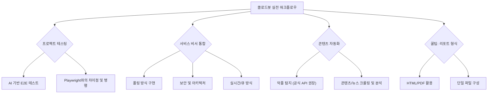

## 📌 클로드봇을 활용하여 삶을 변화시킬 수 있는 실전 워크플로우는 무엇인가요?
 클로드봇은 <mark>프로젝트 테스팅, 서비스 비서 통합, 유튜브 악플 자동 탐지, 콘텐츠 크롤링 및 분석, 뉴스 브리핑</mark> 등 다양한 자동화 워크플로우를 통해 삶을 변화시킬 수 있습니다. 

## 💡 클로드봇을 활용한 엔드투엔드 테스트가 기존 방식과 다른 점은?
 클로드봇은 코드 세맨틱이 아닌 <mark>화면 컨텍스트를 사람처럼 이해</mark>하여 UI 변경에도 유연하게 테스트를 수행하며, 기존 플레이라이트 방식과 병행하여 디터미니스틱/난디터미니스틱 테스트를 모두 활용할 수 있습니다. 

클로드봇을 단순한 챗봇이 아닌, **실제 업무를 자동화하는 강력한 비서**로 활용하는 실전 워크플로우를 공개합니다. <mark>기존 테스트 방식의 한계를 뛰어넘는 AI 기반 엔드투엔드 테스트부터, 서비스 내 비서 통합, 그리고 악성 댓글 자동 탐지까지, 개발자와 비개발자 모두 즉시 적용 가능한 구체적인 자동화 전략과 필수 보안 팁을 얻을 수 있습니다.</mark> 이 자료를 통해 클로드봇을 활용하여 업무 효율을 극대화하고 시간을 절약하는 방법을 배우세요.
## 당신의 삶을 바꿔줄 클로드봇 실전 워크플로우

## 1. 클로드봇을 활용한 AI 기반 프로젝트 테스팅 
<mark>클로드봇을 활용하여 기존 엔드투엔드(E2E) 테스트의 한계를 극복하고, 빠르고 유연한 AI 기반 테스트 환경을 구축한다.</mark>

### 1.1. 기존 E2E 테스트 방식의 한계와 클로드봇의 필요성 

1. **기존 E2E 테스트(Playwright 등)의 문제점** 
  1. E2E 테스트는 항상 깨지기 쉬우며, 특히 AI 시대에는 더욱 유지보수가 어렵다. 
  2. AI를 사용하여 리팩터링하거나 새 기능을 만들 때, 테스트 ID가 삭제되는 경우가 많아 테스트가 깨지는 것이 당연한 과정이 된다. 
  3. 유닛/통합 테스트는 AI로 빠르게 수정 가능하지만, E2E 테스트는 실패 시 수정 및 재실행에 시간이 오래 걸린다. 
2. **개발 워크플로우의 현실적 어려움** 
  1. 개발 완료 후 배포를 먼저 하고 나중에 테스트를 성공시키고 싶은 경우가 많다. 
  2. 테스트를 아예 안 하고 배포할 수는 없지만, AI 시대에 모든 것을 직접 눌러서 테스트하는 것은 비효율적이다. 
3. **클로드봇을 활용한 해결책** 
  1. 클로드봇에게 자연어로 테스트 인스트럭션을 넘긴다. 
  2. TCRI 기법에 따라 퓨샷 프롬프트(Few-shot Prompt)를 제공하여 클로드봇이 스스로 워크플로우를 만들고 실행하도록 유도한다. 
  3. 실행 후 결과를 원하는 형식(예: 리포트)으로 만들어 달라고 요청한다. 

### 1.2. 클로드봇 테스트의 장점: Playwright와의 근본적인 차이 

1. **화면 이해 방식의 차이** 
  1. **Playwright (프리 AI 시절 관점)**: 코드로 제작된 화면을 이해하기 위해 트리를 만들고, 특정 속성(ID 등)을 찾아 액션을 트리거한다. 
  2. **문제점**: 트리가 변경되는 순간 테스트가 쓸모없게 되며, 빠르게 개발하는 시대에는 유지보수가 어렵다. 
  3. **클로드봇 (AI 관점)**: 코드 시맨틱이 아닌, **화면 자체를 보고 사람처럼 이해**한다. 
2. **유연성 확보** 
  1. 버튼 위치가 바뀌거나 다른 페이지로 이동하더라도, 클로드봇은 화면 컨텍스트만 보고 워크플로우를 그대로 따라 작업을 수행할 수 있다. 
  2. Playwright는 코드 표준을 항상 맞춰야 하는 디펜던시가 있지만, 클로드봇은 이러한 디펜던시가 없다. 
  3. 따라서 클로드봇은 알아서 이해하고 테스트하며 평가할 수 있다. 

### 1.3. 클로드봇 테스트 도입 및 병행 전략 

1. **실행 팁** 
  1. **주기적 실행(크론)은 지양**하고, 새로운 배포가 있을 때 직접 트리거하거나 Git Action 플로우에서 텔레그램 노티피케이션을 통해 실행하도록 명시한다. 
  2. 배포 시 한 번만 테스트하면 되므로 효율을 지킬 수 있다. 
2. **Playwright 테스트 병행의 중요성** 
  1. 클로드봇 테스트를 도입하더라도 **기존 E2E 테스트(Playwright)를 버리면 안 된다.** 
  2. 코드로 실행되는 테스트는 데이터베이스 접근이 가능하고 100% 정확한 시맨틱 테스트가 가능하므로 여전히 유효하다. 
  3. **Playwright (결정론적 테스트)**: 의도하지 않은 기능 변경을 찾아내기 쉽다. 
  4. **클로드봇 (비결정론적 테스트)**: 급할 때 테스트가 깨지더라도 핵심 기능(CRUD 액션 등) 작동 여부를 빠르게 확인하고 프로덕션 배포를 진행할 수 있다. 
  5. 이후 시간 날 때 Playwright 테스트를 다시 동기화하면, 결정론적 테스트와 비결정론적 테스트를 모두 확보할 수 있다. 
3. **비개발자를 위한 장점 및 보안 유의사항** 
  1. 클로드봇 테스트는 이미 배포된 상태에서 돌리는 것이므로, 비개발자도 환경 분리 없이 쉽게 테스트를 수행할 수 있다. 
  2. **보안 유의사항**: 클로드봇이 과도하게 테스트를 실행할 수 있으므로, 사용량을 모니터링하고 유세지 스파이크 발생 시 알림을 받는 등 보호 계획을 수립해야 한다. 

## 2. 클로드봇을 서비스 내 비서로 통합하는 아키텍처 
<mark>클로드봇을 서비스 내에 통합하여 자동화된 비서 역할을 수행하게 하며, 이를 위한 폴링, 보안, 실시간 처리 아키텍처를 구축한다.</mark>

### 2.1. 서비스 내 비서 통합 및 폴링 방식 구현 

1. **서비스 통합 예시** 
  1. 서비스 내에서 특정 태그(예: 코팩봇)를 멘션할 수 있도록 구현한다. 
  2. 이 태그가 생성되는 순간, 클로드봇이 댓글이나 포럼 글을 받아 답변을 생성하거나 주기적인 워크플로우를 실행할 수 있다. 
  3. 이는 운영 중인 사이트에서 무궁무진한 자동화 가능성을 제공한다. 
2. **무지성 폴링(Polling) 방식** 
  1. **개념**: 1분에 한 번씩 클로드봇이 서버에 요청을 쏘아 필요한 데이터를 가져오도록 크론에 등록하는 방식이다. 
  2. **폴링의 유효성**: 카카오톡 초기 모델도 폴링 방식이었으며, 웹소켓 대신 폴링을 사용하여 서버 사용량을 줄인 성공 사례가 많다. 
  3. **구현 예시**: 1분마다 요청하여 태그 데이터를 긁어오고, 새로운 태그 발생 기록이 있다면 이를 기반으로 작업을 돌리고 서버에 POST 요청을 보낸다. 
  4. 서비스의 유스케이스에 폴링이 적합하다면 가장 쉬운 방법으로 구현해도 무방하다. 

### 2.2. 보안 강화 및 데이터 접근 제어 

1. **데이터베이스 직접 접근 금지** 
  1. 클로드봇에게 데이터베이스 접근 권한을 모두 주면, 필요한 데이터 이상으로 모든 데이터에 접근 가능해져 보안 위험이 커진다. 
  2. 클로드봇이 데이터를 조작할 위험도 있다. 
  3. **해결책**: 작업별로 GET 요청(데이터 긁기)과 POST 요청(생성) 엔드포인트를 분리하여 사용한다. 
2. **데이터 마스킹 및 최소화** 
  1. 클로드봇에게 데이터를 넘길 때, **작업에 꼭 필요한 데이터만 넘기고 나머지는 마스킹하거나 제공하지 않는다.** 
3. **프롬프트 인젝션 방어** 
  1. 데이터를 가져왔을 때 프롬프트 인젝션 유도 가능성이 있으므로, 기본적인 인젝션을 스트리핑(Stripping) 해주는 라이브러리를 사용한다. 
  2. 예를 들어, XML 시맨틱을 삭제하는 등의 작업을 적용한 후 데이터를 보내는 것이 좋다. 
4. **통신 신뢰 확보** 
  1. 서버와 통신할 때, 클로드봇이 통신하고 있음을 신뢰할 수 있도록 **해시값 교환**을 반드시 해야 한다. 
  2. 이는 최소 보안이며, 암호화 및 복호화 등 보안 수준을 무한하게 높일 수 있다. 

### 2.3. 실시간 처리 및 작업 보장을 위한 아키텍처 

1. **실시간 처리 방식 (웹소켓/SSE)** 
  1. 실시간 처리가 필요하다면 웹소켓(WebSocket)이나 SSE(Server-Sent Events) 같은 이벤트 방식을 사용한다. 
  2. 클로드봇이 접근 가능한 곳으로 이벤트를 쏴주면, 이벤트 발생 시에만 노티파이를 받아 서버 부하를 줄일 수 있다. 
  3. **대안 (거지 근성)**: 텔레그램으로 이벤트를 쏘고 클로드봇이 이를 받아 처리할 수도 있다. 
2. **작업 완료 상태 보장을 위한 큐(Queue) 방식** 
  1. 특정 작업의 완료 상태를 보장하고 분산 환경에서 사용한다면 큐(Queue)를 두는 아키텍처를 사용한다. 
  2. **작동 방식**:
  1. 서버가 텔레그램 등으로 노티피케이션을 보낸다. 
  2. 클로드봇이 노티피케이션을 받고 서버에 데이터를 요청한다. 
  3. 서버는 큐로 요청하여 남아있는 작업을 가져와 클로드봇에게 보낸다. 
  4. 클로드봇이 작업을 완료하면 서버에 요청을 보내고, 서버는 큐에서 작업이 끝났다고 표시한다. 
  5. 이는 전형적인 아키텍처이며, 개발자가 아닌 경우 AI에게 이 내용을 입력하여 물어보면 된다. 

## 3. 클로드봇을 활용한 콘텐츠 자동화 및 보안 팁 
<mark>클로드봇을 활용하여 유튜브 악성 댓글 탐지, 콘텐츠 키워드 분석, 뉴스 브리핑 등 다양한 콘텐츠 자동화 작업을 수행할 수 있으며, 이때 공식 API 사용을 통해 보안을 강화해야 한다.</mark>

### 3.1. 유튜브 악플 자동 탐지 및 공식 API 사용 권장 

1. **브라우저 접근의 위험성** 
  1. 클로드봇 자체는 문제가 없으나, **브라우저 접근 권한**을 주면 모든 것에 접근 가능해져 보안 문제가 발생한다. 
  2. 일반 사용자들은 브라우저로 크롤링하도록 명령하는 것을 편하게 느끼지만, 이는 위험하다. 
2. **공식 API 사용의 중요성** 
  1. 유튜브 댓글 크롤링처럼 공식 API(GCP API 키)가 제공되는 경우, **반드시 공식 API를 사용**하여 브라우저 접근을 최소화해야 한다. 
  2. 공식 API를 사용하면 뚫릴 염려가 적고, 프롬프트 인젝션의 여지도 줄어든다. 
  3. API 권한은 **읽기 전용(Read-only)**으로 설정하고 꼭 필요한 권한만 열어주는 것이 중요하다. 
3. **실제 활용 예시** 
  1. 매일 8시마다 일주일치 댓글을 긁어와 확인하고 텔레그램으로 리포트를 받는다. 

### 3.2. 콘텐츠 크롤링 및 분석 자동화 

1. **정보 과부하 해소** 
  1. AI 시대에는 정보와 새로운 기술이 너무 많아 사람이 직접 따라가기 힘들다. 
  2. 클로드봇을 사용하면 이러한 정보 과부하를 해소할 수 있다. 
2. **콘텐츠 분석 워크플로우** 
  1. 매일 8시에 좋아하는 유튜버와 인플루언서들이 낸 콘텐츠를 보고하도록 설정한다. 
  2. 해당 콘텐츠에서 키워드를 추출하고 분석한다. 
  3. 추출된 키워드를 검색하여 나오는 결과들을 다시 분석하고, 현재 세상의 핫 토픽을 리포트하도록 시킨다. 
  4. 이를 통해 세상 돌아가는 것을 한눈에 파악하고 따라가기 편해진다. 
3. **뉴스 브리핑** 
  1. 네이버 등에서 크롤링하여 매일 뉴스 브리핑을 받도록 설정하면 유용하게 사용할 수 있다. 

## 4. 클로드봇 리포트 형식 및 트래킹 꿀팁 
<mark>클로드봇의 리포트는 메시지 응답 대신 HTML이나 PDF 형태로 받고, 보안과 활용성을 위해 단일 파일로 구성하며, 칸반 보드 트래킹은 지양한다.</mark>

### 4.1. 리포트 형식 최적화: HTML 활용 

1. **메시지 응답 형식 지양** 
  1. 메시지 형식은 아무리 포매팅해도 한눈에 잘 안 보이며, 프레젠테이션에 좋은 포맷이 아니다. 
  2. 공식적인 포맷이 필요하다면 PDF를 사용하는 것이 낫다. 
2. **HTML 리포트의 장점** 
  1. **가장 좋은 형식은 HTML**이며, 작성자는 모든 리포트를 HTML 형태로 받고 있다. 
  2. AI는 코드에 익숙하므로 라이트웨이트하게 HTML을 잘 만들어준다. 
  3. HTML 리포트는 모바일에서도 리스폰시브하게 만들 수 있어, 다양한 스크린 포맷에서 확인하기 매우 유용하다. 

### 4.2. 단일 파일 구성 및 트래킹 방식 

1. **단일 파일 구성 요청** 
  1. HTML 리포트를 만들 때, 프레임워크 사용 없이 **단일 파일로 구성**해 달라고 요청한다. 
  2. 이미지는 Base64로 첨부하도록 하면, HTML 파일 하나만으로 이미지까지 모두 사용할 수 있어 매우 편리하다. 
2. **칸반 보드/웹사이트 트래킹 지양** 
  1. 해외에서 칸반 보드나 웹사이트를 만들어 트래킹하는 방식이 유행하지만, 개인적으로 비추천한다. 
  2. **보안 위험**: 포트를 열고 인터넷에 노출해야 하므로 보안 위험이 발생한다. 
  3. **활용성 제한**: 노출시키지 않으면 컴퓨터 앞에 있거나 같은 네트워크에 접속했을 때만 볼 수 있어, 클로드봇의 리모트 성향을 충분히 활용하지 못한다. 
  4. 따라서 HTML로 매번 리포트를 받아보는 것이 좋다. 
3. **칸반 보드 활용 대안** 
  1. 굳이 트래킹이 필요하다면, 파일을 마크다운 형태로 만들어 두고, 컴퓨터 앞에서 전반적인 그림을 확인하는 용도로만 칸반 보드를 사용한다. 
  2. 나머지 리포트는 텔레그램으로 받아보는 것이 가장 좋은 형태이다. 

## 5. 결론: 클로드봇 활용의 변화 

<mark>클로드봇 도입 후 삶이 완전히 바뀌었으며, 자동화를 통해 효율을 극대화하고 보안을 철저히 챙겨야 한다.</mark>
1. **삶의 변화** 
  1. 클로드봇 사용 후 삶이 완전히 바뀌었으며, 휴식 시간(화장실, 헬스장)에도 클로드봇을 사용하게 되었다. 
  2. 대화를 통해 아이디어가 계속 떠올라 테스트, 작업, 자동화, 리포트 추가가 끊임없이 이어진다. 
  3. AI가 발전하면서 오히려 실시간 휴식 시간이 더 없어지는 것 같다. 
2. **마무리 당부** 
  1. 클로드봇으로 많은 자동화를 하길 바라며, 오늘 제시된 팁들을 적용하고 **보안을 꼭 철저히 챙겨야 한다.** 

