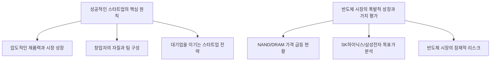
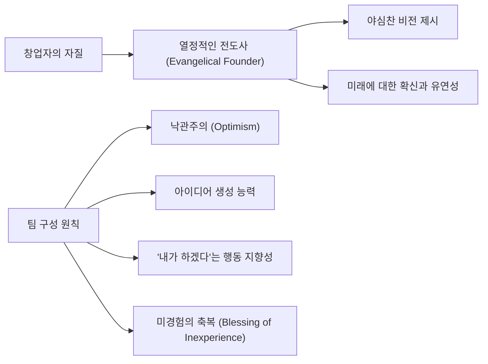
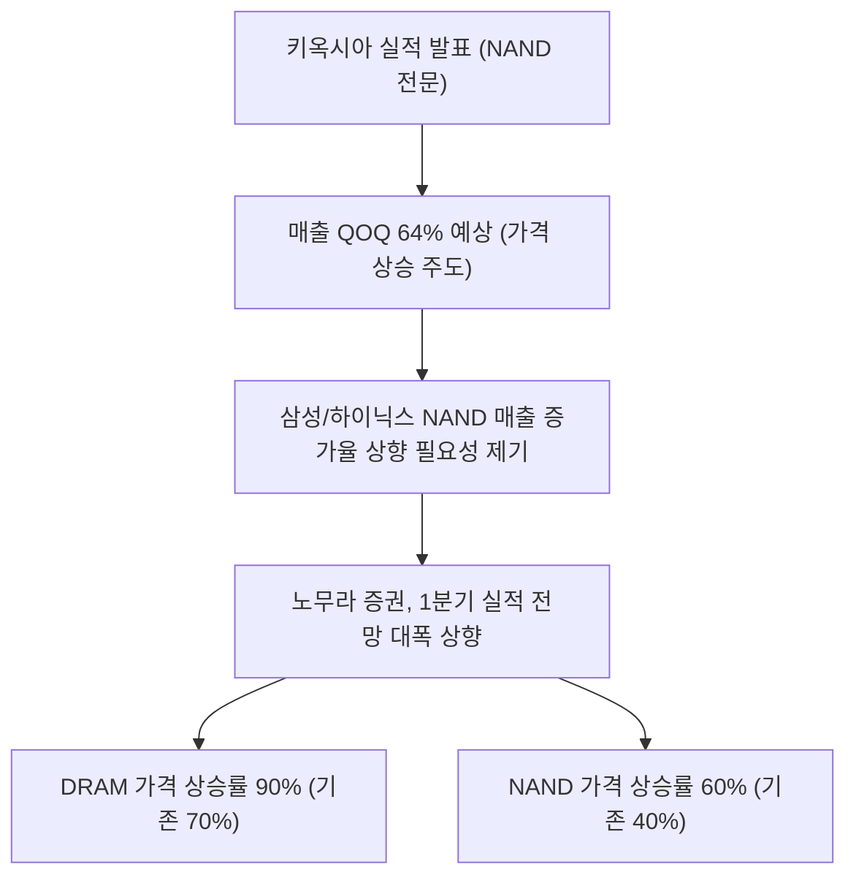

## 1. 개요

### 1.1 서론
스타트업의 성공 전략부터 반도체 시장의 역동적인 전망까지, 오늘 우리가 살펴볼 자료들은 <mark>성장과 혁신을 위한 핵심 원칙</mark>을 다루고 있습니다. 한 자료는 성공적인 스타트업을 만들기 위해 필요한 제품, 시장, 팀, 그리고 창업자의 자질에 대해 깊이 있게 조명하며, 다른 자료는 현재 폭발적인 성장을 보이는 **반도체(DRAM, NAND) 시장의 현황과 미래 가치 평가**에 대한 구체적인 분석을 제공합니다. 이 두 주제는 서로 다른 영역처럼 보이지만, 결국 **'폭발적인 성장 잠재력을 가진 시장을 선점하고, 압도적인 제품과 실행력을 통해 경쟁 우위를 확보한다'**는 공통의 성공 방정식을 공유하고 있습니다.

### 1.2 전체 구조
오늘 자료는 크게 두 가지 핵심 주제로 구성되어 있습니다. 첫 번째는 스타트업이 성공하기 위한 필수 요소와 전략이며, 두 번째는 현재 반도체 시장의 급격한 변화와 이에 따른 삼성전자 및 SK하이닉스의 가치 평가입니다.

## 2. 성공적인 스타트업을 위한 핵심 원칙
스타트업의 성공은 단순히 좋은 아이디어에서 오는 것이 아니라, 제품, 시장, 팀, 그리고 창업자의 자질이라는 네 가지 핵심 요소가 유기적으로 결합될 때 가능합니다. 특히, 압도적인 제품을 만들고 빠르게 성장하는 시장을 포착하는 것이 가장 중요합니다.

### 2.1 압도적인 제품력과 폭발적인 시장 성장 포착
스타트업 성공의 80%는 사람들이 자발적으로 주변에 추천할 만큼 **'매우 좋은 제품'**을 만드는 데 달려 있습니다. <doc-source-group><doc-source requestId="e8667d47-87a4-4ead-8513-f5dbd1b3c474" index="6" /><doc-source requestId="e8667d47-87a4-4ead-8513-f5dbd1b3c474" index="9" /></doc-source-group>

| **성공 요소** | **설명** | **중요 지표** |
| --- | --- | --- |
| **제품력** | 사람들이 자발적으로 친구에게 추천할 만큼 압도적으로 좋은 제품을 만드는 것. | 단순하고 이해하기 쉬운 설명, 초기 사용자들의 강렬한 사용(Obsessive Use) <doc-source-group><doc-source requestId="e8667d47-87a4-4ead-8513-f5dbd1b3c474" index="10" /><doc-source requestId="e8667d47-87a4-4ead-8513-f5dbd1b3c474" index="28" /></doc-source-group> |
| **시장 포착** | 현재가 아닌, 곧 **지수적 성장(Exponential Growth)**을 겪을 시장을 식별하는 것. | 현재 TAM(Total Addressable Market)이 작더라도 성장 속도가 매우 빠른 시장 <doc-source-group><doc-source requestId="e8667d47-87a4-4ead-8513-f5dbd1b3c474" index="18" /><doc-source requestId="e8667d47-87a4-4ead-8513-f5dbd1b3c474" index="22" /></doc-source-group> |

- **제품의 핵심:** 제품이 너무 좋아서 사람들이 "이거 꼭 써봐야 해, 정말 대단해"라고 자발적으로 말하게 만드는 것이 성공의 비결입니다. <doc-source-group><doc-source requestId="e8667d47-87a4-4ead-8513-f5dbd1b3c474" index="2" /><doc-source requestId="e8667d47-87a4-4ead-8513-f5dbd1b3c474" index="8" /></doc-source-group>
- **명확한 사고의 중요성:** 제품을 몇 마디로 설명할 수 없다면, 그것은 사고가 불분명하거나 시장의 니즈가 충분히 크지 않다는 신호일 수 있습니다. <doc-source-group><doc-source requestId="e8667d47-87a4-4ead-8513-f5dbd1b3c474" index="11" /><doc-source requestId="e8667d47-87a4-4ead-8513-f5dbd1b3c474" index="13" /></doc-source-group>
- **진짜 트렌드와 가짜 트렌드 구별:**
  - **진짜 트렌드 (Real Trend):** 새로운 기술 플랫폼이 등장했을 때, 초기 사용자들이 **집착적으로 사용**하고 주변에 사랑한다고 말하는 경우입니다. (예: 아이폰 초기 사용자들) <doc-source-group><doc-source requestId="e8667d47-87a4-4ead-8513-f5dbd1b3c474" index="28" /><doc-source requestId="e8667d47-87a4-4ead-8513-f5dbd1b3c474" index="34" /><doc-source requestId="e8667d47-87a4-4ead-8513-f5dbd1b3c474" index="37" /></doc-source-group>
  - **가짜 트렌드 (Fake Trend):** 사람들이 제품을 구매하더라도 사용 빈도가 매우 낮거나 거의 사용하지 않는 경우입니다. (예: 2018년 당시 VR 헤드셋) <doc-source-group><doc-source requestId="e8667d47-87a4-4ead-8513-f5dbd1b3c474" index="29" /><doc-source requestId="e8667d47-87a4-4ead-8513-f5dbd1b3c474" index="39" /><doc-source requestId="e8667d47-87a4-4ead-8513-f5dbd1b3c474" index="41" /></doc-source-group>

### 2.2 창업자의 자질과 최고의 팀 구성
성공적인 스타트업은 강력한 비전을 제시하고, 그 비전을 실현할 수 있는 최고의 팀을 구성하는 데 시간을 아끼지 않습니다.

- **창업자의 역할:** 창업자(주로 CEO)는 회사의 **최고 전도사(Chief Evangelist)**가 되어야 합니다. 이들은 채용, 제품 판매, 언론 대응, 자금 조달 등 모든 것을 주도하며 세상에 열정을 전파해야 합니다. <doc-source-group><doc-source requestId="e8667d47-87a4-4ead-8513-f5dbd1b3c474" index="42" /><doc-source requestId="e8667d47-87a4-4ead-8513-f5dbd1b3c474" index="44" /></doc-source-group>
- **야심찬 비전의 힘:**
  - **어려운 스타트업이 더 쉬울 수 있다:** 역설적으로, 야심차고 어려운 프로젝트가 더 흥미롭기 때문에 최고의 인재를 끌어들이기 쉽습니다. <doc-source-group><doc-source requestId="e8667d47-87a4-4ead-8513-f5dbd1b3c474" index="52" /><doc-source requestId="e8667d47-87a4-4ead-8513-f5dbd1b3c474" index="53" /></doc-source-group>
  - **인재 확보의 어려움:** 현재 환경에서는 자본 조달보다 **최고의 인재를 모으는 것**이 가장 어렵기 때문에, 성공했을 때 세상에 큰 영향을 미치는 문제를 선택해야 합니다. <doc-source-group><doc-source requestId="e8667d47-87a4-4ead-8513-f5dbd1b3c474" index="58" /><doc-source requestId="e8667d47-87a4-4ead-8513-f5dbd1b3c474" index="62" /><doc-source requestId="e8667d47-87a4-4ead-8513-f5dbd1b3c474" index="63" /></doc-source-group>
- **미래에 대한 확신:** 최고의 창업자들은 미래에 대해 **확신 있고 명확한(Confident and Definite) 견해**를 가지고 있으며, 의심에 직면하더라도 리더십을 발휘할 용기가 있습니다. <doc-source-group><doc-source requestId="e8667d47-87a4-4ead-8513-f5dbd1b3c474" index="64" /><doc-source requestId="e8667d47-87a4-4ead-8513-f5dbd1b3c474" index="67" /></doc-source-group>
- **팀 구성의 비결 (50%의 시간 투자):**
  - **최고의 팀 구축:** 성공적인 창업자는 시간의 약 50%를 채용에 투자해야 합니다. <doc-source-group><doc-source requestId="e8667d47-87a4-4ead-8513-f5dbd1b3c474" index="79" /><doc-source requestId="e8667d47-87a4-4ead-8513-f5dbd1b3c474" index="80" /></doc-source-group>
  - **낙관주의:** 세상이 실패할 것이라고 말할 때도, "우리는 해낼 것이다"라는 **내부적인 믿음의 불꽃**을 가진 낙관주의자가 필요합니다. <doc-source-group><doc-source requestId="e8667d47-87a4-4ead-8513-f5dbd1b3c474" index="84" /><doc-source requestId="e8667d47-87a4-4ead-8513-f5dbd1b3c474" index="86" /><doc-source requestId="e8667d47-87a4-4ead-8513-f5dbd1b3c474" index="90" /></doc-source-group>
  - **아이디어 생성자:** 회사가 따라갈 수 있는 것보다 더 많은 아이디어를 끊임없이 던지는 소수의 아이디어 생성자가 중요합니다. <doc-source-group><doc-source requestId="e8667d47-87a4-4ead-8513-f5dbd1b3c474" index="91" /><doc-source requestId="e8667d47-87a4-4ead-8513-f5dbd1b3c474" index="94" /></doc-source-group>
  - **행동 지향성:** "그건 내 담당이 아니야"라고 말하는 대신, "내가 할게요(I've got it)"라고 나서서 **행동으로 나아가는 편향**을 가진 사람이 필요합니다. <doc-source-group><doc-source requestId="e8667d47-87a4-4ead-8513-f5dbd1b3c474" index="101" /><doc-source requestId="e8667d47-87a4-4ead-8513-f5dbd1b3c474" index="103" /></doc-source-group>
  - **미경험의 축복:** 때로는 경험이 없기 때문에 "이건 불가능하다"는 말을 듣지 않고 놀라운 일을 해내는 **미경험이지만 잠재력이 높은 인재**에게 베팅할 수 있습니다. <doc-source-group><doc-source requestId="e8667d47-87a4-4ead-8513-f5dbd1b3c474" index="108" /><doc-source requestId="e8667d47-87a4-4ead-8513-f5dbd1b3c474" index="112" /></doc-source-group>

### 2.3 대기업을 이기는 스타트업의 경쟁 우위
스타트업은 대기업이 가지지 못한 고유한 장점을 활용하여 경쟁에서 승리할 수 있습니다.

| **스타트업의 경쟁 우위** | **대기업의 약점** | **승리 전략** |
| --- | --- | --- |
| **'나쁜 아이디어처럼 보이는 좋은 아이디어' 실행력** | 하나의 'No'가 아이디어를 죽일 수 있음 (One No Can Kill) <doc-source-group><doc-source requestId="e8667d47-87a4-4ead-8513-f5dbd1b3c474" index="141" /></doc-source-group> | 투자자 중 단 한 명의 'Yes'만으로도 실행 가능 (One Yes is Enough) <doc-source-group><doc-source requestId="e8667d47-87a4-4ead-8513-f5dbd1b3c474" index="142" /><doc-source requestId="e8667d47-87a4-4ead-8513-f5dbd1b3c474" index="144" /></doc-source-group> |
| **민첩성과 속도 (Agility & Speed)** | 의사 결정이 느리고 변화에 둔감함 (전함이 느리게 도는 것과 같음) <doc-source-group><doc-source requestId="e8667d47-87a4-4ead-8513-f5dbd1b3c474" index="151" /><doc-source requestId="e8667d47-87a4-4ead-8513-f5dbd1b3c474" index="160" /></doc-source-group> | 시장 변화 속도가 빠를수록 더 많은 의사 결정 기회를 얻어 이점을 복리화 <doc-source-group><doc-source requestId="e8667d47-87a4-4ead-8513-f5dbd1b3c474" index="148" /><doc-source requestId="e8667d47-87a4-4ead-8513-f5dbd1b3c474" index="152" /></doc-source-group> |
| **대규모 플랫폼 전환 선점** | 기존 시스템 때문에 전략적 피벗(Pivot)이 어려움 <doc-source-group><doc-source requestId="e8667d47-87a4-4ead-8513-f5dbd1b3c474" index="159" /></doc-source-group> | 플랫폼 전환 시점에 맞춰 새로운 방향으로 **전력 투구(Go All In)** 가능 <doc-source-group><doc-source requestId="e8667d47-87a4-4ead-8513-f5dbd1b3c474" index="153" /><doc-source requestId="e8667d47-87a4-4ead-8513-f5dbd1b3c474" index="162" /></doc-source-group> |

- **모멘텀 유지의 중요성:** 창업자의 가장 중요한 임무 중 하나는 **모멘텀을 절대 잃지 않는 것**입니다. 초기 몇 년 동안은 발을 떼지 않고 계속 가속해야 하며, 모멘텀을 잃으면 회복하기 매우 어렵습니다. <doc-source-group><doc-source requestId="e8667d47-87a4-4ead-8513-f5dbd1b3c474" index="114" /><doc-source requestId="e8667d47-87a4-4ead-8513-f5dbd1b3c474" index="115" /><doc-source requestId="e8667d47-87a4-4ead-8513-f5dbd1b3c474" index="120" /></doc-source-group>
- **장기적인 경쟁 우위 확보:** 모든 위대한 기업은 **장기적인 독점 효과(Long-term Monopoly Effect)**나 **네트워크 효과(Network Effect)**와 같은 경쟁 우위에 대한 명확한 계획을 가지고 있어야 합니다. <doc-source-group><doc-source requestId="e8667d47-87a4-4ead-8513-f5dbd1b3c474" index="122" /><doc-source requestId="e8667d47-87a4-4ead-8513-f5dbd1b3c474" index="125" /></doc-source-group>
- **창업자의 덕목:** 최고의 창업자들은 **검소함(Frugality), 집중(Focus), 집착(Obsession), 그리고 사랑(Love)**이라는 네 가지 특성을 공유합니다. <doc-source-group><doc-source requestId="e8667d47-87a4-4ead-8513-f5dbd1b3c474" index="133" /><doc-source requestId="e8667d47-87a4-4ead-8513-f5dbd1b3c474" index="134" /></doc-source-group>

## 3. 반도체 시장의 폭발적 성장과 가치 평가 분석
스타트업이 폭발적인 시장 성장을 포착해야 하듯, 현재 반도체 시장은 DRAM과 NAND 가격 급등에 힘입어 엄청난 성장 사이클에 진입하고 있습니다. 외국계 증권사 리포트를 통해 이 시장의 현황과 삼성전자, SK하이닉스의 가치 평가를 자세히 살펴보겠습니다.

### 3.1 NAND/DRAM 가격 급등 현황과 실적 전망 상향
최근 키옥시아(Kioxia)의 실적 발표는 NAND 시장의 폭발적인 가격 상승을 시사하며, 이는 삼성전자와 SK하이닉스의 실적 전망을 대폭 상향시키는 근거가 되고 있습니다.

- **키옥시아의 놀라운 실적:** NAND 전문 기업인 키옥시아의 영업이익률(OPM)은 26%를 기록했으며, 다음 분기 매출은 **전 분기 대비 64% 증가**할 것으로 예상됩니다. <doc-source-group><doc-source requestId="282ac005-c78d-44a0-8742-77eab4a36d3d" index="19" /><doc-source requestId="282ac005-c78d-44a0-8742-77eab4a36d3d" index="43" /><doc-source requestId="282ac005-c78d-44a0-8742-77eab4a36d3d" index="45" /></doc-source-group>
- **가격 상승의 증거:** 최근 DRAM과 NAND의 출하량은 크게 늘지 않았기 때문에, 키옥시아의 매출 급증은 **가격 상승(Price Increase)**에 기인한다고 해석해야 합니다. <doc-source-group><doc-source requestId="282ac005-c78d-44a0-8742-77eab4a36d3d" index="51" /><doc-source requestId="282ac005-c78d-44a0-8742-77eab4a36d3d" index="54" /></doc-source-group>
- **애널리스트 컨센서스 상향:** 키옥시아의 실적을 바탕으로 볼 때, 기존에 삼성전자와 SK하이닉스의 1분기 NAND 매출 증가율을 40~50%로 잡았던 컨센서스는 **더 높게 잡혀야 타당**합니다. <doc-source-group><doc-source requestId="282ac005-c78d-44a0-8742-77eab4a36d3d" index="79" /><doc-source requestId="282ac005-c78d-44a0-8742-77eab4a36d3d" index="80" /></doc-source-group>
- **노무라 증권의 파격적인 전망:**
  - 노무라 증권은 1분기 삼성전자와 SK하이닉스의 실적 전망을 기존 컨센서스(삼성 36조, 하이닉스 31조)보다 훨씬 높은 수준으로 상향 조정했습니다. <doc-source-group><doc-source requestId="282ac005-c78d-44a0-8742-77eab4a36d3d" index="70" /><doc-source requestId="282ac005-c78d-44a0-8742-77eab4a36d3d" index="72" /><doc-source requestId="282ac005-c78d-44a0-8742-77eab4a36d3d" index="74" /></doc-source-group>
  - 이들은 일반 DRAM 가격 상승률을 **90%**로, NAND 가격 상승률을 **60%**로 가정했는데, 이는 기존 예측치(DRAM 70%, NAND 40%)보다 훨씬 높은 수준입니다. <doc-source-group><doc-source requestId="282ac005-c78d-44a0-8742-77eab4a36d3d" index="89" /><doc-source requestId="282ac005-c78d-44a0-8742-77eab4a36d3d" index="90" /><doc-source requestId="282ac005-c78d-44a0-8742-77eab4a36d3d" index="91" /></doc-source-group>

### 3.2 SK하이닉스 및 삼성전자 목표 주가와 밸류에이션 분석
외국계 증권사는 폭발적인 이익 성장을 반영하여 목표 주가를 대폭 상향하고 있지만, **사이클 산업의 특성**을 고려하여 밸류에이션 배수는 보수적으로 적용하고 있습니다.

| **구분** | **SK하이닉스 (노무라 기준)** | **삼성전자 (노무라 기준)** |
| --- | --- | --- |
| **목표 주가** | 156만 원 (1월 29일 125만 원에서 상향) <doc-source-group><doc-source requestId="282ac005-c78d-44a0-8742-77eab4a36d3d" index="165" /><doc-source requestId="282ac005-c78d-44a0-8742-77eab4a36d3d" index="182" /></doc-source-group> | 29만 원 (PBR 3배 적용 시) <doc-source-group><doc-source requestId="282ac005-c78d-44a0-8742-77eab4a36d3d" index="312" /></doc-source-group> |
| **2024년 순이익 전망** | 약 180~190조 원 (20% 이상 상향) <doc-source-group><doc-source requestId="282ac005-c78d-44a0-8742-77eab4a36d3d" index="159" /></doc-source-group> | 약 210조 원 <doc-source-group><doc-source requestId="282ac005-c78d-44a0-8742-77eab4a36d3d" index="267" /><doc-source requestId="282ac005-c78d-44a0-8742-77eab4a36d3d" index="293" /></doc-source-group> |
| **2024년 PER (주가수익비율)** | 7.5배 <doc-source-group><doc-source requestId="282ac005-c78d-44a0-8742-77eab4a36d3d" index="196" /><doc-source requestId="282ac005-c78d-44a0-8742-77eab4a36d3d" index="211" /></doc-source-group> | 9배 <doc-source-group><doc-source requestId="282ac005-c78d-44a0-8742-77eab4a36d3d" index="273" /><doc-source requestId="282ac005-c78d-44a0-8742-77eab4a36d3d" index="303" /></doc-source-group> |
| **PBR (주가순자산비율)** | 3.5배 <doc-source-group><doc-source requestId="282ac005-c78d-44a0-8742-77eab4a36d3d" index="197" /><doc-source requestId="282ac005-c78d-44a0-8742-77eab4a36d3d" index="210" /></doc-source-group> | 3배 <doc-source-group><doc-source requestId="282ac005-c78d-44a0-8742-77eab4a36d3d" index="317" /></doc-source-group> |
| **ROE (자기자본이익률)** | 70%대 (올해) <doc-source-group><doc-source requestId="282ac005-c78d-44a0-8742-77eab4a36d3d" index="200" /><doc-source requestId="282ac005-c78d-44a0-8742-77eab4a36d3d" index="204" /></doc-source-group> | 40%대 (올해) <doc-source-group><doc-source requestId="282ac005-c78d-44a0-8742-77eab4a36d3d" index="315" /><doc-source requestId="282ac005-c78d-44a0-8742-77eab4a36d3d" index="317" /></doc-source-group> |
| **밸류에이션 해석** | ROE가 높지만, **지속 가능한 ROE**를 낮게 잡아 PBR 3.5배 적용. <doc-source-group><doc-source requestId="282ac005-c78d-44a0-8742-77eab4a36d3d" index="205" /><doc-source requestId="282ac005-c78d-44a0-8742-77eab4a36d3d" index="209" /></doc-source-group> | ROE가 높더라도 과거 호황기 PBR 최고치(3배)를 적용하여 보수적으로 평가. <doc-source-group><doc-source requestId="282ac005-c78d-44a0-8742-77eab4a36d3d" index="321" /><doc-source requestId="282ac005-c78d-44a0-8742-77eab4a36d3d" index="324" /></doc-source-group> |

- **외국계 증권사의 특징:** 외국계 증권사는 국내 증권사와 달리 뷰가 바뀔 만한 사항이 있으면 **더 자주, 더 급격히** 목표 주가를 상향하거나 하향하는 경향이 있습니다. <doc-source-group><doc-source requestId="282ac005-c78d-44a0-8742-77eab4a36d3d" index="162" /><doc-source requestId="282ac005-c78d-44a0-8742-77eab4a36d3d" index="169" /></doc-source-group>
- **PER의 낮은 배수:** 폭발적인 이익 성장이 예상됨에도 불구하고 PER이 7~9배 수준으로 낮은 이유는, 반도체 산업의 **사이클성** 때문입니다. 이익이 영원히 지속 가능하다고 보지 않기 때문에 보수적인 배수를 적용합니다. <doc-source-group><doc-source requestId="282ac005-c78d-44a0-8742-77eab4a36d3d" index="224" /><doc-source requestId="282ac005-c78d-44a0-8742-77eab4a36d3d" index="300" /><doc-source requestId="282ac005-c78d-44a0-8742-77eab4a36d3d" index="304" /></doc-source-group>
- **ROE와 PBR의 관계:** ROE가 70%대(하이닉스) 또는 40%대(삼성전자)로 높게 나오더라도, 이익이 계속 쌓이면 ROE는 반드시 내려가게 되어 있습니다. 따라서 애널리스트들은 사이클을 고려한 **지속 가능한 ROE**를 기준으로 PBR을 3~3.5배 수준으로 보수적으로 책정합니다. <doc-source-group><doc-source requestId="282ac005-c78d-44a0-8742-77eab4a36d3d" index="207" /><doc-source requestId="282ac005-c78d-44a0-8742-77eab4a36d3d" index="325" /><doc-source requestId="282ac005-c78d-44a0-8742-77eab4a36d3d" index="330" /></doc-source-group>

### 3.3 반도체 시장의 잠재적 리스크와 HBM 이슈
반도체 가격 상승세는 하반기부터 둔화될 가능성이 있으며, 중국의 추격과 HBM 관련 기술 이슈 등 잠재적인 리스크 요인도 존재합니다.

- **가격 상승률 둔화 예측:**
  - 애널리스트들은 DRAM과 NAND 가격 상승률이 1분기 최고치를 기록한 후, 2분기부터 **점진적으로 둔화**될 것으로 예측하고 있습니다. <doc-source-group><doc-source requestId="282ac005-c78d-44a0-8742-77eab4a36d3d" index="289" /><doc-source requestId="282ac005-c78d-44a0-8742-77eab4a36d3d" index="292" /></doc-source-group>
  - 가격 상승률이 둔화되는 시점은 **연말연초**가 될 가능성이 있으며, 주가는 보통 6개월 선행하므로 이 시점을 주의해야 합니다. <doc-source-group><doc-source requestId="282ac005-c78d-44a0-8742-77eab4a36d3d" index="134" /><doc-source requestId="282ac005-c78d-44a0-8742-77eab4a36d3d" index="448" /><doc-source requestId="282ac005-c78d-44a0-8742-77eab4a36d3d" index="449" /></doc-source-group>
- **중국 반도체의 잠재적 위협:**
  - 중국의 CXMT(DRAM)와 YMTC(NAND)는 현재 미국 장비 규제로 인해 생산 능력에 한계가 있지만, **미래의 잠재적 리스크**로 인식해야 합니다. <doc-source-group><doc-source requestId="282ac005-c78d-44a0-8742-77eab4a36d3d" index="376" /><doc-source requestId="282ac005-c78d-44a0-8742-77eab4a36d3d" index="379" /></doc-source-group>
  - 만약 중국 업체가 제품을 잘 만들고 가격을 50% 낮춰서 공급한다면, PC나 스마트폰 제조사들이 이를 사용할 수 있으며, 이는 삼성/하이닉스의 높은 마진(DRAM 80%, NAND 50%)에 영향을 줄 수 있습니다. <doc-source-group><doc-source requestId="282ac005-c78d-44a0-8742-77eab4a36d3d" index="411" /><doc-source requestId="282ac005-c78d-44a0-8742-77eab4a36d3d" index="413" /><doc-source requestId="282ac005-c78d-44a0-8742-77eab4a36d3d" index="425" /></doc-source-group>
- **HBM 기술 및 물량 이슈:**
  - **삼성전자 HBM:** 최근 1C 공정 제품의 성능(11.72Gbps)이 높다는 점은 긍정적이나, 초도 물량이 크지 않을 것이라는 추론이 있습니다. <doc-source-group><doc-source requestId="282ac005-c78d-44a0-8742-77eab4a36d3d" index="234" /><doc-source requestId="282ac005-c78d-44a0-8742-77eab4a36d3d" index="244" /></doc-source-group>
  - **SK하이닉스 HBM:** 최근 HBM4 관련 기술적 이슈가 있었으나, 5월까지 쉬핑(Shipment)에 문제가 해결된다면 큰 이슈가 되지 않을 수 있습니다. <doc-source-group><doc-source requestId="282ac005-c78d-44a0-8742-77eab4a36d3d" index="247" /><doc-source requestId="282ac005-c78d-44a0-8742-77eab4a36d3d" index="257" /></doc-source-group>
  - **핵심은 물량 확보:** 엔비디아의 신제품 출하 시점(7~8월)을 고려할 때, 5월이 마지노선이며, 이 시점까지 안정적인 물량 공급이 중요합니다. <doc-source-group><doc-source requestId="282ac005-c78d-44a0-8742-77eab4a36d3d" index="256" /><doc-source requestId="282ac005-c78d-44a0-8742-77eab4a36d3d" index="257" /></doc-source-group>
- **CAPEX 증가 우려:**
  - 현재 반도체 마진이 매우 높기 때문에(DRAM 70%, NAND 50%), 대장주들이 **CAPEX(자본적 지출)를 늘릴 조짐**이 있습니다. <doc-source-group><doc-source requestId="282ac005-c78d-44a0-8742-77eab4a36d3d" index="457" /><doc-source requestId="282ac005-c78d-44a0-8742-77eab4a36d3d" index="459" /></doc-source-group>
  - 삼성전자는 평택 4라인 등의 일정을 앞당길 유연성이 있으며, SK하이닉스는 용인 팹이 내년 말에나 가동될 예정이므로 상대적으로 CAPEX 유연성이 낮습니다. <doc-source-group><doc-source requestId="282ac005-c78d-44a0-8742-77eab4a36d3d" index="469" /><doc-source requestId="282ac005-c78d-44a0-8742-77eab4a36d3d" index="474" /><doc-source requestId="282ac005-c78d-44a0-8742-77eab4a36d3d" index="477" /></doc-source-group>
  - 대장주가 CAPEX를 지나치게 늘린다는 신호는 **공급 과잉**으로 이어져 가격 상승 둔화를 가속화할 수 있는 안 좋은 신호입니다. <doc-source-group><doc-source requestId="282ac005-c78d-44a0-8742-77eab4a36d3d" index="455" /></doc-source-group>
