# 10강. 종합 Case Study & Debugging
> 과정: **IOMMU / ARM SMMU Study**  
> 대상: Linux Kernel, Embedded/Automotive BSP, Camera/NPU driver 개발자  
> 예상 학습 시간: 120~180분  
> Linux source snapshot: `torvalds/linux` commit `fce2dfa773ced15f27dd27cd0b482a7473cdcf2a`

이 강의는 1~9강에서 배운 DMA API, Linux IOMMU Framework, ARM SMMUv2/v3, Device Tree/ACPI, DMA-BUF/V4L2 pipeline을 하나의 debugging workflow로 통합한다. 최종 목표는 SMMU fault log를 읽는 데서 멈추지 않고, **faulting SID/IOVA를 실제 Camera frame, DMA-BUF, NPU job과 연결하여 root cause와 recovery를 증명**하는 것이다.

## 1. 학습 목표
- SMMUv2 Context fault와 SMMUv3 EVTQ event를 구조적으로 해석한다.
- `SID → device → domain → IOVA → DMA-BUF → frame/job` 역추적 절차를 설계한다.
- premature unmap, wrong DMA direction, missing fence, Stream ID mismatch, DMA mask 문제를 구분한다.
- map/unmap churn, IOTLB pressure, strict/lazy invalidation의 성능·격리 trade-off를 분석한다.
- Automotive 환경의 fault containment, controlled recovery, degraded mode 전환을 설계한다.

## 2. 전체 Case Study 환경
본 강의에서는 다음과 같은 ARM64 Automotive SoC를 가정한다. 실제 제품에서는 secure firmware, hypervisor, vendor interconnect, multiple SMMU instance가 추가될 수 있으므로 topology를 먼저 확정해야 한다.
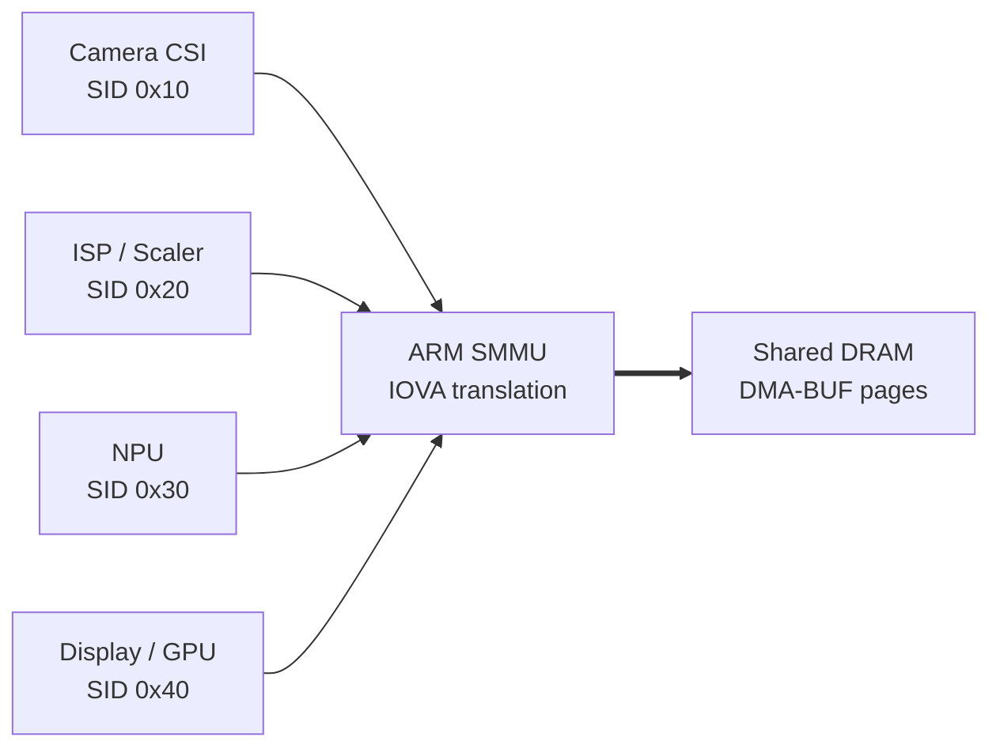

핵심 가정:
- Camera, ISP, NPU, Display는 서로 다른 DMA master이며 각자 SID를 낸다.
- 하나의 DMA-BUF backing pages가 여러 device attachment를 가질 수 있다.
- attachment별 DMA mapping은 서로 다른 IOVA를 반환할 수 있다.
- NPU driver는 command queue와 completion IRQ를 갖고, input/output DMA를 수행한다.

## 3. Debugging의 핵심: 식별자를 하나의 Timeline으로 연결하기
SMMU는 DMA-BUF, V4L2 frame, NPU model을 알지 못한다. SMMU가 제공하는 것은 SID, SSID/PASID, input address, fault type, stage와 같은 hardware-level evidence다. 따라서 driver와 middleware가 correlation key를 남겨야 한다.
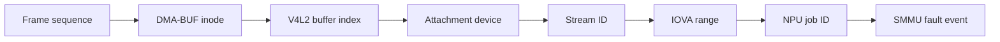

권장 correlation tuple:
- `frame_seq`: Camera/V4L2 frame sequence
- `dmabuf_inode`: subsystem 간 공유 buffer 식별자
- `vb2_index`, plane, offset, stride, size
- attachment device name, SID/SSID
- `iova_start`, length, DMA direction, mapping timestamp
- NPU job ID, submit/completion/cancel timestamp
- fence context/sequence 또는 producer completion timestamp

### 3.1 네 가지 Lifetime
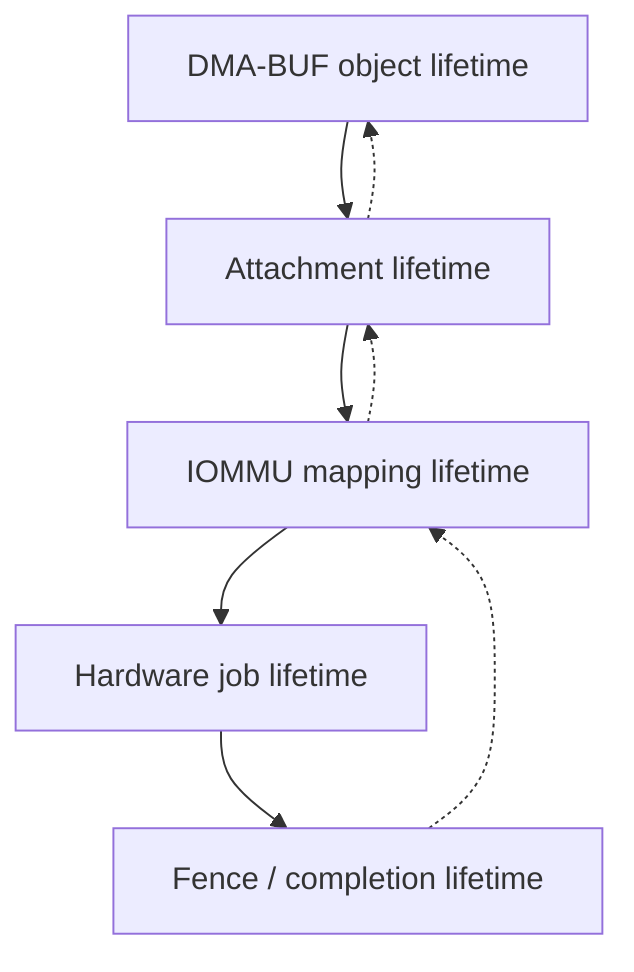

다음 부등식이 중요하다.

`IOMMU mapping lifetime >= 모든 가능한 hardware DMA lifetime`

DMA-BUF reference가 남아 있어도 attachment mapping을 unmap하면 해당 device IOVA는 더 이상 유효하지 않다. 반대로 hardware job이 끝났다고 생각했지만 DMA engine이 delayed burst를 수행하면 late DMA fault가 발생할 수 있다. timeout과 DMA quiesce는 동일한 사건이 아니다.

### 3.2 정상 Frame Sequence
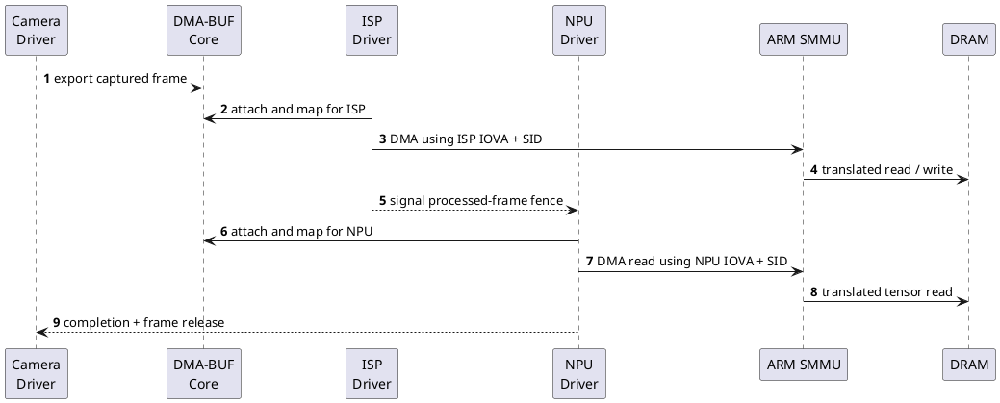

정상 sequence의 불변 조건은 다음과 같다.
1. producer fence가 signal된 뒤 consumer device가 시작한다.
2. 각 consumer는 자신의 `struct device`로 DMA-BUF를 attach/map한다.
3. device register에는 CPU VA나 임의의 PA가 아니라 해당 attachment의 DMA address를 기록한다.
4. mapping retire는 completion 또는 cancel acknowledgment 뒤에 수행한다.

## 4. 증거 보존과 Triage Workflow
fault 직후 reset, detach, process kill을 먼저 수행하면 가장 중요한 evidence가 사라진다. 특히 SMMUv3 EVTQ entry, active command ring, mapping registry, DMA-BUF attachment, fence state를 먼저 snapshot해야 한다.
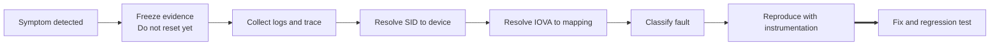

### 4.1 증상별 1차 분류
| 증상 | 우선 의심 | 첫 확인 |
|---|---|---|
| 즉시 SMMU fault | unmapped IOVA, wrong SID, permission | event SID/IOVA/type |
| timeout 후 fault | late DMA, premature unmap, reset race | submit/unmap/completion/fault timestamp |
| fault 없이 결과 이상 | cache sync, fence, format/stride | producer fence와 DMA direction |
| 특정 크기만 실패 | DMA mask, max segment, aperture | mapped SG와 device constraints |
| 부하에서 latency spike | IOTLB miss, map churn, IRQ delay | page count, TLBI, trace timeline |

## 5. Observability 준비
Bring-up 초기부터 debug configuration을 버전 관리하는 것이 좋다. Debug instrumentation은 성능과 timing을 바꿀 수 있으므로 instrumentation 없는 baseline과 함께 비교한다.
```text
CONFIG_IOMMU_SUPPORT=y
CONFIG_IOMMU_API=y
CONFIG_IOMMU_DMA=y
CONFIG_ARM_SMMU=y
CONFIG_ARM_SMMU_V3=y
CONFIG_DMA_API_DEBUG=y
CONFIG_DEBUG_FS=y
CONFIG_TRACING=y
CONFIG_DMABUF_SYSFS_STATS=y

# Kernel command line for a debug build
console=ttyAMA0 iommu.passthrough=0 iommu.strict=1 \
    dma_debug_driver=my_npu
```

### 5.1 Runtime surface
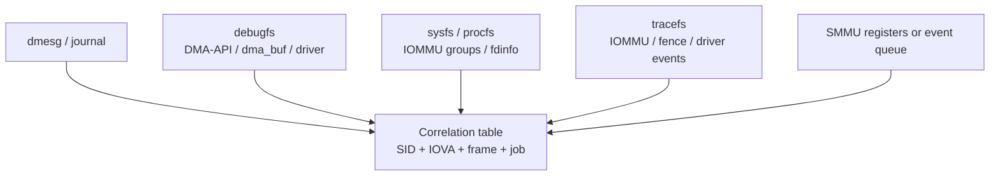

- `dmesg`: SMMU fault, queue/global error, driver timeout, mapping failure
- `debugfs`: DMA API debug, DMA-BUF inventory, driver-private rings
- `sysfs/procfs`: IOMMU group, DMA-BUF stats, process `fdinfo`
- `tracefs`: submit/map/unmap/fence/completion/fault ordering
- SMMU MMIO/EVTQ: architecture-specific fault evidence

### 5.2 DMA API Debug
DMA API debug는 잘못된 map/unmap API 사용을 찾는 기능이다. 예를 들어 잘못된 size/direction으로 unmap하거나 중복 unmap하는 경우 stack trace를 제공한다. 그러나 device가 stale IOVA로 실제 DMA를 수행한 이유를 NPU job까지 자동으로 연결해주지는 않는다.
```bash
mount -t debugfs none /sys/kernel/debug
mount -t tracefs none /sys/kernel/tracing

echo my_npu > /sys/kernel/debug/dma-api/driver_filter
echo 'file drivers/iommu/* +p' \
  > /sys/kernel/debug/dynamic_debug/control

dmesg -wT | tee /tmp/iommu-session.log
```

### 5.3 Trace Timeline
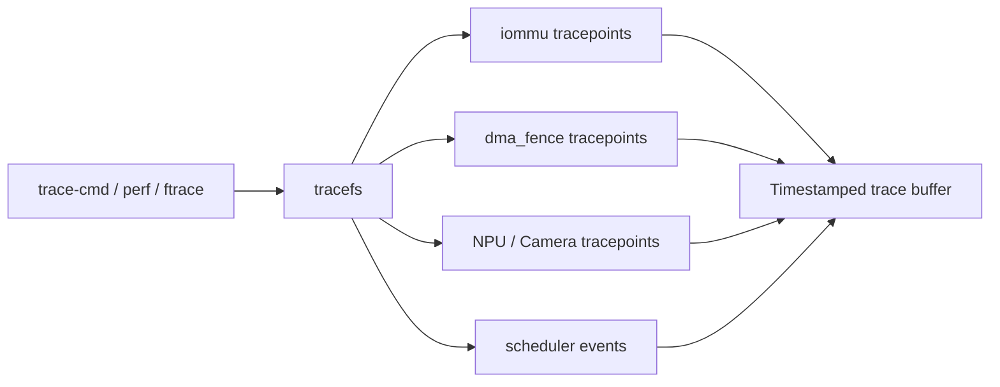
```bash
trace-cmd record \
  -e iommu \
  -e dma_fence \
  -e sched_switch \
  -e my_npu:* \
  sleep 10

trace-cmd report > /tmp/iommu-timeline.txt
```

Target kernel에서 실제 event system과 event name을 먼저 확인해야 한다. NPU driver에는 최소한 submit, map, unmap, start, IRQ, completion, cancel, timeout, fault를 위한 tracepoint를 두는 것이 좋다.

## 6. Linux Object Model에서 Fault Requester 찾기
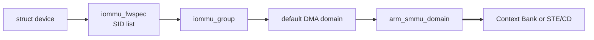

- `iommu_fwspec`: firmware가 제공한 IOMMU instance와 Stream ID 목록
- `iommu_group`: hardware topology상 isolation 가능한 최소 단위
- default DMA domain: 일반 DMA API mapping을 소유하는 domain
- `arm_smmu_domain`: SMMU driver의 vendor-specific domain object
- SMMUv2 Context Bank 또는 SMMUv3 STE/CD: hardware translation context

### 6.1 DT/ACPI에서 SID까지
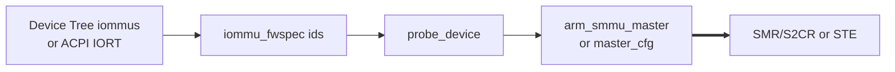

Fault SID가 DT의 `iommus` cell과 다르다면 driver mapping보다 먼저 interconnect/RTL integration을 확인한다. PCIe나 bridge가 있으면 requester ID aliasing도 고려한다.

## 7. SMMUv2 Fault Decode
| 항목 | 의미 | 질문 |
|---|---|---|
| FSR | translation/permission/access 등의 상태 | 어떤 fault class인가? |
| FAR | faulting input address | 어느 IOVA range인가? |
| FSYNR0 | R/W, page-table walk, level | DMA direction과 일치하는가? |
| CBFRSYNRA | Stream ID | 어느 requester인가? |
| Context Bank | 선택된 translation context | 예상 domain과 일치하는가? |
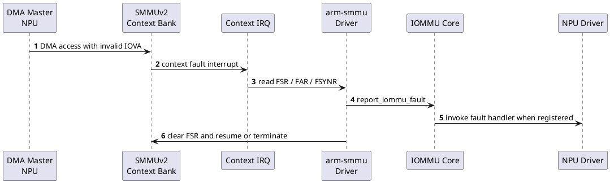

## 8. SMMUv3 EVTQ Decode
SMMUv3는 event record를 EVTQ에 기록한다. Linux `arm-smmu-v3` driver는 event ID와 SID/SSID/IOVA/IPA/stall/class를 decode해 fault 또는 IOPF path로 넘긴다.
| 계열 | 대표 의미 | 우선 확인 |
|---|---|---|
| BAD_STREAMID / STREAM_DISABLED | SID configuration/STE 상태 | firmware SID와 actual SID |
| STE/CD FETCH / BAD CONFIG | table address, format, visibility | ordered update와 coherency |
| TRANSLATION | valid mapping 부재 | mapping lifetime, page table |
| ADDR_SIZE | address width 초과 | DMA mask, aperture |
| ACCESS / PERMISSION | access flag 또는 R/W 권한 | mapping prot, access type |
| GERROR / overflow | queue/global/service failure | producer/consumer, IRQ latency |
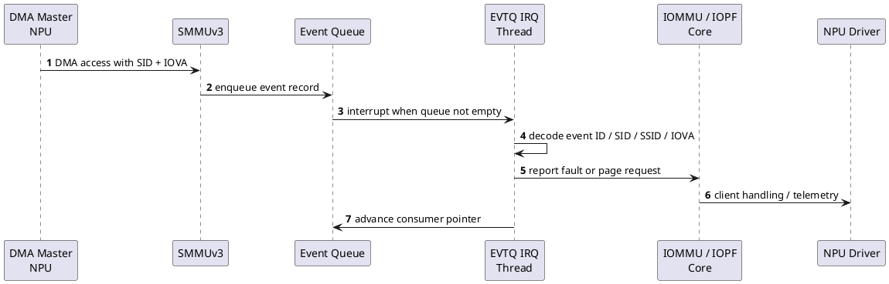

## 9. Fault Taxonomy와 진단 절차
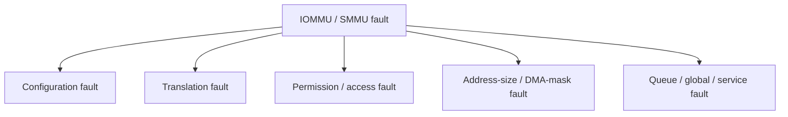

### 9.1 Translation Fault
- fault IOVA가 active mapping에 없으면 stale/unmapped 접근을 우선 의심한다.
- mapping이 존재하면 wrong domain, page-table visibility, invalidation ordering을 확인한다.
- timeout 뒤 fault라면 late DMA와 premature unmap의 timestamp를 비교한다.
- plane/tensor offset 계산이 mapping length를 벗어나지 않았는지 확인한다.

### 9.2 Permission Fault
- device access type과 IOMMU mapping permission을 비교한다.
- DMA direction은 cache synchronization 계약이며 permission과 완전히 같은 개념이 아니다.
- secure/non-secure, privileged, stage-2 permission을 별도로 고려한다.

### 9.3 Address-Size Fault
- device DMA register width, `dma_mask`, IOVA allocator aperture를 확인한다.
- 64-bit DMA address를 32-bit register에 truncate하는 bug는 메모리 배치에 따라 간헐적이다.
- SMMU output address size와 DRAM PA 범위를 확인한다.

### 9.4 Access/Coherency 구분
주소 접근이 architecture level에서 막혔는지, 접근은 성공했지만 내용이 stale한지 구분한다. Cache/fence 문제는 SMMU fault 없이 나타나는 경우가 많다.

### 9.5 STE/CD Fetch/Config Fault
SMMUv3 table은 memory-resident 구조이므로 base address, alignment, valid bit, configuration invalidation, memory ordering, coherency를 확인한다. Runtime PM resume 이후 table/queue base restore도 중요하다.

### 9.6 Unknown/Disabled Stream
actual interconnect SID와 firmware description을 비교한다. device attach 전에 DMA가 시작되거나 release 시 blocked domain으로 이동한 뒤 late DMA가 발생할 수도 있다.

### 9.7 Stall, PRI, IOPF
stall-capable device에서는 SSID/PASID, group ID, response code가 추가 evidence다. Fixed buffer NPU pipeline은 retry보다 fail-fast와 controlled recovery가 더 단순할 수 있다.

## 10. IOVA Reverse Lookup 설계
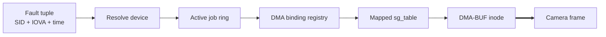

SMMU는 `struct dma_buf`를 모르기 때문에 driver가 mapping registry를 유지해야 한다. registry는 fault handler fast path에서 bounded lookup이 가능하도록 interval tree, xarray, RCU snapshot 또는 per-job list로 설계할 수 있다.
```c
struct npu_dma_binding {
    u64 frame_seq;
    u64 job_id;
    struct dma_buf *dmabuf;
    struct dma_buf_attachment *attach;
    struct sg_table *sgt;
    dma_addr_t iova_start;
    size_t iova_len;
    u32 stream_id;
    enum dma_data_direction dir;
    ktime_t mapped_at;
};

bool binding_contains(const struct npu_dma_binding *b,
                      dma_addr_t fault_iova)
{
    return fault_iova >= b->iova_start &&
           fault_iova < b->iova_start + b->iova_len;
}
```

권장 retire 정보:
- retire reason: normal completion, cancel, timeout, process close, PM suspend
- hardware quiesce acknowledgment timestamp
- unmap timestamp와 IOTLB/ATC completion 여부

### 10.1 DMA-BUF Inventory
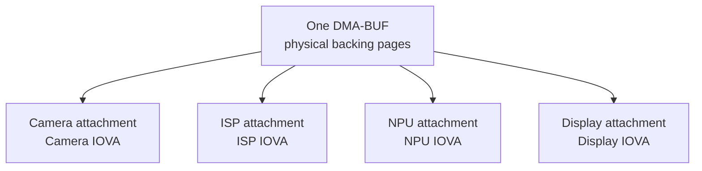
같은 backing pages라도 Camera, ISP, NPU, Display attachment에서 반환되는 DMA address는 다를 수 있다. attachment와 mapping을 device별로 독립 관리한다.

### 10.2 V4L2/VB2 State
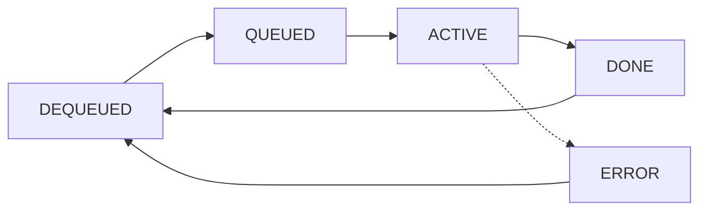
fault 시점의 VB2 state와 frame recycle 여부를 함께 확인한다. 이미 DEQUEUED되어 재사용된 buffer에 old NPU job이 접근하면 content corruption 또는 stale mapping 문제가 발생할 수 있다.

### 10.3 Correlation Log Schema
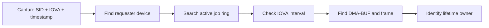
```c
dev_info(npu->dev,
         "job=%llu frame=%llu sid=%#x iova=%pad len=%zu "
         "inode=%lu dir=%s mapped_ns=%lld\n",
         job->id, job->frame_seq, bind->stream_id,
         &bind->iova_start, bind->iova_len,
         file_inode(bind->dmabuf->file)->i_ino,
         dma_dir_name(bind->dir),
         ktime_to_ns(bind->mapped_at));
```
Production에서는 raw address 노출을 제한하기 위해 IOVA offset/hash를 사용할 수 있다. 그러나 debug build에서는 정확한 interval correlation이 가능해야 한다.

## 11. Case Study A: Use-After-Unmap
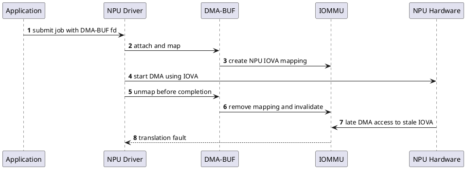
```c
/* BUG: mapping lifetime is shorter than hardware job lifetime. */
submit_job(npu, dma_addr);
dma_buf_unmap_attachment(attach, sgt, DMA_TO_DEVICE);
wait_for_completion(&job->done);

/* FIX: retire the mapping only after hardware completion. */
submit_job(npu, dma_addr);
wait_for_completion(&job->done);
dma_buf_unmap_attachment(attach, sgt, DMA_TO_DEVICE);
```

핵심은 software timeout을 hardware DMA stop으로 간주하지 않는 것이다. cancel/abort acknowledgment 또는 DMA idle status를 확인하고, 모든 outstanding transaction이 종료된 뒤 mapping을 제거한다.

## 12. Case Study B: Fence/Cache Race
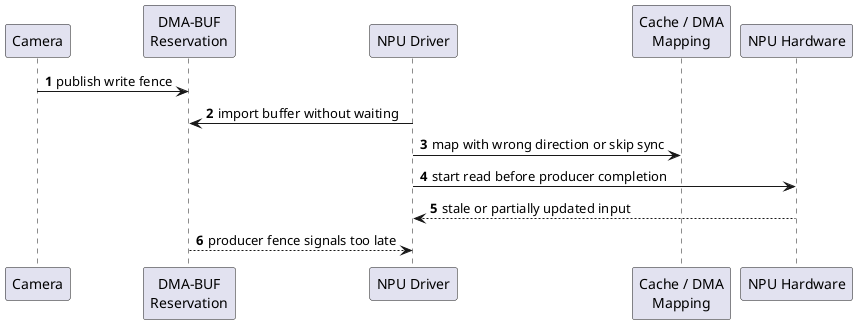

진단 체크:
- producer write fence가 signal되기 전에 NPU가 시작했는가?
- `DMA_TO_DEVICE`/`DMA_FROM_DEVICE`가 실제 data flow와 일치하는가?
- CPU access를 begin/end CPU access로 bracket했는가?
- stride/plane offset/tensor layout가 일치하는가?
- fault가 없다는 사실을 coherency가 정상이라는 증거로 오해하지 않았는가?

## 13. Case Study C: Wrong Stream ID
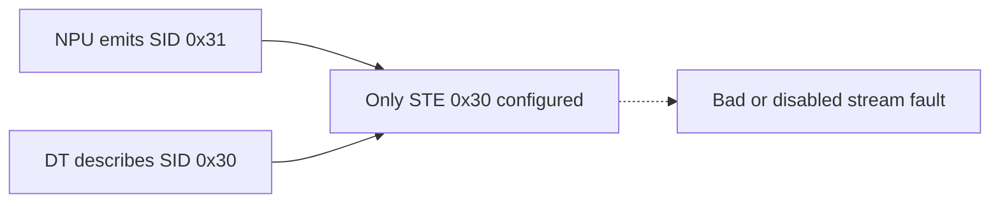
이 문제는 map/unmap 코드 수정으로 해결되지 않는다. actual requester SID와 firmware integration을 수정하고, requester probe와 hardware STE/SMR programming까지 검증해야 한다.

## 14. Case Study D~F
### 14.1 max segment / DMA mask
- single-base hardware라면 mapped SG가 DMA address 공간에서 연속인지 확인한다.
- `orig_nents`, `nents`, 각 `sg_dma_address/len`, max segment size를 기록한다.
- address width와 register programming을 확인한다.

### 14.2 Domain Reattach / Runtime PM
- suspend/resume 뒤 old IOVA를 재사용하지 않는다.
- blocked domain 전환 전에 hardware를 quiesce한다.
- STE/CD, queue base, IRQ enable과 attachment rebuild 순서를 정한다.

### 14.3 Queue Overflow/Timeout
- CMDQ timeout, EVTQ/PRIQ overflow, GERROR를 구분한다.
- NPU hang이 primary failure이고 SMMU fault가 secondary event일 수 있다.
- producer/consumer pointer와 IRQ thread scheduling latency를 수집한다.

## 15. Performance 분석
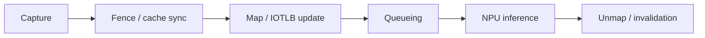

### 15.1 Map/Unmap Churn
buffer pool을 persistent attach/map하고 frame마다 재사용하면 CPU와 IOTLB invalidation 비용을 줄일 수 있다. 다만 mapping aperture가 오래 열리므로 stale access와 security policy를 관리해야 한다.

### 15.2 IOTLB Pressure
```mermaid
flowchart TB
    PAGES["Many small pages"]
    CHURN["Frequent map/unmap"]
    RANDOM["Random DMA access"]
    CTX["Many domains / contexts"]
    MISS["IOTLB miss rate rises"]
    WALK["More page-table walks"]
    LAT["Latency and bandwidth loss"]
    PAGES --> MISS
    CHURN --> MISS
    RANDOM --> MISS
    CTX --> MISS
    MISS --> WALK
    WALK ==> LAT
```
작은 page, 넓은 working set, random DMA, frequent invalidation, many domains는 IOTLB miss를 증가시킨다. 큰 page/block mapping은 coverage를 높이지만 alignment와 physical contiguity constraint가 있다.

### 15.3 Strict vs Lazy
| 모드 | 특징 | 장점 | trade-off |
|---|---|---|---|
| Strict | unmap 시 synchronous invalidate | 강한 isolation, 단순한 lifetime | unmap latency 증가 |
| Lazy | deferred/batched invalidate | throughput 향상 가능 | stale translation window |
| Persistent | normal path에서 unmap 최소화 | jitter 감소 | aperture와 retire policy 중요 |

### 15.4 ATS/ATC
ATS를 enable한 PCIe device는 device-side ATC도 invalidate해야 한다. Domain change와 unmap에서 TLBI와 ATC invalidation 순서를 지켜야 한다. On-chip NPU가 ATS를 사용하지 않는다면 이 경로는 제외할 수 있다.

### 15.5 Zero-Copy의 비용
```mermaid
flowchart LR
    ALLOC["Allocation"]
    ATTACH["Attachment"]
    MAP["IOVA mapping"]
    CACHE["Cache maintenance"]
    FENCE["Fence wait / signal"]
    TLBI["IOTLB / ATC invalidation"]
    ZERO["No payload memcpy"]
    ALLOC --> ATTACH
    ATTACH --> MAP
    MAP --> CACHE
    CACHE --> FENCE
    FENCE --> TLBI
    TLBI ==> ZERO
```

## 16. Security와 Safety
### 16.1 Least Mapping
```mermaid
flowchart TB
    CAM["Camera domain"]
    NPU["NPU domain"]
    DISP["Display domain"]
    BLOCK["Blocked default state"]
    BUF["Only approved buffers mapped"]
    MON["Fault monitor"]
    BLOCK --> CAM
    BLOCK --> NPU
    BLOCK --> DISP
    CAM --> BUF
    NPU --> BUF
    DISP --> BUF
    BUF --> MON
```
- idle/release 상태는 blocked domain을 고려한다.
- 승인된 buffer range만 최소 권한으로 mapping한다.
- shared IOMMU group은 독립 격리 단위가 아닐 수 있다.
- passthrough/identity mode는 호환성 수단이며 기본 보안 상태로 가정하지 않는다.

### 16.2 Automotive Fault Containment
```mermaid
flowchart LR
    SENSOR["Sensor pipeline"]
    SMMU["SMMU fault containment"]
    MON["Safety monitor"]
    SUP["Supervisor"]
    DEG["Degraded function"]
    RESET["Controlled recovery"]
    SENSOR --> SMMU
    SMMU --> MON
    MON --> SUP
    SUP --> DEG
    SUP --> RESET
```
SMMU는 잘못된 DMA가 다른 partition을 손상시키는 범위를 줄일 수 있다. Safety argument에는 detection latency, diagnostic coverage, recovery deadline, degraded-mode output validity를 포함해야 한다.

## 17. Controlled Recovery
```mermaid
flowchart LR
    RUN["RUNNING"]
    DET["FAULT DETECTED"]
    QUI["QUIESCE"]
    RESET["RESET CONTEXT"]
    REMAP["REMAP BUFFERS"]
    WARM["WARM-UP"]
    DEG["DEGRADED"]
    RUN --> DET
    DET --> QUI
    QUI --> RESET
    RESET --> REMAP
    REMAP --> WARM
    WARM ==> RUN
    QUI -.-> DEG
    RESET -.-> DEG
    REMAP -.-> DEG
```
```plantuml
@startuml
autonumber
participant "Fault Monitor" as MON
participant "Pipeline\nSupervisor" as SUP
participant "NPU Driver" as NPU
participant "ARM SMMU" as SMMU
participant "Camera / ISP" as CAM
MON -> SUP: fault tuple SID + IOVA + job
SUP -> NPU: stop new submissions
NPU -> CAM: hold or drop incoming frames
NPU -> SMMU: terminate stalled transaction
NPU -> NPU: quiesce and reset context
NPU -> SMMU: rebuild required mappings
NPU -> CAM: warm-up with known frame
NPU --> SUP: recovery result
SUP --> MON: return RUNNING or DEGRADED
@enduml
```
```c
if (fault_matches_active_job(evt)) {
    stop_new_submissions(npu);
    quiesce_npu(npu);
    terminate_or_drain_jobs(npu);
    detach_stale_mappings(npu);
    reset_npu_context(npu);
    rebuild_required_mappings(npu);
    resume_after_warmup(npu);
} else {
    enter_degraded_mode(supervisor);
}
```

복구 순서는 다음 불변 조건을 지켜야 한다.
1. 새로운 submit 차단
2. hardware DMA quiesce 또는 abort acknowledgment
3. stalled transaction 처리
4. stale mapping cleanup
5. device/SMMU context restore
6. required mapping rebuild
7. known-good frame warm-up
8. RUNNING 또는 DEGRADED 결정

## 18. End-to-End Incident Walkthrough
증상: 30 FPS pipeline에서 장시간 운전 뒤 NPU timeout, 이어서 SMMUv3 translation fault가 발생했다. Event에는 SID `0x30`, IOVA `0x48012000`이 기록되었다. Driver telemetry는 job `912`, frame `18421`과 연결되었고 mapping registry는 fault 전에 retire된 상태였다.
```plantuml
@startuml
autonumber
participant "Camera" as CAM
participant "ISP" as ISP
participant "NPU Driver" as NPU
participant "NPU Hardware" as HW
participant "SMMUv3" as SMMU
participant "Monitor" as MON
CAM -> ISP: frame 18421 captured
ISP -> NPU: DMA-BUF + fence signaled
NPU -> HW: job 912 submitted at IOVA 0x48000000
NPU -> NPU: error path releases mapping early
HW -> SMMU: delayed burst to 0x48012000
SMMU -> MON: F_TRANSLATION SID 0x30
MON -> NPU: correlate event with job 912
NPU --> MON: mapping lifetime violation confirmed
@enduml
```

### 18.1 5 Whys
1. NPU가 unmapped IOVA에 접근했다.
2. timeout error path가 completion 전에 mapping을 제거했다.
3. software timeout을 hardware DMA stop으로 간주했다.
4. abort acknowledgment와 mapping owner contract가 없었다.
5. delayed DMA fault injection과 error-path regression test가 없었다.

### 18.2 Corrective Action
- job object가 mapping reference를 소유하도록 변경한다.
- timeout → stop submit → abort → drain → unmap → reset 순서를 적용한다.
- driver/hardware interface에 quiesce acknowledgment를 정의한다.
- mapping registry와 correlation telemetry를 추가한다.
- delayed DMA, suspend/resume, memory pressure, repeated timeout test를 추가한다.

## 19. Fault Injection과 Validation
```plantuml
@startuml
autonumber
participant "Test Harness" as TEST
participant "NPU Driver" as NPU
participant "IOMMU Core" as CORE
participant "ARM SMMU" as SMMU
participant "Fault Monitor" as MON
TEST -> NPU: enable debug-only stale-IOVA injection
NPU -> CORE: map test buffer
NPU -> CORE: unmap before synthetic DMA
TEST -> NPU: trigger DMA to stale IOVA
NPU -> SMMU: issue test DMA transaction
SMMU -> MON: expected translation fault
MON --> TEST: verify SID / IOVA / job correlation
TEST -> NPU: disable injection and restore state
@enduml
```
```bash
# Debug build only. Never expose this control in production.
echo 1 > /sys/kernel/debug/my_npu/inject_stale_iova
trace-cmd record -e iommu -e my_npu sleep 2

dmesg | tail -200
cat /sys/kernel/debug/dma_buf/bufinfo
find /sys/kernel/iommu_groups -maxdepth 2 -type l

echo 0 > /sys/kernel/debug/my_npu/inject_stale_iova
```

Fault injection control은 debug build에서만 제공하고 production에 노출하지 않는다. 시험은 expected SID/IOVA/fault type을 자동 비교하고, fault 뒤 mapping/queue leak와 recovery state를 확인해야 한다.

### 19.1 Release Matrix
| 시험 | 관찰 | 통과 기준 |
|---|---|---|
| 24h streaming | fault, deadline, memory growth | fault/leak 0 |
| timeout/cancel stress | abort ack, late DMA | quiesce 후 unmap |
| suspend/resume | context restore, remap | old IOVA 사용 0 |
| memory pressure | SG, IOVA allocation | bounded error handling |
| fault injection | correlation, containment | expected event + recovery |
| security negative | unapproved access | SMMU가 차단 |

## 20. 퀴즈
1. SMMU fault 직후 reset보다 먼저 해야 할 작업은 무엇인가?
2. 같은 DMA-BUF가 Camera와 NPU에서 반드시 같은 IOVA를 갖는가?
3. translation fault와 stale-data 문제를 구분하는 핵심 기준은 무엇인가?
4. SMMUv3에서 SID configuration을 선택하는 메모리 자료구조는 무엇인가?
5. DMA API debug가 잡는 문제와 SMMU hardware fault의 차이는?
6. timeout 뒤 late DMA fault가 발생했다. 우선 비교할 세 timestamp는?
7. `iommu.strict=0`의 장점과 isolation trade-off는?
8. single-base NPU에서 `sg_table`의 무엇을 확인해야 하는가?
9. wrong Stream ID를 map/unmap 수정만으로 해결할 수 없는 이유는?
10. RUNNING 복귀 전 warm-up 검증이 필요한 이유는?

## 21. 정답과 해설
**1.** EVTQ/FSR, active job ring, mapping registry, DMA-BUF attachment, trace를 snapshot한다. Reset은 evidence를 파괴할 수 있다.

**2.** 아니다. DMA-BUF attachment별로 device address space mapping이 생성되므로 IOVA가 다를 수 있다.

**3.** 주소 접근 자체가 translation/permission에서 차단되었는지, 접근은 성공했지만 cache/fence 때문에 내용이 stale한지 본다.

**4.** STE(Stream Table Entry)다. Stage 1이면 STE가 CD table/context descriptor를 추가로 참조한다.

**5.** DMA API debug는 software API misuse를 탐지하고, SMMU fault는 실제 DMA transaction의 translation/permission 위반을 보고한다.

**6.** job submit, mapping unmap/retire, hardware completion/abort 또는 fault timestamp를 비교한다.

**7.** invalidate batching으로 throughput이 좋아질 수 있지만 stale translation이 남는 isolation window가 커질 수 있다.

**8.** `nents`, 각 `sg_dma_address/len`, 전체 DMA-contiguous span, max segment size와 device address width를 확인한다.

**9.** SID는 interconnect/firmware integration 식별자이며 IOVA page-table mapping과 다른 계층이기 때문이다.

**10.** reset 뒤 context, mapping, model state, output freshness가 정상인지 확인해야 safety supervisor가 결과를 신뢰할 수 있다.


## 22. 5분 복습 Flashcard
| 앞면 | 뒷면 |
|---|---|
| SID | 어느 requester가 DMA transaction을 발생시켰는가? |
| IOVA | fault address가 어느 active mapping interval에 속하는가? |
| Mapping lifetime | unmap이 모든 DMA completion보다 뒤인가? |
| Fence | producer completion과 consumer start ordering이 보장되는가? |
| IOTLB pressure | page 수, working set, invalidation churn이 얼마나 큰가? |
| Recovery | quiesce → cleanup → reset → remap → warm-up 순서인가? |

### 빈칸 복습
1. SMMU는 DMA-BUF를 모르므로 driver가 ______ registry를 유지해야 한다.
2. mapping lifetime은 모든 hardware ______ lifetime보다 길어야 한다.
3. SMMUv3 fault record는 주로 ______ Queue를 통해 software에 전달된다.
4. stale data 문제는 SMMU fault 없이 ______ 또는 fence 문제로 나타날 수 있다.
5. recovery는 reset 전에 device DMA ______를 확인해야 한다.

정답: mapping, DMA/job, Event, cache coherency, quiesce.

## 23. Hands-on 과제
1. Target DT/IORT와 hardware integration 문서를 기반으로 Stream ID inventory를 작성한다.
2. Mock NPU importer에 mapping registry와 correlation tuple logging을 추가한다.
3. stale IOVA fault injection으로 expected SID/IOVA/event type을 자동 검증한다.
4. persistent mapping과 per-frame mapping의 latency, CPU usage, TLBI 횟수를 비교한다.
5. timeout/cancel/suspend/resume error path에 대해 mapping lifetime invariant를 검증한다.

## 24. Source Reading Map
- `include/linux/iommu.h`
- `drivers/iommu/iommu.c`
- `drivers/iommu/dma-iommu.c`
- `drivers/iommu/arm/arm-smmu/arm-smmu.c`
- `drivers/iommu/arm/arm-smmu-v3/arm-smmu-v3.c`
- `drivers/iommu/arm/arm-smmu-v3/arm-smmu-v3.h`
- `kernel/dma/debug.c`
- `include/trace/events/iommu.h`
- `include/trace/events/dma_fence.h`
- `drivers/dma-buf/dma-buf.c`
- `drivers/media/common/videobuf2/`

## 25. 공식 문서
- Linux DMA API: <https://docs.kernel.org/core-api/dma-api.html>
- Kernel parameters: <https://docs.kernel.org/admin-guide/kernel-parameters.html>
- DMA-BUF: <https://docs.kernel.org/driver-api/dma-buf.html>
- ARM SMMU Device Tree binding: `Documentation/devicetree/bindings/iommu/arm,smmu.yaml`
- ARM SMMUv3 Device Tree binding: `Documentation/devicetree/bindings/iommu/arm,smmu-v3.yaml`
