# 3강. Linux IOMMU Framework

> **개정 기준:** architecture/flow 표현은 Mermaid, sequence 표현은 PlantUML을 사용합니다. PlantUML의 label/message 줄바꿈은 실제 개행이 아니라 `\n` escape로 작성했으며, 문서 내 Mermaid 23개와 PlantUML 4개 block을 실제 렌더링하여 syntax를 검증했습니다.

> **강의 목표:** 1강의 IOMMU 개념과 2강의 DMA API 사용법을 Linux Kernel 내부 객체와 실행 흐름으로 연결합니다.  
> **핵심 질문:** `dma_map_single()` 이후 커널은 어떤 객체를 선택하고, 어떤 계층을 통해 IOVA -> PA mapping을 하드웨어에 반영하는가?

---

## 1. 학습 목표

이 강의를 마치면 다음 내용을 설명할 수 있어야 합니다.

1. DMA Mapping API와 IOMMU Core API의 역할을 구분한다.
2. `struct device`, `iommu_device`, `iommu_domain`, `iommu_group`, `iommu_ops` 관계를 설명한다.
3. default domain이 부팅 및 device probe 과정에서 선택되는 흐름을 설명한다.
4. `dma_map_single()`이 IOVA allocation과 IOMMU mapping으로 연결되는 순서를 추적한다.
5. IOTLB, strict/lazy invalidation, VFIO/IOMMUFD를 기본 수준에서 설명한다.
6. Embedded/Automotive pipeline에서 IOMMU fault를 분석할 수 있는 기준을 세운다.

## 2. 전체 10강 중 3강의 위치

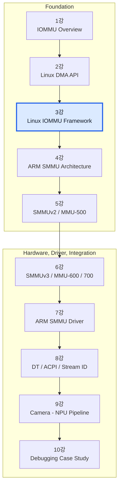

1강과 2강은 **왜 IOMMU가 필요한가**와 **일반 driver가 DMA API를 어떻게 쓰는가**를 다뤘습니다. 3강은 그 API 뒤에 있는 Linux Kernel 공통 계층을 다룹니다.

## 3. 2강 복습: 일반 driver의 출발점

```c
static int npu_submit(struct npu_dev *npu, void *buf, size_t size)
{
    dma_addr_t dma_addr;

    dma_addr = dma_map_single(npu->dev, buf, size, DMA_TO_DEVICE);
    if (dma_mapping_error(npu->dev, dma_addr))
        return -ENOMEM;

    writel(lower_32_bits(dma_addr), npu->regs + NPU_DMA_ADDR_LO);
    writel(upper_32_bits(dma_addr), npu->regs + NPU_DMA_ADDR_HI);
    writel(NPU_START, npu->regs + NPU_CMD);

    return 0;
}
```

중요한 규칙은 다음과 같습니다.

- driver는 CPU pointer를 device register에 쓰지 않습니다.
- `dma_map_single()`이 반환한 `dma_addr_t`를 device에 전달합니다.
- IOMMU가 활성화된 시스템에서 `dma_addr_t`는 보통 IOVA입니다.
- DMA가 끝나기 전에 buffer를 unmap하거나 free하면 안 됩니다.

## 4. Linux IOMMU Framework의 큰 그림

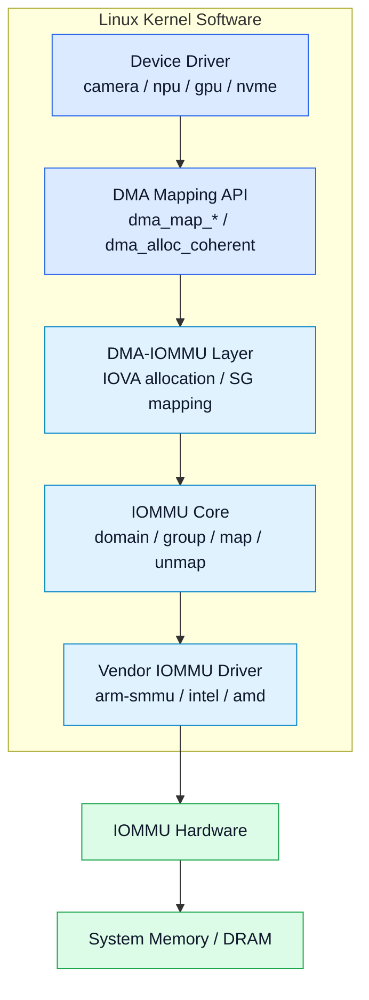

일반 driver는 대개 IOMMU hardware를 직접 제어하지 않습니다. DMA Mapping API가 device의 DMA 환경을 확인하고, 필요한 경우 DMA-IOMMU layer와 IOMMU Core를 통해 vendor driver를 호출합니다.

### 각 계층의 책임

| 계층 | 주요 책임 |
|---|---|
| Device Driver | buffer 준비, DMA direction 결정, DMA address를 hardware에 설정 |
| DMA Mapping API | 공통 driver API, DMA mask/cache/bounce/IOMMU 경로 선택 |
| DMA-IOMMU Layer | IOVA allocation, DMA domain mapping, scatter-gather 처리 |
| IOMMU Core | domain/group/device lifecycle과 공통 map/unmap API |
| Vendor IOMMU Driver | page table, context, register/queue, fault 처리 |
| Hardware | IOVA translation, permission check, IOTLB, fault generation |

## 5. 왜 공통 Framework가 필요한가?

ARM SMMU, Intel VT-d, AMD-Vi는 하드웨어 모델과 programming interface가 다릅니다. 그러나 상위 계층이 원하는 동작은 공통적입니다.

- device를 주소 공간에 attach
- IOVA -> PA mapping 생성/제거
- 접근 권한 설정
- translation cache invalidate
- fault 보고
- 격리 가능한 device 집합 관리

Linux IOMMU Framework는 vendor 차이를 callback interface 뒤로 숨깁니다.

## 6. 주소 공간을 정확히 구분하기

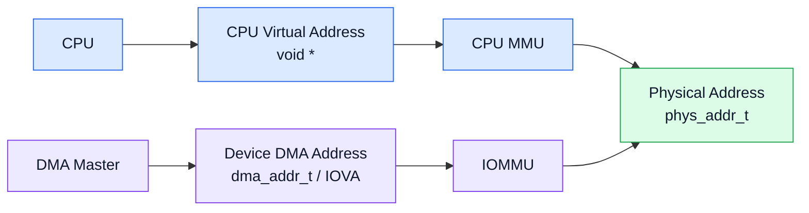

| 주소 | 사용자 | 대표 타입 | CPU 직접 접근 |
|---|---|---|---|
| CPU virtual address | CPU/kernel | `void *` | 가능 |
| Physical address | MMU/IOMMU page table, resource 관리 | `phys_addr_t` | 직접 pointer로 사용 불가 |
| DMA address / IOVA | DMA master | `dma_addr_t` | 불가 |

`dma_addr_t`를 CPU pointer처럼 dereference하지 않습니다. DMA API 문서에서 device는 bus/DMA address를 사용하며, IOMMU가 DMA address와 physical address 사이에 임의의 mapping을 만들 수 있다고 설명합니다.

## 7. DMA API와 IOMMU API의 역할 분리

| 구분 | 주 사용자 | 대표 API | 목적 |
|---|---|---|---|
| DMA Mapping API | 일반 device driver | `dma_map_single()`, `dma_map_sg()`, `dma_alloc_coherent()` | buffer를 device가 사용할 수 있게 함 |
| IOMMU Core API | IOMMU driver, VFIO/IOMMUFD, 특수 subsystem | `iommu_attach_device()`, `iommu_map()`, `iommu_unmap()` | I/O address space를 직접 관리 |
| Vendor callbacks | ARM SMMU, VT-d 등 | `iommu_ops`, `iommu_domain_ops` | 실제 hardware 구현 |

일반적인 driver는 `iommu_map()`을 직접 호출하기보다 DMA API를 사용합니다. 직접 IOMMU API를 사용하면 domain ownership, DMA mask, cache sync, IOTLB, lifetime을 모두 책임져야 하기 때문입니다.

## 8. 핵심 객체 관계

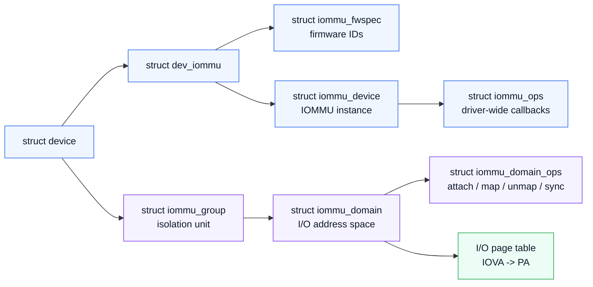

### 핵심 객체 요약

| 객체 | 의미 |
|---|---|
| `struct device` | DMA를 수행하는 endpoint device |
| `struct dev_iommu` | device별 IOMMU runtime 정보 |
| `struct iommu_fwspec` | DT/ACPI에서 파싱한 IOMMU ID 정보 |
| `struct iommu_device` | IOMMU hardware instance |
| `struct iommu_ops` | IOMMU driver 전체 callback |
| `struct iommu_domain` | device가 사용하는 I/O address space |
| `struct iommu_domain_ops` | domain의 attach/map/unmap/sync callback |
| `struct iommu_group` | hardware가 보장하는 최소 isolation 단위 |

## 9. `struct device`: 모든 DMA 흐름의 시작점

DMA API는 `struct device *dev`를 기준으로 다음을 선택합니다.

- DMA mask와 coherent mask
- DMA operations
- IOMMU 연결 정보와 Stream/Requester ID
- default IOMMU domain
- IOMMU group
- firmware node

잘못된 `dev`를 사용하면 다른 DMA mask 또는 다른 domain이 선택되어 mapping fault나 data corruption이 발생할 수 있습니다.

## 10. `dev_iommu`와 firmware 정보

`struct device`의 IOMMU 관련 runtime 정보는 `struct dev_iommu` 아래에 모입니다. 현재 upstream의 주요 연결은 개념적으로 다음과 같습니다.

- `fwspec`: firmware에서 온 IOMMU IDs
- `iommu_dev`: endpoint가 연결된 IOMMU instance
- `priv`: vendor driver의 per-device private data
- fault 관련 runtime data
- PASID capability 및 attach 정책 정보

Kernel version마다 필드와 lifecycle이 바뀔 수 있으므로 target BSP의 `include/linux/iommu.h`를 기준으로 확인해야 합니다.

## 11. `struct iommu_device`: IOMMU hardware instance

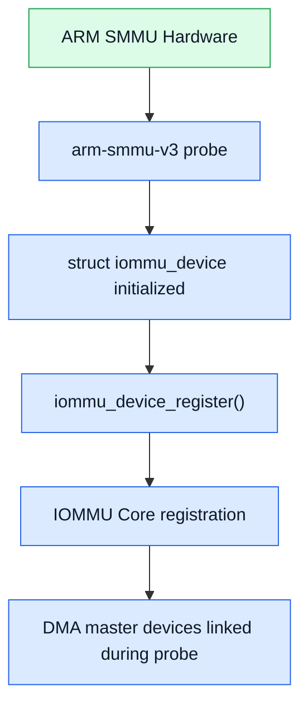

`iommu_device_register()`를 통해 vendor driver가 hardware instance를 IOMMU Core에 등록합니다. 이후 endpoint device probe 과정에서 Core가 해당 device를 올바른 IOMMU instance에 연결합니다.

## 12. `iommu_ops`와 `iommu_domain_ops`

### `struct iommu_ops`

IOMMU driver 전체의 capability와 device-level 동작을 표현합니다. upstream 예로는 다음 계열의 callback이 있습니다.

- capability/hardware information
- paging, identity, SVA, nested domain allocation
- `probe_device()` / `release_device()`
- `device_group()`
- firmware translation
- default domain type

### `struct iommu_domain_ops`

특정 domain의 실제 mapping 동작을 표현합니다.

- `attach_dev()`
- `map_pages()` / `unmap_pages()`
- `flush_iotlb_all()` / `iotlb_sync()`
- `iova_to_phys()`
- domain free 및 page-table quirk

즉, `iommu_ops`는 **driver-wide control plane**, `iommu_domain_ops`는 **domain data plane**으로 이해할 수 있습니다.

## 13. `iommu_domain`: device용 I/O address space

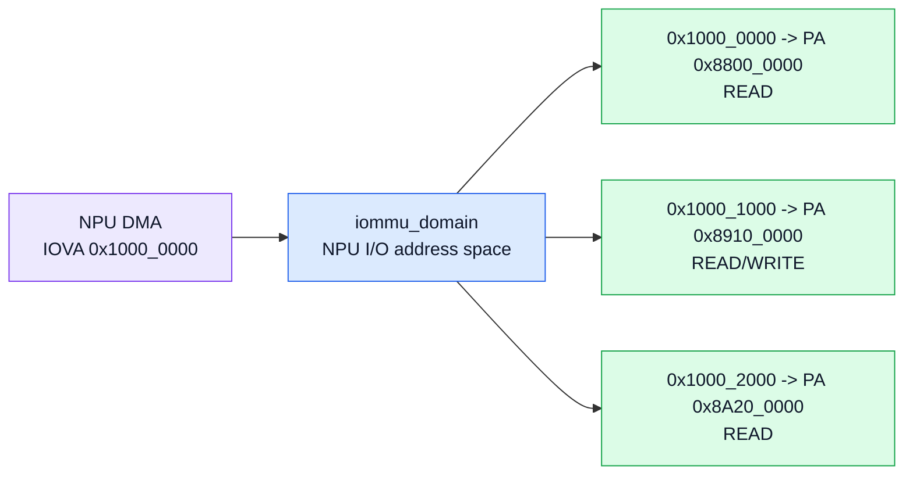

`iommu_domain`은 단순한 page table pointer만이 아닙니다. domain type, geometry, supported page size, callback, fault handler, IOVA allocator cookie 등의 상태를 포함할 수 있습니다.

CPU process마다 주소 공간이 다르듯, DMA master도 서로 다른 domain에 attach되어 다른 IOVA view를 가질 수 있습니다.

## 14. IOMMU domain type

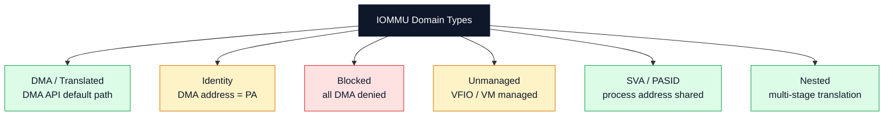

현재 upstream의 주요 domain type에는 BLOCKED, IDENTITY, UNMANAGED, DMA, DMA_FQ, SVA, NESTED 등이 있습니다. API와 내부 flag는 kernel version에 따라 달라질 수 있습니다.

## 15. DMA / Translated domain

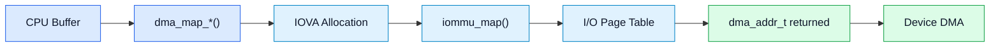

일반 DMA API 경로에서 가장 흔한 domain입니다.

장점:

- device memory access를 필요한 범위로 제한
- scattered physical pages를 contiguous IOVA로 제공
- device DMA mask에 맞는 IOVA 제공
- device별 address space 분리

비용:

- map/unmap과 page-table update
- IOTLB miss/page-table walk
- IOVA allocator 및 page-table memory

## 16. Identity / Passthrough domain

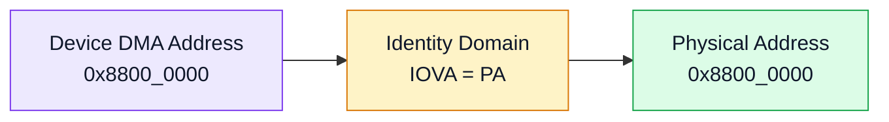

Identity domain에서는 DMA address가 system physical address와 동일한 형태입니다. 호환성 또는 성능 목적이 있을 수 있지만 translated domain보다 보호 범위가 약해질 수 있습니다.

`iommu.passthrough=1`과 hardware-specific bypass는 완전히 같은 개념이 아닐 수 있으므로 target kernel과 driver 구현을 확인해야 합니다.

## 17. Blocked domain

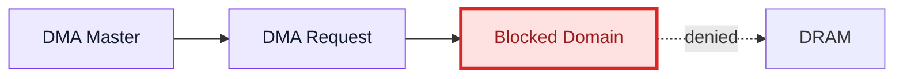

Blocked domain은 모든 DMA를 거부하는 default-deny 상태입니다.

- driver bind 전후의 안전 상태
- 사용하지 않는 DMA master 격리
- release 이후 stale DMA 방지
- security/safety policy의 기본 상태

Automotive SoC에서는 미사용 master를 blocked 상태로 유지하는 설계가 특히 중요합니다.

## 18. Unmanaged / User-managed domain

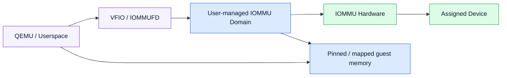

VFIO/IOMMUFD, VM passthrough, userspace driver 등은 I/O page table mapping을 별도의 ownership model로 관리합니다. 이 경우 pinned memory lifetime, group ownership, IOVA overlap, unmap ordering이 security boundary가 됩니다.

## 19. `iommu_group`: 최소 isolation 단위

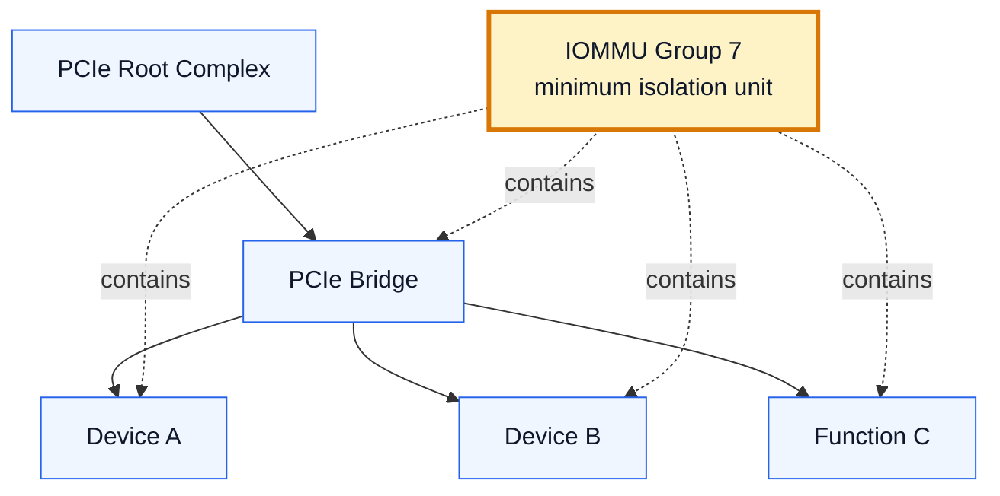

항상 device 하나가 독립적으로 격리되는 것은 아닙니다. PCIe bridge, multi-function device, requester ID aliasing, peer-to-peer path 때문에 여러 function이 한 group에 들어갈 수 있습니다.

VFIO가 group을 ownership 단위로 보는 이유는 group 안의 일부 device만 userspace에 넘기면 isolation이 깨질 수 있기 때문입니다.

## 20. IOMMU group 확인

```bash
# List IOMMU groups and their devices.
find /sys/kernel/iommu_groups -maxdepth 2 -type l -print

# Example: inspect group 7.
readlink -f /sys/kernel/iommu_groups/7/devices/*
```

Embedded platform에서도 group 구성이 예상과 다르면 DT의 Stream ID, PCIe topology, group callback을 함께 확인합니다.

## 21. Default domain과 device probe

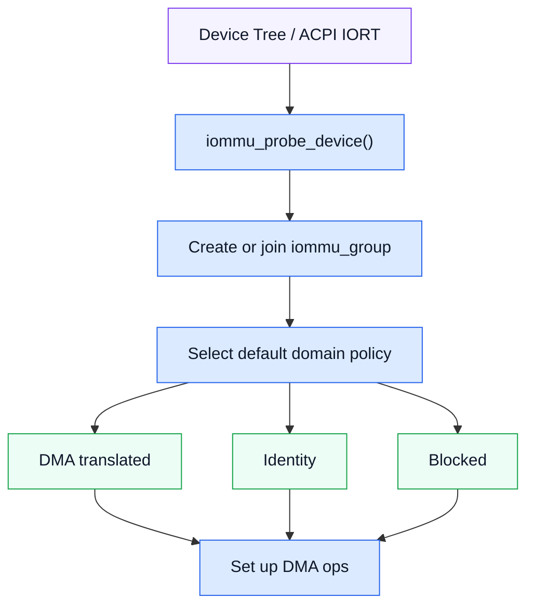

Default domain 선택은 다음 조건의 영향을 받습니다.

- kernel config와 command line
- IOMMU driver policy
- device 특성
- firmware reserved regions
- platform/security policy

## 22. 부팅 및 probe sequence

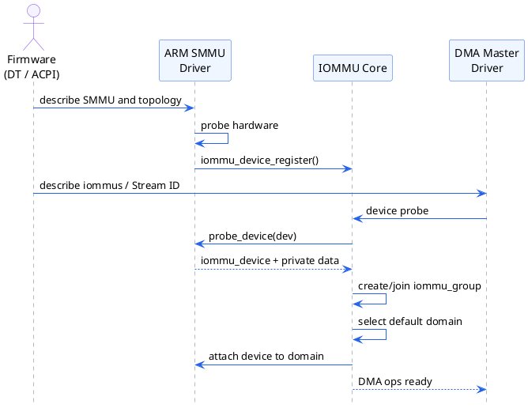

중요한 순서는 다음과 같습니다.

1. firmware가 IOMMU topology를 제공합니다.
2. IOMMU driver가 hardware instance를 등록합니다.
3. endpoint device가 probe됩니다.
4. Core가 device를 group/domain에 연결합니다.
5. DMA ops가 설정된 이후 일반 DMA API가 동작합니다.

## 23. Device Tree와 Stream ID 연결

```dts
smmu: iommu@2b400000 {
    compatible = "arm,smmu-v3";
    reg = <0x0 0x2b400000 0x0 0x100000>;
    #iommu-cells = <1>;
};

npu@12340000 {
    compatible = "vendor,npu";
    reg = <0x0 0x12340000 0x0 0x10000>;
    iommus = <&smmu 0x20>;
    dma-coherent;
};
```

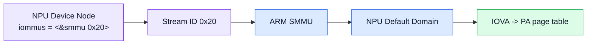

`iommus = <&smmu 0x20>;`의 cell 의미는 binding에 따라 결정됩니다. SMMUv3의 일반적인 1-cell binding에서는 값이 Stream ID입니다.

오류가 있으면 다음 문제가 발생할 수 있습니다.

- 잘못된 Stream ID로 translation fault
- 예상 domain에 attach되지 않음
- device가 bypass 또는 blocked 상태에 머묾
- 다른 device의 context가 선택됨

## 24. `dma_map_single()` 내부 sequence

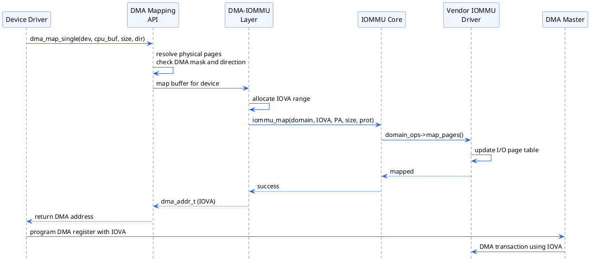

이 diagram은 개념적 경로입니다. 실제 함수 이름과 call depth는 architecture, kernel version, config에 따라 달라집니다. 중요한 것은 **IOVA allocation -> IOMMU map -> dma_addr_t 반환**의 관계입니다.

## 25. IOMMU Core API 예시

```c
struct iommu_domain *domain;
int ret;

domain = iommu_paging_domain_alloc(dev);
if (IS_ERR(domain))
    return PTR_ERR(domain);

ret = iommu_attach_device(domain, dev);
if (ret)
    goto free_domain;

ret = iommu_map(domain, iova, phys_addr, size,
                IOMMU_READ | IOMMU_WRITE, GFP_KERNEL);
if (ret)
    goto detach;

/* Device DMA uses the mapped IOVA here. */

iommu_unmap(domain, iova, size);
detach:
    iommu_detach_device(domain, dev);
free_domain:
    iommu_domain_free(domain);
```

이 코드는 lifecycle을 설명하기 위한 pseudo code입니다. 일반 device driver에 그대로 적용하는 예제가 아닙니다. 실제 사용자는 error unwind, existing/default domain, concurrent DMA, IOTLB synchronization을 더 엄격히 처리해야 합니다.

## 26. attach / map / unmap sequence

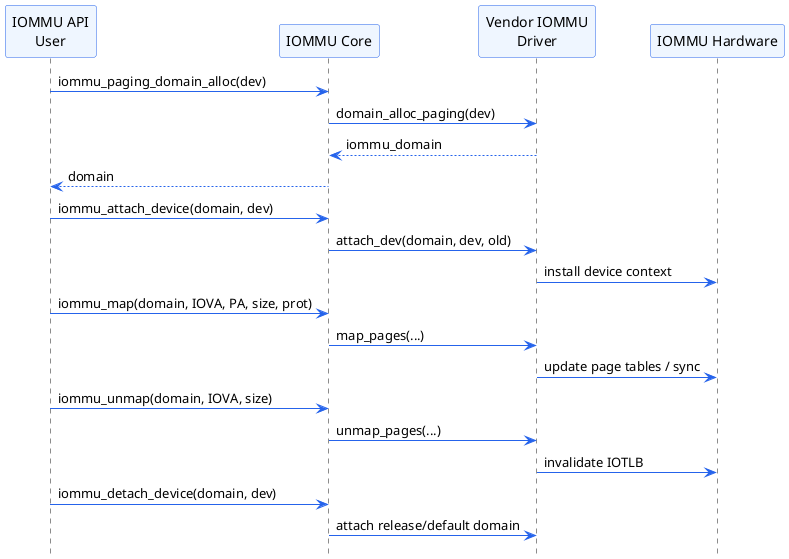

`iommu_unmap()`이 page-table entry를 제거하더라도 hardware translation cache가 남아 있을 수 있으므로 IOTLB synchronization이 lifecycle의 일부입니다.

## 27. IOMMU page table과 io-pgtable

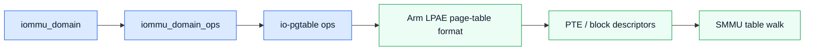

ARM SMMU driver는 공통 io-pgtable library를 사용해 Arm LPAE 형식의 translation table을 구성하는 경우가 많습니다.

주요 고려 요소:

- page granule과 supported page size
- stage 1/stage 2 format
- read/write/privileged permission
- memory attribute와 shareability
- block mapping 가능 여부
- page-table walk coherency

## 28. IOVA allocator


IOVA allocator는 device DMA aperture에서 사용 가능한 range를 관리합니다.

- DMA mask 밖의 address는 할당하면 안 됨
- reserved region과 MSI window를 피해야 함
- fragmentation이 커지면 큰 buffer mapping이 실패할 수 있음
- unmap 누락은 IOVA leak으로 이어짐

## 29. Scatter-Gather mapping

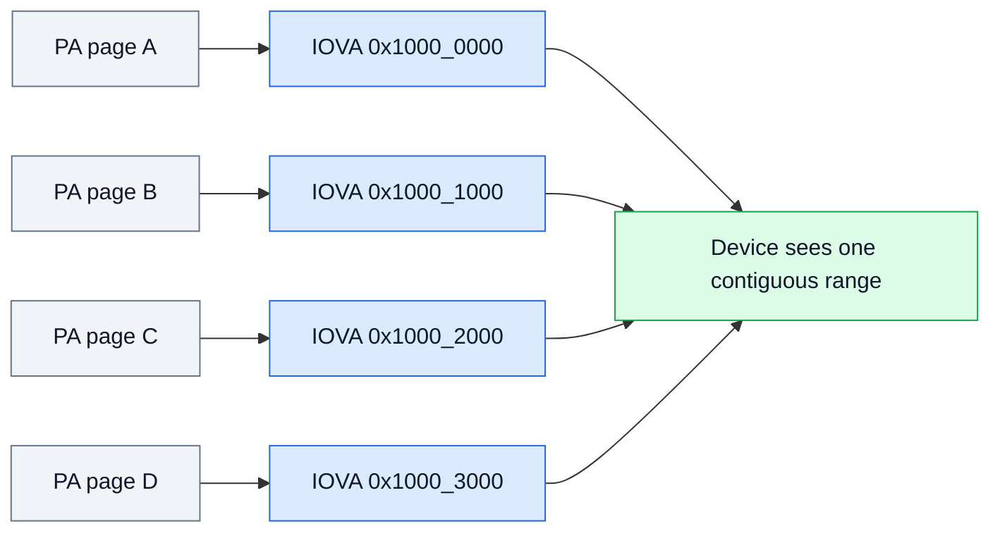

물리적으로 흩어진 pages를 device에게 contiguous IOVA range로 보여줄 수 있습니다. Camera frame, GPU object, NPU tensor, DMA-BUF attachment에서 중요한 기능입니다.

`dma_map_sg()`의 반환값은 원래 `nents`보다 작을 수 있습니다. DMA layer가 인접 entry를 merge할 수 있기 때문입니다. device descriptor에는 mapping 후의 entry count와 `sg_dma_address()`/`sg_dma_len()`을 사용해야 합니다.

## 30. IOTLB

```mermaid
flowchart LR
  DEV["Device IOVA"] --> LOOK["IOTLB Lookup"]
  LOOK -->|hit| PA["Physical Address"]
  LOOK -->|miss| WALK["I/O Page-table Walk"] --> FILL["Fill IOTLB"] --> PA
  UNMAP["unmap / permission change"] --> INV["IOTLB invalidate / sync"] --> LOOK
  classDef req fill:#ede9fe,stroke:#7c3aed,color:#0f172a;
  classDef cache fill:#dbeafe,stroke:#2563eb,color:#0f172a;
  classDef mem fill:#dcfce7,stroke:#16a34a,color:#0f172a;
  classDef warn fill:#fef3c7,stroke:#d97706,color:#0f172a;
  class DEV req;
  class LOOK,WALK,FILL cache;
  class PA mem;
  class UNMAP,INV warn;
```

IOTLB는 IOVA -> PA translation cache입니다. unmap 이후 stale entry가 남으면 이미 해제되거나 재사용된 memory에 device가 DMA할 수 있으므로 invalidate/sync ordering이 중요합니다.

## 31. Strict, lazy, passthrough trade-off

| 정책 | 기본 동작 | 장점 | 위험/비용 |
|---|---|---|---|
| Strict | unmap과 translation invalidation을 동기적으로 연결 | 강한 isolation, 빠른 revoke | map/unmap workload의 비용 증가 |
| Lazy / DMA_FQ | invalidation을 batching 또는 지연 | throughput 향상 가능 | revoke window가 길어질 수 있음 |
| Passthrough / Identity | DMA address를 PA와 동일하게 사용 | 단순성/호환성 | memory isolation 약화 |

성능 수치만으로 정책을 선택하지 말고 device trust, virtualization boundary, safety goal을 함께 고려해야 합니다.

## 32. IOMMU fault 분류

| Fault | 대표 의미 | 우선 확인할 항목 |
|---|---|---|
| Translation fault | IOVA mapping 없음 | map 성공 여부, unmap/free 시점 |
| Permission fault | read/write 권한 위반 | DMA direction, IOMMU protection bits |
| Address size/aperture fault | address 범위 초과 | DMA mask, domain geometry, IOVA allocator |
| Stream/context fault | context 선택 실패 | Stream ID/Requester ID, DT/ACPI topology |
| Page request fault | recoverable page 요청 | PASID/PRI/SVA fault queue와 response |

## 33. Fault handling sequence

```plantuml
@startuml
hide footbox
skinparam backgroundColor white
skinparam sequenceArrowColor #DC2626
skinparam participantBorderColor #2563EB
skinparam participantBackgroundColor #EFF6FF
participant "DMA Master\n(NPU)" as DEV
participant "IOMMU Hardware" as HW
participant "Vendor IOMMU\nDriver" as VENDOR
participant "IOMMU Core" as CORE
participant "Device Driver /\nFault Consumer" as HANDLER
DEV -> HW: DMA access\nIOVA + read/write
HW -> HW: translation and permission check
alt mapping and permission valid
  HW --> DEV: translated memory access
else translation or permission fault
  HW -> VENDOR: interrupt / event record
  VENDOR -> VENDOR: decode SID, IOVA, access type
  VENDOR -> CORE: report device fault
  CORE -> HANDLER: invoke fault handler / log
  HANDLER -> HANDLER: correlate IOVA with mapping lifetime
  HANDLER --> CORE: recover, terminate, or report
end
@enduml
```

Fault 분석의 최소 정보는 다음과 같습니다.

- faulting device 또는 Stream/Requester ID
- IOVA
- read/write/execute 성격
- translation stage와 fault type
- 해당 IOVA의 mapping lifetime
- device completion/synchronization 상태

## 34. VFIO와 group ownership

```mermaid
flowchart LR
  VM["QEMU / VM"] --> VFIO["VFIO"] --> GROUP["IOMMU Group Ownership"] --> DOM["IOMMU Domain"] --> DEV["PCIe Device"]
  DOM --> GMEM["Guest memory mappings only"]
  classDef user fill:#f5f3ff,stroke:#7c3aed,color:#0f172a;
  classDef core fill:#dbeafe,stroke:#2563eb,color:#0f172a;
  classDef hw fill:#dcfce7,stroke:#16a34a,color:#0f172a;
  class VM,VFIO user;
  class GROUP,DOM,GMEM core;
  class DEV hw;
```

VFIO는 group 전체가 host driver에서 안전하게 분리되었는지 확인한 뒤 userspace에 device access를 제공합니다. IOMMU는 guest가 허용한 memory만 assigned device가 DMA하도록 제한합니다.

## 35. IOMMUFD object model

```mermaid
flowchart LR
  FD["/dev/iommu FD"] --> IOAS["IOAS<br/>I/O address space"]
  FD --> DEV["DEVICE<br/>bound device"]
  IOAS --> HWPT["HWPT_PAGING<br/>hardware page table"]
  HWPT --> DOM["struct iommu_domain"]
  DEV --> HWPT
  HWPT --> FAULT["FAULT / page request queue"]
  classDef user fill:#f5f3ff,stroke:#7c3aed,color:#0f172a;
  classDef core fill:#dbeafe,stroke:#2563eb,color:#0f172a;
  class FD,IOAS,DEV,HWPT,FAULT user;
  class DOM core;
```

- **IOAS:** userspace가 IOVA range에 memory를 map/unmap하는 I/O address space
- **DEVICE:** iommufd context에 bind된 endpoint
- **HWPT_PAGING:** 실제 hardware page table이며 kernel `iommu_domain`과 연결
- **FAULT:** page request/fault event를 userspace와 교환하는 객체

IOMMUFD의 객체와 ioctl은 빠르게 발전하므로 target kernel documentation과 UAPI header를 함께 확인해야 합니다.

## 36. Embedded/Automotive pipeline에서의 역할

```mermaid
flowchart LR
  CAM["Camera / CSI"] -->|DMA write| FB["Frame Buffer"] --> ISP["ISP"] -->|DMA read/write| PB["Processed Buffer"] --> NPU["NPU"] -->|DMA read/write| RES["Tensor / Result"] --> DISP["Display / GPU"]
  SMMU["IOMMU Framework + ARM SMMU"] -. maps and isolates .-> CAM
  SMMU -. maps and isolates .-> ISP
  SMMU -. maps and isolates .-> NPU
  SMMU -. maps and isolates .-> DISP
  classDef dev fill:#dbeafe,stroke:#2563eb,color:#0f172a;
  classDef buf fill:#dcfce7,stroke:#16a34a,color:#0f172a;
  classDef smmu fill:#fef3c7,stroke:#d97706,stroke-width:3px,color:#0f172a;
  class CAM,ISP,NPU,DISP dev;
  class FB,PB,RES buf;
  class SMMU smmu;
```

IOMMU Framework는 pipeline의 data format이나 fence 자체를 관리하지 않습니다. 각 device의 DMA address space와 접근 권한을 구성하고, DMA-BUF attachment가 device에 map될 때 필요한 IOVA mapping을 제공합니다.

Safety/security 관점:

- 최소 buffer만 최소 permission으로 mapping
- 미사용 master blocked
- fault log와 health monitor 연계
- passthrough/identity 사용 사유 문서화
- buffer lifetime과 DMA completion 보장

성능 관점:

- buffer mapping 재사용
- map/unmap batching
- large page/block mapping 가능성
- IOTLB working set 관리
- fragmented SG list 감소

## 37. Debugging 명령

```bash
dmesg | grep -Ei 'iommu|smmu|fault'
cat /proc/cmdline
find /sys/kernel/iommu_groups -maxdepth 2 -type l -print

# When DMA API debug is enabled:
ls /sys/kernel/debug/dma-api/
cat /sys/kernel/debug/dma-api/all_errors
```

### 권장 분석 순서

1. SMMU/IOMMU driver probe 여부 확인
2. command line의 passthrough/strict 관련 정책 확인
3. faulting SID/device/IOVA/access type 확인
4. driver가 받은 `dma_addr_t`와 hardware register 값 비교
5. map/unmap/free/completion timestamp 비교
6. cache coherency 문제와 translation fault를 분리
7. DMA-BUF exporter/importer lifetime과 fence 확인

## 38. Kernel source reading map

```mermaid
flowchart TB
  H["include/linux/iommu.h<br/>types and public API"] --> C["drivers/iommu/iommu.c<br/>core lifecycle / group / default domain"] --> D["drivers/iommu/dma-iommu.c<br/>DMA API bridge / IOVA"] --> A["drivers/iommu/arm/arm-smmu-v3/<br/>vendor driver"] --> P["drivers/iommu/io-pgtable-arm.c<br/>page-table format"]
  C --> F["drivers/iommu/iommufd/<br/>userspace API backend"]
  classDef src fill:#eff6ff,stroke:#2563eb,color:#0f172a;
  class H,C,D,A,P,F src;
```

추천 순서:

1. `include/linux/iommu.h`
2. `drivers/iommu/iommu.c`
3. `drivers/iommu/dma-iommu.c`
4. target vendor driver
5. `drivers/iommu/io-pgtable-arm.c`
6. 필요 시 `drivers/iommu/iommufd/`

## 39. 실전에서 자주 보는 문제

| 증상 | 가능 원인 | 확인 포인트 |
|---|---|---|
| translation fault | unmap 후 DMA, mapping 누락, 잘못된 IOVA | fault IOVA와 driver mapping log 비교 |
| DMA mapping failure | DMA mask, IOVA aperture, fragmentation, SWIOTLB | mask 설정과 allocator 상태 |
| 간헐적 data corruption | cache sync, direction, lifetime, fence | DMA API direction과 ownership |
| VFIO bind 실패 | group 내 다른 device가 host에 남음 | group 전체 device 확인 |
| throughput 저하 | map/unmap 과다, IOTLB miss, 작은 mapping | mapping reuse와 batch 검토 |

## 40. 3강 Mental Model

```mermaid
flowchart LR
  DEV["Who?<br/>struct device"] --> GROUP["Isolation?<br/>iommu_group"] --> DOMAIN["Address space?<br/>iommu_domain"] --> MAP["Translation?<br/>IOVA -> PA"] --> DRIVER["How?<br/>iommu_ops / domain_ops"] --> HW["Where?<br/>SMMU / VT-d / AMD-Vi"]
  classDef step fill:#dbeafe,stroke:#2563eb,color:#0f172a;
  class DEV,GROUP,DOMAIN,MAP,DRIVER,HW step;
```

문제를 볼 때 다음 순서로 질문하면 구조를 놓치지 않습니다.

1. **Who:** 어떤 `struct device`가 DMA하는가?
2. **Isolation:** 어느 `iommu_group`인가?
3. **Address space:** 어떤 `iommu_domain`인가?
4. **Mapping:** IOVA가 어떤 PA와 permission으로 연결되는가?
5. **Implementation:** 어떤 `iommu_ops/domain_ops`가 처리하는가?
6. **Hardware:** 어느 SMMU/VT-d instance가 transaction을 검사하는가?

---

# 퀴즈

## Q1
일반 device driver가 보통 직접 호출하지 않는 API는 무엇입니까?

A. `dma_map_single()`  
B. `iommu_map()`  
C. `dma_unmap_single()`

## Q2
`iommu_domain`을 한 문장으로 설명하세요.

## Q3
`iommu_group`이 VFIO security boundary인 이유는 무엇입니까?

## Q4
`dma_addr_t`를 CPU가 직접 dereference하면 안 되는 이유는 무엇입니까?

## Q5
DMA domain과 Identity domain의 차이를 설명하세요.

## Q6
IOMMU가 활성화된 시스템에서 `dma_map_single()` 반환값은 어떤 주소일 가능성이 높습니까?

## Q7
IOTLB invalidation이 필요한 시점을 설명하세요.

## Q8
Lazy invalidation의 장점과 security trade-off를 설명하세요.

## Q9
DT의 `iommus = <&smmu 0x20>;`가 잘못되면 어떤 종류의 문제가 발생할 수 있습니까?

## Q10
같은 DMA-BUF physical pages가 Camera와 NPU에서 서로 다른 IOVA를 가질 수 있는 이유는 무엇입니까?

---

# 정답 및 해설

## A1
**B. `iommu_map()`**입니다. 일반 driver는 DMA API를 우선 사용합니다. IOMMU API를 직접 쓰는 코드는 domain과 mapping lifetime을 직접 책임져야 합니다.

## A2
`iommu_domain`은 **device가 사용하는 I/O address space와 그 IOVA -> PA translation context를 나타내는 객체**입니다.

## A3
Hardware topology상 device 하나만 독립적으로 격리되지 않을 수 있기 때문입니다. 같은 group 안의 device는 전체가 하나의 ownership/security 단위가 됩니다.

## A4
`dma_addr_t`는 device DMA address이지 CPU virtual pointer가 아닙니다. IOMMU나 host bridge가 DMA address와 physical address 사이를 변환할 수 있습니다.

## A5
DMA domain은 IOVA -> PA translation을 사용합니다. Identity domain은 DMA address가 PA와 같은 형태이며, 일반적으로 isolation flexibility가 더 낮습니다.

## A6
**IOVA**일 가능성이 높습니다. driver는 반환된 값을 hardware DMA register에 설정합니다.

## A7
Mapping을 제거하거나 translation/permission을 바꾼 후 stale translation cache를 제거할 때 필요합니다. 특히 unmap 이후 revoke ordering이 중요합니다.

## A8
Invalidation을 batching하여 throughput을 높일 수 있습니다. 반면 unmap된 translation이 hardware에서 즉시 revoke되지 않는 window가 생길 수 있습니다.

## A9
잘못된 Stream ID/context 선택, device attach 실패, blocked/bypass 상태, translation fault가 발생할 수 있습니다.

## A10
Camera와 NPU가 다른 `iommu_domain` 또는 다른 IOVA allocator context를 사용할 수 있기 때문입니다. Physical pages는 같아도 device별 IOVA view는 독립적입니다.

---

# 5분 복습 콘텐츠

## 핵심 용어 카드

| 용어 | 한 줄 정의 |
|---|---|
| `struct device` | DMA policy를 선택하는 endpoint 기준 객체 |
| `iommu_device` | IOMMU hardware instance |
| `iommu_domain` | device용 I/O address space |
| `iommu_group` | 최소 isolation/ownership 단위 |
| `iommu_ops` | vendor IOMMU driver의 driver-wide callbacks |
| `iommu_domain_ops` | domain attach/map/unmap/IOTLB callbacks |
| IOVA | device가 사용하는 virtual DMA address |
| IOTLB | IOVA translation cache |

## 빈칸 복습

1. 일반 driver는 보통 `__________` API를 사용하고, IOMMU Core API를 직접 사용하지 않습니다.
2. 하드웨어가 보장하는 최소 isolation 단위는 `__________`입니다.
3. device용 I/O address space는 `__________`입니다.
4. IOVA translation cache는 `__________`입니다.
5. `dma_map_single()`이 반환하는 device address 타입은 `__________`입니다.

정답: DMA Mapping, `iommu_group`, `iommu_domain`, IOTLB, `dma_addr_t`

## 실습 과제

1. 사용 중인 kernel tree에서 `struct iommu_ops`와 `struct iommu_domain_ops`를 비교하여 callback을 표로 정리합니다.
2. `iommu_probe_device()`부터 default domain 설정까지 call path를 추적합니다.
3. `dma_map_single()`에서 `drivers/iommu/dma-iommu.c`까지 진입하는 architecture-specific 경로를 확인합니다.
4. target board의 `/sys/kernel/iommu_groups`를 조사하고 각 group의 device를 topology와 비교합니다.
5. fault log 한 건을 선정하여 SID, IOVA, access type, mapping lifetime 관점으로 분석합니다.

---

# 참고 자료

- Linux Kernel, Dynamic DMA Mapping Guide: https://docs.kernel.org/core-api/dma-api-howto.html
- Linux Kernel, DMA API: https://docs.kernel.org/core-api/dma-api.html
- Linux Kernel, VFIO: https://docs.kernel.org/driver-api/vfio.html
- Linux Kernel, IOMMUFD: https://docs.kernel.org/userspace-api/iommufd.html
- Linux upstream `include/linux/iommu.h`: https://github.com/torvalds/linux/blob/master/include/linux/iommu.h
- Linux upstream `drivers/iommu/`: https://github.com/torvalds/linux/tree/master/drivers/iommu

> **Version note:** IOMMU APIs are actively evolving. Always compare these materials with the target BSP/kernel version.
