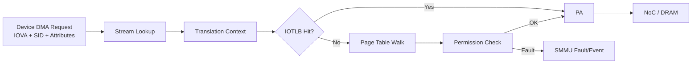

# IOMMU / ARM SMMU Study - 4강

# ARM SMMU Architecture Overview

## 0. 강의 목표

이번 강의의 목표는 ARM SMMU를 단순한 “IOMMU 하드웨어”가 아니라 **DMA transaction을 해석하는 주소 변환 파이프라인**으로 이해하는 것입니다.

3강에서 Linux IOMMU Framework를 다음 객체 중심으로 보았습니다.

| Linux 객체 | 의미 |
|---|---|
| `struct device` | DMA master device |
| `iommu_domain` | device용 I/O address space |
| `iommu_group` | 격리 가능한 최소 device 묶음 |
| `iommu_map()` | IOVA -> PA mapping 생성 |
| `iotlb_sync()` | IOMMU translation cache 동기화 |

4강에서는 위 개념이 ARM SMMU hardware에서 다음과 같이 대응되는지 봅니다.

| Linux IOMMU | ARM SMMU |
|---|---|
| `struct device` | Stream / Stream ID |
| `iommu_domain` | Translation context |
| `iommu_map()` | SMMU page table entry |
| `attach_dev()` | Stream ID -> context 연결 |
| IOMMU fault | SMMU fault/event |

---

## 1. ARM SMMU란?

ARM SMMU(System Memory Management Unit)는 ARM SoC에서 사용하는 IOMMU입니다.

CPU의 MMU가 CPU virtual address를 physical address로 변환하듯이, SMMU는 GPU, NPU, ISP, Camera, Display, PCIe, USB 같은 DMA master가 사용하는 device address 또는 IOVA를 physical address로 변환합니다.

```text
CPU VA          -> CPU MMU -> PA
Device DMA addr -> SMMU    -> PA
```

SMMU의 핵심 역할은 다음과 같습니다.

1. **Address translation**  
   device가 사용하는 IOVA를 실제 physical address로 변환합니다.

2. **Memory protection**  
   device가 허용된 buffer만 읽고 쓸 수 있게 제한합니다.

3. **Isolation**  
   여러 device, VM, security domain 사이의 DMA 접근 범위를 분리합니다.

4. **Fault reporting**  
   잘못된 DMA 접근을 fault/event로 보고하여 디버깅과 containment를 가능하게 합니다.

5. **Virtualization support**  
   Stage 2 translation을 통해 guest/VM의 DMA를 host physical memory boundary 안에 가둡니다.

---

## 2. ARM SoC에서 SMMU 위치

ARM SoC의 DMA path는 보통 다음과 같습니다.

```text
GPU / NPU / ISP / Camera / PCIe / USB
        |
        | DMA transaction
        v
      ARM SMMU
        |
        | translated transaction
        v
   NoC / Interconnect
        |
        v
       DRAM
```

중요한 점은 device DMA가 CPU MMU를 지나지 않는다는 것입니다.  
CPU virtual address를 device가 직접 이해하지 못하고, device가 낸 DMA address는 SMMU가 처리합니다.

---

## 3. DMA Transaction은 주소만 들고 오지 않는다

SMMU는 단순히 address만 보는 것이 아닙니다. 하나의 DMA transaction에는 여러 정보가 포함됩니다.

```c
transaction = {
    sid      = 0x20,        // NPU stream
    addr     = 0x10000000,  // IOVA
    type     = READ,
    attrs    = cacheable / shareable,
    ssid     = optional PASID
};
```

SMMU가 보는 주요 정보는 다음과 같습니다.

| 항목 | 의미 |
|---|---|
| Address | device가 접근하려는 IOVA/VA/IPA 성격의 주소 |
| Stream ID | 어느 DMA master에서 온 요청인지 나타내는 ID |
| Access type | read/write, privileged 여부 |
| Attributes | cacheability, shareability, security state 등 |
| Substream ID | PASID/SVA 환경에서 process address space 구분 |

---

## 4. Stream ID

Stream ID는 SMMU에서 가장 중요한 개념 중 하나입니다.

```text
Stream ID = 이 DMA 요청이 어느 device 또는 endpoint에서 왔는지 알려주는 ID
```

예를 들어 다음과 같이 SoC integration에서 정의될 수 있습니다.

| DMA master | Stream ID 예시 | 의미 |
|---|---:|---|
| Camera ISP | `0x10` | frame capture/write path |
| NPU | `0x20` | tensor input/output path |
| GPU | `0x30` | graphics/compute buffer path |
| Display | `0x40` | framebuffer read path |
| PCIe Root Complex | Requester ID -> SID | endpoint별 stream |

Stream ID는 device driver가 마음대로 정하는 값이 아닙니다.  
SoC interconnect, firmware, Device Tree, ACPI/IORT, PCIe Root Complex 설정과 맞아야 합니다.

Stream ID가 틀리면 다음 문제가 발생할 수 있습니다.

- 올바른 translation context를 찾지 못함
- 다른 device의 context로 들어감
- stream/config fault 발생
- bypass 또는 abort policy로 인해 예기치 않은 동작 발생

---

## 5. SMMU Translation Path

SMMU의 기본 translation 흐름은 다음과 같습니다.

```text
1. DMA request 도착
   - IOVA
   - SID
   - access type
   - attributes

2. Stream ID 확인

3. Stream configuration lookup
   - SMMUv2: SMR/S2CR
   - SMMUv3: Stream Table / STE

4. Translation context 선택
   - SMMUv2: Context Bank
   - SMMUv3: Context Descriptor

5. IOTLB lookup
   - hit이면 바로 PA 반환
   - miss이면 page table walk

6. Permission / attribute check

7. 정상이라면 PA transaction을 NoC/DRAM으로 전달
   실패하면 fault/event 발생
```

Mermaid로 보면 다음과 같습니다.



---

## 6. Translation Context

Translation context는 SMMU가 주소 변환을 수행하기 위해 필요한 설정 묶음입니다.

포함되는 정보는 다음과 같습니다.

- translation enable / bypass / abort
- stage 1 page table base
- stage 2 page table base
- address size
- translation granule
- page table format
- memory attributes
- shareability
- ASID / VMID
- permission policy

SMMU 버전에 따라 표현 방식이 다릅니다.

| 구분 | Translation context 표현 방식 |
|---|---|
| SMMUv2 | Context Bank 중심 |
| SMMUv3 | Stream Table Entry + Context Descriptor 중심 |

---

## 7. SMMUv2 Preview: Context Bank 모델

SMMUv2는 다음과 같은 구조로 이해하면 됩니다.

```text
Stream ID
   |
   v
SMR / S2CR
   |
   v
Context Bank
   |
   v
Page Table
   |
   v
Physical Address
```

핵심 요소는 다음과 같습니다.

| 요소 | 의미 |
|---|---|
| SMR | Stream Matching Register, 어떤 SID를 match할지 정의 |
| S2CR | Stream-to-Context Register, stream을 context bank에 연결 |
| Context Bank | page table base, TCR, MAIR, SCTLR 등 translation 설정 |
| Fault status register | context fault/global fault 원인 보고 |

MMU-500은 SMMUv2 계열을 공부할 때 대표적으로 보는 Arm SMMU IP입니다.  
5강에서 MMU-500 TRM 기반으로 자세히 봅니다.

---

## 8. SMMUv3 Preview: Stream Table / STE / CD 모델

SMMUv3는 SMMUv2보다 구조가 크게 바뀝니다.

```text
Stream ID
   |
   v
Stream Table
   |
   v
Stream Table Entry, STE
   |
   +--> Stage 2 설정
   |
   +--> Stage 1 CD Table pointer
             |
             v
       Context Descriptor, CD
             |
             v
       Stage 1 Page Table
```

핵심 요소는 다음과 같습니다.

| 요소 | 의미 |
|---|---|
| Stream Table | SID로 indexing되는 stream 설정 table |
| STE | 해당 stream의 translation mode, stage 2 설정, CD table 위치 등을 담음 |
| CD | Stage 1 translation context. page table base, ASID, address size 등을 담음 |
| Command Queue | software가 SMMU에 invalidate 등 command 전달 |
| Event Queue | SMMU가 fault/event를 software에 전달 |
| PRI Queue | PCIe PRI page request 처리 |

MMU-600과 MMU-700은 SMMUv3 계열에서 공부할 핵심 IP입니다.  
6강에서 자세히 봅니다.

---

## 9. Stage 1 Translation

Stage 1은 OS 또는 device driver 관점의 device address space를 구현합니다.

```text
Device IOVA / VA
        |
        v
Stage 1 Translation
        |
        v
IPA 또는 PA
```

일반 non-virtualized Linux 환경에서는 Stage 1 결과가 실제 PA가 될 수 있습니다.  
즉, Linux DMA API가 만든 IOVA -> PA mapping이 SMMU Stage 1 page table로 표현됩니다.

Stage 1의 역할은 다음과 같습니다.

- device별 IOVA address space 제공
- physical memory fragmentation 숨김
- device별 접근 권한 제한
- IOMMU domain과 연결

---

## 10. Stage 2 Translation

Stage 2는 hypervisor 관점의 translation입니다.

```text
Guest IPA
    |
    v
Stage 2 Translation
    |
    v
Host PA
```

VM이 device를 직접 사용하는 경우를 생각해봅니다.

```text
Guest OS -> Assigned Device -> DMA -> Host Memory
```

이때 device가 host 전체 memory를 마음대로 접근하면 안 됩니다.  
Stage 2는 guest가 허용받은 IPA range만 실제 host PA로 바꿉니다.

Stage 2는 다음 기능과 연결됩니다.

- KVM / Hypervisor
- VFIO passthrough
- SR-IOV
- VM별 DMA isolation
- guest IPA -> host PA 제한

---

## 11. Stage 1 + Stage 2 Nested Translation

가상화 환경에서는 Stage 1과 Stage 2가 결합될 수 있습니다.

```text
Device VA / IOVA
        |
        v
Stage 1
        |
        v
IPA
        |
        v
Stage 2
        |
        v
PA
```

이때 fault가 발생하면 어느 stage에서 실패했는지 구분해야 합니다.

| Fault stage | 의미 | 확인할 것 |
|---|---|---|
| Stage 1 fault | device/guest address space에서 실패 | guest/driver mapping, PASID, CD |
| Stage 2 fault | hypervisor IPA->PA에서 실패 | VM memory assignment, host mapping |

---

## 12. Translate / Bypass / Abort

모든 stream이 반드시 translation을 타는 것은 아닙니다.

| 모드 | 의미 | 주의점 |
|---|---|---|
| Translate | IOVA -> PA 변환 수행 | 일반적인 protected DMA path |
| Bypass | 변환 없이 transaction 통과 | 보안 격리가 약해질 수 있음 |
| Abort / Block | 해당 stream DMA 차단 | 미사용/오류 장치 보호에 유용 |

Bring-up 단계에서는 bypass를 쓰는 경우가 있지만, production에서는 어떤 stream이 bypass인지 반드시 inventory화해야 합니다.

---

## 13. IOTLB

IOTLB는 SMMU 내부의 translation cache입니다.

```text
IOVA -> PA translation result cache
```

CPU MMU에 TLB가 있듯이, SMMU도 매번 page table walk를 하지 않기 위해 변환 결과를 cache합니다.

### IOTLB hit

```text
IOVA -> IOTLB hit -> PA
```

### IOTLB miss

```text
IOVA -> IOTLB miss -> page table walk -> IOTLB fill -> PA
```

### 왜 invalidate가 필요한가?

Linux가 `iommu_unmap()` 또는 `dma_unmap_single()`로 mapping을 제거했는데 IOTLB에 예전 translation이 남아 있으면 device가 stale translation으로 접근할 수 있습니다.

따라서 page table update 이후에는 적절한 IOTLB invalidate/sync가 필요합니다.

---

## 14. 주소 공간 정리

SMMU에서 헷갈리는 대부분의 문제는 “이 주소가 누구 관점인가?”를 놓칠 때 생깁니다.

| 주소 | 누가 보는가 | 설명 |
|---|---|---|
| CPU VA | CPU/kernel | CPU MMU가 PA로 변환 |
| IOVA / DMA address | Device | SMMU가 변환 |
| IPA | Guest OS / Hypervisor | VM이 보는 intermediate physical address |
| PA | DRAM/interconnect | 실제 physical address |
| MMIO VA | CPU driver | `ioremap()`으로 device register 접근 |

중요한 규칙:

```text
dma_addr_t는 CPU pointer가 아닙니다.
장치에게 주는 DMA address입니다.
IOMMU가 켜져 있으면 IOVA일 수 있습니다.
```

---

## 15. Permission과 Attribute

SMMU는 주소 변환뿐 아니라 권한과 attribute도 처리합니다.

### Permission

- read 허용 여부
- write 허용 여부
- privileged/unprivileged access policy
- stage별 permission

예를 들어 NPU가 input tensor를 읽어야 하는데 write-only로 mapping되어 있거나, Camera가 frame buffer에 write해야 하는데 read-only로 mapping되어 있으면 permission fault가 발생할 수 있습니다.

### Memory Attribute

- cacheability
- shareability
- device memory vs normal memory
- page table walk memory attribute
- transaction attribute propagation

Attribute 설정 오류는 다음과 같은 문제로 나타날 수 있습니다.

- 동작은 하지만 매우 느림
- 특정 workload에서만 frame corruption
- non-coherent device에서 data가 가끔 stale하게 보임
- page table walk 관련 external fault

---

## 16. SMMU와 Cache Coherency는 별도 문제

SMMU가 한다고 해서 cache coherency 문제가 자동으로 해결되는 것은 아닙니다.

SMMU가 주로 하는 일:

- IOVA -> PA 변환
- permission check
- fault reporting
- IOTLB 관리

별도로 확인해야 하는 것:

- device가 coherent master인지
- DT/ACPI에 `dma-coherent`가 맞게 설정됐는지
- streaming DMA에서 `dma_sync_single_for_cpu()` / `dma_sync_single_for_device()` 호출이 필요한지
- DMA-BUF fence/ownership이 맞는지

즉, SMMU fault가 없어도 cache sync 문제가 있으면 frame corruption이나 stale tensor 문제가 생길 수 있습니다.

---

## 17. Fault Model

SMMU fault는 DMA bug를 hardware boundary에서 발견하는 중요한 signal입니다.

fault에서 확인해야 할 정보는 다음과 같습니다.

| 정보 | 의미 |
|---|---|
| SID | 어느 device에서 온 DMA인가 |
| IOVA | 어떤 device address에서 실패했는가 |
| Access type | read인가 write인가 |
| Stage | Stage 1 fault인가 Stage 2 fault인가 |
| Reason | translation, permission, config, address size 등 |

대표 fault 유형:

| Fault 유형 | 가능한 원인 | 확인 포인트 |
|---|---|---|
| Translation fault | IOVA mapping 없음 | dma_map 누락, premature unmap, 잘못된 address |
| Permission fault | read/write 권한 불일치 | DMA direction, page permission |
| Address size fault | 주소 폭 초과 | DMA mask, register width, PA/IPA size |
| Stream/config fault | SID 설정 없음/오류 | DT `iommus`, IORT, SID routing |
| External fault | page table walk 실패 | descriptor, memory attribute, coherency |

---

## 18. Fault Debugging 순서

예시 fault log:

```text
arm-smmu: event 0x...
  SID=0x20  SSID=0x0
  IOVA=0x0000000010000000
  access=READ  stage=S1
  reason=translation fault
```

해석 순서:

1. `SID=0x20`이 어떤 device인지 찾습니다.
2. `IOVA=0x10000000`이 어느 buffer인지 찾습니다.
3. Stage 1 fault인지 Stage 2 fault인지 확인합니다.
4. READ/WRITE와 DMA direction이 맞는지 봅니다.
5. mapping lifetime을 봅니다.
   - device 작업 완료 전에 `dma_unmap_*()` 했는가?
   - DMA-BUF detach/free가 너무 빨랐는가?
6. cache/fence/ownership 문제인지도 확인합니다.

디버깅 mental model:

```text
SID -> device -> domain/context -> IOVA mapping -> permission -> lifetime -> cache/fence
```

---

## 19. Virtualization에서 SMMU

VM이 device를 직접 사용할 때 SMMU가 없으면 매우 위험합니다.

```text
VM Guest Driver -> Assigned Device -> DMA -> Host Memory
```

장치가 host 전체 memory를 읽거나 쓸 수 있기 때문입니다.

SMMU는 Stage 2 translation을 통해 guest에게 허용된 memory만 접근하게 제한합니다.

```text
Guest IPA -> Stage 2 -> Host PA
```

관련 tag:

| Tag | 의미 |
|---|---|
| VMID | Stage 2 translation context 구분 |
| ASID | Stage 1 address space 구분 |
| PASID/SSID | 같은 device 내 process address space 구분 |

---

## 20. Substream ID / PASID / SVA

Stream ID가 “어느 device인가?”를 구분한다면, Substream ID 또는 PASID는 “그 device 안에서 어느 process/address space인가?”를 구분합니다.

```text
GPU/NPU device
  Stream ID = device identity
  PASID 11  = Process A
  PASID 12  = Process B
  PASID 13  = Process C
```

SVA(Shared Virtual Addressing)는 CPU process VA와 device VA를 공유하는 모델입니다.  
고성능 accelerator에서는 ATS, PRI, PASID와 함께 등장합니다.

---

## 21. Security State와 SMMU

ARM 시스템에서는 Non-secure, Secure, Realm 같은 security state와 SMMU 설정이 함께 고려될 수 있습니다.

| 영역 | 예시 |
|---|---|
| Non-secure | 일반 Linux, hypervisor, 대부분의 peripheral DMA |
| Secure | TrustZone/TEE, secure camera path, DRM protected buffer |
| Realm/RME | Arm confidential computing 영역 |

중요한 점:

- SMMU는 transaction security attribute와 memory access policy에 관여할 수 있습니다.
- 정확한 동작은 SMMU architecture version, product IP, SoC integration, firmware policy에 따라 달라집니다.
- secure camera/NPU/display pipeline에서는 buffer가 어느 world에 속하는지까지 추적해야 합니다.

---

## 22. SMMUv2와 SMMUv3 차이 요약

| 항목 | SMMUv2 / MMU-500 | SMMUv3 / MMU-600, MMU-700 |
|---|---|---|
| Stream 연결 | SMR/S2CR 기반 | Stream Table / STE 기반 |
| Context | Context Bank 중심 | STE + Context Descriptor 중심 |
| 제어 방식 | MMIO register 중심 | in-memory command/event queue 중심 |
| PCIe 고급 기능 | 제한적 또는 SoC별 | ATS/PRI/PASID 구조 지원 |
| 확장성 | 중형 SoC에 적합 | 대형/가상화/서버급 구성에 유리 |

---

## 23. Linux IOMMU 객체와 ARM SMMU 객체 매핑

| Linux | SMMUv2 | SMMUv3 | 역할 |
|---|---|---|---|
| `struct device` + fwspec | Stream ID / SMR | Stream ID / STE index | device 식별 |
| `iommu_domain` | Context Bank 설정 | STE/CD + page table | address space |
| `iommu_map()` | LPAE PTE 작성 | LPAE PTE 작성 | IOVA -> PA mapping |
| `attach_dev()` | S2CR -> CB 연결 | STE/CD 연결 | device를 domain에 연결 |
| `iotlb_sync()` | TLB invalidate register | CMDQ invalidate | stale entry 제거 |

---

## 24. Device Attach 흐름

Device Tree 예시:

```dts
npu@12340000 {
    compatible = "vendor,npu";
    reg = <0x0 0x12340000 0x0 0x10000>;
    iommus = <&smmu 0x20>;
    dma-coherent;
};
```

흐름:

```text
Device probe
   |
   v
fwspec에서 SID 수집
   |
   v
iommu_domain 생성/선택
   |
   v
attach_dev()
   |
   v
SMMU stream config update
```

결과적으로 SID `0x20`에서 온 DMA 요청은 해당 NPU device의 domain/context를 사용하게 됩니다.

---

## 25. Map / Unmap 흐름

### Map

```text
dma_map_single()
   |
   v
IOVA allocate
   |
   v
PTE write
   |
   v
IOTLB sync
   |
   v
dma_addr_t return
```

### Unmap

```text
dma_unmap_single()
   |
   v
PTE remove
   |
   v
IOTLB invalidate
   |
   v
IOVA free
```

중요한 규칙:

- map 이후 device가 보는 주소는 PA가 아니라 IOVA일 수 있습니다.
- unmap 이후 device가 이전 IOVA로 DMA하면 fault 또는 stale access 위험이 있습니다.
- IOTLB invalidate는 correctness와 performance 모두에 영향을 줍니다.

---

## 26. 예제 1: NPU 입력 Tensor Read

```c
input_dma = dma_map_single(dev, input, size, DMA_TO_DEVICE);
writel(lower_32_bits(input_dma), regs + NPU_INPUT_ADDR_LO);
writel(upper_32_bits(input_dma), regs + NPU_INPUT_ADDR_HI);
/* NPU reads from input_dma */
```

SMMU 관점:

| 항목 | 값 |
|---|---|
| SID | NPU Stream ID |
| Access | READ |
| IOVA | `input_dma` |
| 권한 | device read 허용 필요 |
| lifetime | NPU 작업 완료 전 unmap 금지 |

---

## 27. 예제 2: Camera/ISP Frame Buffer Write

Camera/ISP가 frame buffer에 쓰는 경우:

```text
Buffer allocate
   |
   v
dma_map(..., DMA_FROM_DEVICE)
   |
   v
Camera/ISP DMA write
   |
   v
SMMU permission check
   |
   v
CPU consume frame
```

SMMU 관점:

- SID = Camera 또는 ISP stream ID
- access = WRITE
- IOVA mapping 필요
- write permission 필요

Cache/sync 관점:

- non-coherent device라면 CPU가 읽기 전 invalidate 필요
- `dma_sync_single_for_cpu()` timing 확인
- SMMU fault가 없어도 cache 문제는 남을 수 있음

---

## 28. Camera -> NPU Pipeline에서 SMMU

```text
Camera Capture
    |
    v
DMA-BUF Frame Buffer
    |
    +--> ISP processing
    |
    +--> NPU inference
    |
    +--> Display / GPU output
```

같은 physical buffer라도 device마다 다른 IOVA를 가질 수 있습니다.

| Device | SID 예시 | Buffer 접근 | IOVA 예시 |
|---|---:|---|---:|
| Camera | `0x10` | frame write | `0x1000_0000` |
| ISP | `0x18` | frame read/write | `0x2000_0000` |
| NPU | `0x20` | tensor read/write | `0x4000_0000` |
| Display | `0x40` | frame read | `0x7000_0000` |

DMA-BUF는 공유 buffer object이고, SMMU는 device별 address space에 그 buffer를 안전하게 map합니다.

---

## 29. Performance 관점

SMMU는 보호와 유연성을 주지만 비용도 있습니다.

비용이 커지는 경우:

- 작은 buffer를 매우 자주 map/unmap
- scatterlist fragment가 지나치게 많음
- IOTLB miss가 잦음
- page table walk memory latency가 큼
- unmap마다 synchronous invalidate가 많음

완화 방향:

- long-lived mapping 활용
- larger page/block mapping 검토
- buffer pool / DMA-BUF reuse
- batching / lazy invalidation 정책 이해
- ATS/device TLB 가능성 검토

단, 성능 최적화는 보안/격리 정책과 trade-off가 있으므로 production policy와 함께 결정해야 합니다.

---

## 30. Automotive / Embedded 관점

Automotive SoC에서는 다음 device가 모두 DMA master입니다.

- Camera CSI
- ISP
- Scaler
- NPU
- GPU
- Display
- Video codec
- Ethernet AVB/TSN
- PCIe
- USB

SMMU의 의미:

### Safety

- misbehaving IP의 memory corruption 제한
- fault containment
- diagnostic log를 통한 원인 추적
- freedom-from-interference 근거 후보

### Security

- external DMA attack surface 축소
- secure buffer 접근 제한
- VM/partition별 isolation
- bypass stream inventory 필수

SMMU 설정은 단순 bring-up 항목이 아니라 system safety/security architecture의 일부입니다.

---

## 31. Kernel Source Reading Map

```text
drivers/iommu/iommu.c
  - domain/group/core attach flow

drivers/iommu/dma-iommu.c
  - DMA API와 IOVA allocation 연결

drivers/iommu/arm/arm-smmu/
  - SMMUv1/v2, MMU-500 계열 driver

drivers/iommu/arm/arm-smmu-v3/
  - SMMUv3, command/event queue, STE/CD

drivers/iommu/io-pgtable-arm.c
  - ARM LPAE page table 생성/관리
```

읽는 순서:

1. `iommu_domain`이 어디서 만들어지는가?
2. `attach_dev()`에서 SID가 어떻게 연결되는가?
3. `map_pages()`에서 page table이 어떻게 쓰이는가?
4. `iotlb_sync()`가 어떤 HW operation으로 내려가는가?
5. fault handler가 어떤 정보를 로그로 남기는가?

---

## 32. 핵심 요약

```text
ARM SMMU architecture = SID로 context를 고르고,
                       stage별 page table을 통해 IOVA를 PA로 바꾸고,
                       권한/attribute를 검사한 뒤,
                       실패하면 fault/event로 보고하는 DMA translation pipeline
```

핵심 문장:

1. ARM SMMU는 ARM SoC에서 DMA master를 위한 IOMMU 구현입니다.
2. Stream ID는 SMMU가 요청 출처를 식별하는 핵심 key입니다.
3. Translation context는 page table base와 attribute/permission 설정 묶음입니다.
4. Stage 1은 device/OS address space, Stage 2는 hypervisor/VM isolation에 가깝습니다.
5. SMMUv2는 Context Bank, SMMUv3는 STE/CD와 queue 구조가 핵심입니다.
6. SMMU fault debug는 SID, IOVA, stage, access type, reason 순서로 봅니다.

---

# 퀴즈

## 문제

1. ARM SMMU는 CPU MMU와 무엇이 다른가요?
2. Stream ID는 왜 필요한가요?
3. Stage 1과 Stage 2 translation의 차이는 무엇인가요?
4. SMMUv2의 Context Bank는 어떤 역할을 하나요?
5. SMMUv3의 STE와 CD는 각각 무엇인가요?
6. Bypass stream은 왜 위험할 수 있나요?
7. IOTLB invalidate가 필요한 이유는 무엇인가요?
8. Permission fault와 translation fault의 차이는 무엇인가요?
9. SMMU가 cache coherency를 자동 해결하지 않는다는 말의 의미는 무엇인가요?
10. Camera와 NPU가 같은 DMA-BUF를 공유할 때 IOVA가 달라도 되는 이유는 무엇인가요?

## 정답 및 해설

### 1. ARM SMMU는 CPU MMU와 무엇이 다른가요?

CPU MMU는 CPU가 사용하는 virtual address를 physical address로 변환합니다.  
ARM SMMU는 DMA device가 사용하는 IOVA 또는 device address를 physical address로 변환하고, device DMA 접근 권한을 검사합니다.

```text
CPU VA          -> CPU MMU -> PA
Device DMA addr -> SMMU    -> PA
```

### 2. Stream ID는 왜 필요한가요?

SMMU 하나에는 여러 DMA master가 연결될 수 있습니다.  
SMMU는 DMA 요청의 Stream ID를 보고 “어느 device에서 온 요청인지” 식별하고, 해당 device에 맞는 translation context를 선택합니다.

### 3. Stage 1과 Stage 2 translation의 차이는 무엇인가요?

Stage 1은 device/OS 관점의 address space를 변환합니다.  
일반 Linux DMA에서는 IOVA -> PA mapping으로 이해할 수 있습니다.

Stage 2는 hypervisor 관점의 translation으로, guest IPA -> host PA 변환을 담당합니다. VM이 device를 직접 사용할 때 host memory 보호에 중요합니다.

### 4. SMMUv2의 Context Bank는 어떤 역할을 하나요?

Context Bank는 SMMUv2에서 translation context를 담는 하드웨어 구조입니다.  
page table base, translation control, memory attribute, fault status 등 주소 변환에 필요한 설정을 포함합니다.

### 5. SMMUv3의 STE와 CD는 각각 무엇인가요?

STE(Stream Table Entry)는 특정 Stream ID에 대한 stream-level 설정입니다.  
translation mode, stage 2 설정, stage 1 CD table 위치 등을 담습니다.

CD(Context Descriptor)는 Stage 1 translation context입니다.  
page table base, ASID, address size, memory attribute 등을 담습니다.

### 6. Bypass stream은 왜 위험할 수 있나요?

Bypass stream은 SMMU translation과 권한 검사를 거치지 않거나 제한적으로 거칩니다.  
따라서 device가 잘못된 주소로 DMA할 경우 memory isolation이 약해질 수 있습니다. Production 시스템에서는 bypass stream을 반드시 파악해야 합니다.

### 7. IOTLB invalidate가 필요한 이유는 무엇인가요?

SMMU는 IOVA -> PA 변환 결과를 IOTLB에 cache합니다.  
page table에서 mapping을 제거해도 IOTLB에 stale entry가 남아 있으면 device가 예전 translation으로 DMA할 수 있습니다. 따라서 unmap 이후 invalidate/sync가 필요합니다.

### 8. Permission fault와 translation fault의 차이는 무엇인가요?

Translation fault는 해당 IOVA에 대한 mapping이 없거나 page table walk가 실패한 경우입니다.  
Permission fault는 mapping은 있지만 read/write 권한, privilege, stage permission 등이 맞지 않는 경우입니다.

### 9. SMMU가 cache coherency를 자동 해결하지 않는다는 말의 의미는 무엇인가요?

SMMU는 주소 변환과 권한 검사를 담당합니다.  
CPU cache와 device DMA 사이의 data visibility는 별도 문제입니다. non-coherent device에서는 `dma_sync_single_for_cpu()`와 `dma_sync_single_for_device()` 같은 cache sync API가 필요할 수 있습니다.

### 10. Camera와 NPU가 같은 DMA-BUF를 공유할 때 IOVA가 달라도 되는 이유는 무엇인가요?

DMA-BUF는 같은 physical buffer를 여러 device가 공유하게 해줍니다.  
하지만 각 device는 자기 IOMMU domain/context에 buffer를 map하므로 device마다 다른 IOVA를 가질 수 있습니다.

```text
same physical buffer
  Camera IOVA  -> 0x1000_0000
  NPU IOVA     -> 0x4000_0000
  Display IOVA -> 0x7000_0000
```

---

# 5분 복습 카드

| 카드 | 답 |
|---|---|
| ARM SMMU | ARM SoC의 IOMMU 구현 |
| Stream ID | DMA 요청 출처를 식별하는 ID |
| Substream ID / PASID | 같은 device 내부의 process/address-space 구분 ID |
| Translation context | page table base와 attribute/permission 설정 묶음 |
| Stage 1 | device/OS address space translation |
| Stage 2 | guest IPA -> host PA translation |
| Context Bank | SMMUv2의 translation context 구조 |
| STE | SMMUv3의 stream-level 설정 entry |
| CD | SMMUv3의 Stage 1 context descriptor |
| IOTLB | SMMU 내부 IOVA -> PA translation cache |
| Translation fault | IOVA mapping 없음 또는 page table walk 실패 |
| Permission fault | mapping은 있으나 권한 위반 |
| Bypass | translation 없이 또는 제한적으로 통과하는 stream mode |
| DMA-BUF + SMMU | 같은 buffer를 device별 IOVA로 map 가능 |

---

# 실습 / 복습 과제

## 과제 1. dmesg에서 SMMU 확인

가능한 ARM 보드에서 다음 명령을 실행해봅니다.

```bash
dmesg | grep -i smmu
dmesg | grep -i iommu
```

확인할 것:

- SMMU driver가 probe되었는가?
- SMMUv2인지 SMMUv3인지 로그에 보이는가?
- bypass 관련 경고가 있는가?
- fault 로그가 있는가?

## 과제 2. Device Tree에서 Stream ID 찾기

```bash
grep -R "iommus" arch/arm64/boot/dts/ -n | head
grep -R "arm,smmu" arch/arm64/boot/dts/ -n | head
```

확인할 것:

- device node에 `iommus = <&smmu ...>`가 있는가?
- `#iommu-cells` 값은 무엇인가?
- 같은 device가 여러 Stream ID를 갖는 경우가 있는가?

## 과제 3. Kernel source reading

다음 파일에서 키워드를 검색해봅니다.

```bash
grep -R "attach_dev" drivers/iommu/arm/arm-smmu* -n
grep -R "map_pages" drivers/iommu/arm/arm-smmu* -n
grep -R "event" drivers/iommu/arm/arm-smmu-v3 -n
grep -R "cmdq" drivers/iommu/arm/arm-smmu-v3 -n
```

확인할 것:

- device attach 시점에 어떤 구조체가 설정되는가?
- page table mapping은 어느 계층에서 만들어지는가?
- fault/event handler가 어떤 정보를 출력하는가?

---

# 다음 강의 예고: 5강 SMMUv2 / MMU-500 Hardware

5강에서는 이번 강의의 개념을 SMMUv2/MMU-500 TRM 구조로 내려봅니다.

주요 내용:

- SMMUv2 register map
- MMU-500 overview
- Stream Matching Register, SMR
- Stream-to-Context Register, S2CR
- Context Bank
- CBAR, TTBR, TCR, MAIR, SCTLR
- TLB invalidate
- context fault / global fault
- Linux `arm-smmu` driver와 연결

---

# 참고 자료

1. Arm Developer - What an SMMU does  
   https://developer.arm.com/documentation/109242/0100/What-an-SMMU-does

2. Arm Developer - ARM System Memory Management Unit Architecture Specification  
   https://developer.arm.com/documentation/ihi0062/b/

3. Arm - Memory Management Unit: IO Memory Handling  
   https://www.arm.com/products/silicon-ip-system/system-controllers/mmu

4. Linux Kernel Documentation - Dynamic DMA mapping Guide  
   https://docs.kernel.org/core-api/dma-api-howto.html

5. Linux Kernel Documentation - Dynamic DMA mapping using the generic device  
   https://docs.kernel.org/core-api/dma-api.html

6. Linux Kernel Documentation - ARM SMMUv3 Device Tree binding  
   https://www.kernel.org/doc/Documentation/devicetree/bindings/iommu/arm,smmu-v3.txt

7. Linux kernel source - ARM SMMU drivers  
   https://github.com/torvalds/linux/tree/master/drivers/iommu/arm
