# 4강. ARM SMMU Architecture Overview

> IOMMU / ARM SMMU Study - Lecture 4  
> 생성 기준: 코드 블록 들여쓰기 보존, sequence diagram은 PlantUML, architecture diagram은 Mermaid 원본을 포함합니다.

---

## 0. 이번 4강의 목표

이번 강의는 1-3강에서 본 IOMMU와 Linux DMA/IOMMU Framework를 ARM SoC의 실제 하드웨어인 **ARM SMMU**에 연결합니다. 목표는 ARM SMMU가 DMA transaction을 받았을 때 **Stream ID를 기준으로 translation context를 선택하고, Stage 1/Stage 2 translation을 수행하며, fault를 Linux driver에 보고하는 큰 흐름**을 이해하는 것입니다.

학습 후 다음 질문에 답할 수 있어야 합니다.

1. ARM SMMU는 SoC에서 어느 위치에 있는가?
2. Stream ID는 왜 필요한가?
3. Stage 1과 Stage 2 translation은 각각 무엇을 의미하는가?
4. SMMUv2의 Context Bank와 SMMUv3의 STE/CD는 어떤 관계인가?
5. Command Queue와 Event Queue는 왜 SMMUv3에서 중요해졌는가?
6. IOMMU fault log에서 어떤 정보를 먼저 봐야 하는가?

---

## 1. ARM SMMU의 역할

Arm은 SMMU를 IO memory management를 담당하는 장치로 설명합니다. SMMU는 address translation caching, hardware page table walk, memory protection/access control, virtualization 지원을 담당합니다.

즉 ARM SMMU는 다음을 수행합니다.

- DMA master가 사용하는 IOVA 또는 device VA를 실제 physical address로 변환합니다.
- 장치별로 허용된 메모리 범위만 접근하게 합니다.
- read/write permission, memory attribute, shareability 같은 속성을 적용합니다.
- virtualization 환경에서 Stage 1/Stage 2 translation을 통해 VM isolation을 지원합니다.
- 잘못된 DMA 접근을 fault/event로 보고합니다.

---

## 2. SoC에서 ARM SMMU의 위치

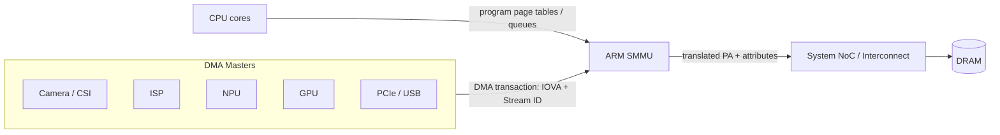

ARM SMMU는 CPU와 DRAM 사이에 있는 CPU MMU가 아닙니다. SMMU는 **DMA master와 interconnect/DRAM 사이**에 위치합니다. Camera, ISP, NPU, GPU, PCIe 장치가 DRAM으로 접근할 때 SMMU를 통과합니다.

핵심은 다음입니다.

```text
Device가 보는 주소: IOVA 또는 device VA
SMMU가 변환한 주소: PA
장치 식별 정보: Stream ID
```

---

## 3. 주소 용어 정리

| 용어 | 의미 | 누가 사용하나 |
|---|---|---|
| VA | CPU 또는 process virtual address | CPU / process |
| PA | system physical address | memory system |
| DMA address | device에게 전달하는 주소 | device driver / device |
| IOVA | IOMMU가 변환할 I/O virtual address | IOMMU / SMMU |
| IPA | Intermediate Physical Address | virtualization stage |
| SID | Stream ID | SMMU가 DMA master를 구분할 때 사용 |
| SSID/PASID | Substream ID / Process Address Space ID | SVA, per-process device access |

Linux driver 관점에서 `dma_addr_t`는 CPU pointer가 아니라 device가 사용할 DMA address입니다. IOMMU가 활성화된 경우 이 값은 PA가 아니라 IOVA일 수 있습니다.

---

## 4. Stream ID 기반 context 선택

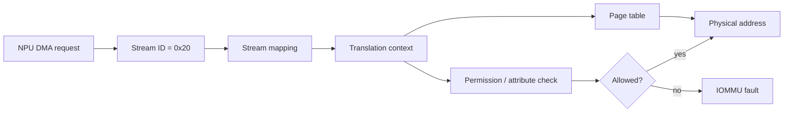

Stream ID는 SMMU가 **어느 장치에서 온 DMA transaction인지** 판단하기 위한 식별자입니다. 예를 들어 NPU가 `SID=0x20`으로 DMA request를 내면, SMMU는 해당 SID에 연결된 translation context를 찾아 page table과 permission을 적용합니다.

중요한 점은 Stream ID가 Linux driver가 임의로 만들어내는 값이 아니라는 것입니다. Stream ID는 SoC integration, interconnect, PCIe Requester ID mapping, Device Tree 또는 ACPI/IORT description에 의해 연결됩니다.

---

## 5. Translation sequence

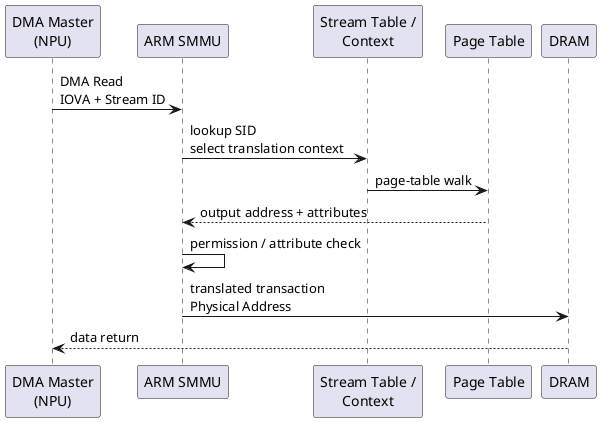

흐름을 말로 풀면 다음과 같습니다.

1. DMA master가 IOVA와 Stream ID를 포함한 transaction을 냅니다.
2. SMMU가 Stream ID를 이용해 translation context를 찾습니다.
3. page table walk를 수행하거나 IOTLB에 캐시된 translation을 사용합니다.
4. permission과 memory attribute를 검사합니다.
5. 허용되면 physical address transaction으로 interconnect에 전달합니다.
6. 실패하면 fault event를 생성합니다.

---

## 6. Stage 1 / Stage 2 translation

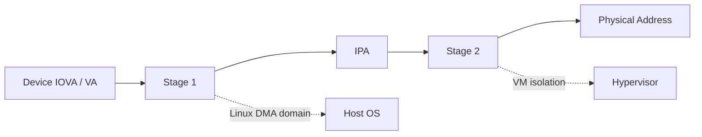

### Stage 1

Stage 1은 보통 OS가 관리하는 주소 변환입니다.

```text
IOVA 또는 device VA -> IPA 또는 PA
```

Linux DMA domain에서 일반적인 DMA mapping은 Stage 1 성격으로 이해할 수 있습니다.

### Stage 2

Stage 2는 virtualization에서 Hypervisor가 관리하는 주소 변환입니다.

```text
IPA -> PA
```

장치를 VM에 passthrough할 때 guest가 보는 address가 host physical memory 전체로 직접 연결되면 위험합니다. Stage 2 translation은 VM이 허용된 physical memory 범위만 접근하도록 제한합니다.

### Stage 1 + Stage 2

가상화 환경에서는 장치 요청이 두 단계를 모두 거칠 수 있습니다.

```text
Device VA / IOVA -> Stage 1 -> IPA -> Stage 2 -> PA
```

---

## 7. SMMUv2 관점: SMR, S2CR, Context Bank

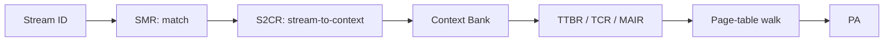

SMMUv2 계열에서는 Stream ID를 받아서 Context Bank를 선택하는 구조로 이해하면 쉽습니다.

| 구성 | 역할 |
|---|---|
| SMR | Stream ID match rule |
| S2CR | Stream-to-Context Register |
| Context Bank | translation context 저장 |
| TTBR/TCR/MAIR | page table base와 translation attribute |
| Fault register | context/global fault 보고 |

SMMUv2/MMU-500을 읽을 때는 **이 Stream ID가 어떤 Context Bank로 연결되는가**를 중심으로 보면 됩니다.

---

## 8. SMMUv3 관점: Stream Table, STE, CD, Queues

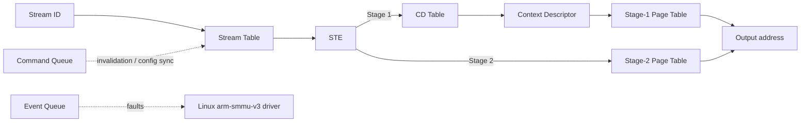

SMMUv3는 SMMUv2보다 in-memory data structure 중심으로 바뀌었습니다.

| 구성 | 역할 |
|---|---|
| Stream Table | Stream ID를 STE로 매핑하는 table |
| STE | stream별 translation mode, stage 설정 |
| CD | Stage 1 context descriptor |
| Command Queue | SW가 SMMU에 명령을 전달 |
| Event Queue | SMMU가 SW에 fault/event를 보고 |
| PRI Queue | PCIe PRI page request 처리 |

Linux SMMUv3 Device Tree binding에서도 SMMUv3는 이전 revision과 달리 MMIO register interface 중심이 아니라 in-memory command/event queue 구조를 사용하고, PCIe ATS/PRI 지원이 추가되었다고 설명합니다.

---

## 9. Command Queue sequence

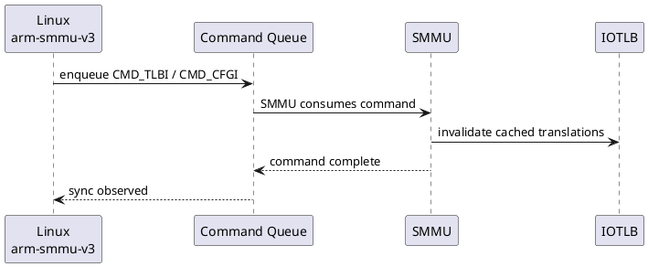

Command Queue는 Linux `arm-smmu-v3` driver가 SMMU에 명령을 전달하는 경로입니다. 대표 명령은 다음과 같습니다.

- config invalidate
- TLB invalidate
- command sync
- ATS invalidate

SMMU page table이나 Stream Table Entry가 바뀐 뒤에는 이전 translation이 IOTLB에 남아 있을 수 있으므로 invalidate/sync가 중요합니다.

---

## 10. Event Queue / Fault sequence

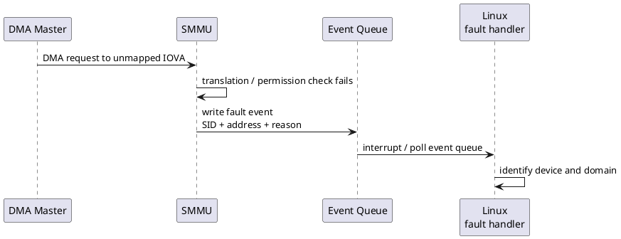

잘못된 DMA 접근이 발생하면 SMMU는 fault event를 만들고 Linux driver가 이를 읽습니다. 디버깅에서는 보통 다음 정보를 먼저 확인합니다.

```text
SID / SSID / IOVA / fault type / access type(read/write) / level
```

---

## 11. IOTLB invalidation sequence

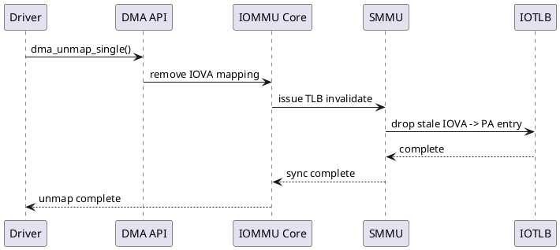

IOTLB는 IOVA -> PA translation cache입니다. `dma_unmap_single()`처럼 mapping이 제거되는 경로에서는 stale translation이 남지 않게 invalidate가 필요합니다.

---

## 12. PASID / SVA 개념

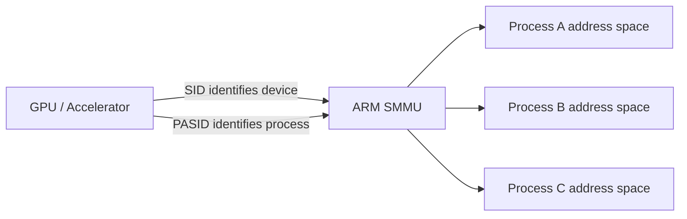

SID가 장치를 구분한다면, PASID 또는 Substream ID는 같은 장치 안에서 **프로세스 address space**를 구분하는 데 사용됩니다. GPU, NPU, NIC 같은 장치가 여러 process의 address space를 직접 다루는 구조에서 중요합니다.

---

## 13. Linux driver path와 ARM SMMU

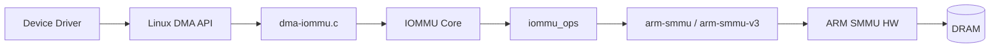

일반 장치 드라이버는 SMMU register를 직접 설정하지 않습니다. 보통은 DMA API를 사용하고, Linux IOMMU Core와 `arm-smmu`/`arm-smmu-v3` driver가 실제 SMMU 설정을 처리합니다.

```c
    dma_addr_t dma;

    dma = dma_map_single(dev, cpu_buf, size, DMA_TO_DEVICE);
    if (dma_mapping_error(dev, dma))
        return -ENOMEM;

    writel(lower_32_bits(dma), regs + DMA_ADDR_LO);
    writel(upper_32_bits(dma), regs + DMA_ADDR_HI);

    /* device sees 'dma', not cpu_buf */
```

---

## 14. Device Tree integration preview

```dts
    smmu: iommu@2b400000 {
        compatible = "arm,smmu-v3";
        reg = <0x0 0x2b400000 0x0 0x100000>;
        #iommu-cells = <1>;
        interrupts = <GIC_SPI 74 IRQ_TYPE_LEVEL_HIGH>;
        interrupt-names = "eventq";
        dma-coherent;
    };

    npu@12340000 {
        compatible = "vendor,npu";
        reg = <0x0 0x12340000 0x0 0x10000>;
        iommus = <&smmu 0x20>;  /* Stream ID */
        dma-coherent;
    };
```

`iommus = <&smmu 0x20>;`는 해당 장치가 어떤 SMMU와 어떤 Stream ID로 연결되는지를 표현합니다. 실제 플랫폼에서는 SoC integration과 interconnect 설정이 이 정보와 일치해야 합니다.

---

## 15. Camera -> NPU pipeline preview

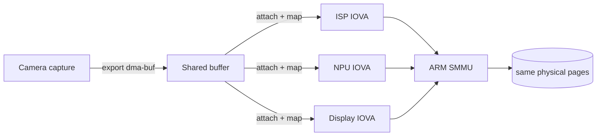

Camera, ISP, NPU, Display가 같은 DMA-BUF를 공유하더라도 각 장치가 보는 IOVA는 다를 수 있습니다.

```text
같은 physical pages
  Camera IOVA  -> 0x1000_0000
  NPU IOVA     -> 0x4000_0000
  Display IOVA -> 0x7000_0000
```

이 내용은 9강에서 V4L2, DMA-BUF, NPU driver 흐름으로 상세히 다룹니다.

---

## 16. SMMU가 해결하지 않는 것

SMMU는 주소 변환과 접근 제어를 담당하지만, 다음 문제를 자동으로 해결하지는 않습니다.

- non-coherent DMA cache maintenance
- DMA-BUF fence/synchronization
- buffer lifetime bug
- driver가 잘못된 direction으로 mapping한 문제
- device firmware가 잘못된 address를 program하는 문제

따라서 IOMMU fault가 없는 경우에도 cache coherency 문제로 데이터가 깨질 수 있습니다.

---

## 17. Fault log 읽기 예시

```text
    arm-smmu-v3 2b400000.iommu: event 0x10 received:
        sid=0x20 ssid=0x0 iova=0x0000000040001000
        type=translation fault level=1 read

    Debug order:
        1. Find device emitting sid=0x20
        2. Check iommus property / IORT mapping
        3. Check dma_map_* lifetime and direction
        4. Check whether unmap happened too early
```

디버깅 우선순위는 다음과 같습니다.

1. faulting SID가 어느 장치인지 찾습니다.
2. IOVA가 현재 domain에 mapping되어 있는지 확인합니다.
3. access type과 permission이 맞는지 확인합니다.
4. DMA-BUF 또는 streaming DMA buffer가 너무 일찍 unmap되지 않았는지 확인합니다.
5. cache issue와 translation issue를 분리합니다.

---

## 18. Source Reading Map

```text
    include/linux/iommu.h
    drivers/iommu/iommu.c
    drivers/iommu/dma-iommu.c

    drivers/iommu/arm/arm-smmu/
    drivers/iommu/arm/arm-smmu-v3/

    drivers/iommu/io-pgtable-arm.c
    arch/arm64/boot/dts/*
    drivers/acpi/arm64/iort.c
```

읽는 순서는 다음을 추천합니다.

1. `include/linux/iommu.h`
2. `drivers/iommu/iommu.c`
3. `drivers/iommu/dma-iommu.c`
4. `drivers/iommu/arm/arm-smmu/`
5. `drivers/iommu/arm/arm-smmu-v3/`
6. `drivers/iommu/io-pgtable-arm.c`
7. target SoC Device Tree 또는 ACPI/IORT

---

## 19. 핵심 요약

```text
ARM SMMU = ARM SoC의 IOMMU 구현
Stream ID = 어느 DMA master인지 식별
Stage 1 = OS-managed translation
Stage 2 = hypervisor-managed translation
SMMUv2 = SMR/S2CR/Context Bank 중심
SMMUv3 = Stream Table/STE/CD/Queue 중심
Command Queue = SW -> SMMU 명령 경로
Event Queue = SMMU -> SW fault/event 경로
```

---

# 퀴즈

## Q1. ARM SMMU는 CPU MMU와 어떤 점이 다른가?

A. CPU cache를 관리한다  
B. DMA master의 주소 변환과 접근 제어를 담당한다  
C. CPU exception vector를 관리한다  
D. DRAM refresh를 담당한다

## Q2. Stream ID의 가장 중요한 역할은 무엇인가?

A. DMA buffer 크기 표현  
B. CPU core 번호 표현  
C. DMA request가 어느 master에서 왔는지 식별  
D. cache line 크기 표현

## Q3. Stage 2 translation이 특히 중요한 경우는?

A. 단일 bare-metal firmware  
B. VM/device passthrough  
C. UART polling  
D. 일반 CPU branch prediction

## Q4. SMMUv2에서 Stream ID가 최종적으로 연결되는 주요 구조는?

A. Context Bank  
B. Page cache  
C. Scheduler runqueue  
D. ext4 inode table

## Q5. SMMUv3에서 STE는 무엇을 의미하는가?

A. Stream Table Entry  
B. Secure Timer Event  
C. System Trace Extension  
D. Static Translation Error

## Q6. Command Queue의 대표적인 용도는?

A. CPU task migration  
B. TLB invalidate나 configuration sync 명령 전달  
C. Ethernet packet checksum 계산  
D. GPU shader compile

## Q7. Event Queue에는 주로 어떤 정보가 들어가는가?

A. DMA fault/event 정보  
B. user-space printf log  
C. scheduler tick  
D. filesystem journal

## Q8. `dma_addr_t`에 대한 설명으로 맞는 것은?

A. 항상 CPU virtual address이다  
B. 항상 physical address이다  
C. device에게 전달하는 DMA address이며 IOVA일 수 있다  
D. C pointer처럼 dereference할 수 있다

## Q9. SMMU가 자동으로 해결하지 않는 문제는?

A. IOVA to PA translation  
B. permission check  
C. Stream ID 기반 context 선택  
D. non-coherent DMA cache synchronization

## Q10. Camera와 NPU가 같은 DMA-BUF를 공유할 때 맞는 설명은?

A. 두 장치의 IOVA가 반드시 같다  
B. 같은 physical pages라도 장치별 IOVA는 다를 수 있다  
C. SMMU는 DMA-BUF를 사용할 수 없다  
D. DMA-BUF를 쓰면 cache sync가 전혀 필요 없다

---

# 정답 및 해설

| 번호 | 정답 | 해설 |
|---:|---|---|
| 1 | B | SMMU는 CPU가 아니라 DMA master를 위한 주소 변환/보호 장치입니다. |
| 2 | C | Stream ID는 DMA request의 출처 장치를 구분하는 핵심 식별자입니다. |
| 3 | B | Stage 2는 guest IPA를 host PA로 변환하여 VM isolation에 사용됩니다. |
| 4 | A | SMMUv2는 SMR/S2CR을 통해 Context Bank를 선택하는 구조로 이해합니다. |
| 5 | A | STE는 Stream Table Entry입니다. |
| 6 | B | Command Queue는 SMMUv3에서 invalidate/sync/config 명령을 전달합니다. |
| 7 | A | Event Queue는 translation fault, permission fault 등 event를 보고합니다. |
| 8 | C | `dma_addr_t`는 device가 보는 DMA address이며 IOMMU 환경에서는 IOVA일 수 있습니다. |
| 9 | D | cache coherency는 SMMU와 별도 문제입니다. |
| 10 | B | DMA-BUF는 같은 physical buffer를 공유하지만 각 device mapping의 IOVA는 다를 수 있습니다. |

---

# 5분 복습 카드

## 카드 1

**질문:** ARM SMMU를 한 문장으로 설명하면?  
**답:** ARM SoC에서 DMA master의 주소 변환과 접근 제어를 담당하는 IOMMU입니다.

## 카드 2

**질문:** Stream ID는 왜 필요한가?  
**답:** 여러 DMA master 중 어떤 장치의 transaction인지 식별하기 위해 필요합니다.

## 카드 3

**질문:** SMMUv2와 SMMUv3의 대표 차이는?  
**답:** SMMUv2는 Context Bank 중심, SMMUv3는 Stream Table/STE/CD와 command/event queue 중심입니다.

## 카드 4

**질문:** IOTLB invalidate는 왜 필요한가?  
**답:** page table mapping이 바뀐 뒤 stale IOVA->PA translation이 남지 않게 하기 위해 필요합니다.

## 카드 5

**질문:** SMMU fault와 cache coherency bug를 구분하는 기준은?  
**답:** SMMU fault는 잘못된 translation/permission 때문에 event가 발생하고, cache coherency bug는 fault 없이 데이터가 오래되거나 깨져 보일 수 있습니다.

---

# 실습 과제

## 과제 1. dmesg에서 SMMU 확인

```bash
dmesg | grep -i smmu
dmesg | grep -i iommu
```

확인할 것:

- SMMU driver probe 여부
- SMMUv2인지 SMMUv3인지
- default domain 또는 bypass 관련 로그
- fault/event 관련 로그

## 과제 2. Device Tree에서 Stream ID 찾기

```bash
grep -R "iommus" arch/arm64/boot/dts/ -n
grep -R "arm,smmu" arch/arm64/boot/dts/ -n
```

확인할 것:

- DMA master node의 `iommus` property
- SMMU node의 `#iommu-cells`
- `dma-coherent` 여부

## 과제 3. Fault log를 보고 원인 가정하기

다음 형식의 fault log가 있다고 가정합니다.

```text
sid=0x20 iova=0x40001000 type=translation fault read
```

질문:

1. SID 0x20은 어느 장치인가?
2. IOVA 0x40001000은 mapping되어 있어야 하는가?
3. DMA-BUF import/map이 실패했는가?
4. `dma_unmap_*()`이 너무 일찍 호출되었는가?
5. read/write direction이 맞는가?

---

# 참고 자료

- Arm, Memory Management Unit: IO Memory Handling - https://www.arm.com/products/silicon-ip-system/system-controllers/mmu
- Linux Kernel Documentation, Dynamic DMA mapping Guide - https://docs.kernel.org/core-api/dma-api-howto.html
- Linux Kernel Documentation, Dynamic DMA mapping using the generic device - https://docs.kernel.org/core-api/dma-api.html
- Linux Kernel Devicetree Binding, arm,smmu-v3.yaml - https://www.kernel.org/doc/Documentation/devicetree/bindings/iommu/arm%2Csmmu-v3.yaml
- Linux Kernel Documentation, DMA-BUF - https://docs.kernel.org/driver-api/dma-buf.html
