# 5강. ARM SMMUv2 / CoreLink MMU-500 Hardware

> IOMMU / ARM SMMU Study - Lecture 5  
> 문서 생성 규칙: 아키텍처 그림은 Mermaid, sequence diagram은 PlantUML, 코드 예제는 indentation을 보존합니다.  
> PlantUML participant/message 줄바꿈은 실제 개행이 아니라 `\n` escape를 사용하며, 모든 Mermaid/PlantUML block은 실제 렌더러로 검증합니다.

---

## 0. 이번 강의의 목표

이번 강의는 ARM SMMU Architecture v1/v2의 프로그래밍 모델과 **CoreLink MMU-500** 구현을 하드웨어 관점에서 학습합니다. 4강에서 본 `Stream ID -> translation context -> page-table walk -> fault`의 큰 흐름을 실제 레지스터와 연결합니다.

학습 후 다음 질문에 답할 수 있어야 합니다.

1. SMMUv2의 Stream matching과 Stream indexing은 어떻게 다른가?
2. SMR과 S2CR은 각각 어떤 역할을 하는가?
3. Context Bank는 어떤 레지스터로 Stage 1/Stage 2 translation을 구성하는가?
4. MMU-500의 TBU와 TCU는 어떤 일을 분담하는가?
5. page-table 변경 후 TLBI와 sync가 왜 필요한가?
6. Global fault와 Context fault를 어떤 레지스터로 분석하는가?
7. Linux `arm-smmu` driver의 구조체와 MMU-500 하드웨어 블록을 어떻게 대응시키는가?

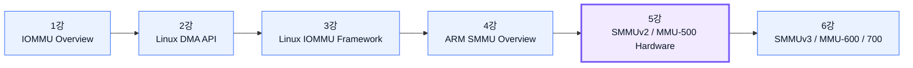

---

## 1. SMMUv2를 보는 가장 단순한 모델

SMMUv2는 들어오는 DMA transaction을 다음 순서로 처리합니다.

```mermaid
flowchart LR
    DEV["DMA Master<br/>IOVA + Stream ID"] --> SEL["Stream selection<br/>SMR / S2CR"]
    SEL --> CB["Context Bank<br/>translation context"]
    CB --> TLB{"IOTLB hit?"}
    TLB -->|yes| CHECK["Permission / attribute check"]
    TLB -->|no| WALK["Hardware page-table walk"]
    WALK --> CHECK
    CHECK -->|allowed| PA["Output PA transaction"]
    CHECK -->|denied / unmapped| FAULT["Context fault"]
    classDef master fill:#E9FBF4,stroke:#27B879,color:#081525,stroke-width:1.5px;
    classDef select fill:#EAF1FF,stroke:#2F6BFF,color:#081525,stroke-width:1.5px;
    classDef ctx fill:#F2EAFF,stroke:#7A5AF8,color:#081525,stroke-width:1.5px;
    classDef mem fill:#FFF4DB,stroke:#E9A91B,color:#081525,stroke-width:1.5px;
    classDef bad fill:#FDECEC,stroke:#E65B5B,color:#7F1D1D,stroke-width:1.5px;
    class DEV master;
    class SEL,TBL select;
    class CB,TLB,WALK,CHECK ctx;
    class PA mem;
    class FAULT bad;
```

핵심은 세 단계입니다.

1. **Stream selection**: Stream ID를 SMR/S2CR mapping group에 연결합니다.
2. **Context selection**: S2CR의 `CBNDX`가 사용할 Context Bank를 지정합니다.
3. **Translation**: Context Bank의 TCR/TTBR/MAIR와 page table을 사용해 IOVA를 PA로 변환합니다.

정상 translation뿐 아니라 `BYPASS`, `FAULT`, permission check, fault capture까지 이 경로에 포함됩니다.

### 1.1 SMMUv1/v2와 MMU-500의 관계

- **SMMUv1/v2**는 Arm이 정의한 architecture/programming model입니다.
- **MMU-500**은 이 architecture를 구현한 CoreLink System IP입니다.
- Linux의 `drivers/iommu/arm/arm-smmu/` 드라이버는 SMMUv1/v2 계열을 지원하며, MMU-500 전용 동작은 implementation hook으로 보완합니다.
- SoC vendor가 MMU-500을 통합할 때 interconnect topology, Stream ID wiring, IRQ 수, TBU 수, coherent page-table walk 여부 등이 달라질 수 있습니다.

---

## 2. MMU-500의 구현 관점: TBU와 TCU

MMU-500은 일반적으로 DMA master 가까이에 배치되는 **Translation Buffer Unit(TBU)**와 중앙 제어/페이지 워크를 담당하는 **Translation Control Unit(TCU)** 구조로 이해할 수 있습니다. 실제 인스턴스 수와 연결 방식은 SoC integration 설정에 따라 다릅니다.

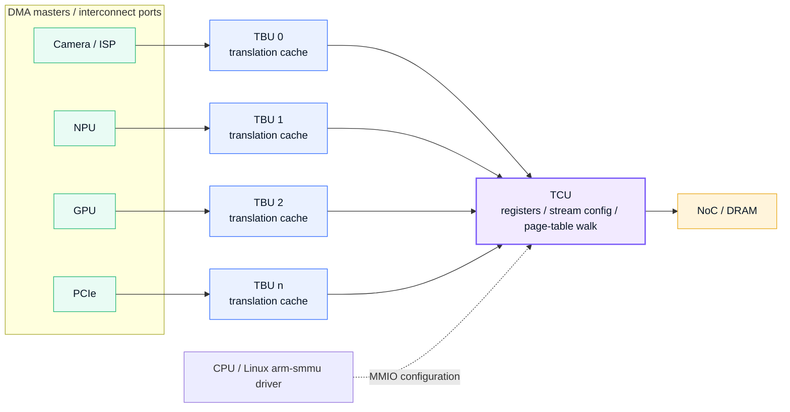

### 2.1 TBU

- DMA transaction을 받아 translation cache를 조회합니다.
- cache hit이면 낮은 latency로 output address transaction을 전달합니다.
- miss이면 TCU 쪽 translation service/page-table walk 결과를 이용합니다.
- master port 가까이에 배치하여 높은 DMA bandwidth를 처리합니다.

### 2.2 TCU

- SMMU MMIO register interface를 제공합니다.
- Stream mapping, Context Bank configuration, global fault와 TLB maintenance를 관리합니다.
- page-table walk와 공유 translation 정보를 담당합니다.
- Linux `arm-smmu` driver가 프로그래밍하는 논리적 SMMU 인스턴스의 중심입니다.

> Linux driver에서는 TBU/TCU의 내부 분산 구조보다 architected register model이 우선 보입니다. 따라서 software debugging은 먼저 Stream ID, SMR/S2CR, Context Bank와 fault register를 추적하고, 성능/통합 문제에서 TBU/TCU topology를 추가로 봅니다.

---

## 3. MMIO register space

SMMUv2의 register space는 크게 Global Register Space 0, Global Register Space 1, Context Bank register pages로 나뉩니다.

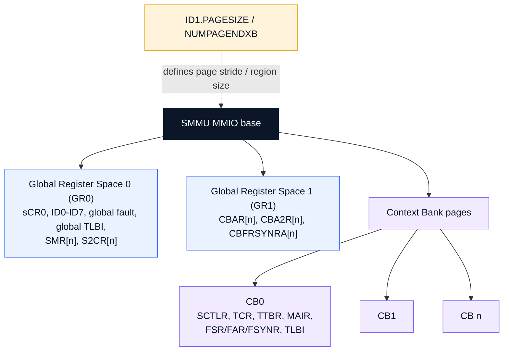

| 영역 | 대표 레지스터 | 역할 |
|---|---|---|
| GR0 | `sCR0`, `ID0-ID7`, `sGFSR`, global TLBI | 전체 SMMU enable/policy, capability, global fault, global invalidation |
| GR0 stream area | `SMR[n]`, `S2CR[n]` | Stream ID를 translation/bypass/fault와 Context Bank에 연결 |
| GR1 | `CBAR[n]`, `CBA2R[n]`, `CBFRSYNRA[n]` | Context Bank의 stage/format/VMID와 fault Stream ID 정보 |
| Context Bank n | `SCTLR`, `TCR`, `TTBR`, `MAIR`, `FSR/FAR/FSYNR`, TLBI | 한 translation context의 실제 동작 |

`ID1.PAGESIZE`와 `ID1.NUMPAGENDXB`는 register page의 stride와 Context Bank 영역 위치 계산에 영향을 줍니다. Linux driver는 이를 읽어 `pgshift`, `numpage`, Context Bank base를 계산합니다.

---

## 4. Capability discovery: ID0, ID1, ID2, ID7

SMMU driver는 probe 시 ID register를 읽어 구현 기능을 추론해야 합니다.

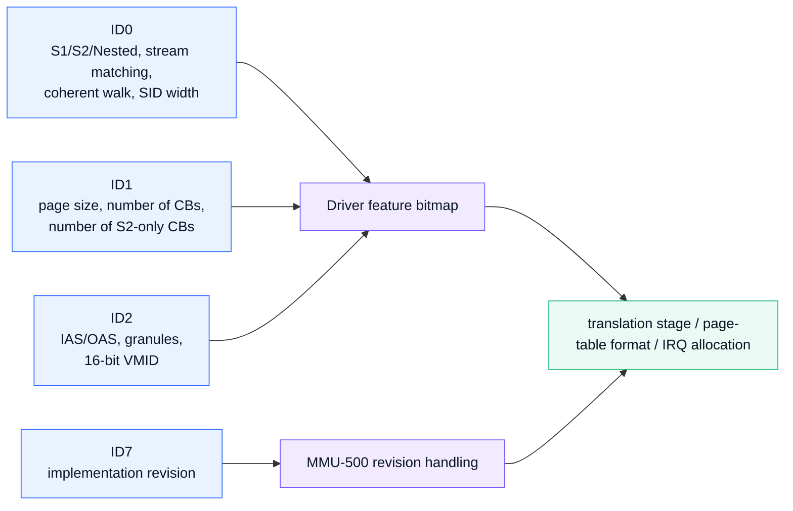

### 4.1 ID0에서 보는 것

| 필드 개념 | 의미 |
|---|---|
| S1TS / S2TS / NTS | Stage 1, Stage 2, nested translation 지원 |
| SMS | Stream matching 지원 여부 |
| NUMSMRG | Stream matching group 수 |
| NUMSIDB | Stream ID bit 수 |
| CTTW | coherent translation table walk 지원 |
| EXIDS | extended Stream ID 지원 |
| NUMIRPT | context interrupt 관련 capability |

### 4.2 ID1에서 보는 것

| 필드 개념 | 의미 |
|---|---|
| PAGESIZE | register page size 선택 |
| NUMPAGENDXB | register mapping 영역 크기 계산 |
| NUMCB | 총 Context Bank 수 |
| NUMS2CB | Stage-2-only로 사용 가능한 선두 Context Bank 수 |

### 4.3 ID2에서 보는 것

- input address size(IAS)
- output address size(OAS)
- upstream address size(UBS)
- AArch64 4K/16K/64K page-table format 지원
- 16-bit VMID 지원 여부

### 4.4 ID7

MMU-500 revision을 읽어 implementation-specific 초기화와 errata 처리를 결정할 수 있습니다.

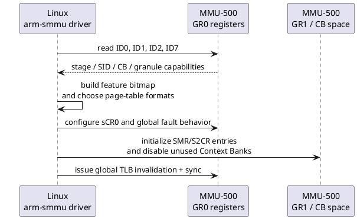

---

## 5. Stream matching과 Stream indexing

SMMUv2 구현은 Stream ID를 두 방식 중 하나로 S2CR에 연결할 수 있습니다.

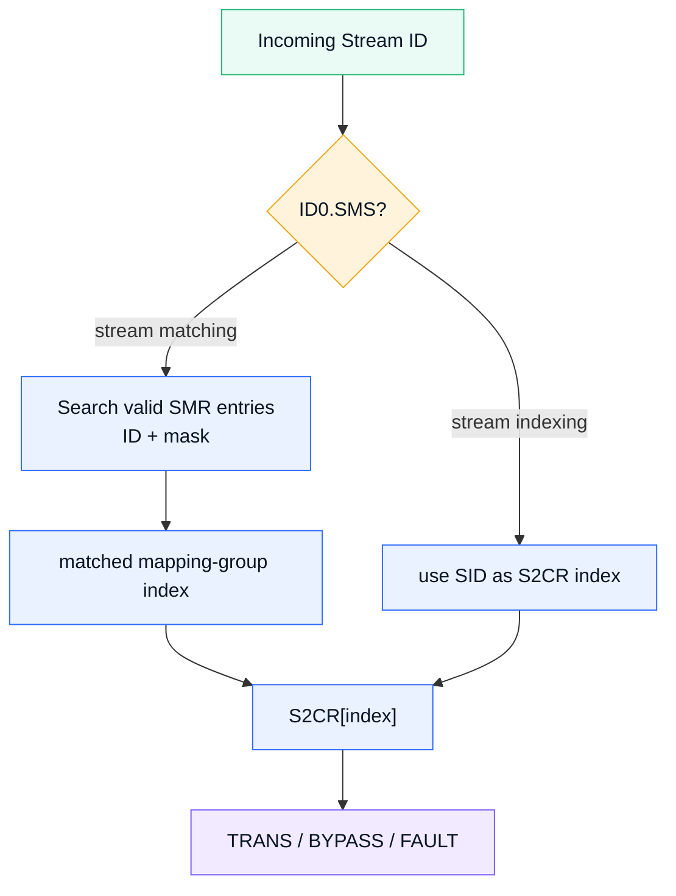

### 5.1 Stream indexing

```text
S2CR index = incoming Stream ID
```

- 단순하고 빠른 구조입니다.
- 지원 가능한 SID 범위만큼 S2CR table이 필요할 수 있습니다.
- Stream ID별로 정확히 하나의 엔트리를 직접 선택합니다.

### 5.2 Stream matching

- `SMR[n]`의 ID와 MASK를 incoming SID와 비교합니다.
- match된 index의 `S2CR[n]`을 사용합니다.
- SID 범위를 한 mapping group으로 묶거나, 제한된 수의 mapping entry로 여러 master를 관리할 수 있습니다.
- 겹치는 match rule은 모호성을 만들므로 software가 overlap을 방지해야 합니다.

### 5.3 SMR match rule

개념적으로 MASK bit가 1이면 해당 SID bit를 비교에서 제외합니다.

```text
match when ((incoming_sid ^ smr.id) & ~smr.mask) == 0
```

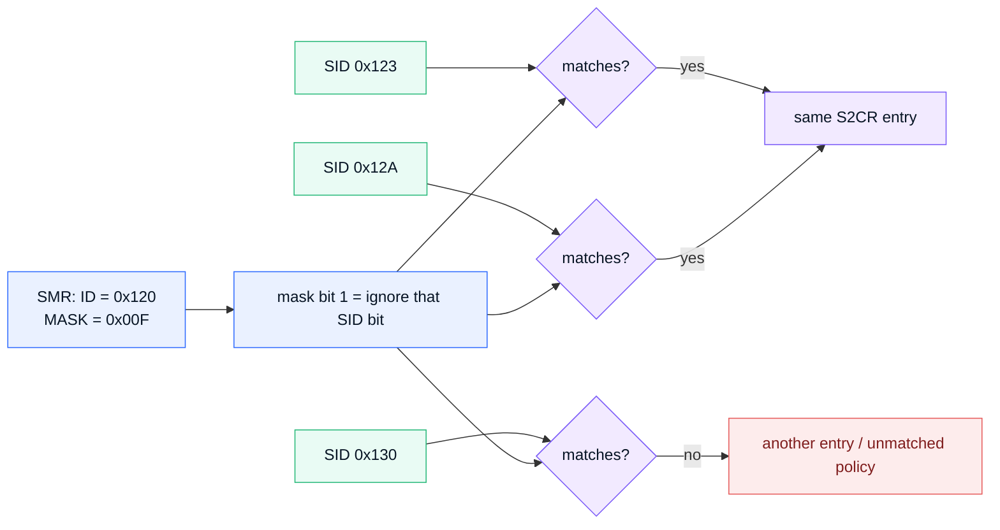

예시에서 `MASK=0x00F`는 하위 4bit를 무시하므로 `0x120-0x12F` 범위가 같은 rule에 match합니다.

---

## 6. S2CR: Stream-to-Context 동작 선택

S2CR은 match/index된 stream이 어떻게 처리될지 결정합니다.

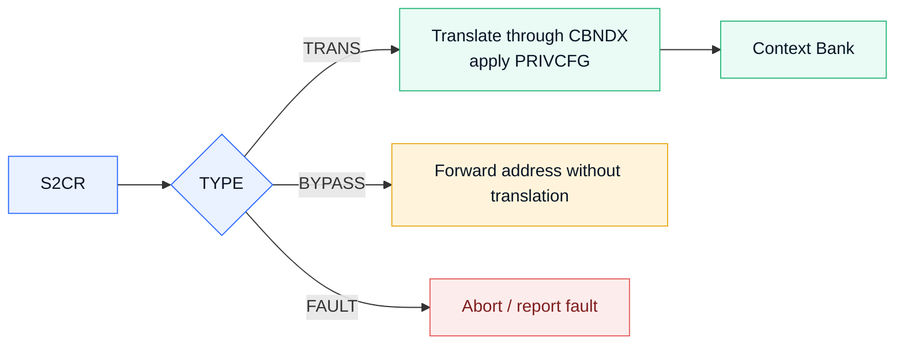

| S2CR 필드 | 의미 |
|---|---|
| TYPE | `TRANS`, `BYPASS`, `FAULT` 중 선택 |
| CBNDX | `TRANS`일 때 사용할 Context Bank 번호 |
| PRIVCFG | upstream privileged attribute를 유지하거나 강제 변환 |
| EXIDVALID | extended SID mode에서 mapping entry valid 제어 |

### 6.1 TYPE=TRANS

Context Bank를 통해 주소 변환과 permission check를 수행합니다.

### 6.2 TYPE=BYPASS

주소 변환을 하지 않고 upstream bus address를 전달합니다. 호환성에는 유용하지만, 잘못 사용하면 DMA isolation을 잃습니다.

### 6.3 TYPE=FAULT

해당 stream의 DMA를 차단합니다. 부착되지 않은 장치나 예상하지 못한 SID를 fail-closed로 처리할 때 유용합니다.

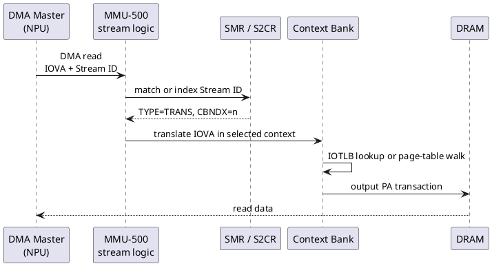

---

## 7. SMR/S2CR 프로그래밍 시 주의점

다음 코드는 레지스터 의미를 설명하기 위한 pseudocode이며, 실제 Linux API를 대체하지 않습니다.

```c
static void program_stream_entry(struct smmu *s, int index)
{
    u32 smr = FIELD_PREP(SMR_ID, s->sid) |
              FIELD_PREP(SMR_MASK, s->sid_mask) |
              SMR_VALID;

    u32 s2cr = FIELD_PREP(S2CR_TYPE, S2CR_TRANS) |
               FIELD_PREP(S2CR_CBNDX, s->context_bank) |
               FIELD_PREP(S2CR_PRIVCFG, PRIV_DEFAULT);

    writel(s2cr, s->gr0 + S2CR(index));
    writel(smr,  s->gr0 + SMR(index));
}
```

중요한 순서:

1. S2CR 내용을 먼저 안전한 값으로 준비합니다.
2. SMR의 ID/MASK를 설정합니다.
3. 마지막에 valid 상태가 보이도록 하여, 잠깐이라도 잘못된 Context Bank로 route되는 window를 줄입니다.
4. entry 삭제 시에는 반대로 먼저 FAULT/BYPASS 정책으로 전환한 뒤 match를 제거하는 방식이 안전합니다.

Extended SID 모드에서는 valid bit가 SMR이 아니라 S2CR의 `EXIDVALID` 쪽에 반영될 수 있으므로 architecture feature를 확인해야 합니다.

---

## 8. Context Bank의 역할

Context Bank는 하나의 translation context를 나타냅니다.

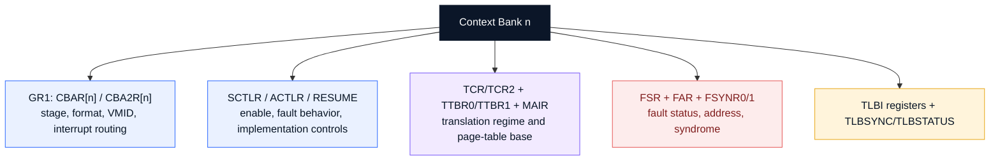

Context Bank에는 다음 정보가 모입니다.

- Stage 1 / Stage 2 / nested 동작 방식
- ASID 또는 VMID
- input address size, page granule, shareability와 cacheability
- translation table base
- memory attribute encoding
- fault reporting/stall behavior
- context-local TLB maintenance

Linux의 하나의 `arm_smmu_domain`은 보통 하나의 Context Bank를 할당받아 사용합니다. 여러 device가 같은 IOMMU domain에 attach되면 서로 다른 SID가 같은 CBNDX로 연결될 수 있습니다.

---

## 9. CBAR와 CBA2R

GR1의 Context Bank attribute register가 translation regime을 결정합니다.

### 9.1 CBAR.TYPE

| TYPE 개념 | 의미 |
|---|---|
| S2 translation | Stage 2만 수행 |
| S1 translation + S2 bypass | Stage 1 결과를 output으로 사용 |
| S1 translation + S2 fault | Stage 2 경로를 fault 처리 |
| S1 + S2 translation | nested translation |

### 9.2 VMID와 VA64

- 기본 VMID는 CBAR에 있을 수 있습니다.
- 16-bit VMID를 지원하는 구현은 CBA2R의 확장 field를 사용합니다.
- AArch64 context format 선택은 CBA2R의 `VA64`와 연결됩니다.

### 9.3 Context Bank interrupt

SMMUv1과 v2 사이에 interrupt index 표현 방식의 차이가 있으므로 implementation version과 IRQ wiring을 함께 확인해야 합니다.

---

## 10. Stage 1 Context Bank register

Stage 1 translation은 다음 register 집합을 핵심으로 봅니다.

| 레지스터 | 역할 |
|---|---|
| SCTLR | translation enable, fault reporting, access flag/table walk behavior |
| TCR/TCR2 | input address size, granule, shareability, cacheability, output PA size |
| TTBR0/TTBR1 | Stage-1 translation table base와 ASID |
| MAIR0/MAIR1 | page descriptor AttrIndx가 참조하는 memory attribute |
| CONTEXTIDR | 일부 AArch32 format의 context/ASID 정보 |

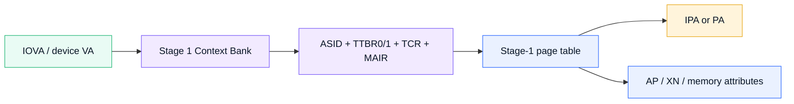

Stage 1의 output은 구성에 따라 최종 PA이거나 nested translation의 IPA가 됩니다.

---

## 11. Stage 2 Context Bank register

Stage 2에서는 동일한 MMIO offset이 가상화 register 의미로 해석됩니다.

| 논리적 값 | SMMUv2 Context Bank에서의 역할 |
|---|---|
| VTTBR | Stage-2 page-table base와 VMID |
| VTCR | IPA size, granule, walk cacheability/shareability, PA size |
| Stage-2 PTE | IPA -> PA mapping과 Stage-2 permission |

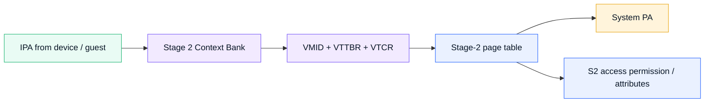

Stage 2는 guest/VM 또는 별도 protection domain이 볼 수 있는 IPA를 host system PA로 제한하는 데 사용됩니다.

---

## 12. Nested translation

Hardware가 nested translation을 지원하면 Stage 1과 Stage 2를 연속 적용할 수 있습니다.

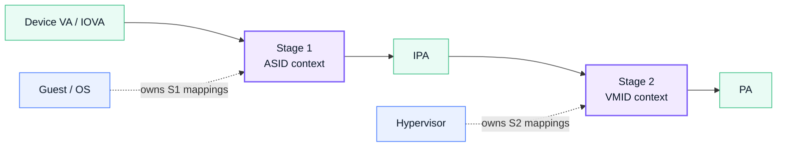

```text
Device VA / IOVA -> Stage 1 -> IPA -> Stage 2 -> PA
```

중요한 점:

- Architecture 지원과 Linux의 특정 사용 경로 지원은 구분해야 합니다.
- 일반 DMA API domain은 보통 한 OS가 관리하는 translated domain으로 사용합니다.
- device passthrough/SVA/virtualization에서는 guest와 hypervisor의 page table ownership을 별도로 고려합니다.

---

## 13. Context Bank programming order

TCR가 TTBR field의 해석에 영향을 줄 수 있으므로, Linux driver도 TCR/TCR2를 TTBR보다 먼저 기록합니다.

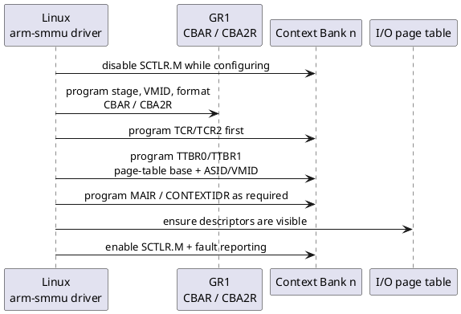

설명용 pseudocode:

```c
static void enable_context_bank(struct cb *cb)
{
    writel(0, cb->base + SCTLR);

    writel(cb->cbar,  cb->gr1 + CBAR(cb->index));
    writel(cb->tcr2, cb->base + TCR2);
    writel(cb->tcr,  cb->base + TCR);

    writeq(cb->ttbr0, cb->base + TTBR0);
    writeq(cb->ttbr1, cb->base + TTBR1);
    writel(cb->mair0, cb->base + MAIR0);
    writel(cb->mair1, cb->base + MAIR1);

    writel(SCTLR_M | SCTLR_CFIE | SCTLR_CFRE,
           cb->base + SCTLR);
}
```

실제 초기화에서 더 고려할 사항:

- 사용하지 않는 Context Bank는 `SCTLR=0`으로 disable
- page-table memory가 SMMU에 보이도록 cache maintenance/barrier 수행
- fault interrupt enable과 response policy 설정
- Stream mapping을 활성화하기 전에 Context Bank가 완전히 준비되었는지 확인

---

## 14. Page-table format과 granule

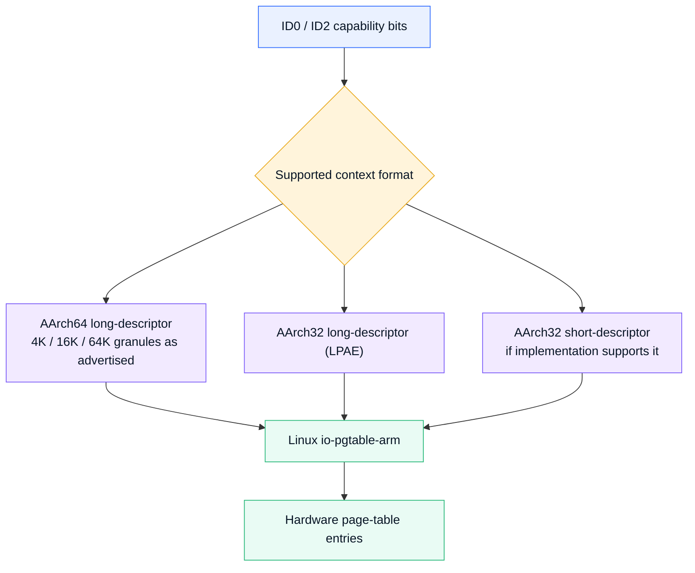

SMMUv2/MMU-500에서 지원할 수 있는 주요 format:

- AArch64 long-descriptor
- AArch32 LPAE long-descriptor
- AArch32 short-descriptor, 구현 지원 시

4K/16K/64K granule은 implementation의 ID2 capability와 kernel `io-pgtable` 선택에 따라 달라집니다. 모든 MMU-500 integration이 모든 granule을 반드시 지원한다고 가정하면 안 됩니다.

### 14.1 TCR에서 보는 항목

- `T0SZ`: input virtual address 크기
- `TG0`: page granule
- `IRGN0/ORGN0`: page-table walk cacheability
- `SH0`: shareability
- Stage 2에서는 `SL0`, `PS` 같은 시작 level/output PA size 항목도 중요

### 14.2 TTBR

- page-table base address
- Stage 1에서는 ASID와 결합
- Stage 2에서는 VTTBR 의미로 VMID와 결합

---

## 15. Translation cache와 IOTLB

MMU-500의 성능은 translation cache hit rate와 page-table walk latency에 크게 영향을 받습니다.

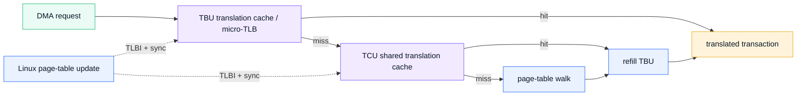

CPU page table과 마찬가지로 다음 문제가 발생할 수 있습니다.

- mapping이 바뀌었는데 오래된 translation이 cache에 남음
- unmap 후 장치가 stale IOVA로 접근
- ASID/VMID 재사용 시 이전 entry가 남음
- 여러 TBU에 translation 복사본이 존재

따라서 map/unmap과 context 재사용 시 정확한 TLBI scope와 completion sync가 필요합니다.

---

## 16. TLB invalidation 범위

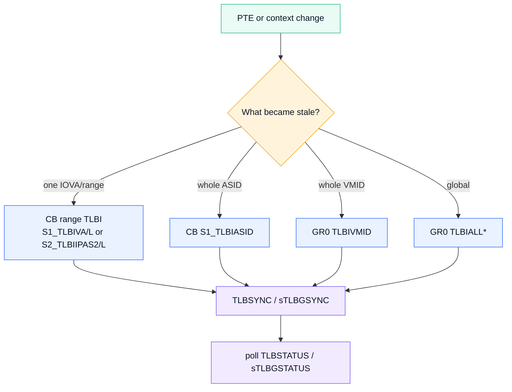

대표적인 register 개념:

| 범위 | 대표 register |
|---|---|
| Stage-1 ASID 전체 | Context Bank `S1_TLBIASID` |
| Stage-1 IOVA | `S1_TLBIVA`, leaf-only variant |
| Stage-2 IPA | `S2_TLBIIPAS2`, leaf-only variant |
| VMID 전체 | GR0 `TLBIVMID` |
| global | GR0 `TLBIALL*` |
| completion | `TLBSYNC/TLBSTATUS`, `sTLBGSYNC/sTLBGSTATUS` |

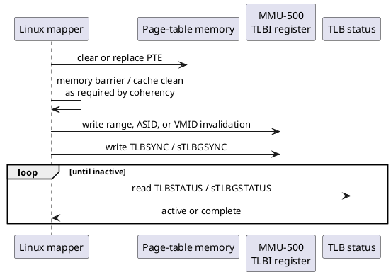

설명용 pseudocode:

```c
static void invalidate_context(struct smmu_domain *dom)
{
    /* Make page-table updates visible before invalidation. */
    dma_wmb();

    if (dom->stage == STAGE_1)
        writel(dom->asid, dom->cb + S1_TLBIASID);
    else
        writel(dom->vmid, dom->gr0 + TLBIVMID);

    writel(0, dom->cb + TLBSYNC);
    while (readl(dom->cb + TLBSTATUS) & TLB_ACTIVE)
        cpu_relax();
}
```

> TLBI register write 자체가 곧 완료를 뜻하지 않습니다. sync를 발행하고 active status가 해제될 때까지 기다려야 software가 mapping memory를 안전하게 재사용할 수 있습니다.

---

## 17. Coherent page-table walk

SMMU가 page-table memory를 CPU cache와 coherent하게 읽을 수 있는지는 SoC integration에서 매우 중요합니다.

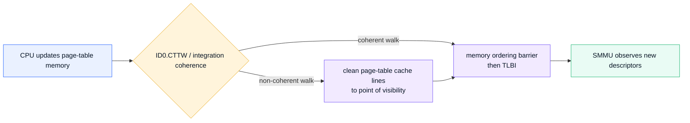

- `ID0.CTTW`는 coherent table walk capability를 나타내는 신호 중 하나입니다.
- coherent walk여도 PTE update와 TLBI 사이의 memory ordering은 필요합니다.
- non-coherent walk에서는 CPU가 수정한 descriptor cache line을 SMMU가 볼 수 있는 지점까지 clean해야 합니다.
- 이 문제는 DMA payload buffer coherency와 별개입니다. page table 자체의 coherency 문제입니다.

---

## 18. Fault model: Global vs Context

```mermaid
flowchart TB
    FAULT["SMMUv2 fault"] --> GLOBAL["Global fault<br/>stream/configuration level"]
    FAULT --> CONTEXT["Context fault<br/>translation/access in a CB"]
    GLOBAL --> USF["Unknown / unmatched Stream ID"]
    GLOBAL --> CFG["global configuration / implementation error"]
    CONTEXT --> TF["Translation fault"]
    CONTEXT --> PF["Permission fault"]
    CONTEXT --> AF["Access flag fault"]
    CONTEXT --> PTW["Page-table walk / external abort"]
    classDef root fill:#0B1628,stroke:#0B1628,color:#FFFFFF;
    classDef global fill:#FFF4DB,stroke:#E9A91B,color:#081525;
    classDef context fill:#FDECEC,stroke:#E65B5B,color:#7F1D1D;
    class FAULT root;
    class GLOBAL,USF,CFG global;
    class CONTEXT,TF,PF,AF,PTW context;
```

### 18.1 Global fault

SMMU 전체/stream selection 수준에서 발생합니다.

- unknown or unmatched Stream ID
- invalid global configuration
- implementation-specific system error

대표 register:

```text
sGFSR, sGFSYNR0, sGFSYNR1, sGFSYNR2
```

### 18.2 Context fault

특정 Context Bank의 translation/access에서 발생합니다.

- translation fault
- permission fault
- access flag fault
- page-table walk external abort
- TLB maintenance-related fault

---

## 19. Context fault register 읽는 순서

```mermaid
flowchart LR
    IRQ["Context fault IRQ"] --> FSR["FSR<br/>fault class / stall / multi"]
    IRQ --> FAR["FAR<br/>faulting IOVA"]
    IRQ --> FSYNR["FSYNR0/1<br/>read/write, PTW, level, attributes"]
    IRQ --> CBFR["CBFRSYNRA<br/>Stream ID associated with CB fault"]
    FSR --> DEC["fault decoder"]
    FAR --> DEC
    FSYNR --> DEC
    CBFR --> DEC
    DEC --> REPORT["Linux report_iommu_fault() / log"]
    classDef irq fill:#FDECEC,stroke:#E65B5B,color:#7F1D1D;
    classDef reg fill:#EAF1FF,stroke:#2F6BFF,color:#081525;
    classDef sw fill:#F2EAFF,stroke:#7A5AF8,color:#081525;
    class IRQ irq;
    class FSR,FAR,FSYNR,CBFR reg;
    class DEC,REPORT sw;
```

| 레지스터 | 먼저 확인할 내용 |
|---|---|
| FSR | fault valid, type, multiple fault, stalled state |
| FAR | faulting IOVA/VA |
| FSYNR0 | read/write, page-table walk 여부, fault level, attributes |
| CBFRSYNRA | 해당 Context Bank fault와 연관된 Stream ID |

```plantuml
@startuml
skinparam backgroundColor white
skinparam shadowing false
skinparam sequenceMessageAlign center
participant "DMA Master" as DEV
participant "MMU-500\nContext Bank" as CB
participant "Linux IRQ\nhandler" as IRQ
participant "IOMMU Core" as CORE

DEV -> CB: access unmapped or denied IOVA
CB -> CB: capture FSR, FAR, FSYNR\nand associated Stream ID
CB -> IRQ: context fault interrupt
IRQ -> CB: read fault registers
IRQ -> CORE: report_iommu_fault(IOVA, read/write)
CORE --> IRQ: handled / retry / terminate decision
IRQ -> CB: clear FSR
opt stalled transaction
    IRQ -> CB: RESUME or TERMINATE
end
@enduml
```

Linux handler의 큰 흐름:

1. fault register를 읽습니다.
2. fault가 유효한지 확인합니다.
3. IOMMU Core에 IOVA와 read/write type을 보고합니다.
4. FSR을 write-one-to-clear 방식으로 정리합니다.
5. stalled transaction이면 resume 또는 terminate를 결정합니다.

---

## 20. Fault debug 예시

가정:

```text
SID        = 0x20
CBNDX      = 3
FAR        = 0x40012000
FSYNR0.WNR = 1
FSR.TF     = 1
```

해석:

- NPU Stream ID 0x20에서 시작한 write access입니다.
- Context Bank 3을 사용했습니다.
- IOVA `0x40012000`에 대한 translation entry가 없거나 walk가 실패했습니다.
- 먼저 DMA mapping lifetime, scatter-gather mapping 결과, IOVA aperture를 확인합니다.

```bash
dmesg | grep -Ei 'arm-smmu|iommu|context fault|global fault'

# Decode the four first questions:
# 1) Which Stream ID and Context Bank?
# 2) Which IOVA and read/write direction?
# 3) Translation, permission, or page-table-walk fault?
# 4) Was the DMA mapping still valid at fault time?

cat /proc/device-tree/npu@12340000/iommus | hexdump -C
find /sys/kernel/iommu_groups -maxdepth 2 -type l
```

fault log의 register bit만 보고 끝내지 말고 다음 연결을 확인해야 합니다.

```text
SID -> Device Tree iommus -> SMR/S2CR -> CBNDX -> domain -> IOVA mapping lifetime
```

---

## 21. MMU-500 implementation-specific 초기화

MMU-500은 architected SMMUv2 register에 더해 implementation-specific ACR/ACTLR 동작과 revision/errata 고려가 있습니다.

```mermaid
flowchart TB
    RESET["Linux MMU-500 reset hook"] --> REV["Read ID7 major revision"]
    REV --> LOCK{"revision >= r2?"}
    LOCK -->|yes| CLR["Clear ACR.CACHE_LOCK"]
    LOCK -->|no| BYPASS["Keep existing lock behavior"]
    CLR --> EN["Enable bypass translation-cache optimizations<br/>ACR.SMTNMB_TLBEN / S2CRB_TLBEN"]
    BYPASS --> EN
    EN --> ERRATA{"CPRE errata option enabled?"}
    ERRATA -->|yes| PREF["Clear ACTLR.CPRE in every Context Bank"]
    ERRATA -->|no| DONE["Continue generic reset"]
    PREF --> DONE
    classDef start fill:#0B1628,stroke:#0B1628,color:#FFFFFF;
    classDef reg fill:#EAF1FF,stroke:#2F6BFF,color:#081525;
    classDef choice fill:#FFF4DB,stroke:#E9A91B,color:#081525;
    classDef action fill:#F2EAFF,stroke:#7A5AF8,color:#081525;
    class RESET start;
    class REV,CLR,EN,PREF reg;
    class LOCK,ERRATA choice;
    class BYPASS,DONE action;
```

Linux mainline의 MMU-500 reset hook이 보여주는 핵심:

- ID7 major revision을 확인합니다.
- r2p0 이후에는 Context Bank ACTLR write가 반영되도록 `ACR.CACHE_LOCK`을 clear합니다.
- unmatched/bypass stream의 translation-cache latency를 줄이기 위한 ACR bit를 enable합니다.
- 선택된 errata configuration에서는 Context Bank의 next-page prefetcher인 `ACTLR.CPRE`를 disable합니다.

### 21.1 왜 TRM과 errata 문서를 함께 봐야 하는가?

동일한 register programming model이어도 revision별로 write lock, prefetcher, cache maintenance 동작이 달라질 수 있습니다. 제품 개발에서는 다음을 함께 고정해야 합니다.

- MMU-500 revision
- SoC integration manual
- 적용 errata 목록
- Linux kernel의 implementation hook/quirk

---

## 22. BYPASS와 fail-closed policy

```mermaid
flowchart LR
    SID["Unattached / unmatched Stream ID"] --> POLICY{"Default policy"}
    POLICY -->|legacy permissive| BYP["BYPASS<br/>DMA can reach bus address"]
    POLICY -->|hardened| FLT["FAULT<br/>DMA blocked and reported"]
    BYP --> RISK["larger DMA attack / corruption surface"]
    FLT --> SAFE["fail closed; integration mistakes visible"]
    classDef input fill:#E9FBF4,stroke:#27B879,color:#081525;
    classDef choice fill:#FFF4DB,stroke:#E9A91B,color:#081525;
    classDef warn fill:#FDECEC,stroke:#E65B5B,color:#7F1D1D;
    classDef safe fill:#EAF1FF,stroke:#2F6BFF,color:#081525;
    class SID input;
    class POLICY choice;
    class BYP,RISK warn;
    class FLT,SAFE safe;
```

초기화되지 않은 stream을 BYPASS로 둘지 FAULT로 둘지는 보안과 호환성의 trade-off입니다.

- BYPASS: firmware/legacy device 호환에는 편하지만 예상하지 못한 DMA가 물리 메모리에 도달할 수 있습니다.
- FAULT: integration 오류가 즉시 드러나고 isolation이 강해집니다.
- Linux의 `arm-smmu.disable_bypass` 정책과 kernel configuration을 확인해야 합니다.
- production Automotive/secure system에서는 허용 stream을 명시하고 나머지는 차단하는 설계가 일반적으로 더 안전합니다.

---

## 23. Device Tree integration

예시:

```dts
smmu: iommu@2b400000 {
    compatible = "arm,mmu-500";
    reg = <0x0 0x2b400000 0x0 0x20000>;
    #iommu-cells = <1>;
    interrupts = <GIC_SPI 74 IRQ_TYPE_LEVEL_HIGH>,
                 <GIC_SPI 75 IRQ_TYPE_LEVEL_HIGH>;
};

npu@12340000 {
    compatible = "vendor,npu";
    reg = <0x0 0x12340000 0x0 0x10000>;
    iommus = <&smmu 0x20>;
    dma-coherent;
};
```

```mermaid
flowchart LR
    DTS["Device Tree<br/>arm,mmu-500 + iommus"] --> FWS["iommu_fwspec<br/>Stream ID list"]
    FWS --> MASTER["NPU / Camera device"]
    MASTER --> SME["SMR/S2CR mapping group"]
    SME --> DOMAIN["Linux iommu_domain"]
    DOMAIN --> CB["allocated Context Bank"]
    CB --> HW["MMU-500 translation"]
    classDef fw fill:#F5F7FA,stroke:#94A3B8,color:#081525;
    classDef obj fill:#EAF1FF,stroke:#2F6BFF,color:#081525;
    classDef core fill:#F2EAFF,stroke:#7A5AF8,color:#081525;
    classDef hw fill:#E9FBF4,stroke:#27B879,color:#081525;
    class DTS fw;
    class FWS,MASTER,SME obj;
    class DOMAIN,CB core;
    class HW hw;
```

주의점:

- `compatible = "arm,mmu-500"`은 MMU-500 implementation을 선택합니다.
- `#iommu-cells = <1>`인 일반적인 binding에서는 cell이 Stream ID를 나타냅니다.
- `reg` 크기와 IRQ 배열은 실제 SoC integration manual에 맞아야 합니다.
- 하나의 device가 여러 SID를 낼 수 있으면 모든 SID를 기술해야 합니다.
- `dma-coherent`는 해당 master의 DMA coherency를 나타내며, SMMU page-table walk coherency와 혼동하면 안 됩니다.

---

## 24. Linux driver 객체와 하드웨어 대응

```mermaid
flowchart LR
    HW1["MMU-500 HW instance"] --> DEV["struct arm_smmu_device"]
    HW2["SMR / S2CR entries"] --> SME["arm_smmu_smr / arm_smmu_s2cr"]
    HW3["Context Bank"] --> CFG["arm_smmu_cfg / arm_smmu_cb"]
    HW4["I/O page table"] --> DOM["arm_smmu_domain + io_pgtable_ops"]
    DEV --> IOMMU["struct iommu_device"]
    DOM --> CORE["struct iommu_domain"]
    classDef hw fill:#FFF4DB,stroke:#E9A91B,color:#081525;
    classDef drv fill:#EAF1FF,stroke:#2F6BFF,color:#081525;
    classDef core fill:#F2EAFF,stroke:#7A5AF8,color:#081525;
    class HW1,HW2,HW3,HW4 hw;
    class DEV,SME,CFG,DOM drv;
    class IOMMU,CORE core;
```

| Linux 객체 | 하드웨어 대응 |
|---|---|
| `arm_smmu_device` | 한 SMMU/MMU-500 인스턴스와 capability |
| `arm_smmu_smr` | SMR entry의 ID/MASK/valid software shadow |
| `arm_smmu_s2cr` | S2CR TYPE/CBNDX/PRIVCFG software shadow |
| `arm_smmu_cfg` | Context Bank number, ASID/VMID, CBAR type, format |
| `arm_smmu_cb` | TCR/TTBR/MAIR 값의 software shadow |
| `arm_smmu_domain` | Linux IOMMU domain + Context Bank + io-pgtable ops |

4강에서 본 Linux IOMMU Framework가 5강의 MMU-500 register로 내려오는 연결입니다.

---

## 25. NPU DMA end-to-end case

```mermaid
flowchart LR
    BUF["CPU allocates scattered pages"] --> MAP["dma_map_sg()"] --> IOVA["contiguous NPU IOVA"]
    IOVA --> SME["SID -> SMR/S2CR"] --> CB["Context Bank"] --> TLB["TBU/TCU translation cache"]
    TLB -->|miss| PT["page-table walk"]
    PT --> PA["DRAM physical pages"]
    TLB --> PA
    NPU["NPU DMA"] --> IOVA
    classDef mem fill:#FFF4DB,stroke:#E9A91B,color:#081525;
    classDef api fill:#EAF1FF,stroke:#2F6BFF,color:#081525;
    classDef hw fill:#F2EAFF,stroke:#7A5AF8,color:#081525;
    classDef dev fill:#E9FBF4,stroke:#27B879,color:#081525;
    class BUF,PA mem;
    class MAP,IOVA api;
    class SME,CB,TLB,PT hw;
    class NPU dev;
```

```plantuml
@startuml
skinparam backgroundColor white
skinparam shadowing false
skinparam sequenceMessageAlign center
participant "NPU Driver" as DRV
participant "DMA-IOMMU" as DMA
participant "Linux\narm-smmu" as SMMU
participant "MMU-500" as HW
participant "NPU" as NPU

DRV -> DMA: dma_map_sg(buffer)
DMA -> DMA: allocate contiguous IOVA
DMA -> SMMU: iommu_map_pages(IOVA, PA pages)
SMMU -> HW: update page table\nand invalidate stale translations
DMA --> DRV: return dma_addr_t / IOVA
DRV -> NPU: program IOVA and start
NPU -> HW: DMA request with Stream ID
HW -> HW: SMR/S2CR -> Context Bank -> PA
HW --> NPU: DMA completion
@enduml
```

이 흐름에서 주소 종류를 다시 구분합니다.

| 위치 | 주소 |
|---|---|
| CPU driver buffer | CPU virtual address |
| physical backing | PA page list |
| DMA API 반환값 | NPU가 사용할 IOVA (`dma_addr_t`) |
| NPU register | IOVA |
| MMU-500 output | translated PA |

같은 physical page가 Camera/ISP/NPU의 서로 다른 domain에 attach되면 각 device가 다른 IOVA로 볼 수도 있습니다.

---

## 26. 성능 관점

```mermaid
flowchart TB
    PERF["MMU-500 performance"] --> HIT["Improve translation-cache hit rate"]
    PERF --> MAP["Reduce map/unmap churn"]
    PERF --> PAGE["Use appropriate page size / contiguous IOVA"]
    PERF --> BATCH["Batch TLBI and sync when framework permits"]
    PERF --> WALK["Keep page-table walks coherent and cacheable"]
    HIT --> METRIC["Measure latency, IOTLB misses, walk traffic"]
    MAP --> METRIC
    PAGE --> METRIC
    BATCH --> METRIC
    WALK --> METRIC
    classDef root fill:#0B1628,stroke:#0B1628,color:#FFFFFF;
    classDef action fill:#EAF1FF,stroke:#2F6BFF,color:#081525;
    classDef metric fill:#E9FBF4,stroke:#27B879,color:#081525;
    class PERF root;
    class HIT,MAP,PAGE,BATCH,WALK action;
    class METRIC metric;
```

MMU-500 최적화 시 확인할 것:

1. 매 frame마다 map/unmap을 반복하는지
2. 큰 buffer가 지나치게 작은 page로 쪼개졌는지
3. IOVA가 연속적이어도 physical fragmentation 때문에 walk/cache pressure가 큰지
4. TLBI sync가 hot path에 너무 자주 들어가는지
5. page-table walk memory attribute가 적절한지
6. TBU별 traffic locality가 좋은지
7. bypass가 성능 문제를 감추고 있지 않은지

성능 때문에 isolation을 포기하기 전에 persistent mapping, buffer pool, batched unmap, huge page/block mapping 가능성을 먼저 검토합니다.

---

## 27. 디버깅 결정 트리

```mermaid
flowchart TB
    START["SMMU fault observed"] --> GLOBAL{"Global or context fault?"}
    GLOBAL -->|global| SID["Read GFSR/GFSYNR<br/>check unknown SID / config"]
    GLOBAL -->|context| ADDR["Read FSR/FAR/FSYNR/CBFRSYNRA"]
    ADDR --> TYPE{"Fault type"}
    TYPE -->|translation| MAP["Was IOVA mapped and still alive?"]
    TYPE -->|permission| PROT["Check DMA direction / IOMMU prot"]
    TYPE -->|PTW external| COH["Check page-table memory / coherence / bus error"]
    SID --> DT["Check interconnect SID and Device Tree iommus"]
    MAP --> LIFE["Check premature unmap/free"]
    PROT --> FIX["Correct mapping permissions"]
    COH --> FIX2["Correct cache maintenance / memory attributes"]
    classDef root fill:#0B1628,stroke:#0B1628,color:#FFFFFF;
    classDef choice fill:#FFF4DB,stroke:#E9A91B,color:#081525;
    classDef step fill:#EAF1FF,stroke:#2F6BFF,color:#081525;
    classDef bad fill:#FDECEC,stroke:#E65B5B,color:#7F1D1D;
    class START root;
    class GLOBAL,TYPE choice;
    class SID,ADDR,MAP,PROT,COH,DT,LIFE,FIX,FIX2 step;
```

가장 중요한 질문 네 개:

1. **누가?** Stream ID와 device
2. **어디를?** FAR의 IOVA
3. **왜?** translation/permission/PTW fault
4. **언제?** mapping이 생성/해제된 시점과 DMA completion 순서

---

## 28. 핵심 레지스터 요약

| 범주 | 레지스터 | 한 줄 요약 |
|---|---|---|
| Global control | `sCR0` | client enable, fault/bypass/global policy |
| Capability | `ID0-ID2`, `ID7` | stage, SID, CB, address size, granule, revision |
| Stream | `SMR[n]` | SID match ID/MASK |
| Stream action | `S2CR[n]` | TRANS/BYPASS/FAULT와 CBNDX |
| CB attribute | `CBAR[n]`, `CBA2R[n]` | stage, format, VMID/VA64 |
| Translation | `SCTLR`, `TCR`, `TTBR`, `MAIR` | context enable와 page table |
| Context fault | `FSR`, `FAR`, `FSYNR` | fault type/address/syndrome |
| Global fault | `sGFSR`, `sGFSYNR` | unknown SID/global errors |
| Maintenance | `TLBI*`, `TLBSYNC`, `TLBSTATUS` | stale translation 제거와 완료 대기 |

---

## 29. 퀴즈

### Q1
Stream matching mode에서 SMR과 S2CR의 역할을 각각 설명하세요.

### Q2
`SMR.ID=0x120`, `SMR.MASK=0x00F`일 때 `SID=0x12B`가 match하는 이유를 설명하세요.

### Q3
S2CR의 `TRANS`, `BYPASS`, `FAULT` 차이는 무엇인가요?

### Q4
여러 Stream ID가 같은 Context Bank를 사용할 수 있나요? 가능하다면 Linux 관점에서 무엇을 의미하나요?

### Q5
Context Bank 초기화에서 TCR/TCR2를 TTBR보다 먼저 기록하는 이유는 무엇인가요?

### Q6
Stage 1의 ASID와 Stage 2의 VMID는 어떤 translation cache 구분에 사용되나요?

### Q7
page-table PTE를 삭제한 뒤 TLBI만 쓰고 sync를 기다리지 않으면 어떤 문제가 발생할 수 있나요?

### Q8
`ID0.CTTW`가 0인 시스템에서 page-table descriptor를 갱신할 때 추가로 무엇을 고려해야 하나요?

### Q9
Context fault를 분석할 때 FSR, FAR, FSYNR0, CBFRSYNRA에서 각각 무엇을 찾나요?

### Q10
MMU-500에서 `ACR.CACHE_LOCK`과 `ACTLR.CPRE`가 Linux implementation hook에서 다뤄지는 이유는 무엇인가요?

---

## 30. 퀴즈 정답과 해설

### A1
SMR은 incoming Stream ID를 ID/MASK rule로 mapping-group index에 match합니다. S2CR은 그 index에 대해 translation, bypass, fault 중 동작과 사용할 Context Bank를 지정합니다.

### A2
MASK의 하위 4bit가 compare 대상에서 제외되므로 `0x120-0x12F`가 모두 같은 rule에 match합니다. `0x12B`도 상위 비교 bit가 `0x120`과 같습니다.

### A3
`TRANS`는 CBNDX의 Context Bank로 주소를 변환합니다. `BYPASS`는 translation 없이 주소를 전달합니다. `FAULT`는 transaction을 차단하고 fault를 보고합니다.

### A4
가능합니다. 여러 SID의 S2CR이 같은 CBNDX를 가리킬 수 있습니다. Linux 관점에서는 여러 device/master stream이 같은 `iommu_domain`과 IOVA address space를 공유하는 상황에 대응합니다.

### A5
TCR/TCR2가 address size, format, 일부 TTBR field 해석을 결정하기 때문입니다. 잘못된 순서는 TTBR을 다른 format으로 해석하거나 transient invalid context를 만들 수 있습니다.

### A6
ASID는 Stage-1 address space를, VMID는 Stage-2 virtual machine/protection context를 구분하여 같은 IOVA/IPA 값의 translation cache entry가 섞이지 않게 합니다.

### A7
hardware에 stale translation이 남은 상태에서 physical page를 재사용할 수 있습니다. 장치가 해제된 buffer로 DMA하여 data corruption이나 security violation이 발생할 수 있습니다.

### A8
SMMU가 CPU cache의 최신 page-table descriptor를 자동으로 관찰하지 못할 수 있으므로, descriptor cache line clean과 적절한 memory barrier를 TLBI 전에 수행해야 합니다.

### A9
FSR에서 fault type/stall/multiple 상태, FAR에서 faulting IOVA, FSYNR0에서 read/write와 PTW/level, CBFRSYNRA에서 관련 Stream ID를 찾습니다.

### A10
MMU-500 revision/errata에 따라 Context Bank auxiliary register write lock과 next-page prefetcher 동작이 달라질 수 있기 때문입니다. generic SMMUv2 코드만으로는 구현별 안정성 요구를 모두 처리할 수 없습니다.

---

## 31. 5분 복습 카드

| 앞면 | 뒷면 |
|---|---|
| SMR | Stream ID match ID/MASK rule |
| S2CR | stream 동작 TYPE과 Context Bank index |
| Context Bank | 한 translation context의 TCR/TTBR/MAIR/fault/TLBI register 집합 |
| CBAR/CBA2R | stage, format, VMID/VA64 같은 Context Bank attribute |
| IOTLB | IOVA/IPA translation cache |
| TLBSYNC | invalidation 완료를 동기화하는 command |
| FSR/FAR | context fault status와 faulting address |
| CTTW | coherent translation table walk capability |
| TBU | master 가까이에서 translation cache/transaction 처리 |
| TCU | 중앙 config, shared translation, page-table walk/control |

### 빈칸 복습

1. Stream matching에서 incoming SID는 ______와 비교되고, 결과 index의 ______가 동작을 결정합니다.
2. `TYPE=TRANS`일 때 ______가 Context Bank를 선택합니다.
3. Stage 1의 translation context tag는 주로 ______, Stage 2는 ______입니다.
4. PTE update 후 stale translation 제거에는 ______와 completion ______가 필요합니다.
5. faulting IOVA는 ______, 관련 SID는 Context fault에서 ______를 통해 확인합니다.

정답: `SMR`, `S2CR`, `CBNDX`, `ASID`, `VMID`, `TLBI`, `sync`, `FAR`, `CBFRSYNRA`.

---

## 32. 실습 과제

### 실습 1: SID match 계산

다음 SMR rule에 match하는 SID 범위를 계산하세요.

```text
ID   = 0x340
MASK = 0x01F
```

그리고 `0x355`, `0x360`이 각각 match하는지 설명하세요.

### 실습 2: Capability table 만들기

대상 보드에서 boot log 또는 register dump를 이용해 다음 표를 채우세요.

| 항목 | 값 |
|---|---|
| SMMU version / MMU-500 revision | |
| Stream matching 지원 | |
| Stream ID width | |
| mapping group 수 | |
| Context Bank 수 | |
| Stage 1/2/nested 지원 | |
| IAS / OAS | |
| 4K/16K/64K format | |
| coherent table walk | |

### 실습 3: Fault trace

NPU buffer를 DMA 완료 전에 unmap했다고 가정하고 다음 sequence를 작성하세요.

```text
dma_map -> NPU start -> dma_unmap -> delayed NPU write -> SMMU fault
```

fault에서 예상되는 SID, FAR, WNR, FSR type을 정리하세요.

### 실습 4: Source reading

다음 source에서 register와 hardware concept를 연결하세요.

```mermaid
flowchart LR
    SPEC["Arm SMMU v1/v2 Architecture Spec<br/>IHI 0062"] --> TRM["MMU-500 TRM<br/>DDI 0517F"]
    TRM --> HDR["Linux arm-smmu.h<br/>register definitions"]
    HDR --> DRV["Linux arm-smmu.c<br/>generic v1/v2 driver"]
    DRV --> IMPL["arm-smmu-impl.c<br/>MMU-500 quirks"]
    DRV --> IOPG["io-pgtable-arm.c<br/>descriptor format"]
    classDef doc fill:#FFF4DB,stroke:#E9A91B,color:#081525;
    classDef src fill:#EAF1FF,stroke:#2F6BFF,color:#081525;
    class SPEC,TRM doc;
    class HDR,DRV,IMPL,IOPG src;
```

1. `drivers/iommu/arm/arm-smmu/arm-smmu.h`
2. `drivers/iommu/arm/arm-smmu/arm-smmu.c`
3. `drivers/iommu/arm/arm-smmu/arm-smmu-impl.c`
4. `drivers/iommu/io-pgtable-arm.c`
5. `Documentation/devicetree/bindings/iommu/arm,smmu.yaml`

찾을 함수/매크로:

```text
ARM_SMMU_GR0_SMR
ARM_SMMU_GR0_S2CR
arm_smmu_write_context_bank
arm_smmu_context_fault
arm_smmu_tlb_inv_context_s1
arm_mmu500_reset
```

---

## 33. 이번 강의 핵심 요약

```text
Stream ID
  -> SMR match 또는 direct index
  -> S2CR: TRANS / BYPASS / FAULT + CBNDX
  -> Context Bank: TCR / TTBR / MAIR / SCTLR
  -> IOTLB hit 또는 page-table walk
  -> PA transaction 또는 Context fault
```

MMU-500에서는 이 architected model이 TBU/TCU 구조로 구현되며, Linux는 generic `arm-smmu` driver와 MMU-500 implementation hook을 함께 사용합니다.

다음 6강에서는 이 구조가 SMMUv3에서 **Stream Table Entry, Context Descriptor, Command Queue, Event Queue** 중심으로 어떻게 바뀌는지 비교합니다.

---

## 34. 참고 자료

1. Arm, *Arm System Memory Management Unit Architecture Specification - SMMU architecture versions 1 and 2*, IHI 0062.  
   <https://developer.arm.com/documentation/ihi0062/latest/>
2. Arm, *CoreLink MMU-500 System Memory Management Unit Technical Reference Manual*, DDI 0517F.  
   <https://developer.arm.com/documentation/ddi0517/f/>
3. Arm, *Memory Management Unit - IO Memory Handling*, MMU family overview.  
   <https://www.arm.com/products/silicon-ip-system/system-controllers/mmu>
4. Linux mainline, `drivers/iommu/arm/arm-smmu/arm-smmu.h`.  
   <https://github.com/torvalds/linux/blob/master/drivers/iommu/arm/arm-smmu/arm-smmu.h>
5. Linux mainline, `drivers/iommu/arm/arm-smmu/arm-smmu.c`.  
   <https://github.com/torvalds/linux/blob/master/drivers/iommu/arm/arm-smmu/arm-smmu.c>
6. Linux mainline, `drivers/iommu/arm/arm-smmu/arm-smmu-impl.c`.  
   <https://github.com/torvalds/linux/blob/master/drivers/iommu/arm/arm-smmu/arm-smmu-impl.c>
7. Linux mainline, `drivers/iommu/io-pgtable-arm.c` and ARM SMMU Device Tree binding.
