# 6강. ARM SMMUv3 / CoreLink MMU-600 / MMU-700 Hardware

> 아키텍처와 정적 구조는 Mermaid, 시간 순서가 중요한 동작은 PlantUML sequence diagram으로 표현합니다. PlantUML label의 줄바꿈은 실제 개행 대신 `\n`을 사용합니다. PDF 슬라이드의 코드는 monospace 이미지로 렌더링하여 첫 줄과 중첩 indentation을 보존합니다.

## 1. 학습 목표

1. SMMUv2와 SMMUv3 programming model을 비교한다.
2. MMU-600, MMU-600AE, MMU-700과 SMMUv3 architecture의 관계를 설명한다.
3. `IDR0`, `IDR1`, `IDR3`, `IDR5`로 capability를 확인한다.
4. SID/SSID가 STE/CD를 선택하는 과정을 추적한다.
5. Stage 1, Stage 2, nested translation을 구분한다.
6. CMDQ/EVTQ/PRIQ와 completion ordering을 이해한다.
7. ATS, PRI, SVA와 device ATC maintenance를 설명한다.
8. Linux `arm-smmu-v3` object와 hardware structure를 연결한다.

## 2. 전체 과정에서 6강의 위치


## 3. SMMUv2에서 SMMUv3로

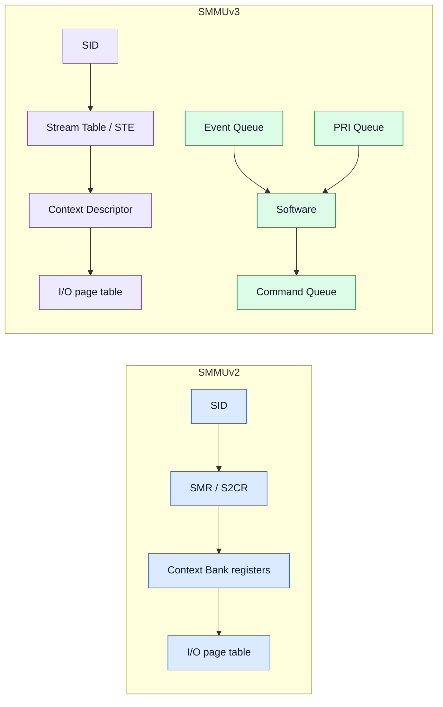

SMMUv2는 `SMR/S2CR -> Context Bank`의 register-centric model입니다. SMMUv3는 Stream Table Entry와 Context Descriptor를 memory에 두고, control과 event를 queue protocol로 처리합니다.

핵심 변화는 다음과 같습니다.

- Stream mapping 확장: register entry 수가 아니라 memory-resident table로 확장
- Process context 확장: SSID/PASID별 Context Descriptor
- Queue protocol: Command Queue, Event Queue, PRI Queue
- PCIe integration: ATS, PRI, PASID/SVA
- memory ordering: descriptor visibility와 command completion이 correctness의 일부

## 4. SoC top-level과 TBU/TCU

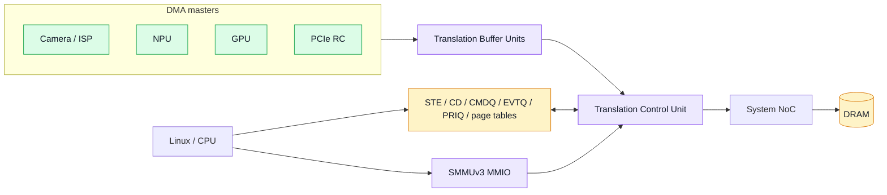

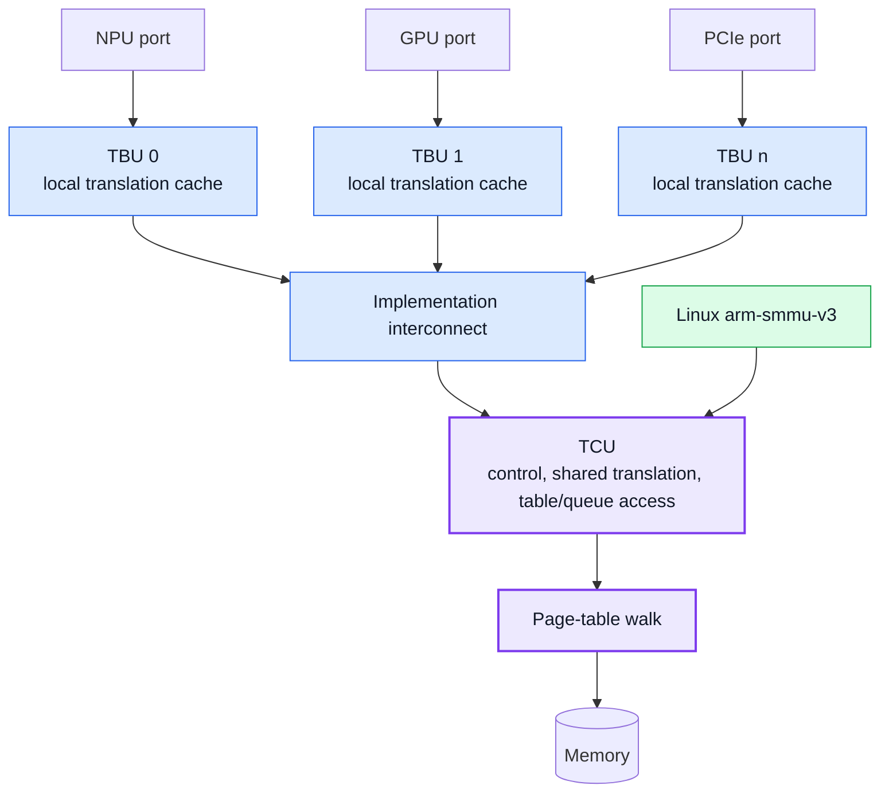

TBU/TCU는 CoreLink 구현을 이해할 때 유용한 implementation view입니다. 실제 TBU 수, cache, interconnect 구성은 제품 revision과 SoC integration에 따라 달라집니다. Software가 의존해야 하는 계약은 SMMUv3 architecture의 register, table, queue format입니다.

## 5. MMU-600, MMU-600AE, MMU-700

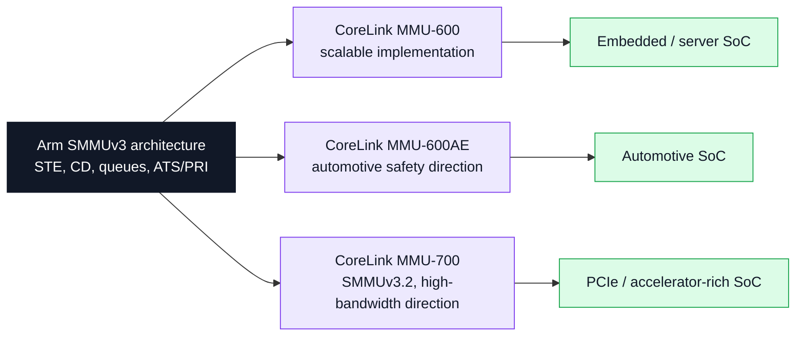

| 제품 | 공개 포지셔닝 | 학습 포인트 |
|---|---|---|
| MMU-600 | 많은 translation context로 확장 가능한 SMMUv3 계열 구현 | STE/CD/queue 기본 model, scalable TBU/TCU integration |
| MMU-600AE | MMU-600 software compatibility와 automotive safety 방향 | generic SMMUv3 fault와 safety mechanism을 구분 |
| MMU-700 | SMMUv3.2, Secure World virtualization, I/O QoS, PCIe Gen5급 대역폭 방향 | optional feature는 IDR/TRM/integration으로 확인 |

제품명만으로 ATS, PRI, stall, range invalidation, granule, coherency를 가정하지 않습니다. Driver는 IDR와 firmware/requester capability의 교집합을 사용합니다.

## 6. Control plane

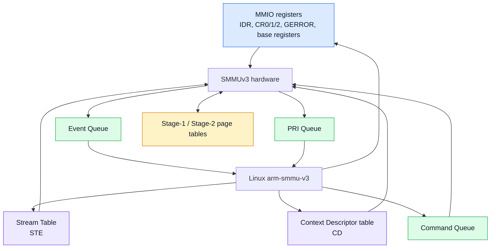

### MMIO에 남는 것

- identification/capability: `IDR0-IDR5`, `IIDR`, `AIDR`
- enable/memory attribute: `CR0`, `CR0ACK`, `CR1`, `CR2`
- global error/interrupt: `GERROR`, `IRQ_CTRL`
- memory structure base: `STRTAB_BASE`, `CMDQ_BASE`, `EVTQ_BASE`, `PRIQ_BASE`

### Memory-resident structure

- Stream Table와 STE
- Context Descriptor table와 CD
- CMDQ/EVTQ/PRIQ entry
- Stage-1/Stage-2 I/O page table

## 7. Capability discovery

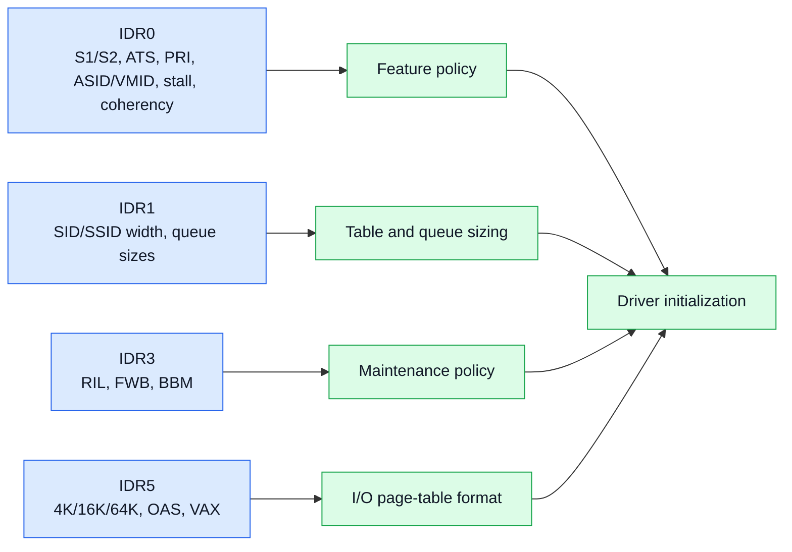

| Register | 대표 field | 결정 사항 |
|---|---|---|
| `IDR0` | `S1P`, `S2P`, `ATS`, `PRI`, `ASID16`, `VMID16`, `ST_LVL`, `STALL_MODEL`, `COHACC` | stage, ATS/PRI, stall, table/coherency |
| `IDR1` | `SIDSIZE`, `SSIDSIZE`, `CMDQS`, `EVTQS`, `PRIQS` | table/queue sizing |
| `IDR3` | `RIL`, `FWB`, `BBM` | range invalidation과 descriptor maintenance policy |
| `IDR5` | `GRAN4K/16K/64K`, `OAS`, `VAX` | page-table format과 address range |

```c
static int discover_features(struct smmu *smmu)
{
    u32 idr0 = readl(smmu->base + ARM_SMMU_IDR0);
    u32 idr1 = readl(smmu->base + ARM_SMMU_IDR1);
    u32 idr3 = readl(smmu->base + ARM_SMMU_IDR3);
    u32 idr5 = readl(smmu->base + ARM_SMMU_IDR5);

    smmu->s1 = idr0 & IDR0_S1P;
    smmu->s2 = idr0 & IDR0_S2P;
    smmu->ats = idr0 & IDR0_ATS;
    smmu->pri = idr0 & IDR0_PRI;
    smmu->sid_bits = FIELD_GET(IDR1_SIDSIZE, idr1);
    smmu->ssid_bits = FIELD_GET(IDR1_SSIDSIZE, idr1);
    smmu->range_inv = idr3 & IDR3_RIL;
    smmu->pgsize_bitmap = decode_granules(idr5);

    return validate_required_features(smmu);
}
```

## 8. 초기화와 enable sequence

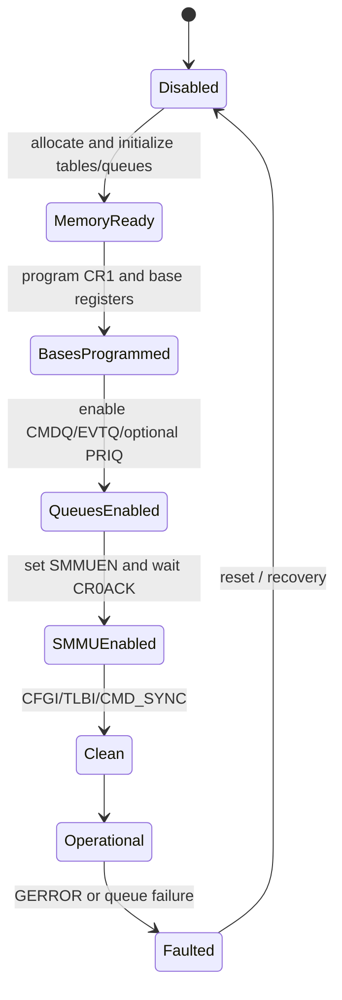

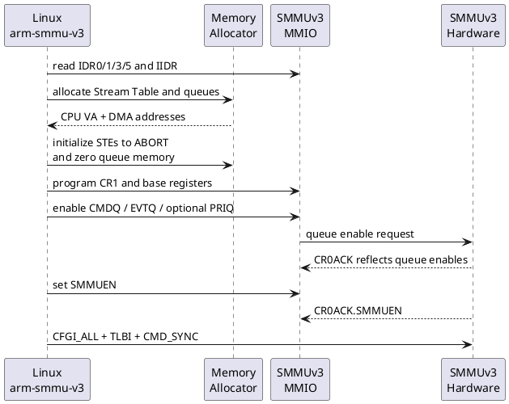

```c
allocate_stream_table(&smmu->strtab);
allocate_queue(&smmu->cmdq, cmdq_entries);
allocate_queue(&smmu->evtq, evtq_entries);

initialize_all_stes_to_abort(&smmu->strtab);
memset(smmu->cmdq.base, 0, smmu->cmdq.bytes);
memset(smmu->evtq.base, 0, smmu->evtq.bytes);

dma_wmb();
writeq(smmu->strtab.dma, STRTAB_BASE);
writeq(smmu->cmdq.dma, CMDQ_BASE);
writeq(smmu->evtq.dma, EVTQ_BASE);

writel(CR0_CMDQEN | CR0_EVTQEN, CR0);
wait_until_cr0ack_matches();
writel(CR0_CMDQEN | CR0_EVTQEN | CR0_SMMUEN, CR0);
wait_until_cr0ack_matches();
```

Fail-safe 원칙은 모든 STE를 ABORT 상태로 시작하는 것입니다. Base register와 CR1 memory attribute를 설정하고 queue enable을 acknowledgement한 뒤 `SMMUEN`을 활성화합니다.

## 9. Stream Table: linear와 2-level

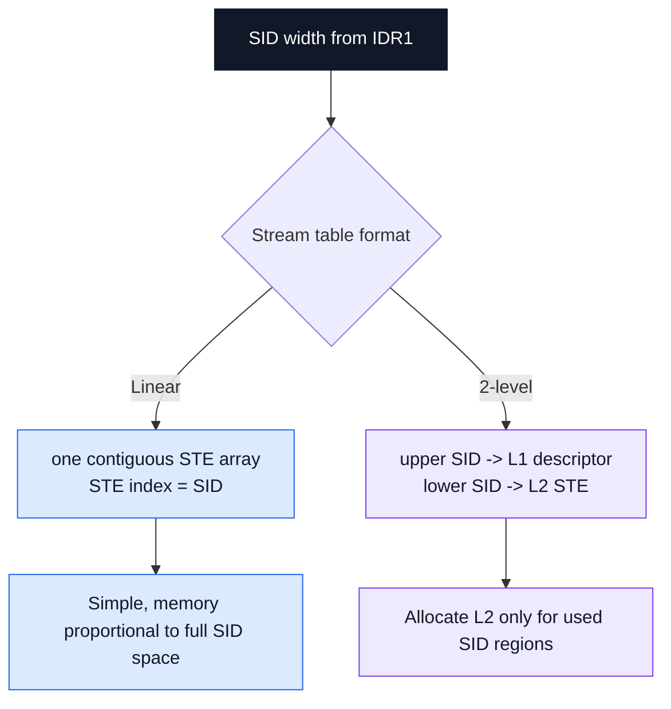

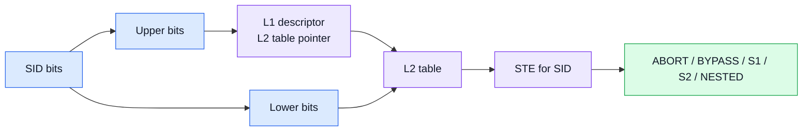

`SIDSIZE=16`, STE=64byte인 linear table은 `65,536 x 64B = 4MiB`입니다. split=8인 2-level table에서 L2 하나는 256 SID, 즉 16KiB를 cover합니다. 실제 SID가 `0x2000-0x20ff`만 사용된다면 L2 table 하나만 필요합니다.

## 10. Stream Table Entry

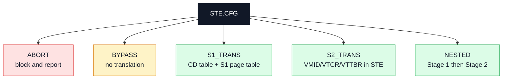

- `ABORT`: transaction 차단과 event 보고
- `BYPASS`: translation 없이 전달
- `S1_TRANS`: CD table과 Stage-1 page table 사용
- `S2_TRANS`: STE 안의 Stage-2 context 사용
- `NESTED`: Stage 1 후 Stage 2

## 11. Stage 1, Stage 2와 Context Descriptor

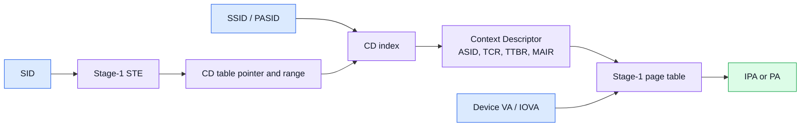

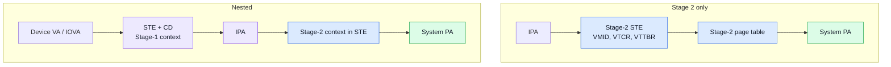

Stage-1 STE는 CD table pointer를 제공하며 CD가 ASID/TCR/TTBR/MAIR를 가집니다. Stage-2의 VMID/VTCR/VTTBR에 해당하는 context는 주로 STE에 있습니다.

## 12. SID, SSID, ASID, VMID

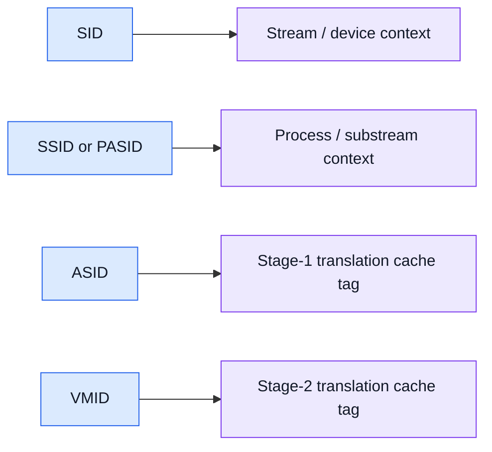

- SID: device 또는 DMA stream을 식별하고 STE 선택
- SSID/PASID: SID 내부 process/substream을 식별하고 CD 선택
- ASID: Stage-1 translation cache tag
- VMID: Stage-2 translation cache tag

## 13. STE safe update

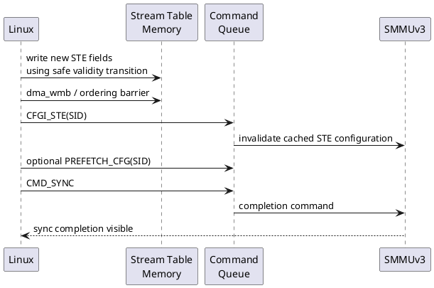

```c
static void install_stage1_ste(u32 sid, dma_addr_t cdtab)
{
    struct ste new_ste = { 0 };

    new_ste.cfg = STE_CFG_S1_TRANS;
    new_ste.s1_context_ptr = cdtab;
    new_ste.s1_cdmax = CD_TABLE_LOG2_ENTRIES;
    new_ste.s1_cacheability = STE_CACHE_WB;
    new_ste.valid = true;

    write_ste_with_safe_transition(sid, &new_ste);
    dma_wmb();

    cmdq_issue_cfgi_ste(sid);
    cmdq_issue_sync();
    cmdq_wait_sync();
}
```

Descriptor memory write만으로 끝나지 않습니다. SMMU가 이전 STE/CD를 cache할 수 있으므로 barrier 후 `CFGI_STE` 또는 `CFGI_CD`를 보내고 `CMD_SYNC` completion을 기다립니다.

## 14. Translation transaction

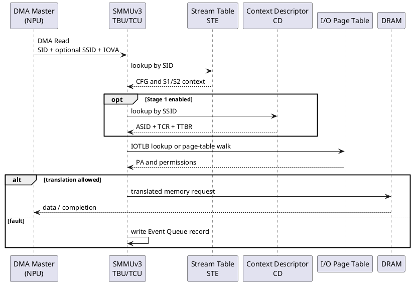

Fast path에서는 cached STE/CD와 IOTLB hit로 memory lookup이 줄어듭니다. Fault path에서는 Event Queue record에 SID/SSID/IOVA와 syndrome이 기록됩니다.

## 15. SVA, ATS, PRI

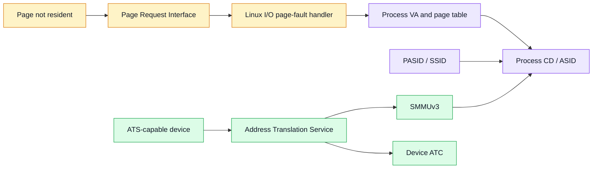

- SVA: CPU와 device가 process VA를 공유
- ATS: device가 SMMU translation service를 요청
- ATC: device-side translation cache
- PRI: page가 준비되지 않았을 때 Page Request 전송
- IOPF: Linux가 device page fault를 처리

## 16. PTE update와 ATC invalidation

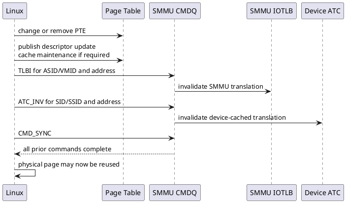

```c
unmap_iova_from_page_table(domain, iova, size);
publish_page_table_update();

cmdq_issue_tlbi(domain->asid_or_vmid, iova, size);

if (master_uses_ats(master))
    cmdq_issue_atc_inv(master->sid, pasid, iova, size);

cmdq_issue_sync();
cmdq_wait_sync();

/* Only now may the physical pages be freed or reused. */
free_backing_pages(pages);
```

PTE 제거 후에는 SMMU IOTLB와 ATS device의 ATC 모두 stale할 수 있습니다. `TLBI -> ATC_INV -> CMD_SYNC` completion 뒤에 physical page를 재사용합니다. DMA engine completion/fence는 그보다 먼저 보장되어야 합니다.

## 17. Command/Event/PRI Queue

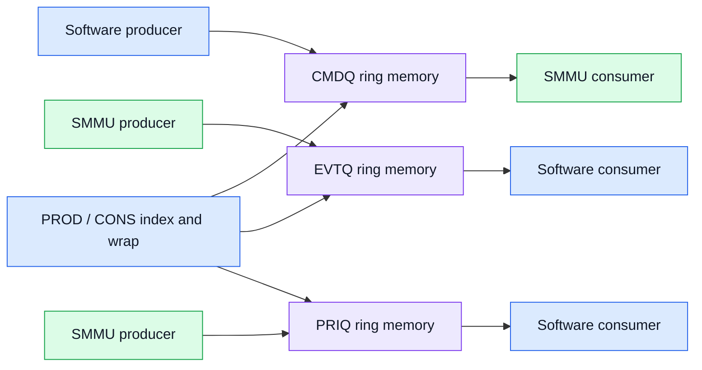

CMDQ는 software producer / SMMU consumer이고, EVTQ와 PRIQ는 SMMU producer / software consumer입니다. Entry write와 producer index publish 사이에 ordering이 필요하며, wrap, overflow, queue full을 처리해야 합니다.

대표 CMDQ operation:

| 명령 | 역할 |
|---|---|
| `CFGI_STE`, `CFGI_CD`, `CFGI_ALL` | cached configuration invalidate |
| `TLBI_*` | S1/S2/nested translation invalidate |
| `ATC_INV` | device ATC invalidate |
| `RESUME` | stalled transaction retry/abort |
| `PRI_RESP` | PCIe PRI response |
| `CMD_SYNC` | 앞선 command의 architected completion |

## 18. Event Queue, PRI Queue, GERROR

```mermaid
flowchart TB
  ERR[SMMUv3 reports a problem] --> KIND{Where is it reported?}
  KIND --> EVTQ[Event Queue]
  KIND --> PRIQ[PRI Queue]
  KIND --> GERR[GERROR]
  EVTQ --> DATA["Stream translation/config/access fault\nSID, SSID, IOVA, syndrome"]
  PRIQ --> PAGE["PCIe Page Request\nPASID, address, access type"]
  GERR --> CTRL["CMDQ/queue access/MSI/internal control-plane error"]
  classDef root fill:#111827,stroke:#111827,color:#ffffff;
  classDef evt fill:#dbeafe,stroke:#2563eb,color:#111827;
  classDef pri fill:#dcfce7,stroke:#16a34a,color:#111827;
  classDef ger fill:#fee2e2,stroke:#dc2626,color:#111827;
  class ERR root; class EVTQ,DATA evt; class PRIQ,PAGE pri; class GERR,CTRL ger;
```

- Event Queue: stream translation/config/access fault
- PRI Queue: PCIe Page Request
- GERROR: command/queue access/MSI/internal control-plane error

## 19. Stall model과 Resume

```plantuml
@startuml
skinparam backgroundColor white
participant "DMA Master" as DEV
participant SMMUv3 as SMMU
participant "Event Queue" as EVTQ
participant "Linux I/O PF\nHandler" as PF
DEV -> SMMU: access unmapped IOVA
SMMU -> SMMU: stall transaction\nallocate stall tag
SMMU -> EVTQ: event with SID/SSID/IOVA/STAG
EVTQ -> PF: interrupt and dequeue event
PF -> PF: resolve mapping or decide abort
alt mapping resolved
  PF -> SMMU: CMD_RESUME(RETRY, SID, STAG)
  SMMU --> DEV: retry and complete transaction
else cannot resolve
  PF -> SMMU: CMD_RESUME(ABORT, SID, STAG)
  SMMU --> DEV: terminate request
end
@enduml
```

Stall event에는 transaction을 식별하는 tag가 포함됩니다. Mapping을 해결하면 `CMD_RESUME(RETRY)`, 해결 불가하면 abort/terminate합니다.

## 20. PCIe PRI flow

```plantuml
@startuml
skinparam backgroundColor white
participant "PCIe Device\nATS/PRI" as DEV
participant SMMUv3 as SMMU
participant "PRI Queue" as PRIQ
participant "Linux I/O PF\nHandler" as PF
DEV -> SMMU: PCIe Page Request\nPASID + address + access type
SMMU -> PRIQ: enqueue PRI request record
PRIQ -> PF: interrupt and dequeue
PF -> PF: fault in page / update mappings
alt success
  PF -> SMMU: CMD_PRI_RESP(SUCCESS)
  SMMU --> DEV: Page Request Group response
  DEV -> DEV: retry translation or DMA
else failure
  PF -> SMMU: CMD_PRI_RESP(FAIL or DENY)
  SMMU --> DEV: failure response
end
@enduml
```

`CMD_RESUME`은 SMMU stall protocol이고 `CMD_PRI_RESP`는 PCIe Page Request Group response입니다. 이름이 비슷해도 서로 다른 protocol입니다.

## 21. Linux arm-smmu-v3 object mapping

```mermaid
flowchart LR
  CORE[Linux IOMMU core] --> DEV[arm_smmu_device\nIDR, MMIO, queues, stream table]
  CORE --> DOM[arm_smmu_domain\niommu_domain, stage, io-pgtable]
  CORE --> MASTER[arm_smmu_master\nSID/SSID, ATS/PRI/SVA]
  DEV --> HW[SMMUv3 hardware]
  DOM --> PGT[I/O page tables]
  MASTER --> STE[STE / CD selection]
  STE --> HW
  PGT --> HW
  classDef core fill:#dbeafe,stroke:#2563eb,color:#111827;
  classDef obj fill:#ede9fe,stroke:#7c3aed,color:#111827;
  classDef hw fill:#dcfce7,stroke:#16a34a,color:#111827;
  class CORE core; class DEV,DOM,MASTER,PGT,STE obj; class HW hw;
```

- `arm_smmu_device`: capability, MMIO, Stream Table, queues
- `arm_smmu_domain`: `iommu_domain`, translation stage, io-pgtable
- `arm_smmu_master`: device SID/SSID와 ATS/PRI/SVA capability

## 22. Device Tree example

```dts
smmu: iommu@2b400000 {
    compatible = "arm,smmu-v3";
    reg = <0x0 0x2b400000 0x0 0x20000>;
    #iommu-cells = <1>;
    dma-coherent;

    interrupts = <GIC_SPI 74 IRQ_TYPE_LEVEL_HIGH>,
                 <GIC_SPI 75 IRQ_TYPE_LEVEL_HIGH>,
                 <GIC_SPI 76 IRQ_TYPE_LEVEL_HIGH>;
    interrupt-names = "eventq", "priq", "gerror";
};

npu@12340000 {
    compatible = "vendor,npu";
    reg = <0x0 0x12340000 0x0 0x10000>;
    iommus = <&smmu 0x20>;
};
```

위 코드는 개념 예제입니다. 실제 interrupt 수/이름, register range, coherency는 적용 binding과 SoC integration manual을 확인합니다.

## 23. NPU DMA end-to-end

```mermaid
flowchart LR
  USER[Camera/NPU application] --> DMABUF[DMA-BUF]
  DMABUF --> CAM[Camera / ISP attachment]
  DMABUF --> NPU[NPU attachment]
  CAM --> CAMIOVA[Camera IOVA and SID]
  NPU --> NPUIOVA[NPU IOVA and SID]
  CAMIOVA --> SMMU[SMMUv3]
  NPUIOVA --> SMMU
  SMMU --> PAGES[Shared physical pages]
  PAGES --> DRAM[(DRAM)]
  classDef app fill:#dbeafe,stroke:#2563eb,color:#111827;
  classDef buf fill:#fef3c7,stroke:#d97706,color:#111827;
  classDef dev fill:#dcfce7,stroke:#16a34a,color:#111827;
  classDef smmu fill:#ede9fe,stroke:#7c3aed,color:#111827;
  class USER app; class DMABUF,PAGES,DRAM buf; class CAM,NPU,CAMIOVA,NPUIOVA dev; class SMMU smmu;
```

```plantuml
@startuml
skinparam backgroundColor white
participant "NPU Driver" as DRV
participant "DMA-IOMMU" as DMA
participant "arm-smmu-v3" as ASV3
participant "STE/CD +\nI/O Page Tables" as TABLES
participant "SMMUv3 HW" as HW
participant NPU
DRV -> DMA: dma_map_sg(input buffer)
DMA -> ASV3: map IOVA to physical pages
ASV3 -> TABLES: update I/O page tables
ASV3 -> HW: TLBI / CMD_SYNC as required
DMA --> DRV: NPU IOVA
DRV -> NPU: program input address and start
NPU -> HW: DMA Read\nSID + IOVA
HW -> TABLES: STE/CD/page-table lookup
TABLES --> HW: translated PA
HW --> NPU: translated memory data
NPU --> DRV: completion interrupt
DRV -> DMA: dma_unmap_sg after completion
DMA -> ASV3: remove mapping and synchronize invalidation
@enduml
```

NPU register에는 CPU physical address를 직접 쓰지 않고 DMA API가 반환한 `dma_addr_t`, 즉 IOVA를 programming합니다. DMA-BUF 하나도 Camera와 NPU attachment별로 다른 IOVA를 가질 수 있습니다.

## 24. Fault debugging과 performance

```mermaid
flowchart TB
  START[Fault or latency regression] --> A{Fault?}
  A -->|Yes| WHO[SID/SSID -> device/process]
  WHO --> WHERE[IOVA + access type]
  WHERE --> WHY[translation / permission / config / queue]
  WHY --> LIFE[mapping lifetime + CFGI/TLBI/ATC/SYNC order]
  A -->|No| PERF[Measure map/unmap, CMDQ, CMD_SYNC, IOTLB miss, page walk]
  PERF --> OPT[Persistent mapping, larger pages, batching, locality]
  classDef start fill:#111827,stroke:#111827,color:#ffffff;
  classDef fault fill:#fee2e2,stroke:#dc2626,color:#111827;
  classDef perf fill:#dcfce7,stroke:#16a34a,color:#111827;
  class START start; class WHO,WHERE,WHY,LIFE fault; class PERF,OPT perf;
```

```bash
dmesg | grep -Ei "smmu|iommu|translation fault|event"
find /sys/kernel/iommu_groups -maxdepth 2 -type l
cat /sys/kernel/debug/dma_buf/bufinfo

# When dynamic debug and tracepoints are available:
echo 'file drivers/iommu/arm/arm-smmu-v3/* +p' \
    > /sys/kernel/debug/dynamic_debug/control
trace-cmd record -e iommu -e dma_fence -e dma_buf ./workload
trace-cmd report
```

Fault 분석 순서:

1. EVTQ인지 GERROR인지 구분
2. SID/SSID로 device/process 식별
3. IOVA와 read/write/execute type 확인
4. translation, permission, configuration, queue fault 분류
5. mapping lifetime과 CFGI/TLBI/ATC_INV/CMD_SYNC ordering 확인

Performance 측정 항목:

- map/unmap 빈도와 CMD_SYNC latency
- IOTLB miss와 page-table walk traffic
- page size와 physical fragmentation
- ATS hit와 ATC invalidation cost
- TBU/TCU/NoC bandwidth와 memory locality

## 25. Source Reading Map

```mermaid
flowchart TB
  H["arm-smmu-v3.h\nIDR, register, STE/CD, CMDQ/EVTQ/PRIQ format"] --> C["arm-smmu-v3.c\nprobe, reset, stream table, attach, command, event"]
  C --> IOMMU[drivers/iommu/iommu.c]
  C --> DMA[drivers/iommu/dma-iommu.c]
  C --> PGT[drivers/iommu/io-pgtable-arm.c]
  C --> DT[arm,smmu-v3.yaml / ACPI IORT]
  classDef h fill:#ede9fe,stroke:#7c3aed,color:#111827;
  classDef c fill:#dbeafe,stroke:#2563eb,color:#111827;
  classDef other fill:#dcfce7,stroke:#16a34a,color:#111827;
  class H h; class C c; class IOMMU,DMA,PGT,DT other;
```

## 26. 퀴즈

1. SMMUv2 Context Bank와 SMMUv3 Context Descriptor의 공통점과 차이는?
2. 2-level Stream Table이 linear보다 memory를 절약하는 이유는?
3. `S1_TRANS`와 `S2_TRANS`의 translation context 저장 위치 차이는?
4. SID와 SSID/PASID의 역할 차이는?
5. STE write 직후 DMA를 시작하면 안 되는 이유와 필요한 command는?
6. ATS device에서 `TLBI -> ATC_INV -> CMD_SYNC` 순서가 필요한 이유는?
7. Event Queue와 GERROR를 구분하는 기준은?
8. `CMD_RESUME`과 `CMD_PRI_RESP`의 protocol 차이는?
9. MMU-700이 모든 optional SMMUv3.2 feature를 자동 보장하지 않는 이유는?
10. NPU buffer unmap 후 page 재사용 전에 어떤 completion을 확인해야 하는가?

## 27. 정답과 해설

1. 둘 다 Stage-1 context를 정의한다. Context Bank는 고정 MMIO bank이고 CD는 memory-resident entry로 SSID별 확장이 가능하다.
2. 실제 사용하는 upper-SID group의 L2 table만 할당하기 때문이다.
3. S1은 STE가 CD table을 가리키고 CD가 ASID/TCR/TTBR를 가진다. S2 context는 주로 STE에 있다.
4. SID는 stream/STE를, SSID/PASID는 process/substream/CD를 선택한다.
5. CPU write visibility와 cached STE 문제가 있으므로 barrier, `CFGI_STE`, `CMD_SYNC`가 필요하다.
6. SMMU IOTLB와 device ATC 모두 stale할 수 있기 때문이다.
7. EVTQ는 stream data-path fault, GERROR는 queue/command/MSI/internal control-plane error다.
8. RESUME은 SMMU stalled transaction, PRI_RESP는 PCIe Page Request response다.
9. Architecture optional feature와 requester/SoC/firmware capability가 다르므로 IDR와 integration을 확인해야 한다.
10. DMA completion/fence 뒤 TLBI와 필요 시 ATC invalidation을 포함한 `CMD_SYNC` completion이다.

## 28. 5분 복습 카드

| 용어 | 한 줄 정의 |
|---|---|
| Stream Table | SID를 STE에 연결하는 memory-resident table |
| STE | stream의 ABORT/BYPASS/S1/S2/NESTED policy |
| SSID/PASID | stream 내부 process/substream identifier |
| CD | ASID/TCR/TTBR/MAIR를 가진 Stage-1 context |
| CMDQ | software가 SMMU에 command를 전달하는 queue |
| EVTQ | translation/config/access fault event queue |
| PRIQ | PCIe page request queue |
| ATS/ATC | device translation service / device cache |
| CFGI | cached STE/CD configuration invalidate |
| CMD_SYNC | 앞선 command completion point |

## 29. 실습 과제

1. `SIDSIZE=16`, STE=64B에서 linear table과 split=8 L2 table memory를 계산한다.
2. `update PTE, publish, TLBI, ATC_INV, CMD_SYNC, free page`를 올바르게 배열한다.
3. EVTQ translation fault와 GERROR CMDQ error의 첫 확인 지점을 작성한다.
4. Linux source에서 `ARM_SMMU_IDR0`, STE CFG field, `arm_smmu_cmdq_ent`, EVTQ/PRIQ 구조를 찾는다.
5. NPU `dma_map_sg()`부터 hardware DMA와 `dma_unmap_sg()`까지 sequence를 그린다.

## 30. 핵심 요약

```text
SID -> Stream Table -> STE
                      |- ABORT / BYPASS
                      |- Stage 1 -> SSID -> CD -> S1 page table
                      |- Stage 2 -> Stage-2 context in STE -> S2 page table
                      `- Nested -> Stage 1 then Stage 2

Table update -> CFGI / TLBI / ATC_INV -> CMD_SYNC
Hardware report -> EVTQ / PRIQ / GERROR
```

다음 7강에서는 Linux `arm-smmu` 및 `arm-smmu-v3` driver의 probe, domain attach, map/unmap, CMDQ issue와 event handler 함수 흐름을 분석합니다.

## 31. 참고 자료

1. Arm, *Arm System Memory Management Unit Architecture Specification*, SMMUv3, IHI 0070.  
   <https://developer.arm.com/documentation/ihi0070/latest/>
2. Arm, *CoreLink MMU-600 Technical Reference Manual*, document 100310.  
   <https://developer.arm.com/documentation/100310/latest/>
3. Arm, *CoreLink MMU-700 Technical Reference Manual*, document 101542.  
   <https://developer.arm.com/documentation/101542/latest/>
4. Arm MMU family overview.  
   <https://www.arm.com/products/silicon-ip-system/system-controllers/mmu>
5. Linux mainline, `drivers/iommu/arm/arm-smmu-v3/arm-smmu-v3.h`.
6. Linux mainline, `drivers/iommu/arm/arm-smmu-v3/arm-smmu-v3.c`.
7. Linux mainline, `Documentation/devicetree/bindings/iommu/arm,smmu-v3.yaml`.
