# 7강. ARM SMMU Linux Device Driver

> 이 문서는 Linux mainline commit `58717b2a1365d06c8c64b72aa948541b53fe31eb`을 기준으로 작성했습니다. IOMMU API는 커널 버전에 따라 함수명과 callback signature가 바뀔 수 있습니다. 특히 최신 mainline의 `attach_dev(domain, dev, old_domain)`, `domain_alloc_paging_flags`, SMMUv3 attach/invalidation 구조를 과거 LTS kernel에 그대로 적용하지 말고 해당 tree의 소스를 먼저 확인해야 합니다.
>
> 아키텍처와 정적 관계는 Mermaid, 시간 순서가 중요한 호출·동작은 PlantUML sequence diagram으로 표현합니다. PlantUML label의 줄바꿈은 실제 개행 대신 `\n`을 사용합니다. PDF 슬라이드의 코드는 monospace 이미지로 렌더링하여 첫 줄과 중첩 indentation을 보존합니다.

## 1. 학습 목표

1. Linux IOMMU core와 ARM SMMU driver의 경계를 설명한다.
2. `arm-smmu`와 `arm-smmu-v3`의 probe 및 object model을 비교한다.
3. DT/ACPI에서 얻은 Stream ID가 `iommu_fwspec`과 per-master state로 변환되는 과정을 추적한다.
4. domain allocation/finalization/attach/map/unmap/IOTLB 흐름을 source level로 따라간다.
5. SMMUv2의 SMR/S2CR/Context Bank와 SMMUv3의 STE/CD/CMDQ를 driver callback에 연결한다.
6. context fault, EVTQ, PRIQ/IOPF, page response를 구분한다.
7. ATS/PASID/SVA, Runtime PM, implementation errata가 generic path에 추가하는 제약을 이해한다.
8. NPU DMA fault를 SID, IOVA, mapping lifetime, invalidation 관점에서 디버깅한다.

## 2. 전체 과정에서 7강의 위치

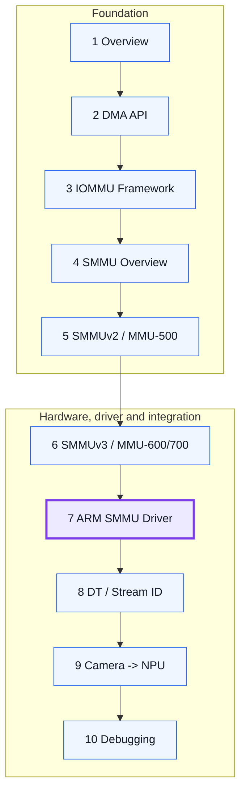

6강에서 SMMUv3 hardware structure를 학습했습니다. 7강에서는 Linux가 그 구조를 어떻게 생성하고 갱신하며, device driver의 DMA API 호출과 어떻게 연결하는지 살펴봅니다.

## 3. 이번 강의의 핵심 mental model

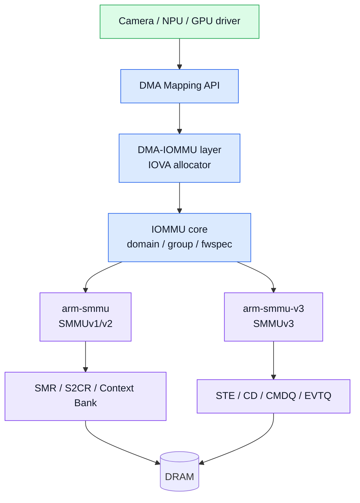

일반 NPU/Camera driver는 `arm-smmu-v3`를 직접 호출하지 않습니다. 일반 DMA path에서는 다음과 같이 역할이 분리됩니다.

- client driver: DMA buffer와 device programming
- DMA API / DMA-IOMMU: DMA address와 IOVA allocation
- IOMMU core: group/domain/device lifetime과 공통 callback
- ARM SMMU driver: hardware-specific attach, descriptor programming, invalidation, fault
- io-pgtable: ARM LPAE descriptor format과 page-table manipulation

## 4. Source tree 지도

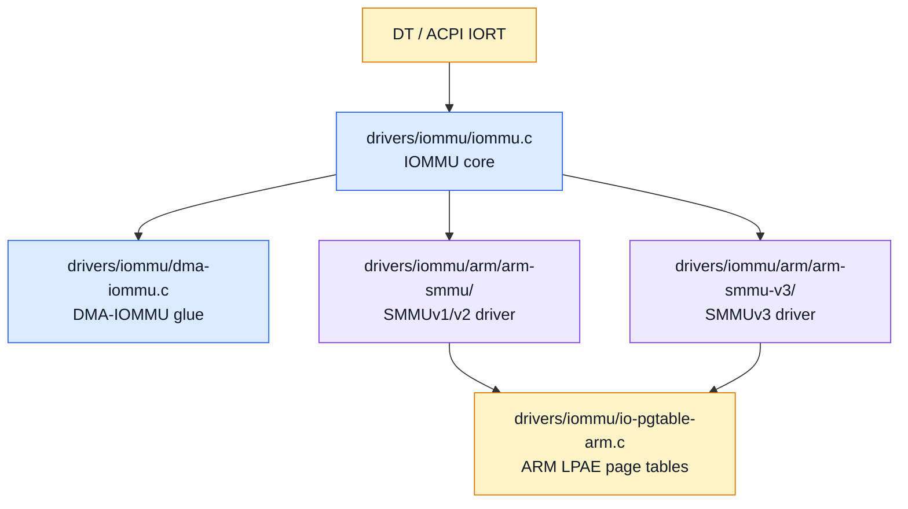

| 경로 | 읽을 내용 |
|---|---|
| `drivers/iommu/iommu.c` | device probe, group, default domain, attach orchestration |
| `drivers/iommu/dma-iommu.c` | IOVA allocator와 DMA API 연결 |
| `drivers/iommu/arm/arm-smmu/` | SMMUv1/v2, MMU-500, Context Bank path |
| `drivers/iommu/arm/arm-smmu-v3/` | SMMUv3, STE/CD, queue, ATS/PRI/SVA path |
| `drivers/iommu/io-pgtable-arm.c` | ARM_64_LPAE_S1/S2 descriptor 생성과 page-table walk format |
| `include/linux/iommu.h` | `iommu_ops`, `iommu_domain_ops`, domain type, fault API |

## 5. 두 ARM SMMU driver의 programming model

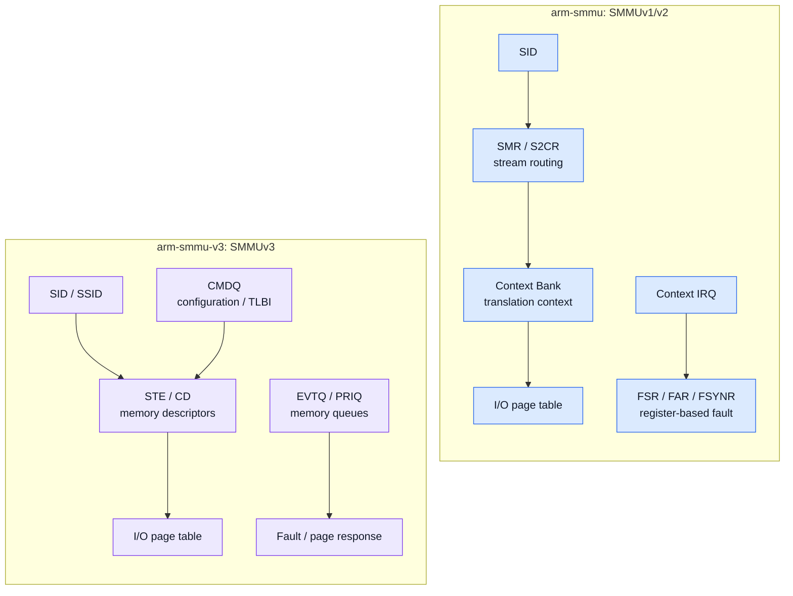

| 항목 | `arm-smmu` | `arm-smmu-v3` |
|---|---|---|
| 대상 | SMMUv1/v2, MMU-400/401/500 및 integration variants | SMMUv3, MMU-600/700 및 variants |
| stream configuration | SMR/S2CR MMIO | memory-resident Stream Table/STE |
| Stage-1 context | Context Bank registers | Context Descriptor table/CD |
| control maintenance | TLBI MMIO registers와 sync | CMDQ의 CFGI/TLBI/ATC_INV/CMD_SYNC |
| fault | global/context IRQ와 status register | EVTQ/PRIQ, global error, page response |
| process address space | 제한적/구현별 | SSID/PASID, SVA, IOPF path |

## 6. IOMMU core와 driver handshake

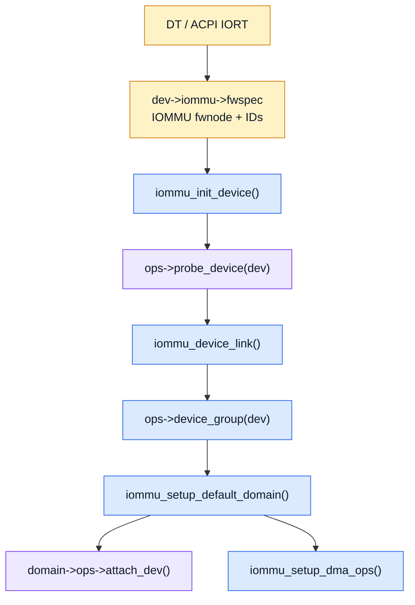

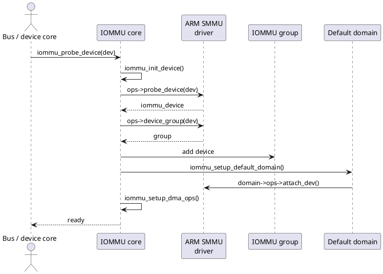

핵심 포인트:

1. firmware parser가 `iommu_fwspec`을 준비합니다.
2. IOMMU core는 `ops->probe_device()`로 vendor private state를 생성합니다.
3. `ops->device_group()`으로 isolation unit을 결정합니다.
4. default domain을 만들고 domain callback의 `attach_dev()`를 호출합니다.
5. `iommu_setup_dma_ops()` 이후 일반 DMA API가 해당 domain을 사용합니다.

## 7. `iommu_ops`: hardware driver의 contract

### 7.1 SMMUv1/v2 driver

```c
static const struct iommu_ops arm_smmu_ops = {
    .identity_domain    = &arm_smmu_identity_domain,
    .blocked_domain     = &arm_smmu_blocked_domain,
    .domain_alloc_paging = arm_smmu_domain_alloc_paging,
    .probe_device       = arm_smmu_probe_device,
    .release_device     = arm_smmu_release_device,
    .device_group       = arm_smmu_device_group,
    .of_xlate           = arm_smmu_of_xlate,
    .default_domain_ops = &(const struct iommu_domain_ops) {
        .attach_dev      = arm_smmu_attach_dev,
        .map_pages       = arm_smmu_map_pages,
        .unmap_pages     = arm_smmu_unmap_pages,
        .iotlb_sync      = arm_smmu_iotlb_sync,
        .iova_to_phys    = arm_smmu_iova_to_phys,
        .free            = arm_smmu_domain_free,
    },
};
```

### 7.2 SMMUv3 driver

```c
static const struct iommu_ops arm_smmu_ops = {
    .identity_domain     = &arm_smmu_identity_domain,
    .blocked_domain      = &arm_smmu_blocked_domain,
    .release_domain      = &arm_smmu_blocked_domain,
    .domain_alloc_sva    = arm_smmu_sva_domain_alloc,
    .domain_alloc_paging_flags = arm_smmu_domain_alloc_paging_flags,
    .probe_device        = arm_smmu_probe_device,
    .release_device      = arm_smmu_release_device,
    .page_response       = arm_smmu_page_response,
    .default_domain_ops = &(const struct iommu_domain_ops) {
        .attach_dev       = arm_smmu_attach_dev,
        .set_dev_pasid    = arm_smmu_s1_set_dev_pasid,
        .map_pages        = arm_smmu_map_pages,
        .unmap_pages      = arm_smmu_unmap_pages,
        .flush_iotlb_all  = arm_smmu_flush_iotlb_all,
        .iotlb_sync       = arm_smmu_iotlb_sync,
        .iova_to_phys     = arm_smmu_iova_to_phys,
    },
};
```

`iommu_ops`는 device-level operation이고, `default_domain_ops`는 특정 address space/domain에 대한 operation입니다. SMMUv3는 SVA, PASID, page response, hardware information, virtual IOMMU와 같은 확장이 더 많습니다.

> **버전 주의:** callback signature와 field는 kernel release에 따라 바뀝니다. 문서나 예전 blog보다 현재 target tree의 `include/linux/iommu.h`와 driver initializer를 우선합니다.

# Part A. SMMU hardware instance probe

## 8. SMMUv1/v2 platform probe

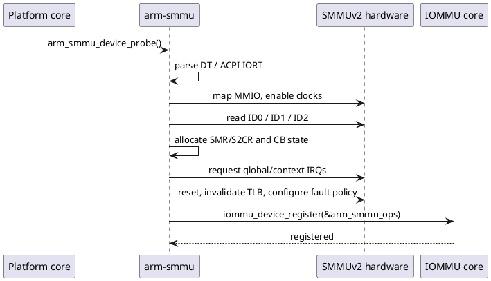

`arm_smmu_device_probe()`의 큰 단계:

1. DT/ACPI model과 interrupt layout 확인
2. MMIO resource, clock, IRQ 확보
3. `ID0/ID1/ID2`로 stage, SID width, Context Bank, granule, address size 탐색
4. SMR/S2CR software shadow와 Context Bank state 할당
5. hardware reset, fault reporting, unmatched stream policy, TLB invalidate
6. `iommu_device_register()`로 IOMMU core에 등록
7. Runtime PM 활성화

## 9. SMMUv3 platform probe

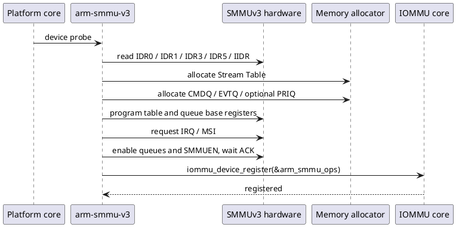

SMMUv3는 register를 읽는 것만으로 끝나지 않습니다. software가 hardware가 읽고 쓰는 memory-resident structure를 먼저 준비해야 합니다.

- Stream Table: SID -> STE
- CMDQ: CFGI/TLBI/ATC/RESUME command
- EVTQ: fault event
- PRIQ: PCIe page request
- coherent allocation과 base alignment
- CR0/CR0ACK enable handshake

## 10. Capability discovery와 product errata

SMMUv1/v2는 `ID0/ID1/ID2`에서 Stage 1/2, stream matching, Context Bank 수, address width, page granule을 구성합니다. SMMUv3는 `IDR0/IDR1/IDR3/IDR5`에서 SID/SSID width, queue size, ATS/PRI/stall, range invalidation, granule/OAS를 결정합니다.

MMU-600/MMU-700은 generic SMMUv3 contract를 따르지만, driver는 `IIDR` product/revision을 읽어 알려진 errata에 따라 feature를 끄거나 `CMDQ_FORCE_SYNC` 같은 option을 켤 수 있습니다. 제품명만 보고 optional capability를 가정하지 않습니다.

# Part B. Device discovery, SID와 object model

## 11. SMMUv1/v2 object model

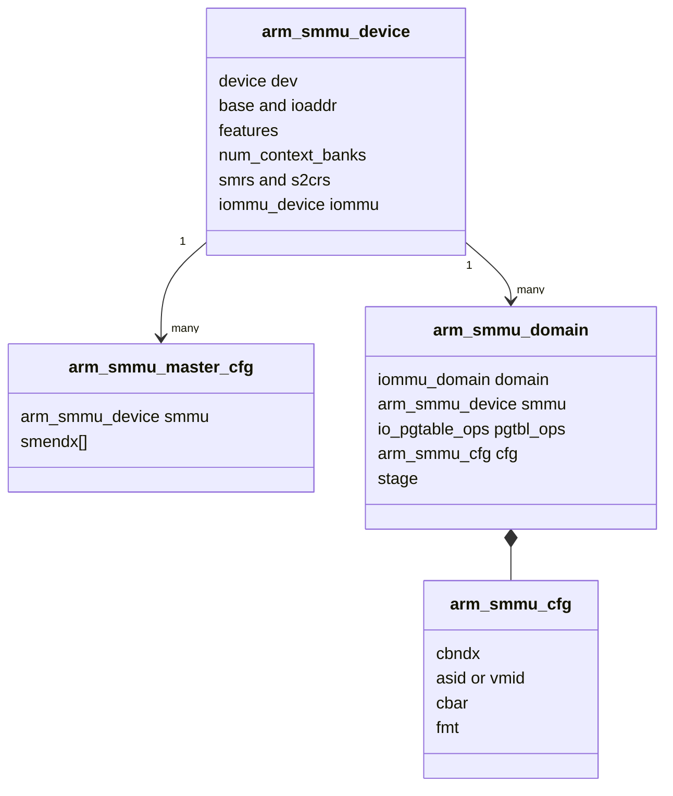

- `arm_smmu_device`: 한 SMMU hardware instance
- `arm_smmu_master_cfg`: 한 consumer device의 SID -> SME index mapping
- `arm_smmu_domain`: I/O page table과 Context Bank context
- `arm_smmu_cfg`: CB index, ASID/VMID, CBAR type, context format

## 12. SMMUv3 object model

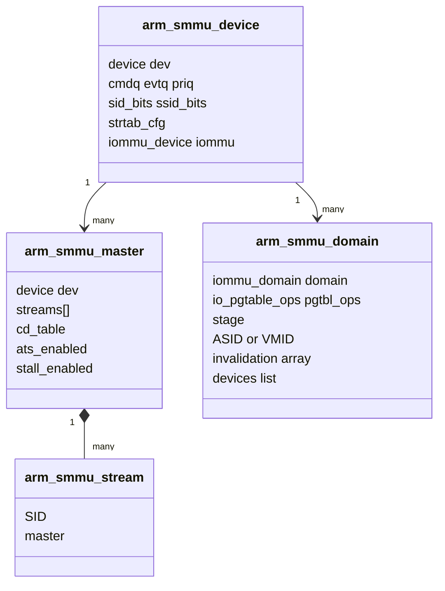

- `arm_smmu_device`: queue, Stream Table, SID/SSID capability, hardware instance
- `arm_smmu_master`: consumer device와 stream list, CD table, ATS/stall state
- `arm_smmu_stream`: SID -> master association
- `arm_smmu_domain`: page table, ASID/VMID, attached device list, invalidation targets

## 13. DT/ACPI에서 `iommu_fwspec`까지

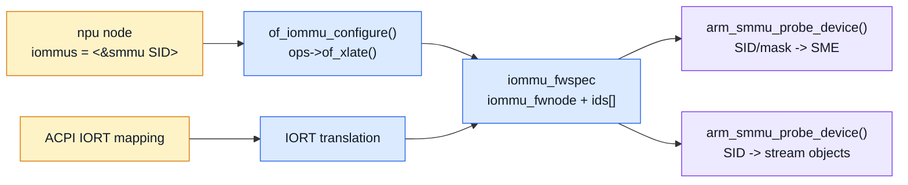

`iommu_fwspec`은 firmware description과 vendor driver 사이의 공통 hand-off입니다.

- `iommu_fwnode`: 어느 IOMMU instance인가
- `ids[]`: device가 낼 수 있는 Stream ID 또는 encoded ID/mask
- `flags`: PCI Root Complex의 ATS/write-back support 등 integration capability

## 14. SMMUv1/v2 per-device probe

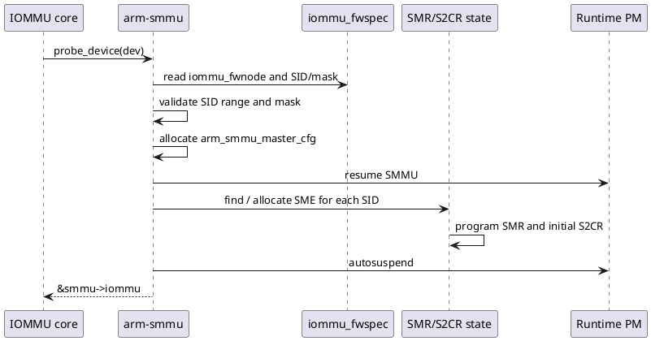

SMMUv2에서 device probe는 실제 stream mapping entry를 확보합니다. stream matching이면 겹치는 mask를 검증하고 free SMR/S2CR pair를 찾습니다. stream indexing이면 SID가 index가 됩니다. 초기 S2CR policy는 build/config에 따라 BYPASS 또는 FAULT일 수 있습니다.

## 15. SMMUv3 per-device probe

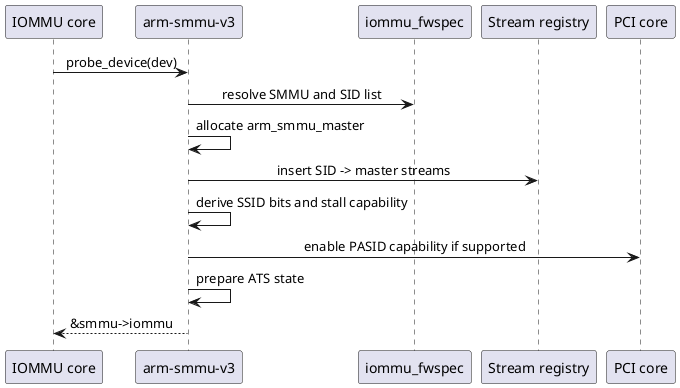

SMMUv3는 SID마다 `arm_smmu_stream`을 만들고 master에 연결합니다. 이어서 PCI capability와 firmware property를 교차 확인하여 PASID/ATS/stall 가능 여부를 결정합니다. **hardware SMMU feature만으로 ATS/SVA를 켤 수 없고 requester와 PCI hierarchy도 지원해야 합니다.**

## 16. IOMMU group과 default domain

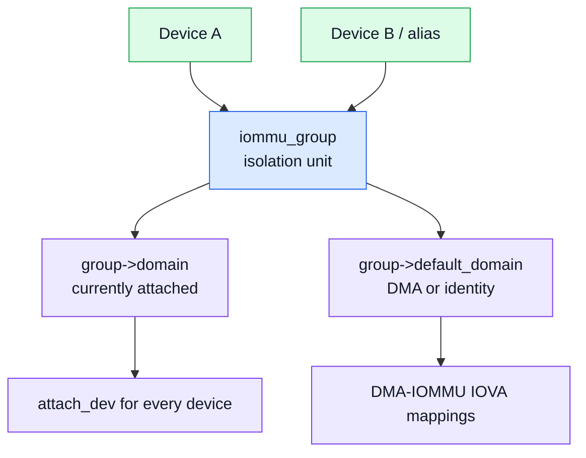

`iommu_group`은 software convenience가 아니라 hardware isolation 단위입니다. PCI alias나 shared SID 때문에 여러 device가 같은 group이 될 수 있습니다. default domain이 준비되면 group의 각 device에 driver의 `attach_dev()`가 호출되고 DMA ops가 설치됩니다.

# Part C. Domain, attach, map/unmap

## 17. Domain lifecycle

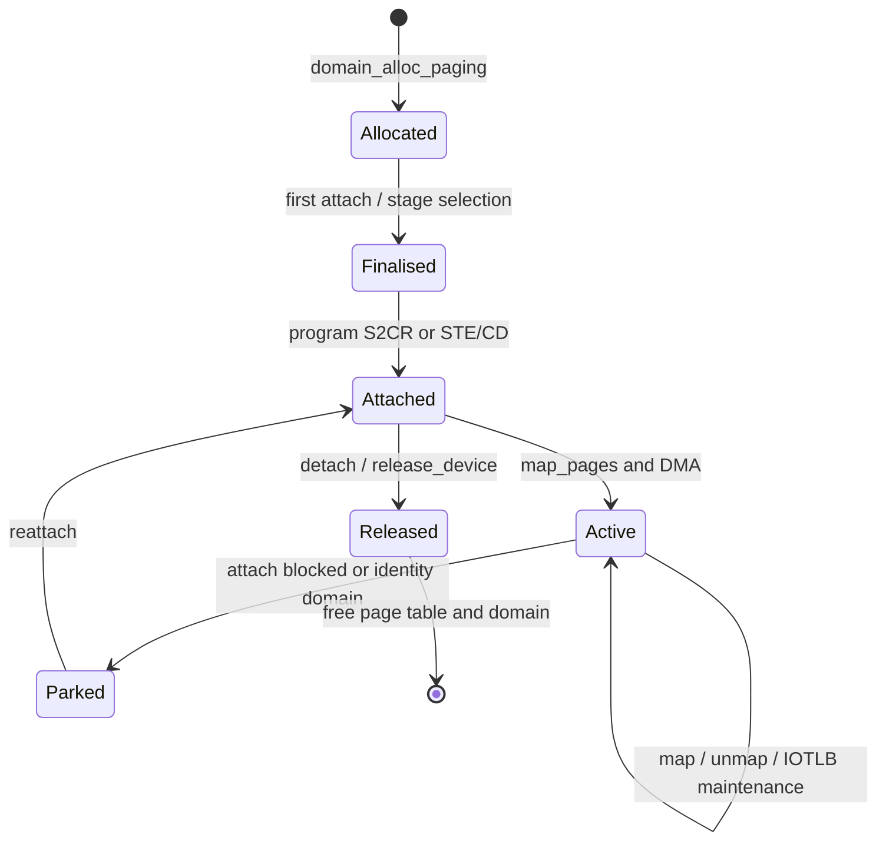

Domain allocation 시 모든 hardware state가 즉시 만들어지는 것은 아닙니다. device/SMMU capability를 알아야 stage, address width, Context Bank, ASID/VMID, page-table format을 결정할 수 있기 때문에 첫 attach에서 finalization하는 driver가 많습니다.

## 18. SMMUv1/v2 domain finalization

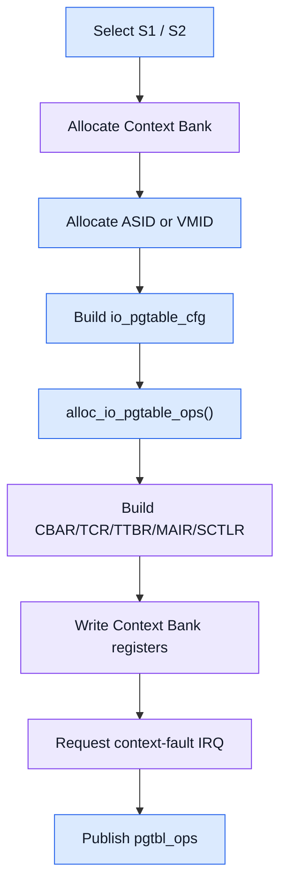

SMMUv2의 domain과 Context Bank는 강하게 결합됩니다. finalization은 다음 결과를 만듭니다.

- Context Bank index
- Stage-1 ASID 또는 Stage-2 VMID
- `ARM_64_LPAE_S1/S2` 등 io-pgtable format
- TTBR/TCR/MAIR/CBAR/SCTLR register state
- context fault IRQ
- `pgtbl_ops` publication

## 19. SMMUv3 domain finalization

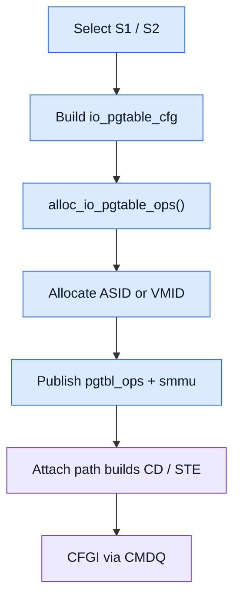

SMMUv3에서는 page-table과 ASID/VMID를 먼저 준비하고, device attach에서 CD/STE를 생성합니다. Stage 1은 CD가 TTBR/TCR/MAIR/ASID를 가지며, Stage 2는 STE에 VMID와 Stage-2 table information이 들어갑니다.

## 20. io-pgtable bridge

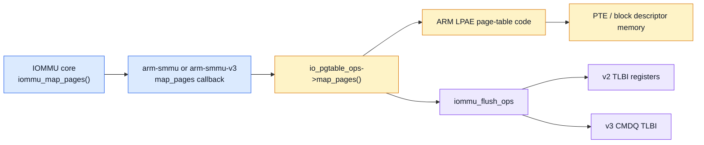

```c
static int arm_smmu_map_pages(struct iommu_domain *domain,
                              unsigned long iova,
                              phys_addr_t paddr,
                              size_t pgsize,
                              size_t pgcount,
                              int prot,
                              gfp_t gfp,
                              size_t *mapped)
{
    struct arm_smmu_domain *sdom = to_smmu_domain(domain);
    struct io_pgtable_ops *ops = sdom->pgtbl_ops;

    if (!ops)
        return -ENODEV;

    return ops->map_pages(ops, iova, paddr, pgsize,
                          pgcount, prot, gfp, mapped);
}
```

ARM SMMU driver가 모든 page-table bit를 직접 쓰는 것이 아닙니다. `io_pgtable_ops`가 descriptor format과 break-before-make, map/unmap walk를 담당하고 SMMU driver가 hardware invalidation callback을 제공합니다.

## 21. `dma_map_*()`에서 `map_pages()`까지

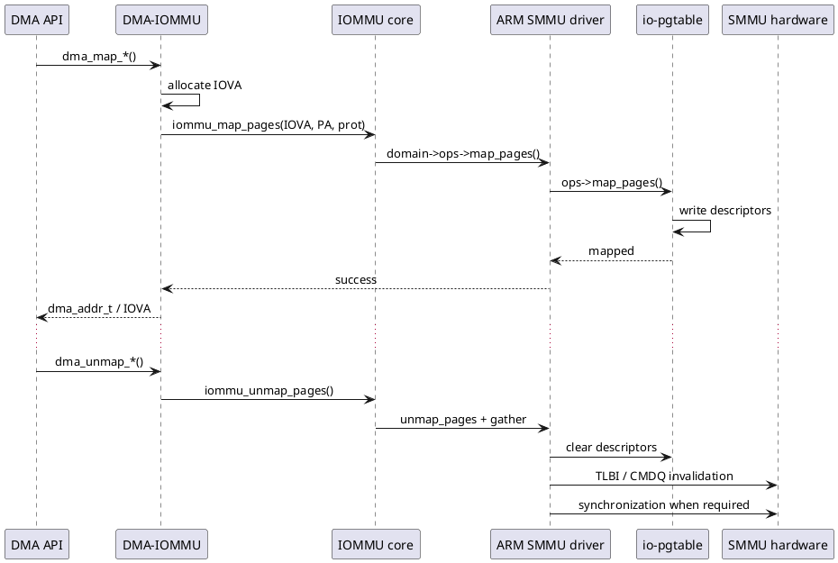

중요한 구분:

- `dma_addr_t`: client device에 전달할 DMA address, IOMMU 사용 시 보통 IOVA
- `iommu_map_pages()`: IOVA -> PA mapping 생성
- `io_pgtable_ops->map_pages()`: 실제 descriptor memory 갱신
- map 시 cache visibility와 descriptor ordering
- unmap 시 stale translation이 남지 않도록 TLBI/IOTLB sync

## 22. SMMUv1/v2 attach

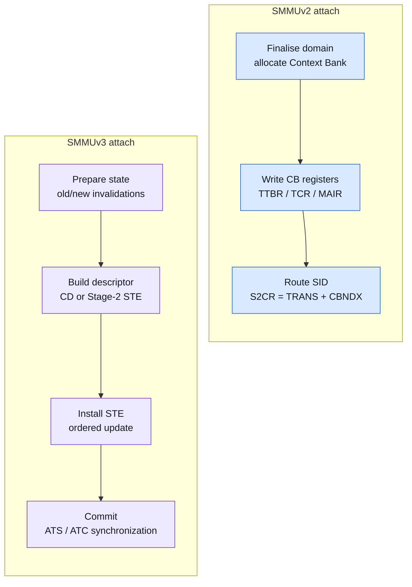

```plantuml
@startuml
skinparam backgroundColor white
skinparam sequenceMessageAlign center
participant "IOMMU core" as C
participant "arm-smmu" as D
participant "io-pgtable" as PT
participant "Context Bank" as CB
participant "SMR / S2CR" as S
C -> D: attach_dev(domain, dev, old)
D -> D: arm_smmu_init_domain_context()
D -> D: allocate CB + ASID/VMID
D -> PT: alloc_io_pgtable_ops()
D -> CB: program CBAR/TCR/TTBR/MAIR/SCTLR
D -> CB: enable context + fault IRQ
D -> S: S2CR = TRANS, CBNDX = domain CB
D --> C: attached
@enduml
```

```c
static int arm_smmu_attach_dev(struct iommu_domain *domain,
                               struct device *dev,
                               struct iommu_domain *old)
{
    struct arm_smmu_domain *sdom = to_smmu_domain(domain);
    struct arm_smmu_master_cfg *cfg = dev_iommu_priv_get(dev);
    int ret;

    ret = arm_smmu_init_domain_context(sdom, cfg->smmu, dev);
    if (ret)
        return ret;

    arm_smmu_master_install_s2crs(cfg, S2CR_TYPE_TRANS,
                                  sdom->cfg.cbndx,
                                  dev_iommu_fwspec_get(dev));
    return 0;
}
```

SMMUv2 attach의 최종 hardware action은 해당 master의 S2CR을 `TRANS`로 만들고 domain Context Bank index를 지정하는 것입니다. Identity와 blocked domain은 각각 `BYPASS`, `FAULT`를 사용합니다.

## 23. SMMUv3 attach

```plantuml
@startuml
skinparam backgroundColor white
skinparam sequenceMessageAlign center
participant "IOMMU core" as C
participant "arm-smmu-v3" as D
participant "CD table" as CD
participant "Stream Table" as ST
participant "CMDQ" as Q
participant "PCI ATC" as ATC
C -> D: attach_dev(domain, dev, old_domain)
D -> D: arm_smmu_attach_prepare()
alt Stage 1
  D -> CD: build and write Context Descriptor
  D -> ST: build CD-table STE
else Stage 2
  D -> ST: build Stage-2 STE
end
D -> Q: CFGI_STE / CFGI_CD + ordering
D -> D: arm_smmu_attach_commit()
opt ATS transition or reattach
  D -> ATC: invalidate / enable / disable ATC
end
D --> C: attached
@enduml
```

```c
static int arm_smmu_attach_dev(struct iommu_domain *domain,
                               struct device *dev,
                               struct iommu_domain *old_domain)
{
    struct arm_smmu_domain *sdom = to_smmu_domain(domain);
    struct arm_smmu_master *master = dev_iommu_priv_get(dev);
    struct arm_smmu_attach_state state = {
        .old_domain = old_domain,
        .master = master,
        .ssid = IOMMU_NO_PASID,
    };
    struct arm_smmu_ste target;

    arm_smmu_attach_prepare(&state, domain);
    /* Build CD/STE according to Stage 1 or Stage 2. */
    arm_smmu_install_ste_for_dev(master, &target);
    arm_smmu_attach_commit(&state);
    return 0;
}
```

SMMUv3 attach는 단순 pointer 교체가 아닙니다.

1. old/new domain invalidation target과 ATS 상태를 prepare
2. Stage 1이면 CD 작성 후 CD-table STE 설치
3. Stage 2이면 Stage-2 STE 설치
4. CFGI와 descriptor update ordering 보장
5. ATC enable/disable/invalidate와 domain device list를 commit

## 24. Identity와 blocked domain

```mermaid
flowchart TB
  DEV["DMA master"] --> DMA["DMA domain<br/>translated IOVA"]
  DEV --> ID["Identity domain<br/>IOVA equals PA"]
  DEV --> BLOCK["Blocked domain<br/>abort / fault"]
  DMA --> V2T["v2 S2CR TRANS"]
  ID --> V2B["v2 S2CR BYPASS"]
  BLOCK --> V2F["v2 S2CR FAULT"]
  DMA --> V3T["v3 S1/S2 STE"]
  ID --> V3B["v3 bypass STE"]
  BLOCK --> V3A["v3 abort STE"]
  classDef dom fill:#dbeafe,stroke:#2563eb,color:#111827;
  classDef v2 fill:#fef3c7,stroke:#d97706,color:#111827;
  classDef v3 fill:#ede9fe,stroke:#7c3aed,color:#111827;
  class DMA,ID,BLOCK dom; class V2T,V2B,V2F v2; class V3T,V3B,V3A v3;
```

Blocked domain은 device가 driver를 잃거나 안전한 parking이 필요할 때 유용합니다. 최신 SMMUv3 driver는 `release_domain`으로 blocked domain을 제공하며 IOMMU core가 release 전에 이를 attach할 수 있습니다. direct mapping이 반드시 필요한 device는 identity policy가 필요할 수 있습니다.

## 25. SMMUv3 descriptor safe update

```mermaid
flowchart TB
  subgraph R1["Descriptor update"]
    direction LR
    TARGET["Build target STE / CD"] --> SAFE["Determine safe update"] --> WRITE["Ordered writes"] --> BARRIER["DMA write barrier"]
  end
  subgraph R2["Configuration-cache maintenance"]
    direction LR
    CFGI["CMDQ CFGI_STE / CFGI_CD"] --> SYNC["CMD_SYNC completion"] --> LIVE["New configuration live"]
  end
  BARRIER --> CFGI
  classDef mem fill:#ede9fe,stroke:#7c3aed,color:#111827;
  classDef cmd fill:#dcfce7,stroke:#16a34a,color:#111827;
  class TARGET,SAFE,WRITE,BARRIER mem; class CFGI,SYNC,LIVE cmd;
```

STE/CD는 hardware가 동시에 읽을 수 있는 memory-resident object입니다. 따라서 valid/in-use bit를 고려한 update 순서, memory barrier, CFGI cache invalidation, completion이 correctness의 일부입니다. 단순 `memcpy()` 후 return하는 구현은 안전하지 않습니다.

## 26. Invalidation ordering

SMMUv2는 register TLBI와 context/global sync를 사용합니다. SMMUv3는 per-domain invalidation target을 유지하며 CMDQ에 명령을 보냅니다. ATS master가 있으면 일반적으로 SMMU translation cache invalidation 후 device ATC invalidation 순서를 지켜야 합니다.

```text
Page-table update / unmap
    -> SMMU TLBI
    -> CMD_SYNC or required completion
    -> ATC_INV for ATS devices
    -> safe reuse of IOVA / physical pages
```

# Part D. Fault, PRI, page response

## 27. SMMUv1/v2 fault path

```mermaid
flowchart TB
  subgraph SRC["Fault source"]
    direction LR
    DEV["DMA master"] --> SMMU["SMMUv2 translation"]
  end
  subgraph CTX["Context fault path"]
    direction LR
    CBREG["CB FSR / FAR / FSYNR"] --> CIRQ["Context IRQ"] --> HANDLER["arm_smmu_context_fault()"] --> CORE["report_iommu_fault()"]
  end
  subgraph GLB["Global fault path"]
    direction LR
    GREG["GFSR / GFSYNR"] --> GIRQ["Global IRQ"] --> GH["arm_smmu_global_fault()"]
  end
  SMMU -->|"Context fault"| CBREG
  SMMU -->|"Global fault"| GREG
  GH ~~~ CBREG
  classDef hw fill:#ede9fe,stroke:#7c3aed,color:#111827;
  classDef sw fill:#dbeafe,stroke:#2563eb,color:#111827;
  class DEV,SMMU,CBREG,GREG,CIRQ,GIRQ hw; class HANDLER,GH,CORE sw;
```

```plantuml
@startuml
skinparam backgroundColor white
skinparam sequenceMessageAlign center
participant "DMA Master\n(NPU)" as DEV
participant "SMMUv2" as H
participant "Context IRQ" as IRQ
participant "arm-smmu" as D
participant "IOMMU core / client" as C
DEV -> H: DMA read/write\nSID + IOVA
H -> H: translation or permission fault
H -> IRQ: assert context interrupt
IRQ -> D: arm_smmu_context_fault()
D -> H: read FSR / FAR / FSYNR / SID
D -> C: report_iommu_fault()
C --> D: handled / retry policy
D -> H: clear FSR
opt stalled transaction
  D -> H: RESUME retry or terminate
end
@enduml
```

Context fault handler는 `FAR`, `FSR`, `FSYNR`, `CBFRSYNRA`를 읽어 IOVA, read/write, page-table-walk fault, SID를 분석하고 `report_iommu_fault()`를 호출합니다. fault status를 clear하고 stall 상태라면 retry/terminate 정책을 적용합니다.

## 28. SMMUv3 EVTQ fault path

```mermaid
flowchart TB
  subgraph HW["Hardware event production"]
    direction LR
    DEV["DMA master"] --> SMMU["SMMUv3"] --> EVTQ["Event Queue entry<br/>SID / SSID / IOVA / class"] --> IRQ["eventq or combined IRQ"]
  end
  subgraph SW["Linux event consumption"]
    direction LR
    THREAD["arm_smmu_evtq_thread()"] --> DECODE["Decode and find device"]
  end
  subgraph OUT["Outcome"]
    direction LR
    IOPF["IOPF / page response"]
    LOG["Rate-limited fault log"]
  end
  IRQ --> THREAD
  DECODE --> IOPF
  DECODE --> LOG
  classDef hw fill:#ede9fe,stroke:#7c3aed,color:#111827;
  classDef sw fill:#dbeafe,stroke:#2563eb,color:#111827;
  class DEV,SMMU,EVTQ,IRQ hw; class THREAD,DECODE,IOPF,LOG sw;
```

```plantuml
@startuml
skinparam backgroundColor white
skinparam sequenceMessageAlign center
participant "DMA Master\n(NPU)" as DEV
participant "SMMUv3" as H
participant "Event Queue" as EQ
participant "arm-smmu-v3" as D
participant "IOPF / client" as C
participant "CMDQ" as Q
DEV -> H: DMA access\nSID + optional SSID + IOVA
H -> EQ: enqueue fault event
EQ -> D: eventq IRQ / threaded handler
D -> D: decode ID, SID, SSID, IOVA, access type
alt recoverable stall / page request
  D -> C: report page fault
  C --> D: success / failure response
  D -> Q: RESUME retry or abort
else unrecoverable
  D -> D: rate-limited diagnostic log
end
@enduml
```

EVTQ entry는 fault type 외에도 SID, optional SSID, IOVA, IPA/fetch address, read/write, Stage 1/2, stall tag를 전달할 수 있습니다. handler는 SID로 client device를 찾고 recoverable fault라면 IOPF path로 넘깁니다.

## 29. PRI Queue, IOPF와 page response

- PRI: PCIe device가 page request를 발생
- PRIQ: SMMU가 PRI request를 software에 전달
- IOPF: generic I/O page fault queue와 handler
- `page_response`: success/failure/invalid 결과를 SMMU RESUME 또는 PRI response command로 변환
- recoverable stall이 아닌 fault는 retry할 수 없음

## 30. Global error

SMMUv2 global fault는 unknown Stream ID, invalid global configuration 등과 관련됩니다. SMMUv3 `GERROR/GERRORN`은 CMDQ/EVTQ/PRIQ abort, CMDQ error, Service Failure Mode 등을 보고합니다. queue overflow나 global error는 개별 IOVA mapping 문제와 다른 계층의 장애입니다.

# Part E. Integration, power, debugging

## 31. ATS, PASID, SVA

```mermaid
flowchart TB
  PROC["Process address space"] --> PASID["PASID / SSID"]
  PASID --> CD["Context Descriptor"]
  DEV["PCIe device"] --> ATC["Device ATC"]
  ATC --> ATS["ATS translation requests"] --> SMMU["SMMUv3"]
  DEV --> PRI["PRI page request"] --> PRIQ["PRIQ / IOPF"]
  SMMU --> CD
  CD --> PT["Process page table"]
  INVALID["CPU page-table invalidation"] --> TLBI["SMMU TLBI"] --> ATCINV["ATC_INV"] --> ATC
  classDef proc fill:#dcfce7,stroke:#16a34a,color:#111827;
  classDef smmu fill:#ede9fe,stroke:#7c3aed,color:#111827;
  classDef cmd fill:#fef3c7,stroke:#d97706,color:#111827;
  class PROC,DEV proc; class PASID,CD,ATC,ATS,SMMU,PRI,PRIQ,PT smmu; class INVALID,TLBI,ATCINV cmd;
```

| 기능 | 식별자/자료구조 | driver 책임 |
|---|---|---|
| PASID/SSID | CD table entry | process/substream context 설치와 제거 |
| ATS | device ATC | enable ordering, ATC invalidation |
| PRI/stall | PRIQ/EVTQ + IOPF | page request 처리와 response |
| SVA | process `mm` + ASID/CD | MMU notifier, CPU/SMMU/device cache 동기화 |

## 32. Runtime PM과 implementation quirks

```mermaid
flowchart LR
  PROBE["Generic probe"] --> IDR["Capability / IIDR discovery"]
  IDR --> IMPL["implementation hooks"]
  IMPL --> M500["MMU-500 reset / errata"]
  IMPL --> M600["MMU-600 feature masking"]
  IMPL --> M700["MMU-700 CMDQ sync / nesting quirks"]
  PROBE --> PM["Runtime PM"]
  PM --> RESUME["clock enable + hardware reset"]
  PM --> SUSPEND["clock disable"]
  classDef generic fill:#dbeafe,stroke:#2563eb,color:#111827;
  classDef impl fill:#fef3c7,stroke:#d97706,color:#111827;
  classDef power fill:#dcfce7,stroke:#16a34a,color:#111827;
  class PROBE,IDR generic; class IMPL,M500,M600,M700 impl; class PM,RESUME,SUSPEND power;
```

SMMUv1/v2 driver는 map/unmap에서 SMMU clock/power가 필요할 수 있어 Runtime PM을 사용합니다. autosuspend delay는 대량 buffer unmap 시 수백~수천 번의 resume/suspend thrashing을 줄입니다.

Implementation hook은 generic architecture path를 오염시키지 않고 SoC/product errata를 처리합니다. 예:

- MMU-500 ACR/ACTLR reset와 prefetch errata
- MMU-600 revision에 따른 SEV/nesting disable
- MMU-700 revision에 따른 BTM/nesting disable과 CMDQ force sync

## 33. Device Tree 예시 - SMMUv2/MMU-500

```dts
smmu: iommu@2b400000 {
    compatible = "arm,mmu-500", "arm,smmu-v2";
    reg = <0x0 0x2b400000 0x0 0x20000>;
    #global-interrupts = <1>;
    #iommu-cells = <1>;
    interrupts = <GIC_SPI 74 IRQ_TYPE_LEVEL_HIGH>,
                 <GIC_SPI 75 IRQ_TYPE_LEVEL_HIGH>;
    dma-coherent;
};

npu@12340000 {
    compatible = "vendor,npu";
    reg = <0x0 0x12340000 0x0 0x10000>;
    iommus = <&smmu 0x20>;
};
```

`#iommu-cells = <1>`이면 각 specifier가 distinct SID입니다. `<2>`인 binding은 ID와 SMR mask를 전달할 수 있습니다. `dma-coherent`는 **SMMU의 table walk** coherency를 뜻하며 upstream NPU/Camera 자체의 DMA coherency를 자동으로 의미하지 않습니다.

## 34. Device Tree 예시 - SMMUv3

```dts
smmu: iommu@2b400000 {
    compatible = "arm,smmu-v3";
    reg = <0x0 0x2b400000 0x0 0x20000>;
    #iommu-cells = <1>;
    interrupts = <GIC_SPI 74 IRQ_TYPE_EDGE_RISING>,
                 <GIC_SPI 75 IRQ_TYPE_EDGE_RISING>,
                 <GIC_SPI 77 IRQ_TYPE_EDGE_RISING>,
                 <GIC_SPI 79 IRQ_TYPE_EDGE_RISING>;
    interrupt-names = "eventq", "gerror", "priq", "cmdq-sync";
    dma-coherent;
};

npu@12340000 {
    iommus = <&smmu 0x20>;
    dma-can-stall;
};
```

SMMUv3 binding은 `#iommu-cells = <1>`입니다. IRQ는 combined 하나 또는 `eventq`, `gerror`, `cmdq-sync`, `priq` 조합일 수 있습니다. `dma-can-stall`은 requester integration과 fault recovery 설계가 실제로 지원될 때만 사용해야 합니다.

## 35. NPU DMA end-to-end

```mermaid
flowchart TB
  subgraph R1["Client and DMA mapping"]
    direction LR
    NDRV["NPU driver"] --> DMA["dma_map_sgtable / dma_map_sg"] --> ALLOC["IOVA allocation"] --> CORE["iommu_map_pages"]
  end
  subgraph R2["SMMU page-table update"]
    direction LR
    SMMUDRV["arm-smmu(-v3) map_pages"] --> PGT["io_pgtable_ops<br/>write PTEs"] --> INV["Invalidation / ordering"] --> IOVA["dma_addr_t / IOVA"]
  end
  subgraph R3["Device transaction"]
    direction LR
    REG["NPU DMA register"] --> HW["DMA: SID + IOVA"] --> SMMU["SMMU translate"] --> DRAM[(DRAM)]
  end
  CORE --> SMMUDRV
  IOVA --> REG
  classDef drv fill:#dcfce7,stroke:#16a34a,color:#111827;
  classDef core fill:#dbeafe,stroke:#2563eb,color:#111827;
  classDef smmu fill:#ede9fe,stroke:#7c3aed,color:#111827;
  class NDRV,DMA,REG,HW drv; class ALLOC,CORE core; class SMMUDRV,PGT,INV,IOVA,SMMU smmu;
```

NPU register에 기록되는 값은 일반적으로 `dma_addr_t`입니다. IOMMU가 활성화되어 있다면 물리주소로 가정하면 안 됩니다. device가 발생시키는 transaction에는 interconnect가 부여한 SID가 함께 전달되고, SMMU는 attached domain의 table을 사용합니다.

## 36. Camera -> NPU pipeline 예고

```mermaid
flowchart TB
  subgraph OWN["Buffer ownership and production"]
    direction LR
    FENCE["Fence / ownership / cache sync"] --> CAM["Camera capture"] --> BUF["DMA-BUF physical pages"]
  end
  subgraph MAP["Per-device attachment and IOVA"]
    direction LR
    CATT["Camera attachment<br/>Camera IOVA"] --> CSMMU["Camera SMMU domain"]
    NATT["NPU attachment<br/>NPU IOVA"] --> NSMMU["NPU SMMU domain"]
  end
  BUF --> CATT
  BUF --> NATT
  FENCE --> NATT
  CSMMU --> DRAM[(Same DRAM pages)]
  NSMMU --> DRAM
  classDef dev fill:#dcfce7,stroke:#16a34a,color:#111827;
  classDef buf fill:#fef3c7,stroke:#d97706,color:#111827;
  classDef smmu fill:#ede9fe,stroke:#7c3aed,color:#111827;
  class CAM,NATT,CATT dev; class BUF,DRAM,FENCE buf; class CSMMU,NSMMU smmu;
```

같은 DMA-BUF physical pages라도 attachment/device domain마다 IOVA가 다를 수 있습니다. 9강에서는 exporter/importer, `sg_table`, per-device mapping, fence, cache synchronization을 상세히 다룹니다.

## 37. 디버깅 decision tree

```mermaid
flowchart TB
  FAULT["IOMMU / SMMU fault"] --> SID["Identify SID / device"]
  SID --> TYPE{"Fault class?"}
  TYPE -->|"STE / stream"| FW["Check DT/IORT, fwspec, attach"]
  TYPE -->|"Translation"| MAP["Check IOVA range and map lifetime"]
  TYPE -->|"Permission"| PROT["Check DMA direction / prot"]
  TYPE -->|"Queue / global"| QUEUE["Check queue memory, IRQ, ordering, power"]
  MAP --> LIFE["DMA-BUF attachment and unmap timing"]
  PROT --> LIFE
  FW --> RETEST["Reproduce with strict logging"]
  QUEUE --> RETEST
  LIFE --> RETEST
  classDef start fill:#fee2e2,stroke:#dc2626,color:#111827;
  classDef step fill:#dbeafe,stroke:#2563eb,color:#111827;
  classDef decision fill:#fef3c7,stroke:#d97706,color:#111827;
  class FAULT start; class SID,FW,MAP,PROT,QUEUE,LIFE,RETEST step; class TYPE decision;
```

```bash
# Driver registration and capability logs
dmesg | grep -Ei 'iommu|smmu|context fault|event:'

# Device isolation groups
find /sys/kernel/iommu_groups -maxdepth 2 -type l -print

# Confirm DT linkage and Stream IDs
grep -R "iommus" /sys/firmware/devicetree/base 2>/dev/null

# Source-level tracing candidates
grep -R "arm_smmu_attach_dev" drivers/iommu/arm/
grep -R "arm_smmu_evtq_thread" drivers/iommu/arm/
```

### fault 분석 순서

1. faulting SID/SSID와 client device 확인
2. fault class: stream/STE/CD, translation, permission, address size, queue/global
3. IOVA가 현재 mapping aperture 안에 있는지 확인
4. buffer가 이미 unmap/free되지 않았는지 확인
5. attach된 domain과 예상 Stage가 맞는지 확인
6. DMA direction/protection과 cache sync 문제 분리
7. SMMUv3라면 descriptor visibility, CFGI/TLBI/CMD_SYNC/ATC ordering 확인
8. Runtime PM 또는 reset 후 hardware state 복원 여부 확인

## 38. 흔한 실패 패턴

| 증상 | 가능 원인 | 먼저 볼 곳 |
|---|---|---|
| unknown SID / stream disabled | DT/IORT ID 불일치, attach 전 DMA, blocked policy | `iommu_fwspec`, Stream Table/SMR, boot log |
| translation fault | mapping 없음, IOVA lifetime 종료, wrong domain | DMA map/unmap trace, domain, IOVA range |
| permission fault | wrong DMA direction/prot, read-only mapping | DMA API call, PTE permission, event RnW |
| stale data but fault 없음 | cache coherency/sync 또는 fence 문제 | DMA API sync, `dma-coherent`, ownership |
| EVTQ/PRIQ overflow | handler 지연, IRQ 문제, queue sizing/power | queue prod/cons, IRQ, global error |
| attach 이후 간헐적 fault | descriptor update/CFGI/TLBI/ATC ordering | barriers, queue commands, ATS state |

## 39. 성능과 보안 체크

### 성능

- buffer마다 너무 잦은 map/unmap을 하는가?
- small-page fragmentation 때문에 IOTLB pressure가 큰가?
- strict unmap latency가 workload에 큰가?
- Runtime PM thrashing이 있는가?
- ATS가 실제 workload에서 이익인지 측정했는가?

### 보안/안전

- unattached stream의 기본값이 BYPASS인가 FAULT인가?
- identity domain이 꼭 필요한 device에만 적용되는가?
- device reset/release 시 blocked 또는 safe domain으로 이동하는가?
- firmware reserved mapping/RMR의 범위가 과도하지 않은가?
- fault log가 SID/IOVA/access type을 추적 가능하게 남는가?

## 40. End-to-end 요약

```mermaid
flowchart TB
  FW["Firmware description<br/>DT / IORT"] --> FWSPEC["iommu_fwspec + SID"]
  FWSPEC --> PROBE["IOMMU core -> probe_device"]
  PROBE --> MASTER["arm_smmu_master/config"]
  MASTER --> GROUP["iommu_group + default domain"]
  GROUP --> ATTACH["attach_dev"]
  ATTACH --> CFG["v2: S2CR + CB<br/>v3: STE + CD"]
  DMA["dma_map_*()"] --> MAP["IOVA allocation + map_pages"]
  MAP --> PT["I/O page table"]
  PT --> CFG
  CFG --> RUN["Device DMA: SID + IOVA"]
  RUN --> DRAM[(PA / DRAM)]
  RUN -->|"fault"| FAULT["v2 IRQ or v3 EVTQ"]
  classDef fw fill:#fef3c7,stroke:#d97706,color:#111827;
  classDef core fill:#dbeafe,stroke:#2563eb,color:#111827;
  classDef smmu fill:#ede9fe,stroke:#7c3aed,color:#111827;
  class FW,FWSPEC fw; class PROBE,MASTER,GROUP,DMA,MAP core; class ATTACH,CFG,PT,RUN,DRAM,FAULT smmu;
```

핵심 문장:

> ARM SMMU driver는 firmware가 설명한 SID를 Linux device와 연결하고, IOMMU domain을 SMMUv2의 Context Bank/SMR/S2CR 또는 SMMUv3의 STE/CD로 materialize하며, io-pgtable과 invalidation protocol을 통해 DMA API의 IOVA mapping을 hardware-visible translation으로 만든다.

# 퀴즈

## Q1
일반 NPU driver가 `arm_smmu_attach_dev()`를 직접 호출하지 않는 이유는 무엇입니까?

## Q2
`iommu_fwspec`이 전달하는 핵심 두 정보는 무엇입니까?

## Q3
SMMUv2 device attach에서 master를 translated domain에 연결하는 최종 핵심 register state는 무엇입니까?

## Q4
SMMUv3 Stage-1 attach에서 CD와 STE는 각각 무엇을 가리키거나 포함합니까?

## Q5
`arm_smmu_map_pages()`가 ARM LPAE PTE bit를 모두 직접 만들지 않는 이유는 무엇입니까?

## Q6
unmap 후 IOTLB invalidation completion 전에 IOVA/physical page를 재사용하면 왜 위험합니까?

## Q7
SMMUv3에서 ATS device가 연결된 domain의 translation을 바꿀 때 SMMU TLBI만으로 충분하지 않은 이유는 무엇입니까?

## Q8
SMMUv2 context fault와 SMMUv3 EVTQ event를 분석할 때 공통으로 먼저 찾아야 하는 정보 세 가지는 무엇입니까?

## Q9
`dma-coherent`가 SMMU node에 있을 때 무엇의 coherency를 뜻합니까?

## Q10
translation fault와 cache coherency bug를 어떻게 구분합니까?

# 정답과 해설

## A1
IOMMU core가 group/domain lifetime과 callback ordering을 관리하고, client driver는 portable DMA API를 사용해야 하기 때문입니다. 직접 호출하면 default domain, group isolation, DMA ops와 lifetime 규칙을 깨뜨릴 수 있습니다.

## A2
어느 IOMMU instance인지 나타내는 `iommu_fwnode`와 device가 발생시키는 SID/encoded IDs인 `ids[]`입니다.

## A3
해당 SID의 S2CR type을 `TRANS`로 하고 `CBNDX`를 domain의 Context Bank로 설정하는 것입니다. Stream matching이면 SMR이 SID를 그 S2CR entry에 매칭합니다.

## A4
CD는 Stage-1 TTBR/TCR/MAIR/ASID와 fault/stall attribute를 포함합니다. STE는 SID가 어떤 CD table과 Stage-1 behavior를 사용할지 지정합니다.

## A5
descriptor format과 page-table walk/map/unmap은 공통 `io_pgtable_ops`가 담당하고, SMMU driver는 capability와 hardware invalidation callback을 연결하기 때문입니다.

## A6
hardware cache에 stale IOVA -> PA translation이 남아 있으면 device가 해제되거나 다른 용도로 재할당된 page에 DMA할 수 있기 때문입니다. 이는 data corruption과 isolation violation이 됩니다.

## A7
device 자체 ATC에도 translation이 cache되어 있기 때문입니다. SMMU cache를 invalidate한 뒤 적절한 ordering으로 ATC invalidate가 필요합니다.

## A8
SID/SSID와 client device, faulting IOVA, read/write 및 fault class입니다. 이 정보로 wrong stream, mapping lifetime, permission을 빠르게 분리합니다.

## A9
SMMU가 Stream Table/CD/page table 같은 translation structure를 읽는 table-walk path가 CPU cache와 coherent하다는 뜻입니다. upstream NPU 자체의 DMA coherency 보장은 아닙니다.

## A10
translation fault는 SMMU가 mapping/permission을 찾지 못해 fault event/IRQ를 만듭니다. cache bug는 mapping과 DMA가 성공하지만 CPU/device가 서로 stale data를 보는 형태가 흔하며 DMA sync/fence/ownership을 확인해야 합니다.

# 5분 복습 카드

| 앞면 | 뒷면 |
|---|---|
| `iommu_ops` | device/IOMMU instance 수준 callback contract |
| `iommu_domain_ops` | address space의 attach/map/unmap/IOTLB operation |
| `iommu_fwspec` | firmware-derived IOMMU fwnode와 SID list |
| `arm_smmu_master_cfg` | SMMUv2 device의 SID -> SME mapping |
| `arm_smmu_master` | SMMUv3 device, streams, CD table, ATS/stall state |
| `io_pgtable_ops` | I/O page-table descriptor map/unmap engine |
| SMMUv2 attach | Context Bank finalise + S2CR TRANS/CBNDX |
| SMMUv3 attach | CD/STE install + CFGI/order + ATS commit |
| EVTQ | SMMUv3 fault event delivery queue |
| PRIQ/IOPF | device page request와 recoverable page-fault path |

# 실습 과제

## 과제 1. Source call graph

Target kernel tree에서 다음 함수의 caller/callee를 정리합니다.

```text
iommu_probe_device
  -> ops->probe_device
  -> ops->device_group
  -> iommu_setup_default_domain
  -> domain->ops->attach_dev
```

SMMUv2와 SMMUv3에 대해 별도로 작성합니다.

## 과제 2. Object mapping table

아래 표를 target SoC 값으로 채웁니다.

| Linux object | Target value |
|---|---|
| SMMU driver | `arm-smmu` / `arm-smmu-v3` |
| SMMU base | |
| NPU SID(s) | |
| IOMMU group | |
| default domain type | |
| IOVA aperture | |
| page granule | |
| ATS/PASID/stall | |

## 과제 3. Fault walk-through

가상의 log를 기준으로 다음을 적습니다.

```text
event: F_TRANSLATION client: npu sid: 0x20 ssid: 0x0
iova: 0x0000000040200000 data read s1
```

1. 해당 SID의 device를 찾는 방법
2. mapping 존재 여부를 확인할 위치
3. premature unmap인지 확인할 trace point
4. cache bug와 구분하는 근거

## 과제 4. 최소 NPU prototype 검증

QEMU/virtual platform의 NPU가 SMMUv3 뒤에 있다면 다음 test를 설계합니다.

1. 정상 input/output buffer map 후 DMA success
2. unmapped IOVA access로 translation fault
3. read-only mapping에 write하여 permission fault
4. 다른 domain IOVA 접근 차단
5. unmap 후 stale DMA가 재사용 page에 도달하지 않는지 확인

# 참고 자료

- Linux source snapshot: `https://github.com/torvalds/linux/tree/58717b2a1365d06c8c64b72aa948541b53fe31eb`
- IOMMU core: `https://github.com/torvalds/linux/blob/58717b2a1365d06c8c64b72aa948541b53fe31eb/drivers/iommu/iommu.c`
- SMMUv1/v2 driver: `https://github.com/torvalds/linux/tree/58717b2a1365d06c8c64b72aa948541b53fe31eb/drivers/iommu/arm/arm-smmu`
- SMMUv3 driver: `https://github.com/torvalds/linux/tree/58717b2a1365d06c8c64b72aa948541b53fe31eb/drivers/iommu/arm/arm-smmu-v3`
- ARM io-pgtable: `https://github.com/torvalds/linux/blob/58717b2a1365d06c8c64b72aa948541b53fe31eb/drivers/iommu/io-pgtable-arm.c`
- SMMUv1/v2 DT binding: `https://github.com/torvalds/linux/blob/58717b2a1365d06c8c64b72aa948541b53fe31eb/Documentation/devicetree/bindings/iommu/arm,smmu.yaml`
- SMMUv3 DT binding: `https://github.com/torvalds/linux/blob/58717b2a1365d06c8c64b72aa948541b53fe31eb/Documentation/devicetree/bindings/iommu/arm,smmu-v3.yaml`
- Arm SMMUv1/v2 Architecture Specification: `https://developer.arm.com/documentation/ihi0062/latest/`
- Arm SMMUv3 Architecture Specification: `https://developer.arm.com/documentation/ihi0070/latest/`
