# 8강. Device Tree / ACPI / Stream ID Integration

## 1. 강의 목표

이번 강의의 목표는 ARM SMMU가 하드웨어적으로 어떤 DMA master와 연결되어 있는지를 Linux가 어떻게 알게 되는지 이해하는 것입니다. 핵심은 Device Tree의 `iommus`, `iommu-map`, `#iommu-cells`, ACPI IORT, 그리고 Linux 내부의 `iommu_fwspec`입니다.

학습 후 다음 질문에 답할 수 있어야 합니다.

- Device Tree에서 `iommus = <&smmu 0x100>`는 무엇을 의미하는가?
- Stream ID는 Linux가 임의로 만드는 값인가, 하드웨어가 내보내는 값인가?
- SMMUv2의 `#iommu-cells = <1>`과 `#iommu-cells = <2>`는 어떻게 다른가?
- PCIe Root Complex의 `iommu-map`은 RID/BDF를 어떻게 Stream ID로 바꾸는가?
- ACPI IORT는 Device Tree의 어떤 역할을 대체하는가?
- `dma-coherent`는 upstream DMA master의 coherency를 의미하는가?

---

## 2. 큰 그림

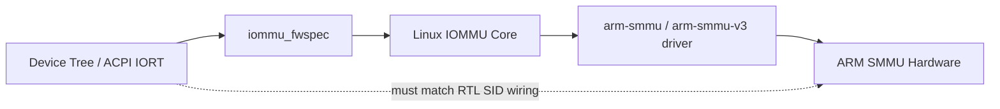

Firmware description은 Linux driver를 만들기 위한 편의 데이터가 아니라, SoC integration contract입니다. SoC fabric 또는 PCIe Root Complex가 실제 DMA transaction에 어떤 Stream ID를 붙이는지와 Device Tree/ACPI가 기술한 Stream ID가 반드시 일치해야 합니다.

---

## 3. Device Tree에서 SMMU를 기술하는 방법

### 3.1 SMMUv3 node 예시

```dts
iommu@2b400000 {
        compatible = "arm,smmu-v3";
        reg = <0x0 0x2b400000 0x0 0x20000>;
        interrupts = <GIC_SPI 74 IRQ_TYPE_EDGE_RISING>,
                     <GIC_SPI 75 IRQ_TYPE_EDGE_RISING>,
                     <GIC_SPI 77 IRQ_TYPE_EDGE_RISING>,
                     <GIC_SPI 79 IRQ_TYPE_EDGE_RISING>;
        interrupt-names = "eventq", "gerror", "priq", "cmdq-sync";
        dma-coherent;
        #iommu-cells = <1>;
        msi-parent = <&its 0xff0000>;
};
```

SMMUv3에서는 `#iommu-cells = <1>`이고, 각 cell은 하나의 Stream ID를 나타냅니다. `interrupt-names`에는 구현에 따라 `eventq`, `gerror`, `priq`, `cmdq-sync` 또는 `combined`가 사용됩니다. `dma-coherent`는 SMMU 자체의 stream table, command/event queue, page table walk가 CPU와 coherent한지를 나타내며, upstream master의 coherency를 자동으로 보장하지 않습니다.

### 3.2 SMMUv2 / MMU-500 node 예시

```dts
smmu: iommu@ba600000 {
        compatible = "arm,mmu-500", "arm,smmu-v2";
        reg = <0xba600000 0x10000>;
        #global-interrupts = <2>;
        interrupts = <0 44 4>,
                     <0 45 4>,
                     <0 46 4>, /* first context interrupt */
                     <0 47 4>,
                     <0 48 4>,
                     <0 49 4>;
        #iommu-cells = <1>;
        stream-match-mask = <0x7c00>;
};
```

SMMUv2/MMU-500에서는 global interrupt와 context interrupt를 나눠 기술합니다. `stream-match-mask`는 모든 Stream ID에 공통으로 무시할 bit를 지정하는 용도로 사용될 수 있습니다.

---

## 4. Platform device와 `iommus` property

```mermaid
flowchart LR
    NPU[npu@12340000] --> PROP[iommus = <&smmu 0x100>]
    PROP --> SMMU[iommu@2b400000]
    PROP --> FWSPEC[iommu_fwspec.ids[0] = 0x100]
```

`iommus` property는 device node와 IOMMU node를 phandle로 연결하고, IOMMU specifier cell에 Stream ID 또는 Stream ID + mask를 담습니다.

```dts
npu@12340000 {
        compatible = "vendor,npu";
        reg = <0x0 0x12340000 0x0 0x10000>;
        interrupts = <GIC_SPI 90 IRQ_TYPE_LEVEL_HIGH>;

        /* NPU DMA request는 Stream ID 0x100으로 SMMU에 들어간다. */
        iommus = <&smmu 0x100>;
        dma-coherent;
        dma-ranges;
};
```

이 예시에서 NPU는 SMMU에 SID 0x100으로 들어가는 DMA master입니다. Linux의 NPU driver가 `dma_map_*()`를 호출하면, DMA-IOMMU layer와 IOMMU Core는 이 device에 연결된 default domain을 사용해 IOVA mapping을 만듭니다.

---

## 5. `#iommu-cells` 의미

| 값 | 주로 사용하는 상황 | 의미 |
|---:|---|---|
| 1 | SMMUv3, 단순 SMMUv2 | 하나의 cell이 Stream ID |
| 2 | SMMUv2 stream matching | 첫 cell은 Stream ID, 둘째 cell은 SMR mask |

SMMUv3 binding은 `#iommu-cells = <1>`로 고정됩니다. SMMUv2 binding은 stream matching을 위해 `#iommu-cells = <2>`를 사용할 수 있습니다.

---

## 6. PCIe와 `iommu-map`

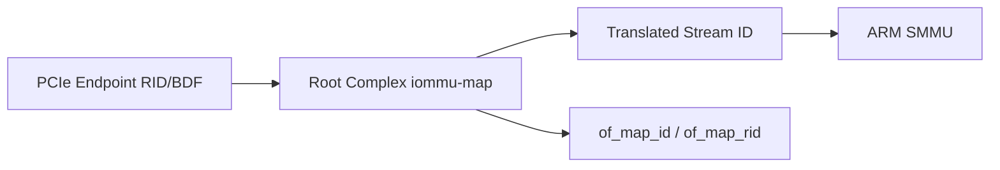

PCIe endpoint는 보통 BDF 기반 Requester ID를 냅니다. SoC의 PCIe Root Complex는 이 RID를 SMMU가 이해하는 Stream ID로 매핑합니다. Device Tree의 `iommu-map`과 `iommu-map-mask`가 이 관계를 기술합니다.

```dts
pcie@40000000 {
        compatible = "vendor,pcie-host";
        device_type = "pci";
        #address-cells = <3>;
        #size-cells = <2>;

        /* RID 0x0000~0x00ff → SMMU Stream ID 0x8000~0x80ff */
        iommu-map = <0x0000 &smmu 0x8000 0x0100>;
        iommu-map-mask = <0xffff>;
};
```

개념적으로는 RID 0x0000~0x00ff가 SMMU SID 0x8000~0x80ff로 변환됩니다. Root Complex가 어떤 방식으로 RID를 SID로 바꾸는지는 SoC integration에 속합니다. Linux는 그 mapping을 읽고 `iommu_fwspec`을 만듭니다.

---

## 7. Device Tree probe sequence

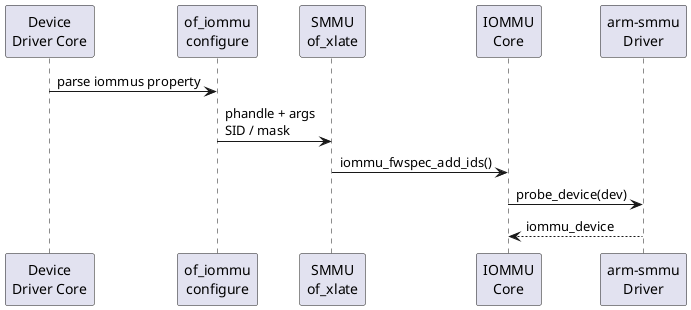

핵심 결과물은 per-device `iommu_fwspec`입니다. 이후 IOMMU Core가 vendor driver의 `probe_device()`, `device_group()`, `domain_alloc`, `attach_dev` callback을 호출할 수 있게 됩니다.

### Source reading 포인트

```c
static int arm_smmu_of_xlate(struct device *dev,
                             const struct of_phandle_args *args)
{
        u32 mask, fwid = 0;

        if (args->args_count > 0)
                fwid |= FIELD_PREP(ARM_SMMU_SMR_ID, args->args[0]);

        if (args->args_count > 1)
                fwid |= FIELD_PREP(ARM_SMMU_SMR_MASK, args->args[1]);

        return iommu_fwspec_add_ids(dev, &fwid, 1);
}
```

`arm_smmu_of_xlate()`는 DT specifier cell을 `iommu_fwspec` ID로 변환합니다. SMMUv3의 `of_xlate`는 더 단순하게 args[0]를 ID로 추가합니다.

---

## 8. ACPI IORT

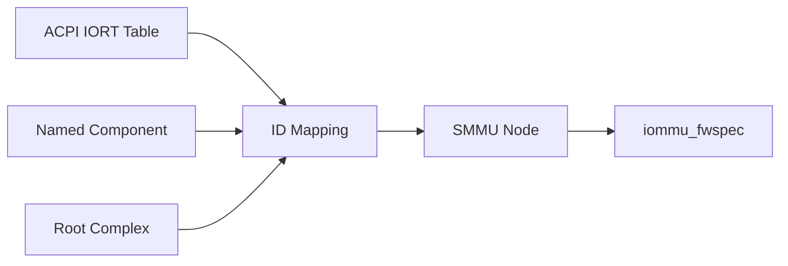

ACPI 시스템에서는 Device Tree 대신 IORT(I/O Remapping Table)가 I/O topology를 설명합니다. IORT는 Named Component, PCI Root Complex, SMMU, ITS, ID mapping node 등을 통해 DMA requester와 IOMMU 사이의 관계를 기술합니다. Linux는 `drivers/acpi/arm64/iort.c`에서 이를 해석해 `iommu_fwspec`을 구성합니다.

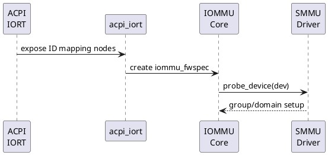

IORT의 본질은 Device Tree의 `iommus` 및 `iommu-map`과 유사합니다. 즉, requester ID가 어떤 SMMU로 가며 어떤 output ID가 되는지를 firmware table로 제공하는 것입니다.

---

## 9. Stream ID ownership

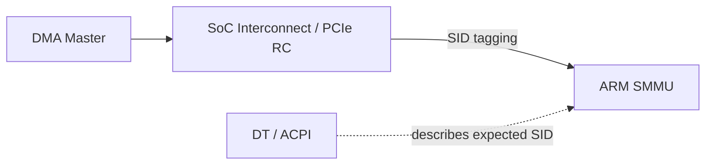

Stream ID는 Linux driver가 편의상 선택하는 ID가 아닙니다. 하드웨어 fabric, PCIe RC, wrapper 또는 integration logic이 DMA transaction에 붙이는 식별자입니다. Linux는 firmware description을 통해 그 값을 알게 됩니다.

---

## 10. Runtime DMA mapping과 연결

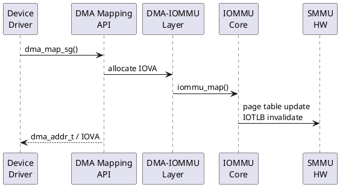

`iommus` 또는 IORT 해석은 boot/probe time에 끝나지만, 실제 IOVA mapping은 runtime의 `dma_map_*()` 또는 DMA-BUF attachment mapping 시점에 만들어집니다.

---

## 11. Camera → NPU buffer pipeline에서의 의미

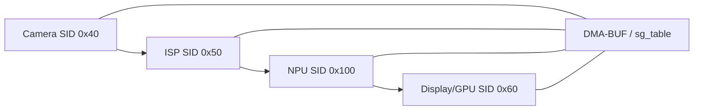

동일한 DMA-BUF라도 Camera, ISP, NPU, Display가 서로 다른 Stream ID와 서로 다른 IOMMU domain/IOVA mapping을 가질 수 있습니다. 따라서 "같은 buffer"와 "같은 IOVA"는 같은 말이 아닙니다.

---

## 12. SysBus NPU + SMMUv3 case study

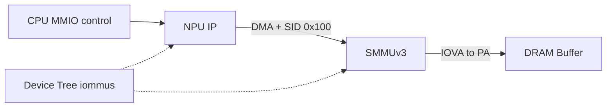

이 프로젝트형 예시에서는 NPU가 PCIe endpoint가 아니라 SoC 내부 SysBus DMA master라고 가정합니다. 제어 MMIO는 CPU가 직접 접근하고, 외부 DMA만 SMMUv3 fixed Stream ID 0x100을 통해 DRAM으로 접근합니다.

---

## 13. Fault debugging

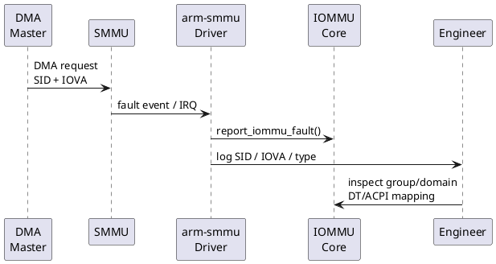

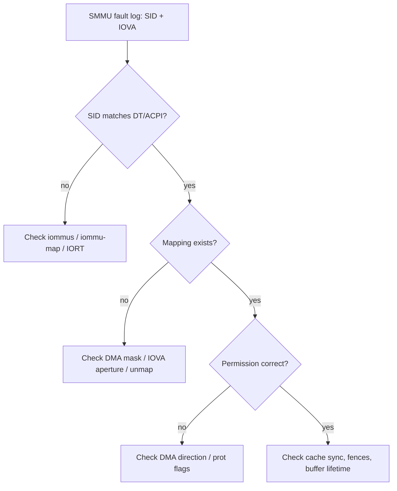

디버깅은 SID에서 시작합니다. SID가 틀리면 DT/ACPI와 RTL 또는 interconnect mapping이 불일치한 것이고, SID가 맞는데 fault가 나면 IOVA mapping, permission, DMA direction, buffer lifetime, cache/fence 문제를 순서대로 확인합니다.

```bash
# boot log
dmesg | grep -Ei "iommu|smmu|iort|of_iommu"

# group topology
find /sys/kernel/iommu_groups -maxdepth 2 -type l

# device tree 확인
ls /proc/device-tree/
find /proc/device-tree -name iommus -print

# dma-buf pipeline 점검
cat /sys/kernel/debug/dma_buf/bufinfo
```

---

## 14. 흔한 실수

| 증상 | 가능한 원인 | 확인 지점 |
|---|---|---|
| unknown Stream ID | DT/IORT에 없는 SID | `iommus`, `iommu-map`, IORT ID mapping |
| translation fault | IOVA mapping 없음 | `dma_map_*`, DMA-BUF attachment lifetime |
| permission fault | 방향/prot mismatch | `DMA_TO_DEVICE`, `DMA_FROM_DEVICE`, page prot |
| page-table walk fault | table memory 접근 문제 | SMMU `dma-coherent`, table walker DMA mask |
| PCIe device group 이상 | RID alias 또는 ACS 문제 | `/sys/kernel/iommu_groups`, `iommu-map` |

---

## 15. 퀴즈

1. `iommus = <&smmu 0x100>`에서 0x100은 무엇인가?
2. SMMUv3에서 `#iommu-cells` 값은 무엇인가?
3. `dma-coherent`가 upstream NPU의 DMA cache coherency를 의미한다. O/X
4. PCIe endpoint의 BDF/RID를 Stream ID로 바꾸는 DT property는 무엇인가?
5. ACPI 시스템에서 Device Tree의 IOMMU topology 기술을 대체하는 표는 무엇인가?
6. `iommu_fwspec`은 per-device 자료구조인가, per-domain 자료구조인가?
7. SMMUv2에서 Stream ID와 mask를 함께 기술하려면 `#iommu-cells`를 어떻게 둘 수 있는가?
8. Camera와 NPU가 같은 DMA-BUF를 공유하면 항상 같은 IOVA를 보는가?
9. SMMU fault log에서 가장 먼저 확인해야 하는 식별자는 무엇인가?
10. SysBus NPU에서 control MMIO와 external DMA 중 SMMU를 거치는 것은 어느 쪽인가?

## 16. 정답 및 해설

1. SMMU에 들어가는 Stream ID입니다.
2. `#iommu-cells = <1>`입니다.
3. X. SMMU 자체의 page table walk 등 SMMU DMA coherency를 의미하며 upstream master 전체의 coherency를 보장하지 않습니다.
4. `iommu-map`과 `iommu-map-mask`입니다.
5. ACPI IORT입니다.
6. per-device firmware spec입니다.
7. `#iommu-cells = <2>`를 사용할 수 있습니다.
8. 아닙니다. 같은 물리 pages라도 attachment별 IOVA는 다를 수 있습니다.
9. Stream ID입니다. 그 다음 IOVA, access type, stage, permission을 봅니다.
10. external DMA가 SMMU를 거칩니다. control MMIO는 CPU가 device register를 접근하는 경로입니다.

---

## 17. 복습 카드

| 용어 | 한 줄 정의 |
|---|---|
| Stream ID | DMA transaction이 어느 master에서 왔는지 SMMU가 구분하는 ID |
| `iommus` | platform device와 IOMMU node를 연결하는 DT property |
| `iommu-map` | bus-local ID를 IOMMU specifier ID로 변환하는 DT mapping |
| `iommu_fwspec` | firmware에서 얻은 IOMMU 연결 정보를 device에 저장하는 Linux 객체 |
| IORT | ACPI 기반 I/O remapping topology table |
| RMR | firmware가 보존해야 한다고 기술하는 reserved memory region |
| `dma-coherent` | 해당 node의 DMA operation이 CPU와 cache coherent하다는 firmware property |

## 18. 실습 과제

1. QEMU arm64 virt 또는 target board의 DTB를 decompile하고 `iommu@`, `iommus`, `iommu-map`을 찾아 정리합니다.
2. 임의의 NPU device node에 `iommus = <&smmu 0x100>`를 추가했을 때 Linux boot log에서 어떤 변화가 생기는지 예상합니다.
3. `/sys/kernel/iommu_groups`와 dmesg log를 연결하여 device → group → domain 관계를 표로 만듭니다.
4. Camera → NPU DMA-BUF pipeline에서 각 attachment의 Stream ID와 IOVA가 어디서 결정되는지 흐름도를 그립니다.

## 19. Source Reading Map

- `Documentation/devicetree/bindings/iommu/arm,smmu.yaml`
- `Documentation/devicetree/bindings/iommu/arm,smmu-v3.yaml`
- `drivers/iommu/of_iommu.c`
- `drivers/iommu/iommu.c`
- `drivers/iommu/arm/arm-smmu/arm-smmu.c`
- `drivers/iommu/arm/arm-smmu-v3/arm-smmu-v3.c`
- `drivers/acpi/arm64/iort.c`

## 20. 다음 강의 예고

9강에서는 Device Tree/ACPI로 연결된 장치들이 실제 DMA-BUF 기반 Camera → NPU pipeline에서 어떤 방식으로 buffer를 공유하고, attachment별로 어떤 IOVA mapping을 만드는지 분석합니다.
