# 9강. DMA-BUF 기반 Camera → ISP/NPU Buffer / Memory Pipeline

> 과정: **IOMMU / ARM SMMU Study**  
> 기준 소스: Linux mainline commit `fce2dfa773ced15f27dd27cd0b482a7473cdcf2a`  
> 예상 강의 시간: 120~150분  
> 선수 지식: 1~8강의 DMA API, Linux IOMMU Framework, SMMUv2/v3, Device Tree/Stream ID

---

## 1. 강의 목표

이번 강의는 지금까지 학습한 DMA, IOMMU, ARM SMMU, Device Tree/Stream ID 지식을 실제 영상·AI 파이프라인에 연결합니다. 중심 사례는 다음과 같습니다.

```text
Camera Capture → ISP/Scaler → NPU Inference → Result/Postprocess
```

학습 후에는 다음 질문에 답할 수 있어야 합니다.

1. DMA-BUF가 무엇을 공유하고, 무엇을 공유하지 않는가?
2. 같은 DMA-BUF가 Camera와 NPU에서 서로 다른 IOVA를 가질 수 있는 이유는 무엇인가?
3. V4L2의 MMAP buffer를 `VIDIOC_EXPBUF`로 내보내는 경로와, 외부 DMA-BUF를 `V4L2_MEMORY_DMABUF`로 가져오는 경로는 어떻게 다른가?
4. `dma_buf_attach()`와 `dma_buf_map_attachment()`의 역할은 어떻게 구분되는가?
5. importer가 받은 `sg_table`의 `sg_dma_address()`는 PA인가, 해당 device의 DMA address/IOVA인가?
6. NPU가 scatter-gather를 지원하지 않아도 IOMMU가 있으면 물리적으로 흩어진 page를 하나의 연속 IOVA로 보이게 할 수 있는 조건은 무엇인가?
7. buffer ownership, fence, cache synchronization, IOMMU mapping은 왜 서로 다른 문제인가?
8. SMMU fault의 SID/IOVA를 Camera frame sequence와 NPU job ID에 어떻게 연결하는가?

---

## 2. 이전 강의와의 연결

8강에서 firmware가 다음 정보를 제공한다는 것을 학습했습니다.

- Camera, ISP, NPU가 어떤 SMMU에 연결되는가?
- 각 DMA master가 어떤 Stream ID를 내는가?
- Linux가 `iommu_fwspec`과 default domain을 어떻게 구성하는가?

9강에서는 그 위에서 runtime buffer mapping이 어떻게 생성되는지 추적합니다.

```text
DT / IORT / Stream ID
        ↓
Device별 IOMMU domain
        ↓
DMA-BUF attachment별 DMA mapping
        ↓
Camera / ISP / NPU가 사용하는 IOVA
```

---

## 3. 전체 파이프라인 큰 그림

```mermaid
flowchart LR
    sensor["Camera<br/>Sensor"]
    csi["CSI-2 / Capture"]
    cam_buf["RAW / YUV<br/>DMA-BUF"]
    isp["ISP / Scaler"]
    npu_buf["NPU Input<br/>DMA-BUF"]
    npu["NPU"]
    result["Tensor Result"]
    smmu["ARM SMMU"]
    dram["DRAM"]
    sensor -->|"pixel stream"| csi
    csi -->|"DMA write"| cam_buf
    cam_buf -->|"DMA read"| isp
    isp -->|"DMA write"| npu_buf
    npu_buf -->|"DMA read"| npu
    npu -->|"DMA write"| result
    csi -. "SID_CAM" .-> smmu
    isp -. "SID_ISP" .-> smmu
    npu -. "SID_NPU" .-> smmu
    smmu -->|"IOVA → PA"| dram
    classDef sw fill:#151F3F,stroke:#4FDBFF,color:#F7FAFF,stroke-width:1.5px;
    classDef user fill:#1E2A50,stroke:#8B5CF6,color:#F7FAFF,stroke-width:1.5px;
    classDef hw fill:#1B2946,stroke:#FFB454,color:#F7FAFF,stroke-width:1.5px;
    classDef buffer fill:#16374B,stroke:#48D597,color:#F7FAFF,stroke-width:1.5px;
    classDef memory fill:#24304D,stroke:#48D597,color:#F7FAFF,stroke-width:1.5px;
    classDef security fill:#34234B,stroke:#8B5CF6,color:#F7FAFF,stroke-width:1.5px;
    classDef fault fill:#482235,stroke:#FF6B7A,color:#F7FAFF,stroke-width:1.5px;
    classDef decision fill:#312B18,stroke:#FFB454,color:#F7FAFF,stroke-width:1.5px;
    classDef core fill:#192F52,stroke:#4FDBFF,color:#F7FAFF,stroke-width:1.5px;
    class sensor hw;
    class csi hw;
    class cam_buf buffer;
    class isp hw;
    class npu_buf buffer;
    class npu hw;
    class result buffer;
    class smmu security;
    class dram memory;
```

이 그림에서 중요한 점은 pixel data가 CPU를 통해 매번 복사되지 않는다는 것입니다. 각 하드웨어 블록은 DMA master로서 DRAM의 buffer를 읽거나 씁니다. SMMU는 각 transaction의 Stream ID를 사용해 올바른 translation context를 선택합니다.

그러나 “같은 buffer를 공유한다”는 문장을 정확히 풀면 세 가지 정체성이 존재합니다.

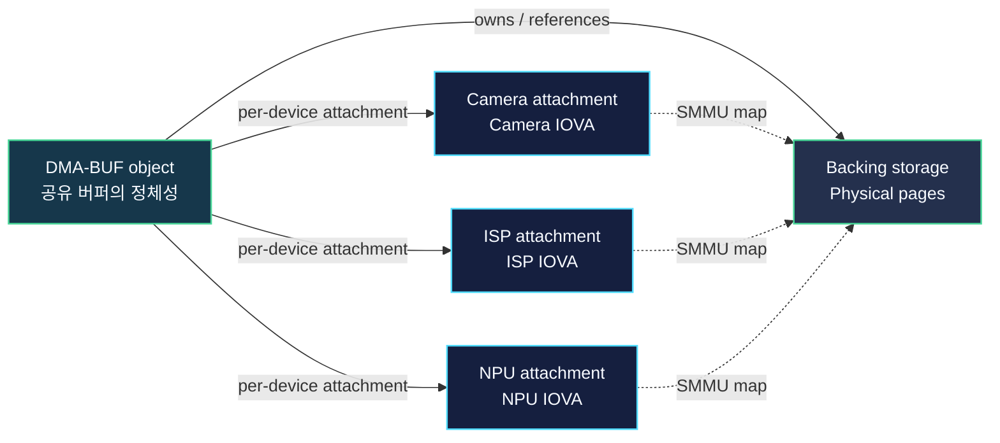

- **DMA-BUF object**: 공유되는 buffer object와 lifetime을 나타냅니다.
- **Backing storage**: 실제 physical page 또는 device memory입니다.
- **Per-device DMA mapping**: Camera, ISP, NPU가 각각 사용하는 DMA address/IOVA입니다.

따라서 다음 등식은 성립하지 않습니다.

```text
same DMA-BUF == same IOVA == same CPU VA
```

---

## 4. DMA-BUF 핵심 객체

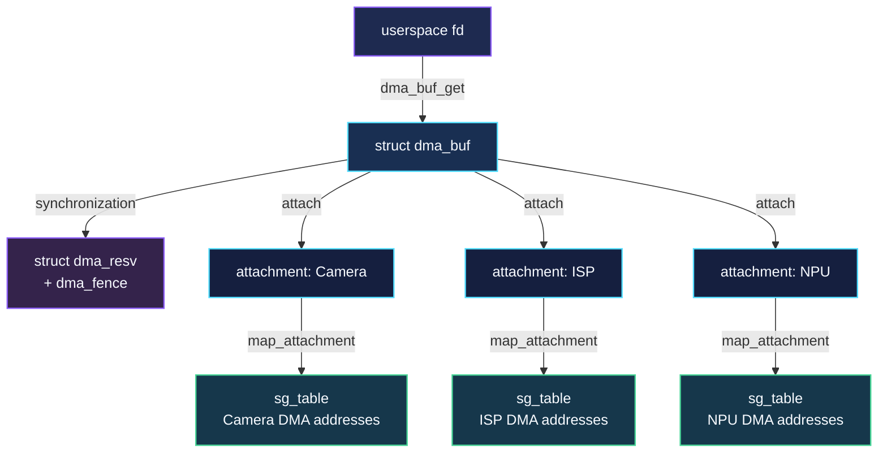

### 4.1 `struct dma_buf`

공유 buffer의 중심 객체입니다. userspace에서는 file descriptor로 표현되며, kernel에서는 reference counting으로 lifetime을 관리합니다.

핵심 구성 요소:

- buffer size
- exporter의 `dma_buf_ops`
- exporter-private backing storage 정보
- attached device 목록
- `dma_resv` synchronization object

### 4.2 `struct dma_buf_attachment`

DMA-BUF와 특정 device 사이의 관계를 나타냅니다.

```text
one dma_buf + N devices → N attachments
```

Camera, ISP, NPU가 같은 buffer를 사용한다면 일반적으로 각 device마다 attachment가 존재합니다. attachment에는 importer device가 들어 있으므로 exporter는 그 device의 DMA mask, segment 제한, memory location 요구사항을 고려할 수 있습니다.

### 4.3 `struct sg_table`

`dma_buf_map_attachment()`가 성공하면 importer는 `sg_table`을 받습니다. 이 table은 단순한 physical-page 목록이라고 가정하면 안 됩니다. 반환 시점에는 **해당 attachment device의 DMA address space로 이미 mapping된 DMA address**가 scatterlist에 들어갈 수 있습니다.

```c
for_each_sgtable_dma_sg(sgt, sg, i) {
        dma_addr_t addr = sg_dma_address(sg);
        size_t len = sg_dma_len(sg);
}
```

`sg_page()`와 `sg_dma_address()`는 서로 다른 관점입니다.

| 항목 | 의미 |
|---|---|
| `sg_page()` / physical backing | 메모리의 backing page 관점 |
| `sg_dma_address()` | 해당 device가 DMA transaction에 넣을 주소 |
| IOMMU 사용 시 | `sg_dma_address()`가 IOVA일 수 있음 |

### 4.4 `struct dma_resv`와 `dma_fence`

DMA-BUF framework는 producer/consumer 간 asynchronous operation ordering을 위해 reservation object와 fence를 사용할 수 있습니다. 다만 모든 subsystem이 동일한 implicit synchronization 규칙을 적용하는 것은 아닙니다. V4L2 pipeline에서는 QBUF/DQBUF, request API, driver completion, vendor explicit fence 등 실제 integration contract를 확인해야 합니다.

---

## 5. 누가 buffer를 할당하는가?

Camera → NPU pipeline에는 대표적으로 두 가지 topology가 있습니다.

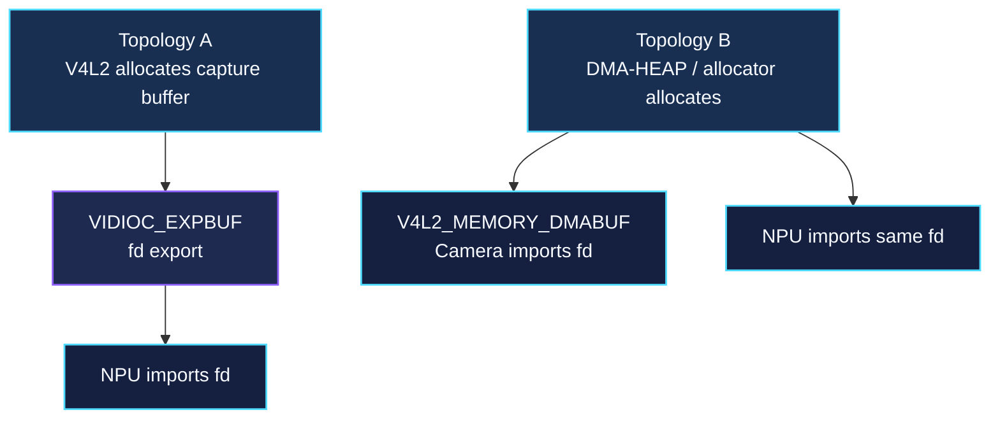

### 5.1 Topology A: V4L2/VB2가 buffer를 할당하고 export

1. Camera application이 `REQBUFS(V4L2_MEMORY_MMAP)`을 호출합니다.
2. VB2 memory backend가 capture buffer를 할당합니다.
3. application이 `VIDIOC_EXPBUF`로 각 buffer를 DMA-BUF fd로 export합니다.
4. 같은 fd를 NPU driver나 다른 subsystem에 전달합니다.

장점:

- 기존 V4L2 capture driver와 쉽게 결합
- capture device의 DMA 제약을 allocator가 먼저 반영

주의점:

- exporter가 선택한 backing storage가 NPU에도 접근 가능한지 확인해야 함
- multi-plane format에서는 plane별 export semantics를 확인해야 함

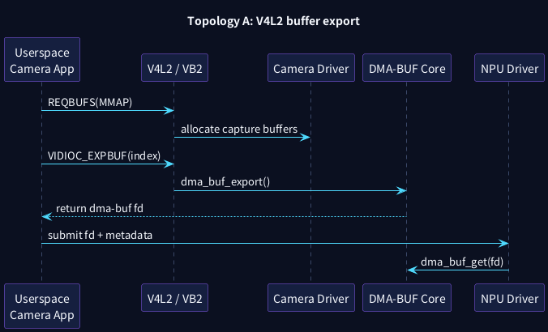

```c
struct v4l2_exportbuffer exp = {
        .type  = V4L2_BUF_TYPE_VIDEO_CAPTURE,
        .index = index,
        .flags = O_CLOEXEC | O_RDWR,
};

if (ioctl(cam_fd, VIDIOC_EXPBUF, &exp) < 0)
        return -errno;

/* exp.fd identifies the same capture buffer. */
submit_to_npu(exp.fd, frame_seq, timestamp_ns);
```

### 5.2 Topology B: DMA-HEAP/allocator가 buffer를 할당하고 Camera가 import

1. application 또는 middleware가 DMA-HEAP, graphics allocator 등으로 buffer를 할당합니다.
2. Camera queue를 `V4L2_MEMORY_DMABUF`으로 설정합니다.
3. `VIDIOC_QBUF`에 DMA-BUF fd를 제공합니다.
4. Camera와 NPU가 동일한 fd를 각각 import합니다.

장점:

- pipeline 전체의 allocator 정책을 중앙에서 관리
- Camera, ISP, NPU, Display의 공통 요구사항을 반영하기 쉬움

주의점:

- 모든 device의 DMA mask, secure/non-secure 속성, contiguity, cacheability 요구사항을 만족해야 함
- allocator가 반환한 heap이 특정 device에서 접근 불가능할 수 있음

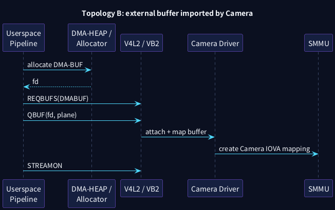

---

## 6. V4L2 memory model

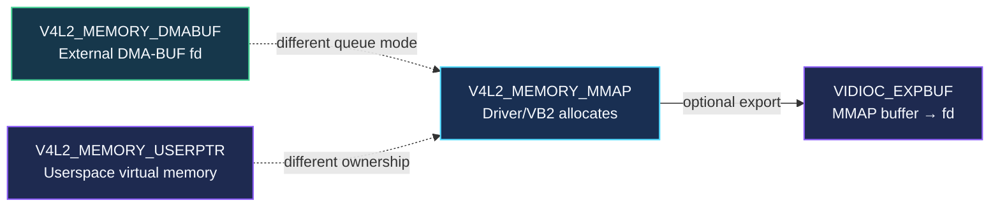

| Memory model | allocation 주체 | userspace가 queue에 전달하는 것 | DMA-BUF와의 관계 |
|---|---|---|---|
| `V4L2_MEMORY_MMAP` | driver/VB2 | index | `VIDIOC_EXPBUF`로 export 가능 |
| `V4L2_MEMORY_USERPTR` | userspace memory | virtual address | page pinning과 DMA mapping 필요 |
| `V4L2_MEMORY_DMABUF` | 외부 allocator | DMA-BUF fd | Camera driver가 importer |

### 6.1 Multi-planar format

NV12, P010, 일부 RAW/metadata format은 여러 plane을 가질 수 있습니다. 다음 항목을 혼동하면 frame은 capture되어도 NPU 입력이 깨질 수 있습니다.

- plane count
- plane별 fd
- plane offset
- `bytesperline` / stride
- `sizeimage`
- chroma subsampling
- modifier 또는 tiled/compressed layout

```c
struct v4l2_plane planes[VIDEO_MAX_PLANES] = { 0 };
struct v4l2_buffer buf = {
        .type   = V4L2_BUF_TYPE_VIDEO_CAPTURE_MPLANE,
        .memory = V4L2_MEMORY_DMABUF,
        .index  = index,
        .length = num_planes,
        .m.planes = planes,
};

for (unsigned int p = 0; p < num_planes; p++) {
        planes[p].m.fd       = plane_fd[p];
        planes[p].data_offset = plane_offset[p];
        planes[p].length     = plane_size[p];
}

return ioctl(cam_fd, VIDIOC_QBUF, &buf);
```

한 DMA-BUF fd 안에 여러 plane이 offset으로 배치될 수도 있고, plane별로 서로 다른 fd를 사용할 수도 있습니다. 이 결정은 V4L2 format contract와 allocator/exporter 정책에 따라 달라집니다.

---

## 7. videobuf2(VB2)의 역할

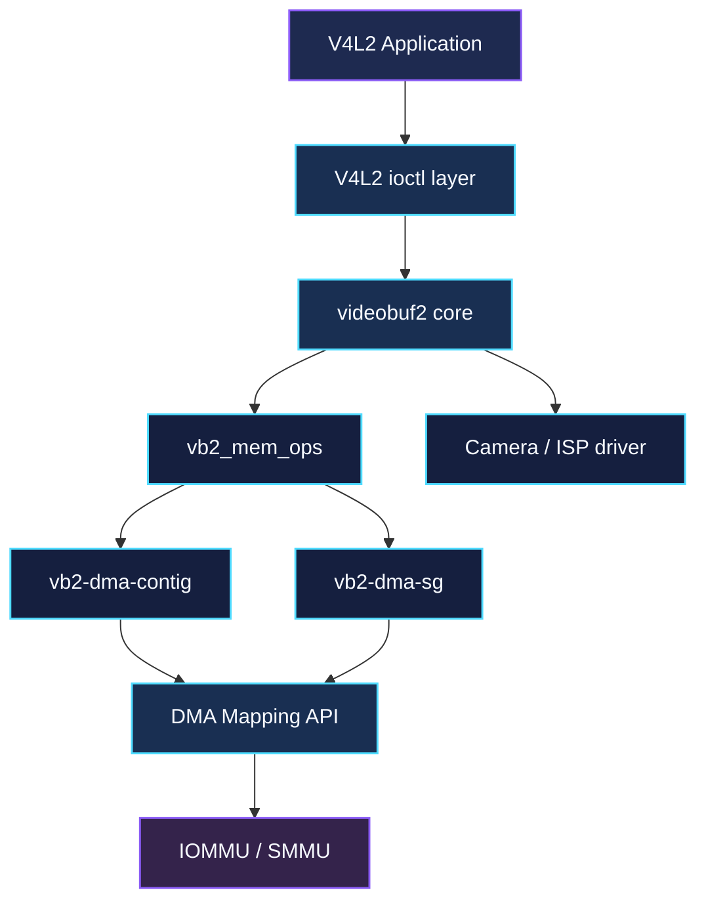

VB2는 V4L2 driver가 buffer queue를 구현할 때 공통으로 사용하는 framework입니다.

주요 책임:

- buffer state 관리
- MMAP/USERPTR/DMABUF memory model 공통화
- queue/dequeue 및 streaming lifecycle
- memory backend callback 연결
- driver `buf_prepare`, `buf_queue`, `start_streaming`, `stop_streaming` 호출

대표 memory backend:

- `vb2_dma_contig_memops`
- `vb2_dma_sg_memops`
- `vb2_vmalloc_memops`

### 7.1 `vb2-dma-contig`라는 이름의 오해

`dma-contig`는 device 관점에서 필요한 contiguous DMA span을 제공하려는 backend입니다. IOMMU가 활성화되어 있으면 physical page가 흩어져 있어도 DMA address space에서 연속 영역으로 합쳐질 수 있습니다.

하지만 다음 조건이 맞아야 합니다.

- DMA mapping layer가 segment를 합칠 수 있어야 함
- device의 `max_segment_size`가 buffer보다 작지 않아야 함
- IOVA aperture와 page-table mapping이 충분해야 함
- importer 또는 device가 요구하는 alignment를 만족해야 함

---

## 8. DMA-BUF attachment lifecycle


각 단계의 역할은 다음과 같습니다.

### 8.1 `dma_buf_get(fd)`

- userspace fd를 kernel `struct dma_buf *`로 변환
- reference count 증가
- 아직 device DMA mapping을 만들지는 않음

### 8.2 `dma_buf_attach(dbuf, dev)`

- DMA-BUF와 importer device 사이 attachment 생성
- exporter가 device의 접근 가능성이나 DMA constraint를 검사 가능
- 아직 반드시 IOVA mapping이 만들어지는 것은 아님

### 8.3 `dma_buf_map_attachment()`

- exporter의 `map_dma_buf()` callback 호출
- backing storage를 importer device address space에 mapping
- DMA API와 IOMMU/SMMU mapping이 이 단계에서 관여할 수 있음
- device가 사용할 `sg_table` 반환

### 8.4 unmap/detach/put

DMA가 종료된 뒤 역순으로 해제해야 합니다.

```text
stop device access
→ unmap attachment
→ detach attachment
→ put dma_buf reference
```

DMA가 아직 진행 중인데 unmap하거나 fd lifetime만 보고 backing storage를 재사용하면 use-after-unmap 또는 use-after-free DMA가 발생할 수 있습니다.

---

## 9. NPU importer driver 설계

NPU driver는 일반적으로 fd와 tensor metadata를 submission API로 받습니다.

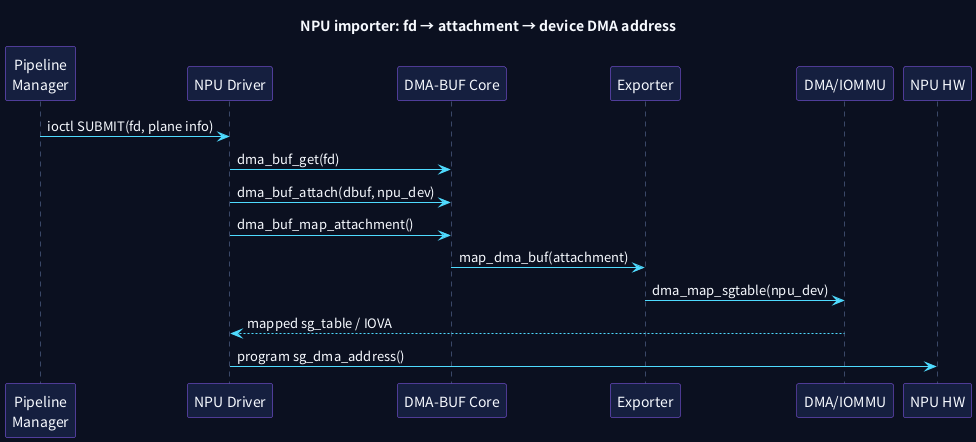

```c
static int npu_map_dmabuf(struct npu_job *job, int fd)
{
        job->dbuf = dma_buf_get(fd);
        if (IS_ERR(job->dbuf))
                return PTR_ERR(job->dbuf);

        job->attach = dma_buf_attach(job->dbuf, job->npu->dev);
        if (IS_ERR(job->attach))
                goto err_put;

        job->sgt = dma_buf_map_attachment(job->attach,
                                          DMA_TO_DEVICE);
        if (IS_ERR(job->sgt))
                goto err_detach;

        job->iova = sg_dma_address(job->sgt->sgl);
        return 0;

err_detach:
        dma_buf_detach(job->dbuf, job->attach);
err_put:
        dma_buf_put(job->dbuf);
        return -EINVAL;
}
```

### 9.1 반드시 저장해야 하는 per-job 상태

```c
struct npu_job_buffer {
        struct dma_buf *dbuf;
        struct dma_buf_attachment *attach;
        struct sg_table *sgt;
        dma_addr_t iova;
        size_t size;
        u32 plane_offset;
        u32 stride;
        enum dma_data_direction dir;
};
```

이 객체는 최소한 NPU hardware가 buffer 접근을 완료할 때까지 살아 있어야 합니다.

### 9.2 `sg_dma_address()`를 device register에 사용

```c
dma_addr_t base = sg_dma_address(job->sgt->sgl);
size_t dma_len = sg_dma_len(job->sgt->sgl);

if (!npu_supports_scatter_gather(job->npu) &&
    dma_len < job->required_size)
        return -EINVAL;

writeq(base + job->plane_offset, regs + NPU_INPUT_IOVA);
writel(job->stride,             regs + NPU_INPUT_STRIDE);
writel(job->width,              regs + NPU_INPUT_WIDTH);
writel(job->height,             regs + NPU_INPUT_HEIGHT);
```

CPU virtual address나 `virt_to_phys()` 결과를 NPU register에 쓰면 안 됩니다. driver는 DMA API/DMA-BUF mapping이 반환한 DMA address를 사용해야 합니다.

### 9.3 scatter-gather 지원 여부

NPU hardware가 SG descriptor list를 지원하면 모든 mapped segment를 command descriptor로 넘길 수 있습니다.

NPU가 single base + size만 지원하면 다음 중 하나가 필요합니다.

- mapping 결과가 device DMA address space에서 충분히 연속
- contiguous allocator/CMA 사용
- bounce/copy buffer 사용
- hardware 또는 driver 설계 변경

---

## 10. DMA-BUF mapping에서 SMMU까지

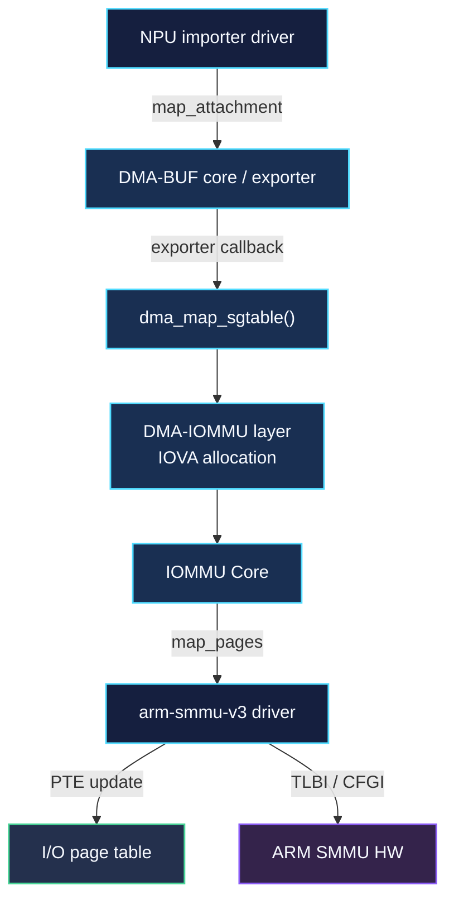

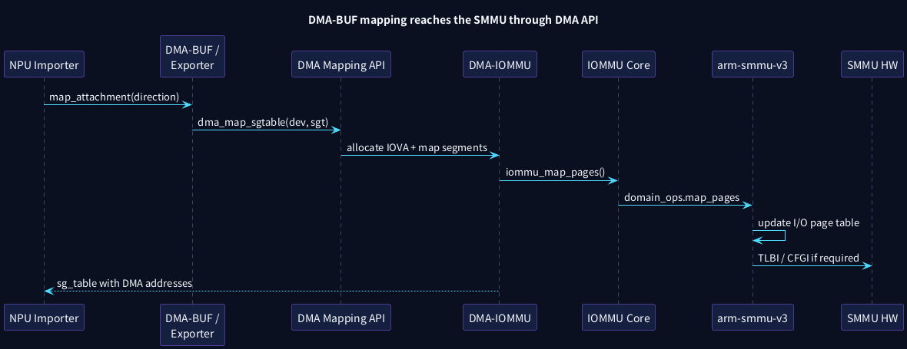

호출 흐름을 계층별로 정리하면 다음과 같습니다.

```text
NPU importer
  dma_buf_map_attachment()
        ↓
DMA-BUF exporter map_dma_buf()
  dma_map_sgtable(npu_dev, ...)
        ↓
DMA Mapping API / DMA-IOMMU
  IOVA allocation + segment mapping
        ↓
Linux IOMMU Core
  iommu_map_pages()
        ↓
arm-smmu / arm-smmu-v3
  I/O page table update + invalidation
```

이 계층 분리는 디버깅할 때 중요합니다.

| 증상 | 우선 확인 계층 |
|---|---|
| `dma_buf_attach()` 실패 | exporter location/constraint, DMA mask |
| `map_attachment()` 실패 | allocation, SG, DMA mapping, IOVA space |
| mapping 성공 후 SMMU fault | wrong IOVA, early unmap, SID/domain, permission |
| fault 없음 + stale frame | cache sync, fence/ownership, format |

---

## 11. 같은 DMA-BUF, 서로 다른 IOVA

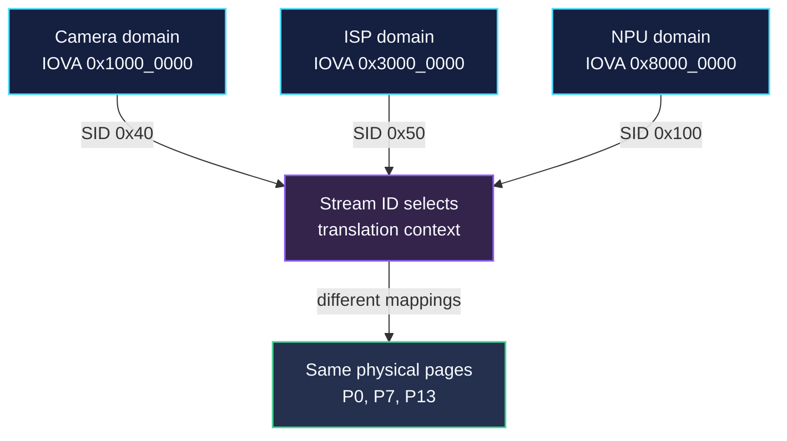

예를 들어 같은 backing pages가 다음처럼 보일 수 있습니다.

```text
Physical pages: P0, P7, P13
Camera IOVA : 0x1000_0000 ~ 0x1002_FFFF
ISP IOVA    : 0x3000_0000 ~ 0x3002_FFFF
NPU IOVA    : 0x8000_0000 ~ 0x8002_FFFF
```

이 차이가 생기는 이유:

1. device마다 attachment가 다름
2. device마다 DMA mask와 segment constraint가 다름
3. device가 서로 다른 IOMMU domain에 속할 수 있음
4. domain별 IOVA allocator 상태가 다름
5. Stream ID가 서로 다른 translation context를 선택함

따라서 Camera driver가 얻은 DMA address를 NPU driver에 그대로 전달해서는 안 됩니다. **fd/object를 공유하고 각 importer가 자신의 device에 mapping해야 합니다.**

---

## 12. Physical scatter를 contiguous IOVA로 만들기

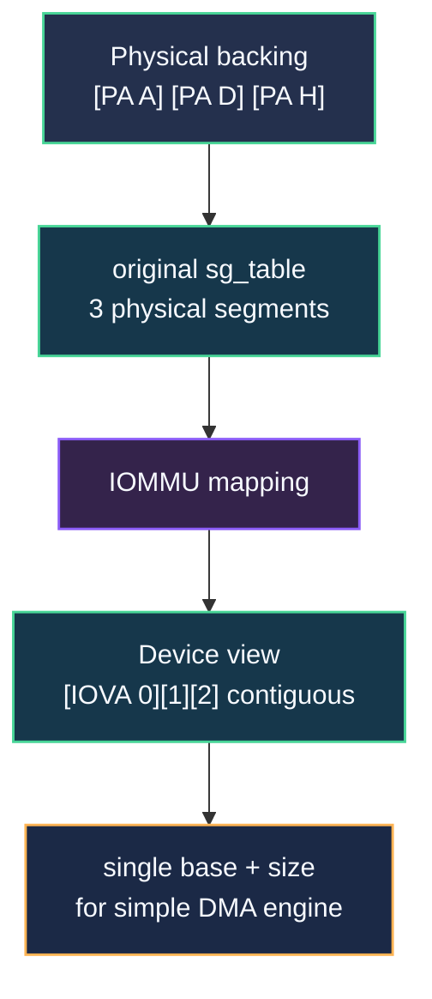

IOMMU의 중요한 장점은 physical contiguity와 device-visible contiguity를 분리하는 것입니다.

```text
IOVA 0x8000_0000 → PA A
IOVA 0x8000_1000 → PA D
IOVA 0x8000_2000 → PA H
```

NPU는 IOVA가 연속이므로 하나의 base + length로 접근할 수 있습니다. 하지만 DMA mapping subsystem이 SG segment를 어떻게 합치는지는 device constraint에 영향을 받습니다.

### 12.1 `max_segment_size`

VB2 `dma-contig` helper는 IOMMU가 있을 때 scatterlist를 하나의 DMA chunk로 merge할 수 있도록 device의 maximum segment size를 충분히 크게 설정하는 용도로 사용됩니다.

```c
vb2_dma_contig_set_max_seg_size(dev, max_frame_size);
```

주의:

- 이 설정만으로 항상 단일 segment가 보장되는 것은 아님
- IOVA space fragmentation, alignment, boundary mask, hardware restriction을 함께 확인
- mapping 결과의 `sg_dma_len()` 합과 연속성을 실제로 검증

```c
/* Conceptualized from vb2-dma-contig exporter flow. */
static struct sg_table *map_for_importer(struct dma_buf_attachment *a,
                                         enum dma_data_direction dir)
{
        struct sg_table *sgt = attachment_private_sgt(a);

        if (dma_map_sgtable(a->dev, sgt, dir,
                            DMA_ATTR_SKIP_CPU_SYNC))
                return ERR_PTR(-EIO);

        return sgt;  /* DMA addresses are for a->dev. */
}
```

---

## 13. Camera, ISP, NPU의 producer/consumer 역할


한 stage의 output buffer는 다음 stage의 input buffer가 됩니다. 실제 pipeline에서는 RAW capture와 NPU input이 같은 allocation일 수도 있지만, ISP color conversion, resize, normalization 때문에 별도 output buffer가 필요한 경우가 많습니다.

### 예시

| Stage | Read | Write | DMA direction 관점 |
|---|---|---|---|
| Camera capture | sensor stream | RAW/YUV buffer | memory 기준 `DMA_FROM_DEVICE` |
| ISP | RAW buffer | YUV/RGB buffer | input read + output write |
| Preprocessor | image buffer | tensor buffer | read + write |
| NPU | tensor/weights | output tensor | input `TO_DEVICE`, output `FROM_DEVICE` |

`enum dma_data_direction`은 CPU 관점이 아니라 **device가 memory를 읽는지/쓰는지**를 기준으로 선택합니다.

---

## 14. 한 frame의 end-to-end sequence

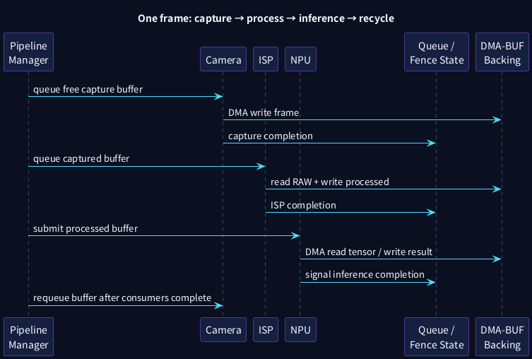

핵심 원칙은 다음과 같습니다.

- producer completion 이전에 consumer가 읽으면 안 됨
- 마지막 consumer completion 이전에 producer에게 buffer를 재queue하면 안 됨
- mapping lifetime은 device DMA lifetime을 포함해야 함
- frame metadata는 buffer와 함께 이동해야 함

---

## 15. Buffer state machine


이 state machine은 구현마다 이름이 달라도 반드시 존재해야 합니다. 단순 reference count만으로는 “현재 누가 접근 가능한가”를 완전히 표현할 수 없습니다.

권장 상태 정보:

- queue owner
- hardware in-flight 여부
- producer completion
- consumer count
- fence 또는 completion object
- frame sequence/generation
- cancellation/reset 상태

### 15.1 Triple buffering

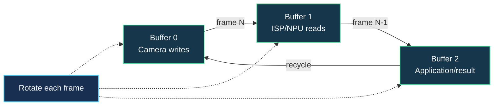

세 개 이상의 buffer를 사용하면 Camera capture, ISP/NPU processing, application/result handling을 겹쳐 실행할 수 있습니다.

대략적인 최소 buffer 수는 다음 요소에 따라 결정됩니다.

```text
pipeline depth
+ asynchronous queue depth
+ jitter absorption
+ safety margin
```

buffer가 너무 적으면 hardware idle과 frame drop이 늘고, 너무 많으면 end-to-end latency와 memory footprint가 증가합니다.

---

## 16. Zero-copy의 정확한 의미

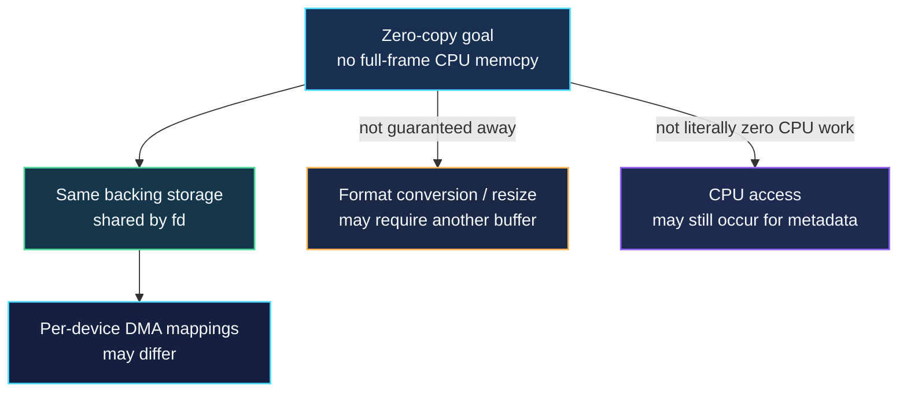

Zero-copy는 보통 **full frame을 CPU가 memcpy하지 않는다**는 목표입니다. 다음을 의미하지는 않습니다.

- 모든 stage가 반드시 같은 IOVA를 사용한다
- 어떤 additional buffer도 생성하지 않는다
- CPU가 metadata를 전혀 다루지 않는다
- cache maintenance나 fence wait가 없다
- format conversion이 사라진다

실무에서는 다음 표현이 더 정확합니다.

```text
Zero full-frame CPU copy across compatible stages
```

format/layout이 호환되지 않으면 ISP/preprocessor가 별도 DMA-BUF로 변환 결과를 쓰는 것은 zero-copy pipeline과 모순되지 않습니다. CPU memcpy를 피하면서 hardware-to-hardware DMA path를 유지할 수 있기 때문입니다.

---

## 17. Format, plane, stride, tensor layout contract

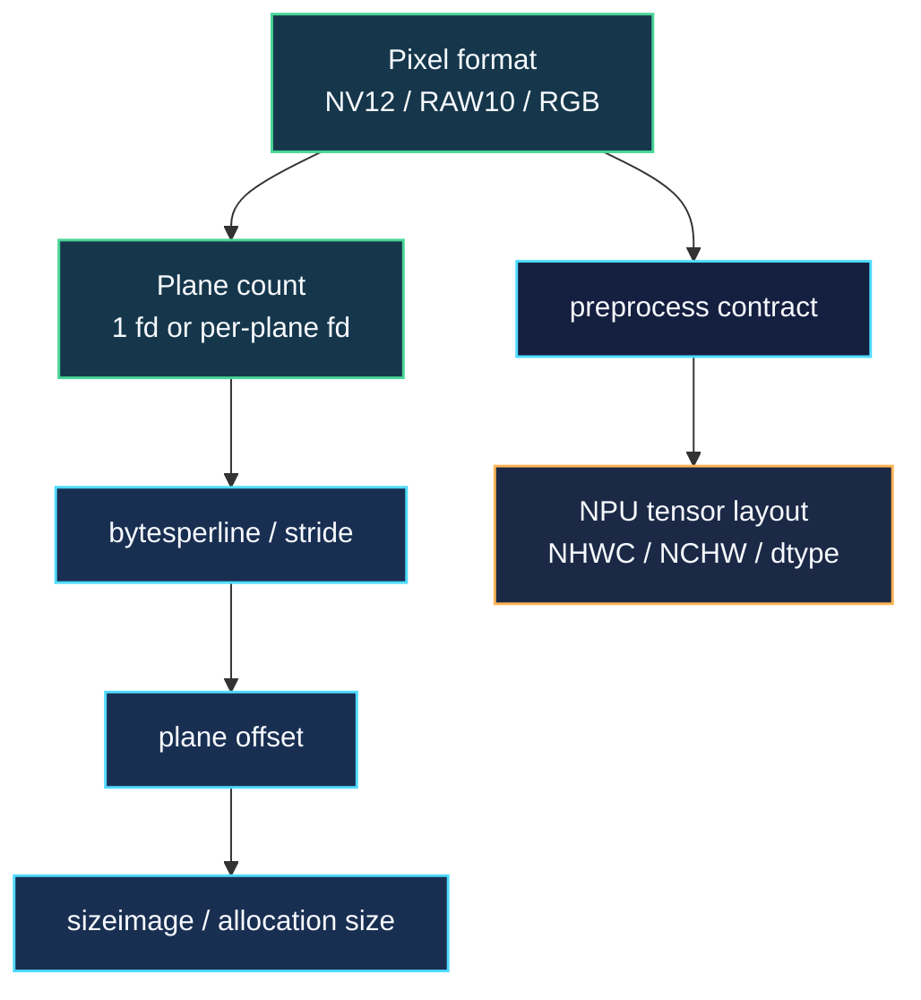

IOMMU mapping이 완벽해도 format contract가 틀리면 결과는 잘못됩니다.

### 17.1 영상 buffer 정보

- FourCC format
- width/height
- plane count
- plane offset
- stride/bytesperline
- allocation size/sizeimage
- color space, range, chroma siting
- tile/compression modifier

### 17.2 NPU input 정보

- tensor shape
- data type: uint8, int8, fp16 등
- layout: NCHW/NHWC
- quantization scale/zero point
- row/channel alignment
- preprocessing normalization

### 17.3 대표적인 오류

| 증상 | 가능한 원인 |
|---|---|
| image가 대각선으로 밀림 | stride mismatch |
| 색상이 녹색/보라색 | UV order, plane offset, color space mismatch |
| NPU accuracy 급락 | dtype/layout/normalization mismatch |
| 마지막 line fault | sizeimage 또는 plane size 부족 |

---

## 18. Synchronization은 네 층으로 나눠서 본다

```mermaid
flowchart TB
    ownership["Ownership / queue state<br/>Who may access now?"]
    fence["Execution ordering<br/>dma_fence / dma_resv"]
    cache["Cache visibility<br/>DMA sync / CPU sync ioctl"]
    iommu["Address validity<br/>map/unmap + IOTLB"]
    correct["Correct buffer hand-off"]
    ownership --> correct
    fence --> correct
    cache --> correct
    iommu --> correct
    classDef sw fill:#151F3F,stroke:#4FDBFF,color:#F7FAFF,stroke-width:1.5px;
    classDef user fill:#1E2A50,stroke:#8B5CF6,color:#F7FAFF,stroke-width:1.5px;
    classDef hw fill:#1B2946,stroke:#FFB454,color:#F7FAFF,stroke-width:1.5px;
    classDef buffer fill:#16374B,stroke:#48D597,color:#F7FAFF,stroke-width:1.5px;
    classDef memory fill:#24304D,stroke:#48D597,color:#F7FAFF,stroke-width:1.5px;
    classDef security fill:#34234B,stroke:#8B5CF6,color:#F7FAFF,stroke-width:1.5px;
    classDef fault fill:#482235,stroke:#FF6B7A,color:#F7FAFF,stroke-width:1.5px;
    classDef decision fill:#312B18,stroke:#FFB454,color:#F7FAFF,stroke-width:1.5px;
    classDef core fill:#192F52,stroke:#4FDBFF,color:#F7FAFF,stroke-width:1.5px;
    class ownership core;
    class fence security;
    class cache core;
    class iommu security;
    class correct buffer;
```

### 18.1 Ownership

누가 지금 buffer를 읽거나 쓸 권한이 있는가? V4L2 QBUF/DQBUF, driver queue state, job scheduler가 담당합니다.

### 18.2 Execution ordering / fence

producer operation이 끝난 후 consumer operation이 시작되도록 보장합니다. `dma_fence`, `dma_resv`, sync_file, request API, vendor fence 등이 사용될 수 있습니다.

### 18.3 Cache visibility

CPU cache와 non-coherent device 사이의 visibility를 보장합니다. DMA API sync와 DMA-BUF CPU-access callback이 관여합니다.

### 18.4 IOMMU address validity

IOVA mapping이 device access 동안 유효하고, unmap 뒤에는 stale IOTLB entry가 적절히 invalidate되어야 합니다.

이 네 가지는 서로 대체하지 않습니다.

```text
Fence signaled != cache clean completed (unless contract says so)
IOMMU mapped != producer completed
Reference exists != hardware access completed
```

---

## 19. V4L2와 fence 사용 시 주의점

DMA-BUF framework는 reservation fence 규칙을 제공하지만, V4L2 stack 전체가 DRM처럼 동일한 implicit fence 동작을 항상 제공한다고 가정하면 안 됩니다.

검토 항목:

- capture completion은 `DQBUF`로 표현되는가?
- media request API로 frame control과 buffer가 묶이는가?
- vendor driver가 explicit fence fd를 제공하는가?
- NPU submission API가 input dependency fence를 받는가?
- recycle 전에 모든 consumer fence를 기다리는가?

명확한 fence integration이 없다면 userspace pipeline manager가 QBUF/DQBUF와 NPU completion을 기준으로 ordering을 직렬화해야 합니다.

```plantuml
@startuml
skinparam backgroundColor #0B1020
skinparam defaultFontName "Noto Sans CJK KR"
skinparam defaultFontColor #F7FAFF
skinparam sequenceArrowColor #4FDBFF
skinparam sequenceLifeLineBorderColor #697FAF
skinparam sequenceLifeLineBackgroundColor #151F3F
skinparam participantBorderColor #8B5CF6
skinparam participantBackgroundColor #151F3F
skinparam participantFontColor #F7FAFF
skinparam noteBackgroundColor #192F52
skinparam noteBorderColor #4FDBFF
skinparam noteFontColor #DCE6FA
title Explicit synchronization model (platform dependent)
participant "Camera Driver" as CAM
participant "Capture Fence" as F1
participant "Pipeline Manager" as PM
participant "NPU Driver" as NPU
participant "NPU Fence" as F2
CAM -> F1: signal frame complete
PM -> F1: wait / import sync_file
PM -> NPU: submit buffer + dependency
NPU -> F1: wait before DMA read
NPU -> F2: signal inference complete
PM -> F2: wait before recycle
@enduml
```

---

## 20. CPU가 DMA-BUF를 읽거나 수정할 때

```plantuml
@startuml
skinparam backgroundColor #0B1020
skinparam defaultFontName "Noto Sans CJK KR"
skinparam defaultFontColor #F7FAFF
skinparam sequenceArrowColor #4FDBFF
skinparam sequenceLifeLineBorderColor #697FAF
skinparam sequenceLifeLineBackgroundColor #151F3F
skinparam participantBorderColor #8B5CF6
skinparam participantBackgroundColor #151F3F
skinparam participantFontColor #F7FAFF
skinparam noteBackgroundColor #192F52
skinparam noteBorderColor #4FDBFF
skinparam noteFontColor #DCE6FA
title CPU access must be explicitly bracketed
participant "Userspace CPU" as APP
participant "DMA_BUF_IOCTL_SYNC" as IOCTL
participant "DMA-BUF Core" as DBUF
participant "Exporter" as EXP
participant "Cache / Memory" as CACHE
APP -> IOCTL: SYNC_START | READ/WRITE
IOCTL -> DBUF: begin_cpu_access()
DBUF -> EXP: ops->begin_cpu_access
EXP -> CACHE: wait / invalidate / migrate
APP -> APP: read or modify mapped buffer
APP -> IOCTL: SYNC_END | READ/WRITE
IOCTL -> DBUF: end_cpu_access()
DBUF -> EXP: ops->end_cpu_access
EXP -> CACHE: clean / publish to device
@enduml
```

Userspace mmap은 곧바로 cache coherent access를 의미하지 않습니다. CPU access는 `DMA_BUF_IOCTL_SYNC` START/END로 bracket해야 합니다.

```c
static int dmabuf_cpu_read(int fd, void *mapped, size_t len)
{
        struct dma_buf_sync sync = {
                .flags = DMA_BUF_SYNC_START | DMA_BUF_SYNC_READ,
        };

        if (ioctl(fd, DMA_BUF_IOCTL_SYNC, &sync) < 0)
                return -errno;

        inspect_frame(mapped, len);

        sync.flags = DMA_BUF_SYNC_END | DMA_BUF_SYNC_READ;
        return ioctl(fd, DMA_BUF_IOCTL_SYNC, &sync);
}
```

중요한 한계:

- CPU access sync는 device execution completion 자체를 자동으로 기다리는 universal fence API가 아님
- exporter callback 구현과 cache coherency 특성에 따라 실제 작업이 달라짐
- secure buffer는 CPU mmap이 허용되지 않을 수 있음

Kernel importer가 `vmap`을 사용할 때도 `dma_buf_begin_cpu_access()` / `end_cpu_access()` contract를 확인해야 합니다.

---

## 21. Cleanup과 cancellation

```plantuml
@startuml
skinparam backgroundColor #0B1020
skinparam defaultFontName "Noto Sans CJK KR"
skinparam defaultFontColor #F7FAFF
skinparam sequenceArrowColor #4FDBFF
skinparam sequenceLifeLineBorderColor #697FAF
skinparam sequenceLifeLineBackgroundColor #151F3F
skinparam participantBorderColor #8B5CF6
skinparam participantBackgroundColor #151F3F
skinparam participantFontColor #F7FAFF
skinparam noteBackgroundColor #192F52
skinparam noteBorderColor #4FDBFF
skinparam noteFontColor #DCE6FA
title Cleanup order: stop DMA before unmap/detach/put
participant "Pipeline\nManager" as APP
participant "NPU Driver" as NPU
participant "DMA-BUF Core" as DBUF
participant "Exporter" as EXP
participant "DMA/IOMMU" as DMA
APP -> NPU: wait job completion / cancel
NPU -> DBUF: unmap_attachment(sgt)
DBUF -> EXP: unmap_dma_buf
EXP -> DMA: dma_unmap_sgtable
NPU -> DBUF: dma_buf_detach
NPU -> DBUF: dma_buf_put
APP -> APP: close fd only after all users release
@enduml
```

```c
static void npu_unmap_dmabuf(struct npu_job *job)
{
        /* Hardware must no longer access the buffer here. */
        if (job->sgt)
                dma_buf_unmap_attachment(job->attach, job->sgt,
                                          DMA_TO_DEVICE);
        if (job->attach)
                dma_buf_detach(job->dbuf, job->attach);
        if (job->dbuf)
                dma_buf_put(job->dbuf);

        job->sgt = NULL;
        job->attach = NULL;
        job->dbuf = NULL;
}
```

### 21.1 정상 완료

1. hardware completion 확인
2. output cache/sync 처리
3. attachment unmap
4. detach
5. dma_buf put
6. userspace가 필요하면 fd close

### 21.2 timeout/reset

NPU timeout이라고 해서 즉시 unmap하면 안 됩니다. 먼저 다음을 보장해야 합니다.

- DMA engine이 quiesced 상태
- outstanding transaction이 더 이상 발생하지 않음
- reset이 interconnect/SMMU transaction을 drain함
- late interrupt가 old job object를 참조하지 않음

Automotive 시스템에서는 reset generation을 job/buffer metadata에 기록해 stale completion을 구분하는 것이 유용합니다.

---

## 22. Automotive safety/security 관점

```mermaid
flowchart TB
    cam["Camera domain<br/>RW capture buffers only"]
    isp["ISP domain<br/>RW processing buffers"]
    npu["NPU domain<br/>R input / RW workspace"]
    display["Display domain<br/>R framebuffers"]
    kernel["Kernel / safety memory<br/>not mapped"]
    cam -. "blocked" .-> kernel
    isp -. "blocked" .-> kernel
    npu -. "blocked" .-> kernel
    display -. "blocked" .-> kernel
    classDef sw fill:#151F3F,stroke:#4FDBFF,color:#F7FAFF,stroke-width:1.5px;
    classDef user fill:#1E2A50,stroke:#8B5CF6,color:#F7FAFF,stroke-width:1.5px;
    classDef hw fill:#1B2946,stroke:#FFB454,color:#F7FAFF,stroke-width:1.5px;
    classDef buffer fill:#16374B,stroke:#48D597,color:#F7FAFF,stroke-width:1.5px;
    classDef memory fill:#24304D,stroke:#48D597,color:#F7FAFF,stroke-width:1.5px;
    classDef security fill:#34234B,stroke:#8B5CF6,color:#F7FAFF,stroke-width:1.5px;
    classDef fault fill:#482235,stroke:#FF6B7A,color:#F7FAFF,stroke-width:1.5px;
    classDef decision fill:#312B18,stroke:#FFB454,color:#F7FAFF,stroke-width:1.5px;
    classDef core fill:#192F52,stroke:#4FDBFF,color:#F7FAFF,stroke-width:1.5px;
    class cam security;
    class isp security;
    class npu security;
    class display security;
    class kernel fault;
```

SMMU mapping policy 예시:

- Camera: capture ring만 write 가능
- ISP: input read, output write
- NPU: input read, workspace/output read-write
- Display: framebuffer read
- kernel text/data, safety monitor memory: 모든 media accelerator에서 unmapped

### 22.1 최소 권한

가능한 경우 input tensor는 NPU에 read-only mapping하고, output/workspace만 write 권한을 부여합니다. 일반 DMA API path에서는 API와 driver 제약상 세밀한 권한이 제한될 수 있으므로 subsystem 설계를 함께 검토해야 합니다.

### 22.2 Fault containment

잘못된 model descriptor나 corrupted command가 arbitrary DMA를 만들더라도 SMMU domain이 허용된 buffer 범위 밖의 접근을 막아야 합니다.

### 22.3 Safety metadata

```mermaid
flowchart TB
    frame["Frame metadata"]
    seqno["sequence number"]
    ts["capture timestamp"]
    gen["buffer generation"]
    job["NPU job ID"]
    deadline["deadline / age"]
    result["result correlation"]
    frame --> seqno
    frame --> ts
    frame --> gen
    seqno --> job
    ts --> deadline
    gen --> result
    job --> result
    classDef sw fill:#151F3F,stroke:#4FDBFF,color:#F7FAFF,stroke-width:1.5px;
    classDef user fill:#1E2A50,stroke:#8B5CF6,color:#F7FAFF,stroke-width:1.5px;
    classDef hw fill:#1B2946,stroke:#FFB454,color:#F7FAFF,stroke-width:1.5px;
    classDef buffer fill:#16374B,stroke:#48D597,color:#F7FAFF,stroke-width:1.5px;
    classDef memory fill:#24304D,stroke:#48D597,color:#F7FAFF,stroke-width:1.5px;
    classDef security fill:#34234B,stroke:#8B5CF6,color:#F7FAFF,stroke-width:1.5px;
    classDef fault fill:#482235,stroke:#FF6B7A,color:#F7FAFF,stroke-width:1.5px;
    classDef decision fill:#312B18,stroke:#FFB454,color:#F7FAFF,stroke-width:1.5px;
    classDef core fill:#192F52,stroke:#4FDBFF,color:#F7FAFF,stroke-width:1.5px;
    class frame buffer;
    class seqno core;
    class ts core;
    class gen security;
    class job core;
    class deadline fault;
    class result buffer;
```

권장 metadata:

- camera frame sequence
- hardware capture timestamp
- DMA-BUF identity 또는 internal handle
- buffer generation
- NPU job ID
- model/context ID
- deadline과 frame age
- reset generation

이 정보는 fault log의 SID/IOVA를 실제 frame과 연결하고 stale result가 actuator path에 들어가는 것을 막는 데 사용됩니다.

---

## 23. SMMU fault correlation

```plantuml
@startuml
skinparam backgroundColor #0B1020
skinparam defaultFontName "Noto Sans CJK KR"
skinparam defaultFontColor #F7FAFF
skinparam sequenceArrowColor #4FDBFF
skinparam sequenceLifeLineBorderColor #697FAF
skinparam sequenceLifeLineBackgroundColor #151F3F
skinparam participantBorderColor #8B5CF6
skinparam participantBackgroundColor #151F3F
skinparam participantFontColor #F7FAFF
skinparam noteBackgroundColor #192F52
skinparam noteBorderColor #4FDBFF
skinparam noteFontColor #DCE6FA
title Fault correlation across hardware and buffer lifecycle
participant "NPU HW" as NPU
participant "ARM SMMU" as SMMU
participant "arm-smmu-v3" as DRV
participant "IOMMU Core" as IOMMU
participant "NPU Driver" as NDRV
participant "Engineer" as ENG
NPU -> SMMU: DMA read: SID + IOVA
SMMU -> DRV: EVTQ translation/permission fault
DRV -> IOMMU: report fault event
DRV -> ENG: log SID, IOVA, R/W, stage
ENG -> NDRV: correlate job ID + buffer generation
ENG -> ENG: verify attachment, mapping, lifetime, fence
@enduml
```

fault 분석에서 수집할 정보:

| 범주 | 정보 |
|---|---|
| SMMU | SID, SSID/PASID, IOVA, IPA, R/W, stage, fault type |
| device | NPU queue/channel, command descriptor, job ID |
| DMA-BUF | exporter name, size, attachment device, mapping direction |
| frame | sequence, timestamp, generation, plane/offset |
| lifecycle | map time, submit time, completion/unmap time |

### 대표 원인

1. **translation fault**
   - attachment mapping 실패를 무시함
   - IOVA를 잘못 계산함
   - completion 전에 unmap
   - buffer 재사용과 stale descriptor

2. **permission fault**
   - read/write direction 또는 page protection mismatch
   - input/output buffer role 혼동

3. **STE/CD fetch 또는 stream fault**
   - SID/DT/IORT mismatch
   - domain attach 실패
   - SMMUv3 stream table/configuration 문제

---

## 24. Debug decision tree

```mermaid
flowchart TB
    sym["Symptom<br/>black frame / SMMU fault / stale data"]
    sid["SID identifies expected device?"]
    map["IOVA is mapped and alive?"]
    perm["R/W permission + direction correct?"]
    sync["Ownership / fence / cache correct?"]
    layout["format / stride / plane correct?"]
    fixfw["Fix DT/IORT/RTL SID"]
    fixmap["Fix attach/map/lifetime"]
    fixperm["Fix DMA direction/prot"]
    fixsync["Fix wait/signal/cache sync"]
    fixlayout["Fix format contract"]
    sym --> sid
    sid -->|"No"| fixfw
    sid -->|"Yes"| map
    map -->|"No"| fixmap
    map -->|"Yes"| perm
    perm -->|"No"| fixperm
    perm -->|"Yes"| sync
    sync -->|"No"| fixsync
    sync -->|"Yes"| layout
    layout -->|"No"| fixlayout
    classDef sw fill:#151F3F,stroke:#4FDBFF,color:#F7FAFF,stroke-width:1.5px;
    classDef user fill:#1E2A50,stroke:#8B5CF6,color:#F7FAFF,stroke-width:1.5px;
    classDef hw fill:#1B2946,stroke:#FFB454,color:#F7FAFF,stroke-width:1.5px;
    classDef buffer fill:#16374B,stroke:#48D597,color:#F7FAFF,stroke-width:1.5px;
    classDef memory fill:#24304D,stroke:#48D597,color:#F7FAFF,stroke-width:1.5px;
    classDef security fill:#34234B,stroke:#8B5CF6,color:#F7FAFF,stroke-width:1.5px;
    classDef fault fill:#482235,stroke:#FF6B7A,color:#F7FAFF,stroke-width:1.5px;
    classDef decision fill:#312B18,stroke:#FFB454,color:#F7FAFF,stroke-width:1.5px;
    classDef core fill:#192F52,stroke:#4FDBFF,color:#F7FAFF,stroke-width:1.5px;
    class sym fault;
    class sid decision;
    class map decision;
    class perm decision;
    class sync decision;
    class layout decision;
    class fixfw fault;
    class fixmap fault;
    class fixperm fault;
    class fixsync fault;
    class fixlayout fault;
```

```bash
# DMA-BUF inventory and attachment information
mount -t debugfs none /sys/kernel/debug 2>/dev/null || true
cat /sys/kernel/debug/dma_buf/bufinfo

# IOMMU/SMMU faults and device association
dmesg | grep -Ei 'smmu|iommu|fault|translation|permission'
find /sys/kernel/iommu_groups -maxdepth 2 -type l -print

# V4L2 format, planes and streaming
v4l2-ctl -d /dev/video0 --all
v4l2-ctl -d /dev/video0 --list-formats-ext

# Optional tracepoints depend on the target kernel configuration
trace-cmd list | grep -Ei 'dma_fence|iommu|vb2|v4l2' 
```

### 24.1 주소 문제와 format 문제 구분

- SMMU fault가 있으면 먼저 mapping/lifetime/permission을 확인
- SMMU fault 없이 output이 깨지면 stride/plane/cache/fence를 확인
- frame이 가끔 이전 frame이면 ownership/fence/cache 가능성이 높음
- 특정 resolution에서만 fault면 sizeimage, segment size, IOVA aperture를 확인

### 24.2 관찰 지점

- `/sys/kernel/debug/dma_buf/bufinfo`
- IOMMU group sysfs
- `dmesg`의 SMMU event
- V4L2 format/queue 상태
- NPU submission/completion trace
- DMA map/unmap latency
- frame sequence와 timestamp trace

---

## 25. 성능과 latency

```mermaid
flowchart LR
    cap["Capture"]
    isp["ISP"]
    handoff["Fence / queue hand-off"]
    map["Map / IOTLB cost"]
    npu["NPU inference"]
    post["Postprocess"]
    deadline["Control deadline"]
    cap --> isp
    isp --> handoff
    handoff --> map
    map --> npu
    npu --> post
    post --> deadline
    classDef sw fill:#151F3F,stroke:#4FDBFF,color:#F7FAFF,stroke-width:1.5px;
    classDef user fill:#1E2A50,stroke:#8B5CF6,color:#F7FAFF,stroke-width:1.5px;
    classDef hw fill:#1B2946,stroke:#FFB454,color:#F7FAFF,stroke-width:1.5px;
    classDef buffer fill:#16374B,stroke:#48D597,color:#F7FAFF,stroke-width:1.5px;
    classDef memory fill:#24304D,stroke:#48D597,color:#F7FAFF,stroke-width:1.5px;
    classDef security fill:#34234B,stroke:#8B5CF6,color:#F7FAFF,stroke-width:1.5px;
    classDef fault fill:#482235,stroke:#FF6B7A,color:#F7FAFF,stroke-width:1.5px;
    classDef decision fill:#312B18,stroke:#FFB454,color:#F7FAFF,stroke-width:1.5px;
    classDef core fill:#192F52,stroke:#4FDBFF,color:#F7FAFF,stroke-width:1.5px;
    class cap hw;
    class isp hw;
    class handoff core;
    class map security;
    class npu hw;
    class post sw;
    class deadline fault;
```

### 25.1 비용 요소

- attachment/map/unmap 비용
- IOVA allocation
- I/O page-table update
- IOTLB invalidation
- cache maintenance
- fence wait와 scheduling delay
- format conversion
- buffer queue depth

### 25.2 최적화 방향

- 장기 사용 buffer는 attachment/mapping을 재사용할 수 있는지 검토
- frame마다 fd get/attach/map/unmap을 반복하지 않고 buffer pool lifetime에 맞춰 관리
- IOVA fragmentation 방지
- large page/block mapping 가능성 검토
- SG segment 수와 IOTLB pressure 측정
- map/unmap보다 capture/inference 시간이 압도적인지 실제 profiling
- buffer 수를 throughput만 보고 늘리지 말고 end-to-end frame age 측정

### 25.3 Mapping cache의 위험

mapping을 cache하면 성능은 좋아질 수 있지만 다음 조건이 필요합니다.

- backing storage가 이동하지 않음
- exporter/importer dynamic mapping contract 준수
- device reset/domain switch 시 mapping invalidation
- lifetime/refcount가 buffer pool과 정확히 연동

---

## 26. Source Reading Map

```mermaid
flowchart TB
    uapi["V4L2 UAPI<br/>Documentation/userspace-api/media"]
    vb2core["videobuf2-core.c"]
    vb2mem["videobuf2-dma-contig.c<br/>videobuf2-dma-sg.c"]
    dbuf["drivers/dma-buf/dma-buf.c<br/>include/linux/dma-buf.h"]
    dma["kernel/dma<br/>drivers/iommu/dma-iommu.c"]
    smmu["drivers/iommu/arm/arm-smmu-v3"]
    npu["Target NPU driver"]
    uapi --> vb2core
    vb2core --> vb2mem
    vb2mem --> dbuf
    dbuf --> dma
    dma --> smmu
    npu -->|"importer"| dbuf
    classDef sw fill:#151F3F,stroke:#4FDBFF,color:#F7FAFF,stroke-width:1.5px;
    classDef user fill:#1E2A50,stroke:#8B5CF6,color:#F7FAFF,stroke-width:1.5px;
    classDef hw fill:#1B2946,stroke:#FFB454,color:#F7FAFF,stroke-width:1.5px;
    classDef buffer fill:#16374B,stroke:#48D597,color:#F7FAFF,stroke-width:1.5px;
    classDef memory fill:#24304D,stroke:#48D597,color:#F7FAFF,stroke-width:1.5px;
    classDef security fill:#34234B,stroke:#8B5CF6,color:#F7FAFF,stroke-width:1.5px;
    classDef fault fill:#482235,stroke:#FF6B7A,color:#F7FAFF,stroke-width:1.5px;
    classDef decision fill:#312B18,stroke:#FFB454,color:#F7FAFF,stroke-width:1.5px;
    classDef core fill:#192F52,stroke:#4FDBFF,color:#F7FAFF,stroke-width:1.5px;
    class uapi user;
    class vb2core core;
    class vb2mem sw;
    class dbuf core;
    class dma core;
    class smmu sw;
    class npu hw;
```

기준 commit: `fce2dfa773ced15f27dd27cd0b482a7473cdcf2a`

### DMA-BUF

- `include/linux/dma-buf.h`
- `drivers/dma-buf/dma-buf.c`
- `include/linux/dma-resv.h`
- `include/linux/dma-fence.h`

읽을 순서:

1. `struct dma_buf_ops`
2. `struct dma_buf`
3. `struct dma_buf_attachment`
4. `dma_buf_attach()`
5. `dma_buf_map_attachment()`
6. CPU access functions

### V4L2 / VB2

- `drivers/media/common/videobuf2/videobuf2-core.c`
- `drivers/media/common/videobuf2/videobuf2-v4l2.c`
- `drivers/media/common/videobuf2/videobuf2-dma-contig.c`
- `drivers/media/common/videobuf2/videobuf2-dma-sg.c`
- `include/media/videobuf2-core.h`

핵심 callback:

- `get_dmabuf`
- `attach_dmabuf`
- `map_dmabuf`
- `unmap_dmabuf`
- `detach_dmabuf`
- `prepare` / `finish`

### IOMMU / ARM SMMU

- `drivers/iommu/dma-iommu.c`
- `drivers/iommu/iommu.c`
- `drivers/iommu/arm/arm-smmu-v3/`
- target SoC의 SMMU integration driver

### Target NPU driver

다음 지점을 찾아 call graph를 작성합니다.

- userspace submit ioctl
- fd → dma_buf 변환
- attachment/map
- command descriptor 작성
- device register/queue에 IOVA 전달
- completion/fence signal
- cancellation/reset
- unmap/detach/put

---

## 27. QEMU/Buildroot 실습 제안

실제 Camera/NPU hardware가 없어도 framework 관점의 실습은 가능합니다.

### 실습 1: DMA-BUF heap allocation과 fd lifetime

- DMA-HEAP device가 있는 kernel 구성
- userspace에서 buffer allocation
- mmap 및 `DMA_BUF_IOCTL_SYNC`
- fd duplicate/close와 lifetime 확인

### 실습 2: 가상 Camera/V4L2 path

- `vivid` driver 또는 virtual video source 사용
- V4L2 buffer allocation/queue/dequeue
- 가능한 환경에서 `VIDIOC_EXPBUF` 확인

### 실습 3: mock NPU importer

간단한 platform driver 또는 test module을 만들어 다음만 수행합니다.

1. dma-buf fd 획득
2. `dma_buf_get`
3. attach/map
4. `sg_table`의 DMA segment 출력
5. unmap/detach/put

실제 DMA를 하지 않더라도 attachment별 DMA address와 segment 구성을 관찰할 수 있습니다.

### 실습 4: fault injection 개념 실험

- mapping size보다 큰 offset을 descriptor에 넣는 test path
- unmap 후 device access를 막는 state validation
- SID/IOVA/job metadata logging format 설계

실제 arbitrary DMA를 발생시키는 실험은 격리된 QEMU/test platform에서만 수행합니다.

---

## 28. 핵심 요약

1. DMA-BUF는 공유 buffer object와 lifetime을 제공하지만 모든 device가 같은 IOVA를 쓰게 하지는 않습니다.
2. device마다 attachment를 만들고, attachment별로 DMA mapping을 생성합니다.
3. `dma_buf_map_attachment()`의 `sg_table`은 해당 importer device 주소 공간에 mapping된 DMA address를 담을 수 있습니다.
4. Camera가 얻은 DMA address를 NPU에 복사하지 말고, 같은 DMA-BUF를 NPU device에 다시 mapping합니다.
5. IOMMU는 physical scatter를 contiguous IOVA로 보이게 할 수 있지만 segment constraint와 IOVA 상태를 확인해야 합니다.
6. Zero-copy는 보통 full-frame CPU memcpy 제거를 뜻하며 format conversion buffer까지 없어진다는 뜻은 아닙니다.
7. ownership, fence, cache synchronization, IOMMU mapping lifetime은 서로 다른 correctness axis입니다.
8. Automotive pipeline은 frame sequence, timestamp, generation, job ID를 buffer와 함께 추적해야 합니다.
9. SMMU fault는 SID/IOVA에서 시작해 attachment, mapping lifetime, permission, job metadata로 역추적합니다.
10. 성능 최적화는 frame마다 attach/map/unmap을 반복하지 않는 buffer-pool lifecycle 설계에서 시작합니다.

---

## 29. 퀴즈

### 객관식 1

같은 DMA-BUF를 Camera와 NPU가 공유할 때 가장 정확한 설명은 무엇입니까?

A. 두 device는 항상 같은 IOVA를 사용한다.  
B. 같은 backing storage를 참조할 수 있지만 attachment별 DMA address는 다를 수 있다.  
C. DMA-BUF fd 자체가 physical address다.  
D. SMMU가 있으면 attachment가 필요 없다.

### 객관식 2

NPU importer가 `dma_buf_map_attachment()` 이후 device register에 넣어야 하는 주소의 출처는 무엇입니까?

A. userspace mmap pointer  
B. `virt_to_phys()`  
C. mapped `sg_table`의 `sg_dma_address()`  
D. DMA-BUF fd 정수값

### 객관식 3

외부 allocator가 만든 DMA-BUF를 Camera capture queue에 전달하는 V4L2 memory model은 무엇입니까?

A. `V4L2_MEMORY_MMAP`  
B. `V4L2_MEMORY_USERPTR`  
C. `V4L2_MEMORY_DMABUF`  
D. `V4L2_MEMORY_OVERLAY`

### 객관식 4

NPU가 single base + size만 지원하고 physical pages가 흩어져 있을 때 contiguous device address를 만드는 데 가장 직접적으로 기여하는 것은 무엇입니까?

A. CPU `memcpy()`  
B. IOMMU IOVA mapping과 적절한 DMA segment 설정  
C. file descriptor duplication  
D. fence signal

### O/X 5

`dma_buf_attach()`가 성공하면 NPU용 IOVA mapping이 반드시 이미 완성되어 있다.

### O/X 6

SMMU mapping이 정상이라면 producer/consumer fence와 cache synchronization은 필요 없다.

### 단답형 7

DMA-BUF와 특정 importer device 사이의 관계를 나타내는 kernel 객체 이름은 무엇입니까?

### 단답형 8

Userspace가 mmap한 DMA-BUF를 CPU로 읽기 전후에 사용하는 ioctl은 무엇입니까?

### 시나리오 9

NPU가 frame을 가끔 한 장 이전 내용으로 읽지만 SMMU fault는 없습니다. 우선 확인할 세 가지 범주를 쓰십시오.

### 시나리오 10

NPU SMMU translation fault log에 SID 0x100, IOVA 0x80012000이 기록되었습니다. driver는 job completion 직후 buffer를 unmap하고 있지만 hardware completion interrupt가 실제 DMA drain보다 먼저 발생할 가능성이 있습니다. 가장 가능성 높은 원인과 개선 방향을 설명하십시오.

---

## 30. 정답 및 해설

### 1. B

DMA-BUF object와 backing storage는 공유할 수 있지만, 각 device는 자신의 attachment와 DMA mapping을 가집니다. 따라서 Camera IOVA와 NPU IOVA가 다를 수 있습니다. A는 domain/IOVA allocator 차이를 무시합니다. C에서 fd는 주소가 아니라 handle입니다. D에서 SMMU 사용 여부와 attachment object의 필요성은 별개입니다.

### 2. C

Importer device를 대상으로 mapping된 scatterlist의 `sg_dma_address()`를 사용합니다. CPU virtual address와 physical address를 직접 넣으면 DMA API/IOMMU abstraction을 우회합니다. fd는 handle일 뿐 주소가 아닙니다.

### 3. C

`V4L2_MEMORY_DMABUF`은 외부 DMA-BUF fd를 V4L2 queue에 import하는 memory model입니다. MMAP은 주로 VB2/driver가 할당하고 index로 queue하며, 필요하면 EXPBUF로 export합니다.

### 4. B

IOMMU는 scatter physical pages를 연속 IOVA로 mapping할 수 있습니다. 다만 device의 maximum segment size, boundary, IOVA aperture, allocator 제약이 함께 맞아야 합니다. Fence는 실행 순서를 제어하지만 address contiguity를 만들지 않습니다.

### 5. X

attach는 device-buffer 관계를 생성하고 접근 가능성/constraint를 검사하는 단계입니다. 실제 DMA mapping은 일반적으로 `dma_buf_map_attachment()`에서 이루어집니다.

### 6. X

IOMMU는 주소 변환과 permission을 담당합니다. producer completion, consumer ordering, CPU/device cache visibility는 별도의 synchronization contract입니다.

### 7. `struct dma_buf_attachment`

하나의 DMA-BUF에 device별 attachment가 생성됩니다.

### 8. `DMA_BUF_IOCTL_SYNC`

`DMA_BUF_SYNC_START`와 `DMA_BUF_SYNC_END`, READ/WRITE flag로 CPU access를 bracket합니다.

### 9. 예시 답

- ownership 또는 producer/consumer execution ordering
- fence/completion wait 누락
- non-coherent cache synchronization 누락

그 외 buffer generation 재사용, wrong plane/offset도 확인할 수 있지만 “이전 frame” 증상은 특히 synchronization/lifetime 문제를 우선 의심합니다.

### 10. 예시 답

가장 가능성 높은 원인은 **hardware가 아직 outstanding DMA를 수행 중인데 mapping을 먼저 제거한 것**입니다. interrupt가 command completion만 의미하고 interconnect transaction drain을 보장하지 않을 수 있습니다.

개선 방향:

1. hardware specification에서 completion의 DMA visibility/drain guarantee 확인
2. 필요하면 hardware idle/drain register 또는 fence를 기다림
3. reset/cancel path에서도 DMA quiesce 후 unmap
4. job object에 generation과 in-flight reference 유지
5. unmap 시점과 fault timestamp를 trace로 상관 분석

---

## 31. 5분 복습 질문

1. DMA-BUF fd는 주소인가, handle인가?
2. attachment와 mapping은 어떤 순서로 만들어지는가?
3. `sg_dma_address()`는 누구의 주소 공간을 기준으로 하는가?
4. V4L2 MMAP buffer를 외부로 공유하는 ioctl은 무엇인가?
5. 외부 DMA-BUF를 V4L2에 넣는 memory type은 무엇인가?
6. physical contiguity와 IOVA contiguity는 어떻게 다른가?
7. NPU가 SG를 지원하지 않을 때 어떤 조건을 확인해야 하는가?
8. fence와 cache synchronization은 왜 다른가?
9. buffer를 Camera에 재queue하기 전에 무엇을 기다려야 하는가?
10. SMMU fault에서 SID 다음에 어떤 정보를 확인하는가?
11. zero-copy가 format conversion buffer까지 없음을 보장하는가?
12. frame sequence와 buffer generation을 왜 함께 기록하는가?

---

## 32. 핵심 용어 Flashcard

| 앞면 | 뒷면 |
|---|---|
| DMA-BUF exporter | backing storage를 소유하고 `dma_buf_ops`를 제공하는 driver/allocator |
| DMA-BUF importer | DMA-BUF를 자신의 device에 attach/map하여 사용하는 driver |
| attachment | DMA-BUF와 특정 device 사이의 관계 객체 |
| `sg_table` | mapping된 DMA segment 목록을 표현하는 scatter-gather table |
| `sg_dma_address()` | attachment device가 DMA에 사용하는 address/IOVA |
| `VIDIOC_EXPBUF` | V4L2 MMAP buffer를 DMA-BUF fd로 export |
| `V4L2_MEMORY_DMABUF` | 외부 DMA-BUF를 V4L2 queue에 import |
| `dma_resv` | DMA-BUF의 reservation/fence synchronization 객체 |
| CPU access sync | `DMA_BUF_IOCTL_SYNC` START/END로 CPU visibility bracket |
| IOVA contiguity | physical page 배치와 무관하게 device address가 연속인 상태 |
| buffer generation | 같은 slot이 재사용될 때 stale job/completion을 구분하는 번호 |
| zero-copy | 보통 full-frame CPU memcpy를 제거하는 pipeline 목표 |

---

## 33. 빈칸 채우기

1. 동일한 DMA-BUF라도 device별 ________와 IOVA가 다를 수 있다.
2. NPU importer는 `dma_buf_get()` 후 `dma_buf_()`를 호출해 device-buffer 관계를 만든다.
3. 실제 device DMA mapping은 `dma_buf_()` 단계에서 만들어질 수 있다.
4. userspace CPU access는 `DMA_BUF_IOCTL_()`로 bracket한다.
5. SMMU fault를 frame과 연결하려면 SID/IOVA 외에 frame sequence와 NPU ________를 기록한다.

정답: attachment, attach, map_attachment, SYNC, job ID

---

## 34. 실습 과제

### 과제 A: Source call graph

`videobuf2-dma-contig.c`에서 다음 경로를 함수 단위로 정리합니다.

```text
V4L2 DMABUF import
→ attach_dmabuf
→ map_dmabuf
→ dma_buf_map_attachment
→ exporter map_dma_buf
→ DMA API
```

### 과제 B: Mock NPU importer

DMA-BUF fd를 받아 attach/map한 뒤 다음을 로그로 출력하는 test module을 설계합니다.

- exporter name
- buffer size
- attachment device
- `orig_nents` / `nents`
- 각 `sg_dma_address` / `sg_dma_len`
- mapping direction

### 과제 C: Pipeline state table

Camera, ISP, NPU가 공유하는 buffer 4개에 대해 다음 표를 runtime trace로 만듭니다.

| time | buffer | generation | owner | frame seq | NPU job | map state | completion |
|---|---|---|---|---|---|---|---|

### 과제 D: Fault debug checklist

의도적으로 잘못된 plane offset이 전달되었다고 가정하고, SMMU fault 여부와 format corruption 여부에 따라 분기하는 debug procedure를 작성합니다.

---

## 35. 다음 강의 전 확인 Checklist

- [ ] DMA-BUF object와 per-device IOVA를 구분할 수 있다.
- [ ] V4L2 export topology와 import topology를 그릴 수 있다.
- [ ] attach와 map의 차이를 설명할 수 있다.
- [ ] NPU importer cleanup 순서를 설명할 수 있다.
- [ ] SG 지원 여부와 contiguous IOVA 요구를 구분할 수 있다.
- [ ] ownership, fence, cache, IOMMU lifetime을 별도 항목으로 점검할 수 있다.
- [ ] SID/IOVA를 frame/job metadata와 연결하는 log 설계를 할 수 있다.

---

## 36. 참고 자료

- Linux Kernel DMA-BUF documentation: `Documentation/driver-api/dma-buf.rst`
- Linux V4L2 DMA-BUF userspace API documentation
- Linux V4L2 `VIDIOC_EXPBUF`, `VIDIOC_QBUF`, multi-planar format documentation
- Linux source at commit `fce2dfa773ced15f27dd27cd0b482a7473cdcf2a`
  - `include/linux/dma-buf.h`
  - `drivers/dma-buf/dma-buf.c`
  - `drivers/media/common/videobuf2/videobuf2-core.c`
  - `drivers/media/common/videobuf2/videobuf2-dma-contig.c`
  - `drivers/media/common/videobuf2/videobuf2-dma-sg.c`
  - `drivers/iommu/dma-iommu.c`
  - `drivers/iommu/arm/arm-smmu-v3/`

---

## 37. 다음 강의 예고

10강에서는 전체 과정을 종합해 다음을 수행합니다.

- Camera → NPU pipeline fault case study
- Stream ID에서 device와 buffer를 찾는 방법
- translation/permission/STE/CD fault 분류
- map/unmap 및 IOTLB 성능 분석
- security/safety configuration checklist
- target SoC의 SMMU topology와 buffer ownership 문서화
