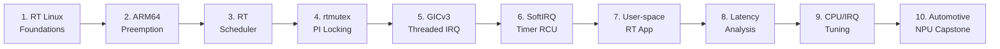
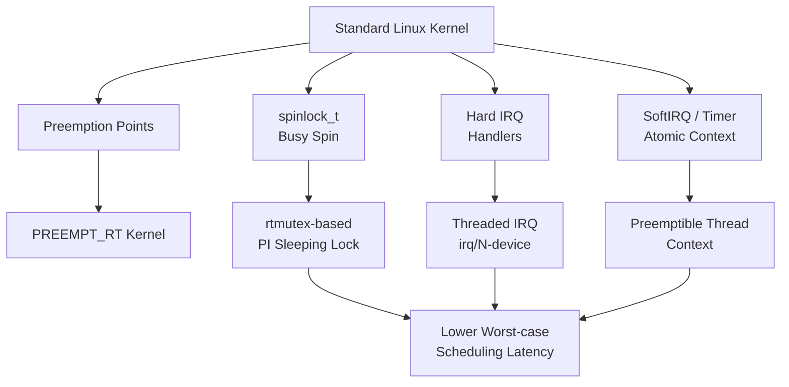
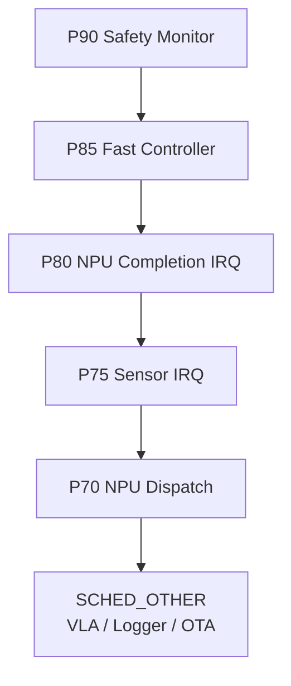
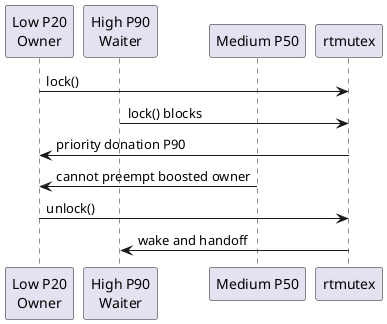
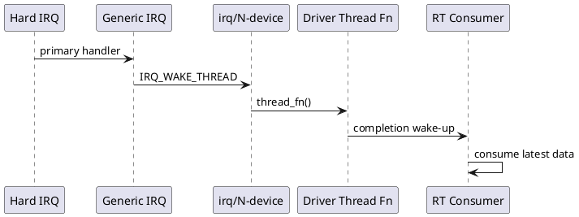
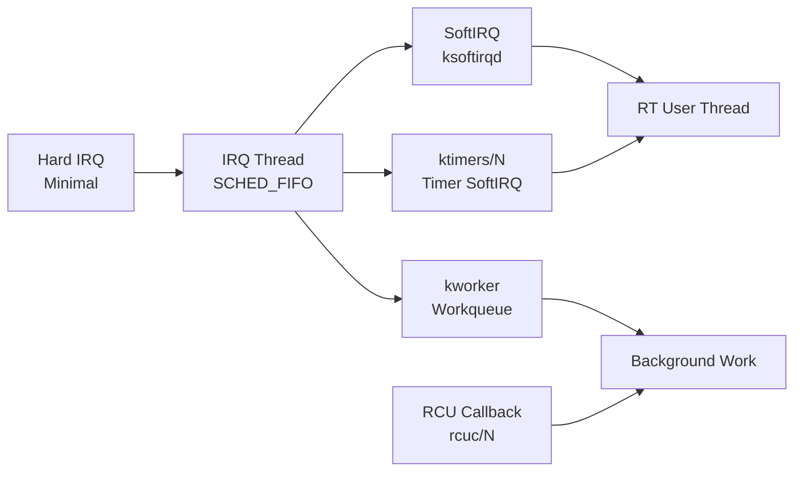
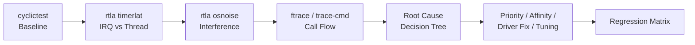
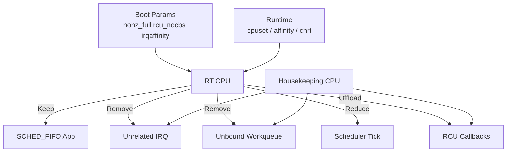
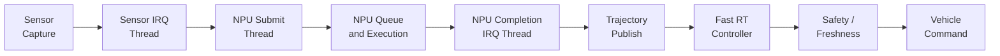

# PREEMPT_RT 통합 강의노트

## 1시간 요약 강의: QEMU ARM64 + Linux Kernel + Buildroot initramfs 기반

### 문서 정보

- 과정명: PREEMPT_RT 실전 10강 통합 요약
- 대상: Linux Kernel, Embedded BSP, Automotive SoC/NPU 시스템 소프트웨어 엔지니어
- 발표 시간: 약 60분
- 기준 Kernel: Linux v6.18, commit `7d0a66e4bb9081d75c82ec4957c50034cb0ea449`
- 실습 환경: QEMU ARM64 `virt`, GICv3, 4 vCPU, Buildroot initramfs
- 목적: 10강 전체를 하나의 end-to-end mental model로 재구성하고, Automotive NPU E2E/VLA pipeline에 적용하는 방법을 정리한다.

---

## 1. 전체 과정 지도



10강 과정은 단순히 `CONFIG_PREEMPT_RT=y`를 켜는 방법을 배우는 과정이 아니다. 목표는 **왜 RT latency가 생기는지, 그 latency가 Linux kernel의 어느 실행 문맥에서 발생하는지, 어떤 도구로 측정하고 어떤 설계로 줄일지**를 설명할 수 있는 수준까지 올라가는 것이다.

핵심 흐름은 다음과 같다.

```text
Real-Time 요구사항
    ↓
Kernel preemption과 scheduler
    ↓
Locking과 Priority Inheritance
    ↓
IRQ / SoftIRQ / Timer / RCU
    ↓
User-space RT application
    ↓
Measurement and tuning
    ↓
Automotive NPU pipeline integration
```

---

## 2. Real-Time은 빠른 것이 아니라 제시간에 실행되는 것이다

Real-Time system에서 중요한 것은 평균 속도가 아니라 **worst-case response time**이다.

```text
평균 wake-up latency = 30 us
최대 wake-up latency = 8 ms
```

위 시스템은 평균적으로는 빠르지만, 10 ms control loop에서 8 ms outlier가 발생하면 deadline budget을 크게 훼손할 수 있다.

중요 지표는 다음이다.

| 지표 | 의미 |
|---|---|
| Deadline | 처리 완료 또는 시작이 보장되어야 하는 시간 |
| Response Time | event 발생부터 처리 완료까지 |
| Scheduling Latency | runnable이 된 task가 실제 실행되기까지 |
| IRQ Latency | interrupt 발생부터 handler 시작까지 |
| Jitter | 주기적 실행 시점의 흔들림 |
| WCET | Worst-Case Execution Time |
| Deadline Miss | deadline을 지키지 못한 사건 |

---

## 3. PREEMPT_RT가 바꾸는 것



PREEMPT_RT의 핵심 변환은 다음 네 가지다.

1. 일반 `spinlock_t`를 priority inheritance가 가능한 rtmutex 기반 sleeping lock으로 바꾼다.
2. 대부분의 interrupt handler를 thread context로 옮긴다.
3. SoftIRQ, timer callback, RCU callback 등 deferred execution을 scheduler가 관리 가능한 문맥으로 이동한다.
4. 높은 priority RT task가 실행 가능해졌을 때 kernel 내부 경로 때문에 오래 기다리지 않도록 한다.

단, PREEMPT_RT가 모든 시간을 보장하는 것은 아니다. NPU 실행 시간, DRAM contention, IOMMU TLB miss, thermal throttling, firmware interrupt 등은 별도 설계와 측정이 필요하다.

---

## 4. ARM64 preemption과 scheduler gate

ARM64에서 high-priority task가 runnable이 되어도 실제 context switch는 다음 경로를 통해 일어난다.

```text
wake_up_process()
    ↓
try_to_wake_up()
    ↓
runqueue enqueue
    ↓
TIF_NEED_RESCHED set
    ↓
exception/syscall/IRQ return path
    ↓
preempt_schedule() or schedule()
    ↓
context_switch()
```

ARM64 관점에서 중요한 source-reading map은 다음이다.

| 주제 | Source path |
|---|---|
| Preempt count | `include/linux/preempt.h` |
| Scheduler core | `kernel/sched/core.c` |
| ARM64 entry | `arch/arm64/kernel/entry.S` |
| ARM64 entry common | `arch/arm64/kernel/entry-common.c` |
| Preemption Kconfig | `kernel/Kconfig.preempt` |

`PREEMPT_RT + preempt=full`과 `PREEMPT_RT + preempt=lazy`는 서로 비교해야 한다. RT task의 즉시 선점은 유지하면서, 일반 task의 kernel preemption 빈도를 줄여 throughput/cache locality를 개선할 수 있기 때문이다.

---

## 5. RT Scheduler와 priority architecture

PREEMPT_RT는 scheduler가 내린 결정을 더 빨리 실행 가능하게 만든다. 그러나 **어떤 task가 먼저 실행될지**는 scheduler policy가 결정한다.

| Policy | 의미 | 사용 예 |
|---|---|---|
| `SCHED_FIFO` | fixed priority, time slice 없음 | safety monitor, control loop |
| `SCHED_RR` | FIFO + same-priority round robin | 동급 worker |
| `SCHED_DEADLINE` | runtime/deadline/period 기반 | CPU budget이 명확한 periodic task |
| `SCHED_OTHER` | CFS 일반 task | logging, OTA, non-critical VLA |

Automotive NPU system의 priority 예는 다음이다.



중요한 점은 VLA reasoning을 가장 높은 priority로 두면 안 된다는 것이다. 긴 reasoning이나 token generation이 fast controller와 safety monitor의 실행을 방해할 수 있다.

---

## 6. rtmutex와 Priority Inheritance

Priority inversion은 다음 상황에서 발생한다.

```text
Low-priority task가 lock 보유
High-priority task가 같은 lock을 기다림
Medium-priority task가 Low task를 선점
High task는 Medium task 때문에 간접적으로 대기
```

Priority Inheritance는 lock owner의 effective priority를 waiter의 priority까지 올려 medium-priority interference를 줄인다.



PREEMPT_RT에서 locking 규칙은 다음처럼 정리할 수 있다.

| Lock | PREEMPT_RT에서의 의미 |
|---|---|
| `spinlock_t` | rtmutex 기반, contention 시 sleep 가능, PI 적용 가능 |
| `raw_spinlock_t` | 실제 spinlock 유지, 매우 짧은 atomic/core path에만 사용 |
| `mutex` | sleeping lock |
| `rtmutex` | PI locking 핵심 구현 |
| `local_lock_t` | per-CPU data 보호 범위 명시, RT에서 실제 lock 가능 |
| `semaphore` | owner가 없어 PI 불가, inversion 위험 |

---

## 7. Threaded IRQ와 GICv3

PREEMPT_RT는 대부분의 interrupt 처리 경로를 kernel thread로 옮긴다.



QEMU ARM64 `virt` 환경에서는 GICv3가 interrupt controller 역할을 한다.

```text
Device
    ↓
GICv3 Distributor / Redistributor
    ↓
ARM64 IRQ exception
    ↓
gic_handle_irq()
    ↓
generic_handle_domain_irq()
    ↓
irq_desc / irq_chip / flow handler
    ↓
primary handler
    ↓
irq/N-device thread
```

Driver에서 중요한 설계는 다음이다.

```text
Primary handler
    - IRQ source 확인
    - 최소 register read
    - 필요한 경우 line mask
    - IRQ_WAKE_THREAD 반환

Thread function
    - device status 처리
    - queue/fence/completion update
    - waitqueue 또는 eventfd signal
    - RT consumer wake-up
```

---

## 8. SoftIRQ, timer, workqueue, RCU

IRQ thread가 빨리 실행되어도 그 이후 deferred execution이 지연되면 RT consumer는 늦게 실행된다.



PREEMPT_RT에서 hrtimer는 기본적으로 soft context로 이동한다. 반드시 hard IRQ callback이 필요한 경우에만 `HRTIMER_MODE_HARD`를 명시한다.

Workqueue는 RT critical path가 아니라 cleanup, logging, statistics, deferred free 등에 사용한다.

RCU callback은 PREEMPT_RT에서 `rcuc/N` thread 경로로 이동한다. 높은 priority FIFO task가 CPU를 독점하면 RCU progress를 굶길 수 있으므로 housekeeping CPU와 priority 설계가 필요하다.

---

## 9. User-space RT application contract

PREEMPT_RT kernel 위에서도 user-space application이 다음을 지키지 않으면 tail latency가 발생한다.

```text
RT loop 내부에서 하지 말 것
    - malloc/free
    - printf/syslog/file I/O
    - blocking wait with unknown bound
    - relative sleep drift
    - first-touch page fault
    - lazy symbol resolution
```

권장 startup sequence는 다음이다.

```text
1. Capability / rlimit 확인
2. Memory allocation
3. mlockall(MCL_CURRENT | MCL_FUTURE)
4. Stack/heap prefault
5. Shared library warm-up
6. SCHED_FIFO policy 설정
7. CPU affinity 설정
8. Absolute periodic loop 시작
```

Periodic loop는 relative sleep이 아니라 absolute time을 사용한다.

```c
clock_gettime(CLOCK_MONOTONIC, &next);

while (running) {
    next = timespec_add_ns(next, period_ns);

    do_work_bounded();

    clock_nanosleep(CLOCK_MONOTONIC,
                    TIMER_ABSTIME,
                    &next,
                    NULL);
}
```

---

## 10. Latency 분석 도구



도구별 역할은 다음이다.

| 도구 | 역할 |
|---|---|
| `cyclictest` | 외부에서 관찰되는 timer wake-up latency baseline |
| `rtla timerlat` | timer IRQ latency와 thread wake-up latency 분리 |
| `rtla osnoise` | IRQ, SoftIRQ, thread 등 OS interference 측정 |
| `ftrace` | kernel call flow와 outlier window 분석 |
| `trace-cmd` | trace 수집과 host-side 분석 |

분석 순서:

```text
1. cyclictest로 baseline 확인
2. timerlat으로 IRQ latency vs thread latency 분리
3. osnoise로 interference source 분류
4. ftrace로 outlier window 내부 call path 추적
5. priority, affinity, lock, IRQ, workqueue, driver path 수정
6. 동일 matrix로 regression
```

---

## 11. CPU isolation과 IRQ affinity



4-vCPU QEMU 기준 예시는 다음이다.

```text
CPU0: Housekeeping
CPU1: Device IRQ threads
CPU2: RT controller and timerlat
CPU3: Background workload / stress
```

주요 설정:

```text
nohz_full=2
rcu_nocbs=2
irqaffinity=0-1,3
isolcpus=managed_irq,2
workqueue.unbound_cpus=0-1,3
```

Runtime에서는 다음도 확인한다.

```bash
cat /proc/irq/<IRQ>/smp_affinity_list
cat /proc/irq/<IRQ>/effective_affinity_list
ps -eLo pid,tid,psr,cls,rtprio,comm
cat /sys/devices/virtual/workqueue/cpumask
```

---

## 12. Automotive NPU E2E/VLA pipeline



VLA는 long-tail reasoning에 유용하지만 execution time variance가 크다. 따라서 VLA reasoning loop와 fast control loop를 분리한다.

```text
Slow loop
    VLA / E2E model
    scene understanding
    intent / trajectory chunk

Fast loop
    PREEMPT_RT controller
    100 Hz absolute loop
    freshness check
    bounded command generation
```

---

## 13. T0~T9 timestamp contract

```text
T0 : Sensor capture
T1 : Frame/DMA IRQ
T2 : NPU submit
T3 : NPU hardware start
T4 : NPU hardware complete
T5 : Completion IRQ thread
T6 : Trajectory publish
T7 : Controller start
T8 : Vehicle command
T9 : CAN/Ethernet transmission
```

주요 metric:

```text
Capture-to-submit          = T2 - T0
NPU queue + execution      = T4 - T2
Completion publication     = T6 - T4
Controller release latency = T7 - Expected Release
Observation-to-action      = T8 - T0
Command-path latency       = T9 - T8
```

Freshness 조건:

```text
Action Age = Controller Start - Sensor Capture

Remaining Horizon =
    Trajectory Horizon
  - Action Age
  - Safety Margin

Usable =
       before_deadline
    && action_age <= freshness_limit
    && remaining_horizon > 0
    && plausibility_ok
```

완료된 결과라도 stale이면 폐기해야 한다.

---

## 14. Capstone lab 구조

Basic backend:

```text
User submit
    ↓
Mock NPU driver
    ↓
hrtimer-based execution delay
    ↓
completion state update
    ↓
waitqueue wake-up
    ↓
user-space model thread
```

Advanced backend:

```text
Linux driver MMIO START
    ↓
QEMU virtual timer
    ↓
STATUS = DONE
    ↓
GICv3 SPI assert
    ↓
ARM64 IRQ exception
    ↓
irq/N-rt_npu thread
    ↓
completion publish
```

Fault matrix:

| Fault | 관찰할 증거 |
|---|---|
| NPU execution delay | `T4 - T3` 증가 |
| NPU queue delay | `T3 - T2` 증가 |
| Completion IRQ delay | `T5 - T4` 증가 |
| Controller wake-up delay | `T7 - T6` 증가 |
| Stale input | `T7 - T0` 증가 |
| Wrong affinity | `PSR`, `sched_switch`, affinity mismatch |
| Logging overload | worker 또는 console interference |

---

## 15. Debugging decision tree

```text
Observation-to-action spike
    ↓
IRQ latency가 큰가?
    ├─ Yes: IRQ-off, raw lock, firmware, vCPU preemption 확인
    └─ No
         ↓
Thread wake-up latency가 큰가?
    ├─ Yes: priority, affinity, CPU contention, RT throttling 확인
    └─ No
         ↓
NPU queue/execution이 큰가?
    ├─ Yes: firmware scheduler, model, memory bandwidth 확인
    └─ No
         ↓
Action Age가 큰가?
    ├─ Yes: stale buffering, publish policy, generation 관리 확인
    └─ No: clock correlation, trace overhead, measurement bug 확인
```

---

## 16. Source Reading Map

| 영역 | 주요 source path |
|---|---|
| Preemption model | `kernel/Kconfig.preempt`, `include/linux/preempt.h` |
| Scheduler core | `kernel/sched/core.c`, `kernel/sched/rt.c`, `kernel/sched/deadline.c` |
| ARM64 entry | `arch/arm64/kernel/entry.S`, `arch/arm64/kernel/entry-common.c` |
| rtmutex | `kernel/locking/rtmutex.c`, `kernel/locking/spinlock_rt.c` |
| IRQ core | `kernel/irq/manage.c`, `kernel/irq/handle.c` |
| GICv3 | `drivers/irqchip/irq-gic-v3.c` |
| SoftIRQ | `kernel/softirq.c` |
| hrtimer | `kernel/time/hrtimer.c` |
| Workqueue | `kernel/workqueue.c`, `Documentation/core-api/workqueue.rst` |
| RCU | `kernel/rcu/tree.c`, `kernel/rcu/tree_plugin.h` |
| CPU isolation | `kernel/sched/isolation.c`, `Documentation/admin-guide/cpu-isolation.rst` |
| Tracing | `kernel/trace/trace_osnoise.c`, `tools/tracing/rtla/` |

---

## 17. 1시간 발표 운영안

| 시간 | 주제 |
|---:|---|
| 0~5분 | 왜 PREEMPT_RT인가, Real-Time과 tail latency |
| 5~15분 | Kernel preemption, scheduler, rtmutex |
| 15~25분 | IRQ, SoftIRQ, timer, RCU 실행 문맥 |
| 25~35분 | User-space RT contract와 measurement toolchain |
| 35~45분 | CPU/IRQ isolation과 tuning profile |
| 45~55분 | Automotive NPU E2E/VLA capstone |
| 55~60분 | Debugging decision tree, quiz, 핵심 정리 |

---

## 18. 퀴즈

### 객관식

1. PREEMPT_RT의 주된 목적은 무엇인가?
   1. 평균 throughput 증가
   2. GPU/NPU 성능 향상
   3. kernel scheduling latency와 jitter의 worst-case 감소
   4. DRAM bandwidth 보장

2. PREEMPT_RT에서 일반 `spinlock_t`의 가장 중요한 변화는?
   1. 항상 interrupt를 끈다
   2. rtmutex 기반으로 sleeping 가능하고 PI를 제공할 수 있다
   3. user-space mutex가 된다
   4. 더 긴 busy spinning을 수행한다

3. `rtla timerlat`이 특히 유용한 이유는?
   1. NPU 실행시간을 자동으로 줄인다
   2. timer IRQ latency와 thread wake-up latency를 분리해 볼 수 있다
   3. 모든 interrupt를 제거한다
   4. scheduler policy를 자동 결정한다

4. VLA 기반 자율주행 pipeline에서 권장되는 구조는?
   1. VLA thread를 가장 높은 priority의 hard RT loop로 직접 실행
   2. VLA reasoning loop와 fast PREEMPT_RT controller를 분리
   3. Safety monitor를 SCHED_OTHER로 실행
   4. Stale result를 그대로 사용

### O/X

5. PREEMPT_RT를 적용하면 NPU hardware execution time의 worst-case가 자동으로 보장된다.  
6. `nohz_full`은 조건부로 periodic scheduler tick을 줄이는 기능이지 모든 interrupt를 제거하는 기능은 아니다.

### 단답형

7. Completion IRQ는 빠른데 controller가 늦게 실행될 때 확인할 세 가지 항목을 쓰시오.  
8. `mlockall()`과 prefault가 RT application에서 필요한 이유를 쓰시오.

### 시나리오형

9. `cyclictest` Max가 작지만 NPU pipeline의 `T8-T0`가 커졌다. 어떤 구간을 추가로 계측해야 하는가?  
10. Safety monitor P90, controller P85, NPU completion IRQ P80인 시스템에서 logging thread가 trajectory buffer lock을 오래 잡는다. 어떤 문제가 생기며 어떤 설계가 필요한가?

---

## 19. 정답과 해설

1. 정답: 3. PREEMPT_RT의 목표는 평균 성능보다 worst-case scheduling latency와 jitter 감소다.
2. 정답: 2. PREEMPT_RT에서 `spinlock_t`는 rtmutex 기반으로 바뀌며 PI를 제공할 수 있다. 정말 atomic해야 하는 짧은 구간은 `raw_spinlock_t`를 사용한다.
3. 정답: 2. `timerlat`은 timer interrupt 단계와 thread wake-up 단계를 분리하므로 원인 분석에 유용하다.
4. 정답: 2. VLA는 execution time variance가 크므로 slow reasoning loop와 fast RT control loop를 분리해야 한다.
5. 정답: X. NPU execution time은 NPU hardware, firmware scheduler, memory bandwidth 등에 의존한다.
6. 정답: O. `nohz_full`은 tick noise를 줄이지만 IRQ, IPI, syscall, exception을 제거하지 않는다.
7. 예시 정답: IRQ thread priority, CPU affinity/actual PSR, RT throttling, competing RT task, lock contention, workqueue/softirq backlog.
8. 예시 정답: RT loop 중 page fault와 memory reclaim을 피하고, 실행 중 처음 접근하는 stack/heap page로 인한 outlier를 줄이기 위해 필요하다.
9. 예시 정답: T0~T9 timestamp를 넣어 sensor age, NPU queue/execution, completion-to-publish, controller release latency를 분리한다.
10. 예시 정답: priority inversion 또는 긴 critical section으로 controller가 stale trajectory를 사용하거나 deadline miss가 발생할 수 있다. PI mutex, bounded critical section, lock-free/SPSC buffer, logging 경로 분리가 필요하다.

---

## 20. 5분 복습 질문

1. Real-Time에서 평균 latency보다 Max latency가 중요한 이유는?
2. PREEMPT_RT가 바꾸는 lock, IRQ, timer의 핵심 변화는?
3. `SCHED_FIFO`와 PREEMPT_RT는 어떤 관계인가?
4. `spinlock_t`와 `raw_spinlock_t`를 언제 구분해야 하는가?
5. IRQ thread priority를 올리면 항상 좋은가?
6. hrtimer callback이 RT에서 기본적으로 soft context로 이동하는 이유는?
7. user-space RT loop에서 `printf()`가 위험한 이유는?
8. `cyclictest`, `timerlat`, `osnoise`, ftrace의 역할 차이는?
9. CPU isolation에서 housekeeping CPU가 필요한 이유는?
10. VLA 결과가 정상 완료되었더라도 stale이면 버려야 하는 이유는?

---

## 21. 핵심 문장 5개

1. PREEMPT_RT는 Linux를 빠르게 만드는 기능이 아니라 Linux 실행 경로를 예측 가능하게 만드는 기능이다.
2. Scheduler policy는 “무엇을 먼저 실행할지”를 정하고, PREEMPT_RT는 “그 결정을 얼마나 빨리 반영할지”를 개선한다.
3. Priority Inheritance는 blocking을 없애지 않고, medium-priority interference를 제거해 blocking을 bounded critical section에 가깝게 만든다.
4. Measurement는 `cyclictest` 숫자 하나가 아니라 T0~T9 timestamp와 kernel trace correlation으로 수행해야 한다.
5. E2E/VLA 자율주행 모델은 PREEMPT_RT controller와 safety monitor가 freshness와 deadline을 통제해야 한다.

---

## 22. 실습 과제

1. 기존 QEMU ARM64 + Buildroot 환경에서 `PREEMPT_RT + preempt=full`과 `PREEMPT_RT + preempt=lazy`의 `cyclictest` 결과를 비교한다.
2. `rtla timerlat`과 `rtla osnoise`를 같은 부하 조건에서 실행하고, IRQ latency와 thread latency 중 어느 쪽이 dominant인지 기록한다.
3. CPU2를 RT domain으로 가정하고 IRQ affinity, workqueue cpumask, RT application affinity를 조정한 전후를 비교한다.
4. Capstone mock NPU에서 `T0~T9` timestamp를 CSV로 수집하고, stale output을 폐기하는 조건을 구현한다.

---

## 23. 마무리

PREEMPT_RT 학습의 최종 목표는 다음 질문에 답하는 것이다.

```text
왜 high-priority RT task가 늦게 실행되었는가?
```

답은 한 가지가 아니다.

```text
IRQ latency인가?
Thread wake-up latency인가?
Lock priority inversion인가?
SoftIRQ/Timer/RCU backlog인가?
CPU/IRQ affinity 문제인가?
NPU execution 자체가 늦은 것인가?
결과가 stale 상태인가?
```

이 질문에 source code, trace, timestamp, system configuration을 근거로 답할 수 있다면 PREEMPT_RT를 단순 설정이 아니라 제품 수준의 timing architecture로 활용할 수 있다.
