# PREEMPT_RT 10강 상세 강의노트

## Automotive NPU E2E/VLA Pipeline Capstone

> **과정명:** Linux Kernel PREEMPT_RT 10강  
> **이번 강의:** 10강. Automotive NPU E2E/VLA Pipeline Capstone  
> **대상:** Linux Kernel/BSP와 Embedded Linux 경험이 있는 중급 이상 엔지니어  
> **예상 시간:** 150~180분  
> **Linux 기준:** Linux v6.18, commit `7d0a66e4bb9081d75c82ec4957c50034cb0ea449`  
> **QEMU 기준:** ARM64 `virt`, GICv3, recent QEMU master API style를 사용한 adaptation scaffold  
> **실습:** QEMU ARM64 + Linux PREEMPT_RT + Buildroot initramfs

---

## 0. 이 강의의 목적

앞선 1~9강에서는 PREEMPT_RT의 구성 요소를 각각 분해해 학습했다. 이번 강의는 그 요소를 하나의 실제 시스템으로 다시 조립한다.

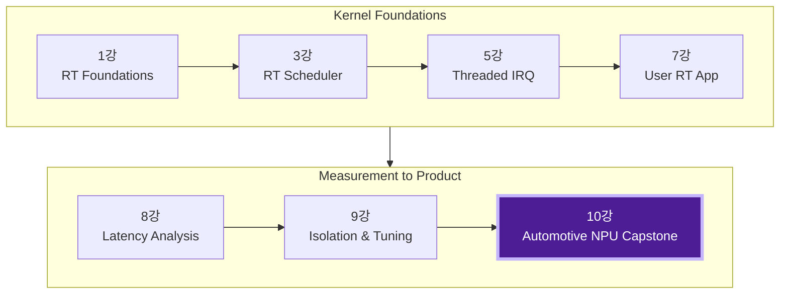

이번 Capstone의 목표는 NPU를 빠르게 실행하는 것이 아니라 다음 질문에 답하는 것이다.

1. 센서 관측 시점부터 차량 명령 전송까지의 deadline은 어떻게 정의하는가?
2. E2E 또는 VLA 모델의 실행시간이 흔들릴 때 빠른 제어 loop를 어떻게 보호하는가?
3. Linux의 IRQ, scheduler, hrtimer, user thread, buffer publication을 하나의 timing contract로 어떻게 연결하는가?
4. 늦게 끝난 모델 결과를 정상 결과로 취급하지 않고 어떻게 폐기하는가?
5. deadline miss를 재현하고, kernel trace와 application timestamp로 root cause를 어떻게 분리하는가?

### 핵심 문장

> **PREEMPT_RT는 모델의 수학적 추론을 실시간화하지 않는다. 모델을 둘러싼 센서 입력, NPU 제출/완료, trajectory publication, 빠른 제어와 fallback을 시간적으로 통제한다.**

---

# 1. 학습 목표

강의 후 다음을 수행할 수 있어야 한다.

- E2E/VLA 기반 자율주행 pipeline의 end-to-end timing budget 작성
- T0~T9 timestamp를 사용한 observation-to-action latency 측정
- `Action Age`, `Remaining Horizon`, absolute deadline을 이용한 freshness 판정
- slow model loop와 fast PREEMPT_RT controller를 분리한 multi-rate architecture 설계
- `SCHED_FIFO` priority와 CPU/IRQ affinity 설계
- hrtimer 기반 Mock NPU driver의 submit/completion UAPI 구현
- QEMU SysBus MMIO device와 GICv3 SPI를 이용한 advanced completion path 설명
- threaded IRQ에서 user-space wake-up까지 trace 수집
- NPU delay, stale input, completion loss, CPU contention fault injection
- deadline miss 시 degraded/fallback/MRM 상태 전환 설계

---

# 2. 가정과 범위

## 2.1 명시적 가정

- QEMU ARM64 `virt`, GICv3, 4 vCPU 환경이 이미 구축되어 있다.
- Linux kernel은 `CONFIG_PREEMPT_RT=y`로 구성할 수 있다.
- Buildroot initramfs에 `chrt`, `taskset`, `trace-cmd`, `rtla`를 추가할 수 있다.
- 실제 NPU hardware가 없어도 동일한 submit/completion contract를 실습한다.
- 최종 actuator arbitration과 safety mechanism은 독립 safety domain이 담당한다고 가정한다.

## 2.2 이번 실습이 증명하지 않는 것

- 실제 NPU의 WCET
- 실제 DRAM/NoC bandwidth 상한
- ISO 26262 ASIL 준수 또는 인증
- QEMU에서 측정한 절대 microsecond 값의 target hardware 보장
- VLA 모델의 의미론적 안전성

QEMU는 call-flow, priority interaction, fault handling, regression automation을 검증하는 도구이다. 제품의 worst-case latency bound는 실제 SoC에서 다시 검증해야 한다.

---

# 3. 전체 Architecture

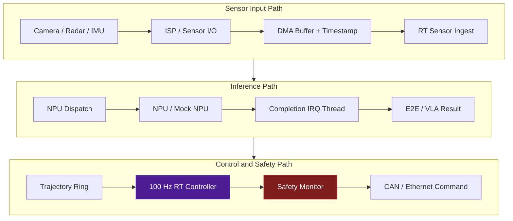

전체 pipeline은 세 영역으로 나눈다.

| 영역 | 주요 구성 | PREEMPT_RT 역할 |
|---|---|---|
| Sensor input | Camera/ISP, DMA buffer, timestamp, ingest | IRQ thread와 ingest wake-up의 tail latency 감소 |
| Inference | NPU dispatch, queue, execution, completion | CPU submission/completion path를 priority로 관리 |
| Control/safety | trajectory ring, controller, monitor, command TX | 고정 주기 release, freshness 검사, fallback 실행 |

## 3.1 E2E와 VLA의 역할 분리

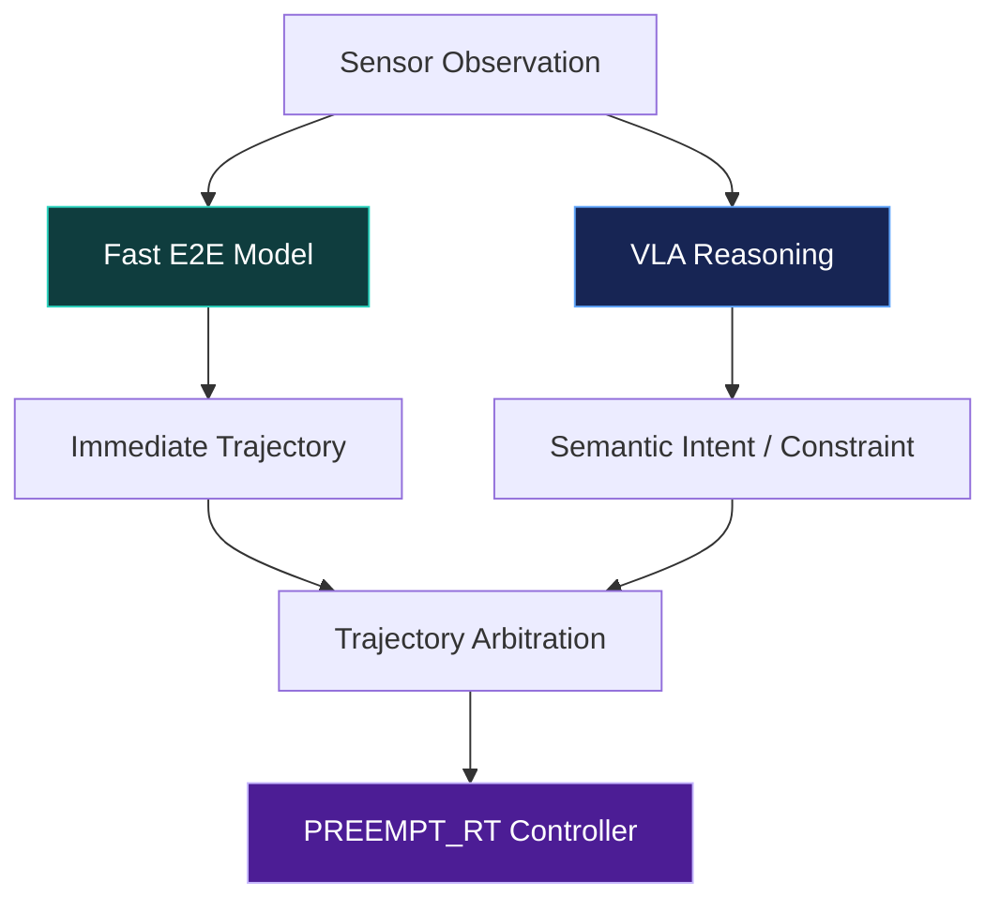

### E2E model

일반적으로 최신 sensor observation으로부터 trajectory 또는 waypoint를 빠르게 만든다. 비교적 일정한 frame loop를 갖도록 모델과 runtime을 고정할 수 있다.

### VLA model

시각 정보, language instruction, semantic context를 사용해 high-level intent 또는 constraint를 만든다. autoregressive reasoning, token generation, scene complexity 때문에 실행시간 변동이 더 커질 수 있다.

### 권장 구조

- Fast E2E: immediate trajectory
- VLA: semantic guidance, high-level maneuver, long-tail reasoning
- RT controller: 지금 이 순간의 state feedback을 사용한 trajectory tracking
- Safety monitor: freshness, plausibility, timeout, fallback

---

# 4. Multi-rate Loop

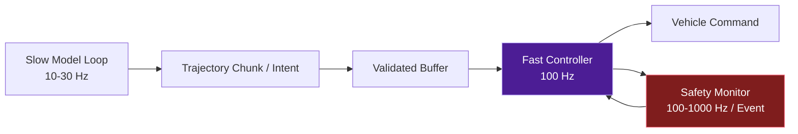

예시 주기는 설계 설명을 위한 값이며 제품 요구사항에 맞게 변경한다.

| Loop | 예시 주기 | Policy 예 | 역할 |
|---|---:|---|---|
| Safety monitor | 5ms 또는 event | FIFO P90 | timeout, stale, command envelope |
| Fast controller | 10ms | FIFO P85 | trajectory tracking, vehicle command |
| NPU completion IRQ | event | FIFO P80 | completion/fence/result wake-up |
| Sensor IRQ | event | FIFO P75 | frame completion 및 timestamp 전달 |
| NPU dispatch | frame | FIFO P70 | job submission |
| Fast E2E | 33ms | FIFO P50~60 또는 controlled worker | trajectory generation |
| VLA reasoning | 100ms 이상/비동기 | SCHED_OTHER 또는 제한된 RT | intent/semantic guidance |
| Logger/recording | 비동기 | SCHED_OTHER | I/O와 telemetry |

우선순위 숫자는 예시이다. 실제 결정에는 WCET와 response-time analysis가 필요하다.

---

# 5. End-to-End Timing Contract

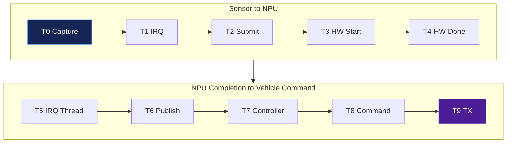

## 5.1 Timestamp 정의

| Timestamp | 의미 | 권장 clock |
|---|---|---|
| T0 | Sensor capture 또는 hardware timestamp | PTP/PHC 또는 monotonic correlation |
| T1 | Frame/DMA completion IRQ 처리 | `ktime_get_ns()` / trace clock |
| T2 | NPU job submit | `CLOCK_MONOTONIC` |
| T3 | NPU hardware start | hardware/firmware timestamp |
| T4 | NPU hardware complete | hardware/firmware timestamp |
| T5 | Linux completion IRQ thread start | kernel trace clock |
| T6 | Model output publish | `CLOCK_MONOTONIC` |
| T7 | RT controller cycle start | `CLOCK_MONOTONIC` |
| T8 | Command computation complete | `CLOCK_MONOTONIC` |
| T9 | CAN/Ethernet transmit | driver/hardware TX timestamp |

## 5.2 Latency decomposition

```text
T_total =
    T_sensor_to_irq
  + T_irq_to_submit
  + T_npu_queue
  + T_npu_execution
  + T_completion_irq
  + T_postprocess_publish
  + T_controller_release
  + T_command_tx
```

PREEMPT_RT가 주로 제어하는 영역:

```text
T_irq_to_submit
T_completion_irq의 CPU scheduling 부분
T_postprocess_publish의 CPU scheduling 부분
T_controller_release
T_command_tx의 CPU-side 부분
```

PREEMPT_RT만으로 제어하지 못하는 영역:

```text
NPU firmware queue
NPU execution
DRAM / NoC contention
DMA transfer
IOMMU TLB miss
Thermal throttling
Model-specific token count
```

---

# 6. Freshness: 완료된 결과가 항상 유효한 것은 아니다

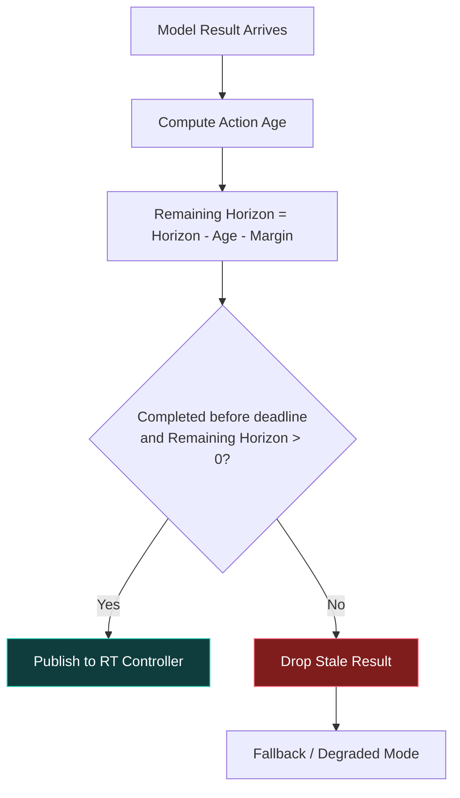

## 6.1 Action Age

```text
Action Age = Controller Start Time - Sensor Capture Time
```

모델이 deadline 안에 완료되었더라도 input queue에서 오래 기다렸다면 Action Age는 클 수 있다.

## 6.2 Remaining Horizon

trajectory가 미래 500ms를 제공한다고 가정한다.

```text
Remaining Horizon =
    Trajectory Horizon
  - Action Age
  - Safety Margin
```

조건:

```text
Result usable if:
    completion_time <= absolute_deadline
    AND action_age <= freshness_limit
    AND remaining_horizon > 0
    AND trajectory passes plausibility checks
```

## 6.3 늦은 결과 처리

- 결과를 publish하지 않는다.
- stale discard counter를 증가시킨다.
- 이전 trajectory의 남은 유효구간을 제한적으로 사용한다.
- 반복 miss이면 degraded/fallback으로 전환한다.
- 독립 safety monitor에 event를 전달한다.

---

# 7. 정상 동작 Sequence

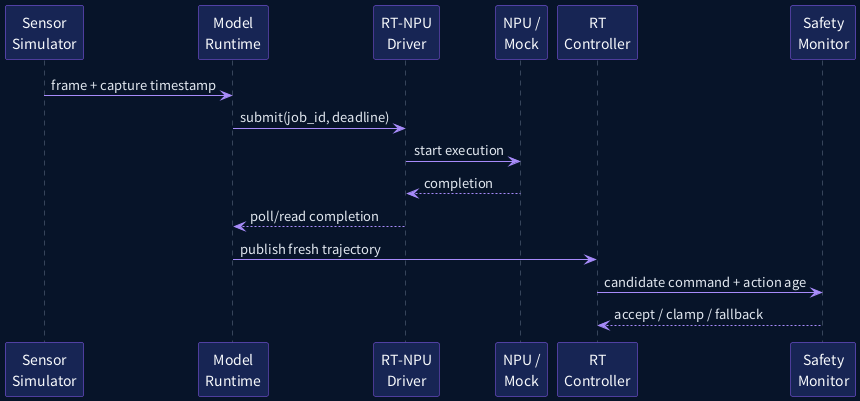

정상 경로의 중요한 계약은 다음과 같다.

1. Sensor frame은 capture timestamp와 sequence를 가진다.
2. Model runtime은 job에 absolute deadline을 붙인다.
3. Driver는 submission sequence와 completion timestamp를 기록한다.
4. Model runtime은 completion 후 freshness를 확인한다.
5. Controller는 latest **complete and valid** trajectory만 사용한다.
6. Safety monitor는 action age와 command envelope를 독립적으로 확인한다.

---

# 8. QEMU / Linux 실습 Topology

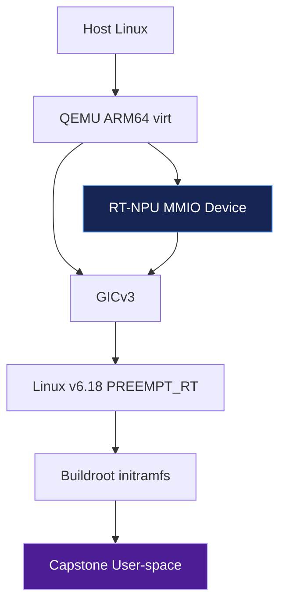

## 8.1 CPU partition 예

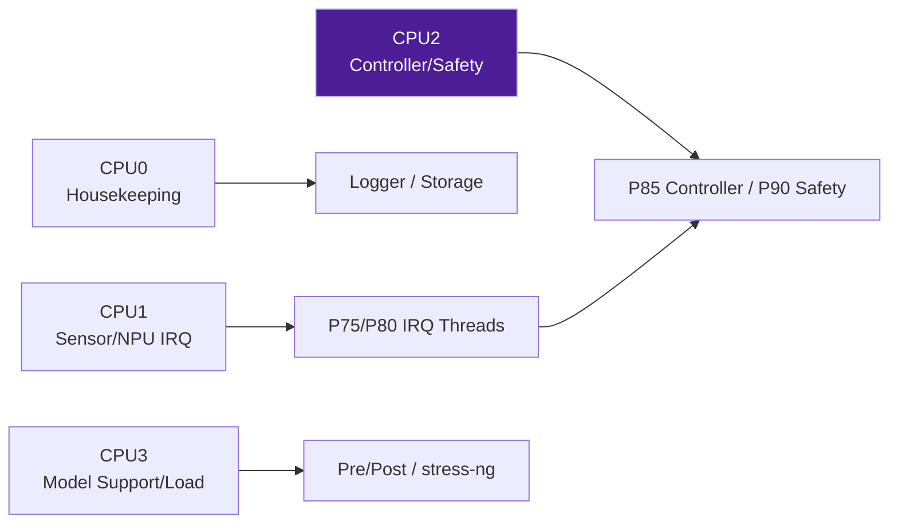

```text
CPU0: housekeeping
CPU1: sensor / NPU IRQ threads
CPU2: controller / safety
CPU3: model support and injected load
```

확인 명령:

```bash
ps -eLo pid,tid,psr,cls,rtprio,pri,comm
cat /proc/interrupts
cat /proc/irq/<IRQ>/effective_affinity_list
cat /sys/kernel/realtime
```

## 8.2 Boot/runtime tuning

```text
nohz_full=2
rcu_nocbs=2
irqaffinity=0-1,3
workqueue.unbound_cpus=0-1,3
```

이 옵션은 예시 profile이다. 정확한 효과는 kernel config, IRQ type, managed IRQ, workload에 따라 측정해야 한다.

---

# 9. Buffer Ownership와 Lifetime

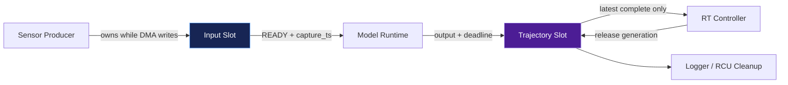

## 9.1 Ownership 원칙

- Sensor/ISP가 DMA를 수행하는 동안 input slot의 producer ownership을 유지한다.
- DMA completion과 cache synchronization이 끝난 뒤 READY generation을 publish한다.
- Model runtime은 immutable input generation을 참조한다.
- Trajectory slot은 write 완료 후 release-store로 generation을 publish한다.
- Controller는 acquire-load로 generation을 확인한 뒤 latest complete slot을 읽는다.
- Cleanup은 controller가 참조하지 않는 generation만 회수한다.

## 9.2 실제 DMA-BUF pipeline로 확장할 때

```text
Camera dma-buf
    -> attachment / sg_table
    -> NPU device IOVA
    -> input fence
    -> NPU output fence
    -> completion
```

주의:

- `dma_addr_t`는 CPU virtual address가 아니다.
- IOMMU가 cache coherency를 자동으로 보장하지 않는다.
- 동일 dma-buf라도 device별 IOVA가 다를 수 있다.
- RT thread가 무제한 fence wait를 수행해서는 안 된다.
- buffer allocation, mapping, command descriptor는 가능하면 RT loop 전에 준비한다.

---

# 10. 공통 UAPI와 두 개의 Backend

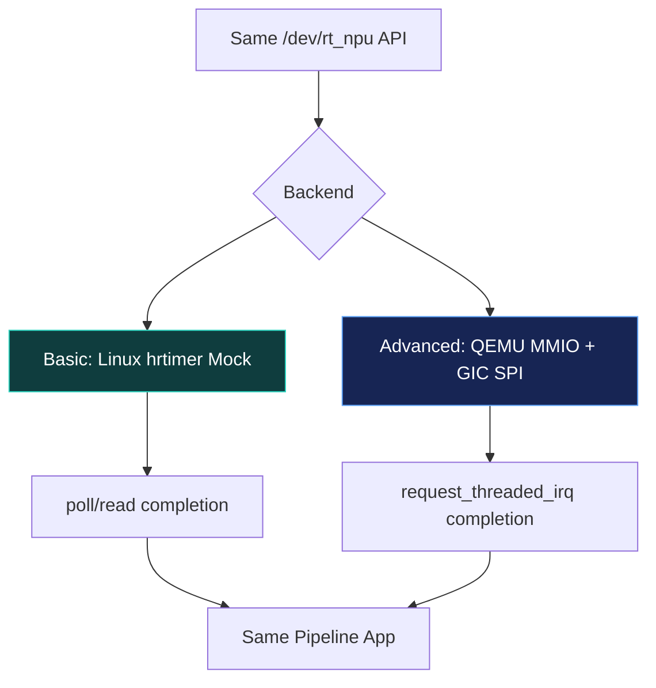

```c
struct rt_npu_submit {
    __u64 job_id;
    __u64 capture_ts_ns;
    __u64 absolute_deadline_ns;
    __u32 execution_us;
    __u32 flags;
};

struct rt_npu_completion {
    __u64 job_id;
    __u64 capture_ts_ns;
    __u64 submit_ts_ns;
    __u64 complete_ts_ns;
    __u64 absolute_deadline_ns;
    __u32 status;
};
```

파일:

```text
lab/include/rt_npu_uapi.h
```

### Basic backend

- `rt_npu_mock.ko`
- Linux hrtimer로 execution delay 모사
- `poll()`/`read()`로 completion 전달
- 빠르게 실습 가능
- GICv3 hardware IRQ path는 통과하지 않음

### Advanced backend

- QEMU SysBus MMIO device
- QEMU virtual timer로 NPU execution 모사
- level SPI를 GICv3에 assert
- Linux platform driver가 `request_threaded_irq()` 사용
- 실제 ARM64 exception/GIC/generic IRQ path 확인

---

# 11. Linux Driver Architecture

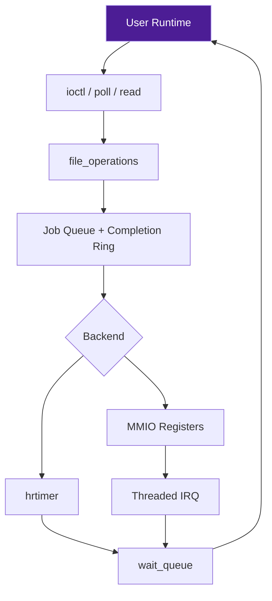

## 11.1 Submit path

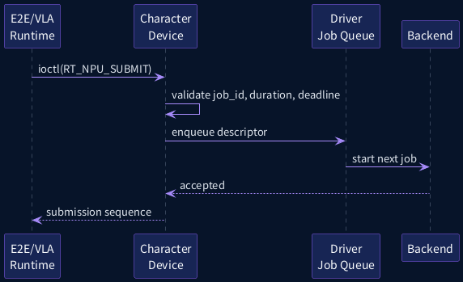

### Driver 검증 항목

- `execution_us != 0`
- job ID와 generation의 monotonicity
- deadline이 capture timestamp보다 뒤인지 확인
- queue depth 제한
- busy 상태의 중복 submit 처리
- timeout/reset 동시성
- teardown 중 신규 submit 차단

## 11.2 Basic hrtimer backend

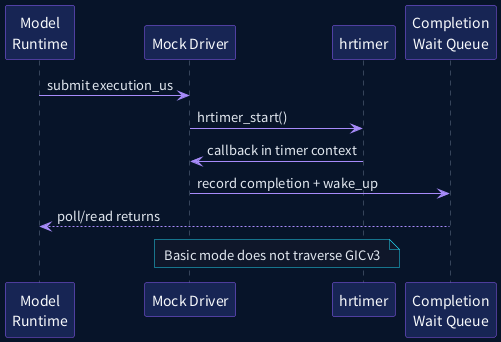

핵심 source:

```text
lab/kernel/rt_npu_mock.c
```

```c
hrtimer_setup(&mock.timer,
              rt_npu_timer_fn,
              CLOCK_MONOTONIC,
              HRTIMER_MODE_REL);

hrtimer_start(&mock.timer,
              ns_to_ktime(delay_ns),
              HRTIMER_MODE_REL);
```

PREEMPT_RT에서는 명시적으로 HARD를 지정하지 않은 hrtimer가 soft timer path로 이동할 수 있다. 따라서 이 backend는 scheduler와 timer thread의 영향을 실습하기 좋다.

## 11.3 Completion read/poll contract

```text
submit ioctl
    -> backend starts
    -> completion record created
    -> waitqueue wake-up
    -> poll returns readable
    -> read consumes one completion
```

생산 환경에서는 multi-client, queue depth, cancel, per-context isolation, eventfd/fence integration을 별도로 설계해야 한다.

---

# 12. Advanced QEMU RT-NPU Device

## 12.1 Register map

| Offset | Register | R/W | 의미 |
|---:|---|---|---|
| `0x00` | COMMAND | W | START, RESET |
| `0x04` | EXEC_TIME_US | R/W | virtual execution time |
| `0x08` | STATUS | R | BUSY, DONE, ERROR |
| `0x0c` | IRQ_ACK | W | completion IRQ clear |
| `0x10` | JOB_ID_LO | R/W | job ID low |
| `0x14` | JOB_ID_HI | R/W | job ID high |
| `0x18` | COMPLETE_TS_LO | R | virtual completion time low |
| `0x1c` | COMPLETE_TS_HI | R | virtual completion time high |

## 12.2 Device state machine

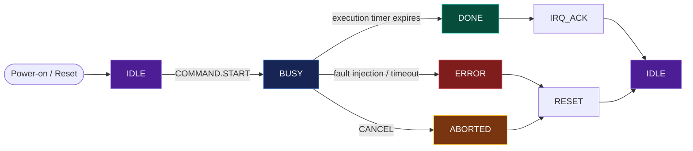

## 12.3 QEMU MMIO and IRQ sequence

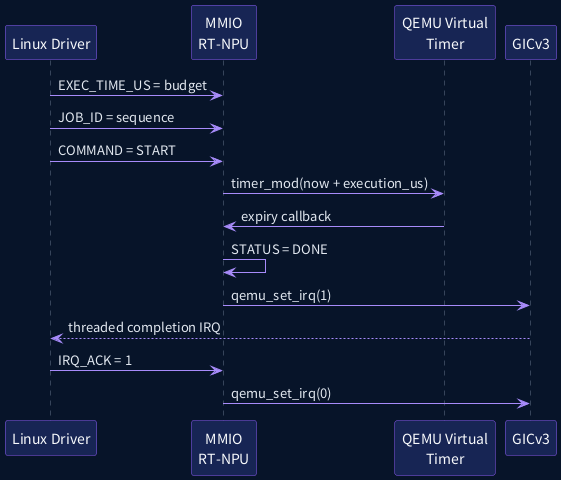

QEMU source-reading map:

```text
hw/timer/cmsdk-apb-timer.c
    MemoryRegionOps
    sysbus_init_mmio()
    sysbus_init_irq()
    timer callback
    qemu_set_irq()

hw/misc/edu.c
    timer-driven completion
    status / IRQ state
```

Capstone scaffold:

```text
lab/qemu/hw/misc/rt-npu.c
lab/qemu/include/hw/misc/rt-npu.h
lab/qemu/rt-npu-qemu.patch
lab/dts/rt-npu.dtsi
```

`rt-npu-qemu.patch`는 exact QEMU revision에 맞춰 MMIO range, SPI, FDT wiring context를 수정하는 adaptation scaffold이다.

---

# 13. Threaded Completion IRQ

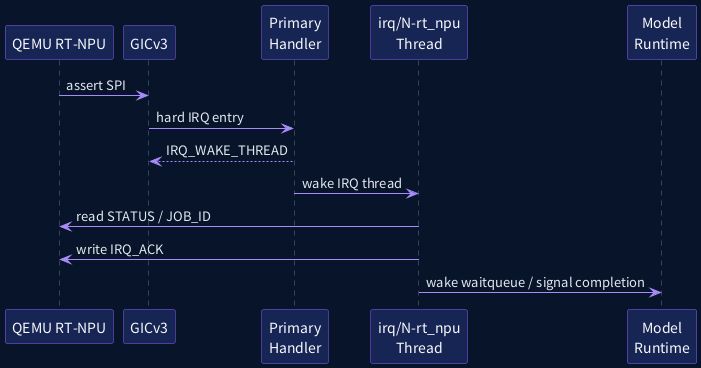

Driver API:

```c
ret = devm_request_threaded_irq(&pdev->dev,
                                d->irq,
                                rt_npu_irq_primary,
                                rt_npu_irq_thread,
                                IRQF_ONESHOT,
                                dev_name(&pdev->dev),
                                d);
```

### Primary handler

- status source 확인
- `IRQ_NONE` 또는 `IRQ_WAKE_THREAD` 반환
- sleeping lock, allocation, long polling 금지

### Thread function

- STATUS와 JOB_ID 읽기
- completion timestamp 확보
- IRQ_ACK 기록
- output fence/job state 갱신
- waitqueue 또는 eventfd wake-up

### Priority 설계

NPU completion IRQ를 controller보다 무조건 높게 설정하지 않는다.

```text
Safety P90
Controller P85
NPU Completion IRQ P80
Sensor IRQ P75
Dispatch P70
```

Completion thread가 너무 높고 callback이 길면 controller를 지연시킨다. 너무 낮으면 계산이 끝난 결과를 늦게 publish한다. `completion WCET + controller deadline`을 함께 분석해야 한다.

---

# 14. E2E/VLA Runtime Integration

## 14.1 VLA slow loop와 RT fast loop

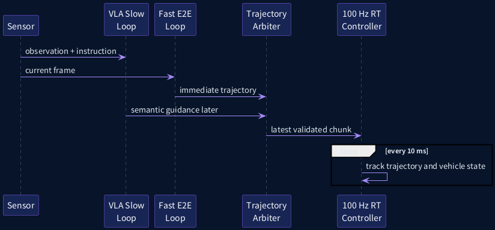

## 14.2 Hybrid architecture

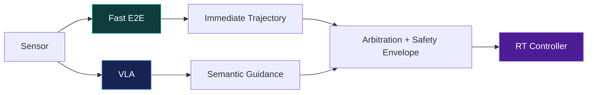

### 결과 publication rule

```text
write trajectory fields
    -> release store generation
controller acquire-load generation
    -> read consistent fields
```

실습은 mutex로 단순화했지만, 제품에서는 fixed-size SPSC ring, sequence counter, versioned snapshot을 고려할 수 있다.

### VLA timeout rule

- maximum reasoning tokens
- maximum queue wait
- maximum total inference time
- maximum action age
- cancel 또는 ignore-late-result policy

NPU hardware/firmware가 cancel을 지원하지 않더라도, deadline 이후 결과를 application publication path에서 폐기할 수 있어야 한다.

---

# 15. User-space Capstone Application

파일:

```text
lab/userspace/rt_pipeline_demo.c
lab/include/spsc_ring.h
```

Thread 구성:

```text
Sensor thread
    30 Hz absolute loop
    frame sequence + capture timestamp

Model thread
    frame consume
    NPU submit / completion wait
    trajectory publish

Controller thread
    100 Hz absolute loop
    action age / deadline / remaining horizon
    fallback decision

Safety thread
    5 ms monitor
    NORMAL / DEGRADED / FALLBACK / MRM
```

### 실습 명령

```bash
./rt_pipeline_demo     --device /dev/rt_npu_mock     --duration 30     --npu-us 20000     --model-cpu 3     --controller-cpu 2     --safety-cpu 2     --csv normal.csv
```

Device 없이 user-space structure만 확인:

```bash
./rt_pipeline_demo     --device none     --duration 10     --npu-us 20000     --csv software.csv
```

---

# 16. Absolute Periodic Controller

```c
uint64_t next = now_ns() + period_ns;

while (!stop) {
    sleep_until(next);
    run_controller_cycle();
    next += period_ns;

    while (next <= now_ns())
        next += period_ns;
}
```

왜 relative sleep이 아닌가?

```text
relative:
next release = previous finish + period
    -> execution jitter가 phase drift로 누적

absolute:
next release = fixed phase + N * period
    -> miss 이후에도 phase contract 유지 가능
```

---

# 17. Safety State Machine

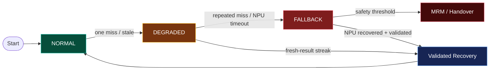

## 17.1 상태 예

| 상태 | 조건 | 동작 |
|---|---|---|
| NORMAL | fresh result 연속 | 정상 trajectory tracking |
| DEGRADED | 단발 miss/stale | speed/command rate 제한 |
| FALLBACK | 반복 miss/NPU timeout | fallback planner/controller |
| MRM | 안전 임계 초과 | minimal-risk maneuver 또는 handover |

## 17.2 중요한 원칙

- miss count만 보지 않고 miss 간격과 지속시간을 본다.
- 이전 trajectory 유지시간에는 상한을 둔다.
- command continuity와 maximum change rate를 제한한다.
- model output은 final actuator command가 아니라 candidate다.
- 독립 safety domain이 plausibility와 final arbitration을 수행해야 한다.

---

# 18. Fault Injection

```plantuml
@startuml
skinparam backgroundColor #071429
skinparam defaultFontName "Noto Sans CJK KR"
skinparam defaultFontColor #E2E8F0
skinparam sequenceArrowColor #A78BFA
skinparam sequenceLifeLineBorderColor #64748B
skinparam sequenceLifeLineBackgroundColor #0F172A
skinparam participantBorderColor #8B5CF6
skinparam participantBackgroundColor #172554
skinparam participantFontColor #F8FAFC
skinparam noteBackgroundColor #0F172A
skinparam noteBorderColor #22D3EE
skinparam noteFontColor #E2E8F0
skinparam shadowing false
skinparam responseMessageBelowArrow true
participant "Test Harness" as TEST
participant "Sensor" as S
participant "Mock NPU" as NPU
participant "IRQ Thread" as IRQ
participant "Controller" as CTRL
TEST -> NPU: inject execution delay
TEST -> IRQ: inject completion handling delay
TEST -> S: inject old capture timestamp
TEST -> CTRL: add competing CPU load
NPU --> IRQ: late completion
IRQ --> CTRL: result publication
CTRL -> CTRL: count miss and select fallback
@enduml
```

## 18.1 Fault matrix

| Fault | Injection | 기대 관찰 |
|---|---|---|
| NPU slow | `--npu-us 70000` | near-deadline, action age 증가 |
| NPU timeout | `--npu-us 180000` | poll timeout, fallback 증가 |
| Stale sensor | `--inject-stale-ms 200` | stale discard, degraded/fallback |
| Completion drop | mock `drop_every_n` | model timeout, miss streak |
| CPU contention | CPU2 background FIFO/CPU load | controller thread latency 증가 |
| IRQ affinity error | NPU IRQ를 CPU2에 함께 배치 | IRQ/controller interference |
| Network burst | virtio-net burst | NET_RX/ksoftirqd interference |
| Logging overload | console/file I/O hot path | tail latency 증가 |

### 실행

```bash
DURATION=15 ./scripts/06_run_fault_matrix.sh
```

---

# 19. Stale Result Sequence

```plantuml
@startuml
skinparam backgroundColor #071429
skinparam defaultFontName "Noto Sans CJK KR"
skinparam defaultFontColor #E2E8F0
skinparam sequenceArrowColor #A78BFA
skinparam sequenceLifeLineBorderColor #64748B
skinparam sequenceLifeLineBackgroundColor #0F172A
skinparam participantBorderColor #8B5CF6
skinparam participantBackgroundColor #172554
skinparam participantFontColor #F8FAFC
skinparam noteBackgroundColor #0F172A
skinparam noteBorderColor #22D3EE
skinparam noteFontColor #E2E8F0
skinparam shadowing false
skinparam responseMessageBelowArrow true
participant "NPU Runtime" as NPU
participant "Result\nValidator" as VAL
participant "RT Controller" as CTRL
participant "Safety\nMonitor" as SAFE
NPU -> VAL: result(capture_ts, completion_ts)
VAL -> VAL: compute action age and remaining horizon
alt fresh and before deadline
  VAL -> CTRL: publish trajectory
else stale or late
  VAL -> VAL: discard result
  VAL -> SAFE: deadline miss / stale event
  SAFE -> CTRL: fallback trajectory or degraded command
end
@enduml
```

Stale result는 모델 계산이 실패한 것이 아니다. 계산 자체는 정상 종료했지만 물리 세계의 현재 상태를 대표할 수 없기 때문에 폐기된다.

```text
Success at computation layer
    != Success at control layer
```

---

# 20. Tracing Strategy

```plantuml
@startuml
skinparam backgroundColor #071429
skinparam defaultFontName "Noto Sans CJK KR"
skinparam defaultFontColor #E2E8F0
skinparam sequenceArrowColor #A78BFA
skinparam sequenceLifeLineBorderColor #64748B
skinparam sequenceLifeLineBackgroundColor #0F172A
skinparam participantBorderColor #8B5CF6
skinparam participantBackgroundColor #172554
skinparam participantFontColor #F8FAFC
skinparam noteBackgroundColor #0F172A
skinparam noteBorderColor #22D3EE
skinparam noteFontColor #E2E8F0
skinparam shadowing false
skinparam responseMessageBelowArrow true
participant "Test Script" as TEST
participant "trace-cmd /\nftrace" as TRACE
participant "Pipeline" as PIPE
participant "CSV Metrics" as CSV
participant "Analyzer" as AN
TEST -> TRACE: enable IRQ, sched, timer events
TEST -> PIPE: run baseline or tuned profile
PIPE -> CSV: T0..T9 and miss counters
TRACE --> TEST: trace.dat
CSV --> AN: end-to-end samples
TEST -> AN: trace.dat + system inventory
AN --> TEST: root-cause classification
@enduml
```

## 20.1 Kernel tracepoint

```text
irq:irq_handler_entry
irq:irq_handler_exit
sched:sched_wakeup
sched:sched_switch
sched:sched_migrate_task
timer:hrtimer_start
timer:hrtimer_expire_entry
timer:hrtimer_expire_exit
```

## 20.2 Application timestamp

CSV columns:

```text
cycle
expected_ns
start_ns
release_latency_ns
capture_ts_ns
completion_ts_ns
action_age_ns
safety_state
fallback
```

## 20.3 Root-cause correlation

```text
Application action_age spike
    -> find T5/T7 window
    -> check IRQ thread wake-up
    -> check sched_switch
    -> check NPU execution timestamp
    -> classify kernel vs accelerator vs publication
```

---

# 21. cyclictest와 rtla의 역할

`cyclictest`는 platform의 timer wake-up baseline과 regression을 제공한다. 하지만 capstone pipeline의 실제 sensor/NPU path는 application timestamp가 필요하다.

```text
cyclictest
    -> general periodic wake-up capability

rtla timerlat
    -> timer IRQ latency vs RT thread latency

rtla osnoise
    -> IRQ, softirq, thread interference

pipeline CSV + trace-cmd
    -> observation-to-action path
```

권장 순서:

1. cyclictest/rtla baseline을 먼저 통과
2. Mock NPU basic pipeline
3. mixed load와 fault matrix
4. QEMU MMIO/GIC advanced path
5. target SoC에서 동일 timestamp contract 적용

---

# 22. Experiment Matrix

| Run | Kernel/Profile | Backend | Load | Fault | 주요 목적 |
|---|---|---|---|---|---|
| A | PREEMPT_FULL | hrtimer mock | idle | none | non-RT baseline |
| B | PREEMPT_RT full | hrtimer mock | idle | none | RT baseline |
| C | PREEMPT_RT full | hrtimer mock | mixed | none | tuning 전 |
| D | PREEMPT_RT tuned | hrtimer mock | mixed | none | CPU/IRQ partition 효과 |
| E | PREEMPT_RT tuned | hrtimer mock | mixed | NPU slow/stale | fallback 검증 |
| F | PREEMPT_RT tuned | QEMU MMIO/GIC | mixed | none | actual IRQ path |
| G | PREEMPT_RT lazy | QEMU MMIO/GIC | mixed | none | full/lazy 비교 |

각 run은 다음을 함께 보존한다.

```text
Kernel config
Kernel command line
CPU affinity
IRQ affinity and effective affinity
Task priority
Trace data
Application CSV
Fault configuration
Host QEMU load
```

---

# 23. Debugging Decision Tree

```mermaid
flowchart LR
    S["Observation-to-action Spike"] --> I{"IRQ latency high?"}
    I -->|"Yes"| A["IRQ-off / raw lock / firmware / host-vCPU noise"]
    I -->|"No"| T{"IRQ-thread or controller wake-up high?"}
    T -->|"Yes"| B["Priority / affinity / CPU competition / RT throttle"]
    T -->|"No"| N{"NPU queue or execution high?"}
    N -->|"Yes"| C["Firmware queue / model / DRAM-NoC bandwidth"]
    N -->|"No"| F{"Action Age high?"}
    F -->|"Yes"| D["Stale buffering / postprocess / publication"]
    F -->|"No"| E["Verify timestamp clock domains and trace overhead"]

    style S fill:#4C1D95,stroke:#C4B5FD,color:#FFFFFF
    style A fill:#7F1D1D,stroke:#FB7185,color:#FFFFFF
    style B fill:#172554,stroke:#60A5FA,color:#FFFFFF
    style C fill:#78350F,stroke:#FBBF24,color:#FFFFFF
    style D fill:#064E3B,stroke:#2DD4BF,color:#FFFFFF
```

## 23.1 Debug checklist

### IRQ 단계

- `/proc/interrupts` counter가 증가하는가?
- GIC SPI와 Linux virq를 혼동하지 않았는가?
- `effective_affinity_list`가 원하는 CPU인가?
- IRQ thread가 생성되었는가?
- `IRQF_ONESHOT`으로 line storm을 막았는가?
- primary handler가 길지 않은가?

### Driver 단계

- job ID가 completion과 일치하는가?
- STATUS clear와 IRQ ACK ordering이 올바른가?
- completion timestamp clock domain이 일치하는가?
- queue depth가 bounded인가?
- timeout/reset 중 use-after-free가 없는가?
- teardown에서 `synchronize_irq()`를 호출하는가?

### User-space 단계

- memory를 prefault/mlock했는가?
- controller가 absolute periodic sleep을 사용하는가?
- RT loop에서 logging/I/O/allocation을 하지 않는가?
- stale output을 publish하지 않는가?
- mutex critical section이 bounded인가?
- model thread priority가 controller보다 높지 않은가?

### System 단계

- RT CPU에 unrelated IRQ가 들어오는가?
- `ksoftirqd`, `ktimers`, `rcuc`, `kworker`가 RT CPU를 간섭하는가?
- RT throttling이 예상치 않게 동작하는가?
- console logging이 tail latency를 증가시키는가?
- QEMU host가 vCPU를 preempt했는가?

---

# 24. Automotive Safety 관점

PREEMPT_RT는 safety certification 자체가 아니다. 다음 safety mechanism이 별도로 필요하다.

```text
Independent watchdog
Command plausibility check
Sensor/model timeout monitor
Freedom from interference analysis
Fallback controller
Minimal risk maneuver
Fault containment region
Traceable safety requirements
Target hardware worst-case validation
```

## Safety envelope 예

```text
Candidate command
    -> steering rate limit
    -> acceleration/deceleration limit
    -> vehicle-state consistency
    -> collision boundary
    -> actuator availability
    -> final arbitration
```

Linux PREEMPT_RT domain이 hang하더라도 독립 safety MCU/RTOS가 timeout을 감지하고 safe action을 수행하는 구조가 권장된다.

---

# 25. 성능/동기화/Memory 고려사항

- NPU submission descriptor를 사전 할당한다.
- DMA buffer mapping을 RT loop 밖에서 준비한다.
- queue depth와 wait timeout을 bounded하게 만든다.
- `spinlock_t`와 `raw_spinlock_t`의 RT 의미를 구분한다.
- hard IRQ handler에서는 allocation과 logging을 피한다.
- completion thread에서 긴 postprocess를 수행하지 않는다.
- shared memory publication에 release/acquire ordering을 사용한다.
- output generation과 capture timestamp를 함께 publish한다.
- memory bandwidth와 cache contention은 별도 QoS/measurement가 필요하다.

---

# 26. 실습 절차

## Step 1. Source build

```bash
./scripts/02_build_userspace.sh

KDIR=/path/to/linux-v6.18-build ARCH=arm64 CROSS_COMPILE=aarch64-linux-gnu- ./scripts/03_build_kernel_modules.sh
```

## Step 2. Basic Mock NPU

```bash
./scripts/04_run_basic_mock.sh
```

## Step 3. Fault matrix

```bash
DURATION=15 ./scripts/06_run_fault_matrix.sh
```

## Step 4. Trace

```bash
OUT=pipeline-trace.dat DURATION=20 ./scripts/07_trace_pipeline.sh
```

## Step 5. Advanced QEMU

```bash
QEMU_SRC=/path/to/qemu ./scripts/09_build_qemu_device.sh
```

`rt-npu-qemu.patch`를 exact QEMU revision에 맞게 적용한 뒤 QEMU를 빌드한다.

## Step 6. Report collection

```bash
./scripts/08_collect_report.sh capstone-report
```

---

# 27. Expected Findings

## 정상 run

```text
NPU completion before 80ms deadline
Action age below 150ms
Remaining horizon positive
Safety state mostly NORMAL
Fallback count near zero after warm-up
```

## stale injection

```text
NPU computation may complete normally
Action age exceeds limit
Result is discarded
Safety state moves DEGRADED/FALLBACK
Controller continues bounded fallback behavior
```

## CPU contention

```text
NPU execution timestamp may remain stable
Controller release latency increases
rtla Thread latency and sched trace show competition
Root cause = CPU scheduling, not NPU execution
```

---

# 28. 핵심 요약

1. 모델 execution completion과 control validity를 분리한다.
2. 모든 result에 capture timestamp, deadline, completion timestamp를 포함한다.
3. VLA slow loop와 100Hz fast controller를 분리한다.
4. controller와 safety monitor가 model보다 높은 timing authority를 가진다.
5. PREEMPT_RT는 IRQ와 CPU scheduling path를 제어하지만 NPU WCET를 보장하지 않는다.
6. late result는 정상 계산 결과라도 stale이면 폐기한다.
7. hrtimer mock과 QEMU MMIO/GIC backend가 같은 UAPI를 사용한다.
8. trace와 application timestamp를 결합해야 root cause를 분리할 수 있다.
9. QEMU는 구조/회귀 검증용이며 target SoC 검증을 대체하지 않는다.
10. fallback은 예외 처리가 아니라 timing architecture의 정상 구성요소다.

---

# 29. Quiz 10문항

## 객관식

### Q1
PREEMPT_RT가 직접 줄이지 못하는 시간은 무엇인가?

A. IRQ thread scheduling latency  
B. RT controller wake-up latency  
C. NPU matrix execution time  
D. lock priority inversion

### Q2
VLA 기반 주행 시스템에 가장 적합한 구조는?

A. VLA를 최고 priority 1kHz control loop에 직접 연결  
B. VLA slow loop와 PREEMPT_RT fast controller 분리  
C. 모든 thread를 SCHED_FIFO 99로 설정  
D. late VLA 결과를 항상 즉시 적용

### Q3
`Remaining Horizon` 계산에 필요한 항목이 아닌 것은?

A. trajectory horizon  
B. action age  
C. safety margin  
D. Linux virq 번호

### Q4
Basic hrtimer Mock backend와 Advanced QEMU backend의 가장 중요한 차이는?

A. UAPI 구조체가 다르다  
B. Basic backend만 deadline을 사용한다  
C. Advanced backend가 GICv3/ARM64 IRQ path를 통과한다  
D. Advanced backend에서는 user-space가 필요 없다

## O/X

### Q5
NPU가 deadline 전에 연산을 끝냈다면 해당 result는 언제나 control에 사용할 수 있다. (O/X)

### Q6
`IRQF_ONESHOT`은 threaded handler가 끝날 때까지 interrupt line을 masked 상태로 유지하는 데 사용될 수 있다. (O/X)

## 단답형

### Q7
Sensor capture부터 command까지의 최신성을 나타내는 대표 metric 이름을 하나 쓰시오.

### Q8
PREEMPT_RT에서 safety monitor와 controller보다 VLA reasoning thread를 낮게 배치하는 이유를 한 문장으로 쓰시오.

## 시나리오/디버깅

### Q9
NPU hardware timestamp의 실행시간은 일정하지만 `T5 -> T7`이 간헐적으로 8ms 증가한다. 먼저 확인할 두 가지 kernel 관찰 지점을 쓰시오.

### Q10
200ms 오래된 sensor timestamp를 사용한 trajectory가 정상 completion으로 도착했다. controller가 수행해야 할 처리 순서를 쓰시오.

---

# 30. Quiz 정답과 해설

### A1. C

PREEMPT_RT는 CPU-side IRQ, scheduler, lock latency를 개선한다. NPU matrix execution은 accelerator hardware, firmware, model, memory bandwidth에 의해 결정된다.

### A2. B

VLA 실행시간은 reasoning 길이와 scene complexity에 따라 변동할 수 있다. slow deliberative loop와 bounded fast controller를 분리해야 한다.

### A3. D

`Remaining Horizon = trajectory horizon - action age - safety margin`이다. virq 번호는 interrupt 식별에 필요하지만 freshness 계산 항목은 아니다.

### A4. C

두 backend는 같은 UAPI를 사용한다. Advanced backend는 QEMU virtual device가 GIC SPI를 assert하므로 ARM64 exception, GICv3, generic IRQ, threaded IRQ path를 검증한다.

### A5. X

연산 완료가 빨라도 queue delay나 오래된 input 때문에 action age가 한도를 넘을 수 있다. deadline, freshness, horizon, plausibility를 모두 검사해야 한다.

### A6. O

Level-triggered threaded IRQ에서는 device condition을 thread가 clear할 때까지 line을 masked 상태로 유지해야 interrupt storm을 방지할 수 있다.

### A7

예: `Observation-to-Action Latency`, `Action Age`, `Capture-to-Command Latency`.

### A8

긴 VLA reasoning이 fast controller 또는 safety monitor를 선점해 deadline을 방해하지 않도록 timing authority를 분리하기 위해서다.

### A9

예: `sched:sched_wakeup`/`sched:sched_switch`로 IRQ thread와 controller wake-up latency를 확인하고, IRQ thread priority/CPU affinity 및 competing task/RT throttling을 확인한다.

### A10

1. 현재 시각과 capture timestamp로 action age 계산  
2. freshness limit 및 remaining horizon 검사  
3. stale result 폐기  
4. stale/miss counter 증가  
5. 이전 valid trajectory의 제한적 사용 또는 fallback 전환  
6. safety monitor에 상태 전달

---

# 31. 5분 복습 질문

1. PREEMPT_RT가 담당하는 NPU 주변 CPU path는 무엇인가?
2. T0와 T9는 각각 무엇을 나타내는가?
3. Action Age는 어떻게 계산하는가?
4. Remaining Horizon이 0 이하이면 어떻게 해야 하는가?
5. hrtimer mock이 GIC path를 검증하지 못하는 이유는?
6. Advanced QEMU device가 IRQ를 발생시키는 함수는?
7. NPU completion IRQ와 controller의 상대 priority는 어떻게 결정하는가?
8. stale result와 failed result는 어떻게 다른가?
9. fault matrix에서 CPU contention을 어떻게 분리하는가?
10. QEMU 측정값을 target WCET로 사용할 수 없는 이유는?

---

# 32. Flashcards

| 앞면 | 뒷면 |
|---|---|
| Action Age | 현재 control 시각 - sensor capture 시각 |
| Remaining Horizon | trajectory horizon - action age - margin |
| Absolute Deadline | job이 control에 유효하게 완료되어야 하는 절대 시각 |
| Stale Output | 계산은 완료됐지만 현재 세계 상태를 대표하지 못하는 결과 |
| Multi-rate Loop | 느린 model loop와 빠른 controller/safety loop의 분리 |
| Threaded IRQ | scheduler가 priority/affinity로 관리하는 IRQ handler thread |
| `IRQF_ONESHOT` | thread 완료까지 line mask 유지 |
| Mock NPU | execution/completion contract를 모사하는 test backend |
| Fault Injection | delay/drop/contention/stale을 의도적으로 주입하는 검증 기법 |
| Fallback | deadline miss나 fault 시 사용하는 bounded 대체 제어 경로 |
| MRM | Minimal Risk Maneuver |
| T0~T9 | end-to-end latency decomposition timestamp |
| SPSC Ring | single producer/single consumer fixed queue |
| Timing Authority | deadline을 지키기 위해 model output을 승인/거부하는 계층 |
| Safety Envelope | candidate command에 적용되는 독립 제한/검증 |

---

# 33. 빈칸 채우기

1. `Action Age = 현재 controller 시각 - ________ 시각`  
2. PREEMPT_RT는 NPU 내부 ________ 시간을 직접 줄이지 않는다.  
3. late result는 완료되었더라도 ________이면 폐기한다.  
4. Basic backend는 Linux ________를 사용해 execution delay를 모사한다.  
5. QEMU advanced backend는 MMIO, virtual timer와 GICv3 ________를 사용한다.

정답: sensor capture, execution, stale, hrtimer, SPI.

---

# 34. 실습 과제

## 과제 1. Timing budget

본인의 target 요구사항으로 T0~T9 budget table을 작성한다. 각 단계에 budget, observed max, margin, owner를 기록한다.

## 과제 2. Fault matrix 확장

다음 fault를 하나 추가한다.

- completion IRQ thread 5ms busy work
- controller CPU에 virtio-net burst
- trajectory ring overflow
- NPU reset during busy

기대 결과와 실제 trace를 비교한다.

## 과제 3. Advanced QEMU

QEMU `virt`에 RT-NPU device를 실제로 wire하고 Device Tree node를 생성한다. `/proc/interrupts`에서 IRQ를 확인하고 thread priority/affinity를 조정한다.

## 과제 4. Target porting plan

실제 Automotive SoC의 NPU driver에 적용할 timestamp/UAPI/fault injection hook을 설계한다.

---

# 35. 다음 단계 Checklist

- [ ] Linux v6.18 RT kernel과 measurement config를 분리했는가?
- [ ] `rt-tests`, `rtla`, `trace-cmd`가 Buildroot에 포함됐는가?
- [ ] QEMU host scheduling noise를 기록했는가?
- [ ] 모든 timestamp clock domain을 문서화했는가?
- [ ] NPU job queue depth와 timeout이 bounded인가?
- [ ] controller가 absolute periodic loop를 사용하는가?
- [ ] stale result discard policy가 구현됐는가?
- [ ] safety monitor가 model runtime과 독립적인가?
- [ ] fallback과 MRM transition을 fault injection으로 검증했는가?
- [ ] target hardware validation plan이 있는가?

---

# 36. Source Reading Map

## Linux v6.18

```text
kernel/Kconfig.preempt
kernel/sched/core.c
kernel/sched/rt.c
kernel/irq/manage.c
kernel/irq/handle.c
kernel/time/hrtimer.c
kernel/softirq.c
kernel/locking/rtmutex.c
include/linux/interrupt.h
include/linux/hrtimer.h
Documentation/core-api/real-time/theory.rst
Documentation/core-api/real-time/differences.rst
Documentation/scheduler/sched-rt-group.rst
Documentation/trace/timerlat-tracer.rst
```

## QEMU

```text
hw/timer/cmsdk-apb-timer.c
hw/misc/edu.c
hw/arm/virt.c
include/hw/core/sysbus.h
qemu/timer.h
```

## Capstone package

```text
lab/include/rt_npu_uapi.h
lab/kernel/rt_npu_mock.c
lab/kernel/rt_npu_platform.c
lab/userspace/rt_pipeline_demo.c
lab/qemu/hw/misc/rt-npu.c
lab/qemu/rt-npu-qemu.patch
```

---

# 37. References

- Linux PREEMPT_RT theory: https://docs.kernel.org/core-api/real-time/theory.html
- PREEMPT_RT differences: https://docs.kernel.org/core-api/real-time/differences.html
- Generic IRQ: https://docs.kernel.org/core-api/genericirq.html
- hrtimer: https://docs.kernel.org/timers/hrtimers.html
- Scheduler deadline: https://docs.kernel.org/scheduler/sched-deadline.html
- rtla timerlat: https://docs.kernel.org/tools/rtla/rtla-timerlat.html
- QEMU ARM virt: https://www.qemu.org/docs/master/system/arm/virt.html
- QEMU source: https://github.com/qemu/qemu
- Linux source baseline: https://github.com/torvalds/linux/tree/v6.18

---

# 부록 A. 실습 Repository 구조

```text
preempt_rt_lesson10/
├── diagrams/
│   ├── mermaid/
│   └── plantuml/
├── lab/
│   ├── include/
│   ├── kernel/
│   ├── userspace/
│   ├── qemu/
│   ├── dts/
│   ├── config/
│   └── scripts/
├── verify/
└── source/
```

# 부록 B. 오늘의 핵심 문장 5개

1. **Completion은 validity가 아니다.**
2. **Fast controller와 safety monitor가 model output의 timing authority를 가진다.**
3. **PREEMPT_RT는 accelerator 주변 CPU path를 예측 가능하게 만든다.**
4. **Late result는 계산에 성공했더라도 control에서는 실패다.**
5. **Fallback은 예외가 아니라 end-to-end timing architecture의 정상 경로다.**
