# PREEMPT_RT 실전 10강 — 1강 강의노트

## Real-Time Linux와 PREEMPT_RT의 전체 구조

- **대상:** Linux Kernel, BSP, Embedded Linux 경험이 있는 중급 이상 개발자
- **예상 시간:** 약 180분 — 이론 50분, 소스 분석 60분, QEMU 실습 60분, 정리 10분
- **실습 환경:** QEMU `arm64 virt` + Linux Kernel + Buildroot initramfs
- **주 기준:** Linux `v6.18` tag (`7d0a66e4bb9081d75c82ec4957c50034cb0ea449`)
- **중요한 가정:** QEMU는 커널 실행 문맥과 상대 비교를 학습하기 위한 환경이다. QEMU에서 얻은 절대 지연시간을 실제 Automotive SoC의 WCET 또는 worst-case latency 보증값으로 사용하지 않는다.

> **이번 강의의 한 문장 목표**  
> PREEMPT_RT를 “더 빠른 Linux”가 아니라 **높은 우선순위 작업이 언제 실행될지를 더 예측 가능하게 만드는 커널 실행 모델**로 설명하고, QEMU에서 첫 baseline을 수집한다.

---

## 1. 학습 목표

강의가 끝나면 다음을 설명하거나 수행할 수 있어야 한다.

1. 평균 지연, 최대 지연, jitter, tail latency와 deadline의 차이를 설명한다.
2. Hard, Firm, Soft real-time을 deadline miss의 결과로 구분한다.
3. `PREEMPT_NONE`, `PREEMPT_VOLUNTARY`, `PREEMPT`, `PREEMPT_LAZY`, `PREEMPT_RT`를 동일한 축으로 단순화하지 않고 차이를 설명한다.
4. PREEMPT_RT의 핵심 변환을 lock, IRQ, softirq/timer, 선점 불가 구간 관점에서 설명한다.
5. PREEMPT_RT가 개선하는 영역과 해결하지 못하는 영역을 구분한다.
6. QEMU ARM64 guest에서 RT 활성 상태와 커널 설정을 확인한다.
7. `cyclictest` baseline을 수집하고 `Min`, `Avg`, `Max` 중 무엇을 우선해서 봐야 하는지 설명한다.
8. 향후 소스 분석을 위한 핵심 파일과 실행 경로를 찾는다.

### 선수 지식 체크

- process와 thread의 차이
- user mode와 kernel mode
- interrupt와 exception의 기본 개념
- spinlock과 mutex의 기본 차이
- Linux scheduler가 runnable task 중 하나를 선택한다는 개념
- `make menuconfig`, cross compile, QEMU 부팅 경험

---

## 2. 10강 과정에서 1강의 위치

1강은 이후 강의에서 반복해서 사용하는 용어와 측정 기준을 고정한다. 이번 강의에서 모든 내부 구현을 깊게 파고들지 않는다. 대신 “어떤 현상을 어느 강의에서 소스로 확인할지”를 지도처럼 먼저 본다.


### 강의 간 연결

- **2강:** ARM64 exception/IRQ return과 `need_resched`, `preempt_count`를 추적한다.
- **3강:** `SCHED_FIFO`, `SCHED_RR`, `SCHED_DEADLINE`과 RT runqueue를 분석한다.
- **4강:** `rtmutex`와 priority inheritance chain을 재현한다.
- **5강:** GICv3 → generic IRQ → `irq/<n>-device` thread 경로를 추적한다.
- **6강:** softirq, hrtimer, `ktimersd`, RCU 실행 문맥을 구분한다.
- **7강:** page fault와 동적 할당을 제거한 user-space RT loop를 작성한다.
- **8강:** `cyclictest`, `rtla`, ftrace로 outlier 원인을 찾는다.
- **9강:** CPU/IRQ affinity, isolation, console/printk 영향을 비교한다.
- **10강:** Automotive NPU E2E/VLA pipeline의 deadline, freshness, fallback 구조를 만든다.

---

## 3. Real-Time은 “빨리”가 아니라 “제시간에”이다

범용 성능 최적화는 보통 평균 처리량과 평균 응답시간을 개선한다. Real-time 설계는 **정해진 시간 제약을 만족하는지**를 본다.

### 예시 A — 평균은 빠르지만 부적합

- 평균 wake-up latency: 25 µs
- 99% latency: 45 µs
- 최대 latency: 8 ms
- deadline: 500 µs

평균은 우수하지만 한 번의 8 ms outlier가 제어 deadline을 놓치게 한다면 real-time 요구사항을 만족하지 못한다.

### 예시 B — 평균은 조금 느리지만 예측 가능

- 평균 wake-up latency: 55 µs
- 99% latency: 70 µs
- 최대 latency: 110 µs
- deadline: 500 µs

평균값은 A보다 느리지만 모든 관측값이 deadline 안에 있고, 분석 가능한 여유가 있다.

### 핵심 지표

| 지표 | 의미 | 실무 질문 |
|---|---|---|
| Deadline | 작업이 완료되어야 하는 마지막 시각 | 늦으면 결과가 무효인가, 위험한가? |
| Response Time | event부터 작업 완료까지 | end-to-end budget 안에 들어오는가? |
| Release/Wake-up Latency | runnable이 된 후 실행 시작까지 | scheduler와 커널이 얼마나 지연시키는가? |
| IRQ Latency | HW event부터 IRQ 처리 시작까지 | hard IRQ/firmware가 지연시키는가? |
| Jitter | 주기 또는 지연의 변동 | 제어기의 시간 간격이 흔들리는가? |
| WCET | 최악 실행시간의 상한 | 단일 job이 CPU를 얼마나 오래 쓰는가? |
| Tail Latency | 상위 percentile의 긴 꼬리 | 드문 outlier가 deadline을 깨는가? |
| Deadline Miss Count | deadline 초과 횟수 | 어떤 부하 조건에서 발생했는가? |


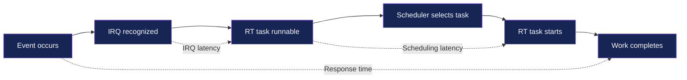

### 시간 관계

```text
T_event      : 외부 이벤트가 발생한 시각
T_irq        : CPU가 관련 IRQ 처리를 시작한 시각
T_runnable   : RT task가 runnable 상태가 된 시각
T_run        : RT task가 실제 CPU에서 시작한 시각
T_complete   : RT 작업이 완료된 시각

IRQ latency        = T_irq      - T_event
Wake-up/sched delay= T_run      - T_runnable
Response time      = T_complete - T_event
```

주의할 점은 측정 도구마다 시작/종료 timestamp의 정의가 다르다는 것이다. 지표 이름만 보고 비교하지 말고 **무엇과 무엇의 차이인지** 먼저 확인한다.

---

## 4. Tail Latency와 Worst Case를 보는 법

실시간 시스템에서 평균은 여전히 유용하지만 의사결정의 중심은 아니다. 평균은 정상 구간의 효율을 보여주고, maximum과 high percentile은 deadline risk를 보여준다.

### 권장 관찰 순서

1. deadline miss 여부
2. 최대값과 outlier 빈도
3. 99.9%, 99.99%, 99.999% percentile
4. 부하별 분포 변화
5. 평균값과 처리량

### 측정상의 함정

- 10초 idle test는 rare outlier를 거의 보지 못한다.
- debug kernel은 원인 분석에는 좋지만 최종 latency 수치가 악화될 수 있다.
- QEMU host의 scheduling과 power management가 guest 결과를 흔든다.
- console logging은 드문 큰 outlier를 만들 수 있다.
- 측정 thread 자체의 우선순위와 CPU affinity가 결과에 영향을 준다.

---

## 5. Hard, Firm, Soft Real-Time

분류의 핵심은 “deadline을 놓친 뒤 결과의 가치와 안전성이 어떻게 되는가”이다.


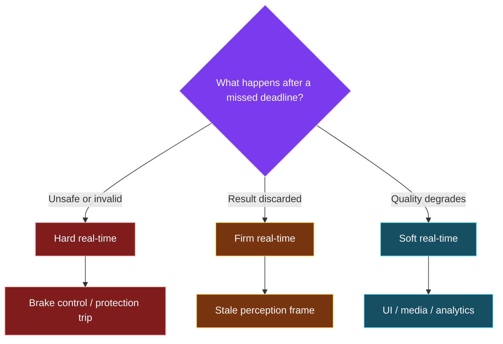

| 분류 | Deadline miss 이후 | 예시 | 설계 방향 |
|---|---|---|---|
| Hard RT | 시스템 실패 또는 안전 위협 | 보호 trip, 특정 actuator arbitration | 상한 증명, 독립 safety path, 엄격한 budget |
| Firm RT | 늦은 결과는 가치가 없어 폐기 | 오래된 perception frame, stale trajectory | freshness 검사, drop/fallback |
| Soft RT | 품질은 저하되지만 동작 가능 | UI, 비긴급 telemetry | percentile/SLA 중심 |

Automotive ADAS/AD 장치에서는 하나의 Linux 시스템 안에서도 세 분류가 혼재한다. 예를 들어 VLA reasoning 결과는 firm real-time처럼 취급하고, trajectory tracker나 safety monitor는 더 엄격한 deadline으로 운영할 수 있다.

---

## 6. Response Time Budget

Response time은 하나의 값이 아니라 여러 단계의 합이다.

```text
T_response = T_detect + T_irq + T_wakeup + T_schedule
           + T_compute + T_communication + T_actuation
```

Linux PREEMPT_RT는 주로 `T_irq`, `T_wakeup`, `T_schedule`과 일부 lock blocking을 줄이고 예측 가능하게 만든다. NPU 실행시간이나 네트워크 전송시간 전체를 직접 보장하지는 않는다.

### Budget을 작성할 때

- 각 구간의 **평균이 아니라 상한 또는 검증 목표**를 쓴다.
- “남는 시간”을 safety margin으로 명시한다.
- timestamp source가 동일한 clock domain인지 확인한다.
- queue wait와 device execution을 분리한다.
- timeout, stale result, fallback 시간을 포함한다.

---

## 7. 일반 Linux에서 Outlier가 생기는 이유

높은 우선순위 task가 runnable이 되더라도 다음 구간에서는 즉시 실행하지 못할 수 있다.


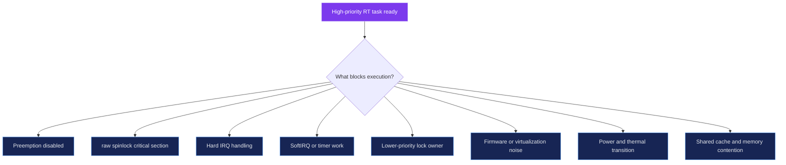

### 대표적인 소프트웨어 원인

- `preempt_disable()` 또는 `preempt_count`가 0이 아닌 구간
- `raw_spinlock_t`를 잡은 긴 critical section
- hard IRQ handler의 긴 실행
- softirq 처리 burst
- timer callback과 worker의 간섭
- 낮은 우선순위 lock owner에 의한 priority inversion
- page fault, memory reclaim, swap
- unbounded logging 또는 storage I/O
- RT throttling, 잘못된 CPU/IRQ affinity

### 대표적인 하드웨어·플랫폼 원인

- SMI와 같은 firmware interrupt 또는 secure monitor activity
- QEMU host scheduling과 virtualization exit
- CPU idle state wake-up, DVFS 전환
- thermal throttling
- shared LLC/DRAM/NoC contention
- device firmware queue와 DMA burst

PREEMPT_RT는 소프트웨어 원인 중 상당수를 scheduler가 관리할 수 있는 문맥으로 이동시키지만, 모든 원인을 제거하지 않는다.

---

## 8. Linux Preemption Model

### 8.1 `PREEMPT_NONE`

- kernel mode 실행 중 강제 선점을 최소화한다.
- throughput과 cache locality를 우선한다.
- 대부분의 상황에서 빠를 수 있지만 occasional long delay를 허용한다.
- server 또는 scientific workload에 적합한 기본 철학이다.

### 8.2 `PREEMPT_VOLUNTARY`

- 커널이 명시적으로 둔 preemption point에서 양보한다.
- `cond_resched()` 계열 지점이 중요하다.
- desktop interactivity를 개선하면서 overhead를 제한한다.

### 8.3 `PREEMPT`

- critical section이 아닌 대부분의 kernel code를 선점 가능하게 한다.
- low-latency desktop/embedded에 적합하다.
- 그러나 hard IRQ, raw lock, 일부 atomic context는 여전히 긴 지연을 만들 수 있다.

### 8.4 `PREEMPT_LAZY`

- full preemption과 유사하지만 `SCHED_NORMAL` task를 덜 성급하게 선점한다.
- lock holder preemption과 context switch overhead를 줄이려는 모델이다.
- 높은 우선순위 RT task의 즉시성은 별도로 유지한다.

### 8.5 `PREEMPT_RT`

- 단순히 preemption point를 추가하는 옵션이 아니다.
- lock primitive와 IRQ/softirq execution model을 변환한다.
- 대부분의 실행 문맥을 scheduler의 priority control 아래로 이동시킨다.
- entry code, scheduler, low-level interrupt handling 같은 극저수준 경로는 여전히 예외다.


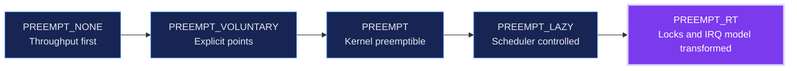

### 비교 표

| 모델 | kernel code 선점 | IRQ threading | 일반 `spinlock_t` PI화 | 주요 목표 |
|---|---:|---:|---:|---|
| NONE | 매우 제한적 | 아니오 | 아니오 | throughput |
| VOLUNTARY | 명시 지점 | 아니오 | 아니오 | desktop 반응성 |
| PREEMPT | critical section 외 대부분 | 기본적으로 아니오 | 아니오 | low latency |
| LAZY | scheduler가 일반 task 선점을 지연 | 기본적으로 아니오 | 아니오 | latency/throughput 균형 |
| RT | 매우 넓음 | 대부분 강제 thread화 | 예 | worst-case latency와 jitter 감소 |

`PREEMPT_DYNAMIC`은 하나의 kernel binary에서 부팅 시점에 preemption 동작을 선택하게 하는 기반이다. 이것만으로 lock과 IRQ가 RT 실행 모델로 변환되지는 않는다.

---

## 9. PREEMPT_RT의 핵심 변환


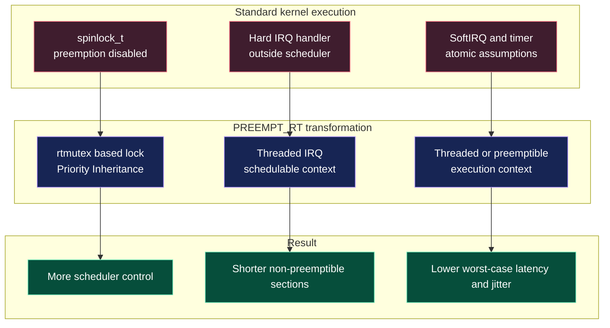

### 9.1 일반 `spinlock_t`의 의미 변화

일반 커널에서는 `spin_lock()`이 보통 preemption을 막고, lock이 풀릴 때까지 CPU가 spin한다. PREEMPT_RT에서는 일반 `spinlock_t`가 `rtmutex` 계열의 sleeping, priority-inheritance-aware lock으로 바뀐다.

결과:

- lock을 기다리는 task가 CPU를 무의미하게 계속 점유하지 않는다.
- 높은 우선순위 task가 낮은 우선순위 lock owner를 기다릴 때 owner의 effective priority가 올라갈 수 있다.
- `spin_lock()`이 항상 preemption을 끈다는 드라이버 가정은 깨질 수 있다.

반면 `raw_spinlock_t`는 PREEMPT_RT에서도 진짜 raw spinning lock으로 남는다. 따라서 raw lock 구간은 짧고 bounded해야 한다.

### 9.2 Interrupt Threading

대부분의 device IRQ handler를 `irq/<n>-<device>` kernel thread로 이동한다. 이를 통해:

- IRQ 처리에도 scheduler priority를 적용할 수 있다.
- 더 높은 우선순위 RT task가 IRQ thread를 선점할 수 있다.
- IRQ affinity와 thread priority를 함께 설계할 수 있다.

low-level timer, interrupt controller, `IRQF_NO_THREAD`로 표시된 일부 IRQ는 hard IRQ context에 남는다.

### 9.3 SoftIRQ와 Timer Context

PREEMPT_RT에서 softirq와 timer callback은 더 선점 가능한 context로 이동한다. 따라서 다음과 같은 기존 가정을 재검토해야 한다.

- `local_bh_disable()`만으로 per-CPU data를 안전하게 보호할 수 있다는 가정
- callback이 항상 atomic context라는 가정
- `spinlock_t`를 잡으면 자동으로 preemption이 금지된다는 가정

`local_lock_t`, `local_lock_nested_bh()` 같은 명시적 per-CPU locking이 중요해진다.

### 9.4 긴 Non-preemptible Section 분해

커널의 긴 atomic 구간을 줄이거나 thread context로 옮긴다. 그러나 완전한 0 latency는 불가능하다. entry/exit, scheduler 자체, raw lock, 일부 architecture code는 여전히 bounded latency 분석 대상이다.

---

## 10. Wake-up Sequence 비교

### 10.1 일반 커널에서 가능한 흐름


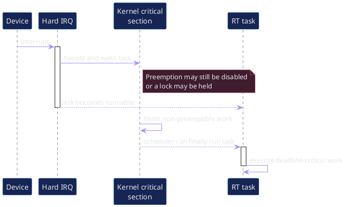

이 sequence에서 중요한 점은 “RT task가 runnable”인 것과 “RT task가 실제 실행”되는 것이 다르다는 점이다. runnable 이후에도 선점 불가 구간이나 lock 때문에 기다릴 수 있다.

### 10.2 PREEMPT_RT의 전형적인 흐름


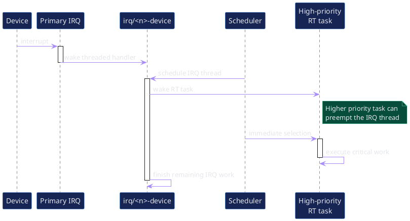

IRQ thread가 RT task를 깨웠고 RT task의 priority가 더 높다면 scheduler는 IRQ thread보다 RT task를 먼저 실행할 수 있다. 이 구조가 동작하려면 application, IRQ thread, kernel worker의 전체 priority hierarchy가 일관되어야 한다.

---

## 11. Priority Inversion과 Priority Inheritance 미리보기

Priority inversion은 높은 우선순위 task가 낮은 우선순위 lock owner를 기다리고, 그 사이 중간 우선순위 task가 owner를 계속 선점하는 상황이다.


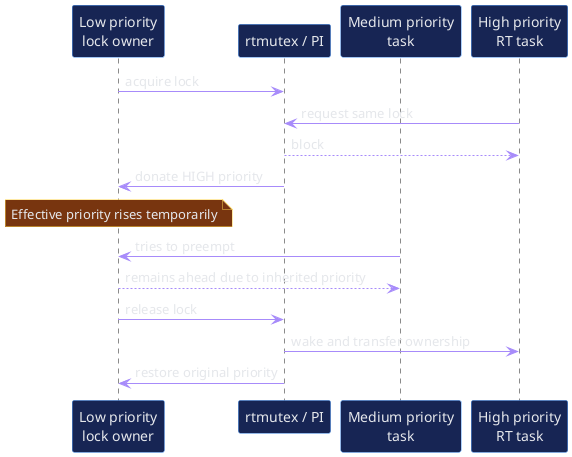

### 핵심 포인트

- priority inheritance는 lock owner의 **effective priority**를 일시적으로 올린다.
- lock을 해제하면 원래 priority로 돌아간다.
- nested lock과 chain blocking은 구현과 분석이 복잡하다.
- PI가 모든 blocking을 제거하는 것은 아니다. critical section 길이는 여전히 bounded해야 한다.
- 4강에서 `rt_mutex_adjust_prio_chain()`과 tracepoint로 실제 chain을 분석한다.

---

## 12. PREEMPT_RT가 해결하는 것과 해결하지 못하는 것


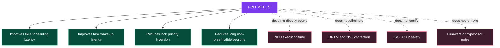

### 주로 개선하는 영역

- IRQ 처리의 scheduling 가능성
- high-priority task wake-up latency
- lock priority inversion
- kernel 내부의 긴 non-preemptible 구간
- timer/softirq callback에 대한 priority control 가능성

### 직접 해결하지 못하는 영역

- NPU/GPU/DSP hardware execution time
- device firmware queue의 unbounded delay
- DRAM, LLC, NoC, IOMMU contention
- thermal throttling과 전력 상태 전환
- hypervisor 또는 firmware noise
- application의 page fault, unbounded I/O, algorithm WCET
- ISO 26262 인증, freedom from interference, safety case

따라서 실제 제품에서는 PREEMPT_RT와 함께 CPU/IRQ partitioning, memory QoS, accelerator scheduling, timeout/fallback, PTP/TSN, safety island를 설계한다.

---

## 13. PREEMPT_RT와 Scheduling Policy는 다른 축이다

`CONFIG_PREEMPT_RT`는 커널 내부의 선점 가능 범위와 lock/IRQ 실행 모델을 바꾼다. `SCHED_FIFO`, `SCHED_RR`, `SCHED_DEADLINE`은 user/kernel thread가 CPU를 어떤 정책으로 경쟁하는지를 정한다.

```text
PREEMPT_RT kernel
    + SCHED_FIFO task
    + IRQ thread priority
    + CPU affinity
    + memory locking
    + bounded critical sections
    + latency tracing
```

반대로 PREEMPT_RT kernel에서 모든 application을 자동으로 RT task로 바꾸지 않는다. 일반 daemon과 logging은 계속 `SCHED_OTHER`로 실행될 수 있다.

### 잘못된 이해

- “PREEMPT_RT만 켜면 모든 deadline이 보장된다.” → 아니다.
- “SCHED_FIFO를 쓰면 PREEMPT_RT가 필요 없다.” → 커널의 선점 불가 구간은 여전히 존재할 수 있다.
- “priority 숫자가 높으면 무조건 안전하다.” → CPU starvation과 RCU/worker starvation을 일으킬 수 있다.

---

## 14. Upstream 소스 분석 지도

기준 tag를 고정하고 다음 파일부터 읽는다.

| 목적 | 파일 | 1강에서 확인할 것 |
|---|---|---|
| Kconfig 모델 정의 | `kernel/Kconfig.preempt` | 각 모델의 help와 dependency |
| preemption API | `include/linux/preempt.h` | preempt disable/enable과 count 개념 |
| scheduler entry | `kernel/sched/core.c` | `schedule()`, preemption entry 지점 |
| RT scheduler | `kernel/sched/rt.c` | 이후 3강 분석 대상 |
| RT mutex | `kernel/locking/rtmutex.c` | 이후 4강 분석 대상 |
| IRQ threading | `kernel/irq/manage.c` | 이후 5강 분석 대상 |
| softirq | `kernel/softirq.c` | 이후 6강 분석 대상 |
| timer | `kernel/time/hrtimer.c` | 이후 6강 분석 대상 |
| ARM64 entry | `arch/arm64/kernel/entry-common.c` | 이후 2강 분석 대상 |
| 공식 이론 | `Documentation/core-api/real-time/theory.rst` | RT 변환 개요 |
| 일반 커널과 차이 | `Documentation/core-api/real-time/differences.rst` | driver execution context 차이 |

### 기준 source clone 예

```bash
git clone https://git.kernel.org/pub/scm/linux/kernel/git/torvalds/linux.git
cd linux
git checkout v6.18
git rev-parse HEAD
```

기대 SHA:

```text
7d0a66e4bb9081d75c82ec4957c50034cb0ea449
```

### Kconfig 핵심

```text
config PREEMPT_RT
    bool "Fully Preemptible Kernel (Real-Time)"
    depends on EXPERT && ARCH_SUPPORTS_RT && !COMPILE_TEST
    select PREEMPTION
```

`ARCH_SUPPORTS_RT`가 선택되지 않는 architecture에서는 menuconfig에 RT option이 나타나지 않을 수 있다.

---

## 15. QEMU ARM64 실습 아키텍처


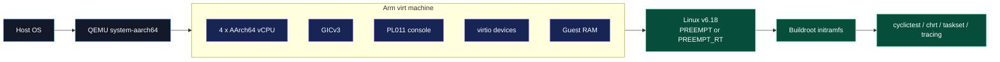

### 권장 구성

| 항목 | 권장값 |
|---|---|
| Machine | `virt` |
| Interrupt controller | GICv3 |
| vCPU | 4개 이상 |
| RAM | 1–2 GiB |
| Console | PL011, `ttyAMA0` |
| Root FS | 기존 Buildroot initramfs |
| Optional device | virtio-net, virtio-blk |
| Kernel A | `CONFIG_PREEMPT=y` 또는 기존 low-latency kernel |
| Kernel B | `CONFIG_PREEMPT_RT=y` |

### QEMU 결과의 의미

QEMU에서 검증하기 좋은 것:

- Kconfig와 runtime state
- threaded IRQ 존재 여부
- scheduler priority 관계
- lock/PI 동작
- tracepoint와 call flow
- 동일 host 조건의 상대 비교

QEMU에서 보증하면 안 되는 것:

- 실제 SoC의 worst-case IRQ latency
- DRAM/NoC/QoS 간섭 상한
- silicon errata와 firmware latency
- power/thermal 전환의 실제 worst case
- ASIL timing evidence

---

## 16. 실습 준비 — Kernel Config

### RT 분석용 최소 설정

```text
CONFIG_EXPERT=y
CONFIG_PREEMPT_RT=y
CONFIG_HIGH_RES_TIMERS=y
CONFIG_SMP=y
CONFIG_IKCONFIG=y
CONFIG_IKCONFIG_PROC=y
CONFIG_DEBUG_FS=y
CONFIG_TRACING=y
CONFIG_FTRACE=y
CONFIG_SCHED_TRACER=y
CONFIG_OSNOISE_TRACER=y
CONFIG_TIMERLAT_TRACER=y
```

원인 분석용 kernel에서는 추가 debug option을 켤 수 있다.

```text
CONFIG_DEBUG_ATOMIC_SLEEP=y
CONFIG_PROVE_LOCKING=y
CONFIG_LOCK_STAT=y
CONFIG_DEBUG_PREEMPT=y
```

최종 latency 측정에서는 debug option의 overhead를 피하기 위해 별도의 measurement config를 사용한다.

### 두 kernel flavor를 유지하는 이유

```text
rt-debug.config
    목적: bug와 execution context 위반 발견

rt-measure.config
    목적: 제품 후보의 latency 분포 측정
```

한 kernel에서 얻은 debug trace와 다른 kernel에서 얻은 최종 수치를 섞어 해석하지 않는다.

---

## 17. QEMU 실행 예

```bash
qemu-system-aarch64     -machine virt,gic-version=3     -cpu cortex-a72     -smp 4     -m 2048     -kernel Image     -initrd rootfs.cpio     -append "console=ttyAMA0 rdinit=/sbin/init"     -nographic
```

### 환경에 맞게 바꿀 항목

- kernel image path
- initramfs filename
- console과 init path
- host architecture에 따른 accelerator
- virtio-net 또는 virtio-blk option
- 기존 자동화 script의 argument 구조

ARM64 host에서 KVM을 사용할 경우 QEMU TCG보다 host noise가 줄 수 있지만, 여전히 production SoC latency는 아니다.

---

## 18. Runtime 상태 확인

```bash
uname -a
cat /sys/kernel/realtime
zcat /proc/config.gz | grep -E     'CONFIG_PREEMPT(_RT|_DYNAMIC|_LAZY)?='
```

### 기대 결과

RT kernel:

```text
/sys/kernel/realtime = 1
CONFIG_PREEMPT_RT=y
```

non-RT kernel:

```text
/sys/kernel/realtime = 0
# CONFIG_PREEMPT_RT is not set
```

배포판이나 Buildroot 설정에 따라 `/proc/config.gz`가 없을 수 있다. 이 경우 `CONFIG_IKCONFIG=y`, `CONFIG_IKCONFIG_PROC=y`를 활성화하거나 build output의 `.config`를 보존한다.

### 추가 관찰

```bash
ps -eLo pid,cls,rtprio,pri,psr,comm
cat /proc/interrupts
mount -t debugfs none /sys/kernel/debug
```

1강에서는 IRQ thread priority를 변경하지 않는다. 먼저 현재 상태를 기록하고 5강에서 체계적으로 조정한다.

---

## 19. `cyclictest`가 측정하는 것

`cyclictest`는 periodic timer를 설정하고 예상 wake-up 시각과 실제 thread 실행 시각의 차이를 측정한다.


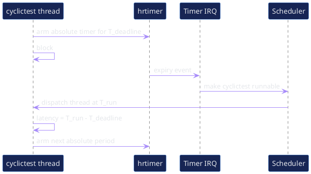

### 기본 명령

```bash
cyclictest     --smp     --mlockall     --priority 95     --interval 250     --duration 60s     --quiet
```

옵션은 사용 중인 `rt-tests` 버전에서 `cyclictest --help`로 확인한다. 장기 시험에서는 duration 또는 loop 수를 명시하고 결과와 함께 command line을 보존한다.

### 출력 해석

```text
T: 0 (...) P:95 I:250 C:... Min:4 Act:7 Avg:8 Max:73
```

- `T`: measurement thread index
- `P`: scheduling priority
- `I`: timer interval
- `C`: completed loop count
- `Min`: 최소 지연
- `Act`: 현재/마지막 지연
- `Avg`: 평균 지연
- `Max`: 최대 지연

가장 먼저 볼 것은 `Max`와 deadline miss 여부다. 단, 단 한 번의 Max 값만으로 원인을 알 수 없으므로 outlier 발생 시 trace와 workload context가 필요하다.

---

## 20. Baseline 실습 절차


### Step 1 — Test identity 기록

다음을 결과 파일에 반드시 포함한다.

- host CPU/OS
- QEMU version과 command line
- kernel tag, commit SHA, `.config` hash
- Buildroot config 또는 rootfs artifact hash
- vCPU 수, guest RAM
- measurement command
- 시작/종료 시각
- host background workload 상태

### Step 2 — Idle baseline

```bash
cyclictest -S -m -p95 -i250 -D60s -q     > cyclictest-idle.txt
```

### Step 3 — Interrupt snapshot

```bash
cat /proc/interrupts > interrupts-before.txt
# cyclictest 실행
cat /proc/interrupts > interrupts-after.txt
```

### Step 4 — Kernel config 보존

```bash
zcat /proc/config.gz > kernel.config
sha256sum kernel.config Image rootfs.cpio > artifacts.sha256
```

### Step 5 — PREEMPT와 PREEMPT_RT 반복

동일한 QEMU option, host condition, duration을 유지한다. 한 번의 결과가 아니라 여러 run을 수집한다.

### Baseline 수집 script 예

```bash
#!/bin/sh
set -eu

OUT=/tmp/rt-baseline
mkdir -p "$OUT"

uname -a > "$OUT/uname.txt"
cat /sys/kernel/realtime > "$OUT/realtime.txt"
zcat /proc/config.gz > "$OUT/kernel.config"
cat /proc/interrupts > "$OUT/interrupts-before.txt"

cyclictest -S -m -p95 -i250 -D60s -q     > "$OUT/cyclictest-idle.txt"

cat /proc/interrupts > "$OUT/interrupts-after.txt"
tar -czf /tmp/rt-baseline.tgz -C /tmp rt-baseline
```

---

## 21. 실험 Matrix

최소한 다음 matrix를 계획한다. 1강에서는 idle baseline까지 수행하고, 8–9강에서 전체 matrix를 완성한다.

| Kernel | Host/Guest 부하 | CPU affinity | Console | 목적 |
|---|---|---|---|---|
| PREEMPT | Idle | 기본 | On | non-RT 기준선 |
| PREEMPT_RT | Idle | 기본 | On | RT 기준선 |
| PREEMPT | Mixed | 기본 | On | 부하 민감도 |
| PREEMPT_RT | Mixed | 기본 | On | RT under load |
| PREEMPT_RT | Mixed | 분리 | On | CPU/IRQ partition 효과 |
| PREEMPT_RT | Mixed | 분리 | Off | console 영향 |

### 비교 시 원칙

- 한 번에 한 요소만 바꾼다.
- 평균과 최대를 동시에 기록한다.
- 결과가 좋아졌을 때 throughput/power 비용도 기록한다.
- QEMU host의 noise를 별도 변수로 인정한다.
- outlier 시점과 trace timestamp를 연결한다.

---

## 22. Automotive NPU E2E/VLA Case Study

PREEMPT_RT는 NPU matrix 연산을 더 빠르게 만들지 않는다. NPU 전후의 CPU orchestration과 control path의 timing variance를 줄인다.


### 주요 timing point

```text
T0  sensor capture
T1  DMA completion / IRQ
T2  sensor ingest start
T3  NPU submit
T4  NPU hardware start
T5  NPU hardware complete
T6  completion IRQ thread
T7  model output publish
T8  RT controller start
T9  vehicle command transmit
```

```text
Capture-to-submit      = T3 - T0
NPU queue latency      = T4 - T3
NPU execution          = T5 - T4
Completion-to-publish  = T7 - T5
Controller release     = T8 - T7
Observation-to-action  = T9 - T0
```

### E2E/VLA에서 권장되는 역할 분리

- VLA/E2E model: trajectory 또는 intent를 생성
- PREEMPT_RT controller: 빠른 고정 주기로 trajectory 추종
- freshness monitor: 결과 age와 remaining horizon 검사
- safety supervisor: deadline miss, stale output, NPU timeout에서 fallback
- safety MCU/RTOS: 최종 독립 감시와 emergency arbitration


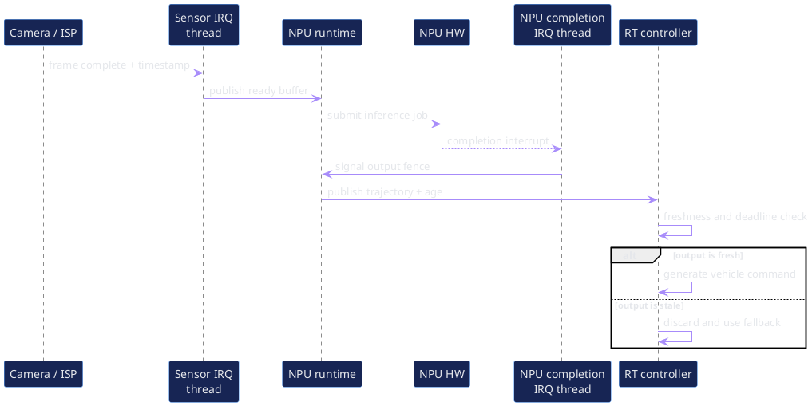

PREEMPT_RT가 의미 있는 지점:

- sensor IRQ thread의 priority와 affinity
- ingest/dispatch thread의 wake-up latency
- NPU completion IRQ와 fence signal latency
- output publish 이후 controller release latency
- timeout monitor와 fallback 실행
- CAN/Ethernet control TX thread의 scheduling

---

## 23. Outlier 분석을 위한 첫 Decision Tree


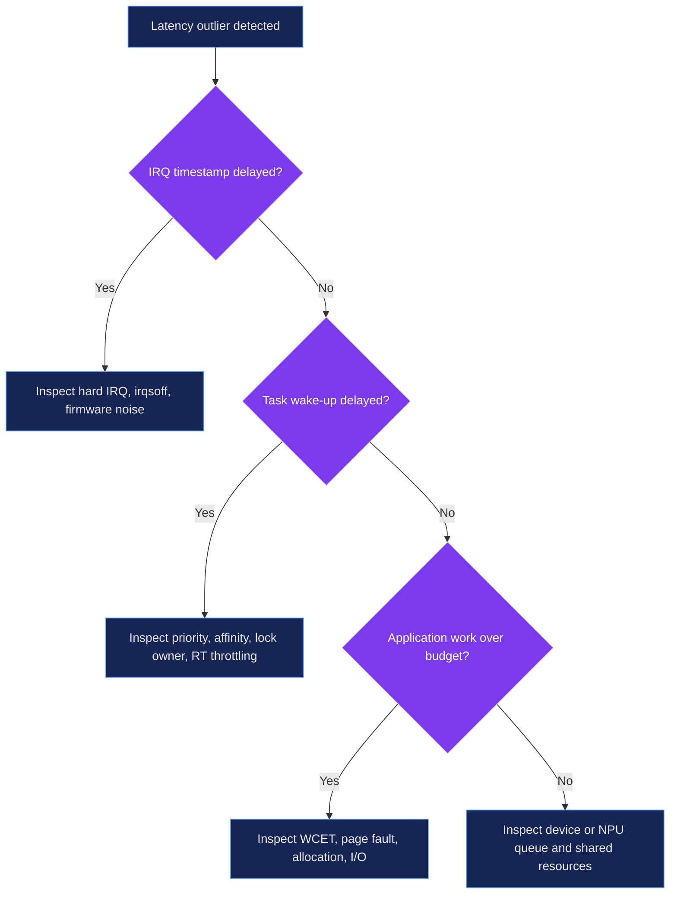

### 질문 순서

1. **이벤트 자체가 늦게 들어왔는가?**  
   device timestamp, IRQ timestamp, host/firmware noise를 본다.
2. **task가 늦게 runnable이 되었는가?**  
   driver completion, fence, wake-up path를 본다.
3. **runnable 이후 CPU를 늦게 받았는가?**  
   priority, affinity, lock blocking, RT throttling을 본다.
4. **task는 제때 시작했지만 작업이 길어졌는가?**  
   WCET, page fault, allocation, I/O를 본다.
5. **CPU 밖의 queue가 병목인가?**  
   NPU firmware, DMA, memory contention을 본다.

1강에서는 이 decision tree를 기억하고, 8강에서 `rtla timerlat`, `osnoise`, ftrace로 각 분기를 확인한다.

---

## 24. 빈번한 오해와 설계 Anti-pattern

### 오해 1 — “RT kernel이면 task priority는 중요하지 않다”

IRQ thread와 application의 priority가 역전되어 있으면 critical task가 오히려 늦을 수 있다.

### 오해 2 — “모든 IRQ를 가장 높은 priority로 올리면 된다”

storage/network IRQ가 control task보다 높으면 burst traffic이 control을 지연시킨다. IRQ의 기능적 중요성과 dependency를 함께 본다.

### 오해 3 — “Max가 작으면 real-time 보장이다”

측정 시간과 workload가 충분하지 않으면 rare event를 보지 못한다. 측정은 evidence이지 수학적 보증 자체가 아니다.

### 오해 4 — “CPU isolation이면 memory interference도 제거된다”

LLC, DRAM, NoC, IOMMU, SLC는 CPU를 분리해도 공유될 수 있다.

### 오해 5 — “PREEMPT_RT가 safety certification을 제공한다”

기능 안전은 process, requirements, hazard analysis, freedom from interference, verification, safety mechanism을 별도로 요구한다.

### 오해 6 — “RT loop에서 printf는 작은 작업이다”

console lock, serial transmission, logging daemon, filesystem을 거치며 unbounded delay가 될 수 있다.

---

## 25. 1강 실습 체크리스트

### 환경 확인

- [ ] QEMU ARM64 guest가 4 vCPU 이상으로 부팅된다.
- [ ] Buildroot initramfs에서 shell을 사용할 수 있다.
- [ ] `cyclictest`, `chrt`, `taskset`, `ps`가 있다.
- [ ] `/proc/config.gz` 또는 build `.config`를 확보했다.
- [ ] `debugfs`를 mount할 수 있다.

### Kernel 확인

- [ ] `uname -a` 저장
- [ ] `/sys/kernel/realtime` 저장
- [ ] PREEMPT 관련 config 저장
- [ ] `/proc/interrupts` 저장
- [ ] kernel commit SHA와 config hash 저장

### 측정

- [ ] idle 60초 baseline 실행
- [ ] 각 CPU의 Min/Avg/Max 저장
- [ ] PREEMPT와 PREEMPT_RT에서 동일 조건 반복
- [ ] 결과 파일과 QEMU command를 같은 디렉터리에 보존

### 결과 해석

- [ ] 평균만으로 결론 내리지 않았다.
- [ ] Max와 outlier 빈도를 기록했다.
- [ ] QEMU 절대값의 한계를 명시했다.
- [ ] 다음 trace 실험에서 검증할 가설을 한 문장으로 작성했다.

---

# 퀴즈

## 객관식 1

Real-time 시스템을 가장 정확하게 설명한 것은?

A. 평균 처리량이 가장 높은 시스템  
B. 항상 CPU clock이 가장 높은 시스템  
C. 정의된 시간 제약 안에서 결과를 제공하도록 설계·검증하는 시스템  
D. 모든 thread가 `SCHED_FIFO`인 시스템

## 객관식 2

PREEMPT_RT의 핵심 변화가 **아닌 것**은?

A. 일반 `spinlock_t`의 PI-aware lock 변환  
B. 대부분의 device IRQ threading  
C. NPU hardware execution time의 상한 자동 보장  
D. 긴 non-preemptible section 축소

## 객관식 3

`PREEMPT`와 `PREEMPT_RT`의 차이를 가장 잘 설명한 것은?

A. 둘은 이름만 다르고 동작은 같다.  
B. PREEMPT_RT는 lock과 IRQ 실행 모델까지 변환한다.  
C. PREEMPT는 RT scheduler를 제거한다.  
D. PREEMPT_RT는 user-space만 변경한다.

## 객관식 4

`cyclictest` 결과에서 deadline risk를 우선 판단할 때 가장 먼저 볼 값은?

A. `Min`  
B. `Avg`만  
C. `Max`와 deadline miss  
D. PID

## O/X 5

PREEMPT_RT kernel을 사용하면 모든 user process가 자동으로 real-time priority를 갖는다.  
O / X

## O/X 6

QEMU에서 측정한 latency는 kernel execution model 비교에는 유용하지만 실제 Automotive SoC의 worst-case latency 보증값으로 바로 사용할 수 없다.  
O / X

## 단답형 7

높은 우선순위 task가 runnable이 된 시점부터 실제 CPU에서 실행되기까지의 지연을 무엇이라고 부르는가?

## 단답형 8

PREEMPT_RT에서도 실제 raw spinning lock으로 남아 있어 critical section을 특히 짧게 유지해야 하는 lock type은?

## 시나리오 9

NPU는 T=20 ms에 계산을 완료했지만 Linux application은 T=24 ms에 결과를 받았다. NPU hardware execution은 정상이다. PREEMPT_RT 관점에서 먼저 분리해서 측정해야 할 두 구간을 쓰시오.

## 시나리오 10

`cyclictest`의 평균은 8 µs이지만 30분 동안 Max가 4 ms로 한 번 튀었다. deadline은 500 µs이다. “평균이 매우 작으므로 통과”라는 결론이 잘못된 이유와 다음 조치를 쓰시오.

---

# 퀴즈 정답과 해설

1. **C** — real-time은 속도 자체보다 시간 제약 만족이 중심이다.
2. **C** — PREEMPT_RT는 CPU 측 실행 문맥을 개선하지만 NPU 내부 실행시간 상한을 자동 보장하지 않는다.
3. **B** — PREEMPT는 kernel code의 선점 범위를 넓히고, PREEMPT_RT는 lock/IRQ/softirq execution model까지 바꾼다.
4. **C** — 최대 지연과 deadline miss가 우선이다. 평균은 정상 구간의 효율을 보는 보조 지표다.
5. **X** — process scheduling policy는 별도로 설정한다.
6. **O** — QEMU host scheduler와 virtualization noise가 섞이며 실제 silicon의 memory/firmware 특성이 없다.
7. **Scheduling latency 또는 wake-up-to-run latency**
8. **`raw_spinlock_t`**
9. **NPU completion interrupt가 Linux에 전달되어 IRQ thread가 실행되기까지의 구간**, 그리고 **IRQ/fence signal 이후 waiting application이 wake-up되어 실제 실행되기까지의 구간**을 분리한다.
10. deadline 500 µs보다 4 ms가 크므로 실제 deadline miss다. 장시간 반복 측정하고, outlier trigger를 걸어 `rtla timerlat`/ftrace로 IRQ delay인지 thread delay인지 분리하며, 당시 host load, IRQ, console, lock 상태를 함께 기록한다.

---

# 5분 복습

1. Real-time과 high performance의 차이는 무엇인가?
2. response time과 scheduling latency는 어떻게 다른가?
3. Hard RT와 Firm RT를 deadline miss 후의 관점에서 구분하라.
4. tail latency가 평균보다 중요한 이유는 무엇인가?
5. `PREEMPT`와 `PREEMPT_RT`의 가장 큰 차이는 무엇인가?
6. PREEMPT_RT에서 `spinlock_t`와 `raw_spinlock_t`는 어떻게 다른가?
7. interrupt threading이 scheduler control을 넓히는 이유는 무엇인가?
8. PREEMPT_RT가 NPU execution time을 직접 보장하지 못하는 이유는 무엇인가?
9. `/sys/kernel/realtime`은 무엇을 확인하는가?
10. `cyclictest` 결과에서 Max만 보고도 충분하지 않은 이유는 무엇인가?

---

# 플래시카드

| 앞면 | 뒷면 |
|---|---|
| Real-time | 정의된 시간 제약 안에 유효한 결과를 제공하는 특성 |
| Deadline | 작업 완료가 허용되는 마지막 시각 |
| Response time | event부터 작업 완료까지의 시간 |
| Scheduling latency | runnable에서 실제 실행까지의 시간 |
| Jitter | 주기 또는 latency의 변동 |
| Tail latency | 분포 상위 percentile에 나타나는 긴 지연 |
| PREEMPT | critical section 외 kernel code를 폭넓게 선점 가능하게 하는 모델 |
| PREEMPT_RT | lock과 IRQ execution model까지 RT 친화적으로 변환하는 기능 |
| Priority Inheritance | waiter의 높은 priority를 lock owner가 일시적으로 상속하는 방식 |
| Threaded IRQ | device interrupt 처리를 scheduler가 관리하는 kernel thread에서 수행 |
| `raw_spinlock_t` | PREEMPT_RT에서도 raw spinning semantics를 유지하는 lock |
| `/sys/kernel/realtime` | running kernel이 RT mode인지 나타내는 interface |
| `cyclictest` | timer deadline과 actual thread execution 시각 차이를 측정하는 도구 |
| QEMU latency | 실행 의미·상대 비교에 유용하지만 production worst case 보증은 아님 |

---

# 빈칸 채우기

1. Real-time의 핵심은 평균 속도가 아니라 ________ 만족이다.
2. 높은 우선순위 task가 runnable이 된 뒤 CPU를 받기까지의 시간은 ________ latency다.
3. PREEMPT_RT의 일반 `spinlock_t`는 ________ inheritance를 지원하는 sleeping lock으로 동작할 수 있다.
4. PREEMPT_RT에서도 실제 spin semantics를 유지하는 lock은 ________이다.
5. `cyclictest`에서 deadline risk를 우선 볼 때 평균보다 ________ 값을 먼저 확인한다.

정답: 1) deadline 2) scheduling/wake-up 3) priority 4) `raw_spinlock_t` 5) Max

---

# 꼭 기억할 문장 5개

1. **Real-time은 빠르다는 뜻이 아니라 제시간에 동작한다는 뜻이다.**
2. **PREEMPT_RT는 새로운 user-space scheduler policy가 아니라 커널 실행 문맥을 scheduler 제어 아래로 넓히는 변환이다.**
3. **평균 latency가 낮아도 한 번의 deadline miss가 시스템 요구사항을 깨뜨릴 수 있다.**
4. **QEMU는 실행 경로와 상대 비교를 학습하는 도구이지 실제 SoC worst-case timing 인증 장비가 아니다.**
5. **측정값은 원인 설명이 아니므로 outlier를 IRQ, wake-up, lock, application, device 구간으로 분해해야 한다.**

---

# 과제

## 과제 1 — 환경 Baseline

기존 QEMU 환경에서 다음 파일을 수집한다.

```text
uname.txt
realtime.txt
kernel.config
interrupts-before.txt
interrupts-after.txt
cyclictest-idle.txt
qemu-command.txt
artifacts.sha256
```

## 과제 2 — 두 Kernel 비교표

PREEMPT kernel과 PREEMPT_RT kernel의 다음 항목을 비교한다.

- boot log의 preemption 문자열
- `/sys/kernel/realtime`
- PREEMPT 관련 config
- 60초 idle cyclictest의 Min/Avg/Max
- 관찰된 IRQ thread

## 과제 3 — Outlier 가설

가장 큰 Max 값 하나를 선택해 가능한 원인을 최소 세 가지 쓰고, 각 원인을 확인할 다음 강의의 tracepoint 또는 도구를 연결한다.

## 과제 4 — Automotive Timing Budget 초안

본인이 다루는 sensor/NPU/control path에서 T0–T9 timestamp point를 정의하고, PREEMPT_RT가 영향을 줄 수 있는 구간과 줄 수 없는 구간을 분류한다.

---

# 다음 강의 예고 — 2강 ARM64 Kernel Preemption

다음 강의 전 확인할 것:

- `include/linux/preempt.h`에서 `preempt_disable()`과 `preempt_enable()` 위치 찾기
- `kernel/sched/core.c`에서 `schedule()`과 preemption entry 검색
- `arch/arm64/kernel/entry-common.c`의 IRQ/exception return 경로 확인
- `TIF_NEED_RESCHED`와 `preempt_count` 용어 정리
- PREEMPT와 PREEMPT_RT kernel의 bootable image 보존

2강 핵심 질문:

> ARM64 CPU가 kernel mode에 있을 때 높은 우선순위 task가 runnable이 되면, 어떤 조건과 경로를 거쳐 실제 `schedule()`이 호출되는가?

---

# 참고 자료와 Source Map

## Linux v6.18 기준

- Linux v6.18 tag: <https://github.com/torvalds/linux/tree/v6.18>
- Release commit: <https://github.com/torvalds/linux/commit/7d0a66e4bb9081d75c82ec4957c50034cb0ea449>
- Preemption Kconfig: <https://github.com/torvalds/linux/blob/v6.18/kernel/Kconfig.preempt>
- PREEMPT_RT theory: <https://docs.kernel.org/6.18/core-api/real-time/theory.html>
- Kernel differences on PREEMPT_RT: <https://docs.kernel.org/6.18/core-api/real-time/differences.html>
- Architecture porting: <https://docs.kernel.org/6.18/core-api/real-time/architecture-porting.html>
- Scheduler documentation: <https://docs.kernel.org/6.18/scheduler/>
- ftrace: <https://docs.kernel.org/6.18/trace/ftrace.html>
- rtla timerlat: <https://docs.kernel.org/6.18/tools/rtla/rtla-timerlat.html>
- QEMU Arm `virt` machine: <https://www.qemu.org/docs/master/system/arm/virt.html>
- rt-tests repository: <https://git.kernel.org/pub/scm/utils/rt-tests/rt-tests.git/>

## Source 탐색 명령

```bash
git grep -n "config PREEMPT_RT"
git grep -n "preempt_disable" include kernel arch/arm64
git grep -n "rt_mutex_adjust_prio_chain"
git grep -n "IRQF_NO_THREAD"
git grep -n "force_irqthreads"
```

---

# 부록 A — 전체 Mermaid 원문

아래 블록은 강의 슬라이드의 구조도를 재생성할 수 있는 검증된 원문이다.


## 01_course_map


## 02_latency_terms


## 03_rt_classes


## 04_latency_sources


## 05_preemption_models

```mermaid
flowchart LR
 N[PREEMPT_NONE<br/>Throughput first] --> V[PREEMPT_VOLUNTARY<br/>Explicit points] --> F[PREEMPT<br/>Kernel preemptible] --> L[PREEMPT_LAZY<br/>Scheduler controlled] --> R[PREEMPT_RT<br/>Locks and IRQ model transformed]
 classDef n fill:#172554,stroke:#60A5FA,color:#E5E7EB;
 classDef r fill:#7C3AED,stroke:#DDD6FE,color:#FFFFFF,stroke-width:3px;
 class N,V,F,L n;
 class R r;
```

## 06_rt_transformation

```mermaid
flowchart TB
 subgraph Standard[Standard kernel execution]
  S1[spinlock_t<br/>preemption disabled]
  S2[Hard IRQ handler<br/>outside scheduler]
  S3[SoftIRQ and timer<br/>atomic assumptions]
 end
 subgraph Transform[PREEMPT_RT transformation]
  T1[rtmutex based lock<br/>Priority Inheritance]
  T2[Threaded IRQ<br/>schedulable context]
  T3[Threaded or preemptible<br/>execution context]
 end
 subgraph Result[Result]
  R1[More scheduler control]
  R2[Shorter non-preemptible sections]
  R3[Lower worst-case latency and jitter]
 end
 S1 --> T1 --> R1
 S2 --> T2 --> R2
 S3 --> T3 --> R3
 classDef b fill:#3F1D2E,stroke:#FB7185,color:#FFFFFF;
 classDef a fill:#172554,stroke:#A78BFA,color:#FFFFFF;
 classDef r fill:#064E3B,stroke:#6EE7B7,color:#FFFFFF;
 class S1,S2,S3 b;
 class T1,T2,T3 a;
 class R1,R2,R3 r;
```

## 07_qemu_lab

```mermaid
flowchart LR
 Host[Host OS] --> Q[QEMU system-aarch64]
 subgraph Virt[Arm virt machine]
  CPU[4 x AArch64 vCPU]
  GIC[GICv3]
  UART[PL011 console]
  VIO[virtio devices]
  MEM[Guest RAM]
 end
 Q --> Virt --> K[Linux v6.18<br/>PREEMPT or PREEMPT_RT] --> I[Buildroot initramfs] --> T[cyclictest / chrt / taskset / tracing]
 classDef h fill:#111827,stroke:#60A5FA,color:#FFFFFF;
 classDef v fill:#172554,stroke:#A78BFA,color:#FFFFFF;
 classDef g fill:#064E3B,stroke:#6EE7B7,color:#FFFFFF;
 class Host,Q h;
 class CPU,GIC,UART,VIO,MEM v;
 class K,I,T g;
```

## 08_measurement_workflow

```mermaid
flowchart LR
 B[Build two kernels] --> C[Confirm runtime config] --> M[Measure idle baseline] --> L[Add controlled load] --> T[Capture trace near outlier] --> R[Classify root cause] --> F[Change one factor] --> M
 classDef a fill:#172554,stroke:#60A5FA,color:#E5E7EB;
 classDef f fill:#7C3AED,stroke:#DDD6FE,color:#FFFFFF;
 class B,C,L,T,R,F a;
 class M f;
```

## 09_scope_boundary

```mermaid
flowchart TB
 P[PREEMPT_RT]
 P --> Y1[Improves IRQ scheduling latency]
 P --> Y2[Improves task wake-up latency]
 P --> Y3[Reduces lock priority inversion]
 P --> Y4[Reduces long non-preemptible sections]
 P -. does not directly bound .-> N1[NPU execution time]
 P -. does not eliminate .-> N2[DRAM and NoC contention]
 P -. does not certify .-> N3[ISO 26262 safety]
 P -. does not remove .-> N4[Firmware or hypervisor noise]
 classDef p fill:#7C3AED,stroke:#DDD6FE,color:#FFFFFF;
 classDef y fill:#064E3B,stroke:#6EE7B7,color:#FFFFFF;
 classDef n fill:#3F1D2E,stroke:#FB7185,color:#FFFFFF;
 class P p;
 class Y1,Y2,Y3,Y4 y;
 class N1,N2,N3,N4 n;
```

## 10_automotive_case

```mermaid
flowchart LR
 CAM[Camera / Radar] --> DMA[DMA complete] --> IRQ[Sensor IRQ thread] --> ING[Sensor ingest] --> SUB[NPU submit] --> NPU[NPU execution] --> CMP[NPU completion IRQ] --> OUT[Trajectory publish] --> CTRL[RT controller] --> SAFE[Safety monitor] --> BUS[CAN / Ethernet]
 classDef hw fill:#111827,stroke:#60A5FA,color:#FFFFFF;
 classDef rt fill:#7C3AED,stroke:#DDD6FE,color:#FFFFFF;
 classDef ac fill:#164E63,stroke:#67E8F9,color:#FFFFFF;
 class CAM,DMA hw;
 class IRQ,ING,SUB,CMP,OUT,CTRL,SAFE,BUS rt;
 class NPU ac;
```

## 11_debug_tree

```mermaid
flowchart TD
 A[Latency outlier detected] --> B{IRQ timestamp delayed?}
 B -->|Yes| C[Inspect hard IRQ, irqsoff, firmware noise]
 B -->|No| D{Task wake-up delayed?}
 D -->|Yes| E[Inspect priority, affinity, lock owner, RT throttling]
 D -->|No| F{Application work over budget?}
 F -->|Yes| G[Inspect WCET, page fault, allocation, I/O]
 F -->|No| H[Inspect device or NPU queue and shared resources]
 classDef q fill:#7C3AED,stroke:#DDD6FE,color:#FFFFFF;
 classDef a fill:#172554,stroke:#60A5FA,color:#E5E7EB;
 class B,D,F q;
 class A,C,E,G,H a;
```

---

# 부록 B — 전체 PlantUML 원문

아래 블록은 sequence diagram을 재생성할 수 있는 검증된 원문이다. participant label 줄바꿈은 물리적 줄바꿈이 아니라 `\n` escape를 사용한다.


## 01_standard_wakeup

```plantuml
@startuml
skinparam backgroundColor transparent
skinparam defaultFontColor #E5E7EB
skinparam ArrowColor #A78BFA
skinparam ParticipantBorderColor #60A5FA
skinparam ParticipantBackgroundColor #172554
skinparam LifeLineBorderColor #64748B
skinparam NoteBackgroundColor #3F1D2E
skinparam NoteBorderColor #FB7185
participant "Device" as DEV
participant "Hard IRQ" as IRQ
participant "Kernel critical\nsection" as KERNEL
participant "RT task" as RT
DEV -> IRQ: interrupt
activate IRQ
IRQ -> KERNEL: handle and wake task
note right of KERNEL: Preemption may still be disabled\nor a lock may be held
IRQ --> RT: task becomes runnable
deactivate IRQ
KERNEL -> KERNEL: finish non-preemptible work
KERNEL --> RT: scheduler can finally run task
activate RT
RT -> RT: execute deadline-critical work
deactivate RT
@enduml
```

## 02_rt_wakeup

```plantuml
@startuml
skinparam backgroundColor transparent
skinparam defaultFontColor #E5E7EB
skinparam ArrowColor #A78BFA
skinparam ParticipantBorderColor #60A5FA
skinparam ParticipantBackgroundColor #172554
skinparam LifeLineBorderColor #64748B
skinparam NoteBackgroundColor #064E3B
skinparam NoteBorderColor #6EE7B7
participant "Device" as DEV
participant "Primary IRQ" as PIRQ
participant "irq/<n>-device" as TIRQ
participant "Scheduler" as SCHED
participant "High-priority\nRT task" as RT
DEV -> PIRQ: interrupt
activate PIRQ
PIRQ -> TIRQ: wake threaded handler
deactivate PIRQ
SCHED -> TIRQ: schedule IRQ thread
activate TIRQ
TIRQ -> RT: wake RT task
note right of RT: Higher priority task can\npreempt the IRQ thread
SCHED -> RT: immediate selection
activate RT
RT -> RT: execute critical work
deactivate RT
TIRQ -> TIRQ: finish remaining IRQ work
deactivate TIRQ
@enduml
```

## 03_priority_inheritance

```plantuml
@startuml
skinparam backgroundColor transparent
skinparam defaultFontColor #E5E7EB
skinparam ArrowColor #A78BFA
skinparam ParticipantBorderColor #60A5FA
skinparam ParticipantBackgroundColor #172554
skinparam LifeLineBorderColor #64748B
skinparam NoteBackgroundColor #78350F
skinparam NoteBorderColor #FCD34D
participant "Low priority\nlock owner" as LOW
participant "rtmutex / PI" as PI
participant "Medium priority\ntask" as MED
participant "High priority\nRT task" as HIGH
LOW -> PI: acquire lock
HIGH -> PI: request same lock
PI --> HIGH: block
PI -> LOW: donate HIGH priority
note over LOW: Effective priority rises temporarily
MED -> LOW: tries to preempt
LOW --> MED: remains ahead due to inherited priority
LOW -> PI: release lock
PI -> HIGH: wake and transfer ownership
PI -> LOW: restore original priority
@enduml
```

## 04_cyclictest_measurement

```plantuml
@startuml
skinparam backgroundColor transparent
skinparam defaultFontColor #E5E7EB
skinparam ArrowColor #A78BFA
skinparam ParticipantBorderColor #60A5FA
skinparam ParticipantBackgroundColor #172554
skinparam LifeLineBorderColor #64748B
skinparam NoteBackgroundColor #172554
skinparam NoteBorderColor #60A5FA
participant "cyclictest thread" as CT
participant "hrtimer" as TIMER
participant "Timer IRQ" as IRQ
participant "Scheduler" as SCHED
CT -> TIMER: arm absolute timer for T_deadline
CT -> CT: block
TIMER -> IRQ: expiry event
IRQ -> SCHED: make cyclictest runnable
SCHED -> CT: dispatch thread at T_run
CT -> CT: latency = T_run - T_deadline
CT -> TIMER: arm next absolute period
@enduml
```

## 05_automotive_sequence

```plantuml
@startuml
skinparam backgroundColor transparent
skinparam defaultFontColor #E5E7EB
skinparam ArrowColor #A78BFA
skinparam ParticipantBorderColor #60A5FA
skinparam ParticipantBackgroundColor #172554
skinparam LifeLineBorderColor #64748B
skinparam NoteBackgroundColor #3F1D2E
skinparam NoteBorderColor #FB7185
participant "Camera / ISP" as CAM
participant "Sensor IRQ\nthread" as SIRQ
participant "NPU runtime" as NPU_RT
participant "NPU HW" as NPU
participant "NPU completion\nIRQ thread" as NIRQ
participant "RT controller" as CTRL
CAM -> SIRQ: frame complete + timestamp
SIRQ -> NPU_RT: publish ready buffer
NPU_RT -> NPU: submit inference job
NPU --> NIRQ: completion interrupt
NIRQ -> NPU_RT: signal output fence
NPU_RT -> CTRL: publish trajectory + age
CTRL -> CTRL: freshness and deadline check
alt output is fresh
 CTRL -> CTRL: generate vehicle command
else output is stale
 CTRL -> CTRL: discard and use fallback
end
@enduml
```
