# PREEMPT_RT 2강 상세 강의노트

## ARM64 Kernel Preemption 동작과 PREEMPT_RT 빌드

- 과정명: **Linux Kernel PREEMPT_RT 실습 과정**
- 강의 번호: **2강**
- 대상: Linux Kernel/BSP/Device Driver 경험이 있는 중급 이상 Embedded·Automotive 개발자
- 예상 시간: 이론 70분 + 소스 분석 70분 + QEMU 실습 80분
- 기준 커널: **Linux v6.18**
- 기준 commit: `7d0a66e4bb9081d75c82ec4957c50034cb0ea449`
- 실습 환경: QEMU ARM64 `virt`, GICv3, 4 vCPU, PL011, Buildroot initramfs
- 작성 기준일: 2026-07-17

> 이 자료에서 절대 시간 수치는 QEMU 성능 보증값이 아니다. QEMU 실습의 목적은 **소스 경로, 실행 문맥, 설정 차이와 상대적 동작**을 관찰하는 것이다. 실제 Automotive SoC의 worst-case latency는 target board에서 별도로 측정해야 한다.

---

# 1. 이번 강의의 위치

1강에서는 Real-Time을 평균 속도가 아닌 deadline, maximum latency, jitter의 문제로 정의하고, PREEMPT_RT가 lock·IRQ·softirq 실행 모델을 어떻게 바꾸는지 큰 그림을 살펴보았다.

2강에서는 그 큰 그림을 다음 질문으로 내려간다.

> 높은 우선순위 태스크가 runnable이 된 뒤, ARM64 Linux는 **어느 경로에서 `schedule()`로 진입하는가?**


2강에서 만든 call-flow는 이후 강의의 공통 기반이다.

- 3강: 어떤 태스크를 다음에 고르는가?
- 4강: lock owner의 effective priority는 어떻게 바뀌는가?
- 5강: 장치 IRQ가 어떤 kernel thread를 깨우는가?
- 8강: trace에서 지연이 어느 구간에 있었는가?

---

# 2. 학습 목표

강의를 마치면 다음을 설명하고 실습할 수 있어야 한다.

1. `preempt_count`, `TIF_NEED_RESCHED`, `TIF_NEED_RESCHED_LAZY`의 역할을 구분한다.
2. `preempt_disable()`과 `preempt_enable()`이 선점을 어떻게 지연하고 재개하는지 설명한다.
3. ARM64 exception vector에서 C handler와 generic entry code로 이어지는 경로를 찾는다.
4. EL0 복귀, EL1 IRQ 복귀, kernel preemption 지점에서 scheduler 진입 경로를 구분한다.
5. `schedule()`, `preempt_schedule()`, `preempt_schedule_irq()`의 호출 조건을 구분한다.
6. `PREEMPT_RT`와 `PREEMPT_DYNAMIC`, `preempt=full/lazy`의 관계를 설명한다.
7. Linux v6.18 ARM64에서 FULL 커널과 RT 커널을 각각 빌드하고 QEMU에서 확인한다.
8. ftrace를 사용하여 wake-up, IRQ, context switch를 같은 타임라인에서 읽는다.

---

# 3. 선수 지식 확인

다음 질문에 즉시 답하지 못해도 괜찮다. 이 질문들이 이번 강의의 navigation map이다.

1. runnable 태스크와 running 태스크의 차이는 무엇인가?
2. IRQ handler가 끝났다는 사실과 높은 우선순위 태스크가 실행된다는 사실은 같은가?
3. `preempt_count == 0`이면 항상 즉시 선점 가능한가?
4. system call에서 user mode로 돌아갈 때 pending work는 어디서 처리하는가?
5. `PREEMPT_RT`에서 일반 `spinlock_t`가 선점을 끈다고 가정해도 되는가?

핵심 답은 다음과 같다.

- runnable은 runqueue에 들어갈 수 있는 상태일 뿐, CPU를 즉시 받았다는 의미가 아니다.
- IRQ 완료 후 return path에서 reschedule 조건을 확인해야 실제 context switch로 이어진다.
- `preempt_count == 0` 외에도 IRQ 상태와 실행 문맥, reschedule flag를 확인해야 한다.
- user return work loop가 signal, notify, reschedule 같은 작업을 처리한다.
- PREEMPT_RT의 일반 `spinlock_t`는 RT lock으로 변환되므로 일반 커널의 전제를 그대로 적용하면 안 된다.

---

# 4. 문제 제기: runnable인데 왜 아직 실행되지 않는가?

높은 우선순위 태스크 `H`가 깨어났다고 가정한다.

```text
T0: H becomes runnable
T1: scheduler marks reschedule needed
T2: current context reaches a legal scheduling point
T3: __schedule() selects H
T4: context_switch() completes
T5: H executes
```

우리가 관찰하려는 scheduling latency는 보통 다음 구간이다.

```text
Scheduling latency = T5 - T0
```

하지만 이 값을 분석하려면 아래 구간을 분리해야 한다.

```text
T0 -> T1 : wake-up 및 priority 비교
T1 -> T2 : 선점이 허용되는 지점까지의 대기
T2 -> T4 : scheduler 및 context switch 비용
T4 -> T5 : architecture return과 첫 instruction 실행
```

PREEMPT_RT는 주로 `T1 -> T2`의 긴 꼬리를 줄이는 방향으로 커널 실행 문맥을 바꾼다.

---

# 5. 두 개의 축: Preemption policy와 RT transformation

`PREEMPT_RT`를 `PREEMPT_FULL`의 다른 이름으로 이해하면 소스 분석이 꼬인다.

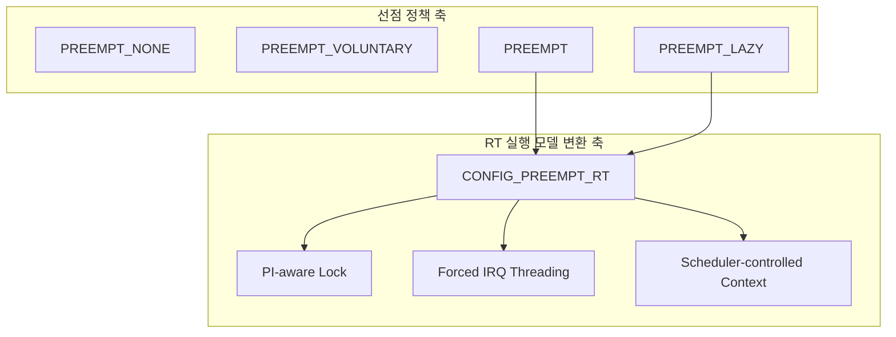

## 5.1 Preemption model

- `PREEMPT_NONE`: throughput 중심, 자연스러운 scheduling point까지 기다림
- `PREEMPT_VOLUNTARY`: 명시적인 voluntary point를 추가
- `PREEMPT`: critical section이 아닌 kernel code의 강제 선점 허용
- `PREEMPT_LAZY`: `SCHED_NORMAL` 태스크의 성급한 선점을 줄이되 RT/DL 태스크에는 즉시 선점 유지

## 5.2 PREEMPT_RT transformation

Linux v6.18의 `kernel/Kconfig.preempt`는 PREEMPT_RT를 다음 성격으로 설명한다.

- locking primitive를 preemptible, priority-inheritance aware variant로 교체
- interrupt threading 강제
- 긴 non-preemptible section을 분해하는 mechanism 도입
- entry, scheduler, low-level IRQ 같은 극저수준 경로를 제외한 대부분의 문맥을 scheduler 제어 아래로 이동

따라서 비교 실습은 다음 두 차원을 분리해야 한다.

```text
Image-full, preempt=full
Image-rt,   preempt=full
Image-rt,   preempt=lazy
```

---

# 6. ARM64 실행 문맥 지도

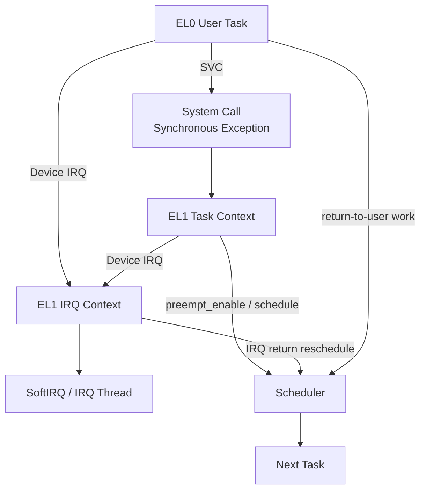

이번 강의에서 구분할 scheduler 진입 경로는 세 가지다.

| 상황 | 대표 진입 함수 | 중요한 전제 |
|---|---|---|
| 태스크가 자발적으로 block/yield | `schedule()` | 현재 태스크가 직접 scheduler 호출 |
| kernel task context에서 강제 선점 | `preempt_schedule()` | preemptible, IRQ enabled, resched pending |
| IRQ에서 EL1 kernel context로 복귀 | `preempt_schedule_irq()` | hardirq 종료, IRQ disabled 상태를 고려한 전용 경로 |

EL0로 복귀할 때는 generic exit-to-user work loop가 `schedule()`을 호출한다.

---

# 7. `thread_info`: 현재 태스크의 빠른 상태

Linux v6.18 ARM64의 `struct thread_info`는 task stack과 연결된 빠른 상태를 보관한다.

```c
struct thread_info {
    unsigned long       flags;
#ifdef CONFIG_ARM64_SW_TTBR0_PAN
    u64                 ttbr0;
#endif
    union {
        u64             preempt_count;
        struct {
#ifdef CONFIG_CPU_BIG_ENDIAN
            u32         need_resched;
            u32         count;
#else
            u32         count;
            u32         need_resched;
#endif
        } preempt;
    };
    ...
};
```

중요한 ARM64 thread flag는 다음과 같다.

```c
#define TIF_NEED_RESCHED        1
#define TIF_NEED_RESCHED_LAZY   2
```

- `TIF_NEED_RESCHED`: 일반적인 즉시 reschedule 요청
- `TIF_NEED_RESCHED_LAZY`: lazy preemption을 위한 별도 요청

주의할 점은 `thread_info.flags`의 TIF flag와 `preempt_count`에 fold된 architecture-specific need-resched 상태가 서로 연결되어 사용된다는 점이다.

---

# 8. `preempt_count`는 무엇을 나타내는가?

generic header의 논리적 bit 영역은 다음과 같다.

```text
bits  0..7   PREEMPT count
bits  8..15  SOFTIRQ state
bits 16..19  HARDIRQ state
bits 20..23  NMI state
```

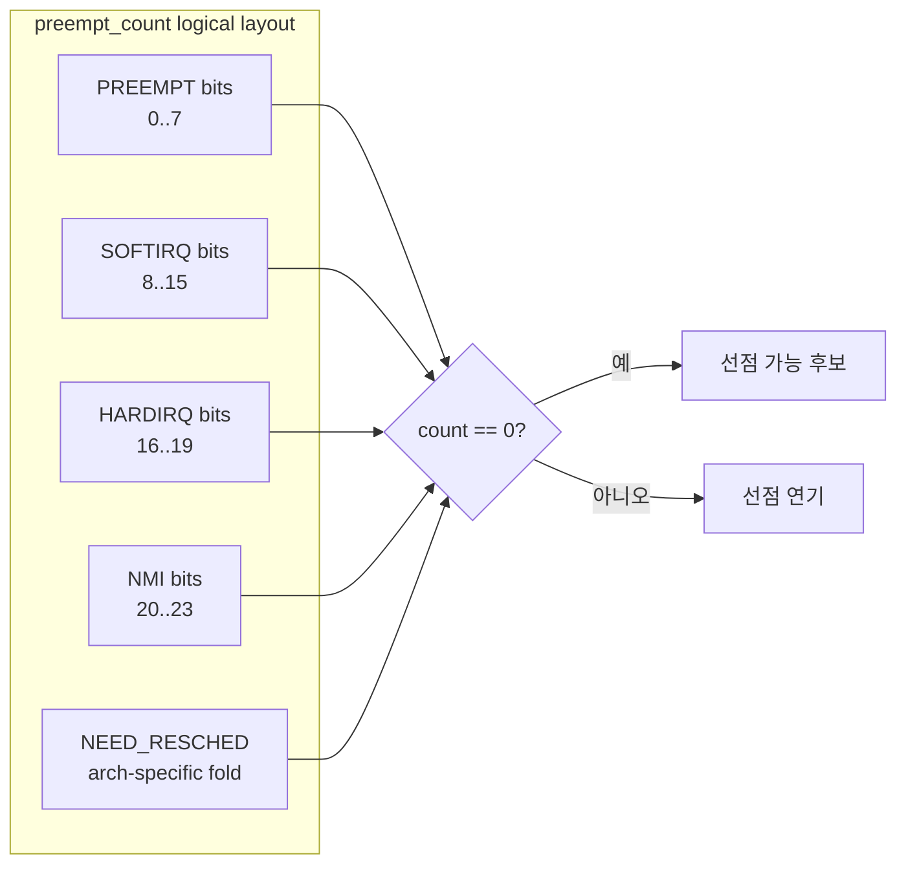

## 8.1 단순한 숫자가 아닌 context encoding

`preempt_count`가 증가하는 대표 상황은 다음과 같다.

- `preempt_disable()` 영역
- hard IRQ context
- softirq/bottom-half 관련 상태
- NMI context
- 일부 lock semantics

따라서 `preempt_count`는 단순히 “중첩된 preempt_disable 횟수”만 나타내지 않는다.

## 8.2 PREEMPT_RT에서 lock offset 차이

v6.18 `include/linux/preempt.h`에는 다음과 같은 핵심 차이가 있다.

```c
#if defined(CONFIG_PREEMPT_RT)
# define PREEMPT_LOCK_OFFSET  0
#else
# define PREEMPT_LOCK_OFFSET  PREEMPT_DISABLE_OFFSET
#endif
```

설계 의미:

> PREEMPT_RT의 일반 RT lock은 lock 획득만으로 kernel preemption을 막는 장치가 아니다.

따라서 driver가 `spin_lock()` 이후 per-CPU data에 안전하게 접근할 수 있다고 암묵적으로 가정하면 RT에서 문제가 될 수 있다. 실제 atomicity가 필요하면 execution context와 lock type을 다시 검토해야 한다.

---

# 9. ARM64의 need-resched fold

`arch/arm64/include/asm/preempt.h`는 bit 32를 `PREEMPT_NEED_RESCHED`로 사용한다.

```c
#define PREEMPT_NEED_RESCHED  BIT(32)
#define PREEMPT_ENABLED       PREEMPT_NEED_RESCHED
```

ARM64 구현에서 `need_resched` 필드의 의미는 active-low 형태다.

```c
static inline void set_preempt_need_resched(void)
{
    current_thread_info()->preempt.need_resched = 0;
}

static inline void clear_preempt_need_resched(void)
{
    current_thread_info()->preempt.need_resched = 1;
}
```

이 방식의 장점은 count 감소 결과와 need-resched 상태를 함께 검사하여, 선점 가능 상태로 돌아오는 순간을 빠르게 판단할 수 있다는 점이다.

```c
static inline bool should_resched(int preempt_offset)
{
    u64 pc = READ_ONCE(current_thread_info()->preempt_count);
    return pc == preempt_offset;
}
```

소스를 읽을 때 `need_resched == 0`이 “요청 있음”이라는 점을 놓치지 않아야 한다.

---

# 10. `preempt_disable()`과 `preempt_enable()`

개념적으로 다음과 같이 이해할 수 있다.

```c
#define preempt_disable() do {
    preempt_count_inc();
    barrier();
} while (0)

#define preempt_enable() do {
    barrier();
    if (unlikely(preempt_count_dec_and_test()))
        __preempt_schedule();
} while (0)
```

실제 macro는 config와 instrumentation에 따라 여러 variant로 확장된다. 핵심은 두 단계다.

1. `preempt_disable()`은 즉시 scheduling 요청을 삭제하지 않는다.
2. 높은 우선순위 task가 깨어나면 need-resched 상태는 pending으로 남을 수 있다.
3. 마지막 `preempt_enable()`이 count를 0으로 만들고 reschedule이 필요하면 `preempt_schedule()`로 진입한다.

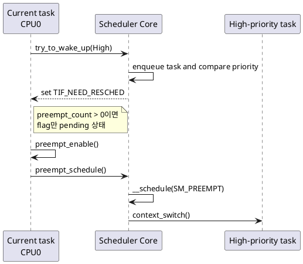

## 10.1 왜 단순히 `schedule()`을 직접 호출하지 않는가?

`preempt_schedule()`은 강제 선점 문맥에 맞는 검사를 하고, tracing·RCU·preempt notifier와 결합된 scheduler 진입 방식을 제공한다. 반면 일반 `schedule()`은 현재 task가 blocking 또는 명시적 scheduling point에 들어가는 경로다.

---

# 11. Wake-up과 scheduling은 별개다

scheduler wake-up 경로의 핵심은 다음과 같다.

```text
wake source
  -> try_to_wake_up()
  -> target runqueue에 enqueue
  -> 현재 task와 priority/class 비교
  -> reschedule flag 설정
  -> 필요하면 remote CPU에 reschedule IPI
```

그 뒤에야 현재 CPU가 legal preemption point에 도달한다.

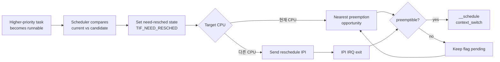

## 11.1 Local wake-up

현재 CPU에서 실행할 높은 우선순위 태스크가 깨어난 경우:

- current task의 need-resched 상태를 설정
- 현재 문맥이 preemptible이면 빠른 선점
- preempt-disabled이면 flag를 유지하고 enable 시점까지 대기

## 11.2 Remote wake-up

다른 CPU의 runqueue에 들어간 태스크가 그 CPU의 current보다 우선할 경우:

- target CPU의 reschedule 상태 설정
- 필요 시 reschedule IPI 전송
- target CPU가 IPI IRQ를 처리한 뒤 IRQ return path에서 scheduler 진입

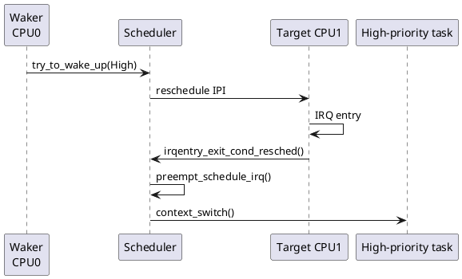

---

# 12. Scheduler core 진입점

## 12.1 `schedule()`

태스크가 직접 scheduler로 들어가는 대표 경로다.

```c
asmlinkage __visible void __sched schedule(void)
{
    struct task_struct *tsk = current;

    sched_submit_work(tsk);
    do {
        preempt_disable();
        __schedule_loop(SM_NONE);
        sched_preempt_enable_no_resched();
    } while (need_resched());
    sched_update_worker(tsk);
}
```

핵심 관찰:

- `schedule()` 자체도 scheduler 내부 실행을 위해 preemption 상태를 관리한다.
- schedule에서 돌아왔더라도 다시 need-resched가 설정되면 loop를 반복할 수 있다.

## 12.2 `preempt_schedule()`

kernel task context에서 강제 선점이 가능한 지점에 사용된다.

개념 흐름:

```text
preempt_enable()
  -> preempt_count_dec_and_test()
  -> __preempt_schedule()
  -> preempt_schedule()
  -> preempt_schedule_common()
  -> __schedule_loop(SM_PREEMPT)
```

`preempt_schedule_common()`은 scheduler 진입 전에 preempt notifier와 RCU context tracking을 정리하고, scheduler에서 돌아온 뒤 복원한다.

## 12.3 `preempt_schedule_irq()`

IRQ를 처리하고 kernel context로 복귀할 때 사용한다.

이 경로는 다음 전제를 확인한다.

```text
BUG_ON(preempt_count() != 0)
BUG_ON(!irqs_disabled())
```

즉, hard IRQ accounting은 끝났지만 architecture return code는 여전히 IRQ-disabled 상태인 특별한 지점이다. scheduler를 실행하는 동안 필요한 형태로 IRQ를 다시 열고 닫는다.

---

# 13. `__schedule()`의 역할

`__schedule()`은 실제 task 선택과 context switch를 수행하는 scheduler core다.

단순화하면 다음 순서다.

```text
1. 현재 runqueue lock 획득
2. current task 상태와 dequeue 필요 여부 처리
3. pick_next_task()
4. clear_tsk_need_resched(prev)
5. runqueue accounting 갱신
6. prev != next이면 context_switch()
7. lock 및 preemption 상태 복원
```

중요한 구분:

- `need_resched`는 “scheduler에 들어가라”는 요청이다.
- 다음 task를 실제로 고르는 것은 `__schedule()`과 scheduling class다.
- 높은 우선순위라고 생각한 task가 선택되지 않았다면 3강의 scheduling class, priority, affinity, throttling을 확인해야 한다.

---

# 14. ARM64 exception vector 큰 그림

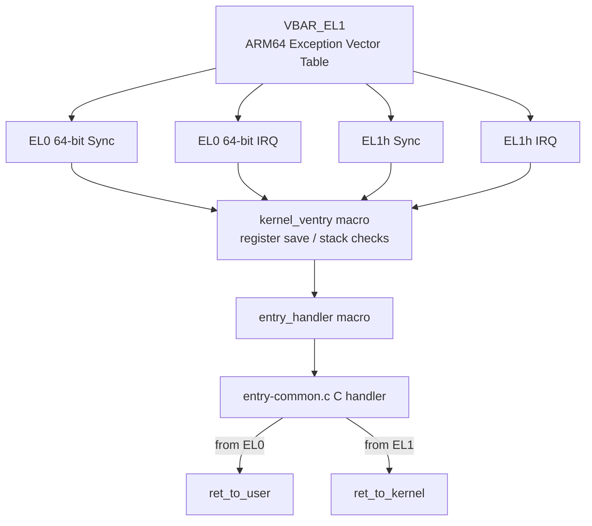

## 14.1 `kernel_ventry`

`arch/arm64/kernel/entry.S`의 `kernel_ventry` macro는 exception vector slot의 저수준 진입부다.

주요 역할:

- `pt_regs` 공간 확보
- stack overflow 검사
- vector별 handler label로 분기

## 14.2 `entry_handler`

단순화한 구조는 다음과 같다.

```asm
.macro entry_handler el:req, ht:req, regsize:req, label:req
SYM_CODE_START_LOCAL(el\el\ht\()_\regsize\()_\label)
    kernel_entry \el, \regsize
    mov x0, sp
    bl  el\el\ht\()_\regsize\()_\label\()_handler
    .if \el == 0
    b   ret_to_user
    .else
    b   ret_to_kernel
    .endif
SYM_CODE_END(...)
.endm
```

핵심:

- assembly는 register/stack/exception state를 보존한다.
- 구체적인 IRQ 처리와 generic entry 연동은 C handler로 넘긴다.
- 원래 문맥이 EL0인지 EL1인지에 따라 return path가 갈라진다.

---

# 15. EL0에서 IRQ를 받은 경우

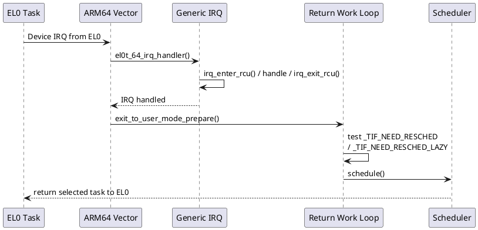

EL0에서 IRQ가 들어오면 user mode로 돌아가기 전에 generic user-return work를 처리할 수 있다.

v6.18 `kernel/entry/common.c`의 exit loop는 `_TIF_NEED_RESCHED | _TIF_NEED_RESCHED_LAZY`가 설정되어 있으면 `schedule()`을 호출한다.

이 경로에서 signal, notify-resume, uprobes 같은 다른 pending work도 함께 처리될 수 있다.

---

# 16. EL1 task context에서 IRQ를 받은 경우

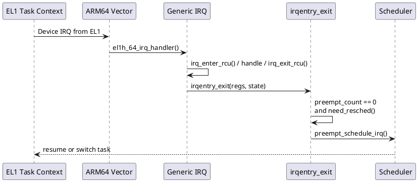

generic IRQ exit code는 다음을 구분한다.

- IRQ가 user mode를 interrupted했는가?
- kernel mode를 interrupted했는가?
- 현재 preempt count가 0인가?
- need-resched가 pending인가?

kernel mode 복귀 조건에서 선점이 필요하면 `preempt_schedule_irq()`를 호출한다.

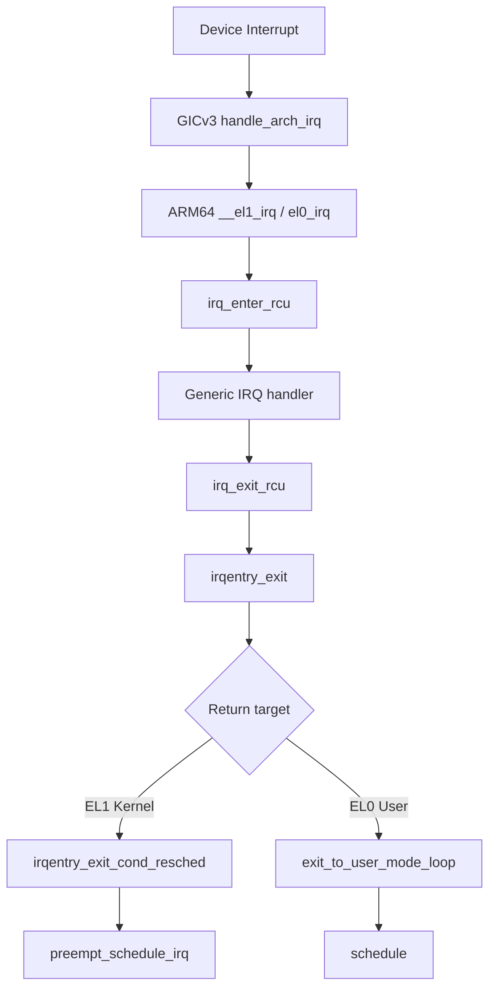

---

# 17. System call return 경로

system call도 EL0에서 EL1로 진입한 뒤 다시 EL0로 복귀한다.

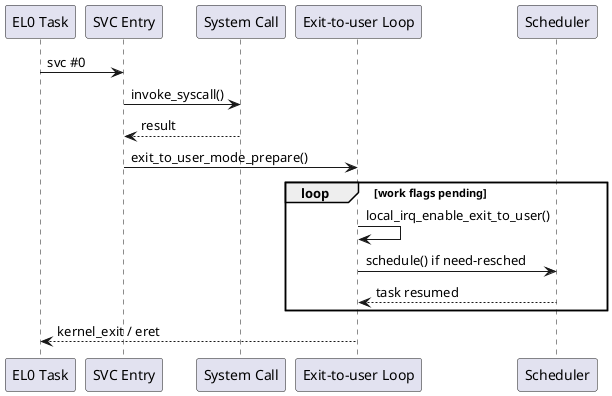

따라서 high-priority task가 system call 실행 중에 깨어난 경우 가능한 경로는 두 가지다.

1. system call 내부에서 kernel preemption이 가능한 지점에 도달해 `preempt_schedule()`
2. 선점 불가능 구간을 지나 user return loop에서 `schedule()`

PREEMPT_RT의 목표는 2번까지 기다려야 하는 긴 영역을 줄이는 것이다.

---

# 18. FULL과 LAZY의 차이

`PREEMPT_LAZY`는 full preemption과 유사하지만 `SCHED_NORMAL` task의 선점을 덜 성급하게 수행해 lock-holder preemption과 throughput 손실을 줄이는 모델이다.

중요한 원칙:

```text
SCHED_NORMAL -> lazy request를 사용할 수 있음
SCHED_FIFO/RR/DEADLINE -> 즉시 reschedule 요청 유지
```

따라서 Automotive 구성에서 다음과 같이 사용할 수 있다.

```text
SCHED_FIFO Safety/Control thread
  -> immediate preemption

SCHED_OTHER VLA orchestration / logging
  -> lazy preemption으로 불필요한 context switch 완화 가능
```

그러나 `preempt=lazy`가 제품에서 더 좋다는 결론은 자동으로 나오지 않는다. latency percentile, lock contention, throughput, power를 같은 workload에서 비교해야 한다.

---

# 19. PREEMPT_DYNAMIC

`CONFIG_PREEMPT_DYNAMIC`은 하나의 kernel image가 boot parameter로 preemption behavior를 선택할 수 있게 한다.

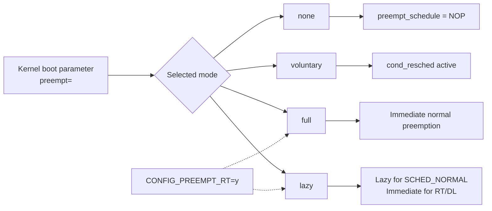

v6.18 scheduler dynamic mode logic에서 PREEMPT_RT build는 `none`과 `voluntary`를 허용하지 않고 `full`과 `lazy`를 의미 있는 선택으로 다룬다.

실습 비교:

```text
Image-rt + preempt=full
Image-rt + preempt=lazy
```

주의:

- runtime switching 지원 여부와 exposed debugfs interface는 architecture/config에 따라 확인해야 한다.
- boot log와 `/proc/cmdline`, `/proc/config.gz`를 함께 보아야 한다.
- command line 문자열만 보고 실제 RT kernel이라고 판단하면 안 된다. `/sys/kernel/realtime`와 config를 확인한다.

---

# 20. 소스 리딩 지도

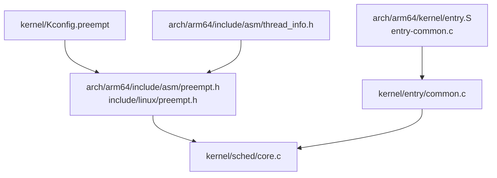

## 20.1 추천 읽기 순서

1. `kernel/Kconfig.preempt`
2. `arch/arm64/Kconfig`
3. `arch/arm64/include/asm/thread_info.h`
4. `arch/arm64/include/asm/preempt.h`
5. `include/linux/preempt.h`
6. `kernel/sched/core.c`
7. `arch/arm64/kernel/entry.S`
8. `arch/arm64/kernel/entry-common.c`
9. `kernel/entry/common.c`

## 20.2 함수 검색 목록

```bash
git grep -n 'config PREEMPT_RT'
git grep -n 'PREEMPT_NEED_RESCHED'
git grep -n 'preempt_schedule_common'
git grep -n 'preempt_schedule_irq'
git grep -n 'raw_irqentry_exit_cond_resched'
git grep -n 'exit_to_user_mode_loop'
git grep -n 'entry_handler el:req'
git grep -n 'el1h_64_irq_handler'
```

---

# 21. PREEMPT_RT 빌드 전제

ARM64 v6.18 Kconfig는 다음 capability를 선택한다.

```text
ARCH_HAS_PREEMPT_LAZY
ARCH_SUPPORTS_RT
```

`CONFIG_PREEMPT_RT`의 주요 dependency는 다음과 같다.

```text
EXPERT
ARCH_SUPPORTS_RT
!COMPILE_TEST
```

따라서 menuconfig에서 RT 항목이 보이지 않으면 우선 확인할 것은 다음이다.

1. target architecture가 `ARCH_SUPPORTS_RT`를 select하는가?
2. `CONFIG_EXPERT=y`인가?
3. vendor tree가 mainline Kconfig를 변형하지 않았는가?
4. conflicting config fragment가 RT를 다시 끄지 않았는가?

---

# 22. 실습 아키텍처

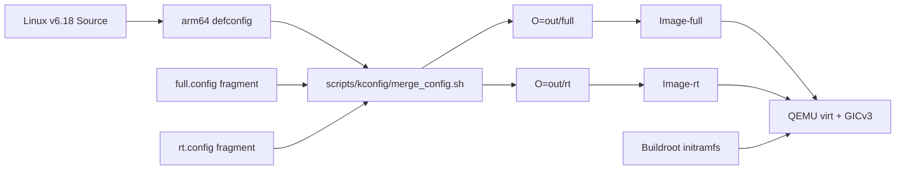

실습은 동일한 source, compiler, rootfs, QEMU machine을 사용하고 kernel config와 boot parameter만 바꾼다. 그래야 비교가 가능하다.

---

# 23. 실습 1: FULL과 RT 커널 빌드

## 23.1 환경 변수

```bash
export LINUX_SRC=$HOME/src/linux
export BUILDROOT_CPIO=$HOME/work/buildroot/output/images/rootfs.cpio
export CROSS_COMPILE=aarch64-linux-gnu-
export ARCH=arm64
```

## 23.2 FULL fragment

```text
CONFIG_EXPERT=y
CONFIG_PREEMPT=y
# CONFIG_PREEMPT_LAZY is not set
# CONFIG_PREEMPT_RT is not set
CONFIG_PREEMPT_DYNAMIC=y
CONFIG_HIGH_RES_TIMERS=y
CONFIG_IKCONFIG=y
CONFIG_IKCONFIG_PROC=y
CONFIG_DEBUG_FS=y
CONFIG_TRACING=y
CONFIG_FTRACE=y
```

## 23.3 RT fragment

```text
CONFIG_EXPERT=y
CONFIG_PREEMPT=y
CONFIG_PREEMPT_RT=y
CONFIG_PREEMPT_DYNAMIC=y
CONFIG_HIGH_RES_TIMERS=y
CONFIG_IKCONFIG=y
CONFIG_IKCONFIG_PROC=y
CONFIG_DEBUG_FS=y
CONFIG_TRACING=y
CONFIG_FTRACE=y
```

## 23.4 Merge와 build

```bash
make -C "$LINUX_SRC" ARCH=arm64 O=out/full defconfig

"$LINUX_SRC/scripts/kconfig/merge_config.sh" \
    -m -O out/full out/full/.config 02_full_config.fragment

make -C "$LINUX_SRC" ARCH=arm64 O=out/full olddefconfig
make -C "$LINUX_SRC" ARCH=arm64 \
    CROSS_COMPILE=aarch64-linux-gnu- \
    O=out/full -j"$(nproc)" Image
```

RT도 output directory와 fragment만 바꿔 동일하게 빌드한다.

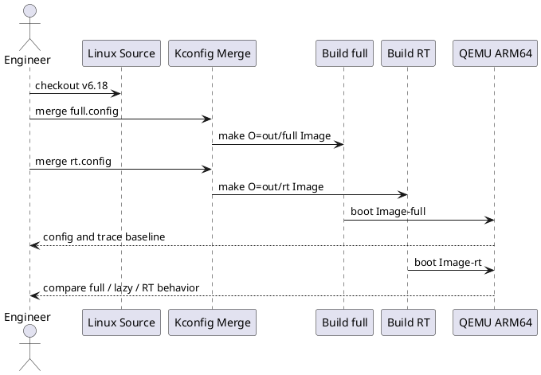

---

# 24. Config diff 읽기

```bash
$LINUX_SRC/scripts/diffconfig config-full config-rt
```

집중 확인:

```bash
grep -E \
  'CONFIG_(PREEMPT|PREEMPT_RT|PREEMPT_DYNAMIC|HIGH_RES_TIMERS|IRQ_FORCED_THREADING)' \
  config-full config-rt
```

예상 의미:

| 설정 | FULL | RT | 해석 |
|---|---:|---:|---|
| `CONFIG_PREEMPT` | y | y | 기본 선점 정책 선택 |
| `CONFIG_PREEMPT_RT` | n | y | RT transformation 활성화 |
| `CONFIG_PREEMPT_DYNAMIC` | y | y | boot-time mode 선택 |
| `CONFIG_HIGH_RES_TIMERS` | y | y | 고해상도 timer 기반 |
| forced IRQ threading 관련 capability | 환경 의존 | RT에 필수 | 실제 IRQ thread 확인 필요 |

config diff만으로 driver가 RT-safe하다는 결론을 내려서는 안 된다.

---

# 25. QEMU 부팅

```bash
qemu-system-aarch64 \
    -machine virt,gic-version=3 \
    -cpu cortex-a72 \
    -smp 4 \
    -m 2048 \
    -kernel Image-rt \
    -initrd rootfs.cpio \
    -append 'console=ttyAMA0 rdinit=/sbin/init preempt=full' \
    -nographic
```

LAZY 비교:

```text
preempt=lazy
```

FULL kernel과 RT kernel을 같은 command line으로 각각 부팅하여 kernel image 차이를 먼저 비교한다. 그다음 RT image에서 full/lazy를 비교한다.

---

# 26. Runtime 검증

```bash
uname -a
cat /proc/cmdline
cat /sys/kernel/realtime
zcat /proc/config.gz | grep -E \
  'CONFIG_PREEMPT(_RT|_LAZY|_DYNAMIC)?=|CONFIG_HIGH_RES_TIMERS='
```

해석:

- `/sys/kernel/realtime == 1`: 실행 중 kernel이 PREEMPT_RT build임
- `CONFIG_PREEMPT_RT=y`: build-time RT transformation 확인
- `/proc/cmdline`: `preempt=full` 또는 `preempt=lazy` 요청 확인
- `uname` 문자열: 참고 신호이며 단독 판정 근거로 사용하지 않음

debugfs가 제공하는 경우 현재 dynamic preemption 상태를 추가 확인한다.

```bash
mount -t debugfs debugfs /sys/kernel/debug
cat /sys/kernel/debug/sched/preempt
```

이 interface는 kernel version과 config에 따라 다를 수 있으므로 존재 여부를 먼저 검사한다.

---

# 27. 실습 2: FULL과 LAZY 비교

실험 조건:

```text
Kernel image : Image-rt 동일
Rootfs       : 동일
QEMU options : 동일
vCPU         : 4
변경 항목    : preempt=full vs preempt=lazy
```

관찰 항목:

1. boot log의 preemption mode
2. `SCHED_OTHER` CPU-bound task 간 context switch 빈도
3. 높은 우선순위 `SCHED_FIFO` task wake-up 지연
4. `sched_switch`, `sched_wakeup` trace
5. cyclictest maximum과 percentile

예상:

- RT task의 즉시 선점 특성은 유지되어야 한다.
- normal task끼리의 선점 시점은 lazy에서 달라질 수 있다.
- QEMU host noise 때문에 단회 maximum만으로 결론을 내리면 안 된다.

---

# 28. 실습 3: ftrace로 call-flow 확인

## 28.1 tracepoint

```bash
echo 1 > events/sched/sched_wakeup/enable
echo 1 > events/sched/sched_switch/enable
echo 1 > events/irq/irq_handler_entry/enable
echo 1 > events/irq/irq_handler_exit/enable
```

## 28.2 function filtering

지원 함수 확인:

```bash
grep -E \
  'preempt_schedule$|preempt_schedule_irq$|exit_to_user_mode_loop' \
  available_filter_functions
```

function tracer 예:

```bash
echo function > current_tracer
printf '%s\n' \
  preempt_schedule \
  preempt_schedule_irq \
  schedule \
  __schedule > set_ftrace_filter
```

## 28.3 읽는 순서

```text
sched_wakeup(target)
  -> irq_handler_exit 또는 kernel function return
  -> preempt_schedule / preempt_schedule_irq / schedule
  -> sched_switch(prev -> target)
```

trace timestamp에서 다음을 계산한다.

```text
Wake-to-switch = t(sched_switch to target) - t(sched_wakeup target)
```

이 값이 크면 다음 decision tree로 원인을 좁힌다.

---

# 29. 디버깅 decision tree

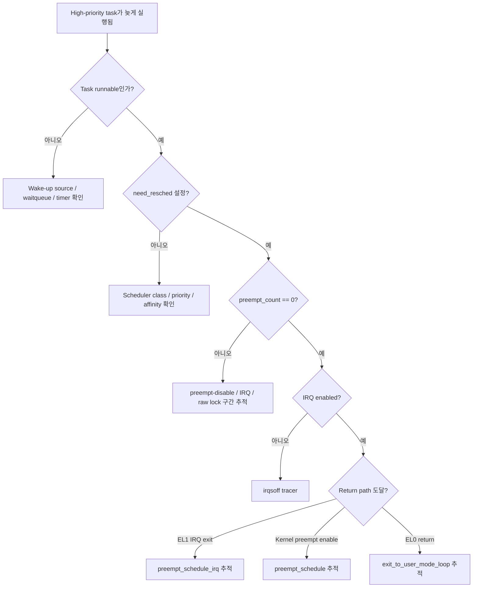

## 29.1 Task가 runnable이 아님

- timer가 만료되지 않음
- waitqueue condition이 false
- IRQ/fence completion이 오지 않음
- affinity 대상 CPU가 offline 또는 제한됨

## 29.2 Runnable이지만 reschedule 요청 없음

- 실제 scheduler priority가 생각과 다름
- CFS와 RT class를 혼동
- target CPU가 다름
- throttling/admission control 영향

## 29.3 Reschedule pending인데 실행 지연

- preempt-disabled section
- IRQ-disabled section
- hard IRQ/NMI
- `raw_spinlock_t` critical section
- scheduler 내부

---

# 30. 흔한 오해와 오류

## 오해 1: `TIF_NEED_RESCHED`가 설정되면 즉시 context switch한다

아니다. flag는 요청이다. 현재 문맥이 legal scheduling point에 도달해야 한다.

## 오해 2: `preempt_count == 0`이면 무조건 schedule한다

아니다. reschedule 요청, IRQ state, return context를 함께 본다.

## 오해 3: IRQ handler가 끝나면 user RT task가 바로 실행된다

threaded IRQ, softirq, wake-up, priority 비교, IRQ return path가 모두 연결되어야 한다.

## 오해 4: PREEMPT_RT이면 `preempt=lazy`를 사용할 수 없다

v6.18에서는 RT build도 full/lazy 선택을 지원하도록 dynamic model이 구성되어 있다. none/voluntary와는 구분한다.

## 오해 5: QEMU cyclictest maximum이 제품 보증값이다

아니다. host scheduler, virtualization, virtual timer, console I/O의 영향을 받는다.

---

# 31. Automotive NPU 적용 관점

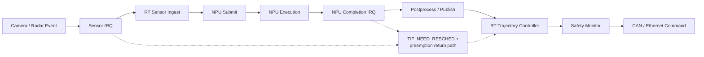

PREEMPT_RT가 직접 제어하는 핵심은 NPU matrix 연산시간이 아니라 다음 CPU-side gap이다.

```text
Sensor IRQ completion -> ingest thread first instruction
NPU completion IRQ -> result consumer first instruction
Trajectory publish -> controller first instruction
Safety timeout -> monitor first instruction
```

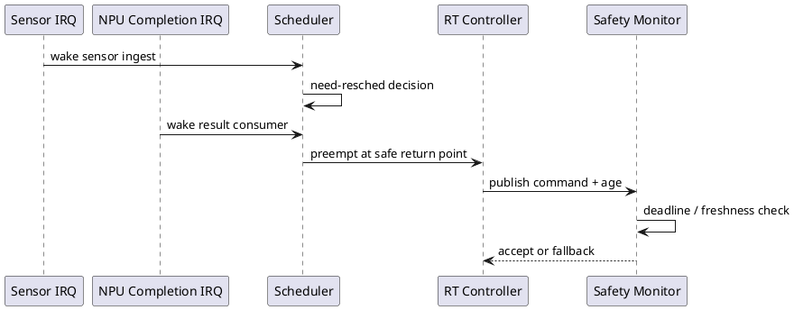

## 31.1 Timing budget 연결

```text
T_observation_to_action =
    T_sensor
  + T_irq_entry
  + T_wakeup_to_switch
  + T_preprocess
  + T_npu_queue
  + T_npu_execute
  + T_completion_irq
  + T_completion_to_controller
  + T_control
  + T_vehicle_tx
```

2강의 source path는 `T_wakeup_to_switch`와 IRQ return latency를 분석하기 위한 기반이다.

---

# 32. 성능·동기화·ordering 관점

## 32.1 Performance

- `PREEMPT_FULL`은 context switch와 cache disruption을 늘릴 수 있다.
- `PREEMPT_LAZY`는 normal task의 lock-holder preemption을 줄이는 방향이다.
- PREEMPT_RT는 worst-case latency를 줄이는 대신 평균 throughput이 달라질 수 있다.
- 측정 kernel에서는 lockdep, debug preempt 같은 옵션의 overhead를 분리해야 한다.

## 32.2 Synchronization

- RT에서 일반 `spinlock_t`가 preemption disable을 의미하지 않는다.
- `raw_spinlock_t`는 여전히 실제 atomic spinning lock이므로 latency hotspot이 될 수 있다.
- per-CPU data 접근은 `local_lock_t` 등 의도에 맞는 primitive를 검토한다.

## 32.3 Memory ordering

preemption control은 CPU memory ordering primitive와 동일하지 않다.

```text
preempt_disable() != full memory barrier
```

공유 데이터 publish/consume에는 lock, atomic, acquire/release, explicit barrier 등 별도 ordering 설계가 필요하다.

---

# 33. 보안·안전 관점

## 33.1 Security

- 높은 우선순위 RT task의 CPU 독점은 denial-of-service 형태가 될 수 있다.
- untrusted workload에 RT priority 부여를 제한한다.
- `RLIMIT_RTPRIO`, capabilities, cgroup 정책을 검토한다.
- trace/debugfs는 production에서 민감한 timing·address 정보를 노출할 수 있다.

## 33.2 Functional safety

PREEMPT_RT는 다음을 자동으로 제공하지 않는다.

- WCET 증명
- deadline 보증서
- ISO 26262 ASIL 인증
- freedom from interference
- NPU hang recovery
- safety island 독립성

설계 관점에서 Linux RT controller와 safety MCU/RTOS의 책임 경계를 명확히 해야 한다.

---

# 34. 핵심 요약

1. Wake-up은 task를 runnable로 만들고 reschedule 요청을 설정하지만 즉시 실행을 뜻하지 않는다.
2. `preempt_count`는 task preemption뿐 아니라 softirq, hardirq, NMI 문맥을 함께 표현한다.
3. ARM64는 need-resched 상태를 `preempt_count`와 결합해 빠르게 검사한다.
4. `preempt_enable()`은 마지막 disable nesting을 벗어날 때 `preempt_schedule()`로 연결될 수 있다.
5. EL1 IRQ return은 generic entry code를 통해 `preempt_schedule_irq()`로 연결된다.
6. EL0 return work loop는 pending reschedule flag를 보고 `schedule()`을 호출한다.
7. PREEMPT_RT는 단순 full preemption이 아니라 lock과 IRQ 문맥을 포함하는 kernel transformation이다.
8. v6.18 ARM64는 RT와 lazy preemption capability를 모두 제공한다.
9. FULL/RT와 full/lazy를 서로 다른 비교 축으로 실험해야 한다.
10. QEMU에서는 절대 latency 보증이 아니라 call-flow와 상대 동작을 검증한다.

---

# 35. 퀴즈

## 35.1 객관식 4문항

### Q1
높은 우선순위 태스크가 runnable이 되었지만 현재 kernel code가 `preempt_disable()` 영역이라면 가장 올바른 설명은?

A. 태스크는 runnable이 되지 않는다.  
B. 즉시 `context_switch()`가 실행된다.  
C. reschedule 요청을 pending으로 두고 선점 가능한 지점까지 기다릴 수 있다.  
D. 반드시 user mode로 돌아간 뒤에만 실행된다.

### Q2
EL1 kernel context에서 IRQ를 처리한 뒤 reschedule이 필요할 때 대표적으로 연결되는 함수는?

A. `do_exit()`  
B. `preempt_schedule_irq()`  
C. `syscall_exit_to_user_mode()`  
D. `schedule_timeout()`

### Q3
PREEMPT_RT에서 `PREEMPT_LOCK_OFFSET`가 0인 의미와 가장 가까운 것은?

A. 모든 lock이 제거된다.  
B. 일반 RT lock 획득을 preemption disable로 간주하지 않는다.  
C. IRQ를 항상 disable한다.  
D. lock owner가 항상 CPU0에서 실행된다.

### Q4
동일한 RT kernel image에서 `preempt=full`과 `preempt=lazy`를 비교하는 주된 이유는?

A. ARM64와 x86을 비교하기 위해  
B. NPU clock을 바꾸기 위해  
C. normal task의 선점 정책을 바꾸면서 RT task 응답을 비교하기 위해  
D. Buildroot libc를 바꾸기 위해

## 35.2 참/거짓 2문항

### Q5
`TIF_NEED_RESCHED`가 설정되는 순간 반드시 즉시 context switch가 발생한다. (O/X)

### Q6
QEMU에서 얻은 maximum latency를 실제 Automotive SoC의 보증값으로 그대로 사용할 수 있다. (O/X)

## 35.3 단답형 2문항

### Q7
kernel task context에서 마지막 `preempt_enable()`이 reschedule을 감지했을 때 연결되는 대표 scheduler 진입 함수는?

### Q8
ARM64 exception vector base address를 가리키는 system register 이름은?

## 35.4 시나리오·디버깅 2문항

### Q9
ftrace에서 `sched_wakeup(H)`는 보이지만 4ms 뒤에야 `sched_switch(... -> H)`가 보인다. 그 사이 CPU는 하나의 kernel function 안에 있고 IRQ가 disabled 상태다. 가장 먼저 사용할 tracer와 확인 대상은?

### Q10
RT kernel에서 `preempt=lazy`로 부팅한 뒤 `SCHED_OTHER` worker의 context switch는 줄었지만 `SCHED_FIFO` controller latency가 악화되었다. 어떤 순서로 검증해야 하는가?

---

# 36. 정답과 해설

### A1: C
Wake-up과 context switch는 분리된다. task는 runnable이 되고 need-resched가 pending일 수 있지만, preempt-disabled 영역에서는 즉시 scheduler로 들어갈 수 없다.

### A2: B
EL1 IRQ return의 conditional reschedule 경로는 generic irqentry exit를 통해 `preempt_schedule_irq()`로 연결된다.

### A3: B
PREEMPT_RT의 일반 lock은 선점을 막는 atomic spinlock과 같은 의미가 아니다. 실제 low-level atomicity는 `raw_spinlock_t` 등 별도 primitive를 사용한다.

### A4: C
`preempt=lazy`는 normal task의 성급한 선점을 줄이는 정책이다. RT/DL task의 즉시 선점 요구와 throughput 간 균형을 비교한다.

### A5: X
flag는 요청이며 legal scheduling point가 필요하다.

### A6: X
QEMU는 host scheduling과 virtual timing 영향을 받는다.

### A7
`preempt_schedule()` 또는 dynamic wrapper인 `__preempt_schedule()`.

### A8
`VBAR_EL1`.

### A9
`irqsoff` tracer 또는 `rtla osnoise/timerlat`의 IRQ-disabled 분석을 우선 사용한다. 긴 IRQ-disabled function과 `raw_spinlock_t`, local IRQ disable nesting을 확인한다.

### A10
다음 순서가 적절하다.

1. controller가 실제 `SCHED_FIFO`인지 확인
2. priority와 CPU affinity 확인
3. wake-up부터 `sched_switch`까지 trace
4. 해당 구간의 IRQ/preempt disable 여부 확인
5. RT throttling과 higher-priority IRQ/thread 간섭 확인
6. 같은 workload에서 full/lazy 반복 측정

LAZY가 원인이라는 결론을 먼저 내리면 안 된다.

---

# 37. 5분 복습

## 37.1 다섯 질문

1. Wake-up과 scheduling의 차이는?
2. `preempt_count`가 0이 아닌 대표 이유 세 가지는?
3. `preempt_schedule()`과 `preempt_schedule_irq()`의 호출 문맥 차이는?
4. EL0 return과 EL1 return의 reschedule 경로는 어떻게 다른가?
5. PREEMPT_RT와 `preempt=lazy`는 왜 동시에 존재할 수 있는가?

## 37.2 Flash Card 12개

| 앞면 | 뒷면 |
|---|---|
| Runnable | runqueue에서 CPU를 기다릴 수 있는 상태 |
| `TIF_NEED_RESCHED` | 즉시 reschedule 요청 flag |
| `TIF_NEED_RESCHED_LAZY` | lazy preemption 요청 flag |
| `preempt_count` | preempt/softirq/hardirq/NMI 문맥 상태 encoding |
| `preempt_disable()` | task preemption nesting 증가 |
| `preempt_enable()` | nesting 감소 후 reschedule 검사 |
| `schedule()` | 일반 scheduler 진입점 |
| `preempt_schedule()` | kernel task context의 강제 선점 진입점 |
| `preempt_schedule_irq()` | IRQ에서 kernel context로 복귀할 때의 선점 진입점 |
| `VBAR_EL1` | ARM64 exception vector base register |
| `PREEMPT_DYNAMIC` | boot/runtime 선택 가능한 preemption behavior |
| `ARCH_SUPPORTS_RT` | architecture가 PREEMPT_RT를 지원함을 나타내는 capability |

## 37.3 빈칸 채우기 5개

1. 높은 우선순위 태스크가 runnable이 되면 scheduler는 보통 `TIF___________`를 설정한다.
2. EL1 IRQ return에서 사용하는 대표 함수는 `preempt_schedule___________()`이다.
3. ARM64 exception vector base register는 `__________`이다.
4. RT build 여부는 `/sys/kernel/__________`로 확인할 수 있다.
5. QEMU 실습에서는 절대 latency 보증보다 call-flow와 설정 간 `__________` 비교가 중요하다.

정답: `NEED_RESCHED`, `irq`, `VBAR_EL1`, `realtime`, `상대적`.

## 37.4 기억할 문장 5개

1. **Wake-up은 실행이 아니라 실행 자격과 reschedule 요청을 만든다.**
2. **need-resched flag는 요청이고, return path가 실행 기회를 만든다.**
3. **`preempt_count`는 단순 nesting counter가 아니라 실행 문맥 encoding이다.**
4. **PREEMPT_RT는 선점 정책 하나가 아니라 kernel execution model transformation이다.**
5. **QEMU에서는 구조를 증명하고, target hardware에서 시간을 검증한다.**

---

# 38. 실습 과제

## 과제 1. Config 산출물

다음 파일을 제출한다.

```text
02-config-full
02-config-rt
02-config-diff.txt
```

확인 항목:

- `CONFIG_PREEMPT_RT`
- `CONFIG_PREEMPT_DYNAMIC`
- tracing config
- ARM64 RT capability

## 과제 2. ARM64 preemption call-flow

`arm64-preemption-callflow.md`에 다음 세 경로를 그린다.

1. local wake-up -> `preempt_enable()` -> `preempt_schedule()`
2. EL1 IRQ -> `irqentry_exit()` -> `preempt_schedule_irq()`
3. EL0 system call return -> exit-to-user loop -> `schedule()`

각 화살표 옆에 source path와 function을 기록한다.

## 과제 3. FULL/LAZY trace 비교

동일한 RT image를 다음으로 각각 부팅한다.

```text
preempt=full
preempt=lazy
```

`SCHED_OTHER` CPU-bound workload와 `SCHED_FIFO` periodic task를 함께 실행하고 아래를 기록한다.

- context switch count
- wake-to-switch maximum
- 99.9 percentile
- outlier call-flow

## 과제 4. Driver code audit

현재 담당 driver에서 다음 패턴을 찾는다.

```text
preempt_disable()
local_irq_disable()
spin_lock_irqsave()
raw_spin_lock*
local_bh_disable()
```

각 구간이 왜 필요한지, bounded한지, RT에서 다른 primitive로 바꿀 수 있는지 기록한다.

---

# 39. 다음 강의 전 체크리스트

3강은 Linux Real-Time Scheduler를 다룬다. 다음을 확인하고 온다.

- [ ] `task_struct`와 runqueue의 관계를 설명할 수 있다.
- [ ] `SCHED_FIFO`, `SCHED_RR`, `SCHED_DEADLINE`, `SCHED_OTHER`를 구분한다.
- [ ] Linux RT priority 1~99에서 숫자가 클수록 높은 우선순위임을 안다.
- [ ] `sched_wakeup`과 `sched_switch` trace를 수집할 수 있다.
- [ ] CPU affinity를 `taskset`으로 설정할 수 있다.
- [ ] 2강의 세 scheduler 진입 경로를 다시 그릴 수 있다.

---

# 40. Reference와 Source Reading Map

## 공식 문서

- Linux v6.18 Real-time preemption theory  
  <https://docs.kernel.org/6.18/core-api/real-time/theory.html>
- How realtime kernels differ  
  <https://docs.kernel.org/6.18/core-api/real-time/differences.html>
- ARM64 kernel source  
  <https://github.com/torvalds/linux/tree/v6.18/arch/arm64>
- QEMU ARM `virt` machine  
  <https://www.qemu.org/docs/master/system/arm/virt.html>

## Upstream source

| 목적 | 파일 |
|---|---|
| Preemption model Kconfig | `kernel/Kconfig.preempt` |
| ARM64 RT/lazy capability | `arch/arm64/Kconfig` |
| ARM64 thread flags | `arch/arm64/include/asm/thread_info.h` |
| ARM64 preempt fold | `arch/arm64/include/asm/preempt.h` |
| Generic preemption API | `include/linux/preempt.h` |
| Scheduler core | `kernel/sched/core.c` |
| ARM64 vector entry | `arch/arm64/kernel/entry.S` |
| ARM64 C entry handler | `arch/arm64/kernel/entry-common.c` |
| Generic entry/exit work | `kernel/entry/common.c` |

## Tag 고정 링크

- <https://github.com/torvalds/linux/blob/v6.18/kernel/Kconfig.preempt>
- <https://github.com/torvalds/linux/blob/v6.18/include/linux/preempt.h>
- <https://github.com/torvalds/linux/blob/v6.18/arch/arm64/include/asm/preempt.h>
- <https://github.com/torvalds/linux/blob/v6.18/arch/arm64/include/asm/thread_info.h>
- <https://github.com/torvalds/linux/blob/v6.18/arch/arm64/kernel/entry.S>
- <https://github.com/torvalds/linux/blob/v6.18/arch/arm64/kernel/entry-common.c>
- <https://github.com/torvalds/linux/blob/v6.18/kernel/entry/common.c>
- <https://github.com/torvalds/linux/blob/v6.18/kernel/sched/core.c>

---

# 부록 A. Source-reading worksheet

| 질문 | 찾을 symbol | 파일 | 관찰 결과 |
|---|---|---|---|
| RT Kconfig가 무엇을 바꾸는가? | `config PREEMPT_RT` | `kernel/Kconfig.preempt` | |
| ARM64가 RT를 지원하는가? | `ARCH_SUPPORTS_RT` | `arch/arm64/Kconfig` | |
| lazy flag 번호는? | `TIF_NEED_RESCHED_LAZY` | `arch/arm64/include/asm/thread_info.h` | |
| need-resched bit는? | `PREEMPT_NEED_RESCHED` | `arch/arm64/include/asm/preempt.h` | |
| preempt enable 후 호출은? | `preempt_enable` | `include/linux/preempt.h` | |
| kernel preemption 진입은? | `preempt_schedule` | `kernel/sched/core.c` | |
| IRQ return 진입은? | `preempt_schedule_irq` | `kernel/sched/core.c` | |
| EL1 IRQ vector는? | `kernel_ventry` | `arch/arm64/kernel/entry.S` | |
| user-return resched는? | `exit_to_user_mode_loop` | `kernel/entry/common.c` | |

# 부록 B. 결과 기록 템플릿

```text
Kernel source tag:
Compiler:
QEMU version:
Buildroot version:
Host architecture:

Image-full SHA256:
Image-rt SHA256:

Case 1: Image-full + preempt=full
  /sys/kernel/realtime:
  wake-to-switch max:
  notes:

Case 2: Image-rt + preempt=full
  /sys/kernel/realtime:
  wake-to-switch max:
  notes:

Case 3: Image-rt + preempt=lazy
  /sys/kernel/realtime:
  wake-to-switch max:
  notes:

Largest outlier call-flow:
Hypothesis:
Next experiment:
```
