# PREEMPT_RT 3강 상세 강의노트

## Linux Real-Time Scheduler: `SCHED_FIFO`, `SCHED_RR`, `SCHED_DEADLINE`

- 과정: PREEMPT_RT 10강
- 이번 강의: 3강
- 대상: Linux Kernel, Embedded BSP, Automotive SoC 경험이 있는 중급 이상 엔지니어
- 예상 강의 시간: 120~180분
- 기준 Linux: `v6.18`
- 기준 commit: `7d0a66e4bb9081d75c82ec4957c50034cb0ea449`
- 실습 환경: QEMU ARM64 `virt` + GICv3 + 4 vCPU + Buildroot initramfs
- 이전 강의: ARM64 kernel preemption과 `TIF_NEED_RESCHED`, `preempt_schedule()`, `preempt_schedule_irq()`
- 다음 강의: `rtmutex`, Priority Inheritance, PREEMPT_RT locking

> **이번 강의의 핵심 질문**  
> 높은 우선순위 태스크가 runnable이 된 뒤, Linux scheduler는 어떤 자료구조와 정책을 사용해 어떤 태스크를 다음에 실행할 것인가?

### 문서의 가정과 범위

1. 커널 소스는 Linux `v6.18` tag를 기준으로 한다.
2. QEMU는 정책, call flow, trace 인과관계를 학습하기 위한 환경이다.
3. QEMU에서 얻은 절대 마이크로초 수치를 실제 Automotive SoC의 worst-case latency 보증값으로 사용하지 않는다.
4. 명령 예시는 root shell을 기준으로 한다. 제품에서는 capability, `RLIMIT_RTPRIO`, cgroup/cpuset 정책을 별도로 설계한다.
5. `SCHED_DEADLINE`은 일반적인 periodic/sporadic CPU reservation을 설명하는 범위에서 다룬다. 모든 workload의 WCET 증명을 scheduler가 대신하지 않는다.

## 1. 이번 강의의 위치


1강에서는 PREEMPT_RT가 커널 내부의 선점 불가능 구간을 줄이는 이유를 학습했다. 2강에서는 ARM64에서 reschedule 요청이 `TIF_NEED_RESCHED`로 표현되고, exception/IRQ return 또는 `preempt_enable()` 경로에서 `__schedule()`로 연결되는 과정을 분석했다.

이번 3강은 그 다음 질문을 다룬다.

```text
__schedule()에 진입했다.
    ↓
어떤 scheduling class가 runnable한가?
    ↓
그 class 안에서 어떤 entity가 가장 먼저 실행되어야 하는가?
    ↓
동일 priority 또는 동일 deadline의 태스크를 어떻게 순서화하는가?
    ↓
CPU를 독점하거나 budget을 초과하면 어떻게 제한하는가?
```

PREEMPT_RT와 RT scheduling policy를 같은 개념으로 보면 안 된다. PREEMPT_RT는 커널 실행 문맥이 scheduler의 결정을 얼마나 빨리 반영할 수 있는지를 개선하고, FIFO/RR/DEADLINE은 runnable 태스크 중 무엇을 선택할지 규정한다.

## 2. 학습 목표

강의를 마치면 다음을 설명하고 실습할 수 있어야 한다.

1. `PREEMPT_RT`와 `SCHED_FIFO/RR/DEADLINE`의 역할을 구분한다.
2. Linux의 scheduling class 우선순위를 소스에서 확인한다.
3. user RT priority 1~99가 내부 priority로 어떻게 변환되는지 설명한다.
4. `struct rq`, `struct rt_rq`, `struct dl_rq`의 역할을 구분한다.
5. RT priority bitmap과 per-priority FIFO list를 이용한 enqueue/pick 과정을 추적한다.
6. FIFO와 RR의 동일 priority 동작 차이를 재현한다.
7. SMP RT push/pull과 CPU affinity가 latency에 미치는 영향을 설명한다.
8. RT throttling의 period/runtime budget과 위험성을 분석한다.
9. SCHED_DEADLINE의 EDF, CBS, admission control을 설명한다.
10. Automotive NPU pipeline에 task/IRQ priority hierarchy를 설계한다.

### 선수 지식 확인

다음 질문에 바로 답하지 못해도 실습 전에 다시 확인한다.

- runnable과 running의 차이는 무엇인가?
- wake-up이 곧 context switch를 의미하지 않는 이유는 무엇인가?
- `TIF_NEED_RESCHED`는 어느 task에 설정되는가?
- `preempt_count != 0`이면 왜 즉시 kernel preemption을 수행할 수 없는가?
- 하나의 CPU에는 동시에 몇 개의 `rq->curr`가 존재하는가?

## 3. PREEMPT_RT와 scheduling policy: 두 개의 독립 축

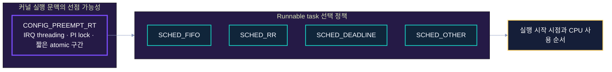

### 축 A: 커널 실행 문맥의 선점 가능성

`CONFIG_PREEMPT_RT`는 다음을 수행한다.

- 일반 `spinlock_t`와 일부 locking primitive를 priority inheritance aware variant로 바꾼다.
- 대부분의 IRQ handler를 schedulable IRQ thread로 이동한다.
- softirq, timer 등 많은 실행 문맥을 scheduler가 제어할 수 있는 형태로 바꾼다.
- entry, scheduler, low-level interrupt handling 같은 일부 구간을 제외하고 kernel preemption 가능성을 높인다.

### 축 B: runnable task 선택 정책

- `SCHED_FIFO`: 고정 priority, 동일 priority에 자동 time slice가 없다.
- `SCHED_RR`: 고정 priority, 동일 priority끼리 round-robin time slice를 사용한다.
- `SCHED_DEADLINE`: absolute deadline이 가장 이른 entity를 우선하고 runtime budget을 CBS로 제한한다.
- `SCHED_OTHER`: CFS 기반의 일반 태스크 정책이다.

### 잘못된 추론

```text
CONFIG_PREEMPT_RT=y
    ⇒ 모든 user thread가 자동으로 RT priority를 얻는다.       X

SCHED_FIFO P90
    ⇒ 커널 안 어디서든 즉시 실행된다.                         X

SCHED_DEADLINE
    ⇒ 모델의 WCET와 하드웨어 지연 상한이 자동으로 증명된다.   X
```

정확한 관계는 다음과 같다.

```text
Kernel preemptibility
    + Scheduling policy/priority
    + CPU/IRQ affinity
    + bounded blocking
    + memory/power/hardware QoS
    = end-to-end timing predictability의 일부
```

## 4. Scheduling class 우선순위

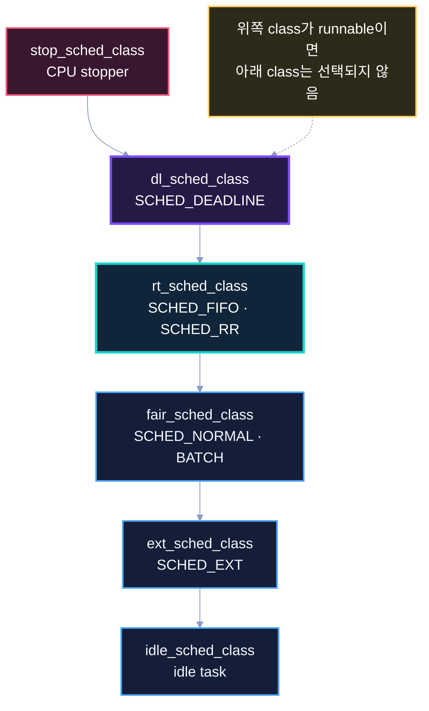

Linux `v6.18`의 linker script는 scheduling class object를 다음 순서로 배치한다.

```c
/* include/asm-generic/vmlinux.lds.h */
#define SCHED_DATA                         \
    STRUCT_ALIGN();                        \
    __sched_class_highest = .;             \
    *(__stop_sched_class)                  \
    *(__dl_sched_class)                    \
    *(__rt_sched_class)                    \
    *(__fair_sched_class)                  \
    *(__ext_sched_class)                   \
    *(__idle_sched_class)                  \
    __sched_class_lowest = .;
```

### 해석

- runnable `SCHED_DEADLINE` entity가 있으면 FIFO/RR보다 먼저 고려된다.
- runnable FIFO/RR entity가 있으면 CFS 태스크보다 먼저 고려된다.
- `stop_sched_class`는 일반 application 정책이 아니라 CPU stopper 같은 커널 내부용이다.
- `SCHED_EXT`의 위치는 `v6.18` linker order에서 fair 다음, idle 이전이다. 본 강의의 RT 설계에서는 주로 deadline/rt/fair 경계를 다룬다.

`kernel/sched/core.c`의 class 선택도 internal priority 범위를 기준으로 한다.

```c
const struct sched_class *__setscheduler_class(int policy, int prio)
{
    if (dl_prio(prio))
        return &dl_sched_class;

    if (rt_prio(prio))
        return &rt_sched_class;

    return &fair_sched_class;
}
```

### 중요한 결론

> 높은 user-visible priority 숫자만 보는 것으로는 충분하지 않다. 먼저 scheduling class가 결정되고, 그 class 내부의 ordering rule이 적용된다.

## 5. User API와 policy 번호

Linux UAPI는 다음 policy 값을 정의한다.

```c
/* include/uapi/linux/sched.h */
#define SCHED_NORMAL       0
#define SCHED_FIFO         1
#define SCHED_RR           2
#define SCHED_BATCH        3
#define SCHED_IDLE         5
#define SCHED_DEADLINE     6
#define SCHED_EXT          7
```

### 주요 API

| 목적 | API/도구 | 핵심 파라미터 |
|---|---|---|
| FIFO/RR 설정 | `sched_setscheduler()`, `pthread_setschedparam()`, `chrt` | policy, static priority |
| Deadline 설정 | `sched_setattr()`, `chrt -d` | runtime, deadline, period |
| CPU 고정 | `sched_setaffinity()`, `pthread_setaffinity_np()`, `taskset` | CPU mask |
| 현재 정책 확인 | `sched_getscheduler()`, `sched_getparam()`, `chrt -p` | PID/TID |
| RR quantum 확인 | `sched_rr_get_interval()` | PID/TID |

### 권한

일반 사용자가 임의의 높은 RT priority나 deadline reservation을 설정할 수 있게 하면 시스템을 고갈시킬 수 있다. 실습은 root shell을 사용한다. 제품에서는 다음을 명시적으로 설계한다.

- `CAP_SYS_NICE`
- `RLIMIT_RTPRIO`
- systemd `LimitRTPRIO=` / capability
- cgroup/cpuset 및 service별 CPU partition
- watchdog과 runaway task recovery

## 6. User priority와 internal priority

사용자 관점에서 FIFO/RR priority는 일반적으로 1~99이며 숫자가 클수록 높다. 커널 내부의 `p->prio`는 작은 값이 더 높은 priority다.

```c
/* kernel/sched/syscalls.c */
static inline int __normal_prio(int policy, int rt_prio, int nice)
{
    int prio;

    if (dl_policy(policy))
        prio = MAX_DL_PRIO - 1;
    else if (rt_policy(policy))
        prio = MAX_RT_PRIO - 1 - rt_prio;
    else
        prio = NICE_TO_PRIO(nice);

    return prio;
}
```

예를 들면 다음과 같다.

| User RT priority | Internal logical priority | 의미 |
|---:|---:|---|
| 99 | 0 | 가장 높은 일반 user RT priority |
| 90 | 9 | 높은 control/safety priority 후보 |
| 50 | 49 | 중간 RT priority |
| 1 | 98 | 가장 낮은 FIFO/RR priority |

### 디버깅 주의

`ps`의 `PRI`, `RTPRIO`, kernel trace의 `prio`가 같은 표현 체계를 사용한다고 가정하지 않는다. 항상 column 의미와 trace format을 확인한다.

```bash
ps -eLo pid,tid,psr,cls,rtprio,pri,stat,comm
chrt -p <PID>
```

## 7. Per-CPU runqueue 구조

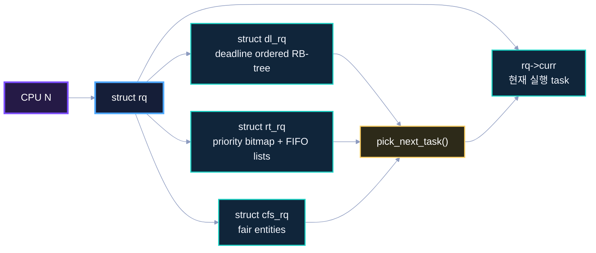

Linux scheduler는 하나의 global ready queue만 사용하는 구조가 아니다. 각 CPU는 `struct rq`를 가지고, 그 안에 class별 runqueue가 존재한다.

```text
CPU0 -> rq0 -> dl_rq / rt_rq / cfs_rq / curr
CPU1 -> rq1 -> dl_rq / rt_rq / cfs_rq / curr
...
```

따라서 RT task의 latency는 priority만으로 결정되지 않는다.

- 어떤 CPU의 runqueue에 enqueue되었는가?
- affinity가 어느 CPU를 허용하는가?
- 해당 CPU에 더 높은 class/priority task가 있는가?
- 다른 CPU로 push/pull할 수 있는가?
- migration disabled 또는 cpuset 제약이 있는가?

### 핵심 객체 대응

| 개념 | Kernel object |
|---|---|
| CPU별 scheduler state | `struct rq` |
| FIFO/RR queue | `struct rt_rq` |
| RT task의 scheduler entity | `struct sched_rt_entity` |
| Deadline queue | `struct dl_rq` |
| Deadline entity | `struct sched_dl_entity` |
| 현재 실행 task | `rq->curr` |
| root-domain scheduling partition | `struct root_domain` |

## 8. `struct rt_rq`: priority bitmap과 FIFO list

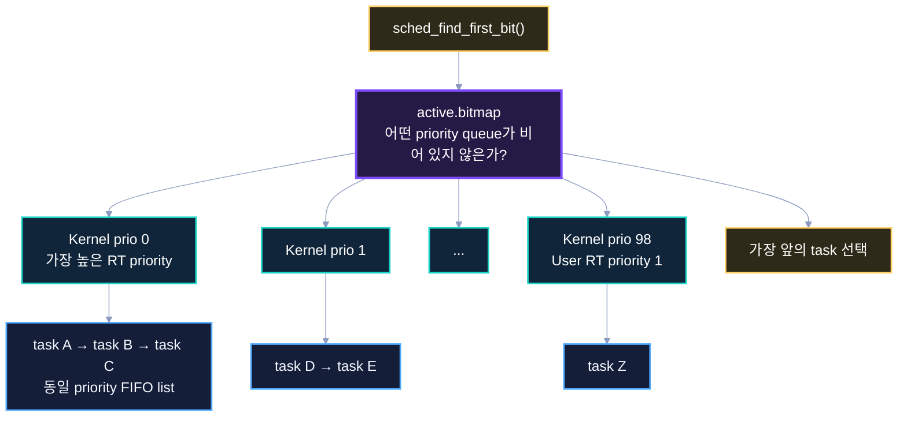

초기화 코드를 보면 핵심 자료구조가 드러난다.

```c
/* kernel/sched/rt.c */
void init_rt_rq(struct rt_rq *rt_rq)
{
    struct rt_prio_array *array = &rt_rq->active;
    int i;

    for (i = 0; i < MAX_RT_PRIO; i++) {
        INIT_LIST_HEAD(array->queue + i);
        __clear_bit(i, array->bitmap);
    }
    __set_bit(MAX_RT_PRIO, array->bitmap); /* delimiter */

    rt_rq->highest_prio.curr = MAX_RT_PRIO - 1;
    plist_head_init(&rt_rq->pushable_tasks);
}
```

### 자료구조 의미

- `array->queue[prio]`: 동일 internal priority의 RT entity가 연결되는 list
- `array->bitmap`: 어느 priority queue가 비어 있지 않은지 표시
- `sched_find_first_bit()`: 가장 작은 internal priority index, 즉 가장 높은 RT priority를 빠르게 찾는다.
- 동일 priority에서는 list 순서가 FIFO/RR 동작의 기반이 된다.
- SMP에서는 `pushable_tasks`와 highest priority cache가 migration 판단에 사용된다.

### enqueue 핵심

```c
static void __enqueue_rt_entity(struct sched_rt_entity *rt_se,
                                unsigned int flags)
{
    struct rt_rq *rt_rq = rt_rq_of_se(rt_se);
    struct rt_prio_array *array = &rt_rq->active;
    struct list_head *queue = array->queue + rt_se_prio(rt_se);

    if (flags & ENQUEUE_HEAD)
        list_add(&rt_se->run_list, queue);
    else
        list_add_tail(&rt_se->run_list, queue);

    __set_bit(rt_se_prio(rt_se), array->bitmap);
    rt_se->on_rq = 1;
}
```

실제 코드는 group scheduling과 throttling, statistics를 함께 처리하므로 더 복잡하다. 위 발췌는 ordering을 이해하기 위한 핵심만 남긴 것이다.

## 9. Wake-up부터 RT task 선택까지

```mermaid
%%{init: {"theme": "base", "themeVariables": {
  "background": "#07101F",
  "primaryColor": "#151E38",
  "primaryTextColor": "#F4F7FF",
  "primaryBorderColor": "#7C4DFF",
  "lineColor": "#8D9BC0",
  "secondaryColor": "#10253A",
  "tertiaryColor": "#251A46",
  "fontFamily": "Noto Sans CJK KR, sans-serif",
  "fontSize": "18px"
}, "flowchart": {"curve": "basis", "htmlLabels": true}}}%%
flowchart LR
    W["wake_up_process()"] --> TTWU["try_to_wake_up()"]
    TTWU --> ENQ["enqueue_task_rt()"]
    ENQ --> LIST[priority별 list tail/head 삽입]
    LIST --> BIT[bitmap bit set]
    BIT --> PRE{현재 task보다<br/>논리 priority가 높은가?}
    PRE -->|Yes| NR["resched_curr()<br/>TIF_NEED_RESCHED"]
    PRE -->|No| WAIT[Runqueue에서 대기]
    NR --> SCH["__schedule()"]
    WAIT --> SCH
    SCH --> PICK["pick_task_rt()<br/>최상위 bitmap queue의 head"]
    classDef callnode fill:#151E38,stroke:#4CA7FF,color:#FFFFFF,stroke-width:2px
    classDef data fill:#10253A,stroke:#19D3C5,color:#FFFFFF,stroke-width:2px
    classDef dec fill:#251A46,stroke:#7C4DFF,color:#FFFFFF,stroke-width:3px
    classDef flag fill:#3A1730,stroke:#FF5D7A,color:#FFFFFF,stroke-width:2px
    class W,TTWU,ENQ,SCH,PICK callnode
    class LIST,BIT,WAIT data
    class PRE dec
    class NR flag
```

Wake-up은 다음 task를 직접 context switch하는 명령이 아니다.

```text
wake-up
  -> task state를 runnable로 변경
  -> 적절한 per-CPU rq에 enqueue
  -> 현재 task보다 선점 우선순위가 높으면 resched 요청
  -> 가능한 scheduler entry에서 __schedule()
  -> class/order rule로 next task 선택
  -> context_switch()
```

`enqueue_task_rt()`는 entity를 RT runqueue에 넣고, SMP migration 후보라면 pushable list도 갱신한다.

```c
static void enqueue_task_rt(struct rq *rq,
                            struct task_struct *p,
                            int flags)
{
    struct sched_rt_entity *rt_se = &p->rt;

    if (flags & ENQUEUE_WAKEUP)
        rt_se->timeout = 0;

    enqueue_rt_entity(rt_se, flags);

    if (!task_current(rq, p) && p->nr_cpus_allowed > 1)
        enqueue_pushable_task(rq, p);
}
```

### 소스 읽기 순서

```text
try_to_wake_up()
  -> select_task_rq()
  -> activate_task()
  -> enqueue_task()
  -> p->sched_class->enqueue_task()
  -> enqueue_task_rt() / enqueue_task_dl()
  -> wakeup_preempt()
  -> resched_curr()
```

# Part I. SCHED_FIFO

## 10. FIFO 정상 동작 sequence

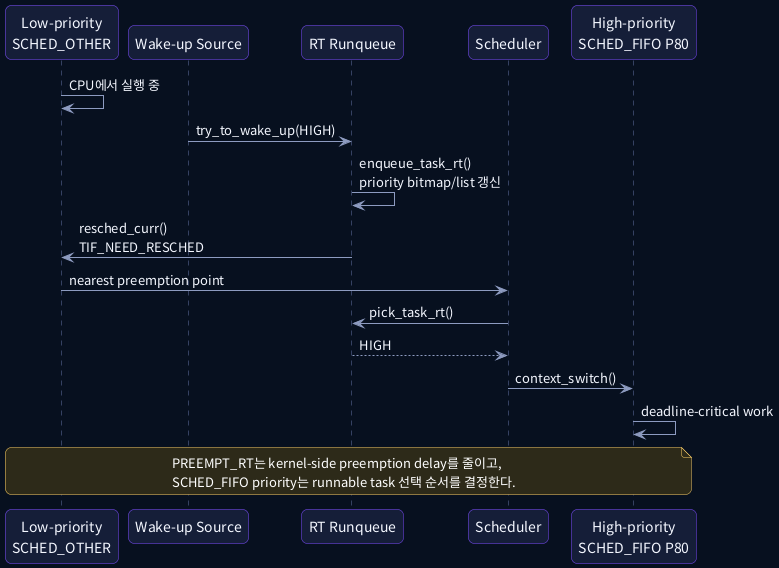

### FIFO 핵심 규칙

가장 높은 priority의 runnable FIFO/RR task가 CPU를 얻는다. `SCHED_FIFO` task는 실행을 시작한 뒤 다음 중 하나가 발생할 때까지 계속 실행할 수 있다.

1. 더 높은 priority task가 runnable이 된다.
2. task가 block 또는 sleep한다.
3. task가 명시적으로 `sched_yield()`를 호출한다.
4. policy, priority, affinity가 변경되어 재배치가 필요하다.
5. RT throttling 등 시스템 차원의 제한에 걸린다.

**동일 priority task가 존재한다는 이유만으로 자동 time slicing되지는 않는다.**

## 11. 동일 priority FIFO queue

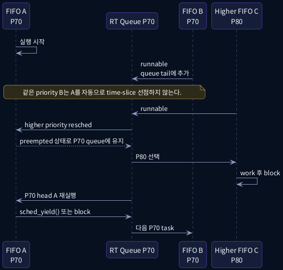

### 동일 priority에서의 의미

- 먼저 실행 중인 FIFO A가 block/yield/end하지 않으면 FIFO B는 기다린다.
- A가 더 높은 priority C에 의해 preempt되어도, A는 동일 priority queue의 상대적 위치를 유지하는 경우가 핵심이다.
- C가 block하면 A가 다시 이어서 실행될 수 있다.
- `sched_yield()`는 현재 task를 같은 priority queue의 뒤로 보내 다른 동일 priority task에게 기회를 줄 수 있다.

### 설계 주의

`yield()`에 의존해 correctness를 만드는 것은 취약하다. RT task는 event/waitqueue/absolute timer 같은 명확한 blocking point를 가지고, 각 activation마다 bounded runtime을 가져야 한다.

### 잘못된 코드

```c
for (;;) {
    do_control_work();
    /* block, sleep, period control 없음 */
}
```

priority가 높고 CPU affinity가 제한적이면 shell, logger, kernel worker, IRQ thread를 굶길 수 있다.

## 12. FIFO application 기본 형태

```c
struct sched_param sp = {
    .sched_priority = 80,
};

CPU_ZERO(&mask);
CPU_SET(2, &mask);

if (sched_setaffinity(0, sizeof(mask), &mask) != 0)
    fail("sched_setaffinity");

if (sched_setscheduler(0, SCHED_FIFO, &sp) != 0)
    fail("sched_setscheduler");
```

실제 periodic loop는 다음과 같이 구성하는 편이 안전하다.

```c
clock_gettime(CLOCK_MONOTONIC, &next);

while (!stop) {
    next = add_ns(next, period_ns);

    run_bounded_control_step();

    clock_nanosleep(CLOCK_MONOTONIC,
                    TIMER_ABSTIME,
                    &next,
                    NULL);
}
```

### RT hot path에서 피할 것

- 처음 접근하는 page와 page fault
- `malloc()/free()`
- `printf()/syslog()`
- 동기 storage I/O
- 종료 시점을 알 수 없는 mutex/fence wait
- 상대시간 `usleep()` 누적 오차

# Part II. SCHED_RR

## 13. RR는 FIFO + 동일 priority time slice

`SCHED_RR`은 class 관점에서 별도의 scheduling class가 아니다. FIFO와 함께 `rt_sched_class`에 매핑되며, scheduler tick에서 동일 priority queue rotation을 추가한다.

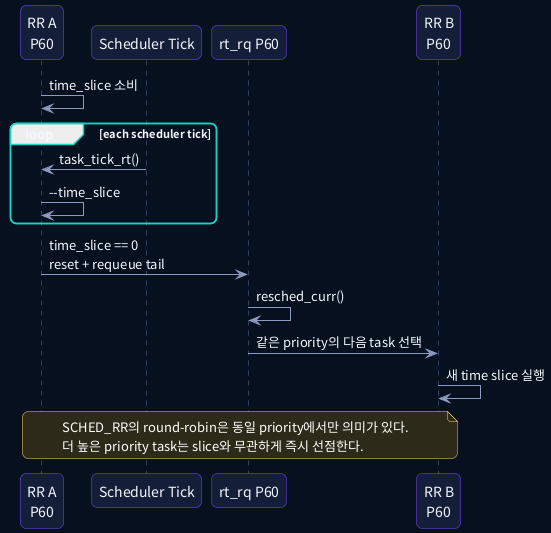

### 핵심 소스

```c
/* kernel/sched/rt.c */
static void task_tick_rt(struct rq *rq,
                         struct task_struct *p,
                         int queued)
{
    update_curr_rt(rq);

    /* FIFO tasks have no timeslices. */
    if (p->policy != SCHED_RR)
        return;

    if (--p->rt.time_slice)
        return;

    p->rt.time_slice = sched_rr_timeslice;
    requeue_task_rt(rq, p, 0);
    resched_curr(rq);
}
```

실제 코드는 동일 queue에 다른 entity가 있는지 확인한 뒤 requeue한다. 한 task만 있다면 불필요한 switch를 만들 필요가 없다.

## 14. RR timeslice 설정과 관찰

Linux `v6.18`의 RT scheduler는 RR quantum을 jiffies로 관리하며 sysctl을 노출한다.

```bash
cat /proc/sys/kernel/sched_rr_timeslice_ms
```

변경 예:

```bash
old=$(cat /proc/sys/kernel/sched_rr_timeslice_ms)
echo 20 > /proc/sys/kernel/sched_rr_timeslice_ms
# test
echo "$old" > /proc/sys/kernel/sched_rr_timeslice_ms
```

애플리케이션에서는 `sched_rr_get_interval()`로 effective interval을 확인할 수 있다.

```c
struct timespec interval;

if (sched_rr_get_interval(0, &interval) != 0)
    perror("sched_rr_get_interval");
```

### 주의

RR quantum을 짧게 만들면 동일 priority fairness는 빨라지지만 context switch와 cache disruption이 증가할 수 있다. 너무 길면 동급 worker의 response time이 길어진다.

## 15. FIFO와 RR 비교

| 항목 | `SCHED_FIFO` | `SCHED_RR` |
|---|---|---|
| Scheduling class | `rt_sched_class` | `rt_sched_class` |
| Priority 범위 | 1~99 | 1~99 |
| 다른 높은 priority task | 즉시 선점 가능 | 즉시 선점 가능 |
| 동일 priority 자동 교대 | 없음 | quantum마다 교대 가능 |
| 주기 task 적합성 | 명확한 block/sleep가 있으면 적합 | 동급 worker pool에 유리할 수 있음 |
| 주요 위험 | runaway task가 동급/하위 task를 굶김 | 짧은 quantum에 의한 switch overhead |
| source 차이 핵심 | `task_tick_rt()`에서 return | time_slice 차감과 requeue |

### 정책 선택 질문

```text
각 task activation이 끝나면 반드시 block하는가?
    Yes -> FIFO가 단순하고 분석하기 쉬울 수 있음

동일 importance의 CPU-bound worker가 여러 개이며 교대가 필요한가?
    Yes -> RR 검토

runtime/deadline/period reservation이 더 자연스러운가?
    Yes -> DEADLINE 검토
```

## 16. `rt_sched_class` callback map

```c
/* kernel/sched/rt.c */
DEFINE_SCHED_CLASS(rt) = {
    .enqueue_task       = enqueue_task_rt,
    .dequeue_task       = dequeue_task_rt,
    .yield_task         = yield_task_rt,
    .wakeup_preempt     = wakeup_preempt_rt,
    .pick_task          = pick_task_rt,
    .put_prev_task      = put_prev_task_rt,
    .set_next_task      = set_next_task_rt,
    .balance            = balance_rt,
    .select_task_rq     = select_task_rq_rt,
    .task_woken         = task_woken_rt,
    .task_tick          = task_tick_rt,
    .get_rr_interval    = get_rr_interval_rt,
    .prio_changed       = prio_changed_rt,
    .switched_to        = switched_to_rt,
    .update_curr        = update_curr_rt,
};
```

### Source-reading 질문

- enqueue 시 bitmap과 list는 어디에서 갱신되는가?
- wake-up preemption은 어떤 priority 비교를 하는가?
- RR slice 만료 시 queue의 어느 위치로 이동하는가?
- task priority가 변경되면 push/pull 또는 reschedule은 어디에서 시작되는가?
- SMP에서 migration candidate는 어떤 list에 들어가는가?

# Part III. SMP, affinity, RT throttling

## 17. Per-CPU queue와 RT push/pull

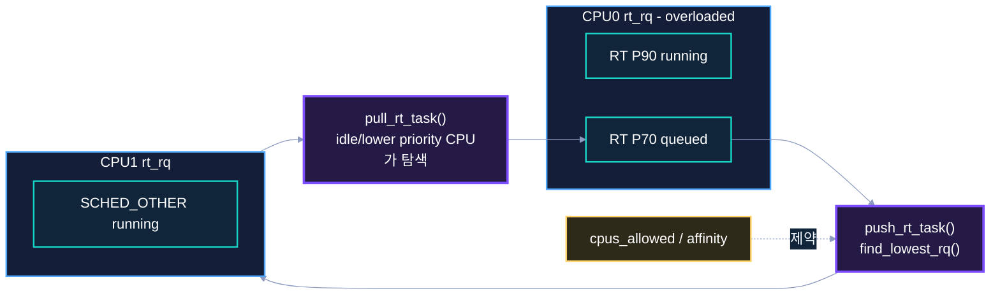

SMP에서 scheduler는 priority를 보면서 RT task를 CPU 간 이동시킨다.

### Push

한 CPU의 RT runqueue가 overloaded이고 다른 CPU에서 더 낮은 priority task가 실행 중이면, non-running pushable RT task를 더 적합한 CPU로 보낼 수 있다.

### Pull

현재 CPU가 낮은 priority task를 선택하려는 시점에 다른 overloaded runqueue의 더 높은 priority pushable task를 가져올 수 있다.

### 중요한 제약

- `task->cpus_mask` / `nr_cpus_allowed`
- cpuset과 root domain
- `migrate_disable()`
- CPU online/offline
- cache locality와 topology
- isolated CPU의 목적

### 설계 원칙

RT control task가 CPU2에 고정되어 있는데 critical IRQ thread가 CPU0에서 실행되면, IRQ completion 후 wake-up과 cross-CPU IPI 경로가 추가될 수 있다. 반대로 모든 critical task와 IRQ를 하나의 CPU에 몰면 priority inversion과 overload가 커질 수 있다. trace와 workload 특성을 근거로 분리한다.

## 18. CPU affinity 설계

QEMU 4 vCPU 예:

```text
CPU0  housekeeping / shell / general kworker
CPU1  device IRQ threads / network
CPU2  RT controller / timer-driven critical task
CPU3  background load / model orchestration
```

명령 예:

```bash
# user RT task
chrt -f 85 taskset -c 2 ./rt-controller

# PID가 확인된 IRQ thread
chrt -f -p 80 <IRQ_THREAD_PID>
taskset -pc 1 <IRQ_THREAD_PID>

# background load
 taskset -c 3 stress-ng --cpu 1
```

실제 target에서는 `/proc/irq/<IRQ>/smp_affinity_list`, managed IRQ, irqbalance, cpuset, workqueue affinity도 함께 확인한다.

## 19. RT throttling이 필요한 이유

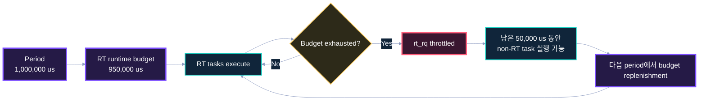

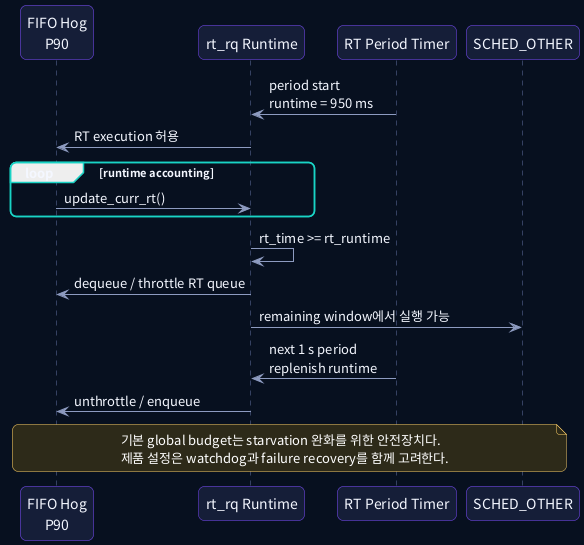

기본 global 설정은 다음과 같다.

```text
sched_rt_period_us  = 1,000,000 us
sched_rt_runtime_us =   950,000 us
```

즉, 한 period의 대부분을 FIFO/RR task가 사용할 수 있지만 일정 구간은 non-RT execution을 위해 남긴다.

```c
/* kernel/sched/rt.c */
int sysctl_sched_rt_period  = 1000000;
int sysctl_sched_rt_runtime = 950000;
```

관찰:

```bash
cat /proc/sys/kernel/sched_rt_period_us
cat /proc/sys/kernel/sched_rt_runtime_us
```

`runtime = -1`은 global RT bandwidth 제한을 비활성화한다. 하지만 제품에서 무조건 해제하면 runaway FIFO task가 recovery daemon, shell, logger, 일부 kernel work를 굶길 수 있다.

### Throttling과 PREEMPT_RT를 혼동하지 말 것

- PREEMPT_RT: critical task가 커널 내부에서 오래 막히지 않게 하는 execution model
- RT throttling: FIFO/RR class가 전체 CPU 시간을 독점하지 못하게 하는 bandwidth safety mechanism

## 20. RT throttling 디버깅

증상:

- 높은 priority FIFO task인데 일정한 구간마다 실행이 끊긴다.
- CPU 사용률이 100%에 가까운데 일정 비율은 CFS task가 실행된다.
- trace에서 RT task가 runnable 상태인데 다른 class가 실행된다.

확인 순서:

```bash
cat /proc/sys/kernel/sched_rt_period_us
cat /proc/sys/kernel/sched_rt_runtime_us
cat /proc/sched_debug 2>/dev/null | less
```

ftrace event:

```text
sched:sched_wakeup
sched:sched_switch
sched:sched_migrate_task
```

### 안전한 실습

```bash
old_p=$(cat /proc/sys/kernel/sched_rt_period_us)
old_r=$(cat /proc/sys/kernel/sched_rt_runtime_us)
trap 'echo "$old_p" > /proc/sys/kernel/sched_rt_period_us; \
      echo "$old_r" > /proc/sys/kernel/sched_rt_runtime_us' EXIT

echo 100000 > /proc/sys/kernel/sched_rt_period_us
echo 50000  > /proc/sys/kernel/sched_rt_runtime_us
```

기간을 짧게 줄이고 runtime 50%로 설정하면 QEMU에서도 throttling pattern을 비교적 쉽게 관찰할 수 있다.

## 21. `CONFIG_RT_GROUP_SCHED`와 cgroup 관점

`CONFIG_RT_GROUP_SCHED`를 사용하면 task group별 RT bandwidth 계층이 추가된다.

핵심 제약:

- child group runtime 합은 parent group의 runtime을 넘을 수 없다.
- runtime이 0인 group에는 RT task를 정상적으로 배치할 수 없다.
- root group runtime 0은 kernel RT thread까지 막을 수 있으므로 허용되지 않는다.
- container/service partition에서 RT 권한만 주고 group bandwidth를 주지 않으면 task가 예상대로 실행되지 않을 수 있다.

Buildroot 실습에서는 단순화를 위해 global sysctl 중심으로 진행한다. 제품 OS가 systemd/cgroup을 사용한다면 service unit과 cgroup RT budget을 함께 감사해야 한다.

# Part IV. SCHED_DEADLINE

## 22. Deadline scheduler의 큰 그림

Linux source는 `SCHED_DEADLINE`을 다음과 같이 설명한다.

```c
/* kernel/sched/deadline.c */
/*
 * Deadline Scheduling Class (SCHED_DEADLINE)
 *
 * Earliest Deadline First (EDF) + Constant Bandwidth Server (CBS).
 */
```

- EDF는 어떤 entity를 먼저 실행할지 결정한다.
- CBS는 각 task가 예약한 runtime budget 이상으로 다른 task를 침범하지 못하게 제한한다.
- admission control은 새 reservation을 수용해도 scheduling domain의 허용 bandwidth를 넘지 않는지 검사한다.

`SCHED_DEADLINE`은 단순히 FIFO priority 숫자를 deadline 숫자로 바꾼 정책이 아니다.

## 23. Runtime, deadline, period

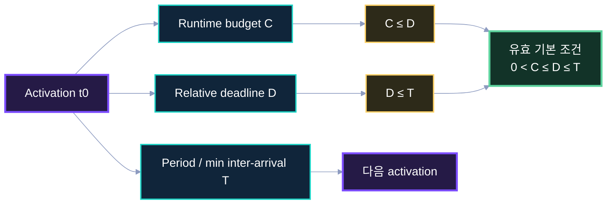

기본적인 constrained/implicit deadline task에서 다음 조건을 사용한다.

```text
0 < runtime <= deadline <= period
```

예:

```text
runtime  = 2 ms
 deadline = 10 ms
 period   = 10 ms
 utilization = 2 / 10 = 0.2
```

의미:

- 최소 10ms 간격으로 activation된다.
- 한 instance에 2ms CPU execution budget을 예약한다.
- activation 후 10ms 안에 완료해야 한다.

### Action age와 deadline의 차이

Automotive model에서 output freshness deadline은 scheduler의 relative deadline만으로 자동 보장되지 않는다. sensor capture timestamp, queue wait, NPU execution, completion, postprocess를 포함한 별도의 end-to-end deadline을 관리해야 한다.

## 24. `struct sched_attr`

```c
/* include/uapi/linux/sched/types.h */
struct sched_attr {
    __u32 size;
    __u32 sched_policy;
    __u64 sched_flags;
    __s32 sched_nice;
    __u32 sched_priority;

    __u64 sched_runtime;
    __u64 sched_deadline;
    __u64 sched_period;

    __u32 sched_util_min;
    __u32 sched_util_max;
};
```

- FIFO/RR는 `sched_priority`를 사용한다.
- DEADLINE은 nanosecond 단위의 runtime/deadline/period를 사용한다.
- `sched_setattr()` syscall이 확장 가능한 ABI를 제공한다.

### `chrt` 예

util-linux `chrt`가 deadline 옵션을 지원하는 환경에서는 다음과 같은 형태를 사용할 수 있다.

```bash
chrt -d -T 2000000 -D 10000000 -P 10000000 0 ./periodic-task
```

배포판/util-linux 버전에 따라 option 이름과 지원 여부를 확인한다. 본 패키지에는 syscall을 직접 호출하는 C 예제를 포함한다.

## 25. EDF와 CBS 자료구조

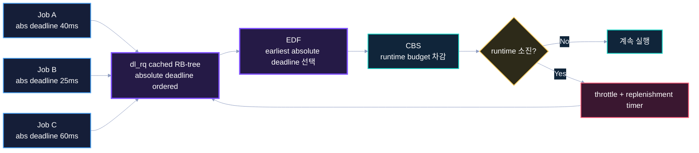

`struct dl_rq`는 deadline entity를 absolute deadline 순으로 관리하기 위해 cached red-black tree를 사용한다.

개념적으로:

```text
rb-tree key = absolute deadline
leftmost    = 가장 이른 deadline entity
```

FIFO/RR의 priority bitmap과 비교하면 다음과 같다.

| Class | Ordering key | 대표 자료구조 |
|---|---|---|
| RT | fixed internal priority | bitmap + per-priority list |
| Deadline | absolute deadline | cached RB-tree |
| Fair | virtual runtime 등 fair scheduling state | CFS tree/timeline |

### CBS budget

execution 동안 runtime을 감소시킨다. budget이 0 이하가 되면 entity를 throttle하고 replenishment timer를 설정한다. 다음 replenishment 시점에 budget/deadline을 갱신하고 다시 enqueue한다.

## 26. Deadline 정상 sequence

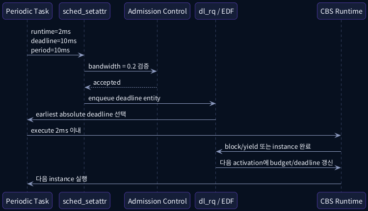

### Admission control

새 task가 요청한 utilization은 대략 다음 형태로 bandwidth에 반영된다.

```text
U_task = runtime / period
```

여러 task의 reservation과 CPU/root-domain capacity를 고려해 허용 가능한지 검사한다. 단순한 단일 CPU 예에서는 합이 1을 넘으면 명백히 수용할 수 없다. 실제 kernel은 capacity, root domain, bandwidth scaling과 정책 제한을 포함한다.

### 실행

1. `sched_setattr()`가 parameter와 권한을 검증한다.
2. admission control이 reservation을 수용한다.
3. activation 시 absolute deadline과 runtime을 설정한다.
4. `dl_rq`에서 earliest deadline entity를 고른다.
5. 실행 중 budget을 차감한다.
6. task가 block하거나 instance를 마친다.
7. 다음 activation에 budget/deadline을 replenishment한다.

## 27. Runtime overrun과 CBS throttling

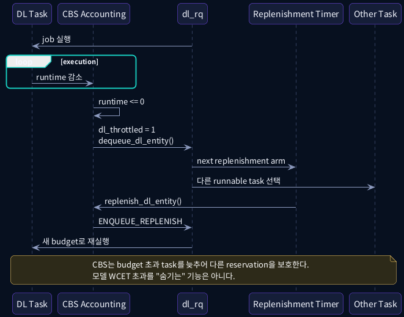

핵심 accounting은 다음 개념을 구현한다.

```c
scaled_delta_exec = dl_scaled_delta_exec(rq, dl_se, delta_exec);
dl_se->runtime -= scaled_delta_exec;

if (dl_se->runtime <= 0) {
    dl_se->dl_throttled = 1;
    dequeue_dl_entity(dl_se, 0);
    start_dl_timer(dl_se);
}
```

실제 `update_curr_dl_se()`는 reclaim, frequency/capacity scaling, boosted entity, DL server 등을 처리하므로 더 복잡하다.

### 해석

CBS는 reservation을 초과한 task가 다른 reservation의 CPU budget을 계속 침해하지 못하게 한다. 그러나 다음 문제는 별도로 남는다.

- task가 필요한 work를 완료하지 못함
- application-level deadline miss
- stale output
- fallback 필요
- NPU/DRAM 등 CPU 외부 지연

## 28. Deadline admission control과 CPU partition

SCHED_DEADLINE admission control은 `root_domain`과 CPU capacity를 기준으로 bandwidth를 관리한다.

중요한 운영 제약:

- Linux v6.18에서 deadline task의 affinity mask는 생성 시점의 `root_domain`보다 작을 수 없다.
- 따라서 단순한 `taskset -c 2` 또는 `sched_setaffinity()`로 mask를 줄인 뒤 `SCHED_DEADLINE`을 설정하면 실패한다.
- 작은 전용 partition이 필요하면 cgroup v2의 exclusive cpuset partition 또는 cgroup v1 cpuset으로 별도 `root_domain`을 먼저 구성한다.
- cpuset 간 이동 시 source/destination domain bandwidth를 갱신해야 한다.

### QEMU 실습 전략

기본 4-vCPU QEMU의 하나의 `root_domain`에서는 task affinity를 줄이지 않고 admission pressure를 만든다. 기본 DL capacity는 대략 `M * 0.95`이므로, 40% reservation을 `floor(M * 0.95 / 0.4)`개 생성한 뒤 하나를 더 요청해 rejection 여부와 errno를 기록한다. 단일 CPU 실험이 필요하면 먼저 CPU 하나짜리 exclusive cpuset partition을 만들고 그 partition 안에서 실행한다.

## 29. Deadline class callback map

```c
/* kernel/sched/deadline.c */
DEFINE_SCHED_CLASS(dl) = {
    .enqueue_task       = enqueue_task_dl,
    .dequeue_task       = dequeue_task_dl,
    .yield_task         = yield_task_dl,
    .wakeup_preempt     = wakeup_preempt_dl,
    .pick_task          = pick_task_dl,
    .put_prev_task      = put_prev_task_dl,
    .set_next_task      = set_next_task_dl,
    .balance            = balance_dl,
    .select_task_rq     = select_task_rq_dl,
    .migrate_task_rq    = migrate_task_rq_dl,
    .set_cpus_allowed   = set_cpus_allowed_dl,
    .task_woken         = task_woken_dl,
};
```

소스 읽기 질문:

- absolute deadline은 activation 시 어디에서 계산되는가?
- RB-tree leftmost cache는 어디에서 갱신되는가?
- runtime이 소진되면 어떤 timer가 시작되는가?
- inactive/0-lag accounting은 왜 필요한가?
- task가 다른 root domain으로 이동할 때 bandwidth는 어디에서 이동되는가?

## 30. FIFO, RR, DEADLINE 비교

| 항목 | FIFO | RR | DEADLINE |
|---|---|---|---|
| Class | `rt_sched_class` | `rt_sched_class` | `dl_sched_class` |
| Ordering | fixed priority | fixed priority | earliest absolute deadline |
| 동일 priority | 선행 task 지속 | time slice rotation | deadline ordering |
| CPU budget | global/group RT throttling | global/group RT throttling | task reservation/CBS |
| 주요 API | `sched_setscheduler()` | `sched_setscheduler()` | `sched_setattr()` |
| 핵심 parameter | priority | priority + RR quantum | runtime/deadline/period |
| 분석 용이성 | 비교적 단순 | quantum 영향 추가 | admission/CBS/affinity 복잡 |
| 적합 예 | bounded control/IRQ-linked thread | 동급 worker | periodic CPU reservation |
| 주요 실패 | starvation/runaway | switch overhead/runaway | admission failure/budget overrun |

### 선택 기준

- priority hierarchy가 명확하고 각 activation이 block한다: FIFO
- 동일 importance의 여러 RT worker가 CPU-bound로 교대해야 한다: RR
- period와 CPU runtime reservation이 명확하다: DEADLINE
- 긴 VLA reasoning처럼 execution time 편차가 매우 크고 cancellation/preemption이 없는 accelerator workload: 가장 높은 CPU RT policy를 주는 것보다 비동기 orchestration과 bounded monitor 구조가 우선

# Part V. QEMU ARM64 실습

## 31. 실습 토폴로지

```text
QEMU ARM64 virt, 4 vCPU

CPU0 : housekeeping / shell
CPU1 : IRQ / network
CPU2 : FIFO/RR/DEADLINE 실험
CPU3 : background stress
```

### Buildroot 포함 항목

- `chrt`, `taskset`, `ps`
- shell과 procps/util-linux 기능
- debugfs/tracing
- 실습 binary 2개
- 선택: `trace-cmd`, `rt-tests`, `stress-ng`

### 커널 설정

```text
CONFIG_PREEMPT_RT=y
CONFIG_HIGH_RES_TIMERS=y
CONFIG_SMP=y
CONFIG_SYSCTL=y
CONFIG_IKCONFIG=y
CONFIG_IKCONFIG_PROC=y
CONFIG_DEBUG_FS=y
CONFIG_TRACING=y
CONFIG_TRACEPOINTS=y
CONFIG_SCHED_TRACER=y
```

`CONFIG_RT_GROUP_SCHED`는 제품 설정과 실습 목적에 따라 선택한다.

## 32. 실습 프로그램: FIFO/RR worker

```c
#define _GNU_SOURCE
#include <errno.h>
#include <getopt.h>
#include <pthread.h>
#include <sched.h>
#include <signal.h>
#include <stdint.h>
#include <stdio.h>
#include <stdlib.h>
#include <string.h>
#include <time.h>
#include <unistd.h>

static volatile sig_atomic_t stop_requested;

static void on_signal(int signo)
{
    (void)signo;
    stop_requested = 1;
}

static uint64_t monotonic_ns(void)
{
    struct timespec ts;

    if (clock_gettime(CLOCK_MONOTONIC, &ts) != 0) {
        perror("clock_gettime");
        exit(EXIT_FAILURE);
    }
    return (uint64_t)ts.tv_sec * 1000000000ULL + (uint64_t)ts.tv_nsec;
}

static int parse_policy(const char *name)
{
    if (strcmp(name, "fifo") == 0)
        return SCHED_FIFO;
    if (strcmp(name, "rr") == 0)
        return SCHED_RR;
    if (strcmp(name, "other") == 0)
        return SCHED_OTHER;

    fprintf(stderr, "unknown policy: %s\n", name);
    exit(EXIT_FAILURE);
}

int main(int argc, char **argv)
{
    const char *policy_name = "other";
    const char *name = "worker";
    int priority = 0;
    int cpu = 0;
    int seconds = 5;
    int policy;
    struct sched_param param = { 0 };
    cpu_set_t mask;
    uint64_t end_ns;
    uint64_t loops = 0;
    int opt;

    static const struct option options[] = {
        { "policy", required_argument, NULL, 'p' },
        { "priority", required_argument, NULL, 'r' },
        { "cpu", required_argument, NULL, 'c' },
        { "seconds", required_argument, NULL, 's' },
        { "name", required_argument, NULL, 'n' },
        { NULL, 0, NULL, 0 }
    };

    while ((opt = getopt_long(argc, argv, "p:r:c:s:n:", options, NULL)) != -1) {
        switch (opt) {
        case 'p': policy_name = optarg; break;
        case 'r': priority = atoi(optarg); break;
        case 'c': cpu = atoi(optarg); break;
        case 's': seconds = atoi(optarg); break;
        case 'n': name = optarg; break;
        default: return EXIT_FAILURE;
        }
    }

    signal(SIGINT, on_signal);
    signal(SIGTERM, on_signal);

    CPU_ZERO(&mask);
    CPU_SET(cpu, &mask);
    if (sched_setaffinity(0, sizeof(mask), &mask) != 0) {
        perror("sched_setaffinity");
        return EXIT_FAILURE;
    }

    policy = parse_policy(policy_name);
    param.sched_priority = priority;
    if (sched_setscheduler(0, policy, &param) != 0) {
        perror("sched_setscheduler");
        return EXIT_FAILURE;
    }

    end_ns = monotonic_ns() + (uint64_t)seconds * 1000000000ULL;
    printf("start name=%s pid=%ld cpu=%d policy=%s priority=%d\n",
           name, (long)getpid(), cpu, policy_name, priority);
    fflush(stdout);

    while (!stop_requested && monotonic_ns() < end_ns) {
        loops++;
        if ((loops & 0x3ffffffULL) == 0) {
            printf("progress name=%s loops=%llu t=%llu\n",
                   name,
                   (unsigned long long)loops,
                   (unsigned long long)monotonic_ns());
            fflush(stdout);
        }
    }

    printf("done name=%s loops=%llu\n",
           name, (unsigned long long)loops);
    return EXIT_SUCCESS;
}
```

### 관찰 포인트

- 두 worker를 같은 CPU에 고정한다.
- 서로 다른 priority로 실행해 높은 priority가 언제 선점하는지 본다.
- 동일 FIFO priority에서 먼저 시작한 CPU-bound task가 계속 실행하는지 본다.
- 동일 RR priority에서 progress output이 교대하는지 본다.
- ftrace에서 `sched_wakeup`, `sched_switch`, `sched_migrate_task`를 함께 본다.

## 33. 실습 프로그램: SCHED_DEADLINE

```c
#define _GNU_SOURCE
#include <errno.h>
#include <linux/sched.h>
#include <linux/types.h>
#include <sched.h>
#include <stdint.h>
#include <stdio.h>
#include <stdlib.h>
#include <string.h>
#include <sys/syscall.h>
#include <time.h>
#include <unistd.h>

#ifndef SCHED_DEADLINE
#define SCHED_DEADLINE 6
#endif

struct local_sched_attr {
    __u32 size;
    __u32 sched_policy;
    __u64 sched_flags;
    __s32 sched_nice;
    __u32 sched_priority;
    __u64 sched_runtime;
    __u64 sched_deadline;
    __u64 sched_period;
};

static int sched_setattr_local(pid_t pid,
                               const struct local_sched_attr *attr,
                               unsigned int flags)
{
    return (int)syscall(SYS_sched_setattr, pid, attr, flags);
}

static uint64_t monotonic_ns(void)
{
    struct timespec ts;

    if (clock_gettime(CLOCK_MONOTONIC, &ts) != 0) {
        perror("clock_gettime");
        exit(EXIT_FAILURE);
    }
    return (uint64_t)ts.tv_sec * 1000000000ULL + (uint64_t)ts.tv_nsec;
}

static void sleep_until(uint64_t target_ns)
{
    struct timespec ts = {
        .tv_sec = (time_t)(target_ns / 1000000000ULL),
        .tv_nsec = (long)(target_ns % 1000000000ULL),
    };

    while (clock_nanosleep(CLOCK_MONOTONIC, TIMER_ABSTIME, &ts, NULL) == EINTR)
        ;
}

int main(int argc, char **argv)
{
    struct local_sched_attr attr = { 0 };
    uint64_t runtime_us;
    uint64_t deadline_us;
    uint64_t period_us;
    uint64_t next_ns;
    unsigned long iterations;
    unsigned long i;

    if (argc != 5) {
        fprintf(stderr,
                "usage: %s RUNTIME_US DEADLINE_US PERIOD_US ITERATIONS\n",
                argv[0]);
        return EXIT_FAILURE;
    }

    runtime_us = strtoull(argv[1], NULL, 0);
    deadline_us = strtoull(argv[2], NULL, 0);
    period_us = strtoull(argv[3], NULL, 0);
    iterations = strtoul(argv[4], NULL, 0);

    attr.size = sizeof(attr);
    attr.sched_policy = SCHED_DEADLINE;
    attr.sched_runtime = runtime_us * 1000ULL;
    attr.sched_deadline = deadline_us * 1000ULL;
    attr.sched_period = period_us * 1000ULL;

    if (sched_setattr_local(0, &attr, 0) != 0) {
        fprintf(stderr,
                "sched_setattr failed: %s (C=%llu D=%llu T=%llu us)\n",
                strerror(errno),
                (unsigned long long)runtime_us,
                (unsigned long long)deadline_us,
                (unsigned long long)period_us);
        return EXIT_FAILURE;
    }

    printf("SCHED_DEADLINE accepted: C=%llu D=%llu T=%llu us\n",
           (unsigned long long)runtime_us,
           (unsigned long long)deadline_us,
           (unsigned long long)period_us);

    next_ns = monotonic_ns();
    for (i = 0; i < iterations; i++) {
        volatile uint64_t sink = 0;
        uint64_t work_end = monotonic_ns() + runtime_us * 500ULL;

        while (monotonic_ns() < work_end)
            sink += monotonic_ns();
        (void)sink;

        next_ns += period_us * 1000ULL;
        sleep_until(next_ns);
    }

    return EXIT_SUCCESS;
}
```

예제는 `sched_setattr` syscall을 직접 호출한다. 일부 Buildroot libc header에 `struct sched_attr`가 없을 수 있어 local ABI-compatible structure를 정의했다.

실습 파라미터:

```bash
# C=2ms, D=10ms, T=10ms, 50 iterations
./sched_deadline_demo 2000 10000 10000 50
```

거절 예:

```bash
# runtime > deadline
./sched_deadline_demo 12000 10000 20000 5
```

errno를 기록한다.

- `EINVAL`: parameter 관계/범위 오류 가능
- `EPERM`: 권한 또는 affinity/root-domain 제약 가능
- `EBUSY`: admission control bandwidth 부족 가능

정확한 원인은 kernel version과 코드 경로를 확인한다.

## 34. 실습 1: FIFO priority preemption

```bash
cd /usr/bin/preempt-rt-lab
./04_run_fifo_priority.sh
```

예상 흐름:

```text
low FIFO P60 starts on CPU2
    ↓
after 1 second high FIFO P80 becomes runnable
    ↓
low gets preempted
    ↓
high finishes
    ↓
low resumes
```

trace 확인:

```text
sched_wakeup: high
sched_switch: low -> high
sched_switch: high -> low
```

### 과제

- high를 P50으로 낮추면 어떻게 되는가?
- high를 CPU3으로 옮기면 CPU2의 low는 선점되는가?
- PREEMPT_FULL kernel과 PREEMPT_RT kernel에서 wake-up-to-switch tail이 어떻게 달라지는가?

## 35. 실습 2: 같은 priority FIFO vs RR

```bash
./05_run_fifo_rr.sh
```

### FIFO 예상

- 먼저 CPU를 얻은 task가 block하지 않으므로 다른 동일 priority task가 거의 실행되지 않을 수 있다.
- global RT throttling이 개입하면 CFS window가 보일 수 있으나 동일 FIFO queue ordering 자체는 변하지 않는다.

### RR 예상

- quantum 만료 시 task가 same-priority queue tail로 이동한다.
- 두 task의 progress가 time-slice 단위로 교대한다.

### 추적할 source

```text
task_tick_rt()
  -> --p->rt.time_slice
  -> requeue_task_rt(..., tail)
  -> resched_curr()
```

## 36. 실습 3: RT throttling

```bash
./06_run_rt_throttling.sh
```

스크립트는 일시적으로 다음 설정을 사용한다.

```text
period  = 100 ms
runtime =  50 ms
```

CPU2에 FIFO hog와 CFS busy loop를 함께 실행한다. trace 또는 출력 타임스탬프에서 RT 실행 window와 non-RT window가 반복되는지 확인한다.

### 실패 안전

스크립트는 trap으로 원래 sysctl을 복구한다. SSH나 console을 잃을 수 있는 실험에서는 반드시 별도 housekeeping CPU와 자동 복구 경로를 둔다.

## 37. 실습 4: DEADLINE admission과 overrun

```bash
./07_run_deadline.sh
```

실습 순서:

1. 20% reservation을 생성해 정상 수용을 확인한다.
2. `runtime > deadline` tuple을 넣어 validation failure를 확인한다.
3. 현재 `root_domain`의 CPU 수를 기준으로 40% reservation을 capacity 직전까지 생성한다.
4. reservation 하나를 추가해 admission rejection 여부와 errno를 기록한다.
5. work amount를 runtime보다 크게 만들어 CBS throttling을 관찰하도록 예제를 확장한다.

### 확장 과제

```text
Task A: C=2ms, T=10ms  -> U=0.2
Task B: C=3ms, T=10ms  -> U=0.3
Task C: C=4ms, T=10ms  -> U=0.4
Total                   -> U=0.9
```

Task D 20%를 추가할 때 결과를 예측하고 실제 errno를 확인한다.

## 38. Scheduler tracing

패키지의 `08_trace_scheduler.sh`는 다음 event를 활성화한다.

```text
sched:sched_wakeup
sched:sched_wakeup_new
sched:sched_switch
sched:sched_migrate_task
sched:sched_pi_setprio
```

```bash
./08_trace_scheduler.sh 10 > lesson3-trace.txt &
./04_run_fifo_priority.sh
wait
```

Host에서 `trace-cmd report`나 KernelShark를 사용하려면 guest trace를 파일로 옮긴다.

### 해석 순서

1. task가 실제로 wake-up 되었는가?
2. 어느 CPU로 enqueue되었는가?
3. `sched_switch`까지의 시간은 얼마인가?
4. 그 사이 어떤 task/IRQ가 CPU를 사용했는가?
5. migration이 발생했는가?
6. RT throttling 또는 deadline throttle이 있었는가?
7. task가 runnable이 아니라 lock/I/O에서 block한 것은 아닌가?

## 39. 디버깅 decision tree

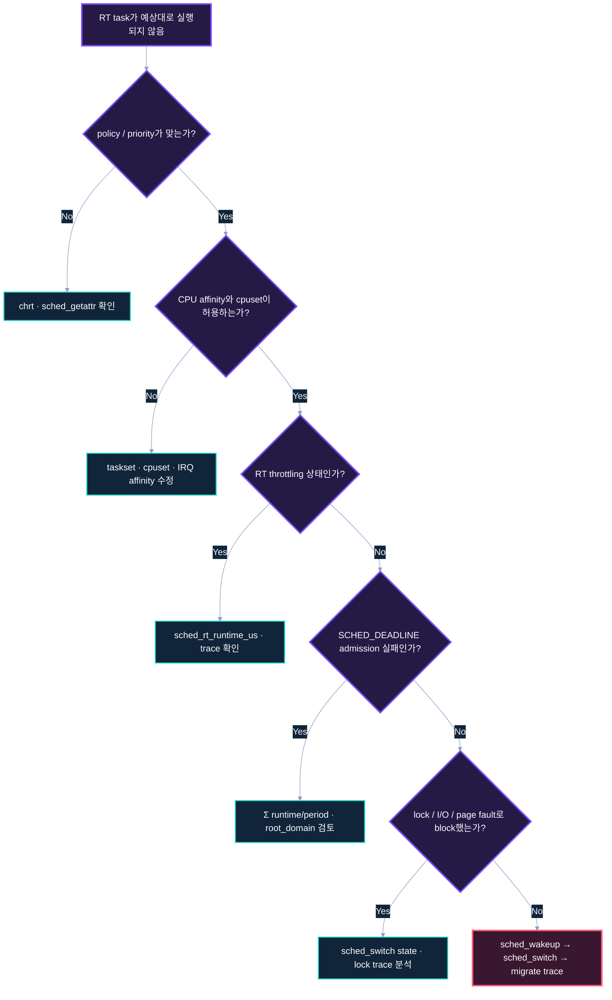

### 빠른 체크리스트

```bash
# Policy / priority
chrt -p <PID>
ps -eLo pid,tid,psr,cls,rtprio,pri,stat,comm

# Affinity
taskset -pc <PID>
grep Cpus_allowed_list /proc/<PID>/status

# RT budget
cat /proc/sys/kernel/sched_rt_period_us
cat /proc/sys/kernel/sched_rt_runtime_us

# Scheduler state
cat /proc/sched_debug 2>/dev/null

# IRQ threads
ps -eLo pid,tid,psr,cls,rtprio,pri,comm | grep '^\|irq/'
```

### 흔한 오진

- 높은 user priority 숫자를 internal `prio` 숫자와 직접 비교
- runnable이 아닌 blocked task를 scheduler 문제로 판단
- task affinity만 보고 IRQ affinity를 확인하지 않음
- RT throttling을 PREEMPT_RT latency regression으로 판단
- DEADLINE admission failure를 syscall ABI 오류로만 판단
- QEMU host scheduling pause를 guest kernel latency로 단정

# Part VI. Automotive NPU 적용

## 40. Priority architecture 예

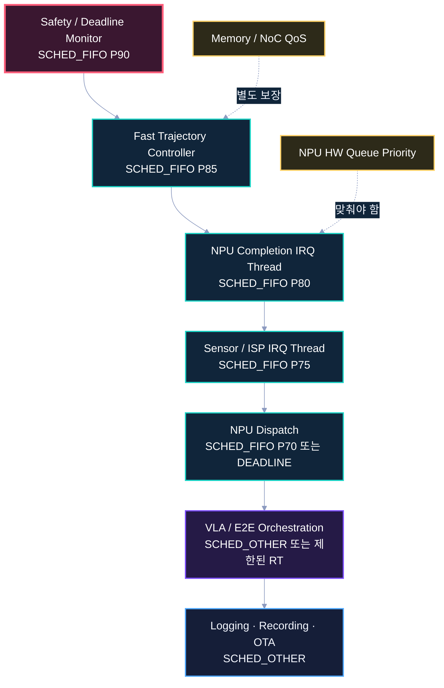

위 priority 숫자는 개념 예시일 뿐이다. 실제 값은 다음 입력으로 response-time analysis 후 결정한다.

- 각 task/IRQ의 WCET 또는 measured upper bound
- period와 deadline
- blocking time과 lock dependency
- CPU affinity와 migration cost
- IRQ nesting/threading
- NPU completion frequency
- thermal/DVFS condition
- failure recovery와 watchdog

### 권장 상대 순서

```text
Safety/deadline monitor
  > final control / vehicle TX
  > fast trajectory controller
  > NPU completion IRQ
  > critical sensor IRQ
  > model dispatch/orchestration
  > logging/recording/OTA
```

VLA reasoning thread를 무조건 가장 높은 FIFO priority로 두면 긴 CPU-side postprocess 또는 busy loop가 fast controller와 safety monitor를 방해할 수 있다.

## 41. NPU E2E case study

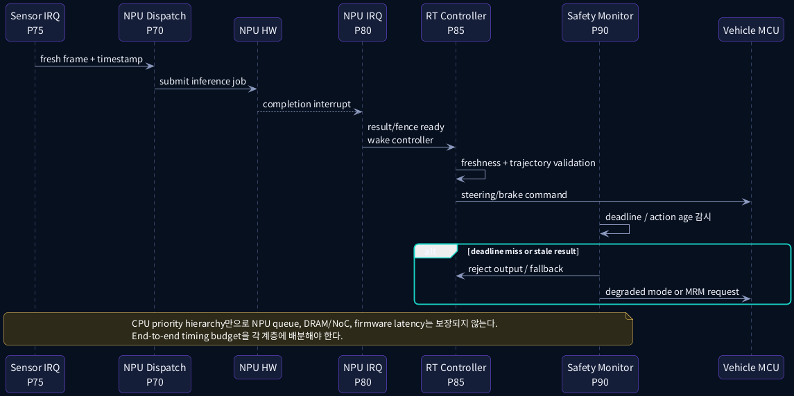

### Timing budget

```text
T_total =
    T_sensor
  + T_dma
  + T_sensor_irq
  + T_dispatch_schedule
  + T_npu_queue
  + T_npu_execution
  + T_npu_irq
  + T_controller_schedule
  + T_control
  + T_vehicle_tx
```

CPU scheduler가 직접 영향을 주는 대표 구간:

- sensor/NPU IRQ thread scheduling
- dispatch/controller thread wake-up-to-run
- CPU lock/blocking path
- final vehicle communication thread ordering

PREEMPT_RT와 RT policy만으로 보장되지 않는 구간:

- NPU firmware queue
- NPU context preemption/cancellation
- DRAM/NoC contention
- DMA/IOMMU stall
- accelerator thermal throttling
- sensor hardware jitter

### E2E/VLA 설계 원칙

- slow model loop와 fast control loop를 분리한다.
- result에 capture timestamp와 absolute expiry를 붙인다.
- stale output은 계산 성공 여부와 무관하게 폐기한다.
- deadline monitor는 model thread보다 높은 priority로 독립 실행한다.
- fallback은 NPU completion 자체를 기다리지 않아도 실행 가능해야 한다.

## 42. 성능·동기화·안전 고려사항

### 성능

- 지나치게 많은 RT task는 class 내부 경쟁과 migration을 늘린다.
- RR quantum을 줄이면 context switch와 cache miss가 증가한다.
- CPU isolation은 scheduler noise를 줄이지만 shared LLC/DRAM/NoC 간섭은 남는다.
- RT task를 여러 CPU에 무제한 허용하면 push/pull과 cache movement가 증가할 수 있다.

### 동기화

- 높은 priority task가 낮은 priority lock owner를 기다리는 문제는 4강의 rtmutex/PI에서 상세히 다룬다.
- policy만 높이고 mutex protocol을 설계하지 않으면 priority inversion이 남는다.
- RT thread에서 무제한 dma-fence wait를 하지 않는다.

### 안전

- RT priority는 기능 안전 인증을 대신하지 않는다.
- deadline miss detection, fault containment, watchdog, fallback, command plausibility check가 별도로 필요하다.
- `sched_rt_runtime_us=-1`을 제품 default로 둘 때는 runaway recovery를 증명해야 한다.
- safety-critical task와 diagnostic/logging task의 CPU와 priority를 분리한다.

## 43. Source Reading Map

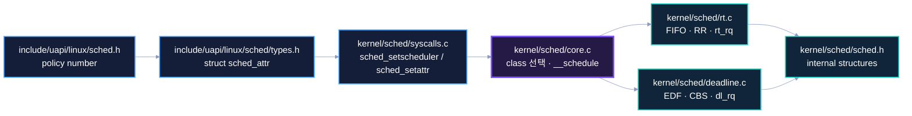

권장 순서:

1. `include/uapi/linux/sched.h`
   - policy 번호와 flags
2. `include/uapi/linux/sched/types.h`
   - `struct sched_attr`
3. `kernel/sched/syscalls.c`
   - priority conversion, parameter/permission validation, scheduler syscall
4. `kernel/sched/core.c`
   - `__schedule()`, class 선택, context switch
5. `kernel/sched/sched.h`
   - `struct rq`, `struct rt_rq`, `struct dl_rq`
6. `kernel/sched/rt.c`
   - FIFO/RR enqueue, pick, tick, push/pull, throttling
7. `kernel/sched/deadline.c`
   - EDF tree, CBS budget, replenishment, admission control

### 빠른 grep

```bash
cd $LINUX_SRC

git grep -n 'DEFINE_SCHED_CLASS(rt)' v6.18 -- kernel/sched
git grep -n 'task_tick_rt' v6.18 -- kernel/sched/rt.c
git grep -n 'sysctl_sched_rt_runtime' v6.18 -- kernel/sched/rt.c
git grep -n 'DEFINE_SCHED_CLASS(dl)' v6.18 -- kernel/sched/deadline.c
git grep -n 'update_curr_dl_se' v6.18 -- kernel/sched/deadline.c
git grep -n '__normal_prio' v6.18 -- kernel/sched/syscalls.c
```

# Part VII. 퀴즈

## 44. 문제

### 객관식 1

PREEMPT_RT와 SCHED_FIFO의 관계로 가장 정확한 것은?

A. PREEMPT_RT를 켜면 모든 task가 FIFO가 된다.  
B. PREEMPT_RT는 kernel-side preemptibility를 개선하고 FIFO는 runnable task 선택 순서를 정의한다.  
C. FIFO는 IRQ handler를 thread로 바꾼다.  
D. 두 기능은 동시에 사용할 수 없다.

### 객관식 2

동일 priority의 두 `SCHED_FIFO` CPU-bound task가 같은 CPU에서 runnable이다. 먼저 실행 중인 task가 block/yield하지 않는다면 가장 가능성이 높은 결과는?

A. 고정 quantum마다 자동 교대  
B. nice 값에 따라 교대  
C. 먼저 실행 중인 task가 계속 실행  
D. CFS가 두 task를 공정하게 배분

### 객관식 3

`SCHED_RR`의 time slice 만료 시 핵심 동작은?

A. task를 SCHED_OTHER로 변경  
B. 같은 priority queue의 tail로 이동하고 reschedule  
C. priority를 1 낮춤  
D. CPU affinity를 변경

### 객관식 4

SCHED_DEADLINE의 핵심 조합은?

A. CFS + nice  
B. FIFO + PI  
C. EDF + CBS  
D. RCU + hrtimer

### O/X 5

Linux user RT priority 99는 internal numerical priority도 99이므로 가장 높다.

### O/X 6

기본 RT throttling은 runaway FIFO/RR task가 CPU 전체를 영구 독점하는 위험을 줄이기 위한 장치다.

### 단답형 7

SCHED_DEADLINE의 세 핵심 시간 parameter를 쓰시오.

### 단답형 8

RT runqueue가 가장 높은 fixed priority를 빠르게 찾기 위해 사용하는 두 자료구조를 쓰시오.

### 시나리오 9

CPU2의 FIFO P80 control task가 runnable인데 약 50ms 단위로 CFS task가 반복 실행된다. 확인해야 할 가장 유력한 kernel 설정 두 개와 trace event를 쓰시오.

### 시나리오 10

한 CPU partition에 `C=4ms, T=10ms` reservation 두 개가 이미 있다. 동일한 reservation 하나를 추가했더니 `sched_setattr()`가 실패했다. 가능한 원인과 확인 순서를 설명하시오.

## 45. 정답과 해설

### 1. B

PREEMPT_RT는 lock/IRQ/softirq 등 kernel execution model의 preemptibility를 개선한다. FIFO는 `rt_sched_class`에서 fixed priority ordering을 제공한다. 둘은 역할이 다르지만 함께 사용해야 높은 priority task의 결정을 빠르게 반영할 수 있다.

### 2. C

FIFO에는 동일 priority 자동 time slice가 없다. 먼저 실행 중인 task가 block, yield, 종료하거나 더 높은 priority task가 등장해야 다른 task가 실행될 기회가 생긴다.

### 3. B

`task_tick_rt()`는 RR task의 `time_slice`를 감소시키고, 0이 되면 reset 후 same-priority queue tail로 requeue하고 reschedule한다.

### 4. C

Deadline class는 EDF로 가장 이른 absolute deadline을 선택하고 CBS로 runtime budget을 격리한다.

### 5. X

user priority는 큰 값이 높지만 내부 `prio`는 작은 값이 높다. `MAX_RT_PRIO - 1 - rt_priority` 변환에서 user 99는 internal 0에 대응한다.

### 6. O

기본 1초 period 중 950ms를 RT runtime으로 허용해 일정 비율을 다른 class가 실행할 수 있게 한다. 설정을 해제할 수 있지만 starvation recovery 설계가 필요하다.

### 7

`runtime`, `deadline`, `period`.

### 8

priority bitmap과 priority별 FIFO list.

### 9

`/proc/sys/kernel/sched_rt_period_us`, `/proc/sys/kernel/sched_rt_runtime_us`를 확인한다. `sched_wakeup`과 `sched_switch`를 우선 추적하고 필요하면 migration event를 추가한다. 실습에서는 100ms/50ms 설정으로 반복 window를 재현한다.

### 10

CPU 하나짜리 exclusive cpuset partition이라는 전제라면 각 reservation utilization은 0.4이므로 두 개는 0.8, 세 개는 1.2이며 세 번째는 capacity를 넘는다. 단순히 `taskset`으로 CPU mask만 줄이는 방식은 Linux v6.18의 deadline affinity 규칙에 맞지 않는다. parameter 관계, 권한, 실제 `root_domain`, 기존 reservation을 확인하고 errno를 기록한다.

# Part VIII. 5분 복습

## 46. 복습 질문 10개

1. PREEMPT_RT와 RT policy는 각각 무엇을 제어하는가?
2. scheduling class의 우선순위 순서는 무엇인가?
3. FIFO/RR가 공유하는 class는 무엇인가?
4. user priority 99는 internal priority 몇에 대응하는가?
5. `rt_rq`가 사용하는 핵심 ordering 자료구조는 무엇인가?
6. FIFO task가 CPU를 양보하는 조건은 무엇인가?
7. RR quantum 만료 시 queue에서 어떤 일이 일어나는가?
8. `sched_rt_runtime_us`는 무엇을 제한하는가?
9. SCHED_DEADLINE의 EDF와 CBS는 각각 무엇을 담당하는가?
10. NPU completion IRQ priority만 높여도 end-to-end deadline이 보장되지 않는 이유는 무엇인가?

## 47. Flashcard 13개

| 앞면 | 뒷면 |
|---|---|
| `rt_sched_class` | FIFO와 RR를 구현하는 scheduling class |
| `dl_sched_class` | SCHED_DEADLINE class |
| `struct rq` | CPU별 scheduler runqueue state |
| `struct rt_rq` | fixed-priority RT runqueue |
| `struct dl_rq` | deadline-ordered runqueue |
| `rt_prio_array` | priority bitmap과 per-priority list |
| `SCHED_FIFO` | fixed priority, 동일 priority 자동 quantum 없음 |
| `SCHED_RR` | FIFO semantics + 동일 priority round-robin |
| EDF | earliest absolute deadline first |
| CBS | runtime reservation/budget 격리 |
| RT throttling | FIFO/RR class의 period/runtime 제한 |
| push/pull | SMP RT task migration mechanism |
| admission control | 새 deadline reservation 수용 가능성 검사 |

## 48. 빈칸 채우기

1. user RT priority 99는 internal priority **(     )**에 대응한다.
2. FIFO와 RR는 모두 **(                 )** class를 사용한다.
3. RR task의 quantum은 **(                    )**에서 차감된다.
4. Deadline scheduler는 **(     )**와 **(     )**를 결합한다.
5. 기본 global RT budget은 1초 중 약 **(     )**ms다.

정답: 0, `rt_sched_class`, `task_tick_rt()`, EDF/CBS, 950.

## 49. 오늘의 핵심 문장 5개

1. PREEMPT_RT는 scheduler의 결정을 빨리 반영하게 하고, scheduling policy는 어떤 task를 선택할지 결정한다.
2. FIFO와 RR는 같은 RT class를 사용하며 차이는 동일 priority time slicing이다.
3. Linux RT priority는 user와 internal 숫자의 방향이 반대다.
4. SCHED_DEADLINE은 EDF 선택만이 아니라 CBS budget과 admission control을 포함한다.
5. Automotive NPU 시스템의 priority hierarchy는 CPU, IRQ, accelerator queue, memory QoS를 함께 연결해야 한다.

## 50. 실습 과제

### 과제 1: Priority map

QEMU에서 실행 중인 IRQ thread와 실습 task의 policy/priority/CPU를 수집해 `03-scheduler-priority-map.md`를 작성한다.

### 과제 2: FIFO vs RR trace

동일 priority FIFO 2개와 RR 2개의 `sched_switch` trace를 비교하고 queue rotation의 차이를 설명한다.

### 과제 3: RT throttling

period/runtime을 100/50ms, 100/80ms로 바꾸어 RT/CFS 실행 비율과 maximum gap을 비교한다. 원래 sysctl은 반드시 복구한다.

### 과제 4: Deadline admission

여러 reservation의 `Σ(runtime/period)`를 계산하고 실제 accept/reject 결과, errno, affinity/cpuset 조건을 기록한다.

## 51. 다음 강의 전 checklist

- [ ] `struct rt_rq`의 bitmap/list 구조를 설명할 수 있다.
- [ ] FIFO와 RR 동일 priority 동작을 trace로 구분할 수 있다.
- [ ] RT throttling을 재현하고 복구할 수 있다.
- [ ] deadline tuple의 유효 조건을 설명할 수 있다.
- [ ] EDF와 CBS의 역할을 구분할 수 있다.
- [ ] `sched_wakeup -> sched_switch` trace를 읽을 수 있다.
- [ ] 다음 강의를 위해 priority inversion 사례를 떠올릴 수 있다.

# 다음 강의 예고

4강에서는 높은 priority task가 낮은 priority lock owner를 기다릴 때 발생하는 priority inversion을 분석한다.

```text
SCHED_FIFO/RR/DEADLINE priority
        ↓
공유 lock 경합
        ↓
rtmutex waiter tree / PI chain
        ↓
rt_mutex_setprio()
        ↓
effective priority boost와 deboost
```

`spinlock_t`, `raw_spinlock_t`, `mutex`, `rtmutex`, `local_lock_t`의 PREEMPT_RT 의미 차이를 QEMU 실습으로 확인한다.

# References

## Linux official documentation

- PREEMPT_RT theory: <https://docs.kernel.org/core-api/real-time/theory.html>
- PREEMPT_RT differences: <https://docs.kernel.org/core-api/real-time/differences.html>
- SCHED_DEADLINE: <https://docs.kernel.org/scheduler/sched-deadline.html>
- RT group scheduling: <https://docs.kernel.org/scheduler/sched-rt-group.html>
- Scheduler statistics: <https://docs.kernel.org/scheduler/sched-stats.html>
- ftrace: <https://docs.kernel.org/trace/ftrace.html>

## Linux v6.18 source

- `include/uapi/linux/sched.h`
- `include/uapi/linux/sched/types.h`
- `include/asm-generic/vmlinux.lds.h`
- `kernel/sched/syscalls.c`
- `kernel/sched/core.c`
- `kernel/sched/sched.h`
- `kernel/sched/rt.c`
- `kernel/sched/deadline.c`

Repository: <https://github.com/torvalds/linux/tree/v6.18>

## 실습 산출물 권장 이름

```text
03-scheduler-priority-map.md
03-sched-trace.dat
03-rt-policy-comparison.md
03-deadline-admission-results.md
```
