# PREEMPT_RT 4강 상세 강의노트

## rtmutex, Priority Inheritance와 RT Locking

> 과정: PREEMPT_RT 10강 - QEMU ARM64 `virt` + Linux Kernel + Buildroot initramfs  
> 기준 커널: Linux v6.18  
> 기준 tag/commit: `v6.18` / `7d0a66e4bb9081d75c82ec4957c50034cb0ea449`  
> 실습 환경: QEMU ARM64 `virt`, GICv3, 4 vCPU, PL011, Buildroot initramfs  
> 예상 강의 시간: 120~150분  
> 대상: Linux Kernel, Embedded BSP, Device Driver 경험이 있는 중급 이상 엔지니어

---

## 0. 범위와 가정

이 강의는 **높은 우선순위 태스크를 선택하는 scheduler 정책**과 **공유 자원 때문에 발생하는 blocking**을 연결한다. 3강에서 배운 `SCHED_FIFO`, `SCHED_RR`, `SCHED_DEADLINE`은 runnable task 중 무엇을 먼저 실행할지 결정한다. 하지만 가장 높은 우선순위 task가 lock 때문에 blocked라면 scheduler는 그 task를 실행할 수 없다.

이때 해결해야 할 질문은 다음과 같다.

1. 낮은 우선순위 task가 높은 우선순위 task의 lock을 보유하면 어떤 문제가 생기는가?
2. 중간 우선순위 task가 lock owner를 선점하면 blocking은 왜 길어지는가?
3. Linux의 `rt_mutex`는 lock waiter와 owner를 어떻게 연결하는가?
4. nested lock chain에서 priority donation은 어떻게 전파되는가?
5. PREEMPT_RT에서 `spinlock_t`는 왜 이름과 달리 sleeping lock처럼 동작하는가?
6. `spin_lock_irqsave()`와 `raw_spin_lock_irqsave()`는 RT 커널에서 왜 같은 의미가 아닌가?
7. kernel과 user space에서 priority inheritance를 어떻게 관찰하고 검증하는가?

### 중요한 해석 원칙

- **Priority inheritance는 critical section의 실행시간을 줄이지 않는다.** 낮은 우선순위 owner가 중간 우선순위 task에 의해 밀리는 시간을 줄인다.
- **PI는 모든 latency를 제거하지 않는다.** IRQ-off 구간, `raw_spinlock_t`, firmware, NPU 실행시간, memory bandwidth contention은 별도 문제다.
- **QEMU 수치는 실제 SoC의 WCET가 아니다.** 실습에서는 ordering과 상대적 차이, trace의 인과관계를 본다.
- Linux scheduler 내부 우선순위는 숫자가 작을수록 높은 경우가 많지만, user-space `SCHED_FIFO` priority는 99가 가장 높다. 강의에서는 혼동을 피하기 위해 user priority를 `P90`, `P50`처럼 표기한다.

---

## 1. 전체 과정에서 4강의 위치


1~3강의 연결은 다음과 같다.

```text
1강: Real-Time의 목표와 PREEMPT_RT의 큰 그림
2강: ARM64에서 reschedule request가 실제 schedule로 연결되는 지점
3강: Runnable task 중에서 누가 CPU를 가져가는지 결정하는 policy
4강: 가장 높은 priority task가 lock 때문에 blocked일 때의 해결 방법
```

4강 이후에는 lock owner가 아니라 **interrupt execution context**가 delay source가 되는 경우를 다룬다.

```text
4강: Lock dependency와 Priority Inheritance
5강: Threaded IRQ와 ARM64 GICv3 interrupt path
6강: SoftIRQ, hrtimer, ktimersd, RCU
```

---

## 2. 학습 목표

강의를 마치면 다음을 수행할 수 있어야 한다.

- classic priority inversion을 타임라인으로 설명한다.
- bounded blocking과 unbounded priority inversion을 구분한다.
- `rt_mutex_base`, `rt_mutex_waiter`, `task_struct`의 PI 관련 field를 연결한다.
- lock waiter tree와 owner `pi_waiters` tree가 왜 둘 다 필요한지 설명한다.
- fast path, slow path, unlock handoff의 주요 함수를 소스에서 찾는다.
- `rt_mutex_adjust_prio_chain()`이 nested dependency를 따라가는 이유를 설명한다.
- PREEMPT_RT에서 `spinlock_t`, `raw_spinlock_t`, `local_lock_t`, `mutex`, `semaphore`, `rwlock_t`, `rw_semaphore`를 구분한다.
- `PTHREAD_PRIO_INHERIT`와 PI futex의 관계를 설명한다.
- `sched_pi_setprio`, `sched_switch`, `sched_wakeup`, lockdep, lockstat을 사용해 문제를 분석한다.
- Automotive NPU pipeline의 shared queue와 trajectory buffer에 적절한 lock/priority 구조를 설계한다.

---

## 3. 선수 지식 확인

다음 질문에 답할 수 있는지 확인한다.

1. `TASK_RUNNING`은 반드시 현재 CPU에서 실행 중이라는 뜻인가?
2. `SCHED_FIFO P90` task가 runnable인데 실행되지 못하는 조건은 무엇인가?
3. `preempt_disable()` 또는 hard IRQ context에서 scheduler가 즉시 실행될 수 없는 이유는 무엇인가?
4. lock contention과 CPU overload는 어떻게 구분하는가?
5. `SCHED_FIFO` priority가 높은 task가 blocked되면 runqueue에서 어떤 상태가 되는가?
6. `sched_wakeup`과 `sched_switch` 사이의 시간은 무엇을 의미하는가?

핵심 답은 다음과 같다.

```text
Runnable != Running
High priority != Always runnable
Wake-up != Immediate context switch
PI can help only when an identifiable owner blocks the waiter
```

---

# Part I. Priority Inversion

## 4. 왜 priority만으로 충분하지 않은가
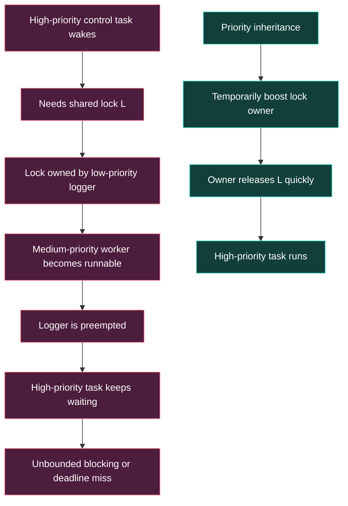

높은 우선순위 control task가 공유 lock `L`을 요청했는데, 낮은 우선순위 logger가 `L`을 보유하고 있다고 가정한다. control task는 runnable이 아니라 lock wait state로 이동한다. 이 순간 scheduler의 priority comparison 대상에서 벗어난다.

그 뒤 medium-priority CPU-bound task가 runnable이 되면 다음 관계가 생긴다.

```text
H(P90) waits for L
L(P20) owns L
M(P50) preempts L
```

scheduler는 `M > L`이므로 올바르게 M을 선택한다. 하지만 dependency 관점에서는 H가 L의 진행을 기다리고 있으므로 결과적으로 M이 H를 간접적으로 지연시킨다.

이를 response-time 관점에서 단순화하면 다음처럼 생각할 수 있다.

```text
R_H ~= C_H + B_H + I_H

R_H : High task response time
C_H : High task 자체 실행시간
B_H : Shared resource 때문에 생기는 blocking
I_H : 더 높은 priority task 또는 시스템 간섭
```

Priority inversion에서는 `B_H`가 low owner의 critical-section 길이만이 아니라 medium task의 실행시간에까지 영향을 받는다.

---

## 5. Linux lock 종류의 큰 지도
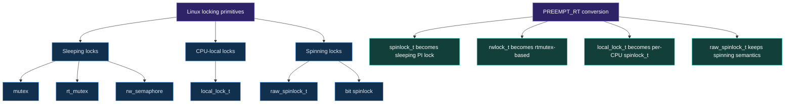

Linux 공식 lock type 문서는 lock을 크게 sleeping lock, CPU-local lock, spinning lock으로 분류한다. PREEMPT_RT에서는 일부 primitive의 구현과 실행 semantics가 바뀐다.

| Primitive | 일반 커널 | PREEMPT_RT | PI | 주요 용도 |
|---|---|---|---:|---|
| `mutex` | sleeping lock | sleeping lock | 구현상 owner 기반 | task context serialization |
| `rt_mutex` | sleeping PI lock | sleeping PI lock | O | kernel PI core |
| `spinlock_t` | strict spinning + preempt off | rtmutex 기반 sleeping PI lock | O | threaded IRQ/task 공유 |
| `raw_spinlock_t` | strict spinning | strict spinning 유지 | X | scheduler/IRQ core/아주 짧은 atomic section |
| `local_lock_t` | preempt/IRQ disable wrapper | per-CPU `spinlock_t` | RT 구현에 따름 | per-CPU data scope |
| `semaphore` | owner 없는 counting semaphore | 동일 | X | 신규 serialization에는 비권장 |
| `rwlock_t` | spinning RW lock | rtmutex 기반 별도 구현 | 제한적 | reader/writer 공유 |
| `rw_semaphore` | sleeping RW semaphore | RT 전용 구현 | 비대칭 제한 | task-context RW serialization |

핵심은 **API 이름만 보고 execution context를 추론하면 안 된다**는 것이다. 같은 `spin_lock()` source code가 non-RT와 PREEMPT_RT에서 다른 구현으로 연결된다.

---

## 6. PREEMPT_RT locking 변환
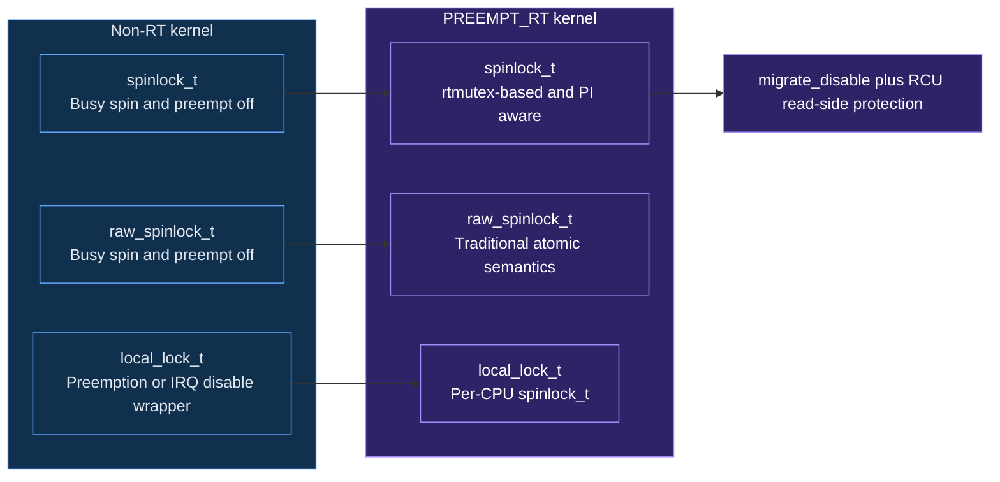

### Architecture requires / Linux implements 구분

- CPU architecture는 atomic operation, exception/IRQ entry, context switch를 제공한다.
- Linux v6.18의 PREEMPT_RT는 일반 `spinlock_t`와 `rwlock_t`를 rtmutex 기반 구현으로 치환한다.
- `raw_spinlock_t`는 PREEMPT_RT에서도 strict spinning semantics를 유지한다.
- `local_lock_t`는 RT에서 per-CPU `spinlock_t`로 바뀐다.

이 변환은 **커널의 대부분을 scheduler가 관리하는 task context로 이동**시켰기 때문에 가능하다. hard IRQ로 남아야 하는 low-level path는 sleeping lock을 사용할 수 없으므로 `raw_spinlock_t`가 필요하다.

---

## 7. Classic priority inversion 타임라인
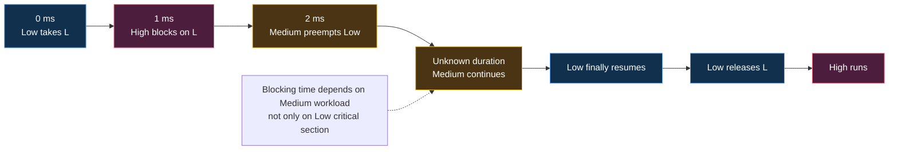

단순 예제의 critical section은 2ms라고 해도 high task가 2ms만 기다린다는 보장은 없다.

```text
Low critical section remaining     : 2 ms
Medium CPU-bound execution         : 20 ms
Other medium-priority interference : variable
------------------------------------------
High lock wait                     : 22 ms + alpha
```

medium-priority workload의 상한이 시스템 요구사항에서 정의되지 않았다면 high task의 blocking도 사실상 bounded라고 주장하기 어렵다.

### PI가 없는 sequence
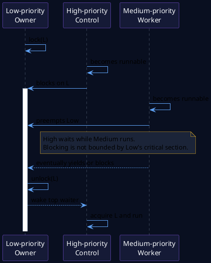

### Bounded inversion과 unbounded inversion

- **Direct blocking**: H가 L의 lock을 기다리는 것 자체는 공유 자원 설계에서 의도된 blocking일 수 있다.
- **Bounded blocking**: L의 critical section WCET와 lock protocol로 최대 대기시간을 분석할 수 있다.
- **Unbounded priority inversion**: L이 M에 반복적으로 선점되어 H의 wait가 M workload에 종속된다.

PI의 목표는 모든 blocking을 0으로 만드는 것이 아니라, H가 기다리는 동안 L이 H에 가까운 scheduling entitlement를 받게 해 indirect interference를 제거하는 것이다.

---

## 8. Priority Inheritance의 기본 동작

```text
1. Low(P20)가 lock L을 보유한다.
2. High(P90)가 L을 요청하고 blocked된다.
3. High의 priority가 Low owner에게 donation된다.
4. Low의 normal priority는 P20이지만 effective priority는 P90이 된다.
5. Medium(P50)은 boosted Low를 선점할 수 없다.
6. Low가 L을 해제하면 donation이 제거된다.
7. High가 L을 획득하고 실행한다.
```

### PI 적용 sequence
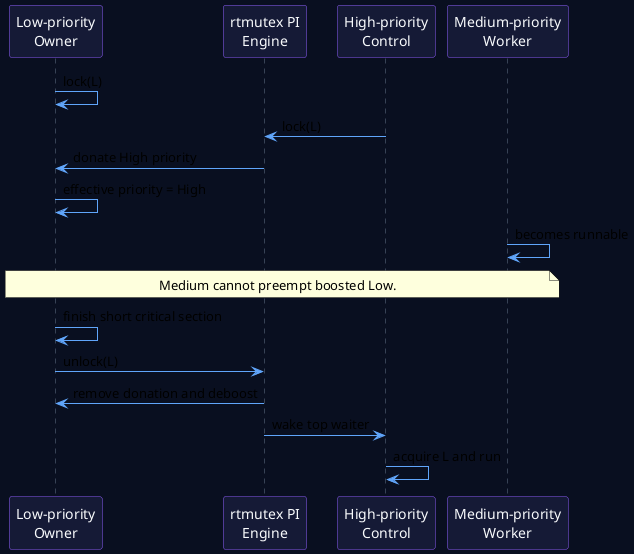

### Normal priority와 effective priority

PI는 task의 정책 설정을 영구 변경하지 않는다.

```text
normal priority    = 사용자가 설정한 원래 priority
base priority      = scheduler가 기준으로 삼는 기본 priority
effective priority = PI donation을 반영한 현재 priority
```

Linux scheduler의 `rt_mutex_setprio()`는 effective priority와 scheduling class를 조정한다. unlock 또는 top waiter 변화가 발생하면 다시 계산해 deboost한다.

### PI의 한계

1. owner가 너무 긴 critical section을 수행하면 여전히 오래 기다린다.
2. owner가 `raw_spinlock_t` 또는 IRQ-off region에 막혀 있으면 donation만으로 해결되지 않는다.
3. semaphore처럼 owner가 없는 primitive에는 정확한 donation 대상이 없다.
4. NPU firmware queue처럼 Linux scheduler 밖의 resource에는 Linux PI가 전달되지 않는다.
5. memory bandwidth, cache miss, thermal throttling은 priority와 별개다.

---

# Part II. Linux rtmutex 내부 구조

## 9. `struct rt_mutex_base`
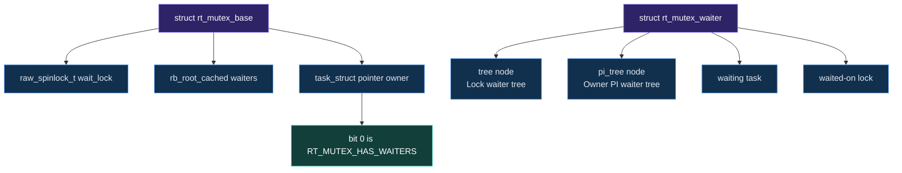

Linux v6.18의 핵심 구조는 다음과 같다.

```c
struct rt_mutex_base {
    raw_spinlock_t       wait_lock;
    struct rb_root_cached waiters;
    struct task_struct   *owner;
};
```

### Field 역할

| Field | 역할 | 보호 |
|---|---|---|
| `wait_lock` | owner state와 waiter tree의 slow-path serialization | strict raw spinlock |
| `waiters` | 해당 lock을 기다리는 task의 priority-ordered RB-tree | `wait_lock` |
| `owner` | current owner pointer + waiters flag encoding | fast cmpxchg 또는 `wait_lock` |

`wait_lock` 자체는 `raw_spinlock_t`다. rtmutex 내부 상태를 갱신하는 아주 짧은 core critical section은 sleeping lock으로 다시 보호할 수 없기 때문이다.

### Owner pointer bit encoding

`owner`의 bit 0은 `RT_MUTEX_HAS_WAITERS`로 사용된다.

```text
owner == NULL, bit0=0 : free, uncontended fast acquire 가능
owner == task, bit0=0 : held, uncontended fast release 가능
owner == task, bit0=1 : held and has waiters
owner == NULL, bit0=1 : unlock handoff의 transitional state
```

이 bit가 set되면 새 contender를 slow path로 보내 `wait_lock` 아래에서 ordering과 handoff를 보장한다.

---

## 10. `struct rt_mutex_waiter`와 두 RB-tree
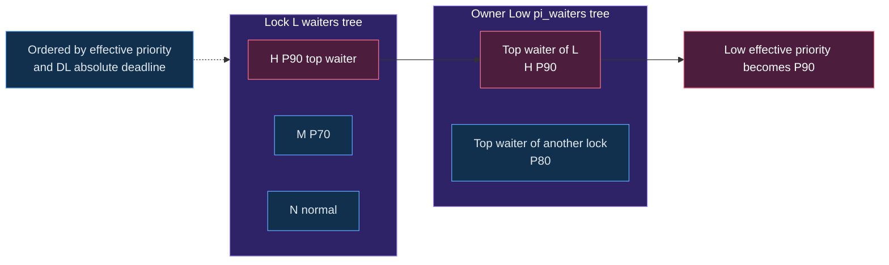

`struct rt_mutex_waiter`는 blocked task의 kernel stack에 만들어지고 두 tree에 들어갈 수 있다.

```c
struct rt_mutex_waiter {
    struct rt_waiter_node tree;
    struct rt_waiter_node pi_tree;
    struct task_struct    *task;
    struct rt_mutex_base  *lock;
    unsigned int           wake_state;
};
```

### Tree 1: `lock->waiters`

- 특정 lock을 기다리는 모든 waiter를 정렬한다.
- `lock->wait_lock`으로 보호한다.
- leftmost cached node가 top waiter다.
- RT priority가 높은 waiter가 먼저 온다.
- `SCHED_DEADLINE` waiter끼리는 absolute deadline을 비교한다.

### Tree 2: `owner->pi_waiters`

- owner가 보유한 각 contended lock의 **top waiter**를 모은다.
- `task->pi_lock`으로 보호한다.
- owner가 여러 lock을 보유한 경우 가장 강한 donation을 찾는다.
- `task_top_pi_waiter()`가 owner의 effective priority를 결정하는 donor가 된다.

모든 waiter를 owner tree에 복제하지 않고 각 lock의 top waiter만 연결하면 필요한 donation 관계를 유지하면서 tree 규모와 update 비용을 줄일 수 있다.

### Priority ordering 주의

kernel internal priority는 일반적으로 작은 숫자가 더 높다. v6.18의 `rt_waiter_node_less()`는 먼저 `prio`를 비교하고, 둘 다 deadline class이면 deadline을 비교한다.

---

## 11. `task_struct`의 PI state

rtmutex 동작에는 task 쪽 state도 필요하다.

```text
task_struct
├── pi_lock          : PI state serialization
├── pi_waiters       : owner에게 donation하는 top waiter들의 tree
├── pi_top_task      : 현재 top donor task cache
├── pi_blocked_on    : 이 task가 기다리는 rt_mutex_waiter
├── normal_prio      : 원래 priority 계산 기준
└── prio             : 현재 effective priority
```

dependency chain을 따라갈 때 `pi_blocked_on`은 매우 중요하다.

```text
H waits on A owned by T1
T1.pi_blocked_on -> B owned by T2
T2.pi_blocked_on -> C owned by T3
```

이 연결을 따라 donation과 deboost가 전파된다.

---

## 12. Fast path와 slow path
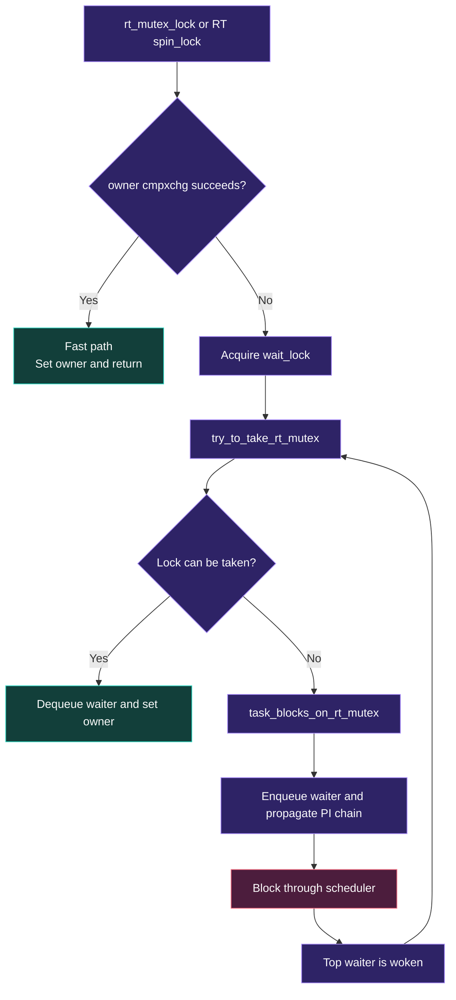

### Uncontended fast path

Debug configuration이 fast path를 비활성화하지 않았고 architecture가 cmpxchg를 지원한다면 다음과 같이 owner를 원자적으로 바꾼다.

```c
if (likely(rt_mutex_cmpxchg_acquire(lock, NULL, current)))
    return;
```

Fast path의 목적은 common uncontended case에서 RB-tree와 `wait_lock` 비용을 피하는 것이다.

### Contended slow path

```text
fast cmpxchg 실패
  -> wait_lock 획득
  -> try_to_take_rt_mutex()
  -> lock을 바로 획득할 수 없으면 waiter 초기화
  -> task_blocks_on_rt_mutex()
  -> lock waiters tree enqueue
  -> owner pi_waiters 갱신
  -> owner effective priority 조정
  -> 필요하면 chain walk
  -> task block / schedule
```

### Slow-lock sequence
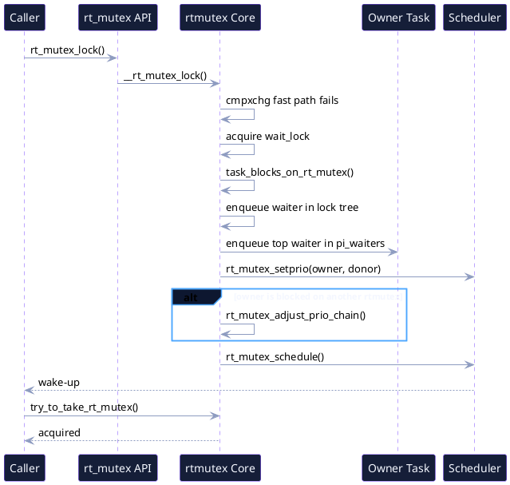

---

## 13. `task_blocks_on_rt_mutex()` source reading

호출 상황: contender가 lock을 즉시 획득하지 못했다.

핵심 흐름을 학습용으로 축약하면 다음과 같다.

```c
owner = rt_mutex_owner(lock);

raw_spin_lock(&task->pi_lock);
waiter->task = task;
waiter->lock = lock;
waiter_update_prio(waiter, task);
rt_mutex_enqueue(lock, waiter);
task->pi_blocked_on = waiter;
raw_spin_unlock(&task->pi_lock);

raw_spin_lock(&owner->pi_lock);
if (waiter == rt_mutex_top_waiter(lock)) {
    rt_mutex_dequeue_pi(owner, old_top);
    rt_mutex_enqueue_pi(owner, waiter);
    rt_mutex_adjust_prio(lock, owner);
}
next_lock = task_blocked_on_lock(owner);
raw_spin_unlock(&owner->pi_lock);

if (next_lock)
    rt_mutex_adjust_prio_chain(owner, ...);
```

### 입력

- `lock`: 기다리는 rtmutex
- `waiter`: 현재 task의 waiter object
- `task`: blocked될 task
- `chwalk`: minimal/full chain walk mode

### 출력과 side effect

- waiter가 lock RB-tree에 들어간다.
- task의 `pi_blocked_on`이 설정된다.
- waiter가 top waiter라면 owner의 `pi_waiters`가 바뀐다.
- owner의 effective priority가 변경될 수 있다.
- owner도 다른 lock에 blocked라면 chain walk가 시작된다.

### 디버깅 관찰점

- `sched_pi_setprio`
- `sched_switch`
- `sched_wakeup`
- blocked task의 policy/priority/CPU
- lock owner의 effective priority 변화

---

## 14. `rt_mutex_adjust_prio()`와 scheduler 연결

`rt_mutex_adjust_prio()`는 owner의 top PI waiter를 찾아 `rt_mutex_setprio()`에 전달한다.

```c
if (task_has_pi_waiters(p))
    pi_task = task_top_pi_waiter(p)->task;

rt_mutex_setprio(p, pi_task);
```

scheduler core의 `rt_mutex_setprio()`는 다음을 수행한다.

1. donor와 `normal_prio`를 사용해 effective priority를 계산한다.
2. runqueue lock을 잡고 task의 class/priority 변경을 준비한다.
3. queued/running task를 dequeue 또는 put-prev 처리한다.
4. `p->prio`, `p->sched_class`, deadline inheritance state를 갱신한다.
5. task를 다시 enqueue하고 class-change preemption check를 수행한다.
6. `trace_sched_pi_setprio()` tracepoint를 기록한다.

PI는 단순한 숫자 field write가 아니라 runqueue ordering을 바꾸는 scheduler operation이다.

---

## 15. Nested PI chain
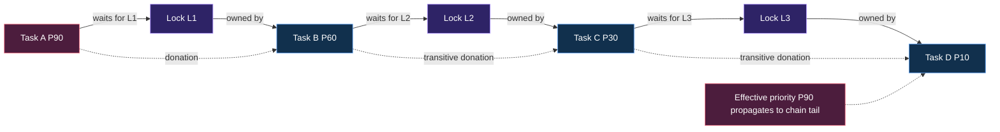

### Chain 예제

```text
H(P90) waits A
A owner T1(P60) waits B
B owner T2(P30) waits C
C owner T3(P10)
```

H의 donation이 T1에만 적용되면 T2 또는 T3가 medium task에 선점될 수 있다. 따라서 donation은 dependency tail까지 전파되어야 한다.

### Nested PI sequence
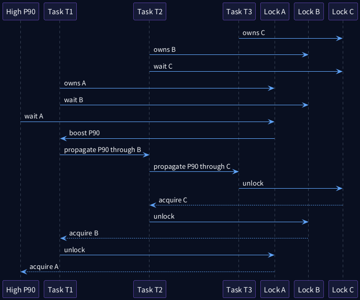

### Chain walk에서 확인하는 것

- task가 여전히 예상 lock에 blocked되어 있는가?
- waiter가 여전히 해당 lock의 top waiter인가?
- priority/deadline key가 변했는가?
- 다음 owner가 존재하는가?
- original lock 또는 initiating task로 되돌아오는 deadlock cycle인가?
- 더 이상의 priority adjustment가 필요하지 않은가?

v6.18의 기본 `max_lock_depth`는 1024이며 `/proc/sys/kernel/max_lock_depth`로 노출된다. 이는 arbitrary dependency chain을 무한정 따라가지 않도록 하는 방어선이지, 제품 설계에서 1024단계 lock chain을 허용한다는 뜻이 아니다.

### 설계 원칙

```text
PI chain이 길수록
- 분석이 어려워지고
- boost/deboost cost가 증가하며
- lock-order bug 영향 범위가 커지고
- worst-case blocking 계산이 복잡해진다.
```

Automotive hot path에서는 nested sharing을 줄이고 ownership을 명확하게 유지해야 한다.

---

## 16. Deadlock detection과 lock ordering

Priority inheritance는 deadlock을 해결하지 않는다.

```text
T1 owns A, waits B
T2 owns B, waits A
```

둘 다 높은 effective priority를 받아도 서로 release하지 못한다.

### 두 도구의 역할 구분

| 도구/기능 | 목적 |
|---|---|
| rtmutex chain walk | PI propagation 과정의 cycle 검사 |
| lockdep | runtime lock dependency graph를 이용한 ordering 검증 |
| ww_mutex | wound/wait protocol로 특정 다중-lock acquisition 해결 |
| 설계 규칙 | global lock order와 ownership 정의 |

제품 코드에서는 다음을 문서화한다.

```text
Lock order: state_lock -> queue_lock -> buffer_lock
Never: buffer_lock -> state_lock
```

---

## 17. Unlock, deboost, top-waiter handoff

Unlock은 단순히 `owner = NULL`로 끝나지 않는다. waiter가 있으면 owner donation을 제거하고 top waiter가 낮은 priority contender에게 추월당하지 않도록 handoff ordering을 유지해야 한다.

### Unlock handoff sequence
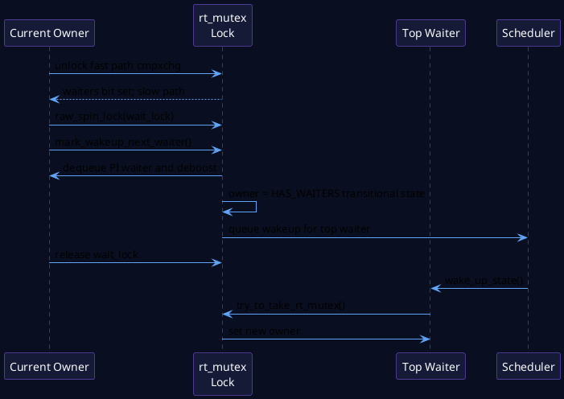

핵심 흐름은 다음과 같다.

```text
rt_mutex_unlock()
  -> cmpxchg release fast path
  -> waiters bit 때문에 실패하면 slow unlock
  -> wait_lock 획득
  -> mark_wakeup_next_waiter()
  -> current owner pi_waiters에서 top waiter 제거
  -> rt_mutex_adjust_prio()로 deboost
  -> owner를 HAS_WAITERS transitional state로 설정
  -> top waiter wake queue 등록
  -> wait_lock 해제
  -> wake_up_state(top waiter)
  -> top waiter가 try_to_take_rt_mutex()
```

deboost와 wakeup 사이에 owner가 선점되면 donor가 아직 blocked된 상태에서 inversion이 생길 수 있으므로, implementation은 해당 window를 조심스럽게 제어한다.

---

# Part III. PREEMPT_RT에서 `spinlock_t`의 의미

## 18. `spinlock_t`는 왜 rtmutex 기반인가

일반 커널에서 `spinlock_t`는 다음 효과를 제공한다.

```text
- lock contention 시 busy spin
- preemption disabled
- _irq/_irqsave suffix는 hard IRQ mask 조작
- CPU migration 불가능
```

PREEMPT_RT에서 이 의미를 그대로 유지하면 긴 lock holder 때문에 high-priority task가 선점하지 못한다. 따라서 일반 `spinlock_t`는 rtmutex 기반으로 바꾸고 contention 시 owner에게 PI를 적용한다.

### RT `spinlock_t` 흐름
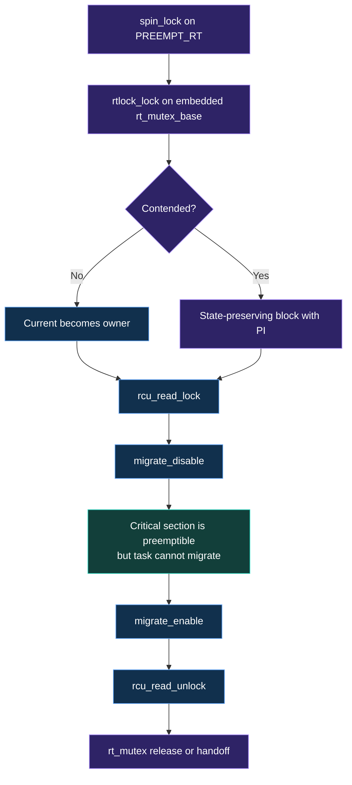
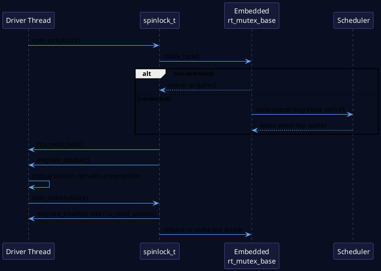

Linux v6.18 `spinlock_rt.c`의 핵심 형태는 다음과 같다.

```c
static __always_inline void __rt_spin_lock(spinlock_t *lock)
{
    rtlock_might_resched();
    rtlock_lock(&lock->lock);
    rcu_read_lock();
    migrate_disable();
}

void rt_spin_unlock(spinlock_t *lock)
{
    migrate_enable();
    rcu_read_unlock();

    if (!rt_mutex_cmpxchg_release(&lock->lock, current, NULL))
        rt_mutex_slowunlock(&lock->lock);
}
```

### 보존되는 semantics

PREEMPT_RT는 단순히 `spinlock_t`를 `mutex`로 바꾸는 것이 아니다.

1. **Task-state preserving**: lock 대기 중 별도 wakeup을 잃지 않게 saved state를 관리한다.
2. **Migration disabled**: per-CPU pointer가 critical section 동안 유효하게 유지된다.
3. **RCU read-side protection**: non-RT spinlock의 preempt-disable가 제공하던 RCU 관련 의미를 보완한다.
4. **Owner-based PI**: contender가 blocked되면 owner를 boost한다.

### 중요한 결과

```text
PREEMPT_RT의 spinlock_t critical section은
“다른 task가 절대 선점할 수 없는 atomic region”이 아니다.
```

같은 task가 lock을 보유한 채 preempt될 수 있지만 CPU migration은 제한된다. 따라서 `spin_lock()`이 preemption을 꺼준다는 가정으로 per-CPU data나 atomic context를 보호한 기존 코드는 재검토해야 한다.

---

## 19. `_irq`, `_irqsave`, `_bh` suffix의 변화

PREEMPT_RT에서 일반 `spinlock_t`의 hard-IRQ suffix는 실제 CPU interrupt mask를 바꾸지 않는다.

v6.18의 개념적 mapping은 다음과 같다.

```c
spin_lock_irq(&lock)
    -> rt_spin_lock(&lock)

spin_lock_irqsave(&lock, flags)
    -> flags = 0
    -> spin_lock(&lock)

spin_unlock_irqrestore(&lock, flags)
    -> rt_spin_unlock(&lock)
```

반면 `_bh()`는 softirq serialization을 위해 `local_bh_disable()`과 RT용 per-CPU lock semantics를 사용한다.

### 의미

- driver가 register access를 위해 hard IRQ mask가 반드시 필요하다면 일반 `spin_lock_irqsave()`가 아니라 execution context와 lock type을 다시 검토해야 한다.
- strict hard IRQ serialization이 정말 필요하다면 `raw_spinlock_t`가 후보이지만 critical section은 극도로 짧아야 한다.
- threaded IRQ handler와 task context의 공유라면 일반 `spinlock_t`가 PI를 제공하므로 더 적합할 수 있다.

---

## 20. `PREEMPT_LOCK_OFFSET`와 오래된 가정

`include/linux/preempt.h`에서 v6.18은 RT 여부에 따라 다음처럼 다룬다.

```c
#if !defined(CONFIG_PREEMPT_RT)
#define PREEMPT_LOCK_OFFSET PREEMPT_DISABLE_OFFSET
#else
/* Locks on RT do not disable preemption */
#define PREEMPT_LOCK_OFFSET 0
#endif
```

따라서 다음과 같은 암묵적 가정은 RT에서 틀릴 수 있다.

```c
spin_lock(&lock);
/* preemption이 꺼졌으니 this_cpu_ptr()가 안전할 것이라고 가정 */
use_per_cpu_data();
spin_unlock(&lock);
```

올바른 보호 방법은 자료구조의 ownership과 access context에 따라 `local_lock_t`, `migrate_disable()`, per-CPU API, 또는 적절한 shared lock을 선택하는 것이다.

---

## 21. `raw_spinlock_t`: RT에서도 strict atomic

`raw_spinlock_t`는 모든 kernel configuration에서 busy-spinning lock이다.

### 사용해야 하는 경우

- scheduler core와 runqueue lock
- rtmutex 내부 `wait_lock`
- low-level interrupt controller path
- hard IRQ/NMI context에서 sleep이 불가능한 state
- hardware register와 interrupt mask를 함께 atomic하게 다뤄야 하는 아주 짧은 구간

### 피해야 하는 경우

- 긴 list traversal
- memory allocation
- `printk()`가 많거나 느린 operation
- DMA fence wait
- firmware response wait
- NPU job completion wait
- 복잡한 error recovery

`raw_spinlock_t` critical section은 PREEMPT_RT가 선점 가능하게 바꾸지 못하는 tail-latency source다.

---

## 22. `local_lock_t`와 per-CPU data

`local_lock_t`는 per-CPU critical section에 이름과 lockdep scope를 부여한다.

### Non-RT

```text
local_lock()          -> preempt_disable()
local_lock_irq()      -> local_irq_disable()
local_lock_irqsave()  -> local_irq_save()
```

### PREEMPT_RT

```text
local_lock_t -> per-CPU spinlock_t
```

따라서 RT에서 `local_lock_irqsave()`가 hard IRQ를 실제로 끈다고 가정해서는 안 된다. 또한 서로 다른 `local_lock_t` instance는 같은 per-CPU data를 보호하지 않는다.

softirq-only per-CPU data에는 최근 RT semantics에 맞춰 `local_lock_nested_bh()`를 사용해 보호 범위를 명시하는 것이 중요하다.

---

## 23. `rwlock_t`, `rw_semaphore`, `semaphore`

### `rwlock_t`

PREEMPT_RT에서는 rtmutex 기반 별도 구현을 사용하지만 multiple-reader donation에는 구조적 제약이 있다. writer 한 명은 reader에게 donation할 수 있지만, writer가 여러 reader 모두에게 하나의 priority를 효율적으로 전달하는 문제는 단순하지 않다. low-priority reader가 preempt된 상태로 lock을 보유하면 high-priority writer가 지연될 수 있다.

### `rw_semaphore`

RT에서 별도 implementation을 사용하며 fairness 특성이 non-RT와 달라질 수 있다. reader-heavy hot path에서 “RW lock이 mutex보다 항상 빠르다”는 가정을 하지 말고 target workload에서 측정한다.

### `semaphore`

counting semaphore는 strict owner 개념이 없으므로 누구를 boost해야 하는지 명확하지 않다. PREEMPT_RT는 semaphore를 PI lock으로 바꾸지 않는다. 신규 serialization에는 owner가 명확한 `mutex`와 별도 completion/wait mechanism을 권장한다.

---

## 24. Seqcount와 RT reader livelock

`seqcount_t` reader는 writer가 진행 중이면 재시도한다. non-preemptible writer를 가정한 구조에서 high-priority reader가 writer를 선점하면 다음 문제가 생길 수 있다.

```text
Low-priority writer begins update and sequence becomes odd
High-priority reader preempts writer
Reader sees odd sequence and retries
Writer cannot run because reader is higher priority
Reader loops indefinitely
```

해결 방법은 writer serialization lock과 preemption semantics를 올바르게 연결하는 것이다. `seqcount_LOCKNAME_t` variant는 writer lock type을 명시하고 lockdep/preemption handling을 보완한다.

---

## 25. Lock 선택 decision tree
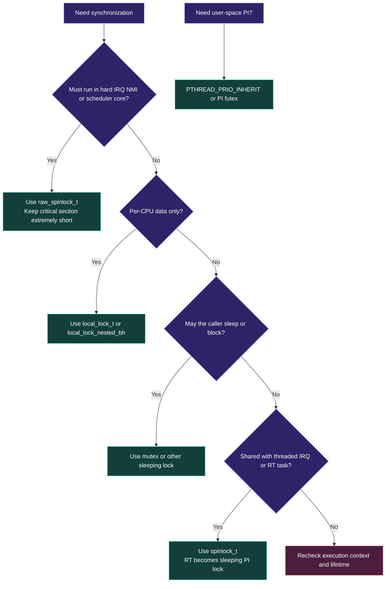

### 질문 순서

1. hard IRQ/NMI/scheduler core에서 실행되는가?
2. per-CPU data인가, inter-CPU shared data인가?
3. caller가 sleep/block 가능한 task 또는 threaded IRQ context인가?
4. contention 시 identifiable owner가 있는가?
5. priority inheritance가 end-to-end deadline에 필요한가?
6. lock critical section의 WCET가 정의되어 있는가?
7. user space와 kernel 사이의 futex protocol이 필요한가?

### Context matrix
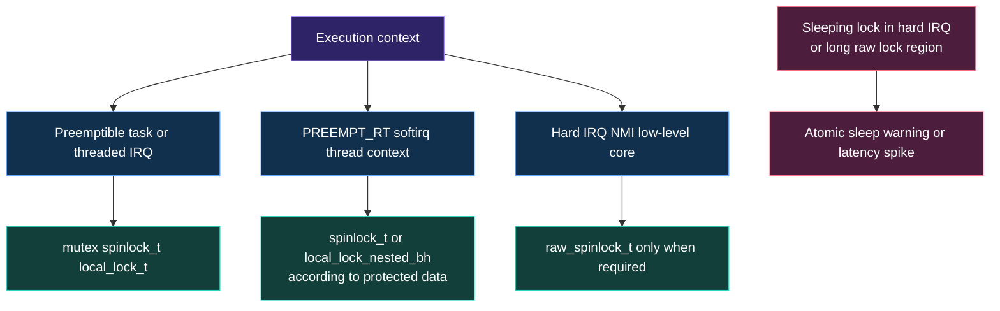

이 matrix는 일반 원칙이다. 실제 API의 context rule과 subsystem contract를 반드시 확인해야 한다.

---

# Part IV. User-space PI와 Futex

## 26. `PTHREAD_PRIO_INHERIT`

POSIX mutex attribute에 PI protocol을 설정한다.

```c
pthread_mutexattr_t attr;
pthread_mutex_t lock;

pthread_mutexattr_init(&attr);
pthread_mutexattr_setprotocol(&attr, PTHREAD_PRIO_INHERIT);
pthread_mutex_init(&lock, &attr);
pthread_mutexattr_destroy(&attr);
```

### User-space fast path와 kernel slow path

uncontended pthread mutex는 user memory의 atomic operation으로 처리할 수 있다. contention이 발생하면 PI futex operation을 통해 kernel rtmutex core와 연결된다.

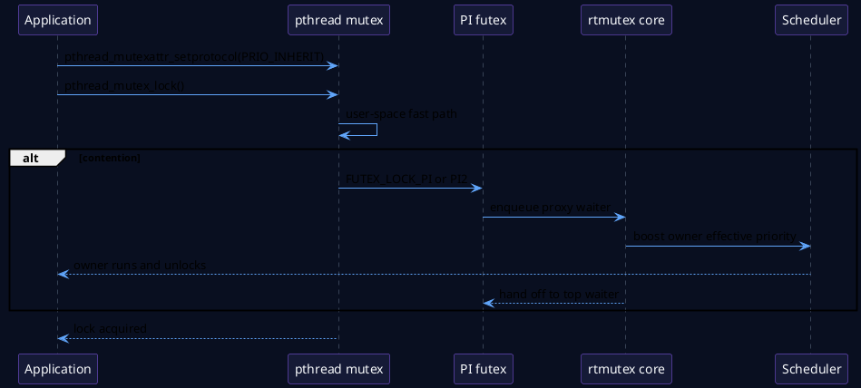

### 주의사항

- 모든 mutex를 PI로 바꾸면 자동으로 deterministic해지는 것은 아니다.
- priority architecture와 lock ownership을 먼저 설계한다.
- robust mutex, process-shared mutex, PI protocol 조합은 libc/kernel 지원을 확인한다.
- `CAP_SYS_NICE`, `RLIMIT_RTPRIO`, cgroup policy 때문에 RT thread 생성이 실패할 수 있다.
- user-space lock owner가 page fault, I/O, malloc, logging을 critical section 안에서 수행하면 boost된 채 긴 시간을 실행할 수 있다.

---

## 27. PI futex 관점

PI futex는 user-space owner TID state와 kernel rtmutex proxy-locking을 연결한다. 핵심은 kernel이 실제 owner task를 식별해 waiter의 priority를 donation할 수 있다는 점이다.

```text
pthread_mutex_lock()
  -> user atomic fast path
  -> contention
  -> futex PI operation
  -> kernel futex state lookup
  -> rt_mutex proxy waiter enqueue
  -> owner priority boost
  -> unlock handoff
```

이 구조 때문에 PI mutex는 일반 futex보다 state transition과 error case가 복잡하다. 잘못된 owner state, owner death, timeout, signal, process-shared lifetime을 모두 다뤄야 한다.

---

# Part V. 디버깅과 검증

## 28. Latency outlier 분석 workflow
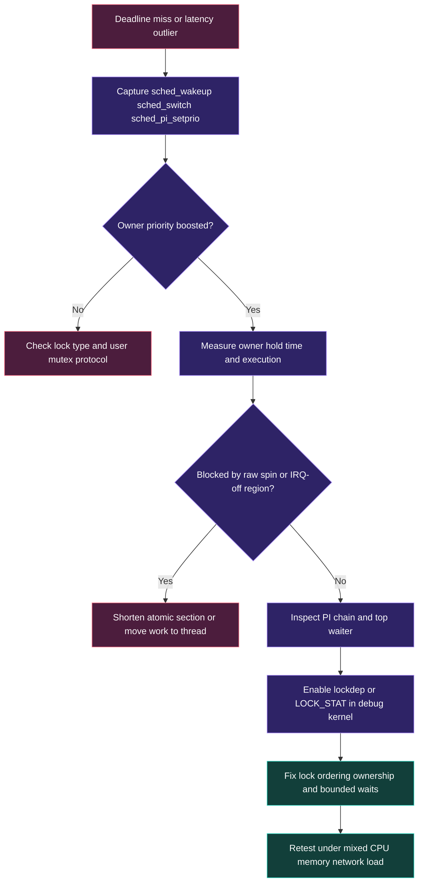

### 첫 질문: CPU scheduling 문제인가 lock blocking 문제인가?

```text
sched_wakeup -> sched_switch 지연
    runnable이지만 CPU를 못 받음

pthread_mutex_lock/driver lock wait
    blocked되어 runnable이 아님
```

trace에서는 task state와 lock event를 함께 보아야 한다.

### 권장 debug kernel 설정

```text
CONFIG_PREEMPT_RT=y
CONFIG_RT_MUTEXES=y
CONFIG_DEBUG_RT_MUTEXES=y
CONFIG_PROVE_LOCKING=y
CONFIG_LOCKDEP=y
CONFIG_LOCK_STAT=y
CONFIG_DEBUG_ATOMIC_SLEEP=y
CONFIG_TRACEPOINTS=y
CONFIG_TRACING=y
CONFIG_FTRACE=y
CONFIG_SCHED_TRACER=y
```

최종 latency 측정 kernel에서는 debug option의 overhead를 제거하고 결과를 다시 확인한다.

---

## 29. `sched_pi_setprio` trace

핵심 tracepoint는 다음과 같다.

```text
sched:sched_pi_setprio
sched:sched_wakeup
sched:sched_switch
sched:sched_migrate_task
```

### 분석 순서

1. High waiter가 lock request 후 block되는 시점을 찾는다.
2. `sched_pi_setprio`에서 어떤 owner가 어떤 donor 때문에 boost됐는지 확인한다.
3. boosted owner가 실제로 `sched_switch`에서 실행되는지 확인한다.
4. owner unlock 직후 deboost와 high waiter wake-up을 확인한다.
5. no-PI run과 PI run의 event ordering을 비교한다.

### tracefs 예제

```sh
TRACE=/sys/kernel/tracing
: > "$TRACE/trace"
echo 1 > "$TRACE/events/sched/sched_pi_setprio/enable"
echo 1 > "$TRACE/events/sched/sched_switch/enable"
echo 1 > "$TRACE/events/sched/sched_wakeup/enable"
echo 1 > "$TRACE/tracing_on"

./pi_inversion_demo --protocol inherit --cpu 1

echo 0 > "$TRACE/tracing_on"
cat "$TRACE/trace" > pi-inherit.txt
```

---

## 30. lockdep, lockstat, debug-atomic-sleep

### lockdep

- circular dependency 가능성
- 잘못된 context nesting
- IRQ-safe/unsafe lock dependency
- lock class와 ordering

### lockstat

- acquisition count
- contention count
- wait time
- hold time
- contended callsite

### `CONFIG_DEBUG_ATOMIC_SLEEP`

- atomic context에서 sleeping function 호출
- RT 변환 후 드러나는 context assumption bug

이 도구들은 product measurement kernel에 항상 켜두는 기능이 아니라, root cause 분석용 debug build에 선택적으로 사용한다.

---

## 31. 일반적인 RT locking bug

| 증상 | 가능한 원인 | 확인 |
|---|---|---|
| High task wait가 medium workload에 비례 | PI 미적용 mutex/semaphore | protocol, `sched_pi_setprio` |
| `BUG: sleeping function called from invalid context` | sleeping RT lock을 hard IRQ/raw-lock region에서 호출 | call trace, `preempt_count`, IRQ state |
| PREEMPT_RT에서만 per-CPU corruption | `spin_lock()`이 preemption을 끈다는 가정 | `local_lock_t`, migration state |
| IRQ mask가 유지되지 않음 | `spin_lock_irqsave()` semantics 변화 | `irqs_disabled()`, raw lock 필요성 재검토 |
| Writer starvation | RW lock의 RT donation 제한 | reader hold time, lock type 변경 |
| 긴 tail latency | 긴 `raw_spinlock_t`/IRQ-off section | irqsoff/preemptoff tracer |
| PI event는 있으나 deadline miss | owner critical section 자체가 너무 김 | hold time, code path, memory/I/O |
| nested chain 비용 증가 | lock dependency depth가 큼 | `pi_blocked_on`, lock graph |

---

# Part VI. QEMU ARM64 실습

## 32. 실습 아키텍처

```text
Host
└── QEMU system-aarch64
    ├── CPU0: shell / housekeeping
    ├── CPU1: Low / Medium / High 실습 thread
    ├── CPU2: 선택적 background load
    ├── CPU3: 선택적 trace/worker
    ├── Linux v6.18 PREEMPT_RT
    └── Buildroot initramfs
```

실습 파일은 `lab/`에 포함되어 있다.

```text
01_runtime_inventory.sh
02_build_labs.sh
03_run_inversion.sh
04_trace_pi.sh
05_run_pi_stress.sh
06_run_lockstat.sh
07_load_lock_modules.sh
08_run_matrix.sh
09_rt_debug.config
pi_inversion_demo.c
pi_chain_demo.c
rt_lock_semantics.c
rt_lock_context.c
```

---

## 33. 실습 1: Runtime 확인

```sh
./01_runtime_inventory.sh
```

확인 항목:

```text
/sys/kernel/realtime == 1
CONFIG_PREEMPT_RT=y
CONFIG_RT_MUTEXES=y
POSIX thread priority inheritance support
sched_pi_setprio tracepoint availability
RT throttling guardrail
```

---

## 34. 실습 2: User-space 프로그램 build

Host cross build:

```sh
cd lab
make CC=aarch64-linux-gnu-gcc
```

Buildroot overlay에 source를 포함하고 target toolchain이 있다면 target build도 가능하지만, 최소 initramfs에서는 host cross build가 일반적이다.

```sh
file pi_inversion_demo
file pi_chain_demo
```

두 binary가 AArch64 ELF인지 확인한다.

---

## 35. 실습 3: Classic inversion 재현

```sh
./pi_inversion_demo --protocol none --cpu 1
./pi_inversion_demo --protocol inherit --cpu 1
```

Thread 구성:

```text
Low    SCHED_FIFO P20 : mutex owner, 200ms critical work
Medium SCHED_FIFO P50 : 500ms CPU-bound work
High   SCHED_FIFO P80 : mutex waiter
```

### 기대 관계

```text
No PI:
High wait ~= Medium work + Low remaining critical section

PI:
High donation -> Low effective P80
High wait ~= Low remaining critical section + overhead
```

QEMU host load에 따라 절대값이 변할 수 있으므로 여러 번 반복해 distribution을 비교한다.

---

## 36. 실습 4: Nested PI chain

```sh
./pi_chain_demo --protocol none --cpu 1
./pi_chain_demo --protocol inherit --cpu 1
```

Dependency:

```text
High P80 waits outer lock
Outer owner P20 waits inner lock
Inner owner P10 executes critical work
Medium P50 becomes runnable
```

PI mode에서는 P80 donation이 outer owner를 거쳐 inner owner까지 전파되어야 한다.

---

## 37. 실습 5: Trace

```sh
./04_trace_pi.sh 1 inherit pi-inherit.txt
```

주요 확인:

```text
sched_pi_setprio: pi-low boosted by pi-high
sched_switch: boosted pi-low runs before pi-medium
unlock/deboost
sched_wakeup: pi-high becomes runnable
sched_switch: pi-high runs
```

No-PI trace와 비교한다.

```sh
./04_trace_pi.sh 1 none pi-none.txt
```

---

## 38. 실습 6: `pi_stress`

```sh
./05_run_pi_stress.sh 60 2
```

목적은 간단한 3-thread demo보다 많은 inversion cycle, group, owner/waiter transition을 반복해 PI implementation과 scheduling을 stress하는 것이다.

- error count
- inversion completion count
- hang 또는 timeout
- dmesg warning
- RCU stall 여부

을 함께 본다.

---

## 39. 실습 7: `spinlock_t`와 `raw_spinlock_t` 비교

Kernel module build:

```sh
make modules KDIR=/path/to/linux-v6.18-build
```

Target에서:

```sh
./07_load_lock_modules.sh
```

관찰할 state:

```text
preempt_count()
preemptible()
current->migration_disabled
irqs_disabled()
```

PREEMPT_RT에서 기대하는 관계:

```text
inside spinlock_t:
- preemption may remain enabled
- migration is disabled
- IRQs are not necessarily disabled by _irqsave suffix

inside raw_spinlock_t irqsave:
- strict atomic semantics
- hard IRQ state is masked/restored
```

---

## 40. 실습 결과 기록 양식

| Run | Kernel | Protocol | CPU | High wait | PI event | Owner boosted | Notes |
|---|---|---|---:|---:|---|---|---|
| 1 | PREEMPT_RT | none | 1 | | X | X | |
| 2 | PREEMPT_RT | inherit | 1 | | O | O | |
| 3 | PREEMPT_RT | nested none | 1 | | X | X | |
| 4 | PREEMPT_RT | nested inherit | 1 | | O | O | |

추가로 host load, QEMU accelerator, vCPU pinning, kernel debug option을 기록한다.

---

# Part VII. Automotive NPU Case Study

## 41. Shared resource가 있는 자율주행 pipeline
```mermaid
flowchart LR
  CAM[Camera or ISP IRQ thread P75] --> FRAME[Frame queue lock]
  FRAME --> NPU[NPU dispatch P70]
  NPU --> DONE[NPU completion IRQ P80]
  DONE --> OUT[Trajectory buffer lock]
  OUT --> CTRL[Fast controller P85]
  CTRL --> SAFE[Safety monitor P90]
  SAFE --> CAN[CAN or Ethernet command]
  LOG[Logger SCHED_OTHER] --> FRAME
  LOG --> OUT
  RISK[Without PI a logger can indirectly block control] -.-> LOG
  PI[PI and short ownership bound blocking] -.-> FRAME
  PI -.-> OUT
  classDef high fill:#4C1D3D,stroke:#FB7185,color:#FFFFFF;
  classDef rt fill:#2E2366,stroke:#A78BFA,color:#FFFFFF;
  classDef normal fill:#11304D,stroke:#60A5FA,color:#FFFFFF;
  classDef good fill:#123F3A,stroke:#2DD4BF,color:#FFFFFF;
  class SAFE,CTRL,DONE high;
  class CAM,FRAME,NPU,OUT,CAN rt;
  class LOG,RISK normal;
  class PI good;
```

예제 priority architecture:

| Priority | Execution element | Shared resource |
|---:|---|---|
| P90 | Safety/deadline monitor | freshness state, fault state |
| P85 | Fast trajectory controller | trajectory snapshot |
| P80 | NPU completion IRQ thread | completion queue, output metadata |
| P75 | Camera/ISP IRQ thread | frame queue |
| P70 | NPU dispatch thread | command queue |
| Normal | Logger/recorder | diagnostic metadata |

### 위험 시나리오

Logger가 trajectory buffer lock을 보유한 상태에서 NPU completion과 controller가 차례로 기다릴 수 있다. PI가 없으면 normal/low owner가 다른 medium workload에 밀려 controller deadline을 간접적으로 놓칠 수 있다.

### NPU lock sequence
```plantuml
@startuml
skinparam backgroundColor #090F20
skinparam sequenceArrowColor #60A5FA
skinparam sequenceLifeLineBorderColor #64748B
skinparam sequenceParticipantBorderColor #8B5CF6
skinparam sequenceParticipantBackgroundColor #151A36
skinparam sequenceParticipantFontColor #F8FAFC
skinparam sequenceMessageFontColor #E2E8F0
participant "Logger\nSCHED_OTHER" as Log
participant "Trajectory\nBuffer Lock" as Lock
participant "NPU Completion\nIRQ P80" as NPU
participant "Controller\nP85" as Ctrl
participant "Safety Monitor\nP90" as Safe
Log -> Lock: lock and update metadata
NPU -> Lock: wait for shared buffer
Lock -> Log: PI boost to P80
Ctrl -> Lock: wait for latest trajectory
Lock -> Log: effective boost rises to P85
Safe -> Safe: checks independent deadline
Log -> Lock: finish bounded critical section and unlock
Lock --> Ctrl: top waiter acquires
Ctrl -> Safe: publish command and freshness status
note over Log,Safe
PI bounds scheduler-mediated inversion only.
Long critical sections or raw locks remain hazards.
end note
@enduml
```

### PI가 보장하는 것

- identifiable Linux task owner에게 priority donation
- scheduler-mediated medium-priority interference 감소
- top waiter ordering에 따른 handoff

### PI가 보장하지 않는 것

- logger critical section 자체의 WCET
- NPU firmware queue priority
- NPU hardware preemption
- DMA fence completion time
- IOMMU TLB miss
- DRAM/NoC contention
- cache maintenance cost
- thermal throttling

따라서 product requirement는 다음처럼 분해한다.

```text
T_observation_to_action =
    T_sensor
  + T_dma
  + T_irq
  + T_cpu_schedule
  + T_lock_blocking
  + T_npu_queue
  + T_npu_execution
  + T_completion
  + T_control
  + T_vehicle_network
```

PREEMPT_RT locking은 주로 `T_lock_blocking`의 scheduler-mediated 부분을 bounded하게 만드는 도구다.

---

## 42. Automotive lock 설계 규칙

1. Safety monitor가 logger가 보유한 lock을 기다리지 않도록 state snapshot과 ownership을 분리한다.
2. RT critical section에서는 logging, allocation, file I/O, unbounded fence wait를 금지한다.
3. lock owner가 누군지 명확한 primitive를 사용한다.
4. thread priority와 IRQ thread priority를 lock dependency graph와 함께 설계한다.
5. nested PI chain depth를 최소화한다.
6. NPU driver queue priority가 CPU priority를 무시하지 않도록 API/firmware 계약을 정의한다.
7. stale output을 lock wait 뒤에도 사용할 수 있는지 freshness를 재검사한다.
8. debug build의 lockdep/lockstat 결과와 measurement build의 end-to-end latency를 분리해 관리한다.

---

## 43. Debugging checklist

### 증상 수집

- deadline miss timestamp
- task policy, priority, CPU affinity
- current lock owner
- wait duration과 hold duration
- IRQ/preemption disabled state
- NPU job state와 fence state

### Trace

- `sched_wakeup`
- `sched_switch`
- `sched_pi_setprio`
- IRQ entry/exit
- subsystem-specific tracepoint

### 판정

```text
PI event 없음
  -> owner 없는 primitive, protocol 미설정, 다른 wait source 확인

PI event 있음 + owner 실행 안 됨
  -> 더 높은 RT task, affinity, throttling, IRQ-off/raw lock 확인

Owner 실행 + unlock 늦음
  -> critical-section WCET와 blocking operation 확인

Unlock 직후 result stale
  -> freshness budget와 pipeline architecture 수정
```

---

# Part VIII. 핵심 요약

## 44. 오늘의 핵심 문장

1. **높은 priority는 runnable task 사이에서만 의미가 있다.**
2. **Priority inversion은 high task가 low owner를 기다리는 동안 medium task가 owner 진행을 방해할 때 커진다.**
3. **rtmutex는 lock waiter tree와 owner PI tree를 연결해 effective priority를 계산한다.**
4. **Nested lock dependency에서는 donation이 chain tail까지 전파되어야 한다.**
5. **PREEMPT_RT의 `spinlock_t`는 rtmutex 기반이며 preemption을 자동으로 끄지 않는다.**
6. **`raw_spinlock_t`는 RT에서도 strict atomic semantics를 유지하므로 가장 짧은 core path에만 사용한다.**
7. **PI는 critical section WCET나 NPU execution time을 줄이지 않는다.**
8. **trace에서 boost, owner execution, unlock, waiter wake-up의 순서를 확인해야 한다.**

---

# Part IX. 퀴즈

## 45. 객관식 1

High P90이 Low P20이 보유한 mutex를 기다리고, Medium P50이 CPU-bound로 실행된다. PI가 없다면 가장 정확한 설명은?

A. High는 priority가 가장 높으므로 lock을 무시하고 실행한다.  
B. Medium은 High보다 낮으므로 항상 Low에게 CPU를 양보한다.  
C. High는 blocked 상태이고 Medium이 Low를 선점해 High의 blocking을 늘릴 수 있다.  
D. scheduler가 mutex를 강제로 해제한다.

## 46. 객관식 2

Linux v6.18 `struct rt_mutex_base`의 field가 아닌 것은?

A. `wait_lock`  
B. `waiters`  
C. `owner`  
D. `cpu_affinity`

## 47. 객관식 3

PREEMPT_RT의 일반 `spinlock_t`에 대한 설명으로 올바른 것은?

A. 항상 busy spin하고 preemption을 끈다.  
B. rtmutex 기반이며 contention 시 PI가 가능하다.  
C. 모든 hard IRQ를 영구적으로 disable한다.  
D. owner 개념이 없어 PI가 불가능하다.

## 48. 객관식 4

`raw_spinlock_t`를 선택해야 할 가능성이 가장 높은 곳은?

A. user-space logger의 file output  
B. NPU firmware 완료를 기다리는 긴 wait  
C. low-level interrupt controller의 아주 짧은 atomic state update  
D. sleeping 가능한 application mutex

## 49. O/X 1

PREEMPT_RT에서 `spin_lock_irqsave()`는 일반적으로 hard IRQ state를 반드시 disable하고 restore한다. (O/X)

## 50. O/X 2

Priority inheritance는 nested lock chain을 따라 전파될 수 있다. (O/X)

## 51. 단답형 1

Lock의 waiter ordering을 관리하는 tree와 owner가 받는 donation을 관리하는 tree의 이름을 각각 쓰시오.

## 52. 단답형 2

Priority donation이 scheduler runqueue ordering에 반영될 때 관찰할 수 있는 대표 sched tracepoint는 무엇인가?

## 53. 시나리오 1

`PTHREAD_PRIO_INHERIT`를 설정했고 `sched_pi_setprio`도 관찰되지만 high task가 여전히 deadline을 놓친다. owner가 boost된 뒤 12ms 동안 JSON formatting과 storage write를 수행한다. 가장 먼저 수정할 설계는 무엇인가?

## 54. 시나리오 2

PREEMPT_RT 전환 후 driver가 `spin_lock_irqsave()` 안에서 “IRQ가 꺼져 있다”고 가정하고 device register sequence를 수행했는데 race가 발생한다. 확인하고 수정할 항목을 설명하시오.

---

# Part X. 정답과 해설

## 55. 정답

1. C  
2. D  
3. B  
4. C  
5. X  
6. O  
7. `lock->waiters`와 `owner->pi_waiters`  
8. `sched_pi_setprio`  
9. RT critical section에서 formatting/storage I/O를 제거하고 bounded metadata update만 남긴 뒤 별도 low-priority logger에 전달한다.  
10. RT의 `spin_lock_irqsave()` semantics를 확인하고, 정말 hard IRQ atomicity가 필요한지 설계를 재검토한다. 필요하다면 아주 짧은 `raw_spin_lock_irqsave()` 구간 또는 threaded IRQ/작업 분리로 수정한다.

## 56. 해설

### 문제 1

High는 lock 때문에 blocked되어 runqueue의 runnable competitor가 아니다. Medium이 Low보다 높으므로 Low를 선점하고 indirect blocking을 만든다. A는 lock ownership을 무시하며, B는 dependency-aware scheduling이 기본 scheduler에 자동 적용된다고 잘못 가정한다. D는 mutual exclusion을 파괴한다.

### 문제 2

`rt_mutex_base`는 `wait_lock`, cached waiter RB-tree, owner를 포함한다. CPU affinity는 task scheduling attribute다.

### 문제 3

RT `spinlock_t`는 embedded `rt_mutex_base`를 이용하며 state-preserving block, PI, migration disable, RCU protection을 조합한다. strict busy spinning primitive는 `raw_spinlock_t`다.

### 문제 4

hard IRQ/low-level core에서 sleep 불가능하고 hardware state를 짧게 atomic하게 다루는 경우가 `raw_spinlock_t` 후보다. 긴 wait나 I/O는 raw lock 안에서 수행하면 안 된다.

### 문제 5

RT에서 일반 spinlock의 `_irq`/`_irqsave` suffix는 hard IRQ mask를 바꾸지 않는다. source code에서 flags가 0으로 설정되고 RT spin lock으로 연결되는 것을 확인할 수 있다.

### 문제 6

owner가 다시 다른 lock을 기다리면 `pi_blocked_on` dependency를 따라 donation이 전파된다.

### 문제 7

첫 tree는 lock별 waiter priority ordering, 둘째 tree는 owner가 여러 lock에서 받는 top donation ordering을 관리한다.

### 문제 8

`trace_sched_pi_setprio()`에서 발생하는 `sched_pi_setprio`가 대표 관찰점이다. 단독으로 보지 말고 `sched_switch`와 함께 확인한다.

### 문제 9

PI는 owner가 빨리 CPU를 받게 할 뿐 owner workload를 축소하지 않는다. critical section을 bounded하게 재설계해야 한다.

### 문제 10

일반 `spinlock_t`를 RT에서 atomic/IRQ-off primitive로 간주한 가정이 문제다. raw lock은 가능하지만 latency 비용이 있으므로 register access 최소 구간에만 사용한다.

---

# Part XI. 5분 복습

## 57. 복습 질문 10개

1. High task가 runnable이 아닌 이유는 무엇인가?
2. PI가 없는 경우 Medium task가 High task를 어떻게 간접 지연시키는가?
3. `rt_mutex_base::wait_lock`이 `raw_spinlock_t`인 이유는 무엇인가?
4. owner pointer bit 0은 무엇을 나타내는가?
5. `rt_mutex_waiter`가 두 RB-tree node를 가지는 이유는 무엇인가?
6. `task->pi_blocked_on`은 어떤 chain을 표현하는가?
7. RT `spinlock_t`가 preemption 대신 명시적으로 disable하는 것은 무엇인가?
8. RT에서 `_irqsave` suffix를 그대로 믿으면 안 되는 이유는 무엇인가?
9. semaphore가 PI를 제공하기 어려운 이유는 무엇인가?
10. Automotive NPU pipeline에서 PI가 줄이지 못하는 latency 두 가지는 무엇인가?

## 58. Flashcards

| 앞면 | 뒷면 |
|---|---|
| Priority inversion | High가 Low의 resource를 기다리고 Medium이 Low를 방해하는 현상 |
| Priority inheritance | waiter priority를 owner에게 임시 donation하는 protocol |
| Normal priority | task의 원래 scheduling priority |
| Effective priority | donation을 반영한 현재 priority |
| `rt_mutex_base` | wait lock, waiter tree, owner를 가진 rtmutex core object |
| `RT_MUTEX_HAS_WAITERS` | owner pointer bit 0의 waiter 존재 flag |
| `lock->waiters` | 특정 lock의 priority-ordered waiter RB-tree |
| `task->pi_waiters` | owner가 여러 lock에서 받는 top donation tree |
| `pi_blocked_on` | task가 현재 기다리는 rtmutex waiter 연결 |
| Chain walk | nested owner dependency를 따라 boost/deboost를 전파하는 과정 |
| `spinlock_t` on RT | rtmutex 기반, PI 가능, migration disabled |
| `raw_spinlock_t` | RT에서도 strict spinning/atomic semantics |
| `sched_pi_setprio` | effective priority 변화 tracepoint |
| PI futex | pthread PI mutex contention을 kernel rtmutex에 연결하는 futex |
| lockdep | lock dependency와 context rule을 runtime 검증하는 도구 |

## 59. 빈칸 채우기

1. `rt_mutex_base`의 slow-path 내부 state는 `__________`로 보호한다.  
2. PREEMPT_RT의 `spinlock_t`는 contention 시 `__________` 기반으로 block할 수 있다.  
3. task가 다른 rtmutex를 기다리는 연결은 `task->__________`에 저장된다.  
4. owner priority 변화는 `sched:__________` tracepoint로 관찰할 수 있다.  
5. RT에서도 strict atomic spinning을 유지하는 primitive는 `__________`이다.

정답: `wait_lock`, `rtmutex`, `pi_blocked_on`, `sched_pi_setprio`, `raw_spinlock_t`

---

# Part XII. 실습 과제

## 60. 과제 1: PI 전후 30회 비교

`pi_inversion_demo`를 protocol별로 30회 실행하고 다음을 기록한다.

- min/avg/max high wait
- `sched_pi_setprio` event count
- host load
- vCPU pinning 여부

절대값이 아니라 outlier와 ordering을 분석한다.

## 61. 과제 2: Nested chain 깊이 변경

`pi_chain_demo.c`에 lock/task 한 단계를 추가해 3-level chain을 만든다.

- donation이 tail owner까지 전달되는가?
- trace event 순서는 어떻게 바뀌는가?
- no-PI와 PI의 high wait 차이는?

## 62. 과제 3: Kernel module 비교

동일 module을 다음 커널에서 실행한다.

```text
CONFIG_PREEMPT=y
CONFIG_PREEMPT_RT=y
```

`preempt_count`, `preemptible`, `migration_disabled`, `irqs_disabled` 차이를 표로 정리한다.

## 63. 과제 4: Automotive lock audit

가상의 NPU driver에서 다음 path를 audit한다.

```text
completion IRQ thread
  -> queue lock
  -> dma-fence status
  -> output metadata lock
  -> user wake-up
```

각 lock에 대해 owner, maximum hold time, waiting priority, nested order, timeout, fallback을 작성한다.

---

# Part XIII. 다음 강의 전 체크리스트

- [ ] `SCHED_FIFO` task가 blocked되면 priority만으로 실행시킬 수 없음을 설명할 수 있다.
- [ ] `rt_mutex_base`의 세 field를 소스에서 찾았다.
- [ ] waiter의 `tree`와 `pi_tree` 역할을 구분한다.
- [ ] `task_blocks_on_rt_mutex()`에서 owner boost 지점을 찾았다.
- [ ] nested PI chain을 그림으로 설명할 수 있다.
- [ ] RT `spinlock_t`와 `raw_spinlock_t`의 context 차이를 설명할 수 있다.
- [ ] `spin_lock_irqsave()`의 RT semantics를 소스에서 확인했다.
- [ ] `sched_pi_setprio` trace를 수집했다.
- [ ] PI가 줄이지 못하는 hardware/firmware latency를 구분한다.

---

# Part XIV. 다음 강의 예고

## 5강. ARM64 Threaded IRQ와 GICv3 Interrupt 처리

다음 강의에서는 다음 경로를 분석한다.

```text
Device interrupt
  -> GICv3
  -> ARM64 exception vector
  -> generic IRQ core
  -> primary handler
  -> irq/<n>-<device> thread
  -> RT task wake-up
```

4강에서 배운 lock semantics는 threaded IRQ handler와 task context가 같은 resource를 공유할 때 직접 사용된다.

---

# Part XV. Source Reading Map

## Linux v6.18 핵심 파일

| 목적 | 경로 | 핵심 symbol |
|---|---|---|
| Public rtmutex object/API | `include/linux/rtmutex.h` | `struct rt_mutex_base`, `struct rt_mutex` |
| Private waiter/tree | `kernel/locking/rtmutex_common.h` | `struct rt_mutex_waiter`, `rt_mutex_top_waiter()` |
| PI core | `kernel/locking/rtmutex.c` | `task_blocks_on_rt_mutex()`, `rt_mutex_adjust_prio_chain()` |
| Public API wrapper | `kernel/locking/rtmutex_api.c` | `rt_mutex_lock()`, `max_lock_depth` |
| RT spin/rw lock implementation | `kernel/locking/spinlock_rt.c` | `rt_spin_lock()`, `rt_spin_unlock()` |
| RT spin API mapping | `include/linux/spinlock_rt.h` | `spin_lock_irqsave()` mapping |
| Scheduler PI update | `kernel/sched/core.c` | `rt_mutex_setprio()` |
| Task PI fields | `include/linux/sched.h` | `pi_lock`, `pi_waiters`, `pi_blocked_on` |
| User PI futex | `kernel/futex/pi.c` | PI state and rtmutex proxy operations |
| Lock semantics guide | `Documentation/locking/locktypes.rst` | RT lock conversion rules |
| rtmutex design | `Documentation/locking/rt-mutex-design.rst` | PI chain design |
| RT differences | `Documentation/core-api/real-time/differences.rst` | execution-context changes |

## 권장 읽기 순서

```text
locktypes.rst
  -> include/linux/rtmutex.h
  -> rtmutex_common.h
  -> rtmutex_api.c
  -> rtmutex.c fast/slow path
  -> kernel/sched/core.c::rt_mutex_setprio
  -> spinlock_rt.c
  -> spinlock_rt.h
  -> futex/pi.c
```

## 공식 참고 자료

- Linux v6.18 Lock types and their rules: <https://docs.kernel.org/6.18/locking/locktypes.html>
- Linux v6.18 RT-mutex design: <https://docs.kernel.org/6.18/locking/rt-mutex-design.html>
- Linux v6.18 PREEMPT_RT differences: <https://docs.kernel.org/6.18/core-api/real-time/differences.html>
- Linux v6.18 source tree: <https://github.com/torvalds/linux/tree/v6.18>
- rt-tests: <https://git.kernel.org/pub/scm/utils/rt-tests/rt-tests.git/>

---

## 최종 한 문장

> **PREEMPT_RT의 실시간 locking은 높은 우선순위 task를 무조건 먼저 실행시키는 기능이 아니라, 그 task가 공유 자원을 기다릴 때 dependency owner가 먼저 진행하도록 priority를 전달해 scheduler-mediated blocking을 bounded하게 만드는 구조다.**
