# PREEMPT_RT 5강 상세 강의노트

## ARM64 Threaded IRQ와 GICv3 Interrupt 처리

> 과정: PREEMPT_RT 10강 — QEMU ARM64 + Linux Kernel + Buildroot initramfs  
> 기준 커널: Linux v6.18 (`7d0a66e4bb9081d75c82ec4957c50034cb0ea449`)  
> 실습 플랫폼: QEMU `virt`, AArch64 4 vCPU, GICv3, PL011, virtio-net, Buildroot initramfs  
> 예상 강의 시간: 120~150분  
> 대상: Linux Kernel/BSP/Device Driver 경험이 있는 중급 이상 엔지니어

---

## 0. 문서의 범위와 가정

이 강의는 하드웨어 인터럽트가 ARM64 CPU에 도착한 뒤 Linux의 generic IRQ subsystem을 거쳐 `irq/<n>-<device>` kernel thread와 높은 우선순위 consumer task로 이어지는 경로를 분석한다.

다음 세 계층을 의도적으로 분리한다.

1. **ARM GICv3 Architecture 관점**: Distributor, Redistributor, CPU Interface, INTID, pending/active/priority/routing 상태.
2. **QEMU `virt` 구현 관점**: 가상 GICv3와 virtio device가 guest에 interrupt를 전달하는 구조. 절대 latency에는 host scheduler와 emulation noise가 포함된다.
3. **Linux v6.18 구현 관점**: ARM64 exception entry, GICv3 irqchip driver, irq domain, flow handler, `irq_desc`, `irqaction`, forced IRQ threading, scheduler priority와 affinity.

QEMU 실습에서 얻은 마이크로초 수치는 target Automotive SoC의 WCET 또는 인증 근거로 사용하지 않는다. 이 환경의 목적은 **call flow, execution context, priority, affinity, trace 해석, 설정 간 상대 비교**를 학습하는 것이다.

---

## 1. 이번 강의의 위치


### 이전 강의와의 연결

4강에서는 높은 우선순위 waiter가 낮은 우선순위 lock owner를 기다릴 때 `rtmutex`의 Priority Inheritance가 owner의 effective priority를 상승시키는 과정을 배웠다. 5강에서는 그 원리를 interrupt 처리에 적용한다.

일반 커널에서 interrupt handler는 hard IRQ context에서 실행된다. 이 문맥은 scheduler가 일반 task처럼 priority를 부여하고 선점할 수 있는 문맥이 아니다. PREEMPT_RT는 대부분의 device interrupt 처리 본체를 kernel thread로 옮겨 다음과 같은 설계를 가능하게 한다.

```text
NPU completion IRQ thread P82
    > Camera completion IRQ thread P78
    > Background storage IRQ thread P50
```

여기서 중요한 점은 **GIC hardware priority**와 **Linux IRQ thread scheduler priority**가 서로 다른 계층이라는 것이다. GIC priority는 CPU로 어떤 interrupt를 먼저 제시할지 결정하고, scheduler priority는 hard IRQ stub가 해당 kernel thread를 깨운 이후 runnable thread 중 누가 CPU를 받을지 결정한다.

### 다음 강의와의 연결

6강에서는 IRQ thread가 발생시키는 softirq, `ksoftirqd`, `ktimersd`, hrtimer, RCU callback의 실행 문맥을 분석한다. 따라서 이번 강의에서 hard IRQ stub와 IRQ thread의 경계를 정확히 잡아야 한다.

---

## 2. 학습 목표

강의가 끝나면 다음을 수행할 수 있어야 한다.

- ARM64 `VBAR_EL1` exception vector에서 `gic_handle_irq()`까지의 경로를 설명한다.
- GICv3 INTID인 hwirq와 Linux virtual IRQ인 virq를 구분한다.
- `irq_domain`, `irq_desc`, `irq_data`, `irq_chip`, `irqaction`, IRQ kernel thread의 관계를 설명한다.
- `request_irq()`와 `request_threaded_irq()`의 관계를 설명한다.
- PREEMPT_RT의 forced-thread transformation을 소스에서 추적한다.
- `IRQF_NO_THREAD`, `IRQF_PERCPU`, `IRQF_ONESHOT`, `IRQF_SHARED`의 의미와 예외를 설명한다.
- IRQ thread의 default policy와 제품 priority hierarchy를 구분한다.
- GIC SPI routing과 IRQ thread affinity를 일관되게 설정한다.
- `irq_handler_entry/exit`, `sched_wakeup`, `sched_switch` trace를 연결해 IRQ-to-thread latency를 계산한다.
- Automotive NPU completion 경로에서 IRQ thread priority와 CPU partition을 설계한다.

---

## 3. 선수 지식 확인

1. Hard IRQ context에서 일반적인 sleeping mutex를 사용할 수 없는 이유는 무엇인가?
2. `TIF_NEED_RESCHED`가 set되었다고 즉시 context switch가 발생하는 것은 아닌 이유는 무엇인가?
3. `SCHED_FIFO` P80 task가 blocked 상태이면 P50 task보다 먼저 실행되는가?
4. `spinlock_t`가 PREEMPT_RT에서 rtmutex 기반이 되는 이유는 무엇인가?
5. IRQ affinity와 task affinity는 같은 설정인가?
6. Device Tree의 interrupt specifier 값과 `/proc/interrupts`의 Linux IRQ 번호는 항상 같은가?

정답을 완벽히 알지 못해도 된다. 이번 강의에서는 5번과 6번을 특히 명확하게 정리한다.

---

# Part I. 왜 Threaded IRQ가 필요한가

## 4. Hard IRQ가 긴 경우의 latency 문제

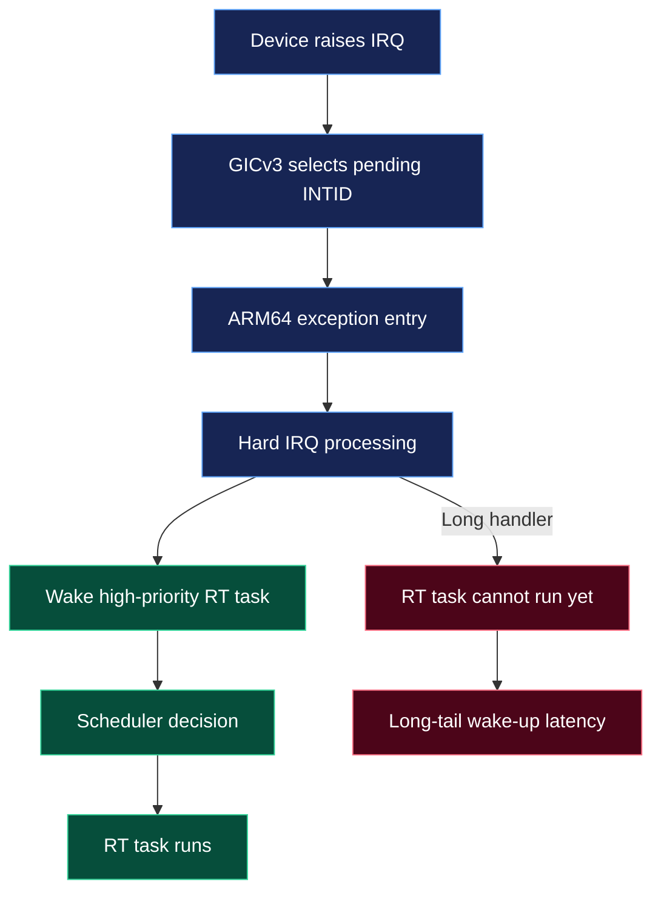


높은 우선순위 RT task가 깨어났더라도 CPU가 긴 hard IRQ handler를 실행 중이면 scheduler는 그 task를 실행시킬 수 없다. 따라서 전체 wake-up latency는 다음과 같이 분해할 수 있다.

```text
T_wakeup_to_run =
    T_remaining_hardirq
  + T_irq_exit
  + T_scheduler_decision
  + T_context_switch
```

PREEMPT_RT는 `T_remaining_hardirq`를 0으로 만들지는 않는다. 대신 hard IRQ에 남는 코드를 다음과 같이 최소화한다.

```text
Hard IRQ stub
    - interrupt source 확인
    - 최소한의 ACK/mask
    - IRQ thread wake-up
    - return

IRQ thread
    - register/status 처리
    - DMA completion 처리
    - queue/fence signal
    - consumer wake-up
    - 비교적 복잡한 driver logic
```

공식 PREEMPT_RT 문서는 forced-threaded interrupts와 sleeping spin locks를 통해 긴 scheduling-latency path를 preemptible process context로 이동한다고 설명한다.

### Threading이 주는 핵심 이점

- IRQ 처리 본체에 `SCHED_FIFO` priority를 줄 수 있다.
- IRQ thread를 특정 CPU에 affinity할 수 있다.
- 더 높은 priority safety/control thread가 IRQ handler 본체를 선점할 수 있다.
- 일반 `spinlock_t`의 PI와 IRQ thread 사이의 dependency를 scheduler가 관리할 수 있다.
- IRQ handler 내부에서 sleep 가능한 API를 제한적으로 사용할 수 있다. 단, 무제한 wait와 느린 I/O는 여전히 금지해야 한다.

### Threading이 자동으로 해결하지 않는 것

- GIC가 interrupt를 CPU에 늦게 전달하는 문제
- Interrupt가 device에서 mask된 상태로 남는 문제
- Firmware/EL3/SMMU/NPU에서 interrupt를 늦게 발생시키는 문제
- IRQ thread보다 높은 RT task의 과도한 CPU 점유
- IRQ thread의 긴 critical section 또는 DMA fence wait
- DRAM/NoC contention, thermal throttling
- QEMU host scheduling noise

---

## 5. End-to-End latency budget


각 timestamp를 명시적으로 정의한다.

| 시점 | 의미 | 관찰 방법 |
|---|---|---|
| T0 | device event / DMA completion | device HW timestamp, QEMU device trace |
| T1 | GIC INTID acknowledge | architecture trace 또는 irq handler entry 근접 지점 |
| T2 | IRQ thread wake request | `sched_wakeup`, `__irq_wake_thread()` |
| T3 | IRQ thread 실제 실행 | `sched_switch` next task가 `irq/N-*` |
| T4 | completion publish | driver tracepoint, fence/queue timestamp |
| T5 | consumer task 실제 실행 | consumer `sched_switch` 또는 app timestamp |
| T6 | control command output | CAN/Ethernet transmit timestamp |

주요 구간은 다음과 같다.

```text
T_irq_entry       = T1 - T0
T_hard_stub       = T2 - T1
T_irq_thread_sched= T3 - T2
T_thread_fn       = T4 - T3
T_consumer_sched  = T5 - T4
T_end_to_end      = T6 - T0
```

`cyclictest` 하나만으로는 이 중 어느 구간이 늦었는지 알 수 없다. 5강의 목표는 IRQ event와 scheduler trace를 결합해 `T2 → T3`를 분리하는 것이다.

---

# Part II. ARM GICv3 Hardware 큰 그림

## 6. GICv3 구성 요소

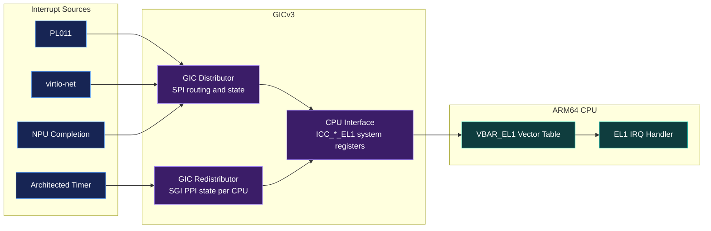


### Distributor

Distributor는 주로 SPI/ESPI의 global state를 관리한다.

- enable/disable
- pending/active state
- trigger configuration
- interrupt priority
- CPU affinity routing (`GICD_IROUTER`)

### Redistributor

각 CPU affinity에 대응하는 Redistributor가 SGI/PPI/EPPI state를 관리한다.

- SGI: Software Generated Interrupt, 주로 IPI
- PPI: Private Peripheral Interrupt, 각 CPU에 private
- architected timer interrupt도 PPI에 속한다.

### CPU Interface

AArch64에서 GICv3 CPU interface는 주로 `ICC_*_EL1` system register로 접근한다.

- `ICC_IAR1_EL1`: pending Group 1 interrupt acknowledge, INTID 반환
- `ICC_EOIR1_EL1`: priority drop / EOI
- `ICC_DIR_EL1`: deactivate, EOImode에 따라 분리
- `ICC_PMR_EL1`: priority mask
- `ICC_RPR_EL1`: current running priority

Linux v6.18의 GICv3 driver는 `gic_read_iar()`로 INTID를 읽고, `gic_complete_ack()`에서 필요하면 `ICC_EOIR1_EL1`을 기록한 뒤 `generic_handle_domain_irq()`로 전달한다.

---

## 7. Interrupt 종류와 Linux 사용

| 범위 | 종류 | 특성 | 일반 예 |
|---:|---|---|---|
| 0–15 | SGI | software generated, CPU 간 IPI | reschedule IPI, call-function IPI |
| 16–31 | PPI | CPU-private peripheral interrupt | architected timer, PMU |
| 32–1019 | SPI | shared peripheral interrupt | UART, virtio device, NPU completion |
| 8192 이상 | LPI | ITS 기반 message-signaled interrupt | PCIe MSI/MSI-X |

QEMU `virt`의 virtio-mmio interrupt는 일반적으로 SPI 형태로 GICv3에 연결된다. 실제 Linux virq 번호는 boot 시 irq domain mapping 결과이므로 INTID와 같다고 가정하지 않는다.

---

## 8. GIC hardware priority와 Linux scheduler priority

두 priority는 목적과 적용 시점이 다르다.

| 구분 | GIC priority | IRQ thread priority |
|---|---|---|
| 계층 | Interrupt controller hardware | Linux scheduler |
| 대상 | Pending INTID | Runnable `irq/N-*` task |
| 적용 시점 | CPU exception 전달 전/중 | hard IRQ stub가 thread를 깨운 뒤 |
| 설정 | `GICD_IPRIORITYR`, `ICC_PMR_EL1` | `SCHED_FIFO`, `chrt`, kernel scheduling API |
| 일반 Linux 사용 | 대부분 동일 default IRQ priority | IRQ thread별 hierarchy 설계 가능 |

Linux GICv3 driver에는 “Linux only uses one [default interrupt priority] anyway”라는 설명이 있다. 따라서 `chrt -f -p 80 <irq-thread-pid>`는 GIC hardware priority를 변경하지 않는다. 반대로 `GICD_IPRIORITYR`을 변경해도 IRQ thread가 runnable 된 이후의 scheduler ordering을 직접 바꾸지는 않는다.

### 설계 관점

Automotive product에서는 보통 hardware priority와 software priority를 함께 검토하지만, Linux mainline의 일반 IRQ management interface는 IRQ thread priority hierarchy를 중심으로 사용한다. GIC priority를 vendor-specific하게 조정한다면 pseudo-NMI, secure state, PMR masking, interrupt nesting과의 상호작용을 별도로 검증해야 한다.

---

# Part III. ARM64 IRQ Entry에서 Generic IRQ까지

## 9. Software layer 지도

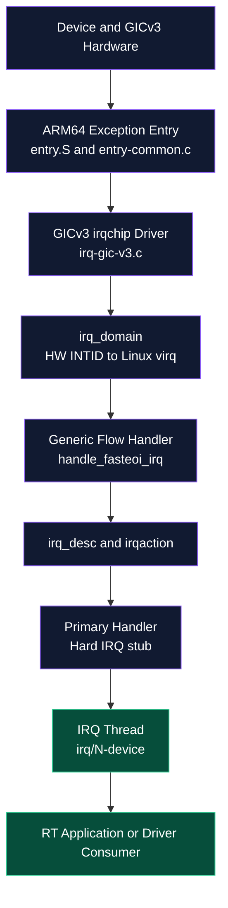


분석할 source path는 다음과 같다.

```text
arch/arm64/kernel/entry.S
arch/arm64/kernel/entry-common.c
    ↓
drivers/irqchip/irq-gic-v3.c
    ↓
kernel/irq/irqdesc.c
kernel/irq/chip.c
kernel/irq/handle.c
kernel/irq/manage.c
    ↓
kernel/sched/core.c
```

각 계층의 책임을 혼동하지 않는다.

- ARM64 entry: CPU exception state 저장, C handler 진입, irqentry accounting
- GIC irqchip driver: INTID acknowledge, EOI/deactivate, route/type/mask/unmask
- irq domain: hwirq → virq mapping
- generic flow handler: level/edge/fasteoi state machine
- action handler: device-specific primary handler와 `thread_fn`
- scheduler: IRQ kernel thread와 consumer task 실행 순서

---

## 10. ARM64 exception vector

`arch/arm64/kernel/entry.S`는 EL0/EL1, SP0/SPx, AArch64/AArch32, sync/IRQ/FIQ/error 조합에 대한 vector entry를 만든다. 일반적인 Linux kernel context IRQ는 다음과 같은 경로를 가진다.

```text
VBAR_EL1 + vector offset
    → kernel_ventry
    → entry_handler ... irq
    → el1h_64_irq_handler()
    → el1_interrupt(regs, handle_arch_irq)
```

`entry.S`는 register를 저장하고 stack을 구성한 후 `entry-common.c`의 C handler를 호출한다. `entry-common.c`는 `irq_enter_rcu()`, architecture handler 호출, `irq_exit_rcu()`와 irqentry exit processing을 수행한다.

### 왜 low-level entry는 hard context에 남는가?

- CPU register와 exception state를 보존해야 한다.
- 아직 일반 scheduler-controlled context가 아니다.
- GIC INTID를 acknowledge하고 generic handler로 넘기는 최소 경로가 필요하다.
- NMI/pseudo-NMI와 regular IRQ를 구분해야 한다.

PREEMPT_RT는 이 부분까지 일반 task thread로 만들지 않는다. 목표는 **low-level hard path를 짧게 유지하고 device-specific 본체를 thread로 이동**하는 것이다.

---

## 11. GICv3 acknowledge와 domain dispatch

Linux v6.18의 핵심 흐름을 축약하면 다음과 같다.

```c
static void __gic_handle_irq(u32 irqnr, struct pt_regs *regs)
{
    if (gic_irqnr_is_special(irqnr))
        return;

    gic_complete_ack(irqnr);

    if (generic_handle_domain_irq(gic_data.domain, irqnr))
        gic_deactivate_unhandled(irqnr);
}
```

핵심 의미:

1. `gic_read_iar()`가 hardware INTID를 읽는다.
2. special/spurious INTID를 걸러낸다.
3. `gic_complete_ack()`가 ordering과 priority drop을 처리한다.
4. `generic_handle_domain_irq(domain, hwirq)`가 irq domain mapping으로 Linux virq의 `irq_desc`를 찾는다.
5. mapping 실패 시 unhandled interrupt를 deactivate한다.

---

## 12. Hard IRQ 전체 sequence

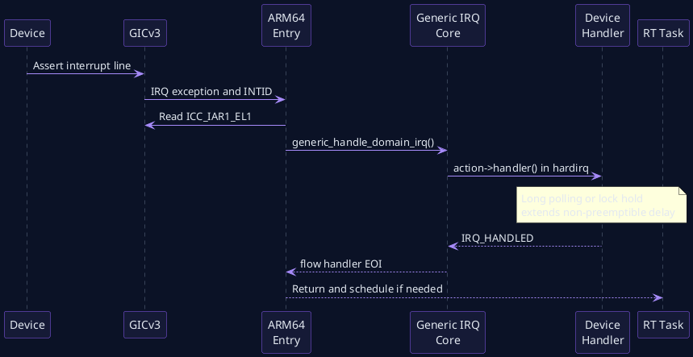


이 sequence에서 driver primary handler가 길면 높은 우선순위 RT task는 그동안 실행될 수 없다. 일반 kernel의 `request_irq()` handler가 register polling, packet batch 처리, memory allocation, 복잡한 lock acquisition을 수행한다면 tail latency가 길어진다.

---

## 13. hwirq와 virq mapping

```mermaid
flowchart LR
    DT[Device Tree interrupt specifier\nSPI index plus trigger] --> FWSPEC[irq_fwspec]
    FWSPEC --> XLATE[gic_irq_domain_translate]
    XLATE --> HWIRQ[Hardware INTID\nfor example 48]
    HWIRQ --> MAP[gic_irq_domain_map]
    MAP --> VIRQ[Linux virtual IRQ\nfor example 32]
    VIRQ --> DESC[irq_desc]
    DESC --> ACTION[irqaction list]
    ACTION --> THREAD[irq/32-virtio0]
    classDef map fill:#3b1d68,stroke:#a78bfa,color:#fff
    classDef obj fill:#172554,stroke:#60a5fa,color:#fff
    class DT,FWSPEC,XLATE,MAP map
    class HWIRQ,VIRQ,DESC,ACTION,THREAD obj
```


### Hardware INTID

GIC가 제공하는 interrupt identifier다. Device Tree GIC binding에서는 SPI specifier의 두 번째 cell이 SPI-relative number인 경우가 많으며 Linux GIC driver가 여기에 32를 더해 실제 INTID로 변환한다.

### Linux virq

Linux가 `irq_desc`를 indexing하기 위해 할당한 논리 번호다. `/proc/interrupts`의 첫 열에서 볼 수 있다.

### 왜 구분해야 하는가?

- Driver API는 일반적으로 Linux virq를 사용한다.
- GIC register는 hardware INTID를 기준으로 한다.
- Device Tree specifier는 firmware 표현이며 다시 별도다.
- Tracepoint의 `irq=` 값은 보통 Linux virq다.

### Mapping source

```text
gic_irq_domain_translate()
    firmware specifier → hwirq + trigger type

gic_irq_domain_alloc()/map()
    hwirq → virq irq_desc + irq_chip + flow handler
```

SPI/ESPI는 `handle_fasteoi_irq` flow handler로 설정되고 single-target affinity 특성이 적용된다.

---

# Part IV. Generic IRQ Object와 Flow Handler

## 14. IRQ 핵심 객체

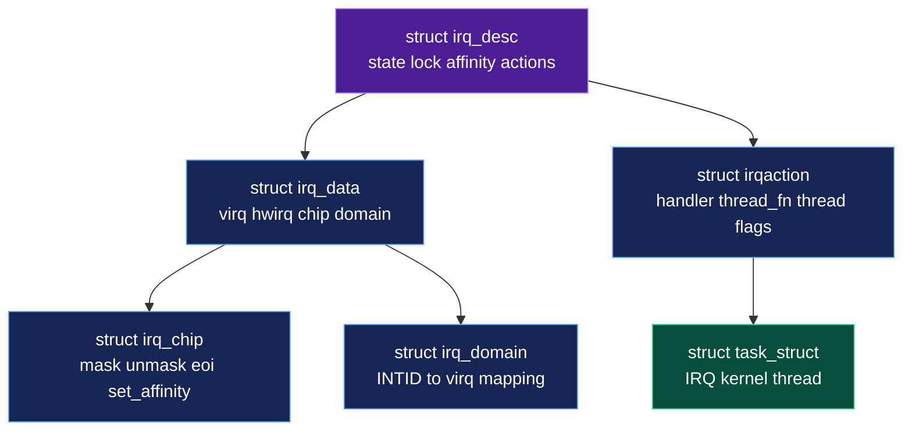


### `struct irq_desc`

Linux virq당 global state container다.

- descriptor lock
- IRQ state와 settings
- affinity / effective affinity
- action list
- threaded handler active count
- ONESHOT thread mask
- flow handler pointer

### `struct irq_data`

irqchip 계층과 irq domain 계층에 필요한 정보다.

- `irq`: Linux virq
- `hwirq`: hardware INTID
- `chip`: `struct irq_chip *`
- `domain`: mapping domain
- chip data, affinity metadata

### `struct irq_chip`

interrupt controller driver callback table다.

```text
irq_mask
irq_unmask
irq_eoi
irq_set_type
irq_set_affinity
irq_get_irqchip_state
irq_set_irqchip_state
```

### `struct irqaction`

Device driver가 request한 handler 단위다.

```c
struct irqaction {
    irq_handler_t handler;
    irq_handler_t thread_fn;
    struct task_struct *thread;
    struct irqaction *secondary;
    unsigned int flags;
    unsigned long thread_flags;
    ...
};
```

Shared IRQ이면 하나의 `irq_desc`에 여러 action이 linked list로 연결될 수 있다.

---

## 15. `handle_fasteoi_irq()`

GICv3 SPI는 Linux v6.18에서 일반적으로 `handle_fasteoi_irq()`에 연결된다.

```c
void handle_fasteoi_irq(struct irq_desc *desc)
{
    struct irq_chip *chip = desc->irq_data.chip;

    guard(raw_spinlock)(&desc->lock);

    if (desc->istate & IRQS_ONESHOT)
        mask_irq(desc);

    handle_irq_event(desc);
    cond_unmask_eoi_irq(desc, chip);
}
```

주요 의미:

- descriptor state를 raw spinlock으로 보호한다.
- ONESHOT이면 thread가 끝날 때까지 line을 mask할 수 있다.
- `handle_irq_event()`가 action list를 실행한다.
- EOI/unmask ordering을 irqchip semantics에 맞춰 수행한다.

`desc->lock`과 GIC low-level register path는 PREEMPT_RT에서도 hard context에 남는 core code이므로 `raw_spinlock_t`와 bounded critical section이 중요하다.

---

## 16. Primary handler 실행과 thread wake-up

`__handle_irq_event_percpu()`는 action마다 `action->handler()`를 실행하고 return value를 확인한다.

```text
IRQ_NONE
    → 이 action의 device가 원인이 아님

IRQ_HANDLED
    → primary에서 처리를 완료

IRQ_WAKE_THREAD
    → action->thread_fn을 실행할 IRQ thread 깨움
```

`IRQ_WAKE_THREAD`이면 `__irq_wake_thread()`가 다음을 수행한다.

```text
IRQTF_RUNTHREAD bit set
threads_oneshot mask update
threads_active increment
wake_up_process(action->thread)
```

여기서 `wake_up_process()`는 thread를 runnable하게 만들 뿐이다. 실제 실행 시점은 scheduler priority, CPU affinity, 현재 CPU의 실행 상태에 의해 결정된다.

---

# Part V. Explicit Threaded IRQ와 Forced Threading

## 17. Driver API

### `request_threaded_irq()`

```c
int request_threaded_irq(unsigned int irq,
                         irq_handler_t handler,
                         irq_handler_t thread_fn,
                         unsigned long flags,
                         const char *name,
                         void *dev_id);
```

- `handler`: hard IRQ primary handler
- `thread_fn`: scheduler-controlled IRQ thread handler
- `IRQF_ONESHOT`: thread가 끝날 때까지 interrupt line을 mask

Primary handler를 `NULL`로 주면 generic IRQ core가 기본 primary handler를 설치하며, 이 handler는 `IRQ_WAKE_THREAD`를 반환한다.

### `request_irq()`

Linux v6.18에서 `request_irq()`는 내부적으로 다음과 같이 `request_threaded_irq()`를 호출한다.

```c
return request_threaded_irq(irq,
                            handler,
                            NULL,
                            flags | IRQF_COND_ONESHOT,
                            name,
                            dev);
```

따라서 PREEMPT_RT forced threading은 기존 `request_irq()` driver도 가능한 경우 자동으로 IRQ thread 형태로 변환할 수 있다.

---

## 18. Driver probe 시 설정 흐름

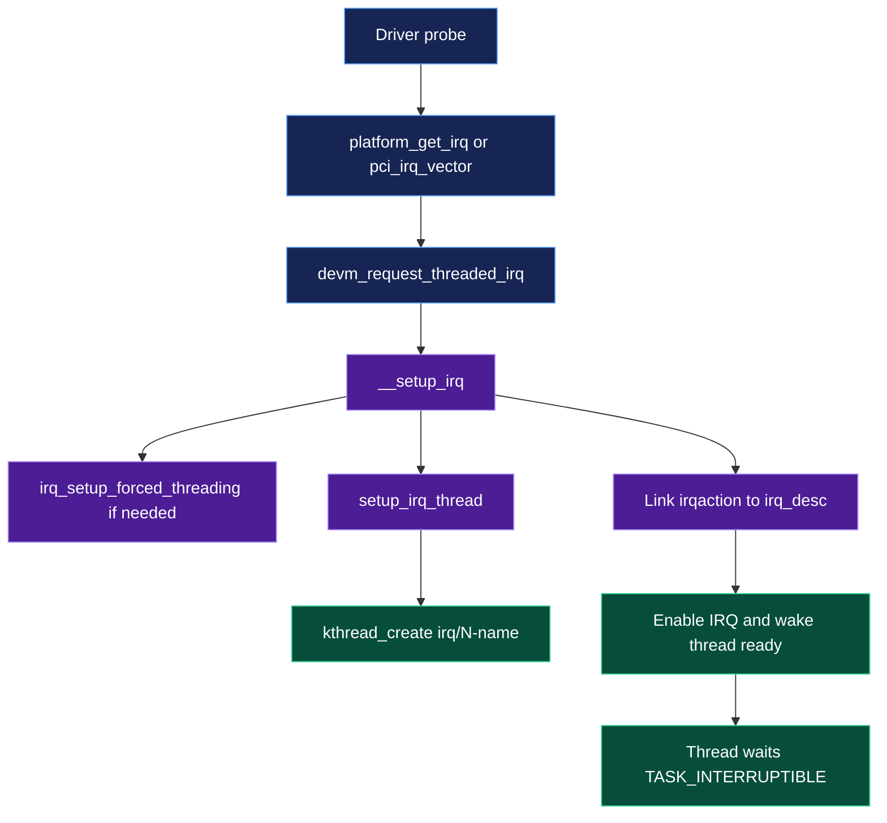
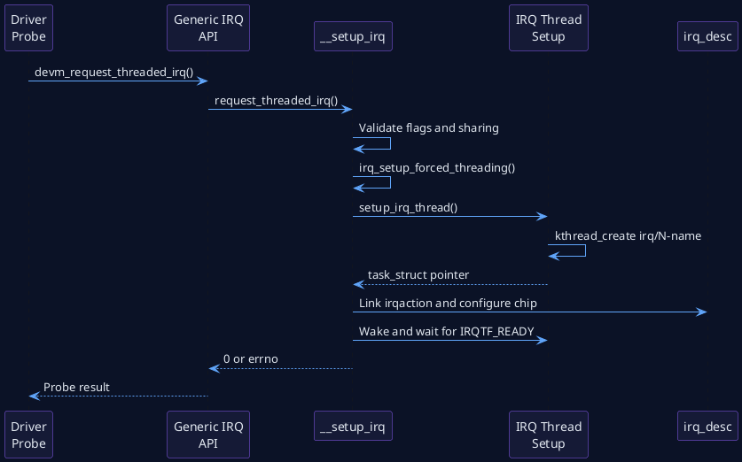


`__setup_irq()`의 핵심 단계:

1. Trigger type과 shared flag compatibility 확인
2. Nested threaded interrupt인지 확인
3. `irq_settings_can_thread(desc)`이면 forced-thread conversion 검토
4. `thread_fn`이 있으면 `setup_irq_thread()`로 kthread 생성
5. action을 descriptor action list에 연결
6. thread를 준비 상태로 깨우고 `IRQTF_READY` 확인
7. interrupt startup/enable

생성되는 thread 이름은 일반적으로 다음 형태다.

```text
irq/<virq>-<action-name>
irq/<virq>-s-<action-name>    # forced secondary action
```

---

## 19. PREEMPT_RT forced threading transformation

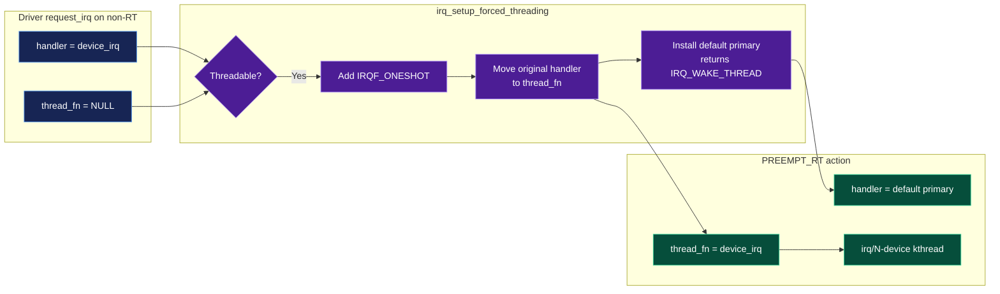
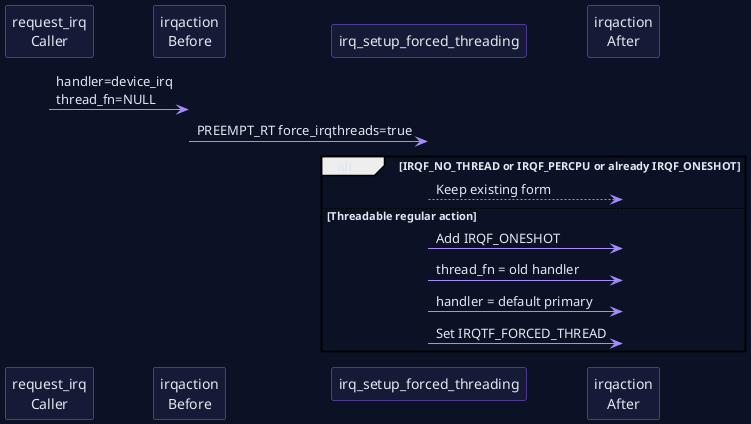


Linux v6.18에서 `force_irqthreads()`는 `CONFIG_PREEMPT_RT`이면 항상 true다.

기존 action이 다음과 같다고 하자.

```text
handler   = device_irq_handler
thread_fn = NULL
```

Threadable한 interrupt라면 `irq_setup_forced_threading()`은 개념적으로 다음을 수행한다.

```c
new->flags |= IRQF_ONESHOT;
set_bit(IRQTF_FORCED_THREAD, &new->thread_flags);
new->thread_fn = new->handler;
new->handler = irq_default_primary_handler;
```

변환 후:

```text
Hard IRQ primary
    irq_default_primary_handler()
    → IRQ_WAKE_THREAD

IRQ kernel thread
    original device_irq_handler()
```

### 실제 primary + thread_fn이 이미 있는 경우

Driver가 explicit primary와 thread_fn을 모두 제공한 경우, forced threading은 primary 본체도 secondary action을 만들어 thread화할 수 있다. 그러나 driver가 `IRQF_ONESHOT`을 사용하며 explicit primary를 제공하는 일반 threaded IRQ 패턴에서는 primary가 hard context에 남을 수 있으므로 반드시 짧고 non-sleeping이어야 한다.

---

## 20. Threading 예외와 flag

| Flag | 의미 | PREEMPT_RT 영향 |
|---|---|---|
| `IRQF_NO_THREAD` | hard IRQ에 반드시 남음 | forced threading 제외 |
| `IRQF_PERCPU` | per-CPU interrupt | forced threading 제외 |
| `IRQF_ONESHOT` | thread 완료까지 line mask | explicit threaded IRQ에 사용; conversion 조건에서 이미 제외될 수 있음 |
| `IRQF_SHARED` | 여러 action이 line 공유 | 모든 action의 trigger/oneshot 조건 호환 필요 |
| `IRQF_TIMER` | timer class interrupt | `IRQF_NO_THREAD` 포함 |

Architecture porting 문서는 clock event, perf interrupt, cascading interrupt controller handler처럼 반드시 hard context에 남아야 하는 interrupt를 `IRQF_NO_THREAD`로 표시하도록 요구한다.

### 주의: `IRQF_NO_THREAD` 남용

단순히 기존 driver가 thread context에서 깨진다는 이유로 `IRQF_NO_THREAD`를 붙이면 latency 문제를 hard IRQ path로 되돌린다. 먼저 다음을 확인한다.

- handler가 `local_bh_disable()`의 implicit semantics에 의존하는가?
- `spinlock_t`가 atomic lock이라고 가정하는가?
- per-CPU data protection이 잘못되었는가?
- hard context에서만 가능한 hardware protocol인가?
- handler를 primary 최소 stub + `thread_fn`으로 재구성할 수 있는가?

---

## 21. Explicit threaded IRQ driver pattern

```c
static irqreturn_t npu_irq_primary(int irq, void *data)
{
    struct npu_dev *npu = data;

    if (!npu_completion_pending(npu))
        return IRQ_NONE;

    npu_mask_or_ack_completion(npu);
    return IRQ_WAKE_THREAD;
}

static irqreturn_t npu_irq_thread(int irq, void *data)
{
    struct npu_dev *npu = data;

    npu_drain_completion_queue(npu);
    dma_fence_signal(npu->completed_fence);
    wake_up(&npu->completion_waitq);
    return IRQ_HANDLED;
}

ret = devm_request_threaded_irq(dev,
                                irq,
                                npu_irq_primary,
                                npu_irq_thread,
                                IRQF_ONESHOT,
                                dev_name(dev),
                                npu);
```

### Primary handler 규칙

- Interrupt 원인 확인은 bounded register access로 수행한다.
- 필요한 최소 mask/ack만 수행한다.
- `printk()` storm, polling loop, allocation, mutex wait, DMA fence wait를 넣지 않는다.
- Shared IRQ이면 자신의 device가 원인이 아닐 때 `IRQ_NONE`을 반환한다.

### Thread function 규칙

Thread context라고 해서 무제한 작업을 허용하지 않는다.

- completion batch 크기에 상한을 둔다.
- lock hold time을 측정한다.
- sleep 가능한 API의 최대 wait를 정의한다.
- DMA fence wait는 bounded timeout과 recovery가 필요하다.
- 긴 recovery는 별도 worker로 넘기고 IRQ thread는 critical consumer를 먼저 깨운다.

---

# Part VI. IRQ Thread Lifecycle와 Scheduling

## 22. IRQ thread state

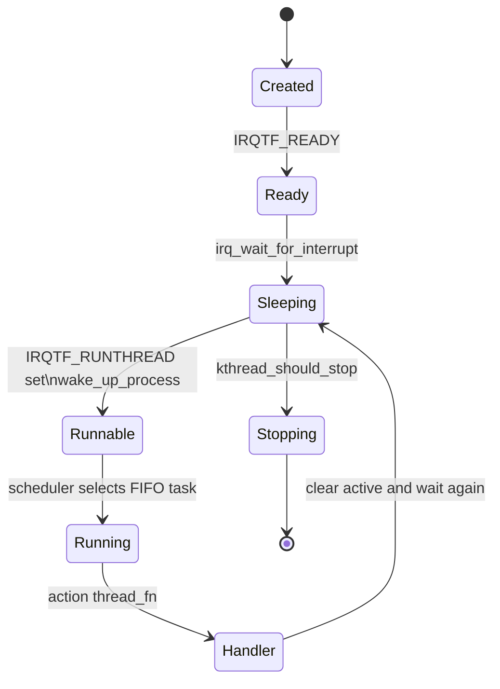


`setup_irq_thread()`는 `kthread_create()`로 thread를 만들고 `action->thread`에 task reference를 저장한다. IRQ thread는 준비 후 `irq_wait_for_interrupt()`에서 다음 상태를 반복한다.

```text
TASK_INTERRUPTIBLE
    ↓ IRQTF_RUNTHREAD set + wake_up_process
TASK_RUNNING / runnable
    ↓ scheduler selects
Running
    ↓ thread_fn finishes
TASK_INTERRUPTIBLE
```

`IRQTF_RUNTHREAD`이 이미 set되어 있으면 새로운 wake 요청을 중복 enqueue하지 않는다. 대신 ONESHOT state와 pending condition을 이용해 thread가 다시 처리할 수 있도록 한다.

---

## 23. IRQ thread default scheduling policy

Linux v6.18 `irq_thread()`은 시작할 때 다음을 호출한다.

```c
sched_set_fifo(current);
```

`sched_set_fifo()`는 kernel-created FIFO thread에 `MAX_RT_PRIO / 2`, 즉 user-visible priority 50을 설정한다.

이 값은 제품에 적합한 최종 priority가 아니다. Source comment도 administrator가 system context를 알고 hierarchy를 구성해야 한다고 강조한다.

### 제품 priority hierarchy 예

```text
P92  Safety deadline monitor
P88  Fast trajectory controller
P82  NPU completion IRQ thread
P78  Sensor/ISP completion IRQ thread
P72  NPU dispatch thread
P60  Non-critical device IRQ threads
SCHED_OTHER  Logging, recording, OTA
```

### 잘못된 패턴

```text
모든 IRQ thread를 P90으로 설정
```

이렇게 하면 storage/network/background interrupt도 control thread와 경쟁하며, 중요도 차이를 표현할 수 없다. IRQ rate와 handler WCET를 함께 고려해 hierarchy를 설계해야 한다.

---

## 24. Threaded IRQ 정상 sequence

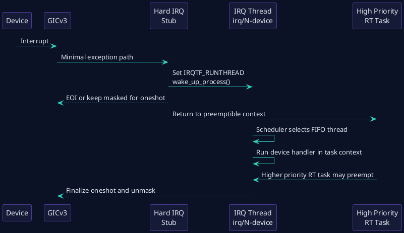
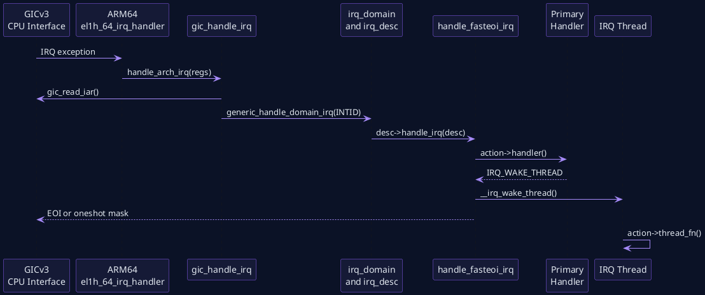


이 경로에서 trace할 이벤트는 다음과 같다.

```text
irq_handler_entry
irq_handler_exit
sched_wakeup: comm=irq/N-device
sched_switch: next_comm=irq/N-device
sched_wakeup: comm=consumer
sched_switch: next_comm=consumer
```

### Latency 계산

```text
Hard stub duration
    = irq_handler_exit - irq_handler_entry

IRQ thread scheduling latency
    = first sched_switch(next=irq thread)
      - sched_wakeup(irq thread)

Thread body duration
    = driver-specific entry/exit timestamp

Consumer scheduling latency
    = sched_switch(next=consumer)
      - sched_wakeup(consumer)
```

---

## 25. ONESHOT semantics

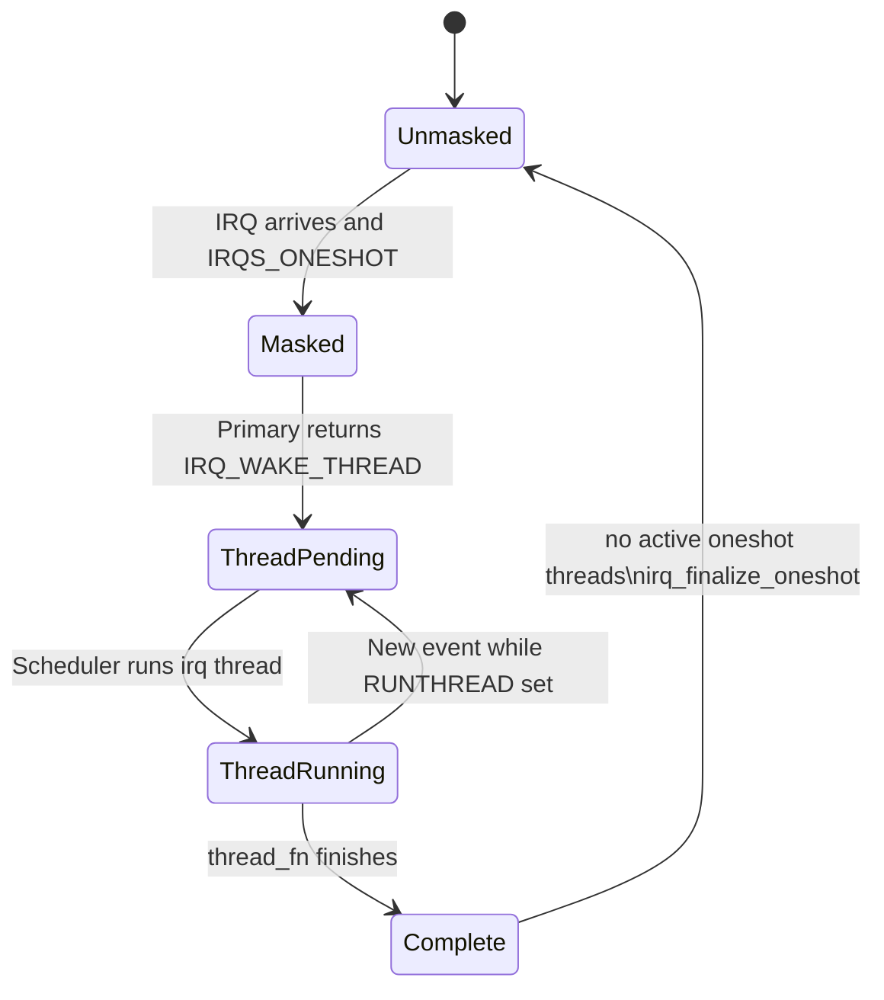
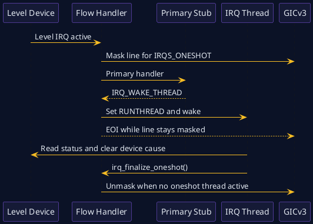


Level-triggered device는 status를 clear하지 않은 동안 interrupt line을 계속 assert할 수 있다. Hard stub가 thread를 깨우고 즉시 line을 unmask하면 interrupt storm이 발생할 수 있다. `IRQF_ONESHOT`은 해당 threaded action이 완료될 때까지 line을 mask된 상태로 유지한다.

### 핵심 상태

- `desc->threads_oneshot`: active/pending ONESHOT thread bitmask
- `IRQTF_RUNTHREAD`: action thread가 처리해야 함
- `threads_active`: `synchronize_irq()`가 기다리는 active threaded handler 수
- `irq_finalize_oneshot()`: 마지막 ONESHOT thread 완료 후 조건부 unmask

### Edge와 Level의 차이

**Level interrupt**

- Device status를 먼저 clear/ack하지 않으면 line이 계속 active다.
- ONESHOT masking이 특히 중요하다.
- Thread body가 길면 device event coalescing 또는 queue overflow를 검토해야 한다.

**Edge interrupt**

- Mask 중 추가 edge가 손실되지 않는지 controller/device semantics를 확인한다.
- Hardware pending latch 또는 device completion queue가 필요하다.

---

## 26. `synchronize_hardirq()`와 `synchronize_irq()`

| API | 기다리는 대상 | sleep 가능성 | 용도 |
|---|---|---|---|
| `synchronize_hardirq()` | hard handler | threaded handler는 기다리지 않음 | 제한적 low-level 상황 |
| `synchronize_irq()` | hard + threaded handler | thread가 있으면 sleep 가능 | shutdown/remove의 일반 안전 barrier |
| `disable_irq()` | IRQ disable + active handler completion | sleep 가능 | process context |
| `disable_irq_nosync()` | IRQ disable, completion 대기 안 함 | 즉시 return | caller가 race를 별도 관리 |

Driver remove path에서 `synchronize_hardirq()`만 사용하면 IRQ thread가 아직 device state를 접근하는 동안 memory/resource를 해제할 수 있다. Threaded IRQ를 고려한 teardown에는 `free_irq()`와 `synchronize_irq()` semantics를 정확히 이해해야 한다.

---

# Part VII. IRQ Affinity와 CPU Partitioning

## 27. Hardware routing과 thread affinity

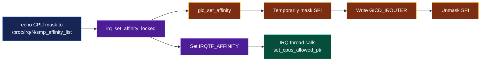
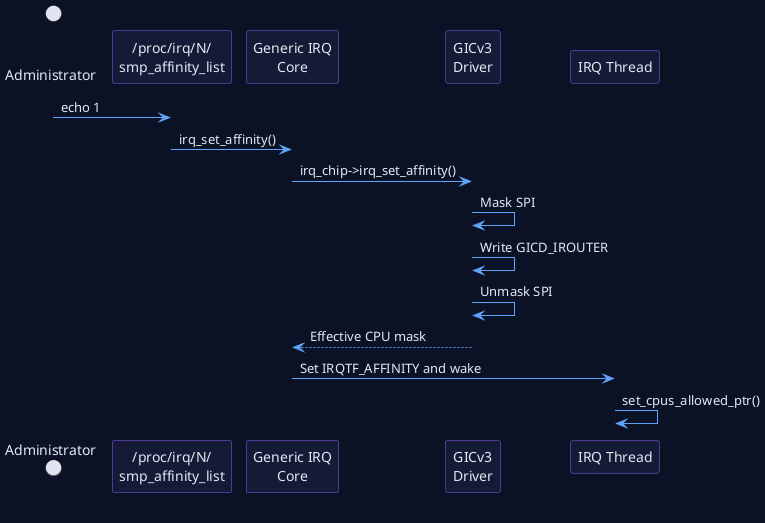


`/proc/irq/<N>/smp_affinity_list`에 CPU를 기록하면 generic IRQ core는 irqchip의 `irq_set_affinity`를 호출한다. GICv3 SPI의 경우 Linux v6.18 driver는 다음을 수행한다.

1. target online CPU 선택
2. 필요하면 interrupt mask
3. `GICD_IROUTER`에 CPU affinity 값 기록
4. interrupt unmask
5. effective affinity update

Generic IRQ core는 action thread의 `IRQTF_AFFINITY` bit도 set하고 thread를 깨운다. IRQ thread가 다음 wake cycle에서 `set_cpus_allowed_ptr()`를 호출해 task affinity를 hardware effective affinity와 맞춘다.

### 두 affinity를 함께 봐야 하는 이유

```text
GIC routes IRQ to CPU1
IRQ thread affinity = CPU3
```

이 경우 hard stub는 CPU1에서 실행되고 thread는 CPU3으로 migrate/wake되어 cross-CPU scheduling/IPI/cache 비용이 생길 수 있다. 정상 generic path에서는 core가 둘을 맞추려 하지만 manual `taskset`과 `/proc/irq` 설정을 서로 다르게 하면 불일치가 생길 수 있다.

### 확인 파일

```bash
cat /proc/irq/$IRQ/smp_affinity_list
cat /proc/irq/$IRQ/effective_affinity_list
ps -eLo pid,tid,psr,cls,rtprio,pri,comm,args | grep "irq/$IRQ-"
taskset -pc $PID
```

### Managed IRQ 주의

MSI-X/managed IRQ는 kernel이 queue topology와 housekeeping policy에 따라 affinity를 관리하며 user-space 변경이 제한될 수 있다. `irq_can_set_affinity_usr()`는 managed affinity 여부를 검사한다.

---

## 28. QEMU 4-vCPU partition 예

```text
CPU0  Housekeeping
      init, shell, logging, non-critical kernel workers

CPU1  Device IRQ
      virtio-net IRQ thread, simulated NPU IRQ thread

CPU2  RT consumer
      UDP listener, trajectory consumer, cyclictest

CPU3  Background load
      stress-ng CPU/memory/network helper
```

이 구성은 IRQ thread와 consumer를 분리해 pipeline parallelism을 볼 수 있다. 반대로 동일 CPU에 pinning하면 cache locality는 좋아질 수 있으나 IRQ thread와 consumer가 priority 경쟁을 한다. 두 방식을 실제 workload로 비교해야 한다.

---

# Part VIII. QEMU ARM64 실습

## 29. 실습 토폴로지

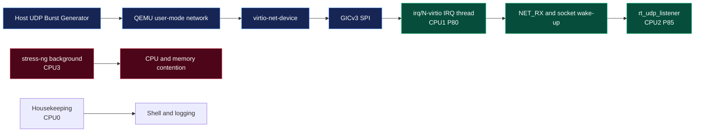
```plantuml
@startuml
skinparam backgroundColor #0B1226
skinparam defaultFontColor #E2E8F0
skinparam ArrowColor #2DD4BF
skinparam participantBorderColor #8B5CF6
skinparam participantBackgroundColor #151A36
participant "Host UDP\nGenerator" as HOST
participant "QEMU\nvirtio-net" as VNET
participant "GICv3" as GIC
participant "virtio IRQ\nThread" as IRQTH
participant "Network\nStack" as NET
participant "rt_udp_listener" as APP
HOST -> VNET: UDP packet burst
VNET -> GIC: Assert SPI
GIC -> IRQTH: Hard stub wakes IRQ thread
IRQTH -> VNET: Drain used virtqueue
IRQTH -> NET: Schedule receive processing
NET -> APP: Socket data and task wake-up
APP -> APP: Record CLOCK_MONOTONIC timestamp
@enduml
```


### 실습 A: 실제 GICv3 + virtio-net IRQ path

이 실습은 QEMU `virt`의 GICv3 경로를 통과한다.

1. Guest network interface를 활성화한다.
2. `/proc/interrupts`에서 virtio-net 관련 IRQ를 찾는다.
3. Host에서 UDP burst 또는 ping flood를 발생시킨다.
4. 해당 IRQ counter가 증가하는지 확인한다.
5. `irq/N-*` thread PID와 FIFO priority를 확인한다.
6. IRQ affinity와 thread priority를 변경한다.
7. `trace-cmd`로 handler → wake → switch를 수집한다.

### 실습 B: deterministic generic IRQ lab

`irq_thread_lab.ko`는 `irq_sim`을 이용해 다음을 반복한다.

```text
hrtimer
    → IRQCHIP_STATE_PENDING
    → hard irq_work
    → handle_simple_irq
    → primary returns IRQ_WAKE_THREAD
    → irq/N-rt_irq_lab
    → thread_fn
```

이 모듈은 generic IRQ thread mechanism을 재현하지만 GICv3 hardware entry를 통과하지 않는다. 두 실습의 목적을 혼동하지 않는다.

---

## 30. Kernel configuration

```text
CONFIG_PREEMPT_RT=y
CONFIG_SMP=y
CONFIG_HIGH_RES_TIMERS=y
CONFIG_IRQ_FORCED_THREADING=y
CONFIG_IKCONFIG=y
CONFIG_IKCONFIG_PROC=y
CONFIG_DEBUG_FS=y
CONFIG_GENERIC_IRQ_DEBUGFS=y
CONFIG_TRACEPOINTS=y
CONFIG_TRACING=y
CONFIG_FTRACE=y
CONFIG_SCHED_TRACER=y
CONFIG_IRQSOFF_TRACER=y
CONFIG_IRQ_SIM=m
```

`CONFIG_IRQ_FORCED_THREADING`은 architecture가 PREEMPT_RT를 지원하기 위한 필수 조건이다. ARM64는 `ARCH_SUPPORTS_RT`와 forced IRQ threading prerequisite를 제공한다.

---

## 31. Runtime inventory

```bash
uname -a
cat /sys/kernel/realtime

zcat /proc/config.gz | grep -E 'CONFIG_(PREEMPT_RT|IRQ_FORCED_THREADING|GENERIC_IRQ_DEBUGFS|FTRACE)='

cat /proc/interrupts

ps -eLo pid,tid,psr,cls,rtprio,pri,comm,args |     grep -E 'irq/[0-9]+'
```

예상 관찰:

```text
irq/32-virtio0    FF 50
irq/33-virtio1    FF 50
```

Device와 커널 config에 따라 이름/번호는 달라진다. `IRQF_NO_THREAD` 또는 per-CPU interrupt는 `irq/N-*` thread가 보이지 않을 수 있다.

---

## 32. IRQ 찾기

```bash
grep -Ei 'virtio|eth|ens|enp' /proc/interrupts
```

Counter 차이를 이용하는 방법:

```bash
cp /proc/interrupts /tmp/interrupts.before
# Host에서 traffic 생성
sleep 5
cp /proc/interrupts /tmp/interrupts.after
```

`watch -n 0.5 cat /proc/interrupts`를 사용할 수 있지만 console output 자체가 latency에 영향을 줄 수 있으므로 최종 측정 중에는 사용하지 않는다.

---

## 33. IRQ thread priority와 affinity 설정

```bash
IRQ=32
CPU=1
PRIO=80

printf '%s
' "$CPU" > /proc/irq/$IRQ/smp_affinity_list

PID=$(ps -eLo pid,comm |     awk -v irq="$IRQ" '$2 ~ ("^irq/" irq "-") {print $1; exit}')

chrt -f -p "$PRIO" "$PID"
taskset -pc "$CPU" "$PID"
```

### Priority 원칙

- Safety/control consumer보다 IRQ thread를 무조건 높게 두지 않는다.
- IRQ thread가 consumer를 깨우는 데 필요한 최소 처리만 한 뒤 CPU를 넘기도록 한다.
- 같은 device라도 completion class별 queue가 있다면 hardware/driver가 priority queue를 지원하는지 확인한다.
- High-rate IRQ thread의 WCET × arrival rate가 CPU utilization을 과도하게 차지하지 않는지 계산한다.

---

## 34. Trace 수집

```bash
trace-cmd record -o irq-path.dat     -e irq:irq_handler_entry     -e irq:irq_handler_exit     -e sched:sched_wakeup     -e sched:sched_wakeup_new     -e sched:sched_switch     -e sched:sched_migrate_task     sleep 20

trace-cmd report -i irq-path.dat > irq-path.txt
```

필터 예:

```bash
grep -E 'irq=32|irq/32-|sched_(wakeup|switch|migrate)' irq-path.txt
```

### Trace 해석 순서

1. `irq_handler_entry`와 `irq_handler_exit` 사이가 긴가?
2. `sched_wakeup` 대상이 정확한 IRQ thread인가?
3. Wake 이후 언제 `sched_switch`의 next task가 되는가?
4. 중간에 더 높은 RT task가 실행되었는가?
5. IRQ thread가 다른 CPU로 migrate되었는가?
6. Thread가 consumer를 깨운 뒤 consumer의 scheduling latency는 얼마인가?

---

## 35. 비교 matrix

| Case | IRQ affinity | IRQ priority | Consumer CPU | Load | 관찰 목적 |
|---|---|---:|---|---|---|
| A | CPU1 | P50 | CPU2 | idle | baseline |
| B | CPU1 | P80 | CPU2 | idle | priority 효과 |
| C | CPU2 | P80 | CPU2 | CPU contention | 같은 CPU 경쟁 |
| D | CPU1 | P80 | CPU2 | CPU3 stress | 분리 효과 |
| E | CPU1 | P60 | CPU2 P85 | network burst | consumer 우선 구조 |
| F | CPU1 | P90 | CPU2 P85 | network burst | IRQ 과도 우선의 부작용 |

기록 항목:

```text
hard stub max
IRQ wake-to-run max
thread_fn max
consumer wake-to-run max
packet loss / completion backlog
context switch count
CPU utilization
```

---

## 36. QEMU 측정 한계

QEMU TCG에서는 guest interrupt delivery가 host process scheduling과 device emulation에 영향을 받는다. ARM64 host의 KVM을 사용하더라도 host IRQ, vCPU scheduling, virtualization exit가 남는다.

따라서 QEMU에서는 다음을 신뢰한다.

- 함수 호출 순서
- hard/thread context 구분
- IRQ thread 생성 여부
- priority/affinity가 scheduler state에 반영되는지
- tracepoint correlation
- configuration A/B의 상대적 경향

다음은 target board에서 다시 측정한다.

- absolute maximum latency
- thermal/PM 상태를 포함한 long-duration worst case
- real GIC/NoC/DDR/NPU contention
- hardware timer accuracy
- ISO 26262 timing evidence

---

# Part IX. Debugging과 Driver Audit

## 37. Debug decision tree

```mermaid
flowchart TD
    START[IRQ-to-thread latency outlier] --> ENTRY{Long before irq_handler_entry?}
    ENTRY -->|Yes| HW[GIC routing host scheduling\nIRQ masked firmware or QEMU noise]
    ENTRY -->|No| HARD{Long hard handler duration?}
    HARD -->|Yes| MIN[Minimize primary handler\ncheck IRQF_NO_THREAD raw locks polling]
    HARD -->|No| WAKE{Long IRQ thread wake-to-run?}
    WAKE -->|Yes| PRIO[Check FIFO priority affinity\nCPU overload and higher RT tasks]
    WAKE -->|No| THREAD{Long thread_fn duration?}
    THREAD -->|Yes| BODY[Check locks sleep I/O\nDMA fence and work batching]
    THREAD -->|No| USER{Long completion-to-user?}
    USER -->|Yes| STACK[Trace softirq network stack\nand target task wake-up]
    USER -->|No| DONE[Correlate end-to-end timestamps]
    classDef q fill:#4c1d95,stroke:#a78bfa,color:#fff
    classDef bad fill:#4c0519,stroke:#fb7185,color:#fff
    classDef good fill:#064e3b,stroke:#34d399,color:#fff
    class ENTRY,HARD,WAKE,THREAD,USER q
    class HW,MIN,PRIO,BODY,STACK bad
    class START,DONE good
```


### 증상 1: `/proc/interrupts` counter가 증가하지 않는다

- Device가 interrupt를 발생시키는가?
- Device Tree interrupt specifier와 trigger type이 맞는가?
- GIC SPI route와 enable state가 정상인가?
- Driver probe에서 request API가 성공했는가?
- Interrupt line이 계속 mask되어 있는가?
- QEMU device wiring과 machine option이 맞는가?

### 증상 2: Counter는 증가하지만 IRQ thread가 없다

- `IRQF_NO_THREAD`인가?
- `IRQF_PERCPU`인가?
- Timer/IPI/perf/cascade interrupt인가?
- Thread action name이 예상과 다른가?
- Driver가 primary에서 완전히 처리하고 explicit thread_fn이 없는 예외인가?

### 증상 3: IRQ thread가 runnable인데 늦게 실행된다

- FIFO priority가 너무 낮은가?
- 동일 CPU에 더 높은 RT task가 CPU를 독점하는가?
- CPU affinity가 실제 effective affinity와 다른가?
- IRQ thread가 throttling 또는 cgroup 제한을 받는가?
- Host QEMU vCPU가 deschedule되었는가?

### 증상 4: IRQ thread는 빠르지만 end-to-end가 늦다

- thread_fn에서 DMA fence 또는 firmware completion을 기다리는가?
- softirq/network stack이 밀리는가?
- consumer task priority가 낮은가?
- consumer가 page fault/memory allocation/logging을 수행하는가?
- Output이 이미 stale한가?

---

## 38. Driver RT audit checklist

### Registration

- [ ] `request_irq()`를 의도적으로 쓰는가, `request_threaded_irq()`가 더 명확한가?
- [ ] `IRQF_NO_THREAD`에 실제 hardware/architecture 이유가 있는가?
- [ ] Level interrupt에 `IRQF_ONESHOT`과 device ACK ordering이 올바른가?
- [ ] Shared IRQ handler가 `IRQ_NONE`을 올바르게 반환하는가?
- [ ] Remove path가 threaded handler completion을 기다리는가?

### Primary handler

- [ ] bounded register access만 수행하는가?
- [ ] loop에 명확한 상한이 있는가?
- [ ] `raw_spinlock_t` hold time이 짧은가?
- [ ] allocation/free/printk storm이 없는가?
- [ ] sleeping API를 호출하지 않는가?

### Thread function

- [ ] 처리 batch에 상한이 있는가?
- [ ] Lock order가 정의되어 있는가?
- [ ] DMA fence wait에 timeout이 있는가?
- [ ] Consumer를 가능한 빨리 깨우는가?
- [ ] 긴 recovery를 별도 worker로 분리하는가?

### Affinity/Priority

- [ ] Hardware effective affinity와 thread affinity가 일치하는가?
- [ ] Safety/control/IRQ/background hierarchy가 문서화되어 있는가?
- [ ] IRQ rate × WCET utilization을 계산했는가?
- [ ] Shared CPU와 isolated CPU 배치를 모두 측정했는가?
- [ ] Managed IRQ 제약을 확인했는가?

---

# Part X. Automotive NPU End-to-End Case Study

## 39. Pipeline architecture

```mermaid
flowchart LR
    SENSOR[Camera Radar Sensor] --> DMA[DMA completion]
    DMA --> SIRQ[Sensor IRQ thread\nP78 CPU1]
    SIRQ --> SUBMIT[NPU dispatch thread\nP72 CPU2]
    SUBMIT --> NPU[NPU execution]
    NPU --> NIRQ[NPU completion IRQ thread\nP82 CPU1]
    NIRQ --> PUB[Trajectory publish]
    PUB --> CTRL[Fast controller\nP88 CPU3]
    CTRL --> SAFE[Safety monitor\nP92 CPU3]
    SAFE --> CAN[CAN Ethernet command]
    LOG[Logger SCHED_OTHER] -. background .-> PUB
    classDef hw fill:#172554,stroke:#60a5fa,color:#fff
    classDef irq fill:#4c1d95,stroke:#a78bfa,color:#fff
    classDef rt fill:#064e3b,stroke:#34d399,color:#fff
    classDef bg fill:#111a31,stroke:#94a3b8,color:#fff
    class SENSOR,DMA,NPU hw
    class SIRQ,NIRQ irq
    class SUBMIT,PUB,CTRL,SAFE,CAN rt
    class LOG bg
```
```plantuml
@startuml
skinparam backgroundColor #0B1226
skinparam defaultFontColor #E2E8F0
skinparam ArrowColor #A78BFA
skinparam participantBorderColor #8B5CF6
skinparam participantBackgroundColor #151A36
participant "NPU Hardware" as NPU
participant "GICv3" as GIC
participant "NPU Completion\nIRQ Thread P82" as NIRQ
participant "Trajectory\nPublisher" as PUB
participant "Controller\nP88" as CTRL
participant "Safety Monitor\nP92" as SAFE
NPU -> GIC: Completion SPI
GIC -> NIRQ: Minimal hardirq and wake
NIRQ -> NPU: Read status and signal fence
NIRQ -> PUB: Publish result with timestamps
PUB -> CTRL: Wake controller
CTRL -> CTRL: Validate age and track trajectory
CTRL -> SAFE: Candidate vehicle command
SAFE -> SAFE: Plausibility and deadline check
@enduml
```


### 예시 priority hierarchy

```text
P92 Safety monitor
P88 Fast controller
P82 NPU completion IRQ thread
P78 Sensor/ISP completion IRQ thread
P72 NPU dispatch thread
P60 Non-critical device IRQ threads
SCHED_OTHER logger/recorder
```

### 왜 NPU completion IRQ가 controller보다 낮을 수 있는가?

NPU completion thread는 trajectory/result를 publish하고 controller를 깨우는 역할을 한다. 이미 runnable한 safety/controller task가 있다면 그것을 먼저 실행하는 것이 더 중요할 수 있다. 반면 NPU thread priority가 너무 낮으면 새 결과 publish가 늦어진다. 따라서 다음 timing dependency로 설계한다.

```text
NPU thread WCET + controller release latency
    < remaining trajectory freshness budget
```

### Buffer와 lock

- NPU output buffer owner: accelerator until completion fence
- Completion IRQ thread: status/fence 처리 후 CPU ownership 전환
- Trajectory publish: lock 또는 lock-free versioned buffer
- Controller: latest valid version을 bounded time에 읽음
- Logger: copy/reference를 비실시간 queue로 전달

PREEMPT_RT의 PI는 trajectory buffer lock의 inversion을 줄일 수 있지만, NPU firmware queue와 hardware execution time을 제어하지 않는다.

### Deadline miss 처리

```text
NPU completion late
    → IRQ thread runs
    → result timestamp/age check
    → stale이면 publish하지 않음
    → safety monitor에 miss 기록
    → previous bounded trajectory 또는 fallback 사용
```

IRQ가 빠르게 처리되었다는 이유만으로 stale result를 사용해서는 안 된다.

---

## 40. Safety와 isolation 관점

PREEMPT_RT는 ISO 26262 ASIL 인증 자체를 제공하지 않는다. Automotive device에서는 다음을 추가로 설계한다.

- Independent watchdog 또는 safety MCU
- Deadline monitor와 output freshness check
- CPU/IRQ freedom-from-interference 분석
- Memory bandwidth/NoC QoS
- NPU timeout/reset/fault containment
- Command plausibility check
- Minimal Risk Maneuver 또는 degraded mode
- Long-duration stress/thermal/fault-injection 검증

IRQ priority를 높이는 것은 safety mechanism이 아니라 timing architecture의 한 요소다.

---

# Part XI. 핵심 Source Reading

## 41. Source reading 순서

| 순서 | 파일 | 핵심 함수/구조체 | 확인 질문 |
|---:|---|---|---|
| 1 | `kernel/irq/Kconfig` | `IRQ_FORCED_THREADING` | Architecture prerequisite인가? |
| 2 | `include/linux/interrupt.h` | IRQF flags, `irqaction`, `force_irqthreads()` | RT에서 forced mode가 항상 true인가? |
| 3 | `arch/arm64/kernel/entry.S` | vector, `entry_handler` | IRQ C handler로 어떻게 진입하는가? |
| 4 | `arch/arm64/kernel/entry-common.c` | `el1h_64_irq_handler` | irqentry/RCU accounting은 어디서 하는가? |
| 5 | `drivers/irqchip/irq-gic-v3.c` | `gic_handle_irq`, `gic_set_affinity` | INTID ACK와 IROUTER update는 어디서 하는가? |
| 6 | `kernel/irq/irqdesc.c` | `generic_handle_domain_irq` | hwirq가 어떤 desc로 resolve되는가? |
| 7 | `kernel/irq/chip.c` | `handle_fasteoi_irq` | mask/event/eoi ordering은 무엇인가? |
| 8 | `kernel/irq/handle.c` | `__handle_irq_event_percpu`, `__irq_wake_thread` | primary return이 thread wake로 어떻게 연결되는가? |
| 9 | `kernel/irq/manage.c` | `irq_setup_forced_threading`, `irq_thread` | action이 어떻게 변환되고 kthread가 어떻게 동작하는가? |
| 10 | `kernel/sched/syscalls.c` | `sched_set_fifo` | 기본 FIFO priority는 무엇인가? |

### 공식 문서

- `Documentation/core-api/genericirq.rst`
- `Documentation/core-api/irq/irq-domain.rst`
- `Documentation/core-api/irq/irq-affinity.rst`
- `Documentation/core-api/real-time/differences.rst`
- `Documentation/core-api/real-time/architecture-porting.rst`
- `Documentation/arch/arm64/`

### Upstream links

- <https://github.com/torvalds/linux/blob/v6.18/kernel/irq/manage.c>
- <https://github.com/torvalds/linux/blob/v6.18/kernel/irq/handle.c>
- <https://github.com/torvalds/linux/blob/v6.18/kernel/irq/chip.c>
- <https://github.com/torvalds/linux/blob/v6.18/kernel/irq/irqdesc.c>
- <https://github.com/torvalds/linux/blob/v6.18/drivers/irqchip/irq-gic-v3.c>
- <https://github.com/torvalds/linux/blob/v6.18/arch/arm64/kernel/entry-common.c>
- <https://github.com/torvalds/linux/blob/v6.18/include/linux/interrupt.h>

---

# Part XII. 퀴즈

## 42. 객관식 4문항

### Q1

PREEMPT_RT에서 forced-threaded IRQ의 가장 정확한 설명은 무엇인가?

A. GIC hardware interrupt를 user-space process로 직접 전달한다.  
B. 모든 ARM64 exception entry를 kernel thread로 변환한다.  
C. 가능한 device handler 본체를 scheduler-controlled IRQ kernel thread로 이동한다.  
D. 모든 IRQ를 동일한 FIFO priority 99로 실행한다.

### Q2

다음 중 `IRQF_NO_THREAD`의 적절한 사용 사례는 무엇인가?

A. Threaded handler를 수정하기 귀찮은 모든 legacy driver  
B. Clock event 또는 cascading interrupt-controller처럼 hard context가 필수인 handler  
C. 시간이 오래 걸리는 storage completion handler  
D. DMA fence가 signal될 때까지 기다리는 NPU handler

### Q3

GIC SPI affinity를 CPU1로 변경할 때 Linux v6.18의 정상 generic path에서 수행되는 일은 무엇인가?

A. IRQ thread priority가 자동으로 P1이 된다.  
B. `GICD_IROUTER` routing과 IRQ thread CPU affinity가 함께 갱신된다.  
C. GIC hardware priority가 P80으로 변경된다.  
D. 모든 PPI도 CPU1로 이동한다.

### Q4

`request_threaded_irq()`에서 `handler == NULL`인 경우의 일반 동작은 무엇인가?

A. 등록 실패  
B. `thread_fn`이 hard IRQ에서 실행  
C. 기본 primary handler가 설치되어 `IRQ_WAKE_THREAD` 반환  
D. interrupt가 polling mode로 변경

---

## 43. O/X 2문항

### Q5

`chrt -f -p 80 <irq-thread-pid>`는 GICv3의 `GICD_IPRIORITYR` 값을 80으로 변경한다. (O/X)

### Q6

`wake_up_process(action->thread)`가 호출된 시점과 IRQ thread가 실제 CPU에서 실행을 시작한 시점 사이에는 scheduler latency가 존재할 수 있다. (O/X)

---

## 44. 단답형 2문항

### Q7

GIC hardware INTID를 Linux virq로 변환하는 Linux subsystem/object는 무엇인가?

### Q8

ONESHOT threaded IRQ에서 마지막 active thread가 완료된 뒤 interrupt line을 조건부 unmask하는 핵심 함수 이름은 무엇인가?

---

## 45. 시나리오/디버깅 2문항

### Q9

NPU completion IRQ counter는 빠르게 증가하고 `irq_handler_entry/exit` hard stub도 짧지만, `irq/N-npu`가 wake된 뒤 실제 실행까지 최대 4ms가 걸린다. 확인 순서를 4개 이상 제시하라.

### Q10

Driver가 level-triggered interrupt를 `request_threaded_irq()`로 등록했다. Primary handler는 status를 확인하지 않고 항상 `IRQ_WAKE_THREAD`를 반환하며 `IRQF_ONESHOT`도 없다. 발생 가능한 문제와 수정 방향을 설명하라.

---

# Part XIII. 정답과 해설

## 46. 객관식 해설

### A1: C

Forced threading은 가능한 device-specific handler 본체를 IRQ kernel thread로 이동한다. ARM64 vector와 GIC acknowledge 같은 low-level hard path는 남는다. User-space에 직접 interrupt를 전달하지 않으며 모든 IRQ가 P99가 되는 것도 아니다.

### A2: B

Architecture porting 문서는 clock event, perf interrupt, cascade controller 등 hard context 필수 interrupt를 `IRQF_NO_THREAD`로 표시하도록 한다. 느린 handler나 fence wait는 hard context에 남길 이유가 아니라 오히려 thread 분리와 bounded wait가 필요한 신호다.

### A3: B

GICv3 `gic_set_affinity()`는 SPI route를 `GICD_IROUTER`에 반영하고 effective affinity를 갱신한다. Generic IRQ core는 IRQ thread가 새 affinity를 적용하도록 `IRQTF_AFFINITY`를 set한다. Scheduler priority와 GIC hardware priority는 별도다.

### A4: C

Primary를 생략한 explicit threaded IRQ에는 기본 primary handler가 설치되며 `IRQ_WAKE_THREAD`를 반환한다. 실제 device work는 `thread_fn`에서 수행한다.

## 47. O/X 해설

### A5: X

`chrt`는 Linux task의 scheduler policy와 priority를 변경한다. GIC distributor priority register는 변경하지 않는다.

### A6: O

Wake-up은 runnable 전환이다. 동일 CPU의 current task, 더 높은 RT task, preemption-disabled/hard IRQ 구간, remote CPU wake-up, affinity/migration 등에 의해 실제 switch가 늦어질 수 있다.

## 48. 단답형 해설

### A7

`irq_domain` subsystem이다. `generic_handle_domain_irq()`가 hwirq를 mapping해 해당 `irq_desc`를 찾는다.

### A8

`irq_finalize_oneshot()`이다. `threads_oneshot`과 RUNTHREAD state를 확인해 마지막 active handler가 끝났을 때 unmask한다.

## 49. 시나리오 해설

### A9

권장 확인 순서:

1. IRQ thread의 `SCHED_FIFO` priority와 실제 `rtprio` 확인
2. `smp_affinity_list`, `effective_affinity_list`, task affinity 일치 확인
3. 동일 CPU에서 더 높은 RT task가 4ms 동안 실행했는지 `sched_switch` 확인
4. IRQ thread가 throttling/cgroup/cpuset 제약을 받는지 확인
5. Wake가 remote CPU로 전달되며 migration/IPI가 발생했는지 확인
6. QEMU host vCPU deschedule 구간인지 host trace와 비교
7. PREEMPT_RT가 실제 활성화되었는지 확인

Hard stub가 짧으므로 문제 구간은 `sched_wakeup → sched_switch`에 집중한다.

### A10

Level line이 active인 동안 재진입/interrupt storm이 발생할 수 있다. Shared line이면 자신의 device가 원인이 아닌데도 thread를 계속 깨울 수 있다.

수정 방향:

- Primary에서 bounded status check 후 자신의 interrupt가 아니면 `IRQ_NONE`
- 필요한 최소 mask/ack 수행
- `IRQF_ONESHOT`으로 thread 완료까지 line mask
- Thread function에서 device status/queue를 drain하고 source를 clear
- Edge/level trigger와 device register ordering 검증

---

# Part XIV. 5분 복습

## 50. 복습 질문 10개

1. GIC hardware priority와 IRQ thread scheduler priority의 차이는?
2. ARM64 IRQ entry에서 thread로 옮길 수 없는 최소 hard path는?
3. hwirq, virq, Device Tree specifier는 어떻게 다른가?
4. `irq_desc`, `irq_data`, `irqaction`의 역할은?
5. `request_irq()`는 내부적으로 어떤 API를 사용하는가?
6. Forced threading이 기존 handler/action을 어떻게 변환하는가?
7. `IRQF_NO_THREAD`가 필요한 대표 사례는?
8. `IRQF_ONESHOT`은 왜 필요한가?
9. IRQ affinity 변경 시 GIC와 task 쪽에서 각각 무엇이 바뀌는가?
10. IRQ thread wake-to-run latency는 어떤 tracepoint 조합으로 구하는가?

## 51. Flashcards 12개

| 앞면 | 뒷면 |
|---|---|
| INTID | GIC hardware interrupt identifier |
| virq | Linux logical IRQ number, `irq_desc` index |
| irq domain | hwirq ↔ virq mapping layer |
| irq_desc | IRQ line의 generic state와 action container |
| irq_data | irqchip/domain에 전달되는 IRQ metadata |
| irq_chip | mask/unmask/eoi/type/affinity callback table |
| irqaction | driver handler, thread_fn, thread task, flags |
| `IRQ_WAKE_THREAD` | action의 IRQ thread를 깨우라는 primary return value |
| `IRQF_ONESHOT` | thread 완료까지 line을 mask하는 semantics |
| `IRQF_NO_THREAD` | forced threading을 금지하고 hard context 유지 |
| `IRQTF_RUNTHREAD` | IRQ thread가 실행해야 함을 표시하는 internal bit |
| `GICD_IROUTER` | SPI를 target CPU affinity로 route하는 GICv3 register |

## 52. 빈칸 채우기 5개

1. PREEMPT_RT에서 `force_irqthreads()`는 `CONFIG_PREEMPT_RT`일 때 **( true )**이다.
2. GIC hardware INTID를 Linux virq로 변환하는 계층은 **( irq_domain )**이다.
3. IRQ thread는 기본적으로 `sched_set_fifo()`를 통해 user-visible priority **( 50 )**으로 시작한다.
4. ONESHOT thread 완료 후 line unmask를 결정하는 함수는 **( irq_finalize_oneshot )**이다.
5. GICv3 SPI affinity routing register는 **( GICD_IROUTER )**이다.

## 53. 오늘의 핵심 문장 5개

1. PREEMPT_RT는 interrupt를 없애는 것이 아니라 device handler 본체를 scheduler-controlled thread로 이동한다.
2. GIC priority와 Linux IRQ thread priority는 서로 다른 계층이다.
3. Wake-up은 실행이 아니며 `sched_wakeup → sched_switch`가 IRQ thread scheduling latency다.
4. `IRQF_ONESHOT`은 level-triggered threaded IRQ의 재진입과 storm을 막는 핵심 state machine이다.
5. IRQ priority와 affinity는 end-to-end consumer deadline과 함께 설계해야 한다.

---

# Part XV. 실습 과제

## 과제 1. Virtio-net IRQ end-to-end trace

- Active virtio-net IRQ를 찾는다.
- IRQ thread를 CPU1 P80에 배치한다.
- UDP receiver를 CPU2 P85에 배치한다.
- 20초 trace를 수집한다.
- hard stub, IRQ wake-to-run, consumer wake-to-run의 Max를 계산한다.

산출물:

```text
irq-path.dat
irq-path.txt
affinity-before-after.txt
latency-table.csv
analysis.md
```

## 과제 2. Priority inversion 실험

- IRQ thread를 P60, P80, P90으로 변경한다.
- CPU2의 consumer는 P85로 유지한다.
- High-rate traffic에서 packet loss와 consumer latency를 비교한다.
- IRQ thread를 P90으로 올렸을 때 consumer가 늦어지는 사례가 있는지 분석한다.

## 과제 3. IRQ_SIM module

- `irq_thread_lab.ko`를 build/load한다.
- `/sys/kernel/debug/rt_irq_lab/stats`에서 primary-to-thread Max를 기록한다.
- IRQ thread priority와 CPU affinity를 변경해 결과를 비교한다.
- Generic IRQ simulation과 실제 GICv3 path의 차이를 문서화한다.

## 과제 4. Driver audit

자신의 Camera/ISP/NPU/Ethernet driver 하나를 선택해 다음을 정리한다.

```text
request API
IRQ flags
primary handler WCET
thread_fn WCET
lock list
DMA/fence wait
affinity
priority
consumer wake-up
teardown synchronization
```

---

## 54. 다음 강의 전 체크리스트

- [ ] Hard IRQ와 IRQ thread 문맥을 trace에서 구분할 수 있다.
- [ ] hwirq와 virq를 혼동하지 않는다.
- [ ] `request_irq`와 `request_threaded_irq` 관계를 설명할 수 있다.
- [ ] Forced transformation source를 찾을 수 있다.
- [ ] IRQ thread default priority가 제품 priority가 아님을 이해한다.
- [ ] GIC routing과 thread affinity를 함께 확인한다.
- [ ] ONESHOT state를 설명할 수 있다.
- [ ] `synchronize_irq()`가 threaded handler를 기다림을 안다.
- [ ] IRQ-to-thread latency trace를 만들 수 있다.

---

# Part XVI. 다음 강의 예고

## 6강. SoftIRQ, hrtimer, ktimersd와 RCU

다음 질문을 다룬다.

```text
IRQ thread가 NET_RX softirq를 raise하면 어디서 실행되는가?
PREEMPT_RT에서 softirq가 preemptible하다는 뜻은 무엇인가?
hrtimer callback이 ktimersd로 이동하는 이유는?
높은 priority task가 RCU callback과 kernel worker를 굶기면 어떻게 되는가?
```

5강에서 배운 `Hard IRQ → IRQ thread` 경계 위에 다음 계층을 추가한다.

```text
Hard IRQ
    → IRQ Thread
        → SoftIRQ / ktimersd / ksoftirqd
            → Consumer Task
```

---

# 부록 A. 명령어 Quick Reference

```bash
# IRQ 목록
cat /proc/interrupts

# IRQ thread
ps -eLo pid,tid,psr,cls,rtprio,pri,comm,args | grep 'irq/'

# Affinity
cat /proc/irq/$IRQ/smp_affinity_list
cat /proc/irq/$IRQ/effective_affinity_list
echo 1 > /proc/irq/$IRQ/smp_affinity_list

# Priority
chrt -p $PID
chrt -f -p 80 $PID

# Task affinity
taskset -pc $PID
taskset -pc 1 $PID

# Trace
trace-cmd record     -e irq:irq_handler_entry     -e irq:irq_handler_exit     -e sched:sched_wakeup     -e sched:sched_switch     sleep 20
```

# 부록 B. 실습 파일

```text
lab/
├── README.md
├── Makefile
├── 01_runtime_inventory.sh
├── 02_find_virtio_irq.sh
├── 03_configure_network.sh
├── 04_set_irq_policy.sh
├── 05_trace_irq_path.sh
├── 06_compare_affinity.sh
├── 07_run_sim_irq_lab.sh
├── 08_collect_report.sh
├── 09_rt_irq.config
├── rt_udp_listener.c
├── host_udp_burst.py
└── irq_thread_lab.c
```

# 부록 C. 용어 주의

- **IRQ latency**라는 표현은 문서마다 device event-to-entry, interrupt-disabled delay, timerlat IRQ latency 등 다른 범위를 뜻할 수 있다. 항상 timestamp 범위를 명시한다.
- **Threaded IRQ**는 user thread가 아니라 kernel thread다.
- **IRQ priority**라고만 쓰지 말고 GIC hardware priority인지 scheduler RT priority인지 명시한다.
- **CPU affinity**는 requested mask와 effective mask를 구분한다.
- **Forced threading 예외**에서 `IRQF_ONESHOT`은 explicit threaded setup과 forced conversion 조건을 함께 읽어야 한다. 단순히 “ONESHOT이면 thread가 아니다”라고 해석하면 틀린다.
