# PREEMPT_RT Study 6강

# SoftIRQ, hrtimer, ktimersd, Workqueue와 RCU

> QEMU ARM64 `virt` + Linux Kernel v6.18 + Buildroot initramfs 기반 소스 분석 및 실습

---

## 문서 정보

| 항목 | 내용 |
|---|---|
| 과정 | Linux Kernel PREEMPT_RT 10강 |
| 이번 강의 | 6강. SoftIRQ, hrtimer, ktimersd, Workqueue와 RCU |
| 대상 | Linux Kernel/BSP 경험이 있는 중급 이상 Embedded·Automotive 엔지니어 |
| 예상 시간 | 이론 70분 + 소스 분석 50분 + QEMU 실습 70분 |
| 기준 커널 | Linux v6.18 |
| 기준 commit | `7d0a66e4bb9081d75c82ec4957c50034cb0ea449` |
| 실습 플랫폼 | QEMU `virt`, AArch64, GICv3, 4 vCPU, Buildroot initramfs |
| 이전 강의 | ARM64 Threaded IRQ와 GICv3 Interrupt 처리 |
| 다음 강의 | User-space Real-Time Application 설계 |

### 합리적 가정

- 사용자는 QEMU ARM64, Linux kernel, Buildroot initramfs 환경을 이미 부팅할 수 있다.
- target 커널은 `/proc/config.gz`, debugfs, tracefs를 제공하거나 강의의 config fragment로 다시 빌드할 수 있다.
- `rt-tests`, `trace-cmd`, `rtla`, `ps`, `taskset`, `chrt`를 Buildroot 이미지에 포함할 수 있다.
- QEMU의 절대 latency 값은 실제 Automotive SoC의 보증치가 아니라 실행 문맥과 상대 비교를 학습하기 위한 값이다.

---

# 1. 이번 강의의 위치


5강에서는 다음 경로를 추적했다.

```text
Device
  -> GICv3
  -> ARM64 IRQ entry
  -> Generic IRQ Core
  -> minimal hard IRQ stub
  -> irq/N-device thread
```

그러나 IRQ thread가 종료되었다고 해서 장치 event의 모든 처리가 끝난 것은 아니다. 실제 driver와 network stack은 다음 처리를 뒤로 미룰 수 있다.

```text
SoftIRQ
hrtimer / timer_list callback
Tasklet
Workqueue
RCU callback
```

6강은 이 deferred execution이 **어느 문맥에서 실행되는지**, PREEMPT_RT가 그 문맥을 **어떻게 scheduler 제어 아래로 이동시키는지**, 그리고 RT task가 이를 **어떻게 선점하거나 반대로 굶길 수 있는지**를 분석한다.

---

# 2. 학습 목표

강의가 끝나면 다음을 수행할 수 있어야 한다.

1. Hard IRQ, IRQ thread, softirq, `ksoftirqd`, `ktimers`, workqueue, `rcuc`의 실행 문맥을 구분한다.
2. SoftIRQ pending bit에서 callback 실행까지의 경로를 소스에서 추적한다.
3. PREEMPT_RT에서 softirq가 preemptible하다는 의미를 설명한다.
4. `local_bh_disable()`만으로 per-CPU data를 보호하면 안 되는 경우를 설명한다.
5. `local_lock_nested_bh()`의 사용 목적을 설명한다.
6. `hrtimer`의 hard/soft expiry mode와 PREEMPT_RT의 기본 변환을 설명한다.
7. `ktimers/N` thread의 policy와 priority hierarchy를 분석한다.
8. `hrtimer_cancel()`이 RT에서 단순 spin wait를 사용하지 않는 이유를 설명한다.
9. Workqueue의 bound/unbound/highpri/BH 실행 모델을 구분한다.
10. PREEMPT_RT가 RCU callback을 `rcuc/N` thread로 이동시키는 이유를 설명한다.
11. RCU priority boosting과 RCU stall의 관계를 설명한다.
12. QEMU에서 softirq, timer, workqueue, RCU callback을 trace하여 deadline miss 원인을 분해한다.

---

# 3. 선수 지식 확인

다음 질문을 먼저 생각해 본다.

1. `IRQ_WAKE_THREAD`가 반환되면 hard IRQ handler가 즉시 종료되는가?
2. IRQ thread에서 `raise_softirq()`를 호출하면 softirq는 반드시 `ksoftirqd`에서 실행되는가?
3. `SCHED_FIFO` P80 task는 `ktimers/N`보다 항상 먼저 실행되는가?
4. `WQ_HIGHPRI` workqueue worker는 `SCHED_FIFO`인가?
5. `call_rcu()` callback이 실행되기 전에 무엇이 완료되어야 하는가?
6. 높은 우선순위 RT task가 CPU를 계속 점유하면 RCU callback 처리와 메모리 해제가 지연될 수 있는가?

이 강의가 끝나면 각각의 답을 실행 문맥과 scheduler 관점에서 설명할 수 있어야 한다.

---

# Part I. Deferred execution이 RT latency를 만드는 이유

## 4. IRQ 이후에도 latency가 남는다

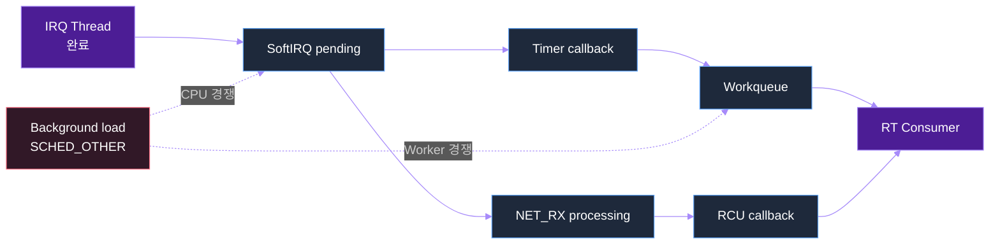


예를 들어 NPU completion interrupt가 발생했다고 가정한다.

```text
NPU IRQ thread
  -> output fence signal
  -> tasklet/softirq raise
  -> workqueue에 post-processing 등록
  -> RCU로 이전 model state retire
  -> controller wake-up
```

IRQ thread의 wake-up latency가 작아도 다음 중 하나가 늦으면 전체 observation-to-action latency는 커진다.

```text
T_total =
    T_hard_irq
  + T_irq_thread_schedule
  + T_irq_thread_work
  + T_softirq_queue
  + T_softirq_execution
  + T_workqueue_queue
  + T_workqueue_execution
  + T_consumer_schedule
```

### 핵심 원칙

> PREEMPT_RT는 deferred work를 없애지 않는다. 대신 가능한 처리를 thread context로 이동시켜 priority, affinity, preemption으로 관리할 수 있게 한다.

---

## 5. 실행 문맥 지도

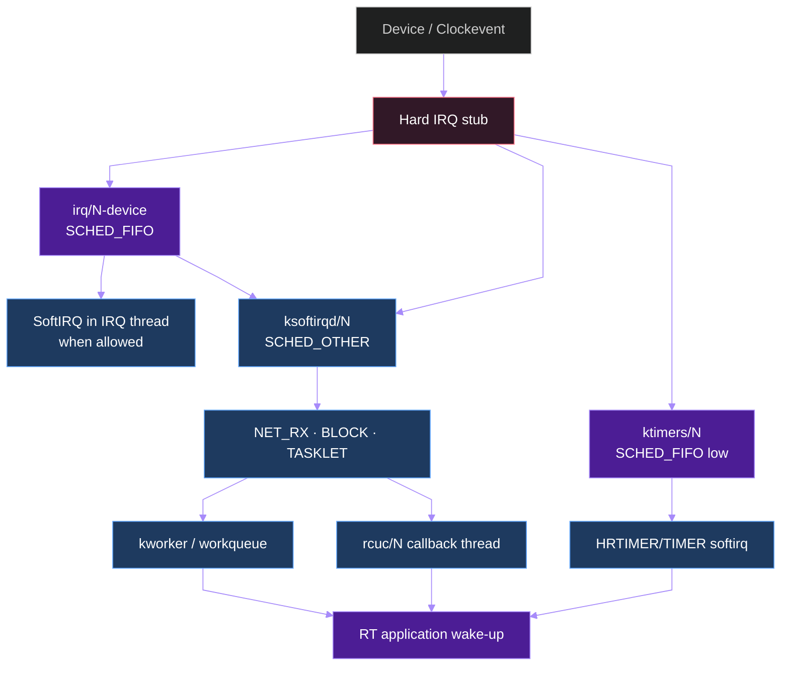


다음 표는 기본적인 문맥 계약을 요약한다.

| 문맥 | Scheduler entity | Sleep 가능 | 일반 priority 관리 | 대표 객체 |
|---|---:|---:|---:|---|
| Hard IRQ | 아니오 | 불가 | 불가 | minimal IRQ stub, clockevent |
| IRQ thread | 예 | 가능 | 가능 | `irq/N-device` |
| SoftIRQ in thread | 현재 thread | callback 계약에 따라 제한 | 현재 thread priority 영향 | NET_RX, BLOCK, TASKLET |
| `ksoftirqd/N` | 예 | softirq callback 자체는 sleep 금지 | 보통 SCHED_OTHER | backlog 처리 |
| `ktimers/N` | 예 | timer callback 계약에 따라 제한 | low SCHED_FIFO | TIMER/HRTIMER softirq |
| Workqueue worker | 예 | 일반 work item은 가능 | worker pool 속성 | `kworker/*` |
| `rcuc/N` | 예 | RCU callback 계약 준수 | RT 설정에 따라 thread | RCU callback core |
| User RT task | 예 | 설계에 따라 | FIFO/RR/DEADLINE | controller, monitor |

주의할 점은 “thread context에서 실행된다”와 “callback 안에서 무엇이든 sleep 가능하다”가 같은 말이 아니라는 것이다. SoftIRQ callback과 timer callback은 기존 API 계약을 유지하므로 blocking API를 무분별하게 호출하면 안 된다.

---

# Part II. SoftIRQ

## 6. SoftIRQ가 필요한 이유

Hard IRQ는 짧아야 한다. 따라서 높은 빈도의 deferred work를 위해 SoftIRQ가 제공된다.

대표 사용처:

- network RX/TX
- block completion
- timer wheel
- high-resolution timer soft callback
- scheduler load balancing
- RCU callback processing
- tasklet compatibility layer

SoftIRQ는 compile-time에 정의된 소수의 vector를 사용하고, 각 CPU가 pending bitmask를 보유한다.

---

## 7. SoftIRQ vector

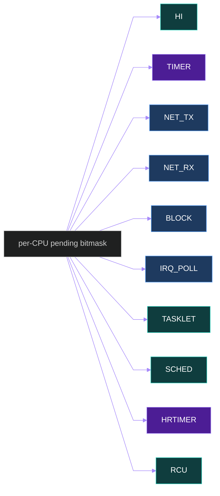

```c
/* Linux v6.18: include/linux/interrupt.h */
enum {
    HI_SOFTIRQ = 0,
    TIMER_SOFTIRQ,
    NET_TX_SOFTIRQ,
    NET_RX_SOFTIRQ,
    BLOCK_SOFTIRQ,
    IRQ_POLL_SOFTIRQ,
    TASKLET_SOFTIRQ,
    SCHED_SOFTIRQ,
    HRTIMER_SOFTIRQ,
    RCU_SOFTIRQ,
    NR_SOFTIRQS
};
```


`RCU_SOFTIRQ`가 마지막에 배치되는 것은 다른 softirq가 먼저 처리된 뒤 RCU callback을 실행하도록 하기 위한 역사적·구현적 선택이다. 하지만 PREEMPT_RT에서는 RCU callback core가 기본적으로 `rcuc/N` thread로 이동하므로 단순한 vector 순서만으로 실행 priority를 판단해서는 안 된다.

---

## 8. Pending bit와 raise 경로

SoftIRQ raise는 callback을 즉시 실행하는 API가 아니다.

```text
raise_softirq_irqoff(nr)
  -> or_softirq_pending(BIT(nr))
  -> trace_softirq_raise(nr)
  -> 현재 문맥과 IRQ exit 조건에 따라 실행 또는 thread wake-up
```

주요 상태는 per-CPU이므로 CPU migration과 local serialization이 중요하다.

### 관찰 지점

```bash
cat /proc/softirqs

trace-cmd record \
    -e irq:softirq_raise \
    -e irq:softirq_entry \
    -e irq:softirq_exit \
    sleep 10
```

---

## 9. IRQ에서 SoftIRQ로 이어지는 sequence

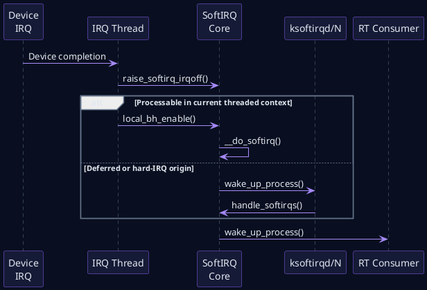


SoftIRQ가 실행될 수 있는 대표 경로는 다음과 같다.

1. 현재 threaded context가 bottom half를 다시 enable할 때 직접 처리
2. hard IRQ exit에서 inline 처리
3. hard IRQ origin 또는 backlog 상황에서 `ksoftirqd/N`가 처리
4. PREEMPT_RT timer softirq는 별도의 `ktimers/N` 경로로 처리

---

## 10. Non-RT와 PREEMPT_RT의 dispatch 차이

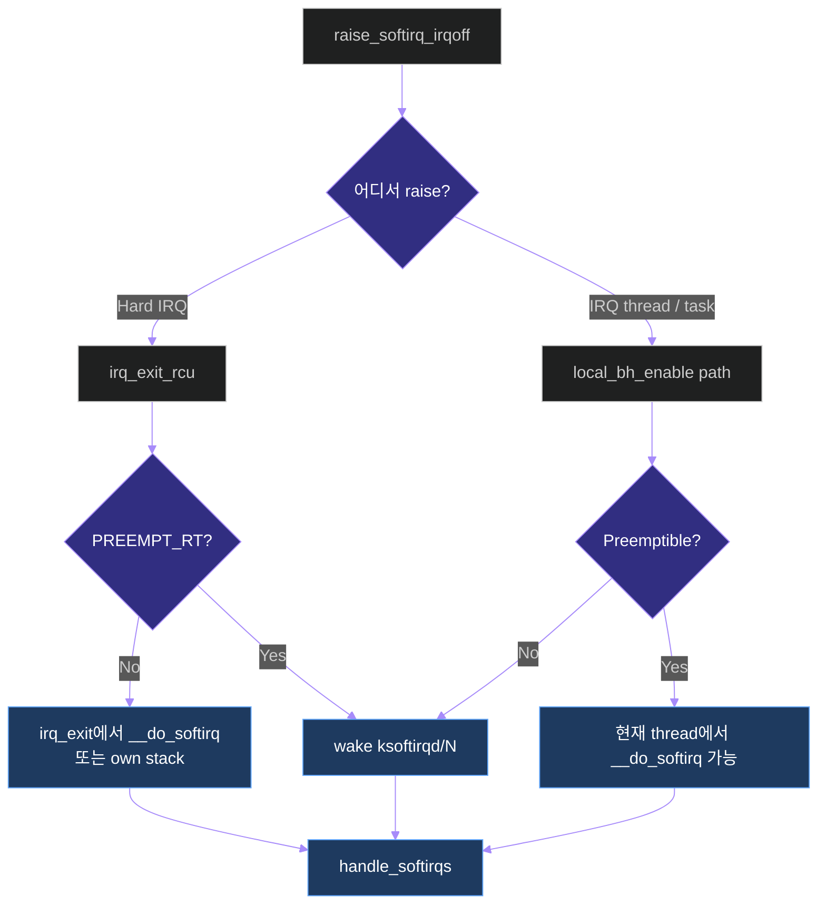

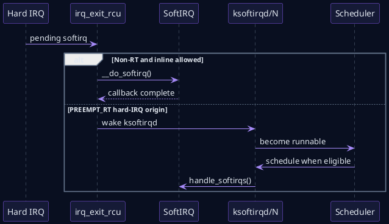

```c
/* Linux v6.18: kernel/softirq.c */
static inline void invoke_softirq(void)
{
    if (!force_irqthreads() || !__this_cpu_read(ksoftirqd)) {
#ifdef CONFIG_HAVE_IRQ_EXIT_ON_IRQ_STACK
        __do_softirq();
#else
        do_softirq_own_stack();
#endif
    } else {
        wakeup_softirqd();
    }
}
```


`force_irqthreads()`가 참인 PREEMPT_RT에서는 hard IRQ exit에서 일반 softirq를 직접 길게 처리하기보다 `ksoftirqd/N`를 깨우는 경로가 중요해진다. 반면 IRQ thread나 task context에서 bottom half를 enable하면서 pending softirq를 현재 thread에서 처리할 수 있는 경우도 있다.

따라서 다음 명제는 틀리다.

```text
“PREEMPT_RT에서 모든 SoftIRQ는 항상 ksoftirqd에서 실행된다.”
```

정확한 설명은 다음과 같다.

> SoftIRQ는 thread context에서 실행되며, raise origin과 bottom-half nesting 상태에 따라 현재 IRQ thread/task 또는 `ksoftirqd/N`, timer의 경우 `ktimers/N`에서 처리될 수 있다.

---

## 11. `handle_softirqs()`의 bounded processing

SoftIRQ core는 무한히 callback을 처리하지 않는다.

```c
/* Linux v6.18: kernel/softirq.c, simplified excerpt */
#define MAX_SOFTIRQ_TIME     msecs_to_jiffies(2)
#define MAX_SOFTIRQ_RESTART  10

static void handle_softirqs(bool ksirqd)
{
    unsigned long end = jiffies + MAX_SOFTIRQ_TIME;
    int max_restart = MAX_SOFTIRQ_RESTART;
    u32 pending = local_softirq_pending();

restart:
    set_softirq_pending(0);
    local_irq_enable();

    while (pending) {
        unsigned int vec_nr = __ffs(pending);

        trace_softirq_entry(vec_nr);
        softirq_vec[vec_nr].action();
        trace_softirq_exit(vec_nr);
        pending &= ~BIT(vec_nr);
    }

    local_irq_disable();
    pending = local_softirq_pending();
    if (pending) {
        if (time_before(jiffies, end) &&
            !need_resched() && --max_restart)
            goto restart;
        wakeup_softirqd();
    }
}
```


핵심 제한:

```text
MAX_SOFTIRQ_TIME    약 2ms window
MAX_SOFTIRQ_RESTART 10회
need_resched()      true이면 양보
```

이 제한을 넘기면 pending work를 남기고 `ksoftirqd/N`를 깨운다. 목적은 한 번의 softirq 처리로 CPU가 무기한 독점되는 것을 막는 것이다.

### 설계 관점

- NET_RX burst가 크면 한 번의 softirq에서 모두 처리되지 않을 수 있다.
- `ksoftirqd`는 보통 SCHED_OTHER이므로 높은 우선순위 RT task가 계속 runnable이면 backlog가 쌓일 수 있다.
- backlog가 커지면 packet age, queue depth, memory pressure가 증가한다.
- RT task의 priority가 높다는 사실만으로 system-level forward progress가 보장되지는 않는다.

---

## 12. `local_bh_disable()`의 의미 변화

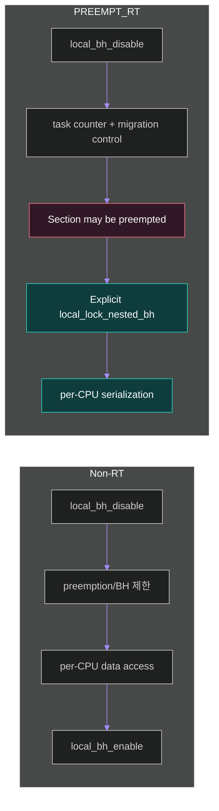


Non-RT 코드에서는 bottom half disable이 preemption 제한과 per-CPU data 보호에 함께 사용되는 경우가 있었다.

```c
local_bh_disable();
this_cpu_ptr(&stats)->packets++;
local_bh_enable();
```

PREEMPT_RT에서는 softirq 문맥 자체가 preemptible하다. 따라서 “BH가 disable되었으므로 이 CPU의 모든 관련 thread와 직렬화된다”라는 가정이 위험하다.

### 권장 방식

```c
/* PREEMPT_RT-friendly per-CPU softirq protection */
static DEFINE_LOCAL_IRQ_LOCK(stats_lock);
static DEFINE_PER_CPU(struct rx_stats, rx_stats);

void update_rx_stats(unsigned int bytes)
{
    local_lock_nested_bh(&stats_lock);
    this_cpu_ptr(&rx_stats)->packets++;
    this_cpu_ptr(&rx_stats)->bytes += bytes;
    local_unlock_nested_bh(&stats_lock);
}
```


`local_lock_nested_bh()`는 다음 장점을 제공한다.

- 보호 scope를 이름으로 표현한다.
- Non-RT에서는 lockdep 검증 중심의 낮은 overhead를 제공할 수 있다.
- PREEMPT_RT에서는 실제 per-CPU lock으로 직렬화를 제공한다.
- 광범위한 implicit per-CPU big lock을 피한다.

### Driver audit 질문

- `local_bh_disable()`만으로 per-CPU queue를 보호하는가?
- 같은 data를 task context와 softirq context가 모두 접근하는가?
- `this_cpu_ptr()`를 얻은 뒤 preemption 또는 migration이 가능한가?
- lock을 잡은 채 unbounded loop나 allocation을 수행하는가?

---

## 13. Tasklet

Tasklet은 오래된 deferred work API이며, 새로운 driver에서는 threaded IRQ나 workqueue를 우선 검토한다.

특징:

- 동일 tasklet은 동시에 여러 CPU에서 실행되지 않는다.
- 다른 tasklet과는 병렬 실행될 수 있다.
- softirq 기반이므로 callback은 sleep하면 안 된다.
- PREEMPT_RT에서도 실행 문맥이 thread화되지만 API 계약은 그대로 유지된다.

### Migration 전략

```text
짧고 atomic한 completion
    -> threaded IRQ 또는 softirq 유지 검토

sleep 가능하거나 긴 처리
    -> workqueue

엄격한 RT priority가 필요한 처리
    -> 전용 kthread 또는 RT user thread
```

---

# Part III. hrtimer, timer_list와 ktimers

## 14. Timer subsystem 큰 그림

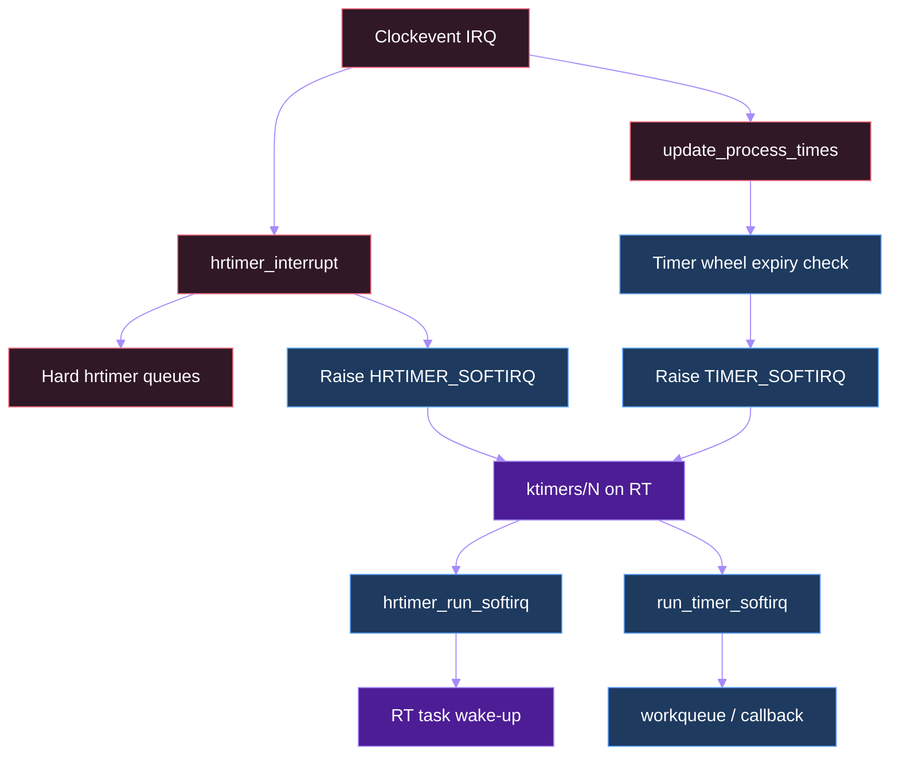


Linux에는 목적이 다른 timer 계층이 존재한다.

| 계층 | 시간 단위/정확도 | 자료구조 | 주요 용도 |
|---|---|---|---|
| `timer_list` | jiffy 기반 | hierarchical timer wheel | timeout, maintenance |
| `hrtimer` | nanosecond API | per-clock-base timerqueue RB-tree | precise wake-up, high-res event |
| POSIX timer | user API | hrtimer 등 위에 구현 | nanosleep, timer_create |
| clockevent | hardware event | per-CPU device | 다음 timer IRQ 발생 |

`timer_list`와 `hrtimer`는 같은 것이 아니다. PREEMPT_RT에서도 어떤 callback이 hard IRQ에 남는지, 어떤 callback이 timer thread로 이동하는지 구분해야 한다.

---

## 15. hrtimer hard/soft base

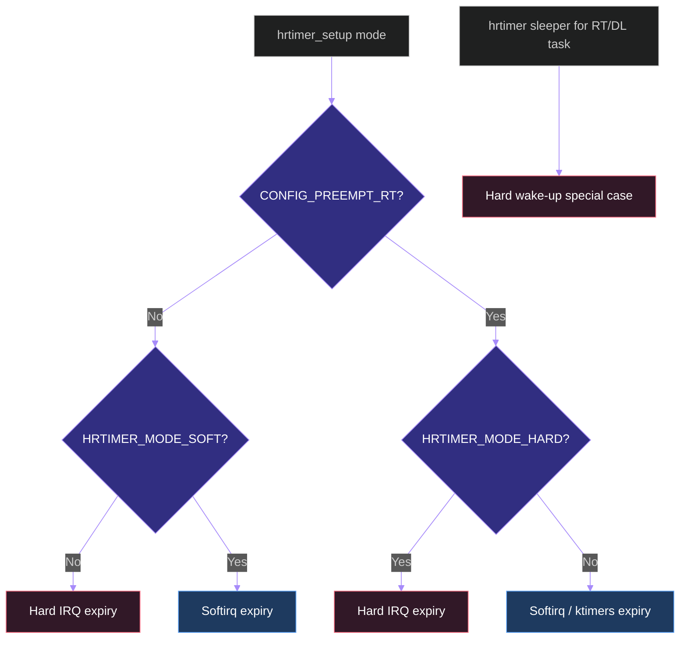

```c
/* Linux v6.18: kernel/time/hrtimer.c */
static void __hrtimer_setup(struct hrtimer *timer,
                            enum hrtimer_restart (*function)(struct hrtimer *),
                            clockid_t clock_id,
                            enum hrtimer_mode mode)
{
    bool softtimer = !!(mode & HRTIMER_MODE_SOFT);

    if (IS_ENABLED(CONFIG_PREEMPT_RT) &&
        !(mode & HRTIMER_MODE_HARD))
        softtimer = true;

    /* ... select hard or soft clock base ... */
    timer->is_soft = softtimer;
    timer->is_hard = !!(mode & HRTIMER_MODE_HARD);
}
```


Linux v6.18의 핵심 규칙:

```text
Non-RT default
    unmarked hrtimer -> hard IRQ expiry

PREEMPT_RT default
    HRTIMER_MODE_HARD가 없는 hrtimer -> soft expiry
```

PREEMPT_RT가 일반 hrtimer를 soft side로 이동하는 이유:

- callback이 일반 `spinlock_t`를 사용할 수 있다.
- RT의 `spinlock_t`는 sleep 가능한 rtmutex 기반이다.
- 긴 callback을 hard IRQ 문맥에서 제거한다.
- scheduler가 높은 우선순위 task를 먼저 실행시킬 수 있다.

### `HRTIMER_MODE_HARD`를 사용할 때

- 정말 hard IRQ에서 즉시 실행해야 하는가?
- callback WCET가 매우 짧고 bounded한가?
- callback이 `raw_spinlock_t` 외의 sleeping primitive를 사용하지 않는가?
- allocation, logging, fence wait, device polling이 없는가?
- target hardware에서 irqsoff latency를 검증했는가?

---

## 16. hrtimer interrupt sequence

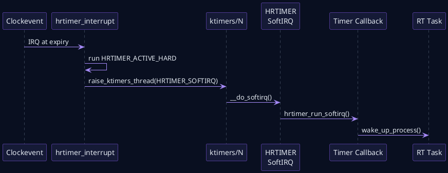

```c
/* Linux v6.18: kernel/time/hrtimer.c, simplified excerpt */
void hrtimer_interrupt(struct clock_event_device *dev)
{
    struct hrtimer_cpu_base *cpu_base =
        this_cpu_ptr(&hrtimer_bases);

    /* ... update current time ... */
    if (!ktime_before(now, cpu_base->softirq_expires_next)) {
        cpu_base->softirq_activated = 1;
        raise_timer_softirq(HRTIMER_SOFTIRQ);
    }

    __hrtimer_run_queues(cpu_base, now, flags,
                         HRTIMER_ACTIVE_HARD);
    /* ... program next clock event ... */
}
```


Clockevent interrupt의 hard IRQ path는 다음 두 종류를 분리한다.

```text
HRTIMER_ACTIVE_HARD
    -> hard IRQ에서 callback 실행

HRTIMER_ACTIVE_SOFT
    -> HRTIMER_SOFTIRQ raise
    -> PREEMPT_RT에서는 ktimers/N가 처리
```

이 분리를 trace할 때 `timer:hrtimer_expire_entry`만 보면 callback 문맥을 알 수 없다. 함께 확인해야 할 정보:

```text
current->comm
in_hardirq()
in_serving_softirq()
sched_switch
softirq_entry/exit
```

---

## 17. `ktimers/N` thread

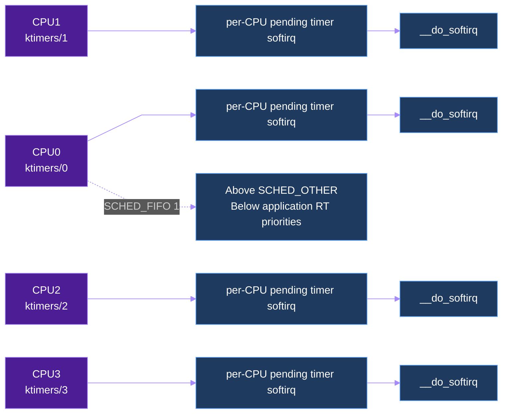

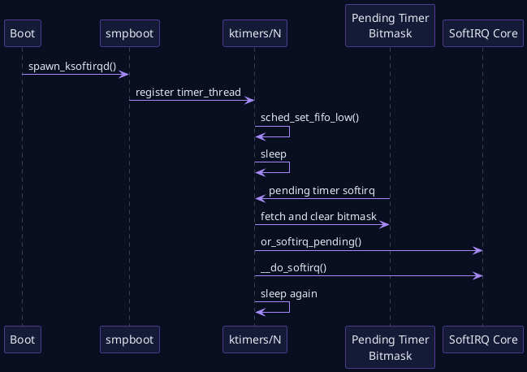

```c
/* Linux v6.18: kernel/softirq.c */
static void ktimerd_setup(unsigned int cpu)
{
    /* Above SCHED_NORMAL to handle timers before regular tasks. */
    sched_set_fifo_low(current);
}

void raise_ktimers_thread(unsigned int nr)
{
    trace_softirq_raise(nr);
    __this_cpu_or(pending_timer_softirq, BIT(nr));
}

static void run_ktimerd(unsigned int cpu)
{
    unsigned int timer_si;

    ksoftirqd_run_begin();
    timer_si = local_timers_pending_force_th();
    __this_cpu_write(pending_timer_softirq, 0);
    or_softirq_pending(timer_si);
    __do_softirq();
    ksoftirqd_run_end();
}
```


Linux v6.18에서 timer thread의 이름은 CPU별 `ktimers/%u`이다.

기본 policy는 `sched_set_fifo_low()`로 설정된다.

```text
SCHED_FIFO priority 1
```

의미:

- 모든 SCHED_OTHER task보다 먼저 실행될 수 있다.
- application의 높은 FIFO priority보다 낮다.
- safety/control task가 timer callback을 선점할 수 있다.
- 반대로 높은 priority RT task가 계속 runnable이면 `ktimers/N`가 굶을 수 있다.

### 권장 priority hierarchy 예

```text
P90 Safety monitor
P85 Fast controller
P80 Critical completion IRQ
P70 Sensor/NPU dispatch
P10-20 optional service RT threads
P1 ktimers/N and low-priority kernel RT infrastructure
SCHED_OTHER logging, OTA, VLA orchestration
```

P1이 “중요하지 않다”는 의미는 아니다. Kernel은 timer progress를 위해 실행 기회를 필요로 한다.

---

## 18. User-space sleep의 특별 처리

PREEMPT_RT는 untrusted SCHED_OTHER task가 같은 시점에 대량의 timer를 설정해 hard IRQ wake-up storm을 만드는 것을 피하려 한다.

그러나 privileged real-time task는 낮은 wake-up latency가 필요하다. Linux v6.18의 hrtimer sleeper 경로는 RT 또는 DEADLINE policy task에 대해 hard expiry를 선택할 수 있다.

```text
SCHED_OTHER nanosleep
    -> soft timer / ktimers path 중심

SCHED_FIFO, SCHED_RR, SCHED_DEADLINE nanosleep
    -> hard wake-up special case 가능
```

이 차이는 7강의 user-space periodic loop에서 다시 실습한다.

---

## 19. `hrtimer_cancel()`과 priority inversion

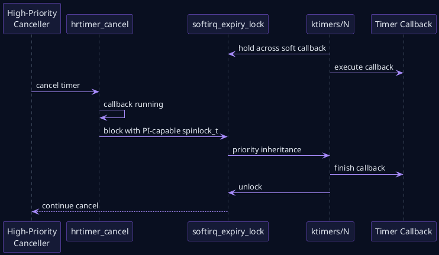

```c
/* Linux v6.18: kernel/time/hrtimer.c, PREEMPT_RT excerpt */
void hrtimer_cancel_wait_running(const struct hrtimer *timer)
{
    struct hrtimer_clock_base *base = READ_ONCE(timer->base);

    if (!timer->is_soft || is_migration_base(base)) {
        cpu_relax();
        return;
    }

    atomic_inc(&base->cpu_base->timer_waiters);
    spin_lock_bh(&base->cpu_base->softirq_expiry_lock);
    atomic_dec(&base->cpu_base->timer_waiters);
    spin_unlock_bh(&base->cpu_base->softirq_expiry_lock);
}
```


Non-RT hard timer callback이라면 remote CPU callback 완료를 짧게 spin wait하는 설계가 가능할 수 있다. 하지만 RT에서는 callback이 `ktimers/N` thread에서 실행되고 더 높은 priority task가 이를 선점할 수 있다.

위험한 시나리오:

```text
CPU2 ktimers/2가 callback 실행 중
    -> P80 task가 ktimers/2를 선점
    -> P80 task가 같은 timer를 cancel
    -> callback 완료를 busy-spin으로 기다림
    -> ktimers/2는 P80보다 낮아서 실행 불가
    -> livelock
```

Linux v6.18은 `softirq_expiry_lock`을 이용해 canceler가 block하고 PI가 timer thread로 전달될 수 있는 handshake를 제공한다.

### 일반화된 원칙

> Thread context로 이동한 callback의 완료를 더 높은 priority task가 busy-spin으로 기다리면 안 된다. Block-and-boost가 가능한 동기화가 필요하다.

---

## 20. `timer_list`와 `TIMER_SOFTIRQ`

```c
/* Linux v6.18: kernel/time/timer.c */
static void run_local_timers(void)
{
    struct timer_base *base =
        this_cpu_ptr(&timer_bases[BASE_LOCAL]);

    hrtimer_run_queues();

    for (int i = 0; i < NR_BASES; i++, base++) {
        if (time_after_eq(jiffies,
                          READ_ONCE(base->next_expiry))) {
            raise_timer_softirq(TIMER_SOFTIRQ);
            return;
        }
    }
}
```


Jiffy timer는 timer wheel에서 관리되며 `TIMER_SOFTIRQ`로 callback이 실행된다. PREEMPT_RT에서는 timer softirq가 `ktimers/N` 쪽으로 전달된다.

`timer_list`가 적합한 경우:

- ms/jiffy 수준의 timeout
- 정확한 phase alignment가 필요하지 않은 maintenance
- device retry, delayed cleanup

부적합한 경우:

- sub-millisecond control release
- absolute deadline이 중요한 주기 제어
- callback execution time이 긴 처리

긴 처리는 callback에서 workqueue나 전용 thread로 넘겨야 한다.

### Teardown

```c
timer_shutdown_sync(&ctx->timer);
destroy_workqueue(ctx->wq);
```

Timer callback이 work를 다시 queue할 수 있는 구조에서는 단순 `timer_delete_sync()`보다 shutdown ordering을 명확히 해야 한다.

---

## 21. Timer callback 규칙

Timer callback hot path에서 피할 것:

- `printk()` storm
- storage/network blocking I/O
- unbounded polling
- dynamic allocation에 의존하는 긴 path
- DMA fence의 무제한 wait
- large list walk
- firmware response wait
- 긴 `raw_spinlock_t` section

권장 패턴:

```text
Timer callback
  -> timestamp/counter update
  -> bounded state transition
  -> RT task wake-up 또는 work queue
  -> return
```

---

# Part IV. Workqueue

## 22. Workqueue가 제공하는 것

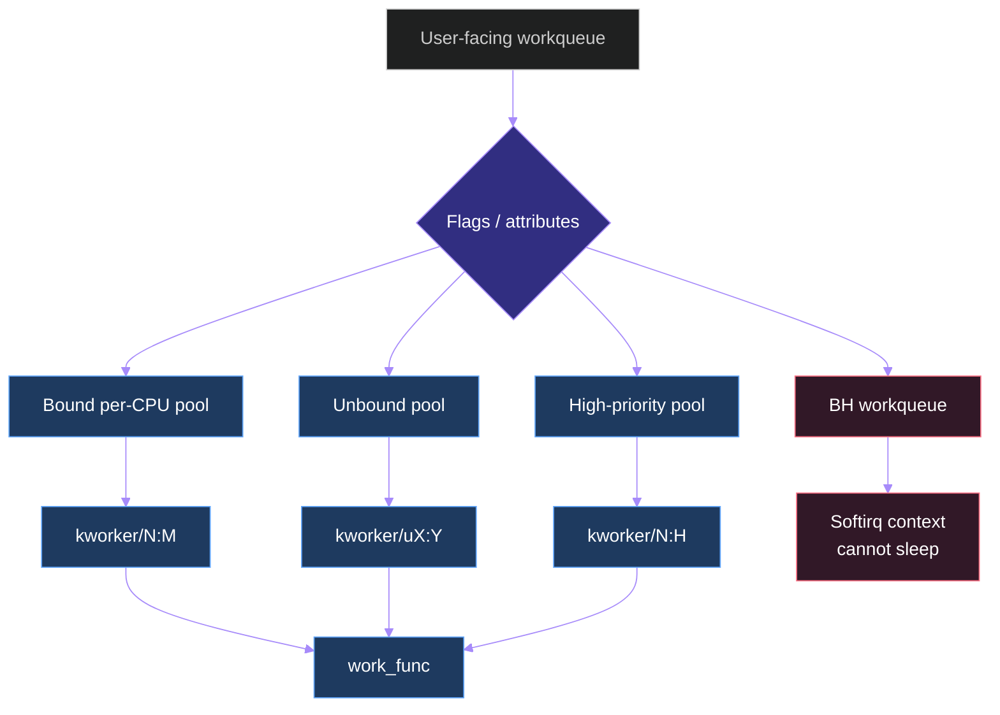


Workqueue는 asynchronous process execution context를 제공한다.

```text
Producer
  -> work item queue
  -> worker pool 선택
  -> kworker 실행
  -> work_func()
```

SoftIRQ와 비교:

| 항목 | SoftIRQ | 일반 Workqueue |
|---|---|---|
| 실행 문맥 | softirq thread/context | kworker task context |
| Sleep | 금지 | 가능 |
| Priority | origin 또는 ksoftirqd/ktimers 영향 | worker policy/nice 영향 |
| CPU locality | per-CPU 중심 | bound 또는 unbound |
| 긴 처리 | 부적합 | 상대적으로 적합 |
| RT deadline | 직접 보장하지 않음 | 직접 보장하지 않음 |

---

## 23. Bound, Unbound, Highpri, BH

### Bound workqueue

- queueing CPU에 연결된 worker pool 사용
- cache locality가 좋음
- 해당 CPU의 load와 affinity 영향을 받음

### Unbound workqueue

- 특정 CPU에 묶이지 않는 dynamic pool
- locality를 희생하고 concurrency flexibility 확보
- CPU-intensive 또는 긴 비동기 처리에 유용

### `WQ_HIGHPRI`

- 별도 high-priority worker pool 사용
- elevated nice level
- **SCHED_FIFO를 의미하지 않는다**

### `WQ_BH`

- softirq convenience interface
- per-CPU, one pseudo worker
- callback은 sleep 금지

---

## 24. Workqueue sequence

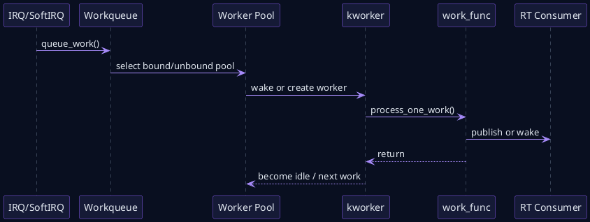

```c
/* Conceptual API summary based on Linux v6.18 workqueue documentation */
struct workqueue_struct *wq;

wq = alloc_workqueue("sensor_post",
                     WQ_UNBOUND |
                     WQ_HIGHPRI |
                     WQ_MEM_RECLAIM,
                     0);

INIT_WORK(&ctx->work, postprocess_work);
queue_work(wq, &ctx->work);

/* WQ_HIGHPRI raises nice priority; it does not create SCHED_FIFO work. */
```


### RT path에서 주의할 점

```text
IRQ thread P80
  -> queue_work(system_wq)
  -> kworker SCHED_OTHER
  -> controller 결과 publish
```

이 구조에서 IRQ thread가 빠르더라도 결과 publish는 SCHED_OTHER worker에 의해 늦을 수 있다.

대안:

1. bounded한 핵심 completion은 IRQ thread에서 직접 처리
2. RT priority가 필요한 부분은 전용 RT kthread/user thread로 전달
3. logging, statistics, reclamation만 workqueue에 남김
4. `WQ_HIGHPRI`를 RT guarantee로 오해하지 않음
5. `max_active`, ordered execution, `WQ_MEM_RECLAIM` 필요성을 설계 단계에서 결정

---

## 25. Workqueue와 forward progress

Memory reclaim path에서 queue되는 work는 `WQ_MEM_RECLAIM`이 필요할 수 있다. Rescue worker가 없으면 다음 형태의 deadlock이 가능하다.

```text
Memory pressure
  -> worker가 allocation/reclaim을 기다림
  -> reclaim이 같은 workqueue의 work 실행을 필요로 함
  -> 새 worker 생성도 memory를 필요로 함
  -> progress 정지
```

RT system에서는 단순 latency뿐 아니라 reclaim/RCU/workqueue의 forward progress도 함께 검증한다.

---

# Part V. RCU

## 26. RCU의 역할

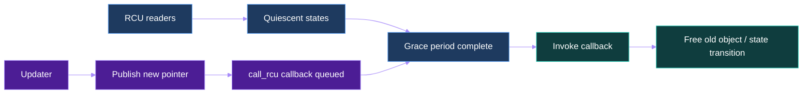


RCU는 read-mostly data structure를 낮은 reader overhead로 보호한다.

기본 흐름:

1. Updater가 새 object를 publish
2. 이전 object를 callback queue에 등록
3. 기존 reader가 모두 quiescent state를 통과
4. Grace period 완료
5. Callback이 이전 object를 free 또는 retire

중요한 구분:

```text
Grace-period detection
    “기존 reader가 모두 끝났는가?”

Callback invocation
    “끝난 뒤 callback을 누가 언제 실행하는가?”
```

---

## 27. PREEMPT_RT의 RCU callback thread

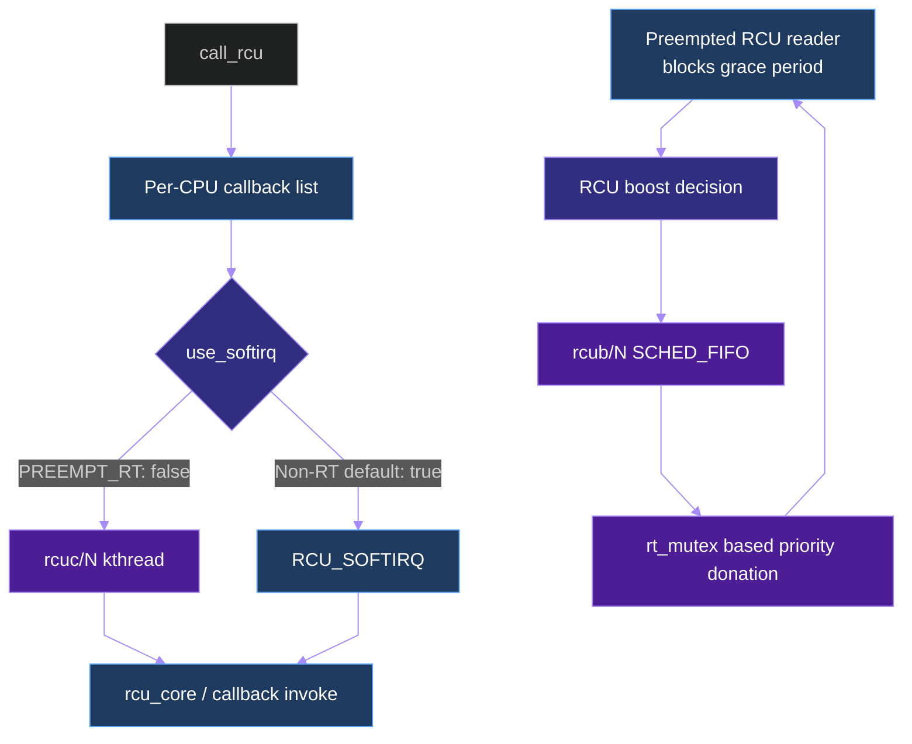

```c
/* Linux v6.18: kernel/rcu/tree.c */
/* By default, use RCU_SOFTIRQ instead of rcuc kthreads. */
static bool use_softirq = !IS_ENABLED(CONFIG_PREEMPT_RT);

/* PREEMPT_RT therefore defaults to rcuc/N callback kthreads. */
static int kthread_prio = IS_ENABLED(CONFIG_RCU_BOOST) ? 1 : 0;
```


Linux v6.18의 `tree.c`는 다음과 같이 기본값을 설정한다.

```text
Non-RT: use_softirq = true
PREEMPT_RT: use_softirq = false
```

따라서 PREEMPT_RT에서는 RCU callback core가 `RCU_SOFTIRQ` 대신 CPU별 `rcuc/N` kthread로 이동한다.

장점:

- RCU callback 실행이 scheduler entity가 된다.
- IRQ/softirq 긴 tail을 줄일 수 있다.
- priority와 affinity 정책을 적용할 수 있다.
- callback backlog와 execution을 thread trace로 관찰하기 쉽다.

주의:

- 높은 priority RT task가 CPU를 독점하면 `rcuc/N`도 굶을 수 있다.
- callback backlog가 늘면 memory reclamation이 늦어진다.
- grace period가 끝나도 callback thread가 실행되지 않으면 object free는 늦어진다.

---

## 28. RCU callback sequence

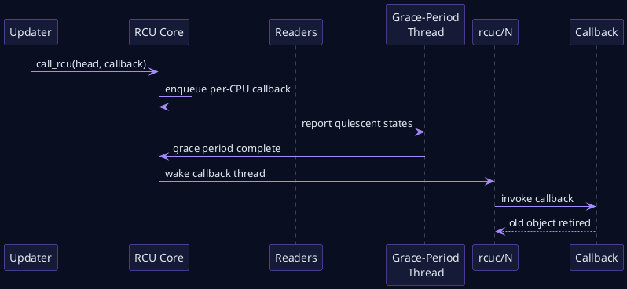


관찰할 kernel thread:

```bash
ps -eLo pid,tid,psr,cls,rtprio,pri,comm | \
    grep -E 'rcuc|rcub|rcuop|rcuog|rcu_preempt'
```

관찰할 tracepoint는 커널 config와 버전에 따라 다르지만 다음을 우선 확인한다.

```text
rcu:rcu_batch_start
rcu:rcu_batch_end
rcu:rcu_callback
rcu:rcu_grace_period
sched:sched_wakeup
sched:sched_switch
```

---

## 29. Preemptible RCU와 blocked reader

PREEMPT_RCU에서는 task가 RCU read-side critical section 안에서 preempt될 수 있다.

```c
rcu_read_lock();
p = rcu_dereference(global_ptr);
/* task can be preempted here */
use(p);
rcu_read_unlock();
```

그 task가 오래 실행되지 못하면 grace period가 기다릴 수 있다. 높은 priority task가 계속 CPU를 점유하면 낮은 priority reader가 read-side section을 끝내지 못하는 형태의 inversion이 생길 수 있다.

---

## 30. RCU priority boosting

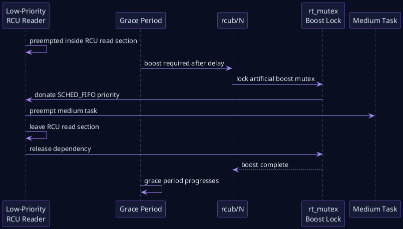


`CONFIG_RCU_BOOST`는 grace period를 막는 preempted reader의 priority를 높여 read-side section을 끝내도록 돕는다.

개념적으로 RCU는 artificial rtmutex dependency를 사용해 boost kthread와 blocked reader 사이의 donation을 만든다.

```text
rcub/N
  -> boost mutex wait
  -> blocked reader effective priority 상승
  -> reader 실행 및 rcu_read_unlock()
  -> grace period progress
```

RCU boosting은 다음을 의미하지 않는다.

- 모든 RCU callback이 즉시 실행된다.
- 잘못된 무한 loop RT task를 안전하게 만든다.
- arbitrary long RCU read-side section이 허용된다.
- CPU isolation과 housekeeping 설계가 불필요하다.

---

## 31. RCU stall과 starvation

RCU stall warning이 발생할 수 있는 원인:

- CPU가 interrupts/preemption disabled 상태로 너무 오래 머묾
- 높은 priority FIFO task가 CPU를 독점
- RCU reader가 read-side section에서 장시간 preempt됨
- `rcuc/N` 또는 grace-period kthread가 실행되지 못함
- tracing/console/firmware로 CPU가 긴 시간 정지
- QEMU host scheduling delay

### 예방 원칙

- FIFO loop는 반드시 block, sleep 또는 bounded budget을 가진다.
- RCU read-side critical section에서 긴 연산을 하지 않는다.
- housekeeping CPU에 kernel progress thread가 실행될 여지를 둔다.
- `rcu_nocbs`를 사용할 때 offload thread affinity와 priority를 함께 설계한다.
- memory growth와 callback queue length를 장시간 stress에서 관찰한다.

---

## 32. `rcu_nocbs`와 CPU isolation

`rcu_nocbs=<cpulist>`는 지정 CPU의 RCU callback processing을 offload하는 데 사용할 수 있다. `nohz_full` CPU에서 OS noise를 줄일 때 함께 고려된다.

그러나 다음을 확인해야 한다.

```text
어느 CPU가 callback을 실제 처리하는가?
rcuop/rcuog thread affinity는 어디인가?
Housekeeping CPU가 다른 I/O와 과부하되지 않는가?
Callback backlog가 증가하지 않는가?
Safety/control CPU에서 필요한 callback progress가 늦지 않는가?
```

CPU isolation은 일을 없애는 것이 아니라 다른 CPU와 thread로 이동시키는 것이다.

---

# Part VI. End-to-End Automotive NPU 사례

## 33. Deferred execution을 포함한 NPU pipeline

```mermaid
%%{init: {"theme":"dark","flowchart":{"curve":"basis"},"themeVariables":{"background":"#090F20","primaryColor":"#151A36","primaryTextColor":"#F8FAFC","primaryBorderColor":"#8B5CF6","lineColor":"#A78BFA","fontFamily":"Noto Sans CJK KR"}}}%%
flowchart LR
  NPU[NPU Completion IRQ<br/>P80] --> FENCE[dma-fence / status]
  FENCE --> TASKLET[Deferred work<br/>softirq or workqueue]
  TASKLET --> PUB[Trajectory publish]
  PUB --> CTRL[Fast controller<br/>P85]
  CTRL --> SAFE[Safety monitor<br/>P90]
  SAFE --> ACT[CAN / Ethernet command]
  TIMER[Deadline hrtimer<br/>ktimers or HARD] --> SAFE
  RCU[RCU callback / model state retire] --> MEM[Buffer reclamation]
  VLA[VLA reasoning<br/>SCHED_OTHER] -. background load .-> TASKLET
  classDef crit fill:#4c1d95,stroke:#a78bfa,color:#fff;
  classDef defer fill:#1e3a5f,stroke:#60a5fa,color:#fff;
  classDef bg fill:#311827,stroke:#fb7185,color:#fff;
  class NPU,CTRL,SAFE,TIMER,ACT crit;
  class FENCE,TASKLET,PUB,RCU,MEM defer;
  class VLA bg;
```

```plantuml
@startuml
skinparam backgroundColor #090F20
skinparam defaultFontColor #E2E8F0
skinparam sequence {
  ArrowColor #A78BFA
  ArrowFontColor #E2E8F0
  LifeLineBorderColor #64748B
  ParticipantBorderColor #8B5CF6
  ParticipantBackgroundColor #151A36
  ParticipantFontColor #E2E8F0
  GroupBorderColor #64748B
  GroupHeaderFontColor #E2E8F0
  GroupHeaderBackgroundColor #151A36
  GroupBodyBackgroundColor #090F20
}
participant "NPU" as NPU
participant "NPU IRQ\nThread P80" as IRQ
participant "Deferred Work" as DW
participant "Controller\nP85" as CTRL
participant "Safety Monitor\nP90" as SAFE
participant "Vehicle MCU" as MCU
participant "Deadline Timer" as TIMER
NPU -> IRQ: inference complete
IRQ -> DW: fence/status publish
DW -> CTRL: trajectory ready
TIMER -> SAFE: deadline event
CTRL -> SAFE: proposed command
SAFE -> MCU: validated command
alt Deferred work is late
  TIMER -> SAFE: stale output detected
  SAFE -> MCU: fallback / MRM request
end
@enduml
```


### 예시 priority hierarchy

| Priority | 요소 | 목적 |
|---:|---|---|
| P90 | Safety/deadline monitor | timeout, stale output, fallback |
| P85 | Fast trajectory controller | 고정주기 control |
| P80 | NPU completion IRQ thread | status/fence, minimal publish |
| P75 | Camera/ISP IRQ thread | sensor frame completion |
| P70 | NPU dispatch | next job submit |
| P1 | `ktimers/N`, 일부 kernel RT infra | timer progress |
| SCHED_OTHER | VLA reasoning, workqueue, logging | 비결정적 배경 처리 |

### 위험한 설계

```text
NPU IRQ P80
  -> queue_work(system_wq)
  -> SCHED_OTHER work에서 trajectory publish
  -> P85 controller가 새 결과를 기다림
```

P85 controller는 P80 IRQ thread보다 높지만, 실제 필요한 work가 SCHED_OTHER이면 priority chain이 끊어진다.

### 권장 분리

```text
IRQ thread P80
  -> bounded status/fence update
  -> RT completion thread 또는 controller wake-up
  -> non-critical logging/reclamation만 workqueue/RCU
```

---

## 34. Timing budget

```text
T_action_age =
    T_capture_to_irq
  + T_irq_to_thread
  + T_completion_work
  + T_deferred_queue
  + T_deferred_execution
  + T_controller_release
  + T_command_tx
```

수집할 timestamp:

| Timestamp | 위치 |
|---|---|
| T0 | Sensor/NPU hardware event |
| T1 | IRQ handler entry |
| T2 | IRQ thread wake-up |
| T3 | IRQ thread switch-in |
| T4 | SoftIRQ/work queue |
| T5 | Deferred callback start/end |
| T6 | Controller wake-up/switch-in |
| T7 | Vehicle command transmit |

Deadline miss가 발생하면 “PREEMPT_RT가 느리다”라고 결론내기 전에 어느 구간이 긴지 분해한다.

---

# Part VII. QEMU ARM64 실습

## 35. 실습 topology

```mermaid
%%{init: {"theme":"dark","flowchart":{"curve":"linear"},"themeVariables":{"background":"#090F20","primaryColor":"#151A36","primaryTextColor":"#F8FAFC","primaryBorderColor":"#8B5CF6","lineColor":"#A78BFA","fontFamily":"Noto Sans CJK KR"}}}%%
flowchart TB
  HOST[Host traffic / QEMU scheduling] --> Q[QEMU ARM64 virt · GICv3]
  subgraph G[Guest Linux v6.18 PREEMPT_RT]
    C0[CPU0<br/>housekeeping<br/>ksoftirqd/0 · rcuc/0]
    C1[CPU1<br/>virtio-net IRQ<br/>ksoftirqd/1]
    C2[CPU2<br/>ktimers/2<br/>RT periodic app]
    C3[CPU3<br/>stress-ng / workqueue load]
    MOD[softirq_timer_rcu_lab.ko]
    TRACE[trace-cmd · rtla · /proc/softirqs]
  end
  Q --> C0
  Q --> C1
  Q --> C2
  Q --> C3
  MOD --> C2
  TRACE --> C0
  classDef rt fill:#4c1d95,stroke:#a78bfa,color:#fff;
  classDef normal fill:#1e3a5f,stroke:#60a5fa,color:#fff;
  class C2 rt;
  class C0,C1,C3,MOD,TRACE normal;
```


권장 CPU 배치:

```text
CPU0: shell, logging, rcuc/0, housekeeping
CPU1: virtio-net IRQ, network softirq
CPU2: ktimers/2, periodic RT application
CPU3: stress-ng, workqueue background load
```

QEMU에서는 host scheduler noise가 포함된다. 목적은 다음이다.

- callback의 실제 execution context 확인
- 설정 전후 상대 비교
- trace event를 연결하는 연습
- target hardware에서 수행할 시험 절차 준비

---

## 36. Kernel config

```text
CONFIG_EXPERT=y
CONFIG_PREEMPT_RT=y
CONFIG_HIGH_RES_TIMERS=y
CONFIG_IRQ_FORCED_THREADING=y
CONFIG_PREEMPT_RCU=y
CONFIG_RCU_BOOST=y
CONFIG_RCU_NOCB_CPU=y
CONFIG_DEBUG_FS=y
CONFIG_TRACEPOINTS=y
CONFIG_TRACING=y
CONFIG_OSNOISE_TRACER=y
CONFIG_TIMERLAT_TRACER=y
CONFIG_IKCONFIG=y
CONFIG_IKCONFIG_PROC=y
```

Debug kernel과 measurement kernel을 분리한다.

```text
Debug:
  PROVE_LOCKING, DEBUG_ATOMIC_SLEEP, LOCK_STAT enabled

Measurement:
  expensive debug options disabled
  required tracepoints only enabled
```

---

## 37. Runtime inventory

```bash
./01_runtime_inventory.sh
```

핵심 확인:

```bash
cat /sys/kernel/realtime
cat /proc/softirqs
ps -eLo pid,tid,psr,cls,rtprio,pri,comm | \
    grep -E 'ksoftirqd|ktimers|rcuc|rcub|kworker'
```

예상 thread 이름:

```text
ksoftirqd/0 ...
ktimers/0 ...
rcuc/0 ...
kworker/0:1 ...
```

Config와 workload에 따라 일부 thread는 보이지 않거나 다른 이름을 사용할 수 있다.

---

## 38. SoftIRQ delta monitor

```bash
./03_monitor_softirqs.sh 1
```

다음 workload를 각각 발생시킨다.

```text
Idle
ping/UDP network burst
storage I/O
hrtimer lab module
mixed CPU and network load
```

관찰:

- NET_RX가 어느 CPU에서 증가하는가?
- TIMER/HRTIMER가 어느 CPU에서 증가하는가?
- RCU vector count와 `rcuc/N` activity는 어떻게 연결되는가?
- IRQ affinity 변경 후 softirq CPU locality도 바뀌는가?

---

## 39. hrtimer·timer·workqueue·RCU module

```bash
make module \
    KDIR=/path/to/linux-v6.18-build \
    CROSS_COMPILE=aarch64-linux-gnu-
```

Target에서:

```bash
./06_run_module_lab.sh \
    ./softirq_timer_rcu_lab.ko \
    1000 \
    0
```

`stats` 예시 해석:

```text
last_context hardirq=0 softirq=1 comm=ktimers/2
```

이는 기본 RT hrtimer가 softirq/ktimers context에서 실행되었음을 의미한다.

Hard mode 비교:

```bash
./06_run_module_lab.sh \
    ./softirq_timer_rcu_lab.ko \
    1000 \
    1
```

```text
last_context hardirq=1 softirq=0
```

실제 값은 kernel configuration과 timer placement에 따라 확인한다.

---

## 40. User periodic task 비교

```bash
./02_build_labs.sh

./rt_periodic_user \
    --cpu 2 \
    --period-us 1000 \
    --iterations 20000

./rt_periodic_user \
    --cpu 2 \
    --period-us 1000 \
    --iterations 20000 \
    --fifo 80
```

비교 metric:

```text
minimum lateness
average lateness
maximum lateness
period-sized miss count
```

SCHED_FIFO test에는 root 또는 `CAP_SYS_NICE`가 필요하다.

---

## 41. Trace 수집

```bash
./04_trace_softirq_timer.sh \
    lesson6-softirq-timer.dat \
    30
```

핵심 event:

```text
irq:softirq_raise
irq:softirq_entry
irq:softirq_exit
timer:hrtimer_expire_entry
timer:hrtimer_expire_exit
timer:timer_expire_entry
timer:timer_expire_exit
workqueue:workqueue_queue_work
workqueue:workqueue_execute_start
workqueue:workqueue_execute_end
rcu:rcu_batch_start
rcu:rcu_batch_end
sched:sched_wakeup
sched:sched_switch
```

### 분석 순서

```text
1. softirq_raise timestamp
2. entry까지 queue delay
3. callback duration
4. workqueue queue-to-start delay
5. RCU batch wake and execution
6. RT consumer wake-to-run delay
```

---

## 42. `rtla timerlat`

```bash
./07_run_rtla.sh 60 2
```

`timerlat`은 per-CPU timer와 kernel thread를 이용해 다음을 분리한다.

```text
Timer IRQ latency
Timer thread latency
```

해석 예:

```text
IRQ latency만 높음
  -> irqsoff, hard IRQ, firmware/host noise 의심

Thread latency만 높음
  -> scheduler, priority, affinity, runnable load 의심

둘 다 높음
  -> host scheduling, CPU stall, thermal/firmware, 긴 hard path 종합 분석
```

`rtla osnoise`는 IRQ, softirq, thread interference를 함께 분류하는 데 사용한다.

---

## 43. 실험 matrix

| Kernel | Timer mode | Workload | CPU partition | 관찰 값 |
|---|---|---|---|---|
| PREEMPT_FULL | default | idle | 없음 | baseline |
| PREEMPT_RT | soft default | idle | 없음 | RT baseline |
| PREEMPT_RT | soft default | network | 없음 | NET_RX 영향 |
| PREEMPT_RT | soft default | mixed | 적용 | tuning 효과 |
| PREEMPT_RT | HARD | mixed | 적용 | irqsoff 증가 여부 |
| PREEMPT_RT | soft default | FIFO hog | 적용/미적용 | ktimers/RCU starvation |

FIFO hog 실험은 반드시 bounded duration과 watchdog을 사용한다.

---

# Part VIII. 디버깅

## 44. Decision tree

```mermaid
%%{init: {"theme":"dark","flowchart":{"curve":"basis","nodeSpacing":34,"rankSpacing":46},"themeVariables":{"background":"#090F20","primaryColor":"#151A36","primaryTextColor":"#F8FAFC","primaryBorderColor":"#8B5CF6","lineColor":"#A78BFA","fontFamily":"Noto Sans CJK KR","fontSize":"20px"}}}%%
flowchart LR
  D[Deadline miss<br/>timer jitter]

  subgraph P1["1 · Interrupt stage"]
    direction TB
    IRQ{Hard IRQ<br/>latency high?}
    H[irqsoff / timerlat IRQ<br/>IRQF_NO_THREAD / raw lock]
    IRQ -->|Yes| H
  end

  subgraph P2["2 · Scheduler & SoftIRQ"]
    direction TB
    TH{Thread wake-up<br/>latency high?}
    S[sched_wakeup / sched_switch<br/>priority / affinity / CPU load]
    SI{SoftIRQ duration<br/>or backlog?}
    K["/proc/softirqs + trace<br/>ksoftirqd starvation"]
    TH -->|Yes| S
    TH -->|No| SI
    SI -->|Yes| K
  end

  subgraph P3["3 · Timer & deferred work"]
    direction TB
    TM{Timer callback<br/>late?}
    KT[ktimers priority / HRTIMER mode<br/>callback WCET / cancel wait]
    R{RCU or workqueue<br/>backlog?}
    RW[rcuc / kworker progress<br/>callback queue / stall warning]
    HW[Host / firmware / hardware noise<br/>rtla osnoise / target HW]
    TM -->|Yes| KT
    TM -->|No| R
    R -->|Yes| RW
    R -->|No| HW
  end

  D --> IRQ
  IRQ -->|No| TH
  SI -->|No| TM

  classDef start fill:#27251f,stroke:#a3a3a3,color:#fff;
  classDef decision fill:#312e81,stroke:#a78bfa,color:#fff;
  classDef action fill:#1e3a5f,stroke:#60a5fa,color:#fff;
  class D start;
  class IRQ,TH,SI,TM,R decision;
  class H,S,K,KT,RW,HW action;
  style P1 fill:#0B1226,stroke:#8B5CF6,stroke-width:1px
  style P2 fill:#0B1226,stroke:#3B82F6,stroke-width:1px
  style P3 fill:#0B1226,stroke:#14B8A6,stroke-width:1px
```


### 빠른 체크 명령

```bash
cat /proc/softirqs
cat /proc/interrupts
ps -eLo pid,tid,psr,cls,rtprio,pri,comm
cat /proc/irq/<N>/effective_affinity_list
trace-cmd report trace.dat
rtla timerlat top
rtla osnoise top
```

### Callback backlog 의심 시

```text
Network:
  NET_RX count, packet drop, NAPI budget

Timer:
  TIMER/HRTIMER softirq, ktimers scheduling

Workqueue:
  queue-to-execute delay, worker pool saturation

RCU:
  callback batch, stall warning, rcuc/rcub execution
```

---

## 45. Driver audit checklist

- [ ] Hard IRQ에 남은 callback은 정말 최소인가?
- [ ] SoftIRQ callback에 sleep API가 없는가?
- [ ] `local_bh_disable()`만으로 per-CPU data를 보호하지 않는가?
- [ ] 필요한 경우 `local_lock_nested_bh()`를 사용하는가?
- [ ] `HRTIMER_MODE_HARD`가 반드시 필요한가?
- [ ] Hard timer callback WCET가 bounded한가?
- [ ] Timer cancel이 busy-spin livelock을 만들지 않는가?
- [ ] Long callback을 workqueue나 전용 thread로 넘기는가?
- [ ] `WQ_HIGHPRI`를 RT priority로 오해하지 않는가?
- [ ] Workqueue queue-to-start latency를 측정했는가?
- [ ] RCU read-side critical section이 짧은가?
- [ ] `rcuc/N`와 `rcub/N`가 실행될 CPU budget이 있는가?
- [ ] FIFO task가 kernel progress thread를 굶기지 않는가?
- [ ] Console과 logging이 hot path에 없는가?
- [ ] QEMU 결과를 target hardware 절대 보증치로 사용하지 않는가?

---

# 46. 핵심 정리

1. SoftIRQ는 per-CPU pending bit와 compile-time vector를 사용한다.
2. PREEMPT_RT의 softirq는 preemptible thread context에서 실행된다.
3. 모든 softirq가 항상 `ksoftirqd`에서 실행되는 것은 아니다.
4. Hard IRQ origin의 일반 softirq는 `ksoftirqd/N`로 deferred될 수 있다.
5. Timer softirq는 PREEMPT_RT에서 `ktimers/N`가 담당한다.
6. 일반 hrtimer는 RT에서 기본적으로 soft expiry로 이동한다.
7. `HRTIMER_MODE_HARD`는 명시적이고 매우 제한적으로 사용한다.
8. `ktimers/N`는 low SCHED_FIFO로 SCHED_OTHER보다 앞서지만 application RT보다 낮다.
9. Workqueue는 process context를 제공하지만 `WQ_HIGHPRI`는 RT guarantee가 아니다.
10. PREEMPT_RT는 RCU callback core를 기본적으로 `rcuc/N` thread로 이동한다.
11. RCU boosting은 preempted reader로 인한 grace-period inversion을 줄인다.
12. RT task는 kernel infrastructure가 progress할 CPU budget을 남겨야 한다.

---

# 47. 퀴즈

## 객관식 1

PREEMPT_RT에서 일반 hrtimer의 기본 실행 문맥에 대한 가장 정확한 설명은?

A. 항상 NMI
B. 항상 hard IRQ
C. `HRTIMER_MODE_HARD`가 없으면 softirq/ktimers 경로로 이동
D. 항상 user thread

## 객관식 2

`WQ_HIGHPRI`의 의미는?

A. 모든 work item을 SCHED_FIFO 99로 실행
B. Elevated nice level의 별도 worker pool 사용
C. Work item을 hard IRQ에서 실행
D. Work item을 NMI에서 실행

## 객관식 3

PREEMPT_RT에서 RCU callback core의 기본 실행 경로는?

A. `RCU_SOFTIRQ`만 사용
B. `rcuc/N` kthread
C. user-space daemon
D. NPU firmware

## 객관식 4

SoftIRQ backlog가 제한 window를 넘었을 때 일반적인 동작은?

A. Kernel panic
B. 모든 interrupt 영구 disable
C. Pending을 남기고 `ksoftirqd`를 깨움
D. RCU grace period를 강제 종료

## O/X 5

PREEMPT_RT에서는 softirq가 preemptible하므로 `local_bh_disable()`만으로 모든 per-CPU 접근이 자동 직렬화된다고 가정하면 안 된다.

## O/X 6

`ktimers/N`가 SCHED_FIFO이므로 P80 application RT task는 timer callback을 선점할 수 없다.

## 단답형 7

`hrtimer_cancel()`이 RT에서 callback completion을 단순 busy-spin하지 않고 expiry lock을 사용하는 핵심 이유를 한 문장으로 설명하라.

## 단답형 8

PREEMPT_RT에서 timer softirq를 담당하는 per-CPU thread 이름은?

## 시나리오 9

NPU IRQ thread P80이 `queue_work(system_wq)`로 결과 publish를 넘겼다. P85 controller가 새 trajectory를 기다리지만 SCHED_OTHER background load 때문에 publish가 늦다. Priority chain의 문제와 개선안을 설명하라.

## 시나리오 10

CPU2의 P95 FIFO task가 block 없이 계속 실행한다. 얼마 후 timer가 늦고 RCU callback queue와 memory usage가 증가한다. 가능한 원인과 조치 세 가지를 제시하라.

---

# 48. 정답과 해설

## 1. 정답 C

Linux v6.18 PREEMPT_RT는 `HRTIMER_MODE_HARD`가 명시되지 않은 hrtimer를 soft base로 이동한다. Hard mode는 callback 계약과 latency 영향을 검증한 경우에만 사용한다.

## 2. 정답 B

`WQ_HIGHPRI`는 별도의 high-priority worker pool과 elevated nice level을 의미한다. SCHED_FIFO guarantee가 아니므로 deadline-critical publish를 일반 highpri workqueue에 맡기는 것만으로 실시간성이 보장되지 않는다.

## 3. 정답 B

`use_softirq = !IS_ENABLED(CONFIG_PREEMPT_RT)`이므로 PREEMPT_RT에서는 기본적으로 `rcuc/N` callback kthread가 사용된다.

## 4. 정답 C

SoftIRQ core는 처리 시간과 restart 횟수를 제한한다. 한도를 넘거나 reschedule이 필요하면 pending을 남기고 `ksoftirqd/N`에 처리를 넘긴다.

## 5. 정답 O

RT softirq는 preemptible하다. per-CPU data의 실제 직렬화가 필요하면 `local_lock_t`, `local_lock_nested_bh()` 등 보호 scope를 명시한다.

## 6. 정답 X

`ktimers/N`는 일반적으로 low SCHED_FIFO, 즉 user-visible priority 1이다. P80 task는 이를 선점할 수 있다. 따라서 P80이 무한히 runnable이면 timer progress가 늦을 수 있다.

## 7. 예시 답

더 높은 priority canceler가 낮은 priority timer thread를 선점한 채 callback 완료를 spin하면 livelock 또는 unbounded inversion이 생길 수 있으므로, PI-capable blocking handshake가 필요하다.

## 8. 정답

```text
ktimers/N
```

여기서 N은 CPU 번호이다.

## 9. 해설

Priority는 IRQ thread에서 workqueue로 넘어갈 때 보존되지 않았다. `system_wq` worker가 SCHED_OTHER이면 P85 controller의 필요 data가 낮은 priority execution에 종속된다. Bounded publish를 IRQ thread 또는 전용 RT completion thread에서 수행하고, logging/reclamation만 workqueue로 분리한다.

## 10. 해설

가능한 원인:

- P95 task가 `ktimers/2`, `rcuc/2`, kworker를 굶김
- timer callback과 RCU callback이 실행되지 못함
- callback reclamation 지연으로 memory 증가

조치:

1. FIFO loop에 absolute sleep/block/budget을 추가한다.
2. CPU affinity와 housekeeping CPU를 분리한다.
3. `ktimers`, RCU offload thread, callback queue와 `rtla` trace를 확인한다.
4. 필요하면 RT throttling과 watchdog을 사용한다.

---

# 49. 5분 복습 질문

1. SoftIRQ pending은 전역인가, per-CPU인가?
2. PREEMPT_RT에서 hard IRQ origin softirq는 주로 어디로 넘겨지는가?
3. `ksoftirqd`의 일반 policy는?
4. `ktimers/N`의 일반 policy는?
5. `HRTIMER_MODE_HARD`가 필요한 조건은?
6. `local_bh_disable()`만으로 부족한 이유는?
7. `WQ_HIGHPRI`가 보장하지 않는 것은?
8. Grace period와 callback invocation의 차이는?
9. `rcuc/N`의 역할은?
10. RCU boosting은 누구의 priority를 올리는가?
11. FIFO task가 kernel progress를 막지 않게 하려면?
12. QEMU latency 결과를 어떻게 사용해야 하는가?

---

# 50. Flashcard

| 앞면 | 뒷면 |
|---|---|
| SoftIRQ | High-frequency deferred execution mechanism |
| `ksoftirqd/N` | CPU N의 general softirq backlog thread |
| `ktimers/N` | CPU N의 timer softirq low-priority FIFO thread |
| `HRTIMER_MODE_HARD` | RT에서도 hard IRQ expiry를 명시하는 mode |
| `HRTIMER_MODE_SOFT` | Softirq expiry mode |
| `local_lock_nested_bh()` | Softirq per-CPU 보호 scope를 명시하는 local lock |
| `WQ_UNBOUND` | 특정 CPU에 묶이지 않는 worker pool |
| `WQ_HIGHPRI` | Elevated nice high-priority worker pool, not RT |
| Grace period | 기존 reader가 모두 지나간 기간 |
| `rcuc/N` | CPU N의 RCU callback core kthread |
| `rcub/N` | RCU priority boosting kthread |
| `rcu_nocbs` | RCU callback processing offload CPU list |
| Timer IRQ latency | Expiry부터 timer IRQ handler까지의 지연 |
| Timer thread latency | IRQ 이후 timer thread 실제 실행까지의 지연 |
| Forward progress | Kernel infrastructure가 결국 실행·완료되는 성질 |

---

# 51. 빈칸 채우기

1. PREEMPT_RT에서 일반 hrtimer는 명시적인 `__________`가 없으면 soft expiry로 이동한다.
2. Timer softirq는 CPU별 `__________` thread가 처리한다.
3. `WQ_HIGHPRI`는 높은 `__________` level을 사용하지만 SCHED_FIFO를 뜻하지 않는다.
4. PREEMPT_RT에서 RCU callback core는 기본적으로 `__________` thread를 사용한다.
5. Softirq per-CPU data 보호에는 `__________` 계열을 고려한다.

정답:

```text
1. HRTIMER_MODE_HARD
2. ktimers/N
3. nice
4. rcuc/N
5. local_lock_nested_bh()
```

---

# 52. 오늘의 핵심 문장

1. Threaded IRQ 이후에도 deferred execution latency가 남는다.
2. PREEMPT_RT의 softirq는 scheduler가 관리할 수 있는 preemptible thread context로 이동한다.
3. Timer callback을 hard IRQ에 남기는 것은 명시적인 설계 결정이어야 한다.
4. Workqueue priority와 RT scheduling priority는 같은 개념이 아니다.
5. Real-time task도 timer, RCU, worker가 progress할 CPU budget을 남겨야 한다.

---

# 53. 실습 과제

## 과제 1. SoftIRQ CPU locality

- virtio-net IRQ affinity를 CPU1로 변경한다.
- UDP burst 전후 `/proc/softirqs`의 NET_RX delta를 비교한다.
- IRQ thread CPU와 NET_RX 처리 CPU가 같은지 trace로 확인한다.

## 과제 2. hrtimer mode 비교

- Module을 `hard_mode=0`과 `hard_mode=1`로 각각 실행한다.
- callback의 `hardirq`, `softirq`, `comm` 값을 비교한다.
- `rtla timerlat`의 maximum IRQ latency 변화를 기록한다.

## 과제 3. Workqueue queue delay

- CPU3에 background load를 발생시킨다.
- `workqueue_queue_work`와 `workqueue_execute_start` 차이를 계산한다.
- Bound와 unbound/highpri configuration의 차이를 정리한다.

## 과제 4. RCU progress

- Bounded FIFO load와 과도한 FIFO load에서 `rcuc/N` scheduling을 비교한다.
- RCU callback count와 memory usage 변화를 관찰한다.
- 시스템을 hang시키지 않도록 timeout/watchdog을 사용한다.

---

# 54. 다음 강의 전 체크리스트

- [ ] `clock_nanosleep(TIMER_ABSTIME)`를 설명할 수 있다.
- [ ] `mlockall()`의 목적을 설명할 수 있다.
- [ ] Page fault가 RT loop에 미치는 영향을 이해한다.
- [ ] FIFO priority와 CPU affinity를 설정할 수 있다.
- [ ] Timer wake-up latency와 application execution time을 구분할 수 있다.
- [ ] RT loop에서 logging과 allocation을 분리해야 하는 이유를 이해한다.

다음 강의에서는 user-space에서 다음 구조를 구현한다.

```text
Absolute periodic timer
  -> SCHED_FIFO task
  -> memory locking and prefault
  -> bounded RT loop
  -> asynchronous logger
```

---

# 55. Source Reading Map

## SoftIRQ

```text
include/linux/interrupt.h
kernel/softirq.c
Documentation/core-api/real-time/differences.rst
```

핵심 symbol:

```text
raise_softirq_irqoff()
invoke_softirq()
handle_softirqs()
__do_softirq()
wakeup_softirqd()
raise_ktimers_thread()
run_ktimerd()
```

## Timer

```text
kernel/time/hrtimer.c
kernel/time/timer.c
include/linux/hrtimer.h
```

핵심 symbol:

```text
__hrtimer_setup()
hrtimer_interrupt()
hrtimer_run_softirq()
hrtimer_cancel_wait_running()
run_timer_softirq()
run_local_timers()
```

## Workqueue

```text
kernel/workqueue.c
include/linux/workqueue.h
Documentation/core-api/workqueue.rst
```

핵심 symbol:

```text
alloc_workqueue()
queue_work()
worker_thread()
process_one_work()
WQ_UNBOUND
WQ_HIGHPRI
WQ_MEM_RECLAIM
WQ_BH
```

## RCU

```text
kernel/rcu/tree.c
kernel/rcu/tree_plugin.h
Documentation/RCU/
Documentation/core-api/real-time/differences.rst
```

핵심 symbol:

```text
use_softirq
invoke_rcu_core()
rcu_core()
rcuc/N
rcub/N
CONFIG_RCU_BOOST
```

## Tracing

```text
Documentation/tools/rtla/
Documentation/trace/timerlat-tracer.rst
Documentation/trace/osnoise-tracer.rst
```

---

# 56. 공식 참고 자료

- Linux v6.18 source tag: `https://git.kernel.org/pub/scm/linux/kernel/git/torvalds/linux.git/tag/?h=v6.18`
- PREEMPT_RT differences: `https://docs.kernel.org/6.18/core-api/real-time/differences.html`
- PREEMPT_RT architecture porting: `https://docs.kernel.org/6.18/core-api/real-time/architecture-porting.html`
- Workqueue documentation: `https://docs.kernel.org/6.18/core-api/workqueue.html`
- RCU documentation: `https://docs.kernel.org/6.18/RCU/index.html`
- rtla timerlat: `https://docs.kernel.org/6.18/tools/rtla/rtla-timerlat.html`

---

# 부록 A. 실습 파일 목록

```text
lab/
├── README.md
├── Makefile
├── rt_periodic_user.c
├── softirq_timer_rcu_lab.c
├── 01_runtime_inventory.sh
├── 02_build_labs.sh
├── 03_monitor_softirqs.sh
├── 04_trace_softirq_timer.sh
├── 05_run_periodic_compare.sh
├── 06_run_module_lab.sh
├── 07_run_rtla.sh
├── 08_collect_report.sh
└── 09_rt_timer_rcu.config
```

# 부록 B. 권장 결과 보고서

```text
lesson6-report/
├── environment.md
├── kernel-config.txt
├── thread-inventory.txt
├── softirq-delta.csv
├── hrtimer-context.txt
├── periodic-other.txt
├── periodic-fifo.txt
├── trace.dat
├── timerlat.txt
├── osnoise.txt
└── root-cause-analysis.md
```

`root-cause-analysis.md`에는 최소한 다음 질문에 답한다.

1. 가장 큰 지연은 hard IRQ, thread scheduling, softirq, workqueue, RCU 중 어디에서 발생했는가?
2. 해당 지연은 priority 문제인가, affinity 문제인가, callback WCET 문제인가?
3. QEMU host noise와 guest kernel noise를 어떻게 구분했는가?
4. 실제 Automotive SoC에서 추가로 검증할 shared resource는 무엇인가?
5. 변경 후 maximum과 tail latency가 어떻게 달라졌는가?
