# PREEMPT_RT 7강 — User-space Real-Time Application 설계

## 0. 강의 정보

- 과정: Linux Kernel PREEMPT_RT 10강
- 강의: 7강. User-space Real-Time Application 설계
- 대상: Linux Kernel·Embedded BSP 경험이 있는 중급 이상 엔지니어
- 예상 시간: 120~150분
- 실습: QEMU ARM64 `virt` + Linux v6.18 + Buildroot initramfs
- 기준 소스: Linux v6.18, commit `7d0a66e4bb9081d75c82ec4957c50034cb0ea449`
- 이전 강의: SoftIRQ, hrtimer, ktimersd, Workqueue, RCU
- 다음 강의: cyclictest, rtla, ftrace를 이용한 latency 분석

> **핵심 문장:** PREEMPT_RT는 높은 우선순위 태스크가 실행될 수 있는 kernel 조건을 만들지만, application이 page fault, 상대시간 sleep, 무제한 blocking, 동기식 logging을 수행하면 deadline은 여전히 보장되지 않는다.

## 1. 이번 강의의 위치


7강은 kernel 내부 실시간화와 실제 제품 application 사이를 연결한다. 1~6강에서 scheduler, rtmutex, IRQ, timer, RCU가 어떻게 바뀌는지 확인했다면, 이번 강의에서는 그 기반 위에 **예측 가능한 user-space execution envelope**를 구성한다.

## 2. 학습 목표

강의를 마치면 다음을 수행할 수 있어야 한다.

1. `SCHED_FIFO`/CPU affinity를 thread 단위로 설정하고 runtime에서 검증한다.
2. `mlockall()`, stack/heap prefault, warm-up을 이용해 RT loop의 page fault를 줄인다.
3. 상대시간 sleep의 drift를 설명하고 `clock_nanosleep(..., TIMER_ABSTIME, ...)` 기반 loop를 구현한다.
4. deadline overrun을 감지하고 skip, stale discard, fallback 정책을 설계한다.
5. `PTHREAD_PRIO_INHERIT`와 fixed-size SPSC queue를 상황에 맞게 선택한다.
6. RT hot path에서 logging/I/O를 분리한다.
7. QEMU에서 sleep, fault, logging 변형을 같은 workload로 비교한다.
8. Automotive NPU E2E/VLA pipeline에 빠른 RT controller와 freshness monitor를 적용한다.

## 3. PREEMPT_RT kernel만으로 충분하지 않은 이유


Kernel이 fully preemptible하더라도 application은 다음과 같은 비결정적 동작을 스스로 만들 수 있다.

- 처음 접근하는 stack/heap page의 minor fault
- swap/file-backed page의 major fault
- `fork()` 이후 write 시 Copy-on-Write fault
- `malloc()`/`free()` 내부 lock과 memory reclaim
- `printf()`, `syslog()`, filesystem, network I/O
- 상대시간 sleep의 누적 drift
- PI가 없는 mutex/세마포어에 대한 무제한 blocking
- CPU migration과 cache/TLB coldness
- deadline miss 이후 오래된 결과를 그대로 publish

따라서 RT application은 다음 계층을 하나의 설계 단위로 봐야 한다.

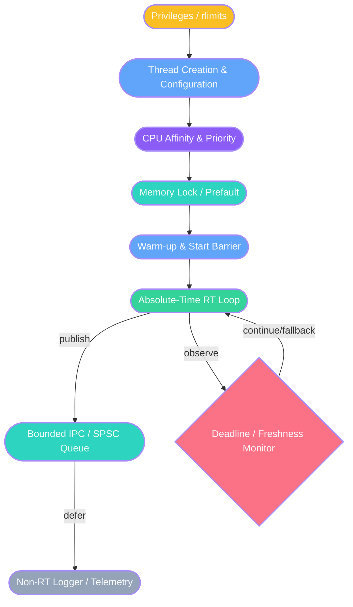


## 4. User-space RT application의 startup contract


### 4.1 권장 startup 순서

1. 설정과 resource limit을 확인한다.
2. 사용할 buffer, queue, object pool을 미리 할당한다.
3. stack과 heap page를 touch한다.
4. `mlockall(MCL_CURRENT | MCL_FUTURE)`를 호출한다.
5. thread를 생성하되 start barrier에서 대기시킨다.
6. 각 thread가 자신의 scheduling policy와 CPU affinity를 설정한다.
7. library/runtime의 첫 호출을 warm-up한다.
8. start barrier를 해제하고 absolute-time loop를 시작한다.
9. 종료 시 RT producer를 먼저 멈추고 queue를 drain한 뒤 logger를 종료한다.

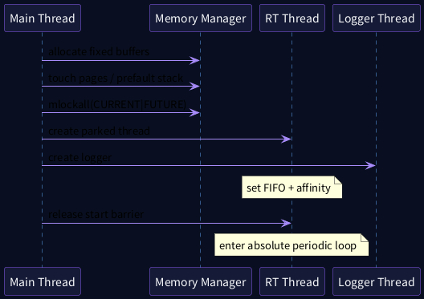


## 5. Scheduling policy와 thread configuration

### 5.1 Process가 아니라 thread 단위로 생각한다

Linux scheduling policy와 affinity는 사실상 thread 단위 속성이다. `pthread_setschedparam()`과 `pthread_setaffinity_np()`를 사용하는 것이 application 구조를 명확하게 한다.

### 5.2 권한과 resource limit

| 기능 | 필요 조건 | 실패 예 |
|---|---|---|
| 높은 RT priority | root, `CAP_SYS_NICE`, 또는 허용된 `RLIMIT_RTPRIO` | `EPERM` |
| memory locking | 충분한 `RLIMIT_MEMLOCK` 또는 `CAP_IPC_LOCK` | `EPERM`, `ENOMEM` |
| 무한 RT CPU 사용 방지 | `RLIMIT_RTTIME`, RT throttling, application watchdog | signal 또는 starvation |

QEMU 실습에서는 root로 단순화할 수 있지만 제품에서는 systemd unit, PAM limits, capability bounding set을 명시적으로 관리해야 한다.

### 5.3 Thread attribute로 생성 시점부터 RT 설정

```c
pthread_attr_t attr;
struct sched_param sp = {
    .sched_priority = 80,
};

pthread_attr_init(&attr);
pthread_attr_setinheritsched(&attr,
                             PTHREAD_EXPLICIT_SCHED);
pthread_attr_setschedpolicy(&attr, SCHED_FIFO);
pthread_attr_setschedparam(&attr, &sp);
pthread_create(&thread, &attr, rt_thread, arg);
```


`pthread_attr_setinheritsched()`의 기본은 `PTHREAD_INHERIT_SCHED`이므로, attribute에 지정한 policy/priority를 사용하려면 `PTHREAD_EXPLICIT_SCHED`가 필요하다.

### 5.4 Thread가 스스로 설정하는 방식

제품 코드에서는 thread entry 초기에 다음을 수행하는 방식도 흔하다.

1. CPU affinity 설정
2. scheduling policy/priority 설정
3. 현재 설정 재조회
4. warm-up
5. barrier에서 공통 start 시점 대기

이 방식은 thread별 책임이 명확하고 error handling이 쉬우며, RT thread가 실제로 실행될 CPU에서 stack prefault와 warm-up을 수행할 수 있다는 장점이 있다.

### 5.5 Kernel source 연결

```c
/* Linux v6.18: kernel/sched/syscalls.c */
static void __setscheduler_params(struct task_struct *p,
                                  const struct sched_attr *attr)
{
    ...
    if (rt_or_dl_task_policy(p)) {
        p->timer_slack_ns = 0;
    } else if (p->timer_slack_ns == 0) {
        p->timer_slack_ns = p->default_timer_slack_ns;
    }

    p->rt_priority = attr->sched_priority;
    p->normal_prio = normal_prio(p);
    set_load_weight(p, true);
}
```


Linux v6.18은 RT/DL policy로 전환되는 task의 `timer_slack_ns`를 0으로 설정한다. 그러나 timer slack이 0이라는 사실이 page fault, lock contention, IRQ-off latency를 제거하지는 않는다.

## 6. CPU affinity와 priority architecture

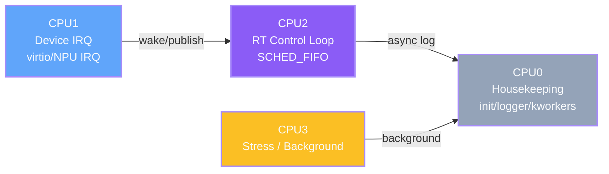


### 6.1 4-vCPU QEMU 예

| CPU | 역할 |
|---:|---|
| CPU0 | init, shell, logger, general kworker |
| CPU1 | virtio/device IRQ thread |
| CPU2 | `SCHED_FIFO` RT loop |
| CPU3 | `stress-ng` background load |

### 6.2 Affinity 설계 원칙

- RT thread와 관련 IRQ thread의 producer-consumer 관계를 함께 본다.
- 같은 CPU 배치는 cache locality가 좋지만 IRQ와 controller가 서로 간섭할 수 있다.
- 다른 CPU 배치는 병렬성을 주지만 shared cache/NoC와 wake-up IPI 비용이 생긴다.
- `taskset`만으로 끝내지 말고 `/proc/irq/N/smp_affinity_list`, effective affinity, thread policy를 함께 확인한다.

```c
/* Linux v6.18: kernel/sched/syscalls.c, simplified */
SYSCALL_DEFINE3(sched_setaffinity,
                pid_t, pid,
                unsigned int, len,
                unsigned long __user *, user_mask_ptr)
{
    cpumask_var_t new_mask;
    int retval;

    if (!alloc_cpumask_var(&new_mask, GFP_KERNEL))
        return -ENOMEM;

    retval = get_user_cpu_mask(user_mask_ptr, len, new_mask);
    if (retval == 0)
        retval = sched_setaffinity(pid, new_mask);

    free_cpumask_var(new_mask);
    return retval;
}
```


### 6.3 Runtime verification

```bash
TID="$(pgrep -n rt_periodic_lab)"

chrt -p "$TID"
taskset -pc "$TID"
grep -E 'Cpus_allowed_list|VmLck'     "/proc/$TID/status"

ps -eLo pid,tid,psr,cls,rtprio,pri,comm |
    grep rt_periodic_lab
```


## 7. Memory determinism

### 7.1 Page fault는 “오류”가 아니라 정상적인 지연 경로다

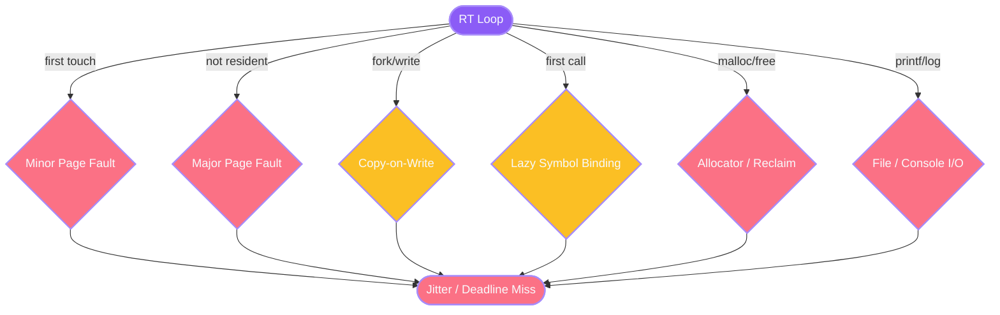


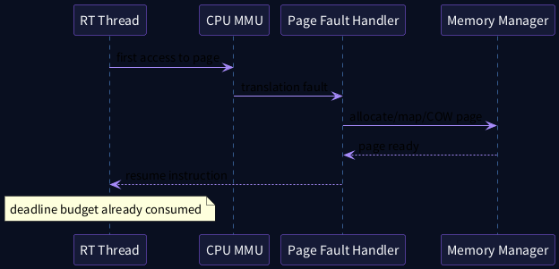


Minor fault도 page-table lock, zero-page allocation, COW, memcg accounting을 포함할 수 있다. Major fault는 storage I/O까지 포함할 수 있어 RT hot path에서 허용하기 어렵다.

### 7.2 `mlockall()`의 의미

- `MCL_CURRENT`: 현재 mapping을 lock하고 resident하게 만든다.
- `MCL_FUTURE`: 이후 생성되는 mapping도 lock 대상으로 한다.
- `MCL_ONFAULT`: 즉시 populate하지 않고 fault 시 lock한다. 첫-touch fault 제거가 목표인 RT loop에는 신중히 사용한다.

```c
/* Linux v6.18: mm/mlock.c */
bool can_do_mlock(void)
{
    if (rlimit(RLIMIT_MEMLOCK) != 0)
        return true;
    if (capable(CAP_IPC_LOCK))
        return true;
    return false;
}
```


```c
/* Linux v6.18: mm/mlock.c, simplified excerpt */
SYSCALL_DEFINE1(mlockall, int, flags)
{
    unsigned long lock_limit;
    int ret;

    if (!flags ||
        (flags & ~(MCL_CURRENT | MCL_FUTURE | MCL_ONFAULT)) ||
        flags == MCL_ONFAULT)
        return -EINVAL;

    if (!can_do_mlock())
        return -EPERM;

    lock_limit = rlimit(RLIMIT_MEMLOCK) >> PAGE_SHIFT;
    if (mmap_write_lock_killable(current->mm))
        return -EINTR;

    ret = -ENOMEM;
    if (!(flags & MCL_CURRENT) ||
        current->mm->total_vm <= lock_limit ||
        capable(CAP_IPC_LOCK))
        ret = apply_mlockall_flags(flags);

    mmap_write_unlock(current->mm);
    if (!ret && (flags & MCL_CURRENT))
        mm_populate(0, TASK_SIZE);
    return ret;
}
```


Linux v6.18에서 `MCL_CURRENT`가 성공하면 `mm_populate(0, TASK_SIZE)`를 호출해 현재 address space의 page population을 시도한다. 그래도 application이 이후 늘리는 stack, 새 `mmap`, lazy allocation은 별도로 고려해야 한다.

### 7.3 Prefault 전략


```c
static void prefault_stack(size_t bytes)
{
    volatile unsigned char *p = alloca(bytes);

    for (size_t off = 0; off < bytes; off += 4096)
        p[off] = 0;
}

static void touch_heap(void *buf, size_t bytes)
{
    volatile unsigned char *p = buf;

    for (size_t off = 0; off < bytes; off += 4096)
        p[off] = 0;
}
```


- RT thread의 예상 최대 stack보다 여유 있는 영역을 touch한다.
- heap/object pool도 page 단위로 write touch한다.
- `malloc()` metadata와 shared library first-call path를 warm-up한다.
- stack growth를 예측할 수 없는 recursion을 피한다.
- `fork()` 이후 COW fault가 생길 수 있으므로 memory lock 이후 `fork()`를 피한다.
- 결과는 `/proc/PID/status`의 `VmLck`와 `getrusage(RUSAGE_THREAD)`의 fault delta로 검증한다.

### 7.4 Memory lifecycle 표

| 동작 | Startup | RT loop | Shutdown |
|---|---:|---:|---:|
| `malloc/free` | 허용, 미리 수행 | 지양 | 허용 |
| stack/heap touch | 필수 | 없음 | 없음 |
| `mlockall` | 수행 | 유지 | process exit/munlock |
| `mmap/munmap` | 가능 | 지양 | 가능 |
| `fork` | mlock 전에도 신중 | 금지 권장 | 별도 manager에서 수행 |
| page-fault counter | baseline | 증가 감시 | report |

## 8. Periodic loop와 absolute time

### 8.1 Relative sleep의 drift

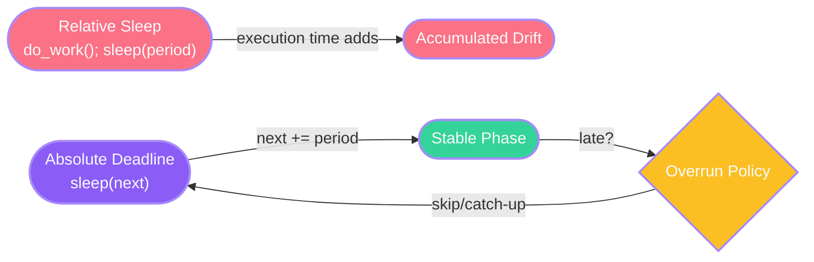


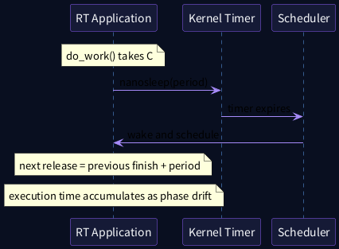


`do_work(); nanosleep(period);` 구조는 매 cycle마다 실행시간과 wake-up latency를 다음 release 시점에 더한다.

```text
release[n+1] = finish[n] + period
```

따라서 장시간 실행하면 phase가 계속 뒤로 밀린다.

### 8.2 Absolute deadline loop

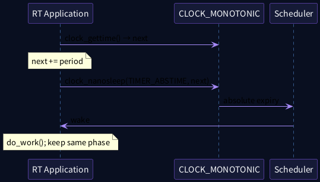


```c
struct timespec next;
clock_gettime(CLOCK_MONOTONIC, &next);

while (!stop) {
    next = timespec_add_ns(next, period_ns);

    int rc;
    do {
        rc = clock_nanosleep(CLOCK_MONOTONIC,
                             TIMER_ABSTIME,
                             &next,
                             NULL);
    } while (rc == EINTR);

    if (rc != 0)
        handle_error_number(rc);

    run_bounded_cycle();
}
```


중요한 API 계약:

- clock은 `CLOCK_MONOTONIC`을 권장한다.
- `TIMER_ABSTIME`을 사용한다.
- `clock_nanosleep()`은 실패 시 `-1`과 `errno`가 아니라 **positive error number를 직접 반환**한다.
- `EINTR`이면 같은 absolute deadline으로 재호출한다.
- next deadline은 실제 wake-up 시각이 아니라 이전 deadline에 period를 더해 계산한다.

### 8.3 PREEMPT_RT의 RT sleeper 경로

```c
/* Linux v6.18: kernel/time/hrtimer.c */
static void __hrtimer_setup_sleeper(struct hrtimer_sleeper *sl,
                                    clockid_t clock_id,
                                    enum hrtimer_mode mode)
{
    if (IS_ENABLED(CONFIG_PREEMPT_RT)) {
        if (rt_or_dl_task_policy(current) &&
            !(mode & HRTIMER_MODE_SOFT))
            mode |= HRTIMER_MODE_HARD;
    }

    __hrtimer_setup(&sl->timer, hrtimer_wakeup,
                    clock_id, mode);
    sl->task = current;
}
```


Linux v6.18은 PREEMPT_RT에서 RT/DL policy task의 sleeper timer를 low-latency hard expiry mode로 선택할 수 있다. 이는 wake-up source를 빠르게 하는 장치이지, scheduler/IRQ-off/CPU contention 전체를 제거하는 보장은 아니다.

## 9. Overrun, deadline miss와 freshness

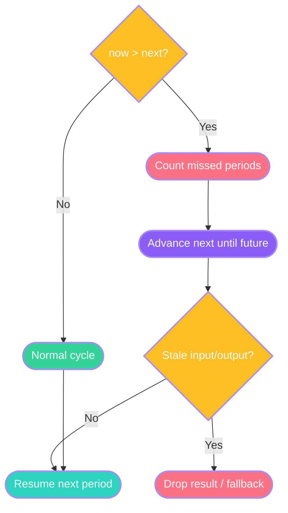


### 9.1 Overrun을 숨기지 않는다

```text
release_latency = actual_start - expected_release
finish_lateness = actual_finish - absolute_deadline
action_age      = command_time - sensor_capture_time
```

### 9.2 정책 예

| 상황 | 가능한 정책 |
|---|---|
| 한 cycle만 약간 늦음 | miss count 증가 후 다음 absolute phase 유지 |
| 여러 period를 초과 | missed periods 계산 후 next를 미래로 advance |
| input/output가 stale | 결과 폐기 |
| safety margin 초과 | fallback controller 또는 degraded mode |
| 반복 miss | watchdog/event report 및 workload 축소 |

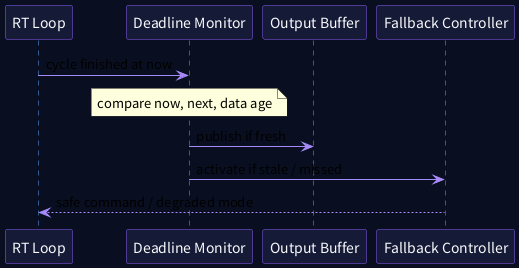


## 10. IPC와 priority inversion

### 10.1 선택 지도

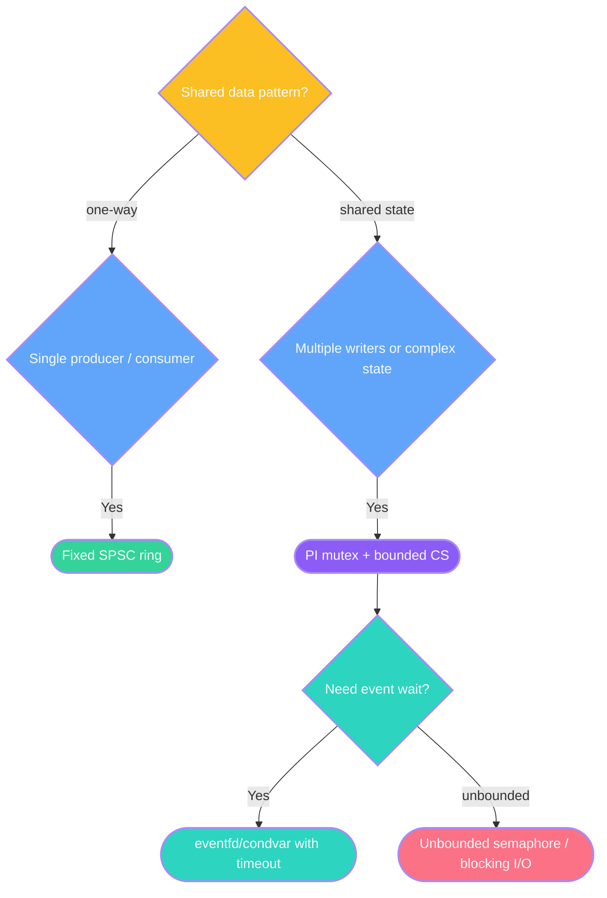


### 10.2 PI mutex

```c
pthread_mutexattr_t attr;
pthread_mutex_t lock;

pthread_mutexattr_init(&attr);
pthread_mutexattr_setprotocol(&attr,
                              PTHREAD_PRIO_INHERIT);
pthread_mutex_init(&lock, &attr);

/* Keep the critical section bounded and free of I/O. */
```


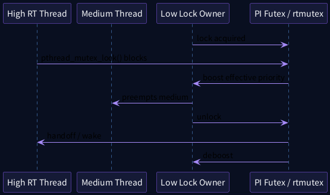


- `PTHREAD_PRIO_INHERIT`는 contended case에서 PI futex와 kernel rtmutex를 사용한다.
- PI는 critical section 자체의 길이를 줄이지 않는다.
- lock 내부 I/O, memory allocation, 복잡한 traversal을 제거해야 한다.
- owner가 없는 semaphore는 priority donation이 불가능하므로 critical serialization에는 신중하다.

```c
/* Linux v6.18: kernel/futex/pi.c */
struct futex_pi_state {
    ...
    struct rt_mutex_base pi_mutex;
    struct task_struct  *owner;
    ...
};

/* Contended PTHREAD_PRIO_INHERIT mutexes use the
 * PI-futex path and rtmutex priority donation. */
```


## 11. Fixed-size SPSC queue와 asynchronous logging

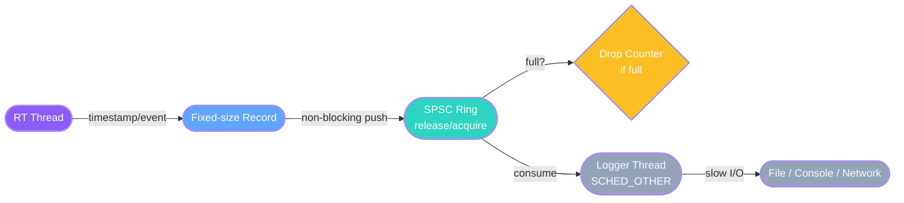


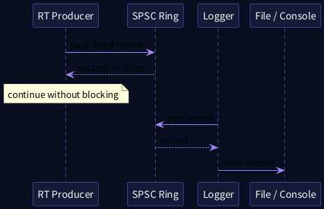


### 11.1 왜 fixed-size인가

- push 시 allocation이 없다.
- single producer/single consumer 조건에서 간단한 release/acquire ordering으로 구현할 수 있다.
- queue full 시 block하지 않고 drop counter를 증가시키는 정책을 선택할 수 있다.
- logger의 filesystem/console latency가 RT producer로 역전파되지 않는다.

```c
static bool ring_push(struct ring *q,
                      const struct record *rec)
{
    unsigned head = atomic_load_explicit(&q->head,
                                         memory_order_relaxed);
    unsigned next = (head + 1U) % RING_SIZE;

    if (next == atomic_load_explicit(&q->tail,
                                     memory_order_acquire))
        return false;

    q->items[head] = *rec;
    atomic_store_explicit(&q->head, next,
                          memory_order_release);
    return true;
}
```


### 11.2 Memory ordering

```text
Producer:
  record write
  head store-release

Consumer:
  head load-acquire
  record read
  tail store-release
```

`memory_order_relaxed`만으로 producer/consumer 간 data publication을 구현하면 다른 CPU에서 record 내용보다 index가 먼저 보일 수 있다.

## 12. RT hot path anti-pattern

| Anti-pattern | 문제 | 대안 |
|---|---|---|
| `printf`, `syslog` | internal lock, console/I/O | SPSC async logger |
| `malloc/free` | allocator lock, reclaim | pool/preallocation |
| relative `nanosleep` | phase drift | absolute `clock_nanosleep` |
| unbounded mutex wait | response-time 상한 없음 | PI + bounded CS + timeout |
| `sched_yield()`로 진행 보장 | 같은 task 재선택 가능 | event/waitqueue/condvar |
| `fork()` after mlock | COW fault | startup order 재설계 |
| DNS/file open first use | lazy I/O / symbol resolution | startup warm-up |
| signal handler에서 복잡한 종료 | async-signal-unsafe | atomic flag/signalfd manager |

## 13. Reference architecture

```text
Main / Manager (SCHED_OTHER)
├── configuration and limits
├── allocate / prefault / mlock
├── start barrier
└── stop and drain

RT Controller (SCHED_FIFO, CPU2)
├── absolute timer release
├── bounded input snapshot
├── bounded compute
├── deadline/freshness check
├── output publish
└── non-blocking log record push

Logger (SCHED_OTHER, CPU0)
├── SPSC pop
└── file/console/network output
```

## 14. QEMU ARM64 실습


### 14.1 실습 파일

```text
lab/
├── README.md
├── Makefile
├── spsc_ring.h
├── rt_periodic_lab.c
├── rt_app_reference.c
├── 01_runtime_inventory.sh
├── 02_build_labs.sh
├── 03_run_version_matrix.sh
├── 04_run_fault_compare.sh
├── 05_run_sleep_compare.sh
├── 06_run_logging_compare.sh
├── 07_trace_rt_app.sh
├── 08_collect_report.sh
└── 09_rt_userspace.config
```

### 14.2 비교 matrix

| 실험 | Sleep | Memory | Logging | 목적 |
|---|---|---|---|---|
| A | Relative | default | 없음 | drift 관찰 |
| B | Absolute | default | 없음 | phase 안정화 |
| C | Absolute | prefault | 없음 | first-touch 감소 |
| D | Absolute | prefault + mlock | 없음 | fault delta 확인 |
| E | Absolute | prefault + mlock | async SPSC | logging 분리 |
| F | E + CPU stress | 동일 | async | load under test |

### 14.3 Trace

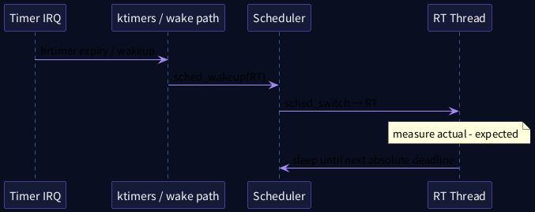


```bash
trace-cmd record     -e sched:sched_wakeup     -e sched:sched_switch     -e timer:hrtimer_start     -e timer:hrtimer_expire_entry     -e timer:hrtimer_expire_exit     ./rt_periodic_lab --absolute --cpu 2 --priority 80         --period-us 10000 --iterations 1000 --prefault --mlock
```

## 15. Debugging decision tree

```mermaid
flowchart TB
    M(["Deadline miss detected"])
    IRQ{"Timer IRQ latency high?"}
    TH{"Thread wake-up latency high?"}
    PF{"Page faults increased?"}
    BL{"Blocking / lock wait?"}
    IO{"Logging / I/O in loop?"}
    A1(["IRQ-off/raw lock/host pause"])
    A2(["Priority/affinity/CPU load"])
    A3(["mlock/prefault/COW"])
    A4(["PI mutex / timeout / IPC redesign"])
    A5(["Async logger / fixed queue"])
    M --> IRQ
    IRQ -->|"Yes"| A1
    IRQ -->|"No"| TH
    TH -->|"Yes"| A2
    TH -->|"No"| PF
    PF -->|"Yes"| A3
    PF -->|"No"| BL
    BL -->|"Yes"| A4
    BL -->|"No"| IO
    IO -->|"Yes"| A5
    style M fill:#FB7185,stroke:#A78BFA,color:#F8FAFC,stroke-width:2px
    style IRQ fill:#FBBF24,stroke:#A78BFA,color:#F8FAFC,stroke-width:2px
    style TH fill:#FBBF24,stroke:#A78BFA,color:#F8FAFC,stroke-width:2px
    style PF fill:#FBBF24,stroke:#A78BFA,color:#F8FAFC,stroke-width:2px
    style BL fill:#FBBF24,stroke:#A78BFA,color:#F8FAFC,stroke-width:2px
    style IO fill:#FBBF24,stroke:#A78BFA,color:#F8FAFC,stroke-width:2px
    style A1 fill:#FB7185,stroke:#A78BFA,color:#F8FAFC,stroke-width:2px
    style A2 fill:#8B5CF6,stroke:#A78BFA,color:#F8FAFC,stroke-width:2px
    style A3 fill:#2DD4BF,stroke:#A78BFA,color:#F8FAFC,stroke-width:2px
    style A4 fill:#60A5FA,stroke:#A78BFA,color:#F8FAFC,stroke-width:2px
    style A5 fill:#34D399,stroke:#A78BFA,color:#F8FAFC,stroke-width:2px
```


### 15.1 관찰 순서

1. deadline miss timestamp를 확보한다.
2. timer IRQ latency와 thread wake-up latency를 구분한다.
3. 해당 구간의 page-fault counter를 확인한다.
4. `sched_switch`, `sched_wakeup`, PI trace로 blocking owner를 찾는다.
5. CPU migration과 IRQ affinity를 확인한다.
6. RT loop의 I/O와 allocation을 제거한다.
7. QEMU host pause인지 guest kernel noise인지 구분한다.

## 16. Runtime Verification 활용

Linux Runtime Verification의 RT application monitor는 다음과 같은 규칙을 검증하는 데 사용할 수 있다.

- RT-friendly sleep은 `clock_nanosleep()` + `TIMER_ABSTIME` + `CLOCK_MONOTONIC` 조합
- RT task의 unsafe blocking pattern 탐지
- trace 기반 규칙 위반 관찰

이 기능은 application correctness를 증명하는 도구가 아니라, runtime behavior가 설계한 RT contract를 위반하는지 탐지하는 보조 수단이다.

## 17. Automotive NPU E2E/VLA 사례

```mermaid
flowchart LR
    S(["Sensors"])
    N(["NPU E2E/VLA"])
    P(["Trajectory Publish"])
    R(["SPSC Trajectory Buffer"])
    C(["100 Hz RT Controller"])
    F{"Freshness / Deadline Monitor"}
    V(["Vehicle Command"])
    L(["Logger / Recorder"])
    S -->|"frame"| N
    N -->|"result"| P
    P -->|"validated trajectory"| R
    R -->|"latest valid"| C
    C -->|"action age"| F
    F -->|"valid"| V
    F -->|"telemetry"| L
    C -->|"async record"| L
    style S fill:#60A5FA,stroke:#A78BFA,color:#F8FAFC,stroke-width:2px
    style N fill:#8B5CF6,stroke:#A78BFA,color:#F8FAFC,stroke-width:2px
    style P fill:#2DD4BF,stroke:#A78BFA,color:#F8FAFC,stroke-width:2px
    style R fill:#34D399,stroke:#A78BFA,color:#F8FAFC,stroke-width:2px
    style C fill:#8B5CF6,stroke:#A78BFA,color:#F8FAFC,stroke-width:2px
    style F fill:#FB7185,stroke:#A78BFA,color:#F8FAFC,stroke-width:2px
    style V fill:#34D399,stroke:#A78BFA,color:#F8FAFC,stroke-width:2px
    style L fill:#94A3B8,stroke:#A78BFA,color:#F8FAFC,stroke-width:2px
```


```plantuml
@startuml
skinparam backgroundColor #090F20
skinparam defaultFontName "Noto Sans CJK KR"
skinparam sequence {
  ArrowColor #A78BFA
  LifeLineBorderColor #60A5FA
  LifeLineBackgroundColor #111A31
  ParticipantBorderColor #8B5CF6
  ParticipantBackgroundColor #151A36
  ParticipantFontColor #F8FAFC
  NoteBackgroundColor #1B2438
  NoteBorderColor #FBBF24
  NoteFontColor #F8FAFC
}
participant "Sensor/NPU" as S
participant "Publisher" as PUB
participant "100 Hz Controller" as RT
participant "Safety Monitor" as SAFE
participant "CAN/Ethernet" as BUS
S -> PUB: trajectory + capture timestamp
PUB -> RT: non-blocking latest buffer
note over RT: absolute periodic release
RT -> SAFE: command + action age
SAFE -> BUS: valid command
SAFE -> BUS: fallback on deadline miss
@enduml
```


### 17.1 Multi-rate 설계

```text
VLA / E2E inference loop
    상대적으로 느리고 실행시간 편차가 큼
    SCHED_OTHER 또는 제한된 priority

Fast trajectory controller
    100 Hz absolute periodic loop
    SCHED_FIFO

Safety / freshness monitor
    controller보다 높은 priority 또는 독립 safety domain
```

### 17.2 Trajectory buffer contract

- Producer는 capture timestamp, model completion timestamp, horizon을 함께 publish한다.
- Controller는 가장 최신의 complete snapshot만 읽는다.
- `Remaining Horizon = Horizon - Action Age - Safety Margin`을 계산한다.
- stale result는 계산이 성공했더라도 폐기한다.
- logger와 recorder는 control path 밖에서 처리한다.

### 17.3 PREEMPT_RT가 담당하는 부분

```text
NPU completion thread wake-up
trajectory publish scheduling
controller periodic release
safety monitor execution
vehicle command transmission
```

### 17.4 PREEMPT_RT가 직접 보장하지 않는 부분

```text
NPU hardware execution upper bound
firmware queue scheduling
DRAM/NoC contention
DMA fence completion
thermal throttling
model correctness
```

## 18. 핵심 요약

1. RT kernel은 기반이고 application contract가 실시간성을 완성한다.
2. scheduling policy, affinity, privilege를 thread 단위로 명시한다.
3. `mlockall()`과 prefault를 함께 사용하고 fault counter로 검증한다.
4. periodic loop는 `CLOCK_MONOTONIC + TIMER_ABSTIME`을 사용한다.
5. overrun과 stale data를 정상 설계 경로로 취급한다.
6. shared lock은 PI와 bounded critical section을 함께 적용한다.
7. logging/I/O는 fixed queue 뒤의 non-RT thread로 분리한다.
8. QEMU 결과는 상대 비교와 call-flow 학습에 사용한다.
9. Automotive NPU/VLA는 느린 model loop와 빠른 RT controller를 분리한다.
10. 다음 강의에서는 latency의 원인을 `cyclictest`, `rtla`, ftrace로 분해한다.

## 19. 퀴즈

### 객관식 1
PREEMPT_RT kernel에서 RT application이 첫 cycle에 큰 latency를 보이는 가장 직접적인 user-space 원인은?

A. 항상 GICv3 문제  B. page fault와 lazy initialization  C. `SCHED_FIFO`가 time slice를 사용  D. `CLOCK_MONOTONIC`이 느림

### 객관식 2
Thread attribute에 `SCHED_FIFO`를 지정했지만 새 thread가 parent policy를 상속했다. 빠진 설정은?

A. `PTHREAD_EXPLICIT_SCHED`  B. `MCL_FUTURE`  C. `IRQF_ONESHOT`  D. `TIMER_ABSTIME`

### 객관식 3
장시간 periodic phase drift를 줄이는 가장 적절한 방식은?

A. `usleep(period)`  B. `sched_yield()`  C. absolute `clock_nanosleep()`  D. 매 cycle `fork()`

### 객관식 4
RT logging에 가장 적합한 기본 구조는?

A. RT thread에서 매 cycle `printf`  B. fixed SPSC queue + SCHED_OTHER logger  C. 무제한 semaphore  D. 파일 `fsync()`

### O/X 5
`mlockall(MCL_CURRENT | MCL_FUTURE)`만 성공하면 이후 어떤 page fault도 절대로 발생하지 않는다.

### O/X 6
`clock_nanosleep()`은 실패 시 positive error number를 직접 반환하므로 `errno`만 검사하면 안 된다.

### 단답형 7
PREEMPT_RT에서 contended user-space PI mutex가 연결되는 두 kernel mechanism을 쓰시오.

### 단답형 8
SPSC queue에서 producer가 record를 쓴 뒤 head index를 publish할 때 사용하는 핵심 memory ordering pair를 쓰시오.

### 시나리오 9
CPU2의 P85 controller가 10ms period로 실행된다. page fault는 없지만 2초마다 4ms outlier가 발생하고 그 시점에 logger가 같은 mutex를 오래 보유한다. 우선 확인하고 수정할 두 가지를 제시하시오.

### 시나리오 10
VLA 결과가 정상 완료됐지만 capture 후 700ms가 지났고 trajectory horizon은 600ms이다. controller는 어떻게 처리해야 하는가?

## 20. 정답과 해설

1. **B.** RT kernel은 application의 first-touch fault와 lazy runtime initialization을 제거하지 않는다.
2. **A.** pthread attribute의 기본 inheritance 때문에 `PTHREAD_EXPLICIT_SCHED`가 필요하다.
3. **C.** absolute deadline은 execution time을 다음 release 기준에 누적하지 않는다.
4. **B.** RT producer는 block하지 않고 record를 publish하며 느린 I/O는 logger가 수행한다.
5. **X.** 이후 stack growth, COW, 새 mapping, driver/userfault, 잘못된 startup 순서 등 다른 fault source가 남을 수 있다.
6. **O.** pthread API와 `clock_nanosleep()` 계열은 반환값 자체가 error number인 경우가 있으므로 API별 계약을 확인한다.
7. **PI futex와 rtmutex.** uncontended fast path는 user space에 머물 수 있고 contention 시 kernel PI path로 들어간다.
8. **store-release / load-acquire.** record write가 index publication보다 먼저 보이도록 한다.
9. Logger mutex에 `PTHREAD_PRIO_INHERIT`가 적용됐는지와 critical section에 I/O가 포함됐는지 확인한다. 가장 좋은 수정은 logger와 controller의 공유 lock을 없애고 SPSC queue로 분리하는 것이다.
10. `Remaining Horizon <= 0`이므로 stale result로 폐기하고 이전 valid trajectory의 제한적 유지 또는 fallback/degraded mode를 적용한다.

## 21. 5분 복습 질문

1. PREEMPT_RT가 application의 page fault를 없애지 못하는 이유는?
2. `PTHREAD_EXPLICIT_SCHED`가 필요한 상황은?
3. `RLIMIT_RTPRIO`와 `RLIMIT_MEMLOCK`의 역할은?
4. `MCL_CURRENT`, `MCL_FUTURE`, `MCL_ONFAULT`의 차이는?
5. 왜 `fork()` 이후 COW가 RT 문제인가?
6. relative sleep이 drift를 만드는 수식은?
7. `clock_nanosleep()`의 error handling은 어떻게 다른가?
8. overrun 발생 시 next deadline을 어떻게 갱신하는가?
9. PI가 줄이는 것과 줄이지 못하는 것은?
10. SPSC queue에서 release/acquire가 필요한 이유는?
11. QEMU latency를 제품 보증값으로 사용할 수 없는 이유는?
12. VLA 결과의 freshness를 어떤 timestamp로 계산하는가?

## 22. Flashcards

| 앞면 | 뒷면 |
|---|---|
| `SCHED_FIFO` | 더 높은 priority가 없고 block하지 않으면 계속 실행하는 fixed-priority policy |
| `PTHREAD_EXPLICIT_SCHED` | 새 pthread가 attribute의 policy/priority를 사용하도록 함 |
| `CAP_SYS_NICE` | RT scheduling/affinity 관련 privileged operation |
| `CAP_IPC_LOCK` | memory lock limit 우회 권한 |
| `MCL_CURRENT` | 현재 mapping lock/populate |
| `MCL_FUTURE` | 이후 mapping을 lock 대상으로 지정 |
| Prefault | page를 startup에 미리 touch하여 first-use fault를 앞당김 |
| `TIMER_ABSTIME` | absolute deadline 기반 sleep |
| Drift | relative sleep에서 execution time이 release phase에 누적되는 현상 |
| Overrun | cycle이 deadline/period budget을 초과한 상태 |
| PI futex | user-space PI mutex contention의 kernel mechanism |
| SPSC | single producer, single consumer queue |
| Release/Acquire | producer publication과 consumer visibility ordering |
| Action Age | sensor capture부터 command 사용까지의 시간 |
| Stale Output | 유효 horizon이 소진된 오래된 model 결과 |

## 23. 빈칸 채우기

1. RT periodic loop는 `CLOCK___________`와 `TIMER___________`를 사용한다.
2. `mlockall()` 권한은 `RLIMIT___________` 또는 `CAP_IPC___________`와 관련된다.
3. `PTHREAD_PRIO___________` mutex는 contention 시 PI futex를 사용한다.
4. SPSC publication은 store-__________와 load-__________ pair를 사용한다.
5. `Remaining Horizon = Horizon - ________ Age - Safety Margin`이다.

정답: MONOTONIC, ABSTIME, MEMLOCK, LOCK, INHERIT, release, acquire, Action.

## 24. 실습 과제

### 과제 A — Sleep drift
`03_run_version_matrix.sh`를 실행하고 relative/absolute mode의 장시간 phase 차이를 그래프로 정리한다.

### 과제 B — Fault budget
`04_run_fault_compare.sh` 결과에서 minor/major fault delta와 max latency를 비교한다. mlock 실패 시 resource limit과 capability를 기록한다.

### 과제 C — Async logger
SPSC ring 크기를 64, 256, 1024로 바꾸고 drop count와 RT max latency의 trade-off를 측정한다.

### 과제 D — Automotive freshness
`rt_periodic_lab`에 `capture_timestamp`와 horizon을 추가하고 stale output count와 fallback count를 출력한다.

## 25. 다음 강의 전 checklist

- [ ] RT thread의 policy/priority/affinity를 runtime에서 확인했다.
- [ ] memory lock limit과 capability를 설명할 수 있다.
- [ ] relative/absolute sleep의 차이를 코드로 구현했다.
- [ ] page-fault delta를 수집했다.
- [ ] RT hot path에서 logging과 allocation을 제거했다.
- [ ] deadline miss와 stale output을 별도로 정의했다.
- [ ] trace-cmd로 wake-up과 switch-in 시점을 찾을 수 있다.

## 26. Source Reading Map

```mermaid
flowchart TB
    U["User API<br/>pthread / mlock / clock_nanosleep"]
    S["kernel/sched/syscalls.c"]
    M["mm/mlock.c"]
    T["kernel/time/hrtimer.c"]
    F["kernel/futex/pi.c"]
    TR["trace/events/sched.h<br/>trace/events/timer.h"]
    U -->|"policy/affinity"| S
    U -->|"memory lock"| M
    U -->|"absolute sleep"| T
    U -->|"PI mutex contention"| F
    S -->|"sched trace"| TR
    T -->|"timer trace"| TR
    style U fill:#60A5FA,stroke:#A78BFA,color:#F8FAFC,stroke-width:2px
    style S fill:#8B5CF6,stroke:#A78BFA,color:#F8FAFC,stroke-width:2px
    style M fill:#2DD4BF,stroke:#A78BFA,color:#F8FAFC,stroke-width:2px
    style T fill:#FBBF24,stroke:#A78BFA,color:#F8FAFC,stroke-width:2px
    style F fill:#FB7185,stroke:#A78BFA,color:#F8FAFC,stroke-width:2px
    style TR fill:#34D399,stroke:#A78BFA,color:#F8FAFC,stroke-width:2px
```


| 주제 | Source path |
|---|---|
| RT policy/priority | `kernel/sched/syscalls.c` |
| CPU affinity | `kernel/sched/syscalls.c` |
| Memory locking | `mm/mlock.c` |
| RT sleeper hrtimer | `kernel/time/hrtimer.c` |
| PI futex | `kernel/futex/pi.c` |
| rtmutex | `kernel/locking/rtmutex.c` |
| Scheduler tracepoints | `include/trace/events/sched.h` |
| Timer tracepoints | `include/trace/events/timer.h` |
| RT application monitor | `Documentation/trace/rv/monitor_rtapp.rst` |

## 27. 참고 자료

- Linux v6.18 source, commit `7d0a66e4bb9081d75c82ec4957c50034cb0ea449`
- Linux man-pages 6.18: `sched(7)`, `mlockall(2)`, `clock_nanosleep(2)`, `pthread_setschedparam(3)`, `pthread_setaffinity_np(3)`, `getrusage(2)`, `getrlimit(2)`, `capabilities(7)`
- Linux kernel PREEMPT_RT documentation: `Documentation/core-api/real-time/`
- Linux Runtime Verification documentation: `Documentation/trace/rv/`


### 공식 링크

- [Linux v6.18 source tree](https://github.com/torvalds/linux/tree/v6.18)
- [`mm/mlock.c`](https://github.com/torvalds/linux/blob/v6.18/mm/mlock.c)
- [`kernel/sched/syscalls.c`](https://github.com/torvalds/linux/blob/v6.18/kernel/sched/syscalls.c)
- [`kernel/time/hrtimer.c`](https://github.com/torvalds/linux/blob/v6.18/kernel/time/hrtimer.c)
- [`kernel/futex/pi.c`](https://github.com/torvalds/linux/blob/v6.18/kernel/futex/pi.c)
- [PREEMPT_RT differences](https://docs.kernel.org/6.18/core-api/real-time/differences.html)
- [Runtime Verification RT application monitor](https://docs.kernel.org/6.18/trace/rv/monitor_rtapp.html)
- [`mlockall(2)`](https://man7.org/linux/man-pages/man2/mlockall.2.html)
- [`clock_nanosleep(2)`](https://man7.org/linux/man-pages/man2/clock_nanosleep.2.html)
- [`sched(7)`](https://man7.org/linux/man-pages/man7/sched.7.html)
- [`pthread_setschedparam(3)`](https://man7.org/linux/man-pages/man3/pthread_setschedparam.3.html)
- [`pthread_setaffinity_np(3)`](https://man7.org/linux/man-pages/man3/pthread_setaffinity_np.3.html)
