# 8강. cyclictest, rtla, ftrace를 이용한 Latency 분석

## 강의 개요

- 과정명: PREEMPT_RT 10강 실습 과정
- 이번 강의: 8강. cyclictest, rtla, ftrace를 이용한 Latency 분석
- 기준 커널: Linux v6.18
- 기준 commit: `7d0a66e4bb9081d75c82ec4957c50034cb0ea449`
- 실습 환경: QEMU ARM64 `virt`, GICv3, Linux kernel, Buildroot initramfs
- 예상 강의 시간: 120분

이번 강의는 단순히 `cyclictest Max = 몇 us`를 얻는 수업이 아닙니다. 목표는 latency outlier가 발생했을 때 그 값이 **timer IRQ 단계에서 발생했는지, RT thread wake-up 단계에서 발생했는지, softirq/IRQ/thread noise 때문인지, application 설계 문제인지**를 구분하는 것입니다.

## 학습 목표

1. `cyclictest` 결과에서 Min/Avg/Max의 의미와 한계를 설명한다.
2. `rtla timerlat`으로 Timer IRQ latency와 Thread latency를 분리한다.
3. `rtla osnoise`로 IRQ, softirq, thread interference를 관찰한다.
4. ftrace/trace-cmd로 outlier 발생 구간의 이벤트를 추적한다.
5. QEMU ARM64 환경에서 reproducible measurement matrix를 만든다.
6. Automotive NPU completion-to-controller latency를 timestamp 기반으로 분석한다.

## 이전 강의 연결

7강에서는 user-space RT application의 `SCHED_FIFO`, `mlockall()`, absolute timer, asynchronous logging 구조를 학습했습니다. 8강에서는 그 application이 실제로 지연될 때 **어느 kernel 경로 때문에 늦어졌는지**를 찾습니다.

## 다음 강의 예고

9강에서는 8강의 분석 결과를 바탕으로 CPU isolation, IRQ affinity, RT priority hierarchy, workqueue affinity, console/logging tuning을 적용합니다.

## 1. Latency 분석의 큰 그림

RT 시스템에서 측정값은 결과일 뿐입니다. 원인을 찾으려면 전체 경로를 나누어야 합니다.


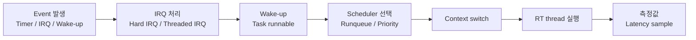


관찰해야 하는 지표는 평균 latency가 아니라 다음입니다.

| 지표 | 의미 | 해석 |
|---|---|---|
| Min | 가장 좋은 조건 | 시스템 능력의 하한에 가까움 |
| Avg | 평균 지연 | RT 적합성 판단에는 부족 |
| Max | 최악 관측값 | deadline miss와 직접 관련 |
| 99.9/99.99 percentile | tail latency | 제품 안정성 판단에 유용 |
| Outlier count | threshold 초과 횟수 | 재현성과 원인 분석의 시작점 |

## 2. Tool map


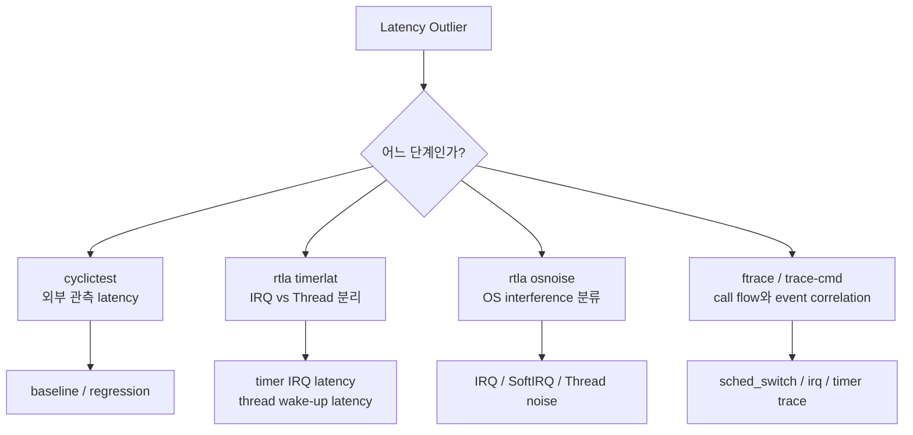


`cyclictest`는 외부 관측값을 빠르게 얻기 좋습니다. 그러나 원인을 직접 알려주지는 않습니다. `rtla timerlat`은 timer IRQ와 thread latency를 분리하고, `rtla osnoise`는 OS interference를 분류합니다. ftrace는 최종적으로 event timeline을 보여줍니다.

## 3. cyclictest


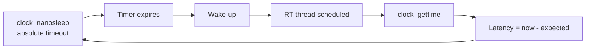


대표 실행 명령은 다음과 같습니다.

```bash
cyclictest     --smp     --mlockall     --priority 95     --interval 250     --duration 60     --quiet
```

결과 예:

```text
T: 0 (  123) P:95 I:250 C:240000 Min:3 Act:5 Avg:6 Max:42
```

해석:

- `P:95`: SCHED_FIFO priority
- `I:250`: 250 us period
- `C`: loop count
- `Max`: 가장 중요한 관찰값

### cyclictest의 한계

`cyclictest`는 user-space thread가 늦게 실행된 결과를 보여주지만, 그 이유가 아래 중 무엇인지 직접 알려주지는 않습니다.

- Timer IRQ 자체가 늦었는가?
- Timer IRQ는 제때 왔지만 thread wake-up이 늦었는가?
- 더 높은 priority task가 있었는가?
- softirq, IRQ thread, kworker가 방해했는가?
- page fault, logging, allocator 때문인가?
- QEMU host scheduling noise 때문인가?

## 4. rtla timerlat


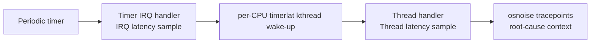


`rtla timerlat`은 timerlat tracer의 인터페이스입니다. timerlat tracer는 per-CPU kernel thread를 사용하고, periodic timer를 설정해 자신을 깨운 뒤 IRQ handler 단계와 thread handler 단계의 latency 정보를 생성합니다.

```bash
rtla timerlat top     --duration 60     --cpus 2     --priority f:95
```

결과 해석의 핵심:

```text
IRQ latency high
    -> hard IRQ disabled, raw_spinlock, firmware, clockevent path 의심

Thread latency high
    -> scheduler, priority, CPU affinity, competing RT task 의심
```

## 5. rtla osnoise


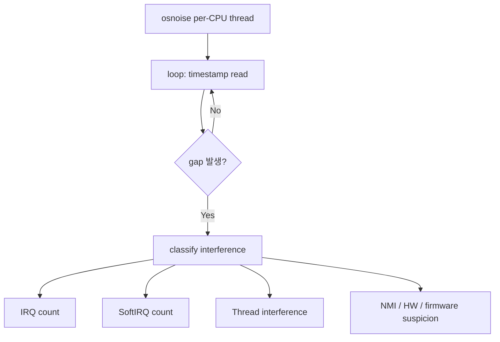


`rtla osnoise`는 per-CPU thread가 preemption, softirq, IRQ enabled 상태에서 loop를 돌며 시간 gap을 측정합니다. gap이 발생하면 IRQ, softirq, thread 등 interference source를 카운트합니다.

```bash
rtla osnoise top     --duration 60     --cpus 2     --priority f:90
```

osnoise 결과가 높다면 다음을 확인합니다.

- 같은 CPU로 routing된 device IRQ가 많은가?
- ksoftirqd나 ktimers가 같은 CPU에서 경쟁하는가?
- kworker가 RT CPU에서 실행되는가?
- RCU callback thread가 지연되는가?
- tracing 자체가 latency를 키우는가?

## 6. ftrace와 trace-cmd


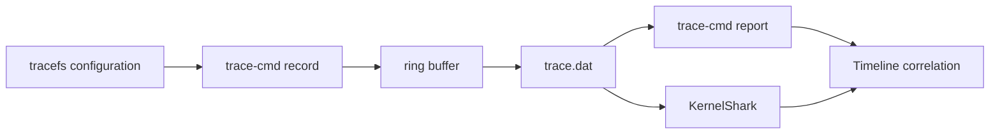


대표 trace-cmd 명령:

```bash
trace-cmd record     -e sched:sched_wakeup     -e sched:sched_switch     -e sched:sched_migrate_task     -e irq:irq_handler_entry     -e irq:irq_handler_exit     -e irq:softirq_raise     -e irq:softirq_entry     -e irq:softirq_exit     -e timer:hrtimer_start     -e timer:hrtimer_expire_entry     -e timer:hrtimer_expire_exit     sleep 20
```

분석 순서:

1. outlier timestamp를 찾는다.
2. 해당 window의 `sched_switch`를 본다.
3. 바로 앞에 실행 중이던 task를 확인한다.
4. IRQ/softirq event가 같은 CPU에서 겹쳤는지 본다.
5. hrtimer expiry와 RT task switch-in 사이의 간격을 계산한다.

## 7. Experiment matrix


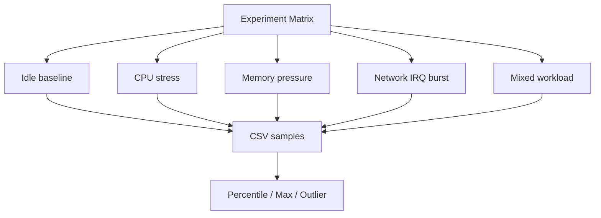


최소한 다음 matrix를 수행합니다.

| Test | Kernel | Load | CPU/IRQ affinity | 목적 |
|---|---|---|---|---|
| T1 | PREEMPT_FULL | idle | 기본 | baseline |
| T2 | PREEMPT_RT | idle | 기본 | RT 효과 확인 |
| T3 | PREEMPT_RT | CPU stress | 미적용 | scheduler interference 확인 |
| T4 | PREEMPT_RT | mixed load | 미적용 | outlier 유도 |
| T5 | PREEMPT_RT | mixed load | 적용 | tuning 효과 확인 |

## 8. QEMU ARM64 실습 topology


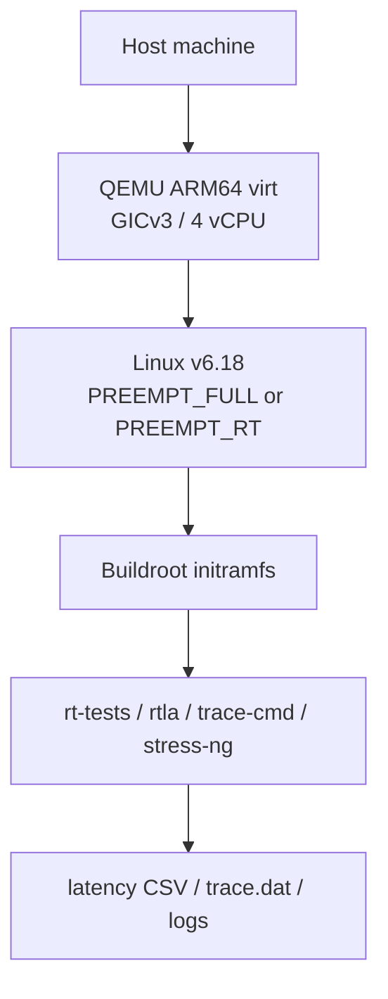


QEMU에서는 절대 latency 수치를 제품 목표로 사용하면 안 됩니다. QEMU는 다음에 적합합니다.

- measurement pipeline 검증
- trace event 상관관계 학습
- PREEMPT_FULL vs PREEMPT_RT 상대 비교
- CPU affinity와 priority 설정 효과 확인
- lab script 재현성 확보

## 9. Data pipeline


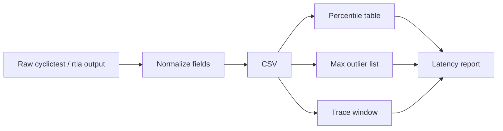


CSV 필드 예:

```csv
test,kernel,cpu,policy,priority,load,interval_us,min_us,avg_us,max_us,p99_us,p999_us,outliers
rt_idle,PREEMPT_RT,2,FIFO,95,idle,250,3,6,42,18,32,0
```

분석 시 평균값보다 다음 값이 더 중요합니다.

- `max_us`
- `p99.9`
- `outlier count`
- outlier 발생 시점의 trace window

## 10. Decision trees


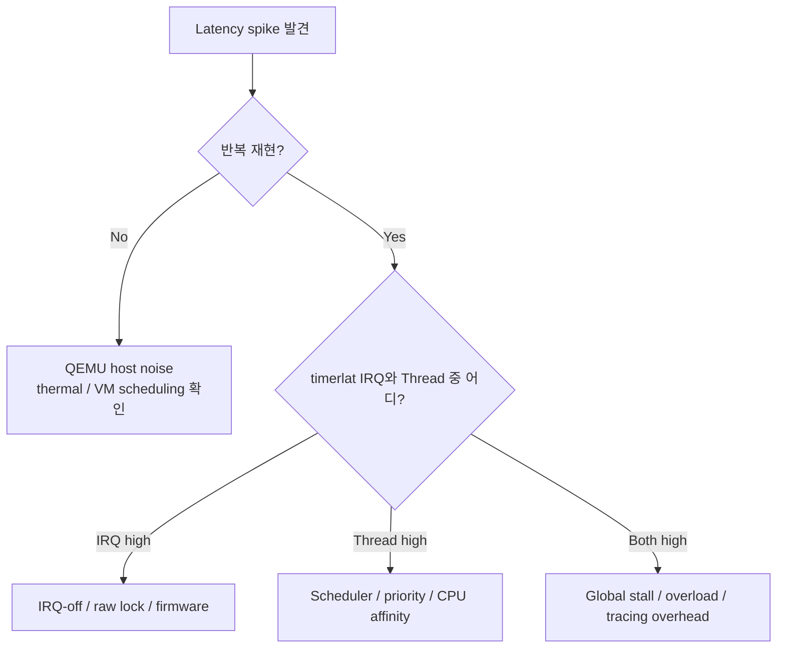
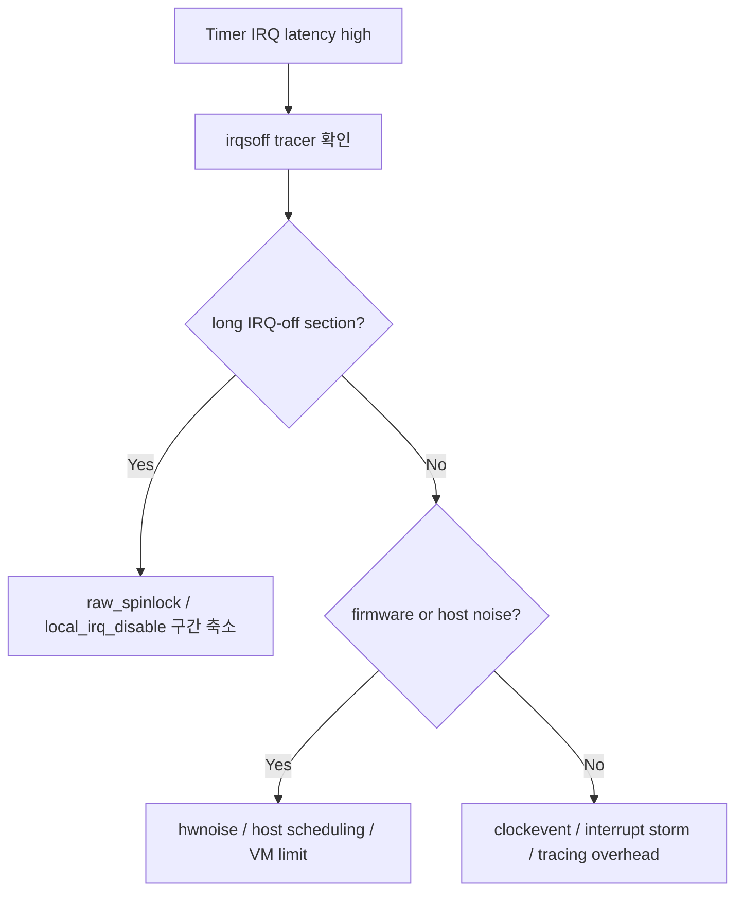
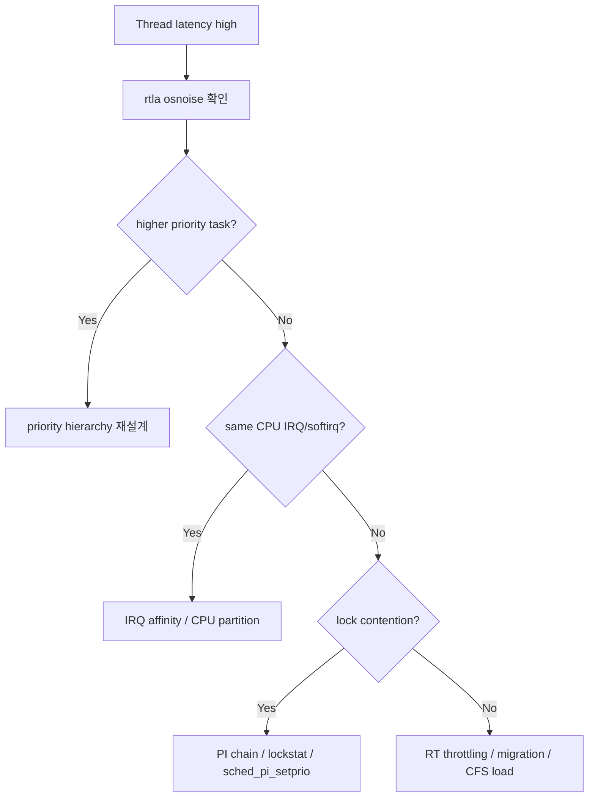


## 11. PlantUML sequence diagrams

### Timer wake-up path


```plantuml
@startuml
participant "Clock Event\nDevice" as CLOCK
participant "hrtimer\nCore" as HRT
participant "Scheduler" as SCHED
participant "RT Thread" as RT
CLOCK -> HRT: timer interrupt
HRT -> SCHED: wake_up_process(RT)
SCHED -> SCHED: enqueue runnable task
SCHED -> RT: context switch
RT -> RT: read timestamp
compute latency
@enduml
```


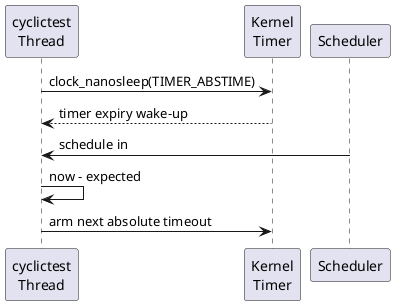


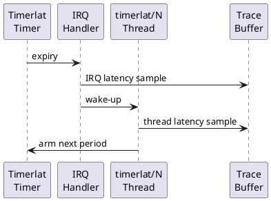


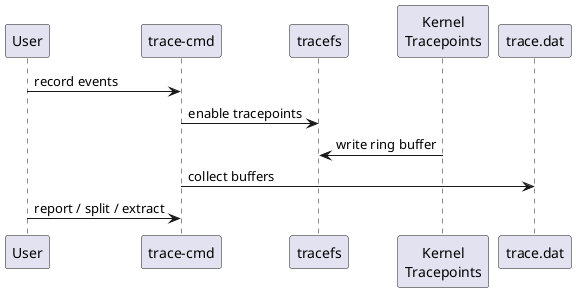


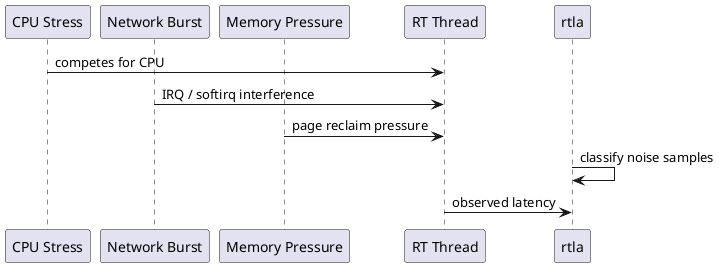


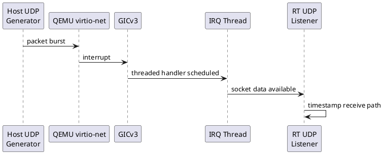


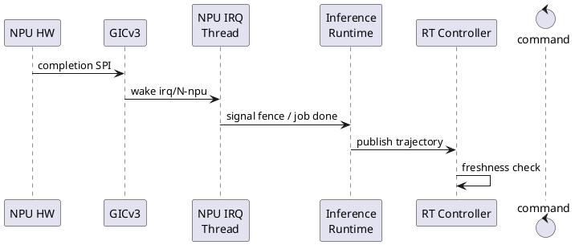


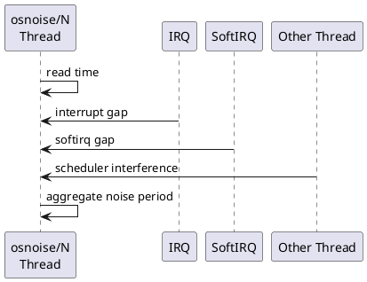


```plantuml
@startuml
participant "Measurement" as M
participant "CSV" as CSV
participant "Trace" as TR
participant "Root Cause\nAnalysis" as RCA
participant "Fix Plan" as FIX
M -> CSV: normalize samples
M -> TR: capture outlier window
CSV -> RCA: percentile / max / count
TR -> RCA: event correlation
RCA -> FIX: priority / affinity / code fix
@enduml
```


## 12. Source reading map

| 영역 | 주요 파일 |
|---|---|
| cyclictest | `rt-tests/src/cyclictest/cyclictest.c` |
| rtla frontend | `tools/tracing/rtla/` |
| timerlat tracer | `kernel/trace/trace_osnoise.c` |
| ftrace core | `kernel/trace/` |
| sched tracepoints | `include/trace/events/sched.h` |
| irq tracepoints | `include/trace/events/irq.h` |
| hrtimer tracepoints | `include/trace/events/timer.h` |
| scheduler core | `kernel/sched/core.c` |
| IRQ core | `kernel/irq/` |
| SoftIRQ | `kernel/softirq.c` |

## 13. Automotive NPU case study


```mermaid
flowchart LR
    T0[T0 Sensor capture] --> T1[T1 IRQ entry]
    T1 --> T2[T2 Sensor ingest]
    T2 --> T3[T3 NPU submit]
    T3 --> T4[T4 NPU complete]
    T4 --> T5[T5 Completion IRQ]
    T5 --> T6[T6 Result publish]
    T6 --> T7[T7 Controller start]
    T7 --> T8[T8 Vehicle command]
```


NPU 기반 E2E/VLA 자율주행 장치에서는 다음 timestamp를 반드시 분리해야 합니다.

| Timestamp | 의미 |
|---|---|
| T0 | Sensor capture timestamp |
| T1 | Sensor IRQ entry |
| T2 | Sensor ingest start |
| T3 | NPU job submit |
| T4 | NPU hardware complete |
| T5 | NPU completion IRQ thread start |
| T6 | Model result publish |
| T7 | RT controller start |
| T8 | Vehicle command transmit |

전체 latency:

```text
Observation-to-action = T8 - T0
Capture-to-submit    = T3 - T0
NPU execution         = T4 - T3
Completion-to-publish = T6 - T4
Controller release    = T7 - T6
```

`PREEMPT_RT`가 주로 줄이는 구간은 `T1~T3`, `T5~T7`입니다. `T3~T4`, 즉 NPU hardware execution과 NPU queue time은 별도 NPU firmware/hardware scheduler의 책임입니다.

## 14. Root cause map


```mermaid
flowchart TB
    L[Observed max latency] --> A[IRQ latency]
    L --> B[Thread wake-up latency]
    L --> C[OS noise]
    L --> D[Application delay]
    A --> A1[IRQ disabled]
    A --> A2[raw lock]
    B --> B1[priority]
    B --> B2[affinity]
    C --> C1[softirq]
    C --> C2[kworker]
    D --> D1[page fault]
    D --> D2[logging / allocation]
```


## 15. 실습 과제

### 과제 1. baseline measurement

```bash
./01_runtime_inventory.sh
./02_run_cyclictest_matrix.sh 60
```

결과 보고서에는 다음을 포함합니다.

- kernel version
- `/sys/kernel/realtime`
- command line
- cyclictest Min/Avg/Max
- test duration
- load condition

### 과제 2. timerlat split

```bash
./03_run_rtla_timerlat.sh 60 timerlat_cpu2.txt 2
```

분석 질문:

1. IRQ latency와 Thread latency 중 어느 쪽이 큰가?
2. 큰 쪽의 원인은 무엇이라고 추정하는가?
3. ftrace로 어떤 event를 추가로 켜야 하는가?

### 과제 3. osnoise classification

```bash
./04_run_rtla_osnoise.sh 60 osnoise_cpu2.txt 2
```

분석 질문:

- interference source가 IRQ인가?
- SoftIRQ인가?
- 다른 thread인가?
- QEMU host noise 가능성이 있는가?

### 과제 4. trace-cmd correlation

```bash
./05_trace_outlier.sh trace_lesson8.dat 20
trace-cmd report trace_lesson8.dat | less
```

## 16. 디버깅 체크리스트

```text
[ ] cyclictest 결과는 충분히 긴 시간 동안 측정했는가?
[ ] idle과 mixed load를 모두 측정했는가?
[ ] Avg가 아니라 Max와 percentile을 보았는가?
[ ] timerlat으로 IRQ latency와 Thread latency를 분리했는가?
[ ] osnoise로 interference source를 확인했는가?
[ ] RT thread와 IRQ thread의 CPU affinity가 겹치는가?
[ ] ksoftirqd/ktimers/rcuc가 RT CPU에서 굶고 있지는 않은가?
[ ] tracing overhead가 결과를 왜곡하지 않는가?
[ ] QEMU host scheduling noise 가능성을 명시했는가?
[ ] application page fault, logging, malloc/free를 배제했는가?
```

## 17. 퀴즈

### 객관식

1. `cyclictest`의 `Max` 값이 의미하는 것은?
   1. 평균 wake-up latency
   2. 가장 작은 latency
   3. 관측 기간 중 가장 큰 latency
   4. timer IRQ handler 실행시간

2. `rtla timerlat`이 cyclictest보다 원인 분석에 유리한 이유는?
   1. NPU execution time을 직접 측정한다
   2. IRQ latency와 thread latency를 분리한다
   3. 모든 lock contention을 자동 수정한다
   4. QEMU host noise를 제거한다

3. `rtla osnoise`가 주로 분류하는 것은?
   1. Compiler optimization
   2. IRQ/SoftIRQ/thread interference
   3. ELF symbol size
   4. DRAM refresh interval only

4. PREEMPT_RT QEMU 측정값을 제품 target latency로 바로 사용하면 안 되는 이유는?
   1. QEMU에서는 timer가 동작하지 않는다
   2. QEMU host scheduler와 virtualization noise가 포함된다
   3. cyclictest가 ARM64에서 실행되지 않는다
   4. ftrace가 QEMU에서 금지된다

### O/X

5. `cyclictest` Max가 낮으면 end-to-end Automotive NPU latency가 자동으로 보장된다.  
6. `trace-cmd`는 outlier 발생 전후의 scheduler, irq, timer event를 함께 볼 때 유용하다.

### 단답형

7. `timerlat`에서 IRQ latency는 낮고 Thread latency가 높다면 우선 확인해야 할 두 가지를 쓰세요.  
8. RT application에서 `printf()`를 hot path에서 제거해야 하는 이유를 쓰세요.

### 시나리오형

9. `timerlat`에서 IRQ latency가 반복적으로 높고, ftrace의 irqsoff tracer에서 특정 driver의 `raw_spin_lock_irqsave()` 구간이 길게 보입니다. 어떤 수정 방향이 적절한가요?

10. NPU completion IRQ thread의 priority를 P90으로 올렸더니 controller P85가 deadline을 놓치기 시작했습니다. 어떤 priority 구조를 재검토해야 하나요?

## 18. 정답과 해설

1. 정답: 3. Max는 관측 기간 중 가장 큰 latency입니다.
2. 정답: 2. timerlat은 timer IRQ 단계와 thread wake-up 단계를 분리합니다.
3. 정답: 2. osnoise는 IRQ, softirq, thread 등 OS noise source를 분류합니다.
4. 정답: 2. QEMU 결과에는 host scheduling과 virtualization noise가 포함됩니다.
5. 정답: X. NPU queue/execution, DMA, fence, DRAM contention은 별도입니다.
6. 정답: O.
7. 예: priority hierarchy, CPU affinity, competing RT task, RT throttling, IRQ routing.
8. 예: console/file I/O와 내부 lock, buffering, storage latency가 bounded하지 않기 때문입니다.
9. 긴 raw lock 구간을 줄이고, hard IRQ에서 thread context로 이동 가능한 작업을 분리하며, polling/loop를 bounded하게 수정합니다.
10. Safety monitor, controller, NPU completion IRQ의 상대 우선순위를 재검토해야 합니다. Completion IRQ가 controller보다 높으면 긴 completion 처리로 controller release가 늦어질 수 있습니다.

## 19. 5분 복습

- cyclictest는 외부 관측값, timerlat은 단계 분리, osnoise는 interference 분류, ftrace는 timeline correlation이다.
- Avg보다 Max와 percentile이 중요하다.
- QEMU 수치는 target SoC 보증값이 아니라 절차 학습과 상대 비교용이다.
- PREEMPT_RT에서도 priority hierarchy가 잘못되면 deadline miss가 발생한다.
- measurement kernel과 debug kernel의 결과를 혼합하지 않는다.

## 20. 다음 강의로 이어지는 길


```mermaid
flowchart LR
    A[8강 Latency 분석] --> B[측정 자동화]
    B --> C[CPU isolation]
    C --> D[IRQ affinity]
    D --> E[RT tuning profile]
    E --> F[9강 System tuning]
```


9강에서는 실제로 CPU와 IRQ를 분리하고, workqueue/RCU/ktimers/ksoftirqd의 간섭을 줄이는 tuning profile을 만들 것입니다.
