# PREEMPT_RT 9강 강의노트

## CPU Isolation, IRQ Affinity와 RT 시스템 튜닝

- 과정: PREEMPT_RT 10강
- 기준 커널: Linux v6.18
- 기준 commit: `7d0a66e4bb9081d75c82ec4957c50034cb0ea449`
- 실습 환경: QEMU ARM64 `virt`, GICv3, 4 vCPU, PL011 console, Buildroot initramfs
- 예상 학습 시간: 이론 70분 + 소스 분석 50분 + 실습 80분
- 난이도: Linux Kernel과 PREEMPT_RT 기본 구조를 학습한 중급 이상 엔지니어

> 이 강의의 목표는 튜닝 옵션을 나열하는 것이 아니다. 8강에서 측정한 IRQ latency, thread latency, SoftIRQ, workqueue, RCU noise를 CPU 배치 정책으로 변환하고, 동일한 workload로 개선 여부를 검증하는 절차를 익히는 것이다.

---

## 1. 이번 강의의 위치

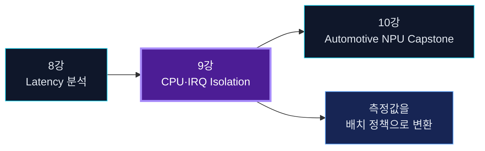

1~7강에서는 PREEMPT_RT 실행 모델, scheduler, rtmutex, threaded IRQ, timer/RCU, user-space RT loop를 학습했다. 8강에서는 `cyclictest`, `rtla timerlat`, `rtla osnoise`, ftrace로 latency를 원인별로 분해했다. 9강은 그 결과를 실제 CPU·IRQ·kernel worker 배치로 연결한다.

10강에서는 이 구성을 NPU 기반 E2E/VLA 자율주행 pipeline에 적용해 end-to-end timing budget과 fault injection을 검증한다.

---

## 2. 학습 목표

강의가 끝나면 다음을 수행할 수 있어야 한다.

1. CPU isolation과 단순 CPU affinity의 차이를 설명한다.
2. housekeeping CPU와 RT CPU의 역할을 정의한다.
3. cgroup v2 cpuset isolated partition과 `isolcpus=domain`의 차이를 설명한다.
4. `nohz_full`, RCU callback offload, unbound workqueue mask의 관계를 설명한다.
5. GICv3 hardware routing과 IRQ thread affinity를 함께 확인한다.
6. managed IRQ의 best-effort isolation과 제약을 판단한다.
7. RT throttling, `preempt=full/lazy`, console, debug option의 영향을 비교한다.
8. QEMU ARM64에서 baseline과 tuned profile을 동일 조건으로 측정한다.
9. Automotive NPU completion-to-controller path의 CPU/IRQ priority architecture를 설계한다.

---

## 3. 선수 지식 확인

다음 질문에 답할 수 있어야 한다.

- `SCHED_FIFO` priority 80 task와 priority 70 IRQ thread 중 누가 먼저 실행되는가?
- `/proc/irq/N/smp_affinity_list`는 무엇을 제어하는가?
- `rtla timerlat`의 IRQ latency와 thread latency는 각각 무엇을 의미하는가?
- PREEMPT_RT에서 `spinlock_t`와 `raw_spinlock_t`는 어떻게 다른가?
- `nohz_full`을 적용한 CPU에서 syscall을 반복하면 왜 noise가 다시 증가할 수 있는가?

답이 불명확하면 3강, 5강, 6강, 8강을 복습한다.

---

## 4. 왜 PREEMPT_RT만으로 jitter가 사라지지 않는가

PREEMPT_RT는 커널의 많은 실행 경로를 선점 가능하게 만들고 IRQ를 scheduler가 관리하는 thread로 이동한다. 그러나 scheduler가 관리할 수 있다는 것과 RT task가 항상 독점적인 CPU 환경을 얻는다는 것은 다르다.

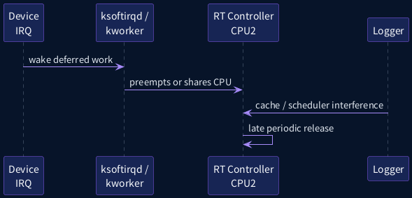

PREEMPT_RT 커널에서도 다음이 RT task와 같은 CPU에서 실행될 수 있다.

- 장치 IRQ thread
- `ksoftirqd/N`
- `ktimers/N`
- `rcuc/N`, `rcuo*`, RCU grace-period kthread
- per-CPU 또는 unbound `kworker`
- scheduler tick과 accounting work
- 일반 daemon과 logger
- page fault, syscall, memory reclaim
- host scheduler와 virtual timer delivery(QEMU)

따라서 latency의 긴 꼬리를 줄이려면 **중요하지 않은 실행을 다른 CPU로 옮기고, 반드시 필요한 실행만 RT CPU에 남기는 배치 설계**가 필요하다.

---

## 5. OS noise 분류

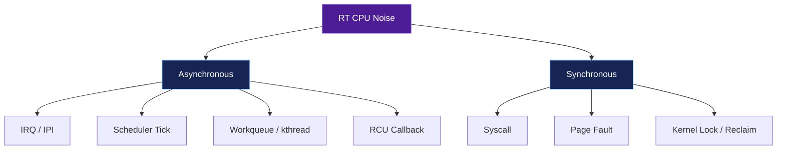

### 5.1 Asynchronous noise

RT task의 요청과 무관하게 발생한다.

- IRQ, IPI
- periodic scheduler tick
- timer callback
- RCU callback
- workqueue와 kernel thread
- scheduler load balancing
- console 출력

### 5.2 Synchronous noise

RT task가 kernel service를 요청해 발생한다.

- syscall
- page fault
- file I/O
- memory allocation
- lock contention
- futex wait/wake

CPU isolation은 asynchronous noise를 줄이는 데 특히 효과적이다. Synchronous noise는 application 설계를 함께 수정해야 한다.

---

## 6. 튜닝의 기본 절차

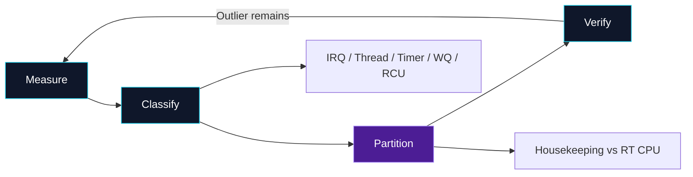

1. **Measure**: baseline의 Max, percentile, deadline miss를 수집한다.
2. **Classify**: IRQ, thread, SoftIRQ, timer, workqueue, RCU, application 중 원인을 분류한다.
3. **Partition**: task, IRQ, scheduler domain, tick, RCU, workqueue를 CPU별로 재배치한다.
4. **Verify**: workload·duration·frequency·console 조건을 고정해 다시 측정한다.

튜닝은 한 번에 모든 옵션을 켜는 작업이 아니다. 한 단계씩 변경하고 결과를 기록해야 인과관계를 설명할 수 있다.

---

## 7. Isolation은 하나의 스위치가 아니다

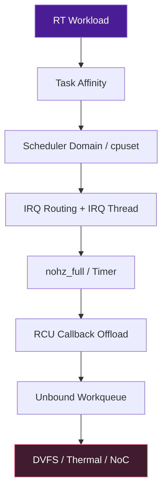

각 계층은 다른 종류의 noise를 다룬다.

| 계층 | 주요 인터페이스 | 줄이는 noise |
|---|---|---|
| Task affinity | `sched_setaffinity()`, `taskset` | 일반 task migration/competition |
| Scheduler domain | cpuset isolated partition, `isolcpus=domain` | load balancing |
| IRQ routing | `irqaffinity=`, `/proc/irq/N/*affinity*` | device interrupt |
| Full dynticks | `nohz_full=` | periodic scheduler tick |
| RCU callback | `rcu_nocbs=`, nohz_full implied offload | callback execution |
| Workqueue | `workqueue.unbound_cpus=`, sysfs cpumask | unbound kworker |
| Power/thermal | cpufreq/cpuidle/platform policy | wake and frequency jitter |

단일 옵션으로 이 모든 계층을 해결할 수 없다.

---

## 8. QEMU ARM64 실습 토폴로지

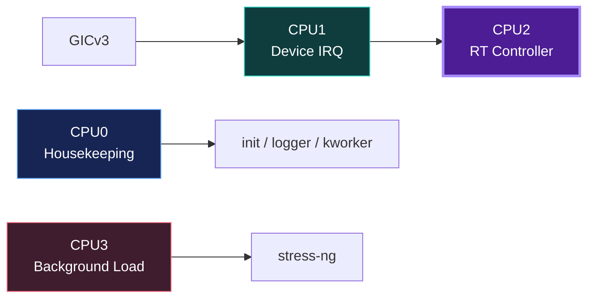

권장 4-vCPU 배치는 다음과 같다.

| CPU | 역할 | 예시 |
|---:|---|---|
| CPU0 | Housekeeping | init, shell, logger, global worker |
| CPU1 | Device IRQ | virtio-net, virtio-blk IRQ thread |
| CPU2 | RT workload | `SCHED_FIFO` periodic controller |
| CPU3 | Background load | `stress-ng`, 일반 processing |

QEMU의 절대 microsecond 값은 host scheduler와 virtual timer의 영향을 받는다. 이 환경에서는 call-flow, relative improvement, 실험 자동화를 학습한다. 제품 worst-case 보증은 target SoC에서 다시 수행해야 한다.

---

## 9. Housekeeping의 의미

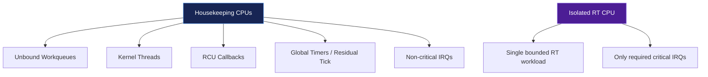

Housekeeping은 kernel service를 유지하기 위해 실행해야 하는 비실시간 또는 공통 작업이다. CPU isolation을 적용하면 해당 작업을 non-isolated CPU로 몰아준다.

대표적인 housekeeping 대상:

- unbound workqueue
- global timer와 residual accounting
- RCU callback
- 일반 kernel thread
- storage, logging, network management IRQ
- timekeeping과 scheduler housekeeping

RT CPU에는 다음만 남기는 것이 목표다.

- bounded RT application
- 반드시 필요한 critical IRQ 또는 그 결과를 받는 RT thread
- 최소한의 scheduler/architecture overhead

---

## 10. Linux source-reading map: housekeeping

기준 소스:

```text
kernel/sched/isolation.c
include/linux/sched/isolation.h
kernel/sched/core.c
kernel/time/tick-sched.c
kernel/rcu/tree.c
kernel/workqueue.c
```

`kernel/sched/isolation.c`는 boot parameter와 cpumask를 바탕으로 housekeeping type별 CPU mask를 유지한다. subsystem은 `housekeeping_cpumask(type)` 같은 helper를 통해 자신이 사용할 CPU 집합을 선택할 수 있다.

설계 관점에서 중요한 것은 `housekeeping`이 하나의 bool이 아니라 **work type별 mask**라는 점이다. IRQ, timer, workqueue, RCU의 이동 가능성은 서로 다르다.

Upstream source:

- `https://github.com/torvalds/linux/blob/7d0a66e4bb9081d75c82ec4957c50034cb0ea449/kernel/sched/isolation.c`
- `https://github.com/torvalds/linux/blob/7d0a66e4bb9081d75c82ec4957c50034cb0ea449/include/linux/sched/isolation.h`

---

## 11. Scheduler domain isolation

Scheduler domain isolation은 target CPU를 일반 load balancing topology에서 분리한다.

효과:

- scheduler가 임의로 일반 task를 RT CPU로 이동시키지 않는다.
- RT task가 다른 CPU로 자동 이동하지 않는다.
- isolated partition은 unbound workqueue에서도 제외될 수 있다.

주의:

- CPU가 여러 개인 isolated partition에 task를 넣는 것만으로 각 task의 CPU 배치가 결정되지는 않는다.
- RT task는 개별 CPU에 명시적으로 affinity를 주는 것이 안전하다.
- per-CPU kthread와 IRQ는 별도로 확인해야 한다.

---

## 12. cgroup v2 cpuset isolated partition

현재 문서에서는 runtime 재구성이 가능한 cgroup v2 cpuset partition을 scheduler-domain isolation의 권장 인터페이스로 설명한다.

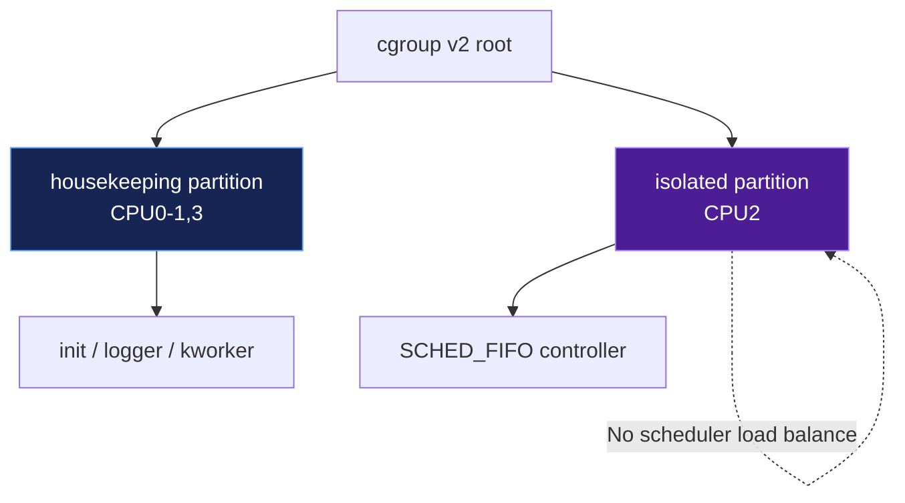

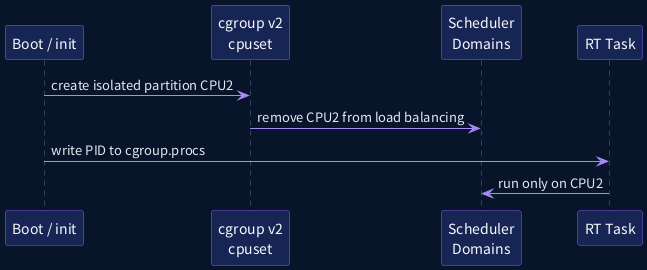

### 예제

```bash
mount -t cgroup2 none /sys/fs/cgroup
cd /sys/fs/cgroup

echo +cpuset > cgroup.subtree_control
mkdir rt-isolated

cat cpuset.mems.effective > rt-isolated/cpuset.mems
echo 2 > rt-isolated/cpuset.cpus
echo isolated > rt-isolated/cpuset.cpus.partition

# RT process를 partition으로 이동
echo "$PID" > rt-isolated/cgroup.procs
```

검증:

```bash
cat rt-isolated/cpuset.cpus.partition
cat rt-isolated/cpuset.cpus.effective
cat rt-isolated/cgroup.procs
```

`cpuset.cpus.partition`이 `isolated`이고 CPU2가 effective mask에 포함되어야 한다.

---

## 13. `isolcpus=domain`과 cpuset 비교

| 항목 | `isolcpus=domain` | cpuset v2 isolated partition |
|---|---|---|
| 적용 시점 | boot | runtime |
| 재구성 | 사실상 어려움 | 가능 |
| scheduler domain | boot에서 제거 | partition state로 제어 |
| 운영 자동화 | kernel cmdline 수정 필요 | init script/cgroup API |
| 권장 용도 | 단순한 고정 제품 구성 | 개발, 검증, 제품 runtime 정책 |

`isolcpus=domain`은 간단하지만 유연성이 낮다. 실습에서는 cpuset을 기본으로 사용하고, boot profile 비교를 위해 `isolcpus=domain`을 별도 시험한다.

예:

```text
isolcpus=domain,2
```

CPU 번호는 0부터 시작한다.

---

## 14. Task affinity

Task affinity는 task가 실행될 수 있는 CPU mask를 제한한다.

### User-space

```bash
taskset -c 2 ./rt_controller
chrt -f 85 taskset -c 2 ./rt_controller
```

### C API

```c
cpu_set_t set;

CPU_ZERO(&set);
CPU_SET(2, &set);

if (sched_setaffinity(0, sizeof(set), &set) == -1) {
    perror("sched_setaffinity");
    return EXIT_FAILURE;
}
```

### 확인

```bash
taskset -pc "$PID"
grep Cpus_allowed_list /proc/$PID/status
ps -eLo pid,tid,psr,cls,rtprio,pri,comm
```

Affinity는 **실행 가능 CPU**를 제한하지만 IRQ, kworker, RCU callback을 자동으로 제거하지 않는다.

---

## 15. Full Dynticks: `nohz_full`

Full dynticks는 CPU가 single runnable user-space task를 실행하는 동안 periodic scheduler tick을 가능한 범위에서 정지한다.

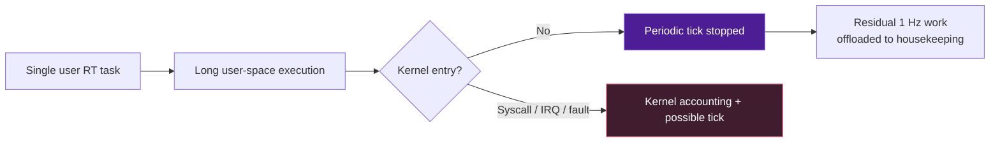

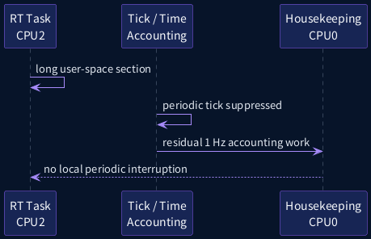

### 요구사항

```text
CONFIG_NO_HZ_FULL=y
stable clocksource
housekeeping CPU 존재
```

### Boot parameter

```text
nohz_full=2
```

### 적합한 workload

- 긴 user-space compute section
- syscall과 page fault가 적은 fixed-period task
- CPU 하나에 실질적으로 한 개의 critical task

---

## 16. `nohz_full`의 제약

`nohz_full`은 다음 상황에서 효과가 줄어든다.

- CPU에 runnable task가 여러 개 존재
- 빈번한 syscall
- page fault
- POSIX CPU timer 사용
- device IRQ가 계속 들어옴
- per-CPU kthread가 실행됨
- host VM scheduling pause

또한 residual accounting work는 housekeeping CPU가 대신 수행한다. 따라서 housekeeping CPU가 과부하되면 isolation 전체의 progress가 나빠질 수 있다.

---

## 17. RCU callback offload

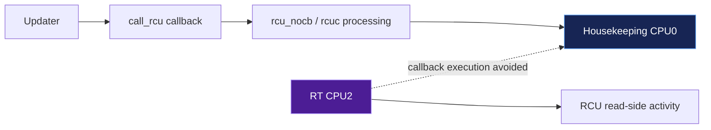

RCU callback을 RT CPU에서 다른 CPU의 callback thread로 이동하면 callback 실행 noise를 줄일 수 있다.

```text
rcu_nocbs=2
```

현행 kernel에서 `nohz_full=2`는 해당 CPU의 RCU callback offload를 함께 활성화한다. 따라서 다음 두 profile을 구분해 실습한다.

1. `rcu_nocbs=2`만 적용해 callback offload 효과 관찰
2. `nohz_full=2` 적용 후 tick suppression과 implied RCU offload 관찰

다음 thread를 확인한다.

```bash
ps -eLo pid,tid,psr,cls,rtprio,pri,comm |     grep -E 'rcuc|rcuo|rcuog|rcuop'
```

---

## 18. IRQ isolation 개요

IRQ isolation은 장치 interrupt가 RT CPU에 도착하지 않게 하는 작업이다.

주요 인터페이스:

```text
irqaffinity=<housekeeping-cpu-list>
/proc/irq/N/smp_affinity
/proc/irq/N/smp_affinity_list
/proc/irq/N/effective_affinity_list
isolcpus=managed_irq,<cpu-list>
```

IRQ affinity가 지원되지 않거나 per-CPU interrupt라면 이동할 수 없다. ARM generic timer PPI처럼 각 CPU에 고정된 interrupt도 별도로 이해해야 한다.

---

## 19. `irqaffinity=`와 per-IRQ affinity

### Boot default

```text
irqaffinity=0-1,3
```

새로 활성화되는 일반 IRQ의 기본 target mask를 housekeeping CPU로 제한한다.

### Runtime per-IRQ

```bash
echo 1 > /proc/irq/42/smp_affinity_list
```

이는 Linux IRQ 42가 CPU1에서 처리될 수 있도록 요청한다.

주의:

- IRQ controller가 affinity 변경을 지원해야 한다.
- managed IRQ는 kernel이 mask를 관리하므로 일반 proc interface가 제한될 수 있다.
- configured mask와 실제 hardware target이 다를 수 있으므로 effective mask를 확인한다.

---

## 20. Configured affinity와 effective affinity

```text
smp_affinity_list
    관리자가 요청한 허용 CPU mask

effective_affinity_list
    irqchip이 실제로 적용한 CPU mask
```

예:

```bash
cat /proc/irq/42/smp_affinity_list
cat /proc/irq/42/effective_affinity_list
```

GICv3 SPI가 single target 방식으로 route되면 configured mask가 여러 CPU여도 effective mask는 하나의 CPU일 수 있다.

---

## 21. Hardware routing과 IRQ thread affinity

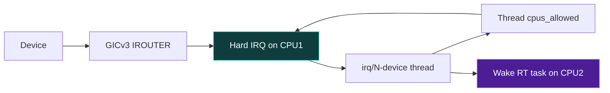

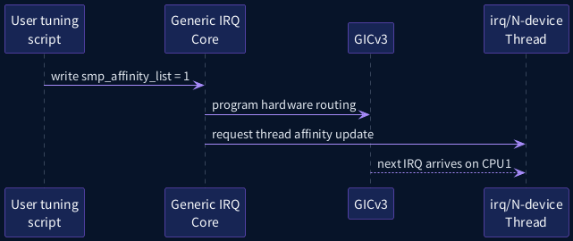

PREEMPT_RT에서는 두 affinity를 함께 이해해야 한다.

1. **Hardware interrupt routing**: GICv3가 hard IRQ를 어느 CPU로 전달하는가?
2. **IRQ thread affinity**: `irq/N-device` task가 어느 CPU에서 실행 가능한가?

Generic IRQ core는 affinity 변경 후 IRQ thread에도 affinity update를 요청한다. 실습에서는 hardware effective affinity와 thread의 `Cpus_allowed_list`를 모두 확인한다.

```bash
IRQ=42
cat /proc/irq/$IRQ/effective_affinity_list
PID=$(pgrep -f "^irq/$IRQ-")
grep Cpus_allowed_list /proc/$PID/status
```

---

## 22. Managed IRQ

Managed IRQ는 queue와 CPU topology를 기반으로 kernel이 affinity를 관리하는 interrupt다. 다중 queue storage/network device에서 흔하다.

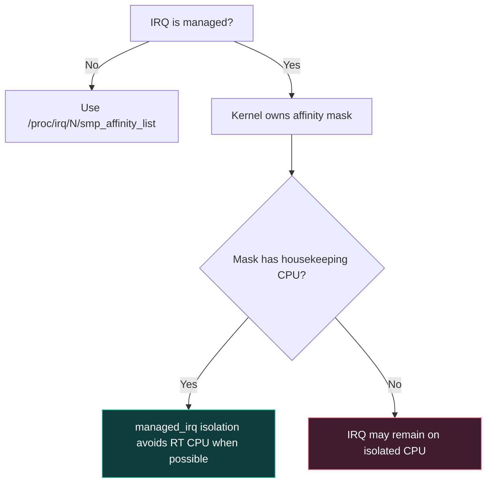

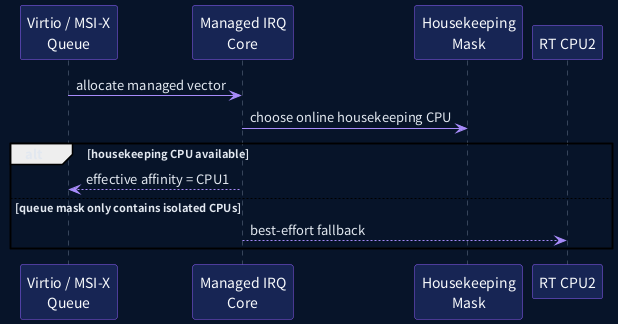

`isolcpus=managed_irq,2`는 managed interrupt가 CPU2를 피하도록 **best effort**로 요청한다.

중요한 제약:

- managed IRQ의 affinity mask가 housekeeping CPU를 포함해야 피할 수 있다.
- queue mask 자체가 isolated CPU만 포함하면 interrupt가 RT CPU에 남을 수 있다.
- 모든 CPU가 offline되는 경우 managed vector가 shutdown될 수 있다.
- `/proc/irq/N/smp_affinity_list`를 임의 변경할 수 없는 경우가 있다.

---

## 23. QEMU virtio IRQ 실습

QEMU `virt`에서 virtio device를 사용하면 다음을 관찰할 수 있다.

```text
virtio-net / virtio-blk
    -> GICv3 interrupt
    -> Linux virq
    -> threaded IRQ
    -> SoftIRQ / workqueue
    -> user-space completion
```

실습 절차:

```bash
cat /proc/interrupts
./02_find_target_irq.sh virtio   # 이전 강의 도구를 재사용 가능

IRQ=<selected-linux-irq>
echo 1 > /proc/irq/$IRQ/smp_affinity_list

cat /proc/irq/$IRQ/effective_affinity_list
ps -eLo pid,tid,psr,cls,rtprio,comm | grep "irq/$IRQ"
```

QEMU에서 PCI/MSI-X device를 추가했다면 managed IRQ 사례도 실습할 수 있다. 기본 MMIO virtio 구성에서는 interrupt topology가 단순할 수 있으므로 장치 옵션에 따라 결과를 기록한다.

---

## 24. `irqbalance` 주의

제품 또는 distribution에서 `irqbalance` daemon이 실행되면 수동 affinity가 다시 변경될 수 있다.

검사:

```bash
pgrep irqbalance
```

대응:

- RT 검증 중 daemon을 중지
- banned CPU mask 또는 policy를 명시
- 변경 후 일정 시간이 지나도 affinity가 유지되는지 확인

Buildroot image에 `irqbalance`가 없다면 해당 간섭은 없지만, 실제 product image에서는 반드시 확인한다.

---

## 25. Unbound workqueue noise

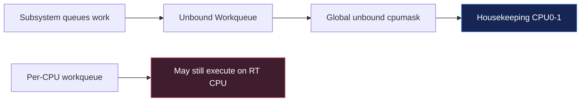

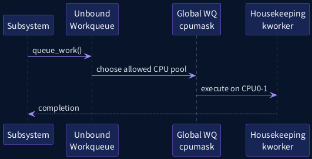

Unbound workqueue는 scheduler가 선택한 worker pool에서 실행된다. 별도 제한이 없으면 isolated CPU가 선택될 가능성을 점검해야 한다.

Boot-time global mask:

```text
workqueue.unbound_cpus=0-1,3
```

Runtime global mask가 제공되는 kernel:

```bash
cat /sys/devices/virtual/workqueue/cpumask
echo 0-1,3 > /sys/devices/virtual/workqueue/cpumask
```

개별 `WQ_SYSFS` workqueue는 sysfs의 own cpumask를 제공할 수 있다.

---

## 26. Per-CPU workqueue의 제약

Global unbound mask는 **unbound workqueue**를 제한한다. 다음은 별도 문제다.

- per-CPU workqueue
- CPU-pinned kthread
- timer pinned to RT CPU
- IRQ-local deferred work

따라서 `kworker` 이름만 보고 unbound라고 단정하지 않는다. ftrace `workqueue_queue_work`와 `workqueue_execute_start`를 사용해 어떤 work item이 어느 CPU에서 실행되는지 확인한다.

---

## 27. Timer와 per-CPU kthread housekeeping

6강에서 배운 다음 thread를 다시 확인한다.

```text
ksoftirqd/N
ktimers/N
rcuc/N
rcuo*
kworker/N:*
```

RT CPU에서 이 thread가 실행되는 원인은 다양하다.

- 해당 CPU에서 SoftIRQ가 raise됨
- pinned timer 존재
- per-CPU workqueue 사용
- RCU read-side activity와 grace-period progress
- affinity가 이동 불가능한 kernel thread

모든 thread를 무조건 다른 CPU로 이동시키면 forward progress가 깨질 수 있다. 원인과 dependency를 분석한 뒤 이동한다.

---

## 28. RT throttling

시스템-wide interface:

```text
/proc/sys/kernel/sched_rt_period_us
/proc/sys/kernel/sched_rt_runtime_us
```

일반적인 기본값:

```text
period  = 1,000,000 us
runtime =   950,000 us
```

이는 runaway RT workload가 모든 일반 task를 영구 starvation시키지 않도록 일부 CPU 시간을 남긴다.

```bash
cat /proc/sys/kernel/sched_rt_period_us
cat /proc/sys/kernel/sched_rt_runtime_us
```

`runtime=-1`은 제한을 제거하지만 제품에서는 recovery path와 kernel progress를 별도로 보장해야 한다.

---

## 29. RT throttling 튜닝 원칙

다음 변경은 위험하다.

```bash
echo -1 > /proc/sys/kernel/sched_rt_runtime_us
```

위 설정은 RT task가 block하지 않으면 shell, logger, RCU, workqueue, watchdog thread를 starvation시킬 수 있다.

권장 절차:

1. 기존 value 저장
2. bounded test duration 사용
3. serial/SSH recovery path 준비
4. RT loop가 반드시 sleep 또는 block하는지 검증
5. test 종료 후 원복
6. `sched_switch`, RCU stall, workqueue backlog 확인

---

## 30. `preempt=full`과 `preempt=lazy`

PREEMPT_RT 커널에서 runtime preemption mode를 비교할 수 있는 구성이라면 다음을 시험한다.

```text
preempt=full
preempt=lazy
```

- RT/DL wake-up은 즉각적인 preemption을 유지한다.
- lazy mode는 일반 fair task의 in-kernel preemption을 일부 지연해 context-switch와 lock-holder preemption을 줄일 수 있다.
- throughput, cache locality, power, RT tail latency를 함께 측정해야 한다.

VLA orchestration과 logging이 `SCHED_OTHER`, controller가 `SCHED_FIFO`인 통합 시스템에서 의미 있는 비교가 된다.

---

## 31. DVFS, cpuidle, thermal

CPU partition만으로 다음을 해결할 수 없다.

- deep idle exit latency
- DVFS transition
- thermal throttling
- shared LLC contention
- DRAM/NoC bandwidth contention
- GPU/NPU DMA burst

QEMU에서는 실제 SoC power/thermal behavior를 재현할 수 없다. target SoC에서는 다음을 별도 matrix로 시험한다.

```text
performance governor vs dynamic governor
shallow idle vs deep idle
cold vs thermal steady state
NPU idle vs maximum DMA workload
```

---

## 32. Console과 `printk()`

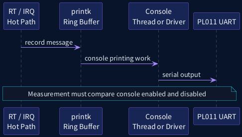

`printk()`는 ring buffer 기록과 console 출력으로 나눠 생각해야 한다. PREEMPT_RT와 nbcon 지원이 발전했지만 console driver와 kernel version에 따라 실제 출력 경로가 다를 수 있다.

측정 원칙:

- RT hot path에서 반복 `printk()` 금지
- `pr_*_ratelimited()` 사용
- console loglevel 제한
- PL011 console enabled/disabled 비교
- trace buffer 또는 fixed memory log 사용

QEMU boot profile 예:

```text
console enabled:
console=ttyAMA0 loglevel=7

reduced console:
console=ttyAMA0 loglevel=3 quiet

measurement comparison:
console output를 제거한 별도 boot/profile
```

완전히 console을 제거하면 recovery와 관찰성이 낮아진다. debug profile과 measurement profile을 분리한다.

---

## 33. Debug kernel과 measurement kernel

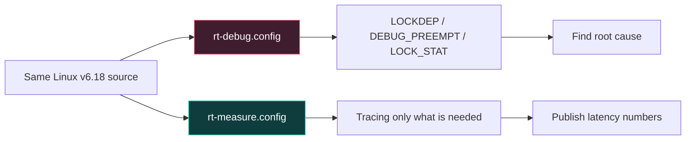

### Debug profile

```text
CONFIG_DEBUG_PREEMPT=y
CONFIG_PROVE_LOCKING=y
CONFIG_LOCK_STAT=y
CONFIG_DEBUG_ATOMIC_SLEEP=y
CONFIG_FUNCTION_GRAPH_TRACER=y
```

### Measurement profile

```text
CONFIG_PROVE_LOCKING=n
CONFIG_LOCK_STAT=n
CONFIG_DEBUG_ATOMIC_SLEEP=n
CONFIG_DEBUG_PREEMPT=n
CONFIG_OSNOISE_TRACER=y
CONFIG_TIMERLAT_TRACER=y
```

Debug feature는 latency의 원인을 찾는 데 유용하지만 overhead를 포함한다. Debug kernel에서 얻은 Max latency를 제품 수치로 발표하면 안 된다.

---

## 34. Driver RT audit

다음 pattern을 source에서 검색한다.

```bash
git grep -n 'raw_spin_lock' drivers/
git grep -n 'local_irq_disable' drivers/
git grep -n 'while.*readl' drivers/
git grep -n 'printk\|pr_info' drivers/
git grep -n 'dma_fence_wait' drivers/
```

점검 항목:

- 긴 `raw_spinlock_t` critical section
- IRQ-disabled loop
- threaded IRQ의 unbounded wait
- IRQ thread의 dynamic allocation
- DMA fence timeout 없음
- completion path의 console logging
- `spin_lock()`이 preemption을 disable한다고 가정
- `local_bh_disable()`만으로 per-CPU data 보호
- workqueue에 critical deadline path를 무조건 넘김

---

## 35. 실험 Matrix

튜닝 전후 비교는 다음 축을 고정하거나 명시적으로 변화시킨다.

| 축 | 값 예시 |
|---|---|
| Kernel | RT debug / RT measurement |
| Preemption mode | full / lazy |
| CPU partition | none / cpuset isolated |
| IRQ affinity | default / CPU1 |
| Workqueue mask | all / housekeeping |
| Tick | normal / nohz_full CPU2 |
| Console | verbose / quiet / disabled |
| Load | idle / CPU / network / mixed |
| Duration | 60s / 30min / endurance |

최종 보고서는 한 번의 Max 값이 아니라 여러 반복의 percentile과 deadline miss count를 포함한다.

---

## 36. Boot profile 예제

### Baseline

```text
console=ttyAMA0 rdinit=/sbin/init
```

### Tuned profile: cpuset은 runtime 적용

```text
console=ttyAMA0 rdinit=/sbin/init
nohz_full=2
irqaffinity=0-1,3
isolcpus=managed_irq,2
workqueue.unbound_cpus=0-1,3
preempt=full
```

`nohz_full=2`는 current kernel에서 RCU callback offload를 포함한다. 별도 RCU 비교를 위해 `rcu_nocbs=2`만 적용한 profile도 시험한다.

`isolcpus=domain,2`는 cpuset isolated partition과 중복해 사용하지 않고 별도 profile로 비교한다.

---

## 37. Runtime tuning script

```bash
RT_CPU=2
IRQ_CPU=1
HK_CPUS=0-1,3

# RT task
taskset -pc "$RT_CPU" "$RT_PID"
chrt -f -p 85 "$RT_PID"

# Device IRQ
for irq in $TARGET_IRQS; do
    echo "$IRQ_CPU" > /proc/irq/$irq/smp_affinity_list
done

# Global unbound workqueues, when available
echo "$HK_CPUS" > /sys/devices/virtual/workqueue/cpumask

# Background load
taskset -c 3 stress-ng --cpu 1 --timeout 60s
```

변경 전 value를 저장하고 test 종료 시 원복하는 production-quality script를 작성한다.

---

## 38. Lab A: Baseline inventory

```bash
./01_runtime_inventory.sh
```

수집해야 할 파일:

```text
uname.txt
cmdline.txt
interrupts.txt
softirqs.txt
tasks.txt
irq-affinity.txt
workqueue-cpumask.txt
rtla-osnoise.txt
rtla-timerlat.txt
cyclictest.txt
```

각 file에 absolute timestamp와 git/kernel build ID를 기록한다.

---

## 39. Lab B: CPU와 IRQ partition

1. CPU2에 RT task 고정
2. CPU1에 target IRQ 고정
3. CPU3에 background workload 고정
4. CPU0에 shell/logger 유지
5. IRQ thread priority를 system hierarchy에 맞게 조정

```bash
./02_create_cpuset_partition.sh 2
./03_set_irq_affinity.sh "$IRQ" 1
./04_set_irq_priority.sh "$IRQ" 75

echo "$RT_PID" > /sys/fs/cgroup/rt-isolated/cgroup.procs
chrt -f -p 85 "$RT_PID"
```

`effective_affinity_list`와 IRQ thread `Cpus_allowed_list`를 모두 기록한다.

---

## 40. Lab C: Tick, RCU, workqueue

Profile을 분리한다.

```text
A: baseline
B: rcu_nocbs=2
C: nohz_full=2
D: nohz_full=2 + workqueue.unbound_cpus=0-1,3
```

관찰:

```bash
cat /proc/cmdline
cat /sys/devices/system/cpu/nohz_full 2>/dev/null || true
cat /sys/devices/virtual/workqueue/cpumask 2>/dev/null || true
ps -eLo pid,tid,psr,cls,rtprio,comm | grep -E 'rcuc|rcuo|kworker|ktimers'
```

`rtla osnoise`로 CPU2의 interruption source가 어떻게 바뀌는지 비교한다.

---

## 41. Lab D: `preempt=full` vs `preempt=lazy`

동일한 RT kernel image에서 boot parameter만 변경할 수 있는 구성이면 가장 공정한 비교가 가능하다.

측정:

- RT task release latency
- IRQ thread wake-up latency
- mixed workload throughput
- context switch count
- Max/P99.9 latency

RT task는 같은 priority와 CPU affinity를 사용해야 한다.

---

## 42. Lab E: PL011 console

다음 두 조건을 비교한다.

```text
A: verbose console + workload logging
B: quiet console + hot-path logging 제거
```

Trace marker나 memory buffer를 사용해 measurement path에서 console output을 제거한다.

주의: console을 끄면 부팅 실패와 panic 관찰이 어려우므로 serial recovery profile을 별도로 유지한다.

---

## 43. `rtla` before/after

```plantuml
@startuml
skinparam backgroundColor #071429
skinparam defaultFontName "Noto Sans CJK KR"
skinparam defaultFontColor #E2E8F0
skinparam sequenceArrowColor #A78BFA
skinparam sequenceLifeLineBorderColor #64748B
skinparam sequenceLifeLineBackgroundColor #0F172A
skinparam participantBorderColor #8B5CF6
skinparam participantBackgroundColor #172554
skinparam participantFontColor #F8FAFC
skinparam noteBackgroundColor #0F172A
skinparam noteBorderColor #22D3EE
skinparam noteFontColor #E2E8F0
skinparam shadowing false
participant "Test Runner" as T
participant "Baseline\nKernel" as B
participant "Tuned\nKernel" as K
participant "Report" as R
T -> B: rtla osnoise / timerlat
B --> R: IRQ, softirq, thread noise
T -> K: same workload and duration
K --> R: tuned distributions
R -> R: compare Max, P99.9, misses
@enduml
```

```bash
./06_run_rtla_before_after.sh 60 2 baseline
# tuning 적용
./06_run_rtla_before_after.sh 60 2 tuned
```

비교할 지표:

```text
Timer IRQ Max
Timer Thread Max
osnoise runtime
IRQ interference count/time
SoftIRQ interference count/time
Thread interference count/time
Deadline miss count
```

한 지표가 개선되면서 다른 지표가 악화될 수 있다. 예를 들어 IRQ를 CPU1로 몰아 CPU1 backlog가 커질 수 있으므로 system-wide view도 유지한다.

---

## 44. Automotive NPU CPU partition

```mermaid
flowchart TB
    subgraph HK["CPU0 Housekeeping"]
      LOG["Logging / OTA / storage"]
    end
    subgraph IRQC["CPU1 IRQ Domain"]
      CAM["Camera IRQ P75"]
      NPU["NPU IRQ P80"]
    end
    subgraph RTC["CPU2 RT Domain"]
      SAFE["Safety P90"]
      CTRL["Controller P85"]
    end
    subgraph BG["CPU3 Model Support"]
      PRE["Pre/Post processing"]
    end
    CAM --> PRE --> NPU --> CTRL --> SAFE
    style RTC fill:#2E1065,stroke:#A78BFA,color:#FFFFFF
    style HK fill:#172554,stroke:#60A5FA,color:#FFFFFF
```

예시 구조:

```text
CPU0 Housekeeping
    logging, storage, OTA, diagnostics

CPU1 IRQ domain
    camera/ISP IRQ P75
    NPU completion IRQ P80

CPU2 RT domain
    safety monitor P90
    trajectory controller P85

CPU3 model support
    bounded pre/post processing
```

VLA reasoning 전체를 CPU2의 가장 높은 RT priority로 실행하면 controller와 safety monitor가 방해받을 수 있다. Model orchestration과 fast control loop를 분리한다.

---

## 45. NPU completion-to-controller sequence

```plantuml
@startuml
skinparam backgroundColor #071429
skinparam defaultFontName "Noto Sans CJK KR"
skinparam defaultFontColor #E2E8F0
skinparam sequenceArrowColor #A78BFA
skinparam sequenceLifeLineBorderColor #64748B
skinparam sequenceLifeLineBackgroundColor #0F172A
skinparam participantBorderColor #8B5CF6
skinparam participantBackgroundColor #172554
skinparam participantFontColor #F8FAFC
skinparam noteBackgroundColor #0F172A
skinparam noteBorderColor #22D3EE
skinparam noteFontColor #E2E8F0
skinparam shadowing false
participant "NPU" as NPU
participant "NPU IRQ\nCPU1 P80" as IRQ
participant "Controller\nCPU2 P85" as CTRL
participant "Safety\nCPU2 P90" as SAFE
participant "Vehicle I/O" as IO
NPU -> IRQ: completion interrupt
IRQ -> CTRL: publish result and wake
CTRL -> CTRL: freshness + trajectory update
CTRL -> SAFE: proposed command
SAFE -> IO: validated command
@enduml
```

Priority 관계:

```text
Safety P90
    > Controller P85
    > NPU IRQ P80
    > Camera IRQ P75
    > Dispatch P70
    > Background SCHED_OTHER
```

이 관계는 예시이며 실제 값은 WCET와 response-time analysis로 결정한다.

관찰 timestamp:

```text
T0 NPU hardware complete
T1 NPU hard IRQ entry
T2 IRQ thread start
T3 result publish
T4 controller start
T5 safety validation
T6 vehicle command TX
```

PREEMPT_RT와 CPU isolation은 주로 `T1-T4`의 CPU-side jitter를 줄인다. NPU execution, DRAM contention, firmware queue는 별도 분석 대상이다.

---

## 46. Debugging decision tree

```mermaid
flowchart TD
    S["Latency spike"] --> I{"IRQ latency high?"}
    I -->|"Yes"| A["IRQ-off / raw lock / firmware / host VM"]
    I -->|"No"| T{"Thread latency high?"}
    T -->|"Yes"| B["Priority / affinity / competing task / throttle"]
    T -->|"No"| E{"E2E latency only?"}
    E -->|"Yes"| C["NPU queue / DMA / memory / application"]
    E -->|"No"| D["Recheck timestamp and measurement overhead"]
    style S fill:#4C1D95,stroke:#A78BFA,color:#FFFFFF
    style A fill:#3F1D2E,stroke:#FB7185,color:#FFFFFF
    style B fill:#172554,stroke:#60A5FA,color:#FFFFFF
```

### IRQ latency가 높다

- IRQ disabled section
- 긴 raw spinlock
- architecture/firmware interrupt
- host VM pause
- clockevent delivery

### Thread latency가 높다

- priority hierarchy 오류
- affinity overlap
- RT throttling
- competing RT task
- lock owner / PI chain

### Linux RT metric은 정상인데 E2E만 높다

- accelerator queue
- DMA fence
- memory bandwidth
- stale application result
- timestamp domain mismatch

---

## 47. 성능·안전·보안 고려사항

### 성능

- CPU isolation은 전체 throughput을 낮출 수 있다.
- IRQ를 한 CPU에 집중하면 queue backlog가 증가할 수 있다.
- `nohz_full`은 kernel entry/exit accounting cost를 높일 수 있다.

### 기능 안전

- PREEMPT_RT와 CPU isolation은 ISO 26262 인증을 자동 제공하지 않는다.
- deadline monitor와 fallback은 independent safety domain에서 검토한다.
- CPU/IRQ priority table을 safety requirement와 추적 가능하게 관리한다.

### 보안

- isolation을 위해 security monitor, watchdog, audit thread를 starvation시키면 안 된다.
- debug interface와 privileged tuning script의 접근권한을 제한한다.
- `CAP_SYS_NICE`, cgroup, sysfs write permission을 최소화한다.

---

## 48. 핵심 요약

1. CPU affinity만으로는 CPU isolation이 완성되지 않는다.
2. Scheduler domain, IRQ, tick, RCU, workqueue를 계층별로 분리해야 한다.
3. cpuset v2 isolated partition은 runtime 조정이 가능한 scheduler-domain interface다.
4. `nohz_full`은 single user task에 가장 효과적이며 syscall/IRQ가 많으면 효과가 줄어든다.
5. IRQ의 configured affinity와 effective affinity를 모두 확인한다.
6. Managed IRQ isolation은 best effort다.
7. Unbound workqueue mask와 per-CPU work는 별개다.
8. Debug kernel과 measurement kernel을 분리한다.
9. Console과 logging 조건을 measurement metadata에 기록한다.
10. QEMU 결과는 relative comparison이고 target SoC에서 worst-case를 재검증한다.

---

## 49. 퀴즈

### 객관식 1

CPU2에 `taskset`으로 RT task를 고정했다. 다음 중 자동으로 보장되지 않는 것은?

A. RT task의 실행 가능 CPU가 CPU2로 제한됨  
B. 모든 device IRQ가 CPU2를 피함  
C. RT task가 CPU2에서 실행됨  
D. `/proc/PID/status`에서 affinity를 확인할 수 있음

### 객관식 2

cgroup v2 `cpuset.cpus.partition=isolated`의 핵심 효과는?

A. NPU firmware queue를 preempt함  
B. CPU를 scheduler load balancing domain에서 분리함  
C. 모든 hard IRQ를 disable함  
D. DRAM QoS를 설정함

### 객관식 3

다음 중 managed IRQ에 대한 올바른 설명은?

A. 항상 `/proc/irq/N/smp_affinity_list`로 자유롭게 변경 가능  
B. `isolcpus=managed_irq`는 모든 경우에 강제 isolation을 보장  
C. Kernel이 queue/CPU topology를 바탕으로 affinity를 관리하며 isolation은 best effort  
D. PREEMPT_RT에서는 managed IRQ가 존재하지 않음

### 객관식 4

`WQ_HIGHPRI`에 대한 올바른 설명은?

A. SCHED_FIFO P99를 의미  
B. 높은 nice level worker pool이며 hard real-time 보장은 아님  
C. Hard IRQ 문맥에서 실행  
D. 자동으로 isolated CPU를 피함

### O/X 5

`nohz_full=2`를 설정하면 CPU2에서 syscall과 page fault가 발생해도 항상 scheduler tick noise가 완전히 사라진다.

### O/X 6

PREEMPT_RT measurement 결과를 발표할 때 LOCKDEP가 활성화된 debug kernel인지 기록해야 한다.

### 단답형 7

관리자가 요청한 IRQ mask와 irqchip이 실제 적용한 mask를 각각 보여주는 두 파일은?

### 단답형 8

현재 kernel에서 `nohz_full` CPU에 대해 함께 수행되는 대표적인 RCU 최적화는?

### 시나리오 9

`rtla timerlat`에서 IRQ latency는 낮지만 thread latency가 높다. 우선 확인할 세 가지를 쓰시오.

### 시나리오 10

NPU completion IRQ는 CPU1, controller는 CPU2에 배치했다. 그런데 E2E latency만 증가했다. Linux scheduling 외에 확인할 네 가지를 쓰시오.

---

## 50. 정답과 해설

1. **B**. Task affinity는 device IRQ routing을 자동으로 바꾸지 않는다.
2. **B**. Isolated partition은 scheduler load balancing이 없는 partition root다.
3. **C**. Managed IRQ의 mask와 effective target은 kernel이 관리하며 isolation은 mask topology에 따라 best effort다.
4. **B**. `WQ_HIGHPRI`는 elevated nice worker pool이지 `SCHED_FIFO` 계약이 아니다.
5. **X**. Kernel entry, IRQ, fault, 다중 runnable task는 tick과 accounting noise를 다시 만들 수 있다.
6. **O**. Debug option은 측정 overhead에 직접 영향을 준다.
7. `/proc/irq/N/smp_affinity_list`, `/proc/irq/N/effective_affinity_list`.
8. RCU callback offload, 즉 `rcu_nocbs`에 준하는 callback processing 분리.
9. Priority hierarchy, CPU affinity overlap, RT throttling을 우선 확인하고 competing task와 PI lock도 이어서 본다.
10. NPU queue/firmware scheduling, DMA fence, DRAM/NoC contention, stale result 또는 timestamp domain을 확인한다.

---

## 51. 5분 복습 질문

1. Housekeeping CPU란 무엇인가?
2. CPU affinity와 scheduler-domain isolation의 차이는?
3. cpuset isolated partition의 장점은?
4. `nohz_full`에 적합한 workload는?
5. `rcu_nocbs`의 목적은?
6. `irqaffinity=`와 per-IRQ affinity의 차이는?
7. `effective_affinity_list`가 필요한 이유는?
8. Managed IRQ isolation이 best effort인 이유는?
9. Global unbound workqueue mask가 해결하지 못하는 것은?
10. Debug kernel 수치를 final performance로 사용하면 안 되는 이유는?
11. `preempt=lazy`를 비교할 때 유지해야 할 조건은?
12. QEMU latency 결과를 target WCET로 사용할 수 없는 이유는?

---

## 52. Flashcard

| 앞면 | 뒷면 |
|---|---|
| Housekeeping CPU | Kernel 공통 noise를 처리하는 non-isolated CPU |
| cpuset isolated partition | Load balancing이 없는 cgroup v2 partition |
| `isolcpus=domain` | Boot-time scheduler-domain isolation |
| `nohz_full` | Single user task 실행 중 periodic tick을 가능한 범위에서 중지 |
| `rcu_nocbs` | RCU callback을 해당 CPU 밖의 callback processing으로 offload |
| `irqaffinity=` | 일반 IRQ의 boot-time default affinity |
| `smp_affinity_list` | 관리자가 요청한 IRQ CPU list |
| `effective_affinity_list` | irqchip이 실제 적용한 IRQ CPU list |
| Managed IRQ | Kernel이 queue topology와 CPU mask를 관리하는 IRQ |
| `workqueue.unbound_cpus` | Unbound workqueue가 사용할 global CPU list |
| RT throttling | Period 내 RT class CPU runtime 상한 |
| Measurement kernel | Debug overhead를 최소화한 latency 검증 build |
| `preempt=lazy` | 일반 task의 일부 in-kernel preemption을 지연하는 mode |
| Action age | Sensor capture부터 command 사용까지의 결과 나이 |
| Freedom from interference | 중요한 기능이 다른 workload의 간섭으로 실패하지 않도록 하는 설계 목표 |

---

## 53. 빈칸 채우기

1. `/proc/irq/N/__________`는 관리자가 요청한 CPU list다.
2. `/proc/irq/N/__________`는 실제 irqchip routing 결과를 보여준다.
3. `nohz_full`은 CPU에 runnable user task가 ______개일 때 가장 효과적이다.
4. `WQ_HIGHPRI`는 `SCHED______`를 의미하지 않는다.
5. Debug kernel과 ______ kernel의 latency 결과를 분리해야 한다.

정답: `smp_affinity_list`, `effective_affinity_list`, `1`, `FIFO`, `measurement`.

---

## 54. 실습 과제

### 과제 1: Before/After Report

CPU2의 baseline과 tuned profile을 각각 5회 측정한다.

```text
cyclictest Max / Avg
rtla timerlat IRQ / Thread Max
rtla osnoise interference summary
Deadline miss count
```

변경한 kernel parameter, affinity, console, load를 table로 기록한다.

### 과제 2: Managed IRQ Investigation

QEMU에 multiqueue virtio device를 구성하고 managed IRQ인지 확인한다. `smp_affinity_list`와 `effective_affinity_list`를 CPU online/offline 또는 isolation profile에 따라 비교한다.

### 과제 3: Driver Audit

사용 중인 NPU 또는 mock NPU driver에서 다음을 조사한다.

- IRQ registration flag
- IRQ thread priority/affinity
- completion path의 workqueue 사용
- raw spinlock 최대 critical section
- DMA fence timeout
- logging 위치

### 과제 4: Console Impact

PL011 console verbose/quiet 조건에서 동일한 mixed load test를 수행하고 Max latency와 trace size를 비교한다.

---

## 55. 다음 강의 전 체크리스트

- [ ] CPU0-3의 역할이 문서화되어 있다.
- [ ] RT task의 affinity와 policy를 확인했다.
- [ ] Target IRQ의 configured/effective affinity를 확인했다.
- [ ] IRQ thread priority를 기록했다.
- [ ] nohz_full/RCU/workqueue profile을 분리해 측정했다.
- [ ] Debug와 measurement kernel을 구분했다.
- [ ] Console 조건을 기록했다.
- [ ] QEMU 결과를 target 보증치로 해석하지 않았다.

---

## 56. 다음 강의 예고

10강에서는 다음 mock NPU pipeline을 구성한다.

```text
Sensor event
-> mock NPU submit
-> execution delay
-> GICv3 completion IRQ
-> threaded IRQ
-> trajectory publish
-> 100 Hz controller
-> safety monitor
-> deadline/freshness fault injection
```

9강에서 만든 CPU/IRQ partition을 사용해 tuned/untuned end-to-end latency를 비교한다.

---

## 57. Reference와 Source Reading Map

### 공식 문서

- CPU Isolation: `https://docs.kernel.org/admin-guide/cpu-isolation.html`
- Kernel parameters: `https://docs.kernel.org/6.18/admin-guide/kernel-parameters.html`
- SMP IRQ affinity: `https://docs.kernel.org/core-api/irq/irq-affinity.html`
- Managed IRQ: `https://docs.kernel.org/core-api/irq/managed_irq.html`
- Workqueue: `https://docs.kernel.org/core-api/workqueue.html`
- RT group scheduling: `https://docs.kernel.org/scheduler/sched-rt-group.html`
- PREEMPT_RT differences: `https://docs.kernel.org/core-api/real-time/differences.html`
- cgroup v2 cpuset partition: `https://docs.kernel.org/admin-guide/cgroup-v2.html`

### Linux v6.18 source

- `kernel/sched/isolation.c`
- `include/linux/sched/isolation.h`
- `kernel/sched/core.c`
- `kernel/sched/rt.c`
- `kernel/irq/manage.c`
- `drivers/irqchip/irq-gic-v3.c`
- `kernel/workqueue.c`
- `kernel/rcu/tree.c`
- `kernel/time/tick-sched.c`
- `kernel/printk/printk.c`
- `drivers/tty/serial/amba-pl011.c`

Source URL prefix:

```text
https://github.com/torvalds/linux/blob/7d0a66e4bb9081d75c82ec4957c50034cb0ea449/
```

---

## 부록 A. 권장 kernel config fragment

```text
CONFIG_PREEMPT_RT=y
CONFIG_PREEMPT_DYNAMIC=y
CONFIG_SMP=y
CONFIG_CPUSETS=y
CONFIG_CGROUPS=y
CONFIG_CGROUP_SCHED=y
CONFIG_NO_HZ_FULL=y
CONFIG_RCU_NOCB_CPU=y
CONFIG_HIGH_RES_TIMERS=y
CONFIG_IRQ_FORCED_THREADING=y
CONFIG_TRACING=y
CONFIG_OSNOISE_TRACER=y
CONFIG_TIMERLAT_TRACER=y
CONFIG_FTRACE=y
CONFIG_IKCONFIG=y
CONFIG_IKCONFIG_PROC=y
```

## 부록 B. 권장 QEMU command

```bash
qemu-system-aarch64 \
    -machine virt,gic-version=3 \
    -cpu cortex-a72 \
    -smp 4 \
    -m 2048 \
    -kernel Image \
    -initrd rootfs.cpio \
    -append 'console=ttyAMA0 rdinit=/sbin/init nohz_full=2 rcu_nocbs=2 irqaffinity=0-1,3 isolcpus=managed_irq,2 workqueue.unbound_cpus=0-1,3 preempt=full' \
    -nographic
```

## 부록 C. 결과 CSV schema

```text
run_id,kernel,preempt_mode,rt_cpu,irq_cpu,housekeeping_cpus,
cpuset,nohz_full,rcu_nocbs,workqueue_mask,console,load,duration_s,
cyclic_min_us,cyclic_avg_us,cyclic_max_us,
timerlat_irq_max_us,timerlat_thread_max_us,
osnoise_irq_us,osnoise_softirq_us,osnoise_thread_us,
deadline_misses,notes
```
