# QEMU·QBox 기반 Firmware·Linux·SoC Virtual Platform 개발

## 1강. QEMU와 Virtual Platform의 전체 구조

> **핵심 질문:** “ARM64와 RISC-V64용 QEMU가 이미 부팅된다면, 이 환경을 어떻게 재현 가능한 Firmware·Linux Kernel·SoC 개발 플랫폼으로 바꿀 것인가?”

---

## 강의 메타데이터

| 항목 | 내용 |
|---|---|
| 과정명 | QEMU·QBox 기반 Firmware·Linux·SoC Virtual Platform 개발 10강 |
| 이번 강의 | 1강. QEMU와 Virtual Platform의 전체 구조 |
| 대상 | Embedded Linux/BSP/Kernel 경험이 있는 중급 이상 엔지니어 |
| 예상 시간 | 150~180분: 개념 60분, source reading 35분, 실습 70분, 복습 15분 |
| 현재 환경 가정 | ARM64 및 RISC-V64 QEMU + Linux Kernel + Buildroot initramfs가 이미 부팅 가능 |
| 다음 강의 | QOM, qdev, Bus, MemoryRegion, IRQ와 `study-ip` Device Model |
| 문서 기준일 | 2026-07-18 |
| QEMU 기준 | **v11.0.2 tag** - 이번 과정의 재현 가능한 stable baseline |
| QBox 기준 | **main commit `860fb08000e82a494c45291579e41f3f1d983daf`** - 2026-07-17 |

### 합리적 가정

1. 사용자는 ARM64와 RISC-V64용 `Image`, `vmlinux`, Buildroot initramfs를 이미 생성할 수 있다.
2. Host는 Linux이며 `qemu-system-aarch64`, `qemu-system-riscv64`, `dtc`, `socat`, cross-GDB를 설치할 수 있다.
3. 1강은 Custom Device 구현보다 **기준선 고정과 관찰 도구 확립**에 집중한다.
4. QBox는 전체 위치만 소개하고, SystemC/TLM 내부는 5강부터 본격적으로 다룬다.
5. QEMU `virt` Machine은 실제 상용 Board를 복제한 모델이 아니다. Firmware/Kernel 개발에 유용한 범용 가상 Board다.

### 표현 규칙: Architecture, 구현, Linux를 구분한다

- **Architecture requires ...**: Arm 또는 RISC-V ISA/Privilege Architecture가 요구하는 것.
- **QEMU v11.0.2 implements ...**: 특정 QEMU Machine/Device Model이 구현한 것.
- **Linux currently uses ...**: 현재 Linux Kernel이 DTB, PSCI, SBI, interrupt controller 등을 사용하는 방법.

예를 들어 “ARM64 Architecture가 PL011을 요구한다”는 표현은 틀리다. PL011은 ARM `virt` Machine이 제공하는 UART 구현 중 하나이며, Linux는 생성된 DTB를 보고 해당 장치를 bind한다.

## 1. 전체 과정에서 1강의 위치


1강의 산출물은 이후 모든 강의의 **control group**이다. 2강부터 QEMU 내부를 수정하면, “변경 전 정상 동작”과 “변경 후 이상 동작”을 비교할 기준이 필요하다. 따라서 이번 강의에서는 다음을 먼저 고정한다.

- QEMU/QBox/Linux/Buildroot revision
- ARM64 및 RISC-V64 실행 옵션
- Serial log와 종료 조건
- 생성된 DTB/DTS
- QOM tree, qtree, memory tree
- GDB 접속점과 `start_kernel()` breakpoint
- 이미지와 결과물의 hash

이 기준선이 없으면 Device Model의 결함, Kernel 설정 문제, DTB 불일치, 잘못된 실행 옵션을 구분하기 어렵다.

## 2. 학습 목표

강의가 끝나면 다음을 설명하고 수행할 수 있어야 한다.

1. Virtual Platform, Emulator, Simulator, Hypervisor의 차이를 개발 목적에 맞게 구분한다.
2. QEMU System Emulation의 핵심 블록인 Machine, CPU, MemoryRegion, Bus, Device, backend, main loop의 관계를 설명한다.
3. ARM64 `virt`와 RISC-V64 `virt` Machine의 공통점과 부팅 차이를 설명한다.
4. Reset부터 Firmware, Linux `start_kernel()`, initramfs `init`까지의 경로를 추적한다.
5. HMP, QOM tree, qtree, memory tree, DTB dump, GDB stub를 이용해 Virtual Platform을 관찰한다.
6. 현재 환경의 ARM64/RISC-V64 부팅 결과를 재현 가능한 baseline bundle로 만든다.
7. QEMU와 QBox의 역할을 “빠른 functional VP”와 “SystemC/TLM co-simulation VP”로 구분한다.

## 3. 선수 지식 확인

다음 질문에 6개 이상 답할 수 있으면 바로 진행할 수 있다.

- `Image`와 `vmlinux`는 각각 어떤 목적으로 사용하는가?
- Device Tree의 `compatible`, `reg`, `interrupts`는 무엇을 전달하는가?
- ARM64에서 EL3, EL2, EL1은 어떤 관계인가?
- RISC-V에서 M-mode와 S-mode는 어떤 관계인가?
- MMIO와 일반 RAM load/store는 Guest 관점에서 어떻게 보이는가?
- IRQ controller가 CPU에 interrupt를 전달한 뒤 Linux는 어떤 흐름으로 handler를 실행하는가?
- `earlycon`과 일반 console driver의 차이는 무엇인가?
- Cross-GDB가 `vmlinux`를 필요로 하는 이유는 무엇인가?
- Buildroot initramfs가 root filesystem으로 사용될 때 `rdinit=`은 무엇을 지정하는가?
- 실제 Board와 `virt` Machine의 Device Tree가 달라도 동일한 Linux subsystem/driver 개발이 가능한 이유는 무엇인가?

## 4. 왜 Silicon 전에 Virtual Platform이 필요한가

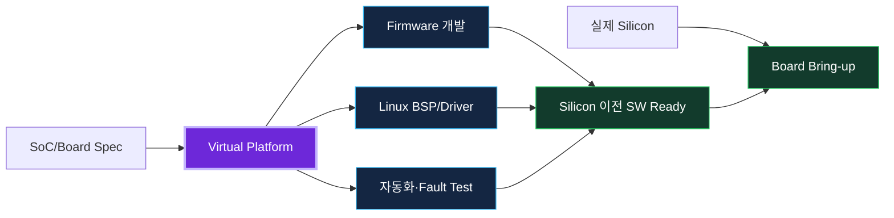

Automotive SoC 개발에서는 Hardware와 Software 일정이 직렬이면 Software가 항상 늦어진다. Virtual Platform은 완성된 Silicon을 기다리지 않고 다음 작업을 병렬화한다.

| 선행 개발 항목 | Virtual Platform에서 가능한 일 | Silicon에서 다시 확인할 일 |
|---|---|---|
| Boot Firmware | reset/handoff, PSCI/SBI, memory layout, image loading | clock/reset/power, 실제 ROM, timing |
| Linux BSP | early boot, DT, IRQ, console, storage/network, driver framework | 실제 pin/clock/PHY, coherency, errata |
| Device Driver | register contract, interrupt, timeout, reset, fault injection | RTL exact semantics, latency, DMA/coherency |
| Multi-domain SW | mailbox, shared memory, boot order, recovery protocol | 실제 interconnect, isolation, safety mechanism |
| CI | boot regression, negative test, fuzz/fault test | Hardware-in-the-loop coverage |

Virtual Platform의 목적은 “실제 하드웨어를 완벽히 예측”하는 것이 아니라, **검증 질문에 충분한 추상도**로 Software 위험을 먼저 제거하는 것이다.

## 5. Virtual Platform의 정의와 경계

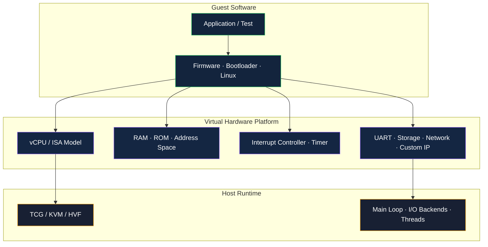

Virtual Platform은 Guest Software가 관찰할 수 있는 Hardware-visible contract를 소프트웨어 모델로 제공한다.

- CPU instruction execution과 privilege transition
- Guest physical address space와 RAM/ROM/MMIO
- interrupt controller와 timer
- UART, block, network, virtio, custom IP
- reset, error, timeout, interrupt 등의 state transition
- Firmware와 Kernel이 사용하는 DTB 또는 ACPI description

반면 기본 QEMU Platform은 다음을 자동으로 보장하지 않는다.

- 실제 CPU의 cycle 수와 pipeline stall
- 실제 cache/NoC/DRAM contention
- analog/PHY behavior
- production RTL의 모든 register side effect
- safety certification을 위한 hardware evidence

따라서 모델의 fidelity는 “좋다/나쁘다”가 아니라 **검증 목적에 적합한가**로 평가한다.

### 5.1 Emulation, Simulation, Virtualization 구분

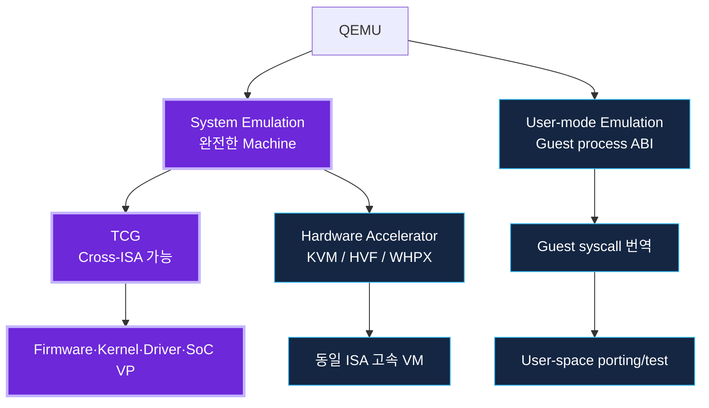

| 구분 | 핵심 | 대표 용도 |
|---|---|---|
| System Emulation | CPU와 Board 전체를 모델링 | Cross-ISA Firmware/Kernel/BSP, SoC VP |
| User-mode Emulation | Guest process ABI와 syscall 변환 | 다른 ISA user binary 실행, porting |
| Hardware Virtualization | 동일 ISA에서 host accelerator 사용 | 고속 VM, cloud/workload test |
| Functional Simulation | state/result 중심, timing 단순화 | driver, protocol, boot correctness |
| TLM Simulation | transaction와 simulation time 모델링 | SystemC IP 연결, 상대 latency, co-simulation |
| Cycle-accurate Simulation | 매 cycle의 microarchitecture/RTL 동작 | RTL verification, exact timing |

이번 과정의 주력은 QEMU **System Emulation + TCG**다. QBox에서는 QEMU CPU와 QEMU Device wrapper를 SystemC/TLM Platform에 연결한다.

## 6. QEMU 전체 Architecture

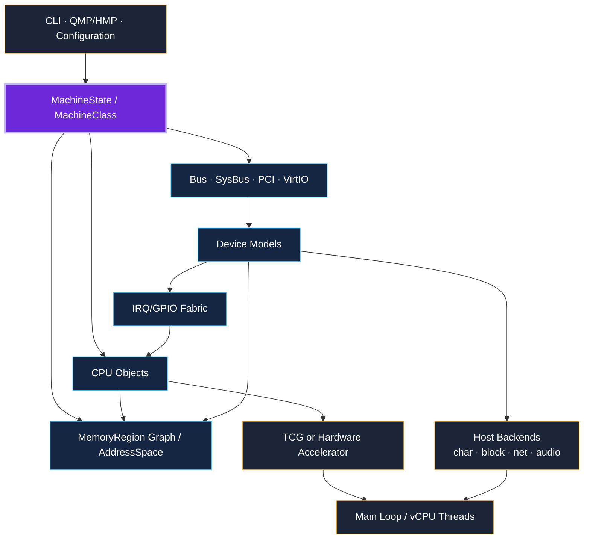

QEMU를 하나의 거대한 CPU Emulator로만 보면 Device Model 개발이 어렵다. 실제로는 다음 계층의 조합이다.

### 6.1 Configuration layer

CLI, QMP, HMP, object property, command-line backend가 Machine 구성을 결정한다. 같은 binary라도 `-machine`, `-cpu`, `-smp`, `-m`, `-device`, `-chardev`, `-drive` 조합에 따라 완전히 다른 Platform이 된다.

### 6.2 Machine layer

`MachineClass`는 Machine type의 class-level policy를, `MachineState`는 실행 instance의 상태를 가진다. Machine init callback은 CPU, RAM, interrupt controller, timer, UART, buses, firmware interface, DTB를 조립한다.

### 6.3 CPU and execution layer

Cross-ISA 실행은 TCG가 담당한다. Guest instruction을 decode하여 TCG IR로 바꾸고 Host code로 변환한다. 동일 ISA에서는 KVM/HVF/WHPX와 같은 accelerator를 선택할 수 있지만, Device Model과 Machine 구성은 여전히 QEMU가 담당한다.

### 6.4 Memory and device layer

`MemoryRegion` graph가 RAM, ROM, MMIO, alias, container를 표현한다. CPU 또는 DMA master는 `AddressSpace`라는 view를 통해 접근한다. MMIO가 Device의 `MemoryRegionOps` callback으로 dispatch된다.

### 6.5 Host backend and event loop

Guest UART는 Host stdio/PTY/socket에, Guest block device는 Host image/file에 연결된다. Main loop와 vCPU thread는 timer, I/O, bottom-half, event notification을 처리한다.

## 7. Machine Model: 하나의 가상 Board를 조립하는 객체

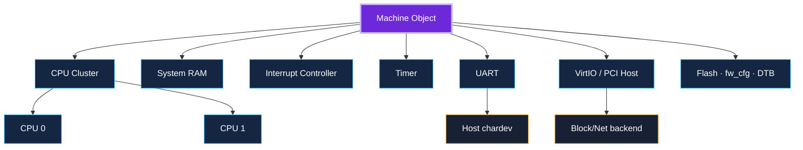

Machine은 단순한 Device 목록이 아니다. 다음 정책도 포함한다.

- CPU type과 최대 CPU 수
- RAM base/size와 high memory layout
- interrupt controller version
- firmware loading convention
- Device Tree 또는 ACPI 생성
- hotplug 가능 Device
- default storage/network backend
- compatibility versioning

`virt` 이름은 ARM과 RISC-V 양쪽에 존재하지만 내부 구현과 장치 구성은 다르다. CLI의 architecture-specific executable이 각각 다른 `virt` type을 선택한다.

### 7.1 QEMU v11.0.2 ARM `virt` source reading

Source: `hw/arm/virt.c`

```c
static void virt_machine_class_init(ObjectClass *oc, const void *data)
{
    MachineClass *mc = MACHINE_CLASS(oc);
    HotplugHandlerClass *hc = HOTPLUG_HANDLER_CLASS(oc);

    mc->init = machvirt_init;
    mc->max_cpus = 512;
    ...
    mc->default_ram_id = "mach-virt.ram";
    mc->default_nic = "virtio-net-pci";
    ...
}
```

읽기 포인트는 `virt_machine_class_init()`이 실제 Device를 생성하는 함수가 아니라 **Machine class의 policy와 callback을 등록**한다는 점이다. 실제 조립은 `mc->init`에 연결된 `machvirt_init()` 경로를 따라간다.

### 7.2 QEMU v11.0.2 RISC-V `virt` source reading

Source: `hw/riscv/virt.c`

```c
static void virt_machine_class_init(ObjectClass *oc, const void *data)
{
    MachineClass *mc = MACHINE_CLASS(oc);

    mc->desc = "RISC-V VirtIO board";
    mc->init = virt_machine_init;
    mc->max_cpus = VIRT_CPUS_MAX;
    mc->default_cpu_type = TYPE_RISCV_CPU_BASE;
    ...
}

static const TypeInfo virt_machine_typeinfo = {
    .name = MACHINE_TYPE_NAME("virt"),
    .parent = TYPE_MACHINE,
    .class_init = virt_machine_class_init,
    .instance_init = virt_machine_instance_init,
    .instance_size = sizeof(RISCVVirtState),
    ...
};
```

이 코드는 `TypeInfo`가 QOM type을 등록하고, class initialization과 instance initialization을 분리한다는 점을 보여준다. QOM은 2강에서 자세히 다룬다.

## 8. ARM64 `virt` Machine

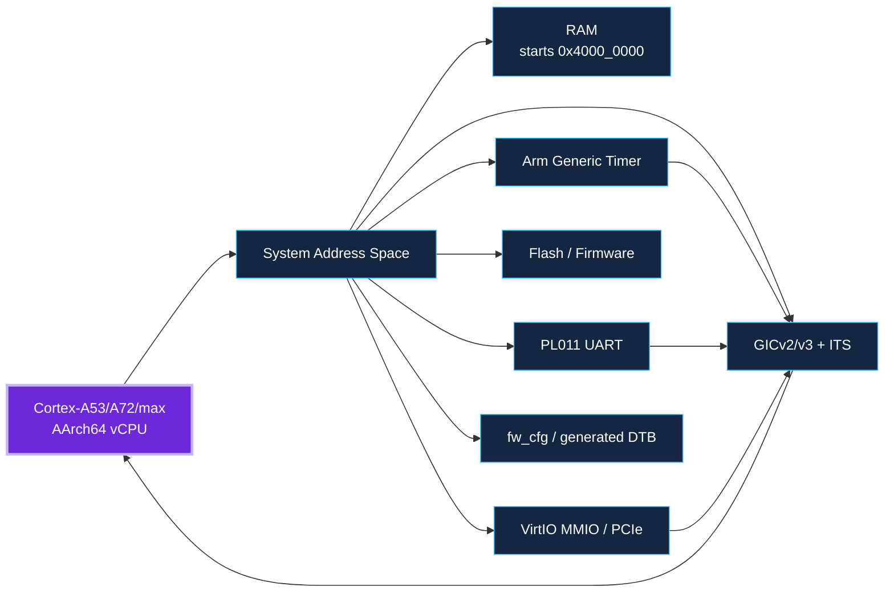

QEMU 공식 문서가 강조하듯 ARM `virt`는 실제 Board 모델이 아니라 Linux와 범용 Guest 실행을 위한 가상 Platform이다.

### 8.1 기본 구성의 관찰 포인트

- AArch64를 실행하려면 64-bit CPU type을 명시한다. 이번 기준선은 `-cpu cortex-a53`이다.
- `-machine virt,gic-version=3`로 GICv3를 고정한다.
- RAM은 `0x4000_0000`에서 시작한다.
- PL011 UART가 console로 사용되며 기준선 주소는 `0x0900_0000`이다.
- QEMU가 DTB를 생성하므로 Device 위치와 interrupt 정보는 DTB를 source of truth로 사용한다.
- `virt` Machine의 versioned type은 migration/compatibility를 위해 존재한다. 수업에서는 v11.0.2 binary와 옵션을 함께 고정한다.

### 8.2 실제 Automotive Board와의 차이

실제 Automotive SoC는 PSCI conduit, GIC redistributor layout, UART, clock/reset, SMMU, NPU, CAN/Ethernet, power domain이 제품별로 다르다. 따라서 `virt`에서 검증한 driver framework와 error handling을 실제 Board에 옮길 때 DT binding, clock/reset, DMA/coherency, IRQ routing을 다시 검증해야 한다.

### 8.3 ARM64 부팅 sequence

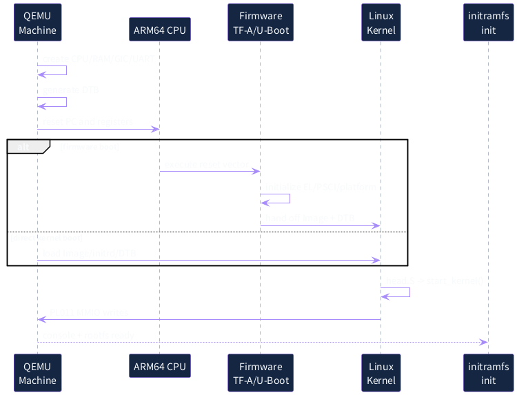

`-kernel` direct boot는 Firmware 단계를 단축한다. Firmware 개발을 학습할 때는 TF-A/U-Boot를 별도로 로드하고, Kernel Driver 개발의 빠른 loop에서는 direct kernel boot를 사용할 수 있다. 두 경로의 로그와 CPU exception level을 혼동하지 말아야 한다.

## 9. RISC-V64 `virt` Machine

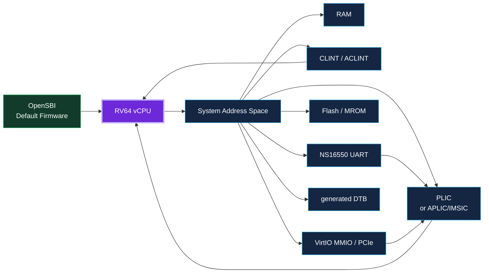

RISC-V `virt` 역시 실물 Board가 아니다. 기본 Platform은 RV64 CPU, machine timer/software interrupt, external interrupt controller, UART, flash, virtio, generated DTB를 제공한다.

### 9.1 이번 강의 baseline

- `-machine virt`
- `-cpu rv64`
- `-bios default`를 명시하여 QEMU가 제공하는 OpenSBI firmware 경로를 눈에 보이게 한다.
- Linux는 S-mode로 진입하고 SBI를 통해 timer/IPI 등의 서비스를 사용한다.
- UART는 NS16550 계열이며 `console=ttyS0`를 사용한다.
- v11.0.2는 classic PLIC뿐 아니라 AIA/APLIC/IMSIC 선택지도 제공하지만, 1강은 classic baseline을 먼저 고정한다.

### 9.2 ARM64와 다른 디버깅 질문

- reset PC가 MROM/OpenSBI 쪽인가, Linux entry인가?
- 현재 privilege mode가 M-mode인가 S-mode인가?
- OpenSBI가 Kernel과 DTB 주소를 올바르게 전달했는가?
- timer/IPI가 SBI/ACLINT 경로에서 정상 동작하는가?
- PLIC 또는 AIA 설정이 Linux config/DTB와 일치하는가?

### 9.3 RISC-V64 부팅 sequence

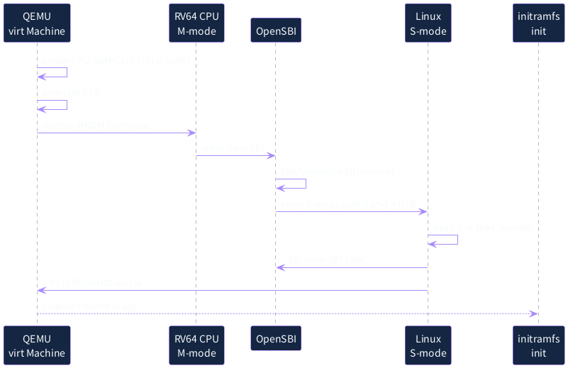

## 10. ARM64와 RISC-V64 비교

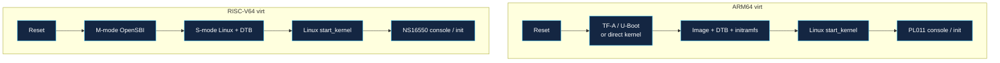

| 관점 | ARM64 `virt` | RISC-V64 `virt` |
|---|---|---|
| Privilege | EL3/EL2/EL1/EL0 | M/S/U mode |
| Firmware interface | PSCI, optional TF-A/U-Boot/UEFI | SBI, default OpenSBI |
| Interrupt | GICv2/v3, ITS 옵션 | PLIC 또는 AIA/APLIC/IMSIC |
| Timer | Arm Generic Timer | CLINT/ACLINT + SBI timer |
| Console | PL011, `ttyAMA0` | NS16550, `ttyS0` |
| Linux handoff | Image + DTB, EL/PSCI 상태 | hartid + DTB, S-mode entry |
| 공통점 | generated DTB, RAM, virtio, direct kernel boot, GDB stub, HMP/QMP |

이 차이는 ISA 이름만 바꿔서는 동일 Platform을 만들 수 없다는 것을 보여준다. 반면 Linux의 platform driver, Device Tree matching, MMIO/IRQ handling 같은 상위 구조는 상당 부분 공통화할 수 있다.

## 11. QEMU process startup: 옵션에서 Guest 실행까지

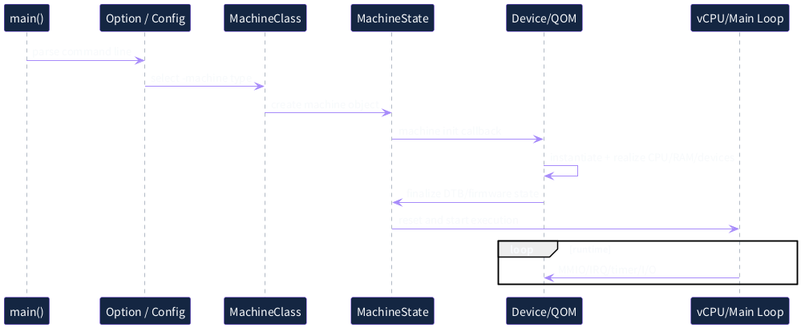

이번 강의에서 모든 함수를 외우는 것은 목표가 아니다. 다음 source-reading map을 따라 “어느 계층이 무엇을 책임지는지”를 찾는 것이 목표다.

```text
system/main.c
  -> qemu_main()
system/vl.c
  -> option/configuration handling
  -> machine selection and creation
hw/core/machine.c
  -> MachineState / MachineClass common logic
hw/arm/virt.c
  -> machvirt_init(), ARM virt board composition
hw/riscv/virt.c
  -> virt_machine_init(), RISC-V virt board composition
qom/object.c
  -> QOM type/object/property implementation
system/memory.c
  -> MemoryRegion and AddressSpace implementation
accel/tcg/cpu-exec.c
  -> vCPU execution loop in TCG mode
```

### Source reading 방법

1. `MachineClass.mc->init` callback을 찾는다.
2. init 함수에서 CPU/interrupt/memory/device 생성 helper를 나눈다.
3. Device 생성 뒤 `sysbus_mmio_map()`, `sysbus_connect_irq()`와 같은 연결 지점을 찾는다.
4. DTB node를 생성하는 함수와 실제 Device Model 생성 함수를 대응한다.
5. Guest log에서 보이는 device address/IRQ와 source의 map을 비교한다.

함수 이름만 따라가면 전체 구조를 잃기 쉽다. 항상 **QOM object tree, address map, IRQ path, DTB** 네 관점을 병렬로 기록한다.

## 12. QOM preview: Type과 런타임 object

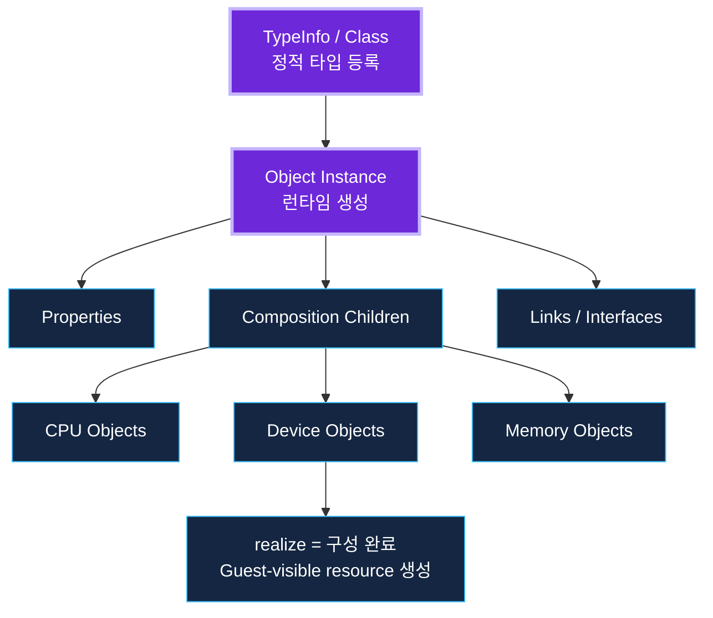

QOM(QEMU Object Model)은 QEMU의 Machine과 Device를 구성하는 object system이다.

- `TypeInfo`: type 이름, parent type, class init, instance init, instance size
- Class: type 전체가 공유하는 callback/policy
- Instance: 실제 실행 중 생성된 CPU/Device/Machine 상태
- Property: command line 또는 object link를 통한 configuration
- Composition child: Machine 아래에 포함된 object 관계
- `realize`: configuration이 완료되어 MMIO/IRQ/child resource를 생성하는 lifecycle 단계

1강에서는 `info qom-tree`로 결과를 관찰하고, 2강에서 직접 `TypeInfo`와 `SysBusDevice`를 작성한다.

## 13. MemoryRegion과 AddressSpace preview

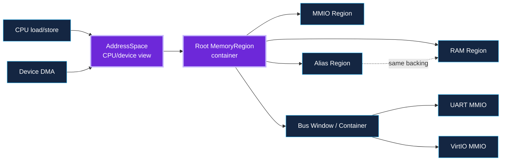

Guest physical address는 단순한 Host pointer가 아니다. QEMU는 `MemoryRegion` graph로 주소 공간을 구성한다.

- RAM region: Host backing memory에 연결되는 일반 memory
- ROM/ROM device: read-only 또는 controlled write
- MMIO region: callback으로 device behavior를 실행
- Container region: child region을 배치하는 주소 window
- Alias region: 다른 region의 같은 backing을 다른 주소로 노출
- `AddressSpace`: CPU 또는 DMA master가 바라보는 root view

`info mtree`는 이 graph가 실제로 어떤 주소에 배치되었는지 보여준다. 2강의 Custom Device 실습에서 이 정보를 이용해 MMIO mapping을 검증한다.

## 14. TCG preview: Guest instruction이 Host에서 실행되는 방식

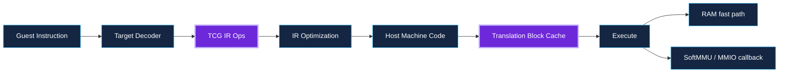

TCG는 Guest basic block을 Translation Block(TB) 단위로 변환하고 cache한다. Guest load/store가 RAM이면 빠른 path를 사용하고, MMIO 주소라면 SoftMMU와 Memory API를 거쳐 Device callback으로 dispatch된다.

이번 강의의 중요한 결론은 다음과 같다.

- Guest Driver의 `writel()`은 결국 QEMU Device Model의 write callback을 실행할 수 있다.
- Guest IRQ handler는 QEMU Device가 assert한 IRQ/GPIO가 interrupt controller model을 거쳐 CPU에 주입된 결과다.
- MMIO/IRQ 흐름을 이해하면 Driver와 Device Model을 함께 디버깅할 수 있다.

### 14.1 MMIO와 Interrupt sequence

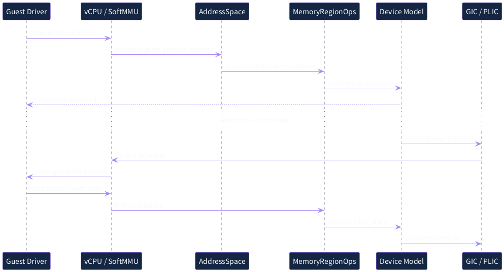

## 15. DTB는 Machine과 Guest Software 사이의 Hardware contract

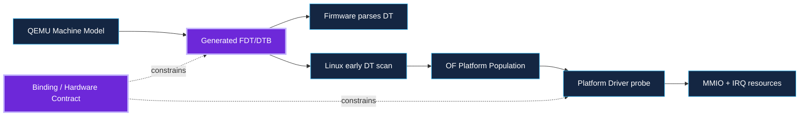

QEMU `virt` Machine의 대부분의 장치 주소를 문서나 source에서 hard-code하지 말고 generated DTB로 확인한다.

Linux 흐름은 대략 다음과 같다.

1. early boot에서 DTB header와 memory/reserved-memory를 읽는다.
2. interrupt controller와 timer 등 early subsystem을 초기화한다.
3. OF platform population이 DT node를 platform device로 만든다.
4. Driver의 `of_match_table`과 `compatible`이 match한다.
5. `reg`가 MMIO resource로, `interrupts`가 IRQ resource로 전달된다.
6. Driver probe가 mapping과 IRQ registration을 수행한다.

따라서 probe가 실패하면 QEMU Device Model만 보지 말고 **DTB node - platform resource - driver binding**을 함께 확인해야 한다.

## 16. 실습 0: 기준 버전과 환경 기록

```bash
#!/usr/bin/env bash
set -euo pipefail

qemu-system-aarch64 --version
qemu-system-riscv64 --version

printf 'Kernel: '
make -s kernelversion
printf 'Buildroot: '
git -C "$BUILDROOT" describe --always --dirty

printf 'QEMU source: '
git -C "$QEMU_SRC" describe --tags --always --dirty
printf 'QBox source: '
git -C "$QBOX_SRC" rev-parse HEAD
```

### 확인 기준

- 두 QEMU executable이 같은 source baseline에서 빌드되었는가?
- `--version`만으로 부족하면 source revision과 build configuration도 기록했는가?
- Kernel `vmlinux`와 실제 실행한 `Image`가 같은 build인가?
- initramfs의 Buildroot revision과 overlay 변경이 기록되었는가?
- Dirty source tree인지 기록했는가?

교육 과정에서는 **QEMU v11.0.2 tag**를 기본으로 사용한다. 새로운 main commit을 시험할 때도 v11.0.2 baseline을 지우지 말고 별도 build directory로 유지한다.

### 16.1 QEMU source build 예시

```bash
#!/usr/bin/env bash
set -euo pipefail

QEMU_TAG=v11.0.2
SRC="$PWD/qemu"
BLD="$SRC/build-study"

git -C "$SRC" fetch --tags
git -C "$SRC" checkout "$QEMU_TAG"

mkdir -p "$BLD"
pushd "$BLD" >/dev/null
"$SRC/configure" \
    --target-list=aarch64-softmmu,riscv64-softmmu \
    --enable-debug \
    --enable-trace-backends=log
ninja
popd >/dev/null
```

`--enable-debug`는 개발 편의성을 높이지만 실행 속도와 binary 크기에 영향을 줄 수 있다. release-like build와 debug build를 비교할 때 build directory와 결과를 분리한다.

## 17. 실습 1: ARM64 baseline boot

```bash
#!/usr/bin/env bash
set -euo pipefail

: "${IMAGE_ARM64:?set IMAGE_ARM64}"
: "${INITRAMFS_ARM64:?set INITRAMFS_ARM64}"
OUT=${OUT:-out/arm64}
mkdir -p "$OUT"

DEBUG_ARGS=()
if [[ ${DEBUG:-0} == 1 ]]; then
    DEBUG_ARGS=(-S -gdb tcp::1234)
fi

exec qemu-system-aarch64 \
    -machine virt,gic-version=3 \
    -cpu cortex-a53 \
    -smp 4 -m 2048 \
    -kernel "$IMAGE_ARM64" \
    -initrd "$INITRAMFS_ARM64" \
    -append "console=ttyAMA0 earlycon=pl011,0x09000000 rdinit=/sbin/init" \
    -nographic \
    -monitor "unix:$OUT/monitor.sock,server=on,wait=off" \
    "${DEBUG_ARGS[@]}" \
    2>&1 | tee "$OUT/serial.log"
```

### 실행 전 수정할 항목

- `IMAGE_ARM64`: 현재 환경의 `arch/arm64/boot/Image`
- `INITRAMFS_ARM64`: Buildroot가 만든 `rootfs.cpio` 또는 `rootfs.cpio.gz`
- `rdinit=/sbin/init`: 실제 init path와 일치해야 한다.
- Kernel config: `CONFIG_SERIAL_AMBA_PL011`, `CONFIG_SERIAL_AMBA_PL011_CONSOLE`, initramfs에 필요한 filesystem/console 설정

### 성공 기준

1. QEMU version과 command line이 log에 남는다.
2. Linux banner가 출력된다.
3. CPU 수와 memory size가 의도대로 보인다.
4. GICv3와 PL011 probe가 성공한다.
5. initramfs의 `/sbin/init`이 실행된다.
6. 종료 방법이 정의되어 있다. 예: `poweroff`, QEMU test device, monitor quit.

## 18. 실습 2: RISC-V64 baseline boot

```bash
#!/usr/bin/env bash
set -euo pipefail

: "${IMAGE_RISCV64:?set IMAGE_RISCV64}"
: "${INITRAMFS_RISCV64:?set INITRAMFS_RISCV64}"
OUT=${OUT:-out/riscv64}
mkdir -p "$OUT"

DEBUG_ARGS=()
if [[ ${DEBUG:-0} == 1 ]]; then
    DEBUG_ARGS=(-S -gdb tcp::1235)
fi

exec qemu-system-riscv64 \
    -machine virt \
    -cpu rv64 \
    -smp 4 -m 2048 \
    -bios default \
    -kernel "$IMAGE_RISCV64" \
    -initrd "$INITRAMFS_RISCV64" \
    -append "console=ttyS0 earlycon=sbi rdinit=/sbin/init" \
    -nographic \
    -monitor "unix:$OUT/monitor.sock,server=on,wait=off" \
    "${DEBUG_ARGS[@]}" \
    2>&1 | tee "$OUT/serial.log"
```

### 실행 전 수정할 항목

- `IMAGE_RISCV64`: 현재 환경의 `arch/riscv/boot/Image`
- `INITRAMFS_RISCV64`: Buildroot initramfs
- Kernel config: SBI, timer, interrupt controller, 8250 console, initramfs 관련 설정

### 성공 기준

1. OpenSBI banner와 platform 정보가 출력된다.
2. Linux가 S-mode에서 시작한다.
3. SBI specification/extension과 timer/IPI가 정상 인식된다.
4. PLIC 또는 선택한 AIA controller가 probe된다.
5. `ttyS0` console과 initramfs init이 동작한다.

## 19. HMP로 Machine 내부를 관찰하기

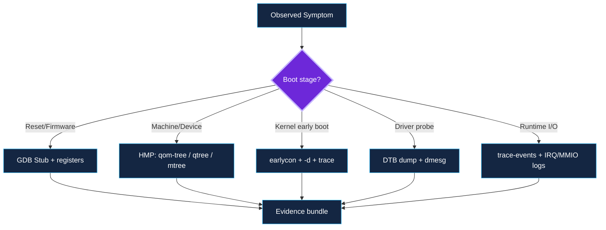

QEMU Monitor는 Guest 내부가 아니라 QEMU model의 상태를 본다. Linux `dmesg`와 서로 다른 관점이므로 같이 저장해야 한다.

| HMP command | 질문 |
|---|---|
| `info qom-tree` | 어떤 QOM object가 생성되었는가? |
| `info qtree` | Device와 Bus가 어떻게 연결되었는가? |
| `info mtree` | RAM/MMIO/alias가 어느 주소에 배치되었는가? |
| `info irq` | interrupt line activity/counter는 어떤가? |
| `info registers` | 현재 vCPU register/PC는 어디인가? |
| `info cpus` | 어느 vCPU가 실행/정지 상태인가? |
| `info jit` | TCG/JIT 실행 통계는 어떤가? |

```bash
#!/usr/bin/env bash
set -euo pipefail

SOCK=${1:?usage: inspect_hmp.sh <monitor.sock> <out-dir>}
OUT=${2:?usage: inspect_hmp.sh <monitor.sock> <out-dir>}
mkdir -p "$OUT"

hmp() {
    printf '%s\nquit\n' "$1" | socat - "UNIX-CONNECT:$SOCK"
}

hmp 'info qom-tree' > "$OUT/qom-tree.txt"
hmp 'info qtree'    > "$OUT/qtree.txt"
hmp 'info mtree'    > "$OUT/mtree.txt"
hmp 'info irq'      > "$OUT/irq.txt"
hmp 'info registers' > "$OUT/registers.txt"
```

### 비교 방법

ARM64와 RISC-V64 결과를 단순 diff하면 object 이름이 많이 다르다. 다음 구조적 질문으로 비교한다.

- CPU object 수가 `-smp`와 같은가?
- System RAM size와 base가 기대값인가?
- Console Device가 interrupt controller와 연결되어 있는가?
- Generated DTB의 `reg`/`interrupts`와 `info mtree`/`qtree`가 일치하는가?
- 불필요한 default Device가 추가되지 않았는가?

## 20. DTB 추출과 비교

```bash
#!/usr/bin/env bash
set -euo pipefail

mkdir -p out/dtb

qemu-system-aarch64 \
    -machine virt,dumpdtb=out/dtb/arm64-virt.dtb \
    -cpu cortex-a53 -m 2048 -nographic

qemu-system-riscv64 \
    -machine virt,dumpdtb=out/dtb/riscv64-virt.dtb \
    -cpu rv64 -m 2048 -nographic

dtc -I dtb -O dts \
    -o out/dtb/arm64-virt.dts out/dtb/arm64-virt.dtb

dtc -I dtb -O dts \
    -o out/dtb/riscv64-virt.dts out/dtb/riscv64-virt.dtb

diff -u out/dtb/arm64-virt.dts \
        out/dtb/riscv64-virt.dts || true
```

### 분석 순서

1. `/cpus`에서 hart/CPU count와 compatible을 확인한다.
2. `/memory`의 base와 size를 확인한다.
3. `/chosen`에서 bootargs와 initrd range를 확인한다.
4. interrupt controller node와 `interrupt-parent`를 확인한다.
5. console node의 `compatible`, `reg`, `interrupts`, clock property를 확인한다.
6. virtio/PCI host node를 확인한다.
7. `dmesg`의 physical address/IRQ와 DTB를 맞춘다.

**주의:** ARM `virt`의 일부 고정 주소를 기억하는 것은 디버깅 출발점일 뿐이다. Guest가 의존해야 하는 source of truth는 해당 QEMU binary가 생성한 DTB다.

## 21. GDB로 Reset에서 `start_kernel()`까지

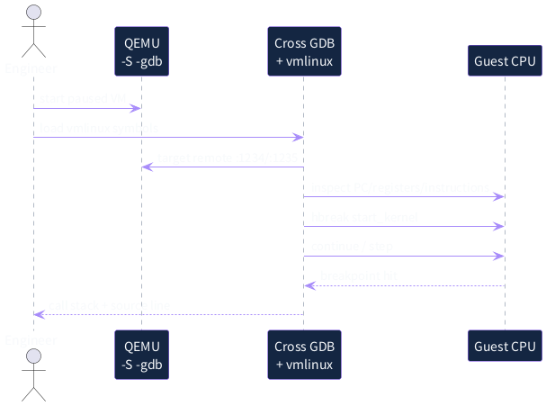

### 21.1 ARM64 GDB command file

```gdb
set pagination off
set architecture aarch64
file /path/to/arm64/vmlinux
target remote :1234

info registers
x/12i $pc
hbreak start_kernel
continue

bt
info threads
```

### 21.2 RISC-V64 GDB command file

```gdb
set pagination off
set architecture riscv:rv64
file /path/to/riscv64/vmlinux
target remote :1235

info registers
x/12i $pc
hbreak start_kernel
continue

bt
info threads
```

### 관찰 포인트

- 첫 PC가 Firmware/MROM인지 Kernel entry인지
- ARM64 PSTATE/CurrentEL 또는 RISC-V privilege/CSR 상태
- Kernel decompression 단계가 없는 raw `Image`인지
- `start_kernel()` breakpoint가 실제 실행 image의 `vmlinux` symbol과 일치하는지
- SMP secondary CPU가 어디에서 대기하고 어떻게 online 되는지

GDB breakpoint가 잡히지 않으면 먼저 ASLR/KASLR, symbol mismatch, direct boot와 firmware boot 차이, physical/virtual address transition을 확인한다.

## 22. QEMU trace를 이용한 내부 event 관찰

```bash
#!/usr/bin/env bash
set -euo pipefail

# Discover available events first.
qemu-system-aarch64 -trace help | \
    grep -E 'memory_region|virtio|gic|pl011' | head

# Example: enable a focused event set.
qemu-system-aarch64 \
    ... \
    -trace 'memory_region_ops_read' \
    -trace 'memory_region_ops_write' \
    -D out/arm64/qemu-trace.log
```

Trace event 이름은 build와 version에 따라 달라질 수 있으므로 항상 `-trace help`로 실제 event를 확인한다. 무차별적으로 모든 event를 켜면 log가 너무 커지고 timing이 변한다. 다음 순서가 효과적이다.

1. 증상과 관련된 subsystem을 한정한다.
2. Device-specific event와 generic memory/IRQ event를 최소 집합으로 선택한다.
3. Guest timestamp와 QEMU log를 함께 기록한다.
4. 동일 workload를 baseline과 modified model에서 반복한다.
5. event ordering 차이와 state 차이를 분리해 본다.

## 23. End-to-end case study: 하나의 재현 가능한 부팅 evidence 만들기


```plantuml
@startuml
skinparam backgroundColor transparent
skinparam defaultFontName Noto Sans CJK KR
skinparam defaultFontColor #F8FAFC
skinparam sequenceArrowColor #A78BFA
skinparam sequenceLifeLineBorderColor #64748B
skinparam sequenceLifeLineBackgroundColor #142642
skinparam participantBorderColor #8B5CF6
skinparam participantBackgroundColor #142642
skinparam participantFontColor #F8FAFC
actor "Engineer / CI" as ENG
participant "Run Script" as RUN
participant "QEMU Machine" as QEMU
participant "Generated DTB" as DTB
participant "Linux Kernel" as LINUX
participant "Evidence Bundle" as EVID
ENG -> RUN: run-arm64.sh or run-riscv64.sh
RUN -> QEMU: pinned options + images
QEMU -> DTB: describe instantiated platform
QEMU -> LINUX: boot kernel/initramfs
LINUX -> DTB: discover CPU/memory/devices
LINUX -> QEMU: console + MMIO + IRQ
RUN -> QEMU: HMP/QMP queries
RUN -> EVID: serial.log + qom/qtree/mtree
RUN -> EVID: DTB/DTS + versions + hashes
EVID --> ENG: reproducible baseline
@enduml
```

### Scenario

CI 또는 엔지니어가 ARM64/RISC-V64 run script를 실행하고, Kernel이 initramfs shell까지 부팅되는지 확인한다. 단순히 “부팅 성공”만 기록하지 않고 Machine 구성 evidence를 함께 저장한다.

### 입력

- QEMU executable과 source revision
- Machine/CPU/SMP/memory/firmware option
- Kernel Image와 `vmlinux`
- initramfs
- optional firmware/DTB override

### 실행 중 생성되는 contract

- Machine init이 CPU/RAM/GIC 또는 PLIC/UART를 생성한다.
- QEMU가 DTB를 생성한다.
- Linux가 DTB를 통해 device를 발견한다.
- Driver가 MMIO와 IRQ resource를 사용한다.

### 결과 evidence

- serial log
- generated DTB와 decompiled DTS
- QOM tree, qtree, memory tree, IRQ/register snapshot
- QEMU/Kernel/Buildroot revision
- binary hashes
- test result와 종료 사유

이 bundle이 있어야 다른 개발자가 같은 실패를 재현하고, Machine Model 변경의 영향을 비교할 수 있다.

### 23.1 baseline bundle 생성 예시

```bash
#!/usr/bin/env bash
set -euo pipefail

ARCH=${1:?arm64 or riscv64}
OUT="out/$ARCH"
mkdir -p "$OUT/meta"

case "$ARCH" in
    arm64)   QEMU_BIN=qemu-system-aarch64 ;;
    riscv64) QEMU_BIN=qemu-system-riscv64 ;;
    *) echo "unsupported architecture: $ARCH" >&2; exit 2 ;;
esac

uname -a > "$OUT/meta/host.txt"
"$QEMU_BIN" --version > "$OUT/meta/qemu-version.txt" 2>&1
sha256sum "$OUT"/*.log "$OUT"/*.dtb 2>/dev/null \
    > "$OUT/meta/sha256.txt" || true

git -C "$QEMU_SRC" rev-parse HEAD > "$OUT/meta/qemu-rev.txt"
git -C "$LINUX_SRC" rev-parse HEAD > "$OUT/meta/linux-rev.txt"

tar -C "$OUT" -czf "baseline-${ARCH}.tar.gz" .
```

```mermaid
flowchart LR
    REV[Pinned revisions] --> BUILD[Build scripts]
    BUILD --> BIN[QEMU · Kernel · Firmware · rootfs]
    BIN --> RUN[Deterministic run scripts]
    RUN --> LOG[Serial / QEMU log / trace]
    RUN --> DTB[DTB / memory tree / QOM tree]
    RUN --> TEST[Test result / timing metadata]
    LOG --> BASE[Baseline bundle]
    DTB --> BASE
    TEST --> BASE
    REV --> BASE
    classDef core fill:#6D28D9,stroke:#C4B5FD,color:#fff,stroke-width:3px
    classDef box fill:#142642,stroke:#38BDF8,color:#fff
    classDef result fill:#123B2C,stroke:#22C55E,color:#fff
    class REV,BUILD core
    class BIN,RUN,LOG,DTB,TEST box
    class BASE result
```

## 24. 오류와 Fault 분석

```mermaid
flowchart TD
    START[Boot failed] --> UART{Any serial output?}
    UART -->|No| PC[Pause with -S; inspect PC/EL or privilege mode]
    PC --> LOAD{Expected image loaded?}
    LOAD -->|No| CMD[Check -bios/-kernel/-device loader]
    LOAD -->|Yes| DTB0[Check reset vector and firmware handoff]
    UART -->|Yes| PANIC{Kernel panic/hang?}
    PANIC -->|Early hang| EARLY[earlycon + loglevel=8 + GDB]
    PANIC -->|Probe failure| DEV[DTB node/resources/compatible/IRQ]
    PANIC -->|Runtime hang| IRQ[info irq + trace + timer/clock]
    CMD --> RETEST[Re-run and collect artifacts]
    DTB0 --> RETEST
    EARLY --> RETEST
    DEV --> RETEST
    IRQ --> RETEST
    classDef decision fill:#6D28D9,stroke:#C4B5FD,color:#fff,stroke-width:3px
    classDef box fill:#142642,stroke:#38BDF8,color:#fff
    class UART,LOAD,PANIC decision
    class START,PC,CMD,DTB0,EARLY,DEV,IRQ,RETEST box
```

### 24.1 Serial output이 전혀 없는 경우

- `-nographic`과 chardev 연결을 확인한다.
- ARM64는 `console=ttyAMA0`, RISC-V는 `console=ttyS0`가 맞는지 확인한다.
- `-S`가 의도치 않게 들어가 vCPU가 정지하지 않았는지 확인한다.
- GDB에서 PC와 첫 instruction을 확인한다.
- `-kernel`, `-bios`, `-device loader`의 load address와 entry를 확인한다.

### 24.2 Kernel early hang

- `earlycon`, `loglevel=8`, `ignore_loglevel`을 사용한다.
- DTB의 CPU, memory, timer, interrupt controller를 확인한다.
- `info registers`, `info irq`, `info mtree`를 저장한다.
- SMP 문제라면 `-smp 1`로 단순화한다.

### 24.3 Driver probe failure

- DT `compatible`과 Driver `of_match_table`을 비교한다.
- `reg` size, MMIO alignment, interrupt specifier를 확인한다.
- `info mtree`에 Device region이 실제로 존재하는지 확인한다.
- QEMU Device가 realize되었는지 QOM/qtree에서 확인한다.
- Kernel config가 built-in/module 중 원하는 방식인지 확인한다.

### 24.4 Runtime timeout 또는 IRQ storm

- Device status/clear semantics와 Linux handler 순서를 확인한다.
- level-triggered IRQ라면 pending state를 clear하기 전에 deassert되지 않는지 본다.
- QEMU timer와 virtual clock 사용 여부를 확인한다.
- Guest timeout 값이 virtual timing model과 일치하는지 확인한다.
- Trace를 통해 MMIO write - completion - IRQ - status clear 순서를 비교한다.

## 25. 성능, 시간, 동기화 관점

### 25.1 QEMU 실행 속도는 SoC 성능이 아니다

Host CPU 성능, TCG backend, compiler option, vCPU threading, I/O backend, tracing 여부에 따라 wall-clock 속도가 크게 바뀐다. 따라서 QEMU boot time을 실제 SoC boot time으로 해석하면 안 된다.

### 25.2 그래도 측정할 수 있는 것

- 같은 QEMU build/Host/option에서의 회귀 여부
- model 변경 전후 instruction count 또는 event count
- functional timeout와 ordering
- CI 안정성과 deterministic behavior

### 25.3 QBox로 확장할 때

QBox의 SystemC/TLM delay와 synchronization policy는 상대적인 transaction timing과 multi-component interaction을 표현할 수 있다. 그러나 기본 Loosely Timed model을 RTL cycle accuracy로 해석하면 안 된다.

## 26. 보안, 격리, 안전 관점

### 보안

- QEMU 실행 image와 host backend를 신뢰 경계로 관리한다.
- QMP/HMP socket을 외부에 무방비로 노출하지 않는다.
- untrusted disk/network image를 다룰 때 sandbox/container 권한을 제한한다.
- firmware/DTB/kernel hash를 evidence에 포함한다.

### Automotive safety engineering 관점

Virtual Platform은 safety case 자체가 아니라 early verification 도구다. 다음 시나리오를 빠르게 반복할 수 있다.

- watchdog timeout과 reset reason
- boot failure와 degraded mode
- mailbox protocol version mismatch
- interrupt loss/storm
- Device timeout 및 error interrupt
- domain restart와 shared memory 재초기화

하지만 실제 hardware safety mechanism, fault coverage, diagnostic coverage는 RTL/FPGA/Silicon 단계의 evidence와 연결해야 한다.

## 27. Automotive SoC와 ECU에서의 활용

```mermaid
flowchart LR
    subgraph SOC[Automotive SoC VP]
        ACPU[ARM64 Application Domain\nLinux/AAOS]
        SCPU[RISC-V Safety/Control Domain\nFirmware/RTOS]
        SHM[Shared Memory]
        MB[Mailbox / Doorbell]
        NPU[NPU/DMA Stub]
        WD[Watchdog / Reset / Fault]
        BUS[Interconnect Model]
        ACPU --> BUS
        SCPU --> BUS
        BUS --> SHM
        BUS --> MB
        BUS --> NPU
        BUS --> WD
    end
    TEST[ECU Scenario Test] --> ACPU
    TEST --> SCPU
    BUS --> LOG[Trace / Coverage / CI]
    classDef cpu fill:#6D28D9,stroke:#C4B5FD,color:#fff,stroke-width:3px
    classDef box fill:#142642,stroke:#38BDF8,color:#fff
    class ACPU,SCPU cpu
    class SHM,MB,NPU,WD,BUS,TEST,LOG box
```

### 27.1 SoC pre-silicon

- ARM64 Application domain의 Linux/AAOS BSP
- RISC-V control/safety domain의 Firmware/RTOS
- shared memory와 mailbox protocol
- NPU/DMA command queue와 interrupt contract
- reset/watchdog/fault injection

### 27.2 ECU/Board software

- bootloader와 Kernel upgrade regression
- Device Tree variant 관리
- ECU application이 의존하는 virtual I/O stub
- HIL 전에 가능한 system scenario test
- CI에서 수백 개의 negative/fault scenario 반복

### 27.3 실제 Board Bring-up으로 이전할 때

Virtual Platform에서 만든 코드를 그대로 신뢰하지 않고 다음 delta를 관리한다.

- memory map와 interrupt routing
- clock/reset/power domain
- DMA mask와 cache coherency
- IOMMU/SMMU Stream ID
- 실제 PHY/serdes/network timing
- hardware errata와 boot ROM behavior

## 28. QEMU와 QBox의 역할 분담

```mermaid
flowchart TB
    CONTRACT[Common HW Contract\nRegister · IRQ · DT · Reset] --> QEMU[QEMU C Device/Machine]
    CONTRACT --> QBOX[QBox SystemC/TLM Platform]
    SW[Same Firmware · Kernel · Driver · Test] --> QEMU
    SW --> QBOX
    QEMU --> FAST[Fast functional bring-up\nQTest/boot regression]
    QBOX --> COSIM[SystemC co-simulation\nheterogeneous domains/timing]
    FAST --> CONF[Conformance comparison]
    COSIM --> CONF
    classDef core fill:#6D28D9,stroke:#C4B5FD,color:#fff,stroke-width:3px
    classDef qemu fill:#13243D,stroke:#38BDF8,color:#fff
    classDef qbox fill:#13243D,stroke:#A78BFA,color:#fff
    classDef result fill:#123B2C,stroke:#22C55E,color:#fff
    class CONTRACT,SW core
    class QEMU,FAST qemu
    class QBOX,COSIM qbox
    class CONF result
```

| 개발 질문 | QEMU | QBox |
|---|---|---|
| Kernel/Driver가 register contract를 올바르게 사용하는가? | 매우 적합 | 적합 |
| 빠른 boot regression이 필요한가? | 매우 적합 | 가능 |
| QTest로 Device를 OS 없이 검증할 것인가? | 매우 적합 | 별도 SystemC test |
| SystemC IP model과 CPU를 연결할 것인가? | 제한적 | 매우 적합 |
| ARM64와 RISC-V64 domain을 한 Platform에서 연결할 것인가? | 별도 Machine/프로세스 설계 필요 | multi-instance 구성에 적합 |
| TLM transaction delay를 모델링할 것인가? | 제한적 | 적합 |
| RTL cycle accuracy가 필요한가? | 대상 아님 | 기본 LT model만으로는 대상 아님 |

가장 중요한 전략은 QEMU와 QBox에 별도 Software stack을 만드는 것이 아니라, **공통 Hardware contract와 동일 Firmware/Driver/Test**를 사용하여 두 모델의 conformance를 비교하는 것이다.

## 29. QBox Architecture preview

```mermaid
flowchart TB
    CCI[CCI + Lua Configuration]
    CPU[QEMU CPU Model]
    QI[QemuInstance\n-M none]
    INIT[TLM Initiator]
    ROUTER[SystemC TLM Router]
    RAM[SystemC Memory]
    DEV[SystemC Peripheral / IP]
    IRQ[Signal / IRQ Bridge]
    QDEV[QEMU GIC / PLIC Wrapper]

    CPU --> QI
    QI --> INIT
    INIT --> ROUTER
    ROUTER --> RAM
    ROUTER --> DEV
    DEV --> IRQ
    IRQ --> QDEV
    QDEV --> CPU

    CCI -.configures.-> QI
    CCI -.configures.-> ROUTER
    CCI -.configures.-> DEV

    classDef qemu fill:#13243D,stroke:#38BDF8,color:#fff
    classDef sc fill:#13243D,stroke:#A78BFA,color:#fff
    classDef cfg fill:#123B2C,stroke:#22C55E,color:#fff
    class CPU,QI,QDEV qemu
    class INIT,ROUTER,RAM,DEV,IRQ sc
    class CCI cfg
```

QBox는 QEMU를 SystemC 안에서 TLM-2.0 model로 사용한다.

- `libqemu-cxx`: QEMU library instance를 C++로 감싼다.
- `libqbox`: QEMU CPU/Device를 SystemC/TLM과 연결한다.
- `QemuInstanceManager`: 하나 이상의 QEMU instance를 관리한다.
- `QemuInstance`: CPU와 QEMU Device를 포함하며 기본적으로 `-M none` 형태로 사용할 수 있다.
- SystemC Router/Memory/Loader/Peripheral이 Platform topology와 transaction을 구성한다.
- SystemC CCI와 Lua가 parameter와 socket binding을 구성한다.

1강에서는 구조만 이해한다. 5강부터 실제 `hello-qbox`, AArch64/RISC-V64 platform, Lua configuration, TLM socket을 분석한다.

## 30. 모델 선택 decision tree

```mermaid
flowchart TB
    Q[What do you want to prove?] --> FUNC{Functional correctness?}
    FUNC -->|Yes| QEMU[QEMU fast functional model]
    FUNC -->|No| TIME{SystemC integration / relative latency?}
    TIME -->|Yes| QBOX[QBox TLM model]
    TIME -->|No| MICRO{Cache/NoC/memory microarchitecture?}
    MICRO -->|Yes| GEM5[gem5 / detailed performance model]
    MICRO -->|No| CYCLE{Cycle-accurate RTL behavior?}
    CYCLE -->|Yes| RTL[RTL simulation/emulation]
    CYCLE -->|No| REFINE[Refine validation question]
    classDef decision fill:#6D28D9,stroke:#C4B5FD,color:#fff,stroke-width:3px
    classDef box fill:#142642,stroke:#38BDF8,color:#fff
    class FUNC,TIME,MICRO,CYCLE decision
    class Q,QEMU,QBOX,GEM5,RTL,REFINE box
```

항상 “어떤 tool이 더 좋은가?” 대신 “무엇을 증명하려는가?”부터 질문한다.

- register/IRQ/boot correctness: QEMU
- SystemC component integration과 relative delay: QBox
- cache/NoC/DRAM microarchitecture: gem5 또는 전용 performance model
- exact RTL behavior: RTL simulation/emulation/FPGA

여러 모델을 동시에 사용한다면 Hardware-visible contract와 test vector를 공통화하고, 각 모델이 보장하는 것과 보장하지 않는 것을 문서화한다.

## 31. 실습 구조

권장 repository 구조는 다음과 같다.

```text
qemu-qbox-study/
├── manifest/
│   ├── versions.md
│   └── revisions.lock
├── images/
│   ├── arm64/{Image,vmlinux,rootfs.cpio.gz}
│   └── riscv64/{Image,vmlinux,rootfs.cpio.gz}
├── scripts/
│   ├── run-arm64.sh
│   ├── run-riscv64.sh
│   ├── dump-dtb.sh
│   ├── inspect-hmp.sh
│   └── collect-baseline.sh
├── out/
│   ├── arm64/
│   └── riscv64/
├── qemu/
│   ├── patches/
│   └── qtests/
├── qbox/
│   ├── platforms/
│   ├── components/
│   └── tests/
└── docs/
    ├── lesson01-baseline.md
    └── source-reading.md
```

### 실습 단계

1. 기존 ARM64/RISC-V64 환경에서 version manifest 생성
2. 두 Architecture의 boot log 저장
3. generated DTB/DTS 저장
4. QOM/qtree/mtree/IRQ/register snapshot 저장
5. GDB로 `start_kernel()` breakpoint 확인
6. baseline bundle과 hash 생성
7. ARM64/RISC-V64 차이를 표로 작성

## 32. 실습 결과 기록 양식

| 항목 | ARM64 | RISC-V64 |
|---|---|---|
| QEMU command |  |  |
| Machine/CPU |  |  |
| Firmware path |  |  |
| Kernel entry |  |  |
| Console |  |  |
| Interrupt controller |  |  |
| RAM base/size |  |  |
| `start_kernel()` hit |  |  |
| initramfs init reached |  |  |
| DTB hash |  |  |
| Serial log hash |  |  |
| 발견한 문제 |  |  |

### 완료 조건

- 동료가 같은 revision과 command로 동일한 boot milestone을 재현할 수 있다.
- 실패 시 serial log만이 아니라 model/DTB evidence를 제공할 수 있다.
- 다음 강의에서 `study-ip`를 추가하기 전의 baseline이 보존되어 있다.

## 33. 퀴즈 10문항

### 객관식 1

QEMU System Emulation에서 Machine Model의 가장 적절한 설명은?

A. Guest instruction만 Host instruction으로 번역하는 계층  
B. CPU, RAM, interrupt controller, Device, firmware interface를 조립하는 가상 Board 정의  
C. Linux syscall을 Host syscall로 바꾸는 library  
D. Host network backend만 관리하는 object

### 객관식 2

ARM64 `virt` Machine의 장치 주소를 Guest Software가 알아내는 가장 안전한 방법은?

A. 모든 주소를 Driver에 hard-code한다.  
B. Host `/proc/iomem`을 읽는다.  
C. 해당 QEMU가 생성한 DTB와 binding을 사용한다.  
D. RISC-V `virt`의 주소를 그대로 사용한다.

### 객관식 3

RISC-V64 `virt`의 기본 OpenSBI 역할로 가장 적절한 것은?

A. Linux user process의 syscall만 변환한다.  
B. M-mode platform 초기화와 SBI service를 제공하고 Linux를 S-mode로 넘긴다.  
C. GICv3를 초기화한다.  
D. PL011 UART를 PCI Device로 만든다.

### 객관식 4

다음 중 QEMU wall-clock 실행 시간을 실제 SoC 성능으로 바로 해석하면 안 되는 가장 큰 이유는?

A. QEMU에는 CPU가 없기 때문이다.  
B. Host 성능, TCG/backend, build option, tracing과 I/O 구성이 실행 속도에 영향을 주기 때문이다.  
C. Linux는 QEMU에서 실행되지 않기 때문이다.  
D. DTB가 항상 비어 있기 때문이다.

### O/X 5

QOM tree는 Guest Linux의 device tree를 다른 형식으로 보여주는 것이다. (O/X)

### O/X 6

ARM `virt`와 RISC-V `virt`는 이름이 같아도 서로 다른 architecture-specific Machine 구현이다. (O/X)

### 단답형 7

Guest physical address에 어떤 RAM/MMIO region이 배치되어 있는지 확인하는 HMP command는?

### 단답형 8

GDB symbol과 실제 실행 Kernel이 일치하는지 확인하기 위해 보존해야 할 대표 파일 두 개를 쓰라.

### 시나리오 9

ARM64 Kernel log가 한 줄도 나오지 않는다. `-nographic`은 설정되어 있다. 가장 먼저 수집할 세 가지 evidence와 확인 순서를 작성하라.

### 시나리오 10

Custom Device Driver의 probe가 `-ENODEV` 또는 resource 오류로 실패한다. QEMU Device Model, DTB, Linux 관점에서 각각 무엇을 확인할 것인가?

## 34. 정답과 해설

### 1. 정답 B

Machine은 가상 Board의 구성과 policy를 정의한다. A는 TCG의 역할, C는 user-mode emulation의 일부, D는 backend 일부만 설명한다.

### 2. 정답 C

QEMU `virt`는 generated DTB를 제공하며 Linux는 DTB를 통해 device resource를 발견한다. 일부 주소는 익숙하더라도 hard-code는 version/option 변화에 취약하다.

### 3. 정답 B

OpenSBI는 M-mode에서 platform initialization과 SBI interface를 제공하고 S-mode payload인 Linux로 handoff한다. GIC/PL011은 ARM 쪽 용어다.

### 4. 정답 B

QEMU speed는 Host와 emulator configuration의 함수다. 동일 환경의 regression 지표로는 쓸 수 있지만 실제 Silicon의 cycle/latency를 의미하지 않는다.

### 5. 정답 X

QOM tree는 QEMU Host process 내부 object composition이다. Device Tree는 Guest에 전달되는 hardware description이다. 둘은 대응될 수 있지만 동일한 tree가 아니다.

### 6. 정답 O

각 architecture executable은 자기 architecture의 `virt` Machine type을 등록한다. CPU, interrupt controller, firmware interface, UART가 다르다.

### 7. 정답 `info mtree`

`info mtree`는 MemoryRegion graph가 address space에 배치된 결과를 보여준다. `info qtree`는 Device/Bus 중심, `info qom-tree`는 object composition 중심이다.

### 8. 예시 정답 `Image`와 `vmlinux`

실제 실행 binary인 `Image`와 symbol/debug 정보가 있는 같은 build의 `vmlinux`를 함께 보존한다. 정확성을 높이려면 `.config`, commit, build ID/hash도 기록한다.

### 9. 해설

1. QEMU command line과 version을 먼저 저장하여 `-S`, `-kernel`, `-bios`, CPU/Machine option을 확인한다.  
2. GDB로 PC/register/CurrentEL과 첫 instruction을 확인한다.  
3. generated DTB 및 `info mtree/qtree`로 PL011과 memory가 존재하는지 확인한다.  
그 뒤 Kernel command line의 `console=ttyAMA0`, `earlycon`, image load/entry, firmware handoff를 좁혀 간다.

### 10. 해설

- QEMU: Device가 실제 생성·realize되었는지 QOM/qtree, MMIO가 `mtree`에 배치되었는지, IRQ가 연결되었는지 확인한다.
- DTB: node 존재, `status`, `compatible`, `reg`, `interrupts`, `interrupt-parent`를 확인한다.
- Linux: Kconfig/build-in/module, `of_match_table`, platform population, resource mapping과 probe log를 확인한다.

한 계층만 고치면 우연히 동작할 수 있으므로 세 계층의 Hardware-visible contract가 일치하는지 확인해야 한다.

## 35. 5분 복습 질문

1. QEMU System Emulation과 User-mode Emulation의 경계는 무엇인가?
2. MachineClass와 MachineState의 차이는 무엇인가?
3. ARM64 `virt`가 실제 Board가 아니라는 사실이 Driver 개발에 어떤 의미가 있는가?
4. RISC-V Linux가 OpenSBI를 통해 받는 대표 service는 무엇인가?
5. QOM tree와 Device Tree는 어떻게 다른가?
6. `AddressSpace`와 `MemoryRegion`은 어떤 관계인가?
7. Guest `writel()`이 QEMU Device callback까지 가는 경로는?
8. `info qtree`와 `info mtree`는 각각 어떤 질문에 답하는가?
9. `vmlinux` 없이도 boot는 되는데 디버깅에는 왜 필요한가?
10. baseline bundle에 revision과 hash를 포함해야 하는 이유는?
11. QEMU와 QBox 중 SystemC IP 연결에 더 적합한 것은?
12. QEMU 실행 속도를 실제 SoC 성능으로 해석할 수 없는 이유는?

## 36. 핵심 용어 Flashcard

| 앞면 | 뒷면 |
|---|---|
| Machine Model | CPU/RAM/interrupt/device/firmware를 조립하는 가상 Board 정의 |
| QOM | QEMU의 type/object/property/lifecycle model |
| `realize` | Device configuration을 완료하고 resource를 Guest-visible하게 만드는 단계 |
| qdev | QOM 위의 Device/Bus infrastructure |
| `MemoryRegion` | RAM, ROM, MMIO, alias, container를 표현하는 object |
| `AddressSpace` | CPU 또는 Device가 바라보는 MemoryRegion root view |
| TCG | Guest instruction을 TCG IR와 Host code로 변환하는 engine |
| Translation Block | 번역·cache되는 Guest basic-block 계열 실행 단위 |
| HMP | 사람이 사용하는 QEMU Monitor command interface |
| QMP | JSON 기반 machine-control interface |
| DTB | Firmware/Kernel에 전달되는 flattened Device Tree binary |
| PSCI | Arm power/CPU management firmware interface |
| SBI | RISC-V Supervisor와 Machine-mode firmware 사이 interface |
| `virt` Machine | 실물 Board가 아닌 범용 가상 Platform |
| QBox | QEMU를 SystemC/TLM model로 통합하는 co-simulation framework |

## 37. 빈칸 채우기

1. QEMU object composition은 HMP의 `info ________`로 확인한다.
2. Guest physical address map은 `info ________`로 확인한다.
3. ARM64 `virt`의 기본 console 계열은 ________, RISC-V `virt`는 ________이다.
4. RISC-V Linux는 일반적으로 ________가 제공하는 SBI service를 사용한다.
5. QBox는 QEMU를 ________/TLM-2.0 Platform 안에 통합한다.

정답: 1) `qom-tree`, 2) `mtree`, 3) PL011/NS16550, 4) OpenSBI, 5) SystemC

## 38. 오늘의 핵심 문장 5개

1. **Virtual Platform은 하드웨어를 흉내 내는 목적이 아니라, 특정 Software 검증 질문에 답하기 위한 실행 가능한 contract다.**
2. **QEMU Machine은 CPU, Memory, Interrupt, Device, Firmware description을 조립하는 가상 Board다.**
3. **QOM tree, memory tree, DTB, Linux log를 함께 보아야 Host model과 Guest software의 불일치를 찾을 수 있다.**
4. **ARM64와 RISC-V64의 Firmware/interrupt/console은 다르지만, Linux driver framework와 검증 구조는 공통화할 수 있다.**
5. **QEMU는 빠른 functional VP, QBox는 SystemC/TLM integration VP로 역할을 나누되 Hardware contract와 test는 공유한다.**

## 39. 실습 과제

### 필수 과제 1. ARM64/RISC-V64 baseline bundle

두 Architecture에 대해 serial log, DTB/DTS, QOM tree, qtree, mtree, version/revision, image hash를 하나의 archive로 만든다.

### 필수 과제 2. Boot path 비교 문서

Reset PC, Firmware, privilege level, Kernel entry, console, interrupt controller를 1페이지 표와 sequence로 정리한다.

### 선택 과제 3. Direct boot와 Firmware boot 비교

ARM64 또는 RISC-V64 하나를 선택하여 direct `-kernel` boot와 TF-A/U-Boot/OpenSBI 명시 boot의 handoff 차이를 GDB로 기록한다.

### 선택 과제 4. 첫 번째 fault injection

Kernel command line에서 console을 일부러 잘못 지정하고, serial 없음 증상을 decision tree대로 분석하여 root cause와 evidence를 기록한다.

## 40. 다음 강의 전 Checklist

- [ ] QEMU v11.0.2 build 또는 equivalent pinned baseline이 있다.
- [ ] ARM64와 RISC-V64 run script가 source control에 있다.
- [ ] `vmlinux`, `Image`, initramfs의 관계와 hash를 기록했다.
- [ ] generated DTB를 추출하고 DTS로 변환했다.
- [ ] `info qom-tree`, `info qtree`, `info mtree` 결과를 저장했다.
- [ ] ARM64/RISC-V64 모두 GDB가 연결된다.
- [ ] `start_kernel()` breakpoint를 확인했다.
- [ ] baseline bundle을 동료가 재현할 수 있다.
- [ ] 기존 QEMU source tree를 수정하기 전 별도 branch/build directory를 준비했다.

다음 강의에서는 `study-ip`를 `SysBusDevice`로 구현하고 ARM64/RISC-V64 Machine에 MMIO/IRQ를 연결한다.

## 41. Reference와 Source Reading Map

### QEMU official documentation

- QEMU download/release: <https://www.qemu.org/download/>
- QEMU System Emulation: <https://www.qemu.org/docs/master/system/index.html>
- QEMU ARM `virt`: <https://www.qemu.org/docs/master/system/arm/virt.html>
- QEMU RISC-V `virt`: <https://www.qemu.org/docs/master/system/riscv/virt.html>
- QEMU QOM: <https://www.qemu.org/docs/master/devel/qom.html>
- QEMU Memory API: <https://www.qemu.org/docs/master/devel/memory.html>
- QEMU TCG internals: <https://www.qemu.org/docs/master/devel/index-tcg.html>
- QEMU Monitor: <https://www.qemu.org/docs/master/system/monitor.html>
- QEMU GDB usage: <https://www.qemu.org/docs/master/system/gdb.html>
- QEMU tracing: <https://www.qemu.org/docs/master/devel/tracing.html>

### QEMU v11.0.2 upstream source paths

- `system/main.c`
- `system/vl.c`
- `hw/core/machine.c`
- `hw/arm/virt.c`
- `hw/riscv/virt.c`
- `qom/object.c`
- `system/memory.c`
- `accel/tcg/cpu-exec.c`
- `target/arm/tcg/`
- `target/riscv/`

Source browser example:

- <https://gitlab.com/qemu-project/qemu/-/tree/v11.0.2>
- <https://github.com/qemu/qemu/tree/v11.0.2>

### QBox official source and documentation

- Repository: <https://github.com/qualcomm/qbox>
- README/Architecture: <https://github.com/qualcomm/qbox/blob/main/README.md>
- libqbox: <https://github.com/qualcomm/qbox/blob/main/docs/libqbox.md>
- Configuration/CCI/Lua: <https://github.com/qualcomm/qbox/blob/main/docs/configuration.md>
- Base components: <https://github.com/qualcomm/qbox/blob/main/docs/base-components.md>
- `hello-qbox`: <https://github.com/qualcomm/qbox/tree/main/examples/hello-qbox>

### 추가 Specification

- Arm Architecture Reference Manual과 PSCI specification
- RISC-V Privileged Architecture와 SBI specification
- Devicetree Specification: <https://devicetree-specification.readthedocs.io/>
- SystemC/TLM-2.0 specification: Accellera official documents

## 부록 A. 강의용 Diagram Source 전체 목록

아래 Mermaid/PlantUML block은 슬라이드 제작 시 실제 renderer로 SVG 변환한 동일 source다.

### Mermaid: `vp_need`

```mermaid
flowchart LR
    SPEC[SoC/Board Spec] --> MODEL[Virtual Platform]
    MODEL --> FW[Firmware 개발]
    MODEL --> KERNEL[Linux BSP/Driver]
    MODEL --> TEST[자동화·Fault Test]
    FW --> READY[Silicon 이전 SW Ready]
    KERNEL --> READY
    TEST --> READY
    SILICON[실제 Silicon] --> BRINGUP[Board Bring-up]
    READY --> BRINGUP
    classDef main fill:#6D28D9,stroke:#C4B5FD,color:#fff,stroke-width:3px
    classDef soft fill:#142642,stroke:#38BDF8,color:#fff
    classDef result fill:#123B2C,stroke:#22C55E,color:#fff
    class MODEL main
    class FW,KERNEL,TEST soft
    class READY,BRINGUP result
```

### Mermaid: `vp_definition`

```mermaid
flowchart TB
    subgraph GUEST[Guest Software]
        APP[Application / Test]
        OS[Firmware · Bootloader · Linux]
        APP --> OS
    end
    subgraph VHW[Virtual Hardware Platform]
        CPU[vCPU / ISA Model]
        MEM[RAM · ROM · Address Space]
        INT[Interrupt Controller · Timer]
        DEV[UART · Storage · Network · Custom IP]
    end
    subgraph HOST[Host Runtime]
        EXEC[TCG / KVM / HVF]
        LOOP[Main Loop · I/O Backends · Threads]
    end
    OS --> CPU
    OS --> MEM
    OS --> INT
    OS --> DEV
    CPU --> EXEC
    DEV --> LOOP
    classDef guest fill:#13243D,stroke:#22C55E,color:#fff
    classDef hw fill:#142642,stroke:#8B5CF6,color:#fff
    classDef host fill:#182033,stroke:#F59E0B,color:#fff
    class APP,OS guest
    class CPU,MEM,INT,DEV hw
    class EXEC,LOOP host
```

### Mermaid: `modes`

```mermaid
flowchart TD
    QEMU[QEMU] --> SYS[System Emulation\n완전한 Machine]
    QEMU --> USER[User-mode Emulation\nGuest process ABI]
    SYS --> TCG[TCG\nCross-ISA 가능]
    SYS --> ACCEL[Hardware Accelerator\nKVM / HVF / WHPX]
    USER --> SYSCALL[Guest syscall 번역]
    TCG --> BSP[Firmware·Kernel·Driver·SoC VP]
    ACCEL --> VM[동일 ISA 고속 VM]
    SYSCALL --> PORT[User-space porting/test]
    classDef focus fill:#6D28D9,stroke:#C4B5FD,color:#fff,stroke-width:3px
    classDef box fill:#142642,stroke:#38BDF8,color:#fff
    class SYS,TCG,BSP focus
    class USER,ACCEL,SYSCALL,VM,PORT box
```

### Mermaid: `qemu_arch`

```mermaid
flowchart TB
    CLI[CLI · QMP/HMP · Configuration] --> MACH[MachineState / MachineClass]
    MACH --> CPU[CPU Objects]
    MACH --> BUS[Bus · SysBus · PCI · VirtIO]
    MACH --> MR[MemoryRegion Graph / AddressSpace]
    BUS --> DEV[Device Models]
    CPU --> EXEC[TCG or Hardware Accelerator]
    CPU --> MR
    DEV --> MR
    DEV --> IRQ[IRQ/GPIO Fabric]
    IRQ --> CPU
    DEV --> BACK[Host Backends\nchar · block · net · audio]
    EXEC --> LOOP[Main Loop / vCPU Threads]
    BACK --> LOOP
    classDef core fill:#6D28D9,stroke:#C4B5FD,color:#fff,stroke-width:3px
    classDef model fill:#142642,stroke:#38BDF8,color:#fff
    classDef host fill:#1C2538,stroke:#F59E0B,color:#fff
    class MACH core
    class CPU,BUS,MR,DEV,IRQ model
    class CLI,EXEC,BACK,LOOP host
```

### Mermaid: `machine_composition`

```mermaid
flowchart TB
    M[Machine Object] --> C0[CPU Cluster]
    M --> RAM[System RAM]
    M --> IC[Interrupt Controller]
    M --> TIMER[Timer]
    M --> UART[UART]
    M --> VIO[VirtIO / PCI Host]
    M --> FW[Flash · fw_cfg · DTB]
    C0 --> CPU0[CPU 0]
    C0 --> CPU1[CPU 1]
    UART --> CHR[Host chardev]
    VIO --> BLK[Block/Net backend]
    classDef root fill:#6D28D9,stroke:#C4B5FD,color:#fff,stroke-width:3px
    classDef dev fill:#142642,stroke:#38BDF8,color:#fff
    classDef host fill:#182033,stroke:#F59E0B,color:#fff
    class M root
    class C0,RAM,IC,TIMER,UART,VIO,FW,CPU0,CPU1 dev
    class CHR,BLK host
```

### Mermaid: `arm64_virt`

```mermaid
flowchart LR
    CPU[Cortex-A53/A72/max\nAArch64 vCPU] --> BUS[System Address Space]
    BUS --> RAM[RAM\nstarts 0x4000_0000]
    BUS --> GIC[GICv2/v3 + ITS]
    BUS --> TIMER[Arm Generic Timer]
    BUS --> UART[PL011 UART]
    BUS --> FLASH[Flash / Firmware]
    BUS --> VIRTIO[VirtIO MMIO / PCIe]
    BUS --> FWCFG[fw_cfg / generated DTB]
    GIC --> CPU
    TIMER --> GIC
    UART --> GIC
    VIRTIO --> GIC
    classDef cpu fill:#6D28D9,stroke:#C4B5FD,color:#fff,stroke-width:3px
    classDef dev fill:#142642,stroke:#38BDF8,color:#fff
    class CPU cpu
    class BUS,RAM,GIC,TIMER,UART,FLASH,VIRTIO,FWCFG dev
```

### Mermaid: `riscv_virt`

```mermaid
flowchart LR
    CPU[RV64 vCPU] --> BUS[System Address Space]
    BUS --> RAM[RAM]
    BUS --> ACLINT[CLINT / ACLINT]
    BUS --> PLIC[PLIC\nor APLIC/IMSIC]
    BUS --> UART[NS16550 UART]
    BUS --> FLASH[Flash / MROM]
    BUS --> VIRTIO[VirtIO MMIO / PCIe]
    BUS --> FDT[generated DTB]
    SBI[OpenSBI\nDefault Firmware] --> CPU
    ACLINT --> CPU
    PLIC --> CPU
    UART --> PLIC
    VIRTIO --> PLIC
    classDef cpu fill:#6D28D9,stroke:#C4B5FD,color:#fff,stroke-width:3px
    classDef dev fill:#142642,stroke:#38BDF8,color:#fff
    classDef fw fill:#123B2C,stroke:#22C55E,color:#fff
    class CPU cpu
    class BUS,RAM,ACLINT,PLIC,UART,FLASH,VIRTIO,FDT dev
    class SBI fw
```

### Mermaid: `qom_tree`

```mermaid
flowchart TB
    TYPE[TypeInfo / Class\n정적 타입 등록] --> OBJ[Object Instance\n런타임 생성]
    OBJ --> PROP[Properties]
    OBJ --> CHILD[Composition Children]
    OBJ --> LINK[Links / Interfaces]
    CHILD --> CPU[CPU Objects]
    CHILD --> DEV[Device Objects]
    CHILD --> MEM[Memory Objects]
    DEV --> REALIZE[realize = 구성 완료\nGuest-visible resource 생성]
    classDef core fill:#6D28D9,stroke:#C4B5FD,color:#fff,stroke-width:3px
    classDef box fill:#142642,stroke:#38BDF8,color:#fff
    class TYPE,OBJ core
    class PROP,CHILD,LINK,CPU,DEV,MEM,REALIZE box
```

### Mermaid: `memory_graph`

```mermaid
flowchart LR
    AS[AddressSpace\nCPU/device view] --> ROOT[Root MemoryRegion\ncontainer]
    ROOT --> RAM[RAM Region]
    ROOT --> MMIO[MMIO Region]
    ROOT --> BUS[Bus Window / Container]
    ROOT --> ALIAS[Alias Region]
    BUS --> DEV0[UART MMIO]
    BUS --> DEV1[VirtIO MMIO]
    ALIAS -.same backing.-> RAM
    CPU[CPU load/store] --> AS
    DMA[Device DMA] --> AS
    classDef core fill:#6D28D9,stroke:#C4B5FD,color:#fff,stroke-width:3px
    classDef box fill:#142642,stroke:#38BDF8,color:#fff
    class AS,ROOT core
    class RAM,MMIO,BUS,ALIAS,DEV0,DEV1,CPU,DMA box
```

### Mermaid: `tcg_pipeline`

```mermaid
flowchart LR
    GI[Guest Instruction] --> DECODE[Target Decoder]
    DECODE --> TCGIR[TCG IR Ops]
    TCGIR --> OPT[IR Optimization]
    OPT --> HOST[Host Machine Code]
    HOST --> TB[Translation Block Cache]
    TB --> EXEC[Execute]
    EXEC --> RAM[RAM fast path]
    EXEC --> MMIO[SoftMMU / MMIO callback]
    classDef focus fill:#6D28D9,stroke:#C4B5FD,color:#fff,stroke-width:3px
    classDef box fill:#142642,stroke:#38BDF8,color:#fff
    class TCGIR,TB focus
    class GI,DECODE,OPT,HOST,EXEC,RAM,MMIO box
```

### Mermaid: `dtb_contract`

```mermaid
flowchart LR
    MACHINE[QEMU Machine Model] --> GEN[Generated FDT/DTB]
    GEN --> FW[Firmware parses DT]
    GEN --> KERNEL[Linux early DT scan]
    KERNEL --> OF[OF Platform Population]
    OF --> DRIVER[Platform Driver probe]
    DRIVER --> RES[MMIO + IRQ resources]
    SPEC[Binding / Hardware Contract] -.constrains.-> GEN
    SPEC -.constrains.-> DRIVER
    classDef core fill:#6D28D9,stroke:#C4B5FD,color:#fff,stroke-width:3px
    classDef box fill:#142642,stroke:#38BDF8,color:#fff
    class GEN,SPEC core
    class MACHINE,FW,KERNEL,OF,DRIVER,RES box
```

### Mermaid: `debug_toolbox`

```mermaid
flowchart TB
    S[Observed Symptom] --> BOOT{Boot stage?}
    BOOT -->|Reset/Firmware| GDB[GDB Stub + registers]
    BOOT -->|Machine/Device| HMP[HMP: qom-tree / qtree / mtree]
    BOOT -->|Kernel early boot| LOG[earlycon + -d + trace]
    BOOT -->|Driver probe| DT[DTB dump + dmesg]
    BOOT -->|Runtime I/O| TRACE[trace-events + IRQ/MMIO logs]
    GDB --> EVID[Evidence bundle]
    HMP --> EVID
    LOG --> EVID
    DT --> EVID
    TRACE --> EVID
    classDef decision fill:#6D28D9,stroke:#C4B5FD,color:#fff,stroke-width:3px
    classDef tool fill:#142642,stroke:#38BDF8,color:#fff
    class BOOT decision
    class S,GDB,HMP,LOG,DT,TRACE,EVID tool
```

### Mermaid: `debug_decision`

```mermaid
flowchart TD
    START[Boot failed] --> UART{Any serial output?}
    UART -->|No| PC[Pause with -S; inspect PC/EL or privilege mode]
    PC --> LOAD{Expected image loaded?}
    LOAD -->|No| CMD[Check -bios/-kernel/-device loader]
    LOAD -->|Yes| DTB0[Check reset vector and firmware handoff]
    UART -->|Yes| PANIC{Kernel panic/hang?}
    PANIC -->|Early hang| EARLY[earlycon + loglevel=8 + GDB]
    PANIC -->|Probe failure| DEV[DTB node/resources/compatible/IRQ]
    PANIC -->|Runtime hang| IRQ[info irq + trace + timer/clock]
    CMD --> RETEST[Re-run and collect artifacts]
    DTB0 --> RETEST
    EARLY --> RETEST
    DEV --> RETEST
    IRQ --> RETEST
    classDef decision fill:#6D28D9,stroke:#C4B5FD,color:#fff,stroke-width:3px
    classDef box fill:#142642,stroke:#38BDF8,color:#fff
    class UART,LOAD,PANIC decision
    class START,PC,CMD,DTB0,EARLY,DEV,IRQ,RETEST box
```

### Mermaid: `automotive_vp`

```mermaid
flowchart LR
    subgraph SOC[Automotive SoC VP]
        ACPU[ARM64 Application Domain\nLinux/AAOS]
        SCPU[RISC-V Safety/Control Domain\nFirmware/RTOS]
        SHM[Shared Memory]
        MB[Mailbox / Doorbell]
        NPU[NPU/DMA Stub]
        WD[Watchdog / Reset / Fault]
        BUS[Interconnect Model]
        ACPU --> BUS
        SCPU --> BUS
        BUS --> SHM
        BUS --> MB
        BUS --> NPU
        BUS --> WD
    end
    TEST[ECU Scenario Test] --> ACPU
    TEST --> SCPU
    BUS --> LOG[Trace / Coverage / CI]
    classDef cpu fill:#6D28D9,stroke:#C4B5FD,color:#fff,stroke-width:3px
    classDef box fill:#142642,stroke:#38BDF8,color:#fff
    class ACPU,SCPU cpu
    class SHM,MB,NPU,WD,BUS,TEST,LOG box
```

### Mermaid: `qemu_qbox_split`

```mermaid
flowchart TB
    CONTRACT[Common HW Contract\nRegister · IRQ · DT · Reset] --> QEMU[QEMU C Device/Machine]
    CONTRACT --> QBOX[QBox SystemC/TLM Platform]
    SW[Same Firmware · Kernel · Driver · Test] --> QEMU
    SW --> QBOX
    QEMU --> FAST[Fast functional bring-up\nQTest/boot regression]
    QBOX --> COSIM[SystemC co-simulation\nheterogeneous domains/timing]
    FAST --> CONF[Conformance comparison]
    COSIM --> CONF
    classDef core fill:#6D28D9,stroke:#C4B5FD,color:#fff,stroke-width:3px
    classDef qemu fill:#13243D,stroke:#38BDF8,color:#fff
    classDef qbox fill:#13243D,stroke:#A78BFA,color:#fff
    classDef result fill:#123B2C,stroke:#22C55E,color:#fff
    class CONTRACT,SW core
    class QEMU,FAST qemu
    class QBOX,COSIM qbox
    class CONF result
```

### Mermaid: `qbox_preview`

```mermaid
flowchart TB
    CCI[CCI + Lua Configuration]
    CPU[QEMU CPU Model]
    QI[QemuInstance\n-M none]
    INIT[TLM Initiator]
    ROUTER[SystemC TLM Router]
    RAM[SystemC Memory]
    DEV[SystemC Peripheral / IP]
    IRQ[Signal / IRQ Bridge]
    QDEV[QEMU GIC / PLIC Wrapper]

    CPU --> QI
    QI --> INIT
    INIT --> ROUTER
    ROUTER --> RAM
    ROUTER --> DEV
    DEV --> IRQ
    IRQ --> QDEV
    QDEV --> CPU

    CCI -.configures.-> QI
    CCI -.configures.-> ROUTER
    CCI -.configures.-> DEV

    classDef qemu fill:#13243D,stroke:#38BDF8,color:#fff
    classDef sc fill:#13243D,stroke:#A78BFA,color:#fff
    classDef cfg fill:#123B2C,stroke:#22C55E,color:#fff
    class CPU,QI,QDEV qemu
    class INIT,ROUTER,RAM,DEV,IRQ sc
    class CCI cfg
```

### Mermaid: `artifact_pipeline`

```mermaid
flowchart LR
    REV[Pinned revisions] --> BUILD[Build scripts]
    BUILD --> BIN[QEMU · Kernel · Firmware · rootfs]
    BIN --> RUN[Deterministic run scripts]
    RUN --> LOG[Serial / QEMU log / trace]
    RUN --> DTB[DTB / memory tree / QOM tree]
    RUN --> TEST[Test result / timing metadata]
    LOG --> BASE[Baseline bundle]
    DTB --> BASE
    TEST --> BASE
    REV --> BASE
    classDef core fill:#6D28D9,stroke:#C4B5FD,color:#fff,stroke-width:3px
    classDef box fill:#142642,stroke:#38BDF8,color:#fff
    classDef result fill:#123B2C,stroke:#22C55E,color:#fff
    class REV,BUILD core
    class BIN,RUN,LOG,DTB,TEST box
    class BASE result
```

### Mermaid: `end_to_end`

```mermaid
flowchart LR
    CMD[Run script] --> PARSE[QEMU option parsing]
    PARSE --> MACH[Machine object created]
    MACH --> DEV[CPU/RAM/GIC/UART instantiated]
    DEV --> DTB[DTB generated]
    DTB --> BOOT[Firmware/Kernel boot]
    BOOT --> OF[Linux OF population]
    OF --> DRV[Driver probe]
    DRV --> IO[MMIO/IRQ operation]
    IO --> EVID[Logs + trees + trace]
    classDef focus fill:#6D28D9,stroke:#C4B5FD,color:#fff,stroke-width:3px
    classDef box fill:#142642,stroke:#38BDF8,color:#fff
    class MACH,DTB,DRV focus
    class CMD,PARSE,DEV,BOOT,OF,IO,EVID box
```

### Mermaid: `limits`

```mermaid
flowchart TB
    Q[What do you want to prove?] --> FUNC{Functional correctness?}
    FUNC -->|Yes| QEMU[QEMU fast functional model]
    FUNC -->|No| TIME{SystemC integration / relative latency?}
    TIME -->|Yes| QBOX[QBox TLM model]
    TIME -->|No| MICRO{Cache/NoC/memory microarchitecture?}
    MICRO -->|Yes| GEM5[gem5 / detailed performance model]
    MICRO -->|No| CYCLE{Cycle-accurate RTL behavior?}
    CYCLE -->|Yes| RTL[RTL simulation/emulation]
    CYCLE -->|No| REFINE[Refine validation question]
    classDef decision fill:#6D28D9,stroke:#C4B5FD,color:#fff,stroke-width:3px
    classDef box fill:#142642,stroke:#38BDF8,color:#fff
    class FUNC,TIME,MICRO,CYCLE decision
    class Q,QEMU,QBOX,GEM5,RTL,REFINE box
```

### PlantUML: `arm64_boot`

```plantuml
@startuml
skinparam backgroundColor transparent
skinparam defaultFontName Noto Sans CJK KR
skinparam defaultFontColor #F8FAFC
skinparam sequenceArrowColor #A78BFA
skinparam sequenceLifeLineBorderColor #64748B
skinparam sequenceLifeLineBackgroundColor #142642
skinparam participantBorderColor #8B5CF6
skinparam participantBackgroundColor #142642
skinparam participantFontColor #F8FAFC
skinparam noteBackgroundColor #1E293B
skinparam noteBorderColor #38BDF8
participant "QEMU\nMachine" as QEMU
participant "ARM64 CPU" as CPU
participant "Firmware\nTF-A/U-Boot" as FW
participant "Linux\nKernel" as LINUX
participant "initramfs\ninit" as INIT
QEMU -> QEMU: create CPU/RAM/GIC/UART
QEMU -> QEMU: generate DTB
QEMU -> CPU: reset PC and registers
alt firmware boot
    CPU -> FW: execute reset vector
    FW -> FW: initialize EL/PSCI/platform
    FW -> LINUX: hand off Image + DTB
else direct kernel boot
    QEMU -> LINUX: load Image/initrd/DTB
end
LINUX -> LINUX: head.S -> start_kernel()
LINUX -> QEMU: PL011 MMIO writes
QEMU --> INIT: console + rootfs ready
@enduml
```

### PlantUML: `riscv_boot`

```plantuml
@startuml
skinparam backgroundColor transparent
skinparam defaultFontName Noto Sans CJK KR
skinparam defaultFontColor #F8FAFC
skinparam sequenceArrowColor #A78BFA
skinparam sequenceLifeLineBorderColor #64748B
skinparam sequenceLifeLineBackgroundColor #142642
skinparam participantBorderColor #8B5CF6
skinparam participantBackgroundColor #142642
skinparam participantFontColor #F8FAFC
skinparam noteBackgroundColor #1E293B
skinparam noteBorderColor #38BDF8
participant "QEMU\nvirt Machine" as QEMU
participant "RV64 CPU\nM-mode" as MCPU
participant "OpenSBI" as SBI
participant "Linux\nS-mode" as LINUX
participant "initramfs\ninit" as INIT
QEMU -> QEMU: create CPU/RAM/CLINT/PLIC/UART
QEMU -> QEMU: generate DTB
QEMU -> MCPU: reset to MROM/Firmware
MCPU -> SBI: enter OpenSBI
SBI -> SBI: platform init + SBI services
SBI -> LINUX: enter S-mode with hartid + DTB
LINUX -> LINUX: head.S -> start_kernel()
LINUX -> SBI: SBI timer/IPI calls
LINUX -> QEMU: NS16550 MMIO writes
QEMU --> INIT: console + rootfs ready
@enduml
```

### PlantUML: `qemu_startup`

```plantuml
@startuml
skinparam backgroundColor transparent
skinparam defaultFontName Noto Sans CJK KR
skinparam defaultFontColor #F8FAFC
skinparam sequenceArrowColor #A78BFA
skinparam sequenceLifeLineBorderColor #64748B
skinparam sequenceLifeLineBackgroundColor #142642
skinparam participantBorderColor #8B5CF6
skinparam participantBackgroundColor #142642
skinparam participantFontColor #F8FAFC
participant "main()" as MAIN
participant "Option / Config" as OPT
participant "MachineClass" as MC
participant "MachineState" as MS
participant "Device/QOM" as DEV
participant "vCPU/Main Loop" as LOOP
MAIN -> OPT: parse command line
OPT -> MC: select -machine type
MC -> MS: create machine object
MS -> DEV: machine init callback
DEV -> DEV: instantiate + realize CPU/RAM/devices
DEV -> MS: finalize DTB/firmware state
MS -> LOOP: reset and start execution
loop runtime
    LOOP -> DEV: MMIO/IRQ/timer/I/O
end
@enduml
```

### PlantUML: `mmio_irq`

```plantuml
@startuml
skinparam backgroundColor transparent
skinparam defaultFontName Noto Sans CJK KR
skinparam defaultFontColor #F8FAFC
skinparam sequenceArrowColor #A78BFA
skinparam sequenceLifeLineBorderColor #64748B
skinparam sequenceLifeLineBackgroundColor #142642
skinparam participantBorderColor #8B5CF6
skinparam participantBackgroundColor #142642
skinparam participantFontColor #F8FAFC
participant "Guest Driver" as DRV
participant "vCPU / SoftMMU" as CPU
participant "AddressSpace" as AS
participant "MemoryRegionOps" as MR
participant "Device Model" as DEV
participant "GIC / PLIC" as INTC
DRV -> CPU: store to device address
CPU -> AS: translate guest physical address
AS -> MR: dispatch MMIO write callback
MR -> DEV: update register/state
DEV --> DRV: command accepted
... asynchronous completion ...
DEV -> INTC: assert qemu_irq/GPIO
INTC -> CPU: inject interrupt
CPU -> DRV: enter guest IRQ handler
DRV -> CPU: read status / write clear
CPU -> MR: MMIO callbacks
MR -> DEV: clear pending state
DEV -> INTC: deassert interrupt
@enduml
```

### PlantUML: `gdb_flow`

```plantuml
@startuml
skinparam backgroundColor transparent
skinparam defaultFontName Noto Sans CJK KR
skinparam defaultFontColor #F8FAFC
skinparam sequenceArrowColor #A78BFA
skinparam sequenceLifeLineBorderColor #64748B
skinparam sequenceLifeLineBackgroundColor #142642
skinparam participantBorderColor #8B5CF6
skinparam participantBackgroundColor #142642
skinparam participantFontColor #F8FAFC
actor "Engineer" as ENG
participant "QEMU\n-S -gdb" as QEMU
participant "Cross GDB\n+ vmlinux" as GDB
participant "Guest CPU" as CPU
ENG -> QEMU: start paused VM
ENG -> GDB: load vmlinux symbols
GDB -> QEMU: target remote :1234/:1235
GDB -> CPU: inspect PC/registers/instructions
GDB -> CPU: hbreak start_kernel
GDB -> CPU: continue / step
CPU --> GDB: breakpoint hit
GDB --> ENG: call stack + source line
@enduml
```

### PlantUML: `end_to_end_seq`

```plantuml
@startuml
skinparam backgroundColor transparent
skinparam defaultFontName Noto Sans CJK KR
skinparam defaultFontColor #F8FAFC
skinparam sequenceArrowColor #A78BFA
skinparam sequenceLifeLineBorderColor #64748B
skinparam sequenceLifeLineBackgroundColor #142642
skinparam participantBorderColor #8B5CF6
skinparam participantBackgroundColor #142642
skinparam participantFontColor #F8FAFC
actor "Engineer / CI" as ENG
participant "Run Script" as RUN
participant "QEMU Machine" as QEMU
participant "Generated DTB" as DTB
participant "Linux Kernel" as LINUX
participant "Evidence Bundle" as EVID
ENG -> RUN: run-arm64.sh or run-riscv64.sh
RUN -> QEMU: pinned options + images
QEMU -> DTB: describe instantiated platform
QEMU -> LINUX: boot kernel/initramfs
LINUX -> DTB: discover CPU/memory/devices
LINUX -> QEMU: console + MMIO + IRQ
RUN -> QEMU: HMP/QMP queries
RUN -> EVID: serial.log + qom/qtree/mtree
RUN -> EVID: DTB/DTS + versions + hashes
EVID --> ENG: reproducible baseline
@enduml
```
