# 2강. QOM, qdev, Bus, MemoryRegion과 Interrupt

> 과정: **QEMU·QBox 기반 Virtual Platform 개발 10강**  
> 대상: Linux Kernel/BSP, Firmware, Embedded/Automotive SoC 경험이 있는 중급 이상 엔지니어  
> 예상 강의 시간: 120~150분 + 실습 90분  
> 기준 QEMU: **v11.0.2**  
> 작성 기준일: 2026-07-18

---

## 0. 이 문서의 목적과 가정

이 문서는 슬라이드의 문장을 길게 풀어쓴 복사본이 아니라, QEMU Device Model을 실제로 구현하고 소스를 읽기 위한 자습 교재다. 1강에서 ARM64와 RISC-V64 `virt` Machine의 부팅 기준선을 만들었다면, 2강에서는 그 Machine 안에 새로운 `study-ip`를 추가한다. 최종 목표는 다음 질문에 코드와 실행 결과로 답하는 것이다.

1. `TypeInfo`와 `ObjectClass`, `StudyIPState`는 각각 무엇을 표현하는가?
2. `instance_init`, Property 설정, `realize`, reset은 왜 서로 다른 단계인가?
3. Guest가 실행한 load/store가 어떻게 `MemoryRegionOps.read/write` callback에 도달하는가?
4. Device 내부의 pending bit가 어떻게 GIC 또는 PLIC를 거쳐 Guest ISR로 전달되는가?
5. Linux를 부팅하지 않고도 QTest로 Register와 IRQ contract를 어떻게 자동 검증하는가?

### 0.1 기준과 범위

- QEMU upstream source는 `v11.0.2` tag를 기준으로 설명한다.
- ARM64는 `virt` Machine, GICv3를 기본 예로 사용한다.
- RISC-V64는 `virt` Machine과 PLIC를 기본 예로 사용하며, AIA 선택 시의 차이는 topology 관점에서 설명한다.
- 실습은 공개 `virt` Machine의 장기 호환 ABI를 직접 변경하기보다 교육용 fork 또는 `study-virt` Machine을 만드는 방식을 권장한다.
- 2강의 `study-ip`는 command를 callback 안에서 즉시 완료하는 **synchronous functional model**이다.
- 3강에서는 `QEMUTimer`, virtual clock, trace event를 추가하여 asynchronous model로 확장한다.

### 0.2 세 층을 구분하는 표현

문서 전체에서 다음을 구분한다.

- **Hardware contract:** Guest가 볼 수 있는 Register, Reset value, IRQ semantics, DT/ACPI description.
- **QEMU implementation:** 그 contract를 QOM/qdev/Memory API/qemu_irq로 구현한 방식.
- **Linux implementation:** DT를 읽고 resource를 매핑하며 ISR을 등록하는 현재 Linux driver 방식.

QEMU 내부 구현이 편리하다는 이유로 Hardware contract를 바꾸거나, 특정 Linux driver가 우연히 허용한다는 이유로 invalid access를 정상 동작으로 취급하지 않는다.

---

## 1. 과정에서 2강의 위치

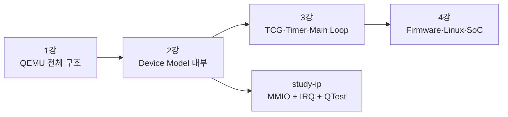

1강은 QEMU를 하나의 Machine으로 관찰했다. 2강은 그 Machine을 구성하는 최소 단위인 Device Model을 해부한다. 2강의 산출물은 이후 강의에서 계속 확장한다.

- 2강: QOM/qdev, MMIO, IRQ, reset, QTest
- 3강: Timer, virtual time, Main Loop, trace
- 4강: Device Tree, Linux platform driver, firmware와 regression
- 7강: 같은 Register contract를 QBox SystemC/TLM model로 구현
- 9강: QEMU model과 QBox model의 differential/conformance test

---

## 2. 학습 목표와 완료 기준

### 2.1 학습 목표

- QOM type registration과 runtime object composition을 설명한다.
- `DeviceState`와 `DeviceClass`의 역할을 구분한다.
- `SysBusDevice`가 MMIO와 IRQ endpoint를 노출하는 방법을 이해한다.
- `MemoryRegion`, `AddressSpace`, `MemoryRegionOps`, `MemoryRegionSection`, FlatView의 관계를 설명한다.
- valid/impl access constraint, endianness, alignment를 Hardware contract와 연결한다.
- level IRQ의 pending/mask/W1C/deassert 동작을 구현한다.
- ARM64 GIC와 RISC-V PLIC에 동일 Device를 연결한다.
- QTest로 Reset, ID, Read/Write, IRQ assert/deassert를 검증한다.

### 2.2 완료 기준

다음 경로를 자료 없이 설명할 수 있어야 한다.

```text
Guest load/store
  -> CPU AddressSpace
  -> FlatView / MemoryRegionSection
  -> MemoryRegionOps.read/write
  -> StudyIPState 변경
  -> IRQ_STATUS & IRQ_ENABLE
  -> qemu_set_irq()
  -> GIC 또는 PLIC
  -> Guest interrupt handler
  -> W1C acknowledge
  -> IRQ deassert
```

---

## 3. 왜 Device Model을 구조적으로 배워야 하는가

Register callback의 `switch` 문만 작성해도 간단한 demo는 동작할 수 있다. 그러나 실제 Firmware/BSP 선행 개발에서는 다음 결함이 빠르게 드러난다.

- QOM type은 등록되었지만 Machine에서 instance를 만들지 않았다.
- Device는 생성되었지만 `realize`되지 않았다.
- MMIO region은 존재하지만 system address space에 매핑되지 않았다.
- IRQ output은 선언했지만 GIC/PLIC sink와 연결하지 않았다.
- DT의 `reg`와 실제 MMIO allocation이 다르다.
- `IRQ_STATUS`는 set되지만 `IRQ_ENABLE` 변경 후 line을 재계산하지 않는다.
- W1C register를 일반 RW register처럼 구현해 IRQ가 내려가지 않는다.
- Reset 후 mutable state가 초기화되지 않아 warm reset regression이 실패한다.
- 8/16-bit access가 specification에 없는데 QEMU가 암묵적으로 허용한다.
- Linux boot test만 있어 device-level regression이 느리고 원인 분리가 어렵다.

따라서 Device Model은 다음 다섯 요소를 함께 설계해야 한다.

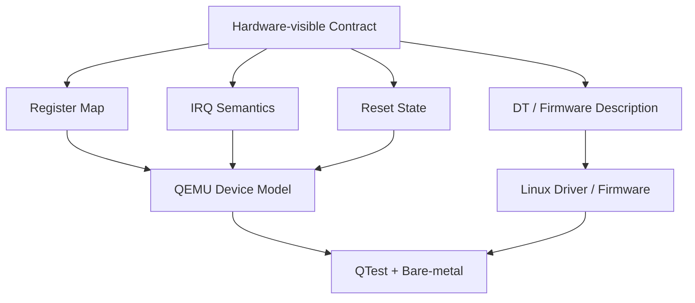

**설계 관점:** QEMU와 QBox의 구현 언어와 시간 모델은 달라도 Hardware-visible Contract가 같다면 Firmware와 Linux Driver는 동일하게 재사용할 수 있다.

---

## 4. 전체 Architecture와 용어 지도

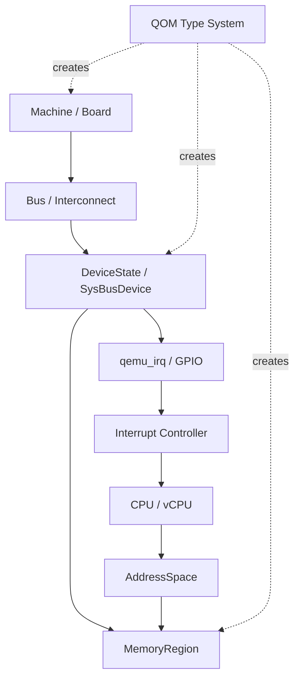

### 4.1 다섯 묶음

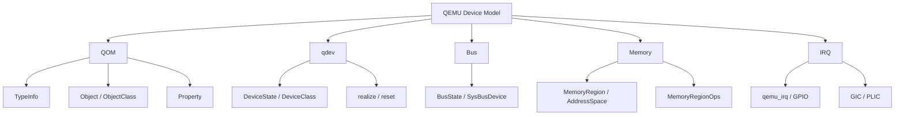

| 묶음 | 핵심 질문 | 대표 객체/API |
|---|---|---|
| QOM | 어떤 타입의 객체를 만들고 어떻게 상속·구성하는가? | `TypeInfo`, `Object`, `ObjectClass`, Property |
| qdev | 언제 Device가 Guest-visible 상태가 되는가? | `DeviceState`, `DeviceClass`, `realize`, reset |
| Bus | Device는 어느 topology에 속하고 어떤 자원을 노출하는가? | `BusState`, `SysBusDevice` |
| Memory | Guest 주소가 어느 callback 또는 RAM으로 dispatch되는가? | `MemoryRegion`, `AddressSpace`, `MemoryRegionOps` |
| IRQ | Device event가 어떻게 CPU exception으로 변환되는가? | `qemu_irq`, GPIO, GIC, PLIC |

### 4.2 Source Reading Map

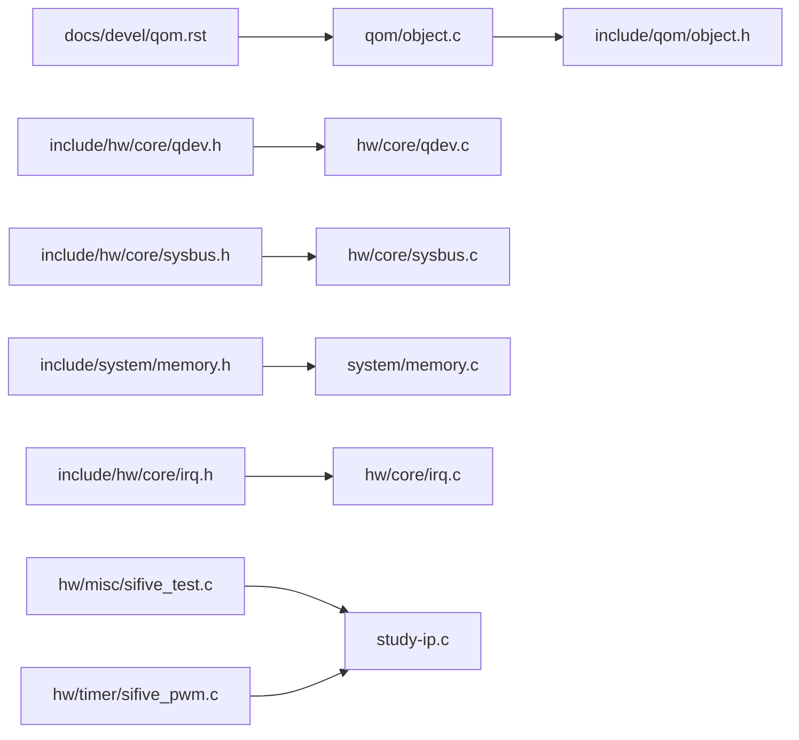

권장 읽기 순서는 문서 → Header → 작은 Device → 통합 code 순이다.

1. `docs/devel/qom.rst`
2. `include/qom/object.h`, `qom/object.c`
3. `include/hw/core/qdev.h`, `hw/core/qdev.c`
4. `include/hw/core/sysbus.h`, `hw/core/sysbus.c`
5. `include/system/memory.h`, `system/memory.c`
6. `include/hw/core/irq.h`, `hw/core/irq.c`
7. `hw/misc/sifive_test.c`
8. `hw/timer/sifive_pwm.c`
9. `hw/core/platform-bus.c`
10. `hw/arm/virt.c`, `hw/riscv/virt.c`
11. `tests/qtest/libqtest.h`, `tests/qtest/libqtest.c`

---

## 5. QOM: Type System과 Runtime Object

QOM, QEMU Object Model은 C 위에 동적 type registration, 단일 상속, stateless interface, property system을 제공한다. QOM을 C++ class와 완전히 동일시하면 ownership과 initialization order를 놓치기 쉽다. QOM의 핵심은 QEMU가 다양한 Machine과 Device를 이름으로 등록하고, runtime에 구성하며, introspection할 수 있게 만드는 것이다.

### 5.1 TypeInfo, ObjectClass, Object Instance

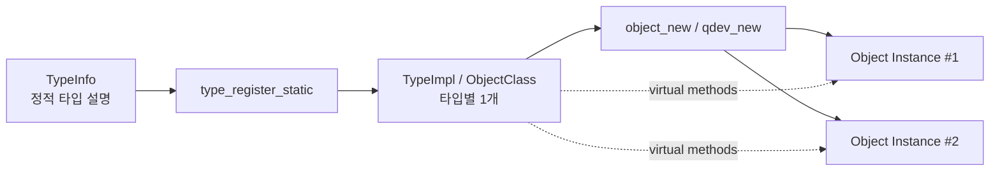

- `TypeInfo`: 정적 type 설명. 이름, parent type, instance/class size, initialization hook을 보유한다.
- `ObjectClass`: 특정 type당 하나 생성되는 class object. virtual method table과 type-level metadata를 보유한다.
- `Object`: runtime instance. `StudyIPState`처럼 instance별 mutable state를 보유한다.

`TypeInfo`는 Register file이 아니다. `ObjectClass`도 각 Device의 현재 상태를 저장하는 장소가 아니다. 현재 `DATA`, `STATUS`, `IRQ_STATUS` 값은 `StudyIPState` instance에 있어야 한다.

### 5.2 상속과 구조체 embedding

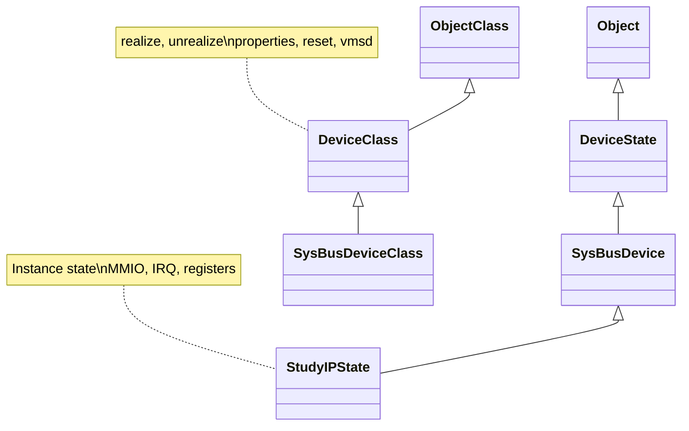

QEMU C code에서는 parent state를 구조체 첫 field로 embedding한다.

```c
struct StudyIPState {
    SysBusDevice parent_obj;

    MemoryRegion mmio;
    qemu_irq irq;

    uint32_t device_id;
    uint32_t version;
    uint32_t ctrl;
    uint32_t status;
    uint32_t data;
    uint32_t irq_status;
    uint32_t irq_enable;
    uint32_t delay;
    uint32_t fault_inject;
};
```

`StudyIPState`가 `SysBusDevice`를 embedding하면 다음을 상속받는다.

- `DeviceState`의 realized state, parent bus, GPIO list, child bus, reset state
- `Object`의 type 정보와 property/composition 기능
- `SysBusDevice`의 MMIO resource 목록과 IRQ output 관리

### 5.3 ObjectClass와 Instance State

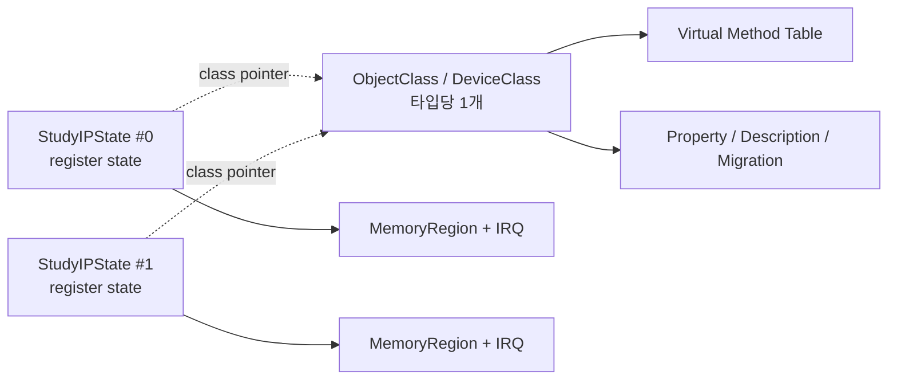

타입당 하나인 `DeviceClass`에 mutable Register를 넣으면 여러 instance가 상태를 공유하는 버그가 발생한다. 반대로 callback table을 instance마다 복제할 이유도 없다. 다음 원칙을 유지한다.

- Class: 동작 방법, callback, property metadata, migration description
- Instance: 현재 동작 상태, resource handle, register 값, timer state

### 5.4 Type 선언과 등록

```c
#define TYPE_STUDY_IP "study-ip"
OBJECT_DECLARE_SIMPLE_TYPE(StudyIPState, STUDY_IP)

static const TypeInfo study_ip_info = {
    .name          = TYPE_STUDY_IP,
    .parent        = TYPE_SYS_BUS_DEVICE,
    .instance_size = sizeof(StudyIPState),
    .instance_init = study_ip_init,
    .class_init    = study_ip_class_init,
};

static void study_ip_register_types(void)
{
    type_register_static(&study_ip_info);
}

type_init(study_ip_register_types)
```

읽을 때 확인할 항목은 다음과 같다.

1. `.name`: QOM type lookup에 사용하는 문자열.
2. `.parent`: `TYPE_SYS_BUS_DEVICE`를 상속한다.
3. `.instance_size`: `StudyIPState`를 allocate할 크기.
4. `.instance_init`: instance 생성 시 실패 없이 기본 object/resource를 준비한다.
5. `.class_init`: callback과 property metadata를 class에 등록한다.
6. `type_init()`: QEMU module initialization 과정에서 type을 등록한다.

### 5.5 `OBJECT_DECLARE_SIMPLE_TYPE`

`OBJECT_DECLARE_SIMPLE_TYPE(StudyIPState, STUDY_IP)`는 typed cast와 declaration boilerplate를 생성한다. `study-ip`는 class에 자체 virtual method를 추가하지 않으므로 simple form이 적합하다. 공통 accelerator base class를 만들고 subclass별 backend method를 추가한다면 `OBJECT_DECLARE_TYPE`과 별도 `StudyIPClass`를 사용한다.

### 5.6 QOM Tree는 Composition Tree

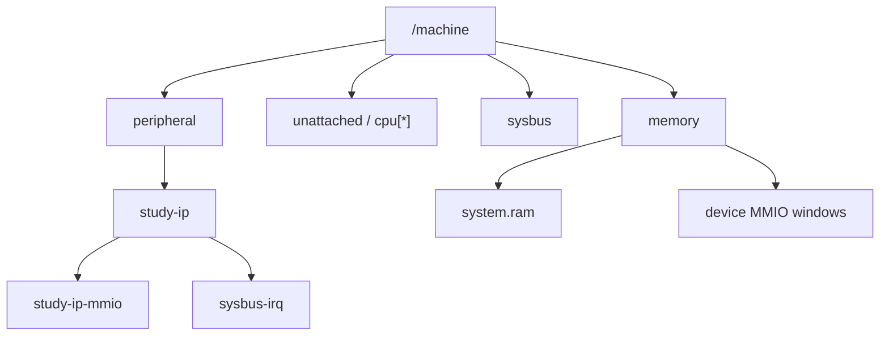

`info qom-tree`는 상속 계층을 출력하는 명령이 아니라 현재 Machine을 구성하는 object composition을 보여준다. 다음 세 명령은 서로 다른 관점을 제공한다.

```text
(qemu) info qom-tree   # Object composition과 canonical path
(qemu) info qtree      # qdev/bus/resource 정보
(qemu) info mtree      # AddressSpace와 MemoryRegion mapping
```

`study-ip`를 찾을 때 한 명령만 사용하지 말고 canonical path, parent bus, MMIO base/size를 교차 검증한다.

---

## 6. qdev: Device Lifecycle과 Property

QOM의 모든 객체가 Guest Device는 아니다. qdev는 `TYPE_DEVICE`를 기반으로 realize/unrealize, Property, Bus 연결, GPIO/Clock, reset, migration 같은 Device lifecycle을 추가한다.

### 6.1 DeviceState와 DeviceClass

| 구분 | `DeviceState` | `DeviceClass` |
|---|---|---|
| 개수 | Device instance마다 하나 | Type마다 하나 |
| 주요 내용 | realized, parent_bus, GPIO, child bus, reset state | realize/unrealize, props, reset, VMState |
| study-ip 예 | `data`, `status`, `irq_status`, `MemoryRegion`, `qemu_irq` | `study_ip_realize`, property table, description |
| 변경 시점 | Guest 실행 중 계속 변화 | class init 후 일반적으로 고정 |

### 6.2 2단계 생성


1. `qdev_new()` 또는 `object_new()`가 instance를 만들고 `instance_init`을 호출한다.
2. Machine code가 static Property를 설정한다.
3. `qdev_realize()` 또는 `sysbus_realize_and_unref()`가 `DeviceClass.realize`를 호출한다.
4. Machine이 MMIO base와 IRQ sink를 연결한다.
5. Reset 후 Guest가 접근한다.

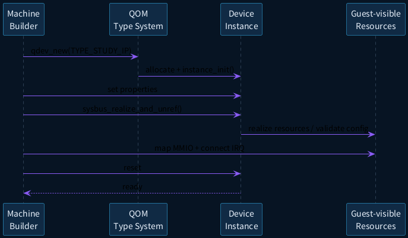

### 6.3 단계별 책임

| 단계 | 권장 작업 | 피해야 할 작업 |
|---|---|---|
| `instance_init` | `MemoryRegion`, IRQ endpoint, child object 초기화 | Property validation error 반환, 외부 topology 의존 |
| Property 설정 | ID, version, clock, feature 선택 | realize 후 static property 변경 |
| `realize` | Property 검증, timer/backend 최종화, 오류 반환 | Guest runtime state 초기값만 설정 |
| reset | documented reset value 복원, 반복 가능성 보장 | Host resource 재생성, leak 발생 |
| `unrealize` | realize에서 획득한 외부 resource 해제 | Object instance memory 직접 free |

### 6.4 Property는 Register가 아니다

Property는 Host-side model configuration이다. 예를 들어 Machine이 `device-id`를 ARM과 RISC-V에서 다르게 설정할 수 있다. 반면 `IRQ_ENABLE`은 Guest가 MMIO로 변경하는 Register다.

```c
static const Property study_ip_properties[] = {
    DEFINE_PROP_UINT32("device-id", StudyIPState,
                       device_id, 0x5354),
    DEFINE_PROP_UINT32("version", StudyIPState,
                       version, 1),
};

static void study_ip_realize(DeviceState *dev, Error **errp)
{
    StudyIPState *s = STUDY_IP(dev);

    if (s->version == 0 || s->version > UINT16_MAX) {
        error_setg(errp, "invalid version %u", s->version);
    }
}

static void study_ip_class_init(ObjectClass *klass,
                                const void *data)
{
    DeviceClass *dc = DEVICE_CLASS(klass);

    dc->realize = study_ip_realize;
    device_class_set_props(dc, study_ip_properties);
    device_class_set_legacy_reset(dc, study_ip_reset);
    dc->desc = "Study MMIO and IRQ device";
}
```

`realize`는 static configuration 오류를 `Error **errp`로 반환할 수 있는 단계다. `instance_init`은 introspection 과정에서도 호출될 수 있으므로 실패나 process exit를 수행하지 않아야 한다.

### 6.5 Reset: Legacy와 Resettable

교육용 sample은 읽기 쉬운 legacy reset을 사용한다.

```c
static void study_ip_reset(DeviceState *dev)
{
    StudyIPState *s = STUDY_IP(dev);

    s->ctrl = 0;
    s->status = 0;
    s->data = 0;
    s->irq_status = 0;
    s->irq_enable = 0;
    s->delay = 0;
    s->fault_inject = 0;
    study_ip_update_irq(s);
}
```

하지만 QEMU의 modern reset model은 `Resettable`의 enter/hold/exit phase를 제공한다.

- `enter`: local state만 초기화한다. 다른 object에 side effect를 발생시키지 않는다.
- `hold`: 모든 관련 object가 enter를 마친 뒤 외부 IRQ/connection에 영향을 줄 수 있다.
- `exit`: reset deassert 후 필요한 동작을 수행할 수 있다.

**중요:** `enter`에서 IRQ를 raise/lower하거나 Guest memory를 읽고 쓰지 않는다. Automotive SoC의 reset domain, warm reset, partial reset을 모델링하려면 legacy callback보다 phase model을 사용한다.

### 6.6 Migration 고려

2강 실습은 migration을 구현하지 않지만, 제품 수준 Device Model은 Guest-visible mutable state를 `VMStateDescription`에 포함해야 한다. 빠뜨리면 save/restore 또는 live migration 후 Register와 pending IRQ가 불일치할 수 있다.

---

## 7. BusState와 SysBusDevice

### 7.1 QOM Composition과 qbus Ownership

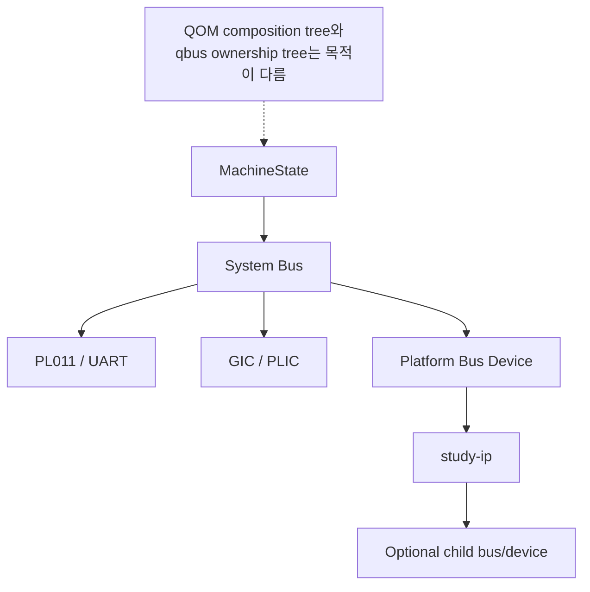

QOM object tree와 qbus tree는 목적이 다르다.

- QOM composition: object property path, ownership/introspection 중심
- qbus topology: 어느 Bus가 어떤 Device를 포함하고, Device가 어떤 child bus를 제공하는지 표현

Reset traversal은 qbus child 관계를 사용할 수 있으므로 QOM parent path만 보고 reset domain을 추론하면 안 된다.

### 7.2 SysBusDevice

`SysBusDevice`는 main system bus에 직접 연결되는 SoC peripheral을 위한 공통 base다. 실제 AMBA AXI protocol을 cycle 단위로 모델링하는 것이 아니다. Platform-level로 다음 자원을 선언한다.

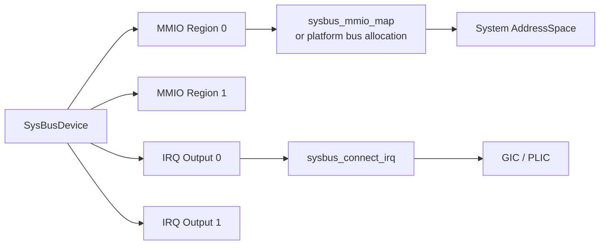

대표 API:

```c
void sysbus_init_mmio(SysBusDevice *dev, MemoryRegion *memory);
void sysbus_init_irq(SysBusDevice *dev, qemu_irq *p);
void sysbus_mmio_map(SysBusDevice *dev, int n, hwaddr addr);
void sysbus_connect_irq(SysBusDevice *dev, int n, qemu_irq irq);
bool sysbus_realize(SysBusDevice *dev, Error **errp);
```

Device는 MMIO/IRQ endpoint를 선언하고, 주소와 IRQ sink는 Machine이 결정하는 구조가 재사용성이 좋다.

### 7.3 Machine 생성 Sequence

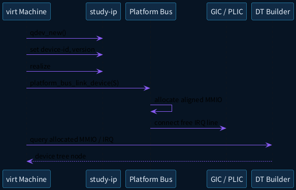

Machine code가 반드시 확인할 결과:

- Device instance가 realize되었는가?
- MMIO region이 어느 base에 매핑되었는가?
- IRQ output이 어느 GIC SPI 또는 PLIC source와 연결되었는가?
- DT/ACPI가 같은 정보를 Guest에 전달하는가?

---

## 8. MemoryRegion과 AddressSpace

### 8.1 Memory Graph

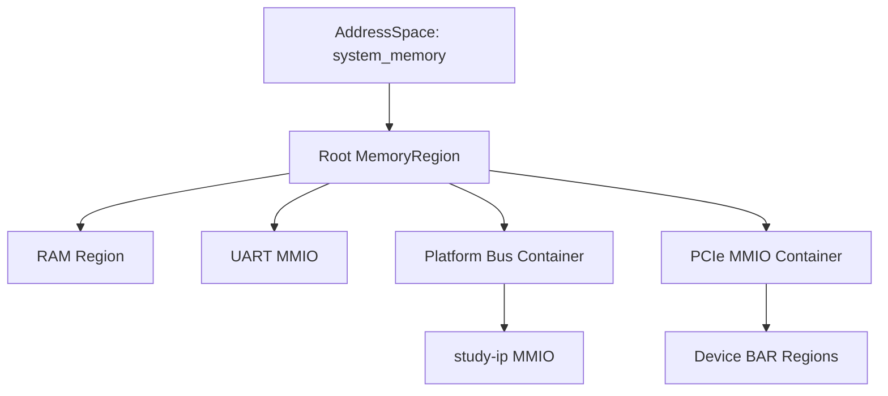

`MemoryRegion`은 RAM, MMIO callback, Container, Alias, IOMMU 같은 memory graph node다. Root region 아래에 subregion을 추가하여 전체 physical address map을 조립한다.

### 8.2 MemoryRegion 종류

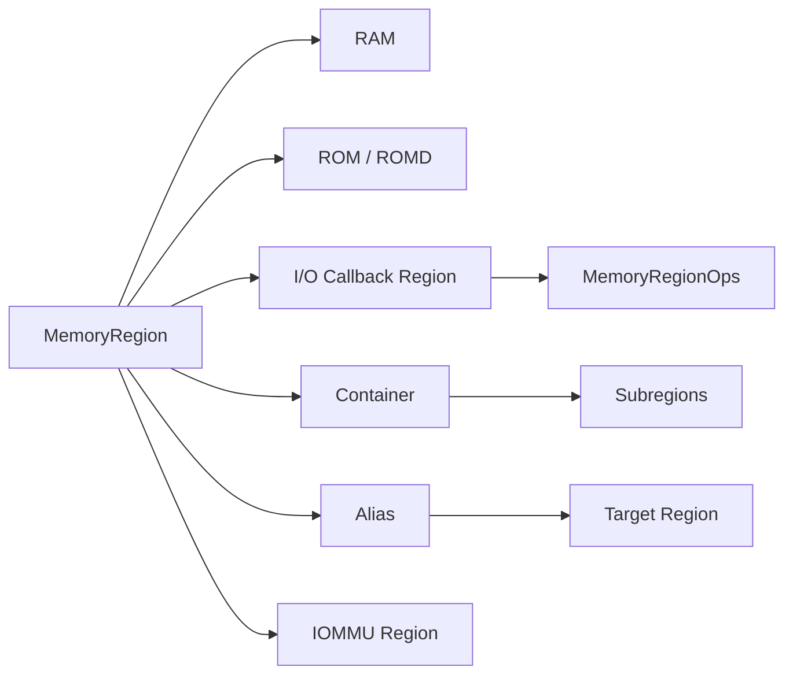

- RAM: Host backing memory를 Guest RAM으로 노출.
- ROM/ROMD: 읽기 중심 firmware/flash semantics.
- I/O Region: `MemoryRegionOps` callback으로 access 처리.
- Container: 자체 storage 없이 subregion을 묶는 주소 window.
- Alias: 다른 region 일부를 다른 base에 재노출.
- IOMMU Region: 입력 주소를 target AddressSpace의 translated address로 변환.

### 8.3 AddressSpace는 View

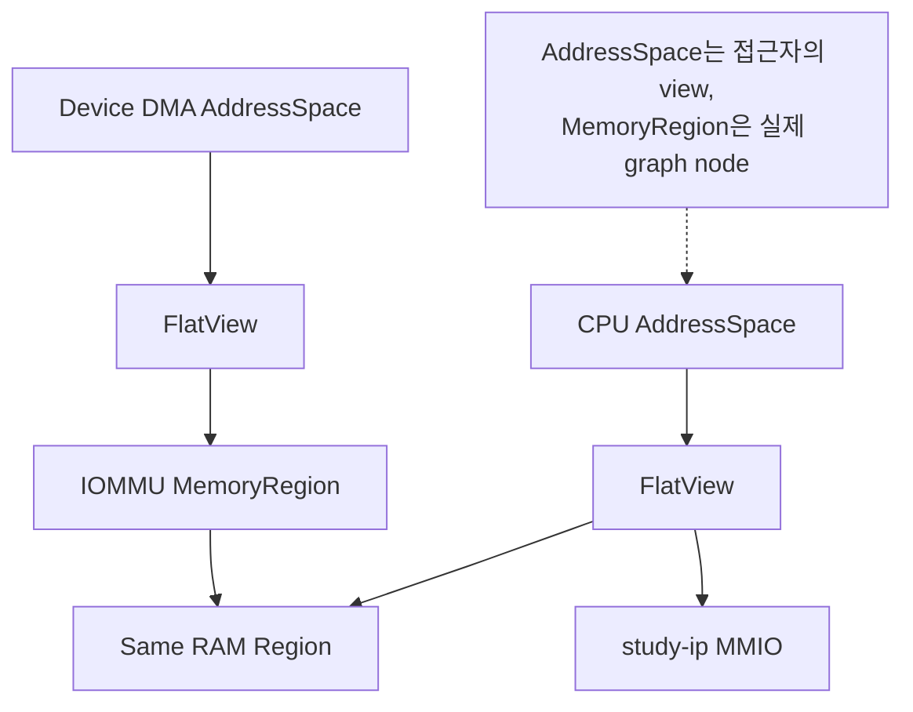

`AddressSpace`는 특정 requester가 바라보는 root MemoryRegion과 그 FlatView다. CPU와 DMA master가 항상 같은 AddressSpace를 사용하는 것은 아니다. IOMMU가 있으면 Device DMA AddressSpace는 IOMMU MemoryRegion을 거쳐 RAM에 도달할 수 있다.

**정리:** MemoryRegion은 동작과 graph node, AddressSpace는 접근 관점이다.

### 8.4 Dispatch Path

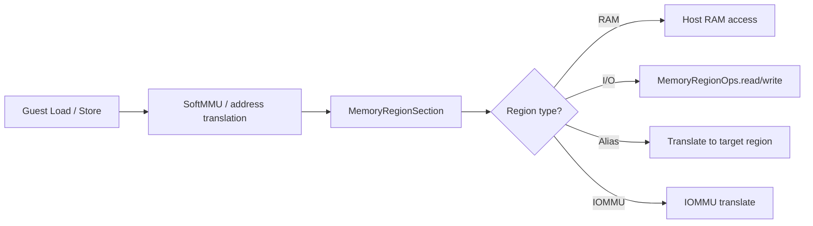

CPU physical access가 MMIO callback에 도달하기까지 개념적으로 다음이 발생한다.

1. CPU translation/TLB가 Guest physical access를 만든다.
2. AddressSpace FlatView에서 해당 `MemoryRegionSection`을 찾는다.
3. RAM, I/O, Alias, IOMMU 등 region type에 따라 dispatch한다.
4. I/O region이면 access constraint를 적용한다.
5. `MemoryRegionOps.read/write`를 relative offset으로 호출한다.
6. Endianness 규칙을 적용해 CPU에 값을 반환한다.

### 8.5 MemoryRegionOps

```c
static const MemoryRegionOps study_ip_ops = {
    .read = study_ip_read,
    .write = study_ip_write,
    .endianness = DEVICE_LITTLE_ENDIAN,
    .valid = {
        .min_access_size = 4,
        .max_access_size = 4,
        .unaligned = false,
    },
    .impl = {
        .min_access_size = 4,
        .max_access_size = 4,
        .unaligned = false,
    },
};
```

Callback의 `addr`는 system physical base가 아니라 **MemoryRegion 시작 기준 상대 offset**이다. 따라서 `switch (offset)`은 Register offset과 바로 비교할 수 있다.

### 8.6 `valid`와 `impl`

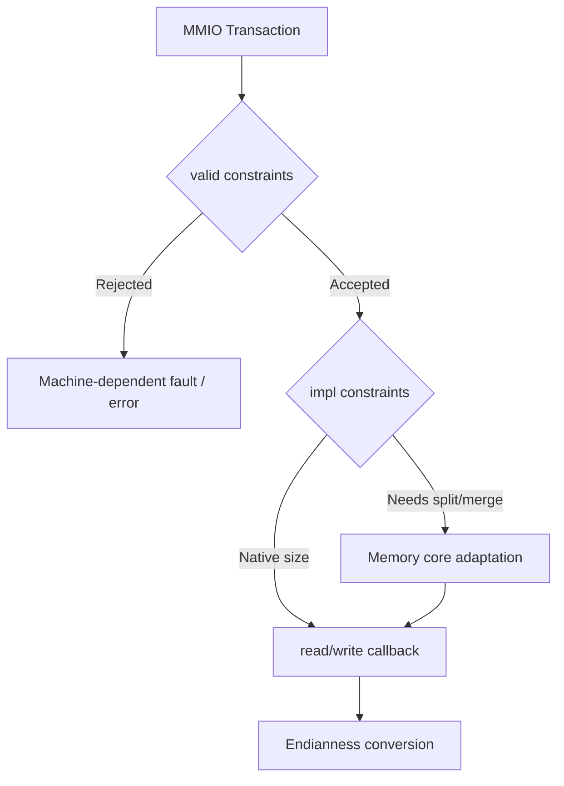

- `valid`: Guest-visible Hardware rule. 허용되지 않은 size/alignment는 transaction을 reject한다.
- `impl`: callback implementation이 직접 처리하는 단위. Memory core가 필요하면 split/merge할 수 있다.

`study-ip`는 32-bit naturally aligned access만 정의하므로 둘 다 min/max 4, unaligned false로 둔다. 8-bit access를 허용하려면 partial write semantics를 specification에 먼저 정의해야 한다.

### 8.7 Endianness

`DEVICE_LITTLE_ENDIAN`은 Register byte order를 명시한다. Target CPU가 little-endian이라는 가정으로 `DEVICE_NATIVE_ENDIAN`을 사용하면 다른 target 또는 endian configuration에서 모델이 달라질 수 있다.

### 8.8 Read Sequence

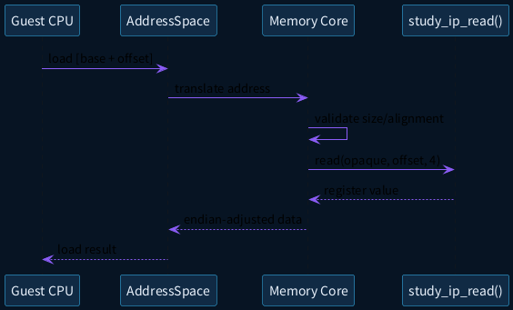

### 8.9 Write Sequence

```plantuml
@startuml
skinparam backgroundColor #071423
skinparam defaultFontName "Noto Sans CJK KR"
skinparam sequenceArrowColor #8B5CF6
skinparam participantBackgroundColor #102A44
skinparam participantBorderColor #38BDF8
skinparam participantFontColor #EAF2FC
participant "Guest CPU" as CPU
participant "Memory Core" as MEM
participant "study_ip_write()" as WR
participant "IRQ Logic" as IRQ
CPU -> MEM: store CTRL.START
MEM -> WR: write(offset, value, 4)
WR -> WR: execute command synchronously
WR -> WR: STATUS + IRQ_STATUS update
WR -> IRQ: study_ip_update_irq()
IRQ --> WR: output level
WR --> MEM: return
MEM --> CPU: store complete
@enduml
```

Write callback에서 Host file I/O나 긴 blocking 작업을 수행하면 vCPU execution과 전체 Simulation responsiveness를 악화시킨다. 3강에서 command completion을 Timer callback으로 분리하는 이유다.

### 8.10 Invalid Access 정책

두 부류를 구분한다.

1. Size/alignment 위반: `MemoryRegionOps.valid`에서 reject될 수 있다.
2. 유효 size이지만 존재하지 않는 offset: callback default에서 `LOG_GUEST_ERROR`를 남기고 specification의 read/write policy를 따른다.

`LOG_UNIMP`는 specification상 feature가 존재하지만 모델이 아직 구현하지 않은 경우에 사용한다. 정의되지 않은 offset과 구현 누락을 같은 로그로 취급하지 않는다.

---

## 9. Interrupt Modeling

### 9.1 pending, mask, line

```mermaid
flowchart LR
    EVENT[Device Event] --> STATUS[IRQ_STATUS set]
    MASK[IRQ_ENABLE] --> AND{pending & enabled}
    STATUS --> AND
    AND --> LEVEL[qemu_set_irq level]
    LEVEL --> GPIO[GPIO/IRQ connection]
    GPIO --> INTC[Interrupt Controller]
    INTC --> CPU[CPU exception]
    ACK[Guest W1C] --> STATUS
```

`study-ip`의 level은 다음 식으로 계산한다.

```c
level = (irq_status & irq_enable) != 0;
```

- event 발생: `IRQ_STATUS` bit set
- mask enable: 해당 bit가 `IRQ_ENABLE`에도 set되면 line assert
- ISR acknowledge: Guest가 W1C write로 pending bit clear
- line 갱신: pending & mask가 0이면 deassert

### 9.2 Level과 Edge

**Level-triggered**는 원인이 남아 있는 동안 line을 유지한다. W1C status와 자연스럽게 결합하며 event loss를 줄인다. 단, pending clear가 실패하면 IRQ storm이 발생한다.

**Edge-triggered**는 transition 자체가 event다. pulse duration, 이미 high인 상태에서 재발생, interrupt controller의 edge capture를 명확히 해야 한다. 단순히 pulse만 발생시키고 sticky pending을 두지 않으면 debug와 recovery가 어려울 수 있다.

### 9.3 IRQ Helper

```c
static void study_ip_update_irq(StudyIPState *s)
{
    bool level = (s->irq_status & s->irq_enable) != 0;

    qemu_set_irq(s->irq, level);
}

static void study_ip_complete(StudyIPState *s, bool error)
{
    s->status = error ? STATUS_ERROR : STATUS_DONE;
    s->irq_status |= error ? IRQ_ERROR : IRQ_DONE;
    study_ip_update_irq(s);
}
```

IRQ level 계산을 여러 callback에 복제하지 않고 `study_ip_update_irq()` 하나에 모으면 mask 변경, completion, W1C, reset의 behavior가 일관된다.

### 9.4 IRQ Sequence

```plantuml
@startuml
skinparam backgroundColor #071423
skinparam defaultFontName "Noto Sans CJK KR"
skinparam sequenceArrowColor #8B5CF6
skinparam participantBackgroundColor #102A44
skinparam participantBorderColor #38BDF8
skinparam participantFontColor #EAF2FC
participant "study-ip" as DEV
participant "qemu_irq" as QIRQ
participant "GIC / PLIC" as INTC
participant "Guest CPU" as CPU
participant "IRQ Handler" as ISR
DEV -> DEV: IRQ_STATUS.DONE = 1
DEV -> QIRQ: qemu_set_irq(1)
QIRQ -> INTC: assert input
INTC -> CPU: interrupt exception
CPU -> ISR: enter handler
ISR -> DEV: read STATUS / IRQ_STATUS
ISR -> DEV: write IRQ_STATUS.DONE (W1C)
DEV -> QIRQ: qemu_set_irq(0)
QIRQ -> INTC: deassert input
ISR --> CPU: return
@enduml
```

### 9.5 ARM64와 RISC-V64 연결

```mermaid
flowchart TB
    STUDY[study-ip IRQ output] --> SPLIT{Machine}
    SPLIT -->|ARM64| PBA[Platform Bus IRQ 112..175]
    PBA --> GIC[GICv3 SPI]
    SPLIT -->|RISC-V64| PBR[Platform Bus IRQ 64..95]
    PBR --> PLIC[PLIC source]
    GIC --> ACPU[AArch64 IRQ exception]
    PLIC --> RCPU[RISC-V S-mode external interrupt]
```

QEMU `v11.0.2` source 기준:

- ARM `virt`의 platform bus MMIO window는 `0x0c000000`, size `0x02000000`이다.
- ARM platform bus IRQ map은 112부터 64개 line을 사용한다.
- RISC-V `virt`의 platform bus MMIO window는 `0x04000000`, size `0x02000000`이다.
- RISC-V platform bus IRQ source는 64부터 32개다.

이 숫자는 tag와 Machine version에 종속될 수 있다. 실습 code는 실제 allocation 결과를 query하여 DT에 반영해야 한다.

---

## 10. study-ip Hardware-visible Contract

### 10.1 Block Diagram

```mermaid
flowchart LR
    CPU[CPU / Driver] --> MMIO[4 KiB MMIO]
    MMIO --> REGS[Register File]
    REGS --> CMD[Command Engine]
    CMD --> DATA[DATA transform]
    CMD --> STATUS[STATUS]
    CMD --> PEND[IRQ_STATUS]
    MASK[IRQ_ENABLE] --> IRQLOGIC[IRQ logic]
    PEND --> IRQLOGIC
    IRQLOGIC --> IRQ[IRQ output]
    FI[FAULT_INJECT] --> CMD
```

### 10.2 Register Map

| Offset | Register | Access | 설명 |
|---:|---|---|---|
| `0x000` | `ID` | RO | Device ID와 Version |
| `0x004` | `CTRL` | RW | ENABLE, START, SW_RESET |
| `0x008` | `STATUS` | RO | BUSY, DONE, ERROR |
| `0x00C` | `DATA` | RW | 입력 및 결과 데이터 |
| `0x010` | `IRQ_STATUS` | W1C | DONE/ERROR pending |
| `0x014` | `IRQ_ENABLE` | RW | Interrupt mask |
| `0x018` | `DELAY` | RW | 3강 비동기 지연 확장용 |
| `0x01C` | `FAULT_INJECT` | RW | Error/timeout injection |

공통 규칙:

- MMIO size: 4 KiB
- Register size: 32-bit
- Endianness: little-endian
- Alignment: natural 4-byte alignment
- Undefined offset read: 0 반환 + Guest error log
- Undefined offset write: 무시 + Guest error log
- `IRQ_STATUS`: W1C
- `STATUS`: sticky completion state, 다음 START 또는 SW_RESET에서 갱신

### 10.3 State Machine

```mermaid
stateDiagram-v2
    [*] --> Idle: reset
    Idle --> Busy: CTRL.START & ENABLE
    Busy --> Done: normal completion
    Busy --> Error: FAULT_INJECT.ERROR
    Done --> Idle: next START / SW_RESET
    Error --> Idle: SW_RESET
    Done: STATUS.DONE=1\nIRQ_STATUS.DONE=1
    Error: STATUS.ERROR=1\nIRQ_STATUS.ERROR=1
```

2강에서는 command가 `study_ip_write()` 호출 중 즉시 완료되므로 `BUSY`를 external software가 관찰하지 못할 수도 있다. 이는 functional baseline의 limitation이다. 3강의 asynchronous model에서 `BUSY` 기간과 `DELAY` 의미가 실제로 관찰된다.

---


## 11. study-ip QEMU 구현

### 11.1 State Structure

```c
struct StudyIPState {
    SysBusDevice parent_obj;

    MemoryRegion mmio;
    qemu_irq irq;

    uint32_t device_id;
    uint32_t version;
    uint32_t ctrl;
    uint32_t status;
    uint32_t data;
    uint32_t irq_status;
    uint32_t irq_enable;
    uint32_t delay;
    uint32_t fault_inject;
};
```

`MemoryRegion`과 `qemu_irq`는 Host-side QEMU resource handle이지만, `ctrl`, `status`, `data`, `irq_status`는 Guest-visible state다. 향후 migration을 지원할 때는 Guest-visible mutable state와 Timer state를 VMState에 포함한다.

### 11.2 Register Read

```c
static uint64_t study_ip_read(void *opaque,
                              hwaddr offset,
                              unsigned size)
{
    StudyIPState *s = opaque;

    switch (offset) {
    case R_ID:
        return (s->version << 16) | s->device_id;
    case R_CTRL:
        return s->ctrl;
    case R_STATUS:
        return s->status;
    case R_DATA:
        return s->data;
    case R_IRQ_STATUS:
        return s->irq_status;
    case R_IRQ_ENABLE:
        return s->irq_enable;
    case R_DELAY:
        return s->delay;
    case R_FAULT_INJECT:
        return s->fault_inject;
    default:
        qemu_log_mask(LOG_GUEST_ERROR,
                      "%s: bad read offset 0x%" HWADDR_PRIx "\n",
                      TYPE_STUDY_IP, offset);
        return 0;
    }
}
```

읽기 callback을 검토할 때 다음을 확인한다.

1. RO Register가 write callback에서 변경되지 않는가?
2. ID field 조합이 binding/specification과 같은가?
3. Reserved bit가 0으로 읽히는가?
4. Read side effect가 있는 register라면 clear/pop semantics가 명시되어 있는가?
5. Unknown offset가 silent success로 숨겨지지 않는가?

### 11.3 Register Write

```c
static void study_ip_write(void *opaque,
                           hwaddr offset,
                           uint64_t value,
                           unsigned size)
{
    StudyIPState *s = opaque;
    uint32_t v = value;

    switch (offset) {
    case R_CTRL:
        if (v & CTRL_SW_RESET) {
            study_ip_reset_registers(s);
            break;
        }
        s->ctrl = v & CTRL_WRITABLE_MASK;
        if ((s->ctrl & CTRL_ENABLE) &&
            (s->ctrl & CTRL_START)) {
            study_ip_execute(s);
        }
        break;
    case R_DATA:
        s->data = v;
        break;
    case R_IRQ_STATUS:      /* W1C */
        s->irq_status &= ~v;
        study_ip_update_irq(s);
        break;
    case R_IRQ_ENABLE:
        s->irq_enable = v & IRQ_ALL;
        study_ip_update_irq(s);
        break;
    case R_DELAY:
        s->delay = v;
        break;
    case R_FAULT_INJECT:
        s->fault_inject = v & FAULT_ALL;
        break;
    default:
        qemu_log_mask(LOG_GUEST_ERROR,
                      "%s: bad write offset 0x%" HWADDR_PRIx "\n",
                      TYPE_STUDY_IP, offset);
    }
}
```

핵심은 Register type마다 다른 semantics를 구현하는 것이다.

- RW: writable mask를 적용한 뒤 state 저장.
- W1C: `state &= ~value`; 0을 쓴 bit는 유지한다.
- Command: `START` write가 state transition을 일으킨다.
- SW Reset: 일반 control bit 저장과 분리하여 reset sequence를 실행한다.
- RO: write를 무시하거나 Guest error log를 남긴다.

`CTRL_START`를 state에 계속 유지할지 self-clear할지는 Hardware contract에 명시해야 한다. 본 예제는 단순화를 위해 writable field에 저장하지만, 실물 IP가 command strobe로 정의했다면 callback에서 즉시 clear해야 한다.

### 11.4 Command Engine

```c
static void study_ip_execute(StudyIPState *s)
{
    s->status = STATUS_BUSY;

    if (s->fault_inject & FAULT_ERROR) {
        study_ip_complete(s, true);
        return;
    }

    /* Lesson 2: synchronous model. Lesson 3 adds QEMUTimer. */
    s->data = (s->data << 1) ^ 0x5a5a5a5aU;
    study_ip_complete(s, false);
}
```

Deterministic transform를 사용하면 QTest expected value가 안정적이다. 2강은 command callback 안에서 즉시 완료한다. 실제 SoC device latency를 의미하지 않으며, 실행 성능 측정에 사용하지 않는다.

### 11.5 IRQ Logic

```c
static void study_ip_update_irq(StudyIPState *s)
{
    bool level = (s->irq_status & s->irq_enable) != 0;

    qemu_set_irq(s->irq, level);
}

static void study_ip_complete(StudyIPState *s, bool error)
{
    s->status = error ? STATUS_ERROR : STATUS_DONE;
    s->irq_status |= error ? IRQ_ERROR : IRQ_DONE;
    study_ip_update_irq(s);
}
```

한 helper에서 line을 계산하는 방식은 다음 오류를 줄인다.

- `IRQ_ENABLE`을 1로 바꿨는데 이미 pending인 event가 line에 반영되지 않음.
- W1C 후 line을 내리지 않아 IRQ storm 발생.
- Error path만 다른 mask rule을 적용.
- Reset 후 stale line이 유지됨.

### 11.6 instance_init

```c
static void study_ip_init(Object *obj)
{
    StudyIPState *s = STUDY_IP(obj);

    memory_region_init_io(&s->mmio, obj,
                          &study_ip_ops, s,
                          TYPE_STUDY_IP, 0x1000);
    sysbus_init_mmio(SYS_BUS_DEVICE(obj), &s->mmio);
    sysbus_init_irq(SYS_BUS_DEVICE(obj), &s->irq);
}
```

`memory_region_init_io()`는 `study-ip`의 4 KiB I/O region과 `MemoryRegionOps`를 연결한다. `sysbus_init_mmio()`는 이 region을 SysBus resource 목록에 등록한다. 이 시점에는 아직 system physical base가 없다.

`sysbus_init_irq()`는 Device의 outbound IRQ endpoint를 선언한다. 어느 GIC/PLIC input과 연결되는지는 Machine code가 결정한다.

### 11.7 Reset

```c
static void study_ip_reset(DeviceState *dev)
{
    StudyIPState *s = STUDY_IP(dev);

    s->ctrl = 0;
    s->status = 0;
    s->data = 0;
    s->irq_status = 0;
    s->irq_enable = 0;
    s->delay = 0;
    s->fault_inject = 0;
    study_ip_update_irq(s);
}
```

이 코드는 학습용 legacy reset이다. production model에서는 다음처럼 phase를 나누는 것이 안전하다.

```text
enter:
  - ctrl/status/data/pending/mask/timer-local-state 초기화
  - 다른 object에 side effect 금지
hold:
  - IRQ output deassert
  - child/backend reset propagation
exit:
  - reset release 후 필요 동작
```

### 11.8 Property와 realize

```c
static const Property study_ip_properties[] = {
    DEFINE_PROP_UINT32("device-id", StudyIPState,
                       device_id, 0x5354),
    DEFINE_PROP_UINT32("version", StudyIPState,
                       version, 1),
};

static void study_ip_realize(DeviceState *dev, Error **errp)
{
    StudyIPState *s = STUDY_IP(dev);

    if (s->version == 0 || s->version > UINT16_MAX) {
        error_setg(errp, "invalid version %u", s->version);
    }
}

static void study_ip_class_init(ObjectClass *klass,
                                const void *data)
{
    DeviceClass *dc = DEVICE_CLASS(klass);

    dc->realize = study_ip_realize;
    device_class_set_props(dc, study_ip_properties);
    device_class_set_legacy_reset(dc, study_ip_reset);
    dc->desc = "Study MMIO and IRQ device";
}
```

Property default가 deterministic해야 QTest가 Machine 옵션에 따라 흔들리지 않는다. `realize`는 configuration dependency를 검증하는 적절한 위치다. 예를 들어 향후 `clock-frequency`, `num-queues`, `dma-address-width` 같은 property가 추가되면 범위와 조합을 여기서 검사한다.

### 11.9 Build System

```text
# hw/misc/Kconfig
config STUDY_IP
    bool

# hw/misc/meson.build
system_ss.add(when: 'CONFIG_STUDY_IP',
              if_true: files('study-ip.c'))

# ARM/RISC-V study machine Kconfig
select STUDY_IP
```

실제 tree에서는 `hw/misc/Kconfig`와 `hw/misc/meson.build`의 기존 패턴을 따른다. Device를 특정 Machine에서 항상 필요로 하면 Machine Kconfig가 `select STUDY_IP`하도록 구성한다. 여러 Machine이 선택적으로 사용할 수 있다면 default enable 정책과 dependency를 검토한다.

### 11.10 최소 source layout

```text
include/hw/misc/study-ip.h
hw/misc/study-ip.c
hw/misc/Kconfig
hw/misc/meson.build
tests/qtest/study-ip-test.c
tests/qtest/meson.build
```

공개 header에는 Register offset를 무조건 노출하지 않아도 된다. Machine/Device 내부 API와 Guest software용 register header의 ownership을 분리한다. Linux/U-Boot/Bare-metal에서 공유할 register contract는 별도 specification 또는 generated header로 관리하는 편이 좋다.

---

## 12. ARM64와 RISC-V64 Machine 통합

### 12.1 공통 전략

```mermaid
flowchart TB
    QNEW[qdev_new TYPE_STUDY_IP] --> PROP[qdev_prop_set_*]
    PROP --> REAL[sysbus_realize_and_unref]
    REAL --> LINK[platform_bus_link_device]
    LINK --> MMAP[Allocate MMIO in platform window]
    LINK --> IRQMAP[Allocate platform IRQ]
    MMAP --> DT[Emit DT reg]
    IRQMAP --> DTIRQ[Emit DT interrupts]
    DT --> DRIVER[Guest driver probe]
    DTIRQ --> DRIVER
```

Machine 통합은 네 단계로 분리한다.

1. `qdev_new(TYPE_STUDY_IP)`로 instance 생성.
2. Architecture/board-specific Property 설정.
3. `sysbus_realize_and_unref()` 호출.
4. Platform bus에 Device를 link하고, 실제 MMIO/IRQ allocation을 firmware description에 반영.

### 12.2 ARM64 예

```c
static void create_study_ip(VirtMachineState *vms)
{
    DeviceState *dev = qdev_new(TYPE_STUDY_IP);

    qdev_prop_set_uint32(dev, "device-id", 0x4152);
    qdev_prop_set_uint32(dev, "version", 1);
    sysbus_realize_and_unref(SYS_BUS_DEVICE(dev), &error_fatal);

    platform_bus_link_device(
        PLATFORM_BUS_DEVICE(vms->platform_bus_dev),
        SYS_BUS_DEVICE(dev));
}
```

QEMU `v11.0.2`의 ARM `virt` source에서 platform bus window와 IRQ pool을 확인할 수 있다.

```text
MMIO window: 0x0c000000, size 0x02000000
IRQ pool:    base 112, count 64
```

`platform_bus_link_device()`는 아직 연결되지 않은 SysBus MMIO region과 IRQ를 platform bus의 빈 공간/line에 배치한다. 따라서 Device code가 ARM GIC 내부 함수를 직접 호출할 필요가 없다.

### 12.3 RISC-V64 예

```c
static void create_study_ip(RISCVVirtState *s)
{
    DeviceState *dev = qdev_new(TYPE_STUDY_IP);

    qdev_prop_set_uint32(dev, "device-id", 0x5256);
    qdev_prop_set_uint32(dev, "version", 1);
    sysbus_realize_and_unref(SYS_BUS_DEVICE(dev), &error_fatal);

    platform_bus_link_device(
        PLATFORM_BUS_DEVICE(s->platform_bus_dev),
        SYS_BUS_DEVICE(dev));
}
```

QEMU `v11.0.2`의 RISC-V `virt` source 기준:

```text
MMIO window: 0x04000000, size 0x02000000
IRQ pool:    base 64, count 32
```

Device source는 ARM과 동일하다. Machine adapter가 platform bus pointer와 Property만 바꾼다. PLIC와 AIA는 interrupt controller topology가 다르므로 firmware `interrupt-parent`와 specifier 형식을 해당 Machine 구성에 맞춰 생성해야 한다.

### 12.4 공개 `virt` Machine ABI 주의

QEMU `virt`는 널리 사용되는 Machine이므로 address map과 firmware interface를 임의 변경하면 기존 Guest image와 migration compatibility에 영향을 줄 수 있다. 학습에서는 다음 중 하나를 권장한다.

- 별도 `study-virt` Machine type 생성.
- 사내 fork에서 명시적인 Machine version 관리.
- Device를 dynamic platform bus device로 추가하고 generated DT를 함께 관리.

**설계 관점:** 실제 Automotive SoC를 modeling할 때는 generic `virt`에 계속 feature를 덧붙이기보다 SoC/Board boundary가 드러나는 custom Machine과 reusable Device를 분리한다.

---

## 13. Device Tree와 Bare-metal Contract 검증

### 13.1 DT Node 예

```dts
study_ip@c000000 {
    compatible = "study,study-ip-v1";
    reg = <0x0 0x0c000000 0x0 0x1000>;
    interrupts = <0 112 4>;  /* example only */
    status = "okay";
};
```

이 node의 base와 IRQ 값은 예시다. 실제 Platform Bus allocation 결과와 다르면 Driver가 잘못된 주소/IRQ를 사용한다.

```mermaid
flowchart LR
    MODEL[QEMU model allocation] --> BASE[MMIO base / size]
    MODEL --> IRQ[IRQ parent / specifier]
    MODEL --> COMPAT[compatible]
    BASE --> DTS[Generated DT node]
    IRQ --> DTS
    COMPAT --> DTS
    DTS --> OF[Linux OF core]
    OF --> PDRV[Platform driver]
    PDRV --> IOMAP[ioremap resource]
    PDRV --> REQIRQ[request IRQ]
```

Linux Platform Driver 관점에서 대응은 다음과 같다.

| DT property | Linux 결과 |
|---|---|
| `compatible` | OF match table 선택 |
| `reg` | `struct resource` 생성, `devm_platform_ioremap_resource()` 대상 |
| `interrupts` | IRQ domain translation 후 Linux virtual IRQ |
| `status = "okay"` | Device population 허용 |

### 13.2 Bare-metal Smoke Test

```c
#define STUDY_BASE        0x0c000000UL
#define REG32(off)        (*(volatile uint32_t *)(STUDY_BASE + (off)))

REG32(R_DATA) = 0x12345678;
REG32(R_IRQ_ENABLE) = IRQ_DONE | IRQ_ERROR;
REG32(R_CTRL) = CTRL_ENABLE | CTRL_START;

while ((REG32(R_STATUS) & (STATUS_DONE | STATUS_ERROR)) == 0) {
    __asm__ volatile("wfe");
}

REG32(R_IRQ_STATUS) = REG32(R_IRQ_STATUS); /* W1C */
```

Bare-metal test는 Linux dependency 없이 다음을 빠르게 확인한다.

- ID와 Reset value
- 32-bit MMIO read/write
- START command와 deterministic result
- pending/mask/IRQ line
- W1C acknowledge
- Software reset
- Error injection

`wfe`/interrupt setup은 Architecture별 초기화가 필요하다. 단순 polling test부터 시작한 뒤 GIC/PLIC setup을 추가한다.

### 13.3 동일 Test Vector

공통 JSON 또는 YAML vector를 두면 Bare-metal, Linux selftest, QTest가 같은 입력과 expected state transition을 사용할 수 있다.

```yaml
- name: normal_completion
  writes:
    - { reg: DATA, value: 0x12345678 }
    - { reg: IRQ_ENABLE, value: IRQ_DONE }
    - { reg: CTRL, value: CTRL_ENABLE | CTRL_START }
  expect:
    status: STATUS_DONE
    irq_status: IRQ_DONE
    irq_level: 1
  acknowledge: IRQ_DONE
  final_irq_level: 0
```

---

## 14. QTest로 Device Contract 자동 검증

QTest는 Guest OS 없이 QEMU Device Model을 테스트하는 framework다. MMIO/PIO access, IRQ intercept, QMP/HMP, virtual clock stepping을 제공한다. 새 virtual hardware를 추가할 때 Device-level QTest를 함께 추가하면 Linux boot regression보다 빠르게 원인을 분리할 수 있다.

### 14.1 Architecture

```mermaid
flowchart LR
    TEST[glib QTest case] --> LIB[libqtest]
    LIB --> PROTO[qtest protocol]
    PROTO --> QEMU[QEMU under test]
    TEST --> QMP[QMP/HMP helper]
    QMP --> QEMU
    QEMU --> DEV[study-ip]
    TEST --> MMIO[qtest_readl/writel]
    MMIO --> DEV
    TEST --> IRQ[qtest_irq_intercept_out]
    IRQ --> DEV
```

### 14.2 Test Sequence

```plantuml
@startuml
skinparam backgroundColor #071423
skinparam defaultFontName "Noto Sans CJK KR"
skinparam sequenceArrowColor #8B5CF6
skinparam participantBackgroundColor #102A44
skinparam participantBorderColor #38BDF8
skinparam participantFontColor #EAF2FC
participant "QTest Case" as T
participant "libqtest" as L
participant "QEMU" as Q
participant "study-ip" as D
T -> L: qtest_init()
L -> Q: spawn -M study-virt
T -> L: qtest_readl(ID)
L -> Q: qtest protocol readl
Q -> D: MMIO read callback
D --> Q: ID value
Q --> L: result
L --> T: ID
T -> L: qtest_writel(CTRL.START)
L -> Q: MMIO write
Q -> D: command
T -> L: qtest_get_irq(0)
L --> T: asserted
@enduml
```

### 14.3 Register Test

```c
static void test_study_ip_registers(void)
{
    QTestState *qts;
    const uint64_t base = 0x0c000000;

    qts = qtest_init("-M study-virt -display none");

    g_assert_cmphex(qtest_readl(qts, base + R_ID), ==,
                    (1U << 16) | 0x5354U);
    g_assert_cmphex(qtest_readl(qts, base + R_STATUS), ==, 0);

    qtest_writel(qts, base + R_DATA, 0x12345678);
    qtest_writel(qts, base + R_IRQ_ENABLE, IRQ_DONE);
    qtest_writel(qts, base + R_CTRL,
                  CTRL_ENABLE | CTRL_START);

    g_assert_cmphex(qtest_readl(qts, base + R_STATUS), ==,
                    STATUS_DONE);
    g_assert_cmphex(qtest_readl(qts, base + R_IRQ_STATUS), ==,
                    IRQ_DONE);

    qtest_quit(qts);
}
```

검증 순서를 고정한다.

1. Reset value와 ID.
2. RW Register write/readback.
3. START command.
4. STATUS/IRQ_STATUS 결과.
5. Fault injection.
6. Software reset 또는 Machine reset 후 초기값.

### 14.4 IRQ Assert/Deassert Test

```c
qtest_irq_intercept_out(qts, "/machine/study-ip");

qtest_writel(qts, base + R_IRQ_ENABLE, IRQ_DONE);
qtest_writel(qts, base + R_CTRL,
             CTRL_ENABLE | CTRL_START);
g_assert_true(qtest_get_irq(qts, 0));

qtest_writel(qts, base + R_IRQ_STATUS, IRQ_DONE);
g_assert_false(qtest_get_irq(qts, 0));
```

`qtest_irq_intercept_out()`의 QOM path는 실제 Machine composition에 따라 달라질 수 있다. 먼저 `info qom-tree` 또는 QMP QOM query로 canonical path를 확인한다.

### 14.5 Virtual Clock

2강 모델은 즉시 완료되므로 clock stepping이 필요하지 않다. 3강에서 Timer를 추가하면 다음 API를 사용한다.

```c
qtest_clock_step_next(qts);
qtest_clock_step(qts, delay_ns);
qtest_clock_set(qts, target_ns);
```

Host wall clock `sleep()`에 의존하는 test는 느리고 비결정적이므로 피한다.

### 14.6 Meson 등록

`tests/qtest/study-ip-test.c`를 만들고 `tests/qtest/meson.build`의 해당 Architecture list 또는 generic list에 추가한다. Device가 ARM/RISC-V 양쪽에서 실행되면 동일 test source를 Architecture별 Machine argument와 base/IRQ fixture로 재사용한다.

### 14.7 권장 Test Matrix

| Category | Test |
|---|---|
| Reset | 모든 Register reset value, IRQ low |
| Access | 32-bit aligned success, 8/16-bit/unaligned reject |
| RO/RW | ID/STATUS write 무시, DATA/ENABLE readback |
| W1C | 1인 bit만 clear, 0을 쓴 bit 유지 |
| IRQ | masked pending, unmask 후 assert, ack 후 deassert |
| Command | normal completion, repeated START |
| Fault | error injection, error IRQ, recovery |
| Reset recovery | pending 상태에서 reset 후 clean state |
| Dual architecture | ARM64/RISC-V 동일 logical result |

---

## 15. End-to-End Case Study

### 15.1 Data와 State Ownership

```mermaid
flowchart LR
    APP[Test App] --> DRV[Linux / Bare-metal Driver]
    DRV --> STORE[MMIO write CTRL.START]
    STORE --> OPS[QEMU MemoryRegionOps.write]
    OPS --> STATE[StudyIPState update]
    STATE --> IRQL[IRQ_STATUS & IRQ_ENABLE]
    IRQL --> INTC[GIC / PLIC]
    INTC --> ISR[Guest ISR]
    ISR --> W1C[Write IRQ_STATUS W1C]
    W1C --> LOW[IRQ deassert]
```

| 항목 | Owner / Lifetime |
|---|---|
| Input `DATA` | Guest Driver가 write, Device instance가 reset까지 보관 |
| `STATUS` | Device Model이 command state에 따라 갱신 |
| `IRQ_STATUS` | Device event가 set, Guest W1C가 clear |
| `IRQ_ENABLE` | Guest Driver가 정책에 따라 설정 |
| IRQ line | Device helper가 pending & mask로 계산 |
| MMIO mapping | Machine/firmware가 생성, Guest Driver lifetime 동안 사용 |

### 15.2 Sequence

```plantuml
@startuml
skinparam backgroundColor #071423
skinparam defaultFontName "Noto Sans CJK KR"
skinparam sequenceArrowColor #8B5CF6
skinparam participantBackgroundColor #102A44
skinparam participantBorderColor #38BDF8
skinparam participantFontColor #EAF2FC
actor "Test App" as APP
participant "Guest Driver" as DRV
participant "QEMU Memory Core" as MEM
participant "study-ip Model" as DEV
participant "Interrupt Controller" as INTC
APP -> DRV: run(data)
DRV -> MEM: write DATA, IRQ_ENABLE, CTRL.START
MEM -> DEV: MemoryRegionOps.write
DEV -> DEV: complete + set pending
DEV -> INTC: IRQ assert
INTC -> DRV: guest IRQ
DRV -> MEM: read status + W1C pending
MEM -> DEV: callbacks
DEV -> INTC: IRQ deassert
DRV --> APP: result / error
@enduml
```

### 15.3 Linux Driver로 확장할 때의 경로

```text
Userspace test
  -> ioctl/sysfs/debugfs 또는 character device
  -> study-ip platform driver
  -> writel(DATA)
  -> writel(IRQ_ENABLE)
  -> writel(CTRL.START)
  -> QEMU MemoryRegionOps.write
  -> StudyIPState transition
  -> qemu_set_irq
  -> GIC/PLIC
  -> Linux IRQ handler
  -> readl(STATUS/IRQ_STATUS)
  -> writel(IRQ_STATUS, pending)  # W1C
  -> completion/wakeup
  -> Userspace result
```

2강은 QEMU 내부 contract를 먼저 고정한다. 4강에서 Linux driver를 작성할 때 QEMU behavior를 driver 요구에 맞춰 즉흥적으로 바꾸지 않고, 동일 specification을 사용한다.

---

## 16. 디버깅 방법

### 16.1 관찰 명령

```bash
(qemu) info qom-tree
(qemu) info qtree
(qemu) info mtree
(qemu) info irq

$ qemu-system-aarch64 \
    -M study-virt \
    -monitor unix:/tmp/qemu-mon,server,nowait \
    -d guest_errors \
    -D qemu-study.log
```

관점별 확인 항목:

| 관점 | 명령/방법 | 확인할 것 |
|---|---|---|
| QOM | `info qom-tree` | instance 존재, canonical path |
| qdev/bus | `info qtree` | realized, parent bus, properties, MMIO/IRQ resource |
| Memory | `info mtree` | base, size, container, overlap/priority |
| IRQ | `info irq`, QTest intercept | line assert/deassert, controller input |
| Guest access | `-d guest_errors`, trace | unknown offset, invalid access, unimplemented feature |
| Firmware | DTB dump/decompile | compatible, reg, interrupts |

### 16.2 Decision Tree

```mermaid
flowchart TD
    A[Driver probe 실패] --> B{DT node 존재?}
    B -->|No| C[Machine DT 생성 확인]
    B -->|Yes| D{reg/interrupts 맞음?}
    D -->|No| E[Platform bus allocation과 DT 비교]
    D -->|Yes| F{info mtree에 MMIO 보임?}
    F -->|No| G[realize/map/link 확인]
    F -->|Yes| H{read/write callback 진입?}
    H -->|No| I[access size, base, endianness 확인]
    H -->|Yes| J{IRQ pending?}
    J -->|No| K[status/mask/W1C 로직 확인]
    J -->|Yes| L[GIC/PLIC connection과 guest IRQ 확인]
```

### 16.3 증상별 빠른 진단

#### 증상 A: `study-ip`가 QOM tree에 없다

1. `CONFIG_STUDY_IP`가 build에 포함되었는지 확인.
2. `type_init(study_ip_register_types)`가 실행되는지 확인.
3. Machine이 `qdev_new(TYPE_STUDY_IP)`를 호출하는지 확인.
4. 생성 후 composition parent가 어디인지 확인.

#### 증상 B: QOM에는 있지만 MMIO access가 callback에 들어오지 않는다

1. Device가 realize되었는지 확인.
2. `sysbus_init_mmio()`가 호출되었는지 확인.
3. `platform_bus_link_device()` 또는 `sysbus_mmio_map()`가 실행되었는지 확인.
4. `info mtree`의 base와 Guest access base를 비교.
5. DT `reg`와 실제 mapping을 비교.
6. size/alignment가 `valid` rule에 맞는지 확인.

#### 증상 C: Pending은 1인데 IRQ가 없다

1. `IRQ_ENABLE`의 해당 bit가 1인지 확인.
2. `study_ip_update_irq()` 호출 여부 확인.
3. qemu_irq output이 Machine의 IRQ sink와 연결되었는지 확인.
4. GIC/PLIC source number와 DT `interrupts`를 비교.
5. Guest interrupt controller 초기화, priority, enable, routing 확인.

#### 증상 D: ISR이 무한 반복된다

1. W1C value가 read pending value와 같은지 확인.
2. `irq_status &= ~value`로 구현되었는지 확인.
3. clear 후 `study_ip_update_irq()`를 호출하는지 확인.
4. 다른 pending bit가 남아 있는지 확인.
5. Level IRQ를 edge로 잘못 기술하지 않았는지 확인.

#### 증상 E: Warm reset 후만 실패한다

1. 모든 Guest-visible mutable state가 reset되는지 확인.
2. IRQ line이 reset phase에서 내려가는지 확인.
3. Timer/BH가 cancel되는지 확인. 3강 확장 시 중요하다.
4. Backend 또는 child device reset order를 확인.

---

## 17. 성능·동기화·보안 고려사항

### 17.1 성능

- MMIO callback은 Guest가 자주 호출할 수 있는 hot path다.
- 매 access마다 일반 로그를 출력하지 말고 trace event 또는 선택적 log mask를 사용한다.
- Host file/network I/O를 callback에서 blocking 수행하지 않는다.
- 큰 계산은 worker/backend 또는 asynchronous completion으로 분리한다.
- QEMU 실행 속도를 실제 Device latency나 throughput으로 해석하지 않는다.

### 17.2 Re-entrancy와 Lock

Device callback이 다른 subsystem을 호출하고 다시 같은 Device access로 돌아오는 re-entrancy는 state machine을 깨뜨릴 수 있다. `DeviceState`에는 MMIO/PIO/DMA re-entrancy guard가 있지만, 모델 자체도 다음을 지켜야 한다.

- callback 중 Guest-visible state transition의 중간 상태를 외부로 노출하지 않는다.
- recursive callback 가능성을 검토한다.
- Bottom Half/Timer/worker와 vCPU callback 사이 state synchronization을 설계한다.
- BQL/iothread lock assumption을 source와 함께 확인한다.

### 17.3 보안

Guest가 제공하는 offset, size, value, descriptor length, DMA address는 신뢰하지 않는다.

- Register offset와 access size 검증
- Shift/mask의 integer overflow 검토
- Array/queue index bounds 검증
- DMA length와 address range 검증
- Backend filename/command injection 금지
- Error path에서도 resource와 state consistency 유지

작은 Device Model도 hypervisor attack surface가 될 수 있다. ARM `virt` source가 minimalist platform을 지향하는 이유 중 하나도 Guest attack surface와 binding compatibility를 줄이기 위해서다.

### 17.4 Ordering와 Cache

단순 MMIO model은 Guest CPU의 barrier/cache semantics 전체를 자동 설명하지 않는다. Linux Driver는 Hardware specification에 따라 `readl/writel`, relaxed accessor, memory barrier를 선택해야 한다. QEMU callback이 순차로 보인다는 이유로 실제 Silicon의 ordering requirement를 생략하면 안 된다.

---

## 18. Embedded/Automotive 관점

```mermaid
flowchart LR
    SW[ECU Software Contract] --> VP[Virtual Prototype]
    VP --> REG[Register conformance]
    VP --> BOOT[Early boot / BSP]
    VP --> FAULT[Fault injection]
    VP --> CI[Regression CI]
    REG --> SILICON[RTL / Silicon]
    BOOT --> SILICON
    FAULT --> SAFETY[Safety mechanism design]
    CI --> RELEASE[Continuous integration]
```

Automotive SoC/ECU에서 작은 Device Model도 다음 용도로 확장할 수 있다.

- Pre-silicon BSP와 firmware register programming
- Reset controller와 power domain sequence
- Watchdog timeout과 recovery
- Mailbox/doorbell 통신
- Error interrupt와 degraded mode 전환
- Fault injection과 diagnostic coverage
- CI에서 cold boot, warm reset, repeated command regression

### 18.1 Safety 관점에서 추가할 항목

- Reset value와 safe state 정의
- Error bit의 sticky/clear semantics
- IRQ storm 방지와 masking policy
- Timeout과 cancellation behavior
- Fault injection이 실제 safety mechanism을 우회하지 않는지 확인
- Model limitation과 verification evidence 명시

QEMU model 자체가 ASIL 인증을 제공하는 것은 아니다. 그러나 specification ambiguity를 조기에 찾고, Software safety requirement test를 자동화하며, 실물 Board 이전에 negative scenario를 반복하는 개발 도구가 될 수 있다.

### 18.2 Fidelity 경계

- QEMU: Instruction-correct, functional peripheral, 빠른 software regression
- QBox/SystemC LT: Heterogeneous integration, transaction delay와 synchronization policy
- gem5: Microarchitecture/cache/memory performance 연구
- RTL/FPGA/Silicon: cycle/implementation 정확성, physical timing, electrical behavior

같은 결과를 요구할 부분과 모델마다 다를 수 있는 timing 부분을 test specification에서 분리한다.

---

## 19. Source Reading Guide

### 19.1 QOM

- `docs/devel/qom.rst`
- `include/qom/object.h`
- `qom/object.c`

찾을 키워드:

```text
TypeInfo
ObjectClass
object_new
object_dynamic_cast
type_register_static
OBJECT_DECLARE_SIMPLE_TYPE
OBJECT_DEFINE_SIMPLE_TYPE
```

### 19.2 qdev와 SysBus

- `include/hw/core/qdev.h`
- `hw/core/qdev.c`
- `include/hw/core/sysbus.h`
- `hw/core/sysbus.c`

찾을 키워드:

```text
DeviceState
DeviceClass
qdev_realize
DeviceState.realized
sysbus_init_mmio
sysbus_init_irq
sysbus_connect_irq
sysbus_mmio_map
```

### 19.3 Memory

- `include/system/memory.h`
- `system/memory.c`

찾을 키워드:

```text
MemoryRegionOps
memory_region_init_io
memory_region_add_subregion
AddressSpace
MemoryRegionSection
FlatView
address_space_translate
```

### 19.4 Reset

- `include/hw/core/resettable.h`
- `docs/devel/reset.rst`

찾을 키워드:

```text
ResettableClass
ResettablePhases
enter
hold
exit
resettable_reset
```

### 19.5 작은 Device 예제

- `hw/misc/sifive_test.c`: 작은 MMIO model과 TypeInfo/MemoryRegion 등록
- `hw/timer/sifive_pwm.c`: Timer, Property, IRQ, reset, VMState
- `hw/core/platform-bus.c`: dynamic SysBus MMIO/IRQ allocation

### 19.6 QTest

- `docs/devel/testing/qtest.rst`
- `tests/qtest/libqtest.h`
- `tests/qtest/libqtest.c`
- `tests/qtest/meson.build`

---

## 20. 퀴즈 10문항

### 객관식 1

QOM type당 일반적으로 하나만 존재하고 virtual method table을 보유하는 것은?

A. `DeviceState`  
B. `ObjectClass`  
C. `MemoryRegionSection`  
D. `qemu_irq`

### 객관식 2

Static Property 값의 조합이 유효한지 검사하고 실패를 `Error`로 반환하기 가장 적절한 단계는?

A. `instance_init`  
B. `realize`  
C. MMIO `read`  
D. `instance_finalize`

### 객관식 3

특정 requester가 바라보는 Memory graph의 접근 view를 나타내는 객체는?

A. `AddressSpace`  
B. `Property`  
C. `BusState`  
D. `DeviceClass`

### 객관식 4

W1C Register의 올바른 write semantics는?

A. 1을 쓴 bit를 set한다.  
B. 0을 쓴 bit를 clear한다.  
C. 1을 쓴 bit를 clear하고 0을 쓴 bit는 유지한다.  
D. 어떤 값을 써도 전체 Register를 0으로 만든다.

### O/X 5

`instance_init`에서 Property 범위 오류를 발견하면 `Error`를 반환해 Device 생성을 실패시키는 것이 권장된다.

### O/X 6

`IRQ_ENABLE`이 0이면 `IRQ_STATUS`도 반드시 0이어야 한다.

### 단답형 7

`study-ip` level IRQ의 논리식을 쓰시오.

### 단답형 8

현재 Machine의 QOM composition tree를 확인하는 HMP 명령을 쓰시오.

### 시나리오 9

`STATUS.DONE=1`, `IRQ_STATUS.DONE=1`인데 Guest CPU interrupt가 발생하지 않는다. 최소 세 단계의 확인 순서를 작성하시오.

### 시나리오 10

동일한 `study-ip.c`가 ARM64에서는 동작하지만 RISC-V64에서는 Linux Driver probe에 실패한다. Device register callback보다 먼저 비교할 firmware/topology 항목을 작성하시오.

---

## 21. 정답과 해설

### 1. 정답 B - `ObjectClass`

`ObjectClass`는 type별로 하나 생성되며 virtual method와 class-level metadata를 보유한다. `DeviceState`는 instance별 mutable state다. `MemoryRegionSection`은 FlatView의 mapping fragment이며, `qemu_irq`는 signal connection handle이다.

### 2. 정답 B - `realize`

`instance_init`은 introspection에서도 호출될 수 있고 실패하지 않아야 한다. Property 설정을 완료한 뒤 `realize`가 조합을 검증하고 `Error`를 반환한다. MMIO callback은 이미 Guest가 실행 중인 단계다.

### 3. 정답 A - `AddressSpace`

`MemoryRegion`이 graph node와 behavior를 표현한다면 `AddressSpace`는 requester가 바라보는 root와 view를 표현한다. `BusState`는 qdev topology이고 Property는 configuration interface다.

### 4. 정답 C - 1을 쓴 bit만 clear

W1C는 Write One to Clear다. 구현은 일반적으로 `state &= ~value`다. 0을 쓴 bit는 유지해야 여러 pending 원인 중 선택적으로 acknowledge할 수 있다.

### 5. 정답 X

Property-dependent validation은 `realize`에서 수행한다. `instance_init`은 trivial/default object initialization에 사용하며 실패하지 않아야 한다.

### 6. 정답 X

`IRQ_STATUS`는 pending event를 보존하고 `IRQ_ENABLE`은 전달 mask다. Mask가 0이어도 pending은 1일 수 있다. 이후 unmask하면 line이 즉시 assert될 수 있다.

### 7. 예시 정답

```c
(irq_status & irq_enable) != 0
```

### 8. 정답

```text
info qom-tree
```

`info qtree`와 `info mtree`는 각각 qdev/bus와 memory mapping 관점을 제공한다.

### 9. 예시 정답

1. `IRQ_ENABLE.DONE`이 1인지 확인한다.
2. `study_ip_update_irq()`가 호출되어 qemu_irq output이 high인지 QTest intercept로 확인한다.
3. SysBus IRQ output이 platform bus/GIC/PLIC input에 연결되었는지 확인한다.
4. DT `interrupts`가 실제 controller source와 일치하는지 확인한다.
5. Guest interrupt controller의 enable, priority, routing, handler 등록을 확인한다.

`STATUS`와 pending만 보고 controller 연결을 건너뛰면 원인을 잘못 좁힐 수 있다.

### 10. 예시 정답

- Generated DT에 `study-ip` node가 존재하는가?
- `compatible`이 Driver OF match와 같은가?
- `reg` base/size가 RISC-V platform bus 실제 allocation과 같은가?
- `interrupt-parent`와 `interrupts`가 PLIC/AIA topology에 맞는가?
- Device가 RISC-V Machine에서 realize되고 platform bus에 link되었는가?

공통 Device callback이 ARM에서 이미 검증되었다면 Architecture-specific Machine adapter와 firmware description을 먼저 비교한다.

---

## 22. 5분 복습 콘텐츠

### 22.1 복습 질문 12개

1. `TypeInfo`와 `ObjectClass`의 차이는?
2. 왜 `StudyIPState` 첫 field가 `SysBusDevice parent_obj`인가?
3. `instance_init`에서 실패하면 안 되는 이유는?
4. Property와 Register의 차이는?
5. `realize`에서 수행할 대표 검증 두 가지는?
6. QOM tree와 qbus tree가 다른 이유는?
7. `MemoryRegion`과 `AddressSpace`의 차이는?
8. `MemoryRegionOps.valid`와 `impl`의 차이는?
9. Callback의 `addr`가 physical base가 아닌 이유는?
10. Level IRQ가 내려가는 조건은?
11. `IRQ_STATUS`와 `IRQ_ENABLE`을 분리하는 이유는?
12. QTest가 Linux boot test보다 Device debug에 빠른 이유는?

### 22.2 Flashcard 15개

| 앞면 | 뒷면 |
|---|---|
| QOM | QEMU Object Model, runtime type/object/property framework |
| `TypeInfo` | Type name, parent, size, init hooks를 설명 |
| `ObjectClass` | Type당 하나, virtual method와 metadata 보유 |
| `DeviceState` | Device instance별 runtime state |
| `DeviceClass` | realize/property/reset/VMState callback metadata |
| `realize` | Property 적용 후 실패 가능한 Device 최종화 단계 |
| `BusState` | qdev Device topology/ownership을 표현 |
| `SysBusDevice` | Main system bus peripheral용 base |
| `MemoryRegion` | RAM/MMIO/container/alias/IOMMU graph node |
| `AddressSpace` | requester가 바라보는 MemoryRegion root/view |
| `MemoryRegionOps` | MMIO read/write와 access rule |
| `qemu_irq` | QEMU 내부 signal/IRQ connection handle |
| W1C | 1을 쓴 bit를 clear |
| QTest | Guest OS 없이 Device emulation을 검증 |
| Platform Bus | Dynamic SysBus MMIO/IRQ allocation container |

### 22.3 빈칸 채우기 5개

1. QOM type당 하나 존재하는 class object는 `__________`이다.
2. Property validation은 일반적으로 `__________` 단계에서 수행한다.
3. Guest-visible access rule은 `MemoryRegionOps.__________`에 기술한다.
4. W1C는 `state &= __________` 형태로 구현할 수 있다.
5. QOM composition tree HMP 명령은 `info __________`이다.

정답: `ObjectClass`, `realize`, `valid`, `~value`, `qom-tree`.

### 22.4 오늘의 핵심 문장 5개

1. **QOM은 무엇을 만들 수 있는지, qdev는 Device가 언제 Guest-visible이 되는지를 정의한다.**
2. **MemoryRegion은 동작과 주소 graph node이며 AddressSpace는 requester의 view다.**
3. **Device는 MMIO와 IRQ endpoint를 선언하고 Machine은 주소와 연결을 결정한다.**
4. **Level IRQ는 pending, mask, line을 분리하고 W1C 후 line을 재계산한다.**
5. **빠른 QTest가 Hardware-visible Contract를 고정해야 Linux와 QBox까지 같은 기준으로 확장할 수 있다.**

---

## 23. 실습 과제

### 과제 1. study-ip Build와 Object 관찰

1. `study-ip.c`와 Kconfig/Meson 항목을 추가한다.
2. ARM64 또는 RISC-V64 `study-virt` Machine에서 Device를 생성한다.
3. 다음 결과를 저장한다.

```text
info qom-tree
info qtree
info mtree
```

**완료 Evidence:** QOM path, parent bus, MMIO base/size, IRQ connection을 하나의 표로 정리.

### 과제 2. Register와 IRQ QTest

다음 testcase를 구현한다.

- reset/default value
- ID version/device-id
- DATA read/write
- normal START → DONE
- masked pending
- unmask 후 IRQ assert
- W1C 후 IRQ deassert
- fault injection → ERROR
- reset recovery

**완료 Evidence:** `make check-qtest` 또는 Meson test 결과와 testcase log.

### 과제 3. ARM64/RISC-V64 Differential Test

같은 logical vector를 두 Machine에서 실행하고 다음을 비교한다.

- Register result
- State transition
- IRQ assert/deassert order
- MMIO base와 IRQ source의 Architecture-specific 차이
- DT node 차이

**완료 Evidence:** Architecture-independent result와 Machine-specific topology를 구분한 matrix.

### 과제 4. Negative Test

다음을 의도적으로 발생시키고 관찰한다.

- 8-bit read/write
- unaligned 32-bit access
- undefined offset
- IRQ pending 상태에서 mask disable/enable
- pending 상태에서 reset
- RO Register write

**완료 Evidence:** QEMU log, QTest assertion, 예상 Hardware contract를 함께 기록.

---

## 24. 다음 강의 전 Checklist

- [ ] `study-ip` QOM type이 등록되고 Machine에 instance가 존재한다.
- [ ] `info mtree`의 MMIO base와 DT `reg`가 일치한다.
- [ ] IRQ source와 DT `interrupts`가 일치한다.
- [ ] QTest가 reset, read/write, W1C, IRQ assert/deassert를 통과한다.
- [ ] ARM64/RISC-V64에서 동일 logical vector가 같은 결과를 만든다.
- [ ] 동기식 completion의 limitation을 문서화했다.
- [ ] `DELAY` Register default를 정했고 3강 Timer 확장 plan이 있다.

---

## 25. 다음 강의 예고

**3강. TCG, vCPU 실행, Timer와 QEMU Main Loop**

다음 강의에서는 `study_ip_execute()`가 callback 안에서 즉시 완료되는 구조를 다음처럼 바꾼다.

```text
CTRL.START write
  -> STATUS.BUSY
  -> QEMUTimer deadline 예약
  -> MMIO callback return
  -> Virtual clock 진행
  -> Timer callback
  -> DATA/STATUS/IRQ_STATUS update
  -> IRQ assert
```

함께 다룰 항목:

- Translation Block과 SoftMMU/MMIO dispatch 연결
- vCPU loop와 Main Loop
- `QEMU_CLOCK_VIRTUAL`
- `timer_init_ns()`, `timer_mod()`, `timer_del()`
- Bottom Half
- `icount`와 QTest clock stepping
- trace event와 TCG plugin
- Synchronous model과 asynchronous model의 test 차이

---

## 26. 공식 Reference와 Source Link

### QEMU 공식 문서

- QEMU Object Model: <https://www.qemu.org/docs/master/devel/qom.html>
- QTest Device Emulation Testing Framework: <https://www.qemu.org/docs/master/devel/testing/qtest.html>
- QEMU Memory API source documentation: `include/system/memory.h`
- QEMU Reset documentation: `docs/devel/reset.rst`

### QEMU v11.0.2 source

- QOM documentation: <https://github.com/qemu/qemu/blob/v11.0.2/docs/devel/qom.rst>
- qdev API: <https://github.com/qemu/qemu/blob/v11.0.2/include/hw/core/qdev.h>
- SysBus API: <https://github.com/qemu/qemu/blob/v11.0.2/include/hw/core/sysbus.h>
- Memory API: <https://github.com/qemu/qemu/blob/v11.0.2/include/system/memory.h>
- Resettable API: <https://github.com/qemu/qemu/blob/v11.0.2/include/hw/core/resettable.h>
- Platform Bus: <https://github.com/qemu/qemu/blob/v11.0.2/hw/core/platform-bus.c>
- ARM virt Machine: <https://github.com/qemu/qemu/blob/v11.0.2/hw/arm/virt.c>
- RISC-V virt Machine: <https://github.com/qemu/qemu/blob/v11.0.2/hw/riscv/virt.c>
- SiFive Test Device: <https://github.com/qemu/qemu/blob/v11.0.2/hw/misc/sifive_test.c>
- SiFive PWM Device: <https://github.com/qemu/qemu/blob/v11.0.2/hw/timer/sifive_pwm.c>
- QTest library header: <https://github.com/qemu/qemu/blob/v11.0.2/tests/qtest/libqtest.h>

---

## Appendix A. 구현 Review Checklist

### QOM/qdev

- [ ] Type name이 repository naming convention과 일치한다.
- [ ] Parent type이 Device topology에 적합하다.
- [ ] Class와 Instance state를 혼동하지 않았다.
- [ ] `instance_init`에서 실패/exit하지 않는다.
- [ ] Property validation이 `realize`에 있다.
- [ ] reset이 idempotent하고 documented reset value를 복원한다.
- [ ] 향후 migration할 mutable state를 식별했다.

### MMIO

- [ ] Region size가 specification과 같다.
- [ ] Offset, size, alignment, endianness가 명시되어 있다.
- [ ] RO/RW/W1C/command semantics가 구분되어 있다.
- [ ] Reserved bit와 undefined offset 정책이 있다.
- [ ] Invalid Guest access를 신뢰하지 않는다.
- [ ] callback에서 blocking Host I/O를 하지 않는다.

### IRQ

- [ ] pending, mask, line state가 분리되어 있다.
- [ ] mask 변경 후 line을 재계산한다.
- [ ] W1C 후 line을 재계산한다.
- [ ] reset 후 line이 clean state다.
- [ ] GIC/PLIC connection과 DT specifier가 일치한다.
- [ ] Level/edge semantics가 Driver와 일치한다.

### Test

- [ ] QTest가 reset과 Register contract를 검증한다.
- [ ] IRQ assert와 deassert를 모두 검증한다.
- [ ] Negative access test가 있다.
- [ ] Fault injection과 recovery test가 있다.
- [ ] ARM64/RISC-V64 공통 vector가 있다.
- [ ] Linux boot test는 Device-level QTest 위에 추가된다.

---

## Appendix B. PlantUML 안전 확인

이 문서의 모든 PlantUML participant/message label에서 줄바꿈은 실제 물리적 newline이 아니라 literal `\n`을 사용한다. 예:

```plantuml
@startuml
participant "DMA Master\n(NPU)" as DEV
participant "IOMMU" as IOMMU
DEV -> IOMMU: DMA Read\nIOVA + Stream ID
@enduml
```

잘못된 participant 선언처럼 따옴표 안을 실제 줄바꿈하지 않는다.
