# QEMU·QBox 기반 Firmware·Linux·SoC Virtual Platform 개발

## 3강. TCG, vCPU 실행, SoftMMU, Timer와 QEMU Main Loop

> 핵심 질문: Guest의 MMIO instruction은 어떻게 TranslationBlock과 SoftMMU를 거쳐 Device callback을 호출하고, QEMU virtual time은 어떻게 비동기 completion과 interrupt를 만든는가?

---

## 0. 이 문서의 목적과 가정

| 항목 | 내용 |
|---|---|
| 과정 | QEMU·QBox 기반 Firmware·Linux·SoC Virtual Platform 개발 10강 |
| 이번 강의 | 3강. TCG, vCPU 실행, SoftMMU, Timer와 QEMU Main Loop |
| 대상 | Embedded Linux/BSP/Kernel/Firmware 경험이 있는 중급 이상 엔지니어 |
| 시간 | 150분 강의 + 90분 실습 |
| 이전 강의 | QOM, qdev, MemoryRegion, level IRQ, synchronous study-ip, qtest |
| 다음 강의 | QEMU 기반 Firmware·Linux Driver·Custom SoC 개발 |
| 환경 | ARM64와 RISC-V64 QEMU + Linux Kernel + Buildroot initramfs |
| QEMU 기준 | v11.0.2, commit e545d8bb9d63e9dd61542b88463183314cff9482 |
| 기준일 | 2026-07-18 |

### 0.1 범위와 해석 경계

- 2강의 study-ip register map, W1C, level IRQ contract를 유지한다.
- DELAY register는 microsecond 단위의 functional virtual delay로 해석한다.
- TCG 실행 속도, TB count, icount, virtual delay를 actual SoC cycle이나 WCET로 해석하지 않는다.
- TCG system emulation을 기준으로 하며 KVM/HVF/WHPX는 비교 범위다.
- ARM64와 RISC-V64는 같은 Device Model과 test vector를 사용한다.
- QBox/SystemC timing은 후속 강의에서 다루며 QEMU timing과 RTL cycle accuracy를 구분한다.

### 0.2 사실·구현·설계 선택을 구분한다

- **QEMU v11.0.2 implements:** source path에서 확인한 함수와 자료구조.
- **ARM/RISC-V architecture defines:** instruction, privilege, MMU, exception semantics.
- **The study model chooses:** delay unit, busy restart, timeout fault, reset recovery policy.
- **설계 관점:** source fact를 근거로 한 제품 개발 지침이며 architecture requirement와 구분한다.

## 1. 과정에서 3강의 위치

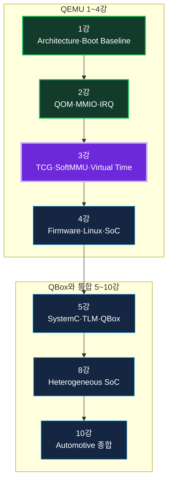

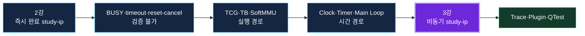

1강과 2강은 플랫폼과 Device를 만들었다. 3강은 그 Device가 실제로 실행되는 CPU 경로와 시간 경로를 연결한다.

## 2. 학습 목표와 완료 기준

- TCG frontend, TCG IR, Host backend의 역할을 구분한다.
- TranslationBlock의 lookup, generation, chaining, exit, invalidation을 설명한다.
- cpu_exec_loop에서 exception, interrupt, TB execution 흐름을 추적한다.
- ARM64와 RISC-V64 target frontend의 공통점과 차이를 설명한다.
- SoftMMU TLB hit/miss, RAM fast path, MMIO slow path를 추적한다.
- Single-thread TCG, MTTCG, BQL, AioContext의 synchronization 경계를 설명한다.
- QEMU clock, QEMUTimer, main loop, icount, qtest virtual clock의 관계를 설명한다.
- study-ip를 비동기 model로 확장하고 qtest로 deadline와 IRQ를 검증한다.
- Trace와 TCG plugin으로 execution timeline을 관찰한다.

## 3. 왜 TCG와 Virtual Time 내부를 배워야 하는가

Device callback 코드만 보면 callback이 호출되기 전의 Guest instruction translation, address translation, TB exit, event-loop scheduling을 알 수 없다. Driver timeout이나 stale interrupt가 발생했을 때 계층을 분리하지 않으면 원인을 잘못 진단한다.

| 문제 | 내부를 모를 때 | 내부를 알 때 |
|---|---|---|
| MMIO callback이 안 옴 | Device bug로 추정 | TB/SoftMMU/FlatView/access width 분리 |
| IRQ가 늦음 | Host가 느림 | Timer deadline·main loop·TB exit 분석 |
| SMP에서만 실패 | 재현 불가 | MTTCG와 shared state race 확인 |
| reset 후 stale DONE | register reset만 확인 | pending QEMUTimer lifetime 확인 |
| 성능 수치 | Target 성능으로 오해 | Host cost와 functional ordering만 해석 |

## 4. 전체 Architecture와 Source Reading Map

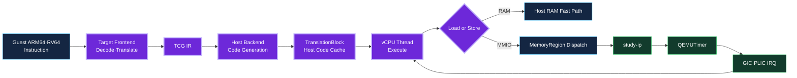

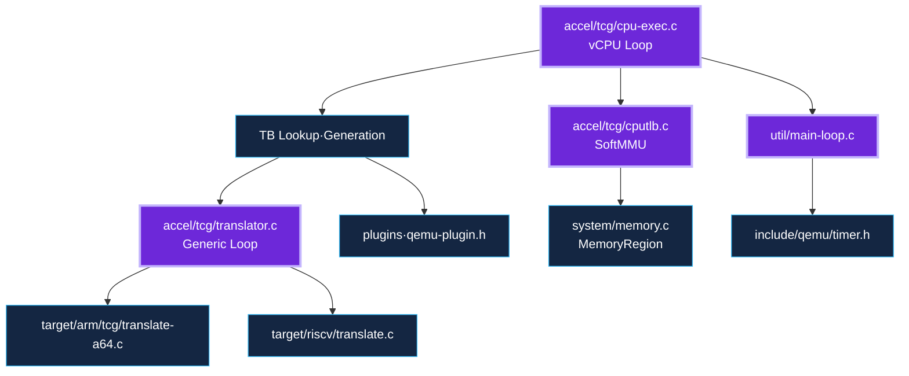

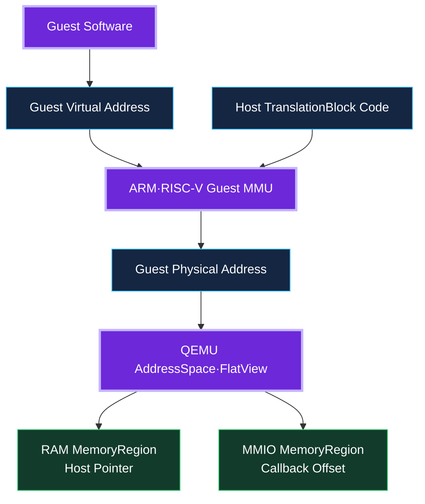

### Source reading 권장 순서

- `accel/tcg/cpu-exec.c`: execution loop의 큰 그림.
- `accel/tcg/translator.c`와 `include/exec/translator.h`: generic translation contract.
- `target/arm/tcg/translate-a64.c`, `target/riscv/translate.c`: target frontend.
- `accel/tcg/cputlb.c`: generated memory access와 per-vCPU TLB.
- `system/memory.c`: MemoryRegion dispatch.
- `util/main-loop.c`, `include/qemu/timer.h`: event와 time.
- `tests/qtest/libqtest.h`: deterministic virtual clock test.

## 5. TCG Dynamic Binary Translation

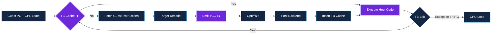

TCG는 Guest instruction stream을 Host-independent TCG IR로 변환한 뒤 Host ISA code를 생성한다. 번역 결과는 TB로 cache된다.

### 5.1 TranslationBlock의 의미

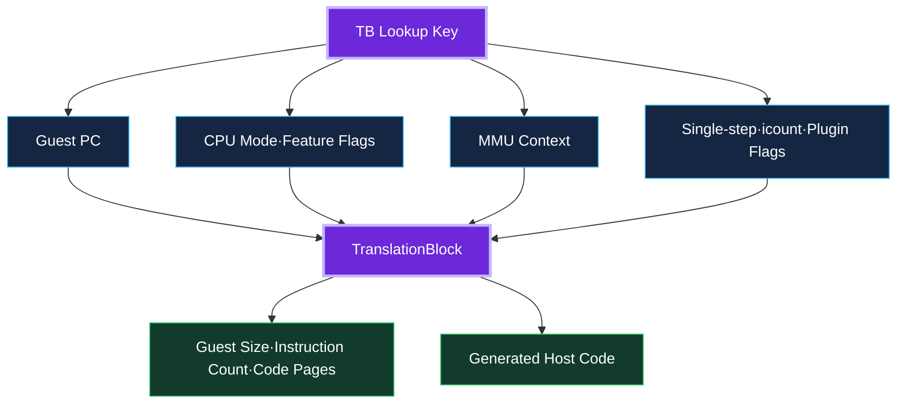

- TB key에는 Guest PC뿐 아니라 CPU mode와 MMU context가 필요하다.
- TB는 basic block과 비슷하지만 page boundary, icount, plugin, exception precision 때문에 더 일찍 끝날 수 있다.
- `tb->size`는 Guest byte 길이이고 `tb->icount`는 Guest instruction 수다.
- Generated Host code와 Guest code page metadata가 함께 관리된다.

### 5.2 TB Lifecycle

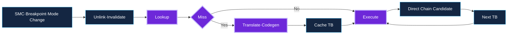

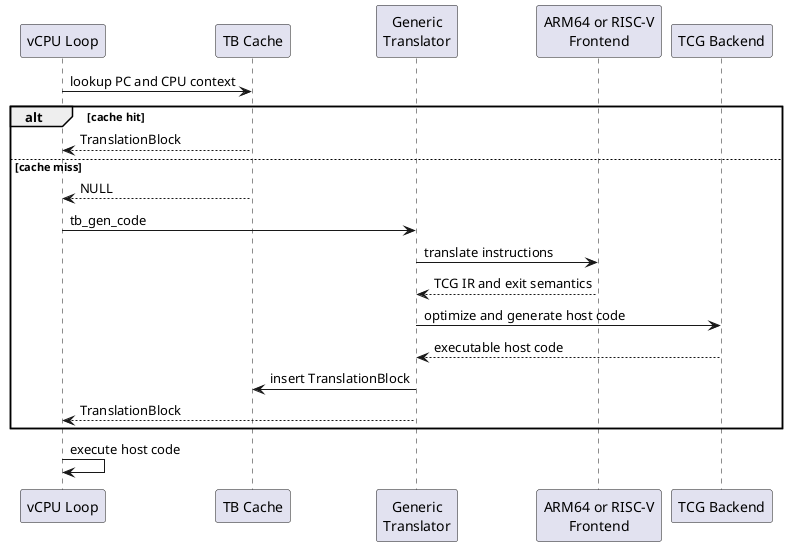

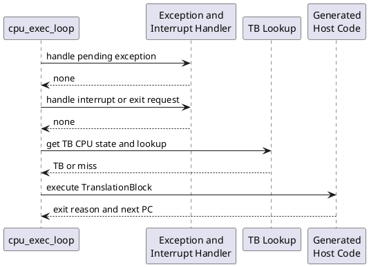

### 5.3 cpu_exec_loop Source Reading

```c
static int cpu_exec_loop(CPUState *cpu, SyncClocks *sc)
{
    int ret;

    while (!cpu_handle_exception(cpu, &ret)) {
        TranslationBlock *last_tb = NULL;
        int tb_exit = 0;

        while (!cpu_handle_interrupt(cpu, &last_tb)) {
            TCGTBCPUState s =
                cpu->cc->tcg_ops->get_tb_cpu_state(cpu);
            s.cflags = curr_cflags(cpu);

            TranslationBlock *tb = tb_lookup(cpu, s);
            if (tb == NULL) {
                mmap_lock();
                tb = tb_gen_code(cpu, s);
                mmap_unlock();
            }
            if (last_tb) {
                tb_add_jump(last_tb, tb_exit, tb);
            }
            cpu_loop_exec_tb(cpu, tb, s.pc,
                             &last_tb, &tb_exit);
            align_clocks(sc, cpu);
        }
    }
    return ret;
}
```

- 바깥 loop는 pending synchronous exception을 처리한다.
- 안쪽 loop는 interrupt와 exit request를 확인하고 TB를 실행한다.
- get_tb_cpu_state가 target-specific lookup context를 제공한다.
- TB miss에서 tb_gen_code가 translator와 backend를 호출한다.
- last_tb가 있으면 safe successor로 direct chaining을 시도한다.

### 5.4 TB Lookup Cache

```c
static inline TranslationBlock *
tb_lookup(CPUState *cpu, TCGTBCPUState s)
{
    CPUJumpCache *jc;
    TranslationBlock *tb;
    uint32_t hash = tb_jmp_cache_hash_func(s.pc);

    jc = cpu->tb_jmp_cache;
    tb = qatomic_read(&jc->array[hash].tb);
    if (likely(tb &&
               jc->array[hash].pc == s.pc &&
               tb->cs_base == s.cs_base &&
               tb->flags == s.flags &&
               tb_cflags(tb) == s.cflags)) {
        return tb;
    }

    tb = tb_htable_lookup(cpu, s);
    if (tb) {
        jc->array[hash].pc = s.pc;
        qatomic_set(&jc->array[hash].tb, tb);
    }
    return tb;
}
```

Per-vCPU jump cache의 PC와 TB flags가 모두 일치해야 빠른 hit다. 다른 privilege 또는 translation regime의 TB를 재사용하면 correctness가 깨진다.

### 5.5 Generic translator_loop

```c
void translator_loop(CPUState *cpu,
                     TranslationBlock *tb,
                     int *max_insns,
                     vaddr pc,
                     void *host_pc,
                     const TranslatorOps *ops,
                     DisasContextBase *db)
{
    ops->init_disas_context(db, cpu);
    gen_tb_start(db, tb_cflags(tb));
    ops->tb_start(db, cpu);

    while (true) {
        *max_insns = ++db->num_insns;
        ops->insn_start(db, cpu);
        ops->translate_insn(db, cpu);

        if (db->is_jmp != DISAS_NEXT ||
            tcg_op_buf_full() ||
            db->num_insns >= db->max_insns) {
            break;
        }
    }
    ops->tb_stop(db, cpu);
    tb->size = db->pc_next - db->pc_first;
    tb->icount = db->num_insns;
}
```

Generic loop는 instruction count, output buffer, plugin hook, TB metadata를 관리하고 target frontend는 decode와 exit semantic을 제공한다.

### 5.6 TCG IR와 Helper


```c
/* Conceptual translation of a guest load and add. */
TCGv_i64 addr = tcg_temp_new_i64();
TCGv_i32 value = tcg_temp_new_i32();

tcg_gen_addi_i64(addr, cpu_X[0], REG_DATA);

tcg_gen_qemu_ld_i32(value, addr, mmu_idx,
                    MO_LEUL | MO_ALIGN_4);

tcg_gen_addi_i32(value, value, 1);
tcg_gen_mov_i32(cpu_X[1], value);
```

단순 arithmetic과 register access는 inline TCG op가 적합하다. 복잡한 privileged operation, page walk, exceptional path는 helper가 유지보수성과 precision에 유리하다.

### 5.7 Direct Block Chaining

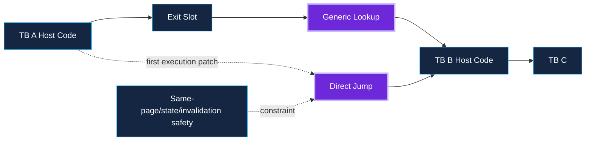

Chaining은 generic dispatcher 복귀를 줄이지만 invalidation과 mode safety가 필요하다. Debug를 위해 nochain을 사용할 수 있으나 실제 option은 QEMU build의 `-d help`에서 확인한다.

### 5.8 TB Invalidation

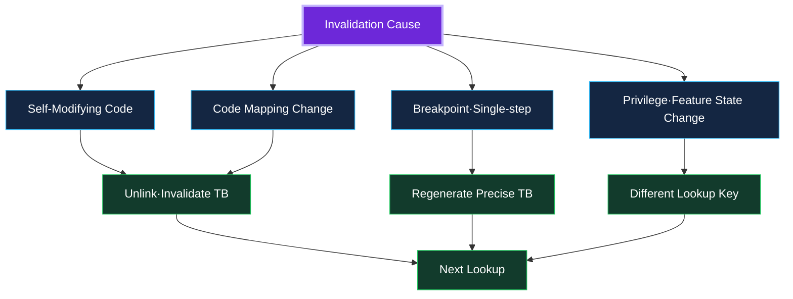

TB invalidation, Guest TLB flush, QEMU CPUTLB flush는 서로 다른 cache와 event다. Self-modifying code와 breakpoint는 translated code correctness를 위해 TB를 unlink한다.

## 6. ARM64와 RISC-V64 Target Frontend

### 6.1 ARM64 Frontend

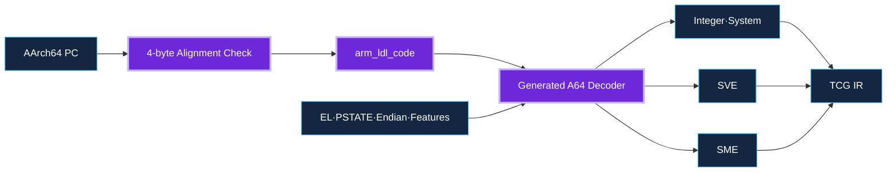

```c
static void aarch64_tr_translate_insn(
    DisasContextBase *dcbase, CPUState *cpu)
{
    DisasContext *s =
        container_of(dcbase, DisasContext, base);
    CPUARMState *env = cpu_env(cpu);
    uint64_t pc = s->base.pc_next;
    uint32_t insn;

    if (pc & 3) {
        gen_helper_exception_pc_alignment(
            tcg_env, tcg_constant_vaddr(pc));
        s->base.is_jmp = DISAS_NORETURN;
        return;
    }

    insn = arm_ldl_code(env, &s->base, pc,
                        s->sctlr_b);
    s->base.pc_next = pc + 4;
    if (!disas_a64(s, insn) &&
        !disas_sme(s, insn) &&
        !disas_sve(s, insn)) {
        unallocated_encoding(s);
    }
}
```

- A64 instruction은 4-byte aligned fixed width가 기본이다.
- EL, PSTATE, endian, translation regime, feature state가 TB context에 반영된다.
- Generated decoder가 base A64, SVE, SME instruction space를 처리한다.
- WFI, exception, branch는 TB exit에 영향을 준다.

### 6.2 RISC-V64 Frontend

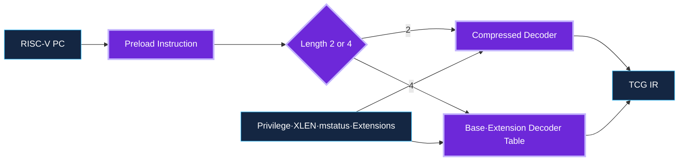

```c
static void decode_opc(CPURISCVState *env,
                       DisasContext *ctx)
{
    uint32_t opcode = translator_ldl_end(
        env, &ctx->base, ctx->base.pc_next,
        mo_endian(ctx));

    ctx->cur_insn_len = insn_len((uint16_t)opcode);
    if (ctx->cur_insn_len == 2) {
        ctx->opcode = (uint16_t)opcode;
        if (decode_insn16(ctx, opcode)) {
            return;
        }
    } else {
        ctx->opcode = opcode;
        for (guint i = 0; i < ctx->decoders->len; ++i) {
            riscv_cpu_decode_fn fn =
                g_ptr_array_index(ctx->decoders, i);
            if (fn(ctx, opcode)) {
                return;
            }
        }
    }
    gen_exception_illegal(ctx);
}
```

- Compressed extension 때문에 instruction 길이가 2 또는 4 byte다.
- Privilege, virtualization, XLEN, mstatus, extension state가 context에 반영된다.
- Base ISA와 extension decoder table을 적용한다.
- 지원되지 않는 encoding은 illegal instruction exception을 만든다.

### 6.3 공통점과 차이

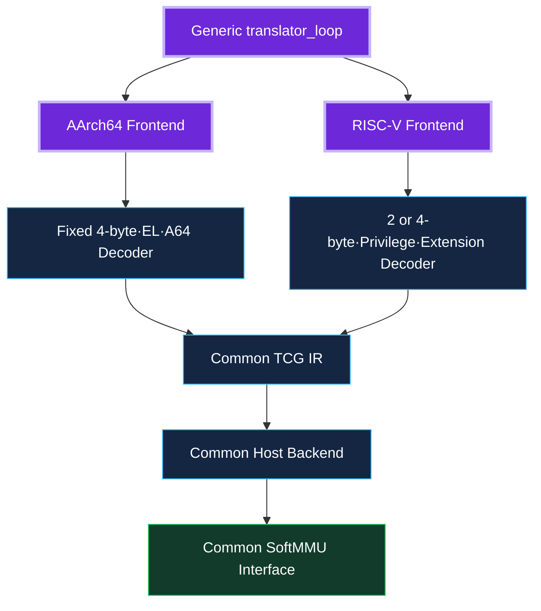

| 항목 | ARM64 | RISC-V64 | 공통 |
|---|---|---|---|
| Instruction width | 4 byte | 2 or 4 byte | TCG IR |
| Privilege | EL0-EL3 | U/S/M + virtualization | TB flags |
| Decoder | A64/SVE/SME | Base + extensions | TranslatorOps |
| Memory | ARM regimes | satp/hgatp regimes | SoftMMU API |

## 7. SoftMMU: Guest Address에서 RAM 또는 MMIO까지

### 7.1 전체 경로

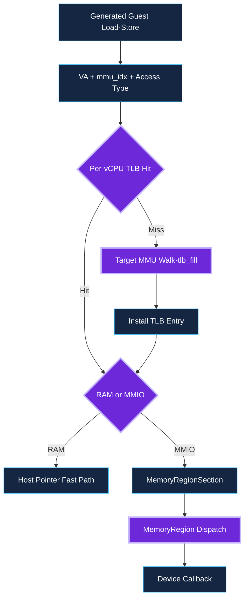

QEMU의 CPUTLB는 Host-side execution optimization이다. Guest가 보는 hardware TLB microarchitecture와 동일하지 않다.

### 7.2 TLB Fast Path와 Slow Path

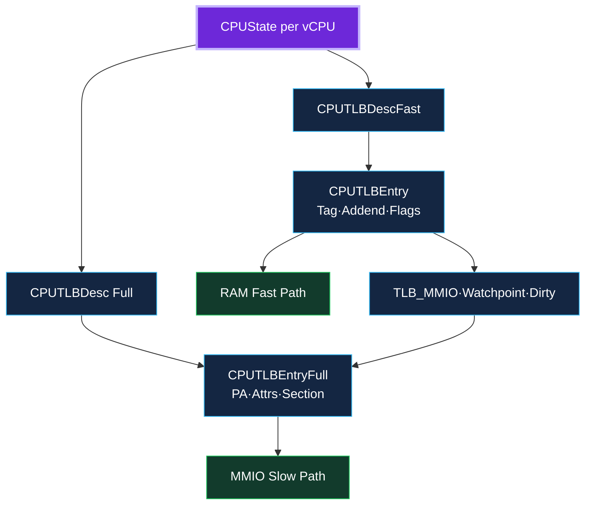

```c
static bool mmu_lookup1(CPUState *cpu,
                        MMULookupPageData *data,
                        MemOp memop, int mmu_idx,
                        MMUAccessType access_type,
                        uintptr_t ra)
{
    vaddr addr = data->addr;
    CPUTLBEntry *entry = tlb_entry(cpu, mmu_idx, addr);
    uint64_t tlb_addr =
        tlb_read_idx(entry, access_type);

    if (!tlb_hit(tlb_addr, addr)) {
        tlb_fill_align(cpu, addr, access_type,
                       mmu_idx, memop, data->size,
                       false, ra);
        entry = tlb_entry(cpu, mmu_idx, addr);
        tlb_addr = tlb_read_idx(entry, access_type);
    }
    data->flags = tlb_addr & TLB_FLAGS_MASK;
    data->haddr = (void *)((uintptr_t)addr +
                           entry->addend);
    return false;
}
```

- TLB key에는 VA page, mmu_idx, access type이 포함된다.
- Miss이면 target MMU translation과 permission check를 수행한다.
- CPUTLBEntry addend는 RAM fast path를 제공한다.
- CPUTLBEntryFull은 physical address, attrs, MemoryRegionSection을 제공한다.

### 7.3 RAM과 MMIO의 분기

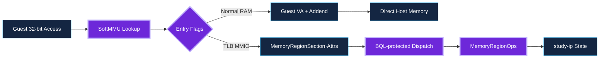

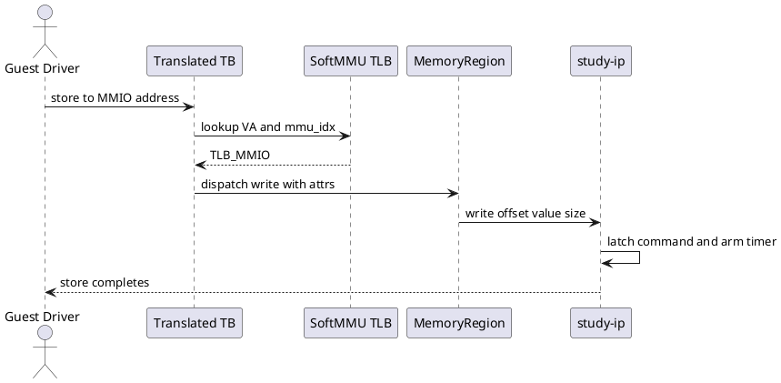

RAM access는 Host pointer로 직접 처리할 수 있다. MMIO는 Device side effect 때문에 MemoryRegionOps callback과 transaction semantics가 필요하다.

### 7.4 MemoryRegion Dispatch

```c
static uint64_t int_ld_mmio_beN(
    CPUState *cpu, CPUTLBEntryFull *full,
    vaddr addr, int size, int mmu_idx,
    MMUAccessType type, uintptr_t ra,
    MemoryRegion *mr, hwaddr mr_offset)
{
    uint64_t val;
    MemTxResult r;
    MemOp mop = MO_32 | MO_BE;

    r = memory_region_dispatch_read(
        mr, mr_offset, &val, mop, full->attrs);
    if (r != MEMTX_OK) {
        io_failed(cpu, full, addr, size,
                  type, mmu_idx, r, ra);
    }
    return val;
}
```

MemoryRegionOps.valid가 access width와 alignment를 제한하면 invalid access는 callback 전에 transaction fault가 될 수 있다. MemTxAttrs는 secure, requester, memory attribute 등의 context를 보존한다.

### 7.5 Exception과 Fault

```mermaid
flowchart TB
 ROOT[Guest-visible Error] --> DECODE[Instruction Decode Exception]
 ROOT --> MMU[Guest MMU Translation·Permission Fault]
 ROOT --> BUS[Memory Transaction Failure]
 ROOT --> DEV[Device STATUS.ERROR·IRQ_ERROR]
 DECODE --> LOOP[CPU Exception Loop]
 MMU --> LOOP
 BUS --> LOOP
 DEV --> DRIVER[Guest Driver Recovery]
 LOOP --> VECTOR[ARM Vector·RISC-V Trap]
 classDef root fill:#6D28D9,stroke:#C4B5FD,color:#fff,stroke-width:3px
 classDef mid fill:#142642,stroke:#38BDF8,color:#fff
 classDef out fill:#123B2C,stroke:#22C55E,color:#fff
 class ROOT root
 class DECODE,MMU,BUS,DEV,LOOP mid
 class DRIVER,VECTOR out
```

```plantuml
@startuml
participant "Generated Access" as ACCESS
participant "SoftMMU" as MMU
participant "Target MMU" as TARGET
participant "CPU Loop" as LOOP
participant "Guest Vector or Trap" as GUEST
ACCESS -> MMU: load or store VA
MMU -> TARGET: TLB miss translation
TARGET -> TARGET: permission and page walk
alt fault
 TARGET --> LOOP: architectural exception state
 LOOP -> GUEST: enter exception or trap handler
else success
 TARGET --> MMU: translated entry
 MMU --> ACCESS: resume access
end
@enduml
```

Decode exception, Guest MMU fault, bus transaction failure, Device error interrupt를 서로 구분해야 한다.

## 8. vCPU Execution과 Thread Model

### 8.1 Thread Topology

```mermaid
flowchart TB
 CONFIG[TCG Thread Configuration] --> SINGLE[Single Thread]
 CONFIG --> MULTI[MTTCG]
 SINGLE --> RR[Round-Robin vCPU Execution]
 MULTI --> T0[Host Thread vCPU0]
 MULTI --> T1[Host Thread vCPU1]
 RR --> SHARED[Shared RAM·Device State]
 T0 --> SHARED
 T1 --> SHARED
 MAIN[Main Loop·AioContext·Timer] --> SHARED
 classDef root fill:#6D28D9,stroke:#C4B5FD,color:#fff,stroke-width:3px
 classDef mid fill:#142642,stroke:#38BDF8,color:#fff
 classDef out fill:#123B2C,stroke:#22C55E,color:#fff
 class CONFIG,SINGLE,MULTI root
 class RR,T0,T1,MAIN mid
 class SHARED out
```

### 8.2 Single-threaded TCG

```mermaid
flowchart LR
 SCHED[One Host vCPU Thread] --> CPU0[vCPU0 Budget]
 CPU0 --> CPU1[vCPU1 Budget]
 CPU1 --> IO[Main Loop·Timer·I/O]
 IO --> CPU0
 DET[icount·Deterministic Modes] -. often use .-> SCHED
 classDef focus fill:#6D28D9,stroke:#C4B5FD,color:#fff,stroke-width:3px
 classDef box fill:#142642,stroke:#38BDF8,color:#fff
 class SCHED focus
 class CPU0,CPU1,IO,DET box
```

```bash
# Round-robin and deterministic experiment
qemu-system-aarch64 ... \
    -accel tcg,thread=single \
    -icount shift=auto,align=off,sleep=off

# MTTCG experiment must be a separate run.
qemu-system-aarch64 ... \
    -accel tcg,thread=multi

# Record exact command line and QEMU build options.
```

Single-thread TCG는 한 Host thread가 vCPU budget을 round-robin 실행한다. icount와 deterministic mode에 적합하지만 external I/O context까지 모두 같은 thread라는 뜻은 아니다.

### 8.3 MTTCG

```mermaid
flowchart LR
 T0[Host Thread vCPU0] --> RAM[Shared RAM]
 T1[Host Thread vCPU1] --> RAM
 T0 --> DEV[Shared Device]
 T1 --> DEV
 MAIN[Main Loop·Timer] --> DEV
 DEV --> LOCK[BQL·Atomic·Explicit Locking]
 RAM --> ORDER[Guest Memory Ordering]
 classDef focus fill:#6D28D9,stroke:#C4B5FD,color:#fff,stroke-width:3px
 classDef box fill:#142642,stroke:#38BDF8,color:#fff
 class T0,T1,MAIN,DEV focus
 class RAM,LOCK,ORDER box
```

```bash
# Single-threaded TCG
qemu-system-aarch64 ... \
    -accel tcg,thread=single

# Multi-threaded TCG
qemu-system-aarch64 ... \
    -accel tcg,thread=multi

# Keep target, image, SMP, tracing, host load,
# and test duration identical.
# Compare host elapsed time and per-vCPU plugin counts.

# Do not interpret the result as target SoC SMP speed.
```

MTTCG는 지원되는 target/host에서 vCPU별 Host thread를 사용한다. Shared RAM과 Device state는 atomic, barrier, BQL 또는 explicit locking contract를 가져야 한다.

### 8.4 BQL과 Device Concurrency

```mermaid
flowchart TB
 VCPU[vCPU Generated Code] --> RAM[RAM Fast Path]
 VCPU --> MMIO[MMIO Slow Path]
 MMIO --> BQL[Big QEMU Lock]
 BQL --> DEV[Device Callback]
 MAIN[Main Loop·AioContext] --> BQL
 TIMER[Default Virtual Timer] --> BQL
 DEV --> STATE[Shared Device State]
 TIMER --> STATE
 OTHER[IOThread·Plugin·External Subsystem] --> SYNC[Own Synchronization Rules]
 classDef root fill:#6D28D9,stroke:#C4B5FD,color:#fff,stroke-width:3px
 classDef mid fill:#142642,stroke:#38BDF8,color:#fff
 classDef out fill:#123B2C,stroke:#22C55E,color:#fff
 class VCPU,BQL root
 class RAM,MMIO,DEV,MAIN,TIMER,OTHER mid
 class STATE,SYNC out
```

- 많은 MMIO callback은 BQL 아래 실행된다.
- RAM fast path, IOThread, plugin, external subsystem은 별도 synchronization rule이 있다.
- Timer callback과 reset/MMIO callback이 같은 state를 만질 때 race를 검토한다.
- BQL이 모든 concurrency를 자동 해결한다고 가정하지 않는다.

### 8.5 Interrupt와 TB Exit

```plantuml
@startuml
participant "study-ip Timer" as DEV
participant "GIC or PLIC" as INTC
participant "CPU Request" as REQ
participant "Current TB" as TB
participant "cpu_exec_loop" as LOOP
participant "Guest Handler" as GUEST
DEV -> INTC: assert level interrupt
INTC -> REQ: set CPU interrupt request
REQ -> TB: request exit or check
TB --> LOOP: return from translated code
LOOP -> GUEST: architecture interrupt entry
GUEST -> DEV: W1C pending
DEV -> INTC: deassert interrupt
@enduml
```

IRQ line assert는 generated code 한가운데서 Guest handler로 즉시 jump하는 것이 아니다. CPU interrupt request가 표시되고 TB exit/check 지점에서 cpu_exec_loop로 돌아가 target exception entry를 수행한다.

## 9. QEMU Main Loop, AioContext와 Bottom Half

### 9.1 Main Loop

```mermaid
flowchart TB
 LOOP[main_loop_wait] --> POLL[Collect FD·AioContext Events]
 POLL --> DEAD[Compute Earliest Timer Deadline]
 DEAD --> WAIT[Host Poll·Select Wait]
 WAIT --> IO[Dispatch Ready I/O]
 IO --> IC{icount Enabled}
 IC -->|Yes| WARP[Virtual Time Warp Handling]
 IC -->|No| TIMERS[Run Expired Timers]
 WARP --> TIMERS
 TIMERS --> CALLBACK[QEMUTimer Callbacks]
 CALLBACK --> LOOP
 classDef focus fill:#6D28D9,stroke:#C4B5FD,color:#fff,stroke-width:3px
 classDef box fill:#142642,stroke:#38BDF8,color:#fff
 class LOOP,DEAD,TIMERS,CALLBACK focus
 class POLL,WAIT,IO,IC,WARP box
```

```c
void main_loop_wait(int nonblocking)
{
    int64_t timeout_ns;

    notifier_list_notify(&main_loop_poll_notifiers,
                         &mlpoll);

    timeout_ns = qemu_soonest_timeout(
        timeout_ns,
        timerlistgroup_deadline_ns(&main_loop_tlg));

    os_host_main_loop_wait(timeout_ns);

    if (icount_enabled()) {
        icount_start_warp_timer();
    }
    qemu_clock_run_all_timers();
}
```

Main loop는 FD event와 timer deadline 중 가장 이른 시점을 기준으로 Host wait를 수행하고, wake-up 후 I/O와 expired timer를 dispatch한다.

### 9.2 AioContext Services

```mermaid
flowchart TB
 AIO[AioContext] --> FD[FD Handler]
 AIO --> EN[Event Notifier]
 AIO --> BH[Bottom Half]
 AIO --> TIMER[Timer List]
 AIO --> CO[Coroutine Wake-up]
 BH --> DEFER[Deferred Work]
 TIMER --> DEAD[Clock Deadline]
 FD --> IO[Block·Net·Char I/O]
 classDef root fill:#6D28D9,stroke:#C4B5FD,color:#fff,stroke-width:3px
 classDef mid fill:#142642,stroke:#38BDF8,color:#fff
 classDef out fill:#123B2C,stroke:#22C55E,color:#fff
 class AIO root
 class FD,EN,BH,TIMER,CO mid
 class DEFER,DEAD,IO out
```

Bottom Half는 deadline 없는 deferred work이고 Timer는 clock deadline에 기반한 work다. 둘 다 AioContext ownership과 reset/cancel policy가 필요하다.

## 10. QEMU Clock과 Timer

### 10.1 Clock Types

```mermaid
flowchart TB
 CLOCK[QEMU Clock Types] --> V[QEMU_CLOCK_VIRTUAL]
 CLOCK --> R[QEMU_CLOCK_REALTIME]
 CLOCK --> H[QEMU_CLOCK_HOST]
 CLOCK --> VRT[QEMU_CLOCK_VIRTUAL_RT]
 V --> VM[Runs while VM executes<br/>Device State Timer]
 R --> RT[Host Monotonic Time<br/>Non-VM Work]
 H --> HOST[Host Wall-Clock Behavior]
 VRT --> IC[icount Warp Support]
 classDef root fill:#6D28D9,stroke:#C4B5FD,color:#fff,stroke-width:3px
 classDef mid fill:#142642,stroke:#38BDF8,color:#fff
 classDef out fill:#123B2C,stroke:#22C55E,color:#fff
 class CLOCK,V root
 class R,H,VRT mid
 class VM,RT,HOST,IC out
```

| Clock | VM stop 중 | 대표 용도 |
|---|---|---|
| QEMU_CLOCK_VIRTUAL | 정지 | Device state timer |
| QEMU_CLOCK_REALTIME | 진행 | Host monotonic non-VM work |
| QEMU_CLOCK_HOST | 진행 | Host wall-clock behavior |
| QEMU_CLOCK_VIRTUAL_RT | mode dependent | icount warp support |

### 10.2 QEMUTimer API

```c
timer_init_ns(&s->completion_timer,
              QEMU_CLOCK_VIRTUAL,
              study_ip_complete, s);

int64_t now_ns =
    qemu_clock_get_ns(QEMU_CLOCK_VIRTUAL);
int64_t deadline_ns = now_ns +
    (int64_t)s->delay_us * SCALE_US;

timer_mod_ns(&s->completion_timer,
             deadline_ns);

/* Reset or cancellation */
timer_del(&s->completion_timer);
```

timer_mod_ns는 상대 delay가 아니라 해당 clock domain의 absolute expiry time을 받는다. Reset과 cancellation에서 timer_del을 호출한다.

### 10.3 icount의 의미와 경계

- Guest instruction count로 virtual time progression을 제어한다.
- Record/replay와 deterministic regression에 유용하다.
- MTTCG와 일반적으로 함께 사용할 수 없다.
- Actual CPU cycle, cache miss, NoC, DRAM timing을 표현하지 않는다.
- WCET 또는 safety timing evidence가 아니다.

## 11. study-ip 비동기 모델 구현

### 11.1 Hardware-visible Contract 변경

| 상황 | 모델 동작 |
|---|---|
| START + ENABLE | input/delay latch, BUSY, timer arm |
| START without ENABLE | ERROR pending |
| START while BUSY | ERROR pending 추가, 기존 command 유지 |
| FAULT_COMMAND | deadline에 ERROR completion |
| FAULT_TIMEOUT | timer 미arm, BUSY 유지 |
| Reset | timer cancel, state clear, IRQ low |
| W1C | pending clear 후 IRQ level recompute |

```mermaid
flowchart TB
 RESET[RESET<br/>Cancel Timer·Clear State·IRQ Low] --> IDLE[IDLE]
 IDLE -->|ENABLE + START| BUSY[BUSY<br/>Latched Input·Timer Pending]
 BUSY -->|Timer Success| DONE[DONE<br/>Result + IRQ_DONE]
 BUSY -->|Command Fault| ERROR[ERROR<br/>IRQ_ERROR]
 BUSY -->|Timeout Injection| TIMEOUT[TIMEOUT<br/>BUSY Remains]
 BUSY -->|Reset| RESET
 DONE -->|W1C or Next Command| IDLE
 ERROR -->|W1C and Recovery| IDLE
 TIMEOUT -->|Software or System Reset| RESET
 classDef reset fill:#3A1B1B,stroke:#EF4444,color:#fff,stroke-width:2px
 classDef idle fill:#142642,stroke:#38BDF8,color:#fff,stroke-width:2px
 classDef busy fill:#6D28D9,stroke:#C4B5FD,color:#fff,stroke-width:3px
 classDef done fill:#123B2C,stroke:#22C55E,color:#fff,stroke-width:2px
 classDef error fill:#3A2610,stroke:#F59E0B,color:#fff,stroke-width:2px
 class RESET reset
 class IDLE idle
 class BUSY busy
 class DONE done
 class ERROR,TIMEOUT error
```

### 11.2 State Structure

```c
struct StudyIPState {
    SysBusDevice parent_obj;

    MemoryRegion iomem;
    qemu_irq irq;
    QEMUTimer completion_timer;

    uint32_t ctrl;
    uint32_t status;
    uint32_t data;
    uint32_t irq_status;
    uint32_t irq_enable;
    uint32_t delay_us;
    uint32_t fault_inject;

    uint32_t active_data;
    int64_t deadline_ns;
};
```

active_data와 deadline_ns는 outstanding operation lifetime을 표현한다. Guest가 BUSY 중 DATA를 다시 써도 current operation은 latched value를 사용한다.

### 11.3 START와 Timer Scheduling

```c
static void study_ip_start(StudyIPState *s)
{
    if (!(s->ctrl & CTRL_ENABLE)) {
        study_ip_set_error(s, ERR_DISABLED);
        return;
    }
    if (s->status & STATUS_BUSY) {
        s->status |= STATUS_ERROR;
        s->irq_status |= IRQ_ERROR;
        study_ip_update_irq(s);
        return;             /* Original timer remains */
    }

    s->irq_status &= ~(IRQ_DONE | IRQ_ERROR);
    s->status = STATUS_BUSY;
    s->active_data = s->data;
    s->ctrl &= ~CTRL_START;

    if (s->fault_inject & FAULT_TIMEOUT) {
        return;             /* BUSY until reset */
    }

    int64_t now =
        qemu_clock_get_ns(QEMU_CLOCK_VIRTUAL);
    s->deadline_ns = now +
        (int64_t)s->delay_us * SCALE_US;
    timer_mod_ns(&s->completion_timer,
                 s->deadline_ns);
}
```

- ENABLE과 BUSY policy를 먼저 검사한다.
- Old completion pending을 clear하고 BUSY를 먼저 노출한다.
- Timeout fault는 timer를 arm하지 않는다.
- Current virtual time과 delay로 absolute deadline을 만든다.
- MMIO callback은 Host sleep 없이 즉시 return한다.

### 11.4 Completion Callback

```c
static void study_ip_complete(void *opaque)
{
    StudyIPState *s = opaque;

    s->deadline_ns = 0;
    s->status &= ~STATUS_BUSY;

    if (s->fault_inject & FAULT_COMMAND) {
        s->status |= STATUS_ERROR;
        s->irq_status |= IRQ_ERROR;
    } else {
        s->data = s->active_data + 1;
        s->status |= STATUS_DONE;
        s->irq_status |= IRQ_DONE;
    }

    study_ip_update_irq(s);
}
```

Callback은 latched input으로 result를 만들고 DONE 또는 ERROR pending을 설정한 뒤 level IRQ를 재계산한다.

### 11.5 Reset, Cancel, Migration

```c
static void study_ip_reset(DeviceState *dev)
{
    StudyIPState *s = STUDY_IP(dev);

    timer_del(&s->completion_timer);
    s->deadline_ns = 0;
    s->active_data = 0;
    s->ctrl = 0;
    s->status = STATUS_IDLE;
    s->data = 0;
    s->irq_status = 0;
    s->irq_enable = 0;
    s->delay_us = 0;
    s->fault_inject = 0;
    qemu_set_irq(s->irq, 0);
}

static const VMStateDescription vmstate_study_ip = {
    .name = TYPE_STUDY_IP,
    .version_id = 1,
    .fields = (const VMStateField[]) {
        VMSTATE_UINT32(status, StudyIPState),
        VMSTATE_TIMER(completion_timer, StudyIPState),
        VMSTATE_END_OF_LIST()
    },
};
```

Reset에서 timer_del을 누락하면 reset 후 stale callback이 실행되어 DONE과 IRQ가 다시 올라온다. Migration을 지원하면 timer와 deadline state를 versioned VMState에 포함한다.

### 11.6 End-to-End Timer Sequence

```plantuml
@startuml
actor "Guest" as GUEST
participant "study-ip MMIO" as DEV
participant "Virtual Clock" as CLOCK
participant "QEMUTimer" as TIMER
participant "Interrupt Controller" as INTC
GUEST -> DEV: DATA DELAY IRQ_ENABLE START
DEV -> DEV: latch active data and set BUSY
DEV -> CLOCK: read virtual time
DEV -> TIMER: arm absolute deadline
DEV --> GUEST: MMIO store returns
... virtual time advances ...
CLOCK -> TIMER: deadline expires
TIMER -> DEV: completion callback
DEV -> DEV: result and DONE or ERROR
DEV -> INTC: assert interrupt
INTC -> GUEST: IRQ or trap
GUEST -> DEV: read result and W1C
DEV -> INTC: deassert interrupt
@enduml
```

### 11.7 Linux Driver Path

```c
static int study_submit(struct study_dev *s,
                        u32 data, u32 delay_us)
{
    unsigned long timeout;

    reinit_completion(&s->done);
    writel(data, s->base + REG_DATA);
    writel(delay_us, s->base + REG_DELAY);
    writel(IRQ_DONE | IRQ_ERROR,
           s->base + REG_IRQ_ENABLE);
    writel(CTRL_ENABLE | CTRL_START,
           s->base + REG_CTRL);

    timeout = wait_for_completion_timeout(
        &s->done, msecs_to_jiffies(100));
    if (!timeout) {
        u32 status = readl(s->base + REG_STATUS);
        writel(CTRL_SW_RESET, s->base + REG_CTRL);
        return status & STATUS_BUSY ? -ETIMEDOUT : -EIO;
    }
    return s->last_status & STATUS_ERROR ? -EIO : 0;
}
```

```plantuml
@startuml
actor "Linux Application" as APP
participant "Platform Driver" as DRV
participant "study-ip" as DEV
participant "GIC or PLIC" as INTC
participant "Driver Timeout" as TMO
APP -> DRV: ioctl or sysfs command
DRV -> DEV: program registers and START
DRV -> TMO: arm software timeout
DEV -> INTC: completion interrupt
INTC -> DRV: IRQ handler
DRV -> DEV: read status result and W1C
DRV -> TMO: cancel timeout
DRV --> APP: completion result
@enduml
```

Driver timeout은 Device error interrupt와 다른 recovery path다. Completion 부재를 software timer가 감지하고 STATUS 수집, reset, reinitialize를 수행한다.

## 12. QTest로 Virtual Time과 IRQ 검증

```plantuml
@startuml
participant "qtest Test" as TEST
participant "QEMU qtest Protocol" as QTEST
participant "Virtual Clock" as CLOCK
participant "study-ip Timer" as TIMER
participant "IRQ Line" as IRQ
TEST -> QTEST: program DELAY 100 us and START
QTEST -> TIMER: timer armed
TEST -> QTEST: step clock 99 us
QTEST -> CLOCK: advance
CLOCK --> TEST: BUSY and IRQ low
TEST -> QTEST: step clock 1 us
QTEST -> CLOCK: reach deadline
CLOCK -> TIMER: callback
TIMER -> IRQ: assert
IRQ --> TEST: DONE and IRQ high
TEST -> QTEST: W1C pending
QTEST -> IRQ: deassert
@enduml
```

```c
static void test_async_completion(void)
{
    QTestState *qts = qtest_init(
        "-machine study-virt -accel qtest");

    qtest_writel(qts, BASE + REG_IRQ_ENABLE,
                 IRQ_DONE);
    qtest_writel(qts, BASE + REG_DELAY, 100);
    qtest_writel(qts, BASE + REG_DATA, 41);
    qtest_writel(qts, BASE + REG_CTRL,
                 CTRL_ENABLE | CTRL_START);

    g_assert_cmphex(qtest_readl(qts, BASE + REG_STATUS),
                    ==, STATUS_BUSY);
    qtest_clock_step(qts, 99 * 1000);
    g_assert_false(qtest_get_irq(qts, 0));

    qtest_clock_step(qts, 1 * 1000);
    g_assert_cmphex(qtest_readl(qts, BASE + REG_DATA),
                    ==, 42);
    g_assert_true(qtest_get_irq(qts, 0));

    qtest_writel(qts, BASE + REG_IRQ_STATUS,
                 IRQ_DONE);
    g_assert_false(qtest_get_irq(qts, 0));
    qtest_quit(qts);
}
```

QTest는 Host sleep 없이 virtual clock을 전진시킨다. deadline-1에서 BUSY/IRQ low, deadline에서 DONE/IRQ high를 deterministic하게 확인한다.

### 12.1 권장 Test Matrix

| Test | 핵심 Assertion |
|---|---|
| Deadline boundary | deadline-1 BUSY, deadline DONE |
| IRQ mask | pending은 생기지만 line low |
| W1C | pending clear 후 line low |
| Command fault | ERROR + IRQ_ERROR |
| Timeout fault | clock step 후 BUSY, reset recovery |
| START while BUSY | original result 유지 + error policy |
| Reset before expiry | future callback 없음 |
| Dual architecture | 동일 state transition |

## 13. Trace와 TCG Plugin

### 13.1 Trace Event

```text
# hw/misc/trace-events
study_ip_start(uint32_t data, uint32_t delay_us, int64_t deadline) "data 0x%x delay_us %u deadline_ns %" PRId64
study_ip_complete(uint32_t data, uint32_t status, uint32_t pending) "data 0x%x status 0x%x pending 0x%x"
study_ip_irq(bool level, uint32_t pending, uint32_t enable) "level %d pending 0x%x enable 0x%x"
study_ip_reset(void) ""
study_ip_timeout_injected(uint32_t data) "data 0x%x"
```

```mermaid
flowchart TB
 DEV[study-ip Source] --> DECL[trace-events Declaration]
 DECL --> GEN[tracetool Generated API]
 DEV --> CALL[trace_study_ip Calls]
 GEN --> CALL
 CALL --> LOG[Log Backend]
 CALL --> SIMPLE[simpletrace Backend]
 CALL --> FTRACE[ftrace·UST·DTrace]
 LOG --> ANALYZE[Timeline Analysis]
 SIMPLE --> ANALYZE
 FTRACE --> ANALYZE
 classDef root fill:#6D28D9,stroke:#C4B5FD,color:#fff,stroke-width:3px
 classDef mid fill:#142642,stroke:#38BDF8,color:#fff
 classDef out fill:#123B2C,stroke:#22C55E,color:#fff
 class DEV,DECL,CALL root
 class GEN,LOG,SIMPLE,FTRACE mid
 class ANALYZE out
```

State transition 중심 event를 선택한다. START data/delay/deadline, completion status/pending, IRQ pending/enable/level을 기록하면 stale IRQ와 timer 문제를 분석할 수 있다.

### 13.2 Observation Sequence

```plantuml
@startuml
participant "Guest" as GUEST
participant "TCG Log" as TCG
participant "SoftMMU" as MMU
participant "Device Trace" as TRACE
participant "Plugin" as PLUGIN
GUEST -> TCG: execute store instruction
TCG -> PLUGIN: TB or instruction count
TCG -> MMU: generated MMIO store
MMU -> TRACE: study_ip_start event
TRACE -> TRACE: deadline and BUSY
... virtual time ...
TRACE -> TRACE: complete and IRQ event
PLUGIN --> GUEST: final execution report
@enduml
```

### 13.3 TCG Plugin

```mermaid
flowchart TB
 PLUGIN[TCG Plugin Shared Object] --> INSTALL[qemu_plugin_install]
 INSTALL --> TBREG[Register TB Translation Callback]
 TBREG --> TB[Each Translated TB]
 TB --> INS[Each Guest Instruction]
 INS --> EXEC[Exec Callback or Inline Counter]
 EXEC --> SCORE[Per-vCPU Scoreboard]
 SCORE --> REPORT[Atexit Report]
 classDef root fill:#6D28D9,stroke:#C4B5FD,color:#fff,stroke-width:3px
 classDef mid fill:#142642,stroke:#38BDF8,color:#fff
 classDef out fill:#123B2C,stroke:#22C55E,color:#fff
 class PLUGIN,INSTALL,TBREG root
 class TB,INS,EXEC,SCORE mid
 class REPORT out
```

```c
#include <qemu-plugin.h>

QEMU_PLUGIN_EXPORT int qemu_plugin_version =
    QEMU_PLUGIN_VERSION;

static qemu_plugin_u64 insn_count;

static void vcpu_tb_trans(qemu_plugin_id_t id,
                          struct qemu_plugin_tb *tb)
{
    size_t n = qemu_plugin_tb_n_insns(tb);

    for (size_t i = 0; i < n; i++) {
        struct qemu_plugin_insn *insn =
            qemu_plugin_tb_get_insn(tb, i);
        qemu_plugin_register_vcpu_insn_exec_inline_per_vcpu(
            insn, QEMU_PLUGIN_INLINE_ADD_U64,
            insn_count, 1);
    }
}
```

Plugin은 TB translation, instruction execution, memory callback을 instrument할 수 있다. Per-vCPU scoreboard와 inline counter로 MTTCG overhead와 race를 줄인다.

### 13.4 실행 명령

```bash
# Guest assembly, TCG IR, Host assembly, TB execution
qemu-system-aarch64 ... \
    -accel tcg,thread=single \
    -d in_asm,op,op_opt,out_asm,exec,nochain \
    -D qemu-tcg.log

# Device trace
qemu-system-aarch64 ... \
    -trace 'study_ip_*'

# TCG plugin
qemu-system-aarch64 ... \
    -plugin ./libhotblocks.so,inline=true,limit=30
```

## 14. 비교 실험

```mermaid
flowchart TB
 VAR[Experiment Variables] --> ARCH[ARM64 vs RISC-V64]
 VAR --> THREAD[thread single vs multi]
 VAR --> TIME[Wall Clock vs icount·qtest]
 VAR --> CHAIN[Chaining vs nochain]
 VAR --> DELAY[DELAY Values]
 VAR --> FAULT[Normal·Error·Timeout]
 ARCH --> OBS[Observe TB Count·MMIO·IRQ Order]
 THREAD --> OBS
 TIME --> OBS
 CHAIN --> OBS
 DELAY --> OBS
 FAULT --> OBS
 OBS --> RULE[Functional Comparison<br/>Not Silicon Cycle Performance]
 classDef root fill:#6D28D9,stroke:#C4B5FD,color:#fff,stroke-width:3px
 classDef mid fill:#142642,stroke:#38BDF8,color:#fff
 classDef out fill:#123B2C,stroke:#22C55E,color:#fff
 class VAR,OBS root
 class ARCH,THREAD,TIME,CHAIN,DELAY,FAULT mid
 class RULE out
```

```bash
for arch in aarch64 riscv64; do
  for thread in single multi; do
    /usr/bin/time -f '%e %U %S' \
      qemu-system-${arch} \
        -accel tcg,thread=${thread} \
        -smp 4 ... \
        -plugin ./libhotblocks.so \
        > ${arch}-${thread}.log 2>&1
  done
done

# Compare functional trace and host cost separately.
```

### 통제 변수

- QEMU commit와 build configuration
- Kernel/rootfs/workload
- SMP count와 guest command
- Host load와 CPU affinity
- trace/plugin option
- run duration과 warm-up

### 측정 가능한 값

- TB translation count와 execution count
- Guest instruction count
- MMIO callback sequence
- Virtual timer deadline와 IRQ ordering
- Host elapsed/user/system time
- functional result consistency

### 측정하면 안 되는 결론

- Target CPU IPC
- Cache miss penalty
- NoC/DRAM latency
- Actual accelerator latency
- WCET 또는 ASIL timing guarantee

## 15. End-to-End Case Study

```text
Application -> Linux Driver -> Guest Store -> TCG TB -> SoftMMU -> MemoryRegion -> study-ip START -> QEMUTimer -> IRQ -> Guest Handler -> W1C
```

### Ownership와 Lifetime

| Object | Owner | Lifetime |
|---|---|---|
| Guest VA | Linux ioremap | probe to remove |
| Guest PA | Machine address map | machine lifetime |
| MemoryRegion | StudyIPState | device lifetime |
| Active command | active_data/deadline | START to completion/reset |
| QEMUTimer | StudyIPState | device lifetime; active interval separate |
| IRQ pending | irq_status | W1C/reset |

이 Device는 DMA를 하지 않으므로 IOVA와 cache coherency가 등장하지 않는다. NPU/DMA 확장에서는 device DMA address와 buffer ownership을 별도로 추가한다.

## 16. 디버깅 체크리스트와 Decision Tree

```mermaid
flowchart TD
 FAIL[Async Command Did Not Complete] --> START{START Trace Seen}
 START -->|No| MMIO[Check DT·Base·Access Width·SoftMMU]
 START -->|Yes| ARMED{Timer Armed}
 ARMED -->|No| SETUP[Check Fault Bit·timer_init·Deadline]
 ARMED -->|Yes| CLOCK{Virtual Clock Advances}
 CLOCK -->|No| MODE[VM Stop·icount Warp·Missing qtest Step]
 CLOCK -->|Yes| CB{Completion Callback Runs}
 CB -->|No| CONTEXT[Timer List·AioContext·Main Loop]
 CB -->|Yes| IRQ{Status and IRQ Correct}
 IRQ -->|No| STATE[Pending·Mask·update_irq·W1C]
 IRQ -->|Yes| GUEST[GIC·PLIC·CPU Request·Guest Handler]
 classDef bad fill:#3A1B1B,stroke:#EF4444,color:#fff
 classDef check fill:#6D28D9,stroke:#C4B5FD,color:#fff,stroke-width:3px
 classDef fix fill:#123B2C,stroke:#22C55E,color:#fff
 class FAIL bad
 class START,ARMED,CLOCK,CB,IRQ check
 class MMIO,SETUP,MODE,CONTEXT,STATE,GUEST fix
```

| 증상 | 먼저 확인 | 다음 확인 |
|---|---|---|
| START trace 없음 | DT/base/access width | SoftMMU and MemoryRegion |
| BUSY지만 timer 없음 | fault bit/timer_init | deadline calculation |
| timer pending, callback 없음 | virtual clock | main loop/AioContext |
| callback, IRQ 없음 | pending/mask/update_irq | GIC/PLIC wiring |
| IRQ, Driver timeout | CPU request/TB exit | Guest routing/handler |
| reset 후 stale DONE | timer_del | multiple timer/rearm race |
| MTTCG에서만 실패 | shared state race | BQL/atomic/locking |

## 17. 성능, 동기화, 보안과 Automotive 고려사항

### 17.1 성능

- TB chaining은 dispatcher overhead를 줄인다.
- RAM fast path는 MMIO callback보다 훨씬 가볍다.
- Trace와 plugin은 관찰 overhead를 만든다.
- Host elapsed time은 tooling regression에만 제한적으로 사용한다.

### 17.2 Ordering와 Synchronization

- Guest register programming ordering
- BUSY/result/pending/IRQ update ordering
- MMIO callback과 timer/reset race
- MTTCG shared state atomicity
- Migration과 pending timer serialization

### 17.3 보안

- Guest-controlled delay overflow와 maximum을 제한한다.
- Invalid offset/width가 Host memory corruption으로 이어지지 않게 한다.
- Trace에 Host pointer나 secret을 기록하지 않는다.
- TCG plugin은 Host process에서 실행되므로 trusted artifact만 사용한다.

### 17.4 Automotive SoC/ECU 활용

```mermaid
flowchart TB
 APP[ARM64 Linux ADAS Domain] --> NPU[Virtual NPU·Accelerator Command]
 CTRL[RISC-V Control·Safety Domain] --> WD[Watchdog·Mailbox Supervision]
 NPU --> VP[QEMU Functional VP]
 WD --> VP
 VP --> TIMER[Virtual Completion Latency]
 VP --> FAULT[Timeout·Error IRQ·Reset Injection]
 TIMER --> SW[Driver Timeout·Recovery Test]
 FAULT --> SW
 SW --> QBOX[QBox SystemC·TLM Integration]
 QBOX --> BOARD[Board·SoC Bring-up]
 classDef root fill:#6D28D9,stroke:#C4B5FD,color:#fff,stroke-width:3px
 classDef mid fill:#142642,stroke:#38BDF8,color:#fff
 classDef out fill:#123B2C,stroke:#22C55E,color:#fff
 class APP,CTRL,VP root
 class NPU,WD,TIMER,FAULT,SW mid
 class QBOX,BOARD out
```

- NPU/ISP/DMA command timeout과 recovery software 선행 개발
- ARM64 Linux domain과 RISC-V control domain 공통 register contract
- Watchdog, mailbox, reset domain fault injection
- QTest와 Linux boot regression CI
- QBox에서 SystemC IP와 interconnect latency 확장

QEMU model은 safety certification evidence 자체가 아니지만 executable specification과 early software verification platform으로 유용하다.

## 18. Source Reading Guide

### TCG Execution

- `accel/tcg/cpu-exec.c`
- `accel/tcg/tb-gen-code.c`
- `accel/tcg/tb-maint.c`

### Translator

- `include/exec/translator.h`
- `accel/tcg/translator.c`
- `target/arm/tcg/translate-a64.c`
- `target/riscv/translate.c`

### SoftMMU

- `accel/tcg/cputlb.c`
- `system/memory.c`
- `system/physmem.c`

### Threads and Time

- `docs/devel/multi-thread-tcg.rst`
- `include/qemu/timer.h`
- `util/qemu-timer.c`
- `util/main-loop.c`
- `accel/tcg/icount-common.c`

### Trace and Plugin

- `docs/devel/tracing.rst`
- `include/qemu/qemu-plugin.h`
- `contrib/plugins/hotblocks.c`
- `tests/qtest/libqtest.h`

## 19. 퀴즈 10문항

### 객관식 1

TB cache miss에서 translation을 시작하는 함수는?

A cpu_tb_exec / B tb_gen_code / C qemu_set_irq / D timer_mod_ns

### 객관식 2

SoftMMU entry가 TLB_MMIO이면 다음 단계는?

A Host RAM direct / B MemoryRegion dispatch / C TB flush / D sleep

### 객관식 3

Device completion timer에 가장 적합한 clock은?

A REALTIME / B VIRTUAL / C HOST only / D none

### 객관식 4

MTTCG의 핵심 특징은?

A Device 없음 / B vCPU별 Host thread / C SoftMMU 없음 / D cycle accurate

### O/X 5

icount는 actual CPU cycle count와 같다.


### O/X 6

BQL이 모든 callback concurrency를 자동 해결한다.


### 단답형 7

timer_mod_ns의 인자는 relative delay인가 absolute expiry인가?


### 단답형 8

Reset 시 active QEMUTimer를 제거하는 API는?


### 시나리오 9

BUSY지만 completion callback이 없다. 세 단계의 확인 순서를 쓰시오.


### 시나리오 10

callback 후 Guest IRQ가 없다. 계층별 확인 순서를 쓰시오.


## 20. 정답과 해설

| 문제 | 정답 | 해설 |
|---:|---|---|
| 1 | B | tb_gen_code가 target translator와 Host backend를 호출한다. |
| 2 | B | TLB_MMIO는 RAM addend path가 아니라 MemoryRegion dispatch를 사용한다. |
| 3 | B | VM state completion은 QEMU_CLOCK_VIRTUAL이 적합하다. |
| 4 | B | 지원되는 조합에서 vCPU마다 Host thread를 사용할 수 있다. |
| 5 | X | icount는 instruction count 기반 virtual time이지 actual cycle이 아니다. |
| 6 | X | IOThread, RAM fast path, plugin 등은 별도 synchronization rule이 있다. |
| 7 | absolute expiry | 현재 clock + delta로 계산한다. |
| 8 | timer_del | reset 후 stale callback을 막는다. |
| 9 | arm-clock-dispatch | timer arm/deadline -> virtual clock -> main loop/AioContext. |
| 10 | source-to-handler | pending/mask -> qemu_irq -> GIC/PLIC -> CPU request/TB exit -> Guest handler. |

## 21. 5분 복습 콘텐츠

### 21.1 복습 질문 12개

- TCG frontend와 backend의 경계는?
- TB key가 PC만으로 충분하지 않은 이유는?
- TB exit와 invalidation의 차이는?
- cpu_exec_loop의 두 loop는 무엇을 분리하는가?
- ARM64와 RISC-V frontend의 instruction length 차이는?
- mmu_idx는 무엇인가?
- RAM fast path와 MMIO slow path의 분기점은?
- BQL을 universal lock으로 보면 안 되는 이유는?
- QEMU_CLOCK_VIRTUAL은 VM stop 중 어떻게 되는가?
- timer_mod_ns는 relative인가 absolute인가?
- qtest virtual clock의 장점은?
- reset에서 timer_del을 누락하면?

### 21.2 Flashcard 15개

| 앞면 | 뒷면 |
|---|---|
| TCG | Dynamic translation engine |
| Target frontend | Guest ISA decode and IR emission |
| Host backend | IR to Host ISA |
| TB | Cached translated region |
| Direct chaining | Successor direct jump |
| TranslatorOps | Target callbacks |
| SoftMMU | Guest memory translation execution |
| CPUTLBEntry | Fast translation entry |
| mmu_idx | Translation regime selector |
| TLB_MMIO | MemoryRegion dispatch flag |
| BQL | Global serialization for many paths |
| AioContext | Event execution context |
| QEMU_CLOCK_VIRTUAL | VM execution clock |
| QEMUTimer | Clock deadline callback |
| icount | Instruction-count virtual time |

### 21.3 빈칸 채우기 5개

- TB miss에서 ________가 code generation을 시작한다.
- Guest translation regime selector는 ________다.
- MMIO entry flag는 ________다.
- timer_mod_ns는 ________ expiry를 받는다.
- QTest는 ________로 virtual clock을 전진시킨다.

### 21.4 오늘의 핵심 문장 5개

- **TB는 PC와 CPU context에 종속된 translated code cache다.**
- **SoftMMU는 Guest MMU semantic을 Host TLB와 RAM/MMIO path로 실행한다.**
- **Device delay는 Host sleep이 아니라 virtual timer로 모델링한다.**
- **Reset은 register뿐 아니라 outstanding work lifetime을 끝낸다.**
- **QEMU timing은 functional ordering 도구이지 silicon cycle model이 아니다.**

## 22. 실습 과제

### 과제 1. TCG 실행 경로 관찰

- ARM64/RISC-V64에서 in_asm, op, out_asm, exec log 수집
- TB PC와 MMIO store instruction 연결
- nochain의 실행 차이 기록

### 과제 2. study-ip 비동기 Timer 구현

- State에 QEMUTimer, active_data, deadline 추가
- START와 completion callback 구현
- reset-before-expiry 검증

### 과제 3. QTest Virtual Clock Matrix

- deadline-1/deadline
- IRQ mask/W1C
- command fault/timeout
- START while BUSY
- dual architecture

### 과제 4. Trace와 Plugin

- study_ip trace event 구현
- hotblocks/insn counter 실행
- single/MTTCG/trace overhead 분리

## 23. 다음 강의 전 Checklist

- [ ] cpu_exec_loop와 target translator source path를 설명한다.
- [ ] TB lifecycle을 구분한다.
- [ ] SoftMMU RAM/MMIO split을 추적한다.
- [ ] QEMU virtual clock과 Host clock을 구분한다.
- [ ] async study-ip qtest가 ARM64/RISC-V64에서 통과한다.
- [ ] reset 후 stale timer가 없다.
- [ ] timing 결과를 silicon performance로 해석하지 않는다.

## 24. 다음 강의 예고

4강에서는 Reset vector, TF-A/U-Boot/OpenSBI, Device Tree, Linux platform driver, IRQ handler, timeout recovery, QTest와 Linux boot regression CI를 하나의 Firmware·BSP 개발 흐름으로 통합한다.

## 25. 공식 Reference와 Source Link

- <https://www.qemu.org/docs/master/devel/tcg.html>
- <https://www.qemu.org/docs/master/devel/multi-thread-tcg.html>
- <https://www.qemu.org/docs/master/devel/tcg-icount.html>
- <https://www.qemu.org/docs/master/devel/tcg-plugins.html>
- <https://www.qemu.org/docs/master/devel/tracing.html>
- <https://github.com/qemu/qemu/tree/v11.0.2>

## Appendix A. Source Review Checklist

### TCG/TB

- [ ] Lookup key
- [ ] Exit reasons
- [ ] Invalidation
- [ ] Chaining

### SoftMMU

- [ ] mmu_idx
- [ ] TLB hit/miss
- [ ] RAM addend
- [ ] MemoryRegion attrs

### Timer/IRQ

- [ ] Clock choice
- [ ] Absolute deadline
- [ ] Reset cancel
- [ ] Status before IRQ
- [ ] QTest boundary

### Thread/Concurrency

- [ ] Single/MTTCG
- [ ] BQL scope
- [ ] Timer/MMIO race
- [ ] Plugin scoreboard

## Appendix B. PlantUML 안전 확인

- 모든 block에 @startuml/@enduml
- 따옴표 내부 physical newline 0
- 줄바꿈은 literal \n
- alias는 영문/숫자/underscore
- PlantUML 1.2026.1 실제 렌더링

## Appendix C. Mermaid 목록

- `course_map`
- `lesson_story`
- `execution_big_picture`
- `source_map`
- `address_taxonomy`
- `tcg_pipeline`
- `tb_identity`
- `tb_lifecycle`
- `tcg_ir_layers`
- `tb_chaining`
- `tb_invalidation`
- `arm_frontend`
- `riscv_frontend`
- `arch_compare`
- `softmmu_big_picture`
- `tlb_fast_slow`
- `ram_mmio_split`
- `exception_map`
- `vcpu_threading`
- `single_tcg`
- `mttcg`
- `bql_scope`
- `main_loop`
- `aio_services`
- `clock_types`
- `study_async_state`
- `trace_pipeline`
- `plugin_arch`
- `experiment_matrix`
- `automotive_view`
- `debug_tree`

## Appendix D. 코드 예제 목록

- `cpu_exec_loop`
- `tb_lookup`
- `translator_loop`
- `tcg_ir_example`
- `arm_translator`
- `riscv_translator`
- `softmmu_probe`
- `mmio_dispatch`
- `mttcg_thread`
- `rr_thread`
- `main_loop_wait`
- `timer_api`
- `study_state_struct`
- `study_start_schedule`
- `study_timer_cb`
- `study_reset_vmstate`
- `linux_driver`
- `qtest_timer`
- `study_trace_events`
- `plugin_counter`
- `run_observe`
- `benchmark`

