# QEMU·QBox 기반 Firmware·Linux·SoC Virtual Platform 개발

## 4강. QEMU 기반 Firmware·Linux Kernel·SoC 개발

> 핵심 질문: QEMU의 Machine과 Device Model을 이용해 Reset Vector부터 Firmware, Linux Platform Driver, 자동화된 SoC 회귀검증까지 어떻게 하나의 실행 가능한 개발 계약으로 연결하는가?

---

## 0. 이 문서의 목적과 가정

| 항목 | 내용 |
|---|---|
| 과정 | QEMU·QBox 기반 Firmware·Linux·SoC Virtual Platform 개발 10강 |
| 이번 강의 | 4강. QEMU 기반 Firmware·Linux Kernel·SoC 개발 |
| 대상 | Embedded Linux/BSP/Kernel/Firmware 경험이 있는 중급 이상 엔지니어 |
| 시간 | 150분 강의 + 120분 실습 |
| 이전 강의 | QOM·MMIO·IRQ, TCG·SoftMMU·QEMUTimer, asynchronous `study-ip` |
| 다음 강의 | SystemC/TLM과 QBox 전체 Architecture |
| 환경 | ARM64와 RISC-V64 QEMU + Linux Kernel + Buildroot initramfs |
| QEMU 기준 | v11.0.2, commit `e545d8bb9d63e9dd61542b88463183314cff9482` |
| Linux source 기준 | v7.1 source tree와 architecture boot documentation |
| 기준일 | 2026-07-19 |

### 0.1 범위와 해석 경계

- `study-ip`의 register map, W1C level IRQ, QEMUTimer 기반 asynchronous completion은 2~3강의 계약을 그대로 유지한다.
- QEMU `virt`는 실제 상용 Board가 아니라 software development에 적합한 generic virtual platform이다.
- Direct kernel boot는 Firmware가 수행할 일부 boot 환경 구성을 QEMU loader가 제공한다. 제품 boot chain 검증과 동일하지 않다.
- Custom `study-virt`는 교육용 SoC composition을 이해하기 위한 Machine이다. QEMU upstream `virt` ABI를 대체한다고 가정하지 않는다.
- QEMU virtual delay와 host 실행 시간은 실제 SoC latency, cycle, WCET 또는 ASIL timing evidence가 아니다.
- Linux debugfs test interface는 실습용이며 production userspace ABI로 사용하지 않는다.

### 0.2 Architecture·Implementation·설계 선택을 구분한다

- **ARM64 Linux boot protocol requires:** entry register, CPU mode, MMU/cache/coherency 조건.
- **RISC-V Linux boot protocol requires:** `a0`, `a1`, `satp`, Image alignment과 privilege handoff 조건.
- **QEMU v11.0.2 implements:** `arm_load_kernel()`, RISC-V firmware/kernel loader, generated FDT와 Machine composition.
- **The study platform chooses:** MMIO base, IRQ source, error code, timeout recovery policy와 test markers.
- **설계 관점:** `virt` 기반 빠른 SW 개발과 별도 `study-virt` 기반 SoC 학습을 병행한다.

## 1. 과정에서 4강의 위치


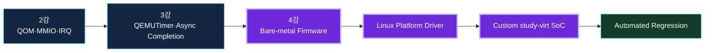

4강은 QEMU 파트의 마무리다. 1강의 부팅 기준선, 2강의 Device Model, 3강의 비동기 실행을 Firmware와 Linux의 실제 개발 흐름으로 완성한다.

## 2. 학습 목표와 완료 기준

- Direct kernel boot, firmware boot, bare-metal boot의 목적과 차이를 설명한다.
- ARM64의 Reset/EL/PSCI/DTB handoff와 RISC-V의 M-mode/SBI/S-mode handoff를 설명한다.
- QEMU source에서 firmware, kernel, initrd, DTB가 load되고 entry register가 설정되는 경로를 읽는다.
- 동일한 `study-ip` contract를 bare-metal HAL과 Linux platform driver에서 사용한다.
- `devm_platform_ioremap_resource()`, `platform_get_irq()`, `devm_request_irq()`의 probe 흐름을 구현한다.
- `completion`과 timeout recovery를 이용해 asynchronous command를 안전하게 처리한다.
- ARM64/RISC-V64 공통 test vector로 Firmware와 Linux의 behavior를 비교한다.
- CPU, RAM, interrupt controller, UART, timer, `study-ip`, FDT를 조합한 `study-virt` Machine을 설계한다.
- QMP, serial marker, QTest와 CI를 이용해 boot·driver·fault 회귀검증을 자동화한다.
- QEMU 결과와 실제 Automotive SoC/ECU timing·safety evidence의 경계를 설명한다.

## 3. 왜 Firmware부터 Driver까지 하나의 VP에서 연결하는가

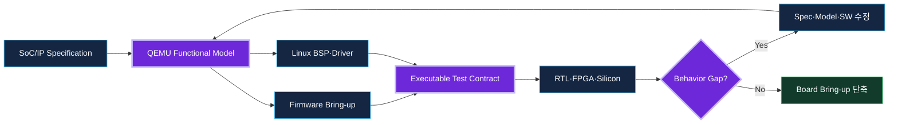

| 개발 문제 | VP 없이 발생하는 비용 | QEMU에서 앞당길 수 있는 검증 |
|---|---|---|
| Register spec가 계속 변경 | Firmware/Driver/RTL 구현이 서로 어긋남 | 공통 header와 QTest로 즉시 차이 검출 |
| Board가 늦게 도착 | Driver probe와 boot script가 뒤늦게 시작 | DT·IRQ·MMIO·initramfs를 선행 개발 |
| Timeout recovery가 희귀 | 실기기에서 재현 위험과 시간이 큼 | deterministic fault injection |
| SMP/boot chain 복잡 | 계층별 원인 분리가 어려움 | Direct boot와 firmware boot를 분리 비교 |
| 회귀검증 수작업 | 부팅 성공만 확인하고 device contract는 누락 | serial marker·QMP·trace·JUnit 자동화 |

## 4. 전체 Architecture와 강의 Roadmap


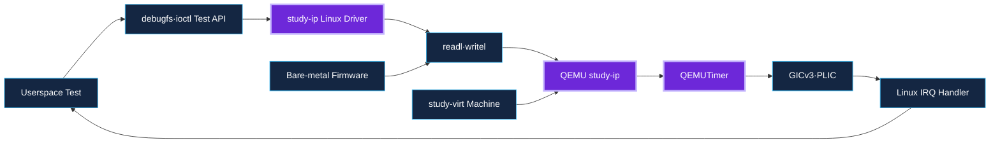

### 4.1 Source Reading Map

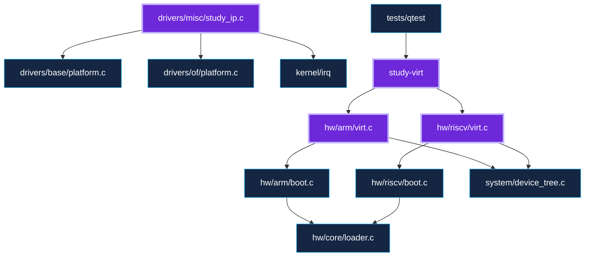

권장 순서는 Machine source에서 시작해 architecture boot loader, FDT 생성, Linux platform driver, 마지막으로 automation으로 내려가는 것이다.

## 5. Boot Mode를 먼저 선택한다

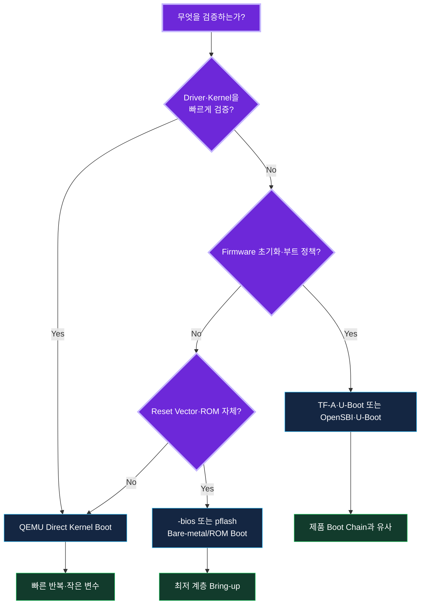

| Mode | QEMU option 예 | 장점 | 제한 |
|---|---|---|---|
| Direct kernel boot | `-kernel -initrd -append` | Kernel/driver 반복이 빠름 | Firmware 초기화 경로를 우회 |
| Firmware boot | `-bios`, `-pflash`, disk/network | 제품 boot chain에 가까움 | Image 구성과 디버깅 변수가 증가 |
| Bare-metal/ROM boot | `-bios test.elf`, custom loader | reset vector와 최소 HAL 검증 | Linux subsystem 검증은 별도 |

### 5.1 Direct Boot는 무엇을 대신하는가

- Kernel Image, initrd와 DTB를 Guest RAM에 배치한다.
- `/chosen/bootargs`, initrd range 같은 boot parameter를 구성한다.
- architecture entry register와 initial PC를 설정한다.
- 필요한 경우 작은 QEMU bootloader stub을 배치한다.
- 실제 DRAM training, PMIC, clock tree, secure boot, flash partition policy는 검증하지 않는다.

## 6. ARM64 Boot Stack

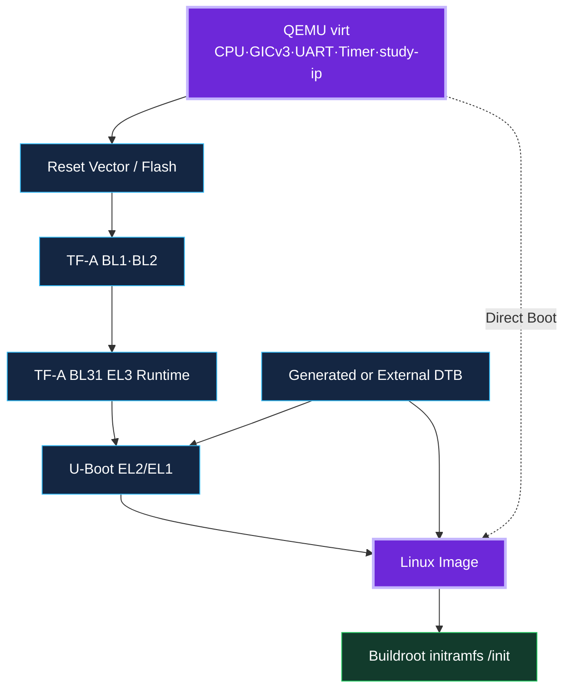

### 6.1 QEMU Direct Kernel Boot Sequence

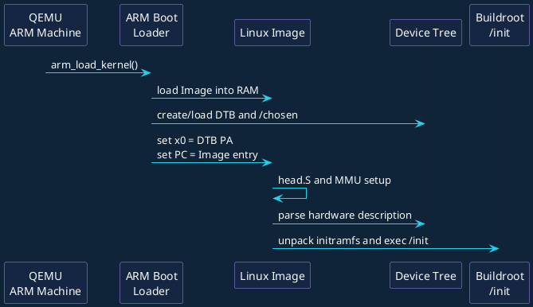

실습 명령:

```bash
#!/usr/bin/env bash
set -euo pipefail

QEMU=build/qemu-system-aarch64
KERNEL=images/arm64/Image
INITRD=images/arm64/rootfs.cpio.gz

exec "$QEMU" \
    -machine virt,gic-version=3,virtualization=on \
    -cpu cortex-a57 -smp 4 -m 1024 \
    -kernel "$KERNEL" \
    -initrd "$INITRD" \
    -append "console=ttyAMA0 earlycon=pl011,0x09000000 rdinit=/init" \
    -nographic -no-reboot
```

핵심 관찰 지점:

- QEMU HMP `info registers`에서 reset 직후와 kernel entry 직전 PC를 비교한다.
- `dumpdtb=` 또는 QMP/HMP를 통해 generated DTB를 저장하고 `/chosen`, UART, GIC, `study-ip`를 확인한다.
- `earlycon`으로 정식 console driver probe 이전 로그를 확보한다.
- `-S -s`로 정지한 뒤 GDB에서 `primary_entry`, `__primary_switch`, `start_kernel` 순으로 breakpoint를 둔다.

### 6.2 `arm_load_kernel()` Source Reading

```c
void arm_load_kernel(ARMCPU *cpu, MachineState *ms,
                     struct arm_boot_info *info)
{
    info->kernel_filename = ms->kernel_filename;
    info->kernel_cmdline = ms->kernel_cmdline;
    info->initrd_filename = ms->initrd_filename;
    info->dtb_filename = ms->dtb;

    if (!info->kernel_filename || info->firmware_loaded) {
        arm_setup_firmware_boot(cpu, info);
    } else {
        arm_setup_direct_kernel_boot(cpu, info);
    }
}
```

읽는 법:

1. `MachineState`의 kernel, cmdline, initrd, dtb option이 `arm_boot_info`로 복사된다.
2. Firmware가 load되었거나 kernel이 없으면 `arm_setup_firmware_boot()`를 선택한다.
3. 그렇지 않으면 `arm_setup_direct_kernel_boot()`가 Image/initrd/DTB와 entry context를 준비한다.
4. 실제 `virt` Machine은 이 공통 ARM boot helper를 호출하기 전에 CPU, RAM, GIC, UART와 FDT를 구성한다.

### 6.3 ARM64 Linux Entry Contract

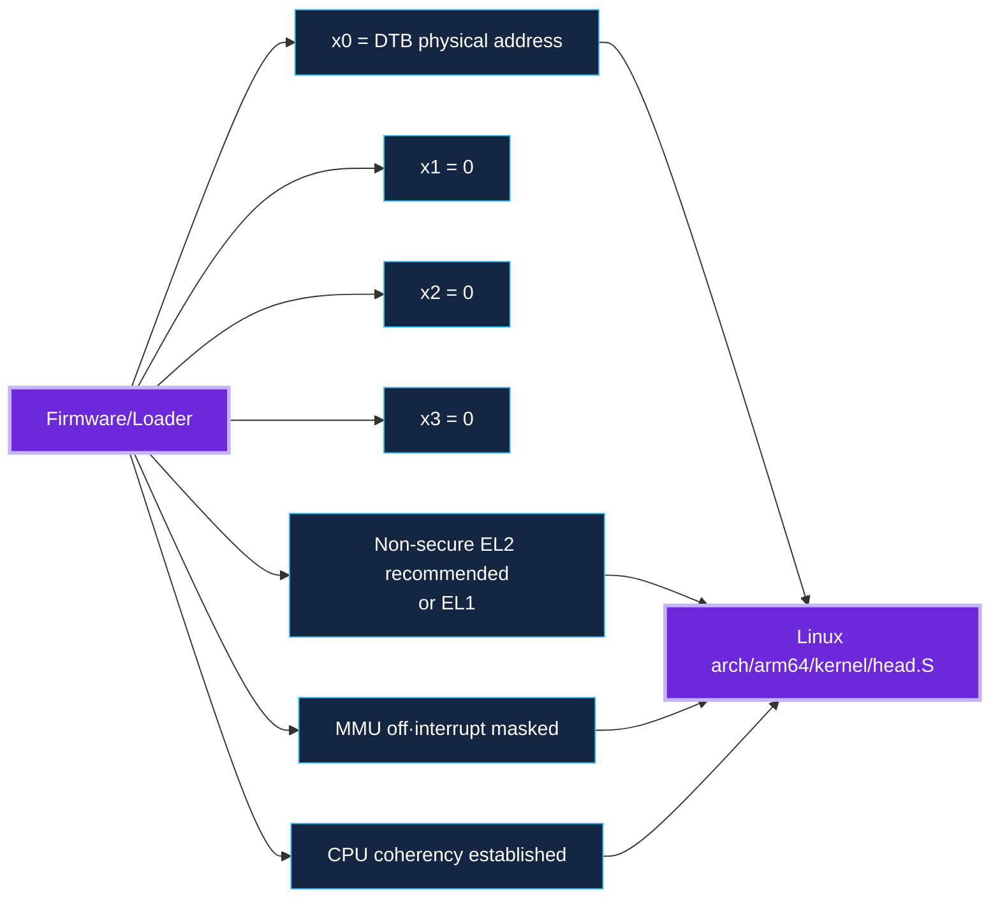

중요 조건:

- `x0`는 system RAM에 있는 DTB의 physical address다. `x1`~`x3`는 0이다.
- non-secure EL2 진입이 권장되며 EL1 진입도 허용된다.
- MMU는 꺼져 있어야 하고 interrupt는 mask되어야 한다.
- Image와 DTB placement/alignment, cache clean, coherency domain을 만족해야 한다.
- Boot firmware는 DMA-capable device를 quiesce하여 kernel memory corruption을 막아야 한다.

### 6.4 Firmware Boot: TF-A와 U-Boot

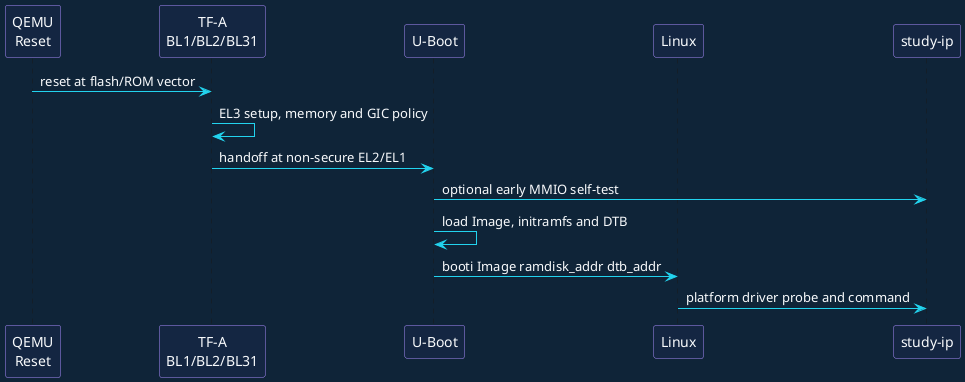

```bash
#!/usr/bin/env bash
set -euo pipefail

exec build/qemu-system-aarch64 \
    -machine virt,gic-version=3,secure=on,virtualization=on \
    -cpu cortex-a57 -smp 4 -m 1024 \
    -bios images/arm64/flash.bin \
    -drive if=none,file=images/arm64/boot.ext4,format=raw,id=boot \
    -device virtio-blk-device,drive=boot \
    -nographic
```

검증 범위를 분리한다:

- TF-A: EL3 runtime, PSCI conduit, secure/non-secure handoff.
- U-Boot: storage/network, environment, Image/initramfs/DTB load와 `booti`.
- Linux: entry contract 이후 architecture setup, DT parse, driver probe.
- QEMU Device Model: register side effect, IRQ, reset, timer와 fault contract.

### 6.5 PSCI와 Secondary CPU

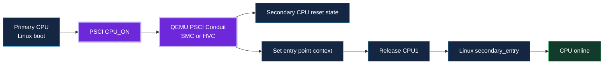

SMP 문제가 발생하면 CPU0의 정상 부팅과 secondary CPU release를 분리한다. PSCI conduit, MPIDR/CPU DT node, GIC redistributor와 `secondary_entry`를 순서대로 확인한다.

## 7. RISC-V64 Boot Stack

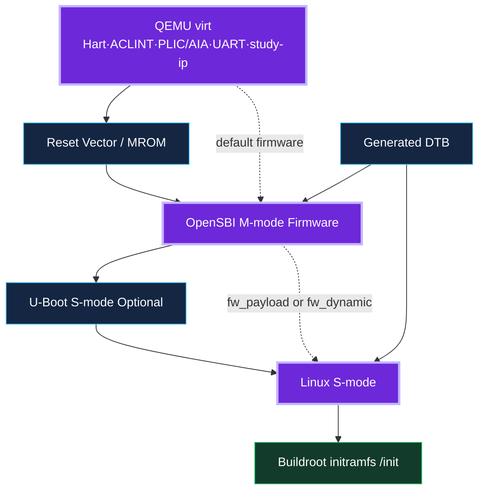

### 7.1 OpenSBI Firmware Mode

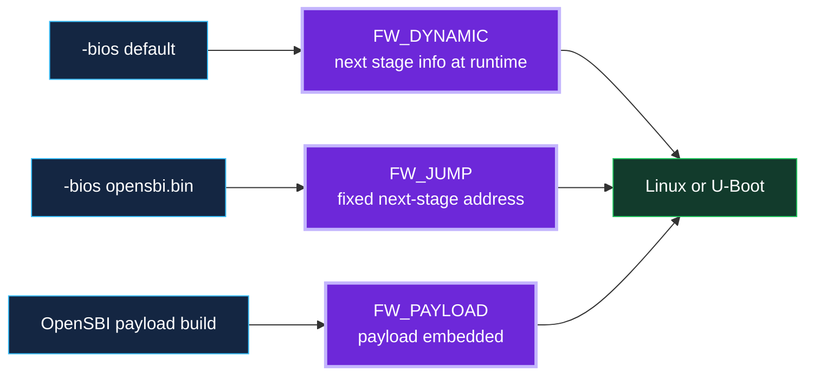

- QEMU `-bios default`는 QEMU와 함께 제공되는 기본 OpenSBI firmware를 찾는다.
- `-bios none`은 firmware를 load하지 않는다. Bare-metal test가 M-mode에서 시작하도록 직접 준비할 때 사용한다.
- FW_DYNAMIC은 next stage 정보가 runtime에 전달되어 generic VP에서 유용하다.
- FW_JUMP과 FW_PAYLOAD는 고정 integration 또는 self-contained image에 적합하다.

### 7.2 RISC-V Boot Sequence

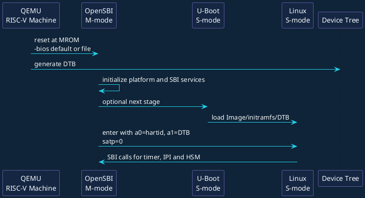

```bash
#!/usr/bin/env bash
set -euo pipefail

exec build/qemu-system-riscv64 \
    -machine virt -cpu rv64 -smp 4 -m 1024 \
    -bios default \
    -kernel images/riscv64/Image \
    -initrd images/riscv64/rootfs.cpio.gz \
    -append "console=ttyS0 earlycon=sbi rdinit=/init" \
    -nographic -no-reboot
```

### 7.3 QEMU RISC-V Firmware Loader

```c
hwaddr riscv_find_and_load_firmware(MachineState *machine,
                                      const char *default_fw,
                                      hwaddr *load_addr,
                                      symbol_fn_t sym_cb)
{
    char *filename = riscv_find_firmware(machine->firmware,
                                         default_fw);
    hwaddr end = *load_addr;

    if (filename) {
        end = riscv_load_firmware(filename, load_addr, sym_cb);
        g_free(filename);
    }
    return end;
}
```

`riscv_find_firmware()`는 `default`, `none`, 사용자 지정 file을 구분한다. Firmware end 이후 kernel load address를 계산하고, kernel ELF/uImage/raw Image와 initrd, DTB를 RAM에 배치한다.

### 7.4 RISC-V Linux Entry Contract

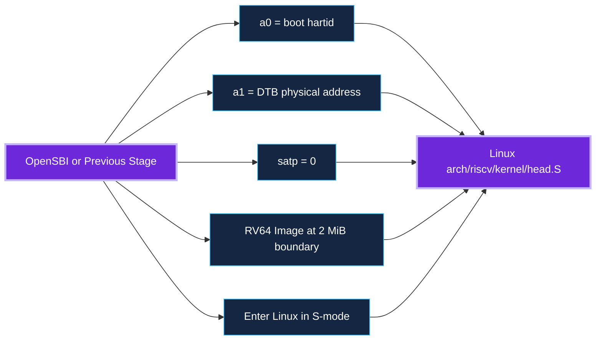

- `a0`는 boot hartid, `a1`은 DTB physical address다.
- `satp=0`으로 MMU가 꺼진 상태에서 진입한다.
- RV64 kernel은 2 MiB PMD boundary에 배치한다.
- 일반적인 Linux는 S-mode에서 실행되고 OpenSBI가 M-mode SBI service를 제공한다.

### 7.5 SBI HSM과 SMP

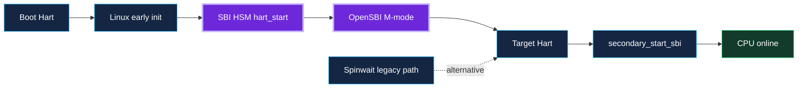

Ordered boot와 SBI HSM을 우선 사용한다. Spinwait는 legacy path이며 CPU hotplug와 kexec 관점에서 제약이 있다.

## 8. Image, initramfs와 DTB Placement

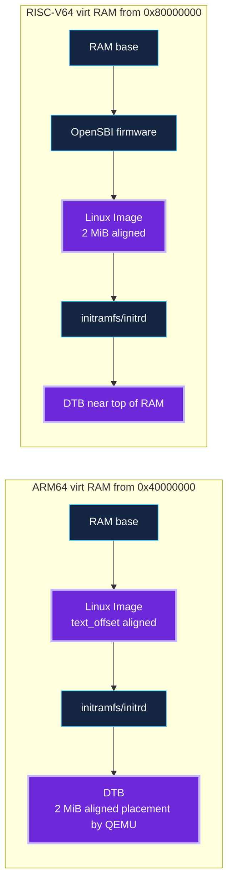

주소는 Machine과 image format에 따라 달라질 수 있으므로 hard-coded 가정 대신 source와 runtime tree를 함께 본다.

| 검증 항목 | ARM64 | RISC-V64 |
|---|---|---|
| RAM base | `virt` 기본 `0x40000000` | `virt` 기본 `0x80000000` |
| Kernel alignment | Image header/2 MiB base rules | RV64 2 MiB boundary |
| DTB entry register | `x0` | `a1` |
| boot CPU ID | MPIDR/DT CPU node | `a0` hartid |
| Firmware interface | PSCI/SMCCC | SBI |

## 9. Linux Early Boot에서 Platform Driver까지

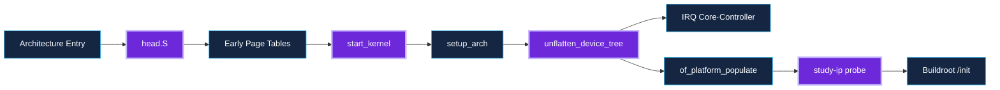

ARM64와 RISC-V64는 early page table 구현이 다르지만 `start_kernel()` 이후 device tree를 unflatten하고 platform device를 생성하며 driver probe로 연결되는 큰 흐름은 공통이다.

## 10. Device Tree는 Hardware-visible Contract다

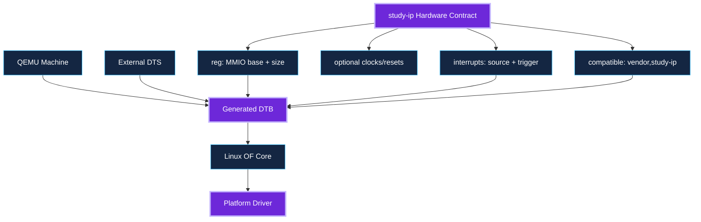

### 10.1 `study-ip` ARM64 Node

```dts
study_ip@c000000 {
    compatible = "openai,study-ip-v1";
    reg = <0x0 0x0c000000 0x0 0x1000>;
    interrupts = <GIC_SPI 112 IRQ_TYPE_LEVEL_HIGH>;
    status = "okay";
};
```

### 10.2 `study-ip` RISC-V64 Node

```dts
study_ip@4000000 {
    compatible = "openai,study-ip-v1";
    reg = <0x0 0x04000000 0x0 0x1000>;
    interrupts-extended = <&plic 64>;
    status = "okay";
};
```

주의: 위 주소와 IRQ는 교육용 `study-virt` 또는 과정 fork의 선택이다. 공개 `virt` Machine ABI에 임의의 고정 Device를 추가할 때는 version compatibility와 DT ABI를 관리해야 한다.

### 10.3 DT와 QEMU Runtime Map을 항상 비교한다

```text
DT reg base/size
  == QEMU info mtree mapping
  == Driver platform resource

DT interrupt specifier
  == QEMU sysbus_connect_irq source
  == GIC/PLIC Linux IRQ mapping
```

## 11. Linux `study-ip` Platform Driver

```mermaid
flowchart TB
    APP[Lab Application] --> DBG[debugfs Test Interface]
    DBG --> CMD[study_ip_run]
    CMD --> MMIO[readl·writel]
    CMD --> COMP[completion + timeout]
    IRQ[IRQ Handler] --> COMP
    PLATFORM[Platform Bus] --> PROBE[study_ip_probe]
    OF[OF Match + Resources] --> PROBE
    PROBE --> MMIO
    PROBE --> IRQ
    MMIO --> DEV[QEMU study-ip]
    DEV --> IRQ
    classDef focus fill:#6D28D9,stroke:#C4B5FD,color:#fff,stroke-width:3px
    classDef box fill:#142642,stroke:#38BDF8,color:#fff
    class PROBE,CMD,IRQ focus
    class APP,DBG,MMIO,COMP,PLATFORM,OF,DEV box
```

### 11.1 Driver State와 OF Match

```c
struct study_ip {
    void __iomem *base;
    int irq;
    struct completion done;
    struct mutex lock;
    u32 last_status;
    u32 last_irq_status;
    struct dentry *debugfs_dir;
};

static const struct of_device_id study_ip_of_match[] = {
    { .compatible = "openai,study-ip-v1" },
    { }
};
MODULE_DEVICE_TABLE(of, study_ip_of_match);
```

핵심 ownership:

- `devm_*` resource는 `struct device` lifetime에 묶인다.
- `completion`은 한 command의 waiter를 깨우는 synchronization object다.
- `mutex`는 하나의 hardware command engine을 여러 caller가 동시에 program하지 못하게 한다.
- IRQ handler와 process context가 공유하는 status는 access ordering과 race를 고려한다.

### 11.2 Probe Flow

```mermaid
flowchart LR
    DT[DT node enabled] --> MATCH[of_match_table]
    MATCH --> PDEV[platform_device]
    PDEV --> PROBE[study_ip_probe]
    PROBE --> IOMAP[devm_platform_ioremap_resource]
    IOMAP --> GETIRQ[platform_get_irq]
    GETIRQ --> REQ[devm_request_irq]
    REQ --> INIT[completion·mutex init]
    INIT --> HW[Read ID·clear IRQ·enable device]
    HW --> READY[Driver ready]
    classDef focus fill:#6D28D9,stroke:#C4B5FD,color:#fff,stroke-width:3px
    classDef box fill:#142642,stroke:#38BDF8,color:#fff
    class PROBE,IOMAP,REQ focus
    class DT,MATCH,PDEV,GETIRQ,INIT,HW,READY box
```

```plantuml
@startuml
skinparam backgroundColor #0F2438
skinparam defaultFontColor #F8FAFC
skinparam ArrowColor #22D3EE
skinparam ParticipantBorderColor #A78BFA
skinparam ParticipantBackgroundColor #142642
participant "OF Core" as OF
participant "Platform Bus" as PBUS
participant "study-ip\nDriver" as DRV
participant "IRQ Core" as IRQ
participant "QEMU\nstudy-ip" as DEV
OF -> PBUS: create platform_device from DT
PBUS -> DRV: study_ip_probe(pdev)
DRV -> PBUS: map MMIO resource
DRV -> PBUS: get IRQ resource
DRV -> IRQ: devm_request_irq()
DRV -> DEV: read ID and clear pending IRQ
DEV --> DRV: ID/version
DRV --> PBUS: probe success
@enduml
```

```c
static int study_ip_probe(struct platform_device *pdev)
{
    struct device *dev = &pdev->dev;
    struct study_ip *ip;
    u32 id;
    int ret;

    ip = devm_kzalloc(dev, sizeof(*ip), GFP_KERNEL);
    if (!ip)
        return -ENOMEM;

    ip->base = devm_platform_ioremap_resource(pdev, 0);
    if (IS_ERR(ip->base))
        return PTR_ERR(ip->base);

    ip->irq = platform_get_irq(pdev, 0);
    if (ip->irq < 0)
        return ip->irq;

    init_completion(&ip->done);
    mutex_init(&ip->lock);

    ret = devm_request_irq(dev, ip->irq, study_ip_irq,
                           0, dev_name(dev), ip);
    if (ret)
        return dev_err_probe(dev, ret, "request IRQ failed\n");

    id = readl(ip->base + STUDY_REG_ID);
    if ((id & STUDY_ID_MAGIC_MASK) != STUDY_ID_MAGIC)
        return dev_err_probe(dev, -ENODEV, "bad ID %#x\n", id);

    writel(STUDY_IRQ_ALL, ip->base + STUDY_REG_IRQ_STATUS);
    platform_set_drvdata(pdev, ip);
    return 0;
}
```

Source reading point:

- `devm_platform_ioremap_resource()`는 DT resource를 request하고 ioremap한다.
- `platform_get_irq()`는 architecture-independent Linux IRQ number를 얻는다. DT의 raw interrupt ID와 같다고 가정하지 않는다.
- `devm_request_irq()` 이후 Device가 이미 pending 상태라면 IRQ가 즉시 들어올 수 있으므로 초기화 순서를 설계한다.
- ID check로 wrong base, endian, incompatible model을 빠르게 검출한다.

### 11.3 MMIO Access와 Reset

```c
static inline u32 study_read(struct study_ip *ip, u32 reg)
{
    return readl(ip->base + reg);
}

static inline void study_write(struct study_ip *ip, u32 reg, u32 val)
{
    writel(val, ip->base + reg);
}

static void study_hw_reset(struct study_ip *ip)
{
    study_write(ip, STUDY_REG_IRQ_ENABLE, 0);
    study_write(ip, STUDY_REG_CTRL, STUDY_CTRL_SW_RESET);
    study_write(ip, STUDY_REG_IRQ_STATUS, STUDY_IRQ_ALL);
    readl(ip->base + STUDY_REG_STATUS); /* posted-write ordering */
}
```

- Device register에는 `readl()/writel()`을 사용하고 raw pointer dereference를 사용하지 않는다.
- W1C register는 read-modify-write가 아니라 읽은 pending mask를 그대로 write한다.
- Reset은 IRQ mask, pending clear, asynchronous timer cancellation까지 hardware contract에 포함한다.
- posted write가 가능한 interconnect라면 ordering이 필요한 지점에 read-back 또는 proper barrier를 둔다.

### 11.4 Interrupt Sequence

```plantuml
@startuml
skinparam backgroundColor #0F2438
skinparam defaultFontColor #F8FAFC
skinparam ArrowColor #22D3EE
skinparam ParticipantBorderColor #A78BFA
skinparam ParticipantBackgroundColor #142642
participant "study-ip\nQEMUTimer" as TIMER
participant "study-ip\nRegisters" as REG
participant "GICv3 or PLIC" as INTC
participant "Linux IRQ Core" as IRQ
participant "study-ip Driver" as DRV
TIMER -> REG: STATUS.DONE=1\nIRQ_STATUS.DONE=1
REG -> INTC: assert level IRQ
INTC -> IRQ: deliver interrupt
IRQ -> DRV: study_ip_irq()
DRV -> REG: read IRQ_STATUS and STATUS
DRV -> REG: W1C IRQ_STATUS
REG -> INTC: deassert IRQ
DRV -> DRV: complete(&done)
@enduml
```

```c
static irqreturn_t study_ip_irq(int irq, void *data)
{
    struct study_ip *ip = data;
    u32 pending;

    pending = study_read(ip, STUDY_REG_IRQ_STATUS);
    if (!(pending & STUDY_IRQ_ALL))
        return IRQ_NONE;

    ip->last_irq_status = pending;
    ip->last_status = study_read(ip, STUDY_REG_STATUS);

    study_write(ip, STUDY_REG_IRQ_STATUS,
                pending & STUDY_IRQ_ALL); /* W1C */
    complete(&ip->done);
    return IRQ_HANDLED;
}
```

Level IRQ에서는 pending condition을 clear하기 전에 handler가 종료되면 IRQ가 다시 들어온다. 반대로 mask만 내리고 pending을 남기면 unmask 시 즉시 재발생할 수 있다.

### 11.5 Command, Completion과 Timeout

```plantuml
@startuml
skinparam backgroundColor #0F2438
skinparam defaultFontColor #F8FAFC
skinparam ArrowColor #22D3EE
skinparam ParticipantBorderColor #A78BFA
skinparam ParticipantBackgroundColor #142642
participant "Userspace Test" as APP
participant "study-ip Driver" as DRV
participant "QEMU study-ip" as DEV
participant "QEMUTimer" as TIMER
participant "IRQ Handler" as ISR
APP -> DRV: write command/data/delay
DRV -> DEV: DATA, DELAY, IRQ_ENABLE
DRV -> DEV: CTRL.ENABLE | START
DEV -> TIMER: arm absolute virtual deadline
DRV -> DRV: wait_for_completion_timeout()
TIMER -> DEV: complete operation
DEV -> ISR: level IRQ
ISR -> DEV: W1C pending
ISR -> DRV: complete()
DRV --> APP: result or error
@enduml
```

```c
static int study_ip_run(struct study_ip *ip, u32 data,
                        u32 delay_us, u32 fault, u32 *result)
{
    unsigned long timeout;
    u32 status;
    int ret = 0;

    mutex_lock(&ip->lock);
    reinit_completion(&ip->done);

    study_write(ip, STUDY_REG_IRQ_STATUS, STUDY_IRQ_ALL);
    study_write(ip, STUDY_REG_DATA, data);
    study_write(ip, STUDY_REG_DELAY, delay_us);
    study_write(ip, STUDY_REG_FAULT_INJECT, fault);
    study_write(ip, STUDY_REG_IRQ_ENABLE, STUDY_IRQ_ALL);
    study_write(ip, STUDY_REG_CTRL,
                STUDY_CTRL_ENABLE | STUDY_CTRL_START);

    timeout = wait_for_completion_timeout(&ip->done,
                                          msecs_to_jiffies(100));
    if (!timeout) {
        study_hw_reset(ip);
        ret = -ETIMEDOUT;
        goto out;
    }

    status = ip->last_status;
    if (status & STUDY_STATUS_ERROR) {
        ret = -EIO;
        goto out;
    }

    *result = study_read(ip, STUDY_REG_DATA);
out:
    mutex_unlock(&ip->lock);
    return ret;
}
```

Command path의 순서:

1. Caller serialization과 `completion` 재초기화.
2. 이전 pending W1C와 input/delay/fault programming.
3. IRQ enable 후 START. Device specification이 다르면 ordering을 계약으로 명시한다.
4. Timeout 동안 sleep하며 IRQ handler가 `complete()`한다.
5. Timeout이면 reset/recovery하고 stale completion을 차단한다.
6. Status를 확인한 뒤 result를 읽고 error를 Linux errno로 변환한다.

### 11.6 Timeout Recovery

```plantuml
@startuml
skinparam backgroundColor #0F2438
skinparam defaultFontColor #F8FAFC
skinparam ArrowColor #F59E0B
skinparam ParticipantBorderColor #A78BFA
skinparam ParticipantBackgroundColor #142642
participant "Linux Driver" as DRV
participant "QEMU study-ip" as DEV
participant "QEMUTimer" as TIMER
participant "Recovery Policy" as REC
DRV -> DEV: START with FAULT_TIMEOUT
DEV -> TIMER: intentionally do not arm
DRV -> DRV: wait_for_completion_timeout()
DRV -> REC: timeout detected
REC -> DEV: mask IRQ and software reset
DEV -> TIMER: timer_del() if pending
DEV -> DEV: clear BUSY, pending and latched state
REC -> DEV: verify ID and reset state
REC --> DRV: ready for retry or fail-safe
@enduml
```

| Fault | Driver 관찰 | Recovery | QEMU Model 조건 |
|---|---|---|---|
| Device error | IRQ + `STATUS.ERROR` | error return, pending clear | error completion IRQ |
| Timeout | completion 없음 | IRQ mask, SW reset, state verify | timer를 arm하지 않음 |
| IRQ storm | 반복 handler | mask, pending/trigger audit | level line이 clear되지 않음 |
| Reset during BUSY | aborted command | cancel and reinitialize | `timer_del()` + latched state clear |
| Invalid access | abort/log/ignored | DT·access width fix | `MemoryRegionOps.valid` |

### 11.7 Lab Interface

```c
static ssize_t run_write(struct file *file,
                         const char __user *buf,
                         size_t len, loff_t *ppos)
{
    struct study_ip *ip = file->private_data;
    u32 data, delay, fault, result;
    char kbuf[96];
    int ret;

    if (len >= sizeof(kbuf))
        return -E2BIG;
    if (copy_from_user(kbuf, buf, len))
        return -EFAULT;
    kbuf[len] = '\0';

    ret = sscanf(kbuf, "%x %u %x", &data, &delay, &fault);
    if (ret != 3)
        return -EINVAL;

    ret = study_ip_run(ip, data, delay, fault, &result);
    if (ret)
        return ret;

    dev_info(ip->dev, "result=%#x\n", result);
    return len;
}
```

debugfs는 diagnostics와 lab automation에 적합하지만 stable userspace ABI가 아니다. 제품 driver는 subsystem API, character device ioctl, RPMsg 또는 application-specific interface를 별도로 설계한다.

## 12. Bare-metal Firmware와 공통 HAL

```mermaid
flowchart LR
    TEST[Bare-metal Test] --> HAL[study_ip HAL]
    HAL --> REG[Shared register header]
    REG --> MMIO[volatile 32-bit MMIO]
    MMIO --> DEV[QEMU study-ip]
    DEV --> IRQ[GICv3 or PLIC]
    IRQ --> ISR[Firmware ISR or Poll]
    ISR --> TEST
    SAME[Same test vectors] --> TEST
    SAME --> LINUX[Linux Driver Test]
    classDef focus fill:#6D28D9,stroke:#C4B5FD,color:#fff,stroke-width:3px
    classDef box fill:#142642,stroke:#38BDF8,color:#fff
    class HAL,DEV,SAME focus
    class TEST,REG,MMIO,IRQ,ISR,LINUX box
```

### 12.1 Shared Register Header

```c
#ifndef STUDY_IP_REGS_H
#define STUDY_IP_REGS_H

#define STUDY_REG_ID            0x000
#define STUDY_REG_CTRL          0x004
#define STUDY_REG_STATUS        0x008
#define STUDY_REG_DATA          0x00c
#define STUDY_REG_IRQ_STATUS    0x010
#define STUDY_REG_IRQ_ENABLE    0x014
#define STUDY_REG_DELAY         0x018
#define STUDY_REG_FAULT_INJECT  0x01c

#define STUDY_CTRL_ENABLE       (1U << 0)
#define STUDY_CTRL_START        (1U << 1)
#define STUDY_CTRL_SW_RESET     (1U << 2)
#define STUDY_STATUS_BUSY       (1U << 0)
#define STUDY_STATUS_DONE       (1U << 1)
#define STUDY_STATUS_ERROR      (1U << 2)
#define STUDY_IRQ_DONE          (1U << 0)
#define STUDY_IRQ_ERROR         (1U << 1)
#define STUDY_IRQ_ALL           (STUDY_IRQ_DONE | STUDY_IRQ_ERROR)

#endif
```

Register header는 QEMU C Device, Firmware HAL, Linux Driver가 공유하되 Linux-specific type/API를 섞지 않는다. 장기적으로 YAML register spec에서 자동 생성하면 drift를 줄일 수 있다.

### 12.2 Firmware Command

```plantuml
@startuml
skinparam backgroundColor #0F2438
skinparam defaultFontColor #F8FAFC
skinparam ArrowColor #22D3EE
skinparam ParticipantBorderColor #A78BFA
skinparam ParticipantBackgroundColor #142642
participant "Bare-metal Main" as MAIN
participant "study-ip HAL" as HAL
participant "MMIO" as MMIO
participant "study-ip" as DEV
participant "Firmware ISR" as ISR
MAIN -> HAL: study_ip_init(base)
HAL -> MMIO: read ID and clear pending
MAIN -> HAL: study_ip_run(data, delay)
HAL -> MMIO: program registers and START
MMIO -> DEV: command
DEV -> ISR: interrupt on completion
ISR -> MMIO: read status and W1C
ISR --> MAIN: set completion flag
MAIN -> HAL: read result and compare
@enduml
```

```c
struct study_hal {
    uintptr_t base;
};

static inline void mmio_write32(uintptr_t addr, uint32_t val)
{
    *(volatile uint32_t *)addr = val;
}

static inline uint32_t mmio_read32(uintptr_t addr)
{
    return *(volatile uint32_t *)addr;
}

int study_hal_run(struct study_hal *h, uint32_t data, uint32_t delay)
{
    mmio_write32(h->base + STUDY_REG_IRQ_STATUS, STUDY_IRQ_ALL);
    mmio_write32(h->base + STUDY_REG_DATA, data);
    mmio_write32(h->base + STUDY_REG_DELAY, delay);
    mmio_write32(h->base + STUDY_REG_IRQ_ENABLE, STUDY_IRQ_ALL);
    mmio_write32(h->base + STUDY_REG_CTRL,
                 STUDY_CTRL_ENABLE | STUDY_CTRL_START);

    while (mmio_read32(h->base + STUDY_REG_STATUS) &
           STUDY_STATUS_BUSY)
        cpu_relax();

    return mmio_read32(h->base + STUDY_REG_STATUS) &
           STUDY_STATUS_ERROR ? -1 : 0;
}
```

Polling과 interrupt mode를 둘 다 제공하면 초기 bring-up에서 interrupt controller가 준비되지 않은 상태와 정상 runtime을 분리할 수 있다.

### 12.3 ARM64 Bare-metal Build

```bash
aarch64-none-elf-gcc \
    -mcpu=cortex-a57 -ffreestanding -fno-builtin \
    -nostdlib -Wl,-T,linker-arm64.ld \
    start.S main.c study_ip_hal.c \
    -o build/study-arm64.elf

build/qemu-system-aarch64 \
    -machine study-virt -cpu cortex-a57 -m 256M \
    -bios build/study-arm64.elf \
    -nographic -no-reboot
```

### 12.4 RISC-V64 Bare-metal Build

```bash
riscv64-unknown-elf-gcc \
    -march=rv64imac -mabi=lp64 \
    -ffreestanding -fno-builtin -nostdlib \
    -Wl,-T,linker-rv64.ld \
    start.S trap.S main.c study_ip_hal.c \
    -o build/study-rv64.elf

build/qemu-system-riscv64 \
    -machine study-virt -cpu rv64 -m 256M \
    -bios none -kernel build/study-rv64.elf \
    -nographic -no-reboot
```

Bare-metal image의 exact load/entry semantics는 Machine loader 선택에 맞춰야 한다. ELF를 `-bios`로 load하는지, `-kernel` raw payload를 사용하는지, reset vector에 trampoline이 필요한지 runtime PC로 확인한다.

### 12.5 Architecture Differential Test

```mermaid
flowchart TB
    VECTOR[Common test-vectors.json] --> GEN[Generate expected values]
    GEN --> ARM[ARM64 Bare-metal]
    GEN --> RV[RISC-V64 Bare-metal]
    GEN --> LINUX[Linux Selftest]
    ARM --> TRACEA[MMIO·IRQ Trace]
    RV --> TRACER[MMIO·IRQ Trace]
    LINUX --> TRACEL[MMIO·IRQ Trace]
    TRACEA --> DIFF[Differential Comparator]
    TRACER --> DIFF
    TRACEL --> DIFF
    DIFF --> RESULT[Contract PASS / GAP]
    classDef focus fill:#6D28D9,stroke:#C4B5FD,color:#fff,stroke-width:3px
    classDef box fill:#142642,stroke:#38BDF8,color:#fff
    classDef good fill:#123B2C,stroke:#22C55E,color:#fff
    class VECTOR,DIFF focus
    class GEN,ARM,RV,LINUX,TRACEA,TRACER,TRACEL box
    class RESULT good
```

같은 test vector에서 결과가 다르면 먼저 Architecture-specific firmware의 endian, access width, interrupt setup 차이를 확인하고 그 다음 Machine mapping을 확인한다.

## 13. Custom `study-virt` SoC Machine

```mermaid
flowchart TB
    MACHINE[study-virt Machine] --> CPU[CPU Cluster]
    MACHINE --> RAM[RAM]
    MACHINE --> INTC[GICv3 or PLIC]
    MACHINE --> UART[UART]
    MACHINE --> TIMER[Architected Timer or ACLINT]
    MACHINE --> IP[study-ip]
    MACHINE --> FDT[DTB Generator]
    CPU --> BUS[System AddressSpace]
    RAM --> BUS
    INTC --> BUS
    UART --> BUS
    TIMER --> BUS
    IP --> BUS
    IP --> INTC
    FDT --> LINUX[Linux/Firmware]
    classDef focus fill:#6D28D9,stroke:#C4B5FD,color:#fff,stroke-width:3px
    classDef box fill:#142642,stroke:#38BDF8,color:#fff
    class MACHINE,IP,FDT focus
    class CPU,RAM,INTC,UART,TIMER,BUS,LINUX box
```

### 13.1 `virt` 확장과 Custom Machine의 선택

| 접근 | 적합한 목적 | 장점 | 위험 |
|---|---|---|---|
| 기존 `virt`에 patch | Driver·Firmware를 빠르게 시작 | 기존 boot stack과 Device 활용 | 공개 Machine ABI와 충돌 가능 |
| `virt` code 참고한 별도 Machine | SoC composition 학습 | 주소/IRQ/boot 정책 제어 | 유지보수와 구현량 증가 |
| QBox/SystemC composition | Heterogeneous IP와 TLM integration | 외부 SystemC model 연결 | 5강 이후 범위 |

### 13.2 Machine TypeInfo

```c
#define TYPE_STUDY_VIRT_MACHINE MACHINE_TYPE_NAME("study-virt")
OBJECT_DECLARE_SIMPLE_TYPE(StudyVirtMachineState,
                           STUDY_VIRT_MACHINE)

struct StudyVirtMachineState {
    MachineState parent_obj;
    MemoryRegion ram;
    DeviceState *intc;
    DeviceState *study_ip;
};

static const TypeInfo study_virt_machine_info = {
    .name = TYPE_STUDY_VIRT_MACHINE,
    .parent = TYPE_MACHINE,
    .instance_size = sizeof(StudyVirtMachineState),
    .class_init = study_virt_machine_class_init,
};

static void study_virt_register_types(void)
{
    type_register_static(&study_virt_machine_info);
}
type_init(study_virt_register_types);
```

Machine은 QOM object이지만 Device와 동일하게 생각하면 안 된다. `MachineClass`는 default CPU/RAM, init callback, SMP/NUMA capability, firmware와 compatibility policy를 정의한다.

### 13.3 Machine Initialization

```mermaid
flowchart LR
    TYPE[Type registration] --> CLASS[MachineClass init]
    CLASS --> CREATE[MachineState instance]
    CREATE --> INIT[Machine init callback]
    INIT --> RAM[Create RAM]
    INIT --> CPU[Create CPUs]
    INIT --> INTC[Create interrupt controller]
    INIT --> DEV[Create UART·timer·study-ip]
    INIT --> IRQ[Connect IRQ]
    INIT --> FDT[Build FDT]
    FDT --> BOOT[Load firmware/kernel]
    BOOT --> RESET[System reset]
    classDef focus fill:#6D28D9,stroke:#C4B5FD,color:#fff,stroke-width:3px
    classDef box fill:#142642,stroke:#38BDF8,color:#fff
    class CLASS,INIT,FDT focus
    class TYPE,CREATE,RAM,CPU,INTC,DEV,IRQ,BOOT,RESET box
```

```c
static void study_virt_machine_init(MachineState *ms)
{
    StudyVirtMachineState *s = STUDY_VIRT_MACHINE(ms);
    MemoryRegion *sysmem = get_system_memory();

    memory_region_init_ram(&s->ram, OBJECT(ms),
                           "study-virt.ram", ms->ram_size,
                           &error_fatal);
    memory_region_add_subregion(sysmem, STUDY_RAM_BASE, &s->ram);

    study_create_cpus(ms);
    s->intc = study_create_interrupt_controller(ms);
    study_create_uart(ms, s->intc);
    study_create_timer(ms, s->intc);
    s->study_ip = study_create_ip(ms, s->intc);

    study_build_fdt(ms);
    study_load_firmware_or_kernel(ms);
}
```

Machine init의 핵심은 생성 순서 자체보다 **wiring contract**다. Device가 expose한 MMIO와 IRQ를 어떤 address/interrupt controller input에 연결하고 이를 DT에 동일하게 기술하는지가 중요하다.

### 13.4 `study-ip` Integration

```c
static DeviceState *study_create_ip(MachineState *ms,
                                    DeviceState *intc)
{
    DeviceState *dev = qdev_new(TYPE_STUDY_IP);
    SysBusDevice *sbd = SYS_BUS_DEVICE(dev);

    qdev_prop_set_uint32(dev, "device-id", 0x53545501);
    sysbus_realize_and_unref(sbd, &error_fatal);
    sysbus_mmio_map(sbd, 0, STUDY_IP_BASE);
    sysbus_connect_irq(sbd, 0,
                       qdev_get_gpio_in(intc, STUDY_IP_IRQ));
    return dev;
}
```

Device source는 base address와 IRQ number를 몰라야 한다. Machine이 map과 wire를 결정한다. 이 원칙이 QEMU model을 QBox SystemC wrapper로 재사용할 때도 중요하다.

### 13.5 FDT Generation

```c
static void study_fdt_add_ip(void *fdt)
{
    g_autofree char *node = g_strdup_printf("/study_ip@%" HWADDR_PRIx,
                                             STUDY_IP_BASE);
    uint32_t reg[] = {
        cpu_to_be32(0), cpu_to_be32(STUDY_IP_BASE),
        cpu_to_be32(0), cpu_to_be32(STUDY_IP_SIZE),
    };

    qemu_fdt_add_subnode(fdt, node);
    qemu_fdt_setprop_string(fdt, node, "compatible",
                            "openai,study-ip-v1");
    qemu_fdt_setprop(fdt, node, "reg", reg, sizeof(reg));
    qemu_fdt_setprop_cells(fdt, node, "interrupts",
                           GIC_FDT_IRQ_TYPE_SPI,
                           STUDY_IP_IRQ,
                           GIC_FDT_IRQ_FLAGS_LEVEL_HI);
}
```

ARM GIC와 RISC-V PLIC/AIA는 interrupt specifier format이 다르므로 FDT helper를 Architecture-specific adapter로 분리한다. `compatible`, register semantics와 driver source는 공통으로 유지한다.

### 13.6 Machine ABI와 Versioning

- Machine name과 version을 release artifact에 기록한다.
- Device ID/version register와 DT `compatible` version을 함께 관리한다.
- MMIO base, IRQ, reset value와 boot interface 변경은 compatibility impact를 검토한다.
- CI가 이전 kernel/firmware image도 boot하는 backward-compatibility job을 가질 수 있다.
- 최신 model만 필요하다면 교육 fork임을 명시하고 stable ABI를 약속하지 않는다.

## 14. QMP와 자동 Boot Regression

```mermaid
flowchart LR
    PY[Python Test Runner] --> QMP[QMP Unix Socket]
    QMP --> CONT[cont·stop·system_reset]
    QMP --> QUERY[query-status·query-cpus-fast]
    QMP --> HMP[human-monitor-command]
    HMP --> TREE[info qom-tree·qtree·mtree]
    SERIAL[Serial Log] --> PY
    TRACE[QEMU Trace] --> PY
    PY --> ASSERT[Boot·Driver·Fault Assertions]
    ASSERT --> REPORT[JUnit·Artifacts]
    classDef focus fill:#6D28D9,stroke:#C4B5FD,color:#fff,stroke-width:3px
    classDef box fill:#142642,stroke:#38BDF8,color:#fff
    classDef good fill:#123B2C,stroke:#22C55E,color:#fff
    class PY,QMP,ASSERT focus
    class CONT,QUERY,HMP,TREE,SERIAL,TRACE box
    class REPORT good
```

### 14.1 QMP Python Client

```python
#!/usr/bin/env python3
import json
import socket

class QMP:
    def __init__(self, path: str):
        self.sock = socket.socket(socket.AF_UNIX, socket.SOCK_STREAM)
        self.sock.connect(path)
        self.file = self.sock.makefile("rwb", buffering=0)
        self._read()
        self.cmd("qmp_capabilities")

    def _read(self) -> dict:
        return json.loads(self.file.readline())

    def cmd(self, execute: str, arguments: dict | None = None) -> dict:
        request = {"execute": execute}
        if arguments:
            request["arguments"] = arguments
        self.file.write((json.dumps(request) + "\n").encode())
        while True:
            response = self._read()
            if "return" in response or "error" in response:
                return response

qmp = QMP("/tmp/study-qmp.sock")
print(qmp.cmd("query-status"))
print(qmp.cmd("human-monitor-command",
              {"command-line": "info mtree"}))
```

QMP message framing은 line-delimited JSON이며 greeting 이후 `qmp_capabilities`가 필요하다. production test runner는 timeout, QMP event, partial line, process exit와 socket cleanup을 처리해야 한다.

### 14.2 Serial Marker 기반 Boot Smoke

```bash
#!/usr/bin/env bash
set -euo pipefail

log=$(mktemp)
trap 'rm -f "$log"' EXIT

timeout 45s scripts/run-arm64.sh 2>&1 | tee "$log" || true

grep -Fq "STUDY_IP_PROBE_OK" "$log"
grep -Fq "STUDY_IP_NORMAL_PASS" "$log"
grep -Fq "STUDY_IP_TIMEOUT_RECOVERED" "$log"
grep -Fq "STUDY_TESTS_DONE" "$log"

! grep -Eq "Kernel panic|BUG:|WARNING:" "$log"
```

단순히 login prompt가 나온 사실만으로 Device contract가 검증되지는 않는다. probe, normal command, error, timeout recovery와 final done marker를 각각 assert한다.

### 14.3 CI Pipeline

```mermaid
flowchart LR
    SRC[QEMU·Kernel·Firmware Source] --> BUILD[Build Matrix]
    BUILD --> QTEST[QTest Device Contract]
    QTEST --> BARE[Bare-metal ARM64·RV64]
    BARE --> BOOT[Linux Boot Smoke]
    BOOT --> DRIVER[Driver Selftest]
    DRIVER --> FAULT[Fault·Reset Scenarios]
    FAULT --> DIFF[Trace Differential]
    DIFF --> ART[Logs·DTB·Hashes·JUnit]
    classDef focus fill:#6D28D9,stroke:#C4B5FD,color:#fff,stroke-width:3px
    classDef box fill:#142642,stroke:#38BDF8,color:#fff
    classDef good fill:#123B2C,stroke:#22C55E,color:#fff
    class BUILD,QTEST,BOOT,FAULT focus
    class SRC,BARE,DRIVER,DIFF box
    class ART good
```

```plantuml
@startuml
skinparam backgroundColor #0F2438
skinparam defaultFontColor #F8FAFC
skinparam ArrowColor #22D3EE
skinparam ParticipantBorderColor #A78BFA
skinparam ParticipantBackgroundColor #142642
participant "CI Runner" as CI
participant "QEMU Process" as QEMU
participant "QMP Socket" as QMP
participant "Guest Selftest" as GUEST
participant "Artifact Store" as ART
CI -> QEMU: launch paused with -S and QMP
QEMU -> QMP: greeting
CI -> QMP: qmp_capabilities and cont
QMP -> QEMU: run VM
QEMU -> GUEST: boot and run study-ip tests
GUEST --> CI: serial PASS/FAIL markers
CI -> QMP: query-status and system_reset
CI -> QEMU: terminate on timeout
CI -> ART: upload logs, DTB, traces and hashes
@enduml
```

```yaml
name: qemu-study-regression
on: [push, pull_request]

jobs:
  test:
    runs-on: ubuntu-latest
    strategy:
      fail-fast: false
      matrix:
        arch: [arm64, riscv64]
    steps:
      - uses: actions/checkout@v4
      - run: ./scripts/build-qemu.sh
      - run: ./scripts/build-kernel.sh ${{ matrix.arch }}
      - run: ./scripts/build-firmware.sh ${{ matrix.arch }}
      - run: ./scripts/run-qtest.sh ${{ matrix.arch }}
      - run: ./scripts/run-baremetal.sh ${{ matrix.arch }}
      - run: ./scripts/run-linux-smoke.sh ${{ matrix.arch }}
      - uses: actions/upload-artifact@v4
        if: always()
        with:
          name: logs-${{ matrix.arch }}
          path: out/${{ matrix.arch }}/artifacts
```

Build artifact에는 QEMU binary hash, Machine version, kernel config/hash, firmware hash, rootfs hash, DTB/DTS, command line, serial log와 trace를 포함한다.

## 15. Fault Injection과 Recovery

```mermaid
flowchart TD
    START[Test Scenario] --> TYPE{Fault Type}
    TYPE --> BADMMIO[Invalid offset/width]
    TYPE --> TIMEOUT[No completion]
    TYPE --> IRQSTORM[IRQ not acknowledged]
    TYPE --> RESET[Reset during BUSY]
    TYPE --> WRONGDT[DT reg/IRQ mismatch]
    BADMMIO --> LOG[guest_errors + trace]
    TIMEOUT --> REC[Driver timeout + reset]
    IRQSTORM --> MASK[Mask IRQ + W1C audit]
    RESET --> CANCEL[Cancel timer + clear state]
    WRONGDT --> TREE[mtree/qtree/DT compare]
    LOG --> RESULT[Expected recovery]
    REC --> RESULT
    MASK --> RESULT
    CANCEL --> RESULT
    TREE --> RESULT
    classDef focus fill:#6D28D9,stroke:#C4B5FD,color:#fff,stroke-width:3px
    classDef box fill:#142642,stroke:#38BDF8,color:#fff
    classDef warn fill:#4A2B12,stroke:#F59E0B,color:#fff
    class START,TYPE,RESULT focus
    class BADMMIO,TIMEOUT,IRQSTORM,RESET,WRONGDT warn
    class LOG,REC,MASK,CANCEL,TREE box
```

```bash
# Normal completion
study-ip-test --data 0x1234 --delay-us 100 --fault 0

# Device-reported command error
study-ip-test --data 0x1234 --delay-us 100 --fault 1

# Suppressed completion: driver must time out and reset
study-ip-test --data 0x1234 --delay-us 100 --fault 2

# Reset while BUSY through QMP
qmpctl system_reset --after-marker STUDY_IP_BUSY

# Validate that a stale timer callback did not assert IRQ
assert-log-not-contains STUDY_IP_STALE_COMPLETION
```

Fault test는 “실패를 발생시켰다”가 아니라 expected detection, bounded recovery, stale event 부재와 다음 정상 command 성공까지 확인해야 한다.

## 16. Automotive SoC·ECU 활용

```mermaid
flowchart TB
    subgraph ECU[Automotive ECU Virtual Platform]
      AP[ARM64 Application Domain<br/>Linux]
      SAFETY[RISC-V Safety/Control Domain<br/>Firmware or RTOS]
      IPC[Mailbox·Shared Memory]
      WDT[Watchdog·Reset Controller]
      ACC[NPU/DMA Stub]
      IP[study-ip Contract Device]
    end
    AP <--> IPC
    SAFETY <--> IPC
    AP --> ACC
    AP --> IP
    SAFETY --> WDT
    WDT --> AP
    WDT --> SAFETY
    VP[QEMU Fast VP] --> AP
    QBOX[QBox SystemC/TLM] -. next stage .-> ECU
    classDef focus fill:#6D28D9,stroke:#C4B5FD,color:#fff,stroke-width:3px
    classDef box fill:#142642,stroke:#38BDF8,color:#fff
    classDef good fill:#123B2C,stroke:#22C55E,color:#fff
    class AP,SAFETY,IPC focus
    class WDT,ACC,IP,VP box
    class QBOX good
```

### 16.1 QEMU에서 선행할 수 있는 항목

- ARM64 Linux BSP, RISC-V firmware와 공통 register/IPC contract.
- Boot order, mailbox handshake, watchdog reset, fault notification.
- NPU/DMA command queue의 functional sequence와 driver timeout.
- Recovery state machine과 degraded mode application response.
- Software regression, security-negative test와 log collection.

### 16.2 QEMU만으로 주장하면 안 되는 항목

- 실제 interrupt latency와 worst-case scheduling latency.
- NoC contention, cache coherency implementation latency, DRAM bandwidth.
- Lockstep, ECC coverage, hardware diagnostic coverage.
- ASIL timing budget 또는 safety certification evidence.
- RTL reset propagation cycle와 clock-domain crossing correctness.

## 17. End-to-End Case Study

```plantuml
@startuml
skinparam backgroundColor #0F2438
skinparam defaultFontColor #F8FAFC
skinparam ArrowColor #22D3EE
skinparam ParticipantBorderColor #A78BFA
skinparam ParticipantBackgroundColor #142642
participant "Automotive App" as APP
participant "Linux Driver" as DRV
participant "QEMU Device" as DEV
participant "Interrupt Controller" as INTC
participant "Fault Monitor" as MON
APP -> DRV: request inference-control command
DRV -> DEV: program DATA and START
DEV -> DEV: execute virtual delay
alt normal completion
  DEV -> INTC: completion IRQ
  INTC -> DRV: IRQ handler
  DRV --> APP: result
else timeout injection
  DEV -> DEV: suppress completion
  DRV -> MON: timeout and register snapshot
  MON -> DEV: reset device domain
  MON --> APP: degraded-mode decision
end
@enduml
```

### 17.1 Ownership와 Lifetime

| Object/Data | Owner | Lifetime | Fault 관찰 |
|---|---|---|---|
| Userspace request | Application | syscall 동안 | errno/timeout |
| Driver command state | `struct study_ip` | one serialized transaction | status snapshot |
| Active input/delay/fault | QEMU Device | START부터 completion/reset | trace event |
| QEMUTimer | QEMU Device | pending deadline까지 | timer pending/cancel |
| IRQ pending | Device register | W1C 또는 reset까지 | IRQ_STATUS + line level |
| DT contract | Machine/firmware | boot image lifetime | DTS and runtime resource |

### 17.2 재현과 분석 순서

1. exact QEMU, Machine, kernel, firmware, DTB와 rootfs hash를 고정한다.
2. serial marker와 QMP state로 boot 단계와 process lifetime을 확인한다.
3. Device trace에서 START, deadline, completion/reset을 확인한다.
4. `info mtree`, DT `reg`, driver resource를 비교한다.
5. IRQ_STATUS, IRQ_ENABLE, line level, Linux IRQ count를 순서대로 본다.
6. timeout recovery 후 다음 normal command가 성공하는지 확인한다.

## 18. 디버깅 Decision Tree

```mermaid
flowchart TD
    FAIL[study-ip test failed] --> BOOT{Linux reached /init?}
    BOOT -->|No| ENTRY[Entry registers·Image·DTB·console]
    BOOT -->|Yes| PROBE{Driver probed?}
    PROBE -->|No| DT[compatible·status·reg·interrupts]
    PROBE -->|Yes| MMIO{MMIO callback seen?}
    MMIO -->|No| MAP[resource·mtree·access width]
    MMIO -->|Yes| IRQ{IRQ arrives?}
    IRQ -->|No| PENDING[IRQ_STATUS·ENABLE·routing]
    IRQ -->|Yes| DONE{completion wakes?}
    DONE -->|No| ACK[handler return·W1C·completion]
    DONE -->|Yes| PASS[PASS]
    classDef focus fill:#6D28D9,stroke:#C4B5FD,color:#fff,stroke-width:3px
    classDef box fill:#142642,stroke:#38BDF8,color:#fff
    classDef warn fill:#4A2B12,stroke:#F59E0B,color:#fff
    classDef good fill:#123B2C,stroke:#22C55E,color:#fff
    class FAIL,BOOT,PROBE,MMIO,IRQ,DONE focus
    class ENTRY,DT,MAP,PENDING,ACK warn
    class PASS good
```

### 18.1 계층별 관찰 도구

| 계층 | 도구 | 대표 질문 |
|---|---|---|
| Boot loader | QEMU `-d`, GDB, `info registers` | entry PC/register가 맞는가 |
| Machine | `info qom-tree`, `qtree`, `mtree` | Device가 생성·map·wire되었는가 |
| DT | `dumpdtb`, `dtc`, `/proc/device-tree` | compatible/reg/IRQ가 일치하는가 |
| Driver | dynamic debug, ftrace, dmesg | probe와 command path가 실행되는가 |
| Device | trace-events, guest_errors | register side effect가 맞는가 |
| IRQ | `/proc/interrupts`, qtest IRQ intercept | pending과 line이 일치하는가 |
| Time | QTest clock step, timer trace | deadline/cancel이 deterministic한가 |

## 19. Verification Pyramid

```mermaid
flowchart TB
    UNIT[Register Unit Test] --> QTEST[QTest MMIO·IRQ·Clock]
    QTEST --> BARE[Bare-metal Firmware]
    BARE --> DRIVER[Linux Driver Selftest]
    DRIVER --> BOOT[Full Boot Regression]
    BOOT --> SYSTEM[Automotive Scenario]
    UNIT -. fast .-> SPEED[Seconds]
    SYSTEM -. broad .-> COVER[Minutes]
    classDef focus fill:#6D28D9,stroke:#C4B5FD,color:#fff,stroke-width:3px
    classDef box fill:#142642,stroke:#38BDF8,color:#fff
    classDef good fill:#123B2C,stroke:#22C55E,color:#fff
    class QTEST,DRIVER,BOOT focus
    class UNIT,BARE,SYSTEM box
    class SPEED,COVER good
```

낮은 계층 test는 빠르고 원인 분리가 쉽다. 높은 계층 test는 넓은 integration coverage를 제공하지만 failure localization이 어렵다. CI는 두 종류를 모두 유지한다.

## 20. 핵심 요약

- Boot mode는 검증하려는 계층에 따라 Direct, Firmware, Bare-metal로 선택한다.
- ARM64는 x0/EL/MMU/coherency, RISC-V64는 a0/a1/satp/SBI handoff contract를 만족해야 한다.
- Device Tree, QEMU Machine wiring, Linux platform resource는 동일한 Hardware-visible contract를 표현해야 한다.
- Linux Driver는 MMIO, IRQ, completion, timeout과 reset lifetime을 하나의 state machine으로 다룬다.
- Bare-metal HAL과 Linux Driver가 공통 register header와 test vector를 사용하면 architecture 차이를 빠르게 분리할 수 있다.
- Custom Machine은 CPU/RAM/INTC/Device/FDT/boot policy를 조합하는 wiring layer다.
- QMP, serial marker, QTest와 trace를 결합해야 reproducible regression이 된다.
- QEMU는 functional pre-silicon development에 강하지만 실제 timing, WCET와 safety certification을 대체하지 않는다.

## 21. 퀴즈 10문항

### 객관식 1

Linux platform driver를 가장 빠르게 반복 개발할 때 우선 선택할 boot mode는?

A. Direct kernel boot  B. Full secure boot only  C. RTL simulation only  D. Host user-mode emulation

### 객관식 2

ARM64 Linux entry에서 DTB physical address가 전달되는 register는?

A. x0  B. x1  C. x30  D. SP_EL1

### 객관식 3

일반적인 RISC-V Linux boot에서 M-mode service를 제공하는 component는?

A. GIC  B. OpenSBI  C. PL011  D. initramfs

### 객관식 4

DT의 raw interrupt number와 Linux `platform_get_irq()` 반환값에 대한 올바른 설명은?

A. 항상 같다  B. Linux IRQ domain mapping으로 달라질 수 있다  C. PA다  D. userspace fd다

### O/X 5

`writel()` 직후 Device가 완료될 때까지 driver가 busy-loop 해야만 올바른 asynchronous driver다.

O 또는 X

### O/X 6

Level IRQ는 pending condition을 clear하지 않으면 handler return 후 다시 assert될 수 있다.

O 또는 X

### 단답형 7

RISC-V64 Linux entry의 `a0`, `a1`과 `satp` 조건을 쓰시오.

### 단답형 8

Custom QEMU Device가 base address를 자체 source에 hard-code하면 안 되는 이유를 쓰시오.

### 시나리오 9

Driver probe는 성공하지만 MMIO callback trace가 없다. 우선 확인할 세 항목은?

### 시나리오 10

Timeout recovery 직후 예전 command의 DONE IRQ가 발생한다. QEMU model과 driver에서 확인할 lifetime 문제는?

## 22. 정답과 해설

| 문제 | 정답 | 해설 |
|---:|---|---|
| 1 | A | Direct kernel boot는 firmware 변수를 줄여 kernel/driver 반복을 빠르게 한다. Firmware boot는 boot-chain 검증에 사용한다. |
| 2 | A | ARM64 boot protocol은 x0에 DTB physical address를 전달하고 x1~x3는 0으로 요구한다. |
| 3 | B | OpenSBI가 M-mode runtime과 SBI service를 제공하고 Linux는 보통 S-mode에서 실행된다. |
| 4 | B | DT interrupt specifier는 irqchip domain을 거쳐 Linux virtual IRQ로 mapping되므로 raw source ID와 동일하다고 가정하지 않는다. |
| 5 | X | QEMUTimer 기반 Device는 completion IRQ를 제공하므로 driver는 completion/wait queue로 sleep할 수 있다. Atomic context 등 예외적 polling은 별도다. |
| 6 | O | Level line의 원인인 pending condition이 남으면 interrupt controller가 계속 active level을 본다. |
| 7 | `a0=boot hartid`, `a1=DTB PA`, `satp=0` | RV64 Image는 2 MiB boundary 조건도 함께 확인한다. |
| 8 | Machine이 mapping policy를 소유해야 재사용과 wiring 변경이 가능하기 때문 | Device는 MMIO region과 IRQ endpoint를 expose하고 Machine이 address/interrupt source를 결정한다. |
| 9 | DT resource, QEMU mtree mapping, access address/width | probe 성공만으로 실제 access가 target MemoryRegion에 도달했다고 보장할 수 없다. |
| 10 | Pending QEMUTimer와 latched command state cancellation, generation/state check | Reset이 register만 clear하고 timer callback을 남기면 stale completion이 새 transaction을 오염시킨다. |

## 23. 5분 복습 콘텐츠

### 23.1 복습 질문 12개

1. Direct kernel boot와 firmware boot의 검증 범위 차이는?
2. ARM64 Linux에 DTB 주소를 전달하는 register는?
3. ARM64 진입 시 MMU와 interrupt mask 조건은?
4. OpenSBI가 제공하는 privilege boundary는?
5. RISC-V Linux entry에서 a0와 a1의 의미는?
6. DT `reg`와 QEMU `info mtree`가 일치해야 하는 이유는?
7. `platform_get_irq()` 값이 raw hardware source와 다를 수 있는 이유는?
8. W1C register 처리에서 read-modify-write가 위험한 이유는?
9. Timeout recovery가 pending timer를 취소해야 하는 이유는?
10. Device와 Machine 중 base address를 소유해야 하는 쪽은?
11. QMP와 serial marker를 함께 사용하는 이유는?
12. QEMU timing 결과를 WCET로 사용하면 안 되는 이유는?

### 23.2 Flashcard 15개

| 앞면 | 뒷면 |
|---|---|
| Direct kernel boot | QEMU가 Image/initrd/DTB와 entry context를 준비하는 빠른 SW 개발 mode |
| Firmware boot | Guest firmware가 다음 stage와 kernel을 load하는 boot mode |
| PSCI | ARM power state와 CPU on/off interface |
| SBI | RISC-V Supervisor software가 M-mode service를 호출하는 interface |
| OpenSBI | SBI runtime의 대표적인 open-source M-mode firmware |
| DTB | Boot 시 전달되는 flattened device tree binary |
| platform_device | DT/ACPI/resource 기반 Linux platform bus device |
| devm | device lifetime에 resource release를 묶는 managed API |
| completion | 하나의 event 완료를 기다리고 깨우는 Linux synchronization primitive |
| W1C | 1을 write하여 pending bit를 clear하는 register semantics |
| Machine | CPU, memory, buses, devices, boot policy를 조합하는 QEMU board model |
| QMP | JSON 기반 QEMU machine protocol |
| Serial marker | Guest test 단계의 deterministic PASS/FAIL log token |
| Differential test | 동일 vector를 여러 model/architecture에서 실행해 behavior를 비교하는 test |
| Functional VP | Register, boot, interrupt와 software-visible behavior를 검증하는 virtual platform |

### 23.3 빈칸 채우기 5개

1. ARM64 Linux entry에서 DTB PA는 ____ register로 전달된다.
2. RISC-V Linux entry에서 boot hartid는 ____ register로 전달된다.
3. Level IRQ의 원인 bit를 clear하는 대표 semantics는 ____이다.
4. QEMU Device의 base address와 IRQ 연결을 결정하는 계층은 ____이다.
5. QMP는 line-delimited ____ message를 사용한다.

정답: `x0`, `a0`, `W1C`, `Machine`, `JSON`.

### 23.4 오늘의 핵심 문장 5개

- Boot mode는 빠르기보다 검증할 계층에 맞춰 선택한다.
- Device Tree와 QEMU wiring과 Linux resource는 같은 hardware contract의 세 표현이다.
- Asynchronous Device의 reset은 register reset이 아니라 event lifetime reset이다.
- Device는 resource를 expose하고 Machine은 address와 interrupt topology를 결정한다.
- QEMU는 functional correctness를 앞당기지만 actual SoC timing evidence를 만들지는 않는다.

## 24. 실습 과제

### 과제 1. ARM64/RISC-V64 Boot Mode 비교

- 같은 kernel/rootfs를 direct boot와 firmware boot로 실행한다.
- entry register, DTB 위치, boot log 단계와 elapsed host time을 기록한다.
- 차이를 product fidelity와 iteration speed로 분류한다.

### 과제 2. Linux Platform Driver

- `study_ip_probe`, IRQ handler, command/timeout path를 구현한다.
- normal/error/timeout/reset scenario의 serial marker를 정의한다.
- `/proc/interrupts`, DT, `info mtree`와 Device trace를 함께 저장한다.

### 과제 3. Bare-metal Differential Test

- 공통 register header와 test vector를 ARM64/RISC-V64 firmware에 적용한다.
- polling mode와 interrupt mode의 trace를 비교한다.
- Linux selftest 결과와 JSON 형태로 differential compare한다.

### 과제 4. `study-virt`와 CI

- CPU/RAM/UART/INTC/`study-ip`를 가진 최소 Machine을 구성한다.
- generated DTB와 mapping을 검증한다.
- QTest → bare-metal → Linux boot → fault test pipeline을 작성한다.

## 25. 다음 강의 전 Checklist

- [ ] ARM64 direct boot와 firmware boot를 각각 재현할 수 있다.
- [ ] RISC-V64에서 OpenSBI banner와 Linux S-mode handoff를 확인했다.
- [ ] DTB/DTS를 추출하고 `study-ip` reg/IRQ를 QEMU map과 비교했다.
- [ ] Linux driver probe, IRQ, normal command와 timeout recovery가 동작한다.
- [ ] Bare-metal ARM64/RISC-V64 test가 동일 vector를 통과한다.
- [ ] QMP로 status/reset과 HMP command를 자동화했다.
- [ ] QEMU 기능 검증과 actual timing 검증의 경계를 설명할 수 있다.

## 26. 다음 강의 예고

5강에서는 QEMU를 SystemC/TLM 환경에 포함하는 QBox의 계층을 학습한다. `libqemu-cxx`, `libqbox`, `QemuInstance`, TLM initiator/target, Router, Memory, Loader와 CCI/Lua configuration을 이용해 같은 `study-ip` contract를 SystemC Platform으로 옮긴다.

## 27. 공식 Reference와 Source Reading Map

- QEMU v11.0.2 source: `hw/arm/virt.c`, `hw/arm/boot.c`, `hw/riscv/virt.c`, `hw/riscv/boot.c`, `hw/core/loader.c`, `system/device_tree.c`.
- QEMU System Emulator Invocation: Direct Linux Boot, ARM `virt`, RISC-V `virt`, RISC-V firmware options.
- Linux v7.1: `Documentation/arch/arm64/booting.rst`, `Documentation/arch/riscv/boot.rst`.
- Linux driver sources: `drivers/base/platform.c`, `drivers/of/platform.c`, `include/linux/platform_device.h`, `include/linux/interrupt.h`, `include/linux/completion.h`.
- Trusted Firmware-A documentation and source: BL stages, PSCI and QEMU `virt` platform.
- U-Boot documentation: QEMU ARM/RISC-V boards, `booti`, distro boot and sandboxed test practices.
- OpenSBI documentation and source: firmware types, platform operations and SBI HSM.

## Appendix A. Source Review Checklist

### Boot

- [ ] Image format detection
- [ ] load address and alignment
- [ ] initrd placement
- [ ] DTB placement
- [ ] entry register and PC
- [ ] secondary CPU release

### Driver

- [ ] OF match
- [ ] resource mapping
- [ ] IRQ mapping and trigger
- [ ] W1C
- [ ] completion ordering
- [ ] timeout reset
- [ ] remove/reset lifetime

### Machine

- [ ] Type registration
- [ ] default CPU/RAM
- [ ] interrupt controller wiring
- [ ] MMIO map
- [ ] FDT node
- [ ] boot loader path
- [ ] Machine ABI/version

## Appendix B. PlantUML 안전 확인

- 모든 block에 `@startuml`/`@enduml`이 있다.
- 따옴표 내부 줄바꿈은 literal `\n`만 사용한다.
- participant alias는 영문 대문자로 작성했다.
- orphan message가 없으며 모든 participant를 먼저 선언했다.

## Appendix C. Mermaid 목록

- `course_map`
- `lesson_connection`
- `why_vp`
- `roadmap`
- `end_to_end`
- `boot_mode_decision`
- `source_map`
- `arm64_stack`
- `arm64_entry_contract`
- `psci_smp`
- `riscv_stack`
- `opensbi_modes`
- `riscv_entry_contract`
- `sbi_hsm`
- `image_layout`
- `linux_early_boot`
- `dt_contract`
- `driver_layers`
- `probe_flow`
- `firmware_hal`
- `baremetal_diff`
- `machine_arch`
- `machine_init`
- `qmp_pipeline`
- `ci_pipeline`
- `fault_scenarios`
- `automotive_domains`
- `debug_tree`
- `verification_pyramid`

## Appendix D. PlantUML 목록

- `arm_direct_sequence`
- `arm_firmware_sequence`
- `riscv_sequence`
- `linux_probe_sequence`
- `irq_sequence`
- `command_sequence`
- `timeout_recovery_sequence`
- `baremetal_sequence`
- `qmp_ci_sequence`
- `e2e_case`

## Appendix E. 코드 예제 목록

- `arm_direct_cmd` (bash)
- `arm_firmware_cmd` (bash)
- `arm_load_kernel_excerpt` (c)
- `riscv_direct_cmd` (bash)
- `riscv_loader_excerpt` (c)
- `dt_arm` (dts)
- `dt_riscv` (dts)
- `driver_state` (c)
- `driver_probe` (c)
- `driver_mmio` (c)
- `driver_irq` (c)
- `driver_command` (c)
- `debugfs_write` (c)
- `regs_header` (c)
- `hal_command` (c)
- `arm_baremetal_build` (bash)
- `riscv_baremetal_build` (bash)
- `machine_typeinfo` (c)
- `machine_init_code` (c)
- `machine_device_integration` (c)
- `fdt_generation` (c)
- `qmp_python` (python)
- `boot_smoke` (bash)
- `ci_yaml` (yaml)
- `fault_test` (bash)

