# 5강. SystemC/TLM과 QBox 전체 Architecture

> **과정명:** QEMU·QBox 기반 Virtual Platform 개발 10강  
> **대상:** Linux Kernel/BSP, Firmware, Embedded·Automotive SoC 경험이 있는 중급 이상 엔지니어  
> **예상 시간:** 150~180분  
> **기준일:** 2026-07-19  
> **QBox 기준:** Qualcomm `qualcomm/qbox` main commit `860fb08000e82a494c45291579e41f3f1d983daf`  
> **SystemC 기준:** SystemC 3.0.2, IEEE 1666-2023  
> **실습 환경:** 기존 ARM64·RISC-V64 QEMU 환경 + 신규 QBox build tree

---

## 0. 이 강의의 목적

1~4강에서는 QEMU 자체가 Machine, CPU, Device, MemoryRegion, Interrupt, Firmware/Linux 부팅을 어떻게 구성하는지 학습했습니다. 5강은 **QEMU를 하나의 완성된 보드 에뮬레이터로 사용하는 관점에서, QEMU CPU와 Device를 SystemC/TLM Virtual Platform의 구성 요소로 사용하는 관점으로 전환**합니다.

이번 강의의 목표는 QBox를 단순 실행하는 데 있지 않습니다. 다음 질문에 답할 수 있어야 합니다.

- QEMU의 `Machine` 대신 QBox가 `-M none`을 사용하는 이유는 무엇인가?
- Guest CPU의 load/store가 어떤 경로로 SystemC `b_transport()`까지 도달하는가?
- SystemC process, event, delta cycle, simulation time이 QEMU vCPU와 어떻게 공존하는가?
- TLM initiator/target socket, generic payload, DMI, quantum keeper가 각각 어떤 문제를 해결하는가?
- QBox의 `libqemu-cxx`, `libqbox`, `qemu-components`, `base-components`, CCI/Lua가 어떤 책임을 갖는가?
- ARM64 및 RISC-V64 실습 환경을 QBox로 확장할 때 무엇을 공통화하고 무엇을 분리해야 하는가?

### 명시적 가정

- 실습은 Linux host에서 수행합니다.
- QBox는 위 commit으로 고정하여 강의 중 API 변동을 방지합니다.
- SystemC 3.0.2를 권장하며, QBox `hello-qbox` 소스는 SystemC 3 미만을 deprecated로 경고합니다.
- 이번 강의에서는 QBox의 **전체 Architecture와 최소 실행 흐름**에 집중합니다.
- 상세 CCI/Lua platform 구성은 6강, Transaction/Interrupt/Time synchronization 내부는 7강, Heterogeneous SoC는 8강에서 확장합니다.
- QBox의 base-components는 현재 문서 기준 **Loosely Timed only**입니다. 이를 RTL cycle-accurate 모델로 해석하지 않습니다.

---

## 1. 과정에서 5강의 위치

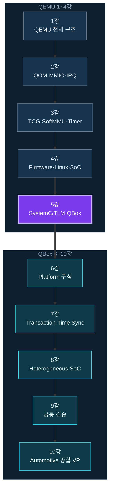

### 1.1 이전 강의에서 가져오는 핵심 자산

- ARM64 및 RISC-V64 QEMU boot baseline
- `study-ip` Hardware-visible contract
- QOM/qdev Device lifecycle 이해
- `MemoryRegionOps` 기반 MMIO
- `qemu_irq`와 GICv3/PLIC interrupt path
- TCG, SoftMMU, virtual timer, main loop
- Firmware, Linux Platform Driver, Device Tree, QTest

### 1.2 이번 강의에서 추가하는 축

- SystemC simulation kernel
- TLM-2.0 transaction abstraction
- QEMU AddressSpace와 TLM socket 사이의 bridge
- CCI/Lua 기반 구성 및 binding
- QEMU Device와 native SystemC IP를 한 VP에서 조합하는 방법

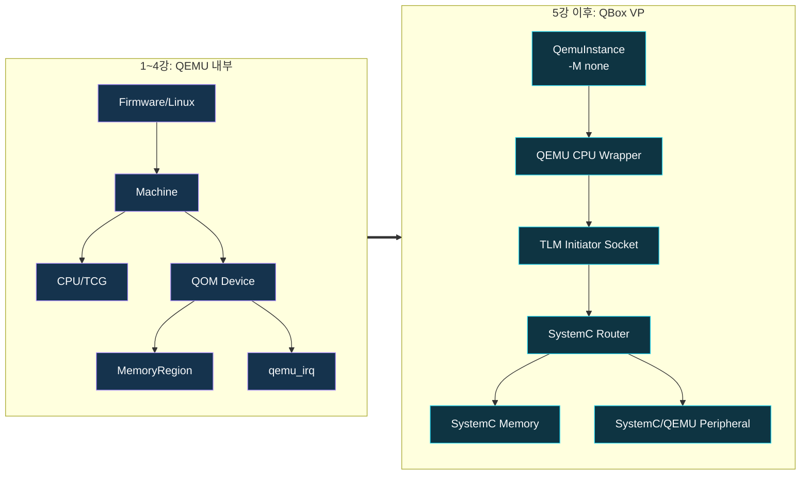

---

## 2. 왜 QBox가 필요한가

Standalone QEMU는 매우 강력합니다. QEMU Machine C 코드에서 CPU, RAM, interrupt controller, UART, custom IP를 만들어 Firmware와 Linux를 빠르게 실행할 수 있습니다. 그러나 실제 Automotive SoC VP에서는 다음 요구가 빠르게 나타납니다.

- CPU domain과 accelerator/IP model을 서로 다른 modeling 기술로 개발
- 기존 SystemC IP model 또는 vendor model 재사용
- 여러 CPU architecture를 하나의 system topology에서 연결
- address routing, shared SRAM, mailbox, watchdog, reset domain 구성
- transaction latency와 synchronization policy를 실험
- QEMU model과 RTL/SystemC model을 단계적으로 교체

QEMU Machine 안에서 모두 구현할 수도 있지만, platform topology와 model lifecycle이 QEMU C 코드에 강하게 결합됩니다. QBox는 QEMU를 TLM component로 노출하여 **CPU functional execution**과 **SystemC platform composition**을 분리합니다.

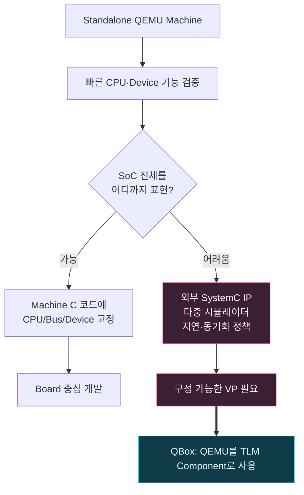
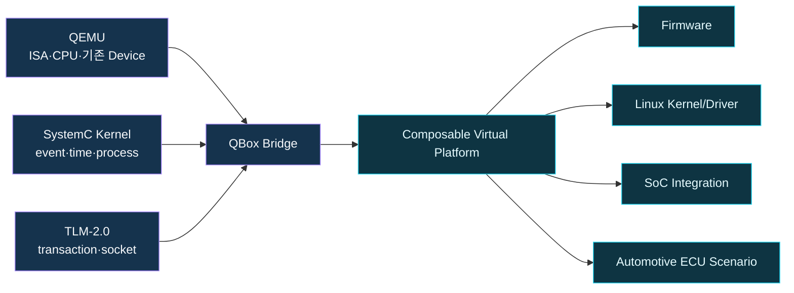

### 2.1 QBox를 선택할 때의 설계 판단

| 질문 | QEMU 단독 | QBox |
|---|---|---|
| Linux/BSP 빠른 기능 검증 | 매우 적합 | 적합 |
| QEMU 기존 Device 재사용 | 직접 사용 | Wrapper로 사용 |
| Native SystemC IP 연결 | 별도 bridge 필요 | 기본 목적 |
| Platform topology 변경 | Machine code 수정 | Lua/CCI 변경 가능 |
| TLM latency annotation | 제한적 | 자연스러움 |
| Heterogeneous domain | 복잡 | Multi-instance로 확장 가능 |
| RTL cycle accuracy | 대상 아님 | 기본 LT model만으로는 대상 아님 |

**설계 관점:** QEMU와 QBox는 경쟁 관계가 아닙니다. QBox가 QEMU를 CPU/Device execution engine으로 포함합니다.

---

## 3. 용어 지도와 Source Reading Map

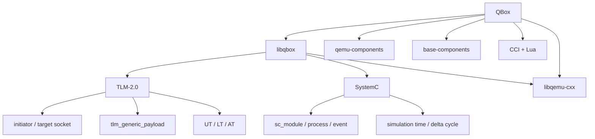
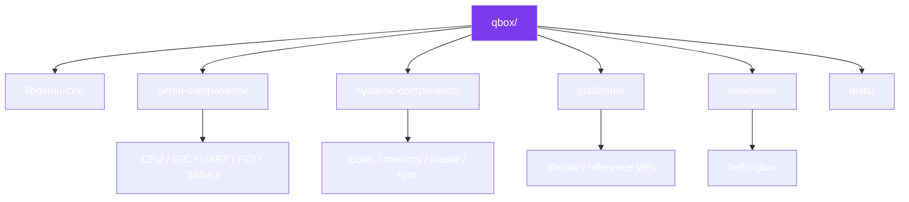

### 3.1 이번 강의의 핵심 source path

| Layer | Source path | 읽는 목적 |
|---|---|---|
| QBox overview | `README.md` | 지원 architecture, build, component overview |
| QEMU/SystemC integration | `docs/libqbox.md` | instance, CPU, GIC/UART wrapper 개념 |
| Configuration | `docs/configuration.md` | CCI, Lua, CLI override |
| Base components | `docs/base-components.md` | router, memory, loader, DMI, LT boundary |
| QEMU instance | `qemu-components/common/include/qemu-instance.h` | default QEMU args, lifecycle, sync strategy |
| CPU bridge | `qemu-components/common/include/cpu.h` | vCPU loop, quantum keeper, TLM initiator |
| Initiator bridge | `qemu-components/common/include/ports/initiator.h` | AddressSpace→generic payload 변환 |
| A53 wrapper | `qemu-components/cpu_arm/cpu_arm_cortex_a53/include/cortex-a53.h` | CPU property/signal 연결 |
| Minimal VP | `examples/hello-qbox/` | 실행 가능한 최소 AArch64 platform |
| Linux VP | `platforms/ubuntu/` | AArch64/RISC-V64 full Linux platform |

> 문서와 소스가 충돌할 때는 고정 commit의 source code를 우선합니다. 예를 들어 `docs/libqbox.md`의 오래된 설명은 기본 memory argument를 `-m 2048`로 적지만, 기준 commit의 `push_default_args()`는 `-m 0`이며 `gs_memory`가 guest RAM을 관리한다고 주석으로 명시합니다.

---

# Part I. SystemC 기초

## 4. SystemC가 제공하는 것

SystemC는 C++ class library와 simulation kernel을 통해 hardware/software system의 concurrency, event, time, hierarchy를 모델링합니다. 일반 C++ 프로그램이 함수 호출 순서에 의해 진행되는 것과 달리, SystemC는 여러 process가 event sensitivity와 simulation time에 따라 실행됩니다.

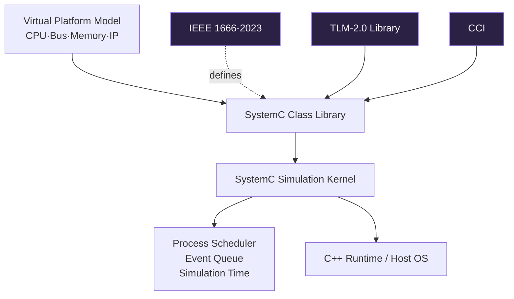

### 4.1 SystemC의 핵심 단위

- `sc_module`: hierarchy와 구조를 만드는 component
- `SC_METHOD`: stack 없이 callback 형태로 실행되는 process
- `SC_THREAD`: `wait()` 가능한 cooperative process
- `SC_CTHREAD`: clock edge와 reset semantics를 가진 thread
- `sc_port`: interface를 요구하는 쪽
- `sc_export`: 내부 interface 구현을 외부에 노출
- `sc_channel`: communication semantics 구현
- `sc_event`: process wake-up 조건
- `sc_time`: simulation time 값

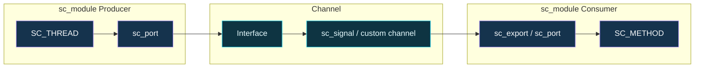
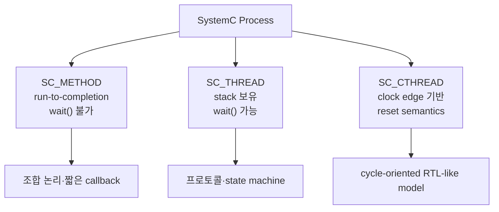

### 4.2 SystemC lifecycle

Component는 C++ construction만으로 즉시 실행되지 않습니다. Elaboration 단계에서 hierarchy, port binding, parameter가 확정된 뒤 simulation이 시작됩니다.

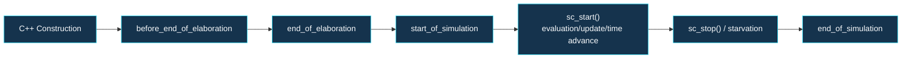

QBox에서 이 lifecycle은 매우 중요합니다.

- `QemuInstance`는 construction에서 QEMU arguments와 CCI parameter를 준비합니다.
- CPU wrapper는 `before_end_of_elaboration()`에서 QEMU CPU object와 memory socket을 초기화합니다.
- `QemuInstance::start_of_simulation()`은 QEMU initialization을 완료합니다.
- CPU `start_of_simulation()`은 quantum keeper와 vCPU execution을 시작합니다.

### 4.3 Delta cycle

SystemC는 같은 simulation time에서도 여러 번 evaluation/update를 수행할 수 있습니다. 이를 delta cycle이라고 합니다. `SC_ZERO_TIME` notification은 wall-clock 또는 simulation time을 증가시키지 않고 다음 delta에서 process를 깨웁니다.

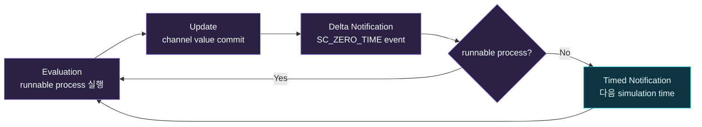
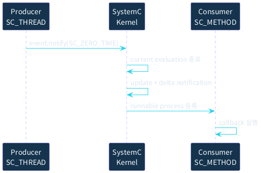

#### Delta cycle을 놓치면 발생하는 오류

- `sc_signal.write()` 직후 read했는데 이전 값이 보임
- zero-time feedback loop가 끝나지 않아 simulation time이 진행하지 않음
- process sensitivity가 빠져 callback이 호출되지 않음
- construction 단계에서 아직 존재하지 않는 sibling object를 참조
- `SC_METHOD` 안에서 `wait()`를 호출

### 4.4 최소 SystemC 예제

```cpp
#include <systemc>

SC_MODULE(PulseSource) {
    sc_core::sc_out<bool> out;

    SC_CTOR(PulseSource) {
        SC_THREAD(run);
    }

    void run() {
        while (true) {
            out.write(true);
            wait(10, sc_core::SC_NS);
            out.write(false);
            wait(90, sc_core::SC_NS);
        }
    }
};
```

이 예제는 pulse를 simulation time으로 생성합니다. Host `sleep()`이 아니라 `wait(10, SC_NS)`를 사용하므로 simulation kernel이 시간을 관리합니다.

---

# Part II. TLM-2.0 기초

## 5. Transaction Level Modeling

TLM은 pin toggle 대신 transaction을 교환합니다. CPU의 32-bit store는 address, data, byte length, command를 가진 하나의 transaction으로 표현할 수 있습니다.

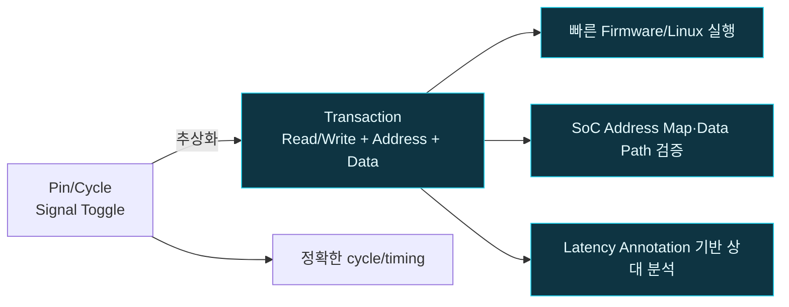

### 5.1 Initiator와 Target

- Initiator는 transaction을 시작합니다. CPU, DMA, loader가 대표적입니다.
- Target은 address range를 제공하고 transaction을 처리합니다. RAM, UART, register block이 대표적입니다.
- Router는 upstream에서 target socket처럼 보이고 downstream에서는 initiator socket처럼 동작합니다.

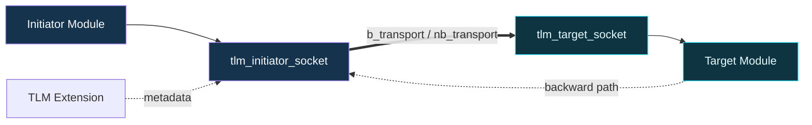

### 5.2 `tlm_generic_payload`

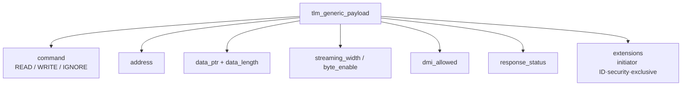

| Field | 의미 | QBox 관찰 포인트 |
|---|---|---|
| command | READ/WRITE/IGNORE | QEMU MemoryRegion operation에서 변환 |
| address | transaction address | Router가 range decode하고 relative offset으로 변환 가능 |
| data_ptr | data buffer | QEMU access value가 연결됨 |
| data_length | byte count | 1/2/4/8-byte access 검증 |
| streaming_width | burst wrapping semantics | 일반 MMIO는 data_length와 같게 설정 |
| byte_enable | partial write mask | target 지원 여부 명확화 |
| dmi_allowed | DMI 가능성 hint | RAM fast path 협상 |
| response_status | 성공/주소/명령 오류 | QEMU MemTxResult와 guest fault에 영향 |
| extension | 추가 metadata | CPU hint, exclusive access, path ID 등 |

### 5.3 Blocking transport

`b_transport()`는 호출이 return될 때 transaction이 완료된 것으로 보는 간단한 interface입니다. Target은 `wait()`하기보다 annotated `delay`를 증가시키는 LT style을 일반적으로 사용합니다.

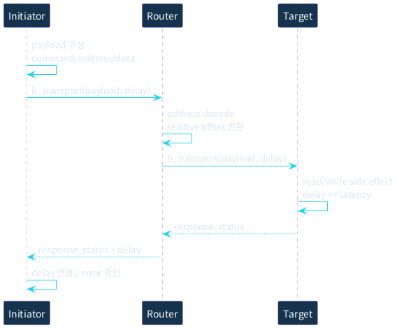
```cpp
struct RegisterTarget : sc_core::sc_module {
    tlm_utils::simple_target_socket<RegisterTarget> socket;
    uint32_t value = 0;

    SC_CTOR(RegisterTarget) : socket("socket") {
        socket.register_b_transport(this,
            &RegisterTarget::b_transport);
    }

    void b_transport(tlm::tlm_generic_payload& gp,
                     sc_core::sc_time& delay) {
        if (gp.get_address() != 0 || gp.get_data_length() != 4) {
            gp.set_response_status(tlm::TLM_ADDRESS_ERROR_RESPONSE);
            return;
        }
        auto *p = reinterpret_cast<uint32_t*>(gp.get_data_ptr());
        if (gp.is_write()) value = *p;
        else               *p = value;
        delay += sc_core::sc_time(20, sc_core::SC_NS);
        gp.set_response_status(tlm::TLM_OK_RESPONSE);
    }
};
```
```cpp
uint32_t data = 0x12345678;
tlm::tlm_generic_payload gp;
sc_core::sc_time delay = sc_core::SC_ZERO_TIME;

gp.set_command(tlm::TLM_WRITE_COMMAND);
gp.set_address(0x1000);
gp.set_data_ptr(reinterpret_cast<unsigned char*>(&data));
gp.set_data_length(sizeof(data));
gp.set_streaming_width(sizeof(data));
gp.set_response_status(tlm::TLM_INCOMPLETE_RESPONSE);

initiator_socket->b_transport(gp, delay);
if (gp.is_response_error()) {
    SC_REPORT_ERROR("TLM", gp.get_response_string().c_str());
}
```

### 5.4 Timing style을 구분해야 하는 이유

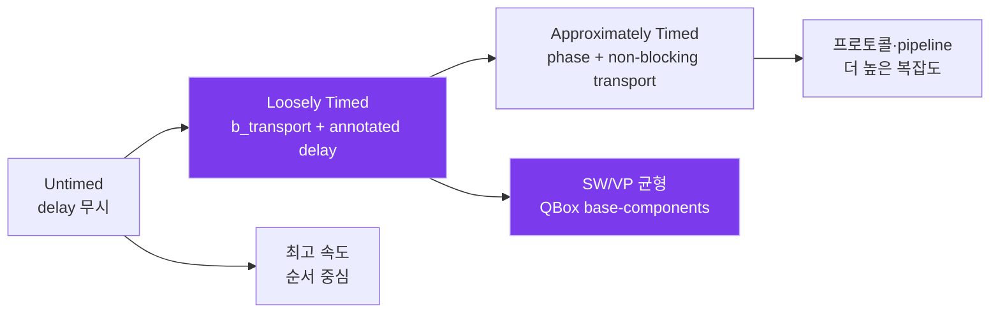

- Untimed: functional ordering만 모델링
- Loosely Timed: transaction에 coarse latency를 annotation
- Approximately Timed: request/response phase와 pipeline concurrency를 더 자세히 표현

QBox base-components 문서는 현재 모든 component를 **Loosely Timed only**로 명시합니다. 따라서 RAM latency를 10ns로 설정해도 실제 DRAM controller의 command scheduling이나 cache miss penalty를 구현한 것이 아닙니다.

### 5.5 Temporal decoupling과 quantum keeper

매 instruction 또는 transaction마다 SystemC global time과 동기화하면 simulation이 느려집니다. Initiator가 local time을 일정 quantum까지 누적한 뒤 동기화하면 속도와 temporal ordering의 균형을 잡을 수 있습니다.

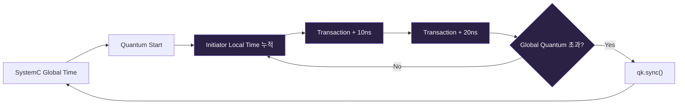
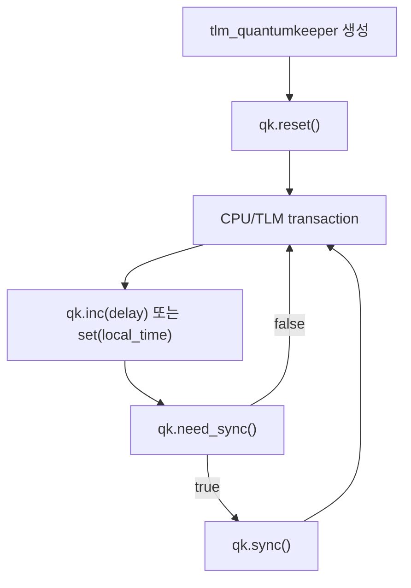
```cpp
tlm_utils::tlm_quantumkeeper qk;
qk.reset();

while (has_work()) {
    sc_core::sc_time delay = qk.get_local_time();
    socket->b_transport(payload, delay);
    qk.set(delay);

    if (qk.need_sync()) {
        qk.sync();
    }
}
```

#### Quantum 선택 기준

- 큰 quantum: fewer synchronization, 높은 실행 속도, event visibility 지연 가능
- 작은 quantum: 높은 synchronization fidelity, 낮은 실행 속도
- interrupt-heavy 또는 mailbox latency 실험에서는 quantum을 줄여 민감도를 확인
- 성능 비교 시 quantum과 sync policy를 반드시 결과 metadata에 기록

### 5.6 DMI: RAM fast path

DMI는 target이 host pointer와 유효 address range를 initiator에 제공하여 반복 TLM callback을 우회하게 합니다. MMIO register와 side effect device에 무분별하게 적용하면 안 됩니다.

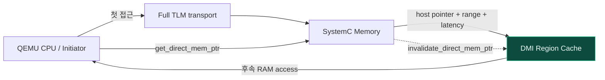
```plantuml
@startuml
skinparam backgroundColor transparent
skinparam defaultFontName "Noto Sans CJK KR"
skinparam defaultFontColor #DCE7F3
skinparam sequenceMessageFontColor #DCE7F3
skinparam sequenceArrowFontColor #DCE7F3
skinparam sequenceReferenceFontColor #DCE7F3
skinparam sequenceGroupFontColor #DCE7F3
skinparam noteFontColor #DCE7F3
skinparam sequenceArrowColor #22D3EE
skinparam sequenceLifeLineBorderColor #A78BFA
skinparam sequenceParticipantBorderColor #A78BFA
skinparam sequenceParticipantBackgroundColor #15334D
skinparam sequenceParticipantFontColor #F8FAFC
participant "QEMU CPU\nInitiator" as CPU
participant "Router" as Router
participant "SystemC\nMemory" as Mem
CPU -> Router: First access b_transport()
Router -> Mem: b_transport()
Mem --> CPU: DMI allowed
CPU -> Mem: get_direct_mem_ptr()
Mem --> CPU: pointer + range + access + latency
loop Subsequent RAM access
    CPU -> CPU: cached DMI pointer 사용
end
Mem -> CPU: invalidate_direct_mem_ptr(range)
CPU -> CPU: DMI cache 제거
@enduml
```
```cpp
tlm::tlm_dmi dmi;
if (socket->get_direct_mem_ptr(payload, dmi)) {
    const uint64_t start = dmi.get_start_address();
    const uint64_t end   = dmi.get_end_address();
    unsigned char *ptr   = dmi.get_dmi_ptr();

    // Cache only inside [start, end].
    // Remove the cache on invalidate_direct_mem_ptr().
    cache_dmi_region(start, end, ptr,
                     dmi.get_read_latency(),
                     dmi.get_write_latency());
}
```

#### DMI 설계 규칙

1. Range와 read/write permission을 정확히 cache합니다.
2. Target의 `invalidate_direct_mem_ptr()`를 반드시 처리합니다.
3. Reset, remap, hotplug, IOMMU translation 변경 시 stale pointer를 제거합니다.
4. MMIO side effect가 필요한 region은 DMI를 거부합니다.
5. DMI latency는 pointer access 자체가 아니라 model이 선언한 read/write latency입니다.

---

# Part III. QBox 전체 Architecture

## 6. QBox는 QEMU를 어떻게 포함하는가

```mermaid
flowchart TB
    SW[Guest Firmware / Linux] --> CPU[QEMU CPU + TCG/KVM]
    CPU --> QC[QBox CPU Wrapper<br/>QemuInitiatorSocket]
    QC --> TLM[TLM-2.0 Fabric]
    TLM --> RAM[SystemC Memory]
    TLM --> QDEV[QEMU Device Wrapper]
    TLM --> SIP[Native SystemC IP]
    SYS[SystemC Kernel<br/>time·event·process] --- TLM
    CCI[CCI + Lua Configuration] -.creates/binds.-> QC
    CCI -.creates/binds.-> TLM
    classDef q fill:#2B2145,stroke:#A78BFA,color:#F8FAFC;
    classDef s fill:#0E3442,stroke:#22D3EE,color:#E6FBFF;
    class CPU,QC,QDEV q;
    class TLM,RAM,SIP,SYS,CCI s;
```
```mermaid
flowchart LR
    LU[libqemu-cxx<br/>QEMU C API C++ Wrapper] --> LQ[libqbox<br/>QEMU↔SystemC Integration]
    LQ --> QC[qemu-components<br/>CPU·GIC·UART·PCI]
    LQ --> SC[systemc/base-components<br/>Router·Memory·Loader]
    QC --> VP[Platform]
    SC --> VP
    CCI[ModuleFactory + CCI + Lua] --> VP
    EX[examples / platforms / tests] --> VP
```

### 6.1 Layer별 책임

#### `libqemu-cxx`

QEMU를 library 형태로 load하고 C API를 C++ object로 감쌉니다. QEMU object 생성, property, memory region, CPU, timer, plugin API를 C++에서 다룰 수 있게 합니다.

#### `libqbox`

QEMU instance와 SystemC lifecycle을 연결합니다. QEMU CPU/Device가 TLM socket과 signal socket을 통해 SystemC component와 통신하도록 합니다.

#### `qemu-components`

QEMU의 CPU, GIC, UART, timer, PCI, SMMU 등을 SystemC module 형태로 노출합니다. Wrapper는 CCI parameter와 socket을 제공하고 내부 QEMU object property를 설정합니다.

#### `base-components` / `systemc-components`

Router, memory, loader, exclusive monitor, address translator, DMI converter, keep-alive 등 platform fabric을 구성합니다.

#### CCI + ModuleFactory + Lua

C++를 재컴파일하지 않고 component hierarchy, parameter, address range, binding을 구성합니다.

## 7. `QemuInstanceManager`와 `QemuInstance`

```mermaid
classDiagram
    class QemuInstanceManager {
      +LibraryLoaderIface loader
      +get_loader()
    }
    class QemuInstance {
      +LibQemu m_inst
      +DmiManager
      +tcg_mode
      +sync_policy
      +time_sync_strategy
      +init()
      +get()
    }
    class QemuCpu {
      +QemuInitiatorSocket mem
      +qemu::Cpu m_cpu
      +gdb_port
    }
    QemuInstanceManager "1" --> "1..*" QemuInstance : manages loader
    QemuInstance "1" --> "1..*" QemuCpu : owns QEMU objects
```

`QemuInstanceManager`는 library loader를 보유합니다. 하나 이상의 `QemuInstance`가 동일 loader를 통해 architecture별 QEMU library instance를 만들 수 있습니다.

`QemuInstance`는 다음을 관리합니다.

- Target architecture: `AARCH64`, `RISCV64`, `RISCV32`, `HEXAGON`
- TCG mode: `SINGLE`, `COROUTINE`, `MULTI`
- accelerator: `tcg`, `kvm`, `hvf`, `whpx`
- synchronization policy
- quantum keeper 또는 MCIPS time synchronization strategy
- QEMU command-line arguments
- DMI manager
- System reset signal

### 7.1 `-M none`의 의미

```cpp
// qemu-components/common/include/qemu-instance.h
m_inst.push_qemu_arg("libqbox");
m_inst.push_qemu_arg({
    "-M", "none",       // SystemC owns the platform topology
    "-m", "0",          // gs_memory owns guest RAM
    "-monitor", "null",
    "-serial", "null",
});
```

Standalone QEMU의 `-M virt`에서는 QEMU Machine이 RAM, GIC, UART, Device Tree를 생성합니다. QBox의 `-M none`에서는 QEMU Machine이 topology를 만들지 않습니다. 대신 Lua/SystemC가 CPU wrapper, router, memory, interrupt controller, peripheral을 명시적으로 생성하고 연결합니다.

이 구분이 무너지면 다음 문제가 생깁니다.

- QEMU Machine RAM과 SystemC RAM이 중복됨
- 동일 address에 두 device가 mapping됨
- interrupt controller가 QEMU 내부와 SystemC platform에 각각 존재
- Device Tree와 실제 TLM topology가 불일치

### 7.2 QBox initialization lifecycle

```plantuml
@startuml
skinparam backgroundColor transparent
skinparam defaultFontName "Noto Sans CJK KR"
skinparam defaultFontColor #DCE7F3
skinparam sequenceMessageFontColor #DCE7F3
skinparam sequenceArrowFontColor #DCE7F3
skinparam sequenceReferenceFontColor #DCE7F3
skinparam sequenceGroupFontColor #DCE7F3
skinparam noteFontColor #DCE7F3
skinparam sequenceArrowColor #22D3EE
skinparam sequenceLifeLineBorderColor #A78BFA
skinparam sequenceParticipantBorderColor #A78BFA
skinparam sequenceParticipantBackgroundColor #15334D
skinparam sequenceParticipantFontColor #F8FAFC
participant "sc_main" as Main
participant "CCI Broker\nModuleFactory" as Factory
participant "QemuInstance" as Inst
participant "QemuCpu" as CPU
participant "SystemC Kernel" as Kernel
Main -> Factory: Lua/CLI parameter parsing
Factory -> Inst: construct\nQEMU args 준비
Factory -> CPU: construct\nQEMU CPU type 지정
Kernel -> CPU: before_end_of_elaboration()
CPU -> Inst: get() / lazy init
Inst -> Inst: LibQemu.init()\nDMI manager init
Kernel -> Inst: start_of_simulation()
Inst -> Inst: finish_qemu_init()
Kernel -> CPU: start_of_simulation()
CPU -> CPU: QK start / vCPU kick
Main -> Kernel: sc_start()
@enduml
```
```cpp
void before_end_of_elaboration() override {
    if (!is_inited()) {
        init();              // LibQemu.init + DMI manager init
    }
}

void start_of_simulation() override {
    get().finish_qemu_init();
}
```

QEMU argument와 component property는 initialization 전에 결정되어야 합니다. `start_of_simulation()` 이후 static property를 바꾸는 설계는 피합니다.

## 8. QEMU CPU Wrapper

```mermaid
flowchart LR
    QI[QemuInstance] --> QOBJ[QEMU CPU Object]
    QOBJ --> LOOP[vCPU Loop / TCG]
    LOOP --> AS[QEMU AddressSpace]
    AS --> QS[QemuInitiatorSocket mem]
    QS --> TLM[TLM Initiator]
    TLM --> ROUTER[SystemC Router]
    IRQ[TargetSignalSocket<br/>IRQ/FIQ] --> QOBJ
    QK[QuantumKeeper/MCIPS] -.time sync.-> LOOP
```

`QemuCpu`는 QEMU CPU object와 TLM initiator interface를 연결합니다. CPU execution thread, halt/reset, GDB server, local time, quantum synchronization, external event wake-up을 관리합니다.

### 8.1 Cortex-A53 wrapper 읽기

```cpp
class cpu_arm_cortexA53 : public QemuCpuArm {
public:
    cci::cci_param<bool>     p_has_el2;
    cci::cci_param<bool>     p_has_el3;
    cci::cci_param<uint64_t> p_rvbar;
    QemuTargetSignalSocket   irq_in;

    void before_end_of_elaboration() override {
        QemuCpuArm::before_end_of_elaboration();
        qemu::CpuAarch64 cpu(m_cpu);
        cpu.set_aarch64_mode(true);
        cpu.set_prop_bool("has_el2", p_has_el2);
        cpu.set_prop_bool("has_el3", p_has_el3);
        cpu.set_prop_int("rvbar", p_rvbar);
    }
};
```

Wrapper의 핵심은 instruction decoder를 다시 구현하는 것이 아닙니다. QEMU의 `cortex-a53-arm` CPU object를 생성하고 다음 hardware-visible property 및 signal을 SystemC parameter/socket에 대응시킵니다.

- `rvbar`: reset vector
- `has_el2`, `has_el3`: privilege feature
- `psci-conduit`: HVC/SMC/disabled
- `cntfrq`: generic timer frequency
- `irq_in`, `fiq_in`, virtual interrupt input
- generic timer PPI output

## 9. QEMU AddressSpace에서 TLM으로

```mermaid
flowchart LR
    LS[Guest Load/Store] --> MMU[QEMU SoftMMU / AddressSpace]
    MMU --> ROOT[QBox Root MemoryRegion]
    ROOT --> CB[QemuInitiatorSocket callback]
    CB --> GP[tlm_generic_payload 생성]
    GP --> RUN[run_on_sysc / b_transport]
    RUN --> R[SystemC Router]
    R --> TARGET[Memory or Peripheral Target]
    TARGET --> RESP[TLM response + delay]
    RESP --> LS
```

`QemuInitiatorSocket`은 QEMU `AddressSpace`를 TLM initiator socket으로 노출합니다. QEMU AddressSpace 전체를 받는 root MemoryRegion을 만들고, QEMU가 그 region에 전달한 I/O access를 `tlm_generic_payload`로 변환합니다.

```cpp
void init_payload(TlmPayload& trans,
                  tlm::tlm_command command,
                  uint64_t addr,
                  uint64_t *value,
                  unsigned int size) {
    trans.set_command(command);
    trans.set_address(addr);
    trans.set_data_ptr(
        reinterpret_cast<unsigned char*>(value));
    trans.set_data_length(size);
    trans.set_streaming_width(size);
    trans.set_dmi_allowed(false);
    trans.set_response_status(
        tlm::TLM_INCOMPLETE_RESPONSE);
}
```
```plantuml
@startuml
skinparam backgroundColor transparent
skinparam defaultFontName "Noto Sans CJK KR"
skinparam defaultFontColor #DCE7F3
skinparam sequenceMessageFontColor #DCE7F3
skinparam sequenceArrowFontColor #DCE7F3
skinparam sequenceReferenceFontColor #DCE7F3
skinparam sequenceGroupFontColor #DCE7F3
skinparam noteFontColor #DCE7F3
skinparam sequenceArrowColor #22D3EE
skinparam sequenceLifeLineBorderColor #A78BFA
skinparam sequenceParticipantBorderColor #A78BFA
skinparam sequenceParticipantBackgroundColor #15334D
skinparam sequenceParticipantFontColor #F8FAFC
participant "Guest CPU\nTCG" as CPU
participant "QEMU\nAddressSpace" as AS
participant "QemuInitiatorSocket" as Bridge
participant "SystemC\nRouter" as Router
participant "TLM Target" as Target
CPU -> AS: store 0x09000000, 'H'
AS -> Bridge: MemoryRegion write callback
Bridge -> Bridge: tlm_generic_payload 구성
Bridge -> Router: b_transport(WRITE, address, data)
Router -> Target: relative address로 전달
Target -> Target: register side effect
Target --> Bridge: TLM_OK_RESPONSE + delay
Bridge --> CPU: MemTxResult / execution resume
@enduml
```

### 9.1 오류 전파 관점

- Router가 target을 찾지 못하면 address error response를 반환해야 합니다.
- Target access width가 잘못되면 command 또는 generic error를 반환할 수 있습니다.
- QBox bridge는 TLM response를 QEMU `MemTxResult`로 변환합니다.
- 최종 guest-visible 결과는 architecture에 따라 abort/fault 또는 ignored access가 될 수 있습니다.

### 9.2 Ordering과 thread safety

QEMU vCPU thread에서 발생한 transaction이 SystemC kernel context에서 처리될 수 있으므로 bridge는 thread handoff와 synchronization을 관리합니다. Native SystemC component는 임의 host thread에서 `sc_event.notify()` 또는 kernel API를 직접 호출하지 말고 QBox의 async event/run-on-SystemC mechanism을 사용해야 합니다.

---

## 10. Base Components

```mermaid
flowchart TB
    INIT[Initiators] --> R[router]
    L[loader] --> R
    R --> M[gs_memory]
    R --> P[Peripheral Target]
    R --> X[exiter]
    R --> AT[addrtr]
    EX[exclusive_monitor] --> R
    DC[dmi_converter] --> R
    KA[keep_alive] -.simulation lifecycle.-> R
    RT[realtimelimiter] -.wall-clock pacing.-> R
```

### 10.1 Router

Router는 multi initiator/target socket을 사용하고 CCI parameter로 address, size, relative addressing, priority를 검색합니다.

```mermaid
flowchart TB
    TX[Incoming TLM Address] --> SORT[Targets sorted by priority<br/>then stable bind order]
    SORT --> MATCH{Address range match?}
    MATCH -->|RAM 0x8000_0000| RAM[ram_0.target_socket]
    MATCH -->|UART 0x0900_0000| UART[pl011.target_socket]
    MATCH -->|No target| ERR[TLM_ADDRESS_ERROR_RESPONSE]
    RAM --> REL[Target receives relative offset]
    UART --> REL
```

- 낮은 priority 값이 먼저 match됩니다.
- 동일 priority에서는 bind order가 유지됩니다.
- overlap은 허용되지만 첫 match가 사용되므로 의도와 검증이 필요합니다.
- 기본적으로 target은 base address를 뺀 relative address를 받습니다.

### 10.2 Memory와 Loader

```mermaid
flowchart LR
    ELF[ELF/Binary/CSV/ZIP] --> LOADER[loader initiator]
    LOADER --> ROUTER[router]
    ROUTER --> MEMORY[gs_memory target]
    MEMORY --> BACK[Backing storage / mapped file]
    CPU[QEMU CPU] --> ROUTER
    MEMORY --> DMI[DMI pointer + latency]
    DMI --> CPU
    classDef boot fill:#2B2145,stroke:#A78BFA,color:#F8FAFC;
    class ELF,LOADER boot;
```

`gs_memory`는 target socket을 제공하고 기본적으로 DMI를 허용합니다. 문서 기준 default latency는 10ns입니다. Loader는 ELF, binary, CSV, ZIP, string, data array를 target memory로 기록할 수 있습니다.

#### Buffer owner와 lifetime

- ELF file owner: host filesystem
- Loader transaction buffer: load operation 동안 loader가 소유
- RAM backing storage: `gs_memory` lifetime 동안 memory component가 소유
- DMI pointer: target이 유효성을 보장하는 기간 동안만 initiator가 cache
- Reset/remap/invalidation 이후 pointer 재사용 금지

## 11. Interrupt Signal Path

```plantuml
@startuml
skinparam backgroundColor transparent
skinparam defaultFontName "Noto Sans CJK KR"
skinparam defaultFontColor #DCE7F3
skinparam sequenceMessageFontColor #DCE7F3
skinparam sequenceArrowFontColor #DCE7F3
skinparam sequenceReferenceFontColor #DCE7F3
skinparam sequenceGroupFontColor #DCE7F3
skinparam noteFontColor #DCE7F3
skinparam sequenceArrowColor #22D3EE
skinparam sequenceLifeLineBorderColor #A78BFA
skinparam sequenceParticipantBorderColor #A78BFA
skinparam sequenceParticipantBackgroundColor #15334D
skinparam sequenceParticipantFontColor #F8FAFC
participant "SystemC IP" as IP
participant "Signal Socket" as Sig
participant "QEMU GIC/PLIC\nWrapper" as Intc
participant "QEMU CPU" as CPU
participant "Guest ISR" as ISR
IP -> Sig: irq_out = 1
Sig -> Intc: input line assert
Intc -> CPU: IRQ pending
CPU -> ISR: exception entry
ISR -> IP: MMIO status/ack
IP -> Sig: irq_out = 0
Sig -> Intc: input line deassert
@enduml
```

TLM transaction path와 interrupt signal path는 분리하여 생각해야 합니다.

- MMIO: initiator/target socket과 generic payload
- IRQ: signal socket의 level/edge 변화
- CPU exception: QEMU CPU object에 interrupt pending으로 반영
- Guest acknowledge: MMIO transaction으로 device status를 clear

Automotive VP에서는 interrupt line이 assert된 이유, pending register, mask register, GIC/PLIC routing, ISR acknowledge를 각각 trace할 수 있어야 합니다.

---

# Part IV. CCI와 Lua Configuration

## 12. CCI configuration model

```mermaid
flowchart TB
    CLI[CLI<br/>-l config.lua<br/>-p path=value] --> BROKER[CCI Broker]
    LUA[Lua Tables] --> BROKER
    BROKER --> MF[ModuleFactory Container]
    MF --> MOD[moduletype → shared library → SystemC module]
    MF --> PARAM[CCI Parameters]
    MF --> BIND[Socket/Signal Bindings]
    PARAM --> VP[Elaborated Virtual Platform]
    BIND --> VP
    classDef config fill:#2B2145,stroke:#A78BFA,color:#F8FAFC;
    class CLI,LUA,BROKER,MF config;
```

QBox는 CCI를 configuration source of truth로 사용하고 Lua를 주 configuration language로 사용합니다.

### 12.1 CLI

```bash
# Load configuration
./platforms-vp -l conf.lua

# Override a CCI parameter
./platforms-vp -l conf.lua -p platform.cpu_0.gdb_port=1234
```

마지막에 지정된 parameter가 우선합니다. CI에서는 base Lua를 고정하고 test matrix가 `-p`로 CPU 수, memory size, latency, log level 등을 바꾸는 방식이 유용합니다.

### 12.2 Lua 핵심 문법

```lua
platform.cpu_0 = {
    moduletype = "cpu_arm_cortexA53",
    args = { "&qemu_inst" },
    mem = { bind = "&router.target_socket" },
    rvbar = 0x80000000,
}

platform.pl011_uart_0 = {
    moduletype = "Pl011",
    dylib_path = "uart-pl011",
    target_socket = {
        address = 0x09000000,
        size = 0x1000,
        bind = "&router.initiator_socket",
    },
}
```

| Key | 의미 |
|---|---|
| `moduletype` | ModuleFactory가 생성할 registered SystemC module type |
| `dylib_path` | class name과 shared library filename이 다를 때 실제 library 지정 |
| `args` | constructor argument; `&` reference로 sibling object 전달 |
| `bind` | port/socket/signal connection |
| `address`, `size` | Router가 target range를 찾는 CCI parameter |
| 일반 key | 해당 module의 CCI parameter preset |

`&router.initiator_socket`는 enclosing container 기준 상대 reference입니다. 불필요하게 `&platform.router...`를 쓰면 resolution이 실패할 수 있습니다.

---

# Part V. hello-qbox End-to-End

## 13. 최소 AArch64 Virtual Platform

```mermaid
flowchart LR
    FW[hello.elf<br/>0x8000_0000] --> LD[loader]
    LD --> R[router]
    CPU[Cortex-A53<br/>RVBAR 0x8000_0000] --> R
    CPU --- QI[QemuInstance<br/>AARCH64 / TCG]
    R --> RAM[256 MiB RAM<br/>0x8000_0000]
    R --> UART[PL011<br/>0x0900_0000]
    UART --> CH[stdio backend]
    FW -.UART write.-> UART
    FW -.PSCI SYSTEM_OFF.-> QI
```

`hello-qbox`는 다음을 한 번에 확인하는 최소 예제입니다.

- QBox build와 runtime component loading
- QEMU AArch64 target library
- Cortex-A53 reset vector
- SystemC Router와 RAM
- QEMU PL011 wrapper와 stdio backend
- ELF loader
- Guest MMIO write
- PSCI HVC system-off

### 13.1 Platform configuration: fabric와 QEMU instance

```lua
platform = {
    moduletype = "Container",
    quantum_ns = 10000000,

    router = { moduletype = "router", log_level = 0 },

    ram_0 = {
        moduletype = "gs_memory",
        target_socket = {
            address = 0x80000000,
            size = 0x10000000,  -- 256 MiB
            bind = "&router.initiator_socket",
        },
    },

    qemu_inst_mgr = {
        moduletype = "QemuInstanceManager"
    },
}
```
```lua
platform.qemu_inst = {
    moduletype = "QemuInstance",
    args = { "&qemu_inst_mgr", "AARCH64" },
    accel = "tcg",
    sync_policy = "multithread-unconstrained",
}

platform.cpu_0 = {
    moduletype = "cpu_arm_cortexA53",
    args = { "&qemu_inst" },
    mem = { bind = "&router.target_socket" },
    rvbar = 0x80000000,
    has_el3 = true,
    has_el2 = true,
    psci_conduit = "hvc",
}
```

### 13.2 UART와 Loader

```lua
platform.pl011_uart_0 = {
    moduletype = "Pl011",
    dylib_path = "uart-pl011",
    target_socket = {
        address = 0x09000000,
        size = 0x1000,
        bind = "&router.initiator_socket",
    },
    backend_socket = {
        bind = "&charbackend_stdio_0.biflow_socket"
    },
}

platform.load = {
    moduletype = "loader",
    initiator_socket = {
        bind = "&router.target_socket"
    },
    { elf_file = base .. "build/hello.elf" },
}
```

### 13.3 C++ host skeleton

```cpp
class GreenSocsPlatform
    : public gs::ModuleFactory::Container {
    cci::cci_param<int> quantum_ns;
public:
    GreenSocsPlatform(sc_core::sc_module_name n)
        : Container(n),
          quantum_ns("quantum_ns", 1000000) {
        sc_core::sc_time q(quantum_ns,
                           sc_core::SC_NS);
        tlm_utils::tlm_quantumkeeper::
            set_global_quantum(q);
    }
};

int sc_main(int argc, char *argv[]) {
    gs::ConfigurableBroker broker{};
    ArgParser ap{broker.create_broker_handle(
                     cci::cci_originator("sc_main")),
                 argc, argv};
    GreenSocsPlatform platform("platform");
    sc_core::sc_start();
    return 0;
}
```

C++ host는 intentionally 작습니다. Platform structure는 Lua와 ModuleFactory가 만듭니다. Host는 CCI broker, argument parser, top-level container, global quantum, `sc_start()`를 제공합니다.

### 13.4 Bare-metal firmware

```c
#define UART_DR ((volatile unsigned int *)0x09000000)
#define PSCI_SYSTEM_OFF 0x84000008

void __attribute__((naked)) _start(void) {
    __asm__ volatile(
        "ldr x0, =0x90000000\n"
        "mov sp, x0\n"
        "bl main\n"
        "1: b 1b\n");
}

void main(void) {
    const char *msg = "Hello from Qbox!\r\n";
    while (*msg) {
        *UART_DR = *msg++;
    }
    register unsigned long x0 __asm__("x0") =
        PSCI_SYSTEM_OFF;
    __asm__ volatile("hvc #0" : : "r"(x0));
}
```
```plantuml
@startuml
skinparam backgroundColor transparent
skinparam defaultFontName "Noto Sans CJK KR"
skinparam defaultFontColor #DCE7F3
skinparam sequenceMessageFontColor #DCE7F3
skinparam sequenceArrowFontColor #DCE7F3
skinparam sequenceReferenceFontColor #DCE7F3
skinparam sequenceGroupFontColor #DCE7F3
skinparam noteFontColor #DCE7F3
skinparam sequenceArrowColor #22D3EE
skinparam sequenceLifeLineBorderColor #A78BFA
skinparam sequenceParticipantBorderColor #A78BFA
skinparam sequenceParticipantBackgroundColor #15334D
skinparam sequenceParticipantFontColor #F8FAFC
participant "Loader" as Loader
participant "RAM" as RAM
participant "Cortex-A53\nQEMU" as CPU
participant "Router" as Router
participant "PL011" as UART
participant "stdio" as Console
Loader -> RAM: hello.elf segments load\n0x80000000
CPU -> RAM: reset vector fetch
CPU -> Router: UART_DR write 'H'
Router -> UART: offset 0x0 write
UART -> Console: character output
loop Remaining characters
    CPU -> UART: UART_DR write
    UART -> Console: output
end
CPU -> CPU: HVC PSCI_SYSTEM_OFF
CPU -> Console: simulation stops cleanly
@enduml
```

### 13.5 End-to-end address ownership

| 항목 | 값/owner |
|---|---|
| Firmware link/load address | `0x80000000`, ELF/Loader contract |
| CPU reset vector | `rvbar=0x80000000`, CPU wrapper property |
| RAM address range | `0x80000000..0x8fffffff`, router + `gs_memory` |
| UART address | `0x09000000`, router + PL011 target |
| Device-visible address | CPU가 store한 `0x09000000` |
| Target callback offset | relative addressing이면 `0x0` |
| UART backend | stdio bidirectional socket |
| Shutdown | PSCI SYSTEM_OFF via HVC |

---

## 14. Build와 실행

```bash
git clone https://github.com/qualcomm/qbox.git
cd qbox
git checkout 860fb08000e82a494c45291579e41f3f1d983daf

sudo scripts/install_dependencies.sh

cmake --preset gcc \
  -DLIBQEMU_TARGETS="aarch64;riscv64"
cmake --build --preset gcc --parallel
ctest --preset gcc
```
```bash
# Build both QEMU targets in one QBox tree
cmake --preset gcc \
  -DLIBQEMU_TARGETS="aarch64;riscv64"
cmake --build --preset gcc --parallel

# hello-qbox firmware and VP
cmake --build --preset gcc \
  --target hello-qbox-vp hello-qbox-firmware

./build/examples/hello-qbox/hello-qbox-vp \
  -l examples/hello-qbox/platform.lua
```

### 14.1 Full Linux reference platform

```mermaid
flowchart TB
    IMG[build_linux_dist_image.sh] --> ART[Artifacts/<br/>Image.bin·rootfs·initrd·DTB]
    ART --> A[conf_aarch64.lua]
    ART --> R[conf_riscv64.lua]
    A --> VP[platforms-vp]
    R --> VP
    VP --> AOUT[AArch64 Linux Console]
    VP --> ROUT[RISC-V64 Linux Console]
    classDef a fill:#2B2145,stroke:#A78BFA,color:#F8FAFC;
    classDef r fill:#0E3442,stroke:#22D3EE,color:#E6FBFF;
    class A,AOUT a;
    class R,ROUT r;
```
```bash
# Ubuntu AArch64
./build/platforms/platforms-vp \
  -l platforms/ubuntu/conf_aarch64.lua

# Ubuntu RISC-V64
./build/platforms/platforms-vp \
  -l platforms/ubuntu/conf_riscv64.lua

# Override one CCI parameter at runtime
./build/platforms/platforms-vp \
  -l platforms/ubuntu/conf_aarch64.lua \
  -p platform.cpu_0.gdb_port=1234
```

QBox Ubuntu platform 문서는 AArch64와 RISC-V64를 모두 지원합니다. 현재 사용 중인 Buildroot image를 직접 사용하려면 다음 contract를 맞춰야 합니다.

- CPU reset/firmware entry
- Image load address
- DTB placement와 entry register
- RAM range
- interrupt controller와 timer
- UART compatible/address
- block/rootfs device

5강에서는 official Ubuntu platform을 reference로 실행하고, 6강에서 현재 보유한 Buildroot image를 minimal platform으로 옮깁니다.

---

## 15. Debugging

### 15.1 GDB

```bash
# Start VP and wait for GDB on CPU 0
./build/examples/hello-qbox/hello-qbox-vp \
  -l examples/hello-qbox/platform.lua \
  -p platform.cpu_0.gdb_port=1234

aarch64-linux-gnu-gdb \
  examples/hello-qbox/build/hello.elf
(gdb) target remote :1234
(gdb) x/8i $pc
(gdb) info registers
(gdb) break main
(gdb) continue
```
```plantuml
@startuml
skinparam backgroundColor transparent
skinparam defaultFontName "Noto Sans CJK KR"
skinparam defaultFontColor #DCE7F3
skinparam sequenceMessageFontColor #DCE7F3
skinparam sequenceArrowFontColor #DCE7F3
skinparam sequenceReferenceFontColor #DCE7F3
skinparam sequenceGroupFontColor #DCE7F3
skinparam noteFontColor #DCE7F3
skinparam sequenceArrowColor #22D3EE
skinparam sequenceLifeLineBorderColor #A78BFA
skinparam sequenceParticipantBorderColor #A78BFA
skinparam sequenceParticipantBackgroundColor #15334D
skinparam sequenceParticipantFontColor #F8FAFC
participant "Developer" as Dev
participant "platforms-vp" as VP
participant "QemuCpu" as CPU
participant "GDB" as GDB
Dev -> VP: -p platform.cpu_0.gdb_port=1234
VP -> CPU: end_of_elaboration()
CPU -> CPU: start_gdb_server(tcp::1234)
CPU -> GDB: wait for connection
Dev -> GDB: target remote :1234
GDB -> CPU: break / register / memory request
CPU --> GDB: architecture state
Dev -> GDB: continue / step
@enduml
```

### 15.2 Debugging decision tree

```mermaid
flowchart TB
    S[VP가 실행되지 않음] --> E{Elaboration error?}
    E -->|Yes| B1[unbound socket<br/>moduletype/dylib_path<br/>CCI path 확인]
    E -->|No| C{CPU PC 진행?}
    C -->|No| B2[RVBAR/loader address<br/>CPU reset/halt<br/>GDB 확인]
    C -->|Yes| M{MMIO callback 도달?}
    M -->|No| B3[router address/size<br/>relative_addresses<br/>DMI alias 확인]
    M -->|Yes| T{시간/IRQ 문제?}
    T -->|시간| B4[quantum/sync policy<br/>delay annotation]
    T -->|IRQ| B5[signal binding<br/>GIC/PLIC input<br/>ack path]
    T -->|정상| OK[Trace 비교 및 회귀 테스트]
```

### 15.3 관찰해야 할 세 개의 시간

1. Host wall-clock time
2. SystemC `sc_time_stamp()`
3. QEMU virtual clock / per-vCPU local time

이 셋을 섞으면 “실행은 느린데 simulation time은 짧다”, “timer가 멈춘다”, “interrupt가 quantum 이후에만 보인다” 같은 현상을 오해하게 됩니다.

### 15.4 로그 수집 권장 형식

```text
artifact/
  source-revisions.txt
  build-config.txt
  cci-parameters.txt
  platform-hierarchy.txt
  serial.log
  qbox.log
  qemu.log
  transaction-trace.jsonl
  simulation-time.txt
  wall-clock-time.txt
```

---

# Part VI. Embedded·Automotive 적용

## 16. QEMU와 QBox의 역할 경계

```mermaid
flowchart LR
    subgraph Q[Standalone QEMU]
        QF[빠른 기능 실행]
        QB[단일 Machine 중심]
        QT[기능적 time]
    end
    subgraph X[QBox VP]
        XC[SystemC IP와 조합]
        XH[다중 domain/heterogeneous]
        XL[TLM latency·sync 정책]
    end
    subgraph A[Automotive 활용]
        AD[AD SoC Linux BSP]
        GW[Gateway/Control domain]
        NPU[NPU/DMA Stub]
        FI[Fault/Reset Scenario]
    end
    Q ==> X ==> A
    LIMIT[주의: 기본 LT 모델은 RTL cycle accuracy/WCET 증거가 아님] -.boundary.-> A
    classDef warn fill:#3B1F34,stroke:#FB7185,color:#FFF1F2;
    class LIMIT warn;
```

### 16.1 Automotive SoC에서 유용한 적용

- ARM64 Application domain Linux boot
- RISC-V control/safety domain Firmware
- shared SRAM과 mailbox
- watchdog/reset controller
- DMA/NPU command queue stub
- camera/ISP/NPU/display pipeline의 functional transaction
- boot-order, timeout, IRQ storm, stale completion fault injection
- pre-silicon BSP/driver CI

### 16.2 보안·격리 관점

- Native SystemC model이 host pointer를 받는 DMI range를 최소화
- External model/plugin의 trust boundary 정의
- File-backed memory와 image path 검증
- Lua configuration을 executable input으로 취급
- Debug port와 monitor를 product-like CI에서 기본 disable
- IOMMU/SMMU를 사용한다면 CPU PA, IOVA, Stream ID, target AddressSpace를 분리

### 16.3 Safety 관점

QBox는 fault scenario와 software reaction을 반복 검증하는 데 유용하지만, 다음을 단독 증거로 사용하지 않습니다.

- Worst-Case Execution Time
- 실제 interrupt latency upper bound
- NoC/DRAM contention bound
- RTL diagnostic coverage
- ASIL timing budget fulfillment

---

# 17. 핵심 요약

1. QBox는 QEMU를 SystemC TLM-2.0 model로 포함합니다.
2. `-M none`은 QEMU Machine 대신 SystemC/Lua가 topology를 소유한다는 뜻입니다.
3. `QemuInitiatorSocket`이 QEMU AddressSpace access를 `tlm_generic_payload`로 변환합니다.
4. QBox base-components는 LT이며 DMI로 RAM fast path를 제공합니다.
5. SystemC lifecycle과 delta cycle을 이해해야 initialization, event, reset bug를 디버깅할 수 있습니다.
6. Quantum keeper는 local time과 global time 동기화 빈도를 제어합니다.
7. CCI/Lua는 component 생성, parameter, address range, binding의 source of truth입니다.
8. `hello-qbox`는 CPU→Router→UART end-to-end를 검증하는 최소 reference입니다.
9. ARM64와 RISC-V64는 QEMU target과 firmware contract는 다르지만 QBox platform pattern은 공통화할 수 있습니다.
10. QBox timing 결과는 model fidelity와 parameter를 명시한 상대 분석으로 사용합니다.

---

# 18. 퀴즈

## 객관식 4문항

### Q1
QBox의 QEMU 기본 argument가 `-M none`인 가장 정확한 이유는?

A. QEMU가 CPU를 생성하지 못하게 하기 위해  
B. SystemC/Lua가 platform topology와 memory map을 구성하기 위해  
C. TCG를 비활성화하기 위해  
D. KVM만 사용하기 위해

### Q2
TLM `b_transport()` target이 정상적으로 처리한 transaction에서 가장 먼저 보장해야 하는 것은?

A. Host thread를 sleep한다  
B. payload를 새로 allocate한다  
C. 올바른 `response_status`와 annotated delay를 반환한다  
D. 모든 access에 DMI를 제공한다

### Q3
SystemC `SC_ZERO_TIME` notification의 의미는?

A. process를 즉시 재귀 호출한다  
B. 다음 delta cycle에서 event를 전달한다  
C. simulation을 종료한다  
D. wall-clock time을 0으로 만든다

### Q4
DMI cache가 반드시 폐기되어야 하는 조건은?

A. 매 instruction 뒤  
B. target이 `invalidate_direct_mem_ptr()`를 호출한 range  
C. UART write 뒤  
D. `sc_start()` 전에만

## O/X 2문항

### Q5
QBox base-components의 latency parameter를 설정하면 실제 SoC의 cycle-accurate DRAM timing이 보장된다. (O/X)

### Q6
QEMU CPU wrapper의 memory initiator socket은 QEMU AddressSpace access를 TLM transaction으로 전달한다. (O/X)

## 단답형 2문항

### Q7
QBox에서 component를 동적으로 생성할 module type을 Lua에서 지정하는 key는?

### Q8
QEMU CPU가 실행할 첫 address를 AArch64 Cortex-A53 wrapper에서 지정하는 CCI parameter는?

## 시나리오/디버깅형 2문항

### Q9
`hello-qbox` 실행 시 CPU PC가 `0x0`에서 반복되고 UART output이 없습니다. RAM은 `0x80000000`에 있고 ELF도 같은 address로 link되었습니다. 가장 먼저 확인할 두 항목은?

### Q10
CPU가 UART address로 store하고 QEMU trace에도 access가 보이지만 PL011 target callback이 호출되지 않습니다. Router/CCI 관점에서 확인할 순서를 설명하세요.

---

# 19. 정답과 해설

### A1: B

`-M none`은 QEMU Machine이 board device를 만들지 않게 하고 SystemC/Lua가 CPU wrapper, router, memory, peripheral을 조합하도록 합니다. A는 틀렸습니다. CPU는 QBox component가 QEMU object로 생성합니다. C와 D는 accelerator 선택과 무관합니다.

### A2: C

LT target은 transaction semantics와 response를 정확히 구현하고 delay를 annotation해야 합니다. Host sleep은 simulation time을 표현하지 못합니다. DMI는 RAM과 같은 적절한 region에 선택적으로 제공합니다.

### A3: B

`SC_ZERO_TIME` event는 현재 simulation time을 증가시키지 않고 다음 delta cycle에서 notify됩니다. 즉시 재귀 호출이 아니므로 update ordering을 유지할 수 있습니다.

### A4: B

Target이 mapping 또는 backing storage가 바뀌었다고 알리는 invalidation range는 즉시 cache에서 제거해야 합니다. 그렇지 않으면 stale host pointer를 사용합니다.

### A5: X

기본 component는 Loosely Timed입니다. 설정된 latency는 model parameter이며 cache/NoC/DRAM command timing을 자동 구현하지 않습니다.

### A6: O

`QemuInitiatorSocket`은 QEMU AddressSpace를 root MemoryRegion callback으로 받고 generic payload를 구성하여 SystemC target으로 전달합니다.

### A7

`moduletype`

### A8

`rvbar`

### A9

1. `platform.cpu_0.rvbar`가 `0x80000000`인지 확인합니다.  
2. Loader initiator가 Router에 bind되어 ELF segment가 실제 RAM에 기록되었는지 확인합니다.  
그 다음 CPU reset/halt state와 GDB memory/PC를 확인합니다.

### A10

1. UART target socket의 `address`와 `size` 확인  
2. `bind="&router.initiator_socket"` 확인  
3. CPU `mem`이 `&router.target_socket`에 bind되었는지 확인  
4. relative address 정책과 priority/overlap 확인  
5. target `moduletype`/`dylib_path` load 성공 여부 확인  
6. Router가 address error response를 반환하는지 log/trace 확인

---

# 20. 5분 복습

## 질문 12개

1. QBox가 QEMU Machine 대신 SystemC platform을 사용하게 하는 핵심 argument는?
2. SystemC elaboration과 simulation start의 차이는?
3. Delta cycle이 필요한 이유는?
4. `SC_METHOD`와 `SC_THREAD`의 가장 큰 차이는?
5. TLM initiator와 target의 역할은?
6. `tlm_generic_payload`에서 오류를 나타내는 field는?
7. LT와 AT의 차이는?
8. Quantum keeper가 줄이는 overhead는?
9. DMI가 적합하지 않은 대표 target은?
10. `QemuInstanceManager`가 관리하는 핵심 resource는?
11. CPU reset vector와 Loader address가 왜 같아야 하는가?
12. QBox timing 결과에 반드시 함께 기록할 parameter는?

## Flashcard 15개

| 앞면 | 뒷면 |
|---|---|
| SystemC | C++ 기반 system-level modeling + discrete-event simulation kernel |
| `sc_module` | SystemC hierarchy component |
| delta cycle | simulation time 증가 없이 evaluation/update를 반복하는 cycle |
| TLM initiator | transaction을 시작하는 component |
| TLM target | address range와 transaction handler를 제공하는 component |
| generic payload | command/address/data/response를 담는 표준 transaction object |
| LT | blocking transport + coarse annotated timing |
| AT | non-blocking phase 기반 approximately timed modeling |
| quantum | local execution 후 global sync까지 허용하는 time window |
| DMI | target backing memory pointer를 직접 사용하는 fast path |
| CCI | Configuration, Control and Inspection standard |
| `moduletype` | Lua에서 생성할 SystemC registered class |
| `-M none` | QEMU board topology를 생성하지 않음 |
| `QemuInitiatorSocket` | QEMU AddressSpace→TLM bridge |
| `rvbar` | AArch64 reset vector base address |

## 빈칸 채우기 5개

1. QBox는 QEMU를 SystemC의 **( TLM-2.0 )** model로 포함한다.  
2. SystemC signal update는 일반적으로 **( update phase )**에서 commit된다.  
3. RAM 반복 access를 빠르게 하는 TLM mechanism은 **( DMI )**이다.  
4. QBox Lua에서 socket 연결은 **( bind )** key로 지정한다.  
5. QEMU CPU의 memory access를 TLM으로 노출하는 class는 **( QemuInitiatorSocket )**이다.

## 오늘의 핵심 문장 5개

1. **QBox에서 QEMU는 board 전체가 아니라 CPU와 기존 device execution engine이다.**
2. **`-M none`은 platform topology의 owner가 SystemC임을 명확히 한다.**
3. **TLM transaction path와 interrupt signal path를 분리해서 디버깅한다.**
4. **DMI는 성능 최적화이지만 invalidation contract가 정확해야 한다.**
5. **Timing 결과는 model fidelity, quantum, sync policy와 함께 해석한다.**

---

# 21. 실습 과제

## 과제 1. Build와 baseline

- QBox를 commit `{QBOX_COMMIT}`으로 checkout
- `aarch64;riscv64` target을 함께 build
- `ctest` 실행
- compiler, SystemC, CMake, commit, build option 저장

산출물:

```text
lesson5-baseline/
  versions.txt
  cmake-cache.txt
  ctest.log
  source-revisions.txt
```

## 과제 2. hello-qbox 관찰

- `hello-qbox` 실행
- `Hello from Qbox!` 확인
- `rvbar`, ELF load address, RAM range, UART range를 표로 정리
- CPU→Router→PL011 transaction path를 GDB와 log로 확인

## 과제 3. Parameter experiment

다음 중 두 가지를 바꾸고 결과를 비교합니다.

- `quantum_ns`
- RAM `latency`
- RAM `dmi_allow`
- CPU `gdb_port`
- Router `log_level`

실행 속도와 simulation time을 분리하여 기록합니다.

## 과제 4. ARM64/RISC-V64 reference Linux

- official Ubuntu AArch64 platform boot
- official Ubuntu RISC-V64 platform boot
- CPU, interrupt controller, timer, UART, RAM, boot contract 비교표 작성

---

# 22. 다음 강의 전 Checklist

- [ ] SystemC process와 delta cycle을 설명할 수 있다.
- [ ] Initiator/Target socket 방향을 그릴 수 있다.
- [ ] generic payload 핵심 field를 설명할 수 있다.
- [ ] `-M none`의 의미를 설명할 수 있다.
- [ ] `QemuInstance`, `QemuCpu`, `QemuInitiatorSocket` 관계를 설명할 수 있다.
- [ ] hello-qbox의 address map을 재현할 수 있다.
- [ ] ARM64/RISC-V64 QBox target을 함께 build할 수 있다.
- [ ] DMI와 quantum keeper의 목적 및 위험을 설명할 수 있다.

---

# 23. 다음 강의 예고

**6강. QBox Configuration, Component와 Platform 구성**

- CCI broker와 ModuleFactory 내부
- Lua hierarchy와 relative reference
- Minimal ARM64 platform 직접 구성
- Minimal RISC-V64 platform 직접 구성
- GICv3/PLIC, timer, UART 연결
- 공통 configuration library
- 현재 Buildroot image를 QBox에서 boot하기

---

# 24. References와 Source Reading Map

## 공식 자료

- Accellera SystemC: https://systemc.org/
- SystemC release/download: https://www.accellera.org/downloads/standards/systemc
- IEEE 1666-2023: SystemC language reference standard
- TLM-2.0 reference manual: Accellera SystemC distribution
- QBox repository: https://github.com/qualcomm/qbox

## QBox 고정 source

- Commit: https://github.com/qualcomm/qbox/commit/{QBOX_COMMIT}
- Overview: `README.md`
- QEMU/SystemC integration: `docs/libqbox.md`
- Base components: `docs/base-components.md`
- Configuration: `docs/configuration.md`
- QEMU instance: `qemu-components/common/include/qemu-instance.h`
- CPU bridge: `qemu-components/common/include/cpu.h`
- AddressSpace/TLM bridge: `qemu-components/common/include/ports/initiator.h`
- Cortex-A53 wrapper: `qemu-components/cpu_arm/cpu_arm_cortex_a53/include/cortex-a53.h`
- Minimal example: `examples/hello-qbox/`
- Linux reference platform: `platforms/ubuntu/`

## Source-reading 순서

1. `examples/hello-qbox/platform.lua`
2. `examples/hello-qbox/main.cc`
3. `qemu-instance.h::push_default_args()`
4. `qemu-instance.h::init()`과 lifecycle callback
5. `cpu.h::QemuCpu`
6. `ports/initiator.h::QemuInitiatorSocket`
7. `base-components` router/memory/loader
8. A53 또는 RISC-V64 CPU wrapper
9. Ubuntu reference platform configuration

---

## Appendix A. Diagram Index

- Mermaid: `course_map`
- Mermaid: `transition`
- Mermaid: `gap`
- Mermaid: `qbox_value`
- Mermaid: `terms_map`
- Mermaid: `repo_map`
- Mermaid: `systemc_stack`
- Mermaid: `module_channels`
- Mermaid: `process_types`
- Mermaid: `lifecycle`
- Mermaid: `delta_cycle`
- Mermaid: `tlm_abstraction`
- Mermaid: `tlm_sockets`
- Mermaid: `payload`
- Mermaid: `timing_styles`
- Mermaid: `temporal_decouple`
- Mermaid: `qk_flow`
- Mermaid: `dmi_arch`
- Mermaid: `qbox_layers`
- Mermaid: `repo_layers`
- Mermaid: `qemu_instance_objs`
- Mermaid: `qemu_cpu_wrapper`
- Mermaid: `addrspace_tlm`
- Mermaid: `base_components`
- Mermaid: `router_decode`
- Mermaid: `memory_loader`
- Mermaid: `cci_lua`
- Mermaid: `hello_arch`
- Mermaid: `ubuntu_flow`
- Mermaid: `debug_tree`
- Mermaid: `automotive_comparison`
- PlantUML: `systemc_event`
- PlantUML: `b_transport`
- PlantUML: `dmi_seq`
- PlantUML: `qbox_init`
- PlantUML: `cpu_tlm`
- PlantUML: `irq_path`
- PlantUML: `hello_seq`
- PlantUML: `gdb_debug`


## Appendix B. Code Example Index

- `systemc_module`
- `tlm_target`
- `tlm_initiator`
- `qk_code`
- `dmi_code`
- `qbox_build`
- `qemu_default_args`
- `qbox_lifecycle_code`
- `cortex_a53_excerpt`
- `initiator_payload`
- `lua_grammar`
- `platform_lua_1`
- `platform_lua_2`
- `platform_lua_3`
- `main_cc`
- `hello_c`
- `build_multi`
- `run_reference`
- `gdb_debug`
