# 6강. QBox Configuration, Component와 Platform 구성

> 과정명: QEMU·QBox 기반 Virtual Platform 개발 10강
> 대상: Linux Kernel/BSP, Firmware, Embedded/Automotive SoC 개발 경험이 있는 중급 이상 엔지니어
> 기준: QBox `qualcomm/qbox` commit `860fb08000e82a494c45291579e41f3f1d983daf`, SystemC 3.x/TLM-2.0, AArch64 및 RISC-V64 실습 환경
> 이번 강의 목표: QBox를 “실행되는 보드 구성 언어”로 이해하고, Lua/CCI/Component binding으로 최소 ARM64/RISC-V64 VP를 직접 구성한다.

## 0. 강의 위치

- 1~4강에서는 QEMU 내부의 Machine, QOM/qdev, TCG, Firmware/Linux boot를 학습했다.
- 5강에서는 QBox가 QEMU를 SystemC/TLM component로 감싸는 큰 구조를 학습했다.
- 6강에서는 그 구조를 실제 플랫폼으로 조립한다. 핵심은 **Component를 어떻게 생성하고, parameter를 어디서 주고, socket을 어떤 방향으로 bind하느냐**이다.
- 다음 7강에서는 이 구성 위에서 실제 QEMU CPU transaction이 SystemC/TLM target에 도달하는 경로와 time synchronization을 깊게 분석한다.

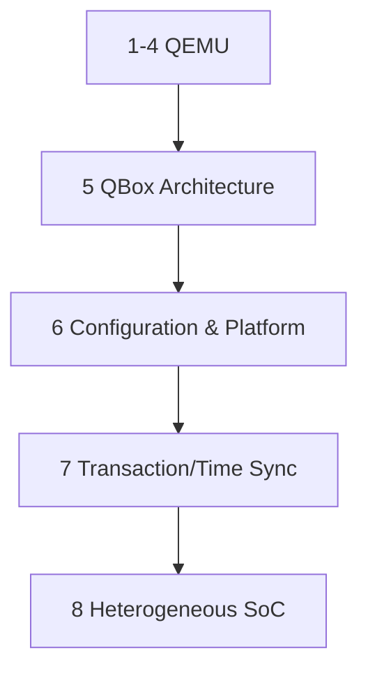

## 1. 학습 목표

1. QBox platform 구성에서 C++ `sc_main`, ModuleFactory Container, Lua, CCI Broker의 역할을 구분한다.
2. `moduletype`, `dylib_path`, `args`, `bind`, `address`, `size`의 의미를 설명한다.
3. AArch64 minimal platform을 Router, RAM, QemuInstance, CPU, UART, Loader로 구성한다.
4. RISC-V64 minimal platform 구성 시 ARM64와 달라지는 reset vector, interrupt controller, UART, firmware contract를 정리한다.
5. unbound socket, address miss, reset vector mismatch, UART no output 같은 실전 오류를 decision tree로 분석한다.

## 2. 핵심 관점: QBox 설정은 보드 계약(Board Contract)이다

QEMU 단독 실행에서는 `-M virt` 같은 machine type이 상당수 보드 구성을 대신 만든다. 반면 QBox에서는 QEMU를 CPU 및 일부 device model engine으로 사용하고, board topology는 SystemC/Lua configuration이 명시적으로 만든다. 따라서 QBox configuration은 단순 실행 옵션이 아니라 다음 계약을 동시에 표현한다.

- CPU가 어느 주소에서 fetch를 시작하는가
- 어떤 주소 범위가 RAM이고 어떤 범위가 MMIO인가
- 어떤 socket이 initiator이고 어떤 socket이 target인가
- interrupt line은 어떤 controller input에 들어가는가
- Linux Device Tree와 QBox address map은 같은 hardware-visible contract를 말하는가
- CI에서 재현 가능한 artifact로 남겨야 할 configuration source는 무엇인가

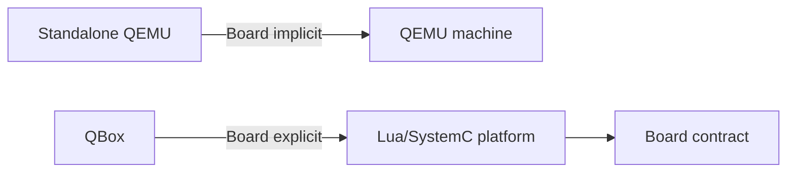

## 3. CCI/Lua/ModuleFactory 큰 그림

QBox platform은 일반적으로 C++ 실행 바이너리와 Lua configuration file의 조합으로 실행된다. C++ `main.cc`는 SystemC simulation kernel을 시작하고, `gs::ModuleFactory::Container`는 Lua table을 읽어 component를 생성한다. CCI Broker는 Lua, command line, C++ default에서 들어온 값을 한 계층으로 모은다.

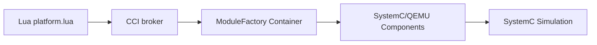

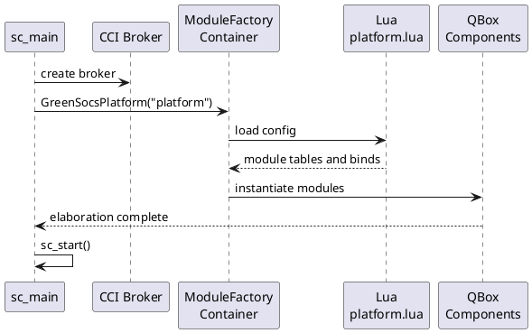

### 3.1 C++ `main.cc`의 책임

C++ host program은 가능한 한 얇게 유지한다. 보드별 address, CPU 수, UART 위치를 C++에 hard-code하지 않고 Lua로 넘기는 것이 좋다. C++ 쪽 책임은 다음 정도로 제한한다.

- CCI Broker 생성
- command line parser 연결
- ModuleFactory Container 생성
- global quantum 기본값 설정
- `sc_start()` 호출
- simulation duration/log 출력

```cpp
class GreenSocsPlatform : public gs::ModuleFactory::Container
{
protected:
    cci::cci_param<int> m_quantum_ns;

public:
    GreenSocsPlatform(const sc_core::sc_module_name& n)
        : gs::ModuleFactory::Container(n)
        , m_quantum_ns("quantum_ns", 1000000,
                       "TLM-2.0 global quantum in ns")
    {
        sc_core::sc_time global_quantum(m_quantum_ns, sc_core::SC_NS);
        tlm_utils::tlm_quantumkeeper::set_global_quantum(global_quantum);
    }
};
```

### 3.2 Lua의 책임

Lua는 board를 조립하는 선언형 configuration에 가깝다. `platform = { ... }` table 안에 component hierarchy를 만들고, 각 component에는 `moduletype`, constructor `args`, parameter, socket binding을 넣는다.

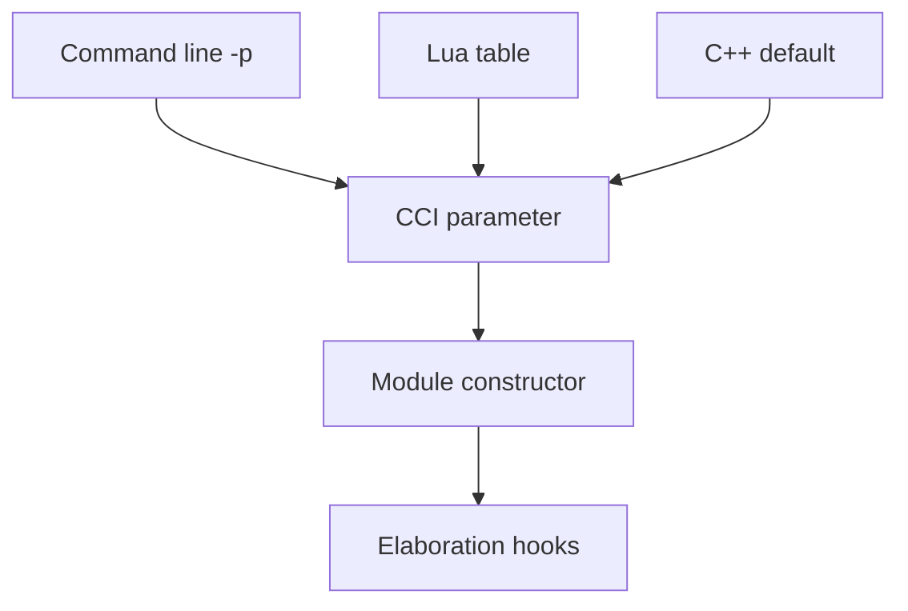

```lua
platform = {
    moduletype = "Container",
    quantum_ns = 10000000,

    router = { moduletype = "router", log_level = 0 },

    ram_0 = {
        moduletype    = "gs_memory",
        target_socket = {
            address = 0x80000000,
            size    = 0x10000000,
            bind    = "&router.initiator_socket",
        },
    },
}
```

## 4. QBox Lua grammar

### 4.1 `moduletype`

`moduletype`은 ModuleFactory가 어떤 SystemC/QEMU component를 생성할지 결정하는 핵심 key이다. 예를 들어 `router`, `gs_memory`, `QemuInstance`, `cpu_arm_cortexA53`, `Pl011`, `loader` 등이 있다. 이 이름은 단순 문자열처럼 보이지만 실제로는 runtime shared library loading 및 component registration과 연결된다.

### 4.2 `dylib_path`

일부 component는 class name과 shared library file name이 다르다. 이 경우 `dylib_path`를 명시해야 한다. 예를 들어 PL011 class가 `Pl011`이라도 library가 `uart-pl011`이면 다음처럼 써야 한다.

```lua
platform.charbackend_stdio_0 = {
    moduletype = "char_backend_stdio",
    read_write = true,
}

platform.pl011_uart_0 = {
    moduletype    = "Pl011",
    dylib_path    = "uart-pl011",
    target_socket = {
        address = 0x09000000,
        size    = 0x1000,
        bind    = "&router.initiator_socket",
    },
    backend_socket = {
        bind = "&charbackend_stdio_0.biflow_socket" },
}
```

### 4.3 `args`

`args`는 C++ constructor argument를 지정한다. `"&qemu_inst"`와 같은 참조는 현재 Container 기준 상대 경로로 해석된다. `QemuInstance`는 `QemuInstanceManager`와 target architecture를 인자로 받고, CPU wrapper는 `QemuInstance`를 인자로 받는다.

```lua
platform.qemu_inst_mgr = {
    moduletype = "QemuInstanceManager",
}

platform.qemu_inst = {
    moduletype  = "QemuInstance",
    args        = { "&qemu_inst_mgr", "AARCH64" },
    accel       = "tcg",
    tcg_mode    = "MULTI",
    sync_policy = "multithread-unconstrained",
}
```

### 4.4 `bind`

`bind`는 socket connection이다. QBox에서 가장 많이 틀리는 부분은 router socket 방향이다. CPU의 memory initiator는 router의 `target_socket`에 bind하고, RAM이나 UART 같은 target device는 router의 `initiator_socket`에 bind한다.

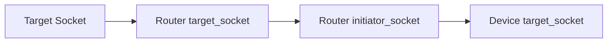

## 5. CCI parameter와 command-line override

QBox는 SystemC CCI를 configuration backbone으로 사용한다. 실습에서는 Lua 파일에 기본값을 두고, CI나 debug session에서는 command line `-p path=value`로 override하는 방식이 가장 편하다.

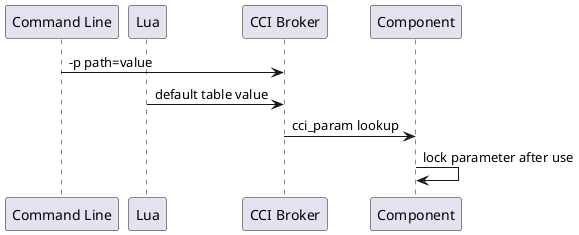

```bash
# Last option wins
./platforms-vp     -l conf/base.lua     -p platform.quantum_ns=1000000     -p platform.cpu_0.gdb_port=1234     -p platform.qemu_inst.qemu_args.-monitor=       tcp:127.0.0.1:55555,server,nowait
```

### 5.1 override 설계 원칙

- 실험마다 바뀌는 값은 command line override로 유지한다. 예: `gdb_port`, `log_level`, `quantum_ns`.
- hardware contract에 가까운 값은 versioned Lua에 둔다. 예: RAM base, UART base, IRQ number.
- Linux Device Tree와 반드시 일치해야 하는 값은 공통 constants file에서 생성하거나 최소한 CI에서 비교한다.
- CCI parameter는 component가 사용한 뒤 lock될 수 있으므로 simulation 중 임의 변경 가능하다고 가정하지 않는다.

## 6. QemuInstance와 QemuInstanceManager

`QemuInstanceManager`는 QEMU library loader와 instance lifetime을 관리한다. `QemuInstance`는 target architecture, QEMU arguments, accelerator, TCG threading mode, time sync strategy, DMI manager를 가진다. QBox에서는 보통 QEMU Machine을 쓰지 않고 `-M none`으로 시작하여 SystemC platform이 topology를 만든다.

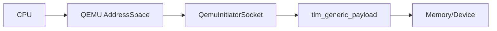

```lua
platform.qemu_inst_mgr = {
    moduletype = "QemuInstanceManager",
}

platform.qemu_inst = {
    moduletype  = "QemuInstance",
    args        = { "&qemu_inst_mgr", "AARCH64" },
    accel       = "tcg",
    tcg_mode    = "MULTI",
    sync_policy = "multithread-unconstrained",
}
```

### 6.1 주요 parameter

| Parameter | 의미 | 권장 기본값 | 주의점 |
|---|---|---|---|
| `accel` | QEMU accelerator | `tcg` | host/native 상황에서만 `kvm` 고려 |
| `tcg_mode` | TCG thread mode | `MULTI` | `icount`와 조합 제한 확인 |
| `sync_policy` | quantum keeper 정책 | `multithread-unconstrained` | 실험 목적에 따라 고정 |
| `time_sync_strategy` | QEMU/SystemC time sync | `quantum_keeper` | MCIPS는 TCG 기반 |
| `qemu_args` | 추가 QEMU 옵션 | empty | monitor/trace/debug에 사용 |

## 7. CPU wrapper: AArch64

AArch64 CPU wrapper는 QEMU CPU object를 생성하고, `rvbar`, EL2/EL3, PSCI conduit, generic timer frequency, interrupt signal socket을 QEMU CPU property로 연결한다. QEMU standalone `virt` machine에서 machine code가 해주던 일부 설정을 이제 Lua에서 명시해야 한다.

```lua
platform.cpu_0 = {
    moduletype   = "cpu_arm_cortexA53",
    args         = { "&qemu_inst" },
    mem          = { bind = "&router.target_socket" },
    rvbar        = 0x80000000,
    has_el3      = true,
    has_el2      = true,
    psci_conduit = "hvc",
    cntfrq_hz    = 6250000,
}
```

### 7.1 AArch64 CPU parameter checklist

- `rvbar`는 reset 후 CPU가 fetch할 주소다. ELF loader의 entry/load address와 맞지 않으면 PC가 빈 주소로 간다.
- `has_el3`, `has_el2`는 firmware boot strategy와 연결된다. Bare-metal hello 예제와 Linux boot는 요구가 다를 수 있다.
- `psci_conduit`는 secondary CPU, system off/reset, firmware handoff와 연결된다.
- `cntfrq_hz`는 timer driver가 기대하는 counter frequency와 일치해야 한다.
- `gdb_port`는 per CPU parameter로 두는 것이 debugging에 좋다.

## 8. CPU wrapper: RISC-V64

RISC-V64는 ARM64와 boot contract가 다르다. `rvbar` 같은 ARM property 대신 RISC-V CPU wrapper의 reset vector 또는 firmware loading convention을 사용한다. 또한 Linux boot에서는 OpenSBI/SBI와 PLIC/ACLINT가 중요하다. 6강에서는 minimal bare-metal 관점에서 구조만 잡고, Linux reference platform은 제공된 Ubuntu platform을 실행해 관찰한다.

```lua
platform.qemu_inst = {
    moduletype = "QemuInstance",
    args       = { "&qemu_inst_mgr", "RISCV64" },
    accel      = "tcg",
}

platform.cpu_0 = {
    moduletype = "cpu_riscv64",
    args       = { "&qemu_inst" },
    mem        = { bind = "&router.target_socket" },
    reset_vec  = 0x80000000,
}
```

## 9. Router, Memory, Loader

Router는 QBox platform의 bus fabric처럼 동작한다. target device의 socket binding 정보와 CCI address/size parameter를 읽어 address decode table을 만든다. Memory는 target socket을 제공하며 DMI를 허용할 수 있다. Loader는 initiator socket을 통해 RAM에 ELF/Binary contents를 써 넣는다.

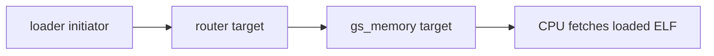

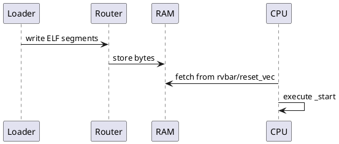

### 9.1 Router 설계 기준

| 항목 | 설명 | 실수 |
|---|---|---|
| address | target base address | DT와 불일치 |
| size | address decode range | 너무 작게 잡아 access miss |
| relative_addresses | target이 상대 주소를 받는지 | device register offset이 꼬임 |
| priority | overlap 처리 순서 | catch-all memory가 MMIO를 가림 |
| bind order | priority 같을 때 stable order | platform merge 시 결과 변경 |

### 9.2 Memory/DMI

DMI는 TLM transaction overhead를 줄이기 위한 fast path이다. 하지만 MMIO side effect가 있는 device는 DMI 대상이 아니어야 한다. RAM은 DMI를 허용할 수 있지만, device register는 transaction마다 callback이 필요하다.

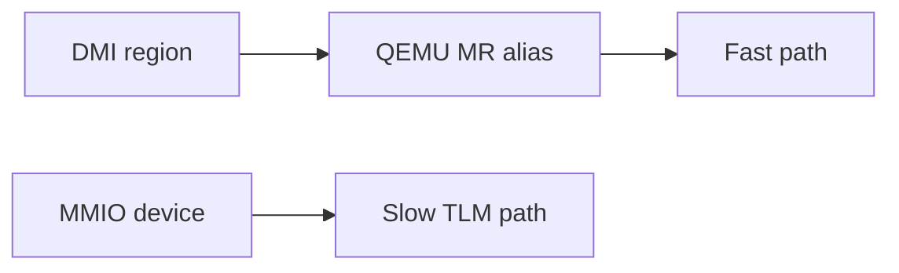

## 10. AArch64 Minimal Platform 실습

목표는 Cortex-A53 하나, RAM 하나, PL011 UART 하나, loader 하나로 bare-metal hello firmware를 실행하는 것이다. QEMU 단독 `-M virt`를 쓰지 않고 SystemC topology를 명시한다.

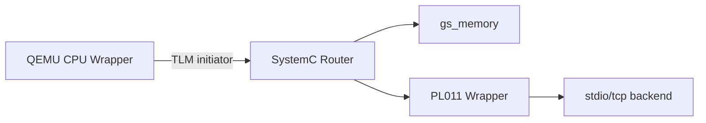

### 10.1 단계 1: constants와 root platform

```lua
local M = {}

M.DRAM_BASE = 0x80000000
M.DRAM_SIZE = 0x10000000
M.UART0_BASE = 0x09000000
M.UART0_SIZE = 0x1000
M.QUANTUM_NS = 10000000

return M
```

```lua
platform = {
    moduletype = "Container",
    quantum_ns = 10000000,

    router = { moduletype = "router", log_level = 0 },

    ram_0 = {
        moduletype    = "gs_memory",
        target_socket = {
            address = 0x80000000,
            size    = 0x10000000,
            bind    = "&router.initiator_socket",
        },
    },
}
```

### 10.2 단계 2: QEMU instance와 CPU

```lua
platform.qemu_inst_mgr = {
    moduletype = "QemuInstanceManager",
}

platform.qemu_inst = {
    moduletype  = "QemuInstance",
    args        = { "&qemu_inst_mgr", "AARCH64" },
    accel       = "tcg",
    tcg_mode    = "MULTI",
    sync_policy = "multithread-unconstrained",
}
```

```lua
platform.cpu_0 = {
    moduletype   = "cpu_arm_cortexA53",
    args         = { "&qemu_inst" },
    mem          = { bind = "&router.target_socket" },
    rvbar        = 0x80000000,
    has_el3      = true,
    has_el2      = true,
    psci_conduit = "hvc",
    cntfrq_hz    = 6250000,
}
```

### 10.3 단계 3: UART와 Loader

```lua
platform.charbackend_stdio_0 = {
    moduletype = "char_backend_stdio",
    read_write = true,
}

platform.pl011_uart_0 = {
    moduletype    = "Pl011",
    dylib_path    = "uart-pl011",
    target_socket = {
        address = 0x09000000,
        size    = 0x1000,
        bind    = "&router.initiator_socket",
    },
    backend_socket = {
        bind = "&charbackend_stdio_0.biflow_socket" },
}
```

```lua
platform.load = {
    moduletype = "loader",
    initiator_socket = {
        bind = "&router.target_socket" },
    { elf_file = base .. "build/hello.elf" },
}
```

## 11. RISC-V64 Minimal Platform 실습

RISC-V64 minimal platform은 구조적으로 비슷하지만 boot firmware와 interrupt controller가 다르다. 단순 bare-metal에서는 RAM, UART, loader, CPU reset vector를 먼저 맞춘다. Linux boot에서는 OpenSBI, PLIC/ACLINT, DTB handoff가 추가된다.

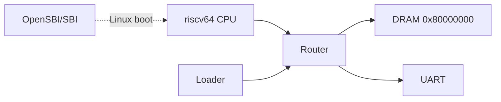

```lua
platform.qemu_inst = {
    moduletype = "QemuInstance",
    args       = { "&qemu_inst_mgr", "RISCV64" },
    accel      = "tcg",
}

platform.cpu_0 = {
    moduletype = "cpu_riscv64",
    args       = { "&qemu_inst" },
    mem        = { bind = "&router.target_socket" },
    reset_vec  = 0x80000000,
}
```

### 11.1 ARM64 vs RISC-V64 차이

| 항목 | AArch64 | RISC-V64 |
|---|---|---|
| Reset address | `rvbar` | reset vector / firmware convention |
| Firmware | TF-A/U-Boot 가능 | OpenSBI 중심 |
| Linux entry | x0 = DTB PA | a0 = hartid, a1 = DTB PA |
| Interrupt | GICv2/v3 | PLIC/APLIC/IMSIC |
| Timer/IPI | Generic Timer/PSCI | ACLINT/SBI |
| UART | PL011 흔함 | 16550/SiFive UART 흔함 |

## 12. Interrupt wiring

Interrupt wiring은 TLM data path와 별개다. CPU memory access는 TLM initiator/target socket으로 흐르지만, interrupt는 signal socket 또는 QEMU irq wiring을 통해 CPU로 들어간다.

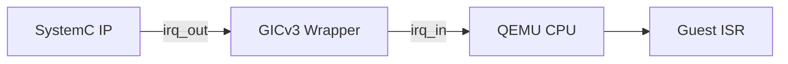

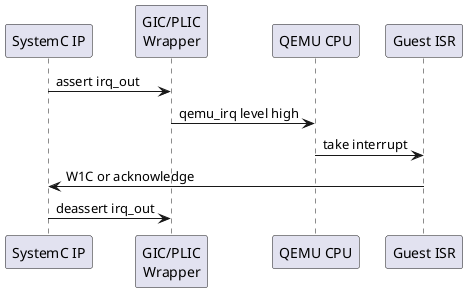

### 12.1 ARM64 GICv3 예시

```lua
platform.gic_0 = {
    moduletype = "arm_gicv3",
    args = { "&qemu_inst" },
    dist_iface = {
        address = 0x08000000,
        size    = 0x10000,
        bind    = "&router.initiator_socket" },
    redist_iface_0 = {
        address = 0x080A0000,
        size    = 0x20000,
        bind    = "&router.initiator_socket" },
    num_cpus = 1,
    num_spi  = 64,
}
```

## 13. Debugging과 observability

QBox debugging은 세 계층을 동시에 봐야 한다. 첫째는 SystemC/Lua component instantiation, 둘째는 TLM address routing, 셋째는 QEMU CPU 상태다.

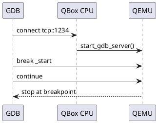

```bash
# Debug checklist
-p platform.cpu_0.gdb_port=1234
-p platform.qemu_inst.qemu_args.-monitor=   tcp:127.0.0.1:55555,server,nowait
-p log_level=4

# Hints
# 1. Check unbound socket messages
# 2. Check router address/size parameters
# 3. Check rvbar/reset_vec and ELF entry
```

```gdb
aarch64-linux-gnu-gdb build/hello.elf
(gdb) target remote :1234
(gdb) x/i $pc
(gdb) b _start
(gdb) c
(gdb) x/8gx 0x80000000
```

### 13.1 문제별 관찰 지점

| 증상 | 먼저 볼 것 | 가능 원인 |
|---|---|---|
| 시작 즉시 종료 | SystemC starvation / keep-alive / CPU kick | suspending event 없음 |
| unbound port | bind path | `&platform.router`처럼 잘못된 상대 경로 |
| PC=0x0 | reset vector | `rvbar`/ELF load address 불일치 |
| UART 출력 없음 | UART address/backend | wrong MMIO base, missing backend_socket |
| memory access abort | router map | address/size 또는 priority 오류 |
| interrupt 없음 | irq bind | GIC/PLIC input 또는 enable 순서 오류 |

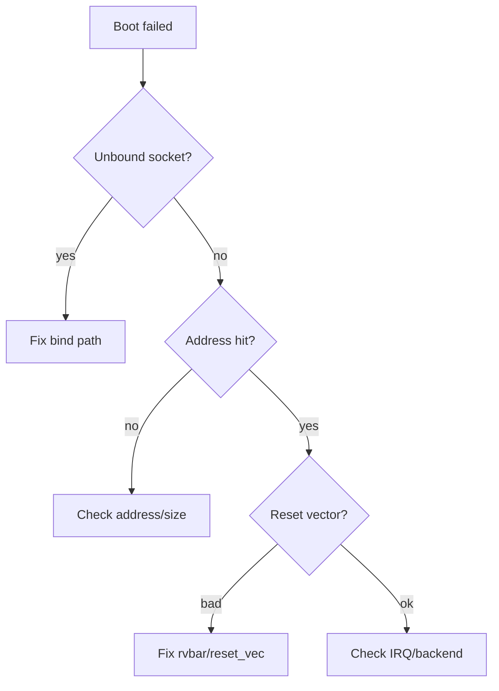

## 14. Build and run

```bash
# Build QBox for both targets
cmake --preset gcc     -DLIBQEMU_TARGETS="aarch64;riscv64"
cmake --build --preset gcc --parallel
ctest --preset gcc

# Run AArch64 minimal platform
./build/examples/hello-qbox/hello-qbox-vp     -l examples/hello-qbox/platform.lua
```

QBox Ubuntu reference platform은 AArch64와 RISC-V64 모두 지원한다. 6강에서는 minimal platform을 만든 뒤, reference Linux platform 실행을 통해 full-system 구성의 차이를 관찰한다.

```bash
# RISC-V64 Ubuntu reference platform
cmake -B build     -DUBUNTU_ARCH=riscv64     -DLIBQEMU_TARGETS=riscv64
cmake --build build --parallel
./build/platforms/platforms-vp     -l ../platforms/ubuntu/conf_riscv64.lua
```

## 15. Platform graph export

복잡한 Lua platform은 눈으로 읽기 어렵다. 실습에서는 Lua table을 parsing하여 module hierarchy, socket bind, address range를 DOT/SVG로 내보내는 단순 graph exporter를 만든다. 이것은 실제 QBox runtime introspection과 다르지만, configuration review에 매우 유용하다.

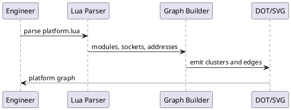

```text
# Conceptual graph extraction flow
parse_lua_platform(conf)
  -> collect modules and parameters
  -> collect socket bind edges
  -> collect address/size metadata
  -> emit graph.dot
  -> dot -Tsvg graph.dot > graph.svg
```

## 16. Automotive SoC/ECU 관점

Automotive SoC에서 QBox platform config는 Virtual ECU의 board description 역할을 한다. Linux BSP와 Firmware가 같은 board contract를 보고 있어야 하고, Watchdog, Mailbox, Shared SRAM, Reset Controller, NPU/DMA stub 같은 component가 contract에 들어간다.

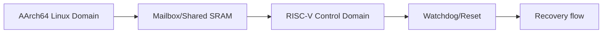

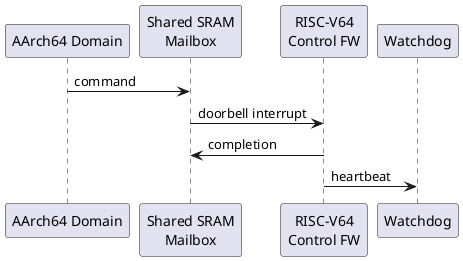

## 17. study-ip를 QBox로 가져오기 위한 준비

2~4강의 `study-ip` QEMU device는 C 기반 QEMU `MemoryRegionOps`였다. QBox에서는 같은 register contract를 SystemC/TLM target으로 구현한다. 6강에서는 그 전에 address, IRQ, driver binding이 QBox platform에서 어떻게 표현될지 설계한다.

```mermaid
flowchart LR
    Userspace[Test App] --> Driver[Linux Driver]
    Driver --> MMIO[study-ip MMIO]
    MMIO --> TLM[QBox TLM Target]
    TLM --> IRQ[Completion IRQ]
```

## 18. Source Reading Map

| 영역 | 주요 path | 읽을 포인트 |
|---|---|---|
| QBox README | `README.md` | project layer, build option, target architectures |
| QEMU instance | `qemu-components/common/include/qemu-instance.h` | default QEMU args, accelerator, sync strategy |
| CPU wrapper | `qemu-components/common/include/cpu.h` | QemuCpu, time sync, TLM initiator socket |
| A53 CPU | `qemu-components/cpu_arm/.../cortex-a53.h` | `rvbar`, EL2/EL3, PSCI, timer/IRQ sockets |
| Base components | `docs/base-components.md` | router, memory, loader, DMI, LT timing |
| Configuration | `docs/configuration.md` | CCI, Lua, command line override |
| Hello example | `examples/hello-qbox/` | minimal AArch64 platform |
| Ubuntu platform | `platforms/ubuntu/` | AArch64/RISC-V64 Linux reference |

## 19. 실습 과제

### 과제 1: AArch64 minimal boot
- `platform.lua`에서 RAM base를 `0x80000000`, PL011 base를 `0x09000000`으로 구성한다.
- `hello.elf`를 loader로 적재하고 UART 출력이 보이는지 확인한다.
- `gdb_port=1234`를 켜고 `_start`에서 멈춘다.

### 과제 2: RISC-V64 minimal boot sketch
- RISC-V64 `QemuInstance`와 CPU wrapper를 구성한다.
- RAM, UART, loader binding을 ARM64 platform과 최대한 같은 constants file에서 가져온다.
- 실제 실행이 어려우면 graph exporter로 topology consistency를 먼저 검증한다.

### 과제 3: CCI override 실험
- `quantum_ns`, `gdb_port`, `log_level`을 command line에서 변경한다.
- 마지막 `-p`가 우선한다는 것을 로그로 확인한다.

### 과제 4: Platform graph export
- Lua 파일을 읽어 module node와 socket edge를 DOT으로 출력한다.
- address/size가 있는 socket에는 label을 붙인다.
- ARM64와 RISC-V64 platform을 같은 style로 출력한다.

## 20. 퀴즈

1. [객관식] QBox에서 CPU memory initiator가 보통 bind되는 router socket은?
2. [객관식] `dylib_path`가 필요한 대표 상황은?
3. [객관식] QBox에서 board topology를 명시하는 주된 계층은?
4. [객관식] ELF loader가 RAM에 접근하기 위해 필요한 것은?
5. [O/X] Command line `-p` override는 hardware contract에 해당하는 address 값을 영구 변경하는 좋은 방법이다.
6. [O/X] Interrupt signal path는 TLM data path와 항상 같은 socket을 사용한다.
7. [단답형] AArch64 bare-metal boot에서 `rvbar`가 맞아야 하는 대상은?
8. [단답형] Router가 target 주소를 찾을 때 주로 사용하는 metadata 두 가지는?
9. [디버깅형] PC가 0x0에서 돌고 UART 출력이 없으면 먼저 무엇을 확인할까?
10. [디버깅형] MMIO write가 device에 도달하지 않는 경우 확인 순서는?

## 21. 정답과 해설

### 1. 정답: router.target_socket
- 해설: QBox platform은 explicit wiring model이다. 따라서 CPU, router, memory, UART, interrupt controller가 자동으로 연결된다고 가정하면 안 된다. 각 문제는 parameter source, socket direction, reset vector, address map 중 어느 계층의 계약인지 구분하는 것이 핵심이다.

### 2. 정답: moduletype/class 이름과 실제 shared library 이름이 다를 때
- 해설: QBox platform은 explicit wiring model이다. 따라서 CPU, router, memory, UART, interrupt controller가 자동으로 연결된다고 가정하면 안 된다. 각 문제는 parameter source, socket direction, reset vector, address map 중 어느 계층의 계약인지 구분하는 것이 핵심이다.

### 3. 정답: Lua/SystemC platform configuration
- 해설: QBox platform은 explicit wiring model이다. 따라서 CPU, router, memory, UART, interrupt controller가 자동으로 연결된다고 가정하면 안 된다. 각 문제는 parameter source, socket direction, reset vector, address map 중 어느 계층의 계약인지 구분하는 것이 핵심이다.

### 4. 정답: loader initiator_socket이 router target_socket에 bind되어야 한다
- 해설: QBox platform은 explicit wiring model이다. 따라서 CPU, router, memory, UART, interrupt controller가 자동으로 연결된다고 가정하면 안 된다. 각 문제는 parameter source, socket direction, reset vector, address map 중 어느 계층의 계약인지 구분하는 것이 핵심이다.

### 5. 정답: X
- 해설: QBox platform은 explicit wiring model이다. 따라서 CPU, router, memory, UART, interrupt controller가 자동으로 연결된다고 가정하면 안 된다. 각 문제는 parameter source, socket direction, reset vector, address map 중 어느 계층의 계약인지 구분하는 것이 핵심이다.

### 6. 정답: X
- 해설: QBox platform은 explicit wiring model이다. 따라서 CPU, router, memory, UART, interrupt controller가 자동으로 연결된다고 가정하면 안 된다. 각 문제는 parameter source, socket direction, reset vector, address map 중 어느 계층의 계약인지 구분하는 것이 핵심이다.

### 7. 정답: CPU reset 후 fetch할 firmware/ELF load address
- 해설: QBox platform은 explicit wiring model이다. 따라서 CPU, router, memory, UART, interrupt controller가 자동으로 연결된다고 가정하면 안 된다. 각 문제는 parameter source, socket direction, reset vector, address map 중 어느 계층의 계약인지 구분하는 것이 핵심이다.

### 8. 정답: address와 size
- 해설: QBox platform은 explicit wiring model이다. 따라서 CPU, router, memory, UART, interrupt controller가 자동으로 연결된다고 가정하면 안 된다. 각 문제는 parameter source, socket direction, reset vector, address map 중 어느 계층의 계약인지 구분하는 것이 핵심이다.

### 9. 정답: CPU reset vector/rvbar와 ELF load address, RAM mapping
- 해설: QBox platform은 explicit wiring model이다. 따라서 CPU, router, memory, UART, interrupt controller가 자동으로 연결된다고 가정하면 안 된다. 각 문제는 parameter source, socket direction, reset vector, address map 중 어느 계층의 계약인지 구분하는 것이 핵심이다.

### 10. 정답: socket bind, router address/size, overlap priority, relative address 설정
- 해설: QBox platform은 explicit wiring model이다. 따라서 CPU, router, memory, UART, interrupt controller가 자동으로 연결된다고 가정하면 안 된다. 각 문제는 parameter source, socket direction, reset vector, address map 중 어느 계층의 계약인지 구분하는 것이 핵심이다.

## 22. 5분 복습 질문

1. QEMU `virt` machine과 QBox Lua platform의 가장 큰 차이는 무엇인가?
2. CCI Broker는 왜 필요한가?
3. `moduletype`과 `dylib_path`는 각각 어떤 문제를 해결하는가?
4. CPU가 router.target_socket에 bind되는 이유는 무엇인가?
5. RAM target_socket은 왜 router.initiator_socket에 bind되는가?
6. AArch64 `rvbar`가 틀리면 어떤 증상이 나타나는가?
7. Loader와 CPU가 같은 address contract를 공유해야 하는 이유는 무엇인가?
8. DMI를 MMIO device에 함부로 허용하면 어떤 문제가 생기는가?
9. GDB와 QEMU monitor는 각각 어느 계층의 관찰 도구인가?
10. Automotive SoC에서 QBox platform config를 CI artifact로 보존해야 하는 이유는 무엇인가?
11. RISC-V64 platform에서 OpenSBI/PLIC/ACLINT가 필요한 시점은 언제인가?
12. study-ip를 QBox로 옮길 때 유지해야 하는 공통 contract는 무엇인가?

## 23. Flashcards

- **CCI**: Configuration, Control, Inspection. SystemC component parameter를 공통 broker로 다루는 표준.
- **ModuleFactory**: Lua의 moduletype을 보고 SystemC component를 runtime 생성하는 계층.
- **moduletype**: 생성할 component class 또는 등록명을 지정하는 Lua key.
- **dylib_path**: component shared library 이름이 moduletype과 다를 때 지정하는 key.
- **QemuInstance**: QEMU engine, arguments, accelerator, time sync, DMI manager를 담는 wrapper.
- **QemuInstanceManager**: QEMU library loader와 instance lifetime을 관리하는 component.
- **QemuCpu**: QEMU CPU를 SystemC/TLM initiator로 노출하는 wrapper.
- **Router**: address/size metadata로 TLM transaction을 target에 전달하는 component.
- **gs_memory**: QBox native memory component, DMI 허용 가능.
- **loader**: ELF/Binary를 TLM write로 memory에 적재하는 initiator component.
- **target_socket**: transaction을 받는 endpoint. Router target_socket은 CPU initiator가 붙는 입구.
- **initiator_socket**: transaction을 보내는 endpoint. Router initiator_socket은 target device 쪽으로 나가는 출구.
- **rvbar**: ARM reset vector base address register.
- **DMI**: Direct Memory Interface. TLM memory fast path.
- **Board Contract**: Address map, interrupt, reset vector, firmware handoff, DT가 공유하는 hardware-visible 약속.

## 24. 빈칸 채우기

1. CPU memory initiator는 router의 `__________`에 bind한다.
2. RAM target socket은 router의 `__________`에 bind한다.
3. AArch64 CPU reset fetch 주소는 주로 `__________` parameter로 지정한다.
4. QBox configuration override는 `-p __________=value` 형식을 사용한다.
5. MMIO side effect가 있는 device에는 일반적으로 `__________` fast path를 허용하지 않는다.

정답: 1) target_socket, 2) initiator_socket, 3) rvbar, 4) path.to.param, 5) DMI

## 25. 오늘의 핵심 문장

1. QBox configuration은 실행 옵션이 아니라 board contract이다.
2. QEMU Machine이 암묵적으로 만들던 topology를 QBox에서는 Lua/SystemC가 명시적으로 만든다.
3. CPU memory path와 interrupt signal path는 다른 종류의 연결이다.
4. `bind`, `address`, `size`, `rvbar`가 맞으면 bare-metal bring-up의 절반은 끝난다.
5. QBox platform은 Linux DT, Firmware, Driver test와 함께 versioned CI artifact로 관리해야 한다.

## 26. 다음 강의 전 Checklist

- [ ] AArch64 minimal platform이 UART hello를 출력한다.
- [ ] `gdb_port` override로 `_start`에 breakpoint를 걸 수 있다.
- [ ] `router.target_socket`과 `router.initiator_socket` 방향을 설명할 수 있다.
- [ ] address/size mismatch와 reset vector mismatch를 구분할 수 있다.
- [ ] ARM64/RISC-V64 platform에서 공통 constants file을 사용한다.
- [ ] QBox Ubuntu AArch64/RISC-V64 reference platform 실행 명령을 알고 있다.
- [ ] Platform graph export script의 입력과 출력을 정의했다.
- [ ] 7강에서 볼 TLM transaction/time sync 질문을 정리했다.

---

## Appendix A. Mermaid diagram source 모음

```mermaid
flowchart LR
    Lua[Lua platform.lua] --> CCI[CCI broker]
    CCI --> Factory[ModuleFactory Container]
    Factory --> Mods[SystemC/QEMU Components]
    Mods --> SC[SystemC Simulation]
```

```mermaid
flowchart LR
    CPU[QEMU CPU Wrapper] -->|TLM initiator| Router[SystemC Router]
    Router --> RAM[gs_memory]
    Router --> UART[PL011 Wrapper]
    UART --> Backend[stdio/tcp backend]
```

```mermaid
flowchart TD
    A[Command line -p] --> P[CCI parameter]
    B[Lua table] --> P
    C[C++ default] --> P
    P --> M[Module constructor]
    M --> E[Elaboration hooks]
```

```mermaid
flowchart LR
    Target[Target Socket] --> Router[Router target_socket]
    Router --> Init[Router initiator_socket]
    Init --> Dev[Device target_socket]
```

```mermaid
flowchart LR
    Loader[loader initiator] --> Router[router target]
    Router --> RAM[gs_memory target]
    RAM --> CPU[CPU fetches loaded ELF]
```

```mermaid
flowchart LR
    IP[SystemC IP] -->|irq_out| GIC[GICv3 Wrapper]
    GIC -->|irq_in| CPU[QEMU CPU]
    CPU --> Guest[Guest ISR]
```

```mermaid
flowchart LR
    Base[base.lua constants] --> A[arm64.lua]
    Base --> R[riscv64.lua]
    A --> RunA[AArch64 VP]
    R --> RunR[RISC-V64 VP]
```

```mermaid
flowchart TD
    Fail[Boot failed] --> Socket{Unbound socket?}
    Socket -->|yes| Bind[Fix bind path]
    Socket -->|no| Addr{Address hit?}
    Addr -->|no| Map[Check address/size]
    Addr -->|yes| Reset{Reset vector?}
    Reset -->|bad| RVBAR[Fix rvbar/reset_vec]
    Reset -->|ok| IRQ[Check IRQ/backend]
```

```mermaid
flowchart LR
    QEMU[Standalone QEMU] -->|Board implicit| Machine[QEMU machine]
    QBox[QBox] -->|Board explicit| Lua[Lua/SystemC platform]
    Lua --> Contract[Board contract]
```

```mermaid
flowchart LR
    Userspace[Test App] --> Driver[Linux Driver]
    Driver --> MMIO[study-ip MMIO]
    MMIO --> TLM[QBox TLM Target]
    TLM --> IRQ[Completion IRQ]
```

```mermaid
flowchart TD
    Ctor[C++ construction] --> BOE[before_end_of_elaboration]
    BOE --> EOE[end_of_elaboration]
    EOE --> SOS[start_of_simulation]
    SOS --> RUN[sc_start runtime]
    RUN --> EOS[end_of_simulation]
```

```mermaid
flowchart LR
    CPU[CPU] --> AS[QEMU AddressSpace]
    AS --> QIS[QemuInitiatorSocket]
    QIS --> Payload[tlm_generic_payload]
    Payload --> Target[Memory/Device]
```

```mermaid
flowchart LR
    DMI[DMI region] --> Alias[QEMU MR alias]
    Alias --> Fast[Fast path]
    Device[MMIO device] --> Slow[Slow TLM path]
```

```mermaid
flowchart TD
    Version[Source commit fixed] --> Build[Build target set]
    Build --> Config[Config validated]
    Config --> Test[Boot/selftest]
    Test --> Artifact[Logs/DTS/graph saved]
```

```mermaid
flowchart LR
    App[AArch64 Linux Domain] --> Mailbox[Mailbox/Shared SRAM]
    Mailbox --> Ctrl[RISC-V Control Domain]
    Ctrl --> Watchdog[Watchdog/Reset]
    Watchdog --> Recovery[Recovery flow]
```

```mermaid
flowchart TD
    L1[1-4 QEMU] --> L5[5 QBox Architecture]
    L5 --> L6[6 Configuration & Platform]
    L6 --> L7[7 Transaction/Time Sync]
    L7 --> L8[8 Heterogeneous SoC]
```

## Appendix B. PlantUML sequence source 모음

```plantuml
@startuml
participant "sc_main" as MAIN
participant "CCI Broker" as CCI
participant "ModuleFactory\nContainer" as FAC
participant "Lua\nplatform.lua" as LUA
participant "QBox\nComponents" as COMP
MAIN -> CCI: create broker
MAIN -> FAC: GreenSocsPlatform("platform")
FAC -> LUA: load config
LUA --> FAC: module tables and binds
FAC -> COMP: instantiate modules
COMP --> MAIN: elaboration complete
MAIN -> MAIN: sc_start()
@enduml
```

```plantuml
@startuml
participant "QEMU CPU" as CPU
participant "QemuInitiator\nSocket" as QIS
participant "SystemC\nRouter" as ROUTER
participant "gs_memory" as MEM
CPU -> QIS: MMIO/RAM access
QIS -> ROUTER: b_transport(payload, delay)
ROUTER -> MEM: route by address
MEM --> ROUTER: TLM_OK_RESPONSE
ROUTER --> QIS: response
QIS --> CPU: value or completion
@enduml
```

```plantuml
@startuml
participant "Command Line" as CLI
participant "Lua" as LUA
participant "CCI Broker" as CCI
participant "Component" as COMP
CLI -> CCI: -p path=value
LUA -> CCI: default table value
CCI -> COMP: cci_param lookup
COMP -> COMP: lock parameter after use
@enduml
```

```plantuml
@startuml
participant "Loader" as LOAD
participant "Router" as ROUTER
participant "RAM" as RAM
participant "CPU" as CPU
LOAD -> ROUTER: write ELF segments
ROUTER -> RAM: store bytes
CPU -> RAM: fetch from rvbar/reset_vec
CPU -> CPU: execute _start
@enduml
```

```plantuml
@startuml
participant "SystemC IP" as IP
participant "GIC/PLIC\nWrapper" as IC
participant "QEMU CPU" as CPU
participant "Guest ISR" as ISR
IP -> IC: assert irq_out
IC -> CPU: qemu_irq level high
CPU -> ISR: take interrupt
ISR -> IP: W1C or acknowledge
IP -> IC: deassert irq_out
@enduml
```

```plantuml
@startuml
participant "GDB" as GDB
participant "QBox CPU" as CPU
participant "QEMU" as QEMU
GDB -> CPU: connect tcp::1234
CPU -> QEMU: start_gdb_server()
GDB -> QEMU: break _start
GDB -> QEMU: continue
QEMU --> GDB: stop at breakpoint
@enduml
```

```plantuml
@startuml
participant "Engineer" as ENG
participant "Lua Parser" as LUA
participant "Graph Builder" as G
participant "DOT/SVG" as DOT
ENG -> LUA: parse platform.lua
LUA -> G: modules, sockets, addresses
G -> DOT: emit clusters and edges
DOT --> ENG: platform graph
@enduml
```

```plantuml
@startuml
participant "AArch64 Domain" as APP
participant "Shared SRAM\nMailbox" as MBOX
participant "RISC-V64\nControl FW" as CTRL
participant "Watchdog" as WDT
APP -> MBOX: command
MBOX -> CTRL: doorbell interrupt
CTRL -> MBOX: completion
CTRL -> WDT: heartbeat
@enduml
```

## Appendix C. 코드 예제 모음

### lua_root

```lua
platform = {
    moduletype = "Container",
    quantum_ns = 10000000,

    router = { moduletype = "router", log_level = 0 },

    ram_0 = {
        moduletype    = "gs_memory",
        target_socket = {
            address = 0x80000000,
            size    = 0x10000000,
            bind    = "&router.initiator_socket",
        },
    },
}
```

### qemu_inst

```lua
platform.qemu_inst_mgr = {
    moduletype = "QemuInstanceManager",
}

platform.qemu_inst = {
    moduletype  = "QemuInstance",
    args        = { "&qemu_inst_mgr", "AARCH64" },
    accel       = "tcg",
    tcg_mode    = "MULTI",
    sync_policy = "multithread-unconstrained",
}
```

### arm_cpu

```lua
platform.cpu_0 = {
    moduletype   = "cpu_arm_cortexA53",
    args         = { "&qemu_inst" },
    mem          = { bind = "&router.target_socket" },
    rvbar        = 0x80000000,
    has_el3      = true,
    has_el2      = true,
    psci_conduit = "hvc",
    cntfrq_hz    = 6250000,
}
```

### uart_loader

```lua
platform.charbackend_stdio_0 = {
    moduletype = "char_backend_stdio",
    read_write = true,
}

platform.pl011_uart_0 = {
    moduletype    = "Pl011",
    dylib_path    = "uart-pl011",
    target_socket = {
        address = 0x09000000,
        size    = 0x1000,
        bind    = "&router.initiator_socket",
    },
    backend_socket = {
        bind = "&charbackend_stdio_0.biflow_socket" },
}
```

### loader

```lua
platform.load = {
    moduletype = "loader",
    initiator_socket = {
        bind = "&router.target_socket" },
    { elf_file = base .. "build/hello.elf" },
}
```

### riscv

```lua
platform.qemu_inst = {
    moduletype = "QemuInstance",
    args       = { "&qemu_inst_mgr", "RISCV64" },
    accel      = "tcg",
}

platform.cpu_0 = {
    moduletype = "cpu_riscv64",
    args       = { "&qemu_inst" },
    mem        = { bind = "&router.target_socket" },
    reset_vec  = 0x80000000,
}
```

### common

```lua
local M = {}

M.DRAM_BASE = 0x80000000
M.DRAM_SIZE = 0x10000000
M.UART0_BASE = 0x09000000
M.UART0_SIZE = 0x1000
M.QUANTUM_NS = 10000000

return M
```

### maincc

```cpp
class GreenSocsPlatform : public gs::ModuleFactory::Container
{
protected:
    cci::cci_param<int> m_quantum_ns;

public:
    GreenSocsPlatform(const sc_core::sc_module_name& n)
        : gs::ModuleFactory::Container(n)
        , m_quantum_ns("quantum_ns", 1000000,
                       "TLM-2.0 global quantum in ns")
    {
        sc_core::sc_time global_quantum(m_quantum_ns, sc_core::SC_NS);
        tlm_utils::tlm_quantumkeeper::set_global_quantum(global_quantum);
    }
};
```

### cli

```bash
# Build QBox for both targets
cmake --preset gcc     -DLIBQEMU_TARGETS="aarch64;riscv64"
cmake --build --preset gcc --parallel
ctest --preset gcc

# Run AArch64 minimal platform
./build/examples/hello-qbox/hello-qbox-vp     -l examples/hello-qbox/platform.lua
```

### override

```bash
# Last option wins
./platforms-vp     -l conf/base.lua     -p platform.quantum_ns=1000000     -p platform.cpu_0.gdb_port=1234     -p platform.qemu_inst.qemu_args.-monitor=       tcp:127.0.0.1:55555,server,nowait
```

### gic

```lua
platform.gic_0 = {
    moduletype = "arm_gicv3",
    args = { "&qemu_inst" },
    dist_iface = {
        address = 0x08000000,
        size    = 0x10000,
        bind    = "&router.initiator_socket" },
    redist_iface_0 = {
        address = 0x080A0000,
        size    = 0x20000,
        bind    = "&router.initiator_socket" },
    num_cpus = 1,
    num_spi  = 64,
}
```

### graph

```lua
# Conceptual graph extraction flow
parse_lua_platform(conf)
  -> collect modules and parameters
  -> collect socket bind edges
  -> collect address/size metadata
  -> emit graph.dot
  -> dot -Tsvg graph.dot > graph.svg
```

### debug

```bash
# Debug checklist
-p platform.cpu_0.gdb_port=1234
-p platform.qemu_inst.qemu_args.-monitor=   tcp:127.0.0.1:55555,server,nowait
-p log_level=4

# Hints
# 1. Check unbound socket messages
# 2. Check router address/size parameters
# 3. Check rvbar/reset_vec and ELF entry
```

### gdb

```bash
aarch64-linux-gnu-gdb build/hello.elf
(gdb) target remote :1234
(gdb) x/i $pc
(gdb) b _start
(gdb) c
(gdb) x/8gx 0x80000000
```

### riscv_run

```bash
# RISC-V64 Ubuntu reference platform
cmake -B build     -DUBUNTU_ARCH=riscv64     -DLIBQEMU_TARGETS=riscv64
cmake --build build --parallel
./build/platforms/platforms-vp     -l ../platforms/ubuntu/conf_riscv64.lua
```

## Appendix D. 세부 학습 메모

### Configuration ownership - note 1
Configuration 값은 세 계층에서 온다. C++ default는 component가 없으면 동작하지 않는 최소 기본값이고, Lua는 board-specific default이며, command line은 실험-specific override다. 실전 프로젝트에서는 이 세 계층을 구분하지 않으면 CI와 로컬 재현성이 깨진다.
설계 관점: 이 항목은 단독으로 맞아도 충분하지 않다. Firmware, Linux DT, driver, QBox component가 같은 의미로 해석할 때만 platform contract가 성립한다. 실습에서는 각 변경 뒤에 serial log, GDB PC, router graph, address map table을 함께 저장한다.

### Address map discipline - note 1
Address map은 QBox router, firmware linker script, Linux Device Tree, driver resource가 공유하는 계약이다. 한쪽만 바꾸면 system은 부팅할 수 있어도 driver probe나 MMIO access에서 실패한다.
설계 관점: 이 항목은 단독으로 맞아도 충분하지 않다. Firmware, Linux DT, driver, QBox component가 같은 의미로 해석할 때만 platform contract가 성립한다. 실습에서는 각 변경 뒤에 serial log, GDB PC, router graph, address map table을 함께 저장한다.

### Socket direction - note 1
TLM initiator는 transaction을 시작하고 target은 transaction을 받는다. Router는 중간 fabric이므로 initiator들이 들어오는 target_socket과 targets로 나가는 initiator_socket을 동시에 가진다. 이름이 헷갈릴 수 있으므로 transaction 방향을 기준으로 생각한다.
설계 관점: 이 항목은 단독으로 맞아도 충분하지 않다. Firmware, Linux DT, driver, QBox component가 같은 의미로 해석할 때만 platform contract가 성립한다. 실습에서는 각 변경 뒤에 serial log, GDB PC, router graph, address map table을 함께 저장한다.

### Reset vector - note 1
CPU reset vector는 firmware handoff의 첫 번째 contract다. ARM64에서는 rvbar, RISC-V에서는 reset vector 또는 firmware convention이 여기에 해당한다. ELF entry와 reset vector가 다르면 CPU는 정상적으로 QEMU 안에서 실행되지만 의미 없는 주소를 fetch한다.
설계 관점: 이 항목은 단독으로 맞아도 충분하지 않다. Firmware, Linux DT, driver, QBox component가 같은 의미로 해석할 때만 platform contract가 성립한다. 실습에서는 각 변경 뒤에 serial log, GDB PC, router graph, address map table을 함께 저장한다.

### DMI safety - note 1
DMI는 RAM fast path에는 좋지만 MMIO register side effect에는 위험하다. Register write가 callback을 거치지 않으면 interrupt, status update, W1C 같은 semantic이 사라질 수 있다.
설계 관점: 이 항목은 단독으로 맞아도 충분하지 않다. Firmware, Linux DT, driver, QBox component가 같은 의미로 해석할 때만 platform contract가 성립한다. 실습에서는 각 변경 뒤에 serial log, GDB PC, router graph, address map table을 함께 저장한다.

### Interrupt wiring - note 1
Interrupt는 TLM payload가 아니라 signal/event path다. SystemC IP가 irq_out을 올리고, GIC/PLIC wrapper가 이를 QEMU CPU의 interrupt input으로 전달한다. Linux driver는 device register W1C와 interrupt controller EOI를 모두 고려해야 한다.
설계 관점: 이 항목은 단독으로 맞아도 충분하지 않다. Firmware, Linux DT, driver, QBox component가 같은 의미로 해석할 때만 platform contract가 성립한다. 실습에서는 각 변경 뒤에 serial log, GDB PC, router graph, address map table을 함께 저장한다.

### Automotive reproducibility - note 1
Automotive SoC/ECU VP에서는 platform.lua 자체가 test evidence의 일부가 된다. 어떤 CPU 수, memory map, interrupt map, fault injection 설정으로 테스트했는지 추적 가능해야 한다.
설계 관점: 이 항목은 단독으로 맞아도 충분하지 않다. Firmware, Linux DT, driver, QBox component가 같은 의미로 해석할 때만 platform contract가 성립한다. 실습에서는 각 변경 뒤에 serial log, GDB PC, router graph, address map table을 함께 저장한다.

### Configuration ownership - note 2
Configuration 값은 세 계층에서 온다. C++ default는 component가 없으면 동작하지 않는 최소 기본값이고, Lua는 board-specific default이며, command line은 실험-specific override다. 실전 프로젝트에서는 이 세 계층을 구분하지 않으면 CI와 로컬 재현성이 깨진다.
설계 관점: 이 항목은 단독으로 맞아도 충분하지 않다. Firmware, Linux DT, driver, QBox component가 같은 의미로 해석할 때만 platform contract가 성립한다. 실습에서는 각 변경 뒤에 serial log, GDB PC, router graph, address map table을 함께 저장한다.

### Address map discipline - note 2
Address map은 QBox router, firmware linker script, Linux Device Tree, driver resource가 공유하는 계약이다. 한쪽만 바꾸면 system은 부팅할 수 있어도 driver probe나 MMIO access에서 실패한다.
설계 관점: 이 항목은 단독으로 맞아도 충분하지 않다. Firmware, Linux DT, driver, QBox component가 같은 의미로 해석할 때만 platform contract가 성립한다. 실습에서는 각 변경 뒤에 serial log, GDB PC, router graph, address map table을 함께 저장한다.

### Socket direction - note 2
TLM initiator는 transaction을 시작하고 target은 transaction을 받는다. Router는 중간 fabric이므로 initiator들이 들어오는 target_socket과 targets로 나가는 initiator_socket을 동시에 가진다. 이름이 헷갈릴 수 있으므로 transaction 방향을 기준으로 생각한다.
설계 관점: 이 항목은 단독으로 맞아도 충분하지 않다. Firmware, Linux DT, driver, QBox component가 같은 의미로 해석할 때만 platform contract가 성립한다. 실습에서는 각 변경 뒤에 serial log, GDB PC, router graph, address map table을 함께 저장한다.

### Reset vector - note 2
CPU reset vector는 firmware handoff의 첫 번째 contract다. ARM64에서는 rvbar, RISC-V에서는 reset vector 또는 firmware convention이 여기에 해당한다. ELF entry와 reset vector가 다르면 CPU는 정상적으로 QEMU 안에서 실행되지만 의미 없는 주소를 fetch한다.
설계 관점: 이 항목은 단독으로 맞아도 충분하지 않다. Firmware, Linux DT, driver, QBox component가 같은 의미로 해석할 때만 platform contract가 성립한다. 실습에서는 각 변경 뒤에 serial log, GDB PC, router graph, address map table을 함께 저장한다.

### DMI safety - note 2
DMI는 RAM fast path에는 좋지만 MMIO register side effect에는 위험하다. Register write가 callback을 거치지 않으면 interrupt, status update, W1C 같은 semantic이 사라질 수 있다.
설계 관점: 이 항목은 단독으로 맞아도 충분하지 않다. Firmware, Linux DT, driver, QBox component가 같은 의미로 해석할 때만 platform contract가 성립한다. 실습에서는 각 변경 뒤에 serial log, GDB PC, router graph, address map table을 함께 저장한다.

### Interrupt wiring - note 2
Interrupt는 TLM payload가 아니라 signal/event path다. SystemC IP가 irq_out을 올리고, GIC/PLIC wrapper가 이를 QEMU CPU의 interrupt input으로 전달한다. Linux driver는 device register W1C와 interrupt controller EOI를 모두 고려해야 한다.
설계 관점: 이 항목은 단독으로 맞아도 충분하지 않다. Firmware, Linux DT, driver, QBox component가 같은 의미로 해석할 때만 platform contract가 성립한다. 실습에서는 각 변경 뒤에 serial log, GDB PC, router graph, address map table을 함께 저장한다.

### Automotive reproducibility - note 2
Automotive SoC/ECU VP에서는 platform.lua 자체가 test evidence의 일부가 된다. 어떤 CPU 수, memory map, interrupt map, fault injection 설정으로 테스트했는지 추적 가능해야 한다.
설계 관점: 이 항목은 단독으로 맞아도 충분하지 않다. Firmware, Linux DT, driver, QBox component가 같은 의미로 해석할 때만 platform contract가 성립한다. 실습에서는 각 변경 뒤에 serial log, GDB PC, router graph, address map table을 함께 저장한다.

### Configuration ownership - note 3
Configuration 값은 세 계층에서 온다. C++ default는 component가 없으면 동작하지 않는 최소 기본값이고, Lua는 board-specific default이며, command line은 실험-specific override다. 실전 프로젝트에서는 이 세 계층을 구분하지 않으면 CI와 로컬 재현성이 깨진다.
설계 관점: 이 항목은 단독으로 맞아도 충분하지 않다. Firmware, Linux DT, driver, QBox component가 같은 의미로 해석할 때만 platform contract가 성립한다. 실습에서는 각 변경 뒤에 serial log, GDB PC, router graph, address map table을 함께 저장한다.

### Address map discipline - note 3
Address map은 QBox router, firmware linker script, Linux Device Tree, driver resource가 공유하는 계약이다. 한쪽만 바꾸면 system은 부팅할 수 있어도 driver probe나 MMIO access에서 실패한다.
설계 관점: 이 항목은 단독으로 맞아도 충분하지 않다. Firmware, Linux DT, driver, QBox component가 같은 의미로 해석할 때만 platform contract가 성립한다. 실습에서는 각 변경 뒤에 serial log, GDB PC, router graph, address map table을 함께 저장한다.

### Socket direction - note 3
TLM initiator는 transaction을 시작하고 target은 transaction을 받는다. Router는 중간 fabric이므로 initiator들이 들어오는 target_socket과 targets로 나가는 initiator_socket을 동시에 가진다. 이름이 헷갈릴 수 있으므로 transaction 방향을 기준으로 생각한다.
설계 관점: 이 항목은 단독으로 맞아도 충분하지 않다. Firmware, Linux DT, driver, QBox component가 같은 의미로 해석할 때만 platform contract가 성립한다. 실습에서는 각 변경 뒤에 serial log, GDB PC, router graph, address map table을 함께 저장한다.

### Reset vector - note 3
CPU reset vector는 firmware handoff의 첫 번째 contract다. ARM64에서는 rvbar, RISC-V에서는 reset vector 또는 firmware convention이 여기에 해당한다. ELF entry와 reset vector가 다르면 CPU는 정상적으로 QEMU 안에서 실행되지만 의미 없는 주소를 fetch한다.
설계 관점: 이 항목은 단독으로 맞아도 충분하지 않다. Firmware, Linux DT, driver, QBox component가 같은 의미로 해석할 때만 platform contract가 성립한다. 실습에서는 각 변경 뒤에 serial log, GDB PC, router graph, address map table을 함께 저장한다.

### DMI safety - note 3
DMI는 RAM fast path에는 좋지만 MMIO register side effect에는 위험하다. Register write가 callback을 거치지 않으면 interrupt, status update, W1C 같은 semantic이 사라질 수 있다.
설계 관점: 이 항목은 단독으로 맞아도 충분하지 않다. Firmware, Linux DT, driver, QBox component가 같은 의미로 해석할 때만 platform contract가 성립한다. 실습에서는 각 변경 뒤에 serial log, GDB PC, router graph, address map table을 함께 저장한다.

### Interrupt wiring - note 3
Interrupt는 TLM payload가 아니라 signal/event path다. SystemC IP가 irq_out을 올리고, GIC/PLIC wrapper가 이를 QEMU CPU의 interrupt input으로 전달한다. Linux driver는 device register W1C와 interrupt controller EOI를 모두 고려해야 한다.
설계 관점: 이 항목은 단독으로 맞아도 충분하지 않다. Firmware, Linux DT, driver, QBox component가 같은 의미로 해석할 때만 platform contract가 성립한다. 실습에서는 각 변경 뒤에 serial log, GDB PC, router graph, address map table을 함께 저장한다.

### Automotive reproducibility - note 3
Automotive SoC/ECU VP에서는 platform.lua 자체가 test evidence의 일부가 된다. 어떤 CPU 수, memory map, interrupt map, fault injection 설정으로 테스트했는지 추적 가능해야 한다.
설계 관점: 이 항목은 단독으로 맞아도 충분하지 않다. Firmware, Linux DT, driver, QBox component가 같은 의미로 해석할 때만 platform contract가 성립한다. 실습에서는 각 변경 뒤에 serial log, GDB PC, router graph, address map table을 함께 저장한다.

### Configuration ownership - note 4
Configuration 값은 세 계층에서 온다. C++ default는 component가 없으면 동작하지 않는 최소 기본값이고, Lua는 board-specific default이며, command line은 실험-specific override다. 실전 프로젝트에서는 이 세 계층을 구분하지 않으면 CI와 로컬 재현성이 깨진다.
설계 관점: 이 항목은 단독으로 맞아도 충분하지 않다. Firmware, Linux DT, driver, QBox component가 같은 의미로 해석할 때만 platform contract가 성립한다. 실습에서는 각 변경 뒤에 serial log, GDB PC, router graph, address map table을 함께 저장한다.

### Address map discipline - note 4
Address map은 QBox router, firmware linker script, Linux Device Tree, driver resource가 공유하는 계약이다. 한쪽만 바꾸면 system은 부팅할 수 있어도 driver probe나 MMIO access에서 실패한다.
설계 관점: 이 항목은 단독으로 맞아도 충분하지 않다. Firmware, Linux DT, driver, QBox component가 같은 의미로 해석할 때만 platform contract가 성립한다. 실습에서는 각 변경 뒤에 serial log, GDB PC, router graph, address map table을 함께 저장한다.

### Socket direction - note 4
TLM initiator는 transaction을 시작하고 target은 transaction을 받는다. Router는 중간 fabric이므로 initiator들이 들어오는 target_socket과 targets로 나가는 initiator_socket을 동시에 가진다. 이름이 헷갈릴 수 있으므로 transaction 방향을 기준으로 생각한다.
설계 관점: 이 항목은 단독으로 맞아도 충분하지 않다. Firmware, Linux DT, driver, QBox component가 같은 의미로 해석할 때만 platform contract가 성립한다. 실습에서는 각 변경 뒤에 serial log, GDB PC, router graph, address map table을 함께 저장한다.

### Reset vector - note 4
CPU reset vector는 firmware handoff의 첫 번째 contract다. ARM64에서는 rvbar, RISC-V에서는 reset vector 또는 firmware convention이 여기에 해당한다. ELF entry와 reset vector가 다르면 CPU는 정상적으로 QEMU 안에서 실행되지만 의미 없는 주소를 fetch한다.
설계 관점: 이 항목은 단독으로 맞아도 충분하지 않다. Firmware, Linux DT, driver, QBox component가 같은 의미로 해석할 때만 platform contract가 성립한다. 실습에서는 각 변경 뒤에 serial log, GDB PC, router graph, address map table을 함께 저장한다.

### DMI safety - note 4
DMI는 RAM fast path에는 좋지만 MMIO register side effect에는 위험하다. Register write가 callback을 거치지 않으면 interrupt, status update, W1C 같은 semantic이 사라질 수 있다.
설계 관점: 이 항목은 단독으로 맞아도 충분하지 않다. Firmware, Linux DT, driver, QBox component가 같은 의미로 해석할 때만 platform contract가 성립한다. 실습에서는 각 변경 뒤에 serial log, GDB PC, router graph, address map table을 함께 저장한다.

### Interrupt wiring - note 4
Interrupt는 TLM payload가 아니라 signal/event path다. SystemC IP가 irq_out을 올리고, GIC/PLIC wrapper가 이를 QEMU CPU의 interrupt input으로 전달한다. Linux driver는 device register W1C와 interrupt controller EOI를 모두 고려해야 한다.
설계 관점: 이 항목은 단독으로 맞아도 충분하지 않다. Firmware, Linux DT, driver, QBox component가 같은 의미로 해석할 때만 platform contract가 성립한다. 실습에서는 각 변경 뒤에 serial log, GDB PC, router graph, address map table을 함께 저장한다.

### Automotive reproducibility - note 4
Automotive SoC/ECU VP에서는 platform.lua 자체가 test evidence의 일부가 된다. 어떤 CPU 수, memory map, interrupt map, fault injection 설정으로 테스트했는지 추적 가능해야 한다.
설계 관점: 이 항목은 단독으로 맞아도 충분하지 않다. Firmware, Linux DT, driver, QBox component가 같은 의미로 해석할 때만 platform contract가 성립한다. 실습에서는 각 변경 뒤에 serial log, GDB PC, router graph, address map table을 함께 저장한다.

### Configuration ownership - note 5
Configuration 값은 세 계층에서 온다. C++ default는 component가 없으면 동작하지 않는 최소 기본값이고, Lua는 board-specific default이며, command line은 실험-specific override다. 실전 프로젝트에서는 이 세 계층을 구분하지 않으면 CI와 로컬 재현성이 깨진다.
설계 관점: 이 항목은 단독으로 맞아도 충분하지 않다. Firmware, Linux DT, driver, QBox component가 같은 의미로 해석할 때만 platform contract가 성립한다. 실습에서는 각 변경 뒤에 serial log, GDB PC, router graph, address map table을 함께 저장한다.

### Address map discipline - note 5
Address map은 QBox router, firmware linker script, Linux Device Tree, driver resource가 공유하는 계약이다. 한쪽만 바꾸면 system은 부팅할 수 있어도 driver probe나 MMIO access에서 실패한다.
설계 관점: 이 항목은 단독으로 맞아도 충분하지 않다. Firmware, Linux DT, driver, QBox component가 같은 의미로 해석할 때만 platform contract가 성립한다. 실습에서는 각 변경 뒤에 serial log, GDB PC, router graph, address map table을 함께 저장한다.

### Socket direction - note 5
TLM initiator는 transaction을 시작하고 target은 transaction을 받는다. Router는 중간 fabric이므로 initiator들이 들어오는 target_socket과 targets로 나가는 initiator_socket을 동시에 가진다. 이름이 헷갈릴 수 있으므로 transaction 방향을 기준으로 생각한다.
설계 관점: 이 항목은 단독으로 맞아도 충분하지 않다. Firmware, Linux DT, driver, QBox component가 같은 의미로 해석할 때만 platform contract가 성립한다. 실습에서는 각 변경 뒤에 serial log, GDB PC, router graph, address map table을 함께 저장한다.

### Reset vector - note 5
CPU reset vector는 firmware handoff의 첫 번째 contract다. ARM64에서는 rvbar, RISC-V에서는 reset vector 또는 firmware convention이 여기에 해당한다. ELF entry와 reset vector가 다르면 CPU는 정상적으로 QEMU 안에서 실행되지만 의미 없는 주소를 fetch한다.
설계 관점: 이 항목은 단독으로 맞아도 충분하지 않다. Firmware, Linux DT, driver, QBox component가 같은 의미로 해석할 때만 platform contract가 성립한다. 실습에서는 각 변경 뒤에 serial log, GDB PC, router graph, address map table을 함께 저장한다.

### DMI safety - note 5
DMI는 RAM fast path에는 좋지만 MMIO register side effect에는 위험하다. Register write가 callback을 거치지 않으면 interrupt, status update, W1C 같은 semantic이 사라질 수 있다.
설계 관점: 이 항목은 단독으로 맞아도 충분하지 않다. Firmware, Linux DT, driver, QBox component가 같은 의미로 해석할 때만 platform contract가 성립한다. 실습에서는 각 변경 뒤에 serial log, GDB PC, router graph, address map table을 함께 저장한다.

### Interrupt wiring - note 5
Interrupt는 TLM payload가 아니라 signal/event path다. SystemC IP가 irq_out을 올리고, GIC/PLIC wrapper가 이를 QEMU CPU의 interrupt input으로 전달한다. Linux driver는 device register W1C와 interrupt controller EOI를 모두 고려해야 한다.
설계 관점: 이 항목은 단독으로 맞아도 충분하지 않다. Firmware, Linux DT, driver, QBox component가 같은 의미로 해석할 때만 platform contract가 성립한다. 실습에서는 각 변경 뒤에 serial log, GDB PC, router graph, address map table을 함께 저장한다.

### Automotive reproducibility - note 5
Automotive SoC/ECU VP에서는 platform.lua 자체가 test evidence의 일부가 된다. 어떤 CPU 수, memory map, interrupt map, fault injection 설정으로 테스트했는지 추적 가능해야 한다.
설계 관점: 이 항목은 단독으로 맞아도 충분하지 않다. Firmware, Linux DT, driver, QBox component가 같은 의미로 해석할 때만 platform contract가 성립한다. 실습에서는 각 변경 뒤에 serial log, GDB PC, router graph, address map table을 함께 저장한다.

### Configuration ownership - note 6
Configuration 값은 세 계층에서 온다. C++ default는 component가 없으면 동작하지 않는 최소 기본값이고, Lua는 board-specific default이며, command line은 실험-specific override다. 실전 프로젝트에서는 이 세 계층을 구분하지 않으면 CI와 로컬 재현성이 깨진다.
설계 관점: 이 항목은 단독으로 맞아도 충분하지 않다. Firmware, Linux DT, driver, QBox component가 같은 의미로 해석할 때만 platform contract가 성립한다. 실습에서는 각 변경 뒤에 serial log, GDB PC, router graph, address map table을 함께 저장한다.

### Address map discipline - note 6
Address map은 QBox router, firmware linker script, Linux Device Tree, driver resource가 공유하는 계약이다. 한쪽만 바꾸면 system은 부팅할 수 있어도 driver probe나 MMIO access에서 실패한다.
설계 관점: 이 항목은 단독으로 맞아도 충분하지 않다. Firmware, Linux DT, driver, QBox component가 같은 의미로 해석할 때만 platform contract가 성립한다. 실습에서는 각 변경 뒤에 serial log, GDB PC, router graph, address map table을 함께 저장한다.

### Socket direction - note 6
TLM initiator는 transaction을 시작하고 target은 transaction을 받는다. Router는 중간 fabric이므로 initiator들이 들어오는 target_socket과 targets로 나가는 initiator_socket을 동시에 가진다. 이름이 헷갈릴 수 있으므로 transaction 방향을 기준으로 생각한다.
설계 관점: 이 항목은 단독으로 맞아도 충분하지 않다. Firmware, Linux DT, driver, QBox component가 같은 의미로 해석할 때만 platform contract가 성립한다. 실습에서는 각 변경 뒤에 serial log, GDB PC, router graph, address map table을 함께 저장한다.

### Reset vector - note 6
CPU reset vector는 firmware handoff의 첫 번째 contract다. ARM64에서는 rvbar, RISC-V에서는 reset vector 또는 firmware convention이 여기에 해당한다. ELF entry와 reset vector가 다르면 CPU는 정상적으로 QEMU 안에서 실행되지만 의미 없는 주소를 fetch한다.
설계 관점: 이 항목은 단독으로 맞아도 충분하지 않다. Firmware, Linux DT, driver, QBox component가 같은 의미로 해석할 때만 platform contract가 성립한다. 실습에서는 각 변경 뒤에 serial log, GDB PC, router graph, address map table을 함께 저장한다.

### DMI safety - note 6
DMI는 RAM fast path에는 좋지만 MMIO register side effect에는 위험하다. Register write가 callback을 거치지 않으면 interrupt, status update, W1C 같은 semantic이 사라질 수 있다.
설계 관점: 이 항목은 단독으로 맞아도 충분하지 않다. Firmware, Linux DT, driver, QBox component가 같은 의미로 해석할 때만 platform contract가 성립한다. 실습에서는 각 변경 뒤에 serial log, GDB PC, router graph, address map table을 함께 저장한다.

### Interrupt wiring - note 6
Interrupt는 TLM payload가 아니라 signal/event path다. SystemC IP가 irq_out을 올리고, GIC/PLIC wrapper가 이를 QEMU CPU의 interrupt input으로 전달한다. Linux driver는 device register W1C와 interrupt controller EOI를 모두 고려해야 한다.
설계 관점: 이 항목은 단독으로 맞아도 충분하지 않다. Firmware, Linux DT, driver, QBox component가 같은 의미로 해석할 때만 platform contract가 성립한다. 실습에서는 각 변경 뒤에 serial log, GDB PC, router graph, address map table을 함께 저장한다.

### Automotive reproducibility - note 6
Automotive SoC/ECU VP에서는 platform.lua 자체가 test evidence의 일부가 된다. 어떤 CPU 수, memory map, interrupt map, fault injection 설정으로 테스트했는지 추적 가능해야 한다.
설계 관점: 이 항목은 단독으로 맞아도 충분하지 않다. Firmware, Linux DT, driver, QBox component가 같은 의미로 해석할 때만 platform contract가 성립한다. 실습에서는 각 변경 뒤에 serial log, GDB PC, router graph, address map table을 함께 저장한다.

### Configuration ownership - note 7
Configuration 값은 세 계층에서 온다. C++ default는 component가 없으면 동작하지 않는 최소 기본값이고, Lua는 board-specific default이며, command line은 실험-specific override다. 실전 프로젝트에서는 이 세 계층을 구분하지 않으면 CI와 로컬 재현성이 깨진다.
설계 관점: 이 항목은 단독으로 맞아도 충분하지 않다. Firmware, Linux DT, driver, QBox component가 같은 의미로 해석할 때만 platform contract가 성립한다. 실습에서는 각 변경 뒤에 serial log, GDB PC, router graph, address map table을 함께 저장한다.

### Address map discipline - note 7
Address map은 QBox router, firmware linker script, Linux Device Tree, driver resource가 공유하는 계약이다. 한쪽만 바꾸면 system은 부팅할 수 있어도 driver probe나 MMIO access에서 실패한다.
설계 관점: 이 항목은 단독으로 맞아도 충분하지 않다. Firmware, Linux DT, driver, QBox component가 같은 의미로 해석할 때만 platform contract가 성립한다. 실습에서는 각 변경 뒤에 serial log, GDB PC, router graph, address map table을 함께 저장한다.

### Socket direction - note 7
TLM initiator는 transaction을 시작하고 target은 transaction을 받는다. Router는 중간 fabric이므로 initiator들이 들어오는 target_socket과 targets로 나가는 initiator_socket을 동시에 가진다. 이름이 헷갈릴 수 있으므로 transaction 방향을 기준으로 생각한다.
설계 관점: 이 항목은 단독으로 맞아도 충분하지 않다. Firmware, Linux DT, driver, QBox component가 같은 의미로 해석할 때만 platform contract가 성립한다. 실습에서는 각 변경 뒤에 serial log, GDB PC, router graph, address map table을 함께 저장한다.

### Reset vector - note 7
CPU reset vector는 firmware handoff의 첫 번째 contract다. ARM64에서는 rvbar, RISC-V에서는 reset vector 또는 firmware convention이 여기에 해당한다. ELF entry와 reset vector가 다르면 CPU는 정상적으로 QEMU 안에서 실행되지만 의미 없는 주소를 fetch한다.
설계 관점: 이 항목은 단독으로 맞아도 충분하지 않다. Firmware, Linux DT, driver, QBox component가 같은 의미로 해석할 때만 platform contract가 성립한다. 실습에서는 각 변경 뒤에 serial log, GDB PC, router graph, address map table을 함께 저장한다.

### DMI safety - note 7
DMI는 RAM fast path에는 좋지만 MMIO register side effect에는 위험하다. Register write가 callback을 거치지 않으면 interrupt, status update, W1C 같은 semantic이 사라질 수 있다.
설계 관점: 이 항목은 단독으로 맞아도 충분하지 않다. Firmware, Linux DT, driver, QBox component가 같은 의미로 해석할 때만 platform contract가 성립한다. 실습에서는 각 변경 뒤에 serial log, GDB PC, router graph, address map table을 함께 저장한다.

### Interrupt wiring - note 7
Interrupt는 TLM payload가 아니라 signal/event path다. SystemC IP가 irq_out을 올리고, GIC/PLIC wrapper가 이를 QEMU CPU의 interrupt input으로 전달한다. Linux driver는 device register W1C와 interrupt controller EOI를 모두 고려해야 한다.
설계 관점: 이 항목은 단독으로 맞아도 충분하지 않다. Firmware, Linux DT, driver, QBox component가 같은 의미로 해석할 때만 platform contract가 성립한다. 실습에서는 각 변경 뒤에 serial log, GDB PC, router graph, address map table을 함께 저장한다.

### Automotive reproducibility - note 7
Automotive SoC/ECU VP에서는 platform.lua 자체가 test evidence의 일부가 된다. 어떤 CPU 수, memory map, interrupt map, fault injection 설정으로 테스트했는지 추적 가능해야 한다.
설계 관점: 이 항목은 단독으로 맞아도 충분하지 않다. Firmware, Linux DT, driver, QBox component가 같은 의미로 해석할 때만 platform contract가 성립한다. 실습에서는 각 변경 뒤에 serial log, GDB PC, router graph, address map table을 함께 저장한다.

### Configuration ownership - note 8
Configuration 값은 세 계층에서 온다. C++ default는 component가 없으면 동작하지 않는 최소 기본값이고, Lua는 board-specific default이며, command line은 실험-specific override다. 실전 프로젝트에서는 이 세 계층을 구분하지 않으면 CI와 로컬 재현성이 깨진다.
설계 관점: 이 항목은 단독으로 맞아도 충분하지 않다. Firmware, Linux DT, driver, QBox component가 같은 의미로 해석할 때만 platform contract가 성립한다. 실습에서는 각 변경 뒤에 serial log, GDB PC, router graph, address map table을 함께 저장한다.

### Address map discipline - note 8
Address map은 QBox router, firmware linker script, Linux Device Tree, driver resource가 공유하는 계약이다. 한쪽만 바꾸면 system은 부팅할 수 있어도 driver probe나 MMIO access에서 실패한다.
설계 관점: 이 항목은 단독으로 맞아도 충분하지 않다. Firmware, Linux DT, driver, QBox component가 같은 의미로 해석할 때만 platform contract가 성립한다. 실습에서는 각 변경 뒤에 serial log, GDB PC, router graph, address map table을 함께 저장한다.

### Socket direction - note 8
TLM initiator는 transaction을 시작하고 target은 transaction을 받는다. Router는 중간 fabric이므로 initiator들이 들어오는 target_socket과 targets로 나가는 initiator_socket을 동시에 가진다. 이름이 헷갈릴 수 있으므로 transaction 방향을 기준으로 생각한다.
설계 관점: 이 항목은 단독으로 맞아도 충분하지 않다. Firmware, Linux DT, driver, QBox component가 같은 의미로 해석할 때만 platform contract가 성립한다. 실습에서는 각 변경 뒤에 serial log, GDB PC, router graph, address map table을 함께 저장한다.

### Reset vector - note 8
CPU reset vector는 firmware handoff의 첫 번째 contract다. ARM64에서는 rvbar, RISC-V에서는 reset vector 또는 firmware convention이 여기에 해당한다. ELF entry와 reset vector가 다르면 CPU는 정상적으로 QEMU 안에서 실행되지만 의미 없는 주소를 fetch한다.
설계 관점: 이 항목은 단독으로 맞아도 충분하지 않다. Firmware, Linux DT, driver, QBox component가 같은 의미로 해석할 때만 platform contract가 성립한다. 실습에서는 각 변경 뒤에 serial log, GDB PC, router graph, address map table을 함께 저장한다.

### DMI safety - note 8
DMI는 RAM fast path에는 좋지만 MMIO register side effect에는 위험하다. Register write가 callback을 거치지 않으면 interrupt, status update, W1C 같은 semantic이 사라질 수 있다.
설계 관점: 이 항목은 단독으로 맞아도 충분하지 않다. Firmware, Linux DT, driver, QBox component가 같은 의미로 해석할 때만 platform contract가 성립한다. 실습에서는 각 변경 뒤에 serial log, GDB PC, router graph, address map table을 함께 저장한다.

### Interrupt wiring - note 8
Interrupt는 TLM payload가 아니라 signal/event path다. SystemC IP가 irq_out을 올리고, GIC/PLIC wrapper가 이를 QEMU CPU의 interrupt input으로 전달한다. Linux driver는 device register W1C와 interrupt controller EOI를 모두 고려해야 한다.
설계 관점: 이 항목은 단독으로 맞아도 충분하지 않다. Firmware, Linux DT, driver, QBox component가 같은 의미로 해석할 때만 platform contract가 성립한다. 실습에서는 각 변경 뒤에 serial log, GDB PC, router graph, address map table을 함께 저장한다.

### Automotive reproducibility - note 8
Automotive SoC/ECU VP에서는 platform.lua 자체가 test evidence의 일부가 된다. 어떤 CPU 수, memory map, interrupt map, fault injection 설정으로 테스트했는지 추적 가능해야 한다.
설계 관점: 이 항목은 단독으로 맞아도 충분하지 않다. Firmware, Linux DT, driver, QBox component가 같은 의미로 해석할 때만 platform contract가 성립한다. 실습에서는 각 변경 뒤에 serial log, GDB PC, router graph, address map table을 함께 저장한다.

### Configuration ownership - note 9
Configuration 값은 세 계층에서 온다. C++ default는 component가 없으면 동작하지 않는 최소 기본값이고, Lua는 board-specific default이며, command line은 실험-specific override다. 실전 프로젝트에서는 이 세 계층을 구분하지 않으면 CI와 로컬 재현성이 깨진다.
설계 관점: 이 항목은 단독으로 맞아도 충분하지 않다. Firmware, Linux DT, driver, QBox component가 같은 의미로 해석할 때만 platform contract가 성립한다. 실습에서는 각 변경 뒤에 serial log, GDB PC, router graph, address map table을 함께 저장한다.

### Address map discipline - note 9
Address map은 QBox router, firmware linker script, Linux Device Tree, driver resource가 공유하는 계약이다. 한쪽만 바꾸면 system은 부팅할 수 있어도 driver probe나 MMIO access에서 실패한다.
설계 관점: 이 항목은 단독으로 맞아도 충분하지 않다. Firmware, Linux DT, driver, QBox component가 같은 의미로 해석할 때만 platform contract가 성립한다. 실습에서는 각 변경 뒤에 serial log, GDB PC, router graph, address map table을 함께 저장한다.

### Socket direction - note 9
TLM initiator는 transaction을 시작하고 target은 transaction을 받는다. Router는 중간 fabric이므로 initiator들이 들어오는 target_socket과 targets로 나가는 initiator_socket을 동시에 가진다. 이름이 헷갈릴 수 있으므로 transaction 방향을 기준으로 생각한다.
설계 관점: 이 항목은 단독으로 맞아도 충분하지 않다. Firmware, Linux DT, driver, QBox component가 같은 의미로 해석할 때만 platform contract가 성립한다. 실습에서는 각 변경 뒤에 serial log, GDB PC, router graph, address map table을 함께 저장한다.

### Reset vector - note 9
CPU reset vector는 firmware handoff의 첫 번째 contract다. ARM64에서는 rvbar, RISC-V에서는 reset vector 또는 firmware convention이 여기에 해당한다. ELF entry와 reset vector가 다르면 CPU는 정상적으로 QEMU 안에서 실행되지만 의미 없는 주소를 fetch한다.
설계 관점: 이 항목은 단독으로 맞아도 충분하지 않다. Firmware, Linux DT, driver, QBox component가 같은 의미로 해석할 때만 platform contract가 성립한다. 실습에서는 각 변경 뒤에 serial log, GDB PC, router graph, address map table을 함께 저장한다.

### DMI safety - note 9
DMI는 RAM fast path에는 좋지만 MMIO register side effect에는 위험하다. Register write가 callback을 거치지 않으면 interrupt, status update, W1C 같은 semantic이 사라질 수 있다.
설계 관점: 이 항목은 단독으로 맞아도 충분하지 않다. Firmware, Linux DT, driver, QBox component가 같은 의미로 해석할 때만 platform contract가 성립한다. 실습에서는 각 변경 뒤에 serial log, GDB PC, router graph, address map table을 함께 저장한다.

### Interrupt wiring - note 9
Interrupt는 TLM payload가 아니라 signal/event path다. SystemC IP가 irq_out을 올리고, GIC/PLIC wrapper가 이를 QEMU CPU의 interrupt input으로 전달한다. Linux driver는 device register W1C와 interrupt controller EOI를 모두 고려해야 한다.
설계 관점: 이 항목은 단독으로 맞아도 충분하지 않다. Firmware, Linux DT, driver, QBox component가 같은 의미로 해석할 때만 platform contract가 성립한다. 실습에서는 각 변경 뒤에 serial log, GDB PC, router graph, address map table을 함께 저장한다.

### Automotive reproducibility - note 9
Automotive SoC/ECU VP에서는 platform.lua 자체가 test evidence의 일부가 된다. 어떤 CPU 수, memory map, interrupt map, fault injection 설정으로 테스트했는지 추적 가능해야 한다.
설계 관점: 이 항목은 단독으로 맞아도 충분하지 않다. Firmware, Linux DT, driver, QBox component가 같은 의미로 해석할 때만 platform contract가 성립한다. 실습에서는 각 변경 뒤에 serial log, GDB PC, router graph, address map table을 함께 저장한다.

### Configuration ownership - note 10
Configuration 값은 세 계층에서 온다. C++ default는 component가 없으면 동작하지 않는 최소 기본값이고, Lua는 board-specific default이며, command line은 실험-specific override다. 실전 프로젝트에서는 이 세 계층을 구분하지 않으면 CI와 로컬 재현성이 깨진다.
설계 관점: 이 항목은 단독으로 맞아도 충분하지 않다. Firmware, Linux DT, driver, QBox component가 같은 의미로 해석할 때만 platform contract가 성립한다. 실습에서는 각 변경 뒤에 serial log, GDB PC, router graph, address map table을 함께 저장한다.

### Address map discipline - note 10
Address map은 QBox router, firmware linker script, Linux Device Tree, driver resource가 공유하는 계약이다. 한쪽만 바꾸면 system은 부팅할 수 있어도 driver probe나 MMIO access에서 실패한다.
설계 관점: 이 항목은 단독으로 맞아도 충분하지 않다. Firmware, Linux DT, driver, QBox component가 같은 의미로 해석할 때만 platform contract가 성립한다. 실습에서는 각 변경 뒤에 serial log, GDB PC, router graph, address map table을 함께 저장한다.

### Socket direction - note 10
TLM initiator는 transaction을 시작하고 target은 transaction을 받는다. Router는 중간 fabric이므로 initiator들이 들어오는 target_socket과 targets로 나가는 initiator_socket을 동시에 가진다. 이름이 헷갈릴 수 있으므로 transaction 방향을 기준으로 생각한다.
설계 관점: 이 항목은 단독으로 맞아도 충분하지 않다. Firmware, Linux DT, driver, QBox component가 같은 의미로 해석할 때만 platform contract가 성립한다. 실습에서는 각 변경 뒤에 serial log, GDB PC, router graph, address map table을 함께 저장한다.

### Reset vector - note 10
CPU reset vector는 firmware handoff의 첫 번째 contract다. ARM64에서는 rvbar, RISC-V에서는 reset vector 또는 firmware convention이 여기에 해당한다. ELF entry와 reset vector가 다르면 CPU는 정상적으로 QEMU 안에서 실행되지만 의미 없는 주소를 fetch한다.
설계 관점: 이 항목은 단독으로 맞아도 충분하지 않다. Firmware, Linux DT, driver, QBox component가 같은 의미로 해석할 때만 platform contract가 성립한다. 실습에서는 각 변경 뒤에 serial log, GDB PC, router graph, address map table을 함께 저장한다.

### DMI safety - note 10
DMI는 RAM fast path에는 좋지만 MMIO register side effect에는 위험하다. Register write가 callback을 거치지 않으면 interrupt, status update, W1C 같은 semantic이 사라질 수 있다.
설계 관점: 이 항목은 단독으로 맞아도 충분하지 않다. Firmware, Linux DT, driver, QBox component가 같은 의미로 해석할 때만 platform contract가 성립한다. 실습에서는 각 변경 뒤에 serial log, GDB PC, router graph, address map table을 함께 저장한다.

### Interrupt wiring - note 10
Interrupt는 TLM payload가 아니라 signal/event path다. SystemC IP가 irq_out을 올리고, GIC/PLIC wrapper가 이를 QEMU CPU의 interrupt input으로 전달한다. Linux driver는 device register W1C와 interrupt controller EOI를 모두 고려해야 한다.
설계 관점: 이 항목은 단독으로 맞아도 충분하지 않다. Firmware, Linux DT, driver, QBox component가 같은 의미로 해석할 때만 platform contract가 성립한다. 실습에서는 각 변경 뒤에 serial log, GDB PC, router graph, address map table을 함께 저장한다.

### Automotive reproducibility - note 10
Automotive SoC/ECU VP에서는 platform.lua 자체가 test evidence의 일부가 된다. 어떤 CPU 수, memory map, interrupt map, fault injection 설정으로 테스트했는지 추적 가능해야 한다.
설계 관점: 이 항목은 단독으로 맞아도 충분하지 않다. Firmware, Linux DT, driver, QBox component가 같은 의미로 해석할 때만 platform contract가 성립한다. 실습에서는 각 변경 뒤에 serial log, GDB PC, router graph, address map table을 함께 저장한다.
