# 7강. QEMU–SystemC Transaction, Interrupt와 Time Synchronization

> 과정명: QEMU·QBox 기반 Virtual Platform 개발 10강  
> 대상: Linux Kernel/BSP, Firmware, Embedded/Automotive SoC 및 Virtual Platform 경험이 있는 중급 이상 엔지니어  
> 예상 강의 시간: 120~150분  
> 기준 소스: Qualcomm QBox commit `860fb08000e82a494c45291579e41f3f1d983daf`  
> 실습 대상: AArch64 및 RISC-V64, SystemC 3.x / TLM-2.0, QEMU TCG  
> 이전 강의: 6강 QBox Configuration, Component와 Platform 구성  
> 다음 강의: 8강 QBox 기반 Heterogeneous SoC Virtual Platform 개발

## 문서의 가정과 범위

이 강의는 6강에서 만든 최소 QBox platform이 정상적으로 elaboration되고, CPU의 memory socket이 SystemC Router에 연결되어 있다는 가정에서 시작한다. `study-ip`는 교육용 IP이며, 실제 Qualcomm 제품 IP를 재현하지 않는다. 코드 예제는 구조와 동작 순서를 설명하기 위한 최소 구현이다.

또한 다음 경계를 명확히 한다.

- **TLM-2.0 Loosely Timed 모델**은 transaction 순서와 설정된 latency를 표현하지만 RTL cycle accuracy를 제공하지 않는다.
- **QuantumKeeper**는 local time을 일정 quantum 동안 누적하여 SystemC global time과 동기화한다.
- **MCIPS**는 실행 instruction 수와 설정한 instruction rate를 이용해 상대적인 CPU time을 만든다.
- QBox에서 얻은 interrupt latency, throughput 또는 timeout 값은 모델 설정에 의존한다. 실제 SoC의 WCET, NoC contention, DRAM timing 또는 ASIL timing evidence로 직접 사용하지 않는다.
- `DMI`는 simulation 성능 최적화이며 보안 경계나 cache coherency 해결책이 아니다.

---

## 0. 이번 강의의 위치

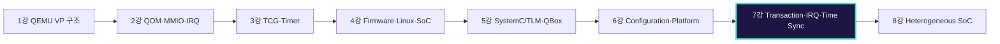

1~4강에서는 QEMU가 CPU instruction을 실행하고 Device Model을 호출하는 내부 경로를 학습했다. 5강에서는 QBox가 QEMU를 SystemC/TLM 환경에 통합하는 계층을, 6강에서는 Lua/CCI로 실제 Platform을 구성하는 방법을 학습했다.

7강의 질문은 세 가지다.

1. Guest의 load/store가 정확히 어떤 객체를 거쳐 SystemC IP에 도달하는가?
2. SystemC IP의 interrupt는 어떻게 QEMU CPU와 Linux ISR에 전달되는가?
3. QEMU virtual time, SystemC time, local time이 어떤 규칙으로 동기화되는가?

다음 8강에서는 이 세 경로를 바탕으로 AArch64 Linux Domain과 RISC-V64 Control Domain을 하나의 heterogeneous SoC VP에 결합한다.

## 1. 학습 목표

강의를 마치면 다음을 설명하고 구현할 수 있어야 한다.

1. `QemuInitiatorSocket`이 QEMU `AddressSpace`를 TLM initiator로 노출하는 원리를 설명한다.
2. `tlm_generic_payload`의 필드와 `b_transport()`의 delay/response contract를 설명한다.
3. Router의 address decode, relative address, overlap priority를 분석한다.
4. `study-ip`를 TLM target으로 구현하고 `sc_event`를 이용한 asynchronous completion을 만든다.
5. SystemC signal에서 GICv3/PLIC을 거쳐 Linux ISR까지 이어지는 level IRQ 경로를 검증한다.
6. QEMU virtual clock, SystemC global time, initiator local time, host wall time을 구분한다.
7. QuantumKeeper와 MCIPS의 목적, 장단점, 적용 범위를 비교한다.
8. RAM에는 DMI를 허용하고 side-effect register에는 DMI를 금지해야 하는 이유를 설명한다.
9. reset, timeout, stale completion, WFI idle과 같은 실전 오류를 decision tree로 분석한다.

## 2. 선수 지식 확인

다음 질문에 답하기 어렵다면 5~6강의 해당 절을 다시 확인한다.

- QBox에서 CPU memory socket은 Router의 어느 socket에 bind하는가?
- RAM과 Peripheral target은 Router의 어느 socket에 bind하는가?
- `QemuInstance`가 기본적으로 `-M none`을 사용하는 이유는 무엇인가?
- `tlm_initiator_socket`과 `tlm_target_socket`의 역할 차이는 무엇인가?
- SystemC의 evaluation/update/notification과 delta cycle은 어떤 문제를 해결하는가?
- level interrupt에서 pending bit와 physical line level은 왜 분리되어야 하는가?
- QEMU의 `QEMU_CLOCK_VIRTUAL`과 host wall clock은 어떻게 다른가?

## 3. 문제 제기: 기능은 맞는데 왜 timeout이 발생하는가

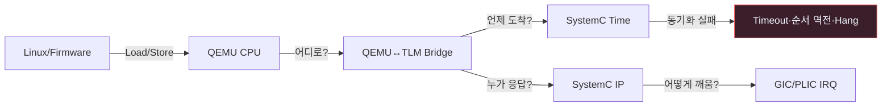

Standalone QEMU Device Model에서는 MMIO callback과 QEMU Timer가 같은 runtime 내부에 있다. QBox에서는 CPU 실행은 QEMU에, Router/Memory/IP는 SystemC에 있을 수 있다. 따라서 단순히 register map을 맞추는 것만으로는 충분하지 않다.

다음 오류가 자주 발생한다.

- CPU의 transaction이 Router address map에서 miss한다.
- Router가 absolute address를 target에 전달했지만 target은 relative offset을 기대한다.
- target이 delay를 잘못 해석하여 local time이 두 번 증가한다.
- CPU가 WFI 상태인데 SystemC time을 진행시킬 timed event가 없어 completion이 영원히 오지 않는다.
- IP는 pending을 세웠지만 signal socket 또는 GIC/PLIC wiring이 잘못되어 ISR이 실행되지 않는다.
- MMIO target이 DMI를 허용하여 이후 access가 `b_transport()`를 우회하고 side effect가 사라진다.
- reset 이후 이전 completion event가 실행되어 새 command 상태를 덮어쓴다.

### 3.1 세 경로를 동시에 보라

```mermaid
flowchart TB
    subgraph DATA[Transaction / Data Path]
      CPU[QEMU vCPU] --> AS[QEMU AddressSpace]
      AS --> QIS[QemuInitiatorSocket]
      QIS --> R[SystemC Router]
      R --> M[RAM / MMIO Target]
    end
    subgraph CTRL[Interrupt / Control Path]
      IP[SystemC IP] --> SIG[Signal Socket]
      SIG --> INTC[GICv3 / PLIC]
      INTC --> CPU2[QEMU vCPU]
    end
    subgraph TIME[Time Path]
      VC[QEMU Virtual Clock] <--> SYNC[QuantumKeeper / MCIPS]
      SYNC <--> SCT[SystemC Time]
    end
```

QBox 문제는 한 경로만 보면 놓치기 쉽다.

- **Transaction/Data Path**: instruction → AddressSpace → TLM → target
- **Interrupt/Control Path**: target signal → interrupt controller → CPU
- **Time Path**: QEMU virtual time ↔ local time ↔ SystemC global time

정상 동작은 세 경로의 contract가 모두 일치할 때만 보장된다.

## 4. Source Reading Map

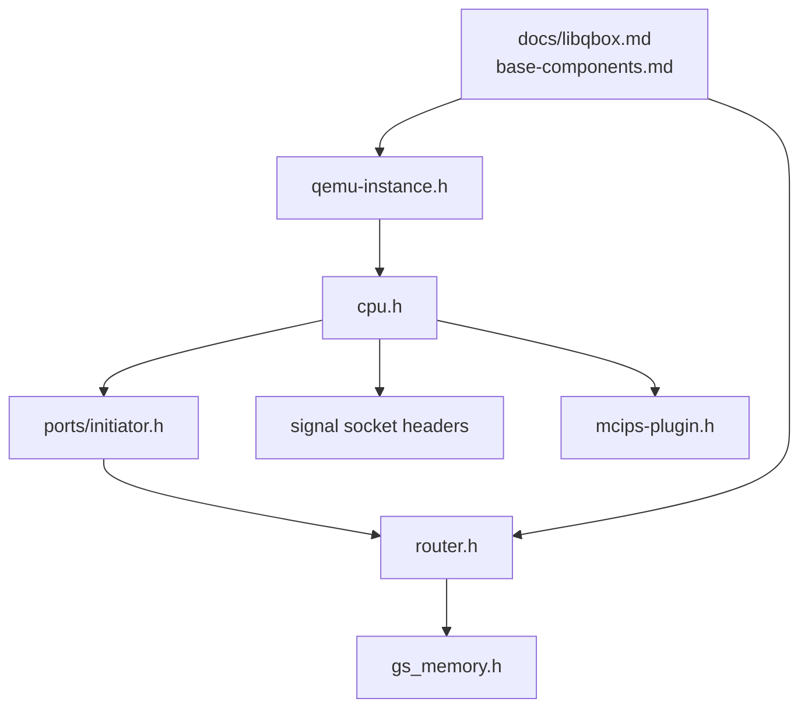

| 관심 영역 | QBox source | 읽을 질문 |
|---|---|---|
| QEMU instance | `qemu-components/common/include/qemu-instance.h` | accelerator, TCG mode, sync strategy는 언제 고정되는가? |
| CPU 실행/시간 | `qemu-components/common/include/cpu.h` | CPU loop와 local time hook은 어디서 만나는가? |
| Transaction bridge | `qemu-components/common/include/ports/initiator.h` | QEMU AddressSpace access가 payload로 어떻게 바뀌는가? |
| Address decode | `systemc-components/router/include/router.h` | overlap, priority, DMI backward path는 어떻게 처리되는가? |
| RAM/DMI | `systemc-components/gs_memory/include/gs_memory.h` | `b_transport()` latency와 `get_direct_mem_ptr()`의 차이는 무엇인가? |
| MCIPS | `qemu-components/common/include/mcips-plugin.h` | instruction count가 time으로 어떻게 변환되는가? |
| 공식 개념 문서 | `docs/libqbox.md`, `docs/base-components.md` | component와 socket의 사용 계약은 무엇인가? |

Pinned source links는 문서 마지막 Reference에 정리한다.

## 5. 객체 대응: QEMU memory object와 TLM object

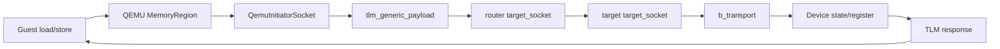

| Guest/Hardware 관점 | QEMU/QBox 객체 | SystemC/TLM 객체 | 관찰 지점 |
|---|---|---|---|
| CPU load/store | `qemu::Cpu`, QEMU TCG | initiator process | QEMU trace, TCG plugin |
| CPU address space | QEMU `AddressSpace` | `QemuInitiatorSocket` | root MemoryRegion, DMI alias |
| Bus decode | QEMU root MemoryRegion callback | `router` | router log, address map |
| MMIO request | QEMU read/write callback | `tlm_generic_payload` | command/address/size/response |
| Device register | target model state | `b_transport()` | register trace |
| Interrupt line | QEMU `qemu_irq` | signal socket / `sc_signal<bool>` | line assert/deassert |
| Device delay | QEMU virtual timer 또는 local clock | annotated `sc_time` / `sc_event` | `sc_time_stamp()`, local time |

## 6. Transaction End-to-End

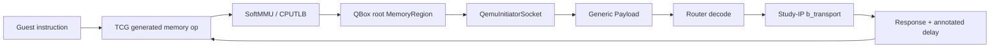

### 6.1 QEMU AddressSpace와 TLM bridge

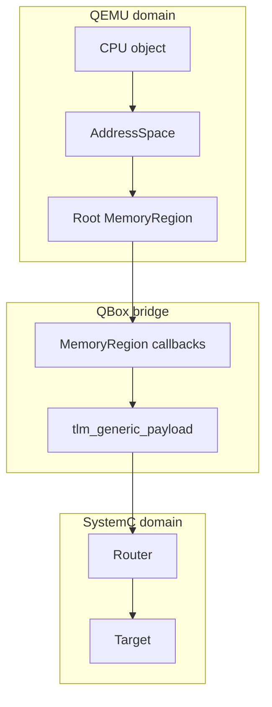

QBox의 `QemuInitiatorSocket`은 QEMU의 CPU AddressSpace 전체를 하나의 root `MemoryRegion`으로 노출한다. CPU가 RAM 또는 MMIO 주소에 접근하면 해당 MemoryRegion callback이 실행되고, QBox는 이를 표준 TLM transaction으로 변환한다.

이 구조의 장점은 QEMU target frontend와 SystemC IP가 직접 서로의 내부 API를 알 필요가 없다는 점이다. Architecture별 CPU 차이는 QEMU가 처리하고, SystemC side는 동일한 payload contract를 사용한다.

### 6.2 `tlm_generic_payload` 필드

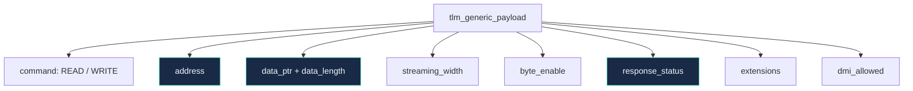

핵심 필드의 의미는 다음과 같다.

| 필드 | 의미 | 오류 시 대표 증상 |
|---|---|---|
| `command` | READ, WRITE, IGNORE | read/write side effect 역전 |
| `address` | transaction 주소 | Router miss 또는 잘못된 register offset |
| `data_ptr` | payload byte buffer | null pointer 또는 endian 오류 |
| `data_length` | 전송 byte 수 | 8/16/32-bit access mismatch |
| `streaming_width` | burst 내 반복 폭 | target이 지원하지 않는 streaming access |
| `byte_enable_ptr` | byte별 enable | partial write 처리 오류 |
| `response_status` | OK/ADDRESS/COMMAND/BURST error | QEMU side bus error 또는 silent failure |
| `dmi_allowed` | 후속 DMI 요청 가능성 | fast path 부재 또는 MMIO callback 우회 |
| extension | initiator/path/security/exclusive metadata | multi-master 식별 또는 atomic semantics 오류 |

### QEMU access → tlm_generic_payload 초기화

```cpp
void init_payload(tlm::tlm_generic_payload& trans,
                  tlm::tlm_command command,
                  uint64_t address,
                  uint8_t* data,
                  unsigned int size)
{
    trans.set_command(command);
    trans.set_address(address);
    trans.set_data_ptr(data);
    trans.set_data_length(size);
    trans.set_streaming_width(size);
    trans.set_byte_enable_ptr(nullptr);
    trans.set_dmi_allowed(false);
    trans.set_response_status(tlm::TLM_INCOMPLETE_RESPONSE);
}
```

#### 코드 읽기 포인트

- `data_ptr`은 transaction 동안 유효해야 하며 target이 이를 장기 보관하면 안 된다.
- `TLM_INCOMPLETE_RESPONSE`로 시작하고 target이 반드시 최종 status를 설정한다.
- `dmi_allowed`는 DMI를 이미 획득했다는 의미가 아니라, 후속 `get_direct_mem_ptr()`를 시도할 수 있다는 힌트다.
- QEMU와 SystemC가 같은 host endian으로 실행되더라도 Guest-visible endianness contract는 별도로 검토해야 한다.

### 6.3 정상 `b_transport()` sequence

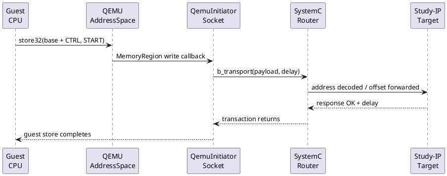

`b_transport()`는 blocking transport interface다. 호출이 return할 때 transaction의 functional effect와 response status가 확정되어야 한다. 시간은 두 방식 중 하나로 표현한다.

1. target이 `delay += latency`로 annotated delay를 추가한다.
2. target process가 `wait(latency)`를 수행한다.

Loosely Timed model과 Temporal Decoupling에서는 첫 번째가 일반적이다. 같은 latency를 annotated delay와 `wait()`에 동시에 적용하면 시간이 두 번 증가하므로 금지한다.

## 7. Router Address Decode

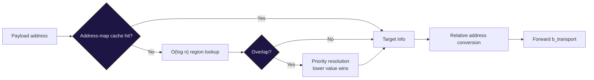

QBox Router는 multi-passthrough target/initiator socket을 사용하여 여러 master와 여러 target을 연결한다. 각 target의 `address`, `size`, `relative_addresses`, `priority`를 기준으로 destination을 결정한다.

### 7.1 Overlap과 priority

Address range가 겹치면 낮은 numeric priority 값이 먼저 선택된다. Overlap을 의도적으로 사용하는 경우가 아니라면 CI에서 overlap을 오류로 취급하는 것이 안전하다.

예를 들어 다음 두 mapping이 있다고 하자.

- RAM: `0x0000_0000 - 0x0fff_ffff`, priority 10
- Boot ROM alias: `0x0000_0000 - 0x000f_ffff`, priority 0

초기 boot에서는 ROM alias가 RAM보다 우선한다. 이후 remap 동작을 모델링하려면 DMI invalidation과 address map update를 함께 처리해야 한다.

### 7.2 Relative address

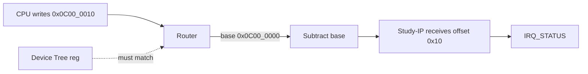

Device model은 일반적으로 register offset을 받는 것이 편하다. Router가 `0x0c00_0010`을 `0x10`으로 변환하여 target에 전달하면 같은 IP model을 다른 base address에 재사용할 수 있다.

검증 포인트:

- Lua `address/size`
- Linux DT `reg`
- Firmware header의 base constant
- target의 `relative_addresses` 기대값
- trace에 기록하는 주소가 absolute인지 offset인지

## 8. Study-IP SystemC/TLM 모델

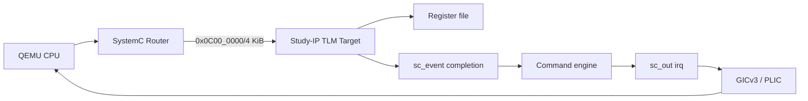

### 8.1 Hardware-visible contract

| Offset | Register | Access | 의미 |
|---:|---|---|---|
| `0x000` | `ID` | RO | Device ID와 version |
| `0x004` | `CTRL` | RW | ENABLE, START, SW_RESET |
| `0x008` | `STATUS` | RO | BUSY, DONE, ERROR |
| `0x00c` | `DATA` | RW | input/result |
| `0x010` | `IRQ_STATUS` | W1C | DONE/ERROR pending |
| `0x014` | `IRQ_ENABLE` | RW | interrupt mask |
| `0x018` | `DELAY` | RW | completion delay in microseconds |
| `0x01c` | `FAULT_INJECT` | RW | ERROR/TIMEOUT injection |

### 8.2 State machine

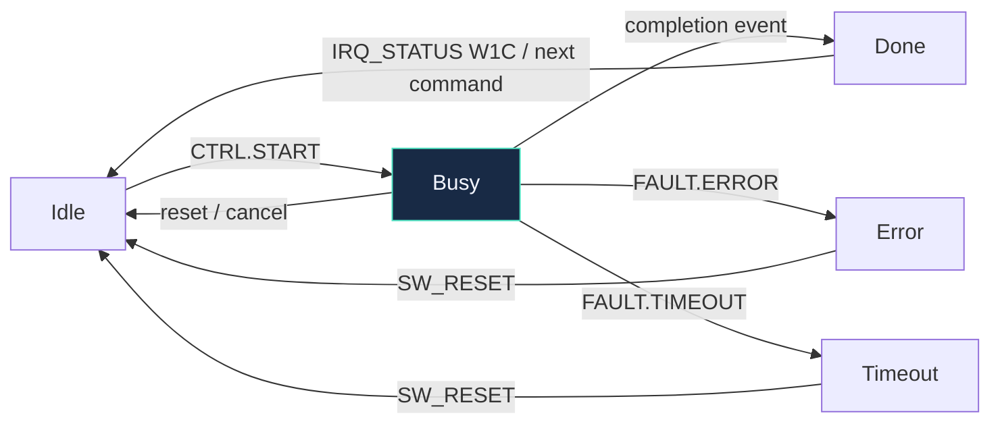

핵심 불변식:

- command 입력은 START 순간에 latch한다.
- BUSY 중 두 번째 START는 reject하거나 명확한 error semantics를 가진다.
- normal/error completion은 status와 pending을 먼저 갱신한 뒤 IRQ line을 계산한다.
- timeout injection은 event를 예약하지 않거나 completion을 의도적으로 suppress한다.
- reset은 register, pending IRQ, scheduled event, command generation을 함께 초기화한다.

### Study-IP TLM target 구조

```cpp
struct StudyIp : sc_core::sc_module {
    tlm_utils::simple_target_socket<StudyIp> target_socket;
    sc_core::sc_out<bool> irq;

    sc_core::sc_event complete_event;
    uint32_t ctrl = 0;
    uint32_t status = 0;
    uint32_t data = 0;
    uint32_t irq_status = 0;
    uint32_t irq_enable = 0;
    uint32_t delay_us = 100;
    uint32_t fault = 0;
    uint64_t generation = 0;

    SC_HAS_PROCESS(StudyIp);
    explicit StudyIp(sc_core::sc_module_name name);
    void b_transport(tlm::tlm_generic_payload&, sc_core::sc_time&);
    void complete();
    void update_irq();
    void reset_model();
};
```

### Socket callback와 completion process 등록

```cpp
StudyIp::StudyIp(sc_core::sc_module_name name)
    : sc_module(name)
    , target_socket("target_socket")
    , irq("irq")
{
    target_socket.register_b_transport(
        this, &StudyIp::b_transport);

    SC_METHOD(complete);
    sensitive << complete_event;
    dont_initialize();

    irq.initialize(false);
}
```

### 8.3 `b_transport()` 입력 검증

### b_transport 입력 검증

```cpp
void StudyIp::b_transport(tlm::tlm_generic_payload& gp,
                          sc_core::sc_time& delay)
{
    const uint64_t offset = gp.get_address();
    const unsigned int len = gp.get_data_length();
    auto* bytes = gp.get_data_ptr();

    if (len != sizeof(uint32_t) ||
        (offset & 0x3) != 0 || bytes == nullptr) {
        gp.set_response_status(tlm::TLM_BURST_ERROR_RESPONSE);
        return;
    }

    uint32_t value = 0;
    std::memcpy(&value, bytes, sizeof(value));
    // read/write handling follows...
}
```

권장 검증 순서:

1. address range
2. data pointer
3. access size
4. alignment
5. streaming width
6. byte enable 지원 여부
7. command type
8. register-specific access permission

잘못된 access를 무조건 0으로 응답하면 Driver 버그가 숨겨진다. 교육/검증 VP에서는 적절한 TLM error response와 log를 남기는 것이 좋다.

### 8.4 Register read와 START

### Register read path

```cpp
uint32_t StudyIp::read_reg(uint64_t offset) const
{
    switch (offset) {
    case 0x000: return 0x53545501;  // ID/version
    case 0x004: return ctrl;
    case 0x008: return status;
    case 0x00c: return data;
    case 0x010: return irq_status;
    case 0x014: return irq_enable;
    case 0x018: return delay_us;
    case 0x01c: return fault;
    default:    return 0;
    }
}
```

### START write와 비동기 completion 예약

```cpp
void StudyIp::start_command(sc_core::sc_time arrival)
{
    if (status & STATUS_BUSY) {
        status |= STATUS_ERROR;
        return;
    }

    active_data = data;              // input latch
    active_fault = fault;
    active_generation = ++generation;
    status = STATUS_BUSY;
    irq_status = 0;
    update_irq();

    if (active_fault & FAULT_TIMEOUT)
        return;                      // intentionally never completes

    complete_event.notify(
        arrival + sc_core::sc_time(delay_us, sc_core::SC_US));
}
```

`arrival`은 transaction이 target에 도달한 local-time 관점을 의미한다. completion event를 예약할 때 target latency와 command latency를 구분해야 한다.

- bus access latency: `b_transport()` annotated delay
- command processing latency: `complete_event.notify()`

두 값을 분리하면 MMIO bus 비용과 accelerator processing 시간을 독립적으로 실험할 수 있다.

### 8.5 Completion과 IRQ

### Timed completion callback

```cpp
void StudyIp::complete()
{
    if (active_generation != generation)
        return;                      // stale event after reset

    status &= ~STATUS_BUSY;
    if (active_fault & FAULT_ERROR) {
        status |= STATUS_ERROR;
        irq_status |= IRQ_ERROR;
    } else {
        data = active_data + 1;
        status |= STATUS_DONE;
        irq_status |= IRQ_DONE;
    }
    update_irq();
}
```

### Level IRQ와 W1C

```cpp
void StudyIp::update_irq()
{
    const bool level = (irq_status & irq_enable) != 0;
    irq.write(level);
}

void StudyIp::write_irq_status(uint32_t value)
{
    irq_status &= ~value;            // write-one-to-clear
    update_irq();
}
```

### 8.6 QBox Lua wiring

### QBox Lua: Study-IP와 IRQ 연결

```lua
platform.study_ip = {
    moduletype = "StudyIp",
    target_socket = {
        address = 0x0c000000,
        size = 0x1000,
        bind = "&router.initiator_socket",
    },
    irq = {
        bind = "&gic_0.spi_in_20",
    },
    bus_latency_ns = 50,
}

-- CPU initiator is bound to router.target_socket
platform.cpu_0.mem = { bind = "&router.target_socket" }
```

CPU의 `mem` initiator는 Router `target_socket`에, Study-IP의 target socket은 Router `initiator_socket`에 bind한다. Interrupt output은 GIC SPI 또는 PLIC source에 별도 연결한다.

## 9. Interrupt End-to-End

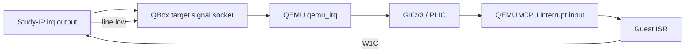

QEMU↔SystemC transaction은 request/response 경로지만 interrupt는 별도의 signal/control 경로다. MMIO가 정상이라고 IRQ wiring도 정상이라는 보장은 없다.

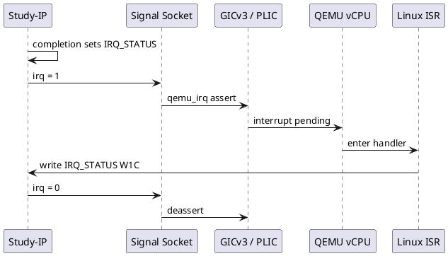

### 9.1 Level IRQ와 W1C

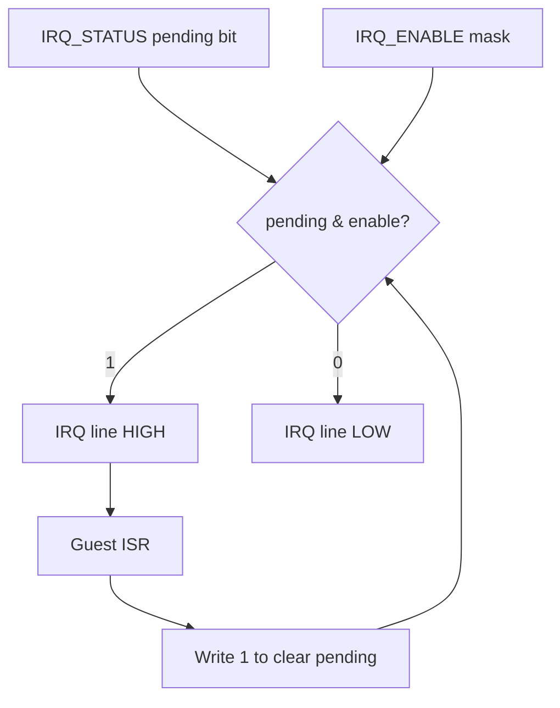

권장 수식은 다음과 같다.

```text
irq_level = (IRQ_STATUS & IRQ_ENABLE) != 0
```

따라서 mask를 disable해도 pending bit는 유지할 수 있고, 다시 enable하면 line이 assert될 수 있다. 이는 hardware specification에 따라 달라질 수 있으므로 register contract에 명시해야 한다.

#### Edge와 level을 혼용하지 말 것

- Level-triggered source는 ISR에서 pending cause를 clear하여 line을 낮춰야 한다.
- Edge-triggered source는 pulse가 controller에 capture되는 시점을 검증해야 한다.
- Device Tree의 trigger type과 QBox signal 동작이 일치해야 한다.
- PLIC은 source level과 claim/complete protocol을 함께 보아야 한다.

### 9.2 ARM64 GICv3 path

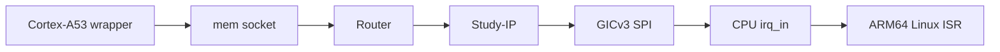

- IP output을 선택한 GIC SPI input에 bind한다.
- GIC CPU interface가 A53/A76 wrapper의 IRQ input에 연결되어야 한다.
- DT interrupt number는 GIC SPI numbering rule과 일치해야 한다.
- Linux Driver의 `platform_get_irq()` 결과와 QBox wiring을 trace한다.

### 9.3 RISC-V64 PLIC path

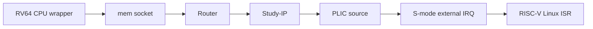

- IP output을 PLIC source에 bind한다.
- PLIC enable, priority, threshold, claim/complete를 확인한다.
- Linux S-mode external interrupt path와 DT `interrupts`/`interrupt-parent`를 맞춘다.
- AArch64와 같은 Driver source를 사용할 수 있어도 DT와 interrupt controller adapter는 Architecture별로 다르다.

## 10. 네 종류의 시간

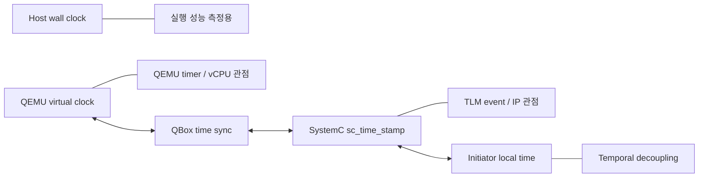

| 시간 | 소유자 | 사용 목적 | 정지 조건 |
|---|---|---|---|
| Host wall clock | Host OS | simulation performance, timeout guard | host scheduler에 따라 계속 진행 |
| QEMU virtual clock | QEMU | QEMU timer, CPU execution 시간 | VM pause/정책에 따라 정지 |
| SystemC global time | SystemC kernel | timed event와 module ordering | pending timed event가 없으면 starvation 종료 가능 |
| Initiator local time | CPU/initiator QK | temporal decoupling | sync 때 global time에 반영 |

### 10.1 Annotated delay 해석

TLM `delay`는 wall-clock sleep이 아니다. Initiator의 local-time offset을 나타낸다. target은 transaction 처리 비용을 delay에 더하고, initiator는 반환된 delay를 자신의 local time에 반영한다.

예:

```text
SystemC global time: 100 us
CPU local time:      +8 us
Target bus latency:  +2 us
Return local time:   +10 us
```

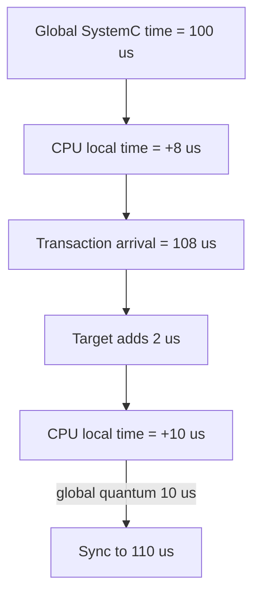

## 11. QuantumKeeper Time Synchronization

```mermaid
flowchart LR
    RUN[vCPU executes] --> LT[Local time accumulates]
    LT --> TX[TLM transaction adds delay]
    TX --> Q{need_sync?}
    Q -- No --> RUN
    Q -- Yes --> KICK[Kick / exit CPU loop]
    KICK --> SYNC[QuantumKeeper sync]
    SYNC --> GST[Advance SystemC time]
    GST --> RUN
```

Temporal Decoupling의 목적은 모든 instruction/transaction마다 SystemC kernel에 yield하지 않고 일정 구간을 local time으로 실행하여 simulation throughput을 높이는 것이다.

### 11.1 Local-time hook

### QemuCpu local-time hook의 핵심 형태

```cpp
sc_core::sc_time initiator_get_local_time()
{
    const int64_t qemu_ns = qemu_instance.get_virtual_clock();
    const sc_core::sc_time global = sc_core::sc_time_stamp();
    return time_sync->get_local_time(qemu_ns, global);
}

void initiator_set_local_time(const sc_core::sc_time& t)
{
    time_sync->set_local_time(t);
    if (quantum_keeper.need_sync())
        cpu.kick();
}
```

`initiator_get_local_time()`은 transaction 직전 QEMU virtual clock과 SystemC global time의 차이를 local time으로 표현한다. transaction 반환 후 `initiator_set_local_time()`은 target이 추가한 delay를 반영한다.

### 11.2 CPU loop와 sync

### CPU loop 종료 시 QuantumKeeper sync

```cpp
void sync_with_systemc()
{
    const auto qemu_now = qemu_instance.get_virtual_clock();
    const auto sc_now = sc_core::sc_time_stamp();

    cpu.set_soft_stopped(true);
    qemu_instance.unlock_iothread();

    if (sc_core::sc_time(qemu_now, sc_core::SC_NS) > sc_now)
        qk.set(sc_core::sc_time(qemu_now, sc_core::SC_NS) - sc_now);

    qk.sync();
}
```

```plantuml
@startuml
participant "QEMU vCPU" as CPU
participant "QemuCpu" as QC
participant "QuantumKeeper" as QK
participant "SystemC Kernel" as SC
participant "TLM Target" as IP
CPU -> QC: execute until memory access
QC -> QK: get local time
QC -> IP: b_transport(delay)
IP --> QC: response + target delay
QC -> QK: set local time
QK --> QC: need_sync = true
QC -> CPU: kick / exit loop
QC -> QK: sync()
QK -> SC: advance global time
@enduml
```

중요한 순서:

1. CPU를 soft-stop 상태로 전환한다.
2. QEMU iothread/BQL을 적절한 위치에서 release한다.
3. QEMU virtual clock과 SystemC time 차이를 QK에 반영한다.
4. `qk.sync()`로 SystemC kernel이 global time을 진행하도록 한다.
5. 다음 quantum을 위한 CPU loop를 재개한다.

### 11.3 Quantum 선택

| Quantum | 장점 | 단점 | 권장 사용 |
|---|---|---|---|
| 매우 작음 | 세밀한 event ordering | 잦은 sync, 느린 simulation | bring-up/debug |
| 중간 | accuracy와 throughput 균형 | workload별 조정 필요 | 기본 regression |
| 매우 큼 | 높은 throughput | interrupt/timer 관찰 지연 가능 | 기능 smoke, batch workload |

Quantum은 실제 CPU cycle이 아니다. 같은 10us quantum도 CPU workload, TCG mode, DMI 여부에 따라 실행되는 instruction 수가 달라질 수 있다.

## 12. Threading, BQL과 SystemC Kernel

```mermaid
flowchart TB
    M[QemuInstance tcg_mode] --> S[SINGLE]
    M --> C[COROUTINE]
    M --> MT[MULTI]
    S --> S1[한 QEMU CPU 실행 thread<br/>공유 QuantumKeeper 가능]
    C --> C1[SystemC thread에서 coroutine yield]
    MT --> MT1[vCPU별 OS thread<br/>외부 event + condvar]
    C -. requires compatible sync policy .-> QK[SystemC-thread QuantumKeeper]
    MT -. per-CPU QK .-> QK2[Multi-thread sync policy]
```

### 12.1 SINGLE

- 한 QEMU execution thread가 여러 vCPU를 순차적으로 실행한다.
- 공유 QK 사용이 가능하다.
- deterministic debugging이 상대적으로 쉽다.

### 12.2 COROUTINE

- QEMU CPU loop와 SystemC thread가 coroutine yield로 협력한다.
- 선택한 sync policy가 SystemC-thread 방식과 호환되어야 한다.
- callback stack/lifetime을 특히 주의한다.

### 12.3 MULTI / MTTCG

- vCPU별 host OS thread가 실행될 수 있다.
- external event, condition variable, async notification을 사용한다.
- BQL과 SystemC-side lock ordering을 일관되게 유지해야 한다.
- 시간 동기화와 shutdown race가 SINGLE보다 어렵다.

```mermaid
flowchart LR
    V[vCPU thread] -->|BQL / CPU loop| Q[QEMU]
    Q -->|MMIO callback| ROS[run_on_sysc bridge]
    ROS --> SC[SystemC kernel thread]
    SC -->|TLM response| ROS
    ROS --> Q
    SC -->|IRQ event| EVT[async_event / signal]
    EVT -->|kick or wake| V
    classDef lock fill:#3C3320,stroke:#FFD166,color:#F3F6FF
    class Q,ROS lock
```

### 12.4 Transaction callback 안에서 피해야 할 것

- BQL을 잡은 상태로 무기한 SystemC wait
- SystemC kernel thread에서 QEMU lock을 역순으로 획득
- target callback이 동일 initiator로 재진입하는 구조
- payload/data pointer를 callback 이후 보관
- reset/destructor 중 in-flight async callback 방치

## 13. WFI, Idle과 Timed Event

```mermaid
flowchart TD
    CPU[Guest executes WFI] --> IDLE[vCPU IDLE]
    IDLE --> ALL{All CPUs idle?}
    ALL -- No --> WAIT[Wait for external IRQ]
    ALL -- Yes, QK --> DL[Deadline / SystemC event wakes]
    ALL -- Yes, MCIPS --> PUMP[Idle time pump]
    DL --> IRQ[Timer or device completion]
    PUMP --> IRQ
    IRQ --> WAKE[Signal + CPU kick]
    WAKE --> CPU
```

```plantuml
@startuml
participant "Linux CPU" as CPU
participant "QemuCpu" as QC
participant "SystemC Kernel" as SC
participant "Study-IP" as IP
participant "IRQ Controller" as IC
CPU -> QC: WFI
QC -> SC: CPU becomes idle
SC -> IP: timed completion event
IP -> IC: assert interrupt
IC -> QC: external event / kick
QC -> CPU: resume and take IRQ
@enduml
```

CPU가 WFI에 들어가면 instruction execution이 time progress를 만들지 않을 수 있다. 그러나 Device completion과 timer interrupt는 여전히 발생해야 한다.

확인할 사항:

- SystemC에 future timed event가 존재하는가?
- QEMU deadline timer가 CPU loop를 적절히 kick하는가?
- 모든 CPU가 idle일 때 simulation이 starvation으로 종료되지 않는가?
- MCIPS idle pump가 startup/all-idle 상태에서 time을 진행시키는가?
- interrupt signal이 CPU의 external event list에 포함되어 있는가?

## 14. DMI: RAM Fast Path

```mermaid
flowchart LR
    CPU[QEMU CPU memory access] --> D{DMI mapping exists?}
    D -- Yes --> FAST[QEMU MemoryRegion alias<br/>direct host pointer]
    FAST --> RAM[RAM bytes]
    D -- No --> GP[TLM generic payload]
    GP --> ROUTER[Router]
    ROUTER --> MEM[gs_memory]
    MEM --> REQ[get_direct_mem_ptr]
    REQ -->|granted| CACHE[Install DMI alias]
    REQ -->|denied| GP
```

DMI(Direct Memory Interface)는 target이 backing memory의 host pointer와 valid range를 initiator에 제공하는 TLM 최적화다. QBox는 이 정보를 QEMU MemoryRegion alias 또는 대응 fast mapping으로 사용하여 반복 RAM access를 full TLM transaction 없이 처리할 수 있다.

```plantuml
@startuml
participant "QEMU CPU" as CPU
participant "QemuInitiatorSocket" as QIS
participant "Router" as R
participant "gs_memory" as MEM
CPU -> QIS: first RAM read
QIS -> R: b_transport()
R -> MEM: read transaction
MEM --> QIS: data + dmi_allowed
QIS -> MEM: get_direct_mem_ptr()
MEM --> QIS: host pointer + range + latency
QIS --> CPU: install fast mapping
CPU -> QIS: later RAM reads use DMI alias
@enduml
```

### 14.1 gs_memory contract

현재 기준 source의 `gs_memory`는 다음 성격을 가진다.

- Loosely Timed only
- 내부에서 SystemC time을 직접 관리하지 않음
- `b_transport()`에서 configured latency를 annotated delay에 더함
- DMI request 지원
- 자체적으로 DMI invalidation을 발행하지 않음

따라서 backing pointer가 runtime 중 바뀌지 않는 정적 RAM 모델에 적합하다. remap, hotplug, protected-memory state change를 구현한다면 별도 invalidation contract가 필요하다.

### RAM target의 DMI grant

```cpp
bool Memory::get_direct_mem_ptr(tlm::tlm_generic_payload& gp,
                            tlm::tlm_dmi& dmi)
{
    if (!dmi_allow)
        return false;

    dmi.set_dmi_ptr(backing_store.data());
    dmi.set_start_address(base);
    dmi.set_end_address(base + size - 1);
    dmi.allow_read_write();
    dmi.set_read_latency(read_latency);
    dmi.set_write_latency(write_latency);
    return true;
}
```

### 14.2 DMI lifecycle

```mermaid
flowchart LR
    N[No DMI] -->|first / next memory access| R[Requested]
    R -->|target grants DMI| A[Active DMI alias]
    R -->|target denies DMI| N
    A -->|direct RAM accesses| A
    A -->|invalidate_direct_mem_ptr| I[Invalidating]
    I -->|alias removed / mapping refreshed| N
    classDef fast fill:#182A45,stroke:#50E3C2,color:#F3F6FF
    class A fast
```

### 14.3 RAM과 MMIO의 차이

```mermaid
flowchart TB
    RAM[gs_memory] -->|DMI allowed| DP[Direct pointer path]
    MMIO[Study-IP] -->|DMI denied| BP[b_transport path]
    DP --> PERF[High simulation throughput]
    BP --> SIDE[Register side effects preserved]
    WRONG[MMIO grants DMI] --> BUG[Callbacks bypassed<br/>IRQ/status broken]
    classDef bad fill:#3A1F2B,stroke:#FF6B6B,color:#F3F6FF
    class WRONG,BUG bad
```

**Study-IP register target은 DMI를 허용하지 않는다.** DMI가 허용되면 `CTRL.START`, W1C, read-to-clear 같은 callback side effect가 우회될 수 있다.

다음 target은 일반적으로 DMI 부적합하다.

- control/status register
- FIFO pop/push register
- doorbell
- interrupt acknowledge
- clock/reset controller
- security policy check가 access마다 필요한 target

### 14.4 DMI invalidation

```plantuml
@startuml
participant "Memory Target" as MEM
participant "Router" as R
participant "QemuInitiatorSocket" as QIS
participant "QEMU AddressSpace" as AS
participant "vCPU" as CPU
MEM -> R: invalidate_direct_mem_ptr(range)
R -> QIS: backward invalidation
QIS -> AS: remove DMI alias / update mapping
AS -> CPU: stale fast path no longer valid
CPU -> QIS: next access uses transport path
QIS -> MEM: request DMI again if allowed
@enduml
```

### Backing 변경 시 DMI invalidation

```cpp
void RemappableMemory::replace_backing_store()
{
    const uint64_t first = base;
    const uint64_t last = base + size - 1;

    // Invalidate before replacing the host pointer.
    target_socket->invalidate_direct_mem_ptr(first, last);
    backing_store = allocate_new_store(size);
}

// Study-IP registers intentionally return false from DMI requests.
```

Invalidation 범위는 기존 DMI range와 일치해야 한다. Invalidation 전에 backing pointer를 해제하면 vCPU가 stale pointer를 사용할 수 있다.

### 14.5 DMI와 coherency

DMI pointer는 동일 process 내 host memory pointer다. 이것만으로 다음이 자동 해결되지는 않는다.

- Guest CPU cache coherency
- DMA master cache maintenance
- multi-initiator ordering
- exclusive access semantics
- security/permission check
- dirty tracking과 migration semantics

## 15. MCIPS: Instruction-Based Time

```mermaid
flowchart LR
    TB[TCG Translation Block] --> CNT[Per-vCPU instruction count]
    CNT --> RATE[insn_per_second]
    RATE --> DT[delta time = instructions / rate]
    DT --> CPU[Per-vCPU simulated time]
    CPU --> ACTIVE[Active/slowest CPU selection]
    ACTIVE --> WIN[SystemC sync window]
    WIN --> QTIME[QEMU controlled time]
```

MCIPS strategy는 QEMU TCG plugin을 통해 Translation Block의 instruction count를 vCPU별로 누적한다. 설정된 `insn_per_second`로 instruction delta를 time delta로 변환한다.

### Instruction rate를 simulation time으로 변환

```python
def instruction_delta_time(delta_insn: int,
                           insn_per_second: int) -> float:
    if insn_per_second <= 0:
        raise ValueError("insn_per_second must be positive")
    return delta_insn / insn_per_second

# 50,000 instructions at 500 MIPS
seconds = instruction_delta_time(50_000, 500_000_000)
assert seconds == 100e-6
```

수식:

```text
delta_time = delta_instructions / instructions_per_second
```

예를 들어 500 MIPS로 설정한 vCPU가 50,000 instruction을 실행하면 100us의 model time을 소비한다.

### 15.1 vCPU state

```mermaid
flowchart LR
    R[RUNNING] -->|CPU too far ahead| P[PAUSED]
    P -->|falls behind / window advances| R
    R -->|WFI / WFE| I[IDLE]
    I -->|IRQ / resume| R
    I -->|idle pump advances SystemC time| I
    classDef active fill:#182A45,stroke:#50E3C2,color:#F3F6FF
    class R active
```

현재 기준 MCIPS model은 vCPU별로 다음 상태를 관리한다.

- `RUNNING`: instruction count가 증가하는 CPU
- `PAUSED`: sync window보다 앞서 있어 일시 정지된 CPU
- `IDLE`: WFI/WFE 등으로 실행하지 않는 CPU

all-idle 상태에서는 idle pump가 SystemC timed event를 생성하여 time이 멈추지 않도록 한다.

### 15.2 Lua 설정

### MCIPS time synchronization 설정

```lua
platform.qemu_inst = {
    moduletype = "QemuInstance",
    args = { "&qemu_inst_mgr", "AARCH64" },
    accel = "tcg",
    tcg_mode = "MULTI",
    sync_policy = "multithread-unconstrained",
    time_sync_strategy = "mcips",
}

platform.cpu_0 = {
    moduletype = "cpu_arm_cortexA76",
    args = { "&qemu_inst" },
    mem = { bind = "&router.target_socket" },
    insn_per_second = 500000000,
}
```

### 15.3 Sync window sequence

```plantuml
@startuml
participant "TCG Plugin" as P
participant "vCPU Scoreboard" as SB
participant "MCIPS Plugin" as M
participant "SystemC Window" as W
participant "QEMU Time" as T
P -> SB: add TB instruction count
SB -> M: delta_insn reaches quota
M -> M: delta_t = insn / rate
M -> T: update active CPU time
M -> W: publish next sync window
W --> M: receive advanced window
M -> T: resume CPUs behind window
@enduml
```

### 15.4 MCIPS 해석 주의

`insn_per_second`는 실제 CPU microarchitecture의 IPC, cache miss, branch predictor, memory stall을 자동 모델링하지 않는다. 따라서 다음 용도로 사용한다.

- 서로 다른 CPU domain의 상대적 execution rate
- firmware polling loop와 device delay의 interaction
- instruction quota 기반 deterministic experiment
- QK만으로 표현하기 어려운 CPU-rate sensitivity 탐색

다음 용도로 사용하지 않는다.

- 실제 benchmark performance 예측
- cache/DRAM latency 분석
- hard real-time WCET 보증
- ASIL timing evidence

## 16. QuantumKeeper와 MCIPS 선택

```mermaid
flowchart TB
    NEED[What do we need?] --> F{Transaction-order<br/>functional timing?}
    F -- Yes --> QK[QuantumKeeper]
    F -- No --> I{Instruction-rate<br/>CPU-relative timing?}
    I -- Yes --> MC[MCIPS]
    I -- No --> U[Untimed / larger quantum]
    QK --> WARN[Not cycle-accurate]
    MC --> WARN
```

| 항목 | QuantumKeeper | MCIPS |
|---|---|---|
| time source | QEMU virtual/local time와 TLM delay | TCG instruction count와 configured rate |
| 장점 | TLM transaction ordering에 자연스러움 | CPU별 상대 rate를 명시 가능 |
| 단점 | instruction-rate 의미가 약함 | TCG only, rate calibration 필요 |
| WFI/idle | deadline/event 동작 확인 필요 | idle pump 지원 |
| 주요 parameter | global quantum, sync policy | global quantum, `insn_per_second` |
| cycle accuracy | 아님 | 아님 |
| 기본 활용 | platform functional timing | heterogeneous CPU-rate study |

선택 원칙:

1. 먼저 QuantumKeeper로 functional VP를 안정화한다.
2. CPU rate가 실험 변수라면 MCIPS를 추가한다.
3. 두 전략의 결과가 다르면 어떤 time assumption이 결과를 바꾸었는지 trace한다.
4. 실제 silicon timing이 필요하면 calibrated model 또는 higher-fidelity interconnect/RTL co-simulation으로 확장한다.

## 17. 실험 설계

```mermaid
flowchart LR
    Q[Quantum<br/>1/10/100 us] --> RUN[Run same workload]
    D[DMI<br/>on/off] --> RUN
    L[Device latency<br/>10/100/1000 us] --> RUN
    S[Sync strategy<br/>QK/MCIPS] --> RUN
    RUN --> M1[Wall time]
    RUN --> M2[Simulated time]
    RUN --> M3[Transaction count]
    RUN --> M4[IRQ order / Driver result]
```

### 17.1 독립 변수

- Quantum: 1us, 10us, 100us
- DMI: on/off
- Device processing latency: 10us, 100us, 1000us
- Time sync strategy: QuantumKeeper/MCIPS
- TCG mode: SINGLE/MULTI
- CPU count: 1/2/4

### 17.2 종속 변수

- Host wall-clock execution time
- Final SystemC simulation time
- TLM transaction count
- DMI grant count와 invalidation count
- IRQ assert/ISR/W1C ordering
- Driver success/timeout result
- reset 이후 stale completion 발생 여부

### 동일 workload의 Quantum/DMI 실험

```bash
for quantum in 1000 10000 100000; do
  for dmi in true false; do
    /usr/bin/time -f '%e' -o wall.txt \
      ./build/platforms/platforms-vp \
        -l conf_study.lua \
        -p platform.quantum_ns=${quantum} \
        -p platform.ram_0.dmi_allow=${dmi} \
        -p platform.study_ip.delay_us=100 \
        > run-q${quantum}-dmi${dmi}.log 2>&1
  done
done

python3 tools/summarize_runs.py run-*.log
```

### 17.3 Trace schema

### 권장 transaction/IRQ trace schema

```text
{"sc_time_ns":100000,"cpu":0,"kind":"mmio_write",
 "addr":"0x0c000004","value":"0x3"}
{"sc_time_ns":200000,"kind":"study_complete",
 "status":"DONE","irq_status":"0x1"}
{"sc_time_ns":200000,"kind":"irq_level","level":1}
{"sc_time_ns":201500,"cpu":0,"kind":"w1c",
 "value":"0x1","irq_level":0}
```

Trace에 host timestamp만 기록하면 simulation ordering을 분석하기 어렵다. 최소한 다음을 함께 기록한다.

- SystemC timestamp
- CPU index
- absolute address와 relative offset
- transaction type/size/value
- response status
- local delay
- IRQ line level과 pending cause
- reset generation

## 18. Linux Driver End-to-End

```plantuml
@startuml
participant "Userspace" as APP
participant "Linux Driver" as DRV
participant "QEMU↔TLM" as B
participant "Study-IP" as IP
participant "IRQ" as IRQ
APP -> DRV: ioctl / debugfs command
DRV -> B: writel(DATA, CTRL.START)
B -> IP: TLM writes
IP -> IRQ: timed completion
IRQ -> DRV: ISR reads status
DRV -> IP: W1C pending bit
DRV --> APP: completion or timeout
@enduml
```

### Linux Driver: completion과 timeout recovery

```c
reinit_completion(&sdev->done);
writel(input, sdev->base + STUDY_DATA);
writel(IRQ_DONE | IRQ_ERROR,
       sdev->base + STUDY_IRQ_ENABLE);
writel(CTRL_ENABLE | CTRL_START,
       sdev->base + STUDY_CTRL);

if (!wait_for_completion_timeout(&sdev->done,
                                 msecs_to_jiffies(100))) {
    writel(CTRL_SW_RESET, sdev->base + STUDY_CTRL);
    readl(sdev->base + STUDY_STATUS); /* flush posted write */
    return -ETIMEDOUT;
}
```

Driver timeout을 분석할 때 timeout 값만 늘리지 말고 다음 순서로 확인한다.

1. START MMIO가 target에 도달했는가?
2. target이 completion event를 예약했는가?
3. SystemC time이 expiry까지 진행했는가?
4. completion callback이 current generation에 속하는가?
5. pending/status가 갱신되었는가?
6. IRQ line이 assert되었는가?
7. GIC/PLIC source와 DT가 일치하는가?
8. ISR이 W1C하고 line이 낮아졌는가?
9. completion object를 wake-up했는가?

## 19. Reset과 Stale Completion

```mermaid
flowchart TD
    START[Command generation N starts] --> EV[completion event scheduled]
    RESET[Reset before expiry] --> CANCEL[Cancel event + generation N+1]
    EV --> CB{callback generation == current?}
    CB -- No --> DROP[Drop stale completion]
    CB -- Yes --> COMPLETE[Update status + IRQ]
    CANCEL --> IDLE[Reset state / IRQ low]
```

```plantuml
@startuml
participant "Guest" as G
participant "Study-IP" as IP
participant "SystemC Event" as EV
participant "Reset Controller" as RST
G -> IP: START generation N
IP -> EV: notify completion at +100 us
RST -> IP: assert reset at +30 us
IP -> EV: cancel()
IP -> IP: generation = N + 1 / IRQ low
EV --> IP: stale callback cannot commit
IP --> G: reset state visible
@enduml
```

### Reset: event와 device lifetime 함께 종료

```cpp
void StudyIp::reset_model()
{
    complete_event.cancel();
    ++generation;                    // invalidate old callback

    ctrl = 0;
    status = 0;
    data = 0;
    irq_status = 0;
    irq_enable = 0;
    delay_us = 100;
    fault = 0;
    irq.write(false);
}
```

`sc_event::cancel()`만으로 충분하다고 가정하지 않는 것이 안전하다. 이미 runnable queue에 들어간 callback 또는 다른 async path가 있을 수 있으므로 generation token으로 stale completion을 한 번 더 차단한다.

Reset 검증 scenario:

```text
T=0us    START command N, completion at 100us
T=30us   reset assert
T=31us   registers reset, IRQ low, generation N+1
T=100us  old callback attempts to run -> generation mismatch -> drop
T=120us  new command N+1 starts and completes normally
```

## 20. Security, Isolation과 TLM Extension

```mermaid
flowchart LR
    GP[Generic payload] --> PATH[PathIDExtension<br/>initiator provenance]
    GP --> CPUH[QEMU CPU hint]
    GP --> EX[Exclusive access extension]
    GP --> SEC[Custom privilege/security extension]
    PATH --> POLICY[Target/router policy]
    SEC --> POLICY
    DMI[DMI pointer] --> WARN[Not a security boundary]
    classDef warn fill:#3C3320,stroke:#FFD166,color:#F3F6FF
    class WARN warn
```

TLM payload extension은 transaction에 다음 metadata를 전달할 수 있다.

- initiator path/master ID
- QEMU CPU hint
- exclusive access context
- secure/non-secure, privilege, VMID 같은 custom attribute
- trace correlation ID

그러나 extension은 model 내부 contract일 뿐 hardware security를 자동 보장하지 않는다. Target과 Router가 실제 policy를 적용하고 negative test를 가져야 한다.

### 20.1 DMI는 보안 경계가 아니다

Protected memory나 remap 가능한 isolation domain에 DMI를 허용할 때는 다음을 확인한다.

- permission change 시 invalidation
- stale pointer 사용 방지
- target policy callback 우회 여부
- multi-domain shared pointer exposure
- reset/domain restart 시 lifetime

## 21. Embedded/Automotive SoC 관점

```mermaid
flowchart LR
    AP[ARM64 Linux Domain] --> BUS[SystemC NoC/Router]
    BUS --> NPU[NPU Stub / Study-IP]
    BUS --> SRAM[Shared SRAM]
    MCU[RISC-V Control Domain] --> BUS
    NPU --> GIC[GICv3]
    NPU --> PLIC[PLIC]
    WDG[Watchdog/Reset] --> AP
    WDG --> MCU
    TIME[QK/MCIPS time sync] --- AP
    TIME --- MCU
    TIME --- NPU
```

Automotive SoC에서는 하나의 CPU/Device만 보는 것보다 domain 간 interaction이 중요하다.

- ARM64 Linux Application/ADAS domain
- RISC-V Safety/Control domain
- Shared SRAM과 Mailbox/Doorbell
- NPU/DMA accelerator
- GICv3와 PLIC
- Watchdog/Reset Controller
- Global time synchronization과 fault injection

### 21.1 End-to-End NPU/Study-IP 사례

```plantuml
@startuml
participant "Linux ADAS App" as APP
participant "NPU Driver" as DRV
participant "SystemC NPU Stub" as NPU
participant "GICv3" as GIC
participant "Safety Monitor" as SM
APP -> DRV: submit inference descriptor
DRV -> NPU: MMIO doorbell via QEMU/TLM
NPU -> NPU: model processing latency
NPU -> GIC: completion IRQ
GIC -> DRV: ISR + result check
DRV --> APP: completion
NPU -> SM: timeout/error signal when injected
@enduml
```

이 사례에서 각 자원의 owner/lifetime을 구분한다.

| 자원 | Owner | Lifetime | 관찰 포인트 |
|---|---|---|---|
| submit descriptor | Linux Driver | submit~completion/timeout | memory ownership, DMA sync |
| MMIO doorbell | Device register contract | transaction 순간 | address/ordering |
| command state | SystemC IP | START~completion/reset | generation, BUSY |
| completion event | SystemC kernel | schedule~fire/cancel | simulation time |
| IRQ pending | Device | completion~W1C | cause/mask/line |
| Driver completion | Linux | ISR~waiter wake | timeout race |

```mermaid
flowchart LR
    APP[Linux test app] --> DRV[study-ip driver]
    DRV --> MMIO[MMIO START]
    MMIO --> TLM[QEMU→TLM transaction]
    TLM --> IP[SystemC Study-IP]
    IP --> EV[Timed completion]
    EV --> IRQ[SystemC→QEMU IRQ]
    IRQ --> ISR[Linux ISR]
    ISR --> W1C[W1C + completion]
    W1C --> APP
```

## 22. Debugging Decision Tree

```mermaid
flowchart TD
    FAIL[Command timeout] --> MM{MMIO callback observed?}
    MM -- No --> MAP[Check address map / bind / relative address]
    MM -- Yes --> EVT{completion event fired?}
    EVT -- No --> TIME[Check delay, quantum, WFI idle pump, reset cancellation]
    EVT -- Yes --> LINE{IRQ line high?}
    LINE -- No --> MASK[Check IRQ_STATUS & IRQ_ENABLE]
    LINE -- Yes --> CTRL{GIC/PLIC receives source?}
    CTRL -- No --> WIRE[Check signal socket binding / IRQ number]
    CTRL -- Yes --> ISR{Guest ISR runs?}
    ISR -- No --> GUEST[Check DT, irq type, masking]
    ISR -- Yes --> ACK[Check W1C and line deassert]
```

### 22.1 관찰 명령/로그 체크리스트

QBox/Platform:

- Lua binding path와 shared library load log
- CCI effective parameter dump
- Router address/size/priority map
- target `b_transport()` entry/exit
- DMI grant/invalidate log
- `sc_time_stamp()`와 annotated delay

QEMU:

- monitor/GDB CPU PC와 interrupt mask
- `-d guest_errors,unimp,int,mmu`를 필요한 범위에서 사용
- TCG plugin instruction/TB count
- QEMU virtual clock

Guest Linux:

- DTB decompile 결과
- Driver probe resource/IRQ log
- `/proc/interrupts`
- status/pending/mask dump
- timeout recovery와 reset log

### 22.2 대표 증상별 원인

| 증상 | 우선 확인 |
|---|---|
| MMIO callback 없음 | base/size, socket 방향, relative address, CPU AddressSpace |
| callback은 있지만 data가 이상함 | access size, alignment, endian, pointer lifetime |
| completion event 없음 | timeout injection, event notify 계산, reset cancel |
| event는 실행됐지만 IRQ 없음 | pending/mask, signal binding, controller source |
| ISR 반복 | W1C semantics, level deassert, claim/complete |
| WFI 후 영원히 정지 | future event, QK deadline, MCIPS idle pump |
| DMI on에서만 실패 | MMIO DMI grant, invalidation 누락, side-effect bypass |
| reset 후 간헐 실패 | stale callback, in-flight async work, DMI lifetime |

## 23. 핵심 요약

1. QBox의 CPU memory access는 QEMU AddressSpace와 `QemuInitiatorSocket`을 통해 TLM payload로 변환된다.
2. Router는 address/size/priority를 기준으로 target을 선택하고 필요하면 relative offset으로 변환한다.
3. `b_transport()`는 functional effect, response status, annotated delay를 하나의 contract로 반환한다.
4. Interrupt는 transaction path와 별도의 signal path이며 level pending/W1C semantics를 정확히 모델링해야 한다.
5. QuantumKeeper는 local time을 global SystemC time에 주기적으로 동기화한다.
6. MCIPS는 instruction count와 per-vCPU rate를 이용해 CPU-relative time을 만든다.
7. DMI는 RAM throughput 최적화에 적합하지만 register side effect와 security policy를 우회할 수 있다.
8. Reset은 scheduled event, IRQ, generation, DMI/async lifetime을 함께 종료해야 한다.
9. QBox LT/MCIPS 결과는 model-relative 값이며 실제 SoC cycle/WCET 증거가 아니다.
10. Debugging은 transaction, interrupt, time path를 분리해서 관찰한 뒤 end-to-end로 다시 연결한다.

---

# 퀴즈

## 객관식 1

QBox의 `QemuInitiatorSocket` 역할로 가장 정확한 것은?

A. SystemC target을 Linux character device로 변환한다.  
B. QEMU AddressSpace access를 TLM initiator transaction으로 노출한다.  
C. GIC interrupt를 PLIC interrupt로 변환한다.  
D. TCG instruction을 RTL cycle로 변환한다.

## 객관식 2

Side-effect register target에서 DMI를 허용하면 가장 직접적으로 발생할 수 있는 문제는?

A. CPU instruction decode 실패  
B. `b_transport()` callback이 우회되어 START/W1C side effect가 사라짐  
C. Device Tree가 자동 삭제됨  
D. GIC가 PLIC으로 변경됨

## 객관식 3

Level interrupt의 권장 line 계산은?

A. `irq = status != 0`  
B. `irq = CTRL.START`  
C. `irq = (IRQ_STATUS & IRQ_ENABLE) != 0`  
D. `irq = sc_time_stamp() != 0`

## 객관식 4

MCIPS model에서 200 MIPS CPU가 20,000 instruction을 실행한 model time은?

A. 1us  
B. 10us  
C. 100us  
D. 1ms

## O/X 5

QuantumKeeper의 global quantum을 10us로 설정하면 실제 CPU가 정확히 10us 동안 실행한 것과 같다.

## O/X 6

`gs_memory`처럼 backing pointer가 runtime 동안 변하지 않고 register side effect가 없는 RAM target은 DMI에 적합하다.

## 단답형 7

Router가 target에 base-subtracted offset을 전달하는 설정/개념을 무엇이라고 하는가?

## 단답형 8

Reset 이전에 예약된 completion callback이 reset 이후 새 command 상태를 변경하지 못하도록 사용하는 대표적 software technique은?

## 시나리오 9

`study-ip`의 completion callback은 실행되고 `IRQ_STATUS=1`도 확인했지만 Linux `/proc/interrupts`는 증가하지 않는다. 가장 효율적인 분석 순서를 적으시오.

## 시나리오 10

DMI off에서는 Linux test가 통과하지만 DMI on에서는 timeout이 발생한다. RAM access는 빠르지만 START register write trace가 사라졌다. 가장 가능성 높은 모델 버그와 수정 방법을 적으시오.

---

# 정답과 해설

## 1. 정답 B

`QemuInitiatorSocket`은 QEMU AddressSpace를 TLM initiator socket으로 연결하는 bridge다. A는 Linux Driver 역할과 혼동했고, C는 interrupt controller adapter의 역할이며, D는 QBox가 제공하지 않는 cycle-accurate 변환이다.

## 2. 정답 B

DMI fast path는 host pointer access로 callback을 우회할 수 있다. RAM에는 유용하지만 START, FIFO, W1C처럼 access 자체가 동작을 발생시키는 register에는 부적합하다.

## 3. 정답 C

Pending cause와 enable mask를 AND한 결과로 line을 계산해야 mask/pending/ack가 분리된다. A는 unrelated status bit까지 IRQ cause로 만들 수 있고, B와 D는 interrupt contract와 무관하다.

## 4. 정답 C

```text
20,000 / 200,000,000 seconds = 0.0001 seconds = 100 us
```

## 5. 정답 X

Global quantum은 local time을 얼마나 누적한 뒤 SystemC와 동기화할지 나타내는 model parameter다. 실제 CPU cycle 또는 wall-clock 10us를 보장하지 않는다.

## 6. 정답 O

정적 RAM은 DMI의 대표 사용처다. 단, remap/hotplug/backing replacement가 있다면 invalidation contract가 필요하다.

## 7. 정답

`relative_addresses` 또는 relative address forwarding이다.

## 8. 정답

Generation counter/token을 이용한 stale callback validation. Event cancel과 함께 사용하는 것이 안전하다.

## 9. 해설

권장 순서:

1. IP의 `irq_level = pending & enable` 결과 확인
2. SystemC output signal 변화 확인
3. signal socket이 올바른 GIC SPI/PLIC source에 bind되었는지 확인
4. controller source pending/enable/priority 확인
5. CPU interrupt mask와 WFI wake-up 확인
6. DT interrupt number/type와 Driver resource 확인
7. ISR 진입 전 architecture-specific controller state 확인

단순히 Driver timeout을 늘리는 것은 원인을 숨긴다.

## 10. 해설

가장 가능성 높은 원인은 MMIO register target 또는 그 상위 range가 잘못 DMI-grant되어 START write가 `b_transport()`를 우회한 것이다. Study-IP range는 DMI를 deny하고, RAM range만 DMI를 grant하도록 address map과 target 구현을 수정한다. 기존 잘못된 alias가 설치되어 있다면 invalidation 후 제거해야 한다.

---

# 5분 복습 질문

1. QEMU AddressSpace access가 TLM payload로 바뀌는 bridge 객체는?
2. Router target/initiator socket의 방향을 설명하라.
3. `b_transport()`의 delay는 wall-clock sleep인가?
4. pending bit와 IRQ line level은 어떻게 다른가?
5. local time과 SystemC global time은 언제 합쳐지는가?
6. Quantum이 너무 작을 때 발생하는 비용은?
7. 모든 CPU가 WFI일 때 MCIPS idle pump가 필요한 이유는?
8. DMI를 register target에 금지해야 하는 이유는?
9. DMI invalidation은 backing pointer 변경 전후 어느 시점에 해야 하는가?
10. MCIPS의 `insn_per_second`는 무엇을 모델링하고 무엇을 모델링하지 않는가?
11. reset generation counter는 어떤 race를 막는가?
12. Automotive VP에서 QK/MCIPS 결과를 WCET 증거로 사용할 수 없는 이유는?

# Flashcard

| 앞면 | 뒷면 |
|---|---|
| `QemuInitiatorSocket` | QEMU AddressSpace를 TLM initiator로 노출하는 bridge |
| `tlm_generic_payload` | command/address/data/response/extension을 담는 generic transaction |
| `b_transport()` | blocking transport interface와 annotated delay contract |
| Relative address | Router가 target base를 빼고 offset을 전달하는 방식 |
| `TLM_OK_RESPONSE` | target이 transaction을 정상 처리했음을 나타내는 status |
| Level IRQ | cause가 남아 있는 동안 line이 high인 interrupt |
| W1C | 1을 쓴 bit만 pending에서 clear하는 register semantics |
| Local time | initiator가 global sync 전까지 누적하는 model time |
| Global quantum | local execution을 허용하는 동기화 granularity |
| Temporal Decoupling | 매 동작마다 kernel sync하지 않고 local time을 누적하는 기법 |
| DMI | TLM target backing pointer를 이용한 direct memory fast path |
| DMI invalidation | 기존 direct range가 더 이상 유효하지 않음을 initiator에 통지 |
| MCIPS | TCG instruction count를 configured instruction rate로 time 변환 |
| Idle pump | 모든 vCPU idle에서도 SystemC timed event를 만들어 time을 진행시키는 장치 |
| Generation token | reset 전 callback이 새 상태를 commit하지 못하게 하는 version marker |

# 빈칸 채우기

1. QEMU CPU의 memory access를 TLM transaction으로 노출하는 객체는 `__________`이다.
2. Level IRQ line은 보통 `(__________ & __________) != 0`으로 계산한다.
3. target이 transaction cost를 표현할 때 `b_transport()`의 `__________` 인자에 latency를 더할 수 있다.
4. MCIPS의 time delta는 `delta instruction / __________`으로 계산한다.
5. DMI backing pointer를 교체하기 전 `__________`을 발행해야 한다.

정답: 1) QemuInitiatorSocket, 2) IRQ_STATUS / IRQ_ENABLE, 3) delay, 4) insn_per_second, 5) invalidate_direct_mem_ptr

# 오늘의 핵심 문장

1. **QBox에서 기능 오류는 transaction, interrupt, time path 중 어느 하나의 contract mismatch로 나타난다.**
2. **Annotated delay는 wall-clock 대기가 아니라 initiator local time의 증가다.**
3. **DMI는 RAM을 빠르게 만들지만 register side effect를 우회해서는 안 된다.**
4. **Reset은 register 값이 아니라 scheduled work와 ownership lifetime까지 종료해야 한다.**
5. **QuantumKeeper와 MCIPS는 서로 다른 time assumption이며 둘 다 실제 cycle model은 아니다.**

# 실습 과제

## 과제 1. Study-IP TLM Target

- 8개 register 구현
- 32-bit aligned access만 허용
- invalid offset/access size에 TLM error response
- START 시 input latch
- `sc_event` completion
- ERROR/TIMEOUT injection
- W1C level IRQ

통과 기준: polling, IRQ, error, timeout, reset-after-start test가 모두 재현 가능해야 한다.

## 과제 2. ARM64/RISC-V64 공통 검증

- 같은 `study-ip` component를 두 Platform에 연결
- ARM64는 GICv3 SPI, RISC-V64는 PLIC source 사용
- 같은 Linux Driver source 또는 bare-metal HAL 사용
- trace를 JSON schema로 정규화
- register/IRQ sequence differential compare

## 과제 3. Quantum/DMI Matrix

- Quantum 1/10/100us
- DMI on/off
- Device latency 10/100/1000us
- wall time, simulation time, transaction count 기록
- functional result가 parameter에 따라 바뀌면 원인 분석

## 과제 4. Reset Race

- completion 직전/직후/동시에 reset
- stale callback generation test
- IRQ line이 reset 동안 low인지 확인
- reset 후 첫 command가 정상 동작하는지 확인

# 다음 강의 전 Checklist

- [ ] AArch64와 RISC-V64 최소 Platform이 모두 실행된다.
- [ ] CPU memory socket과 Router 방향을 설명할 수 있다.
- [ ] Study-IP `b_transport()`가 read/write/invalid access를 구분한다.
- [ ] IRQ assert, ISR, W1C, deassert trace가 있다.
- [ ] SystemC timestamp와 QEMU virtual clock을 함께 기록한다.
- [ ] DMI on/off에서 functional result가 동일하다.
- [ ] reset 전 event가 reset 후 상태를 변경하지 않는다.
- [ ] QuantumKeeper와 MCIPS 중 어떤 전략을 8강에 사용할지 결정했다.

## 24. 다음 강의 예고

```mermaid
flowchart LR
    L7[7강<br/>Transaction·IRQ·Time] --> L8[8강<br/>Heterogeneous SoC VP]
    L8 --> D1[AArch64 Linux Domain]
    L8 --> D2[RISC-V Firmware Domain]
    L8 --> IPC[Shared SRAM + Mailbox]
    L8 --> ACC[DMA/NPU Stub]
    L8 --> RST[Watchdog + Domain Reset]
```

8강에서는 다음을 하나의 SoC VP로 통합한다.

- AArch64 Linux Application Domain
- RISC-V64 Control Firmware Domain
- Shared SRAM
- Mailbox/Doorbell와 양방향 interrupt
- DMA/NPU command queue stub
- Watchdog, domain reset, boot order
- QEMU/QBox multi-domain regression

---

# Reference & Source Reading Map

## QBox pinned source

- QBox repository: <https://github.com/qualcomm/qbox>
- Commit: `860fb08000e82a494c45291579e41f3f1d983daf`
- QEMU/SystemC bridge: <https://github.com/qualcomm/qbox/blob/860fb08000e82a494c45291579e41f3f1d983daf/qemu-components/common/include/ports/initiator.h>
- QEMU CPU/time synchronization: <https://github.com/qualcomm/qbox/blob/860fb08000e82a494c45291579e41f3f1d983daf/qemu-components/common/include/cpu.h>
- QemuInstance: <https://github.com/qualcomm/qbox/blob/860fb08000e82a494c45291579e41f3f1d983daf/qemu-components/common/include/qemu-instance.h>
- Router: <https://github.com/qualcomm/qbox/blob/860fb08000e82a494c45291579e41f3f1d983daf/systemc-components/router/include/router.h>
- Memory/DMI: <https://github.com/qualcomm/qbox/blob/860fb08000e82a494c45291579e41f3f1d983daf/systemc-components/gs_memory/include/gs_memory.h>
- MCIPS plugin: <https://github.com/qualcomm/qbox/blob/860fb08000e82a494c45291579e41f3f1d983daf/qemu-components/common/include/mcips-plugin.h>
- Base components: <https://github.com/qualcomm/qbox/blob/860fb08000e82a494c45291579e41f3f1d983daf/docs/base-components.md>
- libqbox architecture: <https://github.com/qualcomm/qbox/blob/860fb08000e82a494c45291579e41f3f1d983daf/docs/libqbox.md>

## SystemC/TLM

- Accellera SystemC standards and reference implementation: <https://www.accellera.org/downloads/standards/systemc>
- IEEE 1666 SystemC Language Reference Manual
- TLM-2.0 base protocol and temporal decoupling concepts

## 추천 Source Reading 순서

1. `docs/libqbox.md`
2. `qemu-instance.h`
3. `cpu.h`
4. `ports/initiator.h`
5. `router.h`
6. `gs_memory.h`
7. `mcips-plugin.h`
8. DMI tests와 multi-thread router tests

