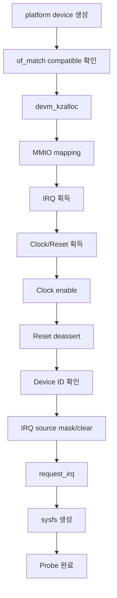
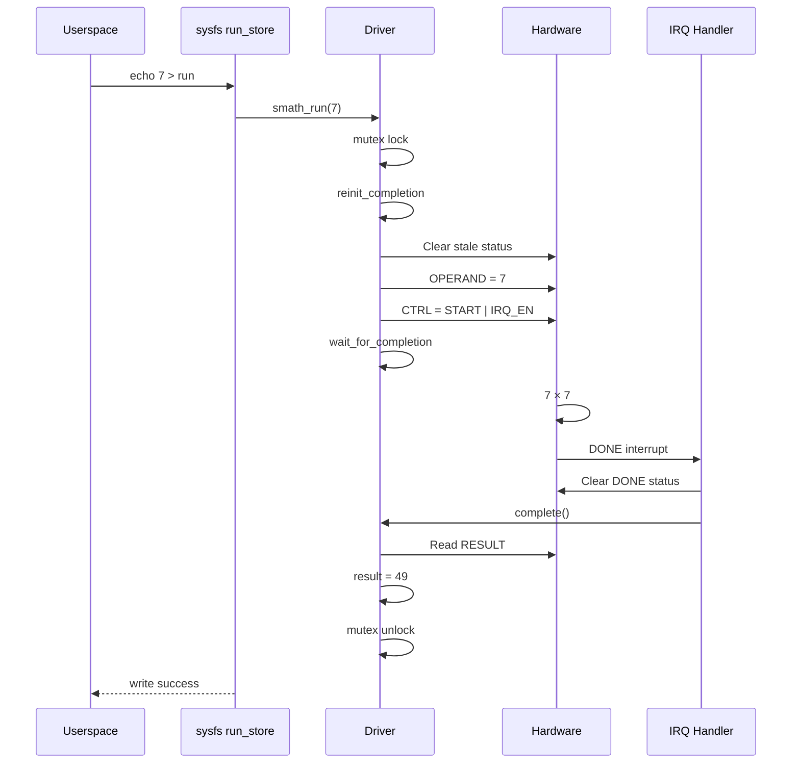

# Simple SoC Platform Device Driver 예제

> **목적:** 기술면접에서 간단한 SoC platform device driver를 설계하고 구현하는 과정을 설명하기 위한 학습 예제  
> **대상:** Linux Kernel / BSP / Device Driver Engineer  
> **범위:** Device Tree, platform driver, MMIO, IRQ, clock/reset, completion, sysfs, probe/remove  
> **난이도:** 기초~중급

---

## 1. 예제 하드웨어

`Simple Math Engine`이라는 작은 SoC IP를 가정한다.

이 장치는 32-bit 입력값을 받아 제곱한 결과를 반환한다.

```text
CPU
 |
 | MMIO
 v
+---------------------------+
| Simple Math Engine        |
|                           |
| OPERAND  <- input         |
| CTRL.START                |
|                           |
| RESULT   <- input * input |
| STATUS.DONE               |
| IRQ ----------------------|----> GIC
+---------------------------+
```

### 하드웨어 특성

- SoC 내부의 non-discoverable platform device
- MMIO 크기: 4 KiB
- IRQ 1개, level-high
- Core clock 1개
- Reset line 1개
- 한 번에 하나의 command만 처리
- 계산이 끝나면 interrupt 발생
- 결과: `operand × operand`

---

## 2. Register Map

| Offset | Name | Access | Description |
|---:|---|---|---|
| `0x00` | `ID` | RO | Device ID, `0x534D4154` |
| `0x04` | `CTRL` | RW | Start와 IRQ enable |
| `0x08` | `STATUS` | RW1C | Busy, Done, Error |
| `0x0C` | `OPERAND` | RW | 32-bit input |
| `0x10` | `RESULT` | RO | 계산 결과 |

### CTRL Register

| Bit | Name | Description |
|---:|---|---|
| 0 | `START` | 계산 시작 |
| 1 | `IRQ_EN` | 완료 interrupt enable |

### STATUS Register

| Bit | Name | Description |
|---:|---|---|
| 0 | `BUSY` | 계산 진행 중 |
| 1 | `DONE` | 계산 완료, W1C |
| 2 | `ERROR` | 오류 발생, W1C |

`DONE`과 `ERROR`는 **Write One to Clear** 방식이다.

---

## 3. Driver 설계

이 예제는 다음 구조로 구현한다.

```text
User
 |
 | echo 7 > run
 | cat result
 v
sysfs
 |
 v
Simple Math Platform Driver
 |
 +-- MMIO register access
 +-- IRQ handler
 +-- clock/reset control
 +-- completion wait
 |
 v
Simple Math Hardware
```

### 주요 설계 결정

- Device Tree 기반 platform driver
- `devm_platform_ioremap_resource()`로 MMIO mapping
- `platform_get_irq()`로 IRQ 획득
- `devm_request_irq()`로 IRQ handler 등록
- `completion`으로 계산 완료 대기
- `mutex`로 동시에 하나의 요청만 허용
- sysfs는 면접용 단순 예제 인터페이스로 사용
- 실제 제품에서는 적합한 kernel subsystem 또는 정식 UAPI를 우선 검토

---

## 4. Device Tree

```dts
smath: math-engine@24000000 {
    compatible = "vendor,simple-math-v1";
    reg = <0x0 0x24000000 0x0 0x1000>;

    interrupts = <GIC_SPI 182 IRQ_TYPE_LEVEL_HIGH>;

    clocks = <&cmu CLK_SIMPLE_MATH>;
    clock-names = "core";

    resets = <&reset RESET_SIMPLE_MATH>;

    status = "okay";
};
```

### 주요 property

| Property | 의미 |
|---|---|
| `compatible` | Driver와 device matching |
| `reg` | MMIO physical address와 크기 |
| `interrupts` | GIC interrupt 정보 |
| `clocks` | IP가 사용하는 clock |
| `resets` | IP reset line |
| `status` | Device 사용 여부 |

---

## 5. Driver 전체 코드

파일명:

```text
simple-math.c
```

```c
// SPDX-License-Identifier: GPL-2.0
/*
 * Simple Math Engine platform driver
 *
 * This is a compact interview/study example.
 */

#include <linux/bitops.h>
#include <linux/clk.h>
#include <linux/completion.h>
#include <linux/device.h>
#include <linux/interrupt.h>
#include <linux/io.h>
#include <linux/iopoll.h>
#include <linux/kernel.h>
#include <linux/module.h>
#include <linux/mutex.h>
#include <linux/of.h>
#include <linux/platform_device.h>
#include <linux/reset.h>

/* Register offsets */
#define SMATH_REG_ID            0x00
#define SMATH_REG_CTRL          0x04
#define SMATH_REG_STATUS        0x08
#define SMATH_REG_OPERAND       0x0c
#define SMATH_REG_RESULT        0x10

/* CTRL register */
#define SMATH_CTRL_START        BIT(0)
#define SMATH_CTRL_IRQ_EN       BIT(1)

/* STATUS register */
#define SMATH_STATUS_BUSY       BIT(0)
#define SMATH_STATUS_DONE       BIT(1)
#define SMATH_STATUS_ERROR      BIT(2)

#define SMATH_STATUS_W1C_MASK   (SMATH_STATUS_DONE | \
                                 SMATH_STATUS_ERROR)

#define SMATH_DEVICE_ID         0x534d4154
#define SMATH_TIMEOUT_MS        100

struct smath_dev {
        struct device           *dev;
        void __iomem            *regs;
        int                     irq;

        struct clk              *core_clk;
        struct reset_control    *reset;

        /*
         * Serialize sysfs requests.
         * The hardware supports only one operation at a time.
         */
        struct mutex            op_lock;

        /*
         * Completed by the interrupt handler.
         */
        struct completion       done;

        u32                     last_result;
        int                     last_error;
};

/*
 * MMIO helper functions
 */
static inline u32 smath_read(struct smath_dev *sdev, u32 reg)
{
        return readl(sdev->regs + reg);
}

static inline void smath_write(struct smath_dev *sdev,
                               u32 reg, u32 value)
{
        writel(value, sdev->regs + reg);
}

/*
 * Disable command execution and interrupt generation.
 */
static void smath_hw_stop(struct smath_dev *sdev)
{
        smath_write(sdev, SMATH_REG_CTRL, 0);
}

/*
 * Clear stale DONE/ERROR status.
 *
 * STATUS is W1C, so write 1 only to the bits that should be cleared.
 */
static void smath_clear_status(struct smath_dev *sdev)
{
        smath_write(sdev, SMATH_REG_STATUS,
                    SMATH_STATUS_W1C_MASK);
}

/*
 * Interrupt handler
 */
static irqreturn_t smath_irq_handler(int irq, void *data)
{
        struct smath_dev *sdev = data;
        u32 status;

        status = smath_read(sdev, SMATH_REG_STATUS);

        /*
         * Important for a shared IRQ.
         * Return IRQ_NONE when this device has no pending source.
         */
        if (!(status & SMATH_STATUS_W1C_MASK))
                return IRQ_NONE;

        /*
         * Acknowledge the level-triggered interrupt source.
         */
        smath_write(sdev, SMATH_REG_STATUS,
                    status & SMATH_STATUS_W1C_MASK);

        if (status & SMATH_STATUS_ERROR)
                WRITE_ONCE(sdev->last_error, -EIO);
        else
                WRITE_ONCE(sdev->last_error, 0);

        complete(&sdev->done);

        return IRQ_HANDLED;
}

/*
 * Start one hardware operation and wait for completion.
 *
 * Called from process context, so mutex and sleeping wait are allowed.
 */
static int smath_run(struct smath_dev *sdev,
                     u32 operand, u32 *result)
{
        unsigned long timeout;
        u32 status;
        int ret;

        ret = mutex_lock_interruptible(&sdev->op_lock);
        if (ret)
                return ret;

        /*
         * completion objects must be reinitialized before reusing them.
         */
        reinit_completion(&sdev->done);
        WRITE_ONCE(sdev->last_error, 0);

        /*
         * Ensure the previous command has really finished.
         */
        status = smath_read(sdev, SMATH_REG_STATUS);
        if (status & SMATH_STATUS_BUSY) {
                ret = -EBUSY;
                goto out_unlock;
        }

        /*
         * Remove stale completion or error status before enabling IRQ.
         */
        smath_clear_status(sdev);

        /*
         * Program input and start the device.
         */
        smath_write(sdev, SMATH_REG_OPERAND, operand);
        smath_write(sdev, SMATH_REG_CTRL,
                    SMATH_CTRL_IRQ_EN | SMATH_CTRL_START);

        timeout = wait_for_completion_interruptible_timeout(
                        &sdev->done,
                        msecs_to_jiffies(SMATH_TIMEOUT_MS));

        if (timeout == 0) {
                /*
                 * Hardware did not complete in time.
                 * Stop the device and return a deterministic error.
                 */
                smath_hw_stop(sdev);
                ret = -ETIMEDOUT;
                goto out_unlock;
        }

        if ((long)timeout < 0) {
                /*
                 * Interrupted by a signal.
                 */
                smath_hw_stop(sdev);
                ret = (int)(long)timeout;
                goto out_unlock;
        }

        ret = READ_ONCE(sdev->last_error);
        if (ret)
                goto out_stop;

        *result = smath_read(sdev, SMATH_REG_RESULT);
        sdev->last_result = *result;

        ret = 0;

out_stop:
        smath_hw_stop(sdev);

out_unlock:
        mutex_unlock(&sdev->op_lock);
        return ret;
}

/*
 * sysfs: write an operand and execute the operation.
 *
 * Example:
 *   echo 7 > run
 */
static ssize_t run_store(struct device *dev,
                         struct device_attribute *attr,
                         const char *buf, size_t count)
{
        struct smath_dev *sdev = dev_get_drvdata(dev);
        u32 operand;
        u32 result;
        int ret;

        ret = kstrtou32(buf, 0, &operand);
        if (ret)
                return ret;

        ret = smath_run(sdev, operand, &result);
        if (ret)
                return ret;

        dev_dbg(dev, "%u squared is %u\n", operand, result);

        return count;
}
static DEVICE_ATTR_WO(run);

/*
 * sysfs: return the result of the last successful operation.
 *
 * Example:
 *   cat result
 */
static ssize_t result_show(struct device *dev,
                           struct device_attribute *attr,
                           char *buf)
{
        struct smath_dev *sdev = dev_get_drvdata(dev);

        return sysfs_emit(buf, "%u\n",
                          READ_ONCE(sdev->last_result));
}
static DEVICE_ATTR_RO(result);

static struct attribute *smath_attrs[] = {
        &dev_attr_run.attr,
        &dev_attr_result.attr,
        NULL,
};

static const struct attribute_group smath_attr_group = {
        .attrs = smath_attrs,
};

/*
 * Probe
 */
static int smath_probe(struct platform_device *pdev)
{
        struct device *dev = &pdev->dev;
        struct smath_dev *sdev;
        u32 id;
        int ret;

        sdev = devm_kzalloc(dev, sizeof(*sdev), GFP_KERNEL);
        if (!sdev)
                return -ENOMEM;

        sdev->dev = dev;
        platform_set_drvdata(pdev, sdev);

        /*
         * Obtain and map the first MMIO resource.
         */
        sdev->regs = devm_platform_ioremap_resource(pdev, 0);
        if (IS_ERR(sdev->regs))
                return PTR_ERR(sdev->regs);

        /*
         * Obtain the first IRQ resource.
         */
        sdev->irq = platform_get_irq(pdev, 0);
        if (sdev->irq < 0)
                return sdev->irq;

        /*
         * Obtain clock and reset controls.
         */
        sdev->core_clk = devm_clk_get(dev, "core");
        if (IS_ERR(sdev->core_clk))
                return dev_err_probe(dev,
                                     PTR_ERR(sdev->core_clk),
                                     "failed to get core clock\n");

        sdev->reset =
                devm_reset_control_get_exclusive(dev, NULL);
        if (IS_ERR(sdev->reset))
                return dev_err_probe(dev,
                                     PTR_ERR(sdev->reset),
                                     "failed to get reset\n");

        mutex_init(&sdev->op_lock);
        init_completion(&sdev->done);

        /*
         * Hardware power-up sequence:
         *   1. Enable clock
         *   2. Deassert reset
         */
        ret = clk_prepare_enable(sdev->core_clk);
        if (ret)
                return dev_err_probe(dev, ret,
                                     "failed to enable clock\n");

        ret = reset_control_deassert(sdev->reset);
        if (ret) {
                dev_err(dev, "failed to deassert reset: %d\n", ret);
                goto err_disable_clk;
        }

        /*
         * Confirm that MMIO access works and the expected IP is present.
         */
        id = smath_read(sdev, SMATH_REG_ID);
        if (id != SMATH_DEVICE_ID) {
                dev_err(dev, "unexpected device ID: %#x\n", id);
                ret = -ENODEV;
                goto err_assert_reset;
        }

        /*
         * Put hardware into a known state before enabling Linux IRQ.
         */
        smath_hw_stop(sdev);
        smath_clear_status(sdev);

        ret = devm_request_irq(dev, sdev->irq,
                               smath_irq_handler,
                               0, dev_name(dev), sdev);
        if (ret) {
                dev_err(dev, "failed to request IRQ: %d\n", ret);
                goto err_assert_reset;
        }

        /*
         * Create:
         *   /sys/bus/platform/devices/<device>/run
         *   /sys/bus/platform/devices/<device>/result
         */
        ret = sysfs_create_group(&dev->kobj, &smath_attr_group);
        if (ret) {
                dev_err(dev, "failed to create sysfs files: %d\n",
                        ret);
                goto err_assert_reset;
        }

        dev_info(dev, "Simple Math Engine initialized\n");

        return 0;

err_assert_reset:
        reset_control_assert(sdev->reset);

err_disable_clk:
        clk_disable_unprepare(sdev->core_clk);

        return ret;
}

/*
 * Remove
 *
 * Note:
 * Recent kernels use a void remove callback for platform drivers.
 * Older kernels may require an int return type.
 */
static void smath_remove(struct platform_device *pdev)
{
        struct smath_dev *sdev = platform_get_drvdata(pdev);

        /*
         * Prevent new sysfs operations first.
         */
        sysfs_remove_group(&pdev->dev.kobj, &smath_attr_group);

        /*
         * Stop interrupt generation at the hardware source,
         * then wait for an already-running IRQ handler.
         */
        smath_hw_stop(sdev);
        synchronize_irq(sdev->irq);

        reset_control_assert(sdev->reset);
        clk_disable_unprepare(sdev->core_clk);
}

static const struct of_device_id smath_of_match[] = {
        {
                .compatible = "vendor,simple-math-v1",
        },
        { }
};
MODULE_DEVICE_TABLE(of, smath_of_match);

static struct platform_driver smath_driver = {
        .probe = smath_probe,
        .remove = smath_remove,
        .driver = {
                .name = "simple-math",
                .of_match_table = smath_of_match,
        },
};
module_platform_driver(smath_driver);

MODULE_DESCRIPTION("Simple SoC Math Engine platform driver");
MODULE_AUTHOR("Chanho Park");
MODULE_LICENSE("GPL");
```

---

## 6. Probe Flow



### Probe 핵심 설명

- `platform_set_drvdata()`로 `struct device`와 private data를 연결한다.
- `devm_platform_ioremap_resource()`는 resource validation과 mapping을 함께 수행한다.
- Clock을 켠 후 reset을 해제해야 register 접근이 가능한 하드웨어라고 가정했다.
- Device ID를 확인해 address map과 power/reset 상태를 검증한다.
- IRQ handler 등록 전에 stale interrupt status를 clear한다.
- Probe 실패 시 clock/reset을 원래 상태로 복구한다.

---

## 7. Operation Flow

사용자가 다음을 실행한다고 가정한다.

```bash
echo 7 > /sys/bus/platform/devices/24000000.math-engine/run
```

동작 순서:



결과 확인:

```bash
cat /sys/bus/platform/devices/24000000.math-engine/result
```

예상 출력:

```text
49
```

---

## 8. Build 예제

### Makefile

```make
obj-m += simple-math.o

KDIR ?= /lib/modules/$(shell uname -r)/build
PWD  := $(shell pwd)

all:
	$(MAKE) -C $(KDIR) M=$(PWD) modules

clean:
	$(MAKE) -C $(KDIR) M=$(PWD) clean
```

Build:

```bash
make
```

Module load:

```bash
sudo insmod simple-math.ko
```

확인:

```bash
dmesg | tail
```

> 실제 platform device가 Device Tree에 존재해야 `probe()`가 호출된다.

---

## 9. 테스트 절차

### 9.1 Device 확인

```bash
ls /sys/bus/platform/devices/
```

예:

```text
24000000.math-engine
```

### 9.2 Sysfs 확인

```bash
ls /sys/bus/platform/devices/24000000.math-engine/
```

다음 파일이 보여야 한다.

```text
run
result
```

### 9.3 정상 동작

```bash
echo 12 | sudo tee \
  /sys/bus/platform/devices/24000000.math-engine/run

cat /sys/bus/platform/devices/24000000.math-engine/result
```

예상 출력:

```text
144
```

### 9.4 잘못된 입력

```bash
echo hello | sudo tee \
  /sys/bus/platform/devices/24000000.math-engine/run
```

`kstrtou32()`가 실패하므로 오류가 반환된다.

---

## 10. 면접에서 설명할 핵심 포인트

### 10.1 왜 mutex를 사용하는가?

`run_store()`는 process context에서 실행되고 sleep할 수 있다.

하드웨어는 동시에 하나의 operation만 지원하므로 전체 operation을 mutex로 직렬화한다.

```text
Program A ----+
              +--> mutex --> Hardware
Program B ----+
```

Spinlock이 필요하지 않은 이유:

- IRQ handler는 `op_lock`을 사용하지 않는다.
- 요청 경로는 sleep 가능한 process context이다.
- operation 완료를 기다리는 동안 lock을 유지한다.

실제 multi-queue device라면 per-job state와 queue lock을 별도로 설계해야 한다.

---

### 10.2 왜 completion을 사용하는가?

Hardware event가 발생할 때까지 process를 sleep시키고 IRQ에서 wake-up하기 적합하다.

```text
Process context                  IRQ context

wait_for_completion()  <------  complete()
```

Polling loop보다 CPU를 낭비하지 않는다.

---

### 10.3 왜 `reinit_completion()`이 필요한가?

Completion object는 한 번 완료되면 done count가 남는다.

다음 command 전에 초기화하지 않으면 이전 command의 completion을 새 command가 잘못 소비할 수 있다.

---

### 10.4 왜 IRQ handler에서 W1C status를 clear하는가?

IRQ가 level-triggered라면 device가 interrupt source를 계속 assert하는 동안 GIC는 IRQ를 반복 전달할 수 있다.

따라서 handler에서 hardware source를 clear해야 interrupt가 deassert된다.

```c
smath_write(sdev, SMATH_REG_STATUS,
            status & SMATH_STATUS_W1C_MASK);
```

W1C register에 일반 read-modify-write를 사용하면 의도하지 않은 bit가 clear될 수 있다.

---

### 10.5 왜 IRQ handler 등록 전에 status를 clear하는가?

이전 boot stage 또는 reset 이전 상태에서 `DONE` bit가 남아 있을 수 있다.

IRQ handler를 등록하는 순간 stale interrupt가 전달되면:

- 아직 operation을 시작하지 않았는데 completion 발생
- 첫 요청이 잘못 완료됨
- level IRQ storm 발생

따라서 알려진 초기 상태를 만든 뒤 IRQ를 등록한다.

---

### 10.6 왜 `IRQ_NONE`을 반환하는가?

Shared interrupt일 수 있으므로 내 device의 pending bit가 없으면 `IRQ_NONE`을 반환해야 한다.

```c
if (!(status & SMATH_STATUS_W1C_MASK))
        return IRQ_NONE;
```

---

### 10.7 Timeout이 필요한 이유

Hardware 또는 interrupt path에 문제가 생겨도 process가 무한히 대기하면 안 된다.

Timeout 발생 시:

1. hardware command/IRQ 중지
2. `-ETIMEDOUT` 반환
3. 실제 제품에서는 register dump
4. 필요하면 reset/recovery
5. 반복 오류 통계 기록

---

## 11. Remove 순서

```text
1. sysfs 제거
2. Hardware interrupt source disable
3. synchronize_irq()
4. Reset assert
5. Clock disable
```

### 왜 sysfs를 먼저 제거하는가?

새로운 operation이 들어오는 것을 먼저 차단하기 위해서다.

### 왜 `synchronize_irq()`가 필요한가?

이미 실행 중인 IRQ handler가 끝날 때까지 기다린 후 clock/reset을 끄기 위해서다.

IRQ handler가 실행 중인데 clock을 먼저 끄면 MMIO access에서 bus fault가 날 수 있다.

---

## 12. 예상 면접 질문과 답변

### Q1. Platform driver가 필요한 이유는?

SoC 내부 IP는 PCI처럼 자동 탐색되지 않는 경우가 많다. Device Tree가 MMIO, IRQ, clock, reset 정보를 제공하고 platform driver가 이를 받아 Linux driver model에 연결한다.

---

### Q2. `ioremap()`과 `devm_platform_ioremap_resource()` 차이는?

`devm_platform_ioremap_resource()`는 platform resource 획득, 범위 검증, MMIO mapping, device-managed cleanup을 한 번에 처리한다.

---

### Q3. IRQ handler에서 mutex를 사용할 수 있는가?

일반 hard IRQ handler에서는 mutex를 사용할 수 없다. Mutex는 sleep할 수 있기 때문이다. 이 예제의 IRQ handler는 MMIO status 처리와 `complete()`만 수행한다.

---

### Q4. `volatile`을 사용하면 MMIO가 안전한가?

아니다. Kernel에서는 `readl()/writel()` 같은 MMIO accessor를 사용해야 한다. `volatile`은 architecture별 device access ordering과 barrier를 제공하지 않는다.

---

### Q5. 왜 clock을 먼저 enable하고 reset을 deassert하는가?

이 예제 하드웨어의 integration specification이 그 순서라고 가정한다. 실제 순서는 IP와 SoC specification을 따라야 한다.

---

### Q6. Device ID가 틀리면 무엇을 확인하는가?

- MMIO address
- Clock enable
- Reset deassert
- Power domain
- Security/firewall
- Register width/endianness
- 올바른 IP revision

---

### Q7. IRQ가 발생하지 않는다면?

1. `STATUS.DONE` 확인
2. `CTRL.IRQ_EN` 확인
3. Device IRQ output
4. GIC routing
5. Device Tree interrupt specifier
6. `/proc/interrupts`
7. Trigger type/polarity
8. Status clear 순서

---

### Q8. Interrupt storm이 발생한다면?

- Level source를 clear하지 않았는지
- W1C 처리 오류
- 잘못된 trigger type
- Error bit가 계속 assert되는지
- Interrupt enable/mask polarity
- Posted write로 clear가 지연되는지

---

### Q9. Timeout과 interrupt가 동시에 발생하면 race가 생기지 않는가?

가능하다. 이 단순 예제에서는 timeout 직후 hardware를 stop하지만, production driver에서는 다음이 필요하다.

- Command generation number
- State machine
- Late IRQ 무시
- Reset synchronization
- IRQ disable 또는 mask
- Error recovery worker

---

### Q10. 왜 sysfs를 사용했는가?

면접과 학습을 위해 최소한의 userspace test path를 제공하기 위해서다. 반복적인 command submission이나 binary buffer 전송에는 sysfs가 적합하지 않으며, 실제 제품에서는 subsystem API, character device, ioctl, read/write, dma-buf 등을 검토한다.

---

### Q11. Runtime PM을 추가한다면?

각 operation 전에:

```c
pm_runtime_resume_and_get(dev);
```

완료 후:

```c
pm_runtime_mark_last_busy(dev);
pm_runtime_put_autosuspend(dev);
```

Runtime suspend/resume callback에서 clock/reset과 hardware context를 관리한다.

---

### Q12. PREEMPT_RT에서는 무엇을 확인해야 하는가?

- IRQ가 threaded context로 동작할 가능성
- IRQ thread priority와 affinity
- mutex priority inheritance
- 긴 interrupt 처리 시간
- `complete()` 이후 scheduler latency
- clock/idle state 영향
- `rtla timerlat`, ftrace로 worst-case latency 검증

---

## 13. 이 예제를 확장하는 과제

### Level 1

- Runtime PM 추가
- Autosuspend 100 ms 적용
- `busy` sysfs attribute 추가
- Timeout 시 reset 수행
- `dev_dbg()`에 register snapshot 추가

### Level 2

- Polling mode와 IRQ mode 선택
- Multiple hardware revision 지원
- Device Tree binding YAML 작성
- KUnit으로 상태 처리 함수 검증
- debugfs register dump 추가

### Level 3

- Multiple outstanding commands
- DMA descriptor ring
- IOMMU/SMMU
- dma-buf import
- Asynchronous completion
- PREEMPT_RT latency 측정
- QEMU/QBox device model 구현

---

## 14. Whiteboard 답변 템플릿

```text
Userspace
  |
  | sysfs / subsystem API
  v
+---------------------------+
| Platform Driver           |
|                           |
| mutex                     |
| completion                |
| MMIO helpers              |
| IRQ handler               |
+-------------+-------------+
              |
       MMIO + IRQ
              |
+-------------v-------------+
| Simple Math Engine        |
| ID / CTRL / STATUS        |
| OPERAND / RESULT          |
+---------------------------+
```

옆에는 다음을 적는다.

```text
Probe:
MMIO -> IRQ -> CLK/RST -> ID -> IRQ -> Interface

Operation:
Lock -> Clear -> Program -> Start -> Wait -> Result

Remove:
Interface off -> IRQ off -> sync IRQ -> reset -> clock off

Failure:
Invalid input / Busy / Timeout / Error IRQ
```

---

## 15. 3분 모범 답변

> “이 장치는 Device Tree로 기술되는 단순한 SoC platform device라고 가정하겠습니다. Driver의 probe에서는 MMIO와 IRQ를 획득하고 clock을 enable한 뒤 reset을 deassert합니다. Device ID를 읽어 MMIO와 power sequence가 정상인지 확인하고, stale status와 interrupt source를 정리한 후 IRQ handler를 등록합니다.
>
> 하드웨어가 한 번에 하나의 요청만 지원하므로 process context의 요청은 mutex로 직렬화합니다. Operand register에 값을 기록하고 START와 IRQ enable을 설정한 뒤 completion을 기다립니다. 계산이 끝나면 level-triggered IRQ handler가 status를 읽고 W1C 방식으로 source를 clear한 후 `complete()`를 호출합니다. 요청 context는 결과 register를 읽고 사용자에게 반환합니다.
>
> Timeout을 둬 hardware 또는 IRQ 장애 시 무한 대기를 방지합니다. Remove에서는 먼저 사용자 인터페이스를 제거하고 hardware IRQ를 disable한 다음 `synchronize_irq()` 후 reset을 assert하고 clock을 끕니다.
>
> 이 예제는 단순화를 위해 sysfs를 사용하지만 실제 제품에서는 장치 성격에 맞는 kernel subsystem과 UAPI를 먼저 선택하고, 필요하면 runtime PM, reset recovery, revision handling과 pre-silicon fault injection을 추가하겠습니다.”

---

## 16. 코드 리뷰 체크리스트

- [ ] MMIO resource error 처리
- [ ] Clock/reset enable 순서
- [ ] Device ID 검증
- [ ] IRQ 등록 전 stale status clear
- [ ] W1C register 처리
- [ ] IRQ handler에서 sleeping operation 없음
- [ ] Completion 재초기화
- [ ] Timeout 처리
- [ ] Sysfs 제거 후 IRQ synchronization
- [ ] Probe 실패 시 clock/reset cleanup
- [ ] Shared IRQ 시 `IRQ_NONE`
- [ ] Concurrent operation 직렬화
- [ ] Runtime PM 확장 가능성
- [ ] Late IRQ와 timeout race 인지
- [ ] 실제 제품 UAPI와 sysfs의 차이 설명

---

## 17. 공식 참고 자료

- [Platform Devices and Drivers](https://docs.kernel.org/driver-api/driver-model/platform.html)
- [Bus-Independent Device Accesses](https://docs.kernel.org/driver-api/device-io.html)
- [Linux Generic IRQ Handling](https://docs.kernel.org/core-api/genericirq.html)
- [Driver Basics](https://docs.kernel.org/driver-api/basics.html)
- [Common Clock Framework](https://docs.kernel.org/driver-api/clk.html)
- [Reset Controller API](https://docs.kernel.org/driver-api/reset.html)
- [Runtime Power Management](https://docs.kernel.org/power/runtime_pm.html)
- [Device Tree Bindings](https://docs.kernel.org/devicetree/bindings/writing-schema.html)

---

## 핵심 요약

```text
Simple Platform Driver
  = Device Tree matching
  + MMIO resource
  + IRQ
  + Clock/Reset
  + Safe concurrency
  + Timeout
  + Correct cleanup
```

기술면접에서는 코드의 양보다 다음을 명확히 설명하는 것이 중요하다.

1. Hardware resource를 어떤 순서로 초기화하는가?
2. IRQ와 process context를 어떻게 연결하는가?
3. 공유 상태를 어떻게 보호하는가?
4. Timeout과 error를 어떻게 처리하는가?
5. Remove 시 hardware access를 어떻게 안전하게 끝내는가?
