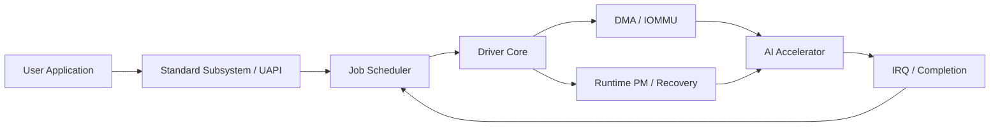
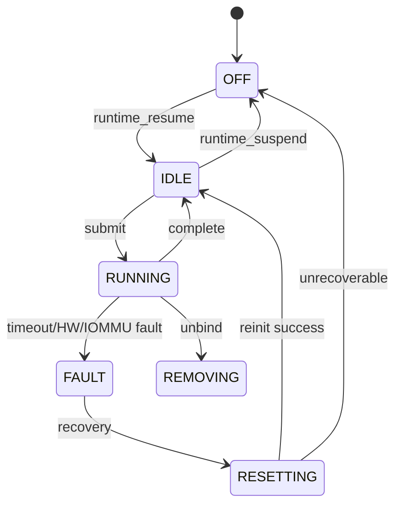

# SoC Device Driver 설계·구현 기술면접 준비

> **대상:** Senior Linux Kernel / SoC System Software Engineer  
> **목표:** 처음 보는 SoC IP의 Linux device driver를 구조적으로 설계하고, 핵심 코드·동시성·DMA·PM·복구·검증까지 설명하기  
> **개인화 초점:** ARM64/RISC-V, Linux Kernel/BSP, MMIO/IRQ/DMA, clock/reset, UFS/eMMC, PREEMPT_RT, QEMU/QBox/SystemC, ZeBu

---

## 1. 면접에서 바로 사용할 답변 프레임워크

SoC device driver 설계 문제가 나오면 아래 순서로 답한다.

1. **하드웨어 계약 확인**
   - MMIO/register map, IRQ, DMA, clock/reset/power, IOMMU, coherency
   - 처리량, latency, real-time, error recovery, security 요구사항
2. **Linux subsystem 선택**
   - Camera → V4L2/media
   - Ethernet → netdev/NAPI
   - Storage → UFS/SCSI/block 또는 MMC
   - DMA controller → dmaengine
   - Clock/reset/GPIO → 각 kernel framework
   - 적절한 subsystem이 없을 때만 custom UAPI 검토
3. **Driver architecture 정의**
   - platform driver + Device Tree
   - control path와 data path 분리
   - queue, descriptor, IRQ, PM, recovery 구조
4. **Resource lifecycle 설계**
   - probe error path, remove/unbind, suspend/resume까지 대칭적으로 설계
5. **Concurrency와 execution context**
   - process context, hard IRQ, threaded IRQ, workqueue
   - mutex/spinlock/completion/wait queue의 역할 분리
6. **DMA와 memory ordering**
   - CPU VA, physical address, DMA/bus address 구분
   - coherent/streaming mapping과 DMA barrier
7. **Power와 error recovery**
   - runtime PM
   - timeout → quiesce → diagnostic → reset → reinitialize
8. **검증**
   - KUnit/kselftest, lockdep, sanitizers
   - QEMU/QBox/ZeBu pre-silicon
   - silicon performance, power, thermal, RT latency

### 30초 시작 문장

> “먼저 IP의 control path와 data path, register/interrupt/DMA 계약을 확인하겠습니다. 그다음 기존 Linux subsystem 중 어디에 연결해야 하는지 결정하고, platform driver와 Device Tree를 기반으로 probe/remove, IRQ, DMA, runtime PM, error recovery를 설계하겠습니다. 마지막으로 pre-silicon과 silicon 단계의 검증 전략까지 설명드리겠습니다.”

---

## 2. 문제를 받은 직후 확인할 질문

### Hardware

- MMIO 영역과 register width/endianness는?
- IRQ는 level/edge인가? shared인가?
- interrupt status/mask/clear semantics는?
- DMA는 descriptor ring인가, command FIFO인가?
- DMA address width는 32-bit/64-bit인가?
- cache coherent interconnect인가?
- IOMMU/SMMU 뒤에 연결되는가?
- clock, reset, regulator, power domain은?
- firmware와 kernel 중 누가 초기화를 소유하는가?
- hardware revision/capability register가 있는가?

### Software

- userspace API가 필요한가?
- 기존 kernel subsystem이 있는가?
- multi-client와 isolation이 필요한가?
- request ordering/cancellation/timeout 요구는?
- reset 후 request retry가 안전한가?
- virtualization 또는 secure buffer가 필요한가?

### Non-functional

- throughput과 latency 목표는?
- peak IRQ rate와 queue depth는?
- PREEMPT_RT 또는 bounded latency 요구는?
- suspend/autosuspend 요구는?
- pre-silicon에서 검증 가능한 범위는?
- upstream 대상인가, 제품 전용인가?

조건이 불명확하면 다음처럼 가정한다.

> “하나의 MMIO resource와 level-triggered IRQ, 64-bit DMA, SMMU 연결, command/completion ring, clock/reset/power-domain을 가진 SoC platform device로 가정하겠습니다.”

---

## 3. 대표 문제: SoC AI Accelerator Driver

### 가상 IP

- ARM64 SoC 내부 platform device
- 64 KiB MMIO
- level-triggered IRQ 1개
- command/completion ring
- 64-bit DMA + SMMUv3
- core/bus clocks, reset, power domain
- 최대 256 outstanding commands
- userspace에서 inference job 제출
- PREEMPT_RT 지원



### 설계 원칙

- **Control path:** capability, configuration, reset, power
- **Data path:** buffer mapping, descriptor, doorbell, completion
- **Fast path:** allocation과 lock hold time 최소화
- **Slow path:** reset, diagnostic, recovery
- **Policy와 mechanism 분리**
- **Revision-specific ops로 hardware 차이 격리**

---

## 4. Subsystem 선택

| Hardware | 우선 framework |
|---|---|
| CSI/camera | V4L2, Media Controller, videobuf2 |
| Ethernet | netdev, phylink, NAPI, ethtool |
| UFS | UFS host controller + SCSI |
| eMMC/SD | MMC |
| PCIe host | PCI host bridge / DesignWare PCIe |
| DMA controller | dmaengine provider |
| Clock/reset/GPIO | CCF, reset framework, gpiolib |
| Display | DRM/KMS |
| Compute accelerator | accelerator/DRM 계열 execution model 검토 |

좋은 답변:

> “기존 subsystem을 사용하면 공통 buffer model, PM, test tool과 stable UAPI를 재사용할 수 있습니다. custom character driver와 ioctl은 적합한 framework가 없을 때만 선택하겠습니다.”

피해야 할 답변:

- `/dev/mydev`를 만들고 모든 register를 ioctl로 노출
- userspace에 MMIO register 직접 mmap
- vendor HAL 구조를 kernel에 그대로 복제

---

## 5. Device Tree와 Platform Driver

### DTS 예시

```dts
xai: accelerator@24000000 {
    compatible = "vendor,xai-100";
    reg = <0x0 0x24000000 0x0 0x10000>;
    interrupts = <GIC_SPI 182 IRQ_TYPE_LEVEL_HIGH>;

    clocks = <&cmu CLK_XAI_CORE>,
             <&cmu CLK_XAI_BUS>;
    clock-names = "core", "bus";

    resets = <&reset RESET_XAI>;
    power-domains = <&pd_xai>;
    iommus = <&smmu 0x480>;

    status = "okay";
};
```

### Binding 원칙

- DT는 **hardware description**이며 Linux policy를 넣지 않는다.
- `compatible`, `reg`, `interrupts`, `clocks`, `resets`, `power-domains`, `iommus`를 명확히 정의한다.
- `dma-coherent`는 실제 하드웨어가 coherent할 때만 사용한다.
- revision 차이는 compatible 또는 capability register로 관리한다.
- binding은 YAML/json-schema로 검증한다.

---

## 6. Driver 데이터 구조

```c
enum xai_state {
        XAI_OFF,
        XAI_IDLE,
        XAI_RUNNING,
        XAI_FAULT,
        XAI_RESETTING,
        XAI_REMOVING,
};

struct xai_dev {
        struct device           *dev;
        void __iomem            *regs;
        int                     irq;

        struct clk_bulk_data    clks[2];
        struct reset_control    *rst;

        /* Slow path: PM, reset, state transition */
        struct mutex            state_lock;
        enum xai_state          state;

        /* IRQ-visible short critical section */
        spinlock_t              queue_lock;

        struct work_struct      recovery_work;
        wait_queue_head_t       completion_wq;

        void                    *cmd_ring_cpu;
        dma_addr_t              cmd_ring_dma;
        size_t                  cmd_ring_size;

        void                    *cmp_ring_cpu;
        dma_addr_t              cmp_ring_dma;
        size_t                  cmp_ring_size;

        u32                     submit_head;
        u32                     complete_tail;

        bool                    removing;
};
```

### Lock 선택

- `mutex`: reset, PM, open/close, 긴 state transition
- `spinlock_t`: submit index와 completion index처럼 IRQ와 공유하는 짧은 상태
- `completion/waitqueue`: event 대기
- `refcount/kref`: object lifetime
- `dma_wmb()/dma_rmb()`: CPU와 device 사이 descriptor ownership ordering

`atomic_t`는 단일 counter/flag에는 유용하지만 여러 field의 복합 invariant를 보호하지 못한다.

---

## 7. Probe 설계

### 권장 순서

1. private data 할당
2. MMIO mapping
3. IRQ number 획득
4. clock/reset/regulator 획득
5. DMA mask 설정
6. lock/work/waitqueue 초기화
7. device IRQ mask 및 stale status clear
8. IRQ handler 등록
9. runtime PM enable
10. power-on 후 ID/capability 확인
11. ring 할당 및 hardware init
12. subsystem/UAPI 등록
13. autosuspend

IRQ를 등록하는 순간 handler가 실행될 수 있으므로 software state와 hardware interrupt mask를 먼저 준비한다.

```c
static int xai_probe(struct platform_device *pdev)
{
        struct device *dev = &pdev->dev;
        struct xai_dev *xdev;
        int ret;

        xdev = devm_kzalloc(dev, sizeof(*xdev), GFP_KERNEL);
        if (!xdev)
                return -ENOMEM;

        xdev->dev = dev;
        platform_set_drvdata(pdev, xdev);

        xdev->regs = devm_platform_ioremap_resource(pdev, 0);
        if (IS_ERR(xdev->regs))
                return PTR_ERR(xdev->regs);

        xdev->irq = platform_get_irq(pdev, 0);
        if (xdev->irq < 0)
                return xdev->irq;

        xdev->clks[0].id = "core";
        xdev->clks[1].id = "bus";
        ret = devm_clk_bulk_get(dev, ARRAY_SIZE(xdev->clks), xdev->clks);
        if (ret)
                return dev_err_probe(dev, ret, "failed to get clocks\n");

        xdev->rst = devm_reset_control_get_exclusive(dev, NULL);
        if (IS_ERR(xdev->rst))
                return dev_err_probe(dev, PTR_ERR(xdev->rst),
                                     "failed to get reset\n");

        ret = dma_set_mask_and_coherent(dev, DMA_BIT_MASK(64));
        if (ret) {
                ret = dma_set_mask_and_coherent(dev, DMA_BIT_MASK(32));
                if (ret)
                        return dev_err_probe(dev, ret,
                                             "no suitable DMA mask\n");
        }

        mutex_init(&xdev->state_lock);
        spin_lock_init(&xdev->queue_lock);
        init_waitqueue_head(&xdev->completion_wq);
        INIT_WORK(&xdev->recovery_work, xai_recovery_work);

        xai_mask_all_irqs(xdev);
        xai_clear_stale_irqs(xdev);

        ret = devm_request_threaded_irq(dev, xdev->irq,
                                        xai_irq_top, xai_irq_thread,
                                        IRQF_ONESHOT,
                                        dev_name(dev), xdev);
        if (ret)
                return dev_err_probe(dev, ret, "failed to request IRQ\n");

        pm_runtime_set_autosuspend_delay(dev, 100);
        pm_runtime_use_autosuspend(dev);
        pm_runtime_enable(dev);

        ret = pm_runtime_resume_and_get(dev);
        if (ret < 0)
                goto err_pm;

        ret = xai_detect_and_initialize(xdev);
        if (ret)
                goto err_power;

        ret = xai_register_interface(xdev);
        if (ret)
                goto err_stop;

        pm_runtime_mark_last_busy(dev);
        pm_runtime_put_autosuspend(dev);
        return 0;

err_stop:
        xai_hw_stop(xdev);
err_power:
        pm_runtime_put_sync(dev);
err_pm:
        pm_runtime_disable(dev);
        return ret;
}
```

### `devm_*` 주의점

`devm_*`는 resource 해제를 단순화하지만 다음을 자동 해결하지 않는다.

- 신규 request 차단
- DMA 중지
- IRQ synchronize
- work/timer flush
- userspace file lifetime
- hardware quiesce 순서

---

## 8. Remove / Unbind

안전한 순서:

1. `removing = true`, 신규 open/submit 차단
2. userspace/subsystem interface unregister
3. device IRQ mask
4. `synchronize_irq()`
5. `cancel_work_sync()` 및 timer flush
6. active DMA 중지
7. in-flight request를 `-ENODEV` 또는 `-EIO`로 종료
8. hardware idle/reset
9. runtime PM disable
10. ring과 non-devm resource 해제

```c
static void xai_remove(struct platform_device *pdev)
{
        struct xai_dev *xdev = platform_get_drvdata(pdev);

        mutex_lock(&xdev->state_lock);
        xdev->removing = true;
        xdev->state = XAI_REMOVING;
        mutex_unlock(&xdev->state_lock);

        xai_unregister_interface(xdev);
        xai_mask_all_irqs(xdev);
        synchronize_irq(xdev->irq);
        cancel_work_sync(&xdev->recovery_work);

        xai_stop_dma(xdev);
        xai_fail_all_jobs(xdev, -ENODEV);
        pm_runtime_disable(&pdev->dev);
        xai_free_rings(xdev);
}
```

---

## 9. MMIO와 Memory Ordering

### 기본 원칙

- physical address를 직접 dereference하지 않는다.
- `ioremap` 계열 후 `readl()/writel()` 사용
- W1C, read-to-clear register semantics 확인
- posted write와 read-back 필요 여부 확인
- `*_relaxed()`는 ordering을 명확히 증명할 수 있을 때만 사용

```c
static inline u32 xai_read(struct xai_dev *xdev, u32 reg)
{
        return readl(xdev->regs + reg);
}

static inline void xai_write(struct xai_dev *xdev, u32 reg, u32 val)
{
        writel(val, xdev->regs + reg);
}
```

### Descriptor publish

```c
desc->addr = dma_addr;
desc->size = len;
desc->owner = XAI_DEVICE_OWNED;

/* Descriptor must be visible before doorbell. */
dma_wmb();

writel(new_tail, xdev->regs + XAI_CMD_DOORBELL);
```

### Completion consume

```c
if (READ_ONCE(cmp->owner) != XAI_CPU_OWNED)
        return false;

/* Read fields after device ownership transfer. */
dma_rmb();

status = cmp->status;
```

핵심 문장:

> “CPU lock은 CPU thread 간 mutual exclusion을 해결하지만 device와 CPU 사이의 DMA visibility와 ownership ordering을 대신하지 않습니다.”

---

## 10. Interrupt 설계

```c
static irqreturn_t xai_irq_top(int irq, void *data)
{
        struct xai_dev *xdev = data;
        u32 status;

        status = xai_read_irq_status(xdev);
        if (!status)
                return IRQ_NONE;

        xai_ack_irq(xdev, status);
        xai_mask_active_sources(xdev, status);
        return IRQ_WAKE_THREAD;
}

static irqreturn_t xai_irq_thread(int irq, void *data)
{
        struct xai_dev *xdev = data;

        xai_drain_completion_ring(xdev);
        wake_up_all(&xdev->completion_wq);

        if (xai_fault_pending(xdev))
                schedule_work(&xdev->recovery_work);

        xai_unmask_irqs(xdev);
        return IRQ_HANDLED;
}
```

### Top half

- source 확인
- status snapshot
- 최소 ack/mask
- threaded handler 또는 subsystem poll을 wake
- sleeping operation, allocation, reset, 긴 loop 금지

### Level-triggered IRQ storm 점검

1. status clear 방식
2. W1C 값
3. device source mask
4. GIC trigger type와 DT
5. posted clear write/read-back
6. shared IRQ ownership
7. error bit가 계속 asserted되는지

### High-rate IRQ

- completion batching
- 한 IRQ에서 여러 descriptor 처리
- interrupt moderation/coalescing
- network는 NAPI
- general accelerator는 bounded drain budget 고려

---

## 11. PREEMPT_RT 관점

- 대부분의 interrupt가 threaded context로 이동
- IRQ thread priority와 affinity가 latency에 영향
- 일반 `spinlock_t`의 semantics가 RT 환경에서 달라질 수 있음
- `raw_spinlock_t`는 진짜 raw context에만 제한
- sleeping operation은 threaded IRQ/workqueue에서 수행
- 긴 IRQ-off/preempt-off 구간 최소화
- priority inversion과 lock hold time 분석
- 평균보다 p99.9/max latency 확인

ZeBu/QEMU/QBox에서는 다음을 검증한다.

- PREEMPT_RT functional boot
- threaded IRQ behavior
- driver context/locking compatibility
- firmware-kernel interface
- timeout/recovery flow

실제 silicon에서 재검증할 것:

- absolute worst-case latency
- cache/interconnect contention
- DVFS/idle-state 영향
- power/thermal throttling
- IRQ affinity와 scheduler tuning

---

## 12. DMA와 IOMMU

### 주소 구분

| 주소 | 의미 |
|---|---|
| CPU virtual | kernel이 dereference |
| CPU physical | CPU physical address |
| DMA/bus | device가 transaction에 사용 |

IOMMU가 있으면 DMA address와 physical address는 다를 수 있으므로 `virt_to_phys()` 결과를 device에 직접 넣지 않는다.

### Coherent mapping

장기간 공유하는 descriptor/ring에 적합하다.

```c
xdev->cmd_ring_cpu =
        dma_alloc_coherent(xdev->dev, xdev->cmd_ring_size,
                           &xdev->cmd_ring_dma, GFP_KERNEL);
```

### Streaming mapping

payload buffer처럼 전송 기간에만 mapping한다.

```c
dma_addr_t dma;

dma = dma_map_single(xdev->dev, buf, len, DMA_TO_DEVICE);
if (dma_mapping_error(xdev->dev, dma))
        return -EIO;

xai_submit_dma(xdev, dma, len);

/* Device access must be finished first. */
dma_unmap_single(xdev->dev, dma, len, DMA_TO_DEVICE);
```

### Scatter-gather 체크

- mapping 전 entry 수와 mapping 후 DMA segment 수는 다를 수 있음
- maximum segment count/length
- alignment
- IOVA aperture
- mapping lifetime
- partial failure cleanup
- process exit와 pinned page lifetime

### IOMMU fault 분석

1. faulting IOVA
2. stream ID/substream ID
3. 해당 job/buffer mapping
4. size/direction
5. use-after-unmap
6. address truncation
7. descriptor corruption/endianness
8. reset 후 stale DMA

좋은 답변:

> “일반 function driver는 IOMMU page table을 직접 다루기보다 DMA API를 사용합니다. Fault가 나면 IOVA를 job과 buffer lifetime에 연결해 size, direction, unmap race, address truncation을 확인하겠습니다.”

---

## 13. User API와 Buffer

기존 subsystem의 UAPI를 우선 사용한다. Custom ioctl이 필요하면:

- fixed-width type
- `size`, `flags`, reserved field
- overflow와 pointer 검증
- compat 고려
- kernel/physical address 노출 금지
- hardware register를 stable ABI로 노출하지 않음

```c
struct xai_submit {
        __u32 size;
        __u32 flags;
        __u64 command_ptr;
        __u64 command_size;
        __u64 timeout_ns;
        __u64 user_cookie;
        __u64 reserved[4];
};
```

Register mmap을 피하는 이유:

- process isolation 붕괴
- arbitrary DMA programming
- PM/reset/recovery 우회
- multi-client scheduling 불가
- ABI가 hardware revision에 종속

성능이 필요하면 validated command queue와 shared buffer를 제공하고 privileged register programming은 kernel이 소유한다.

---

## 14. Job State Machine



### Submit sequence

1. request validation
2. device reference
3. `pm_runtime_resume_and_get()`
4. buffer mapping
5. descriptor reserve/write
6. `dma_wmb()`
7. doorbell
8. completion/fence
9. `dma_rmb()`
10. unmap
11. PM autosuspend

### Timeout

- late completion race 확인
- register/ring diagnostic snapshot
- 신규 submit 차단
- IRQ mask 및 DMA quiesce
- reset
- in-flight job fail
- queue/context reinit
- 반복 fault 시 device offline 또는 rate limiting

---

## 15. Runtime PM과 Clock/Reset

일반적인 enable 순서:

1. power domain
2. regulator
3. bus clock
4. core clock
5. reset deassert
6. register access 확인
7. hardware init
8. IRQ enable

실제 순서는 hardware specification을 따른다.

```c
static int xai_runtime_resume(struct device *dev)
{
        struct xai_dev *xdev = dev_get_drvdata(dev);
        int ret;

        ret = clk_bulk_prepare_enable(ARRAY_SIZE(xdev->clks), xdev->clks);
        if (ret)
                return ret;

        ret = reset_control_deassert(xdev->rst);
        if (ret)
                goto err_clks;

        ret = xai_hw_init(xdev);
        if (ret)
                goto err_reset;

        xai_unmask_irqs(xdev);
        return 0;

err_reset:
        reset_control_assert(xdev->rst);
err_clks:
        clk_bulk_disable_unprepare(ARRAY_SIZE(xdev->clks), xdev->clks);
        return ret;
}

static int xai_runtime_suspend(struct device *dev)
{
        struct xai_dev *xdev = dev_get_drvdata(dev);

        if (xai_has_active_jobs(xdev))
                return -EBUSY;

        xai_mask_all_irqs(xdev);
        xai_hw_stop(xdev);
        reset_control_assert(xdev->rst);
        clk_bulk_disable_unprepare(ARRAY_SIZE(xdev->clks), xdev->clks);
        return 0;
}
```

흔한 PM bug:

- suspended 상태 register access
- autosuspend와 submit race
- clock off 후 IRQ/register access
- active DMA 상태 suspend
- reset 후 queue base 미복원
- PM usage count leak

---

## 16. Error Recovery

오류를 request, job, device, system error로 구분한다.

| 오류 | 처리 |
|---|---|
| invalid request | 해당 request `-EINVAL` |
| queue full | wait/retry 또는 `-EBUSY` |
| accelerator job exception | job fail, 필요 시 context reset |
| watchdog/fatal bus | device reset |
| IOMMU fault | DMA 중지, mapping 분석, reset |
| 반복 reset 실패 | device offline |

Recovery 순서:

1. state lock
2. 신규 submit 차단
3. IRQ mask + `synchronize_irq()`
4. diagnostic snapshot
5. in-flight jobs 종료
6. hardware reset
7. ring/context reinit
8. IRQ unmask
9. submit 재개

진단 정보:

- IP revision/capability
- IRQ status/mask
- command/completion head/tail
- fault address/code
- clock/reset/power state
- last job metadata
- recovery count

---

## 17. Pre-silicon 검증

| 환경 | 주요 목적 | 한계 |
|---|---|---|
| KUnit/static | state, parser, ring logic | HW timing 없음 |
| QEMU | boot/probe/MMIO/IRQ | cycle accuracy 제한 |
| QBox/SystemC | HW/SW contract와 integration | model completeness 의존 |
| ZeBu | RTL에 가까운 boot/register/IRQ | 실제 PVT/latency와 차이 |
| Silicon | timing/coherency/power | debug 비용 증가 |

Virtual model에 요청할 기능:

- register reset value와 W1C semantics
- IRQ injection/storm
- DMA transfer
- IOMMU fault
- descriptor corruption
- completion delay/timeout
- clock/reset violation
- revision/capability variation
- transaction trace

면접 답변:

> “Pre-silicon에서는 probe, register protocol, IRQ, DMA descriptor flow, reset/error path를 앞당겨 검증합니다. Absolute timing, cache contention, thermal/power는 silicon에서 재검증하고, 동일 test scenario를 VP와 silicon에서 재사용하도록 설계합니다.”

---

## 18. Test Strategy

### KUnit

- ring wraparound
- descriptor validation
- queue full/empty
- state transition
- timeout calculation
- revision capability parser
- recovery policy

### kselftest/userspace

- open/close 반복
- invalid ioctl
- concurrent submit
- process kill
- timeout/cancel
- suspend/resume
- unbind/rebind
- ABI compatibility

### Kernel debug

- lockdep
- KASAN/KCSAN/UBSAN/KFENCE
- kmemleak
- DMA API debug
- IOMMU fault reporting
- dynamic debug
- tracepoints/ftrace
- irqsoff/preemptoff
- perf
- `rtla timerlat`, `rtla osnoise`

### Silicon

- throughput
- p50/p99/p99.9/max latency
- IRQ rate와 CPU usage
- memory bandwidth contention
- DVFS/thermal
- power cycle
- long-run stress

---

## 19. Debugging Playbook

### Probe가 defer됨

- supplier clock/reset/regulator/power-domain
- DT phandle/binding
- built-in/module 순서
- circular dependency
- `dev_err_probe()` errno

### MMIO가 `0xffffffff`

- power domain/clock/reset
- wrong address/resource index
- firewall/security
- bus error
- width/endianness

### IRQ 없음

1. device status
2. device mask
3. polarity/trigger
4. GIC routing
5. DT specifier
6. `/proc/interrupts`
7. affinity/CPU online
8. firmware ownership
9. clear sequence
10. IRQ tracepoint

### IRQ storm

- level source 미clear
- W1C 오용
- mask polarity 반대
- shared IRQ 오판
- error bit 지속
- posted clear write

### DMA timeout

- descriptor/doorbell ordering
- `dma_wmb()`
- DMA mask/address truncation
- IOMMU mapping
- ring wrap
- descriptor endian
- cache sync
- clock/reset/power

### Data corruption

- coherent/streaming 혼용
- map direction
- early unmap
- ownership race
- SG length/alignment
- userspace in-flight buffer 변경
- reset 후 stale DMA

### PREEMPT_RT latency spike

- 긴 IRQ thread
- raw spinlock hold
- IRQ/preempt-off section
- allocation/page fault
- priority inversion
- IRQ affinity
- CPU idle/frequency
- memory bandwidth
- printk/console

---

## 20. 예상 질문과 모범 답변

### Q1. 어디서 설계를 시작합니까?

HW/SW contract부터 정의합니다. MMIO, IRQ, DMA, clock/reset/power, coherency, IOMMU와 performance requirement를 확인한 뒤 subsystem, lifecycle, concurrency, PM, recovery, test 순으로 설계합니다.

### Q2. 왜 platform driver입니까?

SoC IP는 PCI처럼 self-discoverable하지 않은 경우가 많습니다. Platform driver는 Device Tree가 제공하는 MMIO, IRQ, clock/reset, power domain을 Linux driver model에 연결하는 표준 방식입니다.

### Q3. `devm_*`면 remove가 필요 없습니까?

아닙니다. Resource 해제는 단순화하지만 신규 request 차단, IRQ synchronization, work flush, DMA stop, user lifetime, hardware quiesce는 driver가 처리해야 합니다.

### Q4. IRQ 등록 전 왜 mask/clear합니까?

IRQ request 성공 직후 handler가 실행될 수 있습니다. Software state가 준비되지 않았거나 stale status가 남아 있으면 crash 또는 storm이 발생합니다.

### Q5. Hard IRQ와 threaded IRQ를 어떻게 나눕니까?

Top half는 source 확인, status snapshot, ack/mask만 합니다. Completion 처리, sleeping operation, recovery는 threaded handler 또는 workqueue에서 수행합니다.

### Q6. PREEMPT_RT 차이는?

IRQ가 대부분 thread로 실행되고 일반 spinlock의 동작도 RT에 맞게 달라집니다. IRQ thread priority/affinity, priority inversion, raw lock 최소화, worst-case latency를 고려합니다.

### Q7. Coherent DMA면 barrier가 불필요합니까?

아닙니다. Coherency와 protocol ordering은 별개입니다. Descriptor publish와 doorbell, completion ownership과 field read 사이에 DMA barrier가 필요할 수 있습니다.

### Q8. 왜 `virt_to_phys()`를 쓰면 안 됩니까?

Device는 DMA/bus address를 사용하며 IOMMU가 있으면 physical address와 다릅니다. DMA API의 mapping 결과만 device에 전달해야 합니다.

### Q9. `dma_alloc_coherent`와 `dma_map_single` 차이는?

Coherent allocation은 장기 공유하는 descriptor/ring에 적합하고 streaming mapping은 payload를 전송 기간에만 mapping합니다.

### Q10. IOMMU fault 분석은?

IOVA와 stream ID를 job/buffer mapping에 연결해 size, direction, lifetime, unmap race, address truncation, stale descriptor를 확인합니다.

### Q11. Timeout 시 무조건 retry합니까?

아닙니다. Idempotency와 side effect를 확인합니다. Completion race를 배제하고 diagnostic 후 reset하며, job은 명확한 오류로 종료합니다.

### Q12. Register mmap을 왜 피합니까?

Isolation, PM, recovery, multi-client scheduling을 우회하고 ABI가 hardware revision에 고정되며 arbitrary DMA programming 위험이 있습니다.

### Q13. Device Tree에는 무엇을 넣습니까?

Hardware topology/resource만 넣습니다. Compatible, reg, IRQ, clock/reset, power domain, IOMMU를 기술하고 software policy는 넣지 않습니다.

### Q14. Lock은 어떻게 선택합니까?

Data 이름이 아니라 access context와 critical-section 길이로 결정합니다. Control path는 mutex, IRQ 공유 짧은 상태는 spinlock, event는 completion/waitqueue를 씁니다.

### Q15. Runtime PM reference는 어디서 잡습니까?

Register/DMA access 전에 `pm_runtime_resume_and_get()`으로 잡고 request 완료 후 last-busy와 autosuspend put을 합니다. Usage count와 job lifetime을 대응시킵니다.

### Q16. Error recovery와 remove가 동시에 실행되면?

공통 state lock과 REMOVING state로 serialize합니다. 신규 work scheduling을 막고 `cancel_work_sync()`로 기존 recovery를 종료하되 lock inversion을 피합니다.

### Q17. Hardware revision은 어떻게 관리합니까?

Compatible match data, capability register, revision-specific ops로 관리합니다. Scattered revision 조건문과 DT workaround boolean을 피합니다.

### Q18. Driver 성능 분석은?

Submit validation, mapping, queue wait, hardware execute, IRQ/completion, unmap으로 latency를 분해합니다. ftrace/perf/tracepoint와 IRQ/CPU/memory bandwidth를 함께 봅니다.

### Q19. Virtual platform에서 무엇을 검증합니까?

Boot/probe, register protocol, IRQ, descriptor, reset/error path와 HW/SW contract입니다. Absolute latency, cache contention, power/thermal은 silicon에서 재검증합니다.

### Q20. Process가 job 중 종료되면?

File context와 job lifetime을 분리하고 신규 submit을 막습니다. Device access가 끝날 때까지 DMA mapping을 유지하고 completion/reset 후 안전하게 해제합니다.

---

## 21. 7분 모범 답변

> “이 IP는 SoC 내부 non-discoverable accelerator라고 가정해 Device Tree 기반 platform driver로 설계하겠습니다. 먼저 MMIO, IRQ clear semantics, DMA width/coherency, IOMMU stream ID, clock/reset/power sequence를 확인합니다.
>
> 사용자 API는 기존 accelerator 또는 DRM 계열 framework가 맞는지 먼저 검토하고, 적합하지 않을 때만 custom UAPI를 정의합니다. Driver 내부는 validation/scheduling control layer, descriptor/MMIO hardware layer, PM/recovery layer로 나눕니다.
>
> Probe에서는 MMIO, IRQ, clock/reset을 획득하고 DMA mask를 설정합니다. Software state를 초기화하고 device interrupt를 mask/clear한 뒤 threaded IRQ를 등록합니다. Runtime PM으로 power를 올려 hardware ID와 capability를 확인하고 coherent command/completion ring을 할당합니다.
>
> Payload는 DMA API로 mapping하며 IOMMU가 있으므로 physical address를 직접 사용하지 않습니다. Descriptor를 작성한 뒤 `dma_wmb()` 후 doorbell을 쓰고, completion에서는 ownership 확인 후 `dma_rmb()`로 결과를 읽습니다.
>
> IRQ top half는 source 확인과 ack/mask만 하고 threaded handler에서 completion을 처리합니다. PREEMPT_RT에서는 IRQ thread priority/affinity와 priority inversion을 점검합니다.
>
> Timeout이나 IOMMU fault가 나면 신규 submit을 막고 IRQ/DMA를 quiesce한 뒤 diagnostic을 남깁니다. Reset 후 ring/context를 재초기화하고 in-flight jobs는 오류로 종료합니다.
>
> 검증은 KUnit으로 state/ring, kselftest로 UAPI/race, QEMU/QBox/ZeBu로 IRQ/DMA/error injection을 수행합니다. Silicon에서는 throughput, tail latency, power/thermal, PREEMPT_RT maximum latency를 별도 검증하겠습니다.”

---

## 22. 본인 경력과 연결하는 문장

### BSP/Basic Drivers

> “Clock, GPIO, I2C, SPI, DMA, MMC/USB 같은 BSP를 bring-up하면서 개별 driver만 보지 않고 clock/reset/power/interrupt hierarchy를 함께 추적해 왔습니다.”

### UFS/eMMC

> “Storage timeout이 상위 layer에 보이더라도 root cause가 clock/PHY/reset, IRQ, DMA/IOMMU, coherency일 수 있어 layer별 milestone과 register snapshot으로 분석합니다.”

### PREEMPT_RT/ZeBu

> “ZeBu에서는 PREEMPT_RT functional bring-up과 IRQ threading, driver context/locking compatibility를 silicon 전에 검증했고, absolute worst-case latency는 silicon에서 재검증해야 한다는 경계를 두었습니다.”

### QEMU/QBox

> “Virtual platform을 HW/SW contract의 executable specification처럼 활용해 boot/probe/IRQ/DMA/error path를 앞당기고, model limitation과 silicon validation item을 관리합니다.”

### Upstream

> “Local workaround보다 framework와 binding을 먼저 정리하고 binding, core driver, DT를 review 가능한 patch 단위로 나누는 데 익숙합니다.”

---

## 23. 3일 연습 계획

### Day 1

- 1~15장 학습
- AI accelerator 문제를 10분 whiteboard 설명
- probe/remove skeleton 손으로 작성
- IRQ/DMA/barrier 질문 10개 음성 답변

### Day 2

- IRQ 없음/storm, DMA timeout, IOMMU fault playbook 연습
- 실제 경험 3개를 다음 형식으로 정리
  - 현상
  - 초기 가설
  - trace/register evidence
  - root cause
  - fix
  - regression test
- PREEMPT_RT/ZeBu 답변 90초 연습

### Day 3

- 7분 driver design 발표
- 20분 꼬리 질문
- 15분 code review
- 10분 경력 사례
- 녹음 후 결론 우선, 90초 제한, 과장 여부 점검

---

## 24. 최종 체크리스트

### Design

- [ ] HW/SW contract 확인
- [ ] 기존 subsystem 검토
- [ ] control/data path 분리
- [ ] probe/remove/PM lifecycle
- [ ] state machine

### Concurrency

- [ ] execution context 구분
- [ ] lock 선택 근거
- [ ] DMA barrier와 CPU lock 구분
- [ ] timeout/late IRQ/remove race
- [ ] PREEMPT_RT 영향

### Hardware

- [ ] MMIO/W1C
- [ ] IRQ trigger/ack/mask
- [ ] DMA mask/coherency/IOMMU
- [ ] clock/reset/power
- [ ] revision/capability

### Quality

- [ ] stable UAPI
- [ ] runtime PM
- [ ] error recovery
- [ ] diagnostic/trace
- [ ] KUnit/kselftest/VP/silicon 검증
- [ ] upstream 가능한 구조

---

## 25. 공식 학습 자료

1. [Platform Devices and Drivers](https://docs.kernel.org/driver-api/driver-model/platform.html)
2. [Driver Model](https://docs.kernel.org/driver-api/driver-model/index.html)
3. [Bus-Independent Device Accesses](https://docs.kernel.org/driver-api/device-io.html)
4. [Linux Generic IRQ Handling](https://docs.kernel.org/core-api/genericirq.html)
5. [Dynamic DMA Mapping Guide](https://docs.kernel.org/core-api/dma-api-howto.html)
6. [DMA API](https://docs.kernel.org/core-api/dma-api.html)
7. [Linux Kernel Memory Barriers](https://docs.kernel.org/core-api/wrappers/memory-barriers.html)
8. [Runtime Power Management](https://docs.kernel.org/power/runtime_pm.html)
9. [Device Power Management Basics](https://docs.kernel.org/driver-api/pm/devices.html)
10. [Writing Devicetree Bindings](https://docs.kernel.org/devicetree/bindings/writing-schema.html)
11. [Devicetree Binding Guidelines](https://docs.kernel.org/devicetree/bindings/writing-bindings.html)
12. [How Realtime Kernels Differ](https://docs.kernel.org/core-api/real-time/differences.html)
13. [KUnit](https://docs.kernel.org/dev-tools/kunit/index.html)
14. [Kernel Testing Guide](https://docs.kernel.org/dev-tools/testing-overview.html)
15. [DMAengine Client Guide](https://docs.kernel.org/driver-api/dmaengine/client.html)
16. [dma-buf](https://docs.kernel.org/driver-api/dma-buf.html)
17. [Camera Sensor Driver Guide](https://docs.kernel.org/driver-api/media/camera-sensor.html)
