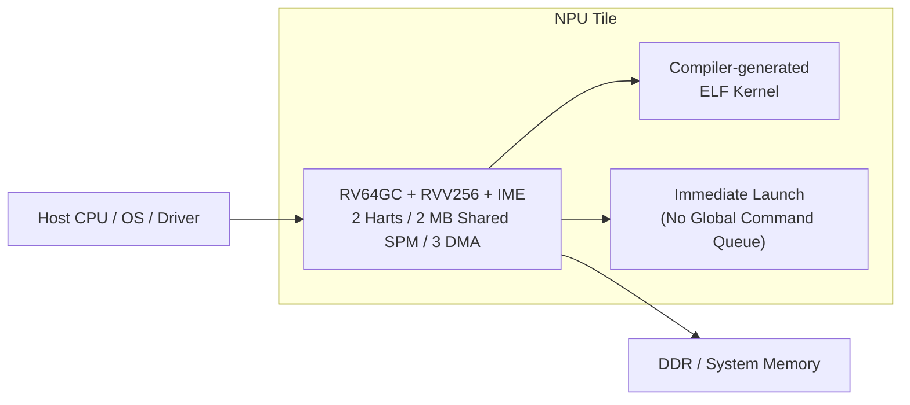
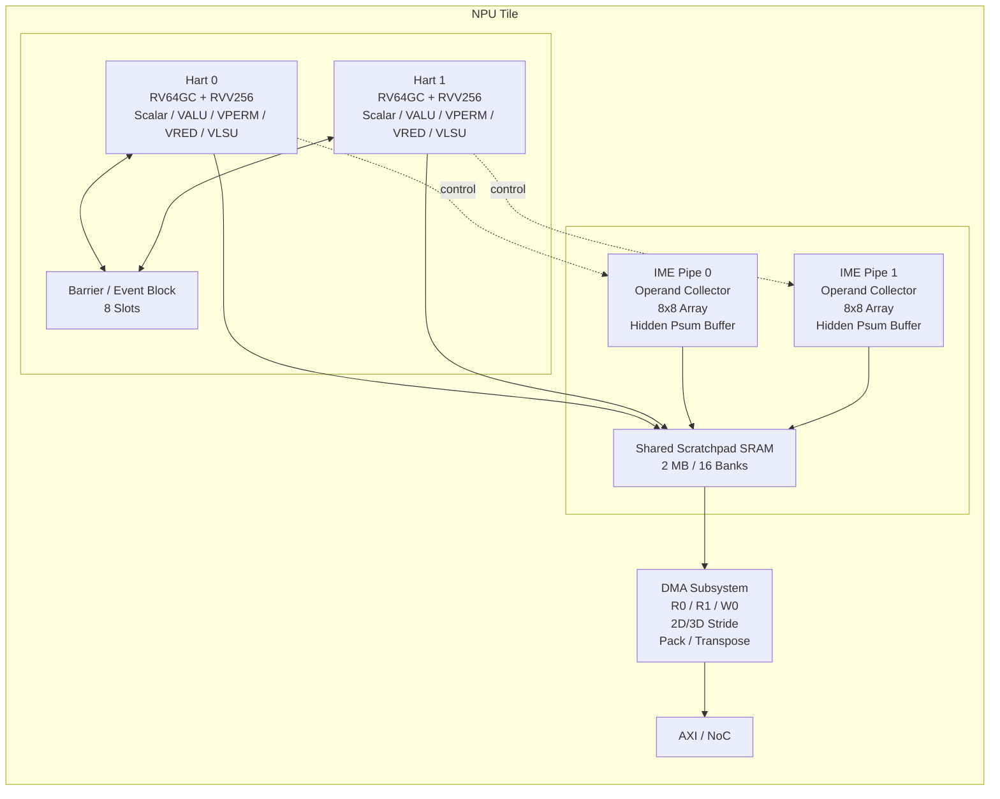
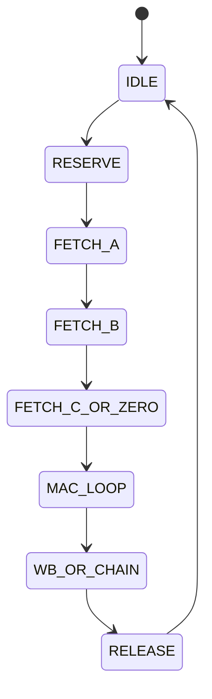

# NPU v0.1 Hardware Architecture

*Tile, Datapath, Memory and Integration*

| 문서 버전 | v0.1 |
| --- | --- |
| 상태 | Internal Draft |
| 적용 대상 | RTL, SoC Integration, DV |
| 기준 구성 | 2 harts/tile, RV64GC + RVV256 + IME-style matrix pipe, shared SPM 2 MB/16 banks, DMA 3채널, command queue 없음, IREE/MLIR 기반 AOT ELF kernel |
| 작성일 | 2026-04-19 |

> **문서 상태**
> 
> 본 문서는 NPU v0.1 baseline을 기준으로 한 internal draft이며, v0.2에서 opcode encoding, multi-tile 확장, preemption, virtualization, security hardening 항목이 추가/수정될 수 있다.

## 문서 정보

| 항목 | 내용 |
| --- | --- |
| 문서명 | NPU v0.1 Hardware Architecture |
| 대상 독자 | RTL, DV, physical design, SoC integration |
| 목적 | NPU v0.1의 하드웨어 블록, 데이터 경로, 메모리, 인터페이스를 정의한다. |
| 적용 범위 | single-tile baseline과 이를 기반으로 한 1/2/4 tile 확장 |
| 기준 베이스라인 | 2 harts/tile, RV64GC + RVV256 + IME-style matrix pipe, shared SPM 2 MB/16 banks, DMA 3채널, command queue 없음, IREE/MLIR 기반 AOT ELF kernel |

## 개정 이력

| 버전 | 상태 | 날짜 | 주요 변경 |
| --- | --- | --- | --- |
| v0.1 | Initial Draft | 2026-04-19 | NPU v0.1 baseline에 대한 최초 문서화 |

## 1. 설계 원칙

- Control plane은 hart가 담당하고, NPU는 kernel machine으로 동작한다.
- High-throughput보다 edge latency와 deterministic execution을 우선한다.
- Architected matrix RF를 두지 않고 VRF 기반 operand collector + hidden psum으로 구현한다.
- Shared scratchpad는 compiler-managed resource로 설계한다.
- RVV는 vector/reduction/tail path, IME는 contraction path로 역할을 분담한다.

> **Architectural Decision**
> 
> HW는 global command processor를 포함하지 않는다. host는 doorbell 기반으로 kernel을 launch하고, tile 내부 harts가 DMA/compute/barrier를 직접 orchestration한다.

## 2. Top-level organization

**Figure 1. NPU v0.1 top-level product organization**

원본 이미지: [assets/original/hw_figure1_original.png](assets/original/hw_figure1_original.png)  
Mermaid 소스: [assets/diagrams/hw_figure1.mmd](assets/diagrams/hw_figure1.mmd)

단일 tile이 v0.1의 최소 제품 반복 단위다. 1/2/4 tile SKU는 동일한 tile 복제와 상위 NoC 연결로 구현하며, tile 내부 인터페이스는 그대로 유지한다.

| 블록 | 주요 책임 |
| --- | --- |
| Host CPU / Driver | ELF upload, launch, completion/fault handling, profiling aggregation |
| Tile Control | launch register, hart boot, timeout/fault aggregation |
| Hart | kernel execution, scalar/vector control, MMIO programming |
| IME Pipe | matrix contraction, hidden psum accumulation |
| SPM | shared activation/weight/temp buffer |
| DMA | DDR↔SPM, SPM↔SPM transfer and pack/transpose |

## 3. Tile baseline configuration

| 항목 | 값 | 비고 |
| --- | --- | --- |
| Hart 수 | 2 | latency와 복잡도 사이의 sweet spot |
| RVV | VLEN 256b | 32 architectural vreg |
| IME local tile | BF16/FP16: 8x8x16, INT8: 16x8x32 | uArch tile class |
| SPM | 2 MB, 16 banks | bank당 128 KB, 256b data width |
| DMA | 3 channels | R0, R1, W0 |
| Barrier slots | 8 | tile-local synchronization |
| Clocking | single-tile domain 기준 | sub-block gate 지원 |

## 4. Tile block diagram

**Figure 2. NPU v0.1 tile microarchitecture**

원본 이미지: [assets/original/hw_figure2_original.png](assets/original/hw_figure2_original.png)  
Mermaid 소스: [assets/diagrams/hw_figure2.mmd](assets/diagrams/hw_figure2.mmd)

Tile은 2개의 hart, 2개의 IME pipe, shared SPM, DMA subsystem, barrier/event block, AXI/NoC endpoint로 구성된다. hart와 IME는 1:1로 결합되며, SPM과 DMA는 tile 공유 자원이다.

## 5. Hart microarchitecture

| 서브블록 | 설명 |
| --- | --- |
| Scalar Pipe | RV64GC decode/execute, branch, CSR, MMIO programming |
| Vector Issue/Scoreboard | RVV issue, hazard tracking, LMUL-aware busy management |
| VALU | add/mul/fma/minmax/compare/bitwise |
| VPERM | slide/gather/pack/unpack/transpose helper |
| VRED | sum/max/min, LayerNorm/softmax reduction core |
| VLSU | SPM window load/store, vector memory path |
| IME Decode | matrix op decode and collector reservation |

Hart는 dual-issue in-order를 기본으로 한다. slot 0은 scalar/branch/CSR, slot 1은 vector/IME/VLSU를 담당한다. rename이 없는 구조를 기본으로 하고, scoreboard와 제한적 bypass로 kernel-scheduled execution을 지원한다.

> **Latency-oriented choice**
> 
> v0.1은 out-of-order보다 dual-issue in-order를 선택한다. 이유는 compiler-scheduled kernel machine에서 검증 비용과 전력 증가 대비 실익이 제한적이기 때문이다.

## 6. Vector register file and execution fabric

| 항목 | 정의 |
| --- | --- |
| VRF organization | 32 x 256b architectural, 4 slices x 64b |
| Porting | slice당 4R/2W baseline |
| W0 | vector ALU/VLSU writeback |
| W1 | IME writeback 전용 |
| Hazard granularity | LMUL-aware register group |
| Fast path | IME chain accumulate bypass, next-cycle W0/W1 bypass |

VRF는 ternary vector op와 IME operand collection을 동시에 수용하기 위해 R3 포트를 collector 공유 포트로 사용한다. 이는 regfile multi-port cost를 제한하면서도 RVV ternary op와 IME prepare를 겹칠 수 있게 한다.

## 7. IME datapath

| 블록 | 책임 |
| --- | --- |
| Operand Collector | VRF에서 source register group을 burst-read, unpack/reorder |
| A/B Buffer | micro-tile operand staging |
| Hidden Psum Buffer | architecturally invisible accumulation storage |
| 8x8 Array | outer-product 또는 equivalent matrix MAC array |
| Writeback Pack | result tile을 vector register group 형식으로 pack |

IME는 architected matrix state를 추가하지 않는다. accumulator는 hidden psum buffer에만 존재하며, visible state는 vector register group으로만 노출된다. 이는 ISA/ABI 단순성과 regfile 에너지 절감을 동시에 만족시킨다.

**Collector FSM**

IME issue queue는 4-entry baseline으로 설계하고, RESERVE 단계에서 scoreboard를 통해 source/acc group lock을 획득한다.

## 8. Shared scratchpad SRAM

| 항목 | 정의 |
| --- | --- |
| Capacity | 2 MB shared |
| Banking | 16 x 128 KB |
| Bank width | 256b |
| Macro | 1R1W + SECDED ECC |
| Addressing | [bank_id \| row \| byte_in_line] 형태의 local address |
| Usage model | compiler-managed local address space |

SPM은 cache가 아니라 관리형 local memory다. compiler는 bank group coloring을 이용해 activation ping/pong, weight, output/temp를 서로 다른 bank group에 배치해야 한다. arbitration은 tail/fringe conflict를 흡수하기 위한 safety net으로만 본다.

| Bank Group | 기본 용도 |
| --- | --- |
| G0 (0..3) | activation ping |
| G1 (4..7) | activation pong |
| G2 (8..11) | weight / const |
| G3 (12..15) | output / temp / residual |

## 9. DMA and synchronization subsystem

| 서브블록 | 정의 |
| --- | --- |
| DMA-R0 | activation/input preload |
| DMA-R1 | weight/constant preload |
| DMA-W0 | output/storeback |
| Pack/Transpose datapath | mmt4d/int8 pack, row/col transform, zero pad |
| Barrier block | 8 slot tile-local barrier |
| Event fabric | DMA done, IME done, fault, software event mux |

DMA는 queue-driven accelerator가 아니라 MMIO-programmed helper engine이다. kernel code가 register를 채우고 start bit를 쓰며, 완료는 event 또는 wait pseudo-op로 받는다.

Barrier block은 도착 카운트와 epoch를 유지한다. 2-hart baseline에서는 counter가 작지만, 동일 로직을 4-hart 구성까지 확장할 수 있어야 한다.

## 10. AXI/NoC, clock, reset, power

| 항목 | 설계 방향 |
| --- | --- |
| AXI/NoC | DDR 및 host-visible MMIO와 연결되는 tile endpoint |
| Reset | tile reset, hart-local reset, DMA/IME soft reset 분리 |
| Clock Gating | hart, IME, DMA, SPM interface별 gate 지원 |
| Power Domain | 단일 tile domain baseline, sub-block retention은 옵션 |
| Interrupt | host completion/fault interrupt, tile-local event는 polling/CSR 기반 |

v0.1은 aggressive power gating보다 block-level clock gating을 우선한다. 이유는 compiler/bring-up 안정성이 우선이며, power intent 정교화는 v0.2 이후 단계에서 강화하는 것이 적절하기 때문이다.

## 11. Reliability, observability and debug

| 기능 | 설명 |
| --- | --- |
| ECC | SPM SECDED 및 error reporting |
| Fault registers | DMA/SPM/illegal op/barrier protocol error code 유지 |
| PMU | cycle, stall, dma_active, ime_active 등 최소 4 counter baseline |
| Trace | kernel launch/complete, DMA event, fault event tracepoint |
| Timeout | stuck DMA 또는 dead barrier에 대한 watchdog hook |

DV와 bring-up 관점에서 RVV-only 모드와 IME-enabled 모드를 분리 검증할 수 있어야 하며, PMU/trace는 compiler tuning loop에 직접 연결될 수 있어야 한다.

## 12. Scale-out and configuration

| SKU | 구성 | 비고 |
| --- | --- | --- |
| v0.1-S | 1 tile | bring-up 및 low-power edge |
| v0.1-M | 2 tiles | mid-tier inference |
| v0.1-L | 4 tiles | higher throughput, software-visible partitioning |

멀티타일은 v0.1에서 software-visible partitioning을 기본으로 한다. 즉 coherency fabric이나 global barrier는 필수 범위가 아니며, host/runtime가 tile 단위로 work를 분배한다.
