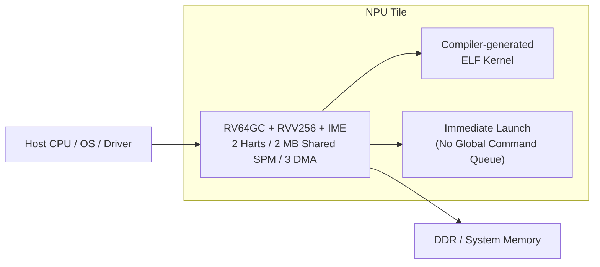

# NPU v0.1 PRD

*Product Requirements Document*

| 제품명 | Compiler-Driven Edge NPU |
| --- | --- |
| 문서 버전 | v0.1 |
| 문서 상태 | Internal Draft |
| 기준 아키텍처 | 2 harts/tile, RV64GC + RVV256 + IME-style matrix pipe, shared SPM 2 MB/16 banks, DMA 3채널, command queue 없음, IREE/MLIR 기반 AOT ELF kernel |
| 작성일 | 2026-04-19 |

> **문서 상태**
> 
> 본 문서는 NPU v0.1 baseline을 기준으로 한 internal draft이며, v0.2에서 opcode encoding, multi-tile 확장, preemption, virtualization, security hardening 항목이 추가/수정될 수 있다.

## 문서 정보

| 항목 | 내용 |
| --- | --- |
| 문서명 | NPU v0.1 Product Requirements Document |
| 대상 독자 | NPU 아키텍트, RTL/Compiler/Runtime 리드, 시스템 통합 담당 |
| 목적 | NPU v0.1의 제품 목표, 범위, 성공 기준, 요구사항을 정리한다. |
| 적용 범위 | Edge/Embedded inference용 단일 타일 baseline 및 이를 기반으로 한 1/2/4 tile SKU |
| 기준 베이스라인 | 2 harts/tile, RV64GC + RVV256 + IME-style matrix pipe, shared SPM 2 MB/16 banks, DMA 3채널, command queue 없음, IREE/MLIR 기반 AOT ELF kernel |

## 개정 이력

| 버전 | 상태 | 날짜 | 주요 변경 |
| --- | --- | --- | --- |
| v0.1 | Initial Draft | 2026-04-19 | NPU v0.1 baseline에 대한 최초 문서화 |

## 1. 제품 개요

NPU v0.1은 명령 큐 중심의 고정 기능형 NPU 대신, RISC-V 기반 control plane과 compiler-generated kernel 실행 모델을 채택한 edge/embedded용 baseline 제품이다. 핵심 목표는 하나의 설계로 CNN, MobileViT, EfficientFormer, EfficientViT 계열을 모두 수용하면서도 bring-up과 compiler co-design 복잡도를 통제하는 것이다.

제품은 host CPU가 ELF kernel을 immediate launch하고, 타일 내부의 RISC-V hart가 RVV와 IME-style matrix pipe를 직접 orchestration하는 구조를 전제로 한다. v0.1은 기능 및 아키텍처 baseline을 고정하는 버전이며, peak TOPS 또는 최종 공정/클럭 수치는 제품화 단계에서 별도 산정한다.

> **핵심 방향**
> 
> v0.1의 차별점은 (1) global command queue 제거, (2) architected matrix register file 제거, (3) compiler-managed scratchpad, (4) RVV generic path + late IME tensorization이다.

## 2. 대상 사용자와 사용 시나리오

- 자율주행/로봇용 edge perception: MobileNet 계열, MobileViT, EfficientFormer 백본 inference
- Physical AI용 low-batch transformer 서브그래프: MLP, QKV projection, attention matmul, LayerNorm, softmax
- NPU compiler 연구/제품화: MLIR/IREE 또는 TVM tensorization, SPM layout planning, ukernel tuning
- SoC 통합팀: host CPU와의 immediate launch, MMIO bring-up, profiling 및 perf counter 수집

| 사용자 | 주요 관심사 | v0.1에서 제공되는 가치 |
| --- | --- | --- |
| 알고리즘 팀 | 모델 이식성, 정확도 유지 | CNN과 Transformer 계열을 단일 타깃으로 컴파일 가능 |
| 컴파일러 팀 | tensorization, layout, fused kernel | RVV generic lowering과 explicit IME target을 동시에 제공 |
| RTL/검증 팀 | 명확한 block boundary, bring-up | command processor 없이 kernel machine 구조로 단순화 |
| 시스템/플랫폼 팀 | 호스트 연동, 디버그, profiling | HAL driver와 MMIO launch 기반의 얇은 runtime |

## 3. 제품 목표와 비목표

| 구분 | 내용 |
| --- | --- |
| Primary Goals | AOT fused kernel 실행, deterministic scratchpad scheduling, matmul/MLP/attention/LN/softmax coverage, edge latency 지향 아키텍처 |
| Secondary Goals | 1/2/4 tile 확장, perf counter 및 trace 제공, IREE 중심 compiler path 확보 |
| Non-goals (v0.1) | global command queue, virtual memory, preemption/QoS, sparse acceleration, compression engine, coherent multi-tile memory |

v0.1은 기능적 baseline을 고정하고, compiler-visible contract와 HW/SW 인터페이스를 안정화하는 데 초점을 둔다. 따라서 세부 opcode encoding과 멀티타일 coherency 정책은 v0.2에서 재조정될 수 있다.

## 4. 성공 기준 (Product Gates)

| 게이트 ID | 성공 기준 | 측정 방식 |
| --- | --- | --- |
| PG-01 | IREE/MLIR에서 fused subgraph를 embedded ELF로 AOT 생성 | reference workload compile pass |
| PG-02 | 호스트에서 tile로 immediate launch 가능 | bare-metal 또는 Linux bring-up demo |
| PG-03 | MLP, LN, softmax, QKV, attention matmul, DWConv, PWConv 회귀 통과 | kernel regression 100% pass |
| PG-04 | 대표 workload에서 intermediate DDR spill 없이 on-chip execution 가능 | trace + SPM planner report |
| PG-05 | 동일 입력에서 latency variability가 낮고 실행 경로가 deterministic | multi-run profiling, trace diff |
| PG-06 | debug/perf counter와 fault reporting이 확보 | PMU / CSR / MMIO inspection |

## 5. 기능 요구사항

| ID | 분류 | 요구사항 | 우선순위 |
| --- | --- | --- | --- |
| FR-001 | 실행 모델 | 각 서브그래프를 op 단위가 아닌 fused kernel ELF로 실행해야 한다. | P0 |
| FR-002 | 제어 구조 | global descriptor queue 없이 host launch + tile-local execution을 사용해야 한다. | P0 |
| FR-003 | 계산 자원 | 각 tile은 2개의 hart와 RVV256, IME-style matrix pipe를 제공해야 한다. | P0 |
| FR-004 | 메모리 | tile은 2 MB shared scratchpad와 16 bank 구조를 제공해야 한다. | P0 |
| FR-005 | 데이터형 | INT8, FP16, BF16, FP32 accumulation 경로를 제공해야 한다. | P0 |
| FR-006 | 연산 커버리지 | matmul, QKV, MLP, LN, softmax, GELU, DWConv, PWConv, pooling을 지원해야 한다. | P0 |
| FR-007 | DMA | 2D/3D stride, pack, transpose, zero-pad를 지원하는 3채널 DMA를 제공해야 한다. | P0 |
| FR-008 | 동기화 | barrier/event 기반 동기화와 wait primitive를 제공해야 한다. | P0 |
| FR-009 | 컴파일러 | IREE/MLIR backend와 target-specific pass를 제공해야 한다. | P0 |
| FR-010 | 런타임 | external HAL driver와 remote ELF loader를 제공해야 한다. | P0 |
| FR-011 | 관측성 | perf counter, trace, fault code를 노출해야 한다. | P1 |
| FR-012 | 확장성 | 동일 ISA/SW 모델로 1/2/4 tile SKU 확장이 가능해야 한다. | P1 |

## 6. 비기능 요구사항

| ID | 항목 | 설명 |
| --- | --- | --- |
| NFR-001 | 예측 가능성 | 실행 경로와 메모리 스케줄은 deterministic해야 한다. |
| NFR-002 | Bring-up 단순성 | command processor, firmware scheduler 없이 커널 기반으로 bring-up 가능해야 한다. |
| NFR-003 | Compiler 친화성 | layout propagation, bank coloring, tensorization을 compiler contract로 표현할 수 있어야 한다. |
| NFR-004 | 검증 용이성 | RVV-only 모드와 IME 활성 모드를 분리 검증할 수 있어야 한다. |
| NFR-005 | 유지보수성 | IME spec 변화가 backend shim에서 흡수되도록 설계되어야 한다. |
| NFR-006 | 안전성 | ECC, fault isolation, timeout, trace를 포함한 관측성과 오류 복구 경로가 있어야 한다. |

## 7. 기준 제품 구성

**Figure 1. NPU v0.1 제품 토폴로지**

원본 이미지: [assets/original/prd_figure1_original.png](assets/original/prd_figure1_original.png)  
Mermaid 소스: [assets/diagrams/prd_figure1.mmd](assets/diagrams/prd_figure1.mmd)

| 항목 | Baseline |
| --- | --- |
| Tile 구성 | 2 harts/tile |
| Hart | RV64GC + RVV (VLEN 256b) + IME-style matrix pipe |
| SPM | 2 MB shared scratchpad, 16 banks, compiler-managed |
| DMA | R0/R1/W0 3채널, 2D/3D stride, pack/transpose/zero-pad |
| 런타임 모델 | embedded ELF kernel immediate launch |
| Compiler | IREE/MLIR backend plugin + external HAL driver |

## 8. 범위 제외 항목과 후속 버전 방향

- v0.1은 preemption, multi-tenant scheduling, virtual memory, page fault handling을 포함하지 않는다.
- v0.1은 sparse compute, activation compression, cache-coherent multi-tile fabric을 포함하지 않는다.
- v0.2에서는 opcode encoding freeze, multi-tile synchronization 확장, security hardening, richer PMU를 검토한다.

## 9. 주요 리스크와 대응

| 리스크 | 영향 | 대응 |
| --- | --- | --- |
| IME opcode/semantic 변경 | compiler/backend churn | late tensorization과 shim 계층으로 영향 격리 |
| SPM bank conflict 과다 | latency 증가 | bank coloring과 planner report를 compiler 기본 계약으로 강제 |
| softmax/LN 성능 열화 | Transformer latency 저하 | RVV ukernel 최적화와 reduction path 우선 튜닝 |
| HAL abstraction과 HW 실행 모델 간 괴리 | integration 지연 | immediate launch translation을 공식 드라이버 정책으로 고정 |

## 10. 승인 기준

본 PRD는 HW, Compiler, Runtime 리드가 공통 baseline으로 승인할 수 있는 수준의 scope와 interface를 제공해야 한다. 승인 후 v0.1 범위 내에서 변경 가능한 항목은 microarchitecture tuning, opcode encoding provisional 영역, compiler heuristic이며, 실행 모델과 kernel ABI는 변경 금지 항목으로 본다.
