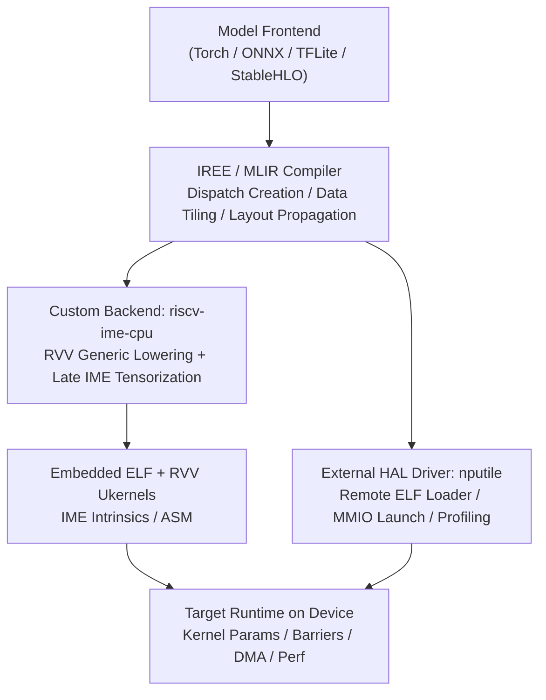
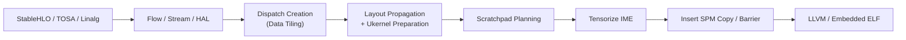

# NPU v0.1 Software Architecture

*Compiler, Runtime, HAL and Kernel Execution Model*

| 문서 버전 | v0.1 |
| --- | --- |
| 상태 | Internal Draft |
| 적용 대상 | Compiler, Runtime, Platform SW |
| 기준 스택 | IREE/MLIR + external HAL driver + embedded ELF |
| 작성일 | 2026-04-19 |

> **문서 상태**
> 
> 본 문서는 NPU v0.1 baseline을 기준으로 한 internal draft이며, v0.2에서 opcode encoding, multi-tile 확장, preemption, virtualization, security hardening 항목이 추가/수정될 수 있다.

## 문서 정보

| 항목 | 내용 |
| --- | --- |
| 문서명 | NPU v0.1 Software Architecture |
| 대상 독자 | Compiler/backend, runtime/HAL, platform SW, bring-up |
| 목적 | NPU v0.1의 SW stack과 각 계층의 역할 및 인터페이스를 정의한다. |
| 적용 범위 | frontend import부터 target runtime 실행, profiling/debug까지 |
| 기준 베이스라인 | 2 harts/tile, RV64GC + RVV256 + IME-style matrix pipe, shared SPM 2 MB/16 banks, DMA 3채널, command queue 없음, IREE/MLIR 기반 AOT ELF kernel |

## 개정 이력

| 버전 | 상태 | 날짜 | 주요 변경 |
| --- | --- | --- | --- |
| v0.1 | Initial Draft | 2026-04-19 | NPU v0.1 baseline에 대한 최초 문서화 |

## 1. 소프트웨어 설계 목표

- Upstream IREE/MLIR 구조를 최대한 재사용하고 target-specific 차이만 plugin으로 국소화한다.
- RVV generic path와 late IME tensorization을 병행하여 bring-up과 성능 최적화를 분리한다.
- HAL abstraction은 유지하되, 실제 HW 실행 모델은 immediate kernel launch로 단순화한다.
- SPM, barrier, DMA는 compiler-visible contract로 다루고 runtime은 얇게 유지한다.

> **SW 핵심 결정**
> 
> 새 VM/HAL 스택을 만들지 않는다. compiler는 `riscv-ime-cpu` backend plugin, runtime은 `nputile` external HAL driver로 구현한다.

## 2. Layered stack overview

**Figure 1. NPU v0.1 software stack**



원본 이미지: [assets/original/sw_figure1_original.png](assets/original/sw_figure1_original.png)  
Mermaid 소스: [assets/diagrams/sw_figure1.mmd](assets/diagrams/sw_figure1.mmd)

| 계층 | 주요 책임 |
| --- | --- |
| Frontend | Torch/ONNX/TFLite/StableHLO 입력 수용 |
| IREE/MLIR Mid-end | dispatch creation, fusion, data tiling, layout propagation |
| Custom Backend | RVV lowering, IME tensorization, SPM plan, ELF emission |
| HAL Driver | ELF upload/cache, MMIO launch, completion/fault handling |
| Device Runtime | kernel param setup, barrier/DMA service, PMU/trace |

## 3. Compiler architecture

컴파일러는 `riscv-ime-cpu` target backend를 중심으로 구성한다. 기본 원칙은 일반 elementwise/reduction은 generic vector dialect에 남기고, matmul/1x1/QKV와 같은 contraction만 late stage에서 explicit IME op로 tensorize하는 것이다.

| 정책 | 설명 |
| --- | --- |
| Generic RVV path | LayerNorm, softmax, GELU, depthwise, tail loop는 vector/RVV lowering 유지 |
| Explicit IME path | mmt4d 또는 packed contraction을 `ime_mma`로 변환 |
| Scratchpad planning | bank group, ping/pong, DMA channel, barrier insertion을 compile-time 결정 |
| Executable format | embedded ELF 재사용, ukernel bitcode link 허용 |

**Figure 2. Compiler lowering and kernelization flow**



원본 이미지: [assets/original/sw_figure2_original.png](assets/original/sw_figure2_original.png)  
Mermaid 소스: [assets/diagrams/sw_figure2.mmd](assets/diagrams/sw_figure2.mmd)

이 구조의 핵심은 `vector.contract`를 무리하게 자동 matrixization하지 않는 것이다. 대신 dispatch creation과 data-tiling 이후에 packed contraction만 explicit tensorization 대상으로 삼아 toolchain 안정성을 높인다.

## 4. Custom IR and pass set

| 구성요소 | 정의 |
| --- | --- |
| Dialect | `nputile.ime_mma`, `nputile.spm_copy.async`, `nputile.spm_wait`, `nputile.barrier` |
| ResolveEncodings | tile class, bank group, pack mode 결정 |
| PlanScratchpad | SPM local offset, group coloring, DMA/barrier plan 산출 |
| TensorizeIME | mmt4d/packed contraction을 IME op로 변환 |
| InsertSPMCopies | DMA 기반 preload/storeback 삽입 |
| ConvertNPUTileToLLVM | IME intrinsic/asm, MMIO helper call로 lowering |

```mlir
%acc1 = nputile.ime_mma %a, %b, %acc0
  {tile = [8, 8, 16], in_type = bf16, acc_type = f32}
  : vector<8x16xbf16>, vector<16x8xbf16>, vector<8x8xf32>
 -> vector<8x8xf32>
```

IME op는 새 matrix type을 만들지 않고 vector type만 사용한다. 이 규칙은 architected matrix RF가 없다는 ISA/HW 결정과 정합성을 유지한다.

## 5. Runtime and HAL driver architecture

런타임은 `nputile` external HAL driver로 구현한다. HAL command buffer는 SW 내부 표현에 불과하며, 실제 submit 시에는 즉시 실행(immediate launch)으로 번역된다.

| 모듈 | 주요 책임 |
| --- | --- |
| driver/device | device enumeration, capability query |
| executable_cache | ELF image cache, feature-based specialization |
| remote_elf_loader | text/rodata 업로드, relocation, symbol patch |
| command_buffer | HAL dispatch 기록 후 immediate launch로 translate |
| queue/semaphore | completion/fault polling or interrupt integration |
| profiling | PMU readback, trace collection, latency report |

bring-up 단계에서는 local-sync + embedded-elf 경로로 먼저 end-to-end를 검증하고, product mode에서만 Arm host ↔ RISC-V tile offload를 활성화하는 것이 안전하다.

## 6. Kernel lifecycle

| 단계 | 내용 |
| --- | --- |
| Compile | 모델이 executable variant와 specialization constant를 포함한 embedded ELF로 변환된다. |
| Load | driver가 ELF를 device memory에 적재하고 cache에 등록한다. |
| Prepare | binding pointer, shape/stride, spm_base, mmio_base를 parameter block에 채운다. |
| Launch | host가 doorbell + entry/ctx를 기록하고 선택된 hart를 기동한다. |
| Execute | kernel이 DMA preload → RVV/IME compute → storeback 순으로 실행한다. |
| Complete | fence/semaphore, PMU, fault code를 host에 반환한다. |

Kernel lifecycle에서 runtime이 개입해야 하는 범위를 최소화하는 것이 중요하다. layout, bank coloring, barrier placement는 compile-time에 결정되고, runtime은 실행 준비와 결과 회수만 담당한다.

## 7. Memory planning and specialization

SPM은 HAL-visible buffer가 아니다. HAL은 global buffer만 관리하고, SPM 배치와 local offset은 executable metadata와 kernel param block으로만 표현한다.

| 항목 | 정책 |
| --- | --- |
| Bank Group | G0/G1/G2/G3로 ping/pong, weight, out/temp를 구분 |
| Double Buffering | activation preload와 compute overlap을 위한 기본 정책 |
| Specialization | vlen_bits, spm_bytes, hart_count, ime_tile_class에 따라 executable variant 선택 |
| Tail Policy | main tile은 IME, fringe/tail은 RVV masking 또는 peeled loop |

Specialization constant와 device query는 같은 모델에 대해 여러 executable variant를 허용한다. 예를 들어 SPM 1 MB/2 MB, 1/2 hart, BF16/INT8 tile class에 따른 분기 구현이 가능하다.

## 8. Ukernel strategy

| 영역 | 전략 |
| --- | --- |
| RVV ukernels | LayerNorm, softmax, GELU, depthwise, quant/dequant를 bitcode 또는 object 형태로 link |
| IME path | inline intrinsic/asm 또는 thin wrapper ukernel |
| Fallback | IME 비활성 또는 unsupported shape는 RVV/CPU path로 대체 |
| Tuning | pack size, unroll, masking heuristic를 profiler 기반 조정 |

초기 버전에서는 ukernel 개수를 최소화하고, regression 및 bring-up을 우선한다. 성능이 필요한 커널부터 순차적으로 hand-tuned RVV ukernel을 추가하는 것이 바람직하다.

## 9. Debug, profiling, and fault handling

| 기능 | 설명 |
| --- | --- |
| Compile-time dump | LLVM IR, asm, linked ELF, planner report 출력 |
| Runtime profiling | launch latency, kernel latency, DMA active, IME active 수집 |
| Fault model | DMA fault, illegal op, barrier timeout, SPM ECC를 표준 fault code로 정규화 |
| Trace | kernel launch/complete, DMA start/done, barrier wait 이벤트 추적 |

개발 초기에 system-linked artifact를 노출하여 asm/IR inspection을 가능하게 해야 하며, embedded ELF 경로는 regression이 안정화된 후 기본값으로 사용한다.

## 10. Versioning and compatibility

- 외부 모델 import 와 HAL/device interface 는 가능한 안정적으로 유지한다.
- IME opcode encoding 변경은 backend shim 에서 흡수하고, IR op 와 kernel ABI 는 가급적 유지한다.
- Executable metadata 에 target features 와 version tag 를 포함하여 mismatch 를 조기 검출한다.
- v0.1에서 frozen 되는 것은 실행 모델, kernel ABI, SPM planning contract 이며, heuristic 과 provisional encoding 은 변경 가능하다.

## 11. v0.1 software deliverables

| Deliverable | 설명 |
| --- | --- |
| Backend plugin | `riscv-ime-cpu` target backend, dialect, 핵심 pass |
| Ukernel set | RVV LN/softmax/GELU/depthwise baseline ukernel |
| HAL driver | `nputile` external driver, remote ELF loader, profiling |
| Executable path | embedded ELF generation, load, launch, completion |
| Debug assets | planner report, asm dump, PMU/trace report |

## 12. 운영 원칙

- 기능 검증이 완료된 generic RVV path를 항상 유지한다.
- IME path는 explicit tensorization 이후에만 사용하며, unsupported shape는 fallback으로 처리한다.
- runtime은 scheduling intelligence를 늘리기보다 compile-time 계획을 faithful하게 실행한다.
