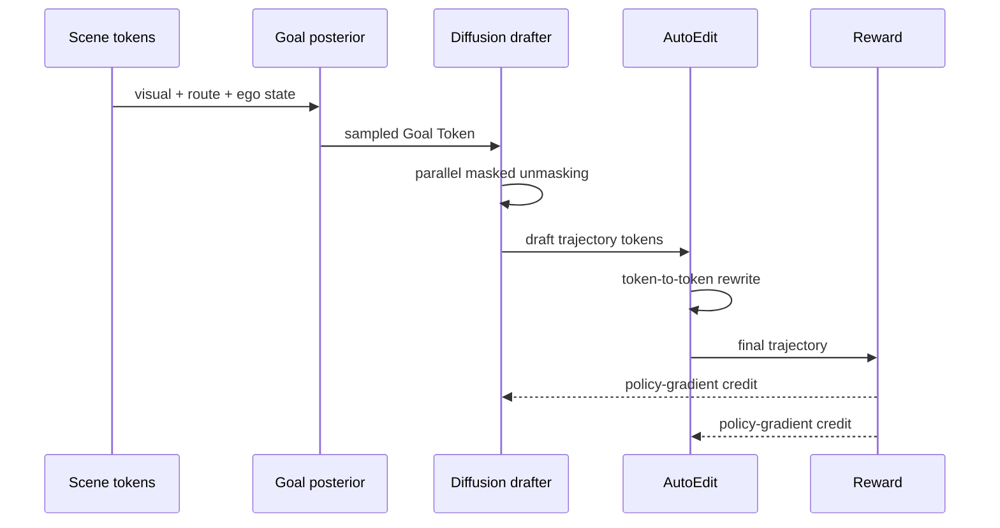

# ReflectDrive-2 분석 노트

## 1. 한 문장 결론

ReflectDrive-2는 자율주행 VLA planner에서 trajectory를 discrete token으로 만들고, masked diffusion draft와 AutoEdit rewrite를 RL terminal reward로 함께 정렬해 “고칠 수 있는 계획”을 실시간에 가깝게 생성하는 논문이다.

## 2. 문제

기존 end-to-end planner는 trajectory를 한 번 생성한 뒤 구조적으로 수정하기 어렵고, autoregressive VLA planner는 correction latency가 크다. 자율주행 error는 longitudinal/lateral 축으로 구조화되어 나타나므로, token-space in-place editing이 가능한 planner가 필요하다.

## 3. 핵심 기여

1. Goal posterior + masked discrete diffusion + AutoEdit로 구성된 decision–draft–reflect planner
2. Longitudinal/lateral perturbation을 이용한 structure-aware AutoEdit supervision
3. Draft/edit composed rollout 전체에 closed-loop reward를 주는 RL fine-tuning
4. Shared-prefix KV reuse, ASD, fused CUDA unmasking으로 deployment latency 최적화
5. NAVSIM camera-only 91.0 PDMS 및 best-of-6 94.8 PDMS 보고

## 4. Input → Reasoning → Action Grounding

| 단계 | 내용 | Action grounding 의미 |
|---|---|---|
| Input | 3-view camera × 2 frames, route instruction, ego state | scene + intent + kinematics |
| Decision | goal-point posterior | behavior hypothesis 선택 |
| Draft | masked discrete diffusion over BEV trajectory tokens | full 4s trajectory 생성 |
| Reflect | AutoEdit token-to-token rewrite | drivable/safe/reward-aligned correction |
| Output | waypoint trajectory | executable driving plan |

## 5. Architecture / pipeline

## 6. Training recipe

1. Supervised masked trajectory generation
2. AutoEdit supervised recovery from structured perturbations
3. Drivable-area field regularization
4. RL fine-tuning with closed-loop PDMS reward over full draft-and-edit rollout

## 7. Dataset / Benchmark / Metric

- Benchmark: NAVSIM / nuPlan 기반 closed-loop planning
- Input: camera-only setting 중심, 비교군 일부는 camera+LiDAR
- Metric: PDMS = collision, drivable area, TTC, comfort, ego progress aggregation
- Output horizon: 4초, 2Hz waypoint trajectory

## 8. Open-loop vs closed-loop

이 논문의 강점은 open-loop imitation loss가 아니라 closed-loop planning score를 RL reward로 사용했다는 점이다. 다만 reward는 여전히 benchmark proxy이며, 실제 도로 safety case와 동일하지 않다. best-of-6 oracle은 planner posterior 품질을 보기 위한 diagnostic이지 실제 배포 setting은 아니다.

## 9. 강점

- 자율주행 failure mode에 맞는 editable action representation
- VLA에서 language token을 route intent conditioning으로 명확히 사용
- model-side idea와 serving-side latency 최적화를 함께 제시
- AutoEdit gain이 RL 후 커지는 ablation이 설득력 있음

## 10. 한계 / safety / latency

- proprietary pretrained weights를 사용해 재현성 제한 가능
- fixed coordinate binning으로 trajectory precision 제한
- reward가 PDMS proxy라 real-world safety까지 보장하지 않음
- multi-agent negotiation failure(yield timing, cut-in response)는 추가 perturbation/reward 필요
- NVIDIA Thor latency는 인상적이나 특정 hardware/kernel 최적화 의존

## 11. 찬호님 관심사와의 연결

ReflectDrive-2는 VLA for AD taxonomy에서 **Numerical Action Generator / End-to-End VLA planner**에 가깝다. 특히 language reasoning을 장황한 CoT로 쓰기보다 route instruction token을 action generation 조건으로 쓰고, 실제 action은 discrete BEV trajectory token으로 grounding한다. 자율주행 VLA에서 중요한 것은 “설명 가능한 문장”보다 “고칠 수 있고 closed-loop reward와 연결되는 action token space”라는 메시지가 강하다.
