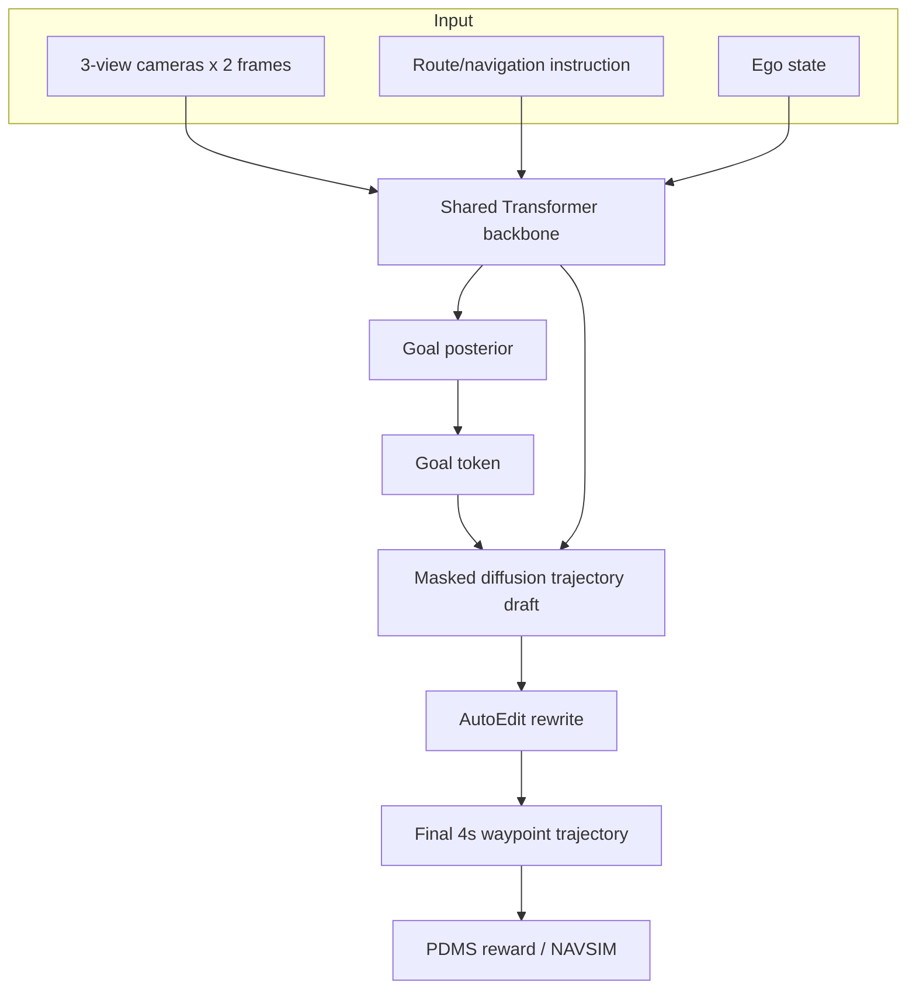

# ReflectDrive-2 학습 자료

## 선수 지식

- 자율주행 planning: waypoint, trajectory, BEV, drivable area
- End-to-end autonomous driving vs modular stack
- VLA: visual observation + language/route instruction + action token
- Diffusion model, masked discrete diffusion, MaskGIT-style decoding
- Reinforcement learning fine-tuning, group-relative advantage
- KV cache, on-device kernel fusion, real-time inference latency

## Glossary

| 용어 | 설명 |
|---|---|
| Goal Token | 최종 waypoint/endpoint를 나타내는 behavior hypothesis anchor |
| Masked discrete diffusion | token 일부를 mask하고 병렬로 복원하는 discrete generation 방식 |
| AutoEdit | generated trajectory token을 같은 token space에서 직접 rewrite하는 self-editing 단계 |
| PDMS | NAVSIM의 closed-loop planning score |
| ASD | Alternating Step Decode; full-step과 lite-step frame을 번갈아 처리하는 latency 최적화 |
| Drivable-area field loss | road boundary 밖 token 확률을 줄이는 spatial penalty |

## 핵심 수식/표현 직관

- Trajectory = BEV coordinate token sequence
- Draft = masked token을 parallel denoising으로 채운 sequence
- Edit = concrete token sequence에서 일부 token을 replacement token으로 overwrite
- Reward = 최종 post-edit trajectory의 closed-loop score
- Policy gradient credit = drafting transition + editing transition 모두에 전달

## 단계별 작동 방식

1. Camera/route/ego token을 backbone에 넣는다.
2. Goal posterior에서 endpoint 후보를 sampling하고 NMS로 중복을 줄인다.
3. 선택된 goal token을 고정하고 나머지 trajectory token을 masked diffusion으로 채운다.
4. AutoEdit가 low-confidence 또는 구조적으로 문제 있는 token을 직접 rewrite한다.
5. 최종 trajectory를 PDMS-style reward로 평가하고, RL이 draft/edit 모두를 업데이트한다.

## Mermaid architecture

## 구현/배포 체크포인트

- Discrete coordinate bin size를 너무 거칠게 잡으면 trajectory precision이 떨어진다.
- AutoEdit perturbation은 실제 failure taxonomy와 맞아야 한다.
- RL reward는 comfort/progress/safety trade-off를 잘 반영해야 한다.
- Diffusion token update는 CPU synchronization을 피하고 on-device로 fuse해야 latency가 맞는다.
- Streaming AD에서는 이전 frame plan을 current ego frame으로 transform해 재사용하는 temporal refinement가 중요하다.

## Study Questions

1. **왜 autoregressive VLA planner보다 masked discrete diffusion이 유리한가?**  
   trajectory token을 병렬 생성할 수 있고, 임의 subset token을 native하게 edit할 수 있어 latency와 correction 측면에서 유리하다.

2. **AutoEdit supervised training만으로 왜 부족한가?**  
   token recovery는 배우지만 closed-loop reward를 개선하는 방향으로 drafter와 editor가 co-adapt하지 않기 때문이다.

3. **best-of-6 oracle 결과를 어떻게 해석해야 하나?**  
   실제 배포 성능이라기보다 goal posterior가 다양한 behavior hypothesis를 담고 있는지 보는 upper-bound diagnostic이다.

4. **language role은 무엇인가?**  
   route/navigation instruction token이 intent conditioning으로 쓰인다. CoT explanation보다는 action generation 조건에 가깝다.

## Reading roadmap

- Day 1: NAVSIM/nuPlan metric 이해
- Day 2: MaskGIT/LLaDA로 masked discrete diffusion 이해
- Day 3: DriveFine/DiffusionDrive로 diffusion planner 계열 이해
- Day 4: ReflectDrive-2 method/ablation 집중 읽기
- Day 5: serving optimization(KV cache, ASD, CUDA unmasking) 분석
