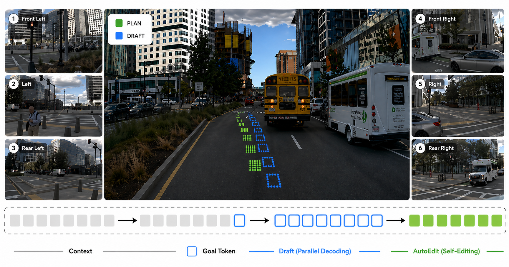
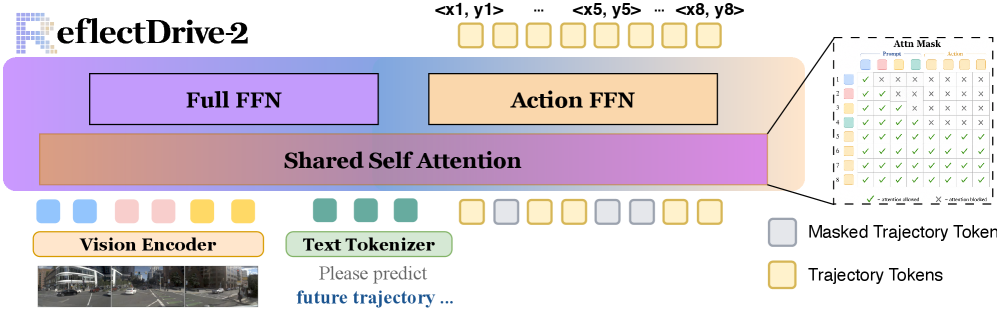
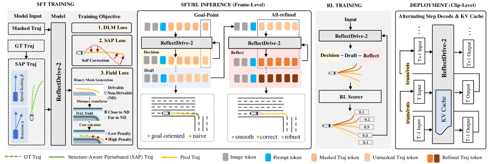
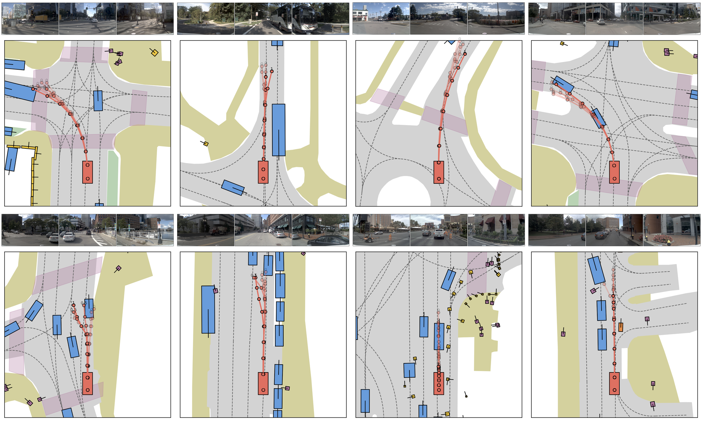
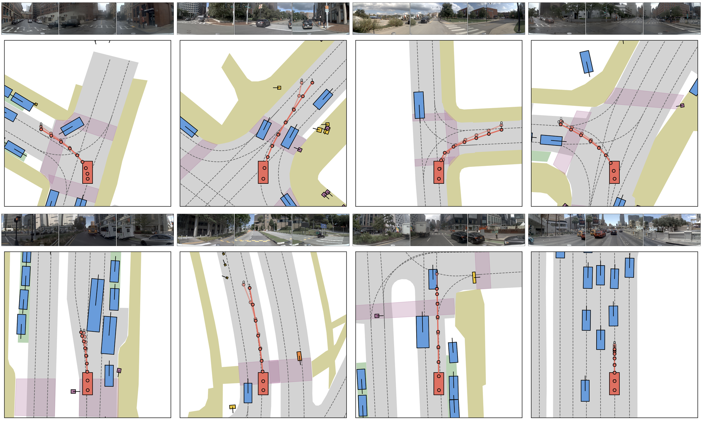
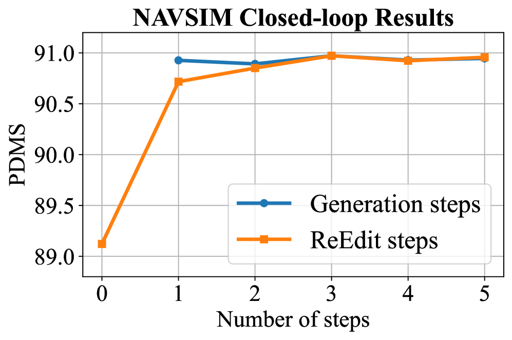
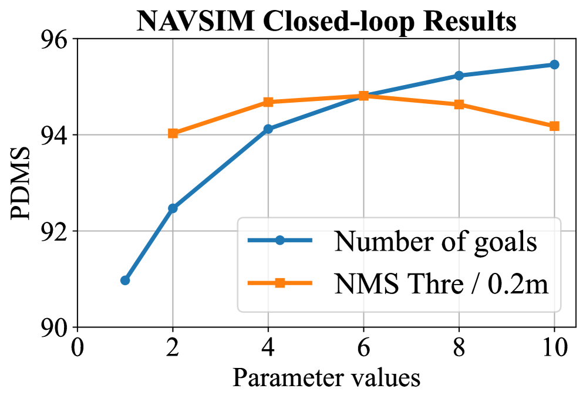
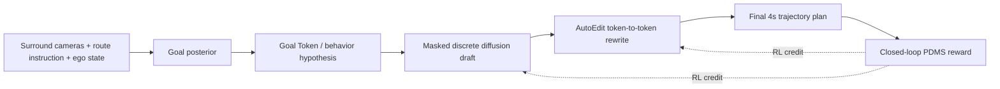

# ReflectDrive-2: 이산 Diffusion Driving을 위한 강화학습 정렬 Self-Editing

- 원제: **ReflectDrive-2: Reinforcement-Learning-Aligned Self-Editing for Discrete Diffusion Driving**
- Authors: Huimin Wang, Yue Wang, Bihao Cui, Pengxiang Li, Ben Lu, Mingqian Wang, Tong Wang, Chuan Tang, Teng Zhang, Kun Zhan
- arXiv: https://arxiv.org/abs/2605.04647

## 저장한 Figures

- 원본: https://arxiv.org/html/2605.04647v2/figs/rd2_teaser.png

- 원본: https://arxiv.org/html/2605.04647v2/x1.png

- 원본: https://arxiv.org/html/2605.04647v2/x2.png

- 원본: https://arxiv.org/html/2605.04647v2/figs/goodcase_gp.png

- 원본: https://arxiv.org/html/2605.04647v2/figs/goodcase_reedit.png

- 원본: https://arxiv.org/html/2605.04647v2/x3.png

- 원본: https://arxiv.org/html/2605.04647v2/x4.png

## 번역 범위와 읽는 법

원문 HTML을 기준으로 Abstract, Introduction, Related Work, Method, AutoEdit, RL rollout, efficient inference, NAVSIM experiments, limitations/conclusion을 한국어로 기술 번역했다. LaTeX 수식은 HTML 추출 과정에서 일부 `[수식]`으로 치환되어, 의미 중심으로 풀어 설명했다. 상세 appendix와 모든 표 숫자는 요약 번역했다.

## Abstract 한국어 번역

ReflectDrive-2는 자율주행 planning을 discrete trajectory token의 masked diffusion 문제로 보고, decision–draft–reflect pipeline을 제안한다. Goal Token이 behavior hypothesis를 고정하고, masked discrete diffusion이 trajectory draft를 병렬 생성한 뒤, AutoEdit가 같은 token space에서 일부 token을 직접 rewrite한다. supervised perturbation recovery만으로는 self-editing gain이 작기 때문에, 논문은 draft와 edit 전체 rollout에 terminal driving reward를 부여하는 RL fine-tuning을 적용한다. NAVSIM에서 camera-only 91.0 PDMS, best-of-6 oracle 94.8 PDMS를 보고하며, shared-prefix KV reuse, Alternating Step Decode, fused on-device unmasking으로 NVIDIA Thor에서 평균 약 31.8ms(본문 세부 최적화 표 기준 약 30.2ms) latency를 달성한다.

## 1. Introduction 번역

Imitation-learned driving policy의 planning error는 무작위가 아니다. 주로 longitudinal speed misjudgment(overshoot, under-progress, late braking)와 lateral heading drift(lane deviation, clipped turn, drivable-area violation)에 집중된다. 따라서 action representation이 이 두 축을 따라 structured in-place revision을 지원한다면, driving planner의 오류 구조와 잘 맞는다.

기존 modular stack과 end-to-end planner는 하나의 trajectory에 commit하고, autoregressive VLA planner는 token을 순차 생성하므로 이미 낸 token을 고치려면 전체 sequence를 다시 굴려야 한다. Continuous diffusion planner는 parallel generation이 가능하지만 Gaussian corruption process를 역전할 뿐, trained driver의 구조적 failure mode를 직접 edit하지 않는다. Masked discrete diffusion은 어떤 trajectory token subset도 다시 rewrite할 수 있으므로 planning correction에 자연스럽다.

하지만 trained drafter 위에 self-editing step만 붙이면 효과가 작다. drafter는 editor가 고치기 쉬운 draft를 낼 유인이 없고, editor도 어떤 rewrite가 closed-loop behavior를 개선하는지 reward signal을 받지 못한다. 이 논문은 draft-and-edit 전체 rollout에 terminal reward를 주는 RL을 통해 drafter와 editor를 함께 적응시킨다.

## 2. Related Work 번역

### 2.1 End-to-End and VLA Planning
End-to-end planner는 sensor에서 trajectory로 직접 mapping해 module 간 error propagation을 줄인다. VLA planner는 language prior를 활용하지만 token-by-token decoding 때문에 latency가 trajectory length에 비례하고, correction에는 두 번째 sequential rollout이 필요하다. ReflectDrive-2는 masked discrete diffusion으로 몇 round의 parallel unmasking만으로 trajectory를 만들고, token-level editing을 native operation으로 제공한다.

### 2.2 Discrete Diffusion and Token-Space Editing
D3PM, MaskGIT, LLaDA, Seed Diffusion, MDLM, SEDD, Block Diffusion, Fast-dLLM 등은 discrete/masked diffusion이 categorical token space에서 parallel generation과 editing을 지원할 수 있음을 보여준다. ReflectDrive-2의 차이는 confidence heuristic이 아니라 driving failure mode에 맞춘 perturbation으로 AutoEdit를 훈련하고, RL reward로 draft/edit를 공동 최적화한다는 점이다.

### 2.3 RL for Diffusion Policies
DDPO/DPPO는 continuous diffusion을 multi-step MDP로 보고 policy gradient를 적용한다. discrete diffusion에서는 d1, d2, SPG 등이 step-aware gradient와 group-relative advantage를 연구했다. ReflectDrive-2는 단일 diffusion rollout이 아니라 `draft → AutoEdit`로 구성된 composed rollout 전체에 terminal driving reward를 준다.

## 3. Problem formulation 번역

각 timestep에서 ego vehicle은 세 채널의 observation을 받는다.

1. left-front/front/right-front surround-view camera의 visual token
2. keep lane, turn left, go straight 같은 route/navigation instruction token
3. velocity, acceleration, yaw rate 같은 ego-state token

여기서 instruction channel이 “VLA의 L”이다. 언어 token은 단순 설명이 아니라 intent conditioning으로 쓰인다. 목표는 safe, comfortable, rule-compliant, route-consistent future trajectory를 생성하는 것이다. Future ego trajectory는 BEV coordinate token sequence로 표현된다.

## 4. Method 번역

### 4.1 전체 구조

ReflectDrive-2는 autonomous driving planning을 세 단계로 쪼갠다.

Goal-point posterior는 lane keeping, yielding, overtaking, lane change 같은 behavior hypothesis 후보를 제공한다. 각 goal은 BEV coordinate token pair로 표현되고, selected goal token은 trajectory generation의 anchor가 된다.

### 4.2 Goal-conditioned masked trajectory diffusion

두 개 temporal frame의 3-view camera image를 ViT visual backbone으로 encode하고, route instruction token과 ego-state token을 concat해 diffusion Transformer가 처리한다. Future trajectory는 benchmark horizon의 waypoint sequence이며, 각 waypoint를 longitudinal/lateral coordinate token으로 discretize한다. Inference는 full-mask sequence에서 시작해 confidence가 높은 token부터 commit하는 parallel denoising으로 진행된다. 비용은 trajectory token length가 아니라 denoising round 수에 의해 결정된다.

### 4.3 AutoEdit trajectory correction

AutoEdit는 같은 discrete action space에서 동작하는 token-to-token trajectory editor다. 중요한 차이는 selected token을 다시 `[MASK]`로 바꾸는 것이 아니라, 현재 concrete trajectory-token sequence를 입력으로 받아 replacement token을 예측하고 일부 position만 commit한다는 점이다.

훈련 시에는 expert trajectory에 두 종류의 structured perturbation을 만든다.

- **Longitudinal progress perturbation**: arc length progress를 rescale해 under-progress 또는 overshoot를 만든다.
- **Lateral heading perturbation**: ego frame에서 trajectory를 회전시켜 lane drift나 clipped turn과 유사한 오류를 만든다.

AutoEdit는 이 perturbed token sequence를 clean token sequence로 직접 mapping하도록 훈련된다. 따라서 smoothing module이나 별도 refinement network 없이, 동일 conditional token model이 draft와 edit를 모두 수행한다.

### 4.4 Constraint-aware supervised objectives

Token-level masked-diffusion loss와 AutoEdit correction loss만으로는 drivable-area geometry가 충분히 반영되지 않는다. 논문은 BEV cost field 기반 penalty를 추가해 high-cost cell에 probability mass를 배치하는 것을 억제한다. 실제 구현에서는 drivable-area compliance field를 사용한다.

### 4.5 RL over draft-and-edit rollouts

Supervised training은 expert trajectory imitation과 synthetic perturbation recovery를 가르치지만, closed-loop driving metric을 직접 최적화하지 않는다. ReflectDrive-2는 각 scene에서 여러 goal과 draft를 sampling하고, 최종 post-edit trajectory에 closed-loop planning score를 terminal reward로 부여한다. group-relative advantage를 계산하고, drafting phase의 unmasking transition과 AutoEdit phase의 rewrite transition 모두에 policy-gradient credit을 적용한다.

이것이 논문의 핵심이다. reward는 post-edit trajectory에만 주어지므로, drafter는 editor가 개선할 수 있는 revisable draft를 내는 방향으로, editor는 token-level uncertainty 감소가 아니라 reward-seeking correction 방향으로 학습된다.

## 5. Efficient inference 번역

ReflectDrive-2는 modeling과 serving을 함께 설계한다.

- **Shared-prefix KV reuse**: visual/route/ego-state prefix는 decision, draft, reflect phase에서 공통이므로 재사용한다.
- **Mutable action-cache rewinding**: action token block은 draft/edit 중 바뀌므로 prefix boundary까지 cache pointer를 rewind하고 mutable block만 재계산한다.
- **Action-expert FFN**: action branch에는 compact FFN을 사용해 latency를 낮춘다.
- **Fused on-device unmasking**: confidence ranking, token selection, state update를 CUDA kernel로 fuse해 CPU synchronization을 줄인다.
- **Alternating Step Decode (ASD)**: streaming driving에서 full-step frame은 전체 decision–draft–reflect를 수행하고, lite-step frame은 이전 plan을 현재 ego frame으로 transform한 뒤 짧은 AutoEdit만 수행한다.

본문은 최종 stack이 NVIDIA Thor에서 평균 약 30ms대 latency를 달성한다고 보고한다. 이는 VLA/LLM-style reasoning planner가 real-time constraint를 만족하려면 model architecture뿐 아니라 cache와 token update path까지 같이 설계해야 함을 보여준다.

## 6. Experiments 번역

### NAVSIM setup

ReflectDrive-2는 nuPlan 기반 closed-loop planning benchmark인 NAVSIM에서 평가된다. 입력은 left-front/front/right-front camera의 두 temporal frame, navigation instruction, ego-state token이다. 출력은 4초 ego trajectory이며, 2Hz waypoint를 discrete coordinate token으로 표현한다. Metric은 Predictive Driver Model Score(PDMS)이고, no at-fault collision, drivable-area compliance, time-to-collision, comfort, ego progress 등을 aggregate한다.

### RL과 AutoEdit 효과

핵심 ablation은 supervised training만 했을 때 inference-time AutoEdit gain이 매우 작지만, full draft-and-edit rollout에 RL을 적용하면 AutoEdit gain이 크게 증가한다는 점이다. 이는 editor 자체의 존재보다 reward-coupled rollout이 중요하다는 증거다.

### Closed-loop performance

표준 single-trajectory setting에서 ReflectDrive-2는 camera-only 91.0 PDMS를 보고하고, camera-only VLA peer인 AutoVLA/DriveVLA/ReCogDrive보다 높은 점수를 주장한다. best-of-6 oracle setting에서는 94.8 PDMS를 보고해 goal-point posterior가 진짜 multimodal behavior hypothesis를 포함함을 보인다. 다만 best-of-6은 oracle selection이므로 표준 benchmark 성능이라기보다 upper bound/diagnostic으로 읽어야 한다.

### Qualitative behavior

Figure 4는 goal point가 서로 다른 turn line, yielding, lane-change, speed adjustment를 anchor한다는 것을 보여준다. Figure 5는 AutoEdit가 drivable area 밖으로 나간 draft를 다시 안쪽으로 당기거나, nearby agent 주변에서 trajectory를 조정하는 모습을 보인다.

## 7. Limitations 번역

Trajectory를 fixed-resolution BEV coordinate token으로 표현하기 때문에 waypoint precision은 coordinate bin size에 제한된다. 향후 finer vocabulary, residual offset, hybrid discrete-continuous action head가 필요할 수 있다. RL reward도 real-world objective의 proxy이므로, 더 높은 fidelity simulator와 safety-oriented reward가 필요하다. AutoEdit perturbation도 현재 longitudinal/lateral failure에 집중되어 있어 yielding timing, cut-in response, gap selection 같은 interaction-level failure로 확장할 여지가 있다.

## 8. Conclusion 번역

ReflectDrive-2는 자율주행을 decision, trajectory drafting, self-correction의 결합 과정으로 재정의한다. Goal posterior는 behavior-level hypothesis를 노출하고, masked discrete diffusion은 editable trajectory를 병렬 생성하며, AutoEdit는 같은 token space에서 draft를 rewrite한다. 가장 중요한 발견은 self-correction이 supervised editor만으로는 충분하지 않고, draft와 edit 전체 rollout을 terminal reward로 공동 최적화해야 한다는 점이다. 이 구조는 모델링 패러다임일 뿐 아니라 shared-prefix KV cache, ASD, action-expert FFN, fused unmasking과 결합해 deployable latency를 달성하는 serving 패러다임이기도 하다.
