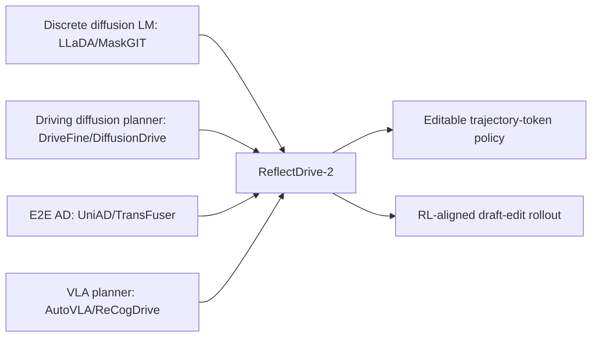

# ReflectDrive-2 참고 레퍼런스 요약

Semantic Scholar endpoint와 원문 Related Work에 등장하는 관련 연구를 기준으로 10개를 선별했다.

| Reference | 링크 | 관계 |
|---|---|---|
| DriveFine: Refining-Augmented Masked Diffusion VLA for Precise and Robust Driving | https://arxiv.org/abs/2602.14577 | 가장 가까운 선행 연구. masked diffusion driving VLA에 refinement를 추가하지만 drafter/editor joint RL coupling은 약함 |
| Unleashing the Potential of Diffusion Models for End-to-End Autonomous Driving | https://arxiv.org/abs/2602.22801 | diffusion planner를 E2E AD에 적용하는 배경 |
| LLaDA2.1: Speeding Up Text Diffusion via Token Editing | https://arxiv.org/abs/2602.08676 | token-to-token editing 아이디어의 language diffusion 계열 기반 |
| LLaDA2.0: Scaling Up Diffusion Language Models to 100B | https://arxiv.org/abs/2512.15745 | discrete diffusion LM scaling 및 serving optimization 배경 |
| From Denoising to Refining: A Corrective Framework for Vision-Language Diffusion Model | https://arxiv.org/abs/2510.19871 | denoising을 correction/refinement로 확장하는 multimodal diffusion 관점 |
| NAVSIM | https://arxiv.org/abs/2406.15349 | nuPlan 기반 closed-loop planning benchmark. ReflectDrive-2의 주요 평가 환경 |
| UniAD | https://arxiv.org/abs/2212.10156 | perception/prediction/planning 통합 end-to-end AD baseline |
| TransFuser | https://arxiv.org/abs/2205.15997 | camera/LiDAR fusion 기반 E2E planner baseline |
| AutoVLA | 원문 citation 참조 | 자율주행 VLA planner 비교군 |
| ReCogDrive | 원문 citation 참조 | camera-only VLA planner peer로 ReflectDrive-2가 비교하는 대상 |

## 관계도

