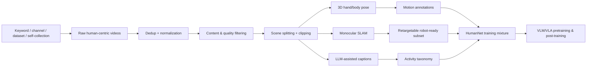

# HumanNet 분석 노트

## 1. 한 문장 결론

HumanNet은 “로봇 데이터가 부족하면 인간 중심 비디오를 물리적으로 구조화해 VLA pretraining substrate로 쓰자”는 데이터 중심 논문이며, VLA의 action grounding을 robot log 밖에서 확장하는 방향을 제시한다.

## 2. 문제 정의

Embodied AI/VLA는 language·vision model처럼 웹 규모 데이터로 쉽게 확장되지 않는다. Robot teleoperation data는 비싸고, embodiment/platform/control interface별로 분절되어 있으며, long-tail physical interaction coverage가 작다.

## 3. 핵심 기여

1. 100만 시간 human-centric video corpus 제안
2. first-person/third-person viewpoint를 명시적으로 taxonomy화
3. pose, motion, caption, activity label, retargetability 등 interaction-centric annotation 제공
4. Qwen/LingBot-VLA post-training ablation으로 egocentric human video의 transfer value 검증
5. privacy/license/quality filtering을 데이터셋 설계의 일부로 다룸

## 4. Architecture / pipeline

## 5. Input / Output / Action representation

| 항목 | HumanNet 관점 | VLA 연결 |
|---|---|---|
| Input | first-person/third-person human video | visual observation prior |
| Supervision | captions, motion descriptions, hand/body pose, SLAM, retargeting signal | language + motion grounding |
| Output | dataset/metadata/subsets | direct action은 아님; representation/action prior 제공 |
| Action grounding | hand-object contact, body motion, state change, procedural order | robot action expert가 배울 수 있는 physical structure |

## 6. Training recipe

논문 자체가 새 policy architecture를 제안하기보다, VLM/VLA backbone을 HumanNet egocentric subset으로 continued training한 뒤 동일 downstream robot post-training corpus에 투입하는 비교를 한다. 핵심은 architecture 고정, data source 변화만으로 validation loss를 비교했다는 점이다.

## 7. Dataset / Benchmark / Metric

- Dataset: 1M-hour human-centric video, egocentric + exocentric
- Validation: LingBot-VLA controlled post-training
- 비교: generic Qwen VLM, 100h real-robot CoBot, 1,000h HumanNet egocentric, 20,000h LingBot real-robot
- Metric: held-out task group validation loss

## 8. Open-loop vs closed-loop

이 논문은 closed-loop robot deployment 성능을 직접 보고하지 않는다. validation loss 기반의 controlled post-training 결과이므로, 실제 closed-loop success rate로 일반화하려면 추가 실험이 필요하다. 그래도 data pretraining stage에서 human video가 robot data shortage를 완화할 수 있음을 보여주는 early evidence로 의미가 있다.

## 9. 강점

- VLA/embodied learning의 scaling bottleneck을 data side에서 직접 공략
- viewpoint diversity와 physical relevance를 명시적 설계 원칙으로 둠
- egocentric human video vs real-robot data 비교가 실용적
- privacy/ethics를 limitation에 명확히 포함

## 10. 한계와 리스크

- human-to-robot embodiment gap은 여전히 큼
- dataset noise, geographic/social bias, label ambiguity 가능성
- 공개 데이터의 privacy/license risk
- closed-loop robot success까지는 아직 직접 증명하지 않음

## 11. 왜 찬호님 관심사에 중요한가

VLA for AD/robotics에서 모델 구조만큼 중요한 문제가 데이터 혼합이다. HumanNet은 “robot data 부족 → human video + motion annotation + retargeting + VLA post-training”이라는 scalable route를 제시한다. 자율주행에서도 driving video, human driving traces, ego/exo 관점을 어떻게 action-relevant representation으로 바꿀지에 대한 힌트가 된다.
