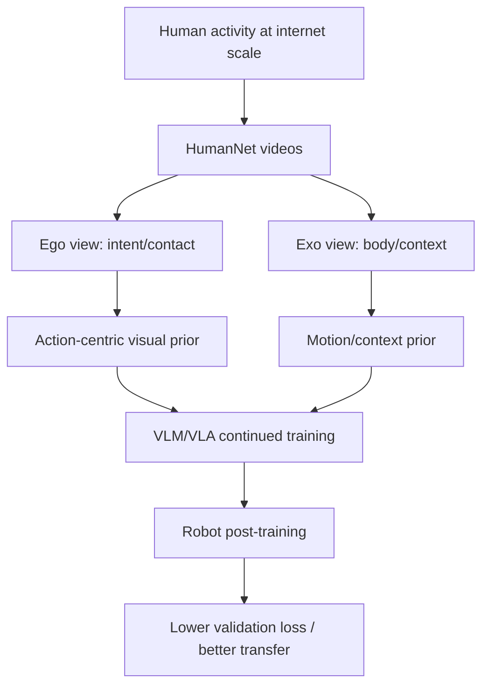

# HumanNet 학습 자료

## 선수 지식

- Egocentric video vs exocentric video
- VLM pretraining / continued training / post-training
- VLA policy: vision-language observation을 executable action으로 연결하는 모델
- Pose estimation, motion retargeting, SLAM
- Dataset curation: filtering, deduplication, annotation, privacy review

## Glossary

| 용어 | 설명 |
|---|---|
| Human-centric video | 인간 활동이 clip의 중심 신호인 비디오 |
| Egocentric video | 행위자 시점의 1인칭 비디오 |
| Exocentric video | 관찰자 시점의 3인칭 비디오 |
| Retargeting | 인간 motion을 robot/humanoid skeleton 또는 action space로 옮기는 과정 |
| Interaction-centric annotation | caption뿐 아니라 손/몸/물체/동작/상태 변화 정보를 담는 annotation |
| Embodiment gap | 인간 몸/손과 robot morphology/control space 사이의 차이 |

## 핵심 아이디어 도식

## 단계별 이해

1. **데이터 병목 파악**: robot data는 비싸고 좁다.
2. **대체 신호 찾기**: 사람의 video는 방대하고 physical interaction이 풍부하다.
3. **무작정 수집하지 않기**: human-centric filtering과 viewpoint taxonomy가 필요하다.
4. **action grounding에 필요한 annotation 부여**: pose, motion, hand-object contact, caption, retargetability를 만든다.
5. **VLA post-training에서 검증**: HumanNet pretraining이 real-robot initialization과 비교해 얼마나 transfer되는지 본다.

## 구현/배포 메모

- Human video를 robot policy에 직접 넣기보다, VLM encoder 또는 video-language representation을 먼저 pretrain하는 방식이 현실적이다.
- retargeting threshold나 pose confidence를 metadata로 유지해야 downstream mixture에서 sample weighting을 할 수 있다.
- privacy filtering은 기술 문제가 아니라 release policy와 결합된 운영 문제다.

## Study Questions

1. **왜 first-person video가 VLA에 특히 중요한가?**  
   손-물체 접촉, actor intent, action의 시각적 결과가 한 프레임 시퀀스에 직접 담기기 때문이다.

2. **HumanNet은 robot data를 완전히 대체하는가?**  
   아니다. representation prior와 pretraining source로 유용하지만 embodiment gap 때문에 robot-specific post-training은 여전히 필요하다.

3. **closed-loop 성능이 아닌 validation loss만으로 충분한가?**  
   초기 data-value 검증으로는 의미 있지만, 실제 배포 성능 판단에는 closed-loop success/safety metric이 추가로 필요하다.

## Reading roadmap

- Day 1: Ego4D/Ego-Exo4D로 viewpoint 개념 이해
- Day 2: R3M/EgoMimic으로 human video → robot learning transfer 이해
- Day 3: Open X-Embodiment/DROID로 robot data scale 한계 파악
- Day 4: HumanNet 본문과 validation experiment 복습
