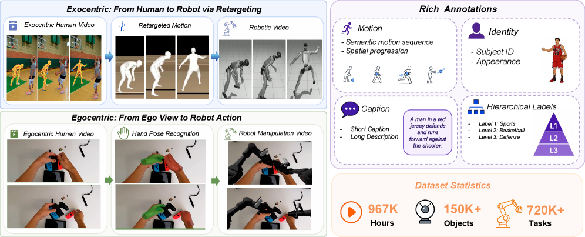
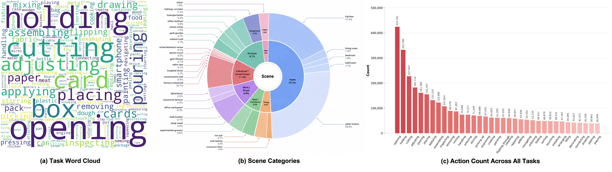
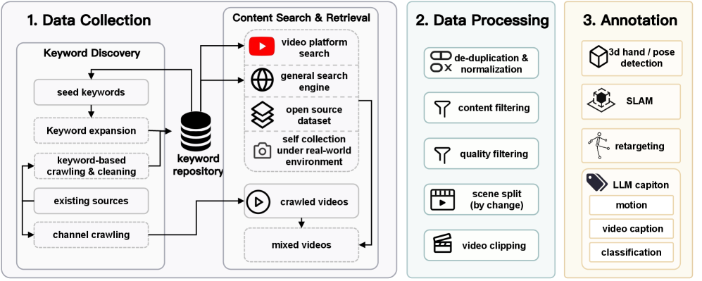
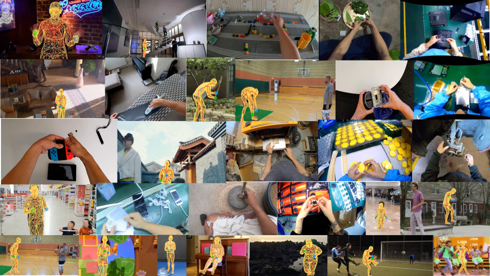
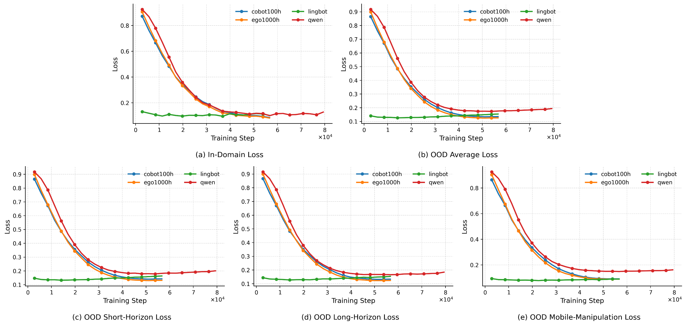

# HumanNet: 인간 중심 비디오 학습을 100만 시간 규모로 확장하기

- 원제: **HumanNet: Scaling Human-centric Video Learning to One Million Hours**
- Authors: Yufan Deng, Daquan Zhou
- arXiv: https://arxiv.org/abs/2605.06747
- Project: https://dagroup-pku.github.io/HumanNet/
- GitHub: https://github.com/DAGroup-PKU/HumanNet

## 저장한 Figures

- 원본: https://arxiv.org/html/2605.06747v1/x1.png

- 원본: https://arxiv.org/html/2605.06747v1/figs/fig/dataset.png

- 원본: https://arxiv.org/html/2605.06747v1/x2.png

- 원본: https://arxiv.org/html/2605.06747v1/x3.png

- 원본: https://arxiv.org/html/2605.06747v1/figs/fig/statics.png

- 원본: https://arxiv.org/html/2605.06747v1/figs/fig/loss.png

## 번역 범위와 읽는 법

원문 HTML 본문을 기준으로 Abstract, Introduction, dataset design/pipeline, validation experiment, limitations/conclusion을 중심으로 충실히 한국어 기술 번역했다. 표의 세부 숫자·부록·일부 citation 리스트는 장문 때문에 요약 번역으로 압축했으며, figure caption은 학습에 필요한 의미가 보존되도록 번역했다.

## Abstract 한국어 번역

진보하는 embodied intelligence는 이제 모델 크기보다 데이터 인프라 병목에 더 강하게 묶여 있다. HumanNet은 인간이 실제 세계와 상호작용하는 장면을 100만 시간 규모로 모은 human-centric video corpus로, 1인칭/3인칭 관점, 세밀한 활동, human-object interaction, 도구 사용, 장기 행동을 함께 포함한다. 단순 원본 비디오가 아니라 caption, motion description, 손/몸 관련 신호를 제공해 motion-aware·interaction-aware learning을 가능하게 하며, Qwen VLM 기반 VLA ablation에서 1,000시간의 egocentric HumanNet pretraining이 100시간의 real-robot data pretraining보다 낮거나 유사한 validation loss를 보여 인간 비디오가 robot data의 비용 효율적 대체재가 될 수 있음을 주장한다.

## 1. Introduction / 문제의식

언어와 vision-language modeling은 인터넷 규모의 text/image/multimodal data로 계속 확장되어 왔지만, physical interaction model은 여전히 작은 robot log, 특정 플랫폼, 특정 control interface, 제한된 benchmark task에 묶여 있다. 논문은 이 scale mismatch를 embodied intelligence의 핵심 병목으로 본다.

Human-centric video는 이 병목을 우회할 수 있는 후보이다. 사람은 일상 환경에서 manipulation, tool use, locomotion, navigation, social coordination, long-horizon procedural activity를 매우 큰 규모로 수행한다. 특히 first-person video는 actor-centered intent, hand-object contact, motor decision 이후의 시각적 결과를 담고, third-person video는 full-body motion, posture, scene context, multi-agent dynamics를 더 잘 보여준다.

논문은 HumanNet을 단순히 “큰 비디오 모음”이 아니라, physical AI pretraining을 위한 데이터 인프라로 설계한다. 중요한 점은 scale, viewpoint diversity, physical relevance, pretraining readiness를 모두 데이터 설계 원칙으로 둔다는 것이다.

## 2. Related Work 번역 요약

### Human-centric activity datasets
ActivityNet, Kinetics, Charades, AVA, Something-Something 같은 third-person dataset은 broad action과 object-centric temporal reasoning을 제공했고, EPIC-KITCHENS, Ego4D, Ego-Exo4D는 egocentric intent, hand-object contact, everyday procedure를 확장했다. HumanNet은 이 계보를 따르되 duration, viewpoint coverage, embodied pretraining 용도 면에서 훨씬 큰 규모와 넓은 coverage를 목표로 한다.

### Robot learning from human data
R3M, EgoScale, EgoVerse, EgoMimic, GR00T N1, Being-H 계열은 인간 활동 trace가 robot learning의 transferable prior가 될 수 있음을 보여준다. HumanNet은 이 방향에서 “모델”보다 “데이터 그 자체”를 기여로 내세운다. 즉 어떤 viewpoint를 유지할지, 어떤 taxonomy로 구조화할지, 어떤 filtering/annotation을 붙일지가 핵심이다.

## 3. HumanNet 데이터셋 번역

HumanNet은 인간 행동을 physical intelligence 학습의 가장 scalable한 원천으로 본다. 사람의 장기 상호작용은 object, environment, body configuration, task variation 면에서 robot teleoperation만으로 수집하기 어려운 폭을 제공한다. 1인칭 영상은 실행자의 intent와 hand-object contact를 보존하고, 3인칭 영상은 full-body motion, spatial context, multi-person interaction, 주변 scene geometry를 포착한다.

### 3.1 Human-centric video의 정의
논문은 human-centric video를 “clip의 조직 신호가 인간 활동인 footage”로 정의한다. 반드시 1인칭일 필요는 없지만, object manipulation, tool use, task-relevant navigation, assembly/disassembly, appliance/interface operation, object transport, multi-step procedure처럼 환경 상태 변화와 물리적 행동이 보여야 한다. 인간이 우연히 등장하거나 temporally coherent activity가 약한 passive video는 제외된다.

### 3.2 설계 원칙

| 원칙 | 의미 | VLA 관점의 중요성 |
|---|---|---|
| Scale | activity/environment/motion/action style의 long-tail을 덮을 만큼 커야 함 | rare behavior가 representation learning에 포함됨 |
| Viewpoint diversity | first-person과 third-person을 모두 보존·색인 | actor intent와 scene dynamics를 함께 학습 |
| Physical relevance | hand-object proximity, body motion, state change, action ordering 유지 | action grounding의 원천 |
| Pretraining readiness | chunking, metadata, filtering, captions, motion annotations | VLM/VLA post-training mixture로 바로 사용 가능 |

## 4. Data pipeline / Figure 3 번역

HumanNet pipeline은 세 단계로 구성된다.

1. **Data Collection**: seed keyword를 확장하고, keyword crawling, channel crawling, existing source integration으로 URL pool을 만든다. video platform, web search, open-source dataset, self-collection을 통합한다.
2. **Data Processing**: de-duplication, normalization, content filtering, quality filtering, scene splitting, clipping으로 raw video를 clip-level sample로 바꾼다. motion blur, heavy occlusion, static framing 등 학습에 불리한 sample을 제거한다.
3. **Annotation**: 3D hand/body pose detection, monocular SLAM, motion retargeting, LLM-assisted captioning을 통해 caption, motion description, activity classification을 생성한다. retargeting error가 15mm 미만이고 valid-frame coverage가 60% 이상인 clip은 robot-ready subset으로 분류된다.

이 설계는 pixel을 motion geometry, robot-relevant kinematics, activity semantics와 연결한다. 따라서 HumanNet은 unlabeled visual stream이 아니라 embodied pretraining substrate가 된다.

## 5. Corpus statistics / 구성 해석

논문은 HumanNet의 corpus-level statistics를 semantic coverage와 distributional structure 두 축에서 본다. semantic axis에서는 manipulation verb, everyday object, indoor/outdoor scene, long-tail activity category가 중요하고, physical-quality axis에서는 pose confidence, motion score, motion length, retargetable segment가 중요하다.

핵심은 “100만 시간”이라는 aggregate duration보다, 어떤 subset이 어떤 downstream task에 맞는지를 드러내는 metadata 구조다. 예를 들어 high-confidence pose subset은 grounding에 적합하고, heavier-tail region은 long-tail behavior coverage에 유용하다.

## 6. Validation of egocentric data 번역

논문은 HumanNet이 실제 VLA post-training에 도움이 되는지 검증하기 위해 LingBot-VLA architecture를 고정하고 pretraining source만 바꾸는 controlled experiment를 수행한다. 비교 대상은 다음 네 가지다.

1. generic Qwen-based VLM
2. Qwen VLM + 100시간 real-robot CoBot data adaptation
3. Qwen VLM + 1,000시간 HumanNet egocentric video adaptation
4. LingBot: 20,000시간 real-robot training을 받은 Qwen backbone/action expert

모든 variant는 동일한 downstream robot interaction corpus(100 tasks, task당 20 episodes, 총 34시간)로 post-training된다. Figure 6의 validation loss 결과에서 HumanNet egocentric pretraining은 generic VLM과 robot-specialized initialization 사이의 gap을 크게 줄이고, 여러 task group에서는 100시간 real-robot data보다 낮거나 유사한 loss를 보인다.

이 결과는 HumanNet의 중심 주장, 즉 first-person human video가 단순 visual diversity가 아니라 actor-centered cue, hand-object contact, procedural structure를 통해 embodied action learning으로 transfer될 수 있다는 주장을 뒷받침한다.

## 7. Downstream use cases 번역

- **Video/VLM pretraining**: generic internet video보다 hand, contact, motion structure가 강한 visual-language representation을 학습할 수 있다.
- **World-action model training**: action-conditioned forward dynamics, future visual state prediction, physically executable behavior grounding에 적합하다.
- **Motion-aware representation learning**: first-person hands/contact와 third-person full-body/spatial context를 결합한다.
- **Human-to-robot transfer**: direct replacement는 아니지만 action abstraction 또는 alignment와 결합하면 robot-relevant state/action representation의 prior가 된다.
- **Multimodal objectives for physical AI**: masked/predictive video modeling, language-video alignment, procedural boundary prediction, pose/motion prediction 등을 지원한다.

## 8. Limitations / Ethics 번역

HumanNet의 가장 큰 한계는 human behavior가 robot behavior와 같지 않다는 점이다. 100만 시간 규모라도 인간 손, 몸, 도구 사용, mobility와 robot control space 사이의 embodiment gap을 제거하지 못한다. 기대 가치는 직접 모방보다 representation learning과 transferable prior에 있다.

또한 scale은 noise를 동반한다. label ambiguity, inconsistent task boundary, missing metadata, viewpoint imbalance, variable quality가 존재하며 caption/pose/motion annotation도 error를 가진다. 따라서 subset quality와 annotation confidence의 투명한 보고가 필요하다.

마지막으로 privacy와 safety issue가 크다. First-person video는 bystander, private interior, document, screen을 포함할 수 있고, third-person video도 identifiable people과 private/social activity를 포함할 수 있다. 공개 release에는 license review, redaction policy, restricted-content filtering, access control, documentation이 필수다.

## 9. Conclusion 번역

HumanNet은 1인칭·3인칭 인간 중심 비디오를 caption, motion annotation, hand/body signal과 결합한 100만 시간 규모 corpus다. controlled VLA post-training에서 1,000시간 egocentric video initialization은 100시간 real-robot data initialization과 유사하거나 더 나은 validation behavior를 보이며, 20,000시간 real-robot baseline과의 gap을 줄인다. 논문은 general-purpose embodied foundation model로 가기 위해서는 robot-only data가 아니라 governance와 curation이 결합된 human activity video scaling이 필요하다고 결론짓는다.
