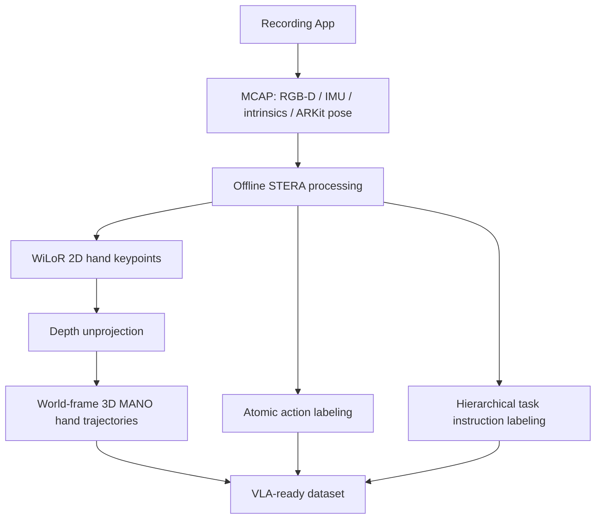

# MobileEgo Anywhere: 범용 하드웨어 기반 장기 egocentric 데이터 수집 오픈 인프라 — analysis

## 1. 한 문장 결론

**MobileEgo Anywhere는 VLA의 모델 문제가 아니라 데이터 병목을 정면으로 다룬 논문으로, iPhone 기반 RGB-D/IMU/6-DoF pose/hand trajectory 수집 pipeline을 통해 long-horizon egocentric demonstration을 commodity hardware로 확장하려는 시도다.**

## 2. Problem

VLA policy가 complex robotic task를 수행하려면 짧은 clip이 아니라 수십 분 단위의 stateful interaction이 필요하다. 기존 egocentric dataset은 action recognition에는 충분할 수 있지만, robot policy가 필요로 하는 trajectory, pose, depth, hierarchical instruction, persistent state tracking이 부족하다.

## 3. Contributions

1. 354 session, 200시간, 16 contributors의 long-form egocentric household dataset.
2. iPhone/ARKit 기반 6-DoF pose, RGB-D, IMU, camera intrinsics의 synchronized MCAP logging.
3. STERA processing pipeline: 3D hand trajectory, atomic action labels, hierarchical instruction tree 생성.
4. hand pose 품질과 pose drift를 ground-truth-free/marker 기반으로 평가.
5. specialized robotics hardware 없이 global contributors가 데이터를 모을 수 있는 open infrastructure.

## 4. Architecture / Pipeline

## 5. Input → Output / Action Representation

| 항목 | 내용 |
|---|---|
| Input | head-mounted RGB-D video, IMU, ARKit camera pose, intrinsics, depth map |
| Intermediate | world-frame camera trajectory, 3D hand keypoints/MANO pose, action spans |
| Output | VLA pretraining용 egocentric trajectory dataset + hierarchical language labels |
| Action representation | robot action을 직접 출력하지는 않지만, hand trajectory와 atomic/hierarchical action label이 action grounding proxy 역할 |

## 6. Training Recipe 관점

논문 자체가 VLA policy를 훈련하기보다는 data layer를 제공한다. 추천되는 사용법은 다음과 같다.

1. RGB-D/pose/hand trajectory로 visual-spatial representation pretraining.
2. atomic action labels로 short-horizon manipulation primitive 학습.
3. hierarchy labels로 instruction following, sub-goal planning, long-horizon memory 학습.
4. robot dataset과의 alignment/IK mapping으로 human hand trajectory를 robot end-effector action prior로 전이.

## 7. Dataset / Benchmark / Metric

- Dataset: 200 hours, 354 sessions, 16 contributors, household activities.
- Session: average 21.2 min, max ~108 min.
- Pose drift: ArUco revisit 기준 대부분 <1cm, trajectory length 대비 <0.1%.
- Hand pose: 98 sessions / 1.19M frames / 25.2h 평가, detection success 86.2%, mean confidence 0.73.
- Bone CV: median left 1.27%, right 1.43%, pinky tip 제외 <1%.
- Joint plausibility: 99.99% 이상 biomechanical bounds 내.

## 8. Open-loop vs Closed-loop

이 논문은 policy closed-loop benchmark가 아니라 dataset/infrastructure 논문이다. 따라서 직접적인 closed-loop driving/robot success rate는 없다. 다만 long-horizon trajectory와 hierarchical label은 closed-loop policy training 전 단계의 data coverage를 개선한다.

## 9. Strengths

- commodity hardware 기반이라 데이터 수집 확장성이 높다.
- RGB-D, IMU, 6-DoF pose, hand trajectory, language hierarchy가 한 pipeline에 묶인다.
- long-horizon state consistency를 명시적으로 겨냥한다.
- VLA pretraining의 data democratization이라는 방향성이 명확하다.

## 10. Limitations / Risks

- ARKit은 closed-source라 tracking failure mode를 완전히 분석하기 어렵다.
- human hand trajectory가 robot morphology/control로 바로 변환되지는 않는다. IK/retargeting gap이 남는다.
- dataset contributors/environment 다양성이 internet-scale에는 아직 부족하다.
- privacy/consent 관리가 scale-out의 핵심 operational risk다.

## 11. 찬호님 관심 주제와의 관련성

- **VLA**: action grounding을 위한 human egocentric trajectory data source.
- **E2E autonomy/robotics**: long-horizon state tracking과 hierarchical planning supervision.
- **VLM**: first-person visual-spatial understanding pretraining.
- **자율주행**: 직접 driving 논문은 아니지만, long-horizon egocentric sensor logging과 state consistency는 autonomous driving data pipeline 설계와 유사한 문제를 공유한다.
