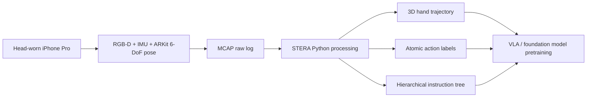

# MobileEgo Anywhere: 범용 하드웨어 기반 장기 egocentric 데이터 수집 오픈 인프라

- 원제: **MobileEgo Anywhere: Open Infrastructure for long horizon egocentric data on commodity hardware**
- 저자: Senthil Palanisamy, Abhishek Anand, Satpal Singh Rathor, Pratyush Patnaik, Shubhanshu Khatana
- arXiv: [2605.05945](https://arxiv.org/abs/2605.05945) · HF: https://huggingface.co/papers/2605.05945
- 번역 범위: arXiv HTML/PDF 본문 기준으로 Abstract, Introduction, Related Work, Overview, Dataset/Evaluation, Conclusion, Ethics/Privacy, 주요 Figure caption을 충실히 번역·정리했다. 수식·표는 의미 보존 중심으로 재서술했으며, 긴 표의 모든 수치는 핵심 수치 위주로 옮겼다.

## Abstract 한국어 번역

최근 Vision-Language-Action(VLA) 모델의 발전은 대규모 egocentric dataset에 대한 수요를 크게 키웠다. 그러나 기존 데이터셋은 보통 몇 분 수준의 짧은 episode에 제한되어, 복잡한 로봇 작업 실행에 필요한 long-horizon temporal dependency를 충분히 담지 못한다. 이 간극을 메우기 위해 논문은 **MobileEgo Anywhere**를 제안한다. 이 프레임워크는 commodity mobile hardware, 특히 LiDAR가 있는 iPhone과 smartphone sensor suite를 활용해 한 시간 이상 지속되는 robust egocentric trajectory를 수집한다. 핵심 기여는 (1) persistent state tracking을 포함하는 200시간 규모의 long-form egocentric dataset 공개, (2) 누구나 egocentric data를 기록·처리할 수 있는 오픈 인프라 **STERA**와 mobile app 공개, (3) raw mobile capture를 VLA/foundation model 학습 가능한 표준 포맷으로 변환하는 처리 pipeline 제공이다.

## I. Introduction 번역·정리

로보틱스는 VLA 모델의 등장으로 패러다임 전환을 겪고 있다. VLA는 시각 관측, 자연어 instruction/reasoning, 그리고 executable action을 하나의 policy 학습 문제로 묶는다. 선행 scaling-law 연구는 dataset scale이 커질수록 validation loss가 log-linear하게 감소함을 보였고, 이는 일반화 가능한 robotics policy를 만들려면 현재 기관 단위 수집량을 넘어서는 데이터 다양성과 규모가 필요함을 시사한다.

기존 데이터 소스는 각기 장단점이 있다. 인터넷 비디오는 semantic pretraining에는 풍부하지만 force/contact dynamics가 부족하다. Simulation은 rigid-body task에서는 거의 무한 확장이 가능하지만 deformable object나 fluid가 포함된 real-world task에서는 sim-to-real gap이 크다. Robot teleoperation과 kinesthetic teaching은 고품질 action sample을 제공하지만 비용과 하드웨어 제약 때문에 scale-out이 어렵다. 그래서 최근에는 egocentric human video, UMI 같은 human demonstration 기반 접근이 부상했다.

MobileEgo Anywhere의 문제의식은 “VLA pretraining에는 long-horizon human interaction trajectory가 필요한데, 기존 egocentric dataset은 episode가 너무 짧고 state consistency가 끊긴다”는 것이다. 요리, 청소, 정리처럼 실제 생활 작업은 수십 분 동안 object state가 누적되고, model은 중간 단계뿐 아니라 전체 task plan과 long-range dependency를 학습해야 한다.

## II. Related Work 번역·정리

Ego4D, EPIC-KITCHENS 같은 초기 대규모 egocentric dataset은 action recognition과 localized human-object interaction 분석에 큰 역할을 했다. 하지만 VLA policy learning에 필요한 continuous 6-DoF pose tracking, RGB-D, world-frame hand trajectory, long-horizon state consistency는 제한적이다. EgoScale처럼 precise pose를 포함하는 연구도 있지만 episode가 짧다.

UMI는 in-the-wild robot teaching의 hardware barrier를 낮췄지만 여전히 특수 gripper, calibration, mount setup이 필요하다. MobileEgo는 commodity smartphone을 universal sensor suite로 보고, ARKit/ARCore 계열 VIO(Visual-Inertial Odometry)를 활용해 별도 robot hardware 없이 long-horizon interaction data를 수집하려 한다.

또 하나의 배경은 SLAM drift 문제다. long-horizon egocentric SLAM은 cumulative drift에 취약하지만, modern mobile AR framework는 IMU와 visual keyframe fusion을 통해 edge device에서도 상당히 안정적인 tracking을 제공한다. MobileEgo는 이 성숙한 mobile SLAM stack을 VLA dataset 생성으로 가져온다.

## III. Overview / Pipeline 번역

MobileEgo Anywhere는 multimodal egocentric data의 수집과 후처리를 자동화하는 end-to-end framework다. 하드웨어는 LiDAR-enabled iOS device(iPhone Pro)를 head-worn rig에 장착해 사용자 손과 workspace를 first-person view로 촬영한다. 수집 중 mobile app은 ARKit으로 RGB-D stream, 6-DoF camera pose, per-frame depth map, high-frequency IMU, camera intrinsic을 동기화해 MCAP format으로 기록한다.

후처리 Python suite는 raw log를 VLA 학습용 dataset으로 변환한다. 주요 출력은 다음과 같다.

| 출력 | 의미 | VLA 학습에서의 역할 |
|---|---|---|
| 3D hand trajectories | 2D keypoint를 depth로 unproject한 뒤 camera pose로 global frame에 정렬 | human motion을 robot end-effector frame으로 매핑하는 supervision |
| atomic action labels | 짧은 조작 단위 | low-level manipulation primitive 학습 |
| hierarchical task instructions | atomic → episode → sub-goal → session 구조 | long-horizon planning 및 language-conditioned policy 학습 |
| RGB-D + 6-DoF pose | visual/depth/pose 동기화 | spatial grounding, reconstruction, state tracking |

데이터 수집은 voice command(start/stop)로 hands-free 운영되며, ARKit sensor fusion이 RGB-D와 IMU를 timestamp 기준으로 동기화한다. 논문은 이 인프라와 app, processing suite, dataset download/visualization resource를 공개한다고 명시한다.

## IV. Dataset and Evaluation 번역·정리

공개 dataset은 16명의 contributor가 수행한 354개 session, 총 200시간의 household activity로 구성된다. 평균 session 길이는 21.2분이고, 최장 session은 약 108분의 continuous recording이다. 이는 기존 egocentric benchmark보다 long-horizon state tracking에 유리하다.

Dataset은 각 RGB frame에 LiDAR depth map과 ARKit 6-DoF pose를 붙인다. WiLoR 기반 hand estimation pipeline은 21-joint MANO hand pose를 같은 world frame에 anchor한다. instruction label은 atomic span, episode, sub-goal, session의 4단계로 구성되어, downstream model이 개별 조작부터 전체 session plan까지 다양한 granularity로 language conditioning을 학습할 수 있게 한다.

ARKit pose drift는 ArUco marker를 장면에 놓고 long session 중 midpoint와 end에서 다시 관측하는 방식으로 평가했다. 세 환경에서 drift는 대부분 1cm 미만, 전체 trajectory length 대비 0.1% 미만으로 보고된다. 이는 closed-source ARKit을 정량적으로 완전히 검증한 것은 아니지만, VLA downstream application에 사용할 수 있을 정도의 안정적 tracking 가능성을 보여준다.

Hand pose 품질은 ground-truth-free consistency metric으로 점검한다. 98 session, 1.19M frame, 25.2시간을 대상으로 bone length constancy, joint angle plausibility, wrist dynamics를 측정했다. hand detection 성공률은 86.2%, mean WiLoR confidence는 0.73이다. bone length CV median은 left 1.27%, right 1.43%이며, pinky distal phalanx를 제외하면 median CV가 1% 미만으로 떨어진다. joint flexion angle은 99.99% 이상이 biomechanical limit 내에 있고, wrist velocity/acceleration 분포도 일상 활동 범위와 일치한다.

## 주요 Figure / Caption 번역

- https://arxiv.org/html/2605.05945/2605.05945v5/images/capture_person.jpeg — 다운로드 실패: HTTP Error 404: Not Found — (a) MobileEgo Anywhere recording setup.
- https://arxiv.org/html/2605.05945/2605.05945v5/images/episode_length.png — 다운로드 실패: HTTP Error 404: Not Found — (b) Comparison of episode duration.
- https://arxiv.org/html/2605.05945/2605.05945v5/images/trajectory_blue.png — 다운로드 실패: HTTP Error 404: Not Found — (c) Long-horizon trajectory tracked from ARKit.
- https://arxiv.org/html/2605.05945/2605.05945v5/x1.png — 다운로드 실패: HTTP Error 404: Not Found — Figure 2 : Hierarchical decomposition of a 36-minute cooking session (217 atomic spans). A single session goal decomposes into five sub-goals, each containing two to four episodes. Sub-goal durations range from 1 to 17 minutes; episode durations from 23 s to 345 s. Numbers at the bottom row indicate the atomic span count per episode. The color grouping highlights how episodes cluster under semantically coherent sub-goals.
- https://arxiv.org/html/2605.05945/2605.05945v5/x2.png — 다운로드 실패: HTTP Error 404: Not Found — Figure 3 : Hierarchical instruction labeling across 354 sessions (45,415 atomic spans). (a) Temporal scale separation: each level of the hierarchy occupies a distinct temporal band, with consistent 4–8 × \times separation between adjacent levels (median durations: atomic spans 5 s, episodes 42 s, sub-goals 3.9 min, sessions 15.5 min). (b) Episode and sub-goal counts scale linearly with session length. (c) Episode granularity: 78% of episodes contain 10 or fewer atomic spans (median 5, mean 8.2), providing compact supervision units for downstream policy learning.
- https://arxiv.org/html/2605.05945/2605.05945v5/images/mobileego_pipeline_v4_clean_3x_lanczos.png — 다운로드 실패: HTTP Error 404: Not Found — Figure 4 : Overall data flow: raw mobile capture (RGB-D, IMU, ARKit pose) is logged in MCAP format, then processed offline into 3D hand trajectories, atomic action labels, and a hierarchical instruction tree.
- https://arxiv.org/html/2605.05945/2605.05945v5/images/task_diversity_clean_cropped.png — 다운로드 실패: HTTP Error 404: Not Found — Figure 5 : Task diversity across 354 sessions and 16 contributors. Atomic action labels span a long-tail vocabulary covering household manipulation domains (cooking, cleaning, sewing, organizing) with ∼ \sim 45K unique action categories.
- https://arxiv.org/html/2605.05945/2605.05945v5/x3.png — 다운로드 실패: HTTP Error 404: Not Found — Figure 6 : Per-bone coefficient of variation (CV) of bone length across all valid frames, pooled over 98 sessions. Each bone of the 21-joint MANO skeleton should maintain constant length; lower CV indicates more consistent estimation. The pinky distal bone (joint 17 → \to 20) shows elevated CV because its physical length ( ∼ \sim 2 cm) amplifies the relative effect of a fixed absolute noise floor ( ∼ \sim 1.5 mm). Excluding this outlier, median CV is below 1%.
- https://arxiv.org/html/2605.05945/2605.05945v5/x4.png — 다운로드 실패: HTTP Error 404: Not Found — Figure 7 : Distribution of estimated joint flexion angles for each finger, pooled over 98 sessions. Shaded regions indicate published biomechanical flexion limits for MCP, PIP, and DIP joints. Over 99.99% of estimated angles fall within anatomical bounds.
- https://arxiv.org/html/2605.05945/2605.05945v5/x5.png — 다운로드 실패: HTTP Error 404: Not Found — Figure 8 : Wrist velocity and acceleration distributions for left and right hands, pooled over 98 sessions. Shaded bands indicate typical ranges for activities of daily living. Median velocity is 0.34 m/s (left) and 0.27 m/s (right); median acceleration is 2.7 m/s 2 (left) and 1.5 m/s 2 (right).

## V. Conclusion 번역

논문은 표준 consumer hardware만으로 VLA-ready egocentric dataset을 대규모로 수집할 수 있는 accessible infrastructure를 제시했다. 핵심은 long-horizon activity tracking이다. 최장 2시간에 가까운 continuous episode는 장기 state tracking, 복합 task planning, hierarchical action-language alignment를 연구하는 데 유용하다. 저자들은 MobileEgo Anywhere가 VLA dataset creation을 democratize하고, 더 나은 future VLA model로 가는 path를 제공하기를 기대한다.

## VI. Ethics and Privacy 번역

모든 contributor는 recording, processing, public release에 대한 informed consent에 서명했다. 참여자는 동의하지 않은 사람이 있는 환경에서는 녹화를 피하고, frame에 비동의자가 들어오면 녹화를 멈추도록 안내받았다. 우발적으로 등장한 사람의 얼굴은 blur 처리했다.
