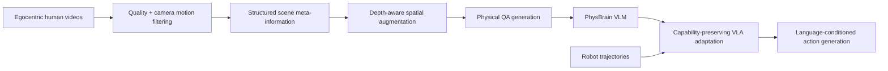

# PhysBrain 1.0 기술 보고서: 인간 egocentric video에서 물리 상식 supervision을 추출해 VLA로 전이하기 — analysis

## 1. 한 문장 결론

**PhysBrain 1.0은 VLA를 robot trajectory imitation만으로 키우는 대신, human egocentric video를 structured physical QA로 변환해 base VLM에 물리 상식을 주입한 뒤 VLA policy로 전이하는 ‘physical prior → action grounding’ 접근이다.**

## 2. Problem

Robot trajectory collection은 비싸고 platform-specific이며, trajectory fitting은 physical regularity를 학습했다는 보장을 주지 않는다. VLA policy가 viewpoint, scene layout, object state, task composition 변화에 강하려면 action imitation 이전에 physical commonsense가 필요하다.

## 3. Contributions

1. human first-person video를 scene elements / spatial dynamics / action execution / depth-aware relations로 구조화하는 data engine.
2. structured meta-record를 physically grounded QA로 변환해 base VLM을 학습.
3. VLM capability를 보존하면서 VLA policy로 전이하는 capability-preserving adaptation.
4. ERQA, PhysBench, SimplerEnv, LIBERO, RoboCasa 등에서 physical understanding과 embodied control을 함께 평가.
5. limited robot data로도 human-derived physical prior가 downstream control에 도움이 된다는 주장.

## 4. Architecture / Pipeline

## 5. Input-Output / Action Representation

| 단계 | Input | Output |
|---|---|---|
| Data engine | human egocentric video frames | physical meta-record + QA |
| VLM training | image/video + physical QA | embodied reasoning-capable VLM |
| VLA adaptation | VLM features + language + robot trajectories | language-conditioned robot action policy |
| Evaluation | simulation/real robot observations + instruction | task success / control performance |

Action representation의 세부는 benchmark/robot policy adaptation에 따라 달라지며, 논문의 핵심은 action head 자체보다 **physical prior를 잃지 않고 action policy로 옮기는 방법**이다.

## 6. Training Recipe

1. egocentric video clip filtering.
2. structured meta-information extraction: scene elements, spatial dynamics, action execution.
3. depth-aware augmentation과 QA rendering.
4. physically informed VLM training.
5. general multimodal retention data mixing.
6. robot trajectory 기반 VLA adaptation with capability preservation and language sensitivity.

## 7. Datasets / Benchmarks / Metrics

- Source data: Ego4D, BuildAI, EgoDex, EPIC, SEA-Small, FineVision 등.
- VLM benchmarks: ERQA, PhysBench, MME, MMMU, OCRBench, RealWorldQA, TextVQA.
- VLA benchmarks: SimplerEnv-WidowX, SimplerEnv-GoogleRobot, LIBERO, RoboCasa-GR1.
- Metrics: benchmark score, robot task success rate, out-of-domain performance.

## 8. Open-loop vs Closed-loop

VLM QA benchmark는 open-loop understanding evaluation에 가깝다. VLA simulation/robot benchmark는 rollout success를 보기 때문에 closed-loop 성격이 강하다. PhysBrain의 강점은 두 축을 함께 측정해 “reasoning만 좋아졌는가?”가 아니라 “action grounding에도 도움이 되는가?”를 확인하려는 점이다.

## 9. Strengths

- human video의 scale과 robot control의 action grounding을 연결한다.
- generic caption이 아닌 structured physical supervision을 사용한다.
- catastrophic forgetting과 language shortcut 문제를 설계 목표로 다룬다.
- VLM benchmark와 VLA benchmark를 함께 제시해 bridge claim을 강화한다.

## 10. Limitations / Safety / Deployment

- LLM/VLM 기반 annotation pool이 만든 QA에는 hallucination/bias가 들어갈 수 있다.
- human egocentric physical prior가 모든 robot embodiment에 그대로 맞지는 않는다.
- benchmark success가 real-world safety를 보장하지 않는다. 특히 contact-rich manipulation에서는 failure cost가 크다.
- capability-preserving adaptation은 latency/compute overhead를 가질 수 있어 edge robot deployment 검토가 필요하다.

## 11. 찬호님 관심 주제와의 관련성

- **VLA**: physical commonsense → action policy transfer라는 핵심 연구 방향.
- **VLM**: VLM을 단순 perception model이 아니라 physical reasoning prior로 사용.
- **E2E autonomous/robotics**: imitation-only E2E의 약점을 physical prior로 보완하는 구조.
- **자율주행**: 직접 AD 논문은 아니지만 world/action grounding, out-of-domain robustness, structured physical supervision은 driving VLA/world model에도 응용 가능하다.
