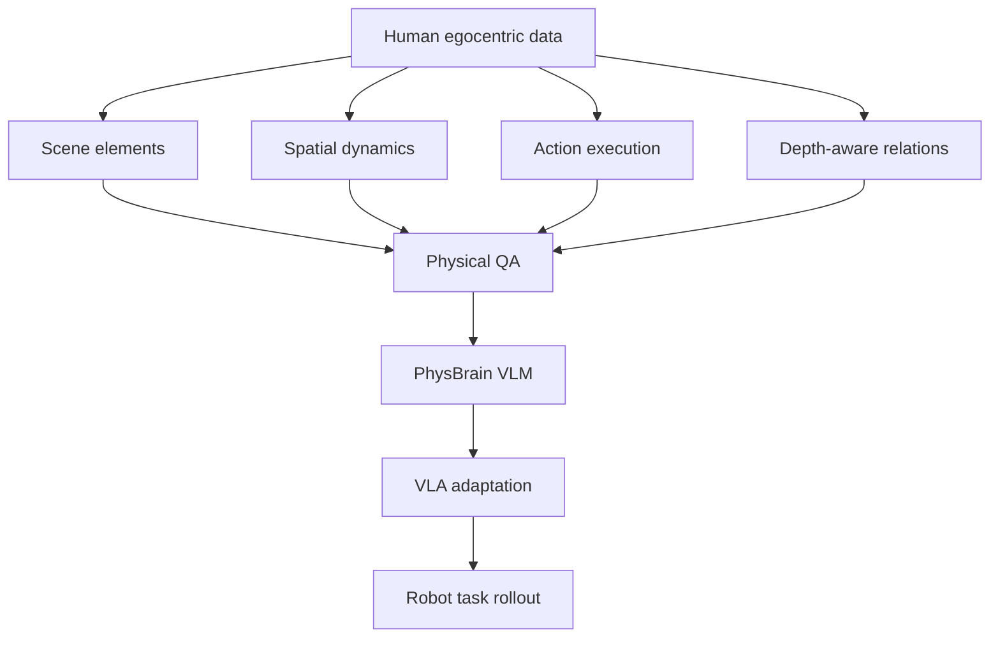

# PhysBrain 1.0 기술 보고서: 인간 egocentric video에서 물리 상식 supervision을 추출해 VLA로 전이하기 — learning guide

## 선수 지식

- VLM/LVLM instruction tuning
- VLA policy adaptation
- Egocentric video annotation
- Robot manipulation benchmarks: SimplerEnv, LIBERO, RoboCasa
- Catastrophic forgetting and capability preservation

## Glossary

| 용어 | 설명 |
|---|---|
| physical commonsense | object, depth, contact, reachability, state change에 관한 상식적 물리 이해 |
| structured meta-information | raw video를 JSON-like schema로 변환한 중간 physical record |
| capability-preserving adaptation | VLM의 일반 multimodal capability를 잃지 않도록 하는 VLA fine-tuning |
| language-sensitive adaptation | policy가 language instruction을 무시하지 않도록 유지하는 adaptation |
| action grounding | physical/language reasoning을 executable robot action으로 연결 |

## 핵심 아이디어를 5단계로 이해하기

1. Robot trajectory만 늘리면 platform coverage와 physical reasoning이 부족하다.
2. Human egocentric video에는 contact, reachability, state change 등 physical prior가 많다.
3. 그러나 raw video/caption은 약하므로 structured meta-record가 필요하다.
4. meta-record를 QA로 바꿔 VLM이 physical reasoning을 학습하게 한다.
5. VLA adaptation에서는 이 prior를 잃지 않도록 robot action policy로 전이한다.

## Architecture Map

## Key Equations / Representations

논문은 특정 closed-form equation보다 representation design이 핵심이다. 중요한 representation은 다음과 같다.

- `scene_elements`: object, material, geometry, state.
- `spatial_dynamics`: initial layout, relation changes, depth ordering.
- `action_execution`: local manipulation, sub-action order, task objective.
- `physical QA`: 위 record를 자연어 question-answer supervision으로 rendering한 학습 target.

## Implementation Notes

- QA 생성 전 structured record validation이 중요하다. schema validation 없이 바로 caption-to-QA를 만들면 hallucination이 policy supervision으로 굳을 수 있다.
- retention data를 섞어 VLM의 general capability를 유지해야 한다.
- VLA adaptation에서는 language ablation을 꼭 해야 한다. language를 제거해도 성능이 비슷하다면 policy가 visual shortcut에 빠졌을 수 있다.

## Study Questions & Answers

1. **PhysBrain이 generic caption을 피하는 이유는?**  \n   caption은 physical feasibility와 action order를 충분히 담지 못해 VLA action grounding supervision으로 약하다.

2. **왜 human video가 robot data를 완전히 대체하지 못하는가?**  \n   robot embodiment, gripper dynamics, control frequency, action space가 다르기 때문에 robot-specific adaptation은 여전히 필요하다.

3. **이 논문의 핵심 리스크는?**  \n   annotation model이 만든 physical QA의 오류가 VLM/VLA에 체계적으로 주입될 수 있다는 점이다.

## Reading Roadmap

1. Figure 1 system overview로 전체 pipeline 파악.
2. Data engine schema를 읽고 어떤 physical factor를 명시하는지 정리.
3. VLM benchmark와 VLA benchmark가 각각 어떤 claim을 지지하는지 분리.
4. OpenVLA/π0/GR00T와 비교해 adaptation philosophy 차이를 정리.
