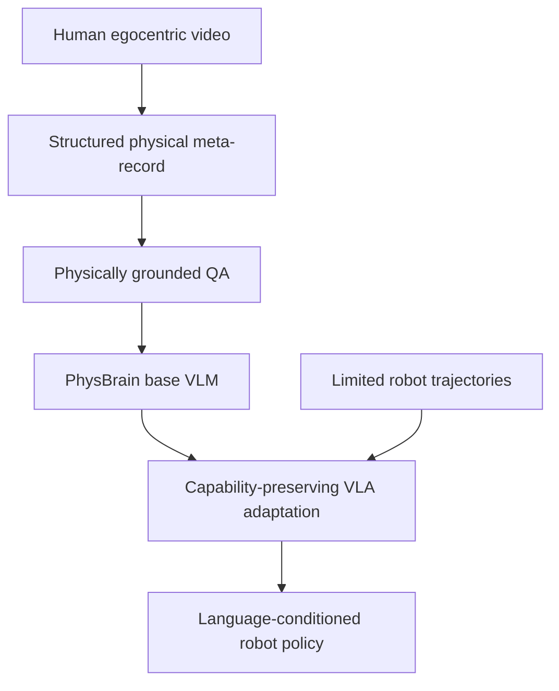

# PhysBrain 1.0 기술 보고서: 인간 egocentric video에서 물리 상식 supervision을 추출해 VLA로 전이하기

- 원제: **PhysBrain 1.0 Technical Report**
- 저자: Shijie Lian, Bin Yu, Xiaopeng Lin, Changti Wu, Hang Yuan, Xiaolin Hu, Zhaolong Shen, Yuzhuo Miao, Haishan Liu, Yuxuan Tian, Yukun Shi, Cong Huang, Kai Chen
- arXiv: [2605.15298](https://arxiv.org/abs/2605.15298) · HF: https://huggingface.co/papers/2605.15298
- 번역 범위: 22쪽 technical report의 Abstract, Introduction, Data Engine, Architecture, Experiments, Real-world Experiments, Discussion/Conclusion 및 주요 figure/table 결과를 기술 번역 형태로 정리했다. 모든 appendix 세부 수치의 line-by-line 번역은 생략하고 핵심 실험과 설계 의도 중심으로 보존했다.

## Abstract 한국어 번역

Vision-Language-Action(VLA) 모델은 빠르게 발전했지만, robot trajectory만으로는 넓은 물리 이해를 학습하기에 coverage가 제한된다. PhysBrain 1.0은 보완적 경로를 탐구한다. 대규모 human egocentric video를 robot adaptation 이전에 **structured physical commonsense supervision**으로 변환하는 것이다. data engine은 scene elements, spatial dynamics, action execution, depth-aware relations를 추출하고, 이를 QA supervision으로 바꿔 PhysBrain VLM을 학습한다. 이렇게 학습된 physical prior는 capability-preserving 및 language-sensitive adaptation design을 통해 VLA policy로 전이된다. ERQA, PhysBench, SimplerEnv-WidowX, LIBERO, RoboCasa 등 multimodal QA 및 embodied control benchmark에서 SOTA 수준의 결과와 특히 SimplerEnv out-of-domain 성능을 보인다. 이는 human interaction video에서 physical commonsense를 scale하는 것이 multimodal understanding과 robot action 사이의 효과적 bridge가 될 수 있음을 시사한다.

## 1. Introduction 번역·정리

최근 VLA system은 large multimodal model을 robot control로 adaptation할 수 있음을 보여줬다. 그러나 많은 연구는 여전히 robot trajectory를 수집하고 action policy를 fitting한 뒤, robot interaction data를 더 많이 모으는 방식으로 scale한다. 이 경로는 중요하지만, 비용이 높고 platform-dependent이며, viewpoint/scene/object state/task composition 변화에 robust한 physical regularity를 model이 실제로 학습했다는 보장을 주지 않는다.

PhysBrain 1.0은 embodied intelligence training을 단순 action imitation에서 **physical commonsense acquisition**으로 옮겨야 한다고 주장한다. 즉, 더 많은 robot trajectory만으로 general embodied policy를 키우기보다, 먼저 physical understanding이 강한 multimodal base model을 만들고, 그 후 embodied control로 적응시킨다.

이를 위해 논문은 large-scale human first-person video를 supervision source로 사용한다. egocentric human video는 robot data보다 얻기 쉽고, contact, reachability, object state change, tool use, spatial constraint, multi-step task structure를 자연스럽게 포함한다. 핵심 질문은 두 가지다. (1) human first-person video를 scalable physical supervision으로 체계적으로 변환할 수 있는가? (2) 그 resulting prior가 downstream embodied control로 전이될 수 있는가?

## 2. PhysBrain 1.0 Data Engine 번역

Data engine은 human first-person interaction video를 robot-oriented physical understanding에 유용한 supervision으로 바꾸기 위해 설계되었다. 단순 captioning은 충분하지 않다. generic caption은 appearance나 high-level event를 요약하지만, action generation에 필요한 object geometry, contact progression, relative distance, reachability, sub-action ordering을 빠뜨리기 쉽다.

PhysBrain은 두 원칙을 따른다. 첫째, supervision은 physically explicit해야 한다. 그래서 video에서 scene elements, spatial dynamics, action execution, depth-aware relations를 구조화된 meta-information으로 먼저 추출한다. 둘째, structured meta-information과 final model supervision을 분리한다. 중간 annotation은 JSON-style source record이고, 최종 VLM training target은 자연어 QA다. 이렇게 하면 물리 정보를 통제하면서도 model은 자연어 reasoning format으로 학습할 수 있다.

Pipeline은 compiler에 가깝다. raw video → explicit physical record → augmentation/checking → QA supervision 순서로 변환되며, 각 stage는 constrained input-output interface를 가져 오류 전파를 줄인다.

### 2.x 데이터 소스와 annotation schema

초기 stage는 Ego4D, BuildAI, EgoDex 같은 egocentric sources에서 clip을 자르고, visual quality 및 camera-motion score로 filtering한다. camera motion은 VGGT-derived camera parameter로 추정되며, 흔들림이 심한 clip은 제거된다. 이후 EPIC, SEA-Small 등으로 확장해 physical reasoning 중심으로 재주석한다. 최종 QA는 depth-aware spatial reasoning, temporal understanding, embodied planning, fine-grained perception, general multimodal reasoning을 포함한다. FineVision 같은 일반 multimodal data는 retention data로 섞어 broad VLM capability를 유지한다.

scene_elements field는 manipulated object, nearby objects, visual details, environment를 포함한다. 중요한 점은 단순 appearance tag가 아니라 material cue, geometry, physical state(접힘, 흩어짐, 투명함, rigid/deformable, filled/empty 등)를 명시한다는 것이다. spatial_dynamics field는 initial layout과 spatial change를 기록해, hand가 어디서 접근하는지, contact가 언제 일어나는지, object가 어떻게 재배치되는지 표현한다. action_execution은 local manipulation이 broader task objective와 어떻게 연결되는지 설명한다.

## 3. PhysBrain 1.0 Architecture 번역·정리

Architecture는 두 단계를 분리한다.

1. **Physically informed base VLM**: structured physical QA로 VLM을 학습해 first-person embodied understanding을 강화한다.
2. **Capability-preserving VLA adaptation**: robot trajectory로 action head/policy를 적응시키되, 기존 VLM capability와 language alignment가 catastrophic forgetting되지 않도록 설계한다.

논문이 우려하는 실패는 VLM-to-VLA adaptation이 imitation-dominated training으로 일반 vision-language capability를 지워버리거나, language input을 무시하고 visual shortcut에 빠지는 것이다. PhysBrain은 stable general pathway를 보존하고, control이 language-sensitive하도록 유지하면서 robot data를 embodiment-specific adaptation에 사용한다.

## 4. Experiments 번역·정리

VLM side에서는 ERQA, PhysBench, MME, MMMU, OCRBench, RealWorldQA, TextVQA 등에서 physical/visual/spatial reasoning을 평가한다. PhysBrain은 physically grounded QA가 first-person embodied understanding과 일반 multimodal capability 모두에 긍정적인 영향을 줄 수 있음을 보인다.

VLA side에서는 SimplerEnv-WidowX, SimplerEnv-GoogleRobot, LIBERO, RoboCasa-GR1 등에서 robot control 성능을 평가한다. 비교군에는 Octo, OpenVLA, OpenVLA-OFT, RoboVLM, TraceVLA, SpatialVLA, CogACT, VideoVLA, π0, π0.5, Isaac-GR00T-N1.6-Bridge, Xiaomi-Robotics-0 등이 포함된다. 보고된 표에서 PhysBrain 1.0은 SimplerEnv-WidowX의 일부 out-of-domain setting에서 매우 높은 success를 보이며, RoboCasa-GR1 평균에서도 강한 수치를 기록한다.

특히 논문은 robot trajectory를 무작정 더 늘리는 대신, human video에서 physical prior를 먼저 만들면 limited robot adaptation data로도 downstream control 성능을 끌어올릴 수 있다고 주장한다.

## 5. Real-world Experiments / Discussion 번역·정리

Real-world evaluation은 simulation benchmark만으로는 드러나지 않는 disturbance, visual variation, contact uncertainty를 확인하기 위한 단계다. PhysBrain은 base VLM의 physical commonsense와 VLA adaptation이 결합될 때, language-conditioned action generation이 더 안정적으로 이루어질 수 있다고 본다. 다만 real-world setting의 robot/task diversity가 benchmark 전체를 대표한다고 보기는 어렵고, human-video-derived QA의 품질과 bias가 policy에 어떤 장기적 영향을 주는지는 추가 검증이 필요하다.

## 주요 Figure / Caption 번역

- https://arxiv.org/html/2605.15298/2605.15298v1/x1.png — 다운로드 실패: HTTP Error 404: Not Found — Figure 1 : PhysBrain 1.0 overall system overview. PhysBrain 1.0 transforms large-scale human egocentric interaction videos into structured physical supervision, including scene elements, spatial dynamics, action execution, and depth- aware relations, and renders these records into physically grounded QA for training a stronger base VLM. The learned physical priors are then transferred to robot control through capability-preserving VLA adaptation, supporting language-conditioned action generation across simulated and real-world embodied tasks.
- https://arxiv.org/html/2605.15298/2605.15298v1/x2.png — 다운로드 실패: HTTP Error 404: Not Found — Figure 2 : Example of structured meta-information and generated physical QA. We uniformly sample from an egocentric manipulation clip and convert the clip into a compact JSON-style source record. The record separates static scene elements, spatial changes, and action execution details, which are then used to generate physically grounded QA supervision.

## 6. Conclusion 번역

PhysBrain 1.0은 VLA 학습의 핵심을 trajectory imitation에서 physical commonsense pretraining + controlled VLA adaptation으로 재구성한다. human egocentric interaction video를 structured physical QA로 바꾸고, 이 prior를 robot policy로 전이함으로써 multimodal understanding과 action generation 사이의 gap을 줄이려 한다. 이 접근은 VLA scaling에서 데이터 비용, physical reasoning, catastrophic forgetting, language-action alignment 문제를 동시에 다루는 의미 있는 방향이다.
