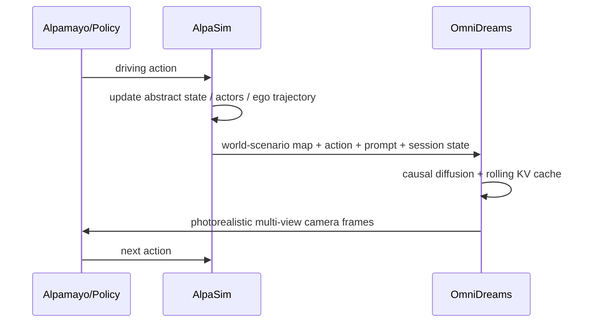

# OmniDreams 분석

## 한 문장 결론

OmniDreams는 자율주행 closed-loop 평가에서 reconstruction simulator의 한계를 넘어, policy action에 반응하는 **실시간 action-conditioned generative world model**을 시뮬레이터이자 WAM backbone으로 제시한다.

## 문제

자율주행 policy는 long-tail scenario에서 안전 검증이 필요하다. Open-loop dataset replay는 policy action이 future observation에 미치는 영향을 반영하지 못한다. Reconstruction-based simulator는 photorealistic하지만 기록된 scene의 범위를 벗어난 novel event와 dynamic interaction을 만들기 어렵다.

## 핵심 기여

1. **Cosmos 기반 AV world model**: Cosmos-Predict 2.5에서 출발해 21k hours driving data로 mid/post-training.
2. **Action/state-conditioned generation**: text prompt, abstract world-scenario map, history KV cache, driving action에 조건화.
3. **Closed-loop simulator integration**: Alpamayo 1 policy + AlpaSim + OmniDreams 루프 구현.
4. **Real-time multi-view inference**: 2B single-camera 68 FPS(GB300 1개), 4-camera 105 FPS(GB300 16개) 보고.
5. **WAM 가능성**: OmniDreams post-trained WAM이 Alpamayo 1.5 VLA 대비 더 적은 parameter로 collision metric 개선.

## Architecture / Pipeline

## Input / Output

| 항목 | 내용 |
|---|---|
| 입력 | first-frame RGB, text prompt, abstract world scenario, history KV cache, policy/user action |
| 출력 | next camera sensor frames, single-view or multi-view video |
| action grounding | policy action이 simulator state를 바꾸고, 그 state가 다음 observation generation에 반영됨 |
| closed-loop | policy → state update → generated sensor → policy 반복 |
| downstream | simulator, policy backbone(WAM), diffusion fixer |

## Training Recipe

- RDS 16,600h와 RDS-HQ-1M 4,944h 사용.
- HD map, lane/crosswalk/sign/traffic light, 3D object boxes를 world-scenario map으로 rendering.
- Qwen2.5-VL-7B caption으로 weather/lighting/traffic text prompt 생성.
- Cosmos-Predict 2.5에서 multi-view adaptation.
- world-scenario control branch를 zero-init 후 flow matching으로 학습.
- causal masking + Diffusion Forcing으로 autoregressive generation화.
- Self Forcing + DMD로 exposure bias와 long rollout drift를 줄임.

## Datasets / Benchmarks / Metrics

| 항목 | 요약 |
|---|---|
| RDS | 16,600h, 3M clips, 15 countries |
| RDS-HQ-1M | 4,944h, 1.14M clips |
| held-out eval | 5,000 clips, long-tail slice-balanced; 300 clips는 60s long-term consistency |
| closed-loop | AlpaSim + Alpamayo policy |
| WAM metric | collision total/front/lateral/rear 등 |

## Open-loop vs Closed-loop

OmniDreams의 핵심은 open-loop video quality가 아니라 closed-loop reactivity다. policy가 action을 바꾸면 simulator state가 바뀌고, generated observation이 이를 반영해야 한다. 이 조건을 만족해야 policy의 장기 roll-out failure를 평가할 수 있다.

## 강점

- photorealistic generation과 policy reactivity를 동시에 목표로 한다.
- world-scenario map으로 controllability를 유지한다.
- multi-view consistency를 attention factorization으로 해결하려 한다.
- WAM이 VLA보다 parameter-efficient할 수 있다는 강한 문제 제기를 한다.

## 한계 / 리스크

- NVIDIA GB300 다수 사용을 가정하는 real-time 수치는 일반 연구실 재현성이 낮다.
- generated simulator가 실제 rare event causal dynamics를 얼마나 정확히 반영하는지는 별도 검증이 필요하다.
- WAM vs VLA 비교는 preliminary result 성격이 강하다.
- world-scenario map과 HD map/3D detection annotation이 필요해 data pipeline이 무겁다.

## 왜 중요한가

찬호님의 자율주행/VLA study 관점에서 이 논문은 “VLA가 모든 것을 language reasoning으로 해결해야 하는가?”라는 질문을 던진다. OmniDreams는 driving에서는 language보다 world dynamics와 closed-loop simulator fidelity가 더 직접적인 병목일 수 있음을 보여준다.
