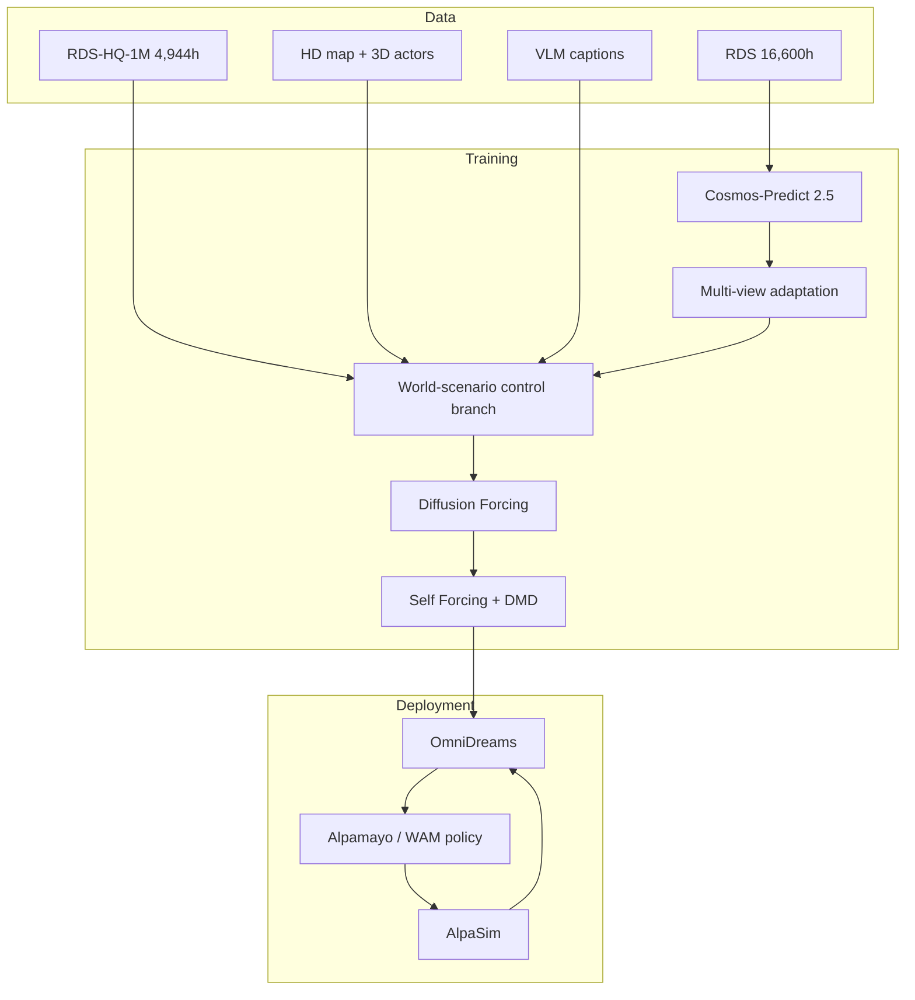

# OmniDreams 학습 자료

## 선수 지식

- 자율주행 closed-loop simulation
- neural rendering / generative video model
- diffusion model, flow matching, DiT
- KV cache와 autoregressive generation
- HD map, 3D bounding box, ego trajectory
- VLA vs WAM architecture 차이

## Glossary

| 용어 | 설명 |
|---|---|
| closed-loop simulation | policy action이 environment state를 바꾸고 다음 observation에 반영되는 평가 |
| world-scenario map | lane, traffic light, actor box, ego/action state를 rendering한 structured condition |
| WAM | World-Action Model; world dynamics representation과 action을 함께 다루는 policy model |
| rolling KV cache | 긴 rollout에서 최근 frame context만 유지해 계산량을 줄이는 cache |
| Diffusion Forcing | diffusion/video generation을 causal autoregressive하게 학습시키는 방법 |
| Self Forcing | inference self-rollout 조건을 training에 반영해 exposure bias를 줄이는 방법 |

## 핵심 개념 그림



## 단계별 이해

1. 실제 driving logs에서 synchronized multi-camera videos를 수집한다.
2. HD map과 3D detection/tracking으로 world-scenario map을 만든다.
3. VLM caption으로 weather/time/traffic text condition을 만든다.
4. Cosmos video generation backbone을 AV multi-view 영상에 적응시킨다.
5. world-scenario control branch를 붙여 simulator state/action에 반응하게 한다.
6. causal masking과 Diffusion Forcing으로 closed-loop autoregressive generation이 가능하게 한다.
7. Self Forcing으로 generated frame에 다시 조건화하는 train-test mismatch를 줄인다.
8. AlpaSim loop에 넣어 policy action → generated observation → next action을 반복한다.

## Key Equations / Representations

```text
p(x_1:T) = Π_i p(x_i | x_<i)
```

video latent sequence를 causal factorization하여 closed-loop rollout에서 과거 observation과 current state/action만 보게 한다.

```text
world condition = HD map + dynamic actor boxes + ego trajectory/action + text prompt
```

이 조건이 photorealistic generation과 controllable simulation을 연결한다.

## Implementation / Deployment Notes

- 실제 배포형 closed-loop simulator는 frame quality보다 **latency jitter**와 **state-action consistency**가 중요하다.
- world-scenario map이 부정확하면 generated observation이 그럴듯해도 policy evaluation은 왜곡된다.
- multi-view consistency는 AV에서 필수다. view별 독립 generation은 geometry mismatch를 만들 수 있다.
- WAM backbone은 language reasoning보다 dynamics-aware representation을 강조하므로 E2E AD policy에 유용할 수 있다.

## Study Questions

1. **왜 reconstruction simulator만으로 부족한가?**  
   log에 존재하는 scene 재현은 잘하지만 unseen weather, new actor behavior, policy-induced future를 생성하기 어렵다.

2. **왜 text prompt가 필요한가?**  
   geometry/action condition이 scene structure를 제어하고, text prompt는 weather/lighting/time 등 appearance factor를 제어한다.

3. **OmniDreams가 VLA 연구에 던지는 질문은?**  
   driving에서는 language reasoning보다 world dynamics prediction이 action quality에 더 직접적일 수 있다는 질문이다.

4. **closed-loop 평가에서 가장 위험한 실패는?**  
   generated observation은 사실적으로 보이지만 policy action과 물리적으로 일관되지 않는 경우다. 이 경우 policy가 잘못된 simulator를 exploit할 수 있다.

## Reading Roadmap

- 1차: Figure 1, Abstract, Introduction
- 2차: Data / world-scenario map construction
- 3차: Architecture / multi-view attention factorization
- 4차: Diffusion Forcing / Self Forcing
- 5차: closed-loop evaluation과 WAM vs VLA 비교
