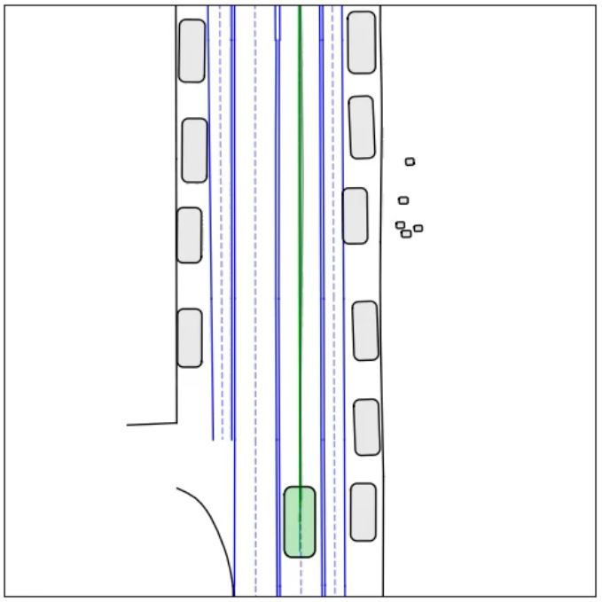
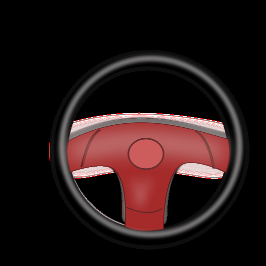
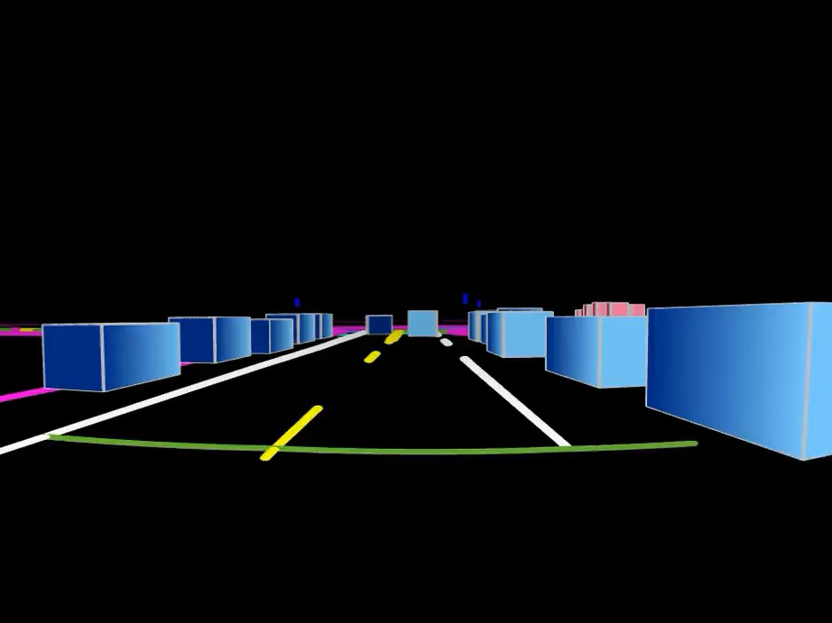
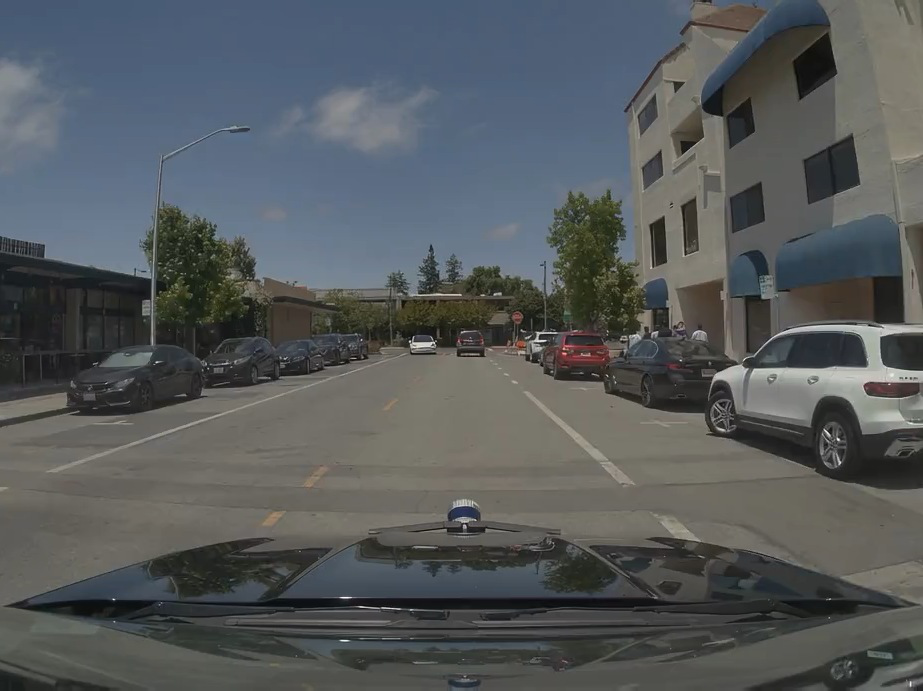
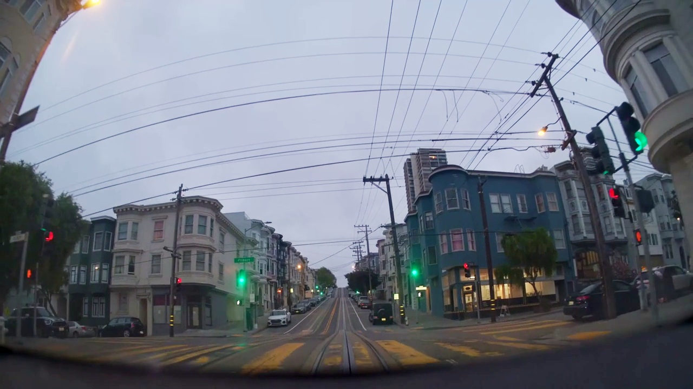
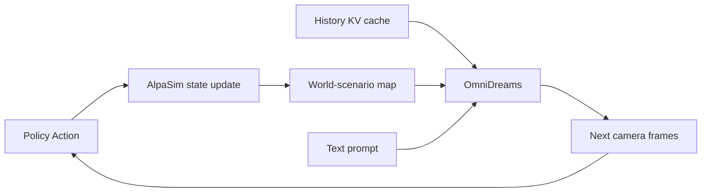

# NVIDIA OmniDreams: Closed-loop 자율주행 시뮬레이션을 위한 실시간 생성형 World Model

- 원제: **NVIDIA OmniDreams: Real-Time Generative World Model for Closed-Loop Autonomous Vehicle Simulation**
- 저자: NVIDIA; Aarti Basant; Amlan Kar; Despoina Paschalidou; Fangyin Wei; Sanja Fidler; et al.
- arXiv: [https://arxiv.org/abs/2606.03159](https://arxiv.org/abs/2606.03159) / HF: [https://huggingface.co/papers/2606.03159](https://huggingface.co/papers/2606.03159)
- 읽기 모드: arXiv HTML이 404라 PDF에서 텍스트를 추출했다. 한국어 기술 번역은 Abstract, Introduction, Data, Architecture, Training, Inference Optimization, Closed-loop Integration, WAM Post-training, Experiments, Related Work, Conclusion 중심이다. Contributor appendix와 긴 glossary는 요약만 반영했다.

## 추출한 그림
- 
- 
- 
- 
- 
- 

## Abstract 한국어 번역

자율주행(AV) 성능이 발전할수록 long-tail scenario에서 driving policy를 안전하게 평가하는 것이 중요한 병목이 된다. Closed-loop simulation에서는 policy model이 환경과 능동적으로 상호작용한다. policy의 action은 simulator state를 바꾸고, 바뀐 state는 다음 sensor observation 생성에 직접 영향을 준다.

최근 reconstruction-based neural simulator는 photorealism을 제공하지만, 초기 capture data에 묶여 있어 매우 dynamic하거나 novel한 scene으로 일반화하기 어렵다. OmniDreams는 Cosmos diffusion model에서 mid-training/post-training된 foundation generative world model로, action-conditioned video를 real time autoregressive하게 생성한다. Cosmos의 visual prior와 21k hours driving scenario 학습을 활용해 extreme weather, 예측 어려운 dynamic agent behavior 같은 기존 simulator가 포착하기 어려운 현상을 합성한다.

핵심은 OmniDreams가 past frames, current simulator state, immediate driving actions에 조건화하여 photorealistic sensor generation을 수행한다는 점이다. Alpamayo 1 policy model과 AlpaSim orchestrator로 구성된 closed-loop system에서 OmniDreams는 responsive/reactive environment로 작동한다. 또한 OmniDreams에서 post-trained된 World-Action Model(WAM)이 Physical AI Autonomous Vehicles NuRec dataset에서 VLA 기반 Alpamayo 1.5보다 적은 parameter(약 1/5)로 강한 성능을 보인다는 preliminary result를 제시한다.

## 1. Introduction 번역·정리

자율주행 policy를 실제 도로에 배포하기 전, safety-critical long-tail scenario에서 검증해야 한다. 하지만 open-loop evaluation은 policy action이 future state에 미치는 영향을 반영하지 못한다. Closed-loop evaluation에서는 policy가 action을 내고 simulator가 state를 업데이트하며, policy는 그 결과로 생성된 sensor observation을 다시 입력받는다. 이 루프가 있어야 작은 action error가 장기적으로 어떻게 누적되는지 확인할 수 있다.

기존 simulator의 한계는 두 가지다. Rule-based/graphics simulator는 controllability는 좋지만 realism이 부족할 수 있고, reconstruction-based neural simulator는 특정 log를 photorealistic하게 재현하지만 새로운 dynamic event, extreme weather, rare interaction에 약하다. OmniDreams는 생성형 world model을 closed-loop simulator로 사용해 이 둘 사이의 간극을 메우려 한다.

논문이 강조하는 design concept는 다음과 같다.

- autoregressive diffusion video generation 기반 simulator로 동작한다.
- Alpamayo 1 policy model과 AlpaSim orchestrator를 사용해 closed-loop를 구성한다.
- past generation의 KV cache를 다음 frame generation에 재사용하여 long rollout consistency를 얻는다.
- simulator state와 driving action에 조건화하여 sensor frame을 생성한다.
- 2B single-camera model은 GB300 1개에서 720p 68 FPS, 4-camera model은 GB300 16개에서 720p 105 FPS까지 보고된다.

## 2. Data 번역·정리

OmniDreams 학습에는 photorealistic하고 temporally consistent한 sensor observation을 structured scene representation, ego trajectory, textual environment description에 조건화해 생성할 수 있는 데이터가 필요하다.

### Data Sources

학습 데이터는 두 AV dataset을 사용한다.

| 데이터 | 규모 | 특징 |
|---|---:|---|
| RDS | 16,600 hours, 3M 20s clips | 7 synchronized camera, 15 countries, mid-training |
| RDS-HQ-1M | 4,944 hours, 1,142,285 clips | 10s/20s scene, 고품질 world-scenario annotation, post-training/finetuning |

영상은 1080p, 7 camera(front-wide, front-telescope, front-left/right, rear-left/right, rear-tele), 30 FPS로 수집된다. 학습은 주로 704×1280 resolution과 4 camera view를 사용한다.

### Conditioning Signal Extraction

OmniDreams는 세 입력에 조건화된다.

1. **world-scenario map**: HD map의 lane line, road boundary, stop line, pole, crosswalk, road marking, traffic light/sign, dynamic actor 3D box를 포함한다.
2. **text prompt**: weather, lighting, time-of-day, traffic, driving behavior를 설명한다. Qwen2.5-VL-7B로 10초 window마다 caption을 생성하고 short/medium/long caption을 섞어 학습한다.
3. **memory cache**: 최근 visual history를 KV cache로 유지한다.

### Curation

sensor jump, annotation uncertainty, prediction disagreement가 있는 sequence를 제거하고, VLM으로 chromatic aberration 같은 visual artifact를 탐지한다. ego trajectory와 visual feature 기반 deduplication도 수행한다. SIL-Wheel은 rare weather, construction zone, vulnerable road user, complex multi-agent interaction 같은 slice를 검색/구성/검수하는 workbench로 쓰인다.

## 3. Model Architecture 번역·정리

OmniDreams는 closed-loop interactivity를 위해 autoregressive generation을 수행한다. 각 time step에서 simulator가 최신 action으로 world state를 업데이트하고, 모델은 그 state에 조건화된 미래 frame의 짧은 sequence를 생성한다. 이는 긴 clip 전체를 bidirectional/diffusion sampling하는 offline video generator와 다르다.

### 입력

- First-frame RGB: simulation session 초기화용 clean latent token
- Text prompt: lighting/weather/time 등 high-level appearance control
- Abstract world scenario: lane/map/dynamic agents와 policy/user action이 반영된 simulator state
- Memory cache: 이전 generated token의 streaming KV cache

### Lightweight Control Branch

ControlNet처럼 별도 큰 network를 쓰지 않고, structured simulator state를 작은 MLP로 compact control token에 encoding한다. 이 token을 visual latent token과 concatenate하여 transformer에 입력한다. overhead를 줄이면서 scene structure 조건화를 가능하게 하는 설계다.

### Multi-view Generation

Naive multi-view full attention은 view 수 `N`, temporal length `T`에 대해 `O(N^2 T^2)`로 비싸다. OmniDreams는 attention을 factorize한다.

- temporal attention: 각 view 안에서 causal KV cache를 사용해 과거 frame에 attention
- cross-view attention: 같은 time step에서 view 간 shared geometry/object/motion 정렬

복잡도는 대략 `O(N T^2) + O(N^2)`로 줄어 real-time multi-view generation이 가능해진다.

## 4. Training 번역·정리

### World-Scenario Control and Multi-view Adaptation

Cosmos-Predict 2.5에서 출발해 view embedding을 추가하고, front-wide/cross-left/cross-right/front-telescope clips 혼합으로 multi-view video에 적응한다. 이후 cross-view attention layer를 추가하여 view 간 correspondence와 consistency를 학습한다.

World-scenario control branch는 zero-initialized 상태로 붙이고 flow-matching objective로 학습한다. 먼저 93-frame clip으로 수렴시킨 뒤 189-frame clip으로 확장해 longer-term consistency를 학습한다.

### Mid-training for Autoregressive Generation

bidirectional model을 causal model로 바꾸기 위해 Diffusion Forcing과 causal masking을 사용한다. full video distribution을 `p(x_1:T)=Π_i p(x_i|x_<i)` 형태로 factorize하고, 각 frame/latent block은 past observation과 current conditioning에만 의존한다. Flex-Attention으로 causal masking을 구현한다.

### Distillation / Self Forcing

teacher forcing은 inference 때 모델이 자기 output에 조건화해야 하는 상황과 mismatch가 생긴다(exposure bias). OmniDreams는 Self Forcing으로 self-rollout을 학습에 포함하고, Distribution Matching Distillation(DMD)로 generated video distribution을 real data manifold 쪽으로 맞춘다. Rolling KV cache는 long-video generation complexity를 줄이고 긴 rollout을 가능하게 한다.

## 5. Inference Optimization 번역·정리

논문은 training-free model optimization, multi-GPU inference, FlashDreams serving infrastructure를 통해 real-time requirement를 맞춘다. 핵심은 single/multi-view generation이 closed-loop policy 주기 안에 돌아야 한다는 점이다.

- single-camera 2B: 720p 68 FPS on one GB300
- 4-camera 2B: 720p 105 FPS on 16 GB300
- chunked generation과 prefetch/postfetch integration으로 AlpaSim loop와 연결

## 6. Closed-loop Integration 번역·정리

AlpaSim은 policy action을 받아 world state를 업데이트하고, 그 state를 OmniDreams가 이해할 수 있는 abstract conditioning으로 바꾼다. OmniDreams는 next camera observation을 생성하고 policy에 반환한다. Session-based state와 KV cache가 유지되어 frame-to-frame consistency를 확보한다.

이 구조는 단순 video generator가 아니라 **reactive environment model**이다. policy가 갑자기 braking/steering을 바꾸면 다음 generated observation이 그 action을 반영해야 한다.

## 7. OmniDreams as WAM 번역·정리

논문은 OmniDreams representation을 policy architecture의 backbone으로도 사용할 수 있다고 주장한다. Post-trained WAM은 PAI AV NuRec dataset에서 collision을 6.9% → 4.2%로 줄였고, collision_front 1.0% → 0.9%, collision_lateral 0.6% → 0.4%, collision_rear 5.3% → 3.0%로 개선했다고 보고한다. 또한 약 2B parameter로 VLA 기반 Alpamayo 1.5(약 10B)의 1/5 규모다.

이는 자율주행에서 “language-heavy VLA”보다 “world dynamics + action-conditioned generation”을 중심으로 한 WAM이 더 효율적인 backbone일 수 있음을 시사한다.

## 8. Experiments / Results 번역·정리

평가는 simulation quality, long-term consistency, controllable scenario editing, OOD object modeling, closed-loop evaluation을 포함한다. 특히 closed-loop evaluation은 reconstruction-based NuRec simulator와 비교해 long-tail scenario에서 policy behavior와 collision rate를 본다.

핵심 결과는 세 가지다.

1. generative world model이 reconstruction-only simulator보다 novel/dynamic scenario를 더 잘 다룰 수 있다.
2. real-time FPS가 closed-loop policy evaluation에 충분한 수준으로 제시된다.
3. WAM으로 post-training했을 때 VLA 대비 parameter 효율과 collision metric 개선 가능성을 보인다.

## 9. Related Work 번역·정리

관련 연구는 reconstruction-based world model, video model simulator, diffusion forcing/self-forcing, closed-loop AV simulation infra로 나뉜다. OmniDreams의 차별점은 photorealistic generation 자체가 아니라 **action-conditioned**, **state-conditioned**, **real-time**, **closed-loop**라는 네 조건을 동시에 목표로 한다는 점이다.

## 10. Conclusion 번역

OmniDreams는 Cosmos 기반 generative world model을 자율주행 closed-loop simulation으로 확장한다. 과거 frame KV cache, simulator state, driving action, text prompt에 조건화하여 real-time camera observation을 생성하고, AlpaSim 및 Alpamayo policy와 연결해 interactive environment로 작동한다. 더 나아가 WAM backbone으로도 가능성을 보여주며, 자율주행 policy 평가/학습에서 world model이 VLA와 경쟁하거나 보완할 수 있음을 제시한다.

## 미번역/제약

arXiv HTML이 제공되지 않아 PDF 텍스트 추출 기반으로 번역했다. PDF 내 모든 appendix, contributor list, glossary 전문은 생략하고 본문 기술 섹션 중심으로 정리했다. Figure는 PyMuPDF로 일부 image object를 추출했으며, 원문 caption과 완벽히 1:1 매칭되지 않을 수 있다.
